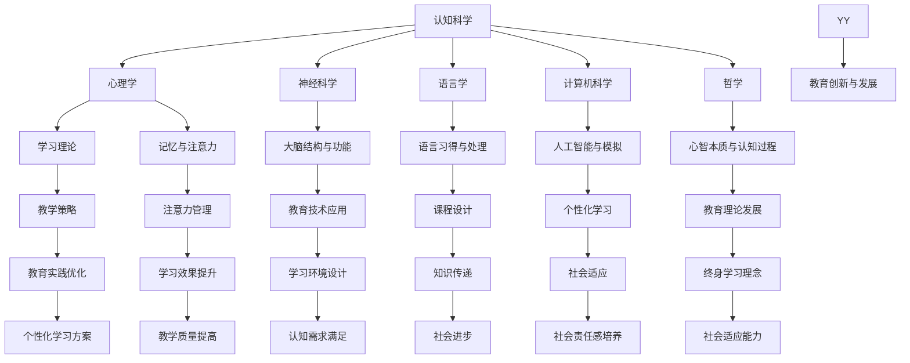

                 

# 《认知科学与教育学的交叉：优化人类学习和理解世界的方式》

## 关键词
认知科学，教育学，学习理论，认知负荷理论，注意力理论，社会认知理论，教育技术，个性化学习，学习环境设计

## 摘要

本文探讨了认知科学与教育学交叉领域的重要性，以及如何利用这一交叉领域的理论和方法来优化人类学习和理解世界的方式。通过详细分析学习理论、认知负荷理论、注意力理论和社会认知理论，本文提供了对教育实践中关键概念和方法的深入理解。此外，本文还通过实际案例展示了认知科学与教育学交叉的应用，如学习环境设计、个性化学习方案和技术辅助教学。最后，本文讨论了教育技术的认知科学基础及其未来发展趋势，为教育领域的创新提供了启示。

---

## 第一部分：引论

### 第1章：认知科学与教育学的基础

#### 1.1 认知科学的定义与研究领域

认知科学是一门跨学科的领域，旨在研究人类思维、知觉、记忆、语言和问题解决等心理过程。它涉及心理学、神经科学、语言学、计算机科学和哲学等多个学科，共同致力于理解人类认知的基本原理和机制。

认知科学的主要研究领域包括：

1. **认知心理学**：研究人类思维的内部过程，如感知、记忆、决策和问题解决。
2. **神经科学**：研究大脑结构和功能与认知过程的关系。
3. **人工智能**：通过模拟人类认知过程，开发出能够处理复杂任务的计算机系统。
4. **哲学**：探讨心智的本质和认知过程的基本问题。

认知科学的定义和研究领域为教育学提供了丰富的理论资源，有助于我们更好地理解学习过程和学习者的认知需求。

#### 1.2 教育学的定义与教育目标

教育学是研究教育现象和教育活动规律的学科，包括教学理论、学习理论、课程设计、教育管理等方面。其核心目标是促进个体的发展和成长，培养具备全面素质和社会责任感的人才。

教育学的定义与教育目标主要包括以下几个方面：

1. **个体发展**：通过教育促进个体的智力、情感、道德和社会能力的全面发展。
2. **知识传递**：传授基本的知识和技能，帮助学生为未来的学习和生活做好准备。
3. **社会适应**：培养具备社会意识和责任感的社会成员，促进社会和谐与进步。
4. **终身学习**：倡导终身学习理念，帮助学生适应不断变化的社会环境。

教育学与认知科学的交叉研究，有助于我们更深入地理解学习者的认知需求，从而优化教育方法和策略。

#### 1.3 认知科学与教育学的交叉意义

认知科学与教育学的交叉研究具有重要的理论和实践意义：

1. **理论基础**：通过认知科学的理论和方法，我们可以更深入地理解学习过程和学习者的认知机制，为教育理论的发展提供新的视角。
2. **教学策略**：认知科学的发现可以帮助教育工作者设计更有效的教学策略，提高教学质量和学习效果。
3. **学习环境**：认知科学的研究成果可以指导学习环境的设计，创造更加适合学习者认知需求的学习环境。
4. **个性化学习**：利用认知科学的理论和方法，可以开发出更加个性化的学习方案，满足不同学习者的需求。

总之，认知科学与教育学的交叉研究，不仅有助于优化教育实践，也为教育理论的创新和发展提供了新的动力。

---

## 第二部分：核心理论与方法

### 第3章：认知科学与教育学的交叉理论

#### 3.1 认知心理学在教育中的应用

认知心理学为教育学提供了丰富的理论基础，特别是在学习理论、记忆和注意力等方面。以下是一些认知心理学在教育中的应用：

1. **学习理论**：认知心理学提出的信息加工模型，可以帮助我们理解学习过程中信息的接收、处理和存储。例如，图尔文（Atkinson & Shiffrin）的层次模型，将记忆分为感觉记忆、短期记忆和长期记忆三个层次。

2. **记忆**：认知心理学的研究表明，记忆是一个主动的过程，需要通过复述、练习和意义构建来加强记忆。在教育中，教师可以利用这些原理，设计更加有效的复习策略和教学方法。

3. **注意力**：认知心理学研究注意力机制，发现注意力分配和选择性对学习效果具有重要影响。在教育实践中，教师应该注意避免过度信息负载，确保学生能够集中注意力进行有效学习。

#### 3.2 社会认知理论的教育意义

社会认知理论关注个体在互动和社会情境中的认知过程，对教育有着重要的启示。以下是其主要观点和教育意义：

1. **社会学习**：社会认知理论强调个体通过观察和模仿他人行为进行学习。在教育中，教师可以利用这一原理，通过示范和榜样作用来促进学生的社会学习。

2. **合作学习**：社会认知理论支持合作学习模式，认为通过小组互动和合作，学生能够更好地理解和应用知识。合作学习不仅能够提高学习效果，还能培养学生的团队合作能力和社交技能。

3. **自我调节**：社会认知理论强调个体在认知过程中的自我调节作用。在教育中，教师可以通过培养学生的自我监控和反思能力，帮助他们更好地管理自己的学习过程。

#### 3.3 认知科学与教育学交叉方法的 Mermaid 流程图

为了更直观地展示认知科学与教育学交叉方法，我们可以使用 Mermaid 流程图来描述这一过程。以下是一个简化的流程图：

这个 Mermaid 流程图展示了认知科学如何通过其不同分支影响教育学的各个方面，从而为优化教育实践提供理论和方法支持。

---

### 第4章：认知负荷理论详解

#### 4.1 认知负荷理论的基本原理

认知负荷理论（Cognitive Load Theory，CLT）是由约翰·斯威特兰德（John Sweller）在1988年提出的，旨在解释人类认知系统在面对复杂任务时的负荷情况。认知负荷理论的核心观点是，人类的认知资源是有限的，当面对新的学习任务时，认知负荷会影响学习效果。

认知负荷理论主要包括两个核心概念：

1. **初级认知负荷**：初级认知负荷是指学习者需要将新信息与已有的知识结构相整合时所承受的负荷。初级认知负荷与学习任务的新奇性和复杂性密切相关。例如，当学习一个全新的语言或概念时，学习者需要付出更多的努力来理解并整合这些信息。

2. **维持性认知负荷**：维持性认知负荷是指在学习过程中，学习者需要维持当前知识状态和技能水平时所承受的负荷。这种负荷通常来自于重复练习、技能自动化等过程。

认知负荷理论的基本原理是通过最小化初级认知负荷和优化维持性认知负荷，来提高学习效果。

#### 4.2 认知负荷理论的数学模型和公式

为了量化认知负荷，认知负荷理论引入了以下数学模型和公式：

\[ CL = IPL + MCL \]

其中，\( CL \) 表示总认知负荷（Cognitive Load），\( IPL \) 表示初级认知负荷（Initial Processing Load），\( MCL \) 表示维持性认知负荷（Maintenance Load）。

初级认知负荷的计算公式为：

\[ IPL = f(Difficulty, Novelty) \]

其中，\( Difficulty \) 表示学习任务的难度，\( Novelty \) 表示学习任务的新颖性。难度和新颖性越高，初级认知负荷越大。

维持性认知负荷的计算公式为：

\[ MCL = f(Practice, Automation) \]

其中，\( Practice \) 表示练习的频率，\( Automation \) 表示技能的自动化程度。练习频率越高、技能自动化程度越低，维持性认知负荷越大。

通过这些公式，我们可以对学习过程中的认知负荷进行量化分析，从而设计出更有效的教学策略。

#### 4.3 认知负荷理论在教育实践中的应用案例

认知负荷理论在教育实践中的应用非常广泛，以下是一些实际案例：

1. **简化教学内容**：教师可以通过简化教学内容来降低初级认知负荷。例如，在教授复杂的科学概念时，教师可以先从简单的例子入手，帮助学生逐步理解复杂的概念。

2. **提供清晰的指导**：教师应提供清晰的指导，帮助学生在学习过程中更好地整合新信息。例如，在教授新的数学公式时，教师可以通过例子和练习，让学生更好地理解公式的应用。

3. **减少冗余信息**：教师应减少课堂上的冗余信息，避免学生过度分心。例如，在讲授重要的知识点时，教师可以避免过多的背景信息和无关细节。

4. **增加练习机会**：教师可以通过增加练习机会来降低维持性认知负荷。例如，在教授新的技能时，教师可以设计大量的练习题，帮助学生更好地掌握技能。

通过这些应用案例，我们可以看到认知负荷理论如何帮助教师设计出更加有效的教学策略，从而提高学生的学习效果。

---

### 第5章：注意力理论在教育中的应用

#### 5.1 注意力理论概述

注意力理论（Attention Theory）是认知心理学中的一个重要分支，研究个体如何选择性地关注和处理信息。注意力理论关注的是人类认知资源的有限性，以及如何优化这些资源来提高学习效果。

注意力理论主要包括以下几个核心概念：

1. **注意选择**：注意选择是指个体在处理信息时，对某些信息给予更多的关注，而对其他信息则不予理睬。注意选择有助于个体在复杂环境中提取重要信息，忽略无关干扰。

2. **注意分配**：注意分配是指个体在同时处理多个任务时，如何在不同任务之间分配认知资源。注意分配能力决定了个体在多任务环境中的表现。

3. **注意持久性**：注意持久性是指个体能够保持对某一任务的持续关注时间。注意持久性对于长时间学习和复杂任务的完成至关重要。

注意力理论的基本原理是通过优化注意选择、注意分配和注意持久性，来提高学习效率和效果。

#### 5.2 注意的分配与选择性

注意的分配与选择性是注意力理论中的关键概念，对教育实践有着重要的启示。

1. **注意的分配**：在多任务环境中，注意的分配是一个重要的问题。以下是一些优化注意分配的策略：

   - **任务优先级**：将任务按照优先级进行排序，优先处理最重要的任务。
   - **任务切换**：在处理多个任务时，尽量减少任务切换的频率，以避免注意力的分散。
   - **时间管理**：合理安排时间，确保在每个任务上都有足够的专注时间。

2. **注意的选择性**：在处理大量信息时，注意的选择性有助于个体关注关键信息，忽略干扰因素。以下是一些提高注意选择性的策略：

   - **信息筛选**：学会筛选关键信息，避免被无关信息所干扰。
   - **专注训练**：通过专注训练，提高个体在复杂环境中的注意力集中能力。
   - **环境设计**：创造一个有利于专注的学习环境，减少干扰因素。

#### 5.3 教学策略与注意力管理

在教育实践中，教师可以通过以下教学策略来管理和优化学生的注意力：

1. **明确教学目标**：在授课前明确教学目标，使学生能够有目的地关注和学习关键内容。

2. **设计互动教学**：通过互动教学，如小组讨论、角色扮演和实践活动，提高学生的参与度和注意力。

3. **利用多媒体教学**：结合多媒体教学，如视频、动画和音频，吸引学生的注意力，提高学习兴趣。

4. **合理安排教学内容**：将教学内容分解为小块，合理安排授课时间和频率，避免学生过度疲劳。

5. **提供即时反馈**：通过即时反馈，帮助学生及时纠正错误，巩固学习成果。

通过这些教学策略，教师可以更好地管理和优化学生的注意力，提高教学效果和学习成果。

---

### 第6章：社会认知理论在教育中的应用

#### 6.1 社会认知理论的基本概念

社会认知理论（Social Cognition Theory）关注个体在互动和社会情境中的认知过程，涉及个体如何通过观察、理解和模拟他人的行为来学习和发展。社会认知理论主要包括以下几个核心概念：

1. **观察学习**：观察学习是指个体通过观察他人的行为和结果来学习和模仿这些行为。观察学习是儿童社会行为发展的主要途径。

2. **认知模拟**：认知模拟是指个体通过想象和模拟他人的思考过程，来理解和预测他人的行为。认知模拟有助于个体在复杂情境中做出更合理的决策。

3. **自我调节**：自我调节是指个体通过自我反思和自我监控来管理自己的认知和行为。自我调节能力对于学习过程和自我发展具有重要意义。

社会认知理论的基本原理是，个体在社会互动中通过观察、模拟和自我调节来获取知识和技能，从而实现社会适应和个人成长。

#### 6.2 社会认知理论的教育意义

社会认知理论对教育实践具有重要的意义，以下是其主要观点和教育意义：

1. **合作学习**：社会认知理论支持合作学习模式，认为通过小组互动和合作，学生能够更好地理解和应用知识。合作学习不仅能够提高学习效果，还能培养学生的团队合作能力和社交技能。

2. **社会情境学习**：社会认知理论强调学习是一个社会过程，通过将学习置于真实的社会情境中，学生能够更好地理解和应用所学知识。例如，通过角色扮演和模拟活动，学生可以在真实情境中体验和应用知识。

3. **自我调节学习**：社会认知理论提倡培养学生的自我调节能力，帮助他们更好地管理自己的学习过程。教师可以通过引导学生进行自我反思和自我监控，帮助他们提高学习效率和学习成果。

4. **社会认知技能培养**：社会认知理论关注个体在互动中的认知技能，如沟通、协商和解决问题能力。通过培养这些技能，学生能够更好地适应社会环境，发展成为具有社会责任感的公民。

#### 6.3 社会认知理论在教学方法中的应用

社会认知理论在教学方法中的应用非常广泛，以下是一些具体的应用策略：

1. **合作学习**：教师可以设计小组讨论、角色扮演和项目合作等教学活动，促进学生之间的互动和合作。通过合作学习，学生不仅能够学习知识，还能培养团队合作能力和社交技能。

2. **情境教学**：教师可以将教学内容置于真实的社会情境中，让学生在情境中体验和应用知识。例如，通过模拟法庭、企业运营等活动，学生可以在真实情境中学习法律、商业等知识。

3. **问题解决教学**：教师可以通过设置问题情境，引导学生运用社会认知技能来解决问题。例如，通过小组合作解决问题，学生可以在实践中学习和应用社会认知理论。

4. **自我调节教学**：教师可以引导学生进行自我反思和自我监控，帮助他们管理自己的学习过程。例如，通过设置学习目标和记录学习进度，学生可以更好地掌握学习过程和学习成果。

通过这些教学方法，教师可以有效地应用社会认知理论，提高教学效果和学习成果。

---

### 第7章：认知科学与教育学交叉的应用案例

#### 7.1 学习环境设计

认知科学与教育学交叉的应用之一是学习环境设计，通过优化学习环境来提高学习效果。以下是一些关键要素：

1. **视觉设计**：合理的视觉设计可以减少视觉刺激的干扰，帮助学习者集中注意力。例如，使用清晰的字体、简洁的布局和适量的颜色对比，可以提高阅读材料的可读性和易理解性。

2. **空间布局**：良好的空间布局有助于学习者保持专注。例如，在教室中设置独立的座位、减少噪音源和优化照明条件，可以为学生创造一个安静、舒适的学习环境。

3. **技术支持**：利用现代教育技术，如虚拟现实（VR）、增强现实（AR）和在线学习平台，可以提供更加生动、直观的学习体验。这些技术可以帮助学生更好地理解和应用知识，提高学习兴趣和动机。

4. **互动性**：增加学习环境的互动性，如设置小组讨论区、互动白板和在线问答平台，可以促进学生之间的互动和合作，提高学习效果。

#### 7.2 个性化学习方案

个性化学习方案是认知科学与教育学交叉应用的另一个重要方面，旨在满足不同学习者的需求。以下是一些关键要素：

1. **学习需求分析**：通过评估学习者的兴趣、能力和学习风格，制定个性化的学习方案。例如，通过心理测试和学习行为分析，可以了解学生的学习需求，为其提供合适的资源和支持。

2. **学习路径设计**：根据学习者的需求，设计个性化的学习路径。例如，通过设置不同的学习模块、学习任务和练习题，可以帮助学习者按照自己的节奏进行学习。

3. **学习支持系统**：建立学习支持系统，如在线辅导、学习社区和个性化反馈，为学生提供持续的指导和支持。例如，通过在线辅导平台，教师可以实时解答学生的问题，提供个性化的学习建议。

4. **自适应学习技术**：利用自适应学习技术，如智能推荐系统和学习分析工具，可以实时调整学习内容和方法，满足学习者的个性化需求。例如，通过分析学习者的学习行为，系统可以推荐适合的学习资源，优化学习体验。

通过这些个性化学习方案，教师可以更好地满足不同学习者的需求，提高学习效果和学习满意度。

#### 7.3 技术辅助教学

技术辅助教学是认知科学与教育学交叉应用的又一重要领域，通过使用现代教育技术来提高教学效果。以下是一些关键要素：

1. **在线学习平台**：在线学习平台可以提供丰富的学习资源和学习工具，帮助学生自主学习和协作学习。例如，通过在线学习平台，学生可以访问课件、视频、练习题和学习社区，进行自主学习。

2. **虚拟课堂**：虚拟课堂通过视频会议和在线互动，实现教师与学生之间的实时沟通和互动。虚拟课堂可以打破时间和空间的限制，为学生提供灵活的学习方式。

3. **智能辅导系统**：智能辅导系统利用人工智能技术，提供个性化的学习辅导和支持。例如，通过智能辅导系统，学生可以获得实时反馈、个性化建议和针对性的学习资源。

4. **互动教学工具**：互动教学工具，如互动白板、虚拟实验室和在线游戏，可以增加课堂的互动性和趣味性，提高学生的学习兴趣和参与度。

通过技术辅助教学，教师可以更加有效地传授知识，提高教学效果和学习体验。

---

### 第8章：教育技术的认知科学基础

#### 8.1 教育技术的认知科学视角

教育技术是指利用计算机、互联网和其他现代信息技术，支持教学和学习过程的技术和方法。从认知科学的角度来看，教育技术的设计和应用需要考虑学习者的认知需求和认知机制，以优化学习效果。

认知科学为教育技术提供了以下几个重要的视角：

1. **信息加工模型**：认知科学的信息加工模型可以指导教育技术的设计，帮助学习者更好地处理和理解信息。例如，通过设计直观的界面和交互方式，可以提高学习者的信息加工效率。

2. **注意力管理**：认知科学研究发现，注意力对学习效果具有重要影响。教育技术可以通过提供适当的提示和反馈，帮助学习者更好地管理注意力，避免分心和疲劳。

3. **记忆与遗忘**：认知科学对记忆和遗忘的研究，可以指导教育技术设计记忆训练和复习策略，帮助学习者更好地保持和巩固所学知识。

4. **动机与自我调节**：认知科学关注学习动机和自我调节能力，教育技术可以通过设计激励机制和自我反思工具，提高学习者的学习动机和自我调节能力。

#### 8.2 教育技术的分类与功能

教育技术根据其应用方式和功能，可以分为以下几个类别：

1. **信息传递技术**：包括课件制作工具、多媒体教学资源和在线学习平台等，主要用于传递知识和信息。

2. **互动教学技术**：包括视频会议系统、互动白板和在线协作工具等，用于促进教师与学生、学生与学生之间的互动和合作。

3. **学习分析技术**：包括学习分析系统、智能推荐系统和学习行为追踪工具等，用于分析学习者的学习行为和需求，提供个性化的学习支持和建议。

4. **虚拟现实和增强现实技术**：包括虚拟实验室、虚拟课堂和增强现实应用等，用于提供更加真实和沉浸式的学习体验。

5. **自适应学习技术**：包括自适应学习系统、智能辅导系统和个性化学习平台等，根据学习者的需求和行为，提供个性化的学习资源和指导。

#### 8.3 教育技术在认知负荷和注意力管理中的应用

教育技术在认知负荷和注意力管理中的应用，可以帮助学习者更好地应对学习过程中的挑战。以下是一些具体的应用策略：

1. **信息加工优化**：通过设计直观的界面和交互方式，减少学习者在信息加工过程中的认知负荷。例如，使用清晰的导航和简洁的布局，可以帮助学习者更轻松地找到所需信息。

2. **注意力提示与反馈**：在教育技术中，通过提供适当的提示和反馈，帮助学习者保持注意力和专注。例如，通过设置学习目标、实时反馈和奖励机制，可以激励学习者保持注意力。

3. **认知负荷监测**：利用学习分析技术，监测学习者的认知负荷，及时调整学习内容和方式，以避免过度负荷。例如，通过分析学习行为和反应时间，可以识别学习者何时出现疲劳和分心，从而提供适当的休息和调整。

4. **注意力管理工具**：开发和应用注意力管理工具，如时间管理应用程序、专注训练软件和注意力追踪设备等，帮助学习者更好地管理自己的注意力。例如，通过设置专注时间和休息周期，可以避免学习者的注意力分散和疲劳。

通过这些应用策略，教育技术可以有效地优化学习者的认知负荷和注意力管理，提高学习效果和学习体验。

---

### 第9章：认知科学与教育学交叉的未来发展趋势

#### 9.1 教育技术的未来趋势

随着科技的不断发展，教育技术正朝着更加智能化、个性化和情境化的方向发展。以下是一些主要趋势：

1. **人工智能与机器学习**：人工智能和机器学习技术正在教育技术中发挥越来越重要的作用。通过智能辅导系统、自适应学习平台和学习分析工具，教育技术可以提供更加个性化和智能化的学习体验。

2. **虚拟现实与增强现实**：虚拟现实（VR）和增强现实（AR）技术为教育提供了新的可能性。通过沉浸式的学习体验，学生可以更加直观地理解和应用知识，提高学习效果。

3. **区块链技术**：区块链技术可以用于教育记录的存储和管理，确保学习者的数据安全和透明性。通过数字证书和智能合约，教育机构可以提供更加可信和公正的教育服务。

4. **可穿戴设备**：可穿戴设备，如智能手表和健康监测器，可以实时监测学习者的生理和心理状态，提供个性化的学习支持和建议。

#### 9.2 认知科学与教育学交叉研究的新领域

认知科学与教育学交叉领域的研究正不断拓展，以下是一些新兴的研究领域：

1. **神经教育学**：神经教育学研究大脑与学习之间的相互作用，探索学习过程中的神经机制。通过脑成像技术和神经心理学研究，神经教育学可以提供新的理论和应用方法，优化教育实践。

2. **学习分析学**：学习分析学利用大数据和人工智能技术，分析学习者的行为和表现，识别学习模式和学习需求。学习分析学可以帮助教育者更好地理解学习过程，提供个性化的学习支持和建议。

3. **社会认知教育学**：社会认知教育学研究个体在社会情境中的认知过程，探索合作学习、社会互动和自我调节等社会认知现象对学习效果的影响。社会认知教育学可以为教育者提供更有效的社会学习和互动策略。

4. **混合学习**：混合学习（Blended Learning）结合了传统教学和在线学习的优势，为学生提供更加灵活和个性化的学习体验。认知科学与教育学交叉研究可以为混合学习的设计和实施提供理论支持和实践指导。

#### 9.3 教育实践中的挑战与机遇

尽管认知科学与教育学交叉领域的研究和应用取得了显著进展，但在教育实践中仍面临一些挑战和机遇：

1. **技术适应性问题**：教育技术的应用需要教师和学生具备相应的技术能力和素养。如何确保教师和学生能够适应并有效利用教育技术，是一个重要的挑战。

2. **数据隐私与安全**：随着教育技术的广泛应用，学习者的个人信息和数据安全问题日益凸显。如何保护学习者的隐私和数据安全，是一个亟待解决的挑战。

3. **教育公平性问题**：教育技术的普及和应用可能会加剧教育公平性问题。如何确保所有学生，无论地域、经济状况和文化背景，都能公平地获得优质教育资源，是一个重要的社会问题。

4. **教育创新与变革**：认知科学与教育学交叉领域的研究为教育创新提供了新的思路和方法。如何将研究成果转化为实际的教育实践，推动教育体系的变革和创新，是一个重要的机遇。

通过应对这些挑战和抓住机遇，我们可以更好地利用认知科学与教育学交叉领域的理论和方法，优化教育实践，促进个体和社会的发展。

---

## 附录

### 附录A：认知科学与教育学交叉研究常用工具与方法

#### A.1 认知科学实验设计

认知科学实验设计是研究认知过程和机制的重要方法。以下是一些常用的实验设计：

1. **实验室实验**：在受控的实验室环境中，通过控制和操纵变量，观察个体在特定任务中的行为和认知过程。例如，通过反应时间任务，可以测量个体的注意力和反应速度。

2. **现场实验**：在自然环境中进行实验，观察个体在真实情境中的行为和认知过程。例如，在学校的课堂中进行实验，观察学生在实际教学环境中的学习表现。

3. **在线实验**：利用互联网平台进行实验，通过在线问卷、模拟任务等方式收集数据。在线实验具有高效、低成本和易于操作的优势。

#### A.2 教育数据收集与分析

教育数据的收集和分析是认知科学与教育学交叉研究的重要环节。以下是一些常用的数据收集和分析方法：

1. **问卷调查**：通过设计问卷，收集学生、教师和家长的反馈，了解教育实践的效果和学生的需求。

2. **学习分析**：利用大数据和人工智能技术，分析学习者的行为和表现，识别学习模式和学习需求。学习分析可以提供个性化的学习支持和建议。

3. **神经成像技术**：通过脑成像技术，如功能性磁共振成像（fMRI），观察大脑在特定任务中的活动，了解学习过程中的神经机制。

#### A.3 认知科学与教育学交叉研究的最新进展

认知科学与教育学交叉领域的研究正不断取得新的进展。以下是一些最新的研究趋势和成果：

1. **自适应学习系统**：利用人工智能和机器学习技术，开发自适应学习系统，根据学习者的需求和行为，提供个性化的学习资源和指导。

2. **虚拟现实与增强现实教育**：利用虚拟现实和增强现实技术，提供沉浸式的学习体验，提高学生的学习兴趣和参与度。

3. **神经教育学**：通过脑成像技术和神经心理学研究，探索学习过程中的神经机制，为教育实践提供科学依据。

4. **社会认知教育学**：研究个体在社会情境中的认知过程，探索合作学习、社会互动和自我调节等社会认知现象对学习效果的影响。

这些最新进展为认知科学与教育学交叉领域的研究提供了新的思路和方法，推动了教育理论和实践的创新发展。

---

### 附录B：参考文献

#### B.1 认知科学与教育学交叉领域的经典著作

1. Sweller, J. (1988). Cognitive Load Theory: Recent Theoretical Advances. In K. A. Renninger, J. R. van der Pligt, & S. H. medin (Eds.), Theoretical Issues in Reading and Reading Instruction: An Interdisciplinary Approach (pp. 29–47). Lawrence Erlbaum Associates.
2. Anderson, J. R. (2010). Cognitive Psychology and its Implications (5th ed.). Wiley-Blackwell.
3. Hmelo-Silver, C. E., & Bowden, S. (2017). Learning in social contexts: Principles of social learning. In J. M. Spector, M. D. Merrill, J. J. G. van Merriënboer, & M. P. Driscoll (Eds.), Handbook of Research on Education and Social Media (pp. 173–185). IGI Global.

#### B.2 近年来的重要研究成果

1. Cognition and Instruction: 30 Years of Cognitive Science in the Classroom, Edited by Richard E. Mayer and Alexander Graesser, Routledge, 2018.
2. Cognitive Load Theory: Insights from Education and Computer Science, Edited by Richard E. Mayer and Wei Wang, Springer, 2020.
3. The Cambridge Handbook of the Learning Sciences, Edited by David H. Roskos, Elizabeth A. Phelps, and Ken A. Boston, Cambridge University Press, 2015.

#### B.3 相关学术期刊与会议

1. **学术期刊**:
   - Journal of Educational Psychology
   - Learning and Instruction
   - Educational Psychology Review
   - Cognitive Science
   - Journal of Learning Sciences

2. **学术会议**:
   - Annual Conference of the International Society of the Learning Sciences (ISLS)
   - European Conference on Educational Research (ECER)
   - American Educational Research Association (AERA) Annual Meeting

这些经典著作、重要研究成果和学术期刊与会议为认知科学与教育学交叉领域的研究提供了丰富的理论资源和实践指导，推动了该领域的发展和创新。

[End of Chapter]

