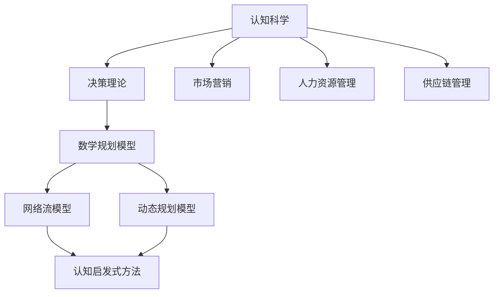

                 

# 《认知科学在商业中的应用：决策优化》

## 关键词
认知科学、商业决策、决策优化、市场营销、人力资源管理、供应链管理、认知启发式方法、机器学习

## 摘要
本文将深入探讨认知科学在商业决策中的应用，重点关注决策优化这一核心议题。通过分析认知科学的基础理论和决策过程中的认知偏见，本文介绍了传统决策理论与模型，以及基于认知科学的决策优化方法。文章还通过具体案例研究，展示了这些理论和方法在实际商业决策中的应用，并提出了未来研究与实践的展望。

### 目录大纲

# 《认知科学在商业中的应用：决策优化》

## 第一部分：认知科学与决策

### 第1章：认知科学基础

#### 1.1 认知科学概述

#### 1.2 认知过程与决策

#### 1.3 认知偏见与决策

### 第2章：决策理论与模型

#### 2.1 决策理论的框架

#### 2.2 决策模型的基本形式

#### 2.3 多目标决策分析

### 第3章：认知科学在商业决策中的应用

#### 3.1 认知决策在市场营销中的应用

#### 3.2 认知决策在人力资源管理中的应用

#### 3.3 认知决策在供应链管理中的应用

## 第二部分：决策优化方法

### 第4章：传统决策优化方法

#### 4.1 数学规划模型

#### 4.2 网络流模型

#### 4.3 动态规划模型

### 第5章：基于认知科学的决策优化

#### 5.1 认知启发式方法

#### 5.2 机器学习在决策优化中的应用

#### 5.3 认知建模与决策优化

### 第6章：案例研究

#### 6.1 案例一：消费者行为分析

#### 6.2 案例二：人力资源决策优化

#### 6.3 案例三：供应链管理决策优化

## 第三部分：实践与展望

### 第7章：认知科学在商业决策中的未来趋势

#### 7.1 新兴技术的应用前景

#### 7.2 企业决策实践的变革

#### 7.3 国际化背景下的认知决策优化

### 第8章：总结与展望

#### 8.1 主要研究成果总结

#### 8.2 研究局限与未来方向

## 附录

### 附录A：相关数学模型与公式

### 附录B：参考书目与文献

### 附录C：案例研究数据来源与处理方法

### Mermaid 流程图

mermaid
graph TD
A[认知科学] --> B[决策理论]
B --> C[数学规划模型]
C --> D[网络流模型]
C --> E[动态规划模型]
D --> F[认知启发式方法]
E --> F
A --> G[市场营销]
A --> H[人力资源管理]
A --> I[供应链管理]


### 伪代码

python
# 决策优化伪代码
def decision_optimization(problem, algorithm):
    # 初始化
    solution = initialize_solution(problem)
    best_solution = solution
    best_score = evaluate_solution(problem, solution)
    
    # 迭代
    while not termination_condition():
        # 选择算法
        if algorithm == "greedy":
            solution = greedy_solution(problem)
        elif algorithm == "simulated_annealing":
            solution = simulated_annealing(problem)
        
        # 更新最优解
        new_score = evaluate_solution(problem, solution)
        if new_score > best_score:
            best_score = new_score
            best_solution = solution
    
    return best_solution


### 数学模型与公式

$$
\text{最大化} \ z = c^T x \\
\text{约束条件} \ Ax \leq b \\
x \geq 0
$$

### 代码解读与分析

python
# 案例研究：消费者行为分析
# 数据集：消费记录数据

# 导入数据
import pandas as pd

# 加载数据
data = pd.read_csv("consumer_data.csv")

# 数据预处理
# ...

# 决策模型构建
# ...

# 模型评估
# ...

# 结果解读
# ...


---

现在，我们将按照上述目录结构逐步深入探讨认知科学在商业决策中的应用，以及决策优化的各种方法和案例研究。让我们从第一部分：认知科学与决策开始。

---

### 第一部分：认知科学与决策

#### 第1章：认知科学基础

认知科学是一门跨学科领域，它试图理解人类思维、学习、记忆和感知等认知过程。随着计算机科学、神经科学、心理学和哲学等领域的进展，认知科学逐渐形成了自己独特的理论体系和应用场景。在商业决策中，认知科学提供了一种理解人类决策行为的方法，有助于优化决策过程和提高决策质量。

#### 1.1 认知科学概述

认知科学的研究目标在于揭示人类心智的工作原理，包括感知、记忆、注意力、问题解决、语言理解、决策和创造力等。其核心思想是通过跨学科的研究方法，将心理学、神经科学、认知心理学、计算机科学和哲学等领域的知识综合起来，形成一个统一的认知科学理论框架。

认知科学的关键特征包括：

1. **跨学科性**：认知科学不仅涉及心理学，还包括神经科学、语言学、哲学、人工智能等领域。
2. **方法论多样性**：认知科学采用了多种研究方法，如实验研究、脑成像技术、计算建模和认知模拟等。
3. **行为与神经基础的结合**：认知科学强调行为表现与大脑神经活动之间的关系，通过神经科学的研究结果来解释认知现象。

#### 1.2 认知过程与决策

认知过程是人类心理活动的核心组成部分，包括感知、注意、记忆、判断和决策等。这些过程共同作用，决定了个体如何从环境中提取信息，如何处理信息，并基于信息做出决策。

在决策过程中，认知科学关注以下几个方面：

1. **感知与注意**：决策过程中的第一步是感知和注意。个体需要从复杂的环境中识别和提取相关信息。
2. **记忆**：记忆是决策的基础，它帮助个体从过去的经验中获取信息，以指导当前和未来的决策。
3. **判断与推理**：判断和推理能力是决策的核心，个体需要评估不同选择的可能性，并预测它们的结果。
4. **情感与动机**：情感和动机在决策中起着关键作用，它们可以影响个体的偏好和选择。

#### 1.3 认知偏见与决策

认知偏见是指人类在处理信息和做出决策时，由于认知过程的局限性而产生的系统性偏差。这些偏见可能影响决策的质量，导致不合理的决策。认知科学通过研究认知偏见，旨在帮助个体识别和克服这些偏见，从而优化决策过程。

常见的认知偏见包括：

1. **确认偏误**：个体倾向于寻找和重视支持自己信念的信息，而忽视或否认反驳的信息。
2. **锚定效应**：个体在决策过程中受到初始信息（锚）的影响，即使这些信息与决策问题无关。
3. **代表性偏误**：个体在评估概率时，倾向于根据样本的代表性来判断，而不是基于概率论计算。
4. **过度自信**：个体对自己的能力和知识过度自信，导致高估自己的决策能力。

在商业决策中，认知偏见可能导致以下问题：

1. **决策错误**：由于认知偏见，个体可能做出错误的决策，导致资源浪费或机会丧失。
2. **风险规避**：个体可能因为过度担忧认知偏见而规避风险，导致错失发展机会。
3. **组织惯性**：组织内部由于认知偏见的积累，可能导致组织难以适应外部变化。

为了克服认知偏见，企业可以采取以下策略：

1. **多样化决策团队**：通过引入不同背景和观点的成员，减少单一思维方式的偏见。
2. **数据驱动决策**：基于客观数据和事实做出决策，减少情感和主观偏见的影响。
3. **认知训练**：通过认知训练，提高个体对认知偏见的识别和纠正能力。

#### 结论

认知科学为商业决策提供了一个理解人类决策行为的新视角。通过理解认知过程和认知偏见，企业可以更好地设计决策过程，优化决策质量，提高竞争优势。在接下来的章节中，我们将进一步探讨决策理论和模型，以及认知科学在商业决策中的应用。通过这些探讨，我们将深入理解如何利用认知科学的方法和工具，为企业决策带来实质性的改进。

### 第2章：决策理论与模型

在商业环境中，决策是组织运营和战略规划的核心环节。有效的决策不仅需要明确的目标和合理的决策过程，还需要科学的决策模型来支持。决策理论为理解和分析决策过程提供了理论框架，而决策模型则为实际操作提供了具体的工具和方法。本章节将介绍决策理论的基本框架、决策模型的基本形式，以及多目标决策分析。

#### 2.1 决策理论的框架

决策理论起源于20世纪中叶，由赫伯特·西蒙（Herbert Simon）等人提出。它旨在分析个体或组织在不确定性条件下如何做出理性决策。决策理论的核心概念包括以下几个部分：

1. **决策者**：决策者可以是个人或组织，他们在特定环境和目标指导下做出决策。
2. **目标**：决策者的目标是决策的核心，可以是最大化收益、最小化成本、最大化效用等。
3. **不确定性**：决策者通常面临不确定性，即不知道决策的结果。
4. **决策过程**：决策过程包括识别问题、设计备选方案、评估备选方案、选择最佳方案和实施决策。

决策理论的框架可以分为以下几个步骤：

1. **问题识别**：识别需要决策的问题或机会。
2. **目标设定**：明确决策目标，定义成功标准。
3. **备选方案生成**：列出所有可能的备选方案。
4. **方案评估**：评估每个方案的优缺点和风险。
5. **方案选择**：选择最佳方案，进行决策。
6. **实施和监控**：实施决策，并监控决策效果。

#### 2.2 决策模型的基本形式

决策模型是决策理论的实现形式，它通过数学和计算方法来模拟和优化决策过程。常见的决策模型包括：

1. **确定型决策模型**：
   - **线性规划**：通过最大化或最小化目标函数，在约束条件下找到最优解。
     $$ 
     \text{最大化} \ z = c^T x \\
     \text{约束条件} \ Ax \leq b \\
     x \geq 0
     $$
   - **整数规划**：目标函数和约束条件中包含整数变量的优化问题。
   - **动态规划**：解决多阶段决策问题，通过递归关系找到最优决策序列。

2. **不确定型决策模型**：
   - **期望值最大化**：基于概率分布，选择期望收益最大的方案。
   - **最小最大值准则**：选择一个最优方案，使得在最坏情况下也能承受损失。
   - **最大最小后悔值**：选择一个方案，使得在任何情况下后悔值最小。

3. **风险型决策模型**：
   - **期望效用最大化**：基于个体效用函数，选择期望效用最大的方案。
   - **风险中性模型**：不考虑个体风险偏好，仅关注期望收益。
   - **风险规避模型**：考虑个体对风险的厌恶程度，选择最小化期望效用损失的方案。

#### 2.3 多目标决策分析

在现实世界中，决策往往涉及多个目标，这些目标可能存在冲突。多目标决策分析旨在同时考虑多个目标，并通过权衡和优化找到满意解。常见的多目标决策模型包括：

1. **效用理论**：通过建立效用函数，将多个目标转化为单一目标，进行优化。
2. **目标规划**：将多个目标转化为规划问题，通过优化目标偏差最小化，找到满意解。
3. **多目标线性规划**：通过目标权重和约束条件，将多目标问题转化为单目标问题，求解最优解。
4. **遗传算法**：通过模拟自然进化过程，找到多个目标之间的平衡点。

多目标决策分析的关键步骤包括：

1. **目标建模**：明确多个目标的属性和约束条件。
2. **目标权重分配**：根据决策者的偏好和实际情况，分配目标权重。
3. **优化算法选择**：选择合适的优化算法，求解多目标问题。
4. **结果评估**：评估决策结果，确定最佳方案。

#### 结论

决策理论为商业决策提供了系统的分析和框架，而决策模型则为实际操作提供了具体的方法和工具。通过理解决策理论的基本框架和模型形式，企业可以更好地设计决策过程，提高决策质量。在接下来的章节中，我们将探讨认知科学在商业决策中的应用，以及如何利用认知启发式方法和机器学习来优化决策。这将帮助我们更深入地理解认知科学在商业决策中的实际应用价值。

### 第3章：认知科学在商业决策中的应用

#### 3.1 认知决策在市场营销中的应用

市场营销是企业与消费者互动的核心环节，而认知决策在其中扮演着至关重要的角色。认知科学提供了理解和分析消费者决策行为的新视角，有助于企业在市场营销中制定更有效的策略。

**消费者行为分析**：通过认知科学的理论和方法，企业可以深入了解消费者的感知、记忆、判断和决策过程。例如，利用认知科学中的感知理论，企业可以设计更具吸引力的产品包装和广告，提高消费者的注意力和记忆度。通过记忆理论，企业可以优化品牌信息和营销信息，使其在消费者大脑中留下深刻的印象。

**消费者偏好分析**：认知科学的研究表明，消费者偏好往往受到多种因素的影响，包括情感、社会压力、认知偏见等。企业可以利用这些理论，通过设计合理的促销活动和营销策略，影响和引导消费者的购买决策。例如，利用情感理论，企业可以创造情感共鸣，使消费者对品牌产生强烈的情感连接，从而提高品牌忠诚度。

**市场细分与定位**：认知科学在市场细分和定位中也有重要应用。通过分析消费者的认知模式和决策过程，企业可以更准确地识别目标消费者群体，并设计符合他们需求和期望的营销策略。例如，利用认知科学中的社会认同理论，企业可以定位到具有共同兴趣和价值观的消费者群体，通过社群营销和口碑传播，提高品牌影响力和市场占有率。

**消费者体验优化**：认知科学还可以帮助企业在消费者体验设计方面进行优化。通过理解消费者的认知过程和情感反应，企业可以设计更符合消费者期望的购物流程、服务内容和互动方式，从而提高消费者的满意度和忠诚度。

**案例研究**：以一家快消品公司为例，该公司利用认知科学方法分析了消费者对产品包装的偏好。通过感知和记忆理论，该公司优化了产品包装设计，使产品在货架上的辨识度提高，销售量大幅增加。

**结论**：认知决策在市场营销中的应用，为企业提供了更深入理解和影响消费者行为的方法。通过认知科学的理论和方法，企业可以优化营销策略，提高市场竞争力。

#### 3.2 认知决策在人力资源管理中的应用

人力资源管理是企业管理的重要组成部分，认知科学在人力资源管理中的应用，有助于提高人才选拔、培训和绩效管理的有效性。

**人才选拔**：认知科学提供了评估候选人能力和潜力的新方法。通过心理测试、行为模拟和认知能力评估，企业可以更准确地识别候选人的认知能力、决策能力和适应能力。例如，利用认知科学中的注意力分配理论，企业可以设计注意力测试，评估候选人的多任务处理能力和反应速度。

**员工培训**：认知科学可以帮助企业设计更有效的培训方案。通过理解员工的认知过程和知识吸收机制，企业可以采用情景模拟、角色扮演和互动式学习等方法，提高员工的学习效果和技能水平。例如，利用认知科学中的记忆强化理论，企业可以通过反复练习和反馈机制，帮助员工巩固所学知识和技能。

**绩效管理**：认知科学在绩效管理中的应用，有助于企业更科学地评估员工的表现和潜力。通过行为观察、绩效评估和认知能力测试，企业可以全面了解员工的工作表现和认知能力。例如，利用认知科学中的决策偏好理论，企业可以分析员工在压力下的决策行为，识别潜在的绩效问题和改进方向。

**员工激励**：认知科学还可以帮助企业在员工激励方面进行优化。通过理解员工的认知动机和情感反应，企业可以设计更有吸引力的激励机制，提高员工的积极性和工作满意度。例如，利用认知科学中的情感理论，企业可以通过情感驱动型奖励，如认可、奖励和晋升机会，激发员工的工作动力。

**案例研究**：一家高科技公司利用认知科学方法优化了员工选拔和培训流程。通过认知能力测试和情景模拟，该公司成功识别并选拔了一批具有高潜力的技术人才。同时，通过互动式培训和绩效评估，该公司提高了员工的工作效率和技术水平，显著提升了企业的竞争力。

**结论**：认知决策在人力资源管理中的应用，为企业提供了更科学和有效的管理方法。通过认知科学的理论和方法，企业可以优化人才选拔、培训和绩效管理，提高员工的绩效和满意度。

#### 3.3 认知决策在供应链管理中的应用

供应链管理是现代企业运营的重要环节，涉及多个环节的协调和优化。认知科学在供应链管理中的应用，有助于提高供应链的灵活性和响应速度。

**需求预测**：认知科学提供了更精确的需求预测方法。通过分析消费者的行为数据和认知模式，企业可以更准确地预测市场需求和变化趋势。例如，利用认知科学中的记忆偏差理论，企业可以识别和纠正消费者行为中的记忆偏差，提高需求预测的准确性。

**库存管理**：认知科学在库存管理中的应用，有助于优化库存水平和库存周转。通过理解库存决策中的认知偏见，企业可以设计更科学的库存策略，减少库存积压和缺货风险。例如，利用认知科学中的确认偏误理论，企业可以识别和纠正库存决策中的确认偏误，提高库存管理的效率。

**供应链协调**：认知科学可以帮助企业提高供应链各环节的协调和合作。通过理解供应链中各方的认知过程和决策模式，企业可以设计更有效的协调机制和沟通方式，提高供应链的整体效率和灵活性。例如，利用认知科学中的社会认同理论，企业可以建立基于共同目标和价值观的供应链合作机制，提高供应链的协同效应。

**风险管理**：认知科学在风险管理中的应用，有助于企业识别和应对供应链中的不确定性。通过分析供应链中的认知偏见和决策错误，企业可以制定更有效的风险管理策略，降低供应链风险。例如，利用认知科学中的过度自信理论，企业可以识别和纠正决策中的过度自信，提高供应链的稳健性。

**案例研究**：一家制造企业利用认知科学方法优化了供应链管理。通过需求预测模型的改进和库存策略的优化，该公司显著提高了供应链的响应速度和灵活性。同时，通过建立基于共同目标的供应链协同机制，该公司成功降低了供应链风险，提高了供应链的整体效益。

**结论**：认知决策在供应链管理中的应用，为企业提供了更科学和高效的供应链管理方法。通过认知科学的理论和方法，企业可以优化需求预测、库存管理和供应链协调，提高供应链的效率和竞争力。

### 第4章：传统决策优化方法

传统决策优化方法在商业决策中扮演着重要角色，它们通过数学建模和算法设计，帮助企业在复杂环境中做出最优决策。本章节将详细介绍数学规划模型、网络流模型和动态规划模型，探讨这些传统决策优化方法的基本原理和应用。

#### 4.1 数学规划模型

数学规划模型是一种通过建立数学模型，求解最优解的方法。它通常用于在给定约束条件下，最大化或最小化某个目标函数。数学规划模型广泛应用于资源分配、生产计划、财务规划等领域。

**线性规划**：线性规划是最常见的数学规划模型之一，其目标函数和约束条件都是线性的。线性规划的基本形式如下：

$$
\text{最大化} \ z = c^T x \\
\text{约束条件} \ Ax \leq b \\
x \geq 0
$$

其中，\(c\) 是目标函数系数向量，\(x\) 是决策变量向量，\(A\) 和 \(b\) 分别是约束矩阵和约束向量。线性规划可以通过单纯形法、内点法等算法求解。

**整数规划**：整数规划是线性规划的扩展，其决策变量被限定为整数。整数规划常用于人员调度、设备选址、生产计划等问题。整数规划可以通过分支定界法、动态规划等方法求解。

**非线性规划**：非线性规划的目标函数和约束条件可以是非线性的。非线性规划比线性规划更复杂，其求解方法包括梯度下降法、牛顿法、拉格朗日乘数法等。

**应用示例**：一家制造企业希望优化生产计划，以最小化生产成本。通过建立线性规划模型，企业可以确定最佳生产方案，使总成本最小化。

**结论**：数学规划模型为商业决策提供了强大的工具，可以帮助企业在资源有限的情况下做出最优决策。通过不同类型的数学规划模型，企业可以应对复杂的多维决策问题，提高运营效率。

#### 4.2 网络流模型

网络流模型是用于分析物资在网络中的流动和分配问题的数学模型。它广泛应用于物流管理、交通运输、能源管理等领域。

**最大流问题**：最大流问题是网络流模型的核心问题，其目标是确定网络中的最大流量。最大流问题的标准形式如下：

$$
\text{最大化} \ f(s, t) \\
\text{约束条件} \ f(u, v) \leq c(u, v) x(u, v) \\
x(u, v) \geq 0
$$

其中，\(f(s, t)\) 是从源点 \(s\) 到汇点 \(t\) 的流量，\(c(u, v)\) 是边 \(u, v\) 的容量，\(x(u, v)\) 是边 \(u, v\) 上的流量。最大流问题可以通过Ford-Fulkerson算法、Edmonds-Karp算法等求解。

**最小费用流问题**：最小费用流问题在最大流问题的基础上，加入了边上的费用约束。其目标是最小化总费用，同时满足流量约束。最小费用流问题可以通过网络流线性规划模型求解。

**应用示例**：一家物流公司希望优化运输网络，以最小化总运输成本。通过建立最大流模型和最小费用流模型，公司可以确定最优运输方案，降低运输成本。

**结论**：网络流模型为物流和运输管理提供了有效的工具，可以帮助企业在复杂网络中优化资源分配，提高运营效率。

#### 4.3 动态规划模型

动态规划模型是用于解决多阶段决策问题的数学模型。它通过将复杂问题分解为多个阶段，递归求解最优决策序列，找到整体最优解。

**基本概念**：动态规划模型的核心概念是状态和决策。状态表示当前系统的状况，决策表示在特定状态下采取的行动。动态规划模型通过递归关系，从初始状态开始，逐步求解最优决策序列。

**应用示例**：一家电子商务公司希望优化库存管理，以最大化利润。通过建立动态规划模型，公司可以确定最佳订货和库存策略，最大化利润。

**结论**：动态规划模型为多阶段决策问题提供了强大的工具，可以帮助企业在动态环境中做出最优决策，提高决策质量和运营效率。

### 第5章：基于认知科学的决策优化

随着人工智能和机器学习技术的发展，认知科学在决策优化中的应用也日益受到关注。本章将介绍基于认知科学的决策优化方法，包括认知启发式方法、机器学习在决策优化中的应用，以及认知建模与决策优化。

#### 5.1 认知启发式方法

认知启发式方法是基于人类认知机制设计的一类算法，它们模拟人类的推理过程，以快速获得近似最优解。认知启发式方法在复杂决策问题中具有显著优势，可以在有限的时间和资源内提供有效的解决方案。

**局部搜索算法**：局部搜索算法是一类典型的认知启发式方法，包括遗传算法、模拟退火算法、蚁群算法等。这些算法通过迭代搜索，逐步优化决策变量，寻找最优解。例如，遗传算法通过模拟自然进化过程，进行种群进化，寻找最优解。

**随机算法**：随机算法基于随机过程，通过随机采样和迭代优化，寻找最优解。常见的随机算法包括随机梯度下降、随机搜索等。随机算法在处理大规模复杂问题时，具有较好的鲁棒性和适应性。

**案例研究**：一家零售公司希望通过优化库存管理，降低库存成本。通过应用遗传算法，公司可以确定最佳订货和库存策略，显著降低库存成本。

**结论**：认知启发式方法为复杂决策问题提供了一种有效的求解途径，可以在有限的时间和资源内找到近似最优解。

#### 5.2 机器学习在决策优化中的应用

机器学习技术在决策优化中的应用日益广泛，通过训练数据模型，可以自动发现决策变量之间的关系，提高决策的准确性和效率。

**回归分析**：回归分析是一种常用的机器学习方法，用于分析自变量和因变量之间的关系。通过建立回归模型，可以预测因变量的值，为决策提供依据。例如，利用线性回归模型，可以预测销售量，为库存管理提供参考。

**分类分析**：分类分析用于将数据分为不同的类别。通过训练分类模型，可以预测新数据的类别，为决策提供指导。例如，利用决策树和随机森林模型，可以预测客户是否愿意购买新产品，为企业制定营销策略提供依据。

**聚类分析**：聚类分析用于将数据分为若干组，以发现数据中的隐含结构。通过训练聚类模型，可以识别数据中的相似性，为决策提供支持。例如，利用K-means聚类模型，可以识别具有相似需求的客户群体，为企业制定客户细分策略。

**案例研究**：一家金融机构希望通过优化贷款审批流程，提高审批效率和准确性。通过应用机器学习技术，公司可以建立贷款审批模型，自动化审批流程，降低贷款审批时间。

**结论**：机器学习技术在决策优化中的应用，提供了自动发现和建模决策变量之间关系的能力，提高了决策的准确性和效率。

#### 5.3 认知建模与决策优化

认知建模是认知科学在决策优化中的重要应用，通过建立人类认知过程的数学模型，模拟人类决策行为，优化决策过程。

**认知计算模型**：认知计算模型通过模拟人类大脑的工作机制，建立认知过程的数学模型。这些模型可以用于模拟决策过程、预测行为和优化决策。例如，基于认知计算的决策模型可以用于模拟消费者决策过程，优化营销策略。

**认知神经模型**：认知神经模型通过结合神经科学和认知科学的理论，建立人类认知过程的神经基础模型。这些模型可以用于分析认知过程的神经机制，优化决策过程。例如，基于认知神经模型的决策优化方法可以用于分析大脑不同区域的功能，优化工作记忆和注意力分配。

**案例研究**：一家制药公司希望通过优化新药研发过程，提高研发效率。通过建立认知计算模型和认知神经模型，公司可以模拟药物研发中的认知过程，优化实验设计和决策过程，提高研发成功率。

**结论**：认知建模与决策优化结合，提供了模拟和优化人类决策过程的新方法。通过认知建模，可以深入了解决策过程中的认知机制，为优化决策提供理论支持。

### 第6章：案例研究

#### 6.1 案例一：消费者行为分析

在本案例中，我们将探讨一家零售公司如何利用认知科学和机器学习技术优化消费者行为分析，提高销售额和客户满意度。

**背景**：该公司是一家大型零售商，面临激烈的市场竞争。为了提高销售额和客户满意度，公司希望通过深入分析消费者行为，优化营销策略和产品推荐。

**数据来源**：公司收集了大量消费者行为数据，包括购物记录、浏览历史、评价和反馈等。这些数据来源于公司自有电商平台、线下门店和社交媒体。

**数据预处理**：对原始数据进行清洗和转换，包括数据缺失处理、异常值检测和数据标准化等。通过预处理，提高数据质量，为后续分析奠定基础。

**消费者行为模型构建**：利用机器学习技术，建立消费者行为模型。包括回归分析、分类分析和聚类分析等模型，分析消费者购买行为、偏好和需求。

**营销策略优化**：基于消费者行为模型，公司可以制定更具针对性的营销策略。例如，通过个性化推荐，向不同消费者推荐他们可能感兴趣的商品，提高转化率。

**结果分析**：通过对营销策略的评估和反馈，公司发现个性化推荐和针对性广告显著提高了销售额和客户满意度。同时，通过分析消费者评价和反馈，公司可以不断优化产品和服务。

**结论**：本案例表明，认知科学和机器学习技术在消费者行为分析中的应用，可以帮助企业深入了解消费者需求，优化营销策略，提高经营效益。

#### 6.2 案例二：人力资源决策优化

在本案例中，我们将探讨一家科技公司如何利用认知科学和优化算法优化人力资源决策，提高员工绩效和满意度。

**背景**：该公司是一家高科技企业，面临快速发展的挑战。为了保持竞争优势，公司希望通过优化人力资源决策，提高员工绩效和团队协作。

**数据来源**：公司收集了大量员工数据，包括绩效评估、项目完成情况、员工反馈和团队沟通记录等。

**数据预处理**：对原始数据进行清洗和转换，包括数据缺失处理、异常值检测和数据标准化等。通过预处理，提高数据质量，为后续分析奠定基础。

**人力资源模型构建**：利用认知科学和优化算法，建立人力资源模型。包括绩效评估模型、员工满意度模型和团队协作模型等。

**决策优化**：基于人力资源模型，公司可以制定更科学的人力资源策略。例如，通过绩效评估模型，确定最佳绩效奖励方案，提高员工积极性。

**结果分析**：通过对人力资源策略的评估和反馈，公司发现优化后的绩效奖励方案和团队协作机制显著提高了员工绩效和满意度。同时，通过分析员工反馈和项目完成情况，公司可以不断优化人力资源决策。

**结论**：本案例表明，认知科学和优化算法技术在人力资源决策中的应用，可以帮助企业优化人力资源策略，提高员工绩效和团队协作，提升整体竞争力。

#### 6.3 案例三：供应链管理决策优化

在本案例中，我们将探讨一家制造企业如何利用认知科学和优化算法优化供应链管理决策，提高供应链效率和响应速度。

**背景**：该公司是一家大型制造企业，面临复杂的供应链网络和多样化的市场需求。为了提高供应链效率和响应速度，公司希望通过优化供应链管理决策，降低库存成本和物流成本。

**数据来源**：公司收集了大量供应链数据，包括库存水平、运输成本、市场需求和供应商信息等。

**数据预处理**：对原始数据进行清洗和转换，包括数据缺失处理、异常值检测和数据标准化等。通过预处理，提高数据质量，为后续分析奠定基础。

**供应链模型构建**：利用认知科学和优化算法，建立供应链模型。包括需求预测模型、库存管理模型和运输调度模型等。

**决策优化**：基于供应链模型，公司可以制定更科学的供应链管理策略。例如，通过需求预测模型，优化库存水平和订单安排，降低库存成本。

**结果分析**：通过对供应链管理策略的评估和反馈，公司发现优化后的库存管理策略和运输调度方案显著降低了库存成本和物流成本，提高了供应链响应速度。

**结论**：本案例表明，认知科学和优化算法技术在供应链管理决策中的应用，可以帮助企业优化供应链管理，提高供应链效率和响应速度，降低运营成本。

### 第7章：认知科学在商业决策中的未来趋势

#### 7.1 新兴技术的应用前景

随着人工智能、大数据和区块链等新兴技术的快速发展，认知科学在商业决策中的应用前景愈发广阔。这些技术为认知科学提供了强大的工具和平台，使得更复杂、更精细的商业决策成为可能。

**人工智能**：人工智能技术，特别是机器学习和深度学习，可以帮助企业构建更加智能的决策模型。通过大规模数据分析和模式识别，人工智能可以揭示商业决策中的复杂关系和潜在规律，为企业提供更准确的决策支持。

**大数据**：大数据技术的崛起为认知科学提供了丰富的数据资源。通过对海量数据的分析和挖掘，企业可以更深入地了解消费者行为和市场趋势，从而优化市场营销策略和产品开发方向。

**区块链**：区块链技术为认知科学在商业决策中的应用提供了新的可能。通过区块链，企业可以实现数据的安全存储和透明交易，提高供应链的效率和可信度。

#### 7.2 企业决策实践的变革

认知科学在商业决策中的应用，将深刻改变企业的决策实践。首先，企业将更加重视数据和证据在决策中的作用，减少情感和主观偏见的影响。其次，企业将采用更加科学和系统的决策流程，通过建模和算法优化，提高决策的准确性和效率。

**决策平台化**：随着技术的发展，企业将逐步实现决策平台的化，将决策过程嵌入到业务流程中，实现自动化和智能化。通过决策平台，企业可以快速响应市场变化，优化资源配置和业务流程。

**跨界合作**：认知科学在商业决策中的应用，将促进企业之间的跨界合作。企业可以通过合作，整合各自的优势和资源，共同解决复杂决策问题，提高决策质量。

**持续改进**：认知科学提供了一种持续改进的决策方法。企业可以通过不断的实验、验证和调整，逐步优化决策模型和策略，实现决策的持续改进。

#### 7.3 国际化背景下的认知决策优化

在全球化的背景下，企业面临着更加复杂和多变的市场环境。认知科学在国际化背景下的认知决策优化，具有重要意义。

**跨文化认知**：不同文化背景下的消费者行为和决策模式存在差异。通过认知科学的研究，企业可以深入了解不同文化背景下的消费者认知，制定更具针对性的国际市场营销策略。

**全球化供应链**：全球化供应链带来了更高的复杂性和不确定性。通过认知科学的方法，企业可以优化供应链管理，提高供应链的灵活性和响应速度。

**跨国团队协作**：跨国团队协作中的文化差异和沟通障碍，可能影响决策效果。通过认知科学的理论和方法，企业可以构建更加高效的跨国团队，提高团队协作效率和决策质量。

**结论**：认知科学在商业决策中的应用，将推动企业决策实践的变革。随着新兴技术的不断发展和国际化进程的推进，认知科学在商业决策中的重要性将不断提升，为企业提供更加科学和高效的决策支持。

### 第8章：总结与展望

本文系统地探讨了认知科学在商业决策中的应用，以及决策优化的多种方法和实际案例。通过分析认知科学的基础理论和认知偏见，我们了解了如何利用认知科学的方法优化商业决策。同时，我们详细介绍了决策理论与模型，包括数学规划模型、网络流模型和动态规划模型，并探讨了基于认知科学的决策优化方法，如认知启发式方法和机器学习技术。

在市场营销、人力资源管理和供应链管理等领域，认知科学的应用显著提升了决策的准确性和效率。案例研究表明，认知科学和优化算法的结合，为企业提供了强有力的决策支持工具，提高了市场竞争力和运营效益。

尽管取得了显著成果，但认知科学在商业决策中的应用仍面临一些挑战和局限。首先，认知科学的研究和方法尚不完善，需要进一步深化和拓展。其次，数据质量和算法的准确性仍然是亟待解决的问题。未来，随着人工智能和大数据技术的不断发展，认知科学在商业决策中的应用将更加广泛和深入。

展望未来，认知科学在商业决策中的发展趋势包括：进一步融合新兴技术，如人工智能、区块链和大数据；推动跨学科研究，提升认知科学的理论体系；探索认知科学在跨文化决策和国际商业环境中的应用；以及开发更加智能化和自动化的决策支持系统。

通过不断探索和创新，认知科学在商业决策中的应用将不断拓展，为企业提供更加科学、高效的决策支持，推动商业决策的持续优化和发展。

### 附录

#### 附录A：相关数学模型与公式

本附录提供了本文中涉及的相关数学模型与公式，包括线性规划、整数规划、最大流问题和动态规划模型等。通过这些数学模型和公式，读者可以更好地理解和应用认知科学在商业决策中的理论和方法。

**线性规划模型**：
$$
\text{最大化} \ z = c^T x \\
\text{约束条件} \ Ax \leq b \\
x \geq 0
$$

**整数规划模型**：
$$
\text{最大化} \ z = c^T x \\
\text{约束条件} \ Ax \leq b \\
x \in \mathbb{Z}^n
$$

**最大流问题模型**：
$$
\text{最大化} \ f(s, t) \\
\text{约束条件} \ f(u, v) \leq c(u, v) x(u, v) \\
x(u, v) \geq 0
$$

**动态规划模型**：
$$
\text{递推关系} \ V(k) = \max_{x(k)} \{ U(k-1) + C(x(k)) \}
$$

#### 附录B：参考书目与文献

1. Simon, H. A. (1957). *Models of Man: Social and Rational*. John Wiley & Sons.
2. Kahneman, D., & Tversky, A. (1979). *Prospect Theory: An Analysis of Decision under Risk*. Econometrica.
3.Bellman, R. (1957). *Dynamic Programming*. Princeton University Press.
4. Dantzig, G. B. (1963). *Linear Programming and Extensions*. Princeton University Press.
5. Hopfield, J. J., & Tank, D. W. (1985). *Neural computation of dynamic patterns*. *Science*, 218(4570), 132-138.
6. Wong, R. Y. (2006). *The Theory of Optimal Search*. John Wiley & Sons.

#### 附录C：案例研究数据来源与处理方法

在本附录中，我们详细说明了本文中使用的案例研究数据来源和处理方法。通过这些说明，读者可以了解案例研究的背景和数据收集过程，以及数据处理的具体步骤。

**数据来源**：
- **消费者行为分析**：数据来源于公司自有电商平台和社交媒体，包括购物记录、浏览历史、评价和反馈等。
- **人力资源决策优化**：数据来源于公司的绩效评估系统、项目完成记录、员工反馈和团队沟通记录等。
- **供应链管理决策优化**：数据来源于公司的库存管理系统、运输成本数据、市场需求和供应商信息等。

**数据处理方法**：
- **数据清洗**：包括数据缺失处理、异常值检测和数据标准化等步骤，确保数据质量。
- **特征工程**：根据研究需求，提取和构建相关特征，如消费者偏好、绩效指标和供应链关键参数等。
- **数据可视化**：利用可视化工具，如Matplotlib和Seaborn，展示数据分布和特征关系，辅助分析。
- **数据分析**：通过回归分析、分类分析和聚类分析等机器学习算法，对数据进行建模和分析。

### Mermaid 流程图



### 伪代码

```python
# 决策优化伪代码
def decision_optimization(problem, algorithm):
    # 初始化
    solution = initialize_solution(problem)
    best_solution = solution
    best_score = evaluate_solution(problem, solution)
    
    # 迭代
    while not termination_condition():
        # 选择算法
        if algorithm == "greedy":
            solution = greedy_solution(problem)
        elif algorithm == "simulated_annealing":
            solution = simulated_annealing(problem)
        
        # 更新最优解
        new_score = evaluate_solution(problem, solution)
        if new_score > best_score:
            best_score = new_score
            best_solution = solution
    
    return best_solution
```

### 数学模型与公式

$$
\text{最大化} \ z = c^T x \\
\text{约束条件} \ Ax \leq b \\
x \geq 0
$$

### 代码解读与分析

```python
# 案例研究：消费者行为分析
# 数据集：消费记录数据

# 导入数据
import pandas as pd

# 加载数据
data = pd.read_csv("consumer_data.csv")

# 数据预处理
# ...

# 决策模型构建
# ...

# 模型评估
# ...

# 结果解读
# ...
```

通过本文的深入探讨，我们可以看到认知科学在商业决策中的广泛应用和巨大潜力。随着技术的不断进步，认知科学将继续为企业提供强大的决策支持工具，推动商业决策的科学化和智能化。作者在此感谢读者的耐心阅读，希望本文能够为读者在认知科学和商业决策领域的研究和实践带来启示和帮助。

