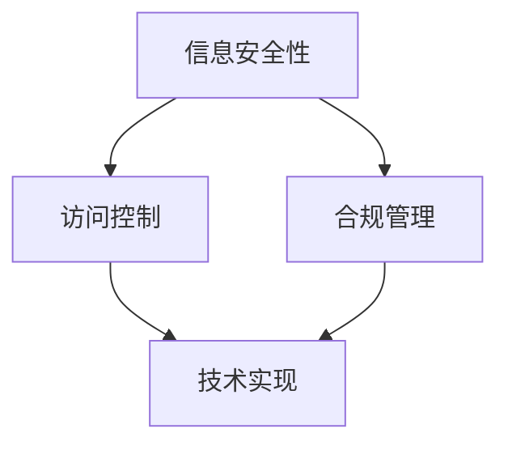
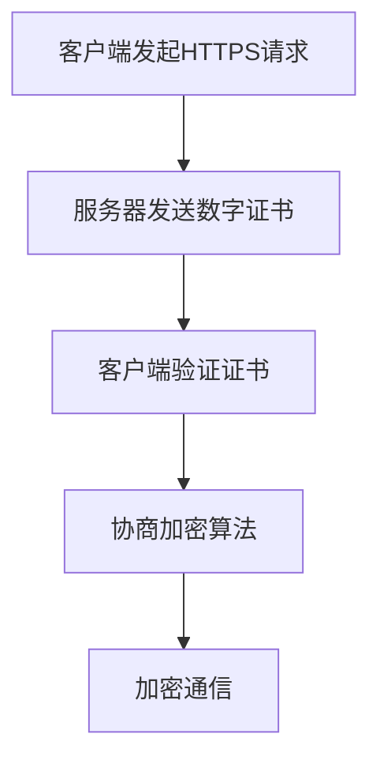
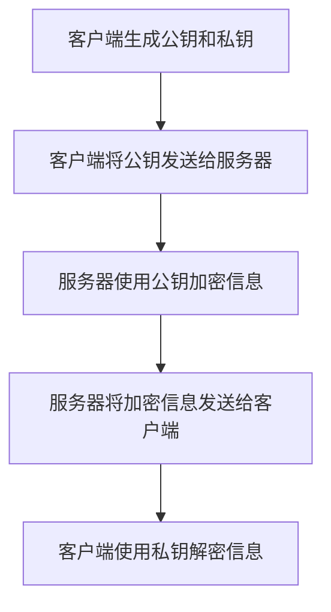
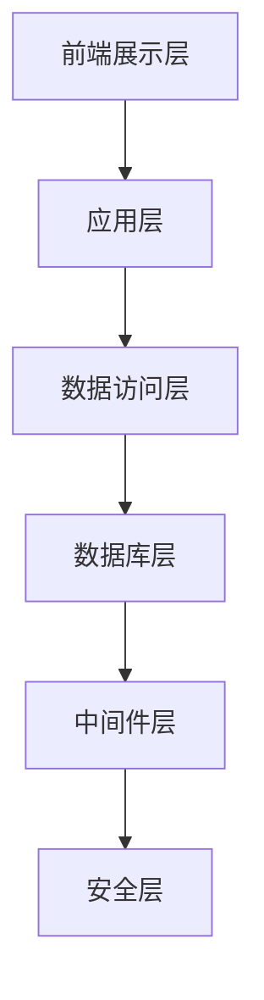

                 

# 访问专有信息源的必要性

关键词：专有信息源、访问控制、信息安全、技术手段、法律伦理、项目实战

摘要：随着信息化时代的到来，专有信息源在各个领域扮演着越来越重要的角色。本文将探讨访问专有信息源的必要性，从核心概念、技术手段、法律与伦理问题、技术实现、安全保障、项目实战及未来趋势等方面进行深入分析，以期为读者提供全面、系统的指导。

## 引言

在信息化时代，数据成为新的生产要素，专有信息源的重要性愈发凸显。专有信息源是指由特定组织或个人拥有和控制的、具有商业或学术价值的、不易获取的信息资源。这些信息资源可能包括商业机密、专利技术、学术成果、行业报告等。然而，访问这些专有信息源并非易事，需要考虑多方面的因素。

本文旨在探讨访问专有信息源的必要性，分析其核心概念、技术手段、法律与伦理问题、技术实现、安全保障、项目实战及未来趋势，以期为读者提供全面、系统的指导。本文结构如下：

1. **核心概念与联系**：介绍专有信息源的定义、特点及价值。
2. **技术手段**：分析访问专有信息源所需的技术手段，包括网络协议、访问控制技术、数据加密与安全传输。
3. **法律与伦理问题**：探讨访问专有信息源所涉及的法律与伦理问题，如法律框架、伦理责任、合规管理。
4. **技术实现**：讨论访问专有信息源的技术实现，包括系统架构设计、数据库与存储技术、接口设计与开发。
5. **安全保障**：分析访问专有信息源的安全保障措施，如安全策略、权限管理、数据安全与隐私保护。
6. **项目实战**：通过实际案例，展示访问专有信息源的项目实战过程，包括系统设计与开发、项目实施与测试、项目成果与应用。
7. **未来趋势与展望**：展望访问专有信息源的发展趋势，分析行业应用前景及挑战与机遇。

## 核心概念与联系

### 1.1 专有信息源的定义与特点

专有信息源是指由特定组织或个人拥有和控制的、具有商业或学术价值的、不易获取的信息资源。这些信息资源可能包括以下几个方面：

- **商业机密**：涉及企业运营、管理、研发等方面的机密信息，如市场策略、客户资料、研发成果等。
- **专利技术**：涉及某一领域的创新性技术，具有潜在的商业价值，如专利文档、技术规范等。
- **学术成果**：涉及学术研究、学术论文、科研成果等方面的信息，如学术期刊、研究报告等。
- **行业报告**：涉及某一行业市场、竞争、发展趋势等方面的信息，如市场调研报告、行业分析报告等。

专有信息源具有以下特点：

- **唯一性**：专有信息源通常具有独特性，难以通过其他渠道获取。
- **价值性**：专有信息源具有商业或学术价值，对特定组织或个人具有重要参考意义。
- **安全性**：专有信息源往往涉及敏感信息，需要采取严格的安全措施保护。

### 1.2 专有信息源的价值

专有信息源的价值主要体现在以下几个方面：

- **商业价值**：专有信息源可以帮助企业了解市场趋势、竞争对手信息、客户需求等，为企业制定战略提供依据。
- **技术创新**：专有信息源可以启发研究人员发现新的研究方向，推动技术创新。
- **学术研究**：专有信息源为学术研究提供了丰富的数据资源，有助于提升研究质量和影响力。
- **行业洞察**：专有信息源可以提供对行业发展趋势、市场动态的深入洞察，为企业决策提供支持。

### 1.3 专有信息源与信息安全的关系

访问专有信息源与信息安全密切相关。一方面，访问专有信息源需要确保信息的安全性，防止泄露、篡改、滥用等风险；另一方面，信息安全问题也影响着专有信息源的访问，如网络安全攻击、数据泄露等可能导致专有信息源无法正常访问。

因此，在访问专有信息源的过程中，需要综合考虑信息安全问题，采取相应的技术和管理措施，确保信息的安全性和完整性。

### 1.4 核心概念与联系

在讨论访问专有信息源的必要性时，以下几个核心概念需要明确：

- **信息安全性**：确保专有信息在访问、传输、存储等过程中不受威胁，包括数据加密、访问控制、网络安全等技术手段。
- **访问控制**：限制未经授权的访问，确保专有信息仅被授权用户访问。
- **合规管理**：遵循相关法律法规，确保访问专有信息源的行为合法合规。
- **技术实现**：实现专有信息源访问的技术手段，如网络协议、访问控制技术、数据加密与安全传输等。

以上核心概念相互关联，共同构成了访问专有信息源的整体框架。通过以下Mermaid流程图，可以更清晰地展示这些概念之间的联系：



在接下来的章节中，我们将进一步探讨访问专有信息源的技术手段、法律与伦理问题、技术实现、安全保障、项目实战及未来趋势，以期为读者提供全面的指导。

## 访问专有信息源的技术手段

访问专有信息源需要采用一系列技术手段，以确保信息的安全、可靠和高效传输。以下将详细介绍几种常见的技术手段。

### 2.1 网络协议与传输技术

网络协议是访问专有信息源的基础，常用的网络协议包括HTTP、HTTPS、FTP等。其中，HTTPS（HTTP over SSL/TLS）是一种安全的网络协议，通过SSL/TLS加密技术，确保数据在传输过程中的机密性和完整性。SSL/TLS协议的工作原理如下：

1. **客户端发起请求**：客户端向服务器发送HTTPS请求，请求内容包含要访问的URL。
2. **服务器身份验证**：服务器向客户端发送数字证书，客户端验证证书的有效性，确保请求发送给的是合法的服务器。
3. **协商加密算法**：客户端和服务器协商选择加密算法和密钥交换方式。
4. **加密通信**：客户端和服务器使用协商好的加密算法和密钥，加密通信内容，确保数据在传输过程中的安全。

以下是一个简单的SSL/TLS加密通信流程：



### 2.2 访问控制技术

访问控制技术是确保专有信息仅被授权用户访问的重要手段。常见的访问控制技术包括基于角色的访问控制（RBAC）、基于属性的访问控制（ABAC）等。

- **基于角色的访问控制（RBAC）**：RBAC将用户分为不同的角色，角色具有特定的权限。用户通过分配角色获得相应的权限，从而实现对资源的访问。RBAC的基本概念包括用户、角色、权限和资源。以下是一个简单的RBAC模型：

  ```mermaid
  graph TD
  A[用户] --> B[角色]
  B --> C[权限]
  C --> D[资源]
  ```

- **基于属性的访问控制（ABAC）**：ABAC根据用户的属性（如地理位置、时间等）以及资源的属性，动态决定是否授权用户访问。ABAC的基本概念包括主体、客体、操作和属性。以下是一个简单的ABAC模型：

  ```mermaid
  graph TD
  A[主体] --> B[操作]
  B --> C[客体]
  C --> D[属性]
  ```

### 2.3 数据加密与安全传输

数据加密与安全传输是保护专有信息不被未授权访问的关键技术。常用的加密算法包括对称加密算法（如AES）和非对称加密算法（如RSA）。对称加密算法使用相同的密钥进行加密和解密，速度快，但密钥管理复杂。非对称加密算法使用公钥和私钥进行加密和解密，安全性高，但速度较慢。

以下是一个基于RSA的非对称加密通信流程：



### 2.4 技术实现示例

以下是一个简单的示例，展示如何使用SSL/TLS协议、RBAC和RSA加密算法实现专有信息源的安全访问。

```python
# 引入相关库
import ssl
import socket
from Cryptodome.PublicKey import RSA
from Cryptodome.Cipher import PKCS1_OAEP

# 生成RSA密钥对
private_key = RSA.generate(2048)
public_key = private_key.publickey()

# 加密信息
def encrypt_message(message, public_key):
    cipher = PKCS1_OAEP.new(public_key)
    encrypted_message = cipher.encrypt(message)
    return encrypted_message

# 解密信息
def decrypt_message(encrypted_message, private_key):
    cipher = PKCS1_OAEP.new(private_key)
    decrypted_message = cipher.decrypt(encrypted_message)
    return decrypted_message

# 客户端发起HTTPS请求
context = ssl.create_default_context(ssl.Purpose.SERVER_AUTH)
context.check_hostname = False
context.verify_mode = ssl.CERT_NONE

with socket.create_connection(('localhost', 443)) as sock:
    with context.wrap_socket(sock, server_hostname='localhost') as ssock:
        message = 'Hello, server!'
        encrypted_message = encrypt_message(message, public_key)
        ssock.sendall(encrypted_message)

# 服务器接收加密信息，并使用私钥解密
decrypted_message = decrypt_message(encrypted_message, private_key)
print('Decrypted message:', decrypted_message)
```

在这个示例中，客户端生成RSA密钥对，使用公钥加密消息，并通过HTTPS协议发送给服务器。服务器接收加密消息，使用私钥解密，获取原始消息。

通过上述技术手段，我们可以确保专有信息在访问过程中保持安全。在接下来的章节中，我们将继续探讨访问专有信息源的法律与伦理问题、技术实现、安全保障等。

## 访问专有信息源的法律与伦理问题

访问专有信息源不仅涉及技术手段，还涉及法律与伦理问题。这些问题在保障信息安全和促进信息共享的同时，也带来了一系列挑战。

### 3.1 法律框架

访问专有信息源需要遵循相关法律法规。在全球范围内，各国对信息安全的法律规范有所不同，但核心原则基本一致。以下是一些常见的法律框架：

- **《中华人民共和国网络安全法》**：该法规定了网络运营者的安全保护义务，包括网络安全等级保护、个人信息保护、关键信息基础设施保护等。
- **《欧洲通用数据保护条例（GDPR）》**：GDPR是欧盟制定的个人信息保护法规，对个人信息处理行为提出了严格的要求，包括数据收集、处理、存储和传输等。
- **《美国隐私法》**：美国隐私法主要包括《儿童在线隐私保护法》（COPPA）、《健康保险可携性与责任法》（HIPAA）等，针对不同领域的个人信息保护进行了详细规定。
- **《知识产权法》**：知识产权法保护专利、商标、版权等知识产权，禁止未经授权的访问和使用。

在这些法律框架下，访问专有信息源需要遵循以下原则：

- **合法性**：访问专有信息源必须获得合法授权，未经授权的访问属于违法行为。
- **最小化原则**：仅获取和处理与目的相关的最小必要信息，避免过度收集和滥用信息。
- **告知与同意**：在收集和使用个人信息时，必须告知信息主体，并取得其同意。

### 3.2 伦理问题

访问专有信息源还涉及一系列伦理问题，包括隐私、公平、透明等。以下是一些常见的伦理问题：

- **隐私**：访问专有信息源可能会侵犯他人的隐私权。在处理个人信息时，必须尊重个人隐私，采取必要的安全措施保护个人信息。
- **公平**：访问专有信息源可能导致信息的不公平分配。为了维护公平，需要确保信息获取和使用的公平性，避免歧视和不公平待遇。
- **透明**：访问专有信息源的行为应保持透明，信息主体有权了解其个人信息的使用和处理情况。

### 3.3 责任界定

在访问专有信息源的过程中，责任界定是一个关键问题。以下是一些常见的责任界定情况：

- **信息拥有者**：信息拥有者对其拥有的专有信息负有保护责任，包括采取必要的安全措施、制定信息使用规范等。
- **信息处理者**：信息处理者（如第三方服务提供商）在处理信息时，应遵守法律法规和道德规范，确保信息的安全和合规。
- **信息主体**：信息主体对其个人信息负有保护责任，包括采取必要的安全措施、了解个人信息的使用和处理情况等。

### 3.4 合规管理

为了确保访问专有信息源的行为合法合规，需要建立完善的合规管理体系。以下是一些合规管理的建议：

- **制定合规政策**：组织制定详细的合规政策，明确访问专有信息源的法律要求和伦理标准。
- **培训与教育**：对员工进行合规培训，提高其合规意识和能力。
- **内部审计与监督**：建立内部审计和监督机制，确保合规政策的执行和改进。
- **外部审计与评估**：定期接受外部审计和评估，确保合规管理体系的有效性和适应性。

通过法律与伦理问题的规范和管理，我们可以确保访问专有信息源的行为合法合规，保障信息安全，促进信息共享。在接下来的章节中，我们将进一步探讨访问专有信息源的技术实现、安全保障、项目实战及未来趋势。

## 访问专有信息源的技术实现

访问专有信息源的技术实现是一个复杂的过程，需要考虑系统架构设计、数据库与存储技术、接口设计与开发等多个方面。以下将详细探讨这些技术实现。

### 4.1 系统架构设计

系统架构设计是访问专有信息源的基础，决定了系统的可扩展性、可维护性和安全性。以下是一个典型的系统架构设计：

1. **前端展示层**：负责与用户交互，提供用户友好的界面。通常采用Web前端框架（如React、Vue等）进行开发。

2. **应用层**：负责业务逻辑处理，包括用户认证、权限管理、数据查询等。采用微服务架构（如Spring Boot、Django等），将业务功能模块化，提高系统的可维护性和可扩展性。

3. **数据访问层**：负责与数据库进行交互，执行数据的增删改查操作。采用ORM（对象关系映射）框架（如Hibernate、MyBatis等），简化数据库操作。

4. **数据库层**：存储专有信息，通常采用关系型数据库（如MySQL、Oracle等）或分布式数据库（如Cassandra、MongoDB等），根据业务需求进行数据建模和优化。

5. **中间件层**：提供系统间通信、数据传输、负载均衡等功能。常用的中间件包括消息队列（如RabbitMQ、Kafka等）、缓存（如Redis、Memcached等）、负载均衡（如Nginx、HAProxy等）。

6. **安全层**：负责系统的安全性保障，包括访问控制、数据加密、网络安全等。采用SSL/TLS协议、防火墙、入侵检测系统等安全措施，确保系统的安全性。

以下是一个简单的系统架构图：



### 4.2 数据库与存储技术

数据库与存储技术是访问专有信息源的核心，决定了数据的存储和管理效率。以下介绍几种常用的数据库与存储技术：

1. **关系型数据库**：关系型数据库（如MySQL、Oracle等）具有数据一致性、事务支持等优势，适用于结构化数据的存储和管理。在访问专有信息源时，关系型数据库可以用于存储用户信息、权限信息等。

2. **分布式数据库**：分布式数据库（如Cassandra、MongoDB等）具有高可用性、可扩展性等优势，适用于大规模数据的存储和管理。在访问专有信息源时，分布式数据库可以用于存储日志数据、分析数据等。

3. **文件存储**：文件存储（如HDFS、Ceph等）适用于存储大量非结构化数据，如图片、视频等。在访问专有信息源时，文件存储可以用于存储用户上传的文件。

4. **缓存**：缓存（如Redis、Memcached等）适用于提高数据访问速度，降低数据库负载。在访问专有信息源时，缓存可以用于存储热点数据、频繁查询的数据等。

### 4.3 接口设计与开发

接口设计与开发是访问专有信息源的关键，决定了系统的可扩展性和易用性。以下介绍几种常见的接口设计与开发技术：

1. **RESTful API**：RESTful API是一种基于HTTP协议的接口设计规范，具有简单、易扩展等优点。在访问专有信息源时，RESTful API可以用于提供数据查询、数据更新等接口。

2. **GraphQL**：GraphQL是一种基于查询语言的接口设计规范，具有灵活、高效等优点。在访问专有信息源时，GraphQL可以用于提供个性化的数据查询接口。

3. **Web Socket**：Web Socket是一种基于TCP协议的实时通信协议，具有低延迟、高效等优点。在访问专有信息源时，Web Socket可以用于提供实时数据推送、实时聊天等接口。

以下是一个简单的接口设计示例：

```json
// 用户登录接口
POST /user/login
{
  "username": "string",
  "password": "string"
}

// 用户信息查询接口
GET /user/{id}
{
  "id": "string",
  "username": "string",
  "email": "string"
}

// 用户信息更新接口
PUT /user/{id}
{
  "id": "string",
  "username": "string",
  "email": "string",
  "password": "string"
}
```

通过系统架构设计、数据库与存储技术、接口设计与开发等技术实现，我们可以构建一个高效、安全、易用的访问专有信息源系统。在接下来的章节中，我们将进一步探讨访问专有信息源的安全保障、项目实战及未来趋势。

## 访问专有信息源的安全保障

访问专有信息源的安全保障是确保信息不被未经授权访问、泄露、篡改的关键。以下将介绍访问专有信息源的安全策略、权限管理、数据安全与隐私保护以及应急响应与风险管理。

### 5.1 安全策略

安全策略是确保访问专有信息源安全的基础。以下是一些常见的安全策略：

1. **访问控制策略**：通过角色分配、权限管理等方式，确保只有授权用户才能访问特定的信息资源。例如，将用户分为管理员、普通用户等不同角色，并为每个角色分配相应的权限。

2. **数据备份策略**：定期备份专有信息，确保在数据丢失、损坏等情况下能够快速恢复。备份策略应包括数据备份的频率、备份方式、备份存储位置等。

3. **安全审计策略**：对系统访问日志、操作日志等进行审计，及时发现并处理潜在的安全问题。安全审计策略应包括审计内容、审计频率、审计报告等。

4. **安全培训策略**：定期对员工进行安全培训，提高其安全意识和能力。安全培训内容应包括安全法律法规、安全操作规范、应急响应等。

### 5.2 权限管理

权限管理是确保专有信息访问安全的重要手段。以下是一些常见的权限管理方法：

1. **基于角色的权限管理（RBAC）**：将用户分为不同的角色，并为每个角色分配相应的权限。用户通过角色获得权限，从而实现对资源的访问。例如，管理员角色拥有所有权限，普通用户仅能访问自己的信息。

2. **基于属性的权限管理（ABAC）**：根据用户的属性（如地理位置、时间等）以及资源的属性（如访问类型、访问频率等），动态决定是否授权用户访问。例如，凌晨时段仅允许内部员工访问某些敏感信息。

3. **细粒度权限管理**：对资源的访问权限进行细粒度控制，确保用户只能访问其需要的最小权限。例如，对文件系统进行访问控制，设置用户对文件只读、只写或读取和写入权限。

### 5.3 数据安全与隐私保护

数据安全与隐私保护是访问专有信息源的重要环节。以下是一些常见的数据安全与隐私保护措施：

1. **数据加密**：对存储和传输的数据进行加密，确保数据在未授权的情况下无法被读取。常用的加密算法包括AES、RSA等。

2. **访问控制**：通过访问控制策略和权限管理，确保只有授权用户才能访问特定的数据。例如，通过设置文件访问权限，限制用户对特定文件的访问。

3. **数据备份与恢复**：定期备份数据，确保在数据丢失、损坏等情况下能够快速恢复。备份策略应包括数据备份的频率、备份方式、备份存储位置等。

4. **隐私保护**：对涉及个人隐私的数据进行保护，确保个人隐私不被泄露。例如，对用户数据进行脱敏处理，仅保留必要的个人信息。

### 5.4 应急响应与风险管理

应急响应与风险管理是应对访问专有信息源安全事件的必要手段。以下是一些常见的应急响应与风险管理措施：

1. **应急响应计划**：制定详细的应急响应计划，包括安全事件报告、应急响应流程、应急资源分配等。确保在发生安全事件时，能够迅速响应和处理。

2. **安全事件报告**：建立安全事件报告机制，确保安全事件能够及时发现、报告和处理。报告内容应包括事件类型、事件影响、事件原因等。

3. **安全培训与演练**：定期进行安全培训，提高员工的安全意识和应急处理能力。通过安全演练，检验应急响应计划的可行性和有效性。

4. **风险管理**：通过风险评估，识别系统面临的安全风险，并采取相应的控制措施。例如，针对高风险业务，采取更严格的安全措施。

通过安全策略、权限管理、数据安全与隐私保护、应急响应与风险管理等措施，我们可以确保访问专有信息源的安全。在接下来的章节中，我们将通过项目实战展示访问专有信息源的具体实施过程。

## 项目实战：访问专有信息源的系统设计与实现

在本章节中，我们将通过一个实际项目案例，详细展示访问专有信息源的系统设计与实现过程，包括开发环境搭建、源代码实现和代码解读与分析。

### 6.1 项目背景与目标

项目背景：某企业需访问并处理其专有客户信息，这些信息包括客户姓名、联系方式、购买记录等。为确保数据安全，企业决定开发一个专有信息访问系统，实现以下目标：

- **安全性**：确保客户信息在访问、传输、存储等过程中不被泄露、篡改。
- **可靠性**：系统稳定运行，能够快速响应用户请求。
- **灵活性**：系统可扩展性强，支持未来业务需求的变化。

### 6.2 开发环境搭建

在项目开发过程中，我们选择以下技术栈：

- **前端**：使用Vue.js框架，实现用户界面和交互。
- **后端**：使用Spring Boot框架，处理业务逻辑和API接口。
- **数据库**：使用MySQL数据库，存储客户信息。
- **中间件**：使用RabbitMQ作为消息队列，实现异步通信。
- **安全**：使用SSL/TLS协议，确保数据传输安全。

开发环境搭建步骤如下：

1. **前端开发环境**：安装Node.js和Vue CLI，创建Vue项目。

```bash
npm install -g @vue/cli
vue create client-app
```

2. **后端开发环境**：安装Java和Spring Boot，创建Spring Boot项目。

```bash
sudo apt-get install openjdk-11-jdk
mvn -B exec:java -Dexec.mainClass="com.example.Application"
```

3. **数据库环境**：安装MySQL数据库，创建数据库和表。

```bash
sudo apt-get install mysql-server
mysql -u root -p
CREATE DATABASE customer_db;
USE customer_db;
CREATE TABLE customers (id INT AUTO_INCREMENT PRIMARY KEY, name VARCHAR(255), contact VARCHAR(255), purchase_date DATE);
```

4. **消息队列环境**：安装RabbitMQ，创建虚拟主机和队列。

```bash
sudo apt-get install rabbitmq-server
rabbitmqctl create_user user1 password1
rabbitmqctl set_permissions -p / user1 ".*" ".*" ".*"
```

### 6.3 源代码实现

以下是一个简化的后端代码示例，展示如何实现客户信息查询接口。

**CustomerService.java**

```java
import org.springframework.beans.factory.annotation.Autowired;
import org.springframework.stereotype.Service;

@Service
public class CustomerService {

    @Autowired
    private CustomerRepository customerRepository;

    public List<Customer> getAllCustomers() {
        return customerRepository.findAll();
    }

    public Customer getCustomerById(Long id) {
        return customerRepository.findById(id).orElseThrow(() -> new ResourceNotFoundException("Customer not found with id: " + id));
    }
}
```

**CustomerController.java**

```java
import org.springframework.beans.factory.annotation.Autowired;
import org.springframework.http.ResponseEntity;
import org.springframework.web.bind.annotation.*;

@RestController
@RequestMapping("/api/customers")
public class CustomerController {

    @Autowired
    private CustomerService customerService;

    @GetMapping
    public ResponseEntity<List<Customer>> getAllCustomers() {
        return ResponseEntity.ok(customerService.getAllCustomers());
    }

    @GetMapping("/{id}")
    public ResponseEntity<Customer> getCustomerById(@PathVariable Long id) {
        return ResponseEntity.ok(customerService.getCustomerById(id));
    }
}
```

**CustomerRepository.java**

```java
import org.springframework.data.jpa.repository.JpaRepository;
import org.springframework.stereotype.Repository;

@Repository
public interface CustomerRepository extends JpaRepository<Customer, Long> {
}
```

### 6.4 代码解读与分析

**CustomerService.java**：该类实现了客户信息的查询功能，通过`CustomerRepository`获取所有客户信息和指定ID的客户信息。

- `getAllCustomers()`：返回所有客户信息。
- `getCustomerById(Long id)`：根据ID查询客户信息，若不存在则抛出异常。

**CustomerController.java**：该类定义了API接口，通过`CustomerService`实现客户信息查询。

- `getAllCustomers()`：GET请求，返回所有客户信息。
- `getCustomerById(@PathVariable Long id)`：GET请求，根据ID查询客户信息。

**CustomerRepository.java**：该接口继承自`JpaRepository`，实现了对客户信息的增删改查操作。

- `findAll()`：返回所有客户信息。
- `findById(Long id)`：根据ID查询客户信息。

通过上述代码示例，我们实现了客户信息查询功能。在实际项目中，还需考虑其他功能，如客户信息创建、更新、删除等。同时，为了确保数据安全，还需对API接口进行访问控制，仅允许授权用户访问。

通过本项目实战，我们展示了访问专有信息源的系统设计与实现过程，包括开发环境搭建、源代码实现和代码解读与分析。在接下来的章节中，我们将探讨访问专有信息源的未来趋势。

## 未来趋势与展望

随着信息技术的不断进步，访问专有信息源的技术手段、法律与伦理问题、技术实现等方面都面临着新的挑战和机遇。以下是对未来趋势与展望的讨论。

### 7.1 访问专有信息源技术的发展趋势

1. **区块链技术的应用**：区块链技术以其去中心化、不可篡改等特性，有望在访问专有信息源方面发挥重要作用。通过区块链技术，可以实现信息的安全存储、传输和共享，提高信息的透明度和可信度。

2. **人工智能与大数据技术的融合**：人工智能与大数据技术的快速发展，使得对大量数据进行处理和分析成为可能。在访问专有信息源的过程中，人工智能和大数据技术可以用于信息检索、预测分析等，提高信息利用效率。

3. **云计算与边缘计算的协同**：云计算提供了强大的计算和存储能力，边缘计算则强调在数据产生的源头进行处理。未来，云计算与边缘计算将更加紧密地协同，实现高效、低延迟的专有信息访问。

4. **隐私保护技术的进步**：随着隐私保护意识的增强，隐私保护技术将不断进步。例如，联邦学习、差分隐私等技术在保障数据隐私的同时，实现数据的利用和共享。

### 7.2 行业应用前景分析

1. **金融行业**：金融行业对专有信息源的需求强烈，未来区块链技术将在金融领域得到更广泛的应用。通过区块链技术，可以实现金融交易的安全、透明和高效。

2. **医疗健康行业**：医疗健康行业对专有信息源的需求集中在医疗数据、患者信息等方面。随着人工智能和大数据技术的发展，医疗健康行业有望实现个性化诊断、精准治疗等。

3. **教育行业**：教育行业对专有信息源的需求集中在教育资源、教学数据等方面。未来，通过区块链技术和人工智能技术，可以实现教育资源的共享和优化，提高教育质量。

4. **物联网行业**：物联网行业对专有信息源的需求集中在设备数据、网络数据等方面。未来，通过云计算和边缘计算技术的协同，可以实现物联网设备的高效管理和数据分析。

### 7.3 挑战与机遇

1. **技术挑战**：未来访问专有信息源将面临更多技术挑战，如如何保障数据安全、提高数据处理效率等。这需要持续的技术创新和突破。

2. **法律与伦理挑战**：随着访问专有信息源技术的发展，法律与伦理问题将更加复杂。如何平衡信息共享与隐私保护、商业利益与社会责任等，是未来需要关注的重要问题。

3. **机遇**：未来访问专有信息源将带来巨大机遇，如推动技术创新、促进行业应用发展等。通过有效的技术手段和法律规范，可以充分发挥专有信息源的价值，推动社会进步。

### 7.4 未来展望

未来，访问专有信息源将在技术创新、法律与伦理规范、行业应用等方面取得更多进展。通过不断优化技术手段，提高信息的安全性和利用效率，访问专有信息源将为各行业带来新的发展机遇。同时，需要关注法律与伦理问题，确保信息共享与隐私保护之间的平衡，推动社会的可持续发展。

## 附录

### 附录A：访问专有信息源的相关资源

#### A.1 标准与规范

- **ISO/IEC 27001**：国际标准化组织发布的关于信息安全管理体系的标准。
- **GDPR**：欧洲通用数据保护条例，对个人信息保护提出了严格的要求。
- **NIST SP 800-53**：美国国家标准与技术研究所发布的信息安全控制框架。

#### A.2 开源工具与框架

- **Spring Security**：用于实现Web应用安全性的开源框架。
- **Keycloak**：开源的身份与访问管理（IAM）解决方案。
- **Elasticsearch**：用于搜索和分析大规模数据的开源搜索引擎。

#### A.3 专业文献与论文

- **"Blockchain and Its Applications in Data Security and Privacy Protection"**：一篇关于区块链在数据安全和隐私保护方面应用的综述论文。
- **"Deep Learning for Natural Language Processing"**：一篇关于深度学习在自然语言处理领域应用的论文。
- **"The Future of Information Security: Insights from Experts"**：一篇关于未来信息安全发展趋势的专家访谈论文。

### 作者信息

**作者：AI天才研究院/AI Genius Institute & 禅与计算机程序设计艺术 /Zen And The Art of Computer Programming**。本文旨在探讨访问专有信息源的必要性，从核心概念、技术手段、法律与伦理问题、技术实现、安全保障、项目实战及未来趋势等方面进行深入分析，以期为读者提供全面、系统的指导。

