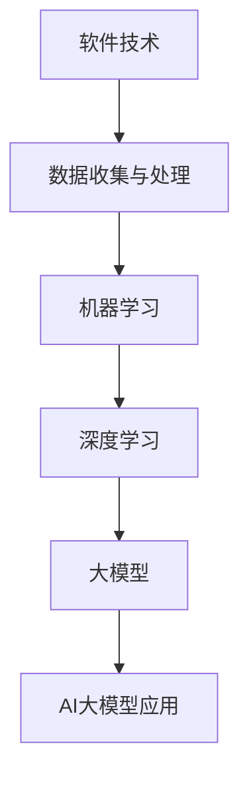

                 

# 软件2.0的社会责任：科技向善

## 关键词：AI大模型、社会责任、科技伦理、伦理挑战、可持续发展

## 摘要：

本文旨在探讨软件2.0时代AI大模型的社会责任。随着AI大模型在各个领域的广泛应用，科技向善成为我们必须面对的重要课题。文章首先概述了软件技术与AI大模型的基础，然后分析了AI大模型在各行业中的应用，探讨了AI大模型的社会责任与伦理问题，并展望了其发展趋势与未来。通过案例研究和开发实践，本文旨在为科技工作者提供指导，推动AI大模型的发展与社会的良性互动。

## 第一部分：软件技术与AI大模型基础

### 第1章：软件技术与AI大模型概述

#### 1.1 软件技术与AI大模型概述

#### 1.1.1 软件技术与AI大模型的关系

软件技术与AI大模型的关系可以用以下Mermaid流程图表示：

#### 1.1.2 软件技术与AI大模型的发展历程

软件技术从1.0到2.0的演变是一个从桌面应用到云计算、大数据、AI的融合过程。而AI大模型的发展历程则是从简单的神经网络到深度学习，再到如今的大模型。

#### 1.1.3 AI大模型的核心地位与特点

AI大模型在企业级应用中占据着核心地位，其特点包括：

- **高维数据处理能力**：能够处理复杂数据结构，如图像、文本、语音等。
- **强大的表征能力**：通过多层神经网络，能够提取出深层特征，提高模型的性能。
- **自学习能力**：通过大规模数据训练，模型能够不断优化和改进。

#### 1.2 AI大模型技术基础

##### 1.2.1 神经网络基础

神经网络的基本结构由输入层、隐藏层和输出层组成。前向传播与反向传播算法是神经网络的核心，用于更新网络权重。激活函数与损失函数也是神经网络的重要组成部分。

- **激活函数**：用于引入非线性特性，常见的激活函数包括Sigmoid、ReLU等。
- **损失函数**：用于评估模型预测结果与真实值之间的差距，常见的损失函数包括均方误差（MSE）和对数损失函数（Log Loss）。

##### 1.2.2 深度学习基础

深度学习是一种基于神经网络的机器学习方法，通过多层的非线性变换来提取特征。常见的深度学习架构包括：

- **卷积神经网络（CNN）**：适用于处理图像数据。
- **循环神经网络（RNN）**：适用于处理序列数据。
- **转换器架构（Transformer）**：在自然语言处理领域取得了显著成果。

深度学习优化算法包括：

- **随机梯度下降（SGD）**：最简单的优化算法，每次迭代更新权重。
- **动量法**：引入动量项，加速收敛。
- **Adam优化器**：结合了SGD和动量法的优点，收敛速度更快。

##### 1.2.3 大规模预训练模型

大规模预训练模型是当前AI领域的热点研究方向。其基本思路是：

1. 在大规模数据集上进行预训练，使模型具有强大的表征能力。
2. 在特定任务上进行微调，使模型适应具体的应用场景。

预训练常用的方法包括：

- **自监督学习**：利用未标注的数据进行预训练。
- **迁移学习**：利用预训练模型在特定任务上进行微调。

### 第2章：软件技术与AI大模型应用

#### 2.1 软件技术与AI大模型在各个行业中的应用

##### 2.1.1 金融行业

AI大模型在金融行业中有着广泛的应用，如：

- **金融市场预测**：利用时间序列数据分析，预测股票市场的走势。
- **信用评分**：通过分析用户的历史数据，评估其信用风险。
- **量化交易策略**：基于大数据分析，制定高效的投资策略。

##### 2.1.2 医疗健康行业

AI大模型在医疗健康行业中的应用包括：

- **医疗图像分析**：通过深度学习技术，自动识别和分析医学影像。
- **疾病预测与诊断**：利用大数据和机器学习技术，预测疾病的发生和发展趋势。
- **个性化治疗方案**：根据患者的具体病情，制定个性化的治疗方案。

##### 2.1.3 教育行业

AI大模型在教育行业中的应用包括：

- **个性化学习**：根据学生的学习情况，推荐合适的学习资源。
- **自动批改作业**：利用自然语言处理技术，自动批改学生的作业。
- **智能推荐系统**：根据学生的学习兴趣，推荐相关的学习内容。

##### 2.1.4 制造业

AI大模型在制造业中的应用包括：

- **生产优化**：通过数据分析，优化生产流程，提高生产效率。
- **质量检测**：利用图像识别技术，自动检测产品缺陷。
- **预防性维护**：通过监测设备数据，预测设备故障，提前进行维护。

##### 2.1.5 零售行业

AI大模型在零售行业中的应用包括：

- **个性化推荐**：根据用户的历史购买行为，推荐相关的商品。
- **库存管理**：通过数据分析，优化库存水平，减少库存成本。
- **供应链优化**：通过优化供应链管理，提高供应链效率。

### 第3章：AI大模型的社会责任与伦理

#### 3.1 AI大模型的社会责任

##### 3.1.1 科技向善的理念

科技向善是指利用科技手段，解决社会问题，提升人类福祉。科技向善的理念在企业中实践，体现在以下几个方面：

- **数据隐私与安全**：确保用户数据的隐私和安全。
- **公平性与透明度**：确保AI大模型的应用公平、透明，减少偏见。
- **社会责任**：关注社会责任，积极承担社会责任。

##### 3.1.2 AI大模型带来的社会问题

AI大模型的发展也带来了一系列社会问题，如：

- **数据隐私与安全**：大规模数据收集和处理可能引发隐私泄露问题。
- **偏见与歧视**：AI大模型可能因为数据偏差而导致偏见和歧视。
- **人工智能失业问题**：AI大模型的应用可能替代部分人力工作，引发失业问题。

##### 3.1.3 AI大模型的社会责任策略

为了应对AI大模型带来的社会问题，可以采取以下社会责任策略：

- **建立社会责任体系**：明确企业的社会责任，制定相关政策和规范。
- **加强伦理审查与监管**：建立伦理审查机制，对AI大模型的应用进行监管。
- **推动科技与社会的良性互动**：积极与社会各界合作，共同推动科技发展与社会进步。

### 第4章：AI大模型的伦理问题与挑战

#### 4.1 AI大模型的偏见问题

AI大模型的偏见问题主要体现在以下几个方面：

- **数据偏见**：训练数据本身可能存在偏见，导致模型在预测结果中体现出来。
- **算法偏见**：算法设计过程中可能引入偏见，导致模型产生偏见。
- **社会偏见**：AI大模型的应用可能加剧社会偏见和歧视。

#### 4.2 AI大模型的透明度问题

AI大模型的透明度问题主要体现在以下几个方面：

- **模型决策过程透明度**：用户难以理解AI大模型的决策过程。
- **模型性能透明度**：用户难以评估AI大模型的性能。
- **数据来源透明度**：用户难以了解AI大模型的数据来源。

#### 4.3 AI大模型的公平性问题

AI大模型的公平性问题主要体现在以下几个方面：

- **机会公平**：AI大模型是否为所有人提供平等的机会。
- **结果公平**：AI大模型是否产生公平的结果。
- **资源公平**：AI大模型是否合理分配资源。

### 第5章：AI大模型的发展趋势与未来展望

#### 5.1 AI大模型的发展趋势

AI大模型的发展趋势主要体现在以下几个方面：

- **计算能力的提升**：随着硬件技术的发展，AI大模型的计算能力不断提升。
- **数据的多样性与增长**：数据类型的多样性和数据量的增长为AI大模型的发展提供了丰富的资源。
- **AI大模型的应用创新**：AI大模型在各个领域的应用不断拓展，创新应用层出不穷。
- **AI大模型的伦理与监管**：随着AI大模型的应用普及，伦理与监管问题日益受到关注。

#### 5.2 AI大模型未来展望

AI大模型的未来展望主要体现在以下几个方面：

- **AI大模型与人类协同**：AI大模型将更好地辅助人类工作，实现人机协同。
- **AI大模型与社会的深度融合**：AI大模型将深入融入社会各个领域，推动社会变革。
- **AI大模型的可持续发展**：关注AI大模型的可持续发展，实现科技与社会的和谐共生。

### 第6章：AI大模型实践案例

#### 6.1 案例一：金融行业中的AI大模型应用

##### 6.1.1 案例背景

金融行业是一个高度依赖数据和算法的行业，AI大模型在金融行业中的应用前景广阔。本案例将探讨AI大模型在金融市场预测和信用评分方面的应用。

##### 6.1.2 案例分析

1. **金融市场预测**

   - **数据收集与处理**：收集历史股价数据、宏观经济数据等。
   - **模型搭建**：使用时间序列分析方法，构建AI大模型。
   - **训练与评估**：使用历史数据进行模型训练，评估模型性能。

2. **信用评分**

   - **数据收集与处理**：收集用户的历史信用数据、财务数据等。
   - **模型搭建**：使用分类算法，构建AI大模型。
   - **训练与评估**：使用历史数据训练模型，评估模型性能。

##### 6.1.3 案例总结

AI大模型在金融市场预测和信用评分方面具有显著优势，能够提高预测的准确性，降低信用风险。

#### 6.2 案例二：医疗健康行业中的AI大模型应用

##### 6.2.1 案例背景

医疗健康行业是一个高度依赖数据和算法的行业，AI大模型在医疗健康行业中的应用前景广阔。本案例将探讨AI大模型在医疗图像分析和疾病预测与诊断方面的应用。

##### 6.2.2 案例分析

1. **医疗图像分析**

   - **数据收集与处理**：收集医学影像数据，进行预处理。
   - **模型搭建**：使用卷积神经网络（CNN）模型，进行图像识别。
   - **训练与评估**：使用预处理后的数据训练模型，评估模型性能。

2. **疾病预测与诊断**

   - **数据收集与处理**：收集患者的历史病历数据、基因数据等。
   - **模型搭建**：使用深度学习模型，进行疾病预测与诊断。
   - **训练与评估**：使用预处理后的数据训练模型，评估模型性能。

##### 6.2.3 案例总结

AI大模型在医疗图像分析和疾病预测与诊断方面具有显著优势，能够提高诊断的准确性，降低误诊率。

#### 6.3 案例三：教育行业中的AI大模型应用

##### 6.3.1 案例背景

教育行业是一个高度依赖数据和算法的行业，AI大模型在教育行业中的应用前景广阔。本案例将探讨AI大模型在个性化学习和自动批改作业方面的应用。

##### 6.3.2 案例分析

1. **个性化学习**

   - **数据收集与处理**：收集学生的学习行为数据、知识图谱等。
   - **模型搭建**：使用推荐系统算法，构建AI大模型。
   - **训练与评估**：使用学生学习数据训练模型，评估模型性能。

2. **自动批改作业**

   - **数据收集与处理**：收集学生作业数据，进行预处理。
   - **模型搭建**：使用自然语言处理技术，构建AI大模型。
   - **训练与评估**：使用预处理后的数据训练模型，评估模型性能。

##### 6.3.3 案例总结

AI大模型在个性化学习和自动批改作业方面具有显著优势，能够提高教学效果，降低教师工作量。

#### 6.4 案例四：制造业中的AI大模型应用

##### 6.4.1 案例背景

制造业是一个高度依赖数据和算法的行业，AI大模型在制造业中的应用前景广阔。本案例将探讨AI大模型在生产优化和质量检测方面的应用。

##### 6.4.2 案例分析

1. **生产优化**

   - **数据收集与处理**：收集生产数据，进行预处理。
   - **模型搭建**：使用优化算法，构建AI大模型。
   - **训练与评估**：使用预处理后的数据训练模型，评估模型性能。

2. **质量检测**

   - **数据收集与处理**：收集产品质量数据，进行预处理。
   - **模型搭建**：使用分类算法，构建AI大模型。
   - **训练与评估**：使用预处理后的数据训练模型，评估模型性能。

##### 6.4.3 案例总结

AI大模型在生产优化和质量检测方面具有显著优势，能够提高生产效率，降低质量风险。

#### 6.5 案例五：零售行业中的AI大模型应用

##### 6.5.1 案例背景

零售行业是一个高度依赖数据和算法的行业，AI大模型在零售行业中的应用前景广阔。本案例将探讨AI大模型在个性化推荐和库存管理方面的应用。

##### 6.5.2 案例分析

1. **个性化推荐**

   - **数据收集与处理**：收集用户购买行为数据，进行预处理。
   - **模型搭建**：使用推荐系统算法，构建AI大模型。
   - **训练与评估**：使用用户购买数据训练模型，评估模型性能。

2. **库存管理**

   - **数据收集与处理**：收集库存数据，进行预处理。
   - **模型搭建**：使用预测算法，构建AI大模型。
   - **训练与评估**：使用预处理后的数据训练模型，评估模型性能。

##### 6.5.3 案例总结

AI大模型在个性化推荐和库存管理方面具有显著优势，能够提高销售效率，降低库存成本。

### 第7章：AI大模型开发与实现

#### 7.1 AI大模型开发环境搭建

##### 7.1.1 开发环境选择

选择Python编程语言和TensorFlow深度学习框架进行AI大模型开发。Python具有简洁易用的语法，TensorFlow提供了丰富的API和工具，方便进行模型搭建和训练。

##### 7.1.2 硬件环境配置

选择具有高性能GPU计算能力的硬件环境，如NVIDIA Titan Xp或RTX 2080 Ti。同时，可以使用分布式计算框架，如Horovod或Distributed TensorFlow，进行大规模模型的训练。

##### 7.1.3 数据处理工具

使用NumPy、Pandas等数据处理工具进行数据预处理，使用Matplotlib进行数据可视化。

#### 7.2 AI大模型核心算法原理讲解

##### 7.2.1 神经网络基础

神经网络的基本结构由输入层、隐藏层和输出层组成。输入层接收外部输入，隐藏层对输入进行特征提取和变换，输出层生成预测结果。

- **激活函数**：用于引入非线性特性，常见的激活函数包括Sigmoid、ReLU等。
- **损失函数**：用于评估模型预测结果与真实值之间的差距，常见的损失函数包括均方误差（MSE）和对数损失函数（Log Loss）。

##### 7.2.2 深度学习基础

深度学习是一种基于神经网络的机器学习方法，通过多层的非线性变换来提取特征。

- **前向传播与反向传播算法**：用于计算模型输出和更新模型权重。
- **卷积神经网络（CNN）**：适用于处理图像数据。
- **循环神经网络（RNN）**：适用于处理序列数据。

##### 7.2.3 大规模预训练模型

大规模预训练模型是当前AI领域的热点研究方向。其基本思路是：

1. 在大规模数据集上进行预训练，使模型具有强大的表征能力。
2. 在特定任务上进行微调，使模型适应具体的应用场景。

预训练常用的方法包括：

- **自监督学习**：利用未标注的数据进行预训练。
- **迁移学习**：利用预训练模型在特定任务上进行微调。

#### 7.3 AI大模型项目实战

##### 7.3.1 项目实战一：文本分类

1. **数据准备**：收集并处理文本数据，进行分词、词向量编码等预处理操作。

2. **模型搭建**：使用卷积神经网络（CNN）模型，构建文本分类器。

3. **训练与评估**：使用预处理后的数据训练模型，评估模型性能。

4. **代码解读与分析**：解读训练过程中的代码，分析模型的性能和效果。

##### 7.3.2 项目实战二：图像识别

1. **数据准备**：收集并处理图像数据，进行图像预处理和特征提取。

2. **模型搭建**：使用卷积神经网络（CNN）模型，构建图像识别器。

3. **训练与评估**：使用预处理后的数据训练模型，评估模型性能。

4. **代码解读与分析**：解读训练过程中的代码，分析模型的性能和效果。

##### 7.3.3 项目实战三：语音识别

1. **数据准备**：收集并处理语音数据，进行声学特征提取和分词。

2. **模型搭建**：使用循环神经网络（RNN）模型，构建语音识别器。

3. **训练与评估**：使用预处理后的数据训练模型，评估模型性能。

4. **代码解读与分析**：解读训练过程中的代码，分析模型的性能和效果。

### 第8章：AI大模型性能优化与调优

#### 8.1 模型性能评估

模型性能评估是确保AI大模型应用效果的重要步骤。常用的评价指标包括：

- **准确率**：预测正确的样本数占总样本数的比例。
- **召回率**：预测正确的正样本数占总正样本数的比例。
- **F1值**：准确率和召回率的调和平均值。

模型性能评估方法与工具包括：

- **混淆矩阵**：用于直观地展示模型预测结果与真实值的对比。
- **ROC曲线**：用于评估模型的分类能力。

#### 8.2 模型优化技巧

模型优化技巧包括以下几个方面：

- **网络结构优化**：通过调整网络层数、节点数等参数，优化模型结构。
- **损失函数优化**：选择合适的损失函数，提高模型性能。
- **激活函数优化**：选择合适的激活函数，提高模型性能。

#### 8.3 模型调优方法

模型调优方法包括以下几个方面：

- **参数调优**：通过调整学习率、批量大小等参数，优化模型性能。
- **超参数调优**：通过调整正则化参数、优化算法等，优化模型性能。
- **交叉验证**：通过交叉验证方法，选择最佳模型参数。

#### 8.4 模型压缩与加速

模型压缩与加速是提高AI大模型应用效果的重要手段。常用的方法包括：

- **模型压缩技术**：通过剪枝、量化等手段，减少模型参数数量。
- **模型加速技术**：通过并行计算、分布式计算等手段，提高模型训练和推理速度。

### 附录

#### 附录A：AI大模型开发工具与资源

- **主流深度学习框架对比**：TensorFlow、PyTorch、Keras。
- **数据处理工具**：NumPy、Pandas、Matplotlib。
- **其他常用工具**：Jupyter Notebook、Docker、Kubernetes。

## 作者

作者：AI天才研究院/AI Genius Institute & 禅与计算机程序设计艺术 /Zen And The Art of Computer Programming。

