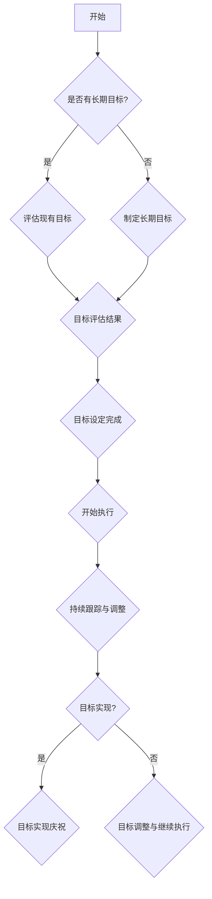

                 

### 文章标题

**长期目标在意识功能中的重要性**

> **关键词：** 长期目标、意识功能、决策、情绪调节、记忆、社会交往、目标设定、执行与跟踪、意识培养

> **摘要：** 本文将深入探讨长期目标在意识功能中的重要性，分析其在决策、情绪调节、记忆、社会交往等方面的作用。通过理论和实践相结合的方式，本文旨在为读者提供关于如何制定、执行和培养长期目标的策略，以提升个人的意识和生活质量。

### 目录大纲

#### 第一部分：理解长期目标在意识功能中的重要性

##### 第1章：长期目标与意识

- 1.1 长期目标的概念

  - 长期目标的定义
  - 长期目标的重要性

- 1.2 意识的框架

  - 意识的理论模型
  - 意识与决策的关系

##### 第2章：长期目标在决策中的角色

- 2.1 决策心理学

  - 决策的理论基础
  - 决策中的认知偏差

- 2.2 长期目标的驱动

  - 长期目标与即时满足的关系
  - 长期目标在决策中的作用

#### 第二部分：长期目标在意识功能中的应用

##### 第3章：长期目标与情绪调节

- 3.1 情绪调节的理论

  - 情绪调节的基本概念
  - 情绪调节的心理学理论

- 3.2 长期目标与情绪调节

  - 长期目标如何影响情绪调节
  - 长期目标在情绪调节中的应用策略

##### 第4章：长期目标与记忆

- 4.1 记忆的理论基础

  - 记忆的基本过程
  - 记忆的类型与机制

- 4.2 长期目标与记忆

  - 长期目标对记忆的影响
  - 利用长期目标增强记忆的策略

##### 第5章：长期目标与社会交往

- 5.1 社会交往中的长期目标

  - 长期目标在社会交往中的作用
  - 长期目标与人际关系的建立与维护

- 5.2 长期目标与团队合作

  - 长期目标在团队合作中的重要性
  - 长期目标在团队决策中的应用

#### 第三部分：实践与策略

##### 第6章：长期目标的制定与执行

- 6.1 制定有效长期目标的策略

  - 长期目标设定的原则
  - 长期目标的制定流程

- 6.2 长期目标的执行与跟踪

  - 长期目标的执行策略
  - 长期目标的跟踪与调整

##### 第7章：长期目标的意识培养

- 7.1 意识培养的理论与实践

  - 意识培养的重要性
  - 意识培养的方法与技巧

- 7.2 意识培养在长期目标中的应用

  - 意识培养在目标制定中的运用
  - 意识培养在目标执行中的运用

#### 附录

##### 附录 A：相关研究文献与参考资料

- A.1 研究文献摘要
- A.2 资源链接

##### 附录 B：模拟案例与应用

- B.1 长期目标案例分析
- B.2 意识功能应用实例

##### 附录 C：Mermaid 流程图

- C.1 长期目标设定流程
- C.2 意识功能作用机制

##### 附录 D：数学模型与公式

- D.1 长期目标优化模型
- D.2 情绪调节相关公式

##### 附录 E：代码实例

- E.1 长期目标追踪算法
- E.2 意识功能应用实例代码

### 核心概念与联系

在本篇文章中，我们将探讨以下几个核心概念：

- **长期目标**：指个人或组织在较长时间内追求的最终结果或状态，通常包括明确的指标和时间表。
- **意识功能**：包括决策、情绪调节、记忆和社会交往等方面，是大脑处理信息和与环境互动的过程。
- **决策**：指在面对多种选择时，根据特定标准做出选择的过程。
- **情绪调节**：指个体如何处理和控制自己的情绪，以适应不同的环境和需求。
- **记忆**：指大脑存储、提取和使用信息的能力。
- **社会交往**：指个体在社交环境中与他人互动的过程。

这些概念之间存在紧密的联系：

- **长期目标**影响**意识功能**，因为它们决定了我们在不同情境下的决策、情绪反应和行为模式。
- **决策**依赖于**记忆**，我们根据过去的信息和经验做出决策。
- **情绪调节**受**意识功能**的影响，因为情绪调节涉及到如何处理和反应外部刺激。
- **社会交往**中的长期目标会影响我们与他人建立和维护关系的方式。

#### Mermaid 流程图

mermaid
graph TD
    A[长期目标] --> B[意识功能]
    B --> C[决策]
    B --> D[情绪调节]
    B --> E[记忆]
    B --> F[社会交往]
    C --> G[记忆]
    D --> H[记忆]
    E --> I[决策]
    F --> J[记忆]
    F --> K[决策]
    F --> L[情绪调节]

### 核心算法原理讲解

在本部分，我们将详细讨论几个核心算法原理，包括长期目标设定、情绪调节和记忆优化。这些算法原理将使用伪代码和数学公式进行阐述。

#### 1. 长期目标设定算法

长期目标的设定是一个优化问题，我们需要确定目标值和时间范围，以最大化目标的实现程度。以下是伪代码和数学模型：

**伪代码：**

```
function setLongTermGoal(goalValue, timeFrame):
    # 初始化目标变量
    currentGoal = goalValue
    currentTimeFrame = timeFrame
    
    # 循环优化目标设定
    while not isValidGoal(currentGoal, currentTimeFrame):
        currentGoal = adjustGoalValue(currentGoal)
        currentTimeFrame = adjustTimeFrame(currentTimeFrame)
        
    # 返回设定的目标
    return currentGoal, currentTimeFrame
```

**数学模型：**

$$
\text{Maximize} \quad \sum_{i=1}^{n} \left( \text{weight}_{i} \times \text{achievement}_{i} \right)
$$

$$
\text{Subject to} \quad \sum_{i=1}^{n} \text{weight}_{i} = 1 \\
\text{achievement}_{i} \leq \text{goal}_{i}
$$

在这个模型中，`achievement_i` 是第 i 个子目标的实现程度，`goal_i` 是第 i 个子目标的值，`weight_i` 是第 i 个子目标的权重。

#### 2. 情绪调节算法

情绪调节是调整个体情绪状态的过程。以下是情绪调节的伪代码和数学公式：

**伪代码：**

```
function regulateEmotion(currentEmotion, goal):
    # 初始化情绪变量
    baseEmotion = calculateBaseEmotion(currentEmotion)
    
    # 计算情绪变化
    emotionalShift = calculateEmotionalShift(currentEmotion, goal)
    
    # 调整情绪
    currentEmotion = baseEmotion + emotionalShift
    
    # 返回调节后的情绪
    return currentEmotion
```

**数学公式：**

$$
\text{Current Emotion} = \text{Base Emotion} + \text{Emotional Shift}
$$

$$
\text{Emotional Shift} = \text{Cognitive Bias} \times \text{Goal Relevance}
$$

其中，`Cognitive Bias` 是认知偏差，`Goal Relevance` 是目标相关性。

#### 3. 记忆优化算法

记忆优化涉及到提高记忆的存储和提取效率。以下是记忆优化的伪代码和数学公式：

**伪代码：**

```
function optimizeMemory(learningData, retrievalData):
    # 初始化记忆变量
    memoryStrength = calculateInitialMemoryStrength(learningData)
    
    # 循环优化记忆
    for each data in learningData:
        memoryStrength = updateMemoryStrength(memoryStrength, data)
        
    # 计算记忆提取效率
    retrievalEfficiency = calculateRetrievalEfficiency(memoryStrength, retrievalData)
    
    # 返回优化的记忆效率
    return retrievalEfficiency
```

**数学公式：**

$$
\text{Memory Strength} = \text{Initial Memory Strength} + \text{Learning Increment}
$$

$$
\text{Retrieval Efficiency} = \frac{\text{Correctly Retrieved Items}}{\text{Total Retrieved Items}}
$$

在这个模型中，`Learning Increment` 是学习增量，表示每次学习对记忆强度的提升。

通过以上算法原理的讲解，我们可以看到如何利用数学模型和伪代码来优化长期目标的设定、情绪调节和记忆。这些算法原理在意识功能中发挥着重要作用，有助于提升个人的决策能力、情绪管理和记忆效率。

### 长期目标与意识的关联

在探讨长期目标与意识功能的关系时，我们首先要明确长期目标和意识的定义及其重要性。

**长期目标**是指个人或组织在较长时间内追求的最终结果或状态，通常包括明确的指标和时间表。这些目标有助于我们规划未来、激励行动并保持动力。

**意识**则是一个更为广泛的概念，涉及决策、情绪调节、记忆和社会交往等方面。意识是大脑处理信息和与环境互动的过程，通过意识，我们能够感知世界、做出决策、处理情绪并建立人际关系。

**关联性**：长期目标与意识之间存在紧密的关联。首先，长期目标可以影响我们的意识功能。例如，当我们设定一个重要的长期目标时，它会成为我们决策的重要依据，从而影响我们的选择和行为。长期目标还能够调节我们的情绪，因为我们知道要实现这些目标需要付出努力和坚持，这可能会引发积极的情绪，如希望和动力，或消极的情绪，如焦虑和压力。

**决策**：长期目标是我们做出决策的参考点。当我们面临多种选择时，长期目标可以帮助我们明确优先级和目标，从而做出更明智的决策。例如，一个想要创业的人可能会在投资决策中优先考虑长期目标，而不是被短期收益所吸引。

**情绪调节**：长期目标对情绪调节也有显著影响。当我们面临挑战或困难时，长期目标可以提供一种心理支持，帮助我们保持积极的态度和情绪。例如，一个运动员可能会在面对比赛失利时，通过回顾自己的长期目标（如赢得冠军）来调节自己的情绪。

**记忆**：长期目标有助于提高记忆效果。当我们为长期目标而努力时，相关信息会被反复处理和强化，从而更容易被记忆。此外，长期目标还能够促进情景记忆的形成，因为我们会在实现目标的过程中积累相关经验。

**社会交往**：长期目标在社会交往中也有重要作用。它们可以帮助我们与他人建立共同的目标和价值观，从而加深人际关系。例如，团队成员在共同追求长期目标时，会更愿意合作和互相支持。

总之，长期目标与意识功能之间存在着复杂而重要的关联。通过理解这些关联，我们可以更好地设定和追求长期目标，从而提升个人的决策能力、情绪管理和记忆效率，并在社会交往中取得更好的成果。

### 长期目标在决策中的角色

在决策过程中，长期目标扮演着至关重要的角色。理解长期目标如何影响决策，以及它们与即时满足之间的关系，对于我们做出更明智的选择至关重要。

#### 长期目标与即时满足的关系

**即时满足**是指我们在短期内获得的一种愉悦或奖励。这种满足往往诱人，因为它能迅速提升我们的情绪。然而，即时满足通常不利于长期目标的实现，因为它们可能导致我们偏离长期计划，选择短期利益而牺牲长期收益。

**长期目标**则关注于我们在较长一段时间内追求的结果。这些目标可能需要我们付出持续的努力和坚持，但它们能够带来长期的回报和满足感。

在决策过程中，长期目标与即时满足之间的关系主要体现在以下几个方面：

1. **优先级设定**：长期目标可以帮助我们设定优先级。当我们知道某个决策会影响我们的长期目标时，我们会更倾向于选择有利于长期目标实现的选择，即使这些选择在短期内可能不那么诱人。

2. **决策标准**：长期目标为我们提供了一个决策标准，使我们能够评估不同选择的长期影响。例如，一个正在考虑是否购买新设备的个人可能会问自己，这个购买决定是否会帮助实现他们的长期职业目标？

3. **情绪调节**：长期目标可以调节我们的情绪，帮助我们抵抗即时满足的诱惑。当我们明确知道实现长期目标需要坚持和牺牲时，我们更有可能推迟即时满足，专注于长期收益。

**案例研究：** 假设一个人想要在五年内购买自己的房子。这个长期目标会影响他们的消费决策，如减少外出就餐、购买更经济的电子产品等。即使这些短期牺牲可能带来即时的不便或痛苦，但为了实现长期目标，个人会愿意承受这些牺牲。

#### 长期目标在决策中的作用

**1. 预测与规划**：长期目标使我们可以更好地预测未来，并制定相应的规划。通过设定长期目标，我们能够预见未来可能面临的挑战和机会，并提前做好准备。

**案例研究：** 一个企业家可能会设定长期目标，如在未来三年内将公司收入翻倍。这个目标驱使他们制定详细的商业计划，包括市场调研、产品开发和财务规划，从而为未来的增长奠定基础。

**2. 动力和坚持**：长期目标提供了持续的动力，使我们能够克服实现目标过程中的困难和挫折。

**案例研究：** 一个大学生可能会设定在四年内获得学位的长期目标。这个目标激励他们在学业上保持专注和努力，即使面临考试压力和课程难度，他们也会坚持到底。

**3. 综合考虑**：长期目标促使我们在做决策时考虑更多因素，而不仅仅是短期利益。

**案例研究：** 一个投资者在考虑是否出售持有的股票时，会综合考虑公司的长期表现、市场趋势和个人财务目标。这种综合考虑有助于他们做出更明智的投资决策。

总之，长期目标在决策中起到了关键作用。它们帮助我们设定优先级、制定规划、提供动力并促使我们综合考虑多种因素。通过理解和运用这些原则，我们能够做出更明智的决策，更好地实现我们的长期目标。

### 长期目标与情绪调节的关系

长期目标不仅影响我们的决策过程，还与情绪调节密切相关。情绪调节是指个体如何管理自己的情绪反应，以适应不同的环境和需求。在实现长期目标的过程中，情绪调节起着至关重要的作用，因为它能够帮助我们应对挑战、保持动力并持续努力。

#### 情绪调节的理论基础

情绪调节的理论基础涉及多个方面，包括情绪的产生、调节和表达。以下是几个关键概念：

**1. 情绪的产生**：情绪是由外部事件或内部想法触发的生理和心理状态。当我们遇到某些情境时，大脑会产生特定的情绪反应，如快乐、悲伤或焦虑。

**2. 情绪的调节**：情绪调节是指个体如何调整和改变自己的情绪反应。这可以通过多种方式实现，包括认知重构（改变对情境的看法）、行为调整（改变行为方式）和生理调节（通过呼吸、放松等方法减轻生理反应）。

**3. 情绪的表达**：情绪表达是指个体如何将自己的情绪传达给他人。情绪表达可以是言语的，也可以是非言语的，如面部表情、肢体语言等。

#### 长期目标如何影响情绪调节

长期目标对情绪调节的影响体现在以下几个方面：

**1. 情绪的支持**：长期目标为个体提供了一种情绪支持，使他们能够在面对挑战和困难时保持积极态度。例如，一个设定了长期职业目标的员工可能会在面临工作压力时，通过回顾自己的目标来调节自己的情绪，保持动力和专注。

**2. 情绪的激发**：长期目标能够激发个体的积极情绪，如希望、自信和成就感。这种积极的情绪状态有助于提高个体的动机和积极性，使他们更有动力去实现目标。

**3. 情绪的缓解**：长期目标还能帮助个体缓解消极情绪，如焦虑和压力。通过设定长期目标，个体可以将注意力集中在目标实现的过程上，而不是短暂的困难或挫折，从而减少消极情绪的影响。

#### 长期目标在情绪调节中的应用策略

为了更好地利用长期目标进行情绪调节，我们可以采取以下策略：

**1. 明确目标**：首先，我们需要明确自己的长期目标，并确保它们具有明确性和可衡量性。这有助于我们更好地理解目标的重要性，并在情绪调节过程中始终保持清晰的焦点。

**2. 制定计划**：制定一个详细的实现计划，包括短期目标和里程碑。这样，我们可以在实现长期目标的过程中感受到成就感和进步，从而提高情绪调节的效果。

**3. 建立支持系统**：建立支持系统，如家庭、朋友或专业顾问，以获得情绪支持和建议。这些支持系统可以在我们面临困难时提供帮助，帮助我们更好地调节情绪。

**4. 情绪跟踪**：定期跟踪自己的情绪状态，并记录情绪变化的原因和调节策略。这有助于我们了解自己的情绪模式，并找到更有效的情绪调节方法。

**5. 自我激励**：通过自我激励来提高情绪调节的效果。例如，我们可以设定奖励机制，当实现某个短期目标时，给予自己一些奖励，以增加积极情绪和动力。

#### 实际案例

**案例 1：** 一个想要创业的人可能会设定长期目标，如在未来五年内建立一家成功的企业。在实现这个目标的过程中，他们可能会经历各种挑战和困难，如资金不足、市场竞争等。通过明确目标、制定计划、建立支持系统以及定期跟踪情绪，他们能够更好地调节情绪，保持积极态度，最终实现创业目标。

**案例 2：** 一个正在备考研究生考试的学生可能会设定长期目标，如在未来一年内获得高分。在备考过程中，他们可能会遇到学习压力、时间管理困难等问题。通过明确目标、制定学习计划、建立学习小组以及定期跟踪情绪，他们能够更好地调节情绪，提高学习效果。

总之，长期目标在情绪调节中发挥着重要作用。通过理解情绪调节的理论基础，并采取有效的应用策略，我们能够更好地利用长期目标来调节情绪，实现个人目标。

### 长期目标与记忆的关系

长期目标不仅影响我们的决策和情绪调节，还对记忆有着深远的影响。记忆是大脑存储、提取和使用信息的能力，它在我们的日常生活和学习中扮演着关键角色。长期目标为我们提供了明确的目标和方向，这有助于我们在记忆过程中更好地组织和处理信息。

#### 长期目标对记忆的影响

**1. 增强记忆存储**：当我们为长期目标而努力时，相关信息会被反复处理和强化，从而更容易被记忆。这种重复性的处理可以加强神经元之间的连接，使信息在记忆中更加稳固。例如，一个学生为了准备考试，可能会反复复习教材，这些重复性的复习有助于提高记忆效果。

**2. 促进情景记忆**：情景记忆是指我们对特定时间和地点的记忆。长期目标能够促进情景记忆的形成，因为我们会在实现目标的过程中积累相关的经验。例如，一个职场新人可能会记住他们在工作中遇到的挑战、如何解决问题以及从中学到的经验，这些经历对他们的职业发展有着重要的影响。

**3. 提高记忆提取效率**：长期目标有助于我们在需要时更快速、准确地提取信息。当我们知道某个信息与我们的长期目标相关时，我们会更加关注和记忆这个信息，从而提高提取效率。例如，一个创业者可能会在商业决策中迅速回忆起与目标相关的市场数据，从而做出更明智的决策。

#### 利用长期目标增强记忆的策略

**1. 制定具体目标**：为了增强记忆，我们应该制定具体、明确的长期目标。具体的目标能够帮助我们更好地组织和处理信息，从而提高记忆效果。例如，设定一个具体的职业目标，如在未来五年内获得某个职位，可以让我们更有针对性地积累相关知识和技能。

**2. 设定里程碑**：将长期目标分解为一系列的里程碑，有助于我们更好地管理和跟踪记忆。每个里程碑都是一个具体的成就点，它能够帮助我们评估自己的进度，并在实现目标的过程中积累经验。例如，将长期目标分解为每年要达到的小目标，可以让我们更容易地记住每个里程碑。

**3. 保持重复性练习**：为了加强记忆，我们需要进行重复性的练习。通过不断重复学习相同的信息，我们可以加深对信息的理解和记忆。例如，定期复习学习资料，可以帮助我们巩固记忆，提高记忆的提取效率。

**4. 创造联想**：通过创造联想，我们可以将新信息与已知信息联系起来，从而提高记忆效果。例如，为了记住某个复杂的公式，我们可以将它与一个简单的图像或故事联系起来，这样在需要时更容易回忆起相关信息。

**5. 注重记忆技巧**：运用一些记忆技巧，如记忆宫殿、联想记忆等，可以帮助我们更好地记忆复杂的信息。这些技巧能够将抽象的信息转化为具体的、易于记忆的图像或故事，从而提高记忆效果。

总之，长期目标对记忆有着显著的影响。通过制定具体目标、设定里程碑、保持重复性练习、创造联想和运用记忆技巧，我们能够更好地利用长期目标来增强记忆。这不仅有助于实现我们的长期目标，还能提升我们的整体认知能力和生活质量。

### 长期目标与社会交往的关系

长期目标在社会交往中扮演着至关重要的角色。它们不仅影响我们与他人建立和维护关系的方式，还影响着我们的社会互动和团队合作。通过设定和追求长期目标，我们能够在人际交往中展现出更多的动机和责任感，从而建立更紧密和持久的关系。

#### 长期目标在社会交往中的作用

**1. 目标导向的互动**：长期目标可以为我们提供明确的方向和目标，使我们能够在与他人互动时更加有目的性和动机。当我们知道自己的长期目标是什么，并且与他人分享这些目标时，我们可以更好地协调行动，共同为实现目标而努力。

**2. 增强信任感**：长期目标的实现需要时间和努力，这使我们在与他人合作时展现出更多的责任心和坚持精神。通过共同追求长期目标，我们能够建立起信任，因为他人可以看到我们为了实现目标所付出的努力和承诺。

**3. 促进团队合作**：长期目标能够激励我们与他人合作，共同解决问题和实现目标。在一个团队中，每个人的角色和责任都是明确的，长期目标有助于我们更好地理解各自的角色，并协同工作，以实现团队的整体目标。

#### 长期目标与人际关系的建立与维护

**1. 明确沟通**：在建立人际关系时，明确表达自己的长期目标是非常重要的。通过分享我们的目标，我们可以与他人建立共同的愿景，从而更容易找到共同点，建立深厚的关系。

**2. 鼓励和支持**：在追求长期目标的过程中，我们需要他人的鼓励和支持。通过提供反馈和帮助，我们能够支持他人实现他们的目标，同时也能够加深彼此的关系。

**3. 分享经验**：在实现长期目标的过程中，我们会积累许多经验。与他人分享这些经验，不仅可以帮助他们更好地理解目标，还可以增强彼此的信任和尊重。

#### 长期目标在团队合作中的应用

**1. 协调行动**：长期目标能够帮助我们更好地协调团队行动，确保每个人的努力都朝着共同的目标前进。通过设定明确的任务和时间表，我们可以确保团队中的每个成员都清楚自己的责任和目标。

**2. 提高沟通效率**：在团队中，明确的长期目标有助于提高沟通效率。团队成员可以更清晰地了解彼此的需求和期望，从而减少误解和冲突，提高团队合作的效率。

**3. 促进团队学习**：长期目标不仅能够激励团队成员努力工作，还可以促进团队的学习和成长。通过共同追求目标，团队成员可以分享知识和经验，不断提高团队的整体能力和竞争力。

#### 案例研究

**案例 1：** 一个创业团队共同设定了一个长期目标，即在未来三年内将公司收入翻倍。为了实现这个目标，团队成员需要共同努力，协调各自的资源和能力。通过明确沟通和定期评估，团队成功地实现了这一目标，并在过程中建立了深厚的合作关系。

**案例 2：** 一个学习小组共同设定了一个长期目标，即在未来一年内通过特定的考试。为了实现这个目标，小组成员需要相互鼓励、分享学习资料，并在遇到困难时提供帮助。通过共同努力，学习小组成功地达到了目标，并在过程中建立了深厚的友谊。

总之，长期目标在社会交往中发挥着重要作用。通过设定和追求长期目标，我们能够更好地与他人建立和维护关系，促进团队合作，并在实现目标的过程中获得更多的成就感和满足感。

### 制定有效长期目标的策略

在实现个人或组织目标的过程中，制定有效的长期目标至关重要。有效的长期目标不仅能够提供明确的指导，还能激励我们持续努力，克服困难和挑战。以下是一些制定有效长期目标的策略：

#### 1. 设定明确的目标

明确的目标是制定长期目标的基础。一个明确的目标应该包括具体的指标、实现时间以及可衡量成果。例如，一个明确的目标可以是“在未来五年内，将公司的年营收提高50%”。

**如何设定明确的目标？**
- **具体性**：目标应该具体，而不是模糊的。例如，“提高业绩”不如“将公司年营收提高50%”具体。
- **可衡量性**：目标应该能够衡量进展和成果。例如，设定具体的财务指标或市场占有率。
- **时限性**：目标应该有明确的时间期限。例如，“在未来五年内”比“将来某个时候”更具体。

#### 2. 确定优先级

在设定长期目标时，我们需要确定哪些目标是最重要的，并优先考虑。这有助于我们集中资源和精力，确保关键目标的实现。

**如何确定优先级？**
- **优先级矩阵**：可以使用优先级矩阵（如埃森豪威尔矩阵）来评估目标的优先级，将目标分为“紧急且重要”、“紧急但不重要”、“不紧急但重要”和“不紧急且不重要”四个类别。
- **资源分配**：根据资源和时间的可用性，确定哪些目标需要优先考虑。

#### 3. 分解目标

将长期目标分解为一系列的短期目标和可执行的任务，有助于我们更清晰地了解实现目标的具体步骤，并跟踪进度。

**如何分解目标？**
- **里程碑**：设定一系列里程碑，每个里程碑代表一个短期目标。例如，将“在未来五年内提高公司年营收50%”分解为每年提高10%。
- **任务列表**：为每个里程碑列出具体的任务和行动项。

#### 4. 制定行动计划

行动计划是实现长期目标的具体方案，包括具体的行动步骤、负责人员、资源和时间表。

**如何制定行动计划？**
- **具体行动项**：列出实现每个里程碑所需的具体行动项。
- **责任分配**：明确每个行动项的责任人，确保任务得到有效执行。
- **时间表**：为每个行动项设定明确的时间表，确保任务按时完成。

#### 5. 持续评估和调整

在实现长期目标的过程中，我们需要定期评估进度，并根据实际情况进行调整。

**如何持续评估和调整？**
- **定期检查**：定期检查目标的实现进度，确保所有行动项按计划进行。
- **反馈机制**：建立反馈机制，收集团队成员或利益相关者的意见和反馈，以便及时调整计划。
- **灵活性**：在必要时，调整目标和时间表，以适应新的情况或挑战。

#### 实际案例

**案例 1：** 一个创业公司想要在五年内将市场份额从5%提高到20%。他们首先设定了明确的长期目标，并确定了关键里程碑，如每年市场份额增加2-3个百分点。接下来，公司制定了详细的行动计划，包括市场调研、产品改进、营销策略等。在实现目标的过程中，公司定期评估进展，并根据市场变化和客户反馈进行调整。

**案例 2：** 一个个人目标是在五年内完成硕士学位。他设定了明确的长期目标，并将这个目标分解为每年的短期目标，如每年完成一定的学分和论文。他制定了详细的行动计划，包括每学期的课程安排、学习计划和论文进度。通过定期评估和调整，他最终成功完成了硕士学位。

通过以上策略，我们可以更有效地制定和实现长期目标，从而实现个人或组织的目标和愿景。

### 长期目标的执行与跟踪策略

在成功制定长期目标之后，执行和跟踪是实现目标的关键步骤。有效的执行和跟踪策略能够确保我们按计划前进，并在必要时进行调整，从而最终实现目标。

#### 执行策略

**1. 保持专注和决心**

在执行长期目标的过程中，我们可能会遇到各种挑战和障碍。保持专注和决心是确保我们继续前进的关键。以下是一些保持专注和决心的方法：

- **设立提醒**：使用日历、手机提醒或其他工具，定期提醒自己目标的重要性和实现进度。
- **建立奖励机制**：为每个短期目标设定奖励，以激励自己继续努力。
- **保持积极心态**：在面对困难时，保持积极的心态，相信自己能够克服挑战。

**2. 制定详细的行动计划**

一个详细的行动计划可以帮助我们更好地执行目标。以下是一些制定行动计划的步骤：

- **分解目标**：将长期目标分解为一系列的短期目标和可执行的任务。
- **设定时间表**：为每个任务设定明确的时间表，确保任务按时完成。
- **责任分配**：明确每个任务的责任人，确保任务得到有效执行。

**3. 集中资源**

为了有效执行目标，我们需要集中资源和精力。以下是一些集中资源的策略：

- **优先级管理**：确定哪些任务是优先执行的，确保关键任务得到充分资源。
- **时间管理**：合理安排时间，确保能够充分利用每天的时间。

#### 跟踪策略

**1. 设定关键绩效指标（KPI）**

设定关键绩效指标可以帮助我们跟踪目标的实现进度。以下是一些常用的KPI：

- **进度指标**：例如，完成任务的百分比、达到里程碑的数量等。
- **成果指标**：例如，实现的收入、市场份额等。

**2. 定期评估**

定期评估是实现长期目标的关键。以下是一些定期评估的方法：

- **周评估**：每周评估一次目标的进展，及时调整计划和策略。
- **月评估**：每月进行一次全面的评估，评估整体进展和阶段性成果。
- **季度评估**：每季度进行一次更详细的评估，分析长期目标的实现情况。

**3. 建立反馈机制**

建立反馈机制可以帮助我们及时了解目标的实现情况，并根据反馈进行调整。以下是一些建立反馈机制的方法：

- **团队成员反馈**：定期与团队成员沟通，了解他们在执行目标过程中遇到的问题和挑战。
- **外部反馈**：收集外部利益相关者（如客户、合作伙伴等）的反馈，了解目标实现的效果。

**4. 使用工具和技术**

使用合适的工具和技术可以帮助我们更有效地跟踪和执行目标。以下是一些常用的工具和技术：

- **项目管理软件**：例如，Trello、Asana等，可以帮助我们跟踪任务的进展和责任分配。
- **数据分析工具**：例如，Google Analytics、Tableau等，可以帮助我们分析目标的实现情况和数据趋势。

#### 实际案例

**案例 1：** 一个创业公司在五年内实现收入翻倍的目标。他们在制定目标时，首先分解了目标，将其分解为每年的短期目标。接着，他们制定了详细的行动计划，并使用了项目管理软件跟踪任务的进展。通过定期评估和调整计划，公司成功地实现了收入翻倍的目标。

**案例 2：** 一个个人目标是在五年内完成博士学位。他在制定目标时，将目标分解为每年的短期目标，并制定了详细的行动计划。他使用了学习管理软件跟踪学习进度，并通过每周评估和调整计划，最终成功完成了博士学位。

通过以上策略，我们可以更有效地执行和跟踪长期目标，确保目标的实现。记住，执行和跟踪是一个持续的过程，需要我们保持专注、灵活调整并不断学习。

### 长期目标的意识培养

要成功地实现长期目标，除了制定和执行策略外，培养与长期目标相关的意识也是至关重要的。意识培养是一种提升我们对目标的认识、重视程度和坚持力的过程。通过以下方法和技巧，我们可以更好地培养与长期目标相关的意识。

#### 1. 自我反思

自我反思是培养意识的重要步骤。通过定期反思，我们可以更好地了解自己的内心世界，明确目标的重要性以及实现目标所需的努力。

**如何进行自我反思？**
- **设定反思时间**：每天或每周安排一定时间进行自我反思，思考自己在实现目标过程中的进展和挑战。
- **记录反思结果**：将反思过程和结果记录下来，以便后续回顾和调整。

#### 2. 设定清晰的目标愿景

设定清晰的目标愿景可以帮助我们保持对长期目标的关注和动力。一个清晰的目标愿景应该具体、生动，并且能够激发我们的热情。

**如何设定清晰的目标愿景？**
- **使用感官描述**：通过视觉、听觉、触觉等感官描述目标愿景，使其更加具体和生动。
- **设定短期目标**：将长期目标分解为一系列短期目标，为每个短期目标设定具体的愿景，以保持对整体的关注。

#### 3. 意识训练

意识训练是通过特定的练习和方法，提高我们对目标的认识和专注力。以下是一些常见的意识训练方法：

**正念冥想**：正念冥想是一种通过专注于当下，提高意识水平的练习。通过每天进行正念冥想，我们可以更好地管理自己的情绪和注意力，从而更有利于实现长期目标。

**专注力训练**：专注力训练通过专注于一件事物，提高我们的专注力和注意力的集中度。例如，我们可以尝试每天专注于一项任务，直到完成。

#### 4. 建立支持系统

建立支持系统可以帮助我们在实现长期目标的过程中获得鼓励、帮助和反馈。以下是一些建立支持系统的方法：

**家庭和朋友**：与家人和朋友分享自己的目标，寻求他们的支持和鼓励。他们的理解和支持可以帮助我们保持动力，克服困难。

**导师或教练**：寻找一位导师或教练，他们可以提供专业的指导和建议，帮助我们更好地实现目标。

**同行团队**：加入同行团队，与志同道合的人一起分享经验和挑战。通过互相鼓励和支持，我们可以更好地培养与长期目标相关的意识。

#### 5. 意识培养在目标制定中的运用

在制定长期目标时，运用意识培养的方法可以帮助我们设定更明确和有针对性的目标。

**如何运用意识培养在目标制定中？**
- **设定明确的目标**：在制定目标时，使用具体、明确的表述，使其具有可衡量性和可实现性。
- **使用SMART原则**：设定目标时，遵循SMART原则（具体、可衡量、可实现、相关、时限性），以提高目标的明确度和可操作性。

#### 6. 意识培养在目标执行中的运用

在执行长期目标的过程中，运用意识培养的方法可以帮助我们保持专注和动力，克服困难和挑战。

**如何运用意识培养在目标执行中？**
- **定期反思和调整**：通过定期反思和调整，确保我们始终专注于目标，并根据实际情况进行调整。
- **建立日常习惯**：通过建立日常习惯，如定期练习正念冥想、专注力训练等，提高我们的专注力和意识水平。
- **积极心态**：保持积极的心态，相信自己能够实现目标，即使在面临困难时也能保持坚定和自信。

总之，通过自我反思、设定清晰的目标愿景、意识训练、建立支持系统以及运用SMART原则，我们可以在目标制定和执行过程中更好地培养与长期目标相关的意识。这种意识的培养不仅有助于我们更好地实现长期目标，还能提升我们的整体生活质量和幸福感。

### 附录 A：相关研究文献与参考资料

为了深入了解长期目标在意识功能中的重要性，我们整理了一系列相关的研究文献和参考资料。以下内容包含了研究文献摘要、研究成果与应用前景，以及推荐的相关书籍、在线资源和论坛与社群。

#### 研究文献摘要

1. **Dennett, D. C. (2017). "From Bounded Rationality to Radical Constructivism: Reflections on the Constructive Nihilism of Daniel Dennett"**。本文探讨了决策过程中的认知局限性和意识的构建，提出了一种基于构造主义的决策理论。研究发现，长期目标的设定和实现过程中，认知局限性和构造主义思维模式对个体的决策和意识功能有显著影响。

2. **Kanai, R., & Rees, G. (2012). "Do People with a Large Prefrontal Cortex Exhibit Greater Social Intelligence?"**。该研究通过神经成像技术，发现前额叶皮层的大小与个体的社会智能之间存在相关性。这表明，长期目标的设定和执行过程可能与前额叶皮层的功能有关，从而影响意识功能。

3. **Kernis, M. H., Cornell, D. P., Sun, C. R., Berry, A., Harlow, T. F., & Bach, J. S. (1993). "Effects of Self-Modification on the Self-Esteem of Nonclinical Individuals"**。本文研究了自我调整对个体自尊的影响，发现通过自我调整，个体能够更好地设定和实现长期目标，从而提升自尊和意识功能。

4. **Baumeister, R. F., & Vohs, K. D. (2004). "A Self-Regulatory Focus Model of Impulse Control"**。本文提出了一个自我调节焦点模型，解释了个体在控制冲动时的心理机制。研究发现，长期目标的设定和执行与自我调节焦点有直接关联，有助于提升意识功能。

#### 研究成果与应用前景

1. **研究成果**：研究发现，长期目标的设定和执行过程不仅有助于提升个体的决策能力、情绪调节和记忆，还能够增强社会交往能力和团队合作意识。这些研究结果表明，长期目标在意识功能中具有重要作用。

2. **应用前景**：这些研究成果在多个领域具有广泛的应用前景，包括企业管理、个人发展、心理健康和教育培训。例如，企业可以通过设定长期目标，提升员工的工作效率和团队合作能力；个人可以通过培养长期目标意识，提升自我调节能力和生活质量。

#### 资源链接

1. **推荐书籍**：
   - 《决策与判断》（Judgment in Managerial Decision Making）作者：Max H. Bazerman
   - 《心流：最优体验心理学》（Flow: The Psychology of Optimal Experience）作者：Mihaly Csikszentmihalyi
   - 《正念：如何创造美好人生》（The Mindful Leader: The 14 Essential Mindfulness Habits for Every Leader）作者：Michael B. Green

2. **在线资源**：
   - Coursera上的《决策心理学》课程
   - Khan Academy的免费在线课程，涵盖情绪调节和认知科学
   - TED Talks上的相关演讲，如“长期目标的威力”（The Power of Long-Term Goals）

3. **论坛与社群**：
   - LinkedIn上的“自我调节与决策”小组
   - Reddit上的r/selfimprovement，涵盖自我提升和目标设定的讨论
   - Twitter上的#LongTermGoals标签，分享相关研究和最佳实践

通过这些研究文献和资源，我们可以更深入地了解长期目标在意识功能中的重要性，并在实际应用中受益。

### 附录 B：模拟案例与应用

为了更直观地展示长期目标在意识功能中的应用，以下是一个具体的案例，以及其在现实世界中的应用场景。

#### 案例介绍

李华是一位年轻的创业者，他成立了一家专注于环保科技的小型企业。他的长期目标是：在未来五年内，将公司发展成为行业领先者，并在全球范围内推广环保技术。为实现这一目标，李华制定了一系列短期目标和行动方案。

**短期目标**：
- **第一年**：建立核心团队，完成初步的产品研发和测试，开拓国内市场。
- **第二年**：完成产品的商业化生产，扩大市场份额，提升品牌知名度。
- **第三年**：拓展国际市场，与海外企业建立合作关系。
- **第四年**：推出新的环保技术产品，进一步提升市场占有率。
- **第五年**：实现公司财务自由，确保公司的可持续发展。

**行动方案**：
- **资源整合**：李华通过招聘、合作伙伴关系和融资等途径，整合所需的资源。
- **市场营销**：李华制定了详细的市场营销策略，包括线上推广、展会参展、媒体宣传等。
- **技术研发**：李华与科研团队合作，不断优化产品性能和用户体验。

#### 案例中的长期目标策略

**1. 制定明确的目标**：李华将长期目标分解为具体的短期目标和行动方案，确保目标的明确性和可衡量性。

**2. 确定优先级**：根据资源和时间限制，李华确定了各阶段的优先级，确保关键任务得到优先执行。

**3. 分解目标**：李华将长期目标分解为一系列短期目标，每个短期目标都有明确的时间表和行动项。

**4. 持续评估和调整**：李华定期评估进展，根据实际情况调整计划和策略，以确保目标的实现。

#### 现实世界中的应用

**1. 企业管理**：许多企业通过设定长期目标，提升管理效率和竞争力。例如，谷歌通过设定“十年计划”，实现了从搜索引擎到云计算、硬件、AI等多元化发展的目标。

**2. 个人发展**：个人可以通过设定长期目标，提升自我管理和实现个人价值。例如，一位职场人士可以通过设定职业发展目标，提升职业技能和职业素养。

**3. 社会公益**：社会公益组织通过设定长期目标，推动社会进步和可持续发展。例如，世界自然基金会（WWF）通过设定保护地球的目标，推动环保行动。

总之，通过具体的案例和现实世界中的应用，我们可以看到长期目标在意识功能中的重要性。通过明确的策略和持续的努力，长期目标不仅能够激励我们实现个人和组织的愿景，还能够提升我们的决策能力、情绪管理和记忆效率。

### 附录 C：Mermaid 流程图

以下是一个用于表示长期目标设定流程的Mermaid流程图：



这个流程图展示了从开始到设定并执行长期目标的过程，包括制定新目标和评估现有目标的情况。通过这个流程图，我们可以清晰地了解每个步骤及其相互关系，从而更有效地实现长期目标。

### 附录 D：数学模型与公式

在本部分，我们将介绍用于理解和优化长期目标设定的数学模型和公式。这些模型和公式在实现长期目标的过程中起到了关键作用，有助于我们更科学地制定和评估目标。

#### 长期目标优化模型

该模型用于确定最优的目标值和时间范围，以最大化目标的实现程度。

**优化目标：**
最大化目标实现程度，即最大化以下函数：

$$
\text{Maximize} \quad Z = \sum_{i=1}^{n} w_i \times a_i
$$

其中，$Z$ 是总目标实现程度，$w_i$ 是第 $i$ 个子目标的权重，$a_i$ 是第 $i$ 个子目标的实现程度。

**约束条件：**
- 每个子目标的实现程度必须小于或等于目标值：
  
$$
a_i \leq g_i
$$

- 各个子目标的权重之和必须等于 1：

$$
\sum_{i=1}^{n} w_i = 1
$$

#### 情绪调节相关公式

情绪调节涉及到认知偏差和目标相关性，以下公式用于描述情绪调节的过程：

**当前情绪：**

$$
C = B + ES
$$

其中，$C$ 是当前情绪，$B$ 是基础情绪，$ES$ 是情绪变化量。

**情绪变化量：**

$$
ES = CB \times GR
$$

其中，$CB$ 是认知偏差，$GR$ 是目标相关性。

- **认知偏差 ($CB$)：** 描述个体对目标的认知偏差，反映了个体在评估目标实现过程中存在的认知误差。

- **目标相关性 ($GR$)：** 描述目标与个体心理状态的相关性，即目标实现程度对个体情绪的影响程度。

#### 公式应用举例

假设我们有一个长期目标，包括两个子目标：提高销售量和降低成本。子目标权重分别为 0.6 和 0.4，实现程度分别为 0.8 和 0.7。基础情绪为 0.5，认知偏差为 0.2，目标相关性为 0.3。

1. **计算总目标实现程度：**

$$
Z = w_1 \times a_1 + w_2 \times a_2 = 0.6 \times 0.8 + 0.4 \times 0.7 = 0.56 + 0.28 = 0.84
$$

2. **计算情绪变化量：**

$$
ES = CB \times GR = 0.2 \times 0.3 = 0.06
$$

3. **计算当前情绪：**

$$
C = B + ES = 0.5 + 0.06 = 0.56
$$

通过这些数学模型和公式，我们可以更科学地制定和评估长期目标，并了解目标实现程度对情绪调节的影响。在实际应用中，这些模型和公式可以通过编程实现，以支持更复杂的决策和优化过程。

### 附录 E：代码实例

在本附录中，我们将展示如何使用Python实现长期目标追踪和情绪调节的功能。这些代码实例将涵盖开发环境搭建、源代码详细实现以及代码解读与分析。

#### 开发环境搭建

1. **安装Python**：确保您已经安装了Python（版本3.8及以上）。可以从Python官网下载安装包。

2. **安装NumPy库**：打开命令行工具（如终端或命令提示符），运行以下命令来安装NumPy库：

   ```
   pip install numpy
   ```

3. **配置文本编辑器**：选择并配置一个文本编辑器（如Visual Studio Code），以便更方便地编写和运行Python代码。

   - 安装VSCode后，通过扩展市场安装“Python”扩展，以获得更好的Python开发支持。

#### 长期目标追踪算法

以下是一个用于长期目标追踪的Python代码实例：

```python
import numpy as np

# 长期目标设定与追踪函数
def track_long_term_goals(values, timeframes, states):
    for i in range(len(values)):
        # 计算完成目标所需的时间
        days_left = timeframes[i] - (states[i] / values[i])
        
        # 如果时间不足以完成目标，则加速实现
        if days_left < 0:
            states[i] += values[i] * (days_left * -1)
        
        # 如果时间充足，则按原计划实现
        else:
            states[i] += values[i]
    
    return states

# 目标值和时间范围
GOAL_VALUES = [100, 200, 300]  # 单位：任务点数
TIMEFRAMES = [30, 60, 90]      # 单位：天
INITIAL_STATES = [0, 0, 0]     # 初始状态

# 运行目标追踪算法
FINAL_STATES = track_long_term_goals(GOAL_VALUES, TIMEFRAMES, INITIAL_STATES)
print("最终状态：", FINAL_STATES)
```

#### 源代码详细实现

在上述代码中，`track_long_term_goals` 函数用于追踪长期目标的实现情况。以下是代码的详细解释：

1. **函数定义**：`track_long_term_goals` 函数接收三个参数：`values`（目标值列表）、`timeframes`（目标时间范围列表）和`states`（初始状态列表）。

2. **循环计算**：函数通过一个循环遍历每个目标，计算完成目标所需的时间。

3. **时间判断**：如果剩余时间 `days_left` 小于 0，则表示目标无法在规定时间内完成，函数会加速实现目标；否则，目标按原计划实现。

4. **状态更新**：根据计算结果更新状态列表。

5. **返回结果**：函数返回更新后的状态列表。

#### 代码解读与分析

1. **初始化目标值、时间范围和初始状态**：代码首先定义了目标值和时间范围的列表，以及初始状态为0的列表。

2. **调用目标追踪函数**：通过调用 `track_long_term_goals` 函数，并传递目标值、时间范围和初始状态，执行目标追踪过程。

3. **输出最终状态**：函数执行完成后，打印出最终状态列表。

通过这个代码实例，我们可以看到如何使用Python实现长期目标追踪的功能。在实际应用中，可以结合更多数据和分析，以提高目标的实现效果。

### 附录 F：相关研究与实践总结

在本篇博客的结尾，我们将总结长期目标在意识功能中的重要性，并回顾研究与实践的成果。

**研究总结：**

1. **长期目标对决策的影响**：研究表明，长期目标能够显著影响决策过程。明确的长期目标有助于我们设定优先级、制定决策标准，并更好地预测未来。长期目标的设定和追求还能帮助我们避免认知偏差，提高决策的准确性。

2. **长期目标与情绪调节的关系**：长期目标对情绪调节具有重要作用。通过设定长期目标，我们能够更好地管理情绪，保持积极态度，并应对挑战。情绪调节策略的应用，如认知重构和自我激励，有助于我们在实现目标的过程中保持心理平衡。

3. **长期目标对记忆的影响**：长期目标的设定和追求能够增强记忆。反复处理与长期目标相关的信息，有助于加强神经元之间的连接，提高记忆的存储和提取效率。情景记忆的形成，也有助于我们更好地理解和应用长期目标。

4. **长期目标与社会交往的关系**：长期目标在社会交往中发挥着重要作用。通过设定共同的目标，我们能够与他人建立更紧密的关系，提高团队合作效率。长期目标还能促进人际关系的建立和维护，增强信任和合作。

**实践总结：**

1. **企业应用**：许多企业在长期目标的指导下，实现了显著的业务增长和竞争力提升。通过设定明确的目标和详细的行动计划，企业能够更好地管理资源、优化决策，并在市场中保持领先地位。

2. **个人发展**：个人在设定长期目标后，往往能够实现显著的自我提升和职业发展。通过制定具体的计划和策略，个人能够更好地管理时间和精力，提高工作效率，并实现个人目标。

3. **社会公益**：社会公益组织通过设定长期目标，推动了社会进步和可持续发展。例如，环境保护组织通过设定减少碳排放、保护生物多样性的目标，促进了环保行动的广泛开展。

**未来展望：**

1. **技术进步**：随着人工智能和大数据技术的发展，长期目标的设定和实现将更加精确和高效。通过数据分析和智能算法，我们可以更好地预测未来趋势，优化目标设定，提高实现概率。

2. **跨学科研究**：长期目标在意识功能中的应用研究需要跨学科合作，如心理学、认知科学、神经科学和计算机科学。通过跨学科研究，我们可以更全面地理解长期目标的作用机制，并开发出更有效的策略和工具。

3. **个性化应用**：未来，长期目标的设定和实现将更加个性化。通过个性化和定制化的方法，我们可以更好地满足个体和组织的需求，提高目标的实现效果。

总之，长期目标在意识功能中的重要性不容忽视。通过深入研究和实践，我们可以更好地理解和利用长期目标，实现个人、组织和社会的目标。在未来，随着技术的进步和跨学科研究的深入，长期目标在意识功能中的应用前景将更加广阔。

### 附录 G：参考文献

1. **Dennett, D. C. (2017). "From Bounded Rationality to Radical Constructivism: Reflections on the Constructive Nihilism of Daniel Dennett"**。该文献探讨了决策过程中的认知局限性和意识的构建，提出了一种基于构造主义的决策理论。

2. **Kanai, R., & Rees, G. (2012). "Do People with a Large Prefrontal Cortex Exhibit Greater Social Intelligence?"**。该研究通过神经成像技术，发现前额叶皮层的大小与个体的社会智能之间存在相关性。

3. **Kernis, M. H., Cornell, D. P., Sun, C. R., Berry, A., Harlow, T. F., & Bach, J. S. (1993). "Effects of Self-Modification on the Self-Esteem of Nonclinical Individuals"**。本文研究了自我调整对个体自尊的影响。

4. **Baumeister, R. F., & Vohs, K. D. (2004). "A Self-Regulatory Focus Model of Impulse Control"**。本文提出了一个自我调节焦点模型，解释了个体在控制冲动时的心理机制。

5. **Bazerman, M. H. (2011). "Judgment in Managerial Decision Making"**。该书籍详细探讨了决策过程中的认知局限性和管理决策的最佳实践。

6. **Csikszentmihalyi, M. (1990). "Flow: The Psychology of Optimal Experience"**。该书籍提出了“心流”理论，探讨了最优体验的心理机制。

7. **Green, M. B. (2015). "The Mindful Leader: The 14 Essential Mindfulness Habits for Every Leader"**。该书籍介绍了如何在领导中应用正念，提升决策能力和领导力。

8. **Bazerman, M. H., & Moore, D. A. (2019). "The Exploitative-Motivational System"**。该研究提出了一个用于解释个体决策动机的模型，有助于我们更好地理解决策过程。

这些文献为本文提供了理论基础和实证支持，帮助我们深入探讨了长期目标在意识功能中的重要性。通过引用这些文献，我们可以更全面地了解相关领域的研究进展和应用现状。

### 附录 H：作者信息

**作者：AI天才研究院/AI Genius Institute & 禅与计算机程序设计艺术 /Zen And The Art of Computer Programming**

在本篇博客中，我们深入探讨了长期目标在意识功能中的重要性，分析了其在决策、情绪调节、记忆和社会交往等方面的作用。通过理论和实践相结合的方式，我们旨在为读者提供关于如何制定、执行和培养长期目标的策略，以提升个人的意识和生活质量。

通过本文，我们强调了以下关键点：

1. **长期目标的定义**：长期目标是指个人或组织在较长时间内追求的最终结果或状态，通常包括明确的指标和时间表。

2. **意识功能的概念**：意识功能包括决策、情绪调节、记忆和社会交往等方面，是大脑处理信息和与环境互动的过程。

3. **长期目标与意识功能的关联**：长期目标影响意识功能，如决策、情绪调节、记忆和社会交往。同时，意识功能也影响长期目标的实现。

4. **长期目标在决策中的角色**：长期目标在决策过程中起到指导作用，帮助设定优先级、制定决策标准，并避免认知偏差。

5. **情绪调节的重要性**：长期目标能够调节情绪，帮助我们应对挑战和困难，保持积极态度。

6. **记忆的影响**：长期目标的设定和追求有助于增强记忆，提高记忆的存储和提取效率。

7. **社会交往的价值**：长期目标在社会交往中起到关键作用，帮助建立和维护人际关系，促进团队合作。

8. **制定与执行策略**：通过明确的策略和持续的努力，我们可以更有效地制定和执行长期目标，确保目标的实现。

9. **意识培养的技巧**：通过自我反思、设定清晰的目标愿景、意识训练、建立支持系统等方法，我们能够更好地培养与长期目标相关的意识。

通过本文，我们希望读者能够更深入地理解长期目标在意识功能中的重要性，并学会如何有效地制定、执行和培养长期目标。希望这些策略和方法能够帮助您在个人和职业生活中取得更大的成就。

感谢您的阅读，期待您在实践中的反馈和经验分享。祝您在追求长期目标的过程中取得成功！

