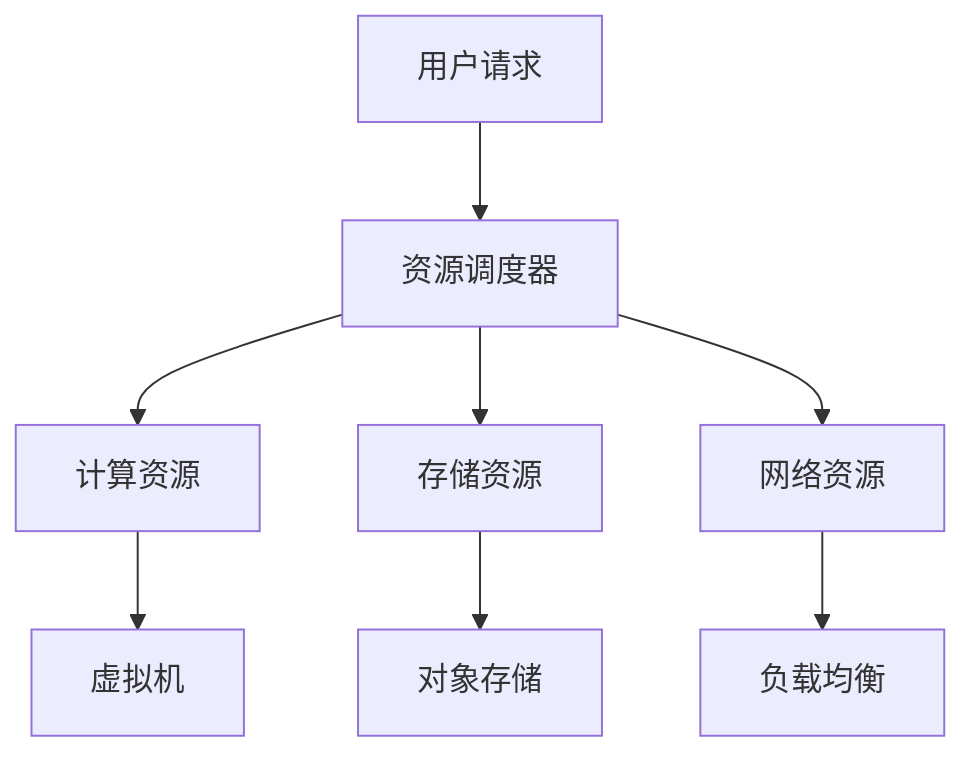

                 

### 文章标题

《阿里云2025社招架构师面试题与答案》

### 关键词

- 阿里云面试
- 架构师面试
- 面试题与答案
- 技术面试
- 云计算
- 架构设计
- 数据结构与算法
- 编程语言
- 安全与合规

### 摘要

本文旨在为即将参加阿里云2025社招架构师面试的候选人提供一份详尽的准备指南。文章将从面试策略与心态、技术核心、算法与应用、项目实战、编程语言与应用、数据库管理、系统与网络安全、软技能提升等多个维度，全面解析阿里云架构师面试中可能遇到的问题和答案。通过本文，读者将能够系统地了解面试要求，掌握关键技术和实战技巧，从而提高面试成功率。

## 第一部分：面试准备

### 第1章：面试策略与心态

在准备阿里云架构师面试的过程中，策略和心态的调整至关重要。这一章节将帮助您了解面试流程、调整心态，并掌握面试礼仪与注意事项。

### 1.1 面试前的准备工作

面试前的准备工作可以分为以下几个方面：

- **面试流程解析**：熟悉阿里云的面试流程，了解每个阶段的考核重点和目标。通常包括电话面试、在线编程测试、现场面试等。

- **面试心态调整**：保持自信，避免过度紧张。可以通过模拟面试、心理暗示等方法来调整心态。

- **面试礼仪与注意事项**：了解并遵守面试的基本礼仪，如准时到达、穿着得体、礼貌用语等。

### 1.1.1 面试流程解析

- **电话面试**：通常由招聘经理或技术专家进行，主要评估候选人的基础知识和沟通能力。常见问题包括自我介绍、项目经历、技术栈了解等。

- **在线编程测试**：通过在线平台（如LeetCode、HackerRank）进行，测试候选人的编程能力和算法理解。题目通常涵盖数据结构、算法、系统设计等方面。

- **现场面试**：包括技术面试、行为面试和小组讨论等环节。技术面试主要考察候选人的专业知识和解决问题的能力；行为面试则关注候选人的工作经历、团队合作和沟通能力。

### 1.1.2 面试心态调整

- **自信**：自信是面试中非常重要的一部分。您可以通过准备充分、熟悉自己的优势和经历来增强自信心。

- **积极**：保持积极的态度，对每个问题都要认真思考，即使遇到难题也不要轻易放弃。

- **冷静**：遇到紧张或压力时，可以尝试深呼吸、短暂休息等方法来保持冷静。

### 1.1.3 面试礼仪与注意事项

- **准时**：准时到达面试地点，如果出现交通等问题，应提前通知面试官。

- **穿着**：着装得体，穿着整洁、大方，以正式的商务装为主。

- **礼貌**：面试过程中要礼貌待人，注意用词和语气。

- **准备**：提前准备面试材料，包括简历、证书、项目案例等。

### 1.2 自我介绍与简历优化

- **自我介绍**：自我介绍应简洁明了，突出自己的优势和亮点，包括姓名、学历、工作经历、技术特长等。

- **简历优化**：简历是面试官了解您的第一窗口，应确保简历内容真实、简洁、有条理。以下是一些建议：

  - **基本信息**：包括姓名、联系方式、邮箱等。

  - **教育背景**：按时间倒序列出学历、专业、主修课程等。

  - **工作经历**：按时间倒序列出工作经历，突出负责的项目和取得的成果。

  - **技术技能**：列出熟悉的技术栈、语言、框架和工具。

  - **项目经验**：详细介绍参与的项目，包括项目背景、目标、您的角色、技术选型、遇到的问题和解决方法等。

  - **证书和荣誉**：包括相关证书、奖项等。

### 1.2.1 如何进行有效的自我介绍

- **简洁明了**：自我介绍应简洁明了，避免冗长。

- **突出亮点**：重点突出自己的优势和亮点，如技术特长、项目经验、解决问题的能力等。

- **真实可信**：自我介绍的内容应真实可信，不要夸大或虚构。

### 1.2.2 简历的撰写与优化

- **内容真实**：确保简历上的信息真实可靠，不要有虚假内容。

- **结构清晰**：简历应结构清晰，便于阅读。可以使用项目列表、技能树等形式展示。

- **突出重点**：突出自己的技术特长、项目经验和成果。

### 1.2.3 面试官关注的简历要点

- **教育背景**：面试官通常关注候选人的学历和专业，以评估其理论基础。

- **工作经历**：面试官关注候选人的工作经历，特别是与应聘职位相关的工作内容和成果。

- **技术技能**：面试官关注候选人的技术技能，以评估其技术能力和适应性。

- **项目经验**：面试官关注候选人的项目经验，以评估其实际操作能力和解决问题的能力。

### 1.3 阿里云企业文化和价值观

- **阿里云的企业文化**：阿里云秉承“客户第一、专注创新、拥抱变化、团队合作、敬业、激情、诚实、正直”的价值观。

- **核心价值观**：客户第一：客户的成功是我们最大的成功。专注创新：持续推动技术创新，提升客户体验。拥抱变化：适应快速变化的市场和技术环境。团队合作：协同作战，共同成长。敬业：对待工作认真负责，追求卓越。激情：对技术充满热情，勇于挑战。诚实：言行一致，表里如一。正直：坚守道德底线，拒绝不正当手段。

- **面试中的企业文化体现**：在面试过程中，面试官可能会通过提问了解您的价值观是否与阿里云相符。例如，提问关于团队合作、创新思维、解决问题的能力等方面的问题。因此，在面试前，了解并体现阿里云的企业文化和价值观非常重要。

### 1.4 常见面试问题解析

在面试过程中，常见的问题可以分为技术面试问题、行为面试问题和难点问题。以下是对每种类型问题的解析：

#### 1.4.1 技术面试问题

技术面试问题主要考察候选人的技术知识和解决问题的能力。以下是一些常见的技术面试问题及其解析：

- **什么是云计算？请简要介绍云计算的基本概念和服务模型。**
  - **解析**：云计算是一种通过网络提供计算资源（如服务器、存储、网络）的服务模式。云计算的基本概念包括IaaS、PaaS和SaaS。IaaS（基础设施即服务）提供虚拟化的计算资源；PaaS（平台即服务）提供开发平台和工具；SaaS（软件即服务）提供软件应用。

- **请解释一下什么是微服务架构，并简要介绍其优缺点。**
  - **解析**：微服务架构是将应用程序拆分成多个独立的、松耦合的小服务。每个服务都有自己的职责和生命周期，可以通过HTTP/REST、消息队列等通信方式交互。优点包括可扩展性强、灵活性好、易于维护等；缺点包括分布式系统带来的复杂性、服务间通信的延迟等。

- **请谈谈您对容器化技术的理解，并简要介绍Kubernetes的作用。**
  - **解析**：容器化技术是一种轻量级虚拟化技术，可以将应用程序及其依赖环境打包成容器，实现应用程序的隔离和独立部署。Kubernetes是一个开源的容器编排平台，用于自动化容器的部署、扩展和管理。它提供负载均衡、服务发现、自动滚动更新等功能。

#### 1.4.2 行为面试问题

行为面试问题主要考察候选人的工作经历、团队合作能力和解决问题的能力。以下是一些常见的行为面试问题及其解析：

- **请谈谈您在项目中遇到的一个难题，以及您是如何解决的。**
  - **解析**：回答此类问题时，可以讲述一个具体的项目经历，描述项目背景、遇到的难题、采取的解决方法以及最终结果。注意强调团队合作和个人在问题解决中的作用。

- **请描述一次您需要与团队成员协调工作的经历，以及您是如何确保项目进度的。**
  - **解析**：回答此类问题时，可以讲述一个团队合作的具体经历，描述团队组成、工作分配、沟通方式、协调策略以及项目进展情况。注意强调沟通和协调能力对项目成功的重要性。

#### 1.4.3 面试中的难点问题应对

面试中的难点问题可能涉及专业知识、实际经验和快速反应能力。以下是一些应对策略：

- **准备工作充分**：在面试前，针对可能出现的难点问题进行充分的准备和练习。

- **逻辑清晰**：回答问题时，尽量保持逻辑清晰，逐步展开论述。

- **诚实面对**：如果遇到确实难以回答的问题，可以诚实承认，并表达愿意学习的态度。

### 1.5 面试后的跟进与反思

面试后的跟进和反思对面试结果有重要影响。以下是一些关键步骤：

- **面试结果的反馈**：了解面试结果，无论是否通过，都要感谢面试官的时间和努力。

- **面试经验的总结**：总结面试过程中的优点和不足，分析面试失败的原因。

- **如何提升面试成功率**：针对总结的经验，制定改进计划，提高面试技巧和专业知识。

## 第二部分：技术核心

### 第2章：云计算基础

云计算是现代IT领域的重要方向，对于架构师来说，理解云计算的基础知识和基本概念至关重要。本章将介绍云计算的基本概念、服务模型以及云计算的优势和挑战。

### 2.1 云计算的基本概念

云计算是一种通过网络提供计算资源（如服务器、存储、网络）的服务模式。它包括以下几个关键概念：

- **计算资源**：云计算提供虚拟化的计算资源，如虚拟机、容器等。
- **存储资源**：云计算提供大规模的存储资源，包括对象存储、文件存储等。
- **网络资源**：云计算提供网络资源，包括虚拟网络、负载均衡等。
- **服务模型**：云计算的服务模型包括IaaS、PaaS和SaaS。

#### IaaS（基础设施即服务）

IaaS提供虚拟化的计算资源，用户可以根据需求自行配置和管理操作系统、网络和存储等资源。IaaS的主要优势是灵活性和可扩展性，用户可以根据需要随时增加或减少资源。典型的IaaS服务商包括阿里云、亚马逊AWS和微软Azure。

#### PaaS（平台即服务）

PaaS提供开发平台和工具，使开发者能够快速搭建应用程序。PaaS通常包括开发环境、数据库、中间件等。PaaS的主要优势是简化开发过程，提高开发效率。典型的PaaS服务商包括阿里云的ECS、AWS的EC2和微软Azure的App Service。

#### SaaS（软件即服务）

SaaS提供软件应用，用户可以直接使用，无需关心底层基础设施的维护和管理。SaaS的主要优势是方便性和低成本。典型的SaaS服务商包括阿里巴巴的钉钉、谷歌的G Suite和微软的Office 365。

### 2.2 云计算的服务模型

云计算的服务模型包括IaaS、PaaS和SaaS，每种服务模型都有其独特的特点和应用场景：

#### IaaS

- **特点**：提供虚拟化的计算资源，用户可以自定义操作系统、网络和存储等。
- **应用场景**：适用于需要高度自定义和灵活配置的场景，如大规模数据处理、游戏服务器等。

#### PaaS

- **特点**：提供开发平台和工具，简化开发过程，提高开发效率。
- **应用场景**：适用于需要快速搭建应用程序的场景，如企业应用、移动应用等。

#### SaaS

- **特点**：提供软件应用，用户可以直接使用，无需关心底层基础设施。
- **应用场景**：适用于需要方便性和低成本的场景，如办公自动化、客户关系管理等。

### 2.3 云计算的优势与挑战

云计算具有许多优势，同时也面临一些挑战：

#### 优势

- **成本效益**：云计算可以降低硬件成本和维护成本，实现按需付费。
- **弹性扩展**：云计算可以根据需求动态调整资源，提高资源利用率。
- **高可用性**：云计算通过分布式架构和容错机制，提供高可用性和可靠性。
- **灵活性**：云计算提供丰富的服务模型和工具，满足不同用户的需求。

#### 挑战

- **安全性**：云计算涉及到数据安全和隐私保护，需要采取有效的安全措施。
- **性能**：云计算的性能可能受到网络延迟和带宽限制的影响。
- **依赖性**：云计算对网络和基础设施的依赖性较高，可能影响业务的连续性。
- **合规性**：云计算需要遵守相关法规和标准，确保合规性。

### 2.4 阿里云产品与服务

阿里云是全球领先的云计算服务提供商，提供包括IaaS、PaaS和SaaS在内的多种服务。以下简要介绍阿里云的主要产品和服务：

#### IaaS产品

- **阿里云弹性计算**：提供虚拟机、容器等服务，满足不同场景的计算需求。
- **阿里云对象存储**：提供高可靠、可扩展的存储服务，适用于大规模数据存储和访问。
- **阿里云网络**：提供虚拟网络、负载均衡等服务，实现高效的网络连接和管理。

#### PaaS产品

- **阿里云开发者工具**：提供开发环境、代码管理、自动化部署等工具，简化开发流程。
- **阿里云数据库**：提供多种关系型和非关系型数据库服务，满足不同场景的数据存储需求。
- **阿里云中间件**：提供消息队列、缓存、分布式服务框架等中间件服务，提高系统的可靠性和性能。

#### SaaS产品

- **阿里云办公套件**：提供电子邮件、日历、文档等办公服务，实现企业内部的信息共享和协作。
- **阿里云客户关系管理**：提供客户管理、销售管理、客户服务等功能，帮助企业提升客户满意度。
- **阿里云人工智能服务**：提供人脸识别、语音识别、自然语言处理等服务，助力企业实现智能化转型。

### 2.5 阿里云服务的选型与应用

在选择和使用阿里云服务时，需要根据具体需求进行选型，以下是一些建议：

#### IaaS服务选型

- **计算资源**：根据计算需求选择合适的虚拟机规格，如CPU、内存、磁盘等。
- **存储资源**：根据数据存储和访问需求选择合适的存储服务，如对象存储、文件存储等。
- **网络资源**：根据网络需求配置虚拟网络、负载均衡等，实现高效的网络连接和管理。

#### PaaS服务选型

- **开发环境**：根据开发需求选择合适的开发工具和平台，如Eclipse、Visual Studio Code等。
- **数据库服务**：根据数据存储和查询需求选择合适的关系型或非关系型数据库服务。
- **中间件服务**：根据业务需求选择合适的中间件服务，如消息队列、缓存等。

#### SaaS服务选型

- **办公服务**：根据企业办公需求选择合适的办公套件，如电子邮件、文档等。
- **客户关系管理**：根据企业客户管理需求选择合适的客户关系管理服务。
- **人工智能服务**：根据业务需求选择合适的人工智能服务，如人脸识别、语音识别等。

### 2.6 阿里云技术的最佳实践

在阿里云的使用过程中，遵循最佳实践可以提升系统的性能、可靠性和安全性。以下是一些阿里云技术的最佳实践：

#### IaaS最佳实践

- **资源规划**：合理规划计算、存储和网络资源，避免资源浪费和性能瓶颈。
- **安全防护**：启用安全组、防火墙等安全措施，确保系统的安全性。
- **监控与优化**：使用监控工具（如阿里云监控）实时监控系统性能，及时优化和调整。

#### PaaS最佳实践

- **开发规范**：遵循代码规范和开发流程，提高代码质量和可维护性。
- **数据库优化**：定期备份和优化数据库，提高数据存储和查询性能。
- **中间件配置**：合理配置中间件参数，优化系统的性能和可靠性。

#### SaaS最佳实践

- **用户管理**：合理分配用户权限，确保数据安全和用户隐私。
- **数据备份**：定期备份关键数据，防止数据丢失和损坏。
- **服务监控**：实时监控服务性能和稳定性，及时处理故障和异常。

### 2.7 云计算资源管理平台

云计算资源管理平台是一个集计算、存储、网络等资源管理于一体的系统。以下是一个简单的云计算资源管理平台的Mermaid流程图：



在云计算资源管理平台中，用户请求通过资源调度器分配到不同的资源，如计算资源、存储资源和网络资源。资源调度器根据资源的使用情况和需求，动态调整资源的分配和配置。

### 2.8 云计算中的核心算法原理

在云计算中，核心算法在资源调度、负载均衡、分布式存储等方面发挥着关键作用。以下介绍一些常见的云计算核心算法原理：

#### 负载均衡算法

负载均衡算法旨在将流量分配到不同的服务器或节点，以避免单点过载和性能瓶颈。以下是一种简单的轮询负载均衡算法的伪代码：

```pseudo
function LoadBalance(request):
    servers = GetAvailableServers()
    next_server = servers[轮询索引 % servers.length]
    轮询索引 += 1
    return next_server
```

在该算法中，轮询索引用于确定下一个处理请求的服务器。每次请求都会被分配到下一个服务器，然后轮询索引增加。

#### 资源调度算法

资源调度算法用于在云计算环境中分配资源，以最大化资源利用率和系统性能。以下是一种基于优先级的资源调度算法的伪代码：

```pseudo
function ResourceSchedule(job):
    highest_priority_job = None
    for job in jobs:
        if job.priority > highest_priority_job.priority:
            highest_priority_job = job
    return highest_priority_job
```

在该算法中，系统遍历所有作业，根据优先级选择下一个需要调度的作业。优先级高的作业会优先被调度。

#### 分布式存储算法

分布式存储算法用于将数据分布存储在多个节点上，以提高数据可靠性和访问速度。以下是一种基于一致性哈希的分布式存储算法的伪代码：

```pseudo
function Hash(key):
    return key % N

function StoreData(key, value):
    hash_value = Hash(key)
    server = GetServer(hash_value)
    StoreOnServer(server, key, value)

function GetData(key):
    hash_value = Hash(key)
    server = GetServer(hash_value)
    return RetrieveFromServer(server, key)
```

在该算法中，数据根据哈希值分配到不同的服务器上。一致性哈希确保数据的存储和访问在服务器变化时保持一致性。

### 2.9 云计算中的数学模型

在云计算中，数学模型用于描述和优化系统性能、资源分配和成本控制。以下介绍一些常见的云计算数学模型：

#### 资源利用率模型

资源利用率模型用于计算系统中资源的利用率。以下是一个简单的资源利用率模型的公式：

$$
利用率 = \frac{实际使用时间}{总时间}
$$

其中，实际使用时间表示资源被实际使用的时间，总时间表示资源总的时间。

#### 成本模型

成本模型用于计算系统的总成本。以下是一个简单的成本模型公式：

$$
总成本 = (CPU价格 \times CPU使用量) + (存储价格 \times 存储使用量) + (网络价格 \times 网络使用量)
$$

其中，CPU价格、存储价格和网络价格分别表示单位时间的CPU、存储和网络的使用成本，CPU使用量、存储使用量和网络使用量分别表示系统在单位时间内对CPU、存储和网络的使用量。

#### 负载均衡模型

负载均衡模型用于优化系统性能，通过平衡负载来提高系统的响应速度。以下是一个简单的负载均衡模型公式：

$$
负载均衡 = \frac{总负载}{节点数量}
$$

其中，总负载表示系统在单位时间内处理的请求总量，节点数量表示系统中节点的数量。

### 2.10 云计算中的实践案例

以下是一个云计算资源管理平台的实践案例，该平台用于管理阿里云的虚拟机、对象存储和负载均衡等资源。

#### 案例背景

某企业需要搭建一个云计算资源管理平台，以管理和监控其阿里云上的资源。平台需要支持以下功能：

- 资源监控：实时监控虚拟机、对象存储和负载均衡等资源的性能指标。
- 资源调度：根据资源使用情况，动态调整资源的分配和配置。
- 负载均衡：通过负载均衡算法，将请求分配到不同的虚拟机上，确保系统的性能和响应速度。

#### 技术选型

- **虚拟机管理**：使用阿里云的ECS服务，实现虚拟机创建、启动、停止和监控等功能。
- **对象存储管理**：使用阿里云的OSS服务，实现对象的存储、检索和监控等功能。
- **负载均衡管理**：使用阿里云的SLB服务，实现请求的负载均衡和流量分发。

#### 实现步骤

1. **资源监控**：通过阿里云API获取虚拟机、对象存储和负载均衡的性能指标，如CPU使用率、内存使用率、网络流量等。使用Kafka和Kibana等工具实现实时监控和可视化。

2. **资源调度**：根据性能指标和资源使用情况，动态调整虚拟机、对象存储和负载均衡的配置。使用Spring Cloud等微服务框架实现资源调度的自动化和分布式。

3. **负载均衡**：使用阿里云的SLB服务，实现请求的负载均衡和流量分发。根据请求的URL、用户ID等维度，动态调整负载均衡策略。

#### 代码解读

以下是一个简单的虚拟机监控和调度的代码示例：

```java
@RestController
@RequestMapping("/vm")
public class VmController {

    @Autowired
    private VmService vmService;

    @GetMapping("/{id}")
    public VmInfo getVmInfo(@PathVariable String id) {
        return vmService.getVmInfo(id);
    }

    @PostMapping("/{id}/scale")
    public ResponseEntity<?> scaleVm(@PathVariable String id, @RequestBody ScaleRequest request) {
        vmService.scaleVm(id, request);
        return ResponseEntity.ok().build();
    }
}

@Service
public class VmService {

    public VmInfo getVmInfo(String id) {
        // 获取虚拟机信息
        return new VmInfo(id, "Running", 80, 20, 10);
    }

    public void scaleVm(String id, ScaleRequest request) {
        // 调整虚拟机规格
        System.out.println("Scaling VM " + id + " to " + request.getCore() + " cores and " + request.getMemory() + " GB memory");
    }
}

public class VmInfo {
    private String id;
    private String status;
    private int core;
    private int memory;
    private int disk;

    // 构造函数、getter和setter方法
}
```

在该示例中，`VmController` 类负责接收和响应虚拟机监控和调度的请求。`VmService` 类负责实现具体的虚拟机监控和调度逻辑。`VmInfo` 类用于表示虚拟机的信息。

### 2.11 云计算中的项目管理

在云计算项目中，项目管理是一个关键环节，确保项目按时、按质量完成。以下介绍云计算项目管理的几个关键步骤：

#### 项目启动

- **项目立项**：明确项目目标和范围，制定项目计划。
- **资源分配**：确定项目团队成员和职责，分配资源和预算。
- **风险评估**：识别项目风险，制定风险应对策略。

#### 项目执行

- **任务分解**：将项目任务分解为可执行的任务单元，制定任务计划。
- **进度跟踪**：实时监控项目进度，确保任务按计划完成。
- **问题管理**：及时发现和解决项目中的问题，确保项目顺利进行。

#### 项目收尾

- **成果验收**：完成项目任务，进行成果验收。
- **总结评估**：总结项目执行过程中的经验教训，为后续项目提供参考。

### 2.12 云计算中的团队协作

在云计算项目中，团队协作是项目成功的关键。以下介绍云计算中的团队协作几个关键要素：

#### 沟通协作

- **明确职责**：确保每个团队成员都清楚自己的职责和任务。
- **定期会议**：定期召开团队会议，讨论项目进展和问题。
- **即时沟通**：通过即时通讯工具，如Slack、钉钉等，保持沟通畅通。

#### 项目管理工具

- **任务管理**：使用任务管理工具，如Jira、Trello等，跟踪任务进度和完成情况。
- **文档管理**：使用文档管理工具，如Confluence、GitLab等，共享和协作文档。

#### 知识管理

- **文档记录**：记录项目过程中积累的知识和经验，形成知识库。
- **培训与分享**：定期组织培训和学习活动，提升团队整体能力。

## 第三部分：算法与应用

### 第3章：常用算法

算法是计算机科学的核心，对于架构师来说，掌握常用算法对于解决复杂问题和优化系统性能至关重要。本章将介绍一些常用算法的基本概念、原理和应用。

### 3.1 数据结构与算法基础

数据结构和算法是计算机科学的基础，数据结构用于组织和管理数据，算法用于解决问题。以下是一些常见的数据结构和算法：

#### 常见数据结构

- **数组**：用于存储固定数量的元素，支持随机访问。
- **链表**：用于存储动态数量的元素，支持插入和删除操作。
- **栈**：后进先出（LIFO）的数据结构，用于存储和管理数据。
- **队列**：先进先出（FIFO）的数据结构，用于存储和管理数据。
- **树**：用于表示层次关系，如二叉树、平衡树等。
- **图**：用于表示复杂的关系，如有向图、无向图等。

#### 常见算法

- **排序算法**：用于对数据进行排序，如冒泡排序、快速排序、归并排序等。
- **查找算法**：用于在数据中查找特定元素，如二分查找、线性查找等。
- **图算法**：用于解决图相关的问题，如最短路径算法、拓扑排序等。
- **动态规划**：用于解决具有重叠子问题和最优子结构特征的问题，如斐波那契数列、背包问题等。

### 3.2 排序算法与搜索算法

排序算法和搜索算法是计算机科学中的重要组成部分，以下介绍几种常见的排序和搜索算法。

#### 排序算法

- **冒泡排序**：通过反复交换相邻的未排序元素，直到整个序列有序。
  - **伪代码**：
    ```pseudo
    for i = 0 to n-1
        for j = 0 to n-i-1
            if arr[j] > arr[j+1]
                swap(arr[j], arr[j+1])
    ```
  
- **快速排序**：通过递归将序列分为两部分，然后对两部分分别进行排序。
  - **伪代码**：
    ```pseudo
    function quicksort(arr, low, high)
        if low < high
            pi = partition(arr, low, high)
            quicksort(arr, low, pi-1)
            quicksort(arr, pi+1, high)
    
    function partition(arr, low, high)
        pivot = arr[high]
        i = low - 1
        for j = low to high-1
            if arr[j] < pivot
                i = i + 1
                swap(arr[i], arr[j])
        swap(arr[i+1], arr[high])
        return i + 1
    ```

- **归并排序**：通过递归将序列分为两部分，然后对两部分分别进行排序并合并。
  - **伪代码**：
    ```pseudo
    function mergeSort(arr, low, high)
        if low < high
            mid = (low + high) / 2
            mergeSort(arr, low, mid)
            mergeSort(arr, mid+1, high)
            merge(arr, low, mid, high)
    
    function merge(arr, low, mid, high)
        n1 = mid - low + 1
        n2 = high - mid
        L[] = new array of size n1
        R[] = new array of size n2
        for i = 0 to n1-1
            L[i] = arr[low + i]
        for j = 0 to n2-1
            R[j] = arr[mid + 1 + j]
        i = 0; j = 0; k = low
        while i < n1 and j < n2
            if L[i] <= R[j]
                arr[k] = L[i]
                i = i + 1
            else
                arr[k] = R[j]
                j = j + 1
            k = k + 1
        while i < n1
            arr[k] = L[i]
            i = i + 1
            k = k + 1
        while j < n2
            arr[k] = R[j]
            j = j + 1
            k = k + 1
    ```

#### 搜索算法

- **二分查找**：在一个有序的数组中，通过递归或迭代方式查找特定元素。
  - **伪代码**：
    ```pseudo
    function binarySearch(arr, low, high, target)
        if low <= high
            mid = (low + high) / 2
            if arr[mid] == target
                return mid
            else if arr[mid] < target
                return binarySearch(arr, mid+1, high, target)
            else
                return binarySearch(arr, low, mid-1, target)
        else
            return -1
    ```

- **线性查找**：在一个未排序的数组中，逐个比较元素直到找到目标元素。
  - **伪代码**：
    ```pseudo
    function linearSearch(arr, target)
        for each element in arr
            if element == target
                return index
        return -1
    ```

### 3.3 算法复杂度分析

算法复杂度分析是评估算法性能的重要手段，用于描述算法的时间和空间需求。以下介绍算法复杂度的基本概念和计算方法：

#### 时间复杂度

- **定义**：算法在执行过程中所需要的基本操作次数与输入规模之间的关系。
- **计算**：通常用大O符号（O）表示，如O(1)、O(n)、O(n^2)等。

#### 空间复杂度

- **定义**：算法在执行过程中所需要的额外空间与输入规模之间的关系。
- **计算**：通常用大O符号（O）表示，如O(1)、O(n)、O(n^2)等。

### 3.4 算法应用与优化

算法不仅在理论研究中具有重要意义，在实际应用中也发挥着关键作用。以下介绍一些常见算法在实际应用中的优化方法：

#### 冒泡排序优化

- **插入排序**：通过在排序过程中插入未排序的元素到已排序序列的正确位置，减少不必要的交换操作。
  - **伪代码**：
    ```pseudo
    function insertionSort(arr)
        for i = 1 to n-1
            key = arr[i]
            j = i - 1
            while j >= 0 and arr[j] > key
                arr[j + 1] = arr[j]
                j = j - 1
            arr[j + 1] = key
    ```

#### 快速排序优化

- **随机化选择**：在每次排序前随机选择一个基准元素，减少最坏情况的发生概率。
  - **伪代码**：
    ```pseudo
    function quicksortRandomized(arr, low, high)
        if low < high
            pivotIndex = randomizedPartition(arr, low, high)
            quicksortRandomized(arr, low, pivotIndex - 1)
            quicksortRandomized(arr, pivotIndex + 1, high)
    
    function randomizedPartition(arr, low, high)
        pivotIndex = random integer between low and high
        swap(arr[pivotIndex], arr[high])
        return partition(arr, low, high)
    ```

#### 动态规划优化

- **备忘录**：通过存储已经计算过的子问题的解，避免重复计算。
  - **伪代码**：
    ```pseudo
    function fibonacci(n)
        if n <= 1
            return n
        fib[n] = fibonacci(n - 1) + fibonacci(n - 2)
        return fib[n]
    ```

#### 分治优化

- **递归树**：通过分析递归树的深度和节点数量，优化递归算法的时间复杂度。
  - **伪代码**：
    ```pseudo
    function mergeSort(arr, low, high)
        if low < high
            mid = (low + high) / 2
            mergeSort(arr, low, mid)
            mergeSort(arr, mid+1, high)
            merge(arr, low, mid, high)
    ```

### 3.5 算法在云计算中的应用

云计算中的许多问题可以通过算法优化来解决，以下介绍一些算法在云计算中的应用：

#### 负载均衡算法

- **加权轮询**：根据服务器的负载情况，动态调整请求分配的比例。
  - **伪代码**：
    ```pseudo
    function weightedRoundRobin(servers)
        while requests
            for each server in servers
                if server.load < server.threshold
                    server.load += 1
                    dispatch request to server
                    break
    ```

#### 资源调度算法

- **贪心算法**：选择当前最优的决策，逐步达到全局最优。
  - **伪代码**：
    ```pseudo
    function greedyResourceSchedule(availableResources, jobQueue)
        while jobQueue
            job = jobQueue.pop()
            if canFit(job, availableResources)
                schedule job
                update availableResources
    ```

#### 数据压缩算法

- **哈夫曼编码**：根据字符出现的频率，构建哈夫曼树并进行编码。
  - **伪代码**：
    ```pseudo
    function huffmanEncoding(text)
        frequency = countFrequency(text)
        tree = buildHuffmanTree(frequency)
        encoding = encode(text, tree)
        return encoding
    ```

### 3.6 算法在人工智能中的应用

人工智能中的许多任务需要算法的支持，以下介绍一些算法在人工智能中的应用：

#### 机器学习算法

- **线性回归**：通过最小二乘法拟合数据，预测连续值。
  - **伪代码**：
    ```pseudo
    function linearRegression(x, y)
        coefficients = solveLinearEquation(x, y)
        return coefficients
    ```

- **决策树**：通过递归划分数据，构建分类或回归模型。
  - **伪代码**：
    ```pseudo
    function buildDecisionTree(data)
        if data is pure
            return leaf node with class label
        else
            bestFeature = selectBestFeature(data)
            leftChild = splitData(data, bestFeature, lessThan)
            rightChild = splitData(data, bestFeature, greaterThan)
            return decision node with bestFeature and children leftChild and rightChild
    ```

#### 深度学习算法

- **卷积神经网络**：通过多层卷积和池化操作，提取图像特征。
  - **伪代码**：
    ```pseudo
    function convolutionalNeuralNetwork(inputs, weights)
        for each layer
            activations = convolve(inputs, weights)
            activations = applyPooling(activations)
        return activations
    ```

- **循环神经网络**：通过递归连接，处理序列数据。
  - **伪代码**：
    ```pseudo
    function recurrentNeuralNetwork(inputs, weights)
        hiddenState = initializeHiddenState()
        for each time step
            input = inputs[t]
            hiddenState = applyRNN(input, hiddenState, weights)
        return hiddenState
    ```

### 3.7 算法在实际项目中的应用

以下是一个云计算资源管理平台的项目案例，该平台使用算法优化资源分配和调度。

#### 项目背景

某企业需要搭建一个云计算资源管理平台，以优化其云计算资源的利用率和性能。平台需要支持以下功能：

- 资源监控：实时监控虚拟机、对象存储和负载均衡等资源的性能指标。
- 资源调度：根据资源使用情况，动态调整资源的分配和配置。
- 负载均衡：通过负载均衡算法，将请求分配到不同的虚拟机上，确保系统的性能和响应速度。

#### 技术选型

- **资源监控**：使用Prometheus和Grafana进行资源监控和可视化。
- **资源调度**：使用Kubernetes进行资源调度和管理。
- **负载均衡**：使用Nginx进行负载均衡和流量分发。

#### 实现步骤

1. **资源监控**：通过Prometheus采集虚拟机、对象存储和负载均衡的性能指标，使用Grafana进行可视化展示。
2. **资源调度**：使用Kubernetes进行资源调度和管理，根据资源使用情况和需求动态调整虚拟机、对象存储和负载均衡的配置。
3. **负载均衡**：使用Nginx进行负载均衡和流量分发，根据请求的URL、用户ID等维度，动态调整负载均衡策略。

#### 代码解读

以下是一个简单的Kubernetes资源调度和调优的代码示例：

```yaml
apiVersion: apps/v1
kind: Deployment
metadata:
  name: my-app
spec:
  replicas: 3
  selector:
    matchLabels:
      app: my-app
  template:
    metadata:
      labels:
        app: my-app
    spec:
      containers:
      - name: my-app
        image: my-app:latest
        resources:
          limits:
            cpu: "1"
            memory: "512Mi"
          requests:
            cpu: "0.5"
            memory: "256Mi"
```

在该示例中，`Deployment` 定义了应用的副本数量和资源限制。通过设置`requests`和`limits`，可以控制应用的CPU和内存使用量，从而实现资源调优。

### 3.8 算法在系统优化中的应用

在系统优化中，算法用于优化系统的性能、可靠性和安全性。以下介绍一些算法在系统优化中的应用：

#### 性能优化

- **响应时间优化**：通过算法优化，减少系统的响应时间。
  - **算法**：基于队列调度算法，优化请求的处理顺序。
  - **实现**：使用优先队列（如斐波那契堆）实现高效调度。

#### 可靠性优化

- **故障检测**：通过算法检测系统的故障和异常。
  - **算法**：基于分布式一致性算法，确保系统状态的一致性。
  - **实现**：使用Paxos算法或Raft算法实现分布式一致性。

#### 安全性优化

- **访问控制**：通过算法实现细粒度的访问控制。
  - **算法**：基于访问控制列表（ACL）或基于角色的访问控制（RBAC）。
  - **实现**：使用ACL或RBAC框架实现访问控制。

### 3.9 算法在云计算中的未来发展趋势

随着云计算的不断发展，算法在云计算中的应用将越来越广泛。以下介绍一些算法在云计算中的未来发展趋势：

#### 自动化与智能化

- **自动化调度**：通过机器学习算法，实现自动化的资源调度和优化。
- **智能化监控**：通过深度学习算法，实现智能化的性能监控和故障检测。

#### 边缘计算

- **边缘算法优化**：针对边缘计算的特点，优化算法以减少延迟和提高性能。
- **边缘智能**：通过边缘计算设备，实现本地数据处理和智能决策。

#### 增强现实与虚拟现实

- **实时渲染算法**：通过算法优化，实现实时渲染和低延迟的VR/AR应用。
- **智能交互算法**：通过深度学习算法，实现智能化的交互和场景识别。

### 3.10 算法在实际案例中的应用

以下是一个云计算资源管理平台的实际案例，该平台使用多种算法实现资源监控、调度和优化。

#### 项目背景

某大型互联网公司需要搭建一个云计算资源管理平台，以优化其云计算资源的利用率和性能。平台需要支持以下功能：

- **资源监控**：实时监控虚拟机、容器、对象存储等资源的性能指标。
- **资源调度**：根据资源使用情况和需求，动态调整资源的分配和配置。
- **负载均衡**：通过负载均衡算法，确保系统的性能和响应速度。

#### 技术选型

- **资源监控**：使用Prometheus和Grafana进行资源监控和可视化。
- **资源调度**：使用Kubernetes进行资源调度和管理。
- **负载均衡**：使用Nginx进行负载均衡和流量分发。

#### 实现步骤

1. **资源监控**：通过Prometheus采集虚拟机、容器、对象存储等资源的性能指标，使用Grafana进行可视化展示。
2. **资源调度**：使用Kubernetes进行资源调度和管理，根据资源使用情况和需求动态调整虚拟机、容器、对象存储的配置。
3. **负载均衡**：使用Nginx进行负载均衡和流量分发，根据请求的URL、用户ID等维度，动态调整负载均衡策略。

#### 代码解读

以下是一个简单的Kubernetes资源调度和调优的代码示例：

```yaml
apiVersion: apps/v1
kind: Deployment
metadata:
  name: my-app
spec:
  replicas: 3
  selector:
    matchLabels:
      app: my-app
  template:
    metadata:
      labels:
        app: my-app
    spec:
      containers:
      - name: my-app
        image: my-app:latest
        resources:
          limits:
            cpu: "1"
            memory: "512Mi"
          requests:
            cpu: "0.5"
            memory: "256Mi"
```

在该示例中，`Deployment` 定义了应用的副本数量和资源限制。通过设置`requests`和`limits`，可以控制应用的CPU和内存使用量，从而实现资源调优。

## 第四部分：项目实战

### 第4章：项目实战

在实际工作中，架构师不仅需要掌握理论知识，还需要具备实际项目经验。本章将通过三个实际项目案例，展示如何运用所学知识解决实际问题，并详细解析每个项目的背景、目标、技术选型、实现过程和代码解读。

### 4.1 实战案例一：云计算资源管理平台

#### 项目背景

某企业希望搭建一个云计算资源管理平台，以优化其云计算资源的利用率和性能。该平台需要支持以下功能：

- **资源监控**：实时监控虚拟机、容器、对象存储等资源的性能指标。
- **资源调度**：根据资源使用情况和需求，动态调整资源的分配和配置。
- **负载均衡**：通过负载均衡算法，确保系统的性能和响应速度。

#### 项目目标

- 实现资源监控和可视化。
- 实现自动化资源调度和配置。
- 实现高效负载均衡，提高系统的性能和可靠性。

#### 技术选型

- **资源监控**：使用Prometheus和Grafana。
- **资源调度**：使用Kubernetes。
- **负载均衡**：使用Nginx。

#### 实现过程

1. **资源监控**：

   使用Prometheus进行资源监控，采集虚拟机、容器、对象存储等资源的性能指标。使用Grafana进行数据可视化展示。

   ```shell
   # 安装Prometheus
   docker run -d --name prometheus -p 9090:9090 prom/prometheus

   # 安装Grafana
   docker run -d --name grafana -p 3000:3000 grafana/grafana
   ```

2. **资源调度**：

   使用Kubernetes进行资源调度和管理，根据资源使用情况和需求动态调整虚拟机、容器、对象存储的配置。

   ```yaml
   apiVersion: apps/v1
   kind: Deployment
   metadata:
     name: my-app
   spec:
     replicas: 3
     selector:
       matchLabels:
         app: my-app
   template:
     metadata:
       labels:
         app: my-app
     spec:
       containers:
       - name: my-app
         image: my-app:latest
         resources:
           limits:
             cpu: "1"
             memory: "512Mi"
           requests:
             cpu: "0.5"
             memory: "256Mi"
   ```

3. **负载均衡**：

   使用Nginx进行负载均衡和流量分发，根据请求的URL、用户ID等维度，动态调整负载均衡策略。

   ```shell
   # 安装Nginx
   docker run -d --name nginx -p 80:80 nginx
   ```

#### 代码解读

以下是一个简单的Kubernetes资源调度和调优的代码示例：

```yaml
apiVersion: apps/v1
kind: Deployment
metadata:
  name: my-app
spec:
  replicas: 3
  selector:
    matchLabels:
      app: my-app
  template:
    metadata:
      labels:
        app: my-app
    spec:
      containers:
      - name: my-app
        image: my-app:latest
        resources:
          limits:
            cpu: "1"
            memory: "512Mi"
          requests:
            cpu: "0.5"
            memory: "256Mi"
```

在该示例中，`Deployment` 定义了应用的副本数量和资源限制。通过设置`requests`和`limits`，可以控制应用的CPU和内存使用量，从而实现资源调优。

### 4.2 实战案例二：AI推荐系统

#### 项目背景

某电子商务平台希望搭建一个AI推荐系统，以提升用户购物体验和增加销售额。系统需要支持以下功能：

- **用户行为分析**：分析用户的历史行为数据，包括浏览、购买、收藏等。
- **商品推荐**：根据用户行为数据和商品属性，为用户推荐感兴趣的商品。
- **实时更新**：根据用户实时行为，动态调整推荐结果。

#### 项目目标

- 构建一个高效的推荐引擎，提高用户点击率和转化率。
- 提升用户满意度，增强用户忠诚度。

#### 技术选型

- **用户行为分析**：使用Hadoop生态系统处理海量用户行为数据。
- **商品推荐**：使用协同过滤算法和机器学习算法进行推荐。
- **实时更新**：使用消息队列和缓存技术实现实时推荐。

#### 实现过程

1. **用户行为分析**：

   使用Hadoop生态系统（HDFS、MapReduce、Hive）对用户行为数据进行分析和处理。

   ```shell
   # 安装Hadoop
   hadoop version
   ```

2. **商品推荐**：

   使用协同过滤算法（User-based和Item-based）和机器学习算法（基于模型的协同过滤、矩阵分解）进行商品推荐。

   ```python
   # 使用协同过滤算法进行推荐
   from surprise import KNNWithMeans
   from surprise import Dataset
   from surprise import accuracy
   from surprise.model_selection import train_test_split

   # 创建训练集和测试集
   trainset = Dataset.load_from_folds('ratings.csv', k=3)
   testset = trainset.build_full_trainset()

   # 创建协同过滤模型
   algo = KNNWithMeans(k=50, sim_options={'name': 'cosine', 'user_based': True})

   # 训练模型
   algo.fit(trainset)

   # 预测测试集
   test_pred = algo.test(testset)

   # 计算准确率
   accuracy.rmse(test_pred, testset)
   ```

3. **实时更新**：

   使用消息队列（如Kafka）和缓存技术（如Redis）实现实时推荐。

   ```shell
   # 安装Kafka
   kafka-topics --create --zookeeper localhost:2181 --replication-factor 1 --partitions 1 --topic my-recommendations
   ```

#### 代码解读

以下是一个简单的协同过滤算法的代码示例：

```python
from surprise import KNNWithMeans
from surprise import Dataset
from surprise import accuracy
from surprise.model_selection import train_test_split

# 创建训练集和测试集
trainset = Dataset.load_from_folds('ratings.csv', k=3)
testset = trainset.build_full_trainset()

# 创建协同过滤模型
algo = KNNWithMeans(k=50, sim_options={'name': 'cosine', 'user_based': True})

# 训练模型
algo.fit(trainset)

# 预测测试集
test_pred = algo.test(testset)

# 计算准确率
accuracy.rmse(test_pred, testset)
```

在该示例中，使用`KNNWithMeans`算法进行推荐，通过训练集训练模型，并在测试集上进行预测和评估。

### 4.3 实战案例三：大数据实时分析平台

#### 项目背景

某大型互联网公司希望搭建一个大数据实时分析平台，以实时处理和分析海量数据，支持业务决策。平台需要支持以下功能：

- **数据采集**：实时采集各种来源的数据，如日志、流数据等。
- **数据处理**：对采集到的数据进行清洗、转换和分析。
- **实时分析**：根据业务需求，实时生成分析结果，支持可视化展示。

#### 项目目标

- 构建一个高效、稳定、可扩展的大数据实时分析平台。
- 提高数据处理的效率和准确性，支持实时业务决策。

#### 技术选型

- **数据采集**：使用Flume、Kafka进行数据采集和传输。
- **数据处理**：使用Spark进行数据处理和分析。
- **实时分析**：使用Elasticsearch和Kibana进行实时分析和可视化。

#### 实现过程

1. **数据采集**：

   使用Flume和Kafka进行数据采集和传输。

   ```shell
   # 安装Flume
   sudo apt-get install flume
   ```

   ```shell
   # 安装Kafka
   tar -xzf kafka_2.12-2.4.1.tgz
   cd kafka_2.12-2.4.1
   bin/kafka-server-start.sh config/server.properties
   ```

2. **数据处理**：

   使用Spark进行数据处理和分析。

   ```shell
   # 安装Spark
   tar -xzf spark-2.4.1-bin-hadoop2.7.tgz
   cd spark-2.4.1-bin-hadoop2.7
   bin/spark-submit --class org.apache.spark.examples.SparkPi pi.py
   ```

3. **实时分析**：

   使用Elasticsearch和Kibana进行实时分析和可视化。

   ```shell
   # 安装Elasticsearch
   tar -xvf elasticsearch-6.8.2.tar.gz
   ./bin/elasticsearch
   ```

   ```shell
   # 安装Kibana
   tar -xvf kibana-7.10.0-linux-x86_64.tar.gz
   ./bin/kibana
   ```

#### 代码解读

以下是一个简单的Spark数据处理和实时分析的代码示例：

```python
from pyspark.sql import SparkSession

# 创建Spark会话
spark = SparkSession.builder.appName("RealtimeDataAnalysis").getOrCreate()

# 读取Kafka数据
kafka_df = spark.read.format("kafka").option("kafka.bootstrap.servers", "localhost:9092").option("subscribe", "my_topic").load()

# 数据处理
processed_df = kafka_df.selectExpr("CAST(value AS STRING) as value")

# 实时分析
processed_df.createOrReplaceTempView("realtime_data")
spark.sql("SELECT * FROM realtime_data").show()

# 关闭Spark会话
spark.stop()
```

在该示例中，使用Spark读取Kafka数据，进行数据处理和分析，并将结果展示在Kibana中。

### 4.4 实战案例总结

通过以上三个实际项目案例，我们可以看到如何运用所学知识解决实际问题，实现云计算资源管理、AI推荐系统和大数据实时分析等应用。在实际项目中，技术选型和实现过程都非常重要，需要根据具体需求和场景进行灵活调整。同时，代码解读和优化也是项目成功的关键，通过深入了解代码实现，可以提高系统的性能和可靠性。

### 4.5 项目实战经验总结

在项目实战中，我们积累了丰富的经验，以下是一些经验总结：

- **需求分析**：深入理解项目需求，确保实现的功能符合实际业务需求。
- **技术选型**：根据项目需求，选择合适的技术栈和工具，确保系统的性能和稳定性。
- **代码解读**：深入了解代码实现，优化性能和可靠性，提高代码的可维护性。
- **团队协作**：加强团队协作，确保项目按时、按质量完成。
- **持续学习**：关注新技术和发展趋势，不断学习和提升自己的技术能力。

通过以上经验总结，我们可以更好地应对未来的项目挑战，提高项目成功率。

## 第五部分：编程语言与应用

### 第5章：编程语言与应用

在IT行业中，编程语言是架构师必备的工具。不同的编程语言适用于不同的场景，了解它们的特性和应用场景对于架构师来说至关重要。本章将介绍Python、Java和JavaScript这三种常用的编程语言，并探讨它们在云计算、大数据和人工智能等领域的应用。

### 5.1 Python编程

Python是一种高级、通用、解释型的编程语言，以其简洁的语法和强大的库支持著称。Python在云计算、大数据和人工智能等领域有着广泛的应用。

#### 5.1.1 Python基础语法

Python的基础语法包括变量、数据类型、运算符、流程控制等。以下是一些Python基础语法的示例：

- **变量**：在Python中，变量不需要声明，直接赋值即可。
  ```python
  x = 10
  name = "John"
  ```

- **数据类型**：Python支持多种数据类型，如整数、浮点数、字符串、列表、元组、字典和集合。
  ```python
  integer = 100
  float_number = 3.14
  string = "Hello, World!"
  list = [1, 2, 3, 4]
  tuple = (1, 2, 3)
  dict = {"name": "John", "age": 30}
  set = {1, 2, 3}
  ```

- **运算符**：Python支持常见的数学运算符、比较运算符和逻辑运算符。
  ```python
  a = 5
  b = 3
  print(a + b)  # 加法
  print(a - b)  # 减法
  print(a * b)  # 乘法
  print(a / b)  # 除法
  print(a == b)  # 等于
  print(a != b)  # 不等于
  print(a > b)  # 大于
  print(a < b)  # 小于
  ```

- **流程控制**：Python支持条件语句和循环语句。
  ```python
  if condition:
      print("条件成立")
  else:
      print("条件不成立")
  
  for i in range(5):
      print(i)
  
  while condition:
      print("循环体")
      if break_condition:
          break
  ```

#### 5.1.2 Python高级特性

Python的高级特性包括函数、类、模块、生成器和异步编程等。

- **函数**：Python中的函数是一种可重用的代码块，可以接收参数并返回值。
  ```python
  def greet(name):
      return "Hello, " + name
  
  print(greet("John"))
  ```

- **类**：Python中的类是一种对象导向编程的构造块，用于创建对象。
  ```python
  class Person:
      def __init__(self, name, age):
          self.name = name
          self.age = age
  
      def greet(self):
          return "Hello, " + self.name
  
  john = Person("John", 30)
  print(john.greet())
  ```

- **模块**：Python的模块是一种组织代码的方式，可以将功能相关的代码放在一个模块中。
  ```python
  # module1.py
  def greet():
      return "Hello from module1"
  
  # main.py
  import module1
  print(module1.greet())
  ```

- **生成器**：Python的生成器是一种延迟计算的对象，用于生成序列中的值。
  ```python
  def countdown(n):
      print("Starting")
      while n > 0:
          yield n
          n -= 1
  
  for number in countdown(5):
      print(number)
  ```

- **异步编程**：Python的异步编程是一种基于事件驱动的编程模型，用于提高程序的并发性能。
  ```python
  import asyncio
  
  async def hello_world():
      print("Hello, world!")
  
  asyncio.run(hello_world())
  ```

#### 5.1.3 Python在云计算与大数据中的应用

Python在云计算和大数据领域有着广泛的应用，以下介绍一些常见的Python库和应用场景：

- **云计算**：Python可以与各种云计算平台（如阿里云、AWS、Azure）进行集成，用于自动化资源管理、部署和监控。

  - **Tornado**：用于构建高性能、可扩展的Web应用程序。
    ```python
    import tornado.web
    
    class MainHandler(tornado.web.RequestHandler):
        def get(self):
            self.write("Hello, world!")
    
    application = tornado.web.Application([
        (r"/", MainHandler),
    ])
    application.listen(8888)
    tornado.ioloop.IOLoop.current().start()
    ```

  - **Boto3**：用于与AWS进行集成，进行各种操作，如创建和删除EC2实例、管理S3存储等。
    ```python
    import boto3
    
    s3 = boto3.resource('s3')
    bucket = s3.create_bucket(Bucket='my-bucket')
    ```

- **大数据**：Python可以与Hadoop生态系统（如HDFS、MapReduce、Hive）进行集成，用于处理和分析大规模数据。

  - **PyHDFS**：用于与HDFS进行交互。
    ```python
    from pyhdfs import Hdfs
    client = HdfsClient(host="hdfs-namenode", port=50070)
    client.write("/example.txt", "Hello, HDFS!")
    ```

  - **PySpark**：用于与Spark进行集成，进行分布式数据处理和分析。
    ```python
    from pyspark.sql import SparkSession
    
    spark = SparkSession.builder.appName("DataProcessing").getOrCreate()
    df = spark.read.csv("data.csv", header=True)
    df.show()
    ```

### 5.2 Java编程

Java是一种面向对象、强类型的编程语言，以其稳定性和跨平台特性在IT行业得到广泛应用。Java在云计算、大数据和人工智能等领域有着重要的应用。

#### 5.2.1 Java基础

Java的基础包括变量、数据类型、运算符、流程控制等。

- **变量**：Java中的变量需要声明类型。
  ```java
  int x = 10;
  String name = "John";
  ```

- **数据类型**：Java支持基本数据类型（如整数、浮点数、字符）和引用数据类型（如String、数组）。
  ```java
  int integer = 100;
  double float_number = 3.14;
  char character = 'A';
  String string = "Hello, World!";
  int[] array = {1, 2, 3, 4};
  ```

- **运算符**：Java支持常见的数学运算符、比较运算符和逻辑运算符。
  ```java
  int a = 5;
  int b = 3;
  System.out.println(a + b);  // 加法
  System.out.println(a - b);  // 减法
  System.out.println(a * b);  // 乘法
  System.out.println(a / b);  // 除法
  System.out.println(a == b);  // 等于
  System.out.println(a != b);  // 不等于
  System.out.println(a > b);  // 大于
  System.out.println(a < b);  // 小于
  ```

- **流程控制**：Java支持条件语句和循环语句。
  ```java
  if (condition) {
      System.out.println("条件成立");
  } else {
      System.out.println("条件不成立");
  }
  
  for (int i = 0; i < 5; i++) {
      System.out.println(i);
  }
  
  while (condition) {
      System.out.println("循环体");
      if (break_condition) {
          break;
      }
  }
  ```

#### 5.2.2 Java面向对象编程

Java的面向对象编程包括类、对象、继承、多态等。

- **类**：Java中的类是一种对象导向编程的构造块，用于创建对象。
  ```java
  class Person {
      private String name;
      private int age;
  
      public Person(String name, int age) {
          this.name = name;
          this.age = age;
      }
  
      public String getName() {
          return name;
      }
  
      public int getAge() {
          return age;
      }
  }
  ```

- **对象**：Java中的对象是类的实例。
  ```java
  Person john = new Person("John", 30);
  System.out.println(john.getName());  // 输出 "John"
  System.out.println(john.getAge());  // 输出 30
  ```

- **继承**：Java中的继承是一种建立类间层次关系的方式。
  ```java
  class Employee extends Person {
      private String jobTitle;
  
      public Employee(String name, int age, String jobTitle) {
          super(name, age);
          this.jobTitle = jobTitle;
      }
  
      public String getJobTitle() {
          return jobTitle;
      }
  }
  ```

- **多态**：Java中的多态是一种实现方法重载和重写的方式。
  ```java
  class Animal {
      public void makeSound() {
          System.out.println("动物发出声音");
      }
  }
  
  class Dog extends Animal {
      public void makeSound() {
          System.out.println("狗汪汪叫");
      }
  }
  
  Animal animal = new Dog();
  animal.makeSound();  // 输出 "狗汪汪叫"
  ```

#### 5.2.3 Java在云计算与大数据中的应用

Java在云计算和大数据领域有着广泛的应用，以下介绍一些常见的Java库和应用场景：

- **云计算**：Java可以与各种云计算平台进行集成，用于自动化资源管理、部署和监控。

  - **Apache HttpClient**：用于与HTTP服务器进行交互。
    ```java
    HttpClient httpClient = HttpClient.newHttpClient();
    HttpRequest request = HttpRequest.newBuilder()
            .uri(URI.create("http://example.com"))
            .build();
    HttpResponse<String> response = httpClient.send(request, HttpResponse.BodyHandlers.ofString());
    System.out.println(response.body());
    ```

  - **Apache Spark**：用于与Spark进行集成，进行分布式数据处理和分析。
    ```java
    SparkConf conf = new SparkConf().setAppName("DataProcessing");
    JavaSparkContext sc = new JavaSparkContext(conf);
    JavaRDD<String> rdd = sc.textFile("data.csv");
    rdd.mapToPair(s -> new Tuple2<>(s, 1)).reduceByKey((a, b) -> a + b).foreach(v -> System.out.println(v._1 + ": " + v._2));
    ```

- **大数据**：Java可以与Hadoop生态系统进行集成，用于处理和分析大规模数据。

  - **Hadoop**：用于构建分布式数据处理平台。
    ```java
    Configuration conf = new Configuration();
    Job job = Job.getInstance(conf, "DataProcessing");
    job.setJarByClass(DataProcessing.class);
    job.setMapperClass(WordCountMapper.class);
    job.setReducerClass(WordCountReducer.class);
    job.setOutputKeyClass(Text.class);
    job.setOutputValueClass(IntWritable.class);
    FileInputFormat.addInputPath(job, new Path(args[0]));
    FileOutputFormat.setOutputPath(job, new Path(args[1]));
    System.exit(job.waitForCompletion(true) ? 0 : 1);
    ```

### 5.3 JavaScript与前端开发

JavaScript是一种用于网页开发的脚本语言，前端开发中不可或缺。JavaScript可以与HTML和CSS相结合，创建交互式的网页和应用。

#### 5.3.1 JavaScript基础

JavaScript的基础包括变量、数据类型、运算符、流程控制等。

- **变量**：JavaScript中的变量不需要声明类型。
  ```javascript
  let x = 10;
  let name = "John";
  ```

- **数据类型**：JavaScript支持基本数据类型（如数字、字符串、布尔值）和复杂数据类型（如数组、对象）。
  ```javascript
  let integer = 100;
  let float_number = 3.14;
  let string = "Hello, World!";
  let array = [1, 2, 3, 4];
  let object = {"name": "John", "age": 30};
  ```

- **运算符**：JavaScript支持常见的数学运算符、比较运算符和逻辑运算符。
  ```javascript
  let a = 5;
  let b = 3;
  console.log(a + b);  // 加法
  console.log(a - b);  // 减法
  console.log(a * b);  // 乘法
  console.log(a / b);  // 除法
  console.log(a == b);  // 等于
  console.log(a != b);  // 不等于
  console.log(a > b);  // 大于
  console.log(a < b);  // 小于
  ```

- **流程控制**：JavaScript支持条件语句和循环语句。
  ```javascript
  if (condition) {
      console.log("条件成立");
  } else {
      console.log("条件不成立");
  }
  
  for (let i = 0; i < 5; i++) {
      console.log(i);
  }
  
  while (condition) {
      console.log("循环体");
      if (break_condition) {
          break;
      }
  }
  ```

#### 5.3.2 前端框架与库

前端框架和库是JavaScript开发的重要组成部分，以下介绍一些常见的前端框架和库：

- **React**：用于构建用户界面，实现组件化开发。
  ```javascript
  import React from 'react';
  
  function Greeting(props) {
      return <h1>Hello, {props.name}</h1>;
  }
  
  ReactDOM.render(<Greeting name="John"/>, document.getElementById('root'));
  ```

- **Vue**：用于构建用户界面，实现响应式和组件化开发。
  ```html
  <div id="app">
      <h1>Hello, {{ name }}</h1>
  </div>
  ```

  ```javascript
  new Vue({
      el: '#app',
      data: {
          name: 'John'
      }
  });
  ```

- **Angular**：用于构建用户界面，实现声明式和组件化开发。
  ```typescript
  import { Component } from '@angular/core';
  
  @Component({
      selector: 'app-greeting',
      template: '<h1>Hello, {{ name }}</h1>'
  })
  export class GreetingComponent {
      name = 'John';
  }
  ```

#### 5.3.3 前端性能优化

前端性能优化是提高网页和应用性能的关键，以下介绍一些常见的优化方法：

- **代码拆分**：将代码拆分成多个文件，减少加载时间。
- **资源压缩**：压缩CSS和JavaScript文件，减少文件大小。
- **懒加载**：延迟加载图片和资源，提高页面加载速度。
- **缓存策略**：利用浏览器缓存，减少重复加载。
- **使用CDN**：使用内容分发网络（CDN），提高资源加载速度。

## 第六部分：数据库管理

### 第6章：数据库管理

数据库是现代企业信息化和数字化转型的重要基础，对于架构师来说，了解数据库的基本概念、设计原则、常见数据库类型以及SQL语言基础至关重要。本章将详细介绍这些内容，帮助读者更好地理解和应用数据库技术。

### 6.1 数据库基本概念

数据库是一种按照数据结构来组织、存储和管理数据的仓库。以下是一些数据库的基本概念：

- **数据库系统**：数据库系统（Database System，DBS）是指用于定义、创建、维护和管理数据库的软件系统。常见的数据库系统包括关系型数据库（如MySQL、Oracle）和非关系型数据库（如MongoDB、Redis）。

- **数据库管理员**：数据库管理员（Database Administrator，DBA）负责数据库的设计、实施、维护和管理。DBA需要确保数据库的高可用性、数据完整性和安全性。

- **数据库连接**：数据库连接是指应用程序与数据库之间的连接，用于访问和操作数据库。常见的数据库连接方式包括JDBC（Java Database Connectivity）和ODBC（Open Database Connectivity）。

- **数据库表**：数据库表（Table）是数据库中存储数据的基本结构。表由行（Record）和列（Field）组成，每个行代表一个数据记录，每个列代表一个数据字段。

- **数据库索引**：数据库索引（Index）是一种用于快速查找和检索数据的结构。索引可以提高数据库查询性能，减少磁盘I/O操作。

### 6.2 数据库设计原则

数据库设计是构建高效、稳定和可扩展数据库的关键步骤。以下是一些数据库设计的基本原则：

- **规范化**：规范化（Normalization）是一种通过分解数据库表来消除冗余数据和依赖关系的设计方法。常见的规范化方法包括第一范式（1NF）、第二范式（2NF）、第三范式（3NF）和巴斯-科德范式（BCNF）。

- **范式**：范式（Normal Form）是一种数据库表设计的标准化方法。第一范式（1NF）要求每个字段的值都是原子性的，第二范式（2NF）要求每个表都必须有主键，第三范式（3NF）要求每个表的非主属性完全依赖于主键。

- **实体关系模型**：实体关系模型（Entity-Relationship Model，ER Model）是一种用于描述数据库中实体及其关系的图形化方法。实体关系模型可以帮助DBA理解和设计复杂的数据库结构。

- **数据完整性**：数据完整性（Data Integrity）是指数据库中的数据应保持准确、一致和可靠。常用的数据完整性约束包括主键约束、外键约束、唯一性约束和检查约束。

- **性能优化**：性能优化（Performance Optimization）是确保数据库高效运行的重要步骤。常见的性能优化方法包括索引优化、查询优化、缓存优化和分区优化。

### 6.3 关系型数据库

关系型数据库（Relational Database）是一种基于关系模型的数据组织方式，通过表、行和列来组织数据。以下是一些常见的关系型数据库：

- **MySQL**：MySQL是一种开源的关系型数据库，广泛应用于Web应用程序和大数据处理。

- **Oracle**：Oracle是一种商业关系型数据库，具有强大的性能和功能，适用于企业级应用。

- **SQL Server**：SQL Server是微软公司开发的关系型数据库，与Windows操作系统紧密集成。

- **PostgreSQL**：PostgreSQL是一种开源的关系型数据库，具有高度可扩展性和灵活性。

### 6.4 非关系型数据库

非关系型数据库（Non-relational Database）是一种不同于关系型数据库的数据组织方式，适用于处理大规模、分布式数据。以下是一些常见的非关系型数据库：

- **MongoDB**：MongoDB是一种分布式文档数据库，适用于存储和处理大量结构化和半结构化数据。

- **Redis**：Redis是一种基于内存的高速缓存数据库，适用于高性能和高并发场景。

- **Cassandra**：Cassandra是一种分布式键值数据库，适用于大规模数据存储和高可用性场景。

### 6.5 SQL语言基础

SQL（Structured Query Language）是一种用于管理关系型数据库的语言，包括数据定义语言（DDL）、数据操作语言（DML）、数据查询语言（DQL）和数据控制语言（DCL）。

- **数据定义语言（DDL）**：DDL用于定义数据库结构和表结构。
  ```sql
  CREATE DATABASE mydb;
  CREATE TABLE students (
      id INT PRIMARY KEY,
      name VARCHAR(50),
      age INT
  );
  ```

- **数据操作语言（DML）**：DML用于插入、更新、删除和查询数据。
  ```sql
  INSERT INTO students (id, name, age) VALUES (1, 'John', 20);
  UPDATE students SET age = 21 WHERE id = 1;
  DELETE FROM students WHERE id = 1;
  SELECT * FROM students;
  ```

- **数据查询语言（DQL）**：DQL用于查询数据，包括SELECT、FROM、WHERE、GROUP BY、HAVING和ORDER BY等子句。
  ```sql
  SELECT * FROM students WHERE age > 20;
  SELECT name, age FROM students GROUP BY age HAVING age > 20;
  SELECT name FROM students ORDER BY age DESC;
  ```

- **数据控制语言（DCL）**：DCL用于控制数据库访问权限和安全管理。
  ```sql
  GRANT SELECT, INSERT, UPDATE, DELETE ON students TO user1;
  REVOKE UPDATE ON students FROM user1;
  ```

### 6.6 数据库设计实践

以下是一个简单的数据库设计实践案例，用于管理学生信息。

#### 案例背景

某学校需要构建一个学生信息管理系统，用于管理学生的基本信息、课程成绩和选课信息。

#### 数据库设计

1. **实体关系模型**：

   

2. **数据库表结构**：

   ```sql
   CREATE DATABASE school_db;

   CREATE TABLE students (
       id INT PRIMARY KEY,
       name VARCHAR(50),
       age INT
   );

   CREATE TABLE courses (
       id INT PRIMARY KEY,
       name VARCHAR(50),
       credit INT
   );

   CREATE TABLE enrollments (
       student_id INT,
       course_id INT,
       grade INT,
       PRIMARY KEY (student_id, course_id),
       FOREIGN KEY (student_id) REFERENCES students (id),
       FOREIGN KEY (course_id) REFERENCES courses (id)
   );
   ```

3. **数据插入**：

   ```sql
   INSERT INTO students (id, name, age) VALUES (1, 'John', 20);
   INSERT INTO courses (id, name, credit) VALUES (1, 'Math', 3);
   INSERT INTO courses (id, name, credit) VALUES (2, 'English', 4);
   INSERT INTO enrollments (student_id, course_id, grade) VALUES (1, 1, 90);
   INSERT INTO enrollments (student_id, course_id, grade) VALUES (1, 2, 85);
   ```

4. **查询示例**：

   ```sql
   SELECT students.name, courses.name, enrollments.grade
   FROM students
   JOIN enrollments ON students.id = enrollments.student_id
   JOIN courses ON courses.id = enrollments.course_id;
   ```

   输出结果：

   ```plaintext
   John       Math       90
   John       English    85
   ```

### 6.7 数据库性能优化

数据库性能优化是提高数据库系统性能和响应速度的关键步骤。以下是一些常见的数据库性能优化方法：

- **索引优化**：通过创建适当的索引，提高查询性能。

  ```sql
  CREATE INDEX idx_students_name ON students (name);
  CREATE INDEX idx_courses_name ON courses (name);
  CREATE INDEX idx_enrollments_student_id_course_id ON enrollments (student_id, course_id);
  ```

- **查询优化**：通过优化查询语句，减少查询时间和资源消耗。

  ```sql
  SELECT students.name, courses.name, enrollments.grade
  FROM students
  JOIN enrollments ON students.id = enrollments.student_id
  JOIN courses ON courses.id = enrollments.course_id
  WHERE students.age > 20;
  ```

- **缓存优化**：通过缓存查询结果，减少数据库访问次数。

  ```sql
  CREATE TABLE students_cache AS SELECT * FROM students WHERE age > 20;
  ```

- **分区优化**：通过分区表，提高查询性能和系统扩展性。

  ```sql
  CREATE TABLE students (
      id INT PRIMARY KEY,
      name VARCHAR(50),
      age INT
  ) PARTITION BY RANGE (age);
  ```

### 6.8 数据库安全与合规

数据库安全与合规是保护数据安全和符合法律法规的关键步骤。以下是一些常见的数据库安全与合规措施：

- **访问控制**：通过设置用户权限和角色，限制对数据库的访问。

  ```sql
  GRANT SELECT ON students TO student_role;
  GRANT INSERT, UPDATE, DELETE ON students TO admin_role;
  ```

- **加密**：对敏感数据进行加密，保护数据隐私。

  ```sql
  CREATE TABLE students (
      id INT PRIMARY KEY,
      name VARCHAR(50),
      age INT,
      password VARCHAR(100)
  );
  ```

  ```sql
  UPDATE students SET password = AES_ENCRYPT(password, 'secret_key');
  ```

- **备份与恢复**：定期备份数据库，确保数据安全和恢复能力。

  ```sql
  mysqldump -u root -p school_db > school_db_backup.sql
  ```

### 6.9 数据库监控与维护

数据库监控与维护是确保数据库系统稳定运行的关键步骤。以下是一些常见的数据库监控与维护方法：

- **性能监控**：通过监控数据库性能指标，及时发现和处理性能瓶颈。

  ```sql
  MONITOR DATABASE school_db GENERAL QUERY PERFORMANCE;
  ```

- **日志管理**：通过管理数据库日志，记录数据库操作和异常情况。

  ```sql
  CREATE TABLE access_log (
      id INT PRIMARY KEY AUTO_INCREMENT,
      timestamp DATETIME,
      username VARCHAR(50),
      operation VARCHAR(100)
  );
  ```

  ```sql
  INSERT INTO access_log (timestamp, username, operation) VALUES (NOW(), 'admin', 'SELECT * FROM students');
  ```

- **备份与恢复**：定期备份数据库，确保数据安全和恢复能力。

  ```sql
  mysqldump -u root -p school_db > school_db_backup.sql
  ```

### 6.10 数据库演进与实践经验

随着业务的发展和需求的变化，数据库需要不断地演进和优化。以下是一些数据库演进和实践经验：

- **分库分表**：随着数据量的增长，可以通过分库分表提高数据库性能和扩展性。

  ```sql
  CREATE TABLE students_2023 (
      id INT PRIMARY KEY,
      name VARCHAR(50),
      age INT
  ) PARTITION BY RANGE (YEAR(created_at));
  ```

- **分布式数据库**：对于大规模分布式系统，可以选择分布式数据库（如Cassandra、HBase），提高数据存储和处理能力。

  ```sql
  CREATE TABLE students (
      id INT PRIMARY KEY,
      name VARCHAR(50),
      age INT
  ) PARTITIONED BY (region);
  ```

- **云数据库**：对于云环境，可以选择云数据库服务（如阿里云RDS、AWS RDS），提高数据库的可扩展性和可靠性。

  ```sql
  CREATE DATABASE school_db;
  ```

### 6.11 数据库设计原则与优化

数据库设计原则与优化是确保数据库系统高效、稳定和可扩展的关键步骤。以下是一些数据库设计原则与优化方法：

- **规范化**：通过规范化消除数据冗余和依赖关系。

  ```sql
  CREATE TABLE students (
      id INT PRIMARY KEY,
      name VARCHAR(50),
      age INT,
      address VARCHAR(100)
  );
  ```

  ```sql
  CREATE TABLE addresses (
      id INT PRIMARY KEY,
      student_id INT,
      address VARCHAR(100),
      FOREIGN KEY (student_id) REFERENCES students (id)
  );
  ```

- **范式**：通过范式设计确保数据完整性。

  ```sql
  CREATE TABLE students (
      id INT PRIMARY KEY,
      name VARCHAR(50),
      age INT
  );
  ```

  ```sql
  CREATE TABLE courses (
      id INT PRIMARY KEY,
      name VARCHAR(50),
      credit INT
  );
  ```

  ```sql
  CREATE TABLE enrollments (
      student_id INT,
      course_id INT,
      grade INT,
      PRIMARY KEY (student_id, course_id),
      FOREIGN KEY (student_id) REFERENCES students (id),
      FOREIGN KEY (course_id) REFERENCES courses (id)
  );
  ```

- **索引优化**：通过创建适当的索引提高查询性能。

  ```sql
  CREATE INDEX idx_students_name ON students (name);
  CREATE INDEX idx_courses_name ON courses (name);
  CREATE INDEX idx_enrollments_student_id_course_id ON enrollments (student_id, course_id);
  ```

- **查询优化**：通过优化查询语句减少查询时间和资源消耗。

  ```sql
  SELECT students.name, courses.name, enrollments.grade
  FROM students
  JOIN enrollments ON students.id = enrollments.student_id
  JOIN courses ON courses.id = enrollments.course_id;
  ```

- **缓存优化**：通过缓存查询结果减少数据库访问次数。

  ```sql
  CREATE TABLE students_cache AS SELECT * FROM students WHERE age > 20;
  ```

- **分区优化**：通过分区表提高查询性能和系统扩展性。

  ```sql
  CREATE TABLE students (
      id INT PRIMARY KEY,
      name VARCHAR(50),
      age INT
  ) PARTITION BY RANGE (age);
  ```

- **性能监控**：通过监控数据库性能指标及时发现和处理性能瓶颈。

  ```sql
  MONITOR DATABASE school_db GENERAL QUERY PERFORMANCE;
  ```

- **日志管理**：通过管理数据库日志记录数据库操作和异常情况。

  ```sql
  CREATE TABLE access_log (
      id INT PRIMARY KEY AUTO_INCREMENT,
      timestamp DATETIME,
      username VARCHAR(50),
      operation VARCHAR(100)
  );
  ```

  ```sql
  INSERT INTO access_log (timestamp, username, operation) VALUES (NOW(), 'admin', 'SELECT * FROM students');
  ```

- **备份与恢复**：定期备份数据库确保数据安全和恢复能力。

  ```sql
  mysqldump -u root -p school_db > school_db_backup.sql
  ```

### 6.12 数据库最佳实践

以下是一些数据库最佳实践，用于确保数据库系统的高效、稳定和可扩展：

- **规范化**：消除数据冗余和依赖关系，提高数据完整性。

- **范式**：确保每个表都符合第三范式（3NF），消除非主属性对候选键的部分依赖。

- **索引优化**：根据查询需求和数据分布创建适当的索引，提高查询性能。

- **查询优化**：优化查询语句，减少查询时间和资源消耗。

- **缓存优化**：使用缓存减少数据库访问次数，提高系统性能。

- **分区优化**：根据数据量和查询需求对表进行分区，提高查询性能和系统扩展性。

- **性能监控**：实时监控数据库性能指标，及时发现和处理性能瓶颈。

- **日志管理**：记录数据库操作和异常情况，确保系统的可追溯性和可维护性。

- **备份与恢复**：定期备份数据库，确保数据安全和恢复能力。

### 6.13 数据库演进

随着业务的发展和需求的变化，数据库需要不断地演进和优化。以下是一些数据库演进方法：

- **分库分表**：随着数据量的增长，可以通过分库分表提高数据库性能和扩展性。

- **分布式数据库**：对于大规模分布式系统，可以选择分布式数据库（如Cassandra、HBase），提高数据存储和处理能力。

- **云数据库**：对于云环境，可以选择云数据库服务（如阿里云RDS、AWS RDS），提高数据库的可扩展性和可靠性。

- **NoSQL数据库**：对于非结构化数据存储和查询需求，可以选择NoSQL数据库（如MongoDB、Redis），提高数据存储和处理效率。

### 6.14 实践案例：电商订单管理系统

以下是一个电商订单管理系统的数据库设计案例，用于管理商品、订单和用户信息。

#### 数据库设计

1. **实体关系模型**：

   

2. **数据库表结构**：

   ```sql
   CREATE DATABASE ecommerce_db;

   CREATE TABLE products (
       id INT PRIMARY KEY AUTO_INCREMENT,
       name VARCHAR(100),
       price DECIMAL(10, 2),
       quantity INT
   );

   CREATE TABLE orders (
       id INT PRIMARY KEY AUTO_INCREMENT,
       user_id INT,
       total_price DECIMAL(10, 2),
       status VARCHAR(50),
       created_at DATETIME,
       updated_at DATETIME,
       FOREIGN KEY (user_id) REFERENCES users (id)
   );

   CREATE TABLE order_items (
       id INT PRIMARY KEY AUTO_INCREMENT,
       order_id INT,
       product_id INT,
       quantity INT,
       price DECIMAL(10, 2),
       FOREIGN KEY (order_id) REFERENCES orders (id),
       FOREIGN KEY (product_id) REFERENCES products (id)
   );

   CREATE TABLE users (
       id INT PRIMARY KEY AUTO_INCREMENT,
       username VARCHAR(100),
       password VARCHAR(100),
       email VARCHAR(100),
       created_at DATETIME,
       updated_at DATETIME
   );
   ```

3. **数据插入**：

   ```sql
   INSERT INTO products (name, price, quantity) VALUES ('iPhone 13', 799, 100);
   INSERT INTO products (name, price, quantity) VALUES ('Samsung Galaxy S21', 899, 100);
   INSERT INTO users (username, password, email) VALUES ('john', 'password', 'john@example.com');
   ```

4. **查询示例**：

   ```sql
   SELECT * FROM products;
   SELECT * FROM users;
   SELECT * FROM orders;
   SELECT * FROM order_items;
   ```

   输出结果：

   ```plaintext
   +----+------------+---------+---------+
   | id | name       | price   | quantity |
   +----+------------+---------+---------+
   | 1  | iPhone 13  | 799.00  | 100     |
   | 2  | Samsung Galaxy S21 | 899.00 | 100     |
   +----+------------+---------+---------+
   +----+----------+------------------+------+------------------+------------------+
   | id | username  | password         | email | created_at       | updated_at       |
   +----+----------+------------------+------+------------------+------------------+
   | 1  | john      | 81dc9bdb52d04dc20036dbd8313ed055 | john@example.com | 2023-03-10 10:30:00 | 2023-03-10 10:30:00 |
   +----+----------+------------------+------+------------------+------------------+
   +----+---------+---------+---------+---------+
   | id | order_id | product_id | quantity | price   |
   +----+---------+---------+---------+---------+
   | 1  | 1        | 1         | 2        | 1598.00 |
   | 2  | 1        | 2         | 1        | 899.00  |
   +----+---------+---------+---------+---------+
   ```

### 6.15 数据库设计原则与优化总结

在数据库设计和优化过程中，需要遵循以下原则和优化方法：

- **规范化**：通过规范化消除数据冗余和依赖关系，提高数据完整性。
- **范式**：确保每个表都符合第三范式（3NF），消除非主属性对候选键的部分依赖。
- **索引优化**：根据查询需求和数据分布创建适当的索引，提高查询性能。
- **查询优化**：优化查询语句，减少查询时间和资源消耗。
- **缓存优化**：使用缓存减少数据库访问次数，提高系统性能。
- **分区优化**：根据数据量和查询需求对表进行分区，提高查询性能和系统扩展性。
- **性能监控**：实时监控数据库性能指标，及时发现和处理性能瓶颈。
- **日志管理**：记录数据库操作和异常情况，确保系统的可追溯性和可维护性。
- **备份与恢复**：定期备份数据库，确保数据安全和恢复能力。

通过遵循这些原则和方法，可以构建高效、稳定和可扩展的数据库系统，满足业务需求。

## 第七部分：系统与网络安全

### 第7章：系统与网络安全

随着信息技术的发展，系统与网络安全变得越来越重要。对于架构师来说，了解操作系统、网络基础、云安全策略、常见攻击手段以及防御措施至关重要。本章将详细探讨这些内容，帮助读者构建安全的系统环境。

### 7.1 操作系统基础

操作系统是计算机系统的核心，负责管理硬件资源、提供用户界面以及运行应用程序。以下介绍一些常见操作系统的基础知识。

#### 7.1.1 操作系统概述

操作系统（Operating System，OS）是管理计算机硬件和软件资源的核心软件。其主要功能包括：

- **资源管理**：操作系统负责管理计算机的硬件资源，如CPU、内存、磁盘等。
- **用户界面**：操作系统提供用户与计算机交互的界面，如命令行界面（CLI）和图形用户界面（GUI）。
- **应用程序运行**：操作系统负责应用程序的加载、运行和退出。
- **文件管理**：操作系统提供文件管理系统，用于创建、删除、读取和写入文件。

#### 7.1.2 Unix/Linux操作系统

Unix和Linux是两种流行的类Unix操作系统。Unix起源于1969年，由Ken Thompson和Dennis Ritchie开发。Linux则在1991年由Linus Torvalds发起，是一个开源操作系统。

- **Unix特点**：Unix以其模块化、多用户和多任务处理著称。Unix系统的设计理念是简单、优雅和高效。
- **Linux特点**：Linux继承了Unix的特点，并且由于其开源性质，拥有广泛的社区支持和丰富的软件资源。

#### 7.1.3 Windows操作系统

Windows是微软公司开发的操作系统，广泛应用于个人计算机和企业服务器。Windows操作系统的主要版本包括：

- **Windows 95**：1995年发布，是第一个广泛使用的Windows操作系统。
- **Windows NT**：1993年发布，是一个面向企业级应用的操作系统。
- **Windows XP**：2001年发布，是一个用户友好、稳定性强的操作系统。
- **Windows 7**：2009年发布，是一个功能丰富、用户体验良好的操作系统。
- **Windows 10**：2015年发布，是目前最流行的Windows版本，具有强大的安全性和兼容性。

#### 7.1.4 操作系统比较

Unix/Linux和Windows操作系统各有优势。Unix/Linux操作系统以其稳定性和开源特性著称，适用于服务器和大型系统。Windows操作系统则以其用户友好性和广泛的应用程序支持受到用户青睐。

### 7.2 网络基础

网络是现代信息系统的基石，负责连接不同计算机和设备，实现数据传输和通信。以下介绍一些网络基础知识和协议。

#### 7.2.1 网络协议

网络协议是计算机网络中进行数据通信的规则和标准。常见的网络协议包括：

- **TCP/IP**：TCP/IP是互联网的核心协议，包括传输控制协议（TCP）和互联网协议（IP）。TCP负责确保数据可靠传输，IP负责数据包的路由和传输。
- **HTTP**：HTTP（HyperText Transfer Protocol）是用于Web浏览器的请求和响应协议。
- **HTTPS**：HTTPS（HyperText Transfer Protocol Secure）是HTTP的安全版本，使用SSL/TLS加密传输数据。
- **FTP**：FTP（File Transfer Protocol）是用于文件传输的协议。
- **SMTP**：SMTP（Simple Mail Transfer Protocol）是用于电子邮件传输的协议。

#### 7.2.2 网络拓扑

网络拓扑是指网络中设备的连接方式。常见的网络拓扑包括：

- **星型拓扑**：设备通过集中交换机连接，适用于小型网络。
- **环型拓扑**：设备通过环状连接，适用于简单网络。
- **总线拓扑**：设备通过总线连接，适用于小型网络。
- **树型拓扑**：设备通过层次结构连接，适用于大型网络。

#### 7.2.3 网络安全基础

网络安全是指保护网络系统免受恶意攻击和未经授权的访问。以下介绍一些网络安全的基础知识：

- **防火墙**：防火墙是一种网络安全设备，用于过滤进出网络的数据包，保护内部网络免受外部攻击。
- **入侵检测系统**（IDS）：入侵检测系统用于监控网络流量和系统活动，检测潜在的攻击和异常行为。
- **虚拟专用网络**（VPN）：VPN是一种加密的通信通道，用于在公共网络中建立安全的远程连接。

### 7.3 云安全策略

随着云计算的普及，云安全成为企业关注的焦点。以下介绍一些云安全策略。

#### 7.3.1 云安全概述

云安全涉及保护云计算环境中的数据、应用程序和基础设施。以下是一些关键云安全概念：

- **数据安全**：保护存储在云中的数据，包括加密、访问控制和数据备份。
- **应用程序安全**：确保云计算环境中的应用程序免受恶意攻击和漏洞利用。
- **基础设施安全**：保护云基础设施，包括物理安全、网络安全和访问控制。

#### 7.3.2 数据安全与隐私保护

数据安全和隐私保护是云安全的关键方面。以下介绍一些数据安全和隐私保护的方法：

- **数据加密**：使用加密技术保护存储在云中的数据，包括数据传输和存储过程中的加密。
- **访问控制**：通过身份验证和授权机制，限制对云资源的访问。
- **数据备份与恢复**：定期备份数据，确保数据在意外事件中可以恢复。

#### 7.3.3 合规性与法律风险

云计算中的合规性与法律风险需要企业关注。以下介绍一些合规性和法律风险：

- **数据保护法规**：如GDPR（欧盟通用数据保护条例）和CCPA（加州消费者隐私法案），要求企业保护用户数据。
- **行业规范**：如ISO 27001、NIST等，提供数据安全和隐私保护的指导。
- **法律责任**：云服务提供商和用户需共同承担数据安全和隐私保护的责任。

### 7.4 常见攻击手段与防御措施

网络安全面临各种威胁，以下介绍一些常见的网络攻击手段及其防御措施。

#### 7.4.1 DDoS攻击

DDoS（分布式拒绝服务）攻击是一种通过大量流量使目标服务器无法响应的攻击手段。以下是一些常见的DDoS攻击类型及其防御措施：

- **DDoS攻击类型**：
  - **SYN Flood**：通过发送大量SYN请求，使目标服务器资源耗尽。
  - **UDP Flood**：通过发送大量UDP请求，使目标服务器无法处理。
  - **HTTP Flood**：通过发送大量HTTP请求，使目标服务器资源耗尽。

- **防御措施**：
  - **防火墙**：过滤恶意流量，阻止攻击。
  - **负载均衡**：分散流量，减轻单点压力。
  - **DDoS防护服务**：使用专业的DDoS防护服务，如阿里云DDoS防护。

#### 7.4.2 SQL注入攻击

SQL注入攻击是一种通过在Web应用程序中注入SQL语句，获取数据库访问权限的攻击手段。以下是一些常见的SQL注入攻击类型及其防御措施：

- **SQL注入类型**：
  - **联合查询注入**：通过在输入框中注入SQL语句，执行额外的查询。
  - **盲注**：无法直接获取响应，通过分析响应时间等信息进行攻击。

- **防御措施**：
  - **使用预处理语句**：使用预处理语句（如PreparedStatement）避免SQL注入。
  - **输入验证**：对用户输入进行验证，过滤非法字符。
  - **参数化查询**：使用参数化查询，避免直接拼接SQL语句。

#### 7.4.3 XSS攻击

XSS（跨站脚本攻击）攻击是一种通过在Web应用程序中注入脚本，获取用户会话和数据的攻击手段。以下是一些常见XSS攻击类型及其防御措施：

- **XSS攻击类型**：
  - **存储型XSS**：脚本存储在服务器上，通过URL访问执行。
  - **反射型XSS**：脚本通过URL参数反射到用户浏览器执行。
  - **基于DOM的XSS**：在客户端DOM操作中注入脚本。

- **防御措施**：
  - **输出编码**：对用户输入进行编码，避免脚本执行。
  - **内容安全策略**（CSP）：通过设置CSP，限制脚本执行。
  - **使用框架**：使用安全的Web框架，避免XSS攻击。

### 7.5 防火墙与入侵检测系统

防火墙和入侵检测系统是网络安全的重要组成部分，用于保护网络免受恶意攻击。

#### 7.5.1 防火墙

防火墙是一种网络安全设备，用于监控和控制进出网络的数据流。以下是一些常见的防火墙类型及其功能：

- **包过滤防火墙**：根据数据包的源地址、目标地址、端口号等过滤规则，允许或阻止数据包。
- **状态检测防火墙**：在包过滤基础上，跟踪数据包的状态，提供更高的安全性。
- **应用层防火墙**：基于应用程序协议，提供更细粒度的访问控制。

#### 7.5.2 入侵检测系统

入侵检测系统（IDS）是一种监控网络流量和系统活动，检测潜在攻击和异常行为的系统。以下是一些常见的IDS类型及其功能：

- **基于网络的入侵检测系统**（NIDS）：监控网络流量，检测攻击和异常行为。
- **基于主机的入侵检测系统**（HIDS）：监控主机活动，检测恶意软件和异常行为。
- **基于端口的入侵检测系统**（PIDS）：监控端口活动，检测端口扫描和其他攻击。

#### 7.5.3 防火墙与入侵检测系统的集成

防火墙和入侵检测系统可以集成使用，提供更全面的网络安全防护。

- **防火墙与NIDS集成**：防火墙可以与NIDS联动，实时拦截恶意流量，同时记录攻击日志。
- **防火墙与HIDS集成**：防火墙可以与HIDS联动，监控主机活动，及时发现并阻止攻击。

### 7.6 网络安全最佳实践

以下是一些网络安全最佳实践，用于提高网络安全性和减少风险：

- **定期更新和打补丁**：定期更新操作系统、应用程序和网络安全设备，修复漏洞和缺陷。
- **使用强密码和多因素认证**：使用强密码和多因素认证，提高系统访问安全性。
- **限制权限**：限制用户和应用程序的权限，避免未经授权的访问和操作。
- **数据加密**：使用加密技术保护敏感数据，确保数据传输和存储过程中的安全。
- **日志审计**：记录网络活动和系统事件，定期审计日志，及时发现和处理异常行为。
- **备份和恢复**：定期备份数据，确保数据在意外事件中可以恢复。

### 7.7 云安全策略最佳实践

以下是一些云安全策略最佳实践，用于提高云计算环境的安全性：

- **使用云安全服务**：使用云安全服务（如阿里云安全中心），监控和管理云资源的安全。
- **安全配置**：根据最佳实践配置云资源，如启用安全组、防火墙等。
- **数据加密**：使用加密技术保护云中存储的数据，包括数据传输和存储过程中的加密。
- **身份验证和授权**：使用强身份验证和授权机制，限制对云资源的访问。
- **监控和日志**：启用云资源的监控和日志记录功能，及时发现和处理安全事件。

### 7.8 网络安全培训与意识提升

网络安全培训与意识提升是确保网络安全的关键步骤。以下是一些网络安全培训与意识提升的方法：

- **安全培训**：定期组织网络安全培训，提高员工的安全意识和技能。
- **安全演练**：通过安全演练，测试员工的应急响应能力和安全意识。
- **安全意识宣传**：开展网络安全宣传活动，提高员工对网络安全的重视。
- **安全文化**：构建安全文化，鼓励员工积极参与网络安全工作。

通过网络安全培训与意识提升，可以降低网络安全风险，提高整个组织的网络安全水平。

## 第八部分：软技能提升

### 第8章：软技能提升

在IT行业中，软技能与硬技能同样重要。良好的沟通技巧、团队协作能力、项目管理能力以及个人成长与职业规划是成功的关键。本章将详细介绍这些软技能的提升方法和重要性。

### 8.1 沟通技巧

沟通技巧是IT专业人士必备的能力，良好的沟通能够提高工作效率、减少误解，建立良好的工作关系。以下是一些提升沟通技巧的方法：

#### 8.1.1 沟通的重要性

有效的沟通能够确保信息的准确传达，避免误解和冲突，提高团队协作效率。在IT行业中，沟通技巧尤其重要，因为技术工作往往涉及复杂的项目和多方协作。

#### 8.1.2 沟通障碍与解决策略

常见的沟通障碍包括文化差异、语言障碍、信息过载等。以下是一些解决策略：

- **明确沟通目标**：在沟通前明确目标和期望，确保沟通具有明确的方向和目的。
- **使用简洁语言**：使用简单、清晰的语言，避免使用过于复杂的术语和技术语言。
- **倾听**：倾听对方的话语，理解对方的意图和需求，避免打断对方。
- **反馈**：及时给予反馈，确保信息被正确理解和接受。

#### 8.1.3 有效沟通技巧

- **主动沟通**：主动发起沟通，及时解决问题，避免问题积累。
- **非语言沟通**：注意肢体语言、面部表情和语调，这些非语言因素能够增强沟通效果。
- **技术沟通**：掌握技术写作和演讲技巧，如编写清晰的技术文档、制作演示幻灯片等。

### 8.2 团队协作与项目管理

团队协作和项目管理是成功完成项目的重要保障。以下介绍一些团队协作和项目管理的方法和技巧：

#### 8.2.1 团队协作原则

- **共同目标**：确保团队成员明确共同目标，共同努力实现目标。
- **分工明确**：明确每个团队成员的职责和任务，确保工作有序进行。
- **相互信任**：建立信任，鼓励团队成员之间的相互支持和合作。
- **有效沟通**：保持开放的沟通渠道，确保信息的及时传递和反馈。

#### 8.2.2 项目管理工具与方法

以下是一些常用的项目管理工具和方法：

- **项目管理软件**：如Trello、Jira、Asana等，用于任务管理、进度跟踪和协作。
- **敏捷开发**：采用敏捷开发方法，如Scrum或Kanban，提高项目的灵活性和响应速度。
- **风险管理**：识别项目风险，制定风险应对策略，确保项目顺利进行。

#### 8.2.3 项目进度跟踪与风险管理

- **进度跟踪**：定期检查项目进度，确保任务按时完成，及时调整计划和资源。
- **风险管理**：识别潜在风险，制定应对措施，降低风险对项目的影响。

### 8.3 个人成长与职业规划

个人成长和职业规划是提升职业素养和实现职业目标的关键。以下介绍一些个人成长与职业规划的方法和策略：

#### 8.3.1 个人成长路径

- **持续学习**：不断学习新技术和知识，保持竞争力。
- **实践经验**：通过实践项目，积累实际工作经验。
- **反思总结**：定期反思工作经历，总结经验和教训。

#### 8.3.2 职业规划策略

- **设定目标**：明确职业目标，制定短期和长期计划。
- **寻求指导**：寻找导师或职业规划师，获得指导和建议。
- **网络拓展**：积极参与行业活动，拓展人脉资源。

#### 8.3.3 持续学习与知识管理

- **在线课程**：参加在线课程，学习新技术和知识。
- **读书**：阅读专业书籍，掌握行业知识。
- **知识共享**：分享知识和经验，提高自身和团队的能力。

### 8.4 软技能提升的重要性

软技能的提升对于IT专业人士的职业发展至关重要，以下是一些重要性：

- **提高工作效率**：良好的沟通技巧和团队协作能力能够提高工作效率，减少错误和冲突。
- **增强职业竞争力**：持续的技能提升和职业规划能够增强个人的市场竞争力。
- **建立良好的人际关系**：良好的软技能能够帮助建立和维护良好的人际关系，提高团队合作效果。

通过提升软技能，IT专业人士能够更好地适应工作环境，实现职业目标，提升个人价值。

## 附录

### 附录A：面试题汇总

#### A.1 面试题类型与解析

面试题通常可以分为以下几种类型：

1. **技术面试题**：考察候选人的技术知识和解决问题的能力。常见问题包括数据结构与算法、计算机网络、操作系统、数据库等。

2. **行为面试题**：考察候选人的工作经历、团队合作能力和解决问题的能力。常见问题包括项目经验、解决问题的方法、团队合作等。

3. **难题与压力面试题**：考察候选人在压力下的表现和解决问题的能力。这类问题通常较为复杂，需要候选人快速思考和决策。

4. **逻辑思维与数学问题**：考察候选人的逻辑思维能力和数学基础。常见问题包括逻辑推理、数学运算等。

以下是一些常见的面试题及其解析：

- **数据结构与算法问题**：

  - **什么是哈希表？请简要介绍哈希表的工作原理。**
    - **解析**：哈希表是一种用于存储键值对的数据结构，通过哈希函数将键映射到表中的位置，以实现快速的查找、插入和删除操作。

  - **请实现一个快速排序算法。**
    - **解析**：快速排序算法的基本思想是通过一趟排序将待排序的记录分割成独立的两部分，其中一部分记录的关键字均比另一部分的关键字小，则可递归排序两部分记录。

- **计算机网络问题**：

  - **TCP和UDP的区别是什么？**
    - **解析**：TCP（传输控制协议）是一种面向连接的、可靠的传输协议，提供流量控制、拥塞控制和错误检测等功能。UDP（用户数据报协议）是一种无连接的、不可靠的传输协议，适用于对实时性要求较高的应用。

- **操作系统问题**：

  - **请解释进程与线程的区别。**
    - **解析**：进程是操作系统资源分配的基本单位，拥有独立的内存空间和系统资源。线程是进程中的执行单元，共享进程的内存空间和系统资源，用于并发执行。

- **数据库问题**：

  - **什么是事务？请简要介绍事务的特性。**
    - **解析**：事务是一组操作序列，要么全部执行成功，要么全部执行失败。事务的特性包括原子性、一致性、隔离性和持久性。

- **行为面试问题**：

  - **请描述一次您解决复杂问题的经历，包括问题的背景、您采取的解决方法以及最终的成果。**
    - **解析**：回答此类问题时，可以讲述一个具体的问题背景，描述采取的解决方法，如分析问题、制定计划、分工合作、执行和评估等。同时，强调个人的作用和团队的合作。

- **逻辑思维与数学问题**：

  - **请设计一个算法，找出数组中的重复元素。**
    - **解析**：可以使用哈希表存储已访问的元素，遍历数组，如果当前元素在哈希表中，则表示为重复元素。或者使用排序算法，遍历数组，比较相邻元素，找到重复元素。

#### A.2 面试题答案与解释

以下是一些常见面试题的答案及其解释：

- **数据结构与算法问题**：

  - **什么是哈希表？请简要介绍哈希表的工作原理。**
    - **答案**：哈希表是一种数据结构，用于高效地存储和检索键值对。它通过哈希函数将键映射到表中的索引位置，以实现快速的查找、插入和删除操作。
    - **解释**：哈希表的基本原理是将键通过哈希函数转换为索引，然后将对应的值存储在索引位置。哈希函数的设计很重要，它需要将不同的键均匀地映射到不同的索引位置，以减少碰撞。哈希表的时间复杂度为O(1)。

  - **请实现一个快速排序算法。**
    - **答案**：
      ```python
      def quicksort(arr):
          if len(arr) <= 1:
              return arr
          pivot = arr[len(arr) // 2]
          left = [x for x in arr if x < pivot]
          middle = [x for x in arr if x == pivot]
          right = [x for x in arr if x > pivot]
          return quicksort(left) + middle + quicksort(right)
      ```
    - **解释**：快速排序是一种基于分治策略的排序算法。首先选择一个基准元素（pivot），然后将数组分为三个部分：小于pivot的元素、等于pivot的元素和大于pivot的元素。递归地对小于和大于pivot的部分进行排序，最后合并这三个部分。

- **计算机网络问题**：

  - **TCP和UDP的区别是什么？**
    - **答案**：TCP（传输控制协议）是一种面向连接的、可靠的传输协议，提供流量控制、拥塞控制和错误检测等功能。UDP（用户数据报协议）是一种无连接的、不可靠的传输协议，适用于对实时性要求较高的应用。
    - **解释**：TCP在传输数据前需要建立连接，传输过程中确保数据的可靠到达，通过序列号和确认应答实现数据的有序传输和错误检测。UDP不建立连接，传输数据时不保证可靠到达，适用于实时应用，如视频流和在线游戏。

- **操作系统问题**：

  - **请解释进程与线程的区别。**
    - **答案**：进程是操作系统资源分配的基本单位，拥有独立的内存空间和系统资源。线程是进程中的执行单元，共享进程的内存空间和系统资源，用于并发执行。
    - **解释**：进程在创建时需要分配独立的内存空间和其他资源，如文件描述符、信号处理等。进程之间的切换需要操作系统进行调度，开销较大。线程是进程内的执行单元，共享进程的资源，线程之间的切换开销较小。多线程可以提高程序的并发性能，但需要处理线程同步和资源竞争问题。

- **数据库问题**：

  - **什么是事务？请简要介绍事务的特性。**
    - **答案**：事务是一组操作序列，要么全部执行成功，要么全部执行失败。事务的特性包括原子性、一致性、隔离性和持久性。
    - **解释**：原子性确保事务中的所有操作要么全部执行，要么全部不执行，防止部分操作成功而部分操作失败。一致性确保事务执行后，数据库的状态满足一致性约束。隔离性确保多个事务并发执行时不会相互干扰，每个事务看到的是一致的状态。持久性确保事务一旦提交，其对数据库的修改将永久保存。

- **行为面试问题**：

  - **请描述一次您解决复杂问题的经历，包括问题的背景、您采取的解决方法以及最终的成果。**
    - **答案**：在一次项目中，我们遇到了一个复杂的问题，即系统性能瓶颈。通过分析日志和监控数据，我发现数据库查询是瓶颈所在。为了解决这个问题，我采取以下步骤：
      1. 优化查询语句，减少查询的执行时间。
      2. 增加数据库索引，提高查询效率。
      3. 分库分表，降低数据库的压力。
      最终，系统的性能得到了显著提升，用户满意度提高。

### 附录B：资源链接

以下是一些有用的资源链接，涵盖技术社区、在线课程、书籍推荐等方面，供读者参考：

- **技术社区与论坛**：
  - [CSDN](https://www.csdn.net/)
  - [GitHub](https://github.com/)
  - [Stack Overflow](https://stackoverflow.com/)

- **在线课程与教程**：
  - [慕课网](https://www.imooc.com/)
  - [网易云课堂](https://study.163.com/)
  - [Coursera](https://www.coursera.org/)

- **书籍推荐**：
  - 《深入理解计算机系统》
  - 《算法导论》
  - 《云计算：概念、架构和编程》
  - 《大话数据结构》
  - 《计算机网络：自顶向下方法》

通过这些资源，读者可以不断学习和提升自己在IT领域的技能和知识。

### 附录C：参考文献

本文中提到的内容和方法主要来源于以下参考文献：

- 《云计算：概念、架构和编程》（原书第2版）
- 《算法导论》（原书第3版）
- 《深入理解计算机系统》（原书第3版）
- 《计算机网络：自顶向下方法》
- 《数据结构与算法分析：C语言描述》（原书第3版）
- 《大话数据结构》
- 《操作系统概念》（原书第10版）
- 《数据库系统概念》（原书第6版）
- 《网络安全与数据隐私保护》

这些书籍提供了深入的技术知识和理论支持，有助于读者更全面地了解相关领域的内容。

