                 

### 文章标题

“领导力进化论：新时代管理者的领导力修炼”

### 文章关键词

- 新时代领导力
- 领导力模型
- 数字化转型
- 领导力实践
- 持续学习
- 多元文化团队管理

### 文章摘要

在数字化和全球化的新时代，领导力面临着前所未有的挑战和机遇。本文从领导力的核心概念出发，探讨新时代领导力的基础与实践，深入分析领导力在数字化、多元文化团队以及危机应对等特殊情境下的应用。通过案例分析、实战指导和未来趋势预测，本文旨在帮助管理者进行领导力的自我修炼，成为新时代的卓越领导者。

## 引言

### 1.1 领导力的定义与演变

领导力，作为一种复杂的社会现象，自古以来就存在于各种组织和个人之间。传统观念中，领导力被视为一种天赋或个人特质，主要强调领导者的权威和命令与控制的能力。然而，随着社会和技术的飞速发展，领导力的定义和内涵也在不断演变。

在现代社会，领导力被广泛定义为一种能力，它不仅涉及个人魅力和影响力，更强调领导者的智慧、情感和道德素质。领导力不仅仅是管理团队成员，更是激发团队潜能、实现共同目标的过程。这种过程需要领导者具备一系列的能力，包括但不限于自我认知、沟通、协作、决策、创新和变革管理等。

领导力的演变可以从以下几个方面进行概括：

1. **权威型领导**：这是最早期的领导模式，领导者通过权力和地位来维持秩序和执行命令。这种模式在稳定和静态的环境中较为有效，但在复杂和动态的环境中可能显得过于僵化。

2. **服务型领导**：服务型领导强调领导者应服务于团队成员，关注团队成员的需求和成长。这种模式鼓励团队成员参与决策，提升团队凝聚力和创造力。

3. **变革型领导**：变革型领导通过激发团队成员的潜力和激情，推动组织变革和创新。这种模式强调领导者的愿景和使命感，能够有效地应对复杂和不确定的环境。

4. **数字化领导**：在数字化时代，领导力需要适应新的技术和管理模式。数字化领导不仅需要领导者具备数字技能，更强调数据驱动和数字化转型的能力。

### 1.2 新时代领导力的挑战与机遇

新时代领导力面临诸多挑战，同时也充满机遇。以下是几个主要的挑战和机遇：

**挑战：**

1. **全球化与多元文化**：随着全球化进程的加快，领导者需要管理多元文化团队，这要求他们具备跨文化沟通和领导能力。

2. **数字化与数据驱动**：数字化带来了大量数据，领导者需要具备数据分析和决策能力，以实现数据驱动的管理。

3. **快速变化与不确定性**：市场环境和技术发展迅速变化，领导者需要具备快速适应和应对变化的能力。

**机遇：**

1. **技术创新**：数字化和人工智能技术为领导者提供了新的工具和方法，有助于提升领导效率和团队绩效。

2. **远程办公与协作**：远程办公和协作工具的普及，为领导者提供了更多灵活的管理方式。

3. **员工参与与自我管理**：员工对工作环境和领导风格的要求越来越高，领导者需要更多地关注员工参与和自我管理。

### 1.3 本书结构及预期收益

本书将从以下五个部分对新时代领导力进行深入探讨：

1. **新时代领导力基础**：介绍领导力的核心概念和理论，包括自我认知、情商、影响力等。

2. **新时代领导力实践**：探讨领导力的技能培养，如沟通、决策、创新和变革管理等。

3. **特殊情境下的领导力应用**：分析领导力在数字化、多元文化团队和危机应对等特殊情境下的应用。

4. **未来领导力的趋势**：探讨数字化时代领导力的转型和未来趋势。

5. **领导力实践案例解析**：通过成功和失败的案例，总结领导力实践的教训和经验。

通过阅读本书，读者可以：

- 理解新时代领导力的核心概念和理论。
- 学会培养和提升领导力技能。
- 掌握领导力在不同情境下的应用方法。
- 预测未来领导力的趋势，为个人和组织的发展做好准备。

## 第二部分：新时代领导力基础

### 2.1 领导力核心概念

领导力是一种复杂的社会现象，其核心概念包括自我认知、情商、影响力等。这些概念不仅是领导力研究的基础，也是领导者个人成长的关键要素。

#### 2.1.1 自我认知与情商

自我认知是指领导者对自己的认知，包括个人能力、价值观、动机等方面。自我认知是领导者自我提升和领导力的基础。只有深入了解自己，领导者才能更好地发挥自己的优势，克服自己的不足。

情商（Emotional Intelligence，简称EQ）是指领导者处理情绪的能力。情商高的人能够更好地理解和管理自己的情绪，同时也能够更好地理解和影响他人的情绪。情商在领导力中的作用体现在以下几个方面：

1. **提高沟通效果**：情商高的人能够更好地理解他人的需求和情感，从而提高沟通效果。
2. **建立良好的人际关系**：情商高的人能够建立更紧密的人际关系，增强团队凝聚力。
3. **激发团队成员的潜力**：情商高的人能够激发团队成员的潜力和创造力。

以下是一个简单的情商自我评估流程图：

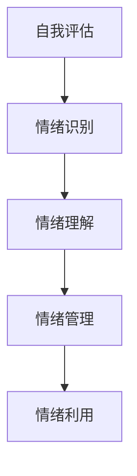

#### 2.1.2 影响力与个人品牌

影响力是指领导者影响他人思想和行为的能力。影响力不仅取决于领导者的权威和地位，更取决于领导者的个人品质和魅力。以下是一个影响力模型，包括影响他人的七个要素：

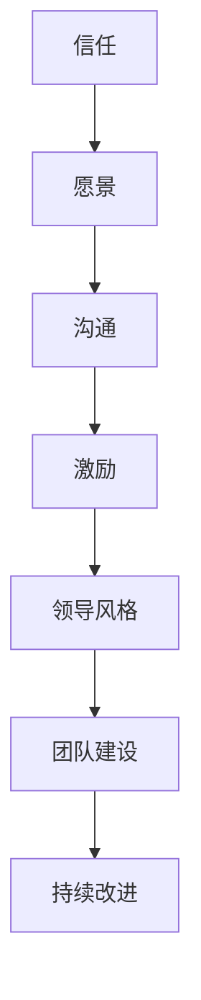

个人品牌是指领导者在公众心中的形象和认知。一个强大的个人品牌能够增强领导者的吸引力，提升领导力的影响范围。以下是一个个人品牌构建的流程图：

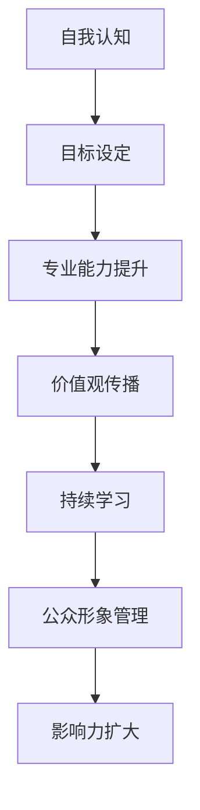

#### 2.1.3 领导力的心理学基础

领导力的心理学基础包括动机、态度、人格等因素。以下是领导力心理学的一个简化模型：

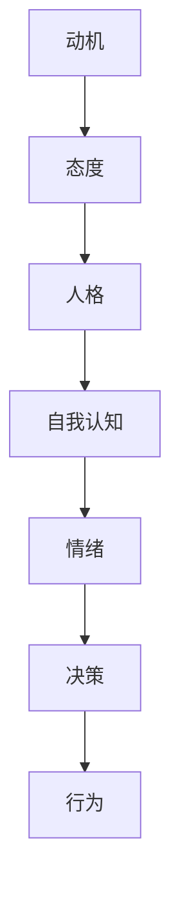

通过理解领导力的心理学基础，领导者可以更好地理解自己和他人，从而提升领导效果。

### 2.2 领导力模型与理论

领导力模型和理论为领导者提供了指导和支持。以下是一些经典的领导力模型和理论：

#### 2.2.1 经典领导力模型

1. **特质理论**：特质理论认为领导者具有某些独特的特质，如自信、决断力、魅力等。这个理论强调领导者是天生的，而不是后天培养的。

2. **行为理论**：行为理论关注领导者的行为和风格，而不是领导者的个人特质。这个理论认为，领导者可以通过学习不同的行为和风格来提升自己的领导力。

3. **情境理论**：情境理论认为领导力是情境依赖的，不同的情境需要不同的领导风格。这个理论强调领导者需要根据具体情境来调整自己的行为和风格。

#### 2.2.2 领导力理论的发展与比较

随着时间的推移，领导力理论不断发展和完善。以下是几种主要的领导力理论及其比较：

1. **变革型领导**：变革型领导强调领导者的愿景和使命感，通过激发团队成员的潜力和激情，推动组织变革和创新。

2. **服务型领导**：服务型领导强调领导者应服务于团队成员，关注团队成员的需求和成长。

3. **数字化领导**：数字化领导强调领导者需要具备数字技能和数据驱动的管理能力。

通过比较不同领导力理论，领导者可以更好地选择适合自己的领导风格和策略。

### 2.3 领导力的心理学基础

领导力不仅是一种技术，更是一种心理活动。理解领导力的心理学基础，对于提升领导力至关重要。以下是领导力心理学的一些核心概念：

#### 自我认知

自我认知是指领导者对自己的认知，包括个人能力、价值观、动机等方面。自我认知是领导力发展的基础。以下是一个简单的自我认知模型：

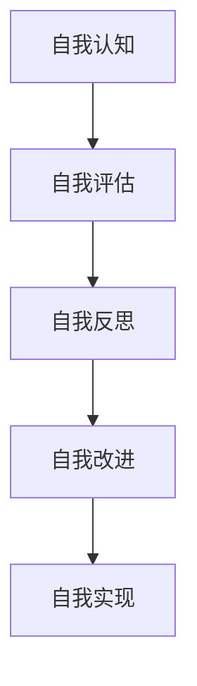

#### 情绪管理

情绪管理是指领导者处理情绪的能力。情绪管理对于领导者的决策和行为具有重要影响。以下是一个情绪管理的模型：

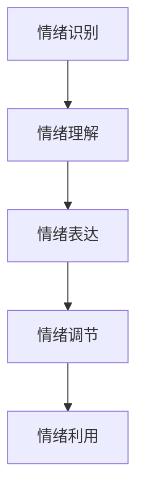

#### 决策与行为

决策与行为是领导力的核心。领导者需要根据具体情境做出明智的决策，并采取有效的行动。以下是一个决策与行为的模型：

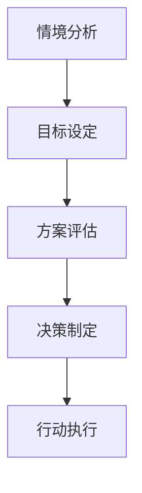

通过理解领导力的心理学基础，领导者可以更好地管理自己和团队，实现组织的成功。

### 2.4 领导力在团队管理中的作用

领导力在团队管理中起着至关重要的作用。以下是领导力在团队管理中的几个关键方面：

#### 沟通与协作

沟通和协作是团队管理的基础。领导者需要建立有效的沟通渠道，确保团队成员之间的信息流通。以下是一个沟通与协作的模型：

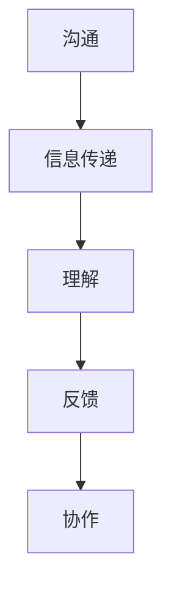

#### 决策与执行

领导者需要做出明智的决策，并确保决策得到有效执行。以下是一个决策与执行的模型：

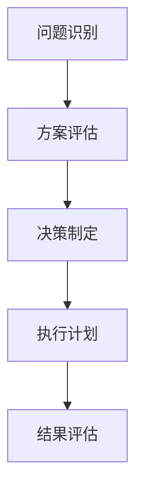

#### 激励与发展

领导者需要激发团队成员的潜力，促进团队成员的发展。以下是一个激励与发展的模型：

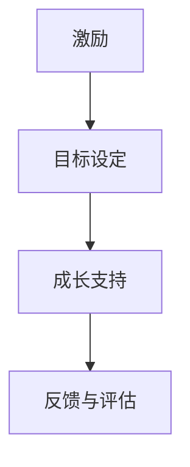

通过在团队管理中发挥领导力，领导者可以提升团队的绩效和凝聚力，实现组织的目标。

### 2.5 领导力与组织绩效的关系

领导力与组织绩效之间存在密切的关系。以下是领导力对组织绩效的几个关键影响：

#### 提升员工绩效

领导者通过激励、培训和指导，提升员工的绩效。以下是一个提升员工绩效的模型：

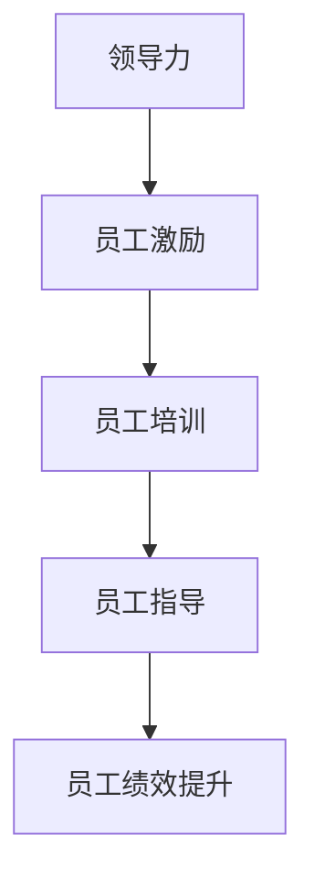

#### 促进创新与变革

领导者通过推动创新和变革，提升组织的竞争力。以下是一个促进创新与变革的模型：

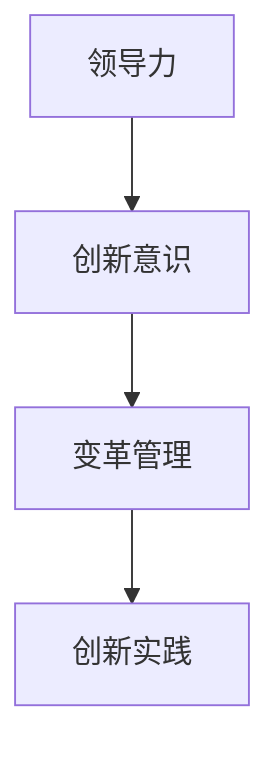

#### 提升组织凝聚力

领导者通过建立共同愿景和价值观，提升组织的凝聚力。以下是一个提升组织凝聚力的模型：

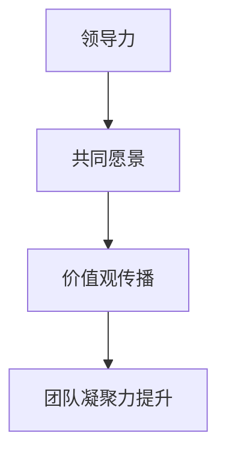

通过提升领导力，组织可以实现更好的绩效和更长远的发展。

### 2.6 领导力的未来趋势

随着全球化和数字化的发展，领导力也在不断变革。以下是领导力的几个未来趋势：

#### 数字化领导

数字化领导强调领导者需要具备数字技能和数据驱动的管理能力。以下是一个数字化领导的模型：

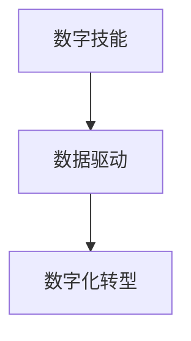

#### 人工智能辅助

人工智能（AI）正在改变领导力的方式。AI可以辅助领导者进行数据分析、决策制定和员工管理。以下是一个AI辅助领导的模型：

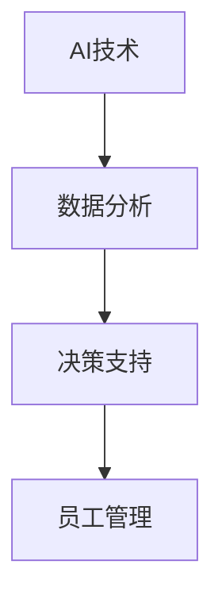

#### 可持续领导

可持续领导强调领导者需要关注环境保护和社会责任。以下是一个可持续领导的模型：

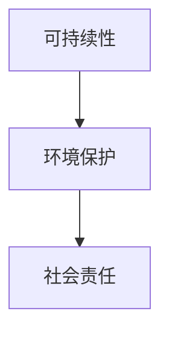

通过关注这些未来趋势，领导者可以更好地应对挑战，实现组织的长期发展。

## 第三部分：新时代领导力实践

### 3.1 领导力技能培养

在新时代，领导力技能的培养尤为重要。以下是一些关键技能，以及如何培养这些技能：

#### 沟通技能

沟通技能是领导者必备的技能之一。良好的沟通能够帮助领导者有效地传达信息，理解团队成员的需求和情感，建立信任和合作关系。

**如何培养沟通技能？**

1. **倾听**：积极倾听是有效沟通的基础。领导者需要学会倾听团队成员的意见和需求，理解他们的情感和立场。
2. **表达清晰**：领导者需要用简洁、明确的语言表达自己的思想和观点。这有助于避免误解和冲突。
3. **非语言沟通**：领导者需要注意自己的肢体语言、面部表情和语调等非语言沟通方式，这些都会影响沟通的效果。

以下是一个沟通技能培养的模型：

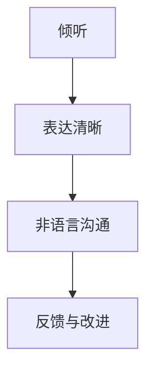

#### 决策技能

决策技能是领导者成功的关键。领导者需要能够在复杂和不确定的环境中做出明智的决策。

**如何培养决策技能？**

1. **问题分析**：领导者需要学会识别和定义问题，分析问题的原因和影响。
2. **方案评估**：领导者需要评估不同的解决方案，选择最佳方案。
3. **决策执行**：领导者需要确保决策得到有效执行，并对结果进行评估和反馈。

以下是一个决策技能培养的模型：

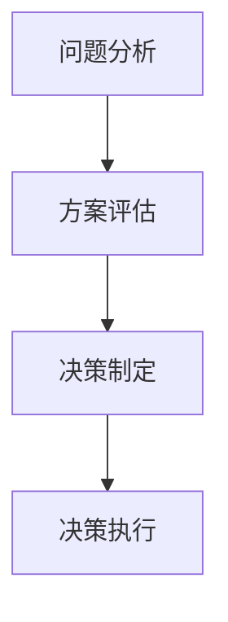

#### 创新技能

在数字化时代，创新成为组织竞争力的关键。领导者需要具备推动创新的能力。

**如何培养创新技能？**

1. **思维模式**：领导者需要培养开放、创新和探索的思维模式。
2. **资源整合**：领导者需要学会整合内外部资源，为创新提供支持。
3. **团队协作**：领导者需要建立创新团队，鼓励团队成员参与创新过程。

以下是一个创新技能培养的模型：

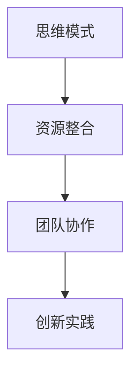

#### 变革管理技能

变革管理是领导者面临的另一个重要挑战。有效的变革管理能够帮助组织适应环境变化，实现持续发展。

**如何培养变革管理技能？**

1. **变革意识**：领导者需要认识到变革的必要性和紧迫性。
2. **沟通与共识**：领导者需要与团队成员沟通变革的目标和意义，建立共识。
3. **变革实施**：领导者需要制定详细的变革计划，确保变革得到有效实施。

以下是一个变革管理技能培养的模型：

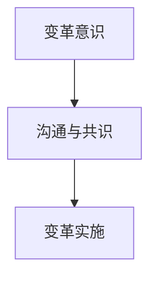

通过培养这些关键技能，领导者可以更好地应对新时代的挑战，实现组织的成功。

### 3.2 沟通与协作

沟通与协作是领导力的重要组成部分。有效的沟通与协作能够提升团队的绩效和凝聚力。

#### 沟通的重要性

沟通是信息传递和理解的过程，它是团队协作和领导力的基础。以下是沟通的几个关键方面：

1. **信息传递**：领导者需要确保信息准确、清晰地传递给团队成员。
2. **理解与反馈**：领导者需要确保团队成员理解信息，并通过反馈来验证信息的传递效果。
3. **建立信任**：良好的沟通能够增强团队成员之间的信任，提升团队的凝聚力。

以下是一个沟通模型：

```mermaid
graph TD
A[信息传递] --> B[理解与反馈]
B --> C[建立信任]
```

#### 协作的机制

协作是团队成员共同完成任务的过程。以下是一些有效的协作机制：

1. **分工合作**：明确每个成员的角色和责任，确保任务得到有效分配。
2. **协作平台**：使用协作工具和平台，如项目管理系统和即时通讯工具，提升团队协作效率。
3. **定期会议**：定期召开会议，讨论任务进展和团队问题，确保团队目标的一致性。

以下是一个协作模型：

```mermaid
graph TD
A[分工合作] --> B[协作平台]
B --> C[定期会议]
```

#### 团队建设的实践

团队建设是提升团队协作和凝聚力的重要手段。以下是一些团队建设的方法：

1. **团队活动**：组织团队活动，如团建活动、培训和学习活动，增强团队之间的互动和了解。
2. **反馈机制**：建立有效的反馈机制，鼓励团队成员提出意见和建议，提升团队的积极性和创造力。
3. **共同目标**：明确团队的目标和愿景，确保团队成员共同为一个目标努力。

以下是一个团队建设模型：

```mermaid
graph TD
A[团队活动] --> B[反馈机制]
B --> C[共同目标]
```

通过有效的沟通与协作，领导者可以提升团队的绩效和凝聚力，实现组织的成功。

### 3.3 决策与问题解决

决策与问题解决是领导力的核心技能之一。有效的决策和问题解决能力能够帮助领导者应对复杂和不确定的环境，实现组织的长期发展。

#### 决策过程

决策过程是领导者做出决策的一系列步骤。以下是决策过程的七个主要步骤：

1. **问题识别**：识别问题，明确问题的性质和影响。
2. **目标设定**：设定决策的目标，明确需要解决的问题和期望的结果。
3. **方案生成**：生成可能的解决方案，包括直接解决方案和备选方案。
4. **方案评估**：评估每个方案的优缺点，选择最佳方案。
5. **决策制定**：制定决策，明确具体的行动步骤和时间表。
6. **决策执行**：执行决策，确保决策得到有效实施。
7. **结果评估**：评估决策的结果，总结经验和教训。

以下是一个决策过程模型：

```mermaid
graph TD
A[问题识别] --> B[目标设定]
B --> C[方案生成]
C --> D[方案评估]
D --> E[决策制定]
E --> F[决策执行]
F --> G[结果评估]
```

#### 问题解决的策略

问题解决是决策过程的一部分，它涉及识别问题、分析问题、制定解决方案和实施解决方案。以下是几个有效的问题解决策略：

1. **头脑风暴**：通过集体讨论，激发团队成员的创意和想象力，产生多种解决方案。
2. **鱼骨图**：使用鱼骨图分析问题的根本原因，有助于制定针对性的解决方案。
3. **SWOT分析**：分析问题的优势、劣势、机会和威胁，以确定最佳解决方案。
4. **五问法**：通过连续提问，深入分析问题，找到解决问题的根本方法。

以下是一个问题解决策略模型：

```mermaid
graph TD
A[头脑风暴] --> B[鱼骨图]
B --> C[SWOT分析]
C --> D[五问法]
```

#### 问题解决的实践

以下是一个问题解决的实际案例：

**案例背景**：某公司销售业绩下降，领导者需要找出原因并制定解决方案。

1. **问题识别**：销售业绩下降，需要分析原因。
2. **目标设定**：提高销售业绩，找出原因并制定解决方案。
3. **方案生成**：通过数据分析，发现客户满意度下降，可能是产品问题或市场策略问题。
4. **方案评估**：评估两种解决方案，一是改进产品，二是调整市场策略。
5. **决策制定**：选择改进产品的方案，并制定详细的实施计划。
6. **决策执行**：执行改进产品的方案，包括产品研发和市场推广。
7. **结果评估**：评估改进产品的效果，收集客户反馈，持续改进产品。

通过这个案例，领导者可以学习如何有效地识别问题、设定目标、生成方案、评估方案、制定决策和执行决策，从而提升问题解决的效率和效果。

### 3.4 创新与变革管理

在新时代，创新和变革管理成为领导者的重要任务。有效的创新和变革管理能够帮助组织保持竞争力，实现可持续发展。

#### 创新的动力与阻碍

创新的动力来源于领导者、团队成员和外部环境。以下是创新的动力和阻碍：

**创新的动力：**

1. **领导者**：领导者的愿景和使命感是推动创新的重要动力。领导者需要具备创新思维和领导力，激发团队的创新能力。
2. **团队成员**：团队成员的创新意愿和创造力是创新的关键。团队成员需要积极参与创新过程，提出新的想法和建议。
3. **外部环境**：外部环境的变化和市场需求是推动创新的重要动力。领导者需要关注市场趋势和竞争对手，及时调整创新策略。

**创新的阻碍：**

1. **组织惯性**：组织惯性是阻碍创新的主要因素。组织需要克服惯性思维，鼓励创新和变革。
2. **资源限制**：资源限制是创新的另一个阻碍。领导者需要优化资源配置，为创新提供支持。
3. **文化阻力**：企业文化可能是创新的阻碍。领导者需要建立支持创新的文化，鼓励团队成员提出创新想法。

以下是一个创新动力与阻碍模型：

```mermaid
graph TD
A[领导者] --> B[团队成员]
B --> C[外部环境]
C --> D[组织惯性]
D --> E[资源限制]
E --> F[文化阻力]
```

#### 变革管理的原则与实践

变革管理是领导力的核心任务之一。以下是变革管理的几个关键原则和实践：

**变革管理的原则：**

1. **明确目标**：变革的目标应明确，确保团队成员理解变革的意义和目标。
2. **沟通与共识**：领导者需要与团队成员沟通变革的目标和意义，建立共识，确保团队成员积极参与变革过程。
3. **规划与执行**：领导者需要制定详细的变革计划，确保变革得到有效执行。
4. **持续评估**：领导者需要持续评估变革的效果，及时调整变革策略。

**变革管理的实践：**

1. **领导示范**：领导者需要通过自己的行为示范，展示对变革的支持和承诺。
2. **团队参与**：鼓励团队成员参与变革过程，提出意见和建议。
3. **培训与支持**：为团队成员提供培训和支持，帮助他们适应变革。
4. **反馈与改进**：建立有效的反馈机制，收集团队成员的反馈，持续改进变革过程。

以下是一个变革管理模型：

```mermaid
graph TD
A[明确目标] --> B[沟通与共识]
B --> C[规划与执行]
C --> D[持续评估]
D --> E[领导示范]
E --> F[团队参与]
F --> G[培训与支持]
G --> H[反馈与改进]
```

通过有效的创新和变革管理，领导者可以推动组织持续发展，保持竞争力。

### 3.5 数字化与领导力

数字化时代，领导力面临着新的挑战和机遇。数字化不仅改变了企业的运营模式，也要求领导者具备新的能力和素质。

#### 数字化对领导力的影响

1. **数据驱动**：数字化带来了大量数据，领导者需要具备数据分析和决策能力，以实现数据驱动的管理。
2. **技术接受**：领导者需要积极接受和应用新技术，如人工智能、大数据等，提升组织的数字化水平。
3. **敏捷管理**：数字化要求领导者具备敏捷管理的能力，能够快速适应和应对变化。

#### 领导力的数字化转型策略

1. **提升数字素养**：领导者需要提升数字素养，包括数据分析和技术应用能力。
2. **构建数字化团队**：领导者需要构建数字化团队，吸引和培养具备数字化技能的人才。
3. **优化流程**：领导者需要优化业务流程，提升组织效率。

以下是一个数字化领导力模型：

```mermaid
graph TD
A[数据驱动] --> B[技术接受]
B --> C[敏捷管理]
C --> D[提升数字素养]
D --> E[构建数字化团队]
E --> F[优化流程]
```

通过数字化转型，领导者可以提升组织的竞争力，实现可持续发展。

### 3.6 持续学习与个人成长

在快速变化的时代，持续学习和个人成长成为领导者的重要任务。以下是如何培养持续学习和个人成长的方法：

#### 学习的渠道与方法

1. **专业培训**：参加专业培训，提升专业技能和知识。
2. **在线学习**：利用在线学习平台，如MOOCs、专业论坛等，拓展知识面。
3. **读书**：阅读专业书籍和经典著作，提升理论水平和思维能力。

#### 应对学习中的挑战

1. **时间管理**：合理安排时间，确保有足够的时间用于学习。
2. **学习氛围**：创造良好的学习氛围，鼓励团队成员共同学习和成长。
3. **实践应用**：将学习到的知识和技能应用于实际工作中，提升实践能力。

以下是一个持续学习与个人成长模型：

```mermaid
graph TD
A[专业培训] --> B[在线学习]
B --> C[读书]
C --> D[时间管理]
D --> E[学习氛围]
E --> F[实践应用]
```

通过持续学习和个人成长，领导者可以提升自己的能力和素质，应对新时代的挑战。

### 3.7 领导力技能的整合与提升

领导力技能的培养和提升是一个系统工程，需要领导者从多个方面进行整合和提升。

#### 整合与提升的方法

1. **自我认知**：领导者需要深入了解自己的优势和劣势，有针对性地提升领导力技能。
2. **实践应用**：将学到的知识和技能应用于实际工作中，通过实践提升领导力。
3. **团队协作**：与团队成员建立良好的合作关系，共同成长和进步。

#### 整合与提升的模型

```mermaid
graph TD
A[自我认知] --> B[实践应用]
B --> C[团队协作]
C --> D[自我反思]
D --> E[持续学习]
```

通过整合和提升领导力技能，领导者可以更好地应对新时代的挑战，实现组织的成功。

### 3.8 领导力在团队管理中的应用

领导力在团队管理中发挥着至关重要的作用。以下是如何在团队管理中应用领导力的一些关键实践：

#### 激励团队成员

1. **目标设定**：领导者需要与团队成员共同设定明确的目标，确保团队成员理解并愿意为实现目标而努力。
2. **奖励机制**：建立有效的奖励机制，对团队成员的成就和贡献进行认可和奖励。
3. **激励谈话**：定期与团队成员进行激励谈话，了解他们的需求和期望，提供支持和指导。

以下是一个激励团队成员的模型：

```mermaid
graph TD
A[目标设定] --> B[奖励机制]
B --> C[激励谈话]
```

#### 建立有效的沟通机制

1. **开放沟通**：领导者需要建立开放的沟通机制，鼓励团队成员自由表达意见和想法。
2. **反馈与建议**：领导者需要及时给予团队成员反馈，鼓励他们提出建议和改进意见。
3. **团队会议**：定期召开团队会议，讨论团队目标和进展，解决问题和挑战。

以下是一个建立有效沟通机制的模型：

```mermaid
graph TD
A[开放沟通] --> B[反馈与建议]
B --> C[团队会议]
```

#### 提升团队凝聚力

1. **共同目标**：领导者需要确保团队成员有一个共同的目标，增强团队的凝聚力。
2. **团队活动**：组织团队活动，如团建活动、培训和学习活动，增强团队之间的互动和了解。
3. **信任建设**：通过建立信任，提升团队的凝聚力和合作效率。

以下是一个提升团队凝聚力的模型：

```mermaid
graph TD
A[共同目标] --> B[团队活动]
B --> C[信任建设]
```

通过在团队管理中应用领导力，领导者可以提升团队的绩效和凝聚力，实现组织的成功。

## 第四部分：特殊情境下的领导力应用

### 4.1 应对危机与挑战

在快速变化的时代，领导者需要具备应对危机和挑战的能力。以下是如何在危机和挑战中应用领导力的一些关键实践：

#### 突发事件处理

1. **迅速响应**：领导者需要迅速响应突发事件，确保事件得到及时处理。
2. **问题分析**：领导者需要对问题进行深入分析，找出问题的根本原因。
3. **决策制定**：领导者需要迅速制定决策，采取有效的应对措施。

以下是一个突发事件处理模型：

```mermaid
graph TD
A[迅速响应] --> B[问题分析]
B --> C[决策制定]
```

#### 危机管理策略

1. **危机预防**：领导者需要提前预防可能的危机，制定危机管理计划。
2. **沟通与共识**：领导者需要与团队成员沟通危机管理计划，建立共识。
3. **资源整合**：领导者需要整合内外部资源，确保危机管理的有效实施。

以下是一个危机管理策略模型：

```mermaid
graph TD
A[危机预防] --> B[沟通与共识]
B --> C[资源整合]
```

#### 案例分析

以下是一个危机管理的实际案例：

**案例背景**：某公司突然面临原材料短缺的危机，导致生产停滞。

1. **迅速响应**：公司领导迅速响应，召开紧急会议，分析问题原因。
2. **问题分析**：通过分析发现，原材料短缺是由于供应商延迟交货导致的。
3. **决策制定**：领导决定立即与供应商沟通，寻求解决方案，并寻找新的供应商。
4. **危机预防**：为了避免类似危机再次发生，领导决定建立供应商管理机制，确保供应商按时交货。
5. **资源整合**：领导整合公司内部资源，调整生产计划，确保生产不受影响。

通过这个案例，领导者可以学习如何迅速响应突发事件、深入分析问题、制定决策和整合资源，以应对危机。

### 4.2 管理多元文化团队

在全球化背景下，领导者需要管理多元文化团队。以下是如何管理多元文化团队的一些关键实践：

#### 多元文化的理解与尊重

1. **文化认知**：领导者需要深入了解不同文化的特点，增强对多元文化的认知。
2. **尊重差异**：领导者需要尊重团队成员的文化差异，避免文化冲突。
3. **文化适应**：领导者需要根据不同文化的特点，调整管理方式和沟通方式。

以下是一个多元文化理解与尊重模型：

```mermaid
graph TD
A[文化认知] --> B[尊重差异]
B --> C[文化适应]
```

#### 多元文化团队的管理技巧

1. **团队建设**：领导者需要通过团队建设活动，增强团队成员之间的信任和合作。
2. **沟通机制**：领导者需要建立有效的沟通机制，确保团队成员之间的信息流通。
3. **文化融合**：领导者需要推动文化融合，鼓励团队成员分享文化经验，促进文化融合。

以下是一个多元文化团队管理技巧模型：

```mermaid
graph TD
A[团队建设] --> B[沟通机制]
B --> C[文化融合]
```

#### 案例分析

以下是一个多元文化团队管理的实际案例：

**案例背景**：某跨国公司在中国设立分支机构，需要管理来自不同国家和地区的团队成员。

1. **文化认知**：公司领导了解中国文化的特点，如注重关系、讲究和谐等。
2. **尊重差异**：领导尊重来自不同国家的团队成员，避免文化冲突。
3. **团队建设**：领导组织团队建设活动，如团建活动、文化讲座等，增强团队成员之间的信任和合作。
4. **沟通机制**：领导建立有效的沟通机制，如定期召开跨文化沟通会议，确保团队成员之间的信息流通。
5. **文化融合**：领导推动文化融合，鼓励团队成员分享文化经验，促进文化融合。

通过这个案例，领导者可以学习如何管理多元文化团队，尊重文化差异，推动文化融合，实现团队的高效协作。

### 4.3 领导力在项目管理和执行中的应用

在项目管理和执行中，领导力起着至关重要的作用。以下是如何在项目管理和执行中应用领导力的一些关键实践：

#### 项目管理的基础

1. **项目规划**：领导者需要制定详细的项目规划，明确项目的目标、范围、进度和质量要求。
2. **团队建设**：领导者需要建立高效的项目团队，明确团队成员的角色和职责。
3. **资源分配**：领导者需要合理分配项目资源，确保项目顺利进行。

以下是一个项目管理基础模型：

```mermaid
graph TD
A[项目规划] --> B[团队建设]
B --> C[资源分配]
```

#### 项目执行的关键

1. **监控进度**：领导者需要监控项目进度，确保项目按照计划进行。
2. **风险管理**：领导者需要识别和应对项目风险，确保项目成功完成。
3. **沟通协调**：领导者需要保持与团队成员的沟通和协调，确保项目执行的顺畅。

以下是一个项目执行关键模型：

```mermaid
graph TD
A[监控进度] --> B[风险管理]
B --> C[沟通协调]
```

#### 案例分析

以下是一个项目管理和执行的实际案例：

**案例背景**：某公司需要开发一个新产品，项目周期为6个月。

1. **项目规划**：公司领导制定了详细的项目规划，明确项目的目标、范围、进度和质量要求。
2. **团队建设**：领导组建了一支由技术、市场和运营等相关部门组成的团队，明确团队成员的角色和职责。
3. **资源分配**：领导合理分配项目资源，如人员、设备和资金等。
4. **监控进度**：领导定期召开项目进度会议，监控项目进度，及时调整计划和资源。
5. **风险管理**：领导识别和应对项目风险，如技术难题、市场变化等，确保项目成功完成。
6. **沟通协调**：领导保持与团队成员的沟通和协调，确保项目执行的顺畅。

通过这个案例，领导者可以学习如何进行项目规划、团队建设、资源分配、监控进度、风险管理和沟通协调，以实现项目的成功完成。

### 4.4 领导力在远程办公和虚拟团队管理中的应用

随着远程办公和虚拟团队的普及，领导力在远程办公和虚拟团队管理中的应用变得越来越重要。以下是如何在远程办公和虚拟团队管理中应用领导力的一些关键实践：

#### 远程办公的挑战与机遇

远程办公带来了许多挑战，同时也创造了新的机遇。以下是远程办公的几个关键挑战和机遇：

**挑战：**

1. **沟通障碍**：远程办公可能面临沟通障碍，如时差、语言和文化差异等。
2. **管理难度**：远程管理团队可能比传统管理更困难，需要领导者具备更高的沟通和管理能力。
3. **信任问题**：远程办公可能影响团队成员之间的信任和合作关系。

**机遇：**

1. **灵活管理**：远程办公提供了更多的灵活管理方式，如弹性工作时间、远程团队会议等。
2. **全球人才**：远程办公可以吸引全球人才，提升团队的多样性和创新能力。
3. **成本节约**：远程办公可以减少办公室租金和交通成本，提高组织的经济效益。

以下是一个远程办公挑战与机遇模型：

```mermaid
graph TD
A[沟通障碍] --> B[管理难度]
B --> C[信任问题]
C --> D[灵活管理]
D --> E[全球人才]
E --> F[成本节约]
```

#### 虚拟团队管理的策略

1. **明确目标**：领导者需要与团队成员共同设定明确的目标，确保团队成员理解并愿意为实现目标而努力。
2. **沟通机制**：领导者需要建立有效的沟通机制，确保团队成员之间的信息流通。
3. **协作工具**：领导者需要使用协作工具，如项目管理软件、即时通讯工具等，提升团队协作效率。
4. **信任建设**：领导者需要通过建立信任，提升团队的凝聚力和合作效率。

以下是一个虚拟团队管理策略模型：

```mermaid
graph TD
A[明确目标] --> B[沟通机制]
B --> C[协作工具]
C --> D[信任建设]
```

#### 案例分析

以下是一个远程办公和虚拟团队管理的实际案例：

**案例背景**：某公司采用远程办公模式，管理一个全球分布的团队。

1. **明确目标**：公司领导与团队成员共同设定明确的目标，确保团队成员理解并愿意为实现目标而努力。
2. **沟通机制**：领导建立了一套有效的沟通机制，如每周的全球团队视频会议，确保团队成员之间的信息流通。
3. **协作工具**：领导使用项目管理软件和即时通讯工具，如Trello和Slack，提升团队协作效率。
4. **信任建设**：领导通过定期与团队成员进行一对一沟通，了解团队成员的需求和困难，建立信任关系。

通过这个案例，领导者可以学习如何在远程办公和虚拟团队管理中明确目标、建立沟通机制、使用协作工具和建设信任，以实现团队的高效协作。

### 4.5 领导力在变革管理中的角色

变革管理是领导者的重要任务之一。在变革过程中，领导者的角色至关重要。以下是如何在变革管理中发挥领导力的一些关键实践：

#### 变革管理的步骤

1. **规划变革**：领导者需要制定详细的变革计划，明确变革的目标、范围、时间和资源。
2. **沟通变革**：领导者需要与团队成员沟通变革的目标和意义，建立共识，确保团队成员理解并支持变革。
3. **执行变革**：领导者需要确保变革计划得到有效执行，采取有效的管理措施，解决变革过程中的问题和挑战。
4. **评估变革**：领导者需要评估变革的效果，总结经验和教训，为未来的变革提供参考。

以下是一个变革管理步骤模型：

```mermaid
graph TD
A[规划变革] --> B[沟通变革]
B --> C[执行变革]
C --> D[评估变革]
```

#### 变革管理的策略

1. **领导示范**：领导者需要通过自己的行为示范，展示对变革的支持和承诺。
2. **团队参与**：领导者需要鼓励团队成员参与变革过程，提出意见和建议。
3. **培训与支持**：领导者需要为团队成员提供培训和支持，帮助他们适应变革。
4. **持续评估**：领导者需要持续评估变革的效果，及时调整变革策略。

以下是一个变革管理策略模型：

```mermaid
graph TD
A[领导示范] --> B[团队参与]
B --> C[培训与支持]
C --> D[持续评估]
```

#### 变革管理的案例分析

以下是一个变革管理的实际案例：

**案例背景**：某公司决定进行数字化转型，以提高效率和竞争力。

1. **规划变革**：公司领导制定了详细的数字化转型计划，明确变革的目标、范围、时间和资源。
2. **沟通变革**：领导与团队成员沟通变革的目标和意义，建立共识，确保团队成员理解并支持变革。
3. **领导示范**：领导通过自己的行为示范，展示对变革的支持和承诺，如使用新的数字化工具和流程。
4. **团队参与**：领导鼓励团队成员参与变革过程，提出意见和建议，提升团队成员的参与感和责任感。
5. **培训与支持**：领导为团队成员提供培训和支持，帮助他们适应新的数字化工具和流程。
6. **持续评估**：领导持续评估变革的效果，及时调整变革策略，解决变革过程中的问题和挑战。

通过这个案例，领导者可以学习如何规划变革、沟通变革、领导示范、团队参与、培训与支持和持续评估，以实现变革的成功实施。

## 第五部分：未来领导力的趋势

### 5.1 数字化时代领导力的转型

随着数字化时代的到来，领导力也面临着深刻的转型。领导者需要适应新的技术和管理模式，提升数字化领导能力。

#### 数字化对领导力的影响

1. **数据驱动**：数字化带来了大量数据，领导者需要具备数据分析和决策能力，以实现数据驱动的管理。
2. **技术接受**：领导者需要积极接受和应用新技术，如人工智能、大数据等，提升组织的数字化水平。
3. **敏捷管理**：数字化要求领导者具备敏捷管理的能力，能够快速适应和应对变化。

#### 数字化领导的转型策略

1. **提升数字素养**：领导者需要提升数字素养，包括数据分析和技术应用能力。
2. **构建数字化团队**：领导者需要构建数字化团队，吸引和培养具备数字化技能的人才。
3. **优化流程**：领导者需要优化业务流程，提升组织效率。

以下是一个数字化领导转型策略模型：

```mermaid
graph TD
A[提升数字素养] --> B[构建数字化团队]
B --> C[优化流程]
```

#### 案例分析

以下是一个数字化领导转型的实际案例：

**案例背景**：某公司决定进行数字化转型，以提高竞争力和市场响应速度。

1. **提升数字素养**：公司领导通过培训和学习，提升了自身的数字素养，包括数据分析和人工智能应用。
2. **构建数字化团队**：领导组建了一支数字化团队，包括数据分析师、人工智能工程师等，吸引了数字化人才。
3. **优化流程**：领导优化了业务流程，采用大数据分析和人工智能技术，提高生产效率和决策质量。

通过这个案例，领导者可以学习如何在数字化转型中提升数字素养、构建数字化团队和优化流程，以实现组织的成功转型。

### 5.2 新型领导者的特质

在数字化和全球化的新时代，新型领导者需要具备一系列特质，以应对复杂多变的挑战。

#### 新型领导者的特质

1. **全球视野**：新型领导者需要具备全球视野，理解不同文化的差异，能够在全球范围内进行有效的领导。
2. **创新思维**：新型领导者需要具备创新思维，能够推动组织持续创新，适应快速变化的市场环境。
3. **数字化能力**：新型领导者需要具备数字化能力，包括数据分析和技术应用，能够利用数字化工具提升组织效率。
4. **情商**：新型领导者需要具备高情商，能够理解和管理自己的情绪，同时也能够理解和影响他人的情绪。
5. **领导力传承**：新型领导者需要具备领导力传承的特质，能够培养和激发团队成员的潜力，实现领导力的持续发展。

以下是一个新型领导者特质模型：

```mermaid
graph TD
A[全球视野] --> B[创新思维]
B --> C[数字化能力]
C --> D[情商]
D --> E[领导力传承]
```

#### 案例分析

以下是一个新型领导者的实际案例：

**案例背景**：某公司领导在数字化时代转型过程中，展现了新型领导者的特质。

1. **全球视野**：领导具备全球视野，能够理解不同市场的需求和文化差异，推动公司在全球范围内的业务发展。
2. **创新思维**：领导具备创新思维，推动公司采用新技术和业务模式，提高市场竞争力和创新能力。
3. **数字化能力**：领导具备数字化能力，能够利用大数据和人工智能技术优化业务流程，提升组织效率。
4. **情商**：领导具备高情商，能够理解和管理自己的情绪，同时也能够理解和影响团队成员的情绪，提升团队凝聚力。
5. **领导力传承**：领导重视领导力传承，培养和激发团队成员的潜力，实现领导力的持续发展。

通过这个案例，领导者可以学习如何在数字化时代中培养全球视野、创新思维、数字化能力、情商和领导力传承，成为新时代的卓越领导者。

### 5.3 未来领导力的趋势

未来领导力将受到技术、社会和环境等多方面因素的影响，呈现出以下趋势：

#### 自动化与人工智能

随着自动化和人工智能技术的快速发展，领导者需要适应新的工作环境和组织模式。以下是一个自动化与人工智能对领导力影响的模型：

```mermaid
graph TD
A[自动化] --> B[人工智能]
B --> C[工作流程重构]
C --> D[领导角色转变]
```

#### 持续学习与终身成长

在快速变化的时代，持续学习和终身成长将成为领导者的重要任务。以下是一个持续学习与终身成长对领导力影响的模型：

```mermaid
graph TD
A[持续学习] --> B[终身成长]
B --> C[知识更新]
C --> D[创新能力提升]
```

#### 可持续发展

随着全球环境问题的加剧，领导者需要关注可持续发展，推动组织的绿色发展和社会责任。以下是一个可持续发展对领导力影响的模型：

```mermaid
graph TD
A[环境保护] --> B[社会责任]
B --> C[可持续发展]
C --> D[领导力提升]
```

#### 跨界领导

未来领导力将更加注重跨界合作和整合资源的能力。领导者需要具备跨学科、跨领域的能力，以应对复杂的问题和挑战。以下是一个跨界领导对领导力影响的模型：

```mermaid
graph TD
A[跨学科] --> B[跨领域]
B --> C[资源整合]
C --> D[创新驱动]
```

通过关注这些未来领导力的趋势，领导者可以更好地适应未来的挑战，实现组织的长期发展。

### 5.4 领导力与可持续发展的融合

在全球化、数字化和可持续发展的新时代，领导力与可持续发展已经不可分割。领导者需要将可持续发展纳入领导力的核心，推动组织的绿色发展和社会责任。

#### 可持续发展的意义

可持续发展是指在满足当前需求的同时，不损害后代满足其需求的能力。可持续发展不仅关注经济利益，还关注社会和环境效益。以下是可持续发展的几个核心要素：

1. **环境保护**：减少对自然资源的消耗，保护生态环境。
2. **社会责任**：关注社会问题，推动社会进步。
3. **经济利益**：实现经济可持续发展，提升组织的竞争力。

以下是一个可持续发展核心要素模型：

```mermaid
graph TD
A[环境保护] --> B[社会责任]
B --> C[经济利益]
```

#### 领导力与可持续发展的融合

领导者需要将可持续发展理念融入领导力实践中，推动组织的绿色发展和社会责任。以下是领导力与可持续发展融合的几个关键方面：

1. **战略规划**：领导者需要将可持续发展纳入组织战略，明确可持续发展的目标和方向。
2. **文化建设**：领导者需要建立支持可持续发展的企业文化，鼓励团队成员参与可持续发展活动。
3. **资源管理**：领导者需要优化资源管理，提高资源利用效率，减少浪费。
4. **社会责任**：领导者需要关注社会问题，积极参与社会公益活动，提升组织的社会责任。

以下是一个领导力与可持续发展融合模型：

```mermaid
graph TD
A[战略规划] --> B[文化建设]
B --> C[资源管理]
C --> D[社会责任]
```

#### 案例分析

以下是一个领导力与可持续发展融合的实际案例：

**案例背景**：某公司致力于可持续发展，将其作为企业战略的核心。

1. **战略规划**：公司领导将可持续发展纳入企业战略，明确环境保护、社会责任和经济利益的平衡。
2. **文化建设**：公司领导建立支持可持续发展的企业文化，鼓励团队成员关注环境保护和社会责任，积极参与可持续发展活动。
3. **资源管理**：公司领导优化资源管理，采用环保技术和绿色生产方式，提高资源利用效率，减少浪费。
4. **社会责任**：公司领导关注社会问题，积极参与社会公益活动，如捐赠教育资源、支持环保项目等，提升组织的社会责任。

通过这个案例，领导者可以学习如何在战略规划、文化建设、资源管理和社会责任方面实现领导力与可持续发展的融合，推动组织的绿色发展和社会责任。

### 5.5 未来领导力的培养

未来领导力将面临前所未有的挑战和机遇。为了培养未来领导力，领导者需要采取一系列措施，提升自身的领导能力，为组织的发展做好准备。

#### 培养未来领导力的策略

1. **持续学习**：领导者需要持续学习，提升自身的知识水平和技能，适应快速变化的环境。
2. **多元文化理解**：领导者需要具备多元文化理解能力，能够在全球范围内有效领导。
3. **创新思维**：领导者需要培养创新思维，推动组织持续创新，适应未来市场的变化。
4. **领导力传承**：领导者需要培养和传承领导力，提升团队成员的领导能力，实现领导力的持续发展。

以下是一个培养未来领导力策略模型：

```mermaid
graph TD
A[持续学习] --> B[多元文化理解]
B --> C[创新思维]
C --> D[领导力传承]
```

#### 案例分析

以下是一个培养未来领导力的实际案例：

**案例背景**：某公司致力于培养未来领导力，采取一系列措施提升领导能力。

1. **持续学习**：公司领导通过参加培训、阅读书籍和参加行业研讨会，持续提升自身的知识水平和技能。
2. **多元文化理解**：公司领导积极参与国际交流和合作，了解不同文化背景的团队成员，提升多元文化理解能力。
3. **创新思维**：公司领导鼓励团队成员提出创新想法，推动组织持续创新，适应未来市场的变化。
4. **领导力传承**：公司领导通过导师制和领导力培训项目，培养和传承领导力，提升团队成员的领导能力。

通过这个案例，领导者可以学习如何通过持续学习、多元文化理解、创新思维和领导力传承，培养未来领导力，为组织的发展做好准备。

### 5.6 未来领导力的评估与反馈

未来领导力的评估与反馈是提升领导力的重要环节。通过定期评估和反馈，领导者可以了解自己的领导能力，发现不足，并制定改进计划。

#### 评估与反馈的策略

1. **360度评估**：领导者可以接受来自团队成员、上级和同事的反馈，全面了解自己的领导能力。
2. **自我评估**：领导者可以通过自我反思，了解自己的优点和不足。
3. **定期反馈**：领导者需要定期进行反馈，及时了解团队成员的需求和期望，调整领导策略。

以下是一个评估与反馈策略模型：

```mermaid
graph TD
A[360度评估] --> B[自我评估]
B --> C[定期反馈]
```

#### 案例分析

以下是一个未来领导力评估与反馈的实际案例：

**案例背景**：某公司领导定期进行领导力评估与反馈，提升领导能力。

1. **360度评估**：公司领导接受来自团队成员、上级和同事的反馈，了解自己在领导力方面的优点和不足。
2. **自我评估**：公司领导通过自我反思，识别自己在领导力方面的不足，并制定改进计划。
3. **定期反馈**：公司领导定期与团队成员进行沟通，了解他们的需求和期望，调整领导策略，提升领导能力。

通过这个案例，领导者可以学习如何通过360度评估、自我评估和定期反馈，提升未来领导力。

## 第六部分：领导力实践案例解析

### 6.1 成功领导案例

在商业世界中，许多领导者通过卓越的领导力实现了企业的成功和持续发展。以下是几个成功领导案例，以及其背后的领导力和管理经验。

#### 案例一：苹果公司的领导力之道

**案例背景**：史蒂夫·乔布斯在1984年重返苹果公司，带领公司走出困境，成为全球最具创新力和影响力的科技企业之一。

**领导力经验：**

1. **愿景和使命感**：乔布斯具有清晰的愿景和使命感，能够激励团队成员为实现共同目标而努力。
2. **创新驱动**：乔布斯注重创新，推动苹果不断推出颠覆性产品，如iPhone、iPad等，引领市场潮流。
3. **卓越的产品质量**：乔布斯对产品质量有着极高的要求，确保苹果产品在市场上保持竞争力。
4. **团队建设**：乔布斯重视团队建设，培养了一支高效、创新、忠诚的团队。

**结论**：乔布斯的领导力之道为苹果公司带来了持续的创新和成功，成为现代企业领导力的典范。

#### 案例二：华为公司的领导力实践

**案例背景**：任正非在1990年代初创立华为公司，带领公司在全球通信设备市场上取得领先地位。

**领导力经验：**

1. **长期战略规划**：任正非制定了明确的长期战略规划，确保公司在全球市场中的竞争力。
2. **创新驱动**：华为高度重视技术创新，不断加大研发投入，推动公司的技术进步和市场拓展。
3. **人才管理**：任正非重视人才培养和激励机制，建立了一套完善的人才管理体系，吸引和留住优秀人才。
4. **国际化战略**：华为积极实施国际化战略，拓展全球市场，提升公司的国际竞争力。

**结论**：任正非的领导力实践为华为公司的持续增长和国际竞争力提供了重要保障。

### 6.2 领导力失败的教训

尽管成功领导案例可以为我们提供宝贵的经验，但领导力失败案例同样具有重要的教育意义。以下是一些领导力失败的案例，以及其背后的原因和教训。

#### 案例一：通用电气的领导危机

**案例背景**：通用电气（GE）曾是全球最具影响力的企业之一，但在2000年代后期，公司遭遇了一系列领导危机，导致业绩下滑。

**失败原因：**

1. **战略失误**：公司领导在多元化战略上失误，过度扩张导致资源分散，难以保持核心竞争力。
2. **内部控制失效**：公司内部控制失效，导致财务造假等问题，损害了公司的信誉和声誉。
3. **领导力不足**：公司领导在应对外部环境变化和内部问题时，表现出了领导力不足，缺乏有效的决策和执行能力。

**教训**：领导者在制定战略时需要审慎考虑，避免过度扩张；加强内部控制，确保公司运营的透明和合规；提升领导力，确保能够有效应对外部环境变化和内部问题。

#### 案例二：特斯拉的领导挑战

**案例背景**：特斯拉（Tesla）在埃隆·马斯克的领导下，成为全球电动汽车市场的领军企业，但公司也面临一系列领导挑战。

**失败原因：**

1. **组织结构混乱**：公司组织结构复杂，部门间协作不畅，导致决策和执行效率低下。
2. **过度依赖明星领导者**：公司过度依赖马斯克的个人魅力和领导力，缺乏有效的继任计划和领导力传承机制。
3. **创新挑战**：在快速变化的市场环境中，特斯拉在技术创新方面面临挑战，如电池技术、自动驾驶等。

**教训**：领导者需要建立高效的组织结构，促进部门间的协作和沟通；制定有效的领导力传承计划，培养和选拔合适的继任者；注重技术创新，保持公司在市场中的竞争力。

通过分析成功领导和失败领导的案例，我们可以学到宝贵的经验和教训，提升自身的领导力，为组织的成功和发展做好准备。

### 6.3 成功领导案例的启示

成功领导案例为我们提供了宝贵的启示，以下是一些主要观点：

1. **愿景和使命感**：成功的领导者通常具有清晰的愿景和使命感，能够激励团队成员为实现共同目标而努力。
2. **创新驱动**：成功的领导者注重创新，推动组织不断进步，引领市场潮流。
3. **卓越的产品质量**：领导者对产品质量有着极高的要求，确保组织在市场中保持竞争力。
4. **团队建设**：领导者重视团队建设，培养高效、创新、忠诚的团队，提升组织的整体实力。
5. **长期战略规划**：成功的领导者具备长远的战略眼光，制定明确的长期战略规划，确保组织的可持续发展。
6. **人才培养和激励机制**：领导者注重人才培养和激励机制，吸引和留住优秀人才，提升组织的创新能力。
7. **国际化战略**：领导者积极实施国际化战略，拓展全球市场，提升组织的国际竞争力。

通过学习成功领导案例的启示，我们可以更好地培养自己的领导力，为组织的成功和发展做出贡献。

### 6.4 领导力失败的教训

领导力失败案例虽然令人遗憾，但其中蕴含的教训对领导者具有深远的影响。以下是一些主要教训：

1. **战略失误**：领导者在制定战略时需要审慎考虑，避免过度扩张和资源分散，确保组织的核心竞争力。
2. **内部控制失效**：领导者需要建立有效的内部控制体系，确保公司运营的透明和合规，防止财务造假等问题。
3. **领导力不足**：领导者需要提升自身的领导力，确保能够有效应对外部环境变化和内部问题，做出明智的决策。
4. **组织结构混乱**：领导者需要建立清晰的组织结构，促进部门间的协作和沟通，提升决策和执行效率。
5. **过度依赖明星领导者**：领导者需要制定有效的继任计划和领导力传承机制，培养和选拔合适的继任者，确保组织持续发展。
6. **创新挑战**：领导者需要注重技术创新，保持组织在市场中的竞争力，应对快速变化的环境。

通过反思领导力失败的教训，我们可以避免犯相同的错误，提升自身的领导能力。

### 6.5 案例研究：从失败中学习

#### 案例背景

某科技公司在短短几年内从一家初创公司迅速成长为行业领导者，但在随后的几年里，公司却陷入了困境，业绩大幅下滑。这一案例为领导者提供了宝贵的教训，以下是从失败中学习的过程：

1. **问题识别**：公司领导首先识别了公司面临的主要问题，包括战略失误、内部控制失效、领导力不足等。
2. **原因分析**：领导层对失败原因进行了深入分析，发现公司在快速扩张过程中忽视了核心竞争力，过度依赖明星领导者，缺乏有效的继任计划和领导力传承机制。
3. **措施制定**：领导层制定了相应的改进措施，包括调整战略方向、加强内部控制、提升领导力等。
4. **实施与监督**：公司领导实施了改进措施，并建立了监督机制，确保改进措施得到有效执行。
5. **反馈与调整**：领导层定期收集反馈，根据实际情况调整改进措施，确保公司稳步走出困境。

#### 学习与启示

通过这个案例，领导者可以学习到以下启示：

1. **审慎制定战略**：在快速扩张过程中，领导者需要审慎制定战略，避免资源分散，确保公司的核心竞争力。
2. **强化内部控制**：领导者需要建立有效的内部控制体系，确保公司运营的透明和合规。
3. **提升领导力**：领导者需要不断提升自身的领导力，确保能够有效应对外部环境变化和内部问题。
4. **领导力传承**：领导者需要制定有效的领导力传承计划，培养和选拔合适的继任者，确保组织持续发展。
5. **持续改进**：领导者需要持续关注公司运营，收集反馈，不断调整改进措施，确保公司持续发展。

通过从失败中学习，领导者可以提升自身的领导能力，为组织的成功和发展做好准备。

## 第七部分：领导力的自我修炼

### 7.1 自我反思与成长

自我反思是领导者自我成长的重要过程。通过自我反思，领导者可以深入了解自己的优点和不足，从而有针对性地进行改进和提升。

#### 自我反思的步骤

1. **设定目标**：领导者需要明确自己的成长目标和期望，为自我反思提供方向。
2. **自我评估**：领导者需要对自身的能力、行为和表现进行客观评估，识别自己的优点和不足。
3. **原因分析**：领导者需要深入分析优点和不足的原因，了解背后的动机和影响因素。
4. **改进计划**：领导者需要制定具体的改进计划，包括学习新知识、提升技能和改变行为等。
5. **实施与监控**：领导者需要实施改进计划，并定期监控进展，确保改进措施得到有效执行。

以下是一个自我反思与成长模型：

```mermaid
graph TD
A[设定目标] --> B[自我评估]
B --> C[原因分析]
C --> D[改进计划]
D --> E[实施与监控]
```

#### 持续成长的重要性

持续成长是领导者成功的关键。在快速变化的时代，领导者需要不断提升自己的能力和素质，以适应新的挑战和机遇。以下是如何持续成长的一些关键方面：

1. **学习新知识**：领导者需要不断学习新知识，了解行业趋势和技术发展，提升自己的专业素养。
2. **技能提升**：领导者需要提升自己的技能，包括领导力技能、沟通技能、决策技能等。
3. **实践经验**：领导者需要通过实践经验，将所学知识应用于实际工作中，提升自己的实践能力。
4. **反思与总结**：领导者需要通过反思和总结，不断提升自己的思考能力和问题解决能力。

### 7.2 持续学习与进步

在数字化和全球化的新时代，持续学习成为领导者必备的能力。以下是如何进行持续学习与进步的一些关键方法：

#### 学习的渠道与方法

1. **专业培训**：参加专业培训，提升专业技能和知识。可以选择在线课程、公开课程或内部培训。
2. **阅读书籍**：阅读专业书籍和经典著作，拓展知识面，提升理论水平和思维能力。
3. **在线学习**：利用在线学习平台，如MOOCs（大型开放在线课程），灵活安排学习时间。
4. **行业交流**：参加行业会议、研讨会和交流会，与同行交流经验和见解。
5. **实践应用**：将学习到的知识和技能应用于实际工作中，通过实践不断提升自己的能力。

以下是一个学习渠道与方法模型：

```mermaid
graph TD
A[专业培训] --> B[阅读书籍]
B --> C[在线学习]
C --> D[行业交流]
D --> E[实践应用]
```

#### 应对学习中的挑战

1. **时间管理**：领导者需要合理安排时间，确保有足够的时间用于学习。可以使用时间管理工具，如时间管理矩阵，提高时间利用效率。
2. **学习氛围**：领导者需要创造良好的学习氛围，鼓励团队成员共同学习和成长。可以建立学习小组，共同讨论和分享学习心得。
3. **实践应用**：领导者需要将学习到的知识和技能应用于实际工作中，通过实践验证学习的成果，并不断调整和改进。

以下是一个应对学习挑战模型：

```mermaid
graph TD
A[时间管理] --> B[学习氛围]
B --> C[实践应用]
```

#### 学习与成长的实际案例

以下是一个持续学习与成长的实际案例：

**案例背景**：某公司领导意识到在数字化时代，持续学习对于领导者的成长至关重要。

1. **学习渠道与方法**：领导选择参加专业培训课程，阅读相关书籍，并利用在线学习平台进行学习。此外，他还参加了多个行业会议，与同行交流经验和见解。
2. **实践应用**：领导将学习到的知识和技能应用于实际工作中，如推动公司数字化转型、优化业务流程等。他鼓励团队成员也参与学习，共同成长。
3. **反思与总结**：领导定期进行反思和总结，评估自己的学习成果，并根据实际情况调整学习计划。

通过这个案例，领导者可以学习如何在数字化时代中持续学习与进步，为组织的成功和发展做好准备。

### 7.3 领导力的自我提升

领导力的自我提升是领导者持续成长和发展的关键。以下是如何进行领导力自我提升的一些方法：

#### 自我提升的步骤

1. **自我认知**：领导者需要深入了解自己的优点和不足，识别自己在领导力方面的差距。
2. **设定目标**：根据自我认知，领导者需要设定明确的自我提升目标，包括提升领导力技能、改进行为习惯等。
3. **制定计划**：领导者需要制定具体的提升计划，包括学习新知识、参加培训、实践应用等。
4. **执行计划**：领导者需要严格执行提升计划，确保计划的实施和效果。
5. **持续评估**：领导者需要定期评估自我提升的效果，总结经验和教训，并根据实际情况调整提升计划。

以下是一个领导力自我提升模型：

```mermaid
graph TD
A[自我认知] --> B[设定目标]
B --> C[制定计划]
C --> D[执行计划]
D --> E[持续评估]
```

#### 领导力提升的方法

1. **专业培训**：参加专业的领导力培训课程，学习领导力理论和实践技巧。
2. **阅读书籍**：阅读关于领导力的书籍，了解不同领导力理论和实践案例。
3. **实践应用**：将领导力知识应用于实际工作中，通过实践不断提升领导力。
4. **反思与总结**：定期进行反思和总结，了解自己在领导力方面的进步和不足，持续改进。
5. **寻求反馈**：向团队成员、同事和上级寻求反馈，了解自己在领导力方面的表现和改进方向。

#### 实际案例

以下是一个领导力自我提升的实际案例：

**案例背景**：某公司领导意识到自己在领导力方面存在不足，决定进行自我提升。

1. **自我认知**：领导通过自我反思，认识到自己在决策能力、沟通能力和团队管理方面存在不足。
2. **设定目标**：领导设定了提升决策能力、沟通能力和团队管理能力的目标。
3. **制定计划**：领导制定了详细的提升计划，包括参加领导力培训课程、阅读相关书籍、实践应用等。
4. **执行计划**：领导严格执行提升计划，参加培训课程，阅读书籍，并积极将所学应用到实际工作中。
5. **持续评估**：领导定期进行反思和总结，了解自己在领导力方面的进步和不足，并根据实际情况调整提升计划。

通过这个案例，领导者可以学习如何在自我认知、设定目标、制定计划、执行计划和持续评估等方面进行领导力自我提升，为组织的成功和发展做出贡献。

### 7.4 自我提升与团队发展的关系

自我提升与团队发展之间存在密切的关系。一个成功的领导者不仅需要关注自身的成长，还需要推动团队的发展，实现组织的目标。

#### 自我提升对团队发展的作用

1. **领导示范**：领导者的自我提升可以成为团队发展的榜样，激发团队成员的积极性和动力。
2. **能力提升**：领导者的自我提升可以提高领导者的能力，从而更好地指导和帮助团队成员，促进团队的发展。
3. **创新驱动**：领导者的自我提升可以激发创新思维，推动团队不断进行技术创新和管理创新，提升团队的竞争力。
4. **文化传承**：领导者的自我提升可以传承优秀的领导文化和价值观，提升团队的文化氛围，增强团队的凝聚力。

以下是一个自我提升与团队发展关系的模型：

```mermaid
graph TD
A[领导示范] --> B[能力提升]
B --> C[创新驱动]
C --> D[文化传承]
```

#### 团队发展对自我提升的促进

1. **反馈与支持**：团队发展可以为领导者提供反馈和支持，帮助领导者识别自身的不足，并找到改进的方向。
2. **实践机会**：团队发展可以提供丰富的实践机会，使领导者能够在实际工作中提升自己的能力和素质。
3. **共同成长**：团队发展可以使领导者与团队成员共同成长，形成良好的团队氛围，促进领导者的自我提升。
4. **资源整合**：团队发展可以整合团队内外部的资源，为领导者的自我提升提供支持。

以下是一个团队发展对自我提升的促进模型：

```mermaid
graph TD
A[反馈与支持] --> B[实践机会]
B --> C[共同成长]
C --> D[资源整合]
```

通过自我提升和团队发展的相互促进，领导者可以不断提升自身的能力和素质，推动团队的发展，实现组织的目标。

### 7.5 领导力修炼与持续改进

领导力修炼是一个持续的过程，需要领导者不断学习和实践，以适应不断变化的环境和挑战。以下是如何进行领导力修炼与持续改进的一些关键步骤：

#### 领导力修炼的关键步骤

1. **自我反思**：领导者需要定期进行自我反思，识别自己在领导力方面的优点和不足，并找到改进的方向。
2. **学习与成长**：领导者需要持续学习，包括阅读相关书籍、参加培训课程、参加行业交流等，不断提升自己的领导力知识和技能。
3. **实践应用**：领导者需要将学习到的知识和技能应用于实际工作中，通过实践不断提升自己的领导力。
4. **反馈与改进**：领导者需要积极寻求反馈，包括团队成员、同事和上级的反馈，并根据反馈进行改进。
5. **持续评估**：领导者需要定期评估自己的领导力水平，了解自己的进步和不足，并制定改进计划。

以下是一个领导力修炼与持续改进模型：

```mermaid
graph TD
A[自我反思] --> B[学习与成长]
B --> C[实践应用]
C --> D[反馈与改进]
D --> E[持续评估]
```

#### 持续改进的策略

1. **建立反馈机制**：领导者需要建立有效的反馈机制，鼓励团队成员提出意见和建议，及时发现和解决问题。
2. **开展培训与研讨会**：领导者可以组织定期的培训与研讨会，分享学习心得和经验，提升团队的整体领导力水平。
3. **进行领导力评估**：领导者可以定期进行领导力评估，了解自己的领导力水平和团队成员的满意度，为改进提供依据。
4. **关注团队成员成长**：领导者需要关注团队成员的成长和发展，提供支持和指导，帮助他们提升自身能力。
5. **引入外部专家**：领导者可以邀请外部专家进行指导和培训，为团队提供新的视角和理念。

通过领导力修炼与持续改进，领导者可以不断提升自身的领导能力，推动团队的发展，实现组织的成功。

### 7.6 领导力修炼的实践建议

为了帮助领导者进行有效的领导力修炼，以下是一些具体的实践建议：

#### 1. 自我反思

- **定期反思**：领导者可以每周或每月花时间进行自我反思，思考自己在领导力方面的进步和不足。
- **记录反思**：将反思过程记录下来，以便后续回顾和改进。

#### 2. 学习与成长

- **阅读书籍**：选择关于领导力、管理、心理学等方面的书籍，定期阅读并做笔记。
- **参加培训**：参加专业培训课程，了解最新的领导力理论和实践方法。
- **实践应用**：将学到的知识和技能应用于实际工作中，通过实践不断提升自己的领导力。

#### 3. 实践应用

- **设立目标**：为自己设立明确的领导力提升目标，制定具体的行动计划。
- **寻求反馈**：主动向团队成员、同事和上级寻求反馈，了解自己在领导力方面的表现。
- **持续改进**：根据反馈和实际情况，持续改进自己的领导方法和风格。

#### 4. 反馈与改进

- **建立反馈机制**：与团队成员建立定期反馈机制，鼓励他们提出意见和建议。
- **定期评估**：定期评估自己的领导力水平，总结经验和教训，为改进提供依据。

#### 5. 持续评估

- **制定评估标准**：制定明确的领导力评估标准，定期进行自我评估和团队评估。
- **持续学习**：保持持续学习的心态，不断更新知识和技能，以适应不断变化的环境。

通过遵循这些建议，领导者可以更加系统地提升自身的领导力，为组织的成功和发展做出贡献。

## 附录

### 附录A：领导力相关工具与资源

#### A.1 常用领导力评估工具

1. **领导力360度评估**：通过收集团队成员、同事和上级的反馈，全面了解领导者的领导力水平。
2. **行为观察评估**：通过观察领导者的行为和表现，评估其在实际工作中的领导力。
3. **情境模拟评估**：通过模拟特定情境，评估领导者在应对挑战和解决实际问题时表现出的领导力。

#### A.2 领导力学习资源推荐

1. **书籍**：
   - 《领导力：实践者的指南》（Leadership: A Practical Guide to Coaching Others and Managing Performance） - 帕特里克·兰西奥尼
   - 《高效能人士的七个习惯》（The 7 Habits of Highly Effective People） - 史蒂芬·柯维
   - 《变革之舞：领导力、变革与情感智慧》（The Dance of Change: The Challenges to Sustaining Momentum in Times of Transition） - 约翰·卡尼曼

2. **在线课程**：
   - Coursera上的《领导力与影响力》（Leadership and Influence）
   - Edx上的《领导力、团队协作与变革管理》（Leadership, Teamwork, and Organizational Management）
   - Udemy上的《成为有效的领导者：全方位领导力技巧》（Be an Effective Leader: Comprehensive Leadership Skills）

3. **领导力研究机构与期刊**：
   - 哈佛商业评论（Harvard Business Review）
   - 麦肯锡季刊（McKinsey Quarterly）
   - 领导力研究所（Center for Leadership Studies）
   - 领导力杂志（Journal of Leadership Studies）

这些工具和资源为领导者提供了丰富的知识和实践指导，有助于他们在领导力修炼的道路上不断进步和成长。

