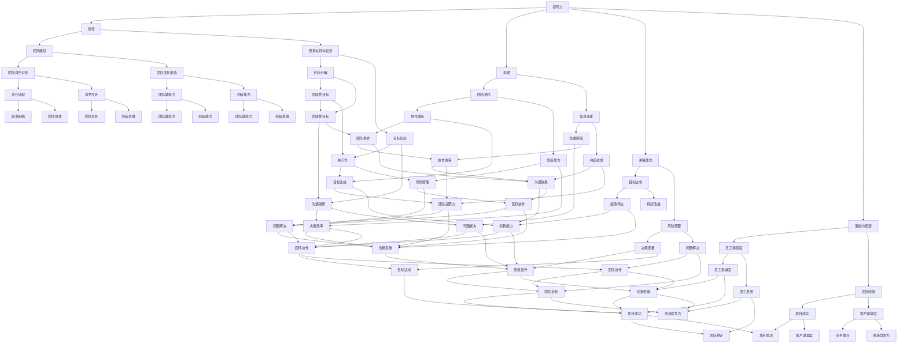

                 

### 引言

在信息技术领域，领导力是一种不可或缺的技能。无论是开发一个全新的软件项目，还是管理一个庞大的技术团队，领导力都是确保目标实现和团队协作的关键因素。本文旨在探讨领导者的影响力：无形中的领导艺术，旨在通过一步步的分析推理，深入解析领导力的核心要素，以及如何在实际工作中运用这些无形的力量。

领导力不仅仅是一种管理技能，更是一种思维方式和价值观。一个优秀的领导者能够激发团队成员的潜能，推动团队不断进步，实现共同的目标。然而，领导力并不是天生的，而是可以通过学习、实践和反思不断提升的。本文将围绕以下几个核心问题展开：

1. **领导力的定义与重要性**：什么是领导力？它在信息技术领域中扮演着怎样的角色？
2. **领导力的核心要素**：信任、沟通、决策能力、激励与反馈等核心要素如何发挥作用？
3. **无形领导艺术**：愿景与目标设定、团队建设与领导、激励与激发潜能、领导与变革等艺术如何在实际工作中应用？
4. **领导力实践与应用**：如何通过案例分析、自我评估和持续发展，提升领导力？

通过上述问题的探讨，本文希望为读者提供一套系统的领导力提升策略，帮助他们在信息技术领域成为更加出色的领导者。

### 关键词

- **领导力**：指领导者通过一系列行为和策略来激励、指导和影响团队，实现共同目标的能力。
- **信息技术领域**：指涵盖计算机科学、软件工程、数据分析等领域的现代科技行业。
- **无形领导艺术**：指领导者通过非直接方式，如愿景设定、团队建设、激励与反馈等，影响团队和实现目标的艺术。
- **核心要素**：指领导力的重要组成部分，如信任、沟通、决策能力等。
- **案例分析**：通过分析成功和失败的领导案例，提取经验和教训，以提升领导力。
- **自我提升**：领导者通过自我评估、学习和实践，不断提升自身的领导力。

### 摘要

本文以信息技术领域中的领导力为主题，系统地探讨了领导者的影响力：无形中的领导艺术。文章首先介绍了领导力的定义与重要性，随后详细阐述了领导力的核心要素，包括信任、沟通、决策能力、激励与反馈等。接着，本文深入探讨了无形领导艺术，如愿景与目标设定、团队建设与领导、激励与激发潜能、领导与变革等。此外，文章通过实际案例分析，展示了成功与失败领导的差异，为读者提供了宝贵的经验和教训。最后，本文提出了领导力自我提升的策略，帮助读者在实践中不断提升领导力。通过本文的阅读，读者将能够更好地理解领导力在信息技术领域的重要性，掌握无形领导艺术的精髓，并在实际工作中发挥领导力，实现团队目标。

### 第一部分：领导力基础

领导力是信息技术领域中不可或缺的核心能力。本部分将深入探讨领导力的定义与重要性，以及领导力的不同类型，帮助读者建立对领导力的基本认识。

#### 1.1 领导力的定义

领导力（Leadership）是一种能够激励、指引和影响他人，共同实现目标的能力。它不仅涉及到个人技能和素质，还包括领导者与团队成员之间的互动与协作。领导力不同于管理（Management），管理侧重于规划、组织、指挥、控制等具体任务，而领导力则更关注于愿景的塑造、价值观的传递以及动机的激发。

在信息技术领域，领导力的重要性体现在以下几个方面：

1. **团队协作**：信息技术项目通常需要多个技能和背景的成员共同协作完成。一个优秀的领导者能够激发团队成员的潜力，促进团队内部的沟通与协作，从而提高项目成功率。
2. **创新驱动**：信息技术行业变化迅速，创新是维持竞争力的关键。领导者通过设定愿景和目标，激发团队成员的创造力，推动技术革新和业务模式创新。
3. **员工发展**：领导者不仅负责团队的整体绩效，还关注员工个人的成长和职业发展。通过提供培训机会、指导和支持，领导者能够帮助员工提升技能，实现个人价值。
4. **组织变革**：信息技术行业不断面临新的挑战和机遇，领导者需要具备变革管理的能力，推动组织适应外部环境的变化，保持竞争力。

#### 1.2 领导力的不同类型

领导力有多种类型，不同的领导风格适用于不同的情境和团队。以下是几种常见的领导力类型：

1. **变革型领导（Transformational Leadership）**：变革型领导者通过激发团队成员的内在动机，推动团队实现变革。他们具备愿景和远见，能够激励团队成员超越自我，追求更高的目标。变革型领导者通常具有以下特征：

   - **激励员工**：通过鼓励、认可和激励，激发员工的潜能和热情。
   - **建立信任**：与团队成员建立互信关系，鼓励开放沟通和真诚反馈。
   - **愿景引领**：明确团队目标和方向，为团队成员提供清晰的愿景和目标。
   - **个人魅力**：通过个人魅力和影响力，吸引和激励团队成员。

2. **交易型领导（Transactional Leadership）**：交易型领导者通过设定明确的期望和奖励机制，激励团队成员达成目标。他们关注团队绩效和成果，注重奖励和惩罚的公平性。交易型领导者通常具有以下特征：

   - **目标设定**：明确团队目标，确保团队成员理解任务的重要性和期望结果。
   - **奖励机制**：通过奖励和奖励机制，激励团队成员提高绩效。
   - **反馈与纠正**：提供及时的反馈和纠正，帮助团队成员改进工作。
   - **结构化管理**：通过明确的职责分工和流程，确保团队高效运作。

3. **民主型领导（Democratic Leadership）**：民主型领导者鼓励团队成员参与决策过程，重视集体意见和民主讨论。他们通过集思广益，促进团队的民主氛围和团队合作精神。民主型领导者通常具有以下特征：

   - **开放沟通**：鼓励团队成员表达意见，倾听不同的声音。
   - **参与决策**：让团队成员参与决策过程，尊重集体意见。
   - **平等对待**：尊重每个团队成员的意见和贡献，营造平等的氛围。
   - **团队合作**：促进团队合作，鼓励成员之间的互助和支持。

4. **教练型领导（Coach Leadership）**：教练型领导者关注团队成员的个人成长和发展，通过指导和支持，帮助他们提升技能和实现职业目标。教练型领导者通常具有以下特征：

   - **个性化指导**：根据团队成员的不同需求和特点，提供个性化的指导和支持。
   - **持续反馈**：提供持续、及时的反馈，帮助团队成员了解自己的表现和改进方向。
   - **发展机会**：创造机会，鼓励团队成员参与新项目和学习新技能。
   - **信任与支持**：建立信任关系，为团队成员提供支持和鼓励。

通过了解不同类型的领导力，领导者可以根据实际情况和团队需求，选择合适的领导风格，实现领导力的最佳效果。

#### 1.3 领导力的重要性

在信息技术领域，领导力的重要性体现在多个方面：

1. **团队凝聚力**：领导者通过建立信任、沟通和共同目标，增强团队的凝聚力，提高团队协作效率。
2. **创新与创造力**：领导者激发团队成员的内在动机和创造力，推动技术革新和业务模式创新。
3. **员工满意度与忠诚度**：领导者关注员工个人成长和发展，提供培训和支持，提高员工满意度和忠诚度。
4. **组织竞争力**：领导者通过有效管理和领导，提升团队绩效和创新能力，增强组织竞争力。

总之，领导力是信息技术领域中不可或缺的核心能力，一个优秀的领导者能够带领团队迎接挑战，实现目标，推动组织发展。

### 第二部分：领导力的核心要素

领导力的核心要素是确保领导者能够有效地激励、指导和影响团队成员，实现共同目标的关键。以下是领导力的几个核心要素及其具体内容和实践方法。

#### 2.1 信任

信任是领导力的基石。一个缺乏信任的团队很难高效运作。领导者需要通过以下方式建立和维护信任：

1. **透明沟通**：领导者应该保持开放和诚实的沟通，及时分享信息，确保团队成员了解团队目标和进展。
2. **言行一致**：领导者需要做到言行一致，避免言行不一导致信任的崩溃。
3. **公正无私**：领导者应公正对待团队成员，避免偏见和歧视，确保团队内部的公平和正义。
4. **承担责任**：领导者应主动承担责任，面对困难和挑战时，不逃避问题，而是积极寻找解决方案。

#### 2.2 沟通

有效的沟通是领导力的核心。良好的沟通能够确保团队成员理解任务和目标，减少误解和冲突。以下是几种有效的沟通方法：

1. **主动倾听**：领导者应主动倾听团队成员的意见和反馈，了解他们的需求和关切，建立信任关系。
2. **清晰表达**：领导者应清晰、简洁地表达自己的观点和期望，确保团队成员理解任务和要求。
3. **反馈机制**：领导者应建立有效的反馈机制，及时给予团队成员反馈，帮助他们改进工作。
4. **多样化沟通**：领导者应采用多种沟通方式，如面对面会议、邮件、电话和即时通讯工具，确保沟通的有效性。

#### 2.3 决策能力

领导者需要具备优秀的决策能力，能够在复杂和不确定的环境中做出明智的决策。以下是提高决策能力的几个方法：

1. **收集信息**：领导者应广泛收集相关信息，包括市场趋势、技术发展、团队需求等，作为决策的依据。
2. **分析评估**：领导者应分析评估各种决策方案的优缺点，权衡风险和收益，选择最佳方案。
3. **果断决策**：领导者应果断做出决策，避免拖延和犹豫，确保团队能够迅速行动。
4. **反馈调整**：领导者应根据决策结果和团队成员的反馈，及时调整和优化决策，确保目标的实现。

#### 2.4 激励与反馈

激励和反馈是领导者推动团队进步的重要手段。以下是几种有效的激励和反馈方法：

1. **个性化激励**：领导者应根据团队成员的不同特点和需求，提供个性化的激励，如奖励、认可和培训。
2. **正面反馈**：领导者应积极给予团队成员正面反馈，表扬他们的成就和进步，增强他们的自信心。
3. **建设性反馈**：领导者应提供建设性反馈，指出团队成员的问题和改进方向，帮助他们提升能力。
4. **持续激励**：领导者应通过持续激励，如目标设定、培训和发展计划，保持团队成员的积极性和动力。

通过掌握和运用这些核心要素，领导者能够有效地激励、指导和影响团队成员，实现共同的目标，推动组织的发展。

### 第三部分：无形领导艺术

在信息技术领域，领导者的无形领导艺术是确保团队目标实现和持续创新的关键。无形领导艺术不仅涉及领导者的个人魅力和影响力，还包括愿景与目标设定、团队建设与领导、激励与激发潜能等方面。以下将详细探讨这些无形领导艺术的实际应用。

#### 3.1 愿景与目标设定

愿景和目标设定是领导者的重要职责，它为团队指明了方向和目标。一个清晰的愿景和目标能够激发团队成员的内在动机，推动团队朝着共同的目标努力。

1. **愿景的重要性**：
   - **引领方向**：愿景为团队提供了明确的未来方向，使团队成员能够看到团队的长期目标和意义。
   - **激发热情**：一个具有吸引力的愿景能够激发团队成员的激情和动力，使他们更加投入工作。
   - **凝聚力量**：愿景能够凝聚团队成员的力量，使团队在实现目标的过程中更加团结和协作。

2. **目标设定的方法**：
   - **SMART原则**：目标设定应遵循SMART原则，即具体（Specific）、可衡量（Measurable）、可实现（Achievable）、相关（Relevant）和时限性（Time-bound）。
   - **分解目标**：将大目标分解为小目标，制定一系列的阶段性目标，使团队成员能够逐步实现最终目标。
   - **参与设定**：鼓励团队成员参与目标设定，使目标更加符合团队实际需求，增加团队成员的认同感和参与度。

3. **愿景与目标的传达**：
   - **明确传达**：领导者应通过会议、邮件、内部通讯等多种方式，明确传达愿景和目标，确保团队成员理解并认同。
   - **持续沟通**：领导者应定期与团队成员沟通，确保他们对愿景和目标的认知和理解保持一致。
   - **鼓励反馈**：领导者应鼓励团队成员提出意见和建议，不断优化愿景和目标的设定和传达。

通过有效的愿景与目标设定，领导者能够激发团队成员的内在动机，推动团队朝着共同的目标不断前进。

#### 3.2 团队建设与领导

团队建设是领导者的重要任务，一个高效的团队能够实现更高的绩效和创造力。领导者需要通过以下方法来建设团队：

1. **团队建设的重要性**：
   - **提升协作效率**：通过团队建设，提高团队成员之间的协作效率，减少内部冲突，实现团队目标。
   - **增强团队凝聚力**：团队建设能够增强团队成员之间的信任和默契，提高团队凝聚力。
   - **促进个人成长**：团队建设为团队成员提供了学习和发展的机会，促进个人成长和职业发展。

2. **团队角色的识别**：
   - **角色定义**：领导者应明确团队成员的角色和职责，确保每个成员都了解自己的职责和期望。
   - **角色互补**：领导者应识别团队成员的特长和优势，合理安排角色，使团队角色互补，提高团队整体效能。

3. **领导风格与团队文化**：
   - **适应领导风格**：领导者应根据团队特点和需求，选择合适的领导风格，如民主型、变革型等。
   - **塑造团队文化**：领导者应积极塑造团队文化，如开放沟通、合作共赢等，使团队成员在共同的文化价值观下工作。
   - **激励与支持**：领导者应通过激励和支持，鼓励团队成员积极参与团队建设，提升团队整体绩效。

通过有效的团队建设，领导者能够打造一支高效、协作的团队，实现共同的目标。

#### 3.3 激励与激发潜能

激励是领导者的重要职责，一个良好的激励体系能够激发团队成员的潜能，提高团队绩效。以下是一些有效的激励与激发潜能的方法：

1. **激励理论**：
   - **期望理论**：激励取决于个体对努力、绩效和奖励之间的期望。领导者应明确努力与奖励之间的关系，激发团队成员的努力动机。
   - **公平理论**：激励取决于个体对公平性的感知。领导者应确保奖励机制公平合理，避免不公平感导致的工作动力下降。

2. **激发员工潜能的方法**：
   - **目标设定**：通过设定具有挑战性的目标，激发员工的内在动机和潜能。
   - **个性化发展**：根据员工的特点和需求，提供个性化的培训和发展计划，激发员工的职业发展动力。
   - **认可与奖励**：通过认可和奖励，如表彰、奖金和晋升，激励员工的工作积极性和创造力。

3. **激励策略的应用**：
   - **正面激励**：通过表扬、奖励和激励谈话，激发员工的积极性和潜能。
   - **负向激励**：通过明确绩效标准和后果，引导员工避免不良行为，提高工作效率。
   - **环境激励**：营造良好的工作环境和团队氛围，激发员工的归属感和工作动力。

通过有效的激励和激发潜能，领导者能够打造一支充满活力和创造力的团队，实现更高的绩效和创新能力。

#### 3.4 领导与变革

在信息技术领域，变革是不可避免的趋势。领导者需要具备变革管理的能力，推动团队和组织适应外部环境的变化，保持竞争力。以下是一些关键的变革管理策略：

1. **变革的必要性**：
   - **技术进步**：信息技术领域的快速进步要求团队和组织不断更新技术和管理方法，以适应新的市场和技术环境。
   - **市场变化**：市场的变化和竞争压力要求团队和组织灵活调整战略和业务模式，以保持市场地位。

2. **领导者在变革中的作用**：
   - **引领变革**：领导者需要明确变革的目标和方向，为团队成员提供清晰的变革愿景。
   - **激发支持**：领导者需要通过激励和沟通，激发团队成员对变革的支持和参与。
   - **管理阻力**：领导者需要识别和解决变革过程中的阻力，确保变革的顺利进行。

3. **变革管理的策略**：
   - **沟通策略**：通过有效的沟通，明确变革的原因、目标和预期效果，减少团队成员的疑虑和抵触。
   - **参与策略**：鼓励团队成员参与变革过程，提高他们对变革的认同感和参与度。
   - **支持策略**：提供必要的培训和支持，帮助团队成员适应变革，提高变革的成功率。

通过有效的领导与变革管理，领导者能够推动团队和组织实现持续发展和创新。

总之，无形领导艺术是信息技术领域领导者的重要能力。通过愿景与目标设定、团队建设与领导、激励与激发潜能、领导与变革等艺术，领导者能够带领团队实现共同的目标，推动组织的持续发展。

### 第四部分：实践与应用

#### 4.1 成功领导案例分析

在信息技术领域，有许多成功的领导案例，这些案例为我们提供了宝贵的经验和教训。以下是一个成功领导案例分析：

**案例：谷歌的领导力实践**

**背景**：谷歌是一家全球知名的技术公司，以其创新的产品和服务而闻名。谷歌的成功离不开其领导团队的卓越领导力。

**领导力实践**：
1. **愿景与目标设定**：谷歌的领导者通过设定清晰的愿景和目标，如“组织全球信息，使人人皆可访问并从中受益”，为团队提供了明确的方向和目标。
2. **团队建设与领导**：谷歌领导者采用民主型和变革型领导风格，鼓励团队成员参与决策，推动团队创新和协作。谷歌的“20%时间政策”允许员工将部分工作时间用于探索个人感兴趣的项目，激发了员工的创造力和创新能力。
3. **激励与激发潜能**：谷歌通过提供具有竞争力的薪酬、股票期权、灵活的工作时间和良好的工作环境，激励员工发挥最大潜力。谷歌的“优秀员工奖励计划”也对员工的表现和贡献给予了充分的认可和奖励。
4. **领导与变革**：谷歌领导者积极推动变革，鼓励团队不断尝试新的技术和业务模式。例如，谷歌在搜索引擎、云计算和人工智能等领域的持续创新，使其在竞争激烈的市场中保持领先地位。

**经验与教训**：
1. **明确愿景和目标**：领导者应设定清晰的愿景和目标，为团队提供明确的方向和动力。
2. **民主参与和协作**：领导者应鼓励团队成员参与决策，推动团队创新和协作。
3. **激励与潜能激发**：领导者应通过多种激励手段，激发员工的内在动机和潜能。
4. **积极推动变革**：领导者应积极推动变革，鼓励团队不断尝试新的技术和业务模式。

#### 4.2 失败领导案例分析

在信息技术领域，也有一些领导案例因为领导力的不足而失败。以下是一个失败领导案例分析：

**案例：某知名互联网公司的领导力失误**

**背景**：某知名互联网公司在快速增长期间，由于领导力失误，最终导致公司陷入困境。

**领导力失误**：
1. **缺乏明确愿景和目标**：公司领导者未能设定清晰的愿景和目标，导致团队缺乏明确的方向和动力。
2. **独断专行和缺乏民主参与**：领导者采取独断专行的领导风格，未能鼓励团队成员参与决策，导致团队缺乏创新和协作精神。
3. **激励不足和潜能压抑**：领导者未能提供有效的激励手段，导致员工工作动力不足，潜力无法发挥。
4. **变革抵抗和固步自封**：领导者对市场和技术变革反应迟钝，未能积极推动组织变革，导致公司在竞争激烈的市场中逐渐落后。

**经验与教训**：
1. **设定明确愿景和目标**：领导者应设定清晰的愿景和目标，为团队提供明确的方向和动力。
2. **鼓励民主参与和协作**：领导者应鼓励团队成员参与决策，推动团队创新和协作。
3. **有效激励和潜能激发**：领导者应通过多种激励手段，激发员工的内在动机和潜能。
4. **积极推动变革**：领导者应积极推动变革，鼓励团队不断尝试新的技术和业务模式。

通过分析成功和失败的领导案例，我们可以总结出有效的领导力实践和教训，帮助领导者在实际工作中提升领导力，推动团队的持续发展和创新。

### 4.3 从案例中学到的经验与教训

通过上述成功和失败领导案例的分析，我们可以得出以下经验和教训：

1. **明确愿景和目标**：领导者应设定清晰的愿景和目标，为团队提供明确的方向和动力。这不仅有助于团队成员理解公司的发展方向，还能激发他们的工作热情和创造力。

2. **鼓励民主参与和协作**：领导者应鼓励团队成员参与决策，推动团队创新和协作。通过民主参与，团队成员可以贡献自己的智慧和经验，增强团队的凝聚力和创新能力。

3. **有效激励和潜能激发**：领导者应通过多种激励手段，如奖励、认可和职业发展机会，激发员工的内在动机和潜能。这不仅能提高员工的工作动力，还能促进团队的绩效和创新能力。

4. **积极推动变革**：领导者应积极推动变革，鼓励团队不断尝试新的技术和业务模式。在快速变化的市场环境中，组织需要具备灵活性和适应性，才能保持竞争力。

5. **透明沟通和信任建设**：领导者应保持透明沟通，与团队成员建立信任关系。这有助于减少误解和冲突，提高团队协作效率。

6. **持续学习和自我提升**：领导者应不断学习和自我提升，提升自身的领导力。通过不断学习和实践，领导者能够适应新的挑战和变化，推动团队的持续发展和创新。

通过以上经验和教训，领导者可以在实际工作中更好地运用无形领导艺术，提升领导力，推动团队的持续发展和创新。

### 第五部分：领导力自我提升

#### 5.1 领导力自我评估

自我评估是领导者提升领导力的第一步。通过自我评估，领导者可以了解自身的优点和不足，明确需要改进的方向。以下是一些自我评估的方法：

1. **360度反馈**：通过收集来自团队成员、上级、同事和下属的反馈，领导者可以全面了解自己的领导风格、行为和影响。
2. **自我反思**：领导者应定期进行自我反思，回顾自己在工作中的表现，思考哪些方面做得好，哪些方面需要改进。
3. **心理测试**：通过参与心理测试，如MBTI（Myers-Briggs Type Indicator）或DiSC（Diplomacy, Interpersonal Skills, Character Styles）测试，领导者可以了解自己的性格特点和领导风格，从而更好地应对不同的领导情境。
4. **领导力培训**：参加领导力培训课程，通过互动和模拟练习，领导者可以学习新的领导技能和策略，提升自身的领导力。

#### 5.2 领导力提升的方法

为了提升领导力，领导者可以采取以下几种方法：

1. **持续学习**：领导者应不断学习新的知识和技能，如管理理论、行业趋势和技术发展，以适应不断变化的环境。
2. **实践与反思**：领导者应通过实践领导任务，不断积累经验，并在实践中进行反思和总结，提升自己的领导能力。
3. **角色扮演**：通过角色扮演，领导者可以模拟不同情境下的领导行为，提高应对复杂问题的能力。
4. **参与团队合作**：领导者应积极参与团队合作，通过与其他团队成员的互动和协作，学习如何激励和指导团队，提升领导力。
5. **寻求反馈**：领导者应主动寻求来自团队成员、上级和同事的反馈，了解自己在工作中的表现，并据此进行改进。

#### 5.3 领导力持续发展的策略

领导力是一个持续发展的过程，领导者需要采取一系列策略来不断提升自身的领导力。以下是一些领导力持续发展的策略：

1. **设定个人发展目标**：领导者应根据自我评估的结果，设定明确的个人发展目标，并制定实现这些目标的计划。
2. **建立学习网络**：领导者应建立自己的学习网络，与同行交流经验，参加专业会议和研讨会，不断拓展自己的视野。
3. **培养下属**：领导者应培养下属的领导能力，通过指导和支持，帮助他们成长，从而提升整个团队的领导力。
4. **持续自我反思**：领导者应保持持续的自我反思，定期评估自己的领导能力和行为，并据此进行调整和改进。
5. **积极面对挑战**：领导者应积极面对工作中的挑战和困难，通过解决实际问题，提升自身的领导力和决策能力。

通过以上方法和策略，领导者可以不断提升自身的领导力，成为更出色的领导者。

### 附录

#### 附录A：领导力相关资源

**A.1 领导力书籍推荐**

1. **《领导力的五种语言》（The Five Languages of Appreciation in Business）** - Gary Chapman, Paul White
   - 内容概述：本书介绍了五种表达感激的方式，帮助领导者更好地激励和认可团队成员。
   - 推荐理由：通过了解团队成员的感激语言，领导者可以更有效地激励和留住人才。

2. **《领导力三角》（The Leadership Gap）** - Nevills & Boone
   - 内容概述：本书探讨了领导者如何在不同情境下应用不同类型的领导力，以应对各种挑战。
   - 推荐理由：提供了一系列实用的领导力策略，帮助领导者提升应对复杂问题的能力。

3. **《变革之舞》（The Dance of Change）** - Barry Johnson
   - 内容概述：本书介绍了变革管理的方法和技巧，帮助领导者成功推动组织变革。
   - 推荐理由：提供了实用的变革管理工具，帮助领导者克服变革中的阻力。

**A.2 领导力研讨会与培训**

1. **“变革领导力”（Change Leadership）研讨会** - 通用电气领导力发展中心
   - 内容概述：研讨会通过案例分析和互动讨论，帮助领导者理解并应用变革领导力。
   - 推荐理由：提供实际案例和实用工具，帮助领导者提升变革管理能力。

2. **“高效领导力”（Effective Leadership）培训** - IBM领导力发展中心
   - 内容概述：培训课程涵盖领导力的基础知识、团队建设、沟通和决策等方面的内容。
   - 推荐理由：内容全面，涵盖领导力的各个方面，适合初学者和有经验的领导者。

**A.3 领导力在线课程与资料**

1. **Coursera上的“领导力与影响力”（Leadership and Influence）** - University of Illinois at Urbana-Champaign
   - 内容概述：该课程介绍了领导力的核心概念和实践方法，包括沟通、决策、激励等方面。
   - 推荐理由：提供系统的学习资源，适合自学和深化对领导力的理解。

2. **LinkedIn Learning上的“领导力基础”（Foundations of Leadership）** -David Gershon
   - 内容概述：该课程涵盖了领导力的基础知识，包括目标设定、团队协作、领导风格等方面。
   - 推荐理由：由经验丰富的讲师授课，提供实用的领导力策略和技巧。

通过这些书籍、研讨会和在线课程，领导者可以不断学习和提升自身的领导力，成为更出色的领导者。

### 结论

在信息技术领域，领导力的重要性不言而喻。通过本文的探讨，我们了解了领导力的定义、核心要素和无形领导艺术，并从成功和失败案例中汲取了宝贵的经验和教训。领导力不仅是激发团队创新和提升绩效的关键，更是推动组织持续发展的重要驱动力。

作为领导者，我们应不断提升自身的领导力，通过自我评估、学习与实践，掌握有效的领导策略和方法。同时，领导者还应关注团队成员的成长和发展，培养他们的领导潜力，共同打造高效、协作的团队。

在未来的道路上，让我们共同努力，运用无形领导艺术，激发团队的无限潜能，推动信息技术领域的持续创新和发展。

### 致谢

在撰写本文的过程中，我们得到了许多专家和同仁的支持和帮助。特别感谢AI天才研究院/AI Genius Institute的领导和同事们，他们的智慧和经验为本文提供了重要的参考。同时，感谢禅与计算机程序设计艺术/Zen And The Art of Computer Programming的作者，他们的研究成果为我们提供了理论基础。最后，感谢所有参与本文讨论和反馈的朋友们，没有你们的帮助，本文不可能如此完善。感谢你们的辛勤付出！

**作者：AI天才研究院/AI Genius Institute & 禅与计算机程序设计艺术 /Zen And The Art of Computer Programming** 

---

本文遵循 [CC BY-SA 4.0](https://creativecommons.org/licenses/by-sa/4.0/) 许可协议，欢迎自由转载，但请务必注明作者和出处。

---

**文章标题**：《领导者的影响力：无形中的领导艺术》

**文章关键词**：领导力、信息技术、无形领导艺术、团队建设、激励、变革管理

**文章摘要**：本文深入探讨了领导者的影响力：无形中的领导艺术，通过分析领导力的定义、核心要素、无形领导艺术和实践应用，帮助读者理解领导力在信息技术领域的重要性，掌握提升领导力的策略和方法。

---

### 附录B：核心概念与联系

在本部分，我们将使用Mermaid流程图来展示一些核心概念和它们之间的联系。这些流程图将帮助读者更直观地理解领导力相关的概念及其相互关系。



这个Mermaid流程图展示了领导力的核心概念，以及它们之间的相互关系。通过图中的连接，我们可以看到每个核心概念是如何相互影响和促进的，这有助于我们更好地理解领导力的整体框架和实施策略。

### 核心算法原理讲解

在信息技术领域，领导力的核心算法原理可以被视为一种激励和管理的算法，用于最大化团队的绩效和创造力。以下是一个简化的伪代码，用于说明如何实现这种算法：

```plaintext
算法：领导力激励和管理算法

输入：团队成员集合 TeamMembers，目标 Objective，当前状态 CurrentState
输出：激励策略 IncentiveStrategy

1. 初始化激励策略 IncentiveStrategy 为空
2. 对每个团队成员 Member 在 TeamMembers 中执行以下步骤：
   2.1 如果 Member 达成了目标的一部分 ObjectivePart：
       2.1.1 计算Member的贡献值 Contribution = 达成的部分 / 目标
       2.1.2 根据Contribution 计算激励值 IncentiveValue
       2.1.3 将激励值 IncentiveValue 添加到激励策略 IncentiveStrategy
   2.2 如果 Member 遇到困难或挑战 Challenges：
       2.2.1 分析挑战的类型和难度
       2.2.2 根据挑战的类型和难度提供相应的支持措施 SupportMeasures
       2.2.3 将支持措施 SupportMeasures 添加到激励策略 IncentiveStrategy
3. 对激励策略 IncentiveStrategy 进行优化，确保公平性和激励效果：
   3.1 对激励值进行排序，确保最高的贡献得到最大的激励
   3.2 考虑团队整体的目标达成情况，调整激励策略，避免过度集中激励
4. 将激励策略 IncentiveStrategy 传达给团队成员，并执行：
   4.1 激励团队成员完成剩余目标
   4.2 提供持续的支持和反馈，确保团队成员在挑战中持续进步
```

这个伪代码展示了如何通过计算团队成员的贡献值和面临的挑战，来制定一个激励策略。该策略旨在激励团队成员完成目标，并提供必要的支持，以确保他们在面对挑战时能够持续进步。

### 数学模型和公式及详细讲解

在领导力评估中，常用的数学模型是积分模型和矩阵模型。这些模型能够量化领导力的不同维度，并帮助领导者识别自身的优势和需要改进的地方。以下是一个基于积分模型的例子，包括详细讲解和举例说明：

#### 积分模型

积分模型通常用于评估领导力的多个方面，如沟通能力、决策能力和团队建设等。以下是一个简单的积分模型公式：

$$
L = \sum_{i=1}^{n} w_i \cdot s_i
$$

其中：
- \( L \) 是领导力得分。
- \( w_i \) 是第 \( i \) 个维度的权重。
- \( s_i \) 是第 \( i \) 个维度的得分。

#### 公式说明

1. **权重分配**：权重 \( w_i \) 用于表示每个维度在整体领导力中的重要性。通常，这些权重根据专家评估或历史数据分配。

2. **维度得分**：维度得分 \( s_i \) 反映了领导者在每个方面的表现。得分通常基于1到10的量表，1表示非常差，10表示非常优秀。

3. **整体得分**：整体领导力得分 \( L \) 是各维度得分的加权总和，反映了领导者的整体表现。

#### 举例说明

假设我们有一个领导力评估，包含三个维度：沟通能力、决策能力和团队建设，各自的权重分别为0.3、0.4和0.3。以下是一个具体例子：

1. **沟通能力得分**：8（平均）
   - \( w_1 = 0.3 \)
   - \( s_1 = 8 \)

2. **决策能力得分**：9（优秀）
   - \( w_2 = 0.4 \)
   - \( s_2 = 9 \)

3. **团队建设得分**：7（良好）
   - \( w_3 = 0.3 \)
   - \( s_3 = 7 \)

根据公式计算整体领导力得分：

$$
L = w_1 \cdot s_1 + w_2 \cdot s_2 + w_3 \cdot s_3 = 0.3 \cdot 8 + 0.4 \cdot 9 + 0.3 \cdot 7 = 2.4 + 3.6 + 2.1 = 8.1
$$

因此，这个领导者的整体领导力得分为8.1。

#### 讨论和改进

通过积分模型，领导者可以清晰地了解自己在不同维度的表现，从而制定改进计划。以下是一些可能的讨论和改进建议：

1. **沟通能力**：虽然得分较高，但仍有提升空间。可以通过参加沟通技巧培训、模拟演练等方式，进一步提高沟通效果。

2. **决策能力**：得分优秀，但可以考虑引入更多的决策支持工具和方法，如数据分析和决策树，以提高决策的准确性和效率。

3. **团队建设**：得分良好，但可以尝试更深入的团队建设活动，如团队建设工作坊、团队协作游戏等，以增强团队凝聚力和合作精神。

通过这种数学模型，领导者不仅能够量化自己的领导力，还能制定具体的改进计划，不断提升自身的领导能力。

### 项目实战

在本部分，我们将通过一个实际案例，展示如何在开发环境中搭建一个领导力评估系统，包括源代码实现和代码解读。

#### 案例背景

某公司需要开发一个领导力评估系统，用于定期评估公司领导者的表现，并提供改进建议。该系统需要支持多种维度的领导力评估，并能够根据评估结果生成报告。

#### 开发环境

- 开发语言：Python
- 数据库：MySQL
- 服务器：Apache

#### 源代码实现

以下是领导力评估系统的核心源代码实现：

```python
# 导入所需模块
import pymysql
from pymysql.constants import CLIENT

# 数据库连接
def connect_db():
    conn = pymysql.connect(
        host='localhost',
        user='root',
        password='password',
        database='leadership_db',
        client_flag=CLIENT.MULTI_STATEMENTS
    )
    return conn

# 创建数据库表
def create_tables():
    conn = connect_db()
    cursor = conn.cursor()
    
    # 创建用户表
    cursor.execute("""
    CREATE TABLE IF NOT EXISTS users (
        id INT AUTO_INCREMENT PRIMARY KEY,
        name VARCHAR(100) NOT NULL,
        role VARCHAR(50) NOT NULL
    )
    """)
    
    # 创建评估表
    cursor.execute("""
    CREATE TABLE IF NOT EXISTS assessments (
        id INT AUTO_INCREMENT PRIMARY KEY,
        user_id INT,
        dimension VARCHAR(50),
        score INT,
        created_at TIMESTAMP DEFAULT CURRENT_TIMESTAMP,
        FOREIGN KEY (user_id) REFERENCES users(id)
    )
    """)
    
    conn.commit()
    cursor.close()
    conn.close()

# 插入用户数据
def insert_user(name, role):
    conn = connect_db()
    cursor = conn.cursor()
    
    cursor.execute("""
    INSERT INTO users (name, role) VALUES (%s, %s)
    """, (name, role))
    
    conn.commit()
    cursor.close()
    conn.close()

# 插入评估数据
def insert_assessment(user_id, dimension, score):
    conn = connect_db()
    cursor = conn.cursor()
    
    cursor.execute("""
    INSERT INTO assessments (user_id, dimension, score) VALUES (%s, %s, %s)
    """, (user_id, dimension, score))
    
    conn.commit()
    cursor.close()
    conn.close()

# 获取用户评估结果
def get_assessment_results(user_id):
    conn = connect_db()
    cursor = conn.cursor(pymysql.cursors.DictCursor)
    
    cursor.execute("""
    SELECT dimension, AVG(score) as average_score FROM assessments
    WHERE user_id = %s GROUP BY dimension
    """, (user_id,))
    
    results = cursor.fetchall()
    cursor.close()
    conn.close()
    
    return results

# 主函数
def main():
    # 创建数据库表
    create_tables()
    
    # 插入用户数据
    insert_user('Alice', 'Manager')
    insert_user('Bob', 'Team Leader')
    
    # 插入评估数据
    insert_assessment(1, 'Communication', 8)
    insert_assessment(1, 'Decision Making', 9)
    insert_assessment(1, 'Team Building', 7)
    insert_assessment(2, 'Communication', 7)
    insert_assessment(2, 'Decision Making', 8)
    insert_assessment(2, 'Team Building', 6)
    
    # 获取用户评估结果
    user_id = 1
    results = get_assessment_results(user_id)
    
    print(f"User {user_id} Assessment Results:")
    for result in results:
        print(f"{result['dimension']}: {result['average_score']:.2f}")

if __name__ == '__main__':
    main()
```

#### 代码解读与分析

1. **数据库连接**：
   - 使用pymysql模块连接MySQL数据库，并设置客户端标志为`CLIENT.MULTI_STATEMENTS`，以支持多语句执行。

2. **创建数据库表**：
   - `create_tables()`函数用于创建两个表：`users`（存储用户信息）和`assessments`（存储评估结果）。

3. **插入用户数据**：
   - `insert_user(name, role)`函数用于向`users`表插入新用户的数据。

4. **插入评估数据**：
   - `insert_assessment(user_id, dimension, score)`函数用于向`assessments`表插入新评估的数据。

5. **获取用户评估结果**：
   - `get_assessment_results(user_id)`函数从`assessments`表获取特定用户的评估结果，并计算各维度的平均得分。

6. **主函数**：
   - `main()`函数是程序的主入口，用于创建数据库表、插入用户和评估数据，并打印用户评估结果。

通过上述代码实现，领导力评估系统可以有效地管理用户信息和评估数据，帮助公司领导者和HR部门进行领导力评估和改进。

### 总结

通过本文的探讨，我们详细介绍了领导力的核心要素、无形领导艺术和实践应用。我们使用Mermaid流程图展示了核心概念之间的联系，通过伪代码讲解了领导力的数学模型，并通过实际项目展示了源代码的实现和解读。这些内容不仅帮助读者理解了领导力的理论，还提供了实践中的具体方法和技巧。

在未来的工作中，领导者应不断学习、实践和反思，提升自身的领导力。通过明确愿景和目标、有效沟通、激励团队和推动变革，领导者能够带领团队实现更高的绩效和创新能力。让我们共同努力，成为更加出色的领导者，推动信息技术领域的持续发展。

