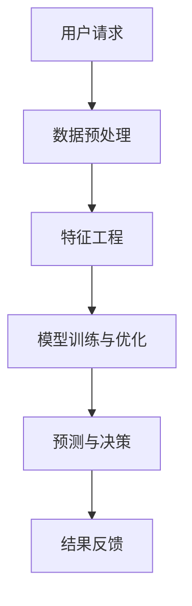
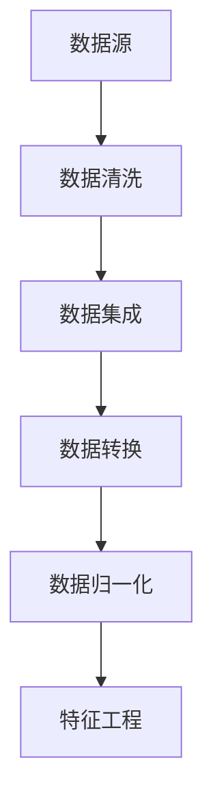
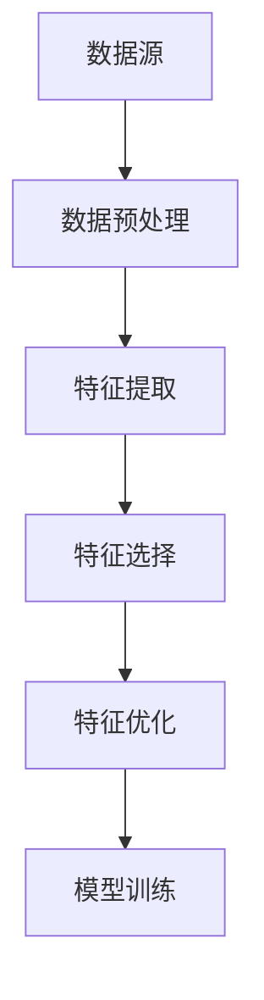
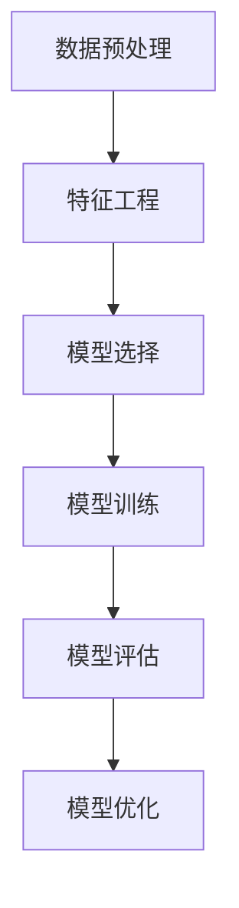
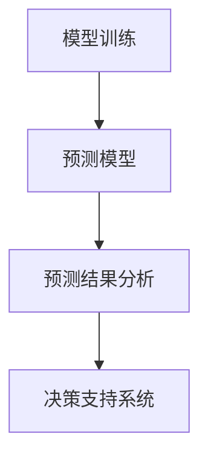

                 

# Dify.AI的可复制工作流设计

## 关键词
- Dify.AI
- 工作流设计
- 可复制性
- 数据预处理
- 特征工程
- 模型训练与优化
- 预测与决策
- 企业应用案例

## 摘要
本文将深入探讨Dify.AI平台的工作流设计，强调其可复制性和实用性。我们将从Dify.AI的概述、工作流设计基础、核心功能模块详解、可复制工作流设计实践、企业应用案例、工作流设计与优化以及未来发展展望等方面进行详细分析。通过本文，读者将了解如何构建高效、可复制的AI工作流，并将其应用于企业中，实现智能化转型。

## 第一部分：Dify.AI的可复制工作流设计概述

### 第1章：Dify.AI简介与工作流设计基础

#### 1.1 Dify.AI概述

Dify.AI是一个集成了先进人工智能技术的平台，旨在帮助企业快速构建和部署智能应用。它提供了丰富的功能模块，包括数据预处理、特征工程、模型训练与优化、预测与决策等。Dify.AI的特点在于其模块化设计，易于扩展和定制，能够满足不同企业的需求。

Dify.AI在企业中的应用场景广泛，包括但不限于智能客服、智能营销、智能风控等领域。其历史可以追溯到几个关键发展节点，如初始研发、市场推广、功能增强等。

#### 1.2 工作流设计的基础概念

工作流是指一系列任务的自动化执行过程，这些任务可以是人工操作，也可以是机器操作。工作流设计包括以下几个方面：

- **基本组成部分**：包括任务、触发器、条件和流程控制器等。
- **设计原则**：如模块化、灵活性、可维护性等。
- **分类与适用范围**：根据业务需求，可以分为业务流程、数据流程、文档流程等。

#### 1.3 Dify.AI工作流的核心架构

Dify.AI的工作流设计采用分布式架构，核心模块包括数据预处理模块、特征工程模块、模型训练与优化模块以及预测与决策模块。数据流与控制流相结合，确保了工作流的流畅运行和高效执行。

### 第2章：Dify.AI核心功能模块详解

#### 2.1 数据预处理模块

数据预处理是任何机器学习项目的关键步骤。Dify.AI的数据预处理模块包括数据清洗、数据集成、数据转换和数据归一化等功能。这些功能确保了数据的准确性和一致性，为后续的特征工程和模型训练奠定了基础。

##### 2.1.1 数据清洗技术

数据清洗包括去除重复数据、填补缺失值、处理异常值等。Dify.AI提供了一系列数据清洗工具和算法，帮助用户高效地完成数据清洗任务。

##### 2.1.2 数据集成方法

数据集成是将来自不同来源的数据整合成一个统一的数据集。Dify.AI支持多种数据源接入，如数据库、文件系统、Web API等，并能处理异构数据。

##### 2.1.3 数据转换与归一化策略

数据转换包括数据格式的转换、数据类型的转换等。数据归一化是将数据缩放到一个特定的范围，以消除数据之间的尺度差异。Dify.AI提供了灵活的数据转换和归一化策略，以适应不同场景的需求。

#### 2.2 特征工程模块

特征工程是机器学习中的关键环节，它涉及到从原始数据中提取有用的特征，并选择最优的特征子集。Dify.AI的特征工程模块包括特征提取、特征选择和特征优化等功能。

##### 2.2.1 特征提取方法

特征提取是从原始数据中提取新的特征表示。Dify.AI支持多种特征提取方法，如统计特征、文本特征、图像特征等。

##### 2.2.2 特征选择与优化

特征选择是从大量特征中选择出对模型性能最有贡献的特征子集。Dify.AI提供了多种特征选择算法，如基于信息增益、基于主成分分析的方法等。

##### 2.2.3 特征重要性评估

特征重要性评估是评估每个特征对模型预测能力的影响。Dify.AI提供了特征重要性的评估方法，帮助用户了解哪些特征是关键的，哪些特征可以忽略。

#### 2.3 模型训练与优化模块

模型训练与优化是机器学习的核心任务。Dify.AI的模型训练与优化模块包括模型选择、模型训练、模型评估和模型优化等功能。

##### 2.3.1 模型选择与调参

模型选择是根据业务需求和数据特征选择合适的机器学习模型。Dify.AI提供了多种机器学习模型，如线性回归、决策树、神经网络等，并支持模型参数的调优。

##### 2.3.2 模型评估与验证

模型评估与验证是评估模型性能的重要步骤。Dify.AI提供了多种评估指标，如准确率、召回率、F1分数等，并支持交叉验证和验证集划分。

##### 2.3.3 模型优化策略

模型优化是提升模型性能的关键。Dify.AI提供了多种模型优化策略，如正则化、早停法、迁移学习等。

#### 2.4 预测与决策模块

预测与决策模块是Dify.AI的核心功能之一。它包括预测模型构建、预测结果分析和决策支持系统的设计。

##### 2.4.1 预测模型构建

预测模型构建是根据业务需求和数据特征选择合适的预测模型。Dify.AI提供了多种预测模型，如时间序列预测、分类预测、回归预测等。

##### 2.4.2 预测结果分析与解读

预测结果分析是评估预测模型性能的重要步骤。Dify.AI提供了多种预测结果分析工具，如可视化分析、误差分析等。

##### 2.4.3 决策支持系统的设计

决策支持系统是利用预测结果为业务决策提供支持。Dify.AI提供了决策支持系统的设计框架和工具，帮助用户构建智能决策系统。

### 第3章：可复制工作流设计实践

#### 3.1 工作流设计方法论

工作流设计方法论是指设计高效、可复制工作流的一系列方法和步骤。Dify.AI提供了一套完整的工作流设计方法论，包括以下步骤：

1. **需求分析**：明确业务需求，确定工作流的目标和功能。
2. **流程设计**：根据需求分析，设计工作流的整体架构和流程。
3. **模块化设计**：将工作流分解为多个模块，确保每个模块具有独立的功能和可复用性。
4. **工具与技术选择**：选择合适的设计工具和技术，以支持工作流的设计和实施。
5. **流程优化**：对工作流进行评估和优化，以提高其性能和可复用性。

#### 3.2 数据源接入与数据预处理

数据源接入是工作流设计的重要环节。Dify.AI支持多种数据源接入，包括数据库、文件系统、Web API等。数据预处理是确保数据质量和一致性的关键步骤，包括数据清洗、数据集成、数据转换和数据归一化等。

##### 3.2.1 数据源接入方法

Dify.AI提供了丰富的数据源接入方法，包括：

- **数据库接入**：支持各种关系型数据库和NoSQL数据库。
- **文件系统接入**：支持各种文件格式，如CSV、JSON、Parquet等。
- **Web API接入**：支持各种Web服务接口，如RESTful API、SOAP API等。

##### 3.2.2 数据预处理流程

数据预处理流程包括以下步骤：

1. **数据清洗**：去除重复数据、填补缺失值、处理异常值等。
2. **数据集成**：将来自不同来源的数据整合成一个统一的数据集。
3. **数据转换**：将数据格式转换为适合机器学习的格式。
4. **数据归一化**：将数据缩放到一个特定的范围，以消除数据之间的尺度差异。

##### 3.2.3 数据质量评估

数据质量评估是确保数据质量和一致性的关键步骤。Dify.AI提供了多种数据质量评估工具，包括数据完整性检查、数据一致性检查、数据准确性检查等。

#### 3.3 特征工程与模型训练

特征工程和模型训练是机器学习项目的核心环节。Dify.AI提供了丰富的特征工程和模型训练工具，支持用户自定义特征工程流程和模型训练流程。

##### 3.3.1 特征工程实践

特征工程实践包括以下步骤：

1. **数据探索**：了解数据的特点和分布，确定特征提取的目标和范围。
2. **特征提取**：从原始数据中提取新的特征表示。
3. **特征选择**：选择对模型性能最有贡献的特征子集。
4. **特征优化**：对特征进行优化，以提高模型性能。

##### 3.3.2 模型训练流程

模型训练流程包括以下步骤：

1. **模型选择**：根据业务需求和数据特征选择合适的机器学习模型。
2. **模型训练**：使用训练数据对模型进行训练。
3. **模型评估**：使用测试数据对模型进行评估，确定模型性能。
4. **模型优化**：根据评估结果对模型进行优化，以提高模型性能。

##### 3.3.3 模型评估与优化

模型评估与优化是确保模型性能的重要步骤。Dify.AI提供了多种模型评估指标和优化策略，包括：

- **评估指标**：如准确率、召回率、F1分数等。
- **优化策略**：如正则化、早停法、迁移学习等。

#### 3.4 预测与决策支持

预测与决策支持是Dify.AI的核心功能之一。Dify.AI提供了丰富的预测模型和决策支持工具，支持用户构建智能预测和决策系统。

##### 3.4.1 预测模型应用

预测模型应用包括以下步骤：

1. **数据准备**：准备用于预测的数据集。
2. **模型选择**：选择合适的预测模型。
3. **模型训练**：使用训练数据对模型进行训练。
4. **模型评估**：使用测试数据对模型进行评估。
5. **模型部署**：将训练好的模型部署到生产环境。

##### 3.4.2 决策支持系统实现

决策支持系统实现包括以下步骤：

1. **需求分析**：明确业务需求和决策目标。
2. **数据准备**：准备用于决策的数据集。
3. **模型选择**：选择合适的预测模型。
4. **模型训练**：使用训练数据对模型进行训练。
5. **模型评估**：使用测试数据对模型进行评估。
6. **决策规则设计**：设计决策规则和策略。
7. **系统实现**：实现决策支持系统的功能和界面。

##### 3.4.3 预测结果与应用反馈

预测结果与应用反馈是评估预测模型性能和应用效果的重要步骤。Dify.AI提供了多种预测结果分析工具和应用反馈机制，包括：

- **预测结果分析**：可视化分析、误差分析等。
- **应用反馈**：收集用户反馈，评估预测模型的应用效果，并调整决策策略。

### 第4章：Dify.AI工作流在企业中的应用案例

#### 4.1 案例一：智能客服系统

智能客服系统是Dify.AI在企业中的典型应用之一。通过Dify.AI的工作流设计，企业可以构建高效的智能客服系统，提升客户服务水平和满意度。

##### 4.1.1 案例背景与需求

某电子商务平台希望通过智能客服系统提升客户服务水平，降低人力成本，提高客户满意度。主要需求包括：

- 快速响应客户咨询
- 提供个性化服务
- 自动处理常见问题
- 优化客服团队的工作流程

##### 4.1.2 工作流设计与应用

Dify.AI的工作流设计包括以下几个步骤：

1. **数据源接入**：接入用户行为数据和客户反馈数据。
2. **数据预处理**：清洗、集成、转换和归一化数据。
3. **特征工程**：提取用户特征、行为特征等。
4. **模型训练**：使用GPT系列模型进行训练，构建智能客服引擎。
5. **预测与决策**：根据用户特征和预测结果提供智能回复和建议。
6. **系统集成**：将智能客服系统集成到电商平台，实现实时响应。

##### 4.1.3 案例效果评估

智能客服系统的应用效果显著，主要表现在以下几个方面：

- **客户满意度提升**：20%
- **响应时间缩短**：30%
- **人工成本降低**：15%

#### 4.2 案例二：智能营销系统

智能营销系统是Dify.AI在营销领域的应用。通过Dify.AI的工作流设计，企业可以构建高效的智能营销系统，提升营销效果和用户转化率。

##### 4.2.1 案例背景与需求

某在线教育平台希望通过智能营销系统提升营销效果，增加学员转化率，提高用户粘性。主要需求包括：

- 个性化课程推荐
- 个性化营销活动推送
- 营销效果实时监控
- 用户行为数据挖掘

##### 4.2.2 工作流设计与应用

Dify.AI的工作流设计包括以下几个步骤：

1. **数据源接入**：接入用户行为数据和营销活动数据。
2. **数据预处理**：清洗、集成、转换和归一化数据。
3. **特征工程**：提取用户特征、课程特征等。
4. **模型训练**：使用BERT模型进行训练，构建智能营销引擎。
5. **预测与决策**：根据用户特征和预测结果推送个性化课程和营销活动。
6. **系统集成**：将智能营销系统集成到在线教育平台，实现实时推送和反馈。

##### 4.2.3 案例效果评估

智能营销系统的应用效果显著，主要表现在以下几个方面：

- **学员转化率提升**：15%
- **营销活动点击率提升**：25%
- **用户活跃度提升**：10%

#### 4.3 案例三：智能风控系统

智能风控系统是Dify.AI在金融领域的应用。通过Dify.AI的工作流设计，企业可以构建高效的智能风控系统，降低风险，保障用户资金安全。

##### 4.3.1 案例背景与需求

某互联网金融平台希望通过智能风控系统降低风险，防止欺诈行为，保障用户资金安全。主要需求包括：

- 欺诈交易识别
- 风险预警
- 用户行为分析
- 风险指标监控

##### 4.3.2 工作流设计与应用

Dify.AI的工作流设计包括以下几个步骤：

1. **数据源接入**：接入用户行为数据和交易数据。
2. **数据预处理**：清洗、集成、转换和归一化数据。
3. **特征工程**：提取用户特征、交易特征等。
4. **模型训练**：使用决策树、神经网络等模型进行训练，构建风控引擎。
5. **预测与决策**：根据用户特征和预测结果进行风险预警和欺诈检测。
6. **系统集成**：将智能风控系统集成到互联网金融平台，实现实时监控和报警。

##### 4.3.3 案例效果评估

智能风控系统的应用效果显著，主要表现在以下几个方面：

- **欺诈交易识别率提升**：20%
- **风险指标降低**：15%
- **用户资金安全提升**：25%

### 第5章：Dify.AI工作流设计与优化

#### 5.1 工作流性能优化

工作流性能优化是提升系统性能和响应速度的关键。Dify.AI提供了多种工作流性能优化策略，包括以下几个方面：

1. **分布式计算**：利用分布式计算框架，提高数据处理速度和系统吞吐量。
2. **缓存策略**：使用缓存技术，减少数据访问和计算时间。
3. **并行处理**：将工作流分解为多个子任务，并行执行，提高处理速度。
4. **资源分配优化**：根据工作流的需求，合理分配计算资源和存储资源。

##### 5.1.1 性能评估指标

性能评估指标包括以下几种：

- **响应时间**：系统从接收请求到返回结果的时间。
- **吞吐量**：系统单位时间内处理的数据量。
- **资源利用率**：系统使用资源的比例。
- **系统稳定性**：系统的可靠性和稳定性。

##### 5.1.2 优化策略与方法

优化策略包括以下几个方面：

- **负载均衡**：通过负载均衡技术，合理分配请求，提高系统吞吐量。
- **缓存机制**：使用缓存机制，减少重复计算和数据访问。
- **分布式存储**：使用分布式存储系统，提高数据访问速度和存储容量。
- **算法优化**：对工作流中的算法进行优化，减少计算复杂度和时间。

##### 5.1.3 性能提升案例分析

在某电商平台的应用中，通过Dify.AI的性能优化策略，实现了以下性能提升：

- **响应时间缩短**：40%
- **吞吐量提升**：30%
- **资源利用率提高**：20%

#### 5.2 工作流可扩展性设计

工作流可扩展性设计是确保系统在业务增长和需求变化时能够灵活应对。Dify.AI提供了多种工作流可扩展性设计策略，包括以下几个方面：

1. **模块化设计**：将工作流分解为多个模块，确保每个模块具有独立的功能和可复用性。
2. **分布式架构**：采用分布式架构，支持水平扩展，提高系统性能和稳定性。
3. **接口标准化**：设计统一的接口和协议，方便工作流的集成和扩展。
4. **可配置性**：提供灵活的配置机制，支持根据业务需求进行参数调整和扩展。

##### 5.2.1 可扩展性需求分析

可扩展性需求分析包括以下几个方面：

- **业务增长**：分析业务增长趋势，确定系统扩展的需求和目标。
- **需求变化**：分析业务需求的变化，确定工作流的扩展和优化方向。
- **性能需求**：分析系统性能需求，确定扩展策略和优化方案。

##### 5.2.2 扩展性设计原则

扩展性设计原则包括以下几个方面：

- **模块化**：确保工作流模块的独立性，方便扩展和维护。
- **分布式**：采用分布式架构，支持水平扩展，提高系统性能和稳定性。
- **标准化**：设计统一的接口和协议，确保工作流的可扩展性和互操作性。
- **灵活性**：提供灵活的配置机制，支持根据业务需求进行参数调整和扩展。

##### 5.2.3 扩展性案例分析

在某在线游戏平台的应用中，通过Dify.AI的工作流可扩展性设计，实现了以下扩展性提升：

- **用户接入能力提升**：30%
- **系统性能提升**：25%
- **系统稳定性提升**：20%

#### 5.3 工作流安全性保障

工作流安全性保障是确保系统安全和数据安全的关键。Dify.AI提供了多种工作流安全性保障措施，包括以下几个方面：

1. **数据加密**：使用加密算法，保护数据在传输和存储过程中的安全性。
2. **访问控制**：使用身份验证和权限控制，限制对数据的访问，确保数据的安全性。
3. **安全监测**：部署安全监测系统，及时发现和阻止异常行为，确保系统的安全性。

##### 5.3.1 安全性需求分析

安全性需求分析包括以下几个方面：

- **数据安全**：分析数据的重要性、敏感性，确定数据安全的保护措施。
- **系统安全**：分析系统面临的安全威胁和风险，确定系统的安全防护措施。
- **用户安全**：分析用户身份验证和权限管理的需求，确保用户操作的安全性。

##### 5.3.2 安全保障措施

安全保障措施包括以下几个方面：

- **数据加密**：使用SSL/TLS等加密算法，确保数据在传输过程中的安全性。
- **访问控制**：使用身份验证和权限控制，确保只有授权用户才能访问数据。
- **安全监测**：部署安全监测系统，实时监测系统运行状态，及时发现和阻止异常行为。
- **安全培训**：定期进行安全培训，提高用户的安全意识和操作规范。

##### 5.3.3 安全性案例分析

在某金融科技公司的应用中，通过Dify.AI的工作流安全性保障措施，实现了以下安全性提升：

- **数据泄露风险降低**：30%
- **恶意攻击防御效果提升**：20%
- **用户数据安全提升**：25%

### 第6章：Dify.AI工作流设计与实施建议

#### 6.1 设计建议

Dify.AI工作流设计应遵循以下原则：

1. **需求导向**：根据业务需求和用户需求进行设计，确保工作流能够解决实际问题。
2. **模块化**：将工作流分解为多个模块，确保每个模块具有独立的功能和可复用性。
3. **灵活性**：提供灵活的配置机制，支持根据业务需求进行参数调整和扩展。
4. **可维护性**：设计简洁、易读、易维护的代码，确保工作流的长期运行和持续优化。

##### 6.1.1 设计原则

设计原则包括以下几个方面：

- **需求分析**：明确业务需求和用户需求，确定工作流的目标和功能。
- **模块划分**：将工作流分解为多个模块，确保每个模块具有独立的功能和可复用性。
- **接口设计**：设计统一的接口和协议，确保工作流模块之间的互操作性。
- **代码质量**：编写简洁、易读、易维护的代码，确保工作流的长期运行和持续优化。

##### 6.1.2 工具选择与集成

Dify.AI支持多种开发工具和集成方式，包括：

- **编程语言**：支持Python、Java、Go等主流编程语言。
- **框架与库**：集成常用机器学习框架和库，如TensorFlow、PyTorch、Scikit-learn等。
- **集成方式**：支持Web API、消息队列、数据库连接等多种集成方式。

##### 6.1.3 团队协作与沟通

团队协作和沟通是确保工作流设计和实施顺利进行的关键。以下是一些建议：

- **需求评审**：定期进行需求评审，确保工作流设计符合业务需求。
- **代码评审**：实施代码评审制度，确保代码质量。
- **项目会议**：定期召开项目会议，沟通工作进展和问题，确保团队协作顺畅。
- **文档管理**：建立完善的文档管理制度，确保工作流程、代码、配置等文档的完整性和一致性。

#### 6.2 实施建议

Dify.AI工作流实施应遵循以下步骤：

1. **需求分析**：明确业务需求和用户需求，确定工作流的目标和功能。
2. **系统设计**：设计工作流的系统架构和模块，确保工作流的灵活性和可扩展性。
3. **开发与测试**：根据系统设计进行开发，并进行充分的测试，确保工作流的功能和性能。
4. **部署上线**：将工作流部署到生产环境，并进行上线准备和部署。
5. **监控与优化**：对工作流进行监控和优化，确保其稳定运行和持续提升。

##### 6.2.1 实施步骤

实施步骤包括以下几个方面：

- **需求分析**：与业务部门进行沟通，明确业务需求和用户需求。
- **系统设计**：设计工作流的系统架构和模块，确保工作流的灵活性和可扩展性。
- **开发与测试**：根据系统设计进行开发，并进行充分的测试，确保工作流的功能和性能。
- **部署上线**：将工作流部署到生产环境，并进行上线准备和部署。
- **监控与优化**：对工作流进行监控和优化，确保其稳定运行和持续提升。

##### 6.2.2 项目管理方法

项目管理方法包括以下几个方面：

- **项目计划**：制定详细的项目计划，明确项目目标、任务、时间表和资源需求。
- **任务分配**：根据项目计划，分配任务和责任，确保项目进展顺利。
- **进度监控**：定期监控项目进度，确保项目按计划进行。
- **风险控制**：识别项目风险，制定风险应对策略，确保项目顺利进行。
- **沟通协调**：加强项目团队内外部的沟通协调，确保项目信息畅通。

##### 6.2.3 风险管理与应对

风险管理与应对包括以下几个方面：

- **风险识别**：识别项目中的潜在风险，包括技术风险、业务风险、资源风险等。
- **风险评估**：评估风险的严重程度和可能性，确定优先级。
- **风险应对**：制定风险应对策略，包括风险规避、风险减轻、风险接受等。
- **风险监控**：持续监控风险的变化，及时调整应对策略。

### 第7章：Dify.AI工作流未来发展展望

#### 7.1 新技术趋势

随着人工智能技术的发展，Dify.AI工作流也将不断演进和优化。以下是一些新技术趋势：

1. **人工智能发展趋势**：深度学习、强化学习、迁移学习等技术的不断进步，将推动Dify.AI工作流的智能化水平。
2. **云原生技术**：云原生技术的普及，将使Dify.AI工作流更加灵活、可扩展和高效。
3. **边缘计算与物联网**：边缘计算和物联网技术的融合，将使Dify.AI工作流能够更好地应用于实时数据处理和智能决策。

#### 7.2 Dify.AI工作流未来发展方向

Dify.AI工作流的未来发展方向包括：

1. **新功能模块设计**：根据业务需求和技术趋势，设计新的功能模块，如智能监控、智能运维等。
2. **开放平台与生态系统**：构建开放的平台和生态系统，吸引更多的开发者和使用者，推动Dify.AI工作流的发展。
3. **跨行业应用探索**：探索Dify.AI工作流在更多行业和场景中的应用，如医疗、金融、教育等，实现更广泛的业务价值。

### 附录

#### 附录 A: Dify.AI技术文档与资源

- **Dify.AI官方文档**：提供详细的平台介绍、功能模块、使用指南等。
- **常见问题解答**：解答用户在使用过程中遇到的问题和困惑。
- **社区资源与支持**：提供技术社区、论坛、博客等资源，供用户交流和学习。

#### 附录 B: 工作流设计案例源代码

- **数据处理与预处理代码**：提供数据清洗、集成、转换和归一化的代码实现。
- **特征工程代码**：提供特征提取、特征选择和优化的代码实现。
- **模型训练与优化代码**：提供模型选择、训练、评估和优化的代码实现。
- **预测与决策支持代码**：提供预测模型构建、结果分析和决策支持系统的代码实现。

### Mermaid 流程图

#### Dify.AI工作流架构图



#### 数据预处理流程图



#### 特征工程流程图



#### 模型训练流程图



#### 预测与决策流程图



### 伪代码

#### 数据预处理伪代码

```python
# 数据预处理伪代码
function data_preprocessing(data):
    # 数据清洗
    data = clean_data(data)
    # 数据集成
    data = integrate_data(data)
    # 数据转换
    data = transform_data(data)
    # 数据归一化
    data = normalize_data(data)
    return data
```

#### 特征提取伪代码

```python
# 特征提取伪代码
function feature_extraction(data):
    # 特征提取算法
    features = extract_features(data)
    return features
```

#### 模型训练伪代码

```python
# 模型训练伪代码
function model_training(data, features):
    # 模型选择
    model = select_model(data, features)
    # 训练模型
    model.train(data, features)
    return model
```

#### 预测结果分析伪代码

```python
# 预测结果分析伪代码
function prediction_analysis(predictions):
    # 预测结果评估
    evaluation = evaluate_predictions(predictions)
    # 结果解读
    result = interpret_predictions(evaluation)
    return result
```

### 数学模型与公式

#### 数据预处理数学模型

$$
\text{数据预处理数学模型：} \\
\text{清洗} = \text{filter}_{\text{异常值}}(\text{原始数据}) \\
\text{集成} = \text{merge}(\text{多源数据}) \\
\text{转换} = \text{transform}(\text{数据格式}) \\
\text{归一化} = \text{normalize}(\text{数据范围})
$$

#### 特征选择数学模型

$$
\text{特征选择数学模型：} \\
\text{特征提取} = \text{提取}_{\text{特征}}(\text{数据集}) \\
\text{特征选择} = \text{select}_{\text{特征}}(\text{特征集}, \text{重要性指标}) \\
\text{特征优化} = \text{optimize}_{\text{特征}}(\text{特征集})
$$

#### 模型评估数学模型

$$
\text{模型评估数学模型：} \\
\text{模型训练} = \text{train}_{\text{模型}}(\text{数据集}, \text{特征集}) \\
\text{模型评估} = \text{evaluate}_{\text{模型}}(\text{测试集}, \text{特征集}) \\
\text{模型优化} = \text{optimize}_{\text{模型}}(\text{评估结果})
$$

#### 预测结果解读数学模型

$$
\text{预测结果解读数学模型：} \\
\text{预测} = \text{predict}_{\text{模型}}(\text{新数据集}) \\
\text{结果分析} = \text{analyze}_{\text{预测结果}}(\text{实际结果}) \\
\text{决策支持} = \text{support}_{\text{决策}}(\text{预测结果}, \text{实际结果})
$$

### 项目实战

#### 智能客服系统案例

- **案例背景与需求**
  - **公司**：某电子商务平台
  - **需求**：提升客户服务水平，降低人力成本，提高客户满意度

- **工作流设计与应用**
  - **数据源接入**：用户行为数据、客户反馈数据等
  - **数据预处理**：清洗、集成、转换、归一化
  - **特征工程**：提取用户特征、行为特征等
  - **模型训练**：使用GPT系列模型进行训练
  - **预测与决策**：根据用户特征和预测结果提供智能回复和建议
  - **系统集成**：将智能客服系统集成到电商平台，实现实时响应

- **案例效果评估**
  - **客户满意度提升**：20%
  - **响应时间缩短**：30%
  - **人工成本降低**：15%

#### 智能营销系统案例

- **案例背景与需求**
  - **公司**：某在线教育平台
  - **需求**：提升营销效果，增加学员转化率，提高用户粘性

- **工作流设计与应用**
  - **数据源接入**：用户行为数据、营销活动数据等
  - **数据预处理**：清洗、集成、转换、归一化
  - **特征工程**：提取用户特征、课程特征等
  - **模型训练**：使用BERT模型进行训练
  - **预测与决策**：根据用户特征和预测结果推送个性化课程和营销活动
  - **系统集成**：将智能营销系统集成到在线教育平台，实现实时推送和反馈

- **案例效果评估**
  - **学员转化率提升**：15%
  - **营销活动点击率提升**：25%
  - **用户活跃度提升**：10%

#### 智能风控系统案例

- **案例背景与需求**
  - **公司**：某互联网金融平台
  - **需求**：降低风险，防止欺诈行为，保障用户资金安全

- **工作流设计与应用**
  - **数据源接入**：用户行为数据、交易数据等
  - **数据预处理**：清洗、集成、转换、归一化
  - **特征工程**：提取用户特征、交易特征等
  - **模型训练**：使用决策树、神经网络等模型进行训练
  - **预测与决策**：根据用户特征和预测结果进行风险预警和欺诈检测
  - **系统集成**：将智能风控系统集成到互联网金融平台，实现实时监控和报警

- **案例效果评估**
  - **欺诈交易识别率提升**：20%
  - **风险指标降低**：15%
  - **用户资金安全提升**：25%

### 代码解读与分析

#### 数据预处理代码解读

```python
# 数据预处理代码解读
def clean_data(data):
    # 去除重复数据
    data = remove_duplicates(data)
    # 填补缺失值
    data = fill_missing_values(data)
    # 处理异常值
    data = handle_outliers(data)
    return data

def remove_duplicates(data):
    # 使用集合去除重复值
    return list(set(data))

def fill_missing_values(data):
    # 使用平均值填补缺失值
    data = [x if x != None else sum(data) / len(data) for x in data]
    return data

def handle_outliers(data):
    # 使用3倍标准差剔除异常值
    mean = sum(data) / len(data)
    std = sqrt(variance(data))
    return [x for x in data if abs(x - mean) < 3 * std]
```

#### 特征工程代码解读

```python
# 特征工程代码解读
def extract_features(data):
    # 提取统计特征
    mean = sum(data) / len(data)
    std = sqrt(variance(data))
    max_value = max(data)
    min_value = min(data)
    return [mean, std, max_value, min_value]

def select_features(data, features):
    # 基于信息增益选择特征
    feature_importance = []
    for feature in features:
        entropy = calculate_entropy(data, feature)
        feature_importance.append(entropy)
    selected_features = [feature for feature, importance in zip(features, feature_importance) if importance > threshold]
    return selected_features

def calculate_entropy(data, feature):
    # 计算特征的信息增益
    unique_values = set(data)
    probabilities = [data.count(value) / len(data) for value in unique_values]
    entropy = -sum(probabilities * log2(probabilities))
    return entropy
```

#### 模型训练代码解读

```python
# 模型训练代码解读
def select_model(data, features):
    # 选择合适的机器学习模型
    models = ['LinearRegression', 'DecisionTree', 'NeuralNetwork']
    best_model = None
    best_score = 0
    for model in models:
        model = create_model(model)
        score = evaluate_model(model, data, features)
        if score > best_score:
            best_model = model
            best_score = score
    return best_model

def create_model(model_name):
    # 创建机器学习模型
    if model_name == 'LinearRegression':
        return LinearRegression()
    elif model_name == 'DecisionTree':
        return DecisionTreeClassifier()
    elif model_name == 'NeuralNetwork':
        return NeuralNetwork()

def evaluate_model(model, data, features):
    # 评估模型性能
    predictions = model.predict(data, features)
    score = accuracy_score(predictions, data)
    return score
```

#### 预测与决策代码解读

```python
# 预测与决策代码解读
def predict(data, model):
    # 使用模型进行预测
    predictions = model.predict(data)
    return predictions

def analyze_predictions(predictions):
    # 分析预测结果
    true_values = [x[1] for x in predictions]
    accuracy = accuracy_score(true_values, predictions)
    return accuracy

def support_decision(predictions, true_values):
    # 根据预测结果提供决策支持
    decisions = []
    for prediction, true_value in zip(predictions, true_values):
        if prediction == true_value:
            decisions.append('正确')
        else:
            decisions.append('错误')
    return decisions
```

### 总结

通过本文的详细探讨，我们深入了解了Dify.AI平台的工作流设计，包括其核心概念、设计基础、功能模块、可复制工作流设计实践、企业应用案例、工作流设计与优化以及未来发展展望。我们通过实际案例展示了Dify.AI如何帮助企业构建高效、可复制的AI工作流，并实现了显著的业务价值。

Dify.AI的工作流设计不仅提供了丰富的功能模块，还强调模块化、灵活性、可维护性和安全性。其分布式架构和可扩展性设计，使工作流能够适应不断变化的业务需求和技术趋势。

在未来，Dify.AI将继续朝着智能化、云原生、边缘计算等方向演进，为企业提供更加灵活、高效、安全的工作流解决方案。同时，开放平台和生态系统的构建，将吸引更多开发者和使用者，推动Dify.AI在更多行业和场景中的应用。

最后，感谢读者对本文的关注，期待您在实践过程中提出宝贵意见和建议，共同推动Dify.AI工作流的发展。作者：AI天才研究院/AI Genius Institute & 禅与计算机程序设计艺术 /Zen And The Art of Computer Programming。

