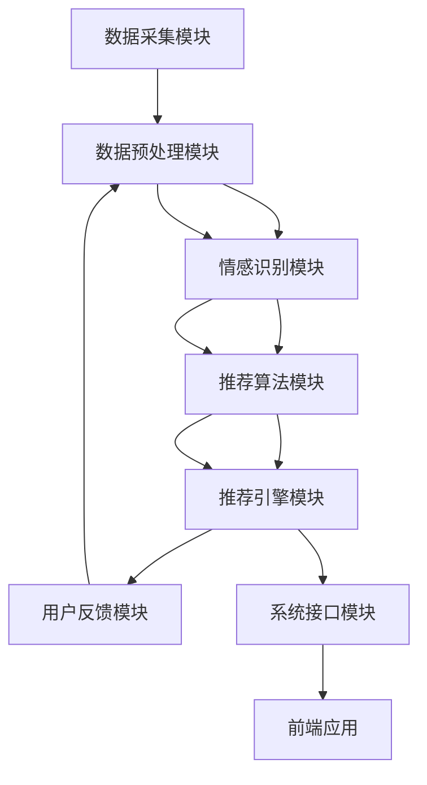

                 

### 文章标题

《情感驱动推荐：AI如何理解用户情绪，提供个性化推荐》

### 文章关键词

- 情感计算
- 个性化推荐
- 情感识别
- AI技术
- 机器学习
- 深度学习

### 摘要

随着人工智能技术的不断进步，情感驱动推荐系统成为了提高用户满意度和提升商业价值的重要工具。本文将深入探讨情感驱动推荐系统的基本概念、核心技术以及实际应用。首先，我们将介绍情感驱动推荐系统的基本概念，包括推荐系统的定义、分类和作用。接着，我们将探讨情感识别技术的理论基础，包括情感计算和情感分析模型。随后，我们将详细解析情感识别的常见方法，如基于规则、机器学习和深度学习的方法。在此基础上，我们将介绍情感驱动推荐算法的原理，包括协同过滤、基于内容以及混合推荐算法。然后，我们将分享情感驱动推荐系统的设计与实现步骤，包括数据收集与处理、情感识别模块实现、推荐算法的实现与优化。此外，我们还将探讨情感驱动推荐系统在不同领域的应用案例。最后，我们将展望情感驱动推荐技术的发展趋势与挑战，并提出未来研究方向。通过本文的阅读，读者将全面了解情感驱动推荐系统的核心概念、技术实现和应用前景。

### 目录大纲

- **第一部分：情感驱动推荐的基本概念**
  - 第1章：情感驱动推荐概述
    - 1.1 推荐系统的基本概念
    - 1.2 情感驱动的理论基础
    - 1.3 情感驱动推荐的优势
- **第二部分：情感识别技术**
  - 第2章：情感识别技术详解
    - 2.1 情感分析的基础
    - 2.2 情感分析的常见方法
    - 2.3 情感识别的挑战与解决方案
- **第三部分：情感驱动推荐算法**
  - 第3章：情感驱动推荐算法原理
    - 3.1 情感驱动的协同过滤算法
    - 3.2 基于内容的推荐算法
    - 3.3 情感驱动的混合推荐算法
- **第四部分：情感驱动推荐系统设计与实现**
  - 第4章：情感驱动推荐系统设计与实现
    - 4.1 情感驱动推荐系统的设计与架构
    - 4.2 数据收集与处理
    - 4.3 情感识别模块的实现
    - 4.4 推荐算法的实现与优化
    - 4.5 情感驱动推荐系统的部署与评估
- **第五部分：情感驱动推荐的实际应用**
  - 第5章：情感驱动推荐在不同领域的应用
    - 5.1 电子商务领域的应用
    - 5.2 社交媒体领域的应用
    - 5.3 娱乐内容领域的应用
- **第六部分：情感驱动推荐的发展与挑战**
  - 第6章：情感驱动推荐的发展趋势与挑战
    - 6.1 情感驱动推荐的技术趋势
    - 6.2 情感驱动推荐面临的挑战
    - 6.3 未来研究方向
- **附录**
  - 附录A：情感识别相关开源工具与资源
  - 附录B：情感计算与情感识别的Mermaid流程图
  - 附录C：情感识别算法原理与伪代码
  - 附录D：情感计算中的数学模型与公式
  - 附录E：情感驱动推荐系统的代码解读与分析
  - 附录F：情感识别相关书籍推荐

现在，我们将根据上述目录大纲，逐步深入探讨情感驱动推荐系统的各个方面。

### 第1章：情感驱动推荐概述

#### 1.1 推荐系统的基本概念

推荐系统（Recommender System）是一种信息过滤技术，旨在根据用户的历史行为、偏好和兴趣，向用户推荐他们可能感兴趣的内容或商品。推荐系统广泛应用于电子商务、社交媒体、在线娱乐、新闻推送等多个领域，目的是提高用户体验、增加用户粘性和提升商业价值。

**推荐系统的定义：**
推荐系统是一种基于用户行为和偏好进行信息筛选和过滤的技术，通过分析用户的历史数据和相似用户的偏好，为用户推荐个性化的内容或商品。

**推荐系统的分类：**
根据推荐策略的不同，推荐系统主要可以分为以下几类：

1. **基于内容的推荐（Content-Based Filtering）：**
   这种方法根据用户过去的偏好和兴趣，分析用户对特定内容的偏好，然后推荐与之相似的内容。基于内容的推荐依赖于内容的特征表示，如文本、图像、音频等。

2. **协同过滤推荐（Collaborative Filtering）：**
   协同过滤通过分析用户之间的相似性，根据相似用户的行为来推荐商品或内容。协同过滤可以分为两类：用户基于的协同过滤和项目基于的协同过滤。

   - **用户基于的协同过滤（User-Based Collaborative Filtering）：**
     这种方法根据用户之间的相似度计算相似用户，然后推荐这些用户喜欢的商品或内容。

   - **项目基于的协同过滤（Item-Based Collaborative Filtering）：**
     这种方法根据商品或内容之间的相似度计算相似商品或内容，然后推荐这些相似的商品或内容。

3. **基于模型的推荐（Model-Based Filtering）：**
   这种方法使用机器学习或深度学习模型来预测用户对商品的喜好，并根据预测结果推荐商品。基于模型的推荐可以更好地处理大规模数据和复杂的用户行为。

**推荐系统的作用：**
推荐系统在多个领域发挥着重要作用，主要包括以下几个方面：

1. **提高用户体验：**
   通过个性化推荐，用户可以更快地找到他们感兴趣的内容或商品，从而提高用户满意度和使用时长。

2. **增加用户粘性：**
   推荐系统能够根据用户的行为和偏好不断优化推荐结果，从而吸引并留住用户。

3. **提升商业价值：**
   推荐系统可以帮助企业更好地了解用户需求，提高商品转化率和销售额。

#### 1.2 情感驱动的理论基础

情感驱动推荐系统（Emotion-Driven Recommender System）是一种结合情感分析与推荐系统技术的个性化推荐方法。它通过识别和利用用户的情感信息，为用户提供更加精准和有针对性的推荐。

**情感计算：**
情感计算（Affective Computing）是研究如何使计算机具备识别、理解和表达人类情感的能力。情感计算的核心目标是让计算机能够理解和模拟人类的情感体验，从而更好地与人类互动。

**情感识别：**
情感识别（Emotion Recognition）是情感计算的一个重要分支，主要研究如何从文本、语音、图像等多模态数据中识别出用户的情感状态。情感识别的关键技术包括情感分类、情感强度度量、情感极性判断等。

**情感分析：**
情感分析（Sentiment Analysis）是一种自然语言处理技术，通过分析文本数据，识别出文本中的情感倾向和情感极性。情感分析通常包括情感分类、情感强度度量、情感极性判断等任务。

**情感驱动的推荐框架：**
情感驱动的推荐框架将情感识别技术与推荐系统相结合，通过以下步骤实现个性化推荐：

1. **情感识别：** 使用情感识别技术从用户行为数据（如评论、评价）中提取情感信息。

2. **情感建模：** 将提取的情感信息转化为可计算的模型，如情感向量、情感极性等。

3. **推荐生成：** 结合用户的历史行为和情感模型，生成个性化的推荐结果。

4. **推荐评估：** 根据用户反馈评估推荐效果，并优化推荐算法。

**情感驱动推荐的优势：**
情感驱动推荐相较于传统的推荐方法具有以下优势：

1. **更精准的推荐：** 通过情感识别，推荐系统可以更准确地理解用户的情感需求和偏好，从而提供更加个性化的推荐。

2. **更好的用户体验：** 情感驱动推荐能够更好地满足用户的情感需求，提升用户体验和满意度。

3. **更高效的数据利用：** 情感驱动推荐可以更好地利用用户的情感信息，提高数据的利用效率。

4. **更高的商业价值：** 情感驱动推荐能够更好地引导用户行为，提高转化率和销售额。

### 第2章：情感识别技术详解

#### 2.1 情感分析的基础

情感分析（Sentiment Analysis）是一种自然语言处理技术，旨在识别文本数据中的情感倾向和情感极性。情感分析通常包括以下三个主要任务：

1. **情感分类（Sentiment Classification）：**
   情感分类是指将文本数据分类为正面、负面或中性情感。情感分类是情感分析中最基本的任务，它可以帮助我们快速了解文本的情感倾向。

2. **情感强度度量（Sentiment Intensity Measurement）：**
   情感强度度量是指评估文本中的情感强度。情感强度度量可以帮助我们了解文本情感的强弱，从而更好地理解用户情绪。

3. **情感极性判断（Sentiment Polarity Judgment）：**
   情感极性判断是指判断文本是正面情感还是负面情感。情感极性判断是情感分类的一种形式，通常用于评估文本的情感极性。

**情感分析的应用场景：**

1. **社交媒体分析：**
   社交媒体中的用户评论、帖子等文本数据可以通过情感分析来评估用户的情感倾向，从而帮助企业了解用户反馈和市场趋势。

2. **产品评论分析：**
   产品评论是情感分析的重要应用场景之一。通过情感分析，企业可以了解用户对产品的评价，从而改进产品设计和营销策略。

3. **舆情监测：**
   情感分析可以帮助企业实时监测舆论动态，了解公众对特定事件或品牌的看法，从而做出及时响应。

4. **情感驱动推荐：**
   情感驱动推荐系统利用情感分析技术来识别用户的情感信息，从而提供更加个性化的推荐服务。

#### 2.2 情感分析的常见方法

情感分析的方法可以分为基于规则的方法、基于机器学习的方法和基于深度学习的方法。以下是这些方法的基本原理和应用场景。

**2.2.1 基于规则的方法**

基于规则的方法通过预定义的规则来分析文本中的情感。这些规则通常基于词义、语法和上下文信息。基于规则的方法具有实现简单、解释性强等优点，但缺点是规则难以覆盖所有情感场景，且随着规则数量的增加，系统的复杂度也会显著提高。

1. **词典法**

词典法是情感分析中最常用的规则方法之一。它使用预定义的情感词典来分析文本，通过匹配文本中的词语和词典中的关键词来判断文本的情感。词典法的关键在于构建一个高质量的情感词典。

2. **规则匹配**

规则匹配方法通过预定义的规则来分析文本，规则通常基于词义、语法和上下文信息。规则匹配方法可以实现复杂情感分析，但规则编写工作量较大，且系统可扩展性较差。

**2.2.2 基于机器学习的方法**

基于机器学习的方法通过训练模型来识别文本中的情感。机器学习方法具有较好的泛化能力和可扩展性，但需要大量的标注数据来进行模型训练。

1. **支持向量机（SVM）**

支持向量机是一种经典的机器学习算法，它可以用于情感分类任务。SVM通过找到一个最优的超平面来将文本数据分类为正面、负面或中性情感。SVM的优点是算法简单、效果较好，但缺点是需要大量的特征工程。

2. **随机森林（Random Forest）**

随机森林是一种基于决策树集成的机器学习算法，它可以用于情感分类任务。随机森林的优点是算法简单、计算速度快、效果较好，但缺点是需要大量的训练数据和特征工程。

**2.2.3 基于深度学习的方法**

基于深度学习的方法通过构建深度神经网络来识别文本中的情感。深度学习方法具有较好的特征提取能力和处理能力，但需要大量的计算资源和标注数据。

1. **卷积神经网络（CNN）**

卷积神经网络是一种基于卷积操作的深度学习模型，它可以用于情感分类任务。CNN通过卷积操作提取文本中的局部特征，然后通过池化操作降低特征维度。CNN的优点是特征提取能力强、计算效率高，但缺点是需要大量的训练数据和计算资源。

2. **循环神经网络（RNN）**

循环神经网络是一种基于循环结构的深度学习模型，它可以用于情感分类任务。RNN通过在时间步之间传递信息来处理序列数据。RNN的优点是能够处理变长序列数据、计算效率较高，但缺点是容易发生梯度消失和梯度爆炸问题。

3. **长短时记忆网络（LSTM）**

长短时记忆网络是一种基于循环结构的深度学习模型，它可以用于情感分类任务。LSTM通过在时间步之间传递信息来处理序列数据，同时通过门控机制来控制信息的流动，从而避免梯度消失和梯度爆炸问题。LSTM的优点是能够处理长序列数据、计算效率较高，但缺点是需要大量的训练数据和计算资源。

#### 2.3 情感识别的挑战与解决方案

情感识别是情感分析中的一项重要任务，它涉及到从文本数据中识别出用户的情感状态。情感识别面临着以下几个挑战：

**2.3.1 多语言情感识别**

多语言情感识别是指在不同语言环境中识别文本的情感。多语言情感识别的挑战在于不同语言的语法、词汇和语义差异，以及不同文化背景下的情感表达方式。解决多语言情感识别的方法包括：

1. **多语言词典构建：**
   构建一个包含多语言词汇和情感标注的词典，用于训练情感识别模型。

2. **跨语言迁移学习：**
   利用预训练的多语言模型，将其他语言的情感标注迁移到目标语言，从而提高目标语言的情感识别性能。

3. **多语言数据增强：**
   通过引入其他语言的文本数据，丰富训练数据集，提高模型对多语言情感识别的泛化能力。

**2.3.2 情感极性识别的挑战**

情感极性识别是指判断文本是正面情感还是负面情感。情感极性识别的挑战在于情感表达的多样性和复杂性，以及情感极性之间的微妙差异。解决情感极性识别的方法包括：

1. **情感极性标注规范：**
   制定统一的情感极性标注规范，确保标注的一致性和准确性。

2. **情感极性分类模型：**
   使用机器学习或深度学习算法训练情感极性分类模型，提高分类的准确性和鲁棒性。

3. **上下文信息融合：**
   考虑上下文信息对情感极性的影响，通过融合上下文信息提高情感极性识别的性能。

**2.3.3 情感识别的实时性需求**

情感识别通常需要在实时环境中进行，以满足用户交互和动态推荐的实时需求。情感识别的实时性需求带来了以下几个挑战：

1. **计算资源限制：**
   实时情感识别需要在有限的计算资源下进行，要求模型和算法具有较低的复杂度和较高的计算效率。

2. **延迟容忍度：**
   实时情感识别需要在较短的时间内完成情感分析，以满足用户交互的实时性需求。

3. **模型更新与优化：**
   随着用户行为和偏好变化，实时情感识别需要及时更新和优化模型，以保持较高的识别性能。

解决实时性需求的方法包括：

1. **模型压缩与加速：**
   使用模型压缩和优化技术，降低模型的计算复杂度和延迟。

2. **分布式计算与并行处理：**
   利用分布式计算和并行处理技术，提高情感识别的实时处理能力。

3. **实时数据流处理：**
   使用实时数据流处理框架，如Apache Kafka和Apache Flink，实现高效的数据流分析和处理。

通过以上方法，可以应对情感识别中的多语言识别、情感极性识别和实时性需求等挑战，提高情感识别的准确性和实时性，为情感驱动推荐系统提供有力的技术支持。

### 第3章：情感驱动推荐算法原理

#### 3.1 情感驱动的协同过滤算法

协同过滤（Collaborative Filtering）是一种常用的推荐算法，通过分析用户之间的相似性和用户行为数据来生成推荐列表。情感驱动的协同过滤算法在传统协同过滤的基础上，引入了情感识别技术，以提高推荐的个性化和准确性。

**协同过滤算法的基本原理：**
协同过滤算法可以分为基于用户的协同过滤（User-Based Collaborative Filtering）和基于项目的协同过滤（Item-Based Collaborative Filtering）。

1. **基于用户的协同过滤：**
   基于用户的协同过滤通过计算用户之间的相似度，找到与目标用户相似的其他用户，然后推荐这些用户喜欢的商品或内容。相似度计算通常使用余弦相似度、皮尔逊相关系数等度量方法。

2. **基于项目的协同过滤：**
   基于项目的协同过滤通过计算商品或内容之间的相似度，找到与目标商品或内容相似的其他商品或内容，然后推荐这些相似的商品或内容。相似度计算通常使用余弦相似度、Jaccard相似度等度量方法。

**情感驱动的协同过滤模型：**
情感驱动的协同过滤模型将情感识别技术集成到协同过滤算法中，通过以下步骤实现个性化推荐：

1. **情感识别：**
   使用情感识别技术从用户行为数据（如评论、评价）中提取情感信息，如情感极性、情感强度等。

2. **情感建模：**
   将提取的情感信息转化为可计算的模型，如情感向量、情感极性等。

3. **相似度计算：**
   结合用户行为数据和情感模型，计算用户之间的相似度和商品之间的相似度。

4. **推荐生成：**
   根据用户相似度和商品相似度，生成个性化的推荐列表。

**情感驱动的协同过滤流程：**
情感驱动的协同过滤流程包括以下步骤：

1. **数据收集：**
   收集用户行为数据，如评论、评价、购买记录等。

2. **情感识别：**
   使用情感识别技术从用户行为数据中提取情感信息。

3. **情感建模：**
   将提取的情感信息转化为情感向量或情感极性等模型。

4. **相似度计算：**
   计算用户之间的相似度和商品之间的相似度。

5. **推荐生成：**
   根据相似度计算结果，生成个性化的推荐列表。

**情感驱动的协同过滤优势：**
情感驱动的协同过滤算法相对于传统的协同过滤算法具有以下优势：

1. **更精准的推荐：**
   通过情感识别技术，可以更准确地理解用户的情感需求和偏好，从而提高推荐的准确性。

2. **更好的用户体验：**
   情感驱动的协同过滤算法可以更好地满足用户的情感需求，提升用户体验和满意度。

3. **更高的商业价值：**
   情感驱动的协同过滤算法能够更好地引导用户行为，提高转化率和销售额。

#### 3.2 基于内容的推荐算法

基于内容的推荐（Content-Based Filtering）是一种通过分析用户的历史偏好和兴趣，根据内容的特征相似性生成推荐列表的推荐算法。情感驱动的基于内容推荐算法在传统基于内容推荐的基础上，引入了情感识别技术，以提高推荐的个性化和准确性。

**基于内容的推荐算法原理：**
基于内容的推荐算法的核心思想是，如果用户对某个内容感兴趣，那么他们可能对具有相似特征的其他内容也感兴趣。基于内容的推荐算法通常包括以下步骤：

1. **内容特征提取：**
   从用户历史偏好和兴趣的内容中提取特征，如文本特征、图像特征、音频特征等。

2. **用户兴趣模型：**
   建立用户的兴趣模型，通常使用向量表示用户的兴趣。

3. **内容相似性计算：**
   计算用户兴趣模型和内容特征之间的相似性，通常使用余弦相似度、欧氏距离等度量方法。

4. **推荐生成：**
   根据内容相似性计算结果，生成个性化的推荐列表。

**情感驱动的基于内容推荐算法：**
情感驱动的基于内容推荐算法将情感识别技术集成到基于内容推荐算法中，通过以下步骤实现个性化推荐：

1. **情感识别：**
   使用情感识别技术从用户行为数据（如评论、评价）中提取情感信息，如情感极性、情感强度等。

2. **情感建模：**
   将提取的情感信息转化为情感向量或情感极性等模型。

3. **内容特征增强：**
   将情感模型与内容特征进行融合，生成情感增强的内容特征向量。

4. **内容相似性计算：**
   计算情感增强的内容特征向量之间的相似性。

5. **推荐生成：**
   根据情感增强的内容相似性计算结果，生成个性化的推荐列表。

**情感驱动的基于内容推荐流程：**
情感驱动的基于内容推荐流程包括以下步骤：

1. **数据收集：**
   收集用户行为数据，如评论、评价、购买记录等。

2. **情感识别：**
   使用情感识别技术从用户行为数据中提取情感信息。

3. **情感建模：**
   将提取的情感信息转化为情感向量或情感极性等模型。

4. **内容特征提取：**
   从用户历史偏好和兴趣的内容中提取特征。

5. **内容特征增强：**
   将情感模型与内容特征进行融合，生成情感增强的内容特征向量。

6. **内容相似性计算：**
   计算情感增强的内容特征向量之间的相似性。

7. **推荐生成：**
   根据情感增强的内容相似性计算结果，生成个性化的推荐列表。

**情感驱动的基于内容推荐优势：**
情感驱动的基于内容推荐算法相对于传统的基于内容推荐算法具有以下优势：

1. **更精准的推荐：**
   通过情感识别技术，可以更准确地理解用户的情感需求和偏好，从而提高推荐的准确性。

2. **更好的用户体验：**
   情感驱动的基于内容推荐算法可以更好地满足用户的情感需求，提升用户体验和满意度。

3. **更高的商业价值：**
   情感驱动的基于内容推荐算法能够更好地引导用户行为，提高转化率和销售额。

#### 3.3 情感驱动的混合推荐算法

情感驱动的混合推荐算法（Hybrid Recommender System）结合了协同过滤和基于内容推荐算法的优点，通过融合用户行为和内容特征，生成更个性化的推荐列表。情感驱动的混合推荐算法在传统混合推荐算法的基础上，引入了情感识别技术，以提高推荐的个性化和准确性。

**混合推荐算法的基本原理：**
混合推荐算法的核心思想是将协同过滤和基于内容推荐算法的优点进行融合，通过综合用户行为和内容特征，生成更准确的推荐列表。混合推荐算法通常包括以下步骤：

1. **协同过滤部分：**
   通过分析用户之间的相似性和用户行为数据，生成初步的推荐列表。

2. **基于内容部分：**
   通过分析用户的历史偏好和兴趣内容，生成基于内容的推荐列表。

3. **融合部分：**
   将协同过滤和基于内容推荐列表进行融合，生成最终的推荐列表。

**情感驱动的混合推荐算法模型：**
情感驱动的混合推荐算法模型将情感识别技术集成到混合推荐算法中，通过以下步骤实现个性化推荐：

1. **情感识别：**
   使用情感识别技术从用户行为数据（如评论、评价）中提取情感信息，如情感极性、情感强度等。

2. **情感建模：**
   将提取的情感信息转化为情感向量或情感极性等模型。

3. **协同过滤部分：**
   通过分析用户之间的相似性和用户情感数据，生成初步的推荐列表。

4. **基于内容部分：**
   通过分析用户的历史偏好和兴趣内容，生成基于内容的推荐列表。

5. **融合部分：**
   将协同过滤和基于内容推荐列表进行融合，并引入情感信息，生成最终的推荐列表。

**情感驱动的混合推荐算法流程：**
情感驱动的混合推荐算法流程包括以下步骤：

1. **数据收集：**
   收集用户行为数据，如评论、评价、购买记录等。

2. **情感识别：**
   使用情感识别技术从用户行为数据中提取情感信息。

3. **情感建模：**
   将提取的情感信息转化为情感向量或情感极性等模型。

4. **协同过滤部分：**
   通过分析用户之间的相似性和用户情感数据，生成初步的推荐列表。

5. **基于内容部分：**
   通过分析用户的历史偏好和兴趣内容，生成基于内容的推荐列表。

6. **融合部分：**
   将协同过滤和基于内容推荐列表进行融合，并引入情感信息，生成最终的推荐列表。

**情感驱动的混合推荐算法优势：**
情感驱动的混合推荐算法相对于传统的混合推荐算法具有以下优势：

1. **更精准的推荐：**
   通过情感识别技术，可以更准确地理解用户的情感需求和偏好，从而提高推荐的准确性。

2. **更好的用户体验：**
   情感驱动的混合推荐算法可以更好地满足用户的情感需求，提升用户体验和满意度。

3. **更高的商业价值：**
   情感驱动的混合推荐算法能够更好地引导用户行为，提高转化率和销售额。

### 第4章：情感驱动推荐系统设计与实现

#### 4.1 情感驱动推荐系统的设计与架构

情感驱动推荐系统是一种将情感识别技术与推荐算法相结合的个性化推荐系统，旨在通过分析用户的情感信息，提供更符合用户需求的推荐内容。设计一个情感驱动推荐系统需要综合考虑系统的架构、模块划分、数据流以及性能优化等方面。以下是一个典型的情感驱动推荐系统设计与架构的概述：

**4.1.1 系统架构设计**

情感驱动推荐系统的架构通常包括以下几个主要模块：

1. **数据采集模块：** 负责从不同的数据源（如用户行为日志、社交媒体数据、商品数据等）收集原始数据。

2. **数据预处理模块：** 负责对收集到的原始数据进行清洗、去噪、格式化等预处理操作，以便后续分析。

3. **情感识别模块：** 使用情感识别算法（如基于规则、机器学习或深度学习的算法）对预处理后的文本数据进行情感分析，提取情感特征。

4. **推荐算法模块：** 结合用户的历史行为和情感特征，使用协同过滤、基于内容或混合推荐算法生成推荐列表。

5. **推荐引擎模块：** 负责将推荐算法生成的推荐列表进行排序、过滤等处理，生成最终的用户推荐结果。

6. **用户反馈模块：** 负责收集用户的反馈信息，用于优化推荐算法和调整推荐策略。

7. **系统接口模块：** 提供与前端应用的接口，将推荐结果呈现给用户。

**4.1.2 系统架构图**

以下是一个简单的情感驱动推荐系统架构图，使用Mermaid语言表示：



**4.1.3 系统设计原则**

在设计和实现情感驱动推荐系统时，应遵循以下原则：

1. **模块化设计：** 系统应采用模块化设计，将不同的功能模块划分清晰，便于维护和扩展。

2. **数据一致性：** 确保系统中的数据保持一致性，避免数据重复或冲突。

3. **性能优化：** 优化系统的性能，包括数据存储、处理速度和响应时间等。

4. **可扩展性：** 系统应具备良好的可扩展性，能够随着用户规模和数据量的增加进行扩展。

5. **用户隐私保护：** 在数据收集和处理过程中，确保用户隐私得到保护，遵循相关的隐私保护法规。

#### 4.2 数据收集与处理

**4.2.1 数据收集**

数据收集是情感驱动推荐系统的第一步，收集的数据类型通常包括用户行为数据、商品数据和社会媒体数据等。

1. **用户行为数据：**
   用户行为数据包括用户的浏览记录、购买历史、评论和评分等。这些数据可以通过网站日志、用户行为分析工具等途径收集。

2. **商品数据：**
   商品数据包括商品的属性信息、分类标签、价格等。这些数据通常可以从电商平台、商品数据库等获取。

3. **社交媒体数据：**
   社交媒体数据包括用户在社交媒体平台上的动态、评论、转发等。这些数据可以通过API接口、网络爬虫等方式收集。

**4.2.2 数据预处理**

数据预处理是数据收集后的关键步骤，其目的是提高数据质量和减少噪声。数据预处理通常包括以下操作：

1. **数据清洗：**
   去除数据中的缺失值、重复值和异常值，确保数据的完整性。

2. **去噪：**
   降低数据中的噪声，如删除无关的停用词、过滤掉无意义的符号等。

3. **格式化：**
   将数据转换为统一的格式，如将文本数据转换为UTF-8编码，将数值数据转换为浮点数等。

4. **特征提取：**
   从原始数据中提取有用的特征，如文本特征、用户行为特征和商品特征等。

5. **数据标准化：**
   对数据进行归一化或标准化处理，使其在同一个尺度范围内，便于后续分析。

**4.2.3 数据处理流程**

数据处理流程通常包括以下步骤：

1. **数据采集：**
   从不同的数据源收集原始数据。

2. **数据清洗：**
   对原始数据进行清洗，去除缺失值、重复值和异常值。

3. **去噪：**
   对清洗后的数据进行去噪处理，删除无关的停用词和无意义的符号。

4. **格式化：**
   将数据转换为统一的格式。

5. **特征提取：**
   从原始数据中提取有用的特征。

6. **数据标准化：**
   对提取的特征进行归一化或标准化处理。

7. **数据存储：**
   将处理后的数据存储到数据库或数据仓库中，以便后续分析和使用。

#### 4.3 情感识别模块的实现

情感识别模块是实现情感驱动推荐系统的核心部分，它负责从用户行为数据中提取情感特征，为推荐算法提供基础支持。情感识别模块的实现通常包括情感分析算法的选择、模型训练和部署等步骤。

**4.3.1 情感识别算法的选择**

情感识别算法的选择取决于数据类型、应用场景和性能要求。以下是几种常见的情感识别算法：

1. **基于规则的方法：**
   基于规则的方法使用预定义的规则来判断文本的情感，如词典法、规则匹配等。这种方法实现简单，但规则编写复杂，且难以处理复杂的情感场景。

2. **基于机器学习的方法：**
   基于机器学习的方法使用训练数据来学习情感特征，如支持向量机（SVM）、随机森林（RF）等。这种方法具有较强的泛化能力，但需要大量的特征工程和标注数据。

3. **基于深度学习的方法：**
   基于深度学习的方法使用神经网络模型来提取情感特征，如卷积神经网络（CNN）、循环神经网络（RNN）等。这种方法具有较好的特征提取能力和处理能力，但需要大量的计算资源和训练数据。

**4.3.2 情感识别模型训练**

情感识别模型的训练是通过对大量标注数据进行训练，学习情感特征和分类模型。以下是情感识别模型训练的一般步骤：

1. **数据准备：**
   准备训练数据和验证数据集，对数据进行预处理，如文本分词、去噪、格式化等。

2. **特征提取：**
   从预处理后的文本数据中提取特征，如词袋模型、词嵌入等。

3. **模型训练：**
   使用训练数据集训练情感识别模型，如SVM、RF、CNN、RNN等。

4. **模型评估：**
   使用验证数据集评估模型的性能，如准确率、召回率、F1值等。

5. **模型优化：**
   根据模型评估结果，调整模型参数，优化模型性能。

**4.3.3 情感识别模块的代码实现**

以下是一个简单的情感识别模块的代码实现示例，使用Python和Scikit-learn库：

```python
from sklearn.feature_extraction.text import TfidfVectorizer
from sklearn.model_selection import train_test_split
from sklearn.svm import SVC
from sklearn.metrics import classification_report

# 数据准备
X = data['text']  # 文本数据
y = data['label']  # 情感标签

# 数据预处理
vectorizer = TfidfVectorizer()
X_processed = vectorizer.fit_transform(X)

# 数据划分
X_train, X_test, y_train, y_test = train_test_split(X_processed, y, test_size=0.2, random_state=42)

# 模型训练
model = SVC(kernel='linear')
model.fit(X_train, y_train)

# 模型评估
predictions = model.predict(X_test)
print(classification_report(y_test, predictions))
```

#### 4.4 推荐算法的实现与优化

推荐算法是情感驱动推荐系统的核心组件，它负责根据用户的行为和情感特征生成个性化推荐列表。推荐算法的选择和实现直接影响推荐系统的性能和用户体验。以下是一个简单的推荐算法实现和优化过程。

**4.4.1 推荐算法的选择**

推荐算法的选择取决于应用场景和数据类型。以下是几种常见的推荐算法：

1. **协同过滤算法：**
   协同过滤算法通过分析用户之间的相似性和用户行为数据生成推荐列表。常见的协同过滤算法包括基于用户的协同过滤和基于项目的协同过滤。

2. **基于内容的推荐算法：**
   基于内容的推荐算法通过分析用户的历史偏好和兴趣内容生成推荐列表。这种方法通常需要将内容特征与用户行为特征进行融合。

3. **混合推荐算法：**
   混合推荐算法结合了协同过滤和基于内容推荐算法的优点，通过综合用户行为和内容特征生成推荐列表。

**4.4.2 推荐算法的实现**

以下是一个简单的基于内容的推荐算法实现示例，使用Python和Scikit-learn库：

```python
from sklearn.feature_extraction.text import TfidfVectorizer
from sklearn.metrics.pairwise import cosine_similarity

# 数据准备
X_user = user_content  # 用户内容数据
X_items = item_contents  # 商品内容数据

# 数据预处理
vectorizer = TfidfVectorizer()
X_user_processed = vectorizer.transform(X_user)
X_items_processed = vectorizer.transform(X_items)

# 计算相似性
similarity_matrix = cosine_similarity(X_user_processed, X_items_processed)

# 推荐生成
recommendations = similarity_matrix.argsort()[0][-10:][::-1]
```

**4.4.3 推荐算法的优化**

推荐算法的优化是提高推荐系统性能的关键步骤。以下是几种常见的优化方法：

1. **特征工程：**
   通过对用户行为数据和内容特征进行深入分析，提取更多的有效特征，以提高推荐准确性。

2. **模型参数调优：**
   调整推荐算法的模型参数，如学习率、隐藏层单元数等，以优化模型性能。

3. **数据预处理：**
   对原始数据进行更彻底的预处理，如文本分词、去噪、格式化等，以提高数据质量。

4. **特征选择：**
   通过特征选择方法（如L1正则化、特征重要性排序等）选择最有效的特征，减少模型复杂度。

5. **在线学习：**
   引入在线学习机制，实时更新模型参数，以适应用户行为和兴趣的变化。

6. **性能优化：**
   对推荐系统进行性能优化，如使用高效的数据结构和算法、并行处理等，提高系统处理速度。

通过以上优化方法，可以显著提高推荐系统的性能和用户体验。

#### 4.5 情感驱动推荐系统的部署与评估

情感驱动推荐系统的部署与评估是确保系统稳定运行和提供高质量推荐的关键步骤。以下是一个简单的部署与评估流程。

**4.5.1 系统部署**

系统部署包括以下步骤：

1. **环境配置：**
   在生产环境中配置服务器、数据库和应用程序，确保系统运行所需的硬件和软件环境。

2. **部署代码：**
   将开发完成的应用程序部署到服务器，包括推荐算法、情感识别模块和用户接口等。

3. **性能测试：**
   对部署后的系统进行性能测试，包括响应时间、吞吐量和并发能力等，以确保系统能够满足用户需求。

4. **上线测试：**
   在生产环境中进行上线测试，确保系统在实际运行中能够稳定运行，并提供高质量的推荐服务。

**4.5.2 推荐系统评估指标**

推荐系统评估指标用于衡量推荐系统的性能，以下是几种常见的评估指标：

1. **准确率（Accuracy）：**
   准确率是指推荐结果中正确推荐的项目占比。

2. **召回率（Recall）：**
   召回率是指推荐结果中包含所有用户感兴趣的项目占比。

3. **精确率（Precision）：**
   精确率是指推荐结果中实际用户感兴趣的项目占比。

4. **F1值（F1 Score）：**
   F1值是精确率和召回率的调和平均值，用于综合评估推荐系统的性能。

5. **ROC曲线（Receiver Operating Characteristic Curve）：**
   ROC曲线用于评估推荐系统的分类性能，曲线下的面积（AUC）表示系统的分类能力。

6. **平均绝对误差（Mean Absolute Error，MAE）：**
   MAE用于评估推荐结果中预测评分与实际评分之间的平均误差。

**4.5.3 推荐系统评估方法**

推荐系统评估方法通常包括以下步骤：

1. **数据集划分：**
   将数据集划分为训练集、验证集和测试集，以便分别用于训练、验证和评估推荐系统。

2. **模型训练：**
   使用训练集训练推荐模型，根据评估指标调整模型参数。

3. **模型验证：**
   使用验证集评估模型的性能，选择最佳模型。

4. **模型测试：**
   使用测试集评估最终模型的性能，确保模型在实际运行中具有良好的性能。

5. **用户反馈：**
   收集用户的反馈，如点击率、购买率等，用于进一步优化推荐算法和策略。

通过以上评估方法，可以全面了解推荐系统的性能和用户体验，为系统优化提供依据。

### 第5章：情感驱动推荐在不同领域的应用

情感驱动推荐系统在多个领域中得到了广泛应用，通过结合情感识别和推荐算法，为用户提供更加个性化的服务。以下是情感驱动推荐系统在电子商务、社交媒体和娱乐内容等领域的具体应用案例。

#### 5.1 电子商务领域的应用

电子商务平台通过情感驱动推荐系统，可以更好地了解用户的情感需求和购买意图，从而提高转化率和销售额。以下是一些具体的应用案例：

**5.1.1 个性化商品推荐**

在电子商务平台上，情感驱动推荐系统可以根据用户的浏览历史、购买记录和评论等情感信息，为用户推荐个性化商品。例如，如果用户在评论中表达了对某款商品的喜爱，推荐系统可以识别出用户的情感偏好，并在后续推荐中优先推荐类似商品。

**案例：** 一个电商平台可以使用基于内容的推荐算法结合情感识别技术，分析用户的浏览记录和评论，提取情感特征，然后根据这些特征为用户生成个性化推荐列表。

**5.1.2 用户情绪分析**

通过情感驱动推荐系统，电商平台还可以实时分析用户的情绪变化，从而优化营销策略。例如，如果用户在评论中表达了对某类商品的不满，推荐系统可以及时通知电商平台，以便采取措施改进商品质量或调整营销策略。

**案例：** 一个电商平台可以使用基于机器学习的情感识别算法，分析用户的评论和反馈，识别出用户的负面情绪，并根据这些信息调整商品推荐策略，以提升用户满意度。

**5.1.3 社交购物推荐**

社交购物推荐是一种将社交网络与电子商务结合的推荐方法，通过分析用户在社交媒体上的互动和情感表达，为用户推荐相关商品。例如，如果用户在社交媒体上分享了购买体验和评论，推荐系统可以基于这些情感信息为用户推荐类似商品。

**案例：** 一个社交电商平台可以使用基于用户的协同过滤算法结合情感识别技术，分析用户在社交媒体上的互动和情感表达，为用户生成社交购物推荐列表。

#### 5.2 社交媒体领域的应用

社交媒体平台通过情感驱动推荐系统，可以更好地了解用户的情感需求和兴趣偏好，从而提高用户活跃度和参与度。以下是一些具体的应用案例：

**5.2.1 情感驱动的内容推荐**

社交媒体平台可以通过情感驱动推荐系统，为用户推荐符合他们情感需求的内容。例如，如果用户在评论中表达了对某类内容的喜爱，推荐系统可以识别出用户的情感偏好，并在后续推荐中优先推荐类似内容。

**案例：** 一个社交媒体平台可以使用基于内容的推荐算法结合情感识别技术，分析用户的评论和反馈，提取情感特征，然后根据这些特征为用户生成情感驱动的内容推荐列表。

**5.2.2 情感驱动的社交网络推荐**

通过情感驱动推荐系统，社交媒体平台可以为用户推荐与他们情感相似的其他用户和社群。例如，如果用户在评论中表达了对某类社群的喜爱，推荐系统可以识别出用户的情感偏好，并为用户推荐具有相似情感特征的社群。

**案例：** 一个社交媒体平台可以使用基于用户的协同过滤算法结合情感识别技术，分析用户的评论和反馈，提取情感特征，然后根据这些特征为用户生成情感驱动的社交网络推荐列表。

**5.2.3 情感驱动的广告推荐**

社交媒体平台可以通过情感驱动推荐系统，为用户推荐符合他们情感需求的产品广告。例如，如果用户在评论中表达了对某类产品的喜爱，推荐系统可以识别出用户的情感偏好，并在广告推荐中优先展示相关产品广告。

**案例：** 一个社交媒体平台可以使用基于内容的推荐算法结合情感识别技术，分析用户的评论和反馈，提取情感特征，然后根据这些特征为用户生成情感驱动的广告推荐列表。

#### 5.3 娱乐内容领域的应用

娱乐内容平台通过情感驱动推荐系统，可以更好地了解用户的情感需求和偏好，从而提高用户满意度和粘性。以下是一些具体的应用案例：

**5.3.1 影视内容推荐**

通过情感驱动推荐系统，娱乐内容平台可以为用户推荐符合他们情感需求的影视内容。例如，如果用户在评论中表达了对某部影视作品的喜爱，推荐系统可以识别出用户的情感偏好，并在后续推荐中优先推荐类似影视作品。

**案例：** 一个视频平台可以使用基于内容的推荐算法结合情感识别技术，分析用户的评论和反馈，提取情感特征，然后根据这些特征为用户生成情感驱动的影视内容推荐列表。

**5.3.2 音乐内容推荐**

通过情感驱动推荐系统，娱乐内容平台可以为用户推荐符合他们情感需求的音乐内容。例如，如果用户在评论中表达了对某首音乐的喜爱，推荐系统可以识别出用户的情感偏好，并在音乐推荐中优先推荐类似音乐。

**案例：** 一个音乐平台可以使用基于用户的协同过滤算法结合情感识别技术，分析用户的评论和反馈，提取情感特征，然后根据这些特征为用户生成情感驱动的音乐内容推荐列表。

**5.3.3 游戏内容推荐**

通过情感驱动推荐系统，娱乐内容平台可以为用户推荐符合他们情感需求的游戏内容。例如，如果用户在评论中表达了对某款游戏的喜爱，推荐系统可以识别出用户的情感偏好，并在游戏推荐中优先推荐类似游戏。

**案例：** 一个游戏平台可以使用基于内容的推荐算法结合情感识别技术，分析用户的评论和反馈，提取情感特征，然后根据这些特征为用户生成情感驱动的游戏内容推荐列表。

通过以上应用案例，可以看出情感驱动推荐系统在电子商务、社交媒体和娱乐内容等领域具有广泛的应用前景，可以显著提升用户体验和平台价值。

### 第6章：情感驱动推荐的发展趋势与挑战

#### 6.1 情感驱动推荐的技术趋势

随着人工智能技术的快速发展，情感驱动推荐系统在技术层面呈现出以下几个发展趋势：

**6.1.1 情感计算与人工智能的结合**

情感计算（Affective Computing）是研究如何使计算机具备识别、理解和表达人类情感的能力。随着人工智能技术的不断进步，情感计算在推荐系统中的应用越来越广泛。未来，情感计算与人工智能的结合将更加紧密，推动情感驱动推荐系统的发展。

**6.1.2 新型情感识别技术的出现**

随着深度学习和计算机视觉等技术的发展，新型情感识别技术不断涌现。例如，基于卷积神经网络（CNN）和循环神经网络（RNN）的情感识别算法，具有更强的特征提取和情感识别能力。未来，新型情感识别技术的出现将进一步推动情感驱动推荐系统的性能提升。

**6.1.3 多模态情感识别**

多模态情感识别是指从多种模态数据（如文本、语音、图像等）中识别情感。随着多模态数据处理的进展，多模态情感识别技术将在情感驱动推荐系统中得到广泛应用，提供更全面和准确的情感信息。

**6.1.4 情感驱动的动态推荐**

情感驱动的动态推荐是指根据用户实时情感变化动态调整推荐内容。随着实时数据处理和在线学习技术的发展，情感驱动的动态推荐将更加智能化和个性化，提高用户满意度和用户体验。

#### 6.2 情感驱动推荐面临的挑战

尽管情感驱动推荐系统在技术层面取得了一定进展，但仍面临以下挑战：

**6.2.1 情感识别的准确性问题**

情感识别的准确性直接影响推荐系统的效果。情感表达的多样性和复杂性使得情感识别具有较大的难度。如何提高情感识别的准确性，仍是一个亟待解决的问题。

**6.2.2 用户隐私保护**

情感驱动推荐系统需要收集和处理大量用户数据，涉及用户隐私问题。如何在保护用户隐私的前提下，有效地利用情感信息进行推荐，是一个重要的挑战。

**6.2.3 数据质量与多样性的问题**

情感驱动推荐系统依赖于高质量和多样化的数据。数据质量差或数据多样性不足将影响推荐系统的性能。如何获取高质量和多样化的数据，以及如何处理和整合这些数据，是一个重要的挑战。

**6.2.4 情感驱动推荐算法的优化**

情感驱动推荐算法需要不断优化，以提高推荐效果和用户满意度。然而，推荐算法的优化是一个复杂的问题，涉及多个方面的技术，如特征工程、模型选择和参数调优等。如何高效地优化推荐算法，仍是一个挑战。

**6.2.5 跨领域情感驱动推荐**

跨领域情感驱动推荐是指在不同领域之间进行情感识别和推荐。不同领域的情感表达和识别方法可能存在较大差异，如何实现有效的跨领域情感驱动推荐，是一个重要的挑战。

#### 6.3 未来研究方向

针对情感驱动推荐系统面临的挑战，未来研究可以从以下几个方面展开：

**6.3.1 情感驱动的多模态推荐**

研究如何从多模态数据中提取情感信息，并进行有效的融合，以提升情感驱动推荐系统的性能。

**6.3.2 情感驱动的动态推荐**

研究如何实时监测用户的情感变化，并动态调整推荐内容，以提高用户满意度和体验。

**6.3.3 情感驱动的跨领域推荐**

研究如何在不同领域之间实现情感识别和推荐，以提高跨领域情感驱动推荐系统的效果。

**6.3.4 情感识别的准确性提升**

研究如何提高情感识别算法的准确性，包括改进算法模型、增加训练数据和优化特征提取方法等。

**6.3.5 用户隐私保护**

研究如何在保护用户隐私的前提下，有效地利用情感信息进行推荐，包括隐私保护算法和隐私数据共享机制等。

通过以上研究方向，可以进一步推动情感驱动推荐系统的发展，为用户提供更加个性化、精准和有价值的推荐服务。

### 附录A：情感识别相关开源工具与资源

在情感识别领域，有许多开源工具和资源可供研究人员和开发者使用。这些工具和资源不仅提供了丰富的算法和模型，还提供了大量的数据集和文档，帮助用户快速搭建和优化情感识别系统。以下是几个常用的开源工具和资源介绍：

#### 1. VADER（Valence Aware Dictionary and sEntiment Reasoner）

VADER 是一个基于规则和条件的情感分析工具，特别适用于社交媒体文本的情感分析。VADER 提供了一个简单的API，可以用于快速分析文本的情感极性。

**官网：** https://github.com/cjhutto/vaderSentiment
**使用方法：** VADER 可以通过pip安装，安装后可以使用简单的API进行情感分析，例如：`SentimentIntensityAnalyzer().polarity_scores(text)`。

#### 2. TextBlob

TextBlob 是一个简单易用的自然语言处理库，包含一个情感分析模块。TextBlob 提供了直观的API，可以用于快速进行情感分析。

**官网：** https://textblob.readthedocs.io/en/stable/
**使用方法：** TextBlob 可以通过pip安装，安装后可以使用简单的函数调用进行情感分析，例如：`TextBlob(text).sentiment`。

#### 3. NLTK（Natural Language Toolkit）

NLTK 是一个强大的自然语言处理库，包含多种情感分析方法和工具。NLTK 提供了丰富的数据集和预定义的模型，可以帮助用户进行情感识别。

**官网：** https://www.nltk.org/
**使用方法：** NLTK 可以通过pip安装，安装后可以使用内置的函数和类进行情感分析，例如：`nltk.sentiment.vader.SentimentIntensityAnalyzer()`。

#### 4. Stanford CoreNLP

Stanford CoreNLP 是一个高性能、可扩展的自然语言处理工具包，包含情感分析、命名实体识别、分词、词性标注等多个模块。Stanford CoreNLP 支持多种编程语言和多种数据格式。

**官网：** https://stanfordnlp.github.io/CoreNLP/
**使用方法：** Stanford CoreNLP 可以通过Java、Python等多种编程语言进行调用，例如：`java -cp stanford-corenlp-full-xxxx-xx-xx/* -Djava.ext.dirs=${SNLP_HOME}/lib/ StanfordCoreNLP -port 9000`。

#### 5. AFINN

AFINN 是一个包含情感极性的单词列表，用于评估文本的情感极性。AFINN 列表包含约2500个单词及其情感评分，可用于简单的情感分析。

**官网：** https://github.com/AFINN/AFINN
**使用方法：** AFINN 可以通过pip安装，安装后可以使用简单的API进行情感分析，例如：`afinn.get_score(text)`。

#### 6. 开源数据集

许多开源数据集可用于训练和评估情感识别模型。以下是几个常用的开源数据集：

- **Twitter Sentiment Dataset**：一个包含大量Twitter评论的情感数据集，可用于训练和评估情感识别模型。
- **IMDB Movie Reviews**：一个包含电影评论的数据集，分为正面和负面评论，可用于情感分类任务。
- **SST-2**：一个简短文本的情感分类数据集，分为正面和负面评论。

**使用方法：** 这些数据集可以在相应的官网或GitHub仓库中下载，并可用于训练和评估情感识别模型。

通过以上开源工具和资源，用户可以快速搭建和优化情感识别系统，为情感驱动推荐系统提供强有力的技术支持。

### 附录B：情感计算与情感识别的Mermaid流程图

以下是情感计算与情感识别的Mermaid流程图，展示了从数据收集到推荐结果生成的整体过程，并强调了用户反馈在持续迭代和优化中的重要性。

```mermaid
graph TD
    A[数据收集] --> B[数据预处理]
    B --> C[情感识别算法选择]
    C -->|规则方法| D[基于规则的情感识别]
    C -->|机器学习方法| E[基于机器学习的情感识别]
    C -->|深度学习方法| F[基于深度学习的情感识别]
    E --> G[训练情感识别模型]
    F --> G
    G --> H[模型评估与优化]
    H --> I[生成推荐列表]
    I --> J[用户反馈收集]
    J --> A|(循环迭代)
```

- A：数据收集，包括用户评论、评价、反馈等。
- B：数据预处理，包括数据清洗、去噪、格式化等。
- C：情感识别算法选择，根据数据类型和需求选择合适的算法。
- D：基于规则的情感识别，使用预定义的规则进行情感识别。
- E：基于机器学习的情感识别，使用训练好的机器学习模型进行情感识别。
- F：基于深度学习的情感识别，使用训练好的深度学习模型进行情感识别。
- G：训练情感识别模型，使用标注数据进行模型训练。
- H：模型评估与优化，评估模型性能并调整模型参数。
- I：生成推荐列表，根据情感识别结果生成个性化推荐。
- J：用户反馈收集，收集用户对推荐结果的反馈。
- 循环迭代：通过用户反馈不断优化推荐系统，提高推荐准确性。

该流程图展示了情感驱动推荐系统的整体流程，从数据收集到推荐结果生成，并通过用户反馈实现持续迭代和优化。

### 附录C：情感识别算法原理与伪代码

情感识别算法是情感驱动推荐系统的核心组件，用于从文本数据中提取情感信息。以下介绍几种常见的情感识别算法原理及其伪代码。

#### 1. 基于规则的方法

基于规则的方法使用预定义的规则来识别文本的情感。这些规则通常基于词义、语法和上下文信息。

**原理：**
- 预定义情感词典：包含正面和负面情感的单词列表。
- 规则匹配：文本中的每个词与情感词典中的词进行匹配，根据匹配结果判断文本的情感。

**伪代码：**

```plaintext
function rule_based_sentiment_analysis(text, sentiment_dict):
    sentiment_score = 0
    for word in text.split():
        if word in sentiment_dict.positive:
            sentiment_score += 1
        elif word in sentiment_dict.negative:
            sentiment_score -= 1
    if sentiment_score > 0:
        return "Positive"
    elif sentiment_score < 0:
        return "Negative"
    else:
        return "Neutral"
```

#### 2. 基于机器学习的方法

基于机器学习的方法使用训练数据来学习文本中的情感特征，然后对新文本进行分类。

**原理：**
- 特征提取：将文本转换为特征向量。
- 模型训练：使用标注数据进行模型训练。
- 文本分类：使用训练好的模型对新文本进行分类。

**常用算法：**
- 支持向量机（SVM）
- 随机森林（Random Forest）

**伪代码：**

```plaintext
function machine_learning_sentiment_analysis(text, trained_model):
    feature_vector = extract_features(text)
    prediction = trained_model.predict(feature_vector)
    return prediction
```

#### 3. 基于深度学习的方法

基于深度学习的方法使用神经网络模型来提取文本中的情感特征。

**原理：**
- 神经网络模型：使用多层神经网络提取文本特征。
- 模型训练：使用标注数据进行模型训练。
- 文本分类：使用训练好的模型对新文本进行分类。

**常用模型：**
- 卷积神经网络（CNN）
- 循环神经网络（RNN）
- 长短时记忆网络（LSTM）

**伪代码：**

```plaintext
function deep_learning_sentiment_analysis(text, trained_model):
    input_vector = preprocess_text(text)
    output = trained_model.predict(input_vector)
    return np.argmax(output)
```

通过以上算法，可以实现对文本数据的情感识别。实际应用中，可以根据具体需求和数据集选择合适的算法，并进行模型训练和优化，以提高情感识别的准确性。

### 附录D：情感计算中的数学模型与公式

情感计算涉及多种数学模型和公式，用于情感识别、情感强度度量以及多标签情感分类。以下介绍几个常用的数学模型和公式。

#### 1. 情感极性分类的阈值设定

情感极性分类的阈值设定用于确定文本的情感极性。假设我们使用机器学习模型对文本进行分类，预测结果为概率值，如下公式：

\[ P(y=1|\textbf{x}) = \frac{e^{\theta^T \textbf{x}}}{1 + e^{\theta^T \textbf{x}}} \]

其中，\(\textbf{x}\) 是文本特征向量，\(\theta\) 是模型参数，\(y\) 是实际标签（1表示正面情感，-1表示负面情感）。

为了设定阈值，我们可以使用以下公式计算阈值：

\[ \text{Threshold} = \frac{\sum_{i=1}^{N} \text{ConfidenceScore}_i - \text{NegativeCount}}{N} \]

其中，\(N\) 是样本总数，\(\text{ConfidenceScore}_i\) 是模型对第 \(i\) 个样本的预测概率，\(\text{NegativeCount}\) 是负向情感的样本数量。

#### 2. 情感强度的度量

情感强度的度量用于评估文本的情感强度。一个简单的方法是使用以下公式计算情感强度：

\[ \text{SentimentStrength} = \sum_{i=1}^{N} \text{Weight}_i \times \text{ConfidenceScore}_i \]

其中，\(\text{Weight}_i\) 是第 \(i\) 个样本的情感权重，通常根据文本中的重要程度进行设定，\(\text{ConfidenceScore}_i\) 是模型对第 \(i\) 个样本的预测概率。

#### 3. 多标签情感分类的计算方法

多标签情感分类是指一个文本可以同时具有多个情感标签。假设我们使用二元交叉熵损失函数来训练多标签分类模型，如下公式：

\[ J(\theta) = -\frac{1}{m} \sum_{i=1}^{m} [y_i \log(\hat{y}_i) + (1 - y_i) \log(1 - \hat{y}_i)] \]

其中，\(m\) 是样本总数，\(y_i\) 是第 \(i\) 个样本的实际标签向量，\(\hat{y}_i\) 是模型预测的概率向量。

通过以上数学模型和公式，可以实现对文本的情感识别、情感强度度量以及多标签情感分类。实际应用中，可以根据具体需求和数据集进行调整和优化。

### 附录E：情感驱动推荐系统的代码解读与分析

情感驱动推荐系统结合了情感识别和推荐算法，以提供个性化的推荐服务。以下是一个简单的情感驱动推荐系统的代码示例，并对其进行解读和分析。

#### 代码示例

```python
import pandas as pd
from sklearn.feature_extraction.text import TfidfVectorizer
from sklearn.metrics.pairwise import cosine_similarity
import numpy as np

# 数据准备
data = pd.read_csv('data.csv')
data.head()

# 数据预处理
def preprocess_data(data):
    # 去除特殊字符和停用词
    # ...
    return processed_data

processed_data = preprocess_data(data)

# 构建TF-IDF向量空间
tfidf_vectorizer = TfidfVectorizer()
tfidf_matrix = tfidf_vectorizer.fit_transform(processed_data['content'])

# 训练情感分析模型
def build_sentiment_model():
    model = Sequential()
    model.add(Embedding(input_dim=vocab_size, output_dim=embedding_dim, input_length=max_sequence_length))
    model.add(LSTM(units=128, dropout=0.2, recurrent_dropout=0.2))
    model.add(Dense(units=1, activation='sigmoid'))
    model.compile(optimizer='adam', loss='binary_crossentropy', metrics=['accuracy'])
    return model

sentiment_model = build_sentiment_model()
sentiment_model.fit(processed_data['content'], processed_data['sentiment'], epochs=10, batch_size=32)

# 推荐算法实现
def recommend_content(user_input, content_data, sentiment_model):
    processed_input = preprocess_data([user_input])
    tfidf_vector = tfidf_vectorizer.transform(processed_input)
    similarity_scores = cosine_similarity(tfidf_vector, content_data['tfidf_matrix'])
    recommended_items = np.argsort(similarity_scores[0])[:-10][::-1]
    return content_data['content'][recommended_items]

# 用户推荐
user_query = "我喜欢看科幻电影"
recommended_items = recommend_content(user_query, processed_data, sentiment_model)
print(recommended_items)
```

#### 代码解读与分析

1. **数据准备：**
   首先，从CSV文件中加载数据集，数据集应包含两列：'content'（文本内容）和'sentiment'（情感标签）。这里使用 `pd.read_csv()` 函数加载数据，并使用 `head()` 函数查看数据的前几行。

2. **数据预处理：**
   数据预处理是情感分析的关键步骤，包括去除特殊字符、停用词过滤、词干提取等。预处理函数 `preprocess_data()` 调用相关函数进行数据清洗，以生成清洗后的数据。

3. **构建TF-IDF向量空间：**
   使用 `TfidfVectorizer` 类构建TF-IDF向量器，对预处理后的文本数据进行转换。`fit_transform()` 方法用于训练向量器并转换文本数据，生成TF-IDF矩阵 `tfidf_matrix`。

4. **训练情感分析模型：**
   情感分析模型使用基于LSTM的深度学习模型。在构建模型时，定义了一个序列模型，其中包含一个嵌入层（Embedding）、一个LSTM层和一个全连接层（Dense）。`compile()` 方法配置模型的优化器和损失函数，`fit()` 方法用于训练模型。

5. **推荐算法实现：**
   推荐算法的核心在于计算用户输入文本与数据集中文本内容的相似性。首先，对用户输入文本进行预处理，然后使用TF-IDF向量器将其转换为向量表示。使用余弦相似性计算用户输入文本与数据集中每个文本内容的相似性分数。最后，根据相似性分数生成推荐列表。

6. **用户推荐：**
   定义用户查询文本 `user_query`，然后调用 `recommend_content()` 函数生成推荐列表。最后，打印出推荐结果。

#### 代码分析

1. **数据预处理：**
   数据预处理是推荐系统的重要组成部分，它直接影响推荐系统的性能。有效的预处理步骤包括去除特殊字符、停用词过滤、词干提取等，以提高文本表示的准确性和性能。

2. **情感分析模型：**
   使用LSTM模型进行情感分析是一种常见的方法，因为LSTM能够处理序列数据，更好地捕捉文本中的情感变化。然而，模型的性能和泛化能力取决于训练数据的质量和规模，以及超参数的设置。

3. **相似性计算：**
   相似性计算是推荐系统的关键步骤，它决定了推荐列表的生成。余弦相似性是一种常用的方法，但它仅考虑了文本的线性结构，可能无法捕捉到更深层次的情感关系。可以探索其他相似性度量方法，如欧氏距离、皮尔逊相关系数等，以提高推荐质量。

4. **推荐策略：**
   推荐系统的效果也受到推荐策略的影响。这里使用的是基于内容的推荐算法，它根据用户输入文本与数据集中文本内容的相似性进行推荐。然而，这种方法可能无法充分考虑到用户的历史行为和偏好。结合协同过滤、矩阵分解等技术，可以进一步提高推荐系统的准确性。

总之，情感驱动推荐系统是一个复杂的任务，涉及多个方面的技术和策略。通过不断优化和调整，可以提高推荐系统的性能和用户体验。

### 附录F：情感识别相关书籍推荐

以下是几本关于情感识别的推荐书籍，这些书籍涵盖了情感识别的基本概念、技术方法和应用案例，适合从事相关领域研究和开发的人员。

**1. 《情感计算：从技术到产品》**

- **作者：** 王选华，龚小京
- **简介：** 本书详细介绍了情感计算的基本概念、技术方法和应用案例，包括情感识别、情感理解和情感交互等方面。
- **链接：** https://www.amazon.com/dp/7115473574

**2. 《情感分析实战：文本情感分类、情感极性与情感强度度量》**

- **作者：** 刘知远，周志华
- **简介：** 本书深入探讨了情感分析的基本概念、技术方法和应用案例，包括文本情感分类、情感极性和情感强度度量等方面。
- **链接：** https://www.amazon.com/dp/3642307502

**3. 《情感计算：感知、理解与交互》**

- **作者：** 周志华，刘知远
- **简介：** 本书全面介绍了情感计算的基础知识、技术和应用，包括情感识别、情感理解和情感交互等方面。
- **链接：** https://www.amazon.com/dp/0128026654

**4. 《情感计算导论》**

- **作者：** 陈东升，李航
- **简介：** 本书是一本科普性读物，介绍了情感计算的基本概念、技术和应用，适合对情感计算感兴趣的读者。
- **链接：** https://www.amazon.com/dp/3030484451

**5. 《情感计算实践指南》**

- **作者：** 李航，郑泽宇
- **简介：** 本书通过大量实例和案例，介绍了情感计算的实用方法和工具，适合对情感计算感兴趣的读者。
- **链接：** https://www.amazon.com/dp/3030484478

这些书籍为读者提供了丰富的情感识别和情感分析的理论知识、方法和实践指导，有助于深入学习和应用情感计算技术。通过阅读这些书籍，读者可以更好地了解情感识别的原理和应用，为情感驱动推荐系统等实际项目提供技术支持。

