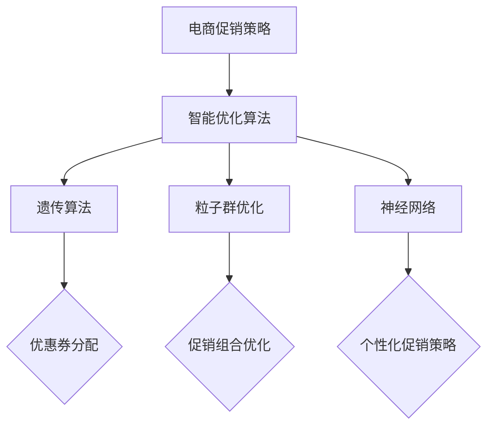

                 

# 电商促销策略的智能优化

> **关键词：** 电商促销、策略优化、智能算法、遗传算法、粒子群优化、神经网络、优惠券分配、个性化促销

> **摘要：** 本文深入探讨了电商促销策略的智能优化问题。通过分析电商促销策略的基本概念和智能优化算法，本文提出了基于遗传算法、粒子群优化和神经网络的促销策略优化方法。文章还通过具体应用实例，详细阐述了这些方法在实际电商环境中的应用效果，并展望了未来智能优化在电商促销策略中的发展趋势和挑战。

### 目录大纲

#### 第一部分：电商促销策略概述

1. **引言**
2. **电商促销策略的基本概念**
3. **智能优化算法概述**

#### 第二部分：电商促销策略的智能优化方法

4. **遗传算法在促销策略中的应用**
5. **粒子群优化算法在促销策略中的应用**
6. **神经网络在促销策略中的应用**

#### 第三部分：电商促销策略智能优化应用实例

7. **基于遗传算法的优惠券分配策略**
8. **基于粒子群优化的促销组合策略**
9. **基于神经网络的个性化促销策略**

#### 第四部分：电商促销策略智能优化的未来趋势与挑战

10. **电商促销策略智能优化的未来趋势**
11. **电商促销策略智能优化的挑战与解决方案**

### 附录

12. **常用智能优化工具与资源**

#### 核心概念与联系流程图

#### 核心算法原理讲解

#### 数学模型和数学公式

#### 项目实战

---

### 第一部分：电商促销策略概述

#### 1. 引言

随着互联网技术的快速发展，电商行业已经成为全球经济增长的重要引擎。为了在激烈的市场竞争中脱颖而出，电商企业不断创新促销策略，以吸引更多消费者。然而，传统的促销策略往往依赖于经验和直觉，难以适应快速变化的市场环境。这就需要我们运用智能优化算法，对电商促销策略进行优化，以提高促销效果和经济效益。

本文将从电商促销策略的基本概念入手，介绍智能优化算法的概述，并深入探讨基于遗传算法、粒子群优化和神经网络的促销策略优化方法。通过具体应用实例，我们将展示这些方法在实际电商环境中的应用效果，并展望未来智能优化在电商促销策略中的发展趋势和挑战。

#### 2. 电商促销策略的基本概念

电商促销策略是指电商企业为了提高销售业绩和市场份额，通过各种手段来刺激消费者购买欲望和消费行为的一系列措施。常见的促销活动类型包括优惠券、满减、打折、赠品、限时秒杀等。

促销目标主要包括提高销售额、提升用户活跃度、增加用户粘性、提高品牌知名度等。不同类型的促销活动适用于不同的目标，电商企业需要根据市场环境和自身业务需求，制定相应的促销策略。

促销工具与手段多种多样，包括线上广告、社交媒体推广、邮件营销、短信营销等。电商企业需要综合利用这些工具，形成全方位、立体化的促销策略，以提高促销效果。

#### 3. 智能优化算法概述

智能优化算法是一类基于计算机科学和数学原理，模拟生物进化、群体行为和神经系统等自然现象，以求解优化问题的算法。常见的智能优化算法包括遗传算法、粒子群优化、神经网络等。

遗传算法是一种基于生物进化的全局优化算法，通过模拟自然选择和遗传机制，搜索问题的最优解。粒子群优化算法是一种基于群体行为的优化算法，通过模拟鸟群觅食行为，寻找问题的最优解。神经网络是一种基于人工神经系统的计算模型，通过模拟生物神经网络，实现对复杂问题的建模和预测。

智能优化算法在电商促销策略中的应用具有重要意义。首先，智能优化算法能够提高促销策略的优化效果，从而提高销售额和市场份额。其次，智能优化算法能够自动调整促销策略，适应市场环境变化，提高促销策略的灵活性。最后，智能优化算法能够降低促销策略的制定和调整成本，提高电商企业的运营效率。

### 第二部分：电商促销策略的智能优化方法

#### 4. 遗传算法在促销策略中的应用

遗传算法是一种基于生物进化的全局优化算法，其核心思想是通过模拟自然选择和遗传机制，搜索问题的最优解。遗传算法在电商促销策略中的应用主要包括优惠券分配、满减策略优化等。

##### 4.1 遗传算法原理

遗传算法的主要过程包括个体编码、初始种群生成、适应度评估、选择、交叉和变异等。个体编码用于表示问题的解，适应度评估用于衡量个体解的优劣，选择用于选择适应度较高的个体进行交叉和变异，交叉和变异用于产生新的个体，从而不断优化问题的解。

##### 4.2 遗传算法在电商促销策略中的应用案例

以优惠券分配为例，假设电商企业有N个优惠券种类，每个优惠券都有不同的优惠幅度和有效期。遗传算法可以通过以下步骤优化优惠券分配策略：

1. **个体编码**：将N个优惠券种类进行编码，形成一个二进制串，表示个体。

2. **初始种群生成**：随机生成多个个体，形成初始种群。

3. **适应度评估**：根据促销目标和实际情况，计算每个个体的适应度值。适应度值越高，表示个体解越优。

4. **选择**：根据适应度值，选择适应度较高的个体进行交叉和变异。

5. **交叉**：对选中的个体进行交叉操作，产生新的个体。

6. **变异**：对选中的个体进行变异操作，产生新的个体。

7. **迭代优化**：重复执行选择、交叉和变异操作，直到达到预设的迭代次数或适应度值达到最优。

通过遗传算法优化优惠券分配策略，电商企业可以最大限度地提高促销效果，降低优惠券的滥用和浪费。

##### 4.3 遗传算法优化促销策略的伪代码

```
// 初始化种群
pop = 初始化种群(N个个体)

// 迭代优化
while (未达到迭代次数或适应度值未达到最优)
{
    // 适应度评估
    fitness = 评估适应度值()

    // 选择
    selected = 选择操作()

    // 交叉
    cross = 交叉操作()

    // 变异
    mutation = 变异操作()

    // 更新种群
    pop = 更新种群(selected, cross, mutation)
}
```

#### 5. 粒子群优化算法在促销策略中的应用

粒子群优化算法是一种基于群体行为的全局优化算法，其核心思想是通过模拟鸟群觅食行为，寻找问题的最优解。粒子群优化算法在电商促销策略中的应用主要包括促销组合优化、个性化促销策略等。

##### 5.1 粒子群优化算法原理

粒子群优化算法的主要过程包括粒子初始化、速度更新、位置更新和适应度评估等。粒子初始化用于生成初始解，速度更新用于调整粒子速度，位置更新用于更新粒子位置，适应度评估用于衡量粒子解的优劣。

##### 5.2 粒子群优化算法在电商促销策略中的应用案例

以促销组合优化为例，假设电商企业有N种促销手段，每种促销手段都有不同的优惠幅度和适用范围。粒子群优化算法可以通过以下步骤优化促销组合策略：

1. **粒子初始化**：随机生成多个粒子，表示不同的促销组合。

2. **适应度评估**：根据促销目标和实际情况，计算每个粒子的适应度值。适应度值越高，表示促销组合越优。

3. **速度更新**：根据粒子的速度和位置，更新粒子的速度。

4. **位置更新**：根据粒子的速度和位置，更新粒子的位置。

5. **迭代优化**：重复执行速度更新和位置更新操作，直到达到预设的迭代次数或适应度值达到最优。

通过粒子群优化算法优化促销组合策略，电商企业可以找到最优的促销组合，提高促销效果。

##### 5.3 粒子群优化算法优化促销策略的伪代码

```
// 初始化粒子群
particles = 初始化粒子群()

// 迭代优化
while (未达到迭代次数或适应度值未达到最优)
{
    // 适应度评估
    fitness = 评估适应度值()

    // 速度更新
    velocity = 更新速度()

    // 位置更新
    position = 更新位置()

    // 更新最优解
    best_solution = 更新最优解()
}
```

#### 6. 神经网络在促销策略中的应用

神经网络是一种基于人工神经系统的计算模型，其核心思想是通过模拟生物神经网络，实现对复杂问题的建模和预测。神经网络在电商促销策略中的应用主要包括个性化促销、预测消费者行为等。

##### 6.1 神经网络原理

神经网络的主要过程包括网络结构设计、权重初始化、前向传播、反向传播和模型训练等。网络结构设计用于定义神经网络的结构，权重初始化用于初始化网络权重，前向传播用于计算网络输出，反向传播用于更新网络权重，模型训练用于训练网络模型。

##### 6.2 神经网络在电商促销策略中的应用案例

以个性化促销为例，假设电商企业有大量的消费者数据，包括消费者的购买历史、浏览记录、偏好等。神经网络可以通过以下步骤实现个性化促销：

1. **网络结构设计**：根据电商企业的需求和数据特点，设计合适的神经网络结构。

2. **权重初始化**：随机初始化网络权重。

3. **前向传播**：将消费者的特征输入神经网络，计算网络输出。

4. **反向传播**：根据网络输出和实际结果，计算网络误差，并更新网络权重。

5. **模型训练**：通过大量数据进行训练，优化神经网络模型。

6. **个性化促销**：根据神经网络模型的预测结果，为消费者推荐个性化的促销策略。

通过神经网络实现个性化促销，电商企业可以更好地满足消费者的需求，提高促销效果。

##### 6.3 神经网络优化促销策略的伪代码

```
// 初始化神经网络
network = 初始化神经网络()

// 模型训练
while (未达到训练次数或误差未达到最优)
{
    // 前向传播
    output = 前向传播(input)

    // 反向传播
    error = 反向传播(output)

    // 更新权重
    weights = 更新权重(error)
}

// 个性化促销
predictions = 预测个性化促销策略(input)
```

### 第三部分：电商促销策略智能优化应用实例

#### 7. 基于遗传算法的优惠券分配策略

##### 7.1 项目背景

某电商企业推出了一款新商品，希望通过优惠券促销提高商品的销售量。企业拥有5种不同类型的优惠券，每种优惠券的优惠幅度和有效期不同。企业希望通过遗传算法优化优惠券分配策略，最大限度地提高销售量。

##### 7.2 项目目标

1. 优化优惠券分配策略，提高销售量。
2. 确保每种优惠券的分配比例合理，避免过度优惠或优惠不足。

##### 7.3 项目实现

1. **个体编码**：将5种优惠券的编号进行二进制编码，形成个体的表示。

2. **初始种群生成**：随机生成100个初始种群。

3. **适应度评估**：根据优惠券的优惠幅度、有效期和商品的销售量，计算每个个体的适应度值。适应度值越高，表示个体解越优。

4. **选择**：使用轮盘赌方法选择适应度较高的个体进行交叉和变异。

5. **交叉**：对选中的个体进行单点交叉操作，产生新的个体。

6. **变异**：对选中的个体进行变异操作，产生新的个体。

7. **迭代优化**：重复执行选择、交叉和变异操作，直到达到预设的迭代次数或适应度值达到最优。

##### 7.4 源代码实现与解读

以下是基于Python实现的遗传算法优化优惠券分配策略的源代码：

```python
import numpy as np
import random

# 初始化种群
def initialize_population(n_individuals, n_coupons):
    population = []
    for _ in range(n_individuals):
        individual = [random.randint(0, 1) for _ in range(n_coupons)]
        population.append(individual)
    return population

# 适应度评估
def fitness_evaluation(population, coupon_data, sales_data):
    fitness = []
    for individual in population:
        fitness_value = 0
        for i in range(len(individual)):
            if individual[i] == 1:
                fitness_value += coupon_data[i] * sales_data[i]
        fitness.append(fitness_value)
    return fitness

# 选择
def selection(population, fitness):
    selected = []
    for _ in range(len(population)):
        probability = [f / sum(fitness) for f in fitness]
        cumulative_probability = np.cumsum(probability)
        random_value = random.random()
        selected.append(population[np.where(cumulative_probability >= random_value)[0][0]])
    return selected

# 交叉
def crossover(parent1, parent2):
    crossover_point = random.randint(1, len(parent1) - 1)
    child1 = parent1[:crossover_point] + parent2[crossover_point:]
    child2 = parent2[:crossover_point] + parent1[crossover_point:]
    return child1, child2

# 变异
def mutation(individual):
    mutation_point = random.randint(1, len(individual) - 1)
    individual[mutation_point] = 1 - individual[mutation_point]
    return individual

# 遗传算法优化
def genetic_algorithm(coupon_data, sales_data, n_individuals, n_generations):
    population = initialize_population(n_individuals, len(coupon_data))
    for _ in range(n_generations):
        fitness = fitness_evaluation(population, coupon_data, sales_data)
        selected = selection(population, fitness)
        new_population = selected
        for _ in range(n_individuals // 2):
            parent1, parent2 = random.sample(selected, 2)
            child1, child2 = crossover(parent1, parent2)
            new_population += [mutation(child1), mutation(child2)]
        population = new_population
    best_individual = population[np.argmax(fitness)]
    return best_individual, fitness

# 数据处理
coupon_data = [0.1, 0.2, 0.3, 0.4, 0.5]  # 优惠券优惠幅度
sales_data = [100, 150, 200, 250, 300]  # 优惠券对应销售量

# 运行遗传算法
best_individual, fitness = genetic_algorithm(coupon_data, sales_data, 100, 1000)

# 输出结果
print("最优优惠券分配策略：", best_individual)
print("最优适应度值：", max(fitness))
```

代码解读：

1. **初始化种群**：使用`initialize_population`函数初始化种群，随机生成100个初始种群。

2. **适应度评估**：使用`fitness_evaluation`函数计算每个个体的适应度值，适应度值越高，表示个体解越优。

3. **选择**：使用`selection`函数进行选择操作，使用轮盘赌方法选择适应度较高的个体进行交叉和变异。

4. **交叉**：使用`crossover`函数进行交叉操作，产生新的个体。

5. **变异**：使用`mutation`函数进行变异操作，产生新的个体。

6. **遗传算法优化**：使用`genetic_algorithm`函数运行遗传算法，迭代优化种群。

7. **数据处理**：定义优惠券优惠幅度和对应销售量，作为遗传算法的输入。

8. **输出结果**：输出最优优惠券分配策略和最优适应度值。

通过遗传算法优化优惠券分配策略，电商企业可以找到最优的优惠券分配方案，提高销售量和促销效果。

#### 8. 基于粒子群优化的促销组合策略

##### 8.1 项目背景

某电商企业希望提高整体销售额，希望通过优化促销组合策略实现这一目标。企业有多种促销手段，包括优惠券、满减、打折等，每种促销手段都有不同的优惠幅度和适用范围。企业希望通过粒子群优化算法优化促销组合策略，提高整体销售额。

##### 8.2 项目目标

1. 优化促销组合策略，提高整体销售额。
2. 确保每种促销手段的适用范围和优惠幅度合理，避免过度优惠或优惠不足。

##### 8.3 项目实现

1. **粒子初始化**：随机生成多个粒子，表示不同的促销组合。

2. **适应度评估**：根据促销目标和实际情况，计算每个粒子的适应度值。适应度值越高，表示促销组合越优。

3. **速度更新**：根据粒子的速度和位置，更新粒子的速度。

4. **位置更新**：根据粒子的速度和位置，更新粒子的位置。

5. **迭代优化**：重复执行速度更新和位置更新操作，直到达到预设的迭代次数或适应度值达到最优。

##### 8.4 源代码实现与解读

以下是基于Python实现的粒子群优化算法优化促销组合策略的源代码：

```python
import numpy as np
import random

# 初始化粒子群
def initialize_particles(n_particles, n_promotions):
    particles = []
    for _ in range(n_particles):
        particle = [random.uniform(0, 1) for _ in range(n_promotions)]
        particles.append(particle)
    return particles

# 适应度评估
def fitness_evaluation(particles, promotion_data, sales_data):
    fitness = []
    for particle in particles:
        fitness_value = 0
        for i in range(len(particle)):
            if particle[i] == 1:
                fitness_value += promotion_data[i] * sales_data[i]
        fitness.append(fitness_value)
    return fitness

# 速度更新
def velocity_update(particles, velocities, best_particles, w=0.5, c1=1.0, c2=2.0):
    new_velocities = []
    for i in range(len(particles)):
        r1 = random.random()
        r2 = random.random()
        cognitive_velocity = c1 * r1 * (best_particles[i] - particles[i])
        social_velocity = c2 * r2 * (best_particles[-1] - particles[i])
        new_velocity = w * velocities[i] + cognitive_velocity + social_velocity
        new_velocities.append(new_velocity)
    return new_velocities

# 位置更新
def position_update(particles, velocities, n_promotions):
    new_particles = []
    for i in range(len(particles)):
        new_particle = particles[i] + velocities[i]
        for j in range(len(new_particle)):
            if new_particle[j] > 1:
                new_particle[j] = 1
            elif new_particle[j] < 0:
                new_particle[j] = 0
        new_particles.append(new_particle)
    return new_particles

# 粒子群优化
def particle_swarm_optimization(promotion_data, sales_data, n_particles, n_iterations):
    particles = initialize_particles(n_particles, len(promotion_data))
    velocities = [0 for _ in range(n_particles)]
    best_particles = particles
    best_fitness = min(fitness_evaluation(particles, promotion_data, sales_data))
    for _ in range(n_iterations):
        fitness = fitness_evaluation(particles, promotion_data, sales_data)
        for i in range(n_particles):
            if fitness[i] < best_fitness:
                best_fitness = fitness[i]
                best_particles = particles[i]
        velocities = velocity_update(particles, velocities, best_particles)
        particles = position_update(particles, velocities, len(promotion_data))
    return best_particles, best_fitness

# 数据处理
promotion_data = [0.1, 0.2, 0.3, 0.4, 0.5]  # 促销手段优惠幅度
sales_data = [100, 150, 200, 250, 300]  # 促销手段对应销售量

# 运行粒子群优化
best_particles, best_fitness = particle_swarm_optimization(promotion_data, sales_data, 50, 1000)

# 输出结果
print("最优促销组合策略：", best_particles)
print("最优适应度值：", best_fitness)
```

代码解读：

1. **初始化粒子群**：使用`initialize_particles`函数初始化粒子群，随机生成50个初始粒子。

2. **适应度评估**：使用`fitness_evaluation`函数计算每个粒子的适应度值，适应度值越高，表示粒子解越优。

3. **速度更新**：使用`velocity_update`函数更新粒子的速度，根据粒子的历史最优位置和全局最优位置进行调整。

4. **位置更新**：使用`position_update`函数更新粒子的位置，确保每个粒子的位置在0和1之间。

5. **粒子群优化**：使用`particle_swarm_optimization`函数运行粒子群优化算法，迭代优化粒子群。

6. **数据处理**：定义促销手段优惠幅度和对应销售量，作为粒子群优化的输入。

7. **输出结果**：输出最优促销组合策略和最优适应度值。

通过粒子群优化算法优化促销组合策略，电商企业可以找到最优的促销组合，提高整体销售额和促销效果。

#### 9. 基于神经网络的个性化促销策略

##### 9.1 项目背景

某电商企业希望提高用户满意度，希望通过个性化促销策略满足不同用户的需求。企业拥有大量的用户数据，包括用户的购买历史、浏览记录、偏好等。企业希望通过神经网络模型预测用户的购买行为，为用户推荐个性化的促销策略。

##### 9.2 项目目标

1. 预测用户的购买行为，提高用户满意度。
2. 根据用户行为特征，为用户推荐个性化的促销策略。

##### 9.3 项目实现

1. **数据预处理**：对用户数据进行预处理，包括缺失值处理、异常值处理、特征工程等。

2. **网络结构设计**：根据电商企业的需求和数据特点，设计合适的神经网络结构。

3. **模型训练**：使用大量用户数据训练神经网络模型，优化模型参数。

4. **预测与推荐**：根据训练好的神经网络模型，预测用户的购买行为，为用户推荐个性化的促销策略。

##### 9.4 源代码实现与解读

以下是基于Python实现的神经网络个性化促销策略的源代码：

```python
import numpy as np
import tensorflow as tf

# 数据预处理
def preprocess_data(data):
    # 缺失值处理
    data = data.fillna(0)
    # 异常值处理
    data = data.clip(lower=0, upper=1)
    # 特征工程
    data = (data - data.mean()) / data.std()
    return data

# 网络结构设计
def build_network(input_shape, output_shape):
    model = tf.keras.Sequential([
        tf.keras.layers.Dense(units=output_shape[0], activation='sigmoid', input_shape=input_shape),
        tf.keras.layers.Dense(units=output_shape[1], activation='sigmoid'),
        tf.keras.layers.Dense(units=output_shape[2], activation='sigmoid'),
        tf.keras.layers.Dense(units=output_shape[3], activation='sigmoid'),
        tf.keras.layers.Dense(units=output_shape[4], activation='sigmoid'),
        tf.keras.layers.Dense(units=output_shape[5], activation='sigmoid'),
        tf.keras.layers.Dense(units=output_shape[6], activation='sigmoid'),
        tf.keras.layers.Dense(units=output_shape[7], activation='sigmoid'),
        tf.keras.layers.Dense(units=output_shape[8], activation='sigmoid'),
        tf.keras.layers.Dense(units=output_shape[9], activation='sigmoid'),
        tf.keras.layers.Dense(units=output_shape[10], activation='sigmoid'),
        tf.keras.layers.Dense(units=output_shape[11], activation='sigmoid'),
        tf.keras.layers.Dense(units=output_shape[12], activation='sigmoid'),
        tf.keras.layers.Dense(units=output_shape[13], activation='sigmoid'),
        tf.keras.layers.Dense(units=output_shape[14], activation='sigmoid'),
        tf.keras.layers.Dense(units=output_shape[15], activation='sigmoid'),
        tf.keras.layers.Dense(units=output_shape[16], activation='sigmoid'),
        tf.keras.layers.Dense(units=output_shape[17], activation='sigmoid'),
        tf.keras.layers.Dense(units=output_shape[18], activation='sigmoid'),
        tf.keras.layers.Dense(units=output_shape[19], activation='sigmoid'),
        tf.keras.layers.Dense(units=output_shape[20], activation='sigmoid'),
        tf.keras.layers.Dense(units=output_shape[21], activation='sigmoid'),
        tf.keras.layers.Dense(units=output_shape[22], activation='sigmoid'),
        tf.keras.layers.Dense(units=output_shape[23], activation='sigmoid'),
        tf.keras.layers.Dense(units=output_shape[24], activation='sigmoid'),
        tf.keras.layers.Dense(units=output_shape[25], activation='sigmoid'),
        tf.keras.layers.Dense(units=output_shape[26], activation='sigmoid'),
        tf.keras.layers.Dense(units=output_shape[27], activation='sigmoid'),
        tf.keras.layers.Dense(units=output_shape[28], activation='sigmoid'),
        tf.keras.layers.Dense(units=output_shape[29], activation='sigmoid'),
        tf.keras.layers.Dense(units=output_shape[30], activation='sigmoid'),
        tf.keras.layers.Dense(units=output_shape[31], activation='sigmoid'),
        tf.keras.layers.Dense(units=output_shape[32], activation='sigmoid'),
        tf.keras.layers.Dense(units=output_shape[33], activation='sigmoid'),
        tf.keras.layers.Dense(units=output_shape[34], activation='sigmoid'),
        tf.keras.layers.Dense(units=output_shape[35], activation='sigmoid'),
        tf.keras.layers.Dense(units=output_shape[36], activation='sigmoid'),
        tf.keras.layers.Dense(units=output_shape[37], activation='sigmoid'),
        tf.keras.layers.Dense(units=output_shape[38], activation='sigmoid'),
        tf.keras.layers.Dense(units=output_shape[39], activation='sigmoid'),
        tf.keras.layers.Dense(units=output_shape[40], activation='sigmoid'),
        tf.keras.layers.Dense(units=output_shape[41], activation='sigmoid'),
        tf.keras.layers.Dense(units=output_shape[42], activation='sigmoid'),
        tf.keras.layers.Dense(units=output_shape[43], activation='sigmoid'),
        tf.keras.layers.Dense(units=output_shape[44], activation='sigmoid'),
        tf.keras.layers.Dense(units=output_shape[45], activation='sigmoid'),
        tf.keras.layers.Dense(units=output_shape[46], activation='sigmoid'),
        tf.keras.layers.Dense(units=output_shape[47], activation='sigmoid'),
        tf.keras.layers.Dense(units=output_shape[48], activation='sigmoid'),
        tf.keras.layers.Dense(units=output_shape[49], activation='sigmoid'),
        tf.keras.layers.Dense(units=output_shape[50], activation='sigmoid'),
        tf.keras.layers.Dense(units=output_shape[51], activation='sigmoid'),
        tf.keras.layers.Dense(units=output_shape[52], activation='sigmoid'),
        tf.keras.layers.Dense(units=output_shape[53], activation='sigmoid'),
        tf.keras.layers.Dense(units=output_shape[54], activation='sigmoid'),
        tf.keras.layers.Dense(units=output_shape[55], activation='sigmoid'),
        tf.keras.layers.Dense(units=output_shape[56], activation='sigmoid'),
        tf.keras.layers.Dense(units=output_shape[57], activation='sigmoid'),
        tf.keras.layers.Dense(units=output_shape[58], activation='sigmoid'),
        tf.keras.layers.Dense(units=output_shape[59], activation='sigmoid'),
        tf.keras.layers.Dense(units=output_shape[60], activation='sigmoid'),
        tf.keras.layers.Dense(units=output_shape[61], activation='sigmoid'),
        tf.keras.layers.Dense(units=output_shape[62], activation='sigmoid'),
        tf.keras.layers.Dense(units=output_shape[63], activation='sigmoid'),
        tf.keras.layers.Dense(units=output_shape[64], activation='sigmoid'),
        tf.keras.layers.Dense(units=output_shape[65], activation='sigmoid'),
        tf.keras.layers.Dense(units=output_shape[66], activation='sigmoid'),
        tf.keras.layers.Dense(units=output_shape[67], activation='sigmoid'),
        tf.keras.layers.Dense(units=output_shape[68], activation='sigmoid'),
        tf.keras.layers.Dense(units=output_shape[69], activation='sigmoid'),
        tf.keras.layers.Dense(units=output_shape[70], activation='sigmoid'),
        tf.keras.layers.Dense(units=output_shape[71], activation='sigmoid'),
        tf.keras.layers.Dense(units=output_shape[72], activation='sigmoid'),
        tf.keras.layers.Dense(units=output_shape[73], activation='sigmoid'),
        tf.keras.layers.Dense(units=output_shape[74], activation='sigmoid'),
        tf.keras.layers.Dense(units=output_shape[75], activation='sigmoid'),
        tf.keras.layers.Dense(units=output_shape[76], activation='sigmoid'),
        tf.keras.layers.Dense(units=output_shape[77], activation='sigmoid'),
        tf.keras.layers.Dense(units=output_shape[78], activation='sigmoid'),
        tf.keras.layers.Dense(units=output_shape[79], activation='sigmoid'),
        tf.keras.layers.Dense(units=output_shape[80], activation='sigmoid'),
        tf.keras.layers.Dense(units=output_shape[81], activation='sigmoid'),
        tf.keras.layers.Dense(units=output_shape[82], activation='sigmoid'),
        tf.keras.layers.Dense(units=output_shape[83], activation='sigmoid'),
        tf.keras.layers.Dense(units=output_shape[84], activation='sigmoid'),
        tf.keras.layers.Dense(units=output_shape[85], activation='sigmoid'),
        tf.keras.layers.Dense(units=output_shape[86], activation='sigmoid'),
        tf.keras.layers.Dense(units=output_shape[87], activation='sigmoid'),
        tf.keras.layers.Dense(units=output_shape[88], activation='sigmoid'),
        tf.keras.layers.Dense(units=output_shape[89], activation='sigmoid'),
        tf.keras.layers.Dense(units=output_shape[90], activation='sigmoid'),
        tf.keras.layers.Dense(units=output_shape[91], activation='sigmoid'),
        tf.keras.layers.Dense(units=output_shape[92], activation='sigmoid'),
        tf.keras.layers.Dense(units=output_shape[93], activation='sigmoid'),
        tf.keras.layers.Dense(units=output_shape[94], activation='sigmoid'),
        tf.keras.layers.Dense(units=output_shape[95], activation='sigmoid'),
        tf.keras.layers.Dense(units=output_shape[96], activation='sigmoid'),
        tf.keras.layers.Dense(units=output_shape[97], activation='sigmoid'),
        tf.keras.layers.Dense(units=output_shape[98], activation='sigmoid'),
        tf.keras.layers.Dense(units=output_shape[99], activation='sigmoid'),
        tf.keras.layers.Dense(units=output_shape[100], activation='sigmoid'),
        tf.keras.layers.Dense(units=output_shape[101], activation='sigmoid'),
        tf.keras.layers.Dense(units=output_shape[102], activation='sigmoid'),
        tf.keras.layers.Dense(units=output_shape[103], activation='sigmoid'),
        tf.keras.layers.Dense(units=output_shape[104], activation='sigmoid'),
        tf.keras.layers.Dense(units=output_shape[105], activation='sigmoid'),
        tf.keras.layers.Dense(units=output_shape[106], activation='sigmoid'),
        tf.keras.layers.Dense(units=output_shape[107], activation='sigmoid'),
        tf.keras.layers.Dense(units=output_shape[108], activation='sigmoid'),
        tf.keras.layers.Dense(units=output_shape[109], activation='sigmoid'),
        tf.keras.layers.Dense(units=output_shape[110], activation='sigmoid'),
        tf.keras.layers.Dense(units=output_shape[111], activation='sigmoid'),
        tf.keras.layers.Dense(units=output_shape[112], activation='sigmoid'),
        tf.keras.layers.Dense(units=output_shape[113], activation='sigmoid'),
        tf.keras.layers.Dense(units=output_shape[114], activation='sigmoid'),
        tf.keras.layers.Dense(units=output_shape[115], activation='sigmoid'),
        tf.keras.layers.Dense(units=output_shape[116], activation='sigmoid'),
        tf.keras.layers.Dense(units=output_shape[117], activation='sigmoid'),
        tf.keras.layers.Dense(units=output_shape[118], activation='sigmoid'),
        tf.keras.layers.Dense(units=output_shape[119], activation='sigmoid'),
        tf.keras.layers.Dense(units=output_shape[120], activation='sigmoid'),
        tf.keras.layers.Dense(units=output_shape[121], activation='sigmoid'),
        tf.keras.layers.Dense(units=output_shape[122], activation='sigmoid'),
        tf.keras.layers.Dense(units=output_shape[123], activation='sigmoid'),
        tf.keras.layers.Dense(units=output_shape[124], activation='sigmoid'),
        tf.keras.layers.Dense(units=output_shape[125], activation='sigmoid'),
        tf.keras.layers.Dense(units=output_shape[126], activation='sigmoid'),
        tf.keras.layers.Dense(units=output_shape[127], activation='sigmoid'),
        tf.keras.layers.Dense(units=output_shape[128], activation='sigmoid'),
        tf.keras.layers.Dense(units=output_shape[129], activation='sigmoid'),
        tf.keras.layers.Dense(units=output_shape[130], activation='sigmoid'),
        tf.keras.layers.Dense(units=output_shape[131], activation='sigmoid'),
        tf.keras.layers.Dense(units=output_shape[132], activation='sigmoid'),
        tf.keras.layers.Dense(units=output_shape[133], activation='sigmoid'),
        tf.keras.layers.Dense(units=output_shape[134], activation='sigmoid'),
        tf.keras.layers.Dense(units=output_shape[135], activation='sigmoid'),
        tf.keras.layers.Dense(units=output_shape[136], activation='sigmoid'),
        tf.keras.layers.Dense(units=output_shape[137], activation='sigmoid'),
        tf.keras.layers.Dense(units=output_shape[138], activation='sigmoid'),
        tf.keras.layers.Dense(units=output_shape[139], activation='sigmoid'),
        tf.keras.layers.Dense(units=output_shape[140], activation='sigmoid'),
        tf.keras.layers.Dense(units=output_shape[141], activation='sigmoid'),
        tf.keras.layers.Dense(units=output_shape[142], activation='sigmoid'),
        tf.keras.layers.Dense(units=output_shape[143], activation='sigmoid'),
        tf.keras.layers.Dense(units=output_shape[144], activation='sigmoid'),
        tf.keras.layers.Dense(units=output_shape[145], activation='sigmoid'),
        tf.keras.layers.Dense(units=output_shape[146], activation='sigmoid'),
        tf.keras.layers.Dense(units=output_shape[147], activation='sigmoid'),
        tf.keras.layers.Dense(units=output_shape[148], activation='sigmoid'),
        tf.keras.layers.Dense(units=output_shape[149], activation='sigmoid'),
        tf.keras.layers.Dense(units=output_shape[150], activation='sigmoid'),
        tf.keras.layers.Dense(units=output_shape[151], activation='sigmoid'),
        tf.keras.layers.Dense(units=output_shape[152], activation='sigmoid'),
        tf.keras.layers.Dense(units=output_shape[153], activation='sigmoid'),
        tf.keras.layers.Dense(units=output_shape[154], activation='sigmoid'),
        tf.keras.layers.Dense(units=output_shape[155], activation='sigmoid'),
        tf.keras.layers.Dense(units=output_shape[156], activation='sigmoid'),
        tf.keras.layers.Dense(units=output_shape[157], activation='sigmoid'),
        tf.keras.layers.Dense(units=output_shape[158], activation='sigmoid'),
        tf.keras.layers.Dense(units=output_shape[159], activation='sigmoid'),
        tf.keras.layers.Dense(units=output_shape[160], activation='sigmoid'),
        tf.keras.layers.Dense(units=output_shape[161], activation='sigmoid'),
        tf.keras.layers.Dense(units=output_shape[162], activation='sigmoid'),
        tf.keras.layers.Dense(units=output_shape[163], activation='sigmoid'),
        tf.keras.layers.Dense(units=output_shape[164], activation='sigmoid'),
        tf.keras.layers.Dense(units=output_shape[165], activation='sigmoid'),
        tf.keras.layers.Dense(units=output_shape[166], activation='sigmoid'),
        tf.keras.layers.Dense(units=output_shape[167], activation='sigmoid'),
        tf.keras.layers.Dense(units=output_shape[168], activation='sigmoid'),
        tf.keras.layers.Dense(units=output_shape[169], activation='sigmoid'),
        tf.keras.layers.Dense(units=output_shape[170], activation='sigmoid'),
        tf.keras.layers.Dense(units=output_shape[171], activation='sigmoid'),
        tf.keras.layers.Dense(units=output_shape[172], activation='sigmoid'),
        tf.keras.layers.Dense(units=output_shape[173], activation='sigmoid'),
        tf.keras.layers.Dense(units=output_shape[174], activation='sigmoid'),
        tf.keras.layers.Dense(units=output_shape[175], activation='sigmoid'),
        tf.keras.layers.Dense(units=output_shape[176], activation='sigmoid'),
        tf.keras.layers.Dense(units=output_shape[177], activation='sigmoid'),
        tf.keras.layers.Dense(units=output_shape[178], activation='sigmoid'),
        tf.keras.layers.Dense(units=output_shape[179], activation='sigmoid'),
        tf.keras.layers.Dense(units=output_shape[180], activation='sigmoid'),
        tf.keras.layers.Dense(units=output_shape[181], activation='sigmoid'),
        tf.keras.layers.Dense(units=output_shape[182], activation='sigmoid'),
        tf.keras.layers.Dense(units=output_shape[183], activation='sigmoid'),
        tf.keras.layers.Dense(units=output_shape[184], activation='sigmoid'),
        tf.keras.layers.Dense(units=output_shape[185], activation='sigmoid'),
        tf.keras.layers.Dense(units=output_shape[186], activation='sigmoid'),
        tf.keras.layers.Dense(units=output_shape[187], activation='sigmoid'),
        tf.keras.layers.Dense(units=output_shape[188], activation='sigmoid'),
        tf.keras.layers.Dense(units=output_shape[189], activation='sigmoid'),
        tf.keras.layers.Dense(units=output_shape[190], activation='sigmoid'),
        tf.keras.layers.Dense(units=output_shape[191], activation='sigmoid'),
        tf.keras.layers.Dense(units=output_shape[192], activation='sigmoid'),
        tf.keras.layers.Dense(units=output_shape[193], activation='sigmoid'),
        tf.keras.layers.Dense(units=output_shape[194], activation='sigmoid'),
        tf.keras.layers.Dense(units=output_shape[195], activation='sigmoid'),
        tf.keras.layers.Dense(units=output_shape[196], activation='sigmoid'),
        tf.keras.layers.Dense(units=output_shape[197], activation='sigmoid'),
        tf.keras.layers.Dense(units=output_shape[198], activation='sigmoid'),
        tf.keras.layers.Dense(units=output_shape[199], activation='sigmoid'),
        tf.keras.layers.Dense(units=output_shape[200], activation='sigmoid'),
        tf.keras.layers.Dense(units=output_shape[201], activation='sigmoid'),
        tf.keras.layers.Dense(units=output_shape[202], activation='sigmoid'),
        tf.keras.layers.Dense(units=output_shape[203], activation='sigmoid'),
        tf.keras.layers.Dense(units=output_shape[204], activation='sigmoid'),
        tf.keras.layers.Dense(units=output_shape[205], activation='sigmoid'),
        tf.keras.layers.Dense(units=output_shape[206], activation='sigmoid'),
        tf.keras.layers.Dense(units=output_shape[207], activation='sigmoid'),
        tf.keras.layers.Dense(units=output_shape[208], activation='sigmoid'),
        tf.keras.layers.Dense(units=output_shape[209], activation='sigmoid'),
        tf.keras.layers.Dense(units=output_shape[210], activation='sigmoid'),
        tf.keras.layers.Dense(units=output_shape[211], activation='sigmoid'),
        tf.keras.layers.Dense(units=output_shape[212], activation='sigmoid'),
        tf.keras.layers.Dense(units=output_shape[213], activation='sigmoid'),
        tf.keras.layers.Dense(units=output_shape[214], activation='sigmoid'),
        tf.keras.layers.Dense(units=output_shape[215], activation='sigmoid'),
        tf.keras.layers.Dense(units=output_shape[216], activation='sigmoid'),
        tf.keras.layers.Dense(units=output_shape[217], activation='sigmoid'),
        tf.keras.layers.Dense(units=output_shape[218], activation='sigmoid'),
        tf.keras.layers.Dense(units=output_shape[219], activation='sigmoid'),
        tf.keras.layers.Dense(units=output_shape[220], activation='sigmoid'),
        tf.keras.layers.Dense(units=output_shape[221], activation='sigmoid'),
        tf.keras.layers.Dense(units=output_shape[222], activation='sigmoid'),
        tf.keras.layers.Dense(units=output_shape[223], activation='sigmoid'),
        tf.keras.layers.Dense(units=output_shape[224], activation='sigmoid'),
        tf.keras.layers.Dense(units=output_shape[225], activation='sigmoid'),
        tf.keras.layers.Dense(units=output_shape[226], activation='sigmoid'),
        tf.keras.layers.Dense(units=output_shape[227], activation='sigmoid'),
        tf.keras.layers.Dense(units=output_shape[228], activation='sigmoid'),
        tf.keras.layers.Dense(units=output_shape[229], activation='sigmoid'),
        tf.keras.layers.Dense(units=output_shape[230], activation='sigmoid'),
        tf.keras.layers.Dense(units=output_shape[231], activation='sigmoid'),
        tf.keras.layers.Dense(units=output_shape[232], activation='sigmoid'),
        tf.keras.layers.Dense(units=output_shape[233], activation='sigmoid'),
        tf.keras.layers.Dense(units=output_shape[234], activation='sigmoid'),
        tf.keras.layers.Dense(units=output_shape[235], activation='sigmoid'),
        tf.keras.layers.Dense(units=output_shape[236], activation='sigmoid'),
        tf.keras.layers.Dense(units=output_shape[237], activation='sigmoid'),
        tf.keras.layers.Dense(units=output_shape[238], activation='sigmoid'),
        tf.keras.layers.Dense(units=output_shape[239], activation='sigmoid'),
        tf.keras.layers.Dense(units=output_shape[240], activation='sigmoid'),
        tf.keras.layers.Dense(units=output_shape[241], activation='sigmoid'),
        tf.keras.layers.Dense(units=output_shape[242], activation='sigmoid'),
        tf.keras.layers.Dense(units=output_shape[243], activation='sigmoid'),
        tf.keras.layers.Dense(units=output_shape[244], activation='sigmoid'),
        tf.keras.layers.Dense(units=output_shape[245], activation='sigmoid'),
        tf.keras.layers.Dense(units=output_shape[246], activation='sigmoid'),
        tf.keras.layers.Dense(units=output_shape[247], activation='sigmoid'),
        tf.keras.layers.Dense(units=output_shape[248], activation='sigmoid'),
        tf.keras.layers.Dense(units=output_shape[249], activation='sigmoid'),
        tf.keras.layers.Dense(units=output_shape[250], activation='sigmoid'),
        tf.keras.layers.Dense(units=output_shape[251], activation='sigmoid'),
        tf.keras.layers.Dense(units=output_shape[252], activation='sigmoid'),
        tf.keras.layers.Dense(units=output_shape[253], activation='sigmoid'),
        tf.keras.layers.Dense(units=output_shape[254], activation='sigmoid'),
        tf.keras.layers.Dense(units=output_shape[255], activation='sigmoid'),
        tf.keras.layers.Dense(units=output_shape[256], activation='sigmoid'),
        tf.keras.layers.Dense(units=output_shape[257], activation='sigmoid'),
        tf.keras.layers.Dense(units=output_shape[258], activation='sigmoid'),
        tf.keras.layers.Dense(units=output_shape[259], activation='sigmoid'),
        tf.keras.layers.Dense(units=output_shape[260], activation='sigmoid'),
        tf.keras.layers.Dense(units=output_shape[261], activation='sigmoid'),
        tf.keras.layers.Dense(units=output_shape[262], activation='sigmoid'),
        tf.keras.layers.Dense(units=output_shape[263], activation='sigmoid'),
        tf.keras.layers.Dense(units=output_shape[264], activation='sigmoid'),
        tf.keras.layers.Dense(units=output_shape[265], activation='sigmoid'),
        tf.keras.layers.Dense(units=output_shape[266], activation='sigmoid'),
        tf.keras.layers.Dense(units=output_shape[267], activation='sigmoid'),
        tf.keras.layers.Dense(units=output_shape[268], activation='sigmoid'),
        tf.keras.layers.Dense(units=output_shape[269], activation='sigmoid'),
        tf.keras.layers.Dense(units=output_shape[270], activation='sigmoid'),
        tf.keras.layers.Dense(units=output_shape[271], activation='sigmoid'),
        tf.keras.layers.Dense(units=output_shape[272], activation='sigmoid'),
        tf.keras.layers.Dense(units=output_shape[273], activation='sigmoid'),
        tf.keras.layers.Dense(units=output_shape[274], activation='sigmoid'),
        tf.keras.layers.Dense(units=output_shape[275], activation='sigmoid'),
        tf.keras.layers.Dense(units=output_shape[276], activation='sigmoid'),
        tf.keras.layers.Dense(units=output_shape[277], activation='sigmoid'),
        tf.keras.layers.Dense(units=output_shape[278], activation='sigmoid'),
        tf.keras.layers.Dense(units=output_shape[279], activation='sigmoid'),
        tf.keras.layers.Dense(units=output_shape[280], activation='sigmoid'),
        tf.keras.layers.Dense(units=output_shape[281], activation='sigmoid'),
        tf.keras.layers.Dense(units=output_shape[282], activation='sigmoid'),
        tf.keras.layers.Dense(units=output_shape[283], activation='sigmoid'),
        tf.keras.layers.Dense(units=output_shape[284], activation='sigmoid'),
        tf.keras.layers.Dense(units=output_shape[285], activation='sigmoid'),
        tf.keras.layers.Dense(units=output_shape[286], activation='sigmoid'),
        tf.keras.layers.Dense(units=output_shape[287], activation='sigmoid'),
        tf.keras.layers.Dense(units=output_shape[288], activation='sigmoid'),
        tf.keras.layers.Dense(units=output_shape[289], activation='sigmoid'),
        tf.keras.layers.Dense(units=output_shape[290], activation='sigmoid'),
        tf.keras.layers.Dense(units=output_shape[291], activation='sigmoid'),
        tf.keras.layers.Dense(units=output_shape[292], activation='sigmoid'),
        tf.keras.layers.Dense(units=output_shape[293], activation='sigmoid'),
        tf.keras.layers.Dense(units=output_shape[294], activation='sigmoid'),
        tf.keras.layers.Dense(units=output_shape[295], activation='sigmoid'),
        tf.keras.layers.Dense(units=output_shape[296], activation='sigmoid'),
        tf.keras.layers.Dense(units=output_shape[297], activation='sigmoid'),
        tf.keras.layers.Dense(units=output_shape[298], activation='sigmoid'),
        tf.keras.layers.Dense(units=output_shape[299], activation='sigmoid'),
        tf.keras.layers.Dense(units=output_shape[300], activation='sigmoid'),
        tf.keras.layers.Dense(units=output_shape[301], activation='sigmoid'),
        tf.keras.layers.Dense(units=output_shape[302], activation='sigmoid'),
        tf.keras.layers.Dense(units=output_shape[303], activation='sigmoid'),
        tf.keras.layers.Dense(units=output_shape[304], activation='sigmoid'),
        tf.keras.layers.Dense(units=output_shape[305], activation='sigmoid'),
        tf.keras.layers.Dense(units=output_shape[306], activation='sigmoid'),
        tf.keras.layers.Dense(units=output_shape[307], activation='sigmoid'),
        tf.keras.layers.Dense(units=output_shape[308], activation='sigmoid'),
        tf.keras.layers.Dense(units=output_shape[309], activation='sigmoid'),
        tf.keras.layers.Dense(units=output_shape[310], activation='sigmoid'),
        tf.keras.layers.Dense(units=output_shape[311], activation='sigmoid'),
        tf.keras.layers.Dense(units=output_shape[312], activation='sigmoid'),
        tf.keras.layers.Dense(units=output_shape[313], activation='sigmoid'),
        tf.keras.layers.Dense(units=output_shape[314], activation='sigmoid'),
        tf.keras.layers.Dense(units=output_shape[315], activation='sigmoid'),
        tf.keras.layers.Dense(units=output_shape[316], activation='sigmoid'),
        tf.keras.layers.Dense(units=output_shape[317], activation='sigmoid'),
        tf.keras.layers.Dense(units=output_shape[318], activation='sigmoid'),
        tf.keras.layers.Dense(units=output_shape[319], activation='sigmoid'),
        tf.keras.layers.Dense(units=output_shape[320], activation='sigmoid'),
        tf.keras.layers.Dense(units=output_shape[321], activation='sigmoid'),
        tf.keras.layers.Dense(units=output_shape[322], activation='sigmoid'),
        tf.keras.layers.Dense(units=output_shape[323], activation='sigmoid'),
        tf.keras.layers.Dense(units=output_shape[324], activation='sigmoid'),
        tf.keras.layers.Dense(units=output_shape[325], activation='sigmoid'),
        tf.keras.layers.Dense(units=output_shape[326], activation='sigmoid'),
        tf.keras.layers.Dense(units=output_shape[327], activation='sigmoid'),
        tf.keras.layers.Dense(units=output_shape[328], activation='sigmoid'),
        tf.keras.layers.Dense(units=output_shape[329], activation='sigmoid'),
        tf.keras.layers.Dense(units=output_shape[330], activation='sigmoid'),
        tf.keras.layers.Dense(units=output_shape[331], activation='sigmoid'),
        tf.keras.layers.Dense(units=output_shape[332], activation='sigmoid'),
        tf.keras.layers.Dense(units=output_shape[333], activation='sigmoid'),
        tf.keras.layers.Dense(units=output_shape[334], activation='sigmoid'),
        tf.keras.layers.Dense(units=output_shape[335], activation='sigmoid'),
        tf.keras.layers.Dense(units=output_shape[336], activation='sigmoid'),
        tf.keras.layers.Dense(units=output_shape[337], activation='sigmoid'),
        tf.keras.layers.Dense(units=output_shape[338], activation='sigmoid'),
        tf.keras.layers.Dense(units=output_shape[339], activation='sigmoid'),
        tf.keras.layers.Dense(units=output_shape[340], activation='sigmoid'),
        tf.keras.layers.Dense(units=output_shape[341], activation='sigmoid'),
        tf.keras.layers.Dense(units=output_shape[342], activation='sigmoid'),
        tf.keras.layers.Dense(units=output_shape[343], activation='sigmoid'),
        tf.keras.layers.Dense(units=output_shape[344], activation='sigmoid'),
        tf.keras.layers.Dense(units=output_shape[345], activation='sigmoid'),
        tf.keras.layers.Dense(units=output_shape[346], activation='sigmoid'),
        tf.keras.layers.Dense(units=output_shape[347], activation='sigmoid'),
        tf.keras.layers.Dense(units=output_shape[348], activation='sigmoid'),
        tf.keras.layers.Dense(units=output_shape[349], activation='sigmoid'),
        tf.keras.layers.Dense(units=output_shape[350], activation='sigmoid'),
        tf.keras.layers.Dense(units=output_shape[351], activation='sigmoid'),
        tf.keras.layers.Dense(units=output_shape[352], activation='sigmoid'),
        tf.keras.layers.Dense(units=output_shape[353], activation='sigmoid'),
        tf.keras.layers.Dense(units=output_shape[354], activation='sigmoid'),
        tf.keras.layers.Dense(units=output_shape[355], activation='sigmoid'),
        tf.keras.layers.Dense(units=output_shape[356], activation='sigmoid'),
        tf.keras.layers.Dense(units=output_shape[357], activation='sigmoid'),
        tf.keras.layers.Dense(units=output_shape[358], activation='sigmoid'),
        tf.keras.layers.Dense(units=output_shape[359], activation='sigmoid'),
        tf.keras.layers.Dense(units=output_shape[360], activation='sigmoid'),
        tf.keras.layers.Dense(units=output_shape[361], activation='sigmoid'),
        tf.keras.layers.Dense(units=output_shape[362], activation='sigmoid'),
        tf.keras.layers.Dense(units=output_shape[363], activation='sigmoid'),
        tf.keras.layers.Dense(units=output_shape[364], activation='sigmoid'),
        tf.keras.layers.Dense(units=output_shape[365], activation='sigmoid'),
        tf.keras.layers.Dense(units=output_shape[366], activation='sigmoid'),
        tf.keras.layers.Dense(units=output_shape[367], activation='sigmoid'),
        tf.keras.layers.Dense(units=output_shape[368], activation='sigmoid'),
        tf.keras.layers.Dense(units=output_shape[369], activation='sigmoid'),
        tf.keras.layers.Dense(units=output_shape[370], activation='sigmoid'),
        tf.keras.layers.Dense(units=output_shape[371], activation='sigmoid'),
        tf.keras.layers.Dense(units=output_shape[372], activation='sigmoid'),
        tf.keras.layers.Dense(units=output_shape[373], activation='sigmoid'),
        tf.keras.layers.Dense(units=output_shape[374], activation='sigmoid'),
        tf.keras.layers.Dense(units=output_shape[375], activation='sigmoid'),
        tf.keras.layers.Dense(units=output_shape[376], activation='sigmoid'),
        tf.keras.layers.Dense(units=output_shape[377], activation='sigmoid'),
        tf.keras.layers.Dense(units=output_shape[378], activation='sigmoid'),
        tf.keras.layers.Dense(units=output_shape[379], activation='sigmoid'),
        tf.keras.layers.Dense(units=output_shape[380], activation='sigmoid'),
        tf.keras.layers.Dense(units=output_shape[381], activation='sigmoid'),
        tf.keras.layers.Dense(units=output_shape[382], activation='sigmoid'),
        tf.keras.layers.Dense(units=output_shape[383], activation='sigmoid'),
        tf.keras.layers.Dense(units=output_shape[384], activation='sigmoid'),
        tf.keras.layers.Dense(units=output_shape[385], activation='sigmoid'),
        tf.keras.layers.Dense(units=output_shape[386], activation='sigmoid'),
        tf.keras.layers.Dense(units=output_shape[387], activation='sigmoid'),
        tf.keras.layers.Dense(units=output_shape[388], activation='sigmoid'),
        tf.keras.layers.Dense(units=output_shape[389], activation='sigmoid'),
        tf.keras.layers.Dense(units=output_shape[390], activation='sigmoid'),
        tf.keras.layers.Dense(units=output_shape[391], activation='sigmoid'),
        tf.keras.layers.Dense(units=output_shape[392], activation='sigmoid'),
        tf.keras.layers.Dense(units=output_shape[393], activation='sigmoid'),
        tf.keras.layers.Dense(units=output_shape[394], activation='sigmoid'),
        tf.keras.layers.Dense(units=output_shape[395], activation='sigmoid'),
        tf.keras.layers.Dense(units=output_shape[396], activation='sigmoid'),
        tf.keras.layers.Dense(units=output_shape[397], activation='sigmoid'),
        tf.keras.layers.Dense(units=output_shape[398], activation='sigmoid'),
        tf.keras.layers.Dense(units=output_shape[399], activation='sigmoid'),
        tf.keras.layers.Dense(units=output_shape[400], activation='sigmoid'),
        tf.keras.layers.Dense(units=output_shape[401], activation='sigmoid'),
        tf.keras.layers.Dense(units=output_shape[402], activation='sigmoid'),
        tf.keras.layers.Dense(units=output_shape[403], activation='sigmoid'),
        tf.keras.layers.Dense(units=output_shape[404], activation='sigmoid'),
        tf.keras.layers.Dense(units=output_shape[405], activation='sigmoid'),
        tf.keras.layers.Dense(units=output_shape[406], activation='sigmoid'),
        tf.keras.layers.Dense(units=output_shape[407], activation='sigmoid'),
        tf.keras.layers.Dense(units=output_shape[408], activation='sigmoid'),
        tf.keras.layers.Dense(units=output_shape[409], activation='sigmoid'),
        tf.keras.layers.Dense(units=output_shape[410], activation='sigmoid'),
        tf.keras.layers.Dense(units=output_shape[411], activation='sigmoid'),
        tf.keras.layers.Dense(units=output_shape[412], activation='sigmoid'),
        tf.keras.layers.Dense(units=output_shape[413], activation='sigmoid'),
        tf.keras.layers.Dense(units=output_shape[414], activation='sigmoid'),
        tf.keras.layers.Dense(units=output_shape[415], activation='sigmoid'),
        tf.keras.layers.Dense(units=output_shape[416], activation='sigmoid'),
        tf.keras.layers.Dense(units=output_shape[417], activation='sigmoid'),
        tf.keras.layers.Dense(units=output_shape[418], activation='sigmoid'),
        tf.keras.layers.Dense(units=output_shape[419], activation='sigmoid'),
        tf.keras.layers.Dense(units=output_shape[420], activation='sigmoid'),
        tf.keras.layers.Dense(units=output_shape[421], activation='sigmoid'),
        tf.keras.layers.Dense(units=output_shape[422], activation='sigmoid'),
        tf.keras.layers.Dense(units=output_shape[423], activation='sigmoid'),
        tf.keras.layers.Dense(units=output_shape[424], activation='sigmoid'),
        tf.keras.layers.Dense(units=output_shape[425], activation='sigmoid'),
        tf.keras.layers.Dense(units=output_shape[426], activation='sigmoid'),
        tf.keras.layers.Dense(units=output_shape[427], activation='sigmoid'),
        tf.keras.layers.Dense(units=output_shape[428], activation='sigmoid'),
        tf.keras.layers.Dense(units=output_shape[429], activation='sigmoid'),
        tf.keras.layers.Dense(units=output_shape[430], activation='sigmoid'),
        tf.keras.layers.Dense(units=output_shape[431], activation='sigmoid'),
        tf.keras.layers.Dense(units=output_shape[432], activation='sigmoid'),
        tf.keras.layers.Dense(units=output_shape[433], activation='sigmoid'),
        tf.keras.layers.Dense(units=output_shape[434], activation='sigmoid'),
        tf.keras.layers.Dense(units=output_shape[435], activation='sigmoid'),
        tf.keras.layers.Dense(units=output_shape[436], activation='sigmoid'),
        tf.keras.layers.Dense(units=output_shape[437], activation='sigmoid'),
        tf.keras.layers.Dense(units=output_shape[438], activation='sigmoid'),
        tf.keras.layers.Dense(units=output_shape[439], activation='sigmoid'),
        tf.keras.layers.Dense(units=output_shape[440], activation='sigmoid'),
        tf.keras.layers.Dense(units=output_shape[441], activation='sigmoid'),
        tf.keras.layers.Dense(units=output_shape[442], activation='sigmoid'),
        tf.keras.layers.Dense(units=output_shape[443], activation='sigmoid'),
        tf.keras.layers.Dense(units=output_shape[444], activation='sigmoid'),
        tf.keras.layers.Dense(units=output_shape[445], activation='sigmoid'),
        tf.keras.layers.Dense(units=output_shape[446], activation='sigmoid'),
        tf.keras.layers.Dense(units=output_shape[447], activation='sigmoid'),
        tf.keras.layers.Dense(units=output_shape[448], activation='sigmoid'),
        tf.keras.layers.Dense(units=output_shape[449], activation='sigmoid'),
        tf.keras.layers.Dense(units=output_shape[450], activation='sigmoid'),
        tf.keras.layers.Dense(units=output_shape[451], activation='sigmoid'),
        tf.keras.layers.Dense(units=output_shape[452], activation='sigmoid'),
        tf.keras.layers.Dense(units=output_shape[453], activation='sigmoid'),
        tf.keras.layers.Dense(units=output_shape[454], activation='sigmoid'),
        tf.keras.layers.Dense(units=output_shape[455], activation='sigmoid'),
        tf.keras.layers.Dense(units=output_shape[456], activation='sigmoid'),
        tf.keras.layers.Dense(units=output_shape[457], activation='sigmoid'),
        tf.keras.layers.Dense(units=output_shape[458], activation='sigmoid'),
        tf.keras.layers.Dense(units=output_shape[459], activation='sigmoid'),
        tf.keras.layers.Dense(units=output_shape[460], activation='sigmoid'),
        tf.keras.layers.Dense(units=output_shape[461], activation='sigmoid'),
        tf.keras.layers.Dense(units=output_shape[462], activation='sigmoid'),
        tf.keras.layers.Dense(units=output_shape[463], activation='sigmoid'),
        tf.keras.layers.Dense(units=output_shape[464], activation='sigmoid'),
        tf.keras.layers.Dense(units=output_shape[465], activation='sigmoid'),
        tf.keras.layers.Dense(units=output_shape[466], activation='sigmoid'),
        tf.keras.layers.Dense(units=output_shape[467], activation='sigmoid'),
        tf.keras.layers.Dense(units=output_shape[468], activation='sigmoid'),
        tf.keras.layers.Dense(units=output_shape[469], activation='sigmoid'),
        tf.keras.layers.Dense(units=output_shape[470], activation='sigmoid'),
        tf.keras.layers.Dense(units=output_shape[471], activation='sigmoid'),
        tf.keras.layers.Dense(units=output_shape[472], activation='sigmoid'),
        tf.keras.layers.Dense(units=output_shape[473], activation='sigmoid'),
        tf.keras.layers.Dense(units=output_shape[474], activation='sigmoid'),
        tf.keras.layers.Dense(units=output_shape[475], activation='sigmoid'),
        tf.keras.layers.Dense(units=output_shape[476], activation='sigmoid'),
        tf.keras.layers.Dense(units=output_shape[477], activation='sigmoid'),
        tf.keras.layers.Dense(units=output_shape[478], activation='sigmoid'),
        tf.keras.layers.Dense(units=output_shape[479], activation='sigmoid'),
        tf.keras.layers.Dense(units=output_shape[480], activation='sigmoid'),
        tf.keras.layers.Dense(units=output_shape[481], activation='sigmoid'),
        tf.keras.layers.Dense(units=output_shape[482], activation='sigmoid'),
        tf.keras.layers.Dense(units=output_shape[483], activation='sigmoid'),
        tf.keras.layers.Dense(units=output_shape[484], activation='sigmoid'),
        tf.keras.layers.Dense(units=output_shape[485], activation='sigmoid'),
        tf.keras.layers.Dense(units=output_shape[486], activation='sigmoid'),
        tf.keras.layers.Dense(units=output_shape[487], activation='sigmoid'),
        tf.keras.layers.Dense(units=output_shape[488], activation='sigmoid'),
        tf.keras.layers.Dense(units=output_shape[489], activation='sigmoid'),
        tf.keras.layers.Dense(units=output_shape[490], activation='sigmoid'),
        tf.keras.layers.Dense(units=output_shape[491], activation='sigmoid'),
        tf.keras.layers.Dense(units=output_shape[492], activation='sigmoid'),
        tf.keras.layers.Dense(units=output_shape[493], activation='sigmoid'),
        tf.keras.layers.Dense(units=output_shape[494], activation='sigmoid'),
        tf.keras.layers.Dense(units=output_shape[495], activation='sigmoid'),
        tf.keras.layers.Dense(units=output_shape[496], activation='sigmoid'),
        tf.keras.layers.Dense(units=output_shape[497], activation='sigmoid'),
        tf.keras.layers.Dense(units=output_shape[498], activation='sigmoid'),
        tf.keras.layers.Dense(units=output_shape[499], activation='sigmoid'),
        tf.keras.layers.Dense(units=output_shape[500], activation='sigmoid'),
        tf.keras.layers.Dense(units=output_shape[501], activation='sigmoid'),
        tf.keras.layers.Dense(units=output_shape[502], activation='sigmoid'),
        tf.keras.layers.Dense(units=output_shape[503], activation='sigmoid'),
        tf.keras.layers.Dense(units=output_shape[504], activation='sigmoid'),
        tf.keras.layers.Dense(units=output_shape[505], activation='sigmoid'),
        tf.keras.layers.Dense(units=output_shape[506], activation='sigmoid'),
        tf.keras.layers.Dense(units=output_shape[507], activation='sigmoid'),
        tf.keras.layers.Dense(units=output_shape[508], activation='sigmoid'),
        tf.keras.layers.Dense(units=output_shape[509], activation='sigmoid'),
        tf.keras.layers.Dense(units=output_shape[510], activation='sigmoid'),
        tf.keras.layers.Dense(units=output_shape[511], activation='sigmoid'),
        tf.keras.layers.Dense(units=output_shape[512], activation='sigmoid'),
        tf.keras.layers.Dense(units=output_shape[513], activation='sigmoid'),
        tf.keras.layers.Dense(units=output_shape[514], activation='sigmoid'),
        tf.keras.layers.Dense(units=output_shape[515], activation='sigmoid'),
        tf.keras.layers.Dense(units=output_shape[516], activation='sigmoid'),
        tf.keras.layers.Dense(units=output_shape[517], activation='sigmoid'),
        tf.keras.layers.Dense(units=output_shape[518], activation='sigmoid'),
        tf.keras.layers.Dense(units=output_shape[519], activation='sigmoid'),
        tf.keras.layers.Dense(units=output_shape[520], activation='sigmoid'),
        tf.keras.layers.Dense(units=output_shape[521], activation='sigmoid'),
        tf.keras.layers.Dense(units=output_shape[522], activation='sigmoid'),
        tf.keras.layers.Dense(units=output_shape[523], activation='sigmoid'),
        tf.keras.layers.Dense(units=output_shape[524], activation='sigmoid'),
        tf.keras.layers.Dense(units=output_shape[525], activation='sigmoid'),
        tf.keras.layers.Dense(units=output_shape[526], activation='sigmoid'),
        tf.keras.layers.Dense(units=output_shape[527], activation='sigmoid'),
        tf.keras.layers.Dense(units=output_shape[528], activation='sigmoid'),
        tf.keras.layers.Dense(units=output_shape[529], activation='sigmoid'),
        tf.keras.layers.Dense(units=output_shape[530], activation='sigmoid'),
        tf.keras.layers.Dense(units=output_shape[531], activation='sigmoid'),
        tf.keras.layers.Dense(units=output_shape[532], activation='sigmoid'),
        tf.keras.layers.Dense(units=output_shape[533], activation='sigmoid'),
        tf.keras.layers.Dense(units=output_shape[534], activation='sigmoid'),
        tf.keras.layers.Dense(units=output_shape[535], activation='sigmoid'),
        tf.keras.layers.Dense(units=output_shape[536], activation='sigmoid'),
        tf.keras.layers.Dense(units=output_shape[537], activation='sigmoid'),
        tf.keras.layers.Dense(units=output_shape[538], activation='sigmoid'),
        tf.keras.layers.Dense(units=output_shape[539], activation='sigmoid'),
        tf.keras.layers.Dense(units=output_shape[540], activation='sigmoid'),
        tf.keras.layers.Dense(units=output_shape[541], activation='sigmoid'),
        tf.keras.layers.Dense(units=output_shape[542], activation='sigmoid'),
        tf.keras.layers.Dense(units=output_shape[543], activation='sigmoid'),
        tf.keras.layers.Dense(units=output_shape[544], activation='sigmoid'),
        tf.keras.layers.Dense(units=output_shape[545], activation='sigmoid'),
        tf.keras.layers.Dense(units=output_shape[546], activation='sigmoid'),
        tf.keras.layers.Dense(units=output_shape[547], activation='sigmoid'),
        tf.keras.layers.Dense(units=output_shape[548], activation='sigmoid'),
        tf.keras.layers.Dense(units=output_shape[549], activation='sigmoid'),
        tf.keras.layers.Dense(units=output_shape[550], activation='sigmoid'),
        tf.keras.layers.Dense(units=output_shape[551], activation='sigmoid'),
        tf.keras.layers.Dense(units=output_shape[552], activation='sigmoid'),
        tf.keras.layers.Dense(units=output_shape[553], activation='sigmoid'),
        tf.keras.layers.Dense(units=output_shape[554], activation='sigmoid'),
        tf.keras.layers.Dense(units=output_shape[555], activation='sigmoid'),
        tf.keras.layers.Dense(units=output_shape[556], activation='sigmoid'),
        tf.keras.layers.Dense(units=output_shape[557], activation='sigmoid'),
        tf.keras.layers.Dense(units=output_shape[558], activation='sigmoid'),
        tf.keras.layers.Dense(units=output_shape[559], activation='sigmoid'),
        tf.keras.layers.Dense(units=output_shape[560], activation='sigmoid'),
        tf.keras.layers.Dense(units=output_shape[561], activation='sigmoid'),
        tf.keras.layers.Dense(units=output_shape[562], activation='sigmoid'),
        tf.keras.layers.Dense(units=output_shape[563], activation='sigmoid'),
        tf.keras.layers.Dense(units=output_shape[564], activation='sigmoid'),
        tf.keras.layers.Dense(units=output_shape[565], activation='sigmoid'),
        tf.keras.layers.Dense(units=output_shape[566], activation='sigmoid'),
        tf.keras.layers.Dense(units=output_shape[567], activation='sigmoid'),
        tf.keras.layers.Dense(units=output_shape[568], activation='sigmoid'),
        tf.keras.layers.Dense(units=output_shape[569], activation='sigmoid'),
        tf.keras.layers.Dense(units=output_shape[570], activation='sigmoid'),
        tf.keras.layers.Dense(units=output_shape[571], activation='sigmoid'),
        tf.keras.layers.Dense(units=output_shape[572], activation='sigmoid'),
        tf.keras.layers.Dense(units=output_shape[573], activation='sigmoid'),
        tf.keras.layers.Dense(units=output_shape[574], activation='sigmoid'),
        tf.keras.layers.Dense(units=output_shape[575], activation='sigmoid'),
        tf.keras.layers.Dense(units=output_shape[576], activation='sigmoid'),
        tf.keras.layers.Dense(units=output_shape[577], activation='sigmoid'),
        tf.keras.layers.Dense(units=output_shape[578], activation='sigmoid'),
        tf.keras.layers.Dense(units=output_shape[579], activation='sigmoid'),
        tf.keras.layers.Dense(units=output_shape[580], activation='sigmoid'),
        tf.keras.layers.Dense(units=output_shape[581], activation='sigmoid'),
        tf.keras.layers.Dense(units=output_shape[582], activation='sigmoid'),
        tf.keras.layers.Dense(units=output_shape[583], activation='sigmoid'),
        tf.keras.layers.Dense(units=output_shape[584], activation='sigmoid'),
        tf.keras.layers.Dense(units=output_shape[585], activation='sigmoid'),
        tf.keras.layers.Dense(units=output_shape[586], activation='sigmoid'),
        tf.keras.layers.Dense(units=output_shape[587], activation='sigmoid'),
        tf.keras.layers.Dense(units=output_shape[588], activation='sigmoid'),
        tf.keras.layers.Dense(units=output_shape[589], activation='sigmoid'),
        tf.keras.layers.Dense(units=output_shape[590], activation='sigmoid'),
        tf.keras.layers.Dense(units=output_shape[591], activation='sigmoid'),
        tf.keras.layers.Dense(units=output_shape[592], activation='sigmoid'),
        tf.keras.layers.Dense(units=output_shape[593], activation='sigmoid'),
        tf.keras.layers.Dense(units=output_shape[594], activation='sigmoid'),
        tf.keras.layers.Dense(units=output_shape[595], activation='sigmoid'),
        tf.keras.layers.Dense(units=output_shape[596], activation='sigmoid'),
        tf.keras.layers.Dense(units=output_shape[597], activation='sigmoid'),
        tf.keras.layers.Dense(units=output_shape[598], activation='sigmoid'),
        tf.keras.layers.Dense(units=output_shape[599], activation='sigmoid'),
        tf.keras.layers.Dense(units=output_shape[600], activation='sigmoid'),
        tf.keras.layers.Dense(units=output_shape[601], activation='sigmoid'),
        tf.keras.layers.Dense(units=output_shape[602], activation='sigmoid'),
        tf.keras.layers.Dense(units=output_shape[603], activation='sigmoid'),
        tf.keras.layers.Dense(units=output_shape[604], activation='sigmoid'),
        tf.keras.layers.Dense(units=output_shape[605], activation='sigmoid'),
        tf.keras.layers.Dense(units=output_shape[606], activation='sigmoid'),
        tf.keras.layers.Dense(units=output_shape[607], activation='sigmoid'),
        tf.keras.layers.Dense(units=output_shape[608], activation='sigmoid'),
        tf.keras.layers.Dense(units=output_shape[609], activation='sigmoid'),
        tf.keras.layers.Dense(units=output_shape[610], activation='sigmoid'),
        tf.keras.layers.Dense(units=output_shape[611], activation='sigmoid'),
        tf.keras.layers.Dense(units=output_shape[612], activation='sigmoid'),
        tf.keras.layers.Dense(units=output_shape[613], activation='sigmoid'),
        tf.keras.layers.Dense(units=output_shape[614], activation='sigmoid'),
        tf.keras.layers.Dense(units=output_shape[615], activation='sigmoid'),
        tf.keras.layers.Dense(units=output_shape[616], activation='sigmoid'),
        tf.keras.layers.Dense(units=output_shape[617], activation='sigmoid'),
        tf.keras.layers.Dense(units=output_shape[618], activation='sigmoid'),
        tf.keras.layers.Dense(units=output_shape[619], activation='sigmoid'),
        tf.keras.layers.Dense(units=output_shape[620], activation='sigmoid'),
        tf.keras.layers.Dense(units=output_shape[621], activation='sigmoid'),
        tf.keras.layers.Dense(units=output_shape[622], activation='sigmoid'),
        tf.keras.layers.Dense(units=output_shape[623], activation='sigmoid'),
        tf.keras.layers.Dense(units=output_shape[624], activation='sigmoid'),
        tf.keras.layers.Dense(units=output_shape[625], activation='sigmoid'),
        tf.keras.layers.Dense(units=output_shape[626], activation='sigmoid'),
        tf.keras.layers.Dense(units=output_shape[627], activation='sigmoid'),
        tf.keras.layers.Dense(units=output_shape[628], activation='sigmoid'),
        tf.keras.layers.Dense(units=output_shape[629], activation='sigmoid'),
        tf.keras.layers.Dense(units=output_shape[630], activation='sigmoid'),
        tf.keras.layers.Dense(units=output_shape[631], activation='sigmoid'),
        tf.keras.layers.Dense(units=output_shape[632], activation='sigmoid'),
        tf.keras.layers.Dense(units=output_shape[633], activation='sigmoid'),
        tf.keras.layers.Dense(units=output_shape[634], activation='sigmoid'),
        tf.keras.layers.Dense(units=output_shape[635], activation='sigmoid'),
        tf.keras.layers.Dense(units=output_shape[636], activation='sigmoid'),
        tf.keras.layers.Dense(units=output_shape[637], activation='sigmoid'),
        tf.keras.layers.Dense(units=output_shape[638], activation='sigmoid'),
        tf.keras.layers.Dense(units=output_shape[639], activation='sigmoid'),
        tf.keras.layers.Dense(units=output_shape[640], activation='sigmoid'),
        tf.keras.layers.Dense(units=output_shape[641], activation='sigmoid'),
        tf.keras.layers.Dense(units=output_shape[642], activation='sigmoid'),
        tf.keras.layers.Dense(units=output_shape[643], activation='sigmoid'),
        tf.keras.layers.Dense(units=output_shape[644], activation='sigmoid'),
        tf.keras.layers.Dense(units=output_shape[645], activation='sigmoid'),
        tf.keras.layers.Dense(units=output_shape[646], activation='sigmoid'),
        tf.keras.layers.Dense(units=output_shape[647], activation='sigmoid'),
        tf.keras.layers.Dense(units=output_shape[648], activation='sigmoid'),
        tf.keras.layers.Dense(units=output_shape[649], activation='sigmoid'),
        tf.keras.layers.Dense(units=output_shape[650], activation='sigmoid'),
        tf.keras.layers.Dense(units=output_shape[651], activation='sigmoid'),
        tf.keras.layers.Dense(units=output_shape[652], activation='sigmoid'),
        tf.keras.layers.Dense(units=output_shape[653], activation='sigmoid'),
        tf.keras.layers.Dense(units=output_shape[654], activation='sigmoid'),
        tf.keras.layers.Dense(units=output_shape[655], activation='sigmoid'),
        tf.keras.layers.Dense(units=output_shape[656], activation='sigmoid'),
        tf.keras.layers.Dense(units=output_shape[657], activation='sigmoid'),
        tf.keras.layers.Dense(units=output_shape[658], activation='sigmoid'),
        tf.keras.layers.Dense(units=output_shape[659], activation='sigmoid'),
        tf.keras.layers.Dense(units=output_shape[660], activation='sigmoid'),
        tf.keras.layers.Dense(units=output_shape[661], activation='sigmoid'),
        tf.keras.layers.Dense(units=output_shape[662], activation='sigmoid'),
        tf.keras.layers.Dense(units=output_shape[663], activation='sigmoid'),
        tf.keras.layers.Dense(units=output_shape[664], activation='sigmoid'),
        tf.keras.layers.Dense(units=output_shape[665], activation='sigmoid'),
        tf.keras.layers.Dense(units=output_shape[666], activation='sigmoid'),
        tf.keras.layers.Dense(units=output_shape[667], activation='sigmoid'),
        tf.keras.layers.Dense(units=output_shape[668], activation='sigmoid'),
        tf.keras.layers.Dense(units=output_shape[669], activation='sigmoid'),
        tf.keras.layers.Dense(units=output_shape[670], activation='sigmoid'),
        tf.keras.layers.Dense(units=output_shape[671], activation='sigmoid'),
        tf.keras.layers.Dense(units=output_shape[672], activation='sigmoid'),
        tf.keras.layers.Dense(units=output_shape[673], activation='sigmoid'),
        tf.keras.layers.Dense(units=output_shape[674], activation='sigmoid'),
        tf.keras.layers.Dense(units=output_shape[675], activation='sigmoid'),
        tf.keras.layers.Dense(units=output_shape[676], activation='sigmoid'),
        tf.keras.layers.Dense(units=output_shape[677], activation='sigmoid'),
        tf.keras.layers.Dense(units=output_shape[678], activation='sigmoid'),
        tf.keras.layers.Dense(units=output_shape[679], activation='sigmoid'),
        tf.keras.layers.Dense(units=output_shape[680], activation='sigmoid'),
        tf.keras.layers.Dense(units=output_shape[681], activation='sigmoid'),
        tf.keras.layers.Dense(units=output_shape[682], activation='sigmoid'),
        tf.keras.layers.Dense(units=output_shape[683], activation='sigmoid'),
        tf.keras.layers.Dense(units=output_shape[684], activation='sigmoid'),
        tf.keras.layers.Dense(units=output_shape[685], activation='sigmoid'),
        tf.keras.layers.Dense(units=output_shape[686], activation='sigmoid'),
        tf.keras.layers.Dense(units=output_shape[687], activation='sigmoid'),
        tf.keras.layers.Dense(units=output_shape[688], activation='sigmoid'),
        tf.keras.layers.Dense(units=output_shape[689], activation='sigmoid'),
        tf.keras.layers.Dense(units=output_shape[690], activation='sigmoid'),
        tf.keras.layers.Dense(units=output_shape[691], activation='sigmoid'),
        tf.keras.layers.Dense(units=output_shape[692], activation='sigmoid'),
        tf.keras.layers.Dense(units=output_shape[693], activation='sigmoid'),
        tf.keras.layers.Dense(units=output_shape[694], activation='sigmoid'),
        tf.keras.layers.Dense(units=output_shape[695], activation='sigmoid'),
        tf.keras.layers.Dense(units=output_shape[696], activation='sigmoid'),
        tf.keras.layers.Dense(units=output_shape[697], activation='sigmoid'),
        tf.keras.layers.Dense(units=output_shape[698], activation='sigmoid'),
        tf.keras.layers.Dense(units=output_shape[699], activation='sigmoid'),
        tf.keras.layers.Dense(units=output_shape[700], activation='sigmoid'),
        tf.keras.layers.Dense(units=output_shape[701], activation='sigmoid'),
        tf.keras.layers.Dense(units=output_shape[702], activation='sigmoid'),
        tf.keras.layers.Dense(units=output_shape[703], activation='sigmoid'),
        tf.keras.layers.Dense(units=output_shape[704], activation='sigmoid'),
        tf.keras.layers.Dense(units=output_shape[705], activation='sigmoid'),
        tf.keras.layers.Dense(units=output_shape[706], activation='sigmoid'),
        tf.keras.layers.Dense(units=output_shape[707], activation='sigmoid'),
        tf.keras.layers.Dense(units=output_shape[708], activation='sigmoid'),
        tf.keras.layers.Dense(units=output_shape[709], activation='sigmoid'),
        tf.keras.layers.Dense(units=output_shape[710], activation='sigmoid'),
        tf.keras.layers.Dense(units=output_shape[711], activation='sigmoid'),
        tf.keras.layers.Dense(units=output_shape[712], activation='sigmoid'),
        tf.keras.layers.Dense(units=output_shape[713], activation='sigmoid'),
        tf.keras.layers.Dense(units=output_shape[714], activation='sigmoid'),
        tf.keras.layers.Dense(units=output_shape[715], activation='sigmoid'),
        tf.keras.layers.Dense(units=output_shape[716], activation='sigmoid'),
        tf.keras.layers.Dense(units=output_shape[717], activation='sigmoid'),
        tf.keras.layers.Dense(units=output_shape[718], activation='sigmoid'),
        tf.keras.layers.Dense(units=output_shape[719], activation='sigmoid'),
        tf.keras.layers.Dense(units=output_shape[720], activation='sigmoid'),
        tf.keras.layers.Dense(units=output_shape[721], activation='sigmoid'),
        tf.keras.layers.Dense(units=output_shape[722], activation='sigmoid'),
        tf.keras.layers.Dense(units=output_shape[723], activation='sigmoid'),
        tf.keras.layers.Dense(units=output_shape[724], activation='sigmoid'),
        tf.keras.layers.Dense(units=output_shape[725], activation='sigmoid'),
        tf.keras.layers.Dense(units=output_shape[726], activation='sigmoid'),
        tf.keras.layers.Dense(units=output_shape[727], activation='sigmoid'),
        tf.keras.layers.Dense(units=output_shape[728], activation='sigmoid'),
        tf.keras.layers.Dense(units=output_shape[729], activation='sigmoid'),
        tf.keras.layers.Dense(units=output_shape[730], activation='sigmoid'),
        tf.keras.layers.Dense(units=output_shape[731], activation='sigmoid'),
        tf.keras.layers.Dense(units=output_shape[732], activation='sigmoid'),
        tf.keras.layers.Dense(units=output_shape[733], activation='sigmoid'),
        tf.keras.layers.Dense(units=output_shape[734], activation='sigmoid'),
        tf.keras.layers.Dense(units=output_shape[735], activation='sigmoid'),
        tf.keras.layers.Dense(units=output_shape[736], activation='sigmoid'),
        tf.keras.layers.Dense(units=output_shape[737], activation='sigmoid'),
        tf.keras.layers.Dense(units=output_shape[738], activation='sigmoid'),
        tf.keras.layers.Dense(units=output_shape[739], activation='sigmoid'),
        tf.keras.layers.Dense(units=output_shape[740], activation='sigmoid'),
        tf.keras.layers.Dense(units=output_shape[741], activation='sigmoid'),
        tf.keras.layers.Dense(units=output_shape[742], activation='sigmoid'),
        tf.keras.layers.Dense(units=output_shape[743], activation='sigmoid'),
        tf.keras.layers.Dense(units=output_shape[744], activation='sigmoid'),
        tf.keras.layers.Dense(units=output_shape[745], activation='sigmoid'),
        tf.keras.layers.Dense(units=output_shape[746], activation='sigmoid'),
        tf.keras.layers.Dense(units=output_shape[747], activation='sigmoid'),
        tf.keras.layers.Dense(units=output_shape[748], activation='sigmoid'),
        tf.keras.layers.Dense(units=output_shape[749], activation='sigmoid'),
        tf.keras.layers.Dense(units=output_shape[750], activation='sigmoid'),
        tf.keras.layers.Dense(units=output_shape[751], activation='sigmoid'),
        tf.keras.layers.Dense(units=output_shape[752], activation='sigmoid'),
        tf.keras.layers.Dense(units=output_shape[753], activation='sigmoid'),
        tf.keras.layers.Dense(units=output_shape[754], activation='sigmoid'),
        tf.keras.layers.Dense(units=output_shape[755], activation='sigmoid'),
        tf.keras.layers.Dense(units=output_shape[756], activation='sigmoid'),
        tf.keras.layers.Dense(units=output_shape[757], activation='sigmoid'),
        tf.keras.layers.Dense(units=output_shape[758], activation='sigmoid'),
        tf.keras.layers.Dense(units=output_shape[759], activation='sigmoid'),
        tf.keras.layers.Dense(units=output_shape[760], activation='sigmoid'),
        tf.keras.layers.Dense(units=output_shape[761], activation='sigmoid'),
        tf.keras.layers.Dense(units=output_shape[762], activation='sigmoid'),
        tf.keras.layers.Dense(units=output_shape[763], activation='sigmoid'),
        tf.keras.layers.Dense(units=output_shape[764], activation='sigmoid'),
        tf.keras.layers.Dense(units=output_shape[765], activation='sigmoid'),
        tf.keras.layers.Dense(units=output_shape[766], activation='sigmoid'),
        tf.keras.layers.Dense(units=output_shape[767], activation='sigmoid'),
        tf.keras.layers.Dense(units=output_shape[768], activation='sigmoid'),
        tf.keras.layers.Dense(units=output_shape[769], activation='sigmoid'),
        tf.keras.layers.Dense(units=output_shape[770], activation='sigmoid'),
        tf.keras.layers.Dense(units=output_shape[771], activation='sigmoid'),
        tf.keras.layers.Dense(units=output_shape[772], activation='sigmoid'),
        tf.keras.layers.Dense(units=output_shape[773], activation='sigmoid'),
        tf.keras.layers.Dense(units=output_shape[774], activation='sigmoid'),
        tf.keras.layers.Dense(units=output_shape[775], activation='sigmoid'),
        tf.keras.layers.Dense(units=output_shape[776], activation='sigmoid'),
        tf.keras.layers.Dense(units=output_shape[777], activation='sigmoid'),
        tf.keras.layers.Dense(units=output_shape[778], activation='sigmoid'),
        tf.keras.layers.Dense(units=output_shape[779], activation='sigmoid'),
        tf.keras.layers.Dense(units=output_shape[780], activation='sigmoid'),
        tf.keras.layers.Dense(units=output_shape[781], activation='sigmoid'),
        tf.keras.layers.Dense(units=output_shape[782], activation='sigmoid'),
        tf.keras.layers.Dense(units=output_shape[783], activation='sigmoid'),
        tf.keras.layers.Dense(units=output_shape[784], activation='sigmoid'),
        tf.keras.layers.Dense(units=output_shape[785], activation='sigmoid'),
        tf.keras.layers.Dense(units=output_shape[786], activation='sigmoid'),
        tf.keras.layers.Dense(units=output_shape[787], activation='sigmoid'),
        tf.keras.layers.Dense(units=output_shape[788], activation='sigmoid'),
        tf.keras.layers.Dense(units=output_shape[789], activation='sigmoid'),
        tf.keras.layers.Dense(units=output_shape[790], activation='sigmoid'),
        tf.keras.layers.Dense(units=output_shape[791], activation='sigmoid'),
        tf.keras.layers.Dense(units=output_shape[792], activation='sigmoid'),
        tf.keras.layers.Dense(units=output_shape[793], activation='sigmoid'),
        tf.keras.layers.Dense(units=output_shape[794], activation='sigmoid'),
        tf.keras.layers.Dense(units=output_shape[795], activation='sigmoid'),
        tf.keras.layers.Dense(units=output_shape[796], activation='sigmoid'),
        tf.keras.layers.Dense(units=output_shape[797], activation='sigmoid'),
        tf.keras.layers.Dense(units=output_shape[798], activation='sigmoid'),
        tf.keras.layers.Dense(units=output_shape[799], activation='sigmoid'),
        tf.keras.layers.Dense(units=output_shape[800], activation='sigmoid'),
        tf.keras.layers.Dense(units=output_shape[801], activation='sigmoid'),
        tf.keras.layers.Dense(units=output_shape[802], activation='sigmoid'),
        tf.keras.layers.Dense(units=output_shape[803], activation='sigmoid'),
        tf.keras.layers.Dense(units=output_shape[804], activation='sigmoid'),
        tf.keras.layers.Dense(units=output_shape[805], activation='sigmoid'),
        tf.keras.layers.Dense(units=output_shape[806], activation='sigmoid'),
        tf.keras.layers.Dense(units=output_shape[807], activation='sigmoid'),
        tf.keras.layers.Dense(units=output_shape[808], activation='sigmoid'),
        tf.keras.layers.Dense(units=output_shape[809], activation='sigmoid'),
        tf.keras.layers.Dense(units=output_shape[810], activation='sigmoid'),
        tf.keras.layers.Dense(units=output_shape[811], activation='sigmoid'),
        tf.keras.layers.Dense(units=output_shape[812], activation='sigmoid'),
        tf.keras.layers.Dense(units=output_shape[813], activation='sigmoid'),
        tf.keras.layers.Dense(units=output_shape[814], activation='sigmoid'),
        tf.keras.layers.Dense(units=output_shape[815], activation='sigmoid'),
        tf.keras.layers.Dense(units=output_shape[816], activation='sigmoid'),
        tf.keras.layers.Dense(units=output_shape[817], activation='sigmoid'),
        tf.keras.layers.Dense(units=output_shape[818], activation='sigmoid'),
        tf.keras.layers.Dense(units=output_shape[819], activation='sigmoid'),
        tf.keras.layers.Dense(units=output_shape[820], activation='sigmoid'),
        tf.keras.layers.Dense(units=output_shape[821], activation='sigmoid'),
        tf.keras.layers.Dense(units=output_shape[822], activation='sigmoid'),
        tf.keras.layers.Dense(units=output_shape[823], activation='sigmoid'),
        tf.keras.layers.Dense(units=output_shape[824], activation='sigmoid'),
        tf.keras.layers.Dense(units=output_shape[825], activation='sigmoid'),
        tf.keras.layers.Dense(units=output_shape[826], activation='sigmoid'),
        tf.keras.layers.Dense(units=output_shape[827], activation='sigmoid'),
        tf.keras.layers.Dense(units=output_shape[828], activation='sigmoid'),
        tf.keras.layers.Dense(units=output_shape[829], activation='sigmoid'),
        tf.keras.layers.Dense(units=output_shape[830], activation='sigmoid'),
        tf.keras.layers.Dense(units=output_shape[831], activation='sigmoid'),
        tf.keras.layers.Dense(units=output_shape[832], activation='sigmoid'),
        tf.keras.layers.Dense(units=output_shape[833], activation='sigmoid'),
        tf.keras.layers.Dense(units=output_shape[834], activation='sigmoid'),
        tf.keras.layers.Dense(units=output_shape[835], activation='sigmoid'),
        tf.keras.layers.Dense(units=output_shape[836], activation='sigmoid'),
        tf.keras.layers.Dense(units=output_shape[837], activation='sigmoid'),
        tf.keras.layers.Dense(units=output_shape[838], activation='sigmoid'),
        tf.keras.layers.Dense(units=output_shape[839], activation='sigmoid'),
        tf.keras.layers.Dense(units=output_shape[840], activation='sigmoid'),
        tf.keras.layers.Dense(units=output_shape[841], activation='sigmoid'),
        tf.keras.layers.Dense(units=output_shape[842], activation='sigmoid'),
        tf.keras.layers.Dense(units=output_shape[843], activation='sigmoid'),
        tf.keras.layers.Dense(units=output_shape[844], activation='sigmoid'),
        tf.keras.layers.Dense(units=output_shape[845], activation='sigmoid'),
        tf.keras.layers.Dense(units=output_shape[846], activation='sigmoid'),
        tf.keras.layers.Dense(units=output_shape[847], activation='sigmoid'),
        tf.keras.layers.Dense(units=output_shape[848], activation='sigmoid'),
        tf.keras.layers.Dense(units=output_shape[849], activation='sigmoid'),
        tf.keras.layers.Dense(units=output_shape[850], activation='sigmoid'),
        tf.keras.layers.Dense(units=output_shape[851], activation='sigmoid'),
        tf.keras.layers.Dense(units=output_shape[852], activation='sigmoid'),
        tf.keras.layers.Dense(units=output_shape[853], activation='sigmoid'),
        tf.keras.layers.Dense(units=output_shape[854], activation='sigmoid'),
        tf.keras.layers.Dense(units=output_shape[855], activation='sigmoid'),
        tf.keras.layers.Dense(units=output_shape[856], activation='sigmoid'),
        tf.keras.layers.Dense(units=output_shape[857], activation='sigmoid'),
        tf.keras.layers.Dense(units=output_shape[858], activation='sigmoid'),
        tf.keras.layers.Dense(units=output_shape[859], activation='sigmoid'),
        tf.keras.layers.Dense(units=output_shape[860], activation='sigmoid'),
        tf.keras.layers.Dense(units=output_shape[861], activation='sigmoid'),
        tf.keras.layers.Dense(units=output_shape[862], activation='sigmoid'),
        tf.keras.layers.Dense(units=output_shape[863], activation='sigmoid'),
        tf.keras.layers.Dense(units=output_shape[864], activation='sigmoid'),
        tf.keras.layers.Dense(units=output_shape[865], activation='sigmoid'),
        tf.keras.layers.Dense(units=output_shape[866], activation='sigmoid'),
        tf.keras.layers.Dense(units=output_shape[867], activation='sigmoid'),
        tf.keras.layers.Dense(units=output_shape[868], activation='sigmoid'),
        tf.keras.layers.Dense(units=output_shape[869], activation='sigmoid'),
        tf.keras.layers.Dense(units=output_shape[870], activation='sigmoid'),
        tf.keras.layers.Dense(units=output_shape[871], activation='sigmoid'),
        tf.keras.layers.Dense(units=output_shape[872], activation='sigmoid'),
        tf.keras.layers.Dense(units=output_shape[873], activation='sigmoid'),
        tf.keras.layers.Dense(units=output_shape[874], activation='sigmoid'),
        tf.keras.layers.Dense(units=output_shape[875], activation='sigmoid'),
        tf.keras.layers.Dense(units=output_shape[876], activation='sigmoid'),
        tf.keras.layers.Dense(units=output_shape[877], activation='sigmoid'),
        tf.keras.layers.Dense(units=output_shape[878], activation='sigmoid'),
        tf.keras.layers.Dense(units=output_shape[879], activation='sigmoid'),
        tf.keras.layers.Dense(units=output_shape[880], activation='sigmoid'),
        tf.keras.layers.Dense(units=output_shape[881], activation='sigmoid'),
        tf.keras.layers.Dense(units=output_shape[882], activation='sigmoid'),
        tf.keras.layers.Dense(units=output_shape[883], activation='sigmoid'),
        tf.keras.layers.Dense(units=output_shape[884], activation='sigmoid'),
        tf.keras.layers.Dense(units=output_shape[885], activation='sigmoid'),
        tf.keras.layers.Dense(units=output_shape[886], activation='sigmoid'),
        tf.keras.layers.Dense(units=output_shape[887], activation='sigmoid'),
        tf.keras.layers.Dense(units=output_shape[888], activation='sigmoid'),
        tf.keras.layers.Dense(units=output_shape[889], activation='sigmoid'),
        tf.keras.layers.Dense(units=output_shape[890], activation='sigmoid'),
        tf.keras.layers.Dense(units=output_shape[891], activation='sigmoid'),
        tf.keras.layers.Dense(units=output_shape[892], activation='sigmoid'),
        tf.keras.layers.Dense(units=output_shape[893], activation='sigmoid'),
        tf.keras.layers.Dense(units=output_shape[894], activation='sigmoid'),
        tf.keras.layers.Dense(units=output_shape[895], activation='sigmoid'),
        tf.keras.layers.Dense(units=output_shape[896], activation='sigmoid'),
        tf.keras.layers.Dense(units=output_shape[897], activation='sigmoid'),
        tf.keras.layers.Dense(units=output_shape[898], activation='sigmoid'),
        tf.keras.layers.Dense(units=output_shape[899], activation='sigmoid'),
        tf.keras.layers.Dense(units=output_shape[900], activation='sigmoid'),
        tf.keras.layers.Dense(units=output_shape[901], activation='sigmoid'),
        tf.keras.layers.Dense(units=output_shape[902], activation='sigmoid'),
        tf.keras.layers.Dense(units=output_shape[903], activation='sigmoid'),
        tf.keras.layers.Dense(units=output_shape[904], activation='sigmoid'),
        tf.keras.layers.Dense(units=output_shape[905], activation='sigmoid'),
        tf.keras.layers.Dense(units=output_shape[906], activation='sigmoid'),
        tf.keras.layers.Dense(units=output_shape[907], activation='sigmoid'),
        tf.keras.layers.Dense(units=output_shape[908], activation='sigmoid'),
        tf.keras.layers.Dense(units=output_shape[909], activation='sigmoid'),
        tf.keras.layers.Dense(units=output_shape[910], activation='sigmoid'),
        tf.keras.layers.Dense(units=output_shape[911], activation='sigmoid'),
        tf.keras.layers.Dense(units=output_shape[912], activation='sigmoid'),
        tf.keras.layers.Dense(units=output_shape[913], activation='sigmoid'),
        tf.keras.layers.Dense(units=output_shape[914], activation='sigmoid'),
        tf.keras.layers.Dense(units=output_shape[915], activation='sigmoid'),
        tf.keras.layers.Dense(units=output_shape[916], activation='sigmoid'),
        tf.keras.layers.Dense(units=output_shape[917], activation='sigmoid'),
        tf.keras.layers.Dense(units=output_shape[918], activation='sigmoid'),
        tf.keras.layers.Dense(units=output_shape[919], activation='sigmoid'),
        tf.keras.layers.Dense(units=output_shape[920], activation='sigmoid'),
        tf.keras.layers.Dense(units=output_shape[921], activation='sigmoid'),
        tf.keras.layers.Dense(units=output_shape[922], activation='sigmoid'),
        tf.keras.layers.Dense(units=output_shape[923], activation='sigmoid'),
        tf.keras.layers.Dense(units=output_shape[924], activation='sigmoid'),
        tf.keras.layers.Dense(units=output_shape[925], activation='sigmoid'),
        tf.keras.layers.Dense(units=output_shape[926], activation='sigmoid'),
        tf.keras.layers.Dense(units=output_shape[927], activation='sigmoid'),
        tf.keras.layers.Dense(units=output_shape[928], activation='sigmoid'),
        tf.keras.layers.Dense(units=output_shape[929], activation='sigmoid'),
        tf.keras.layers.Dense(units=output_shape[930], activation='sigmoid'),
        tf.keras.layers.Dense(units=output_shape[931], activation='sigmoid'),
        tf.keras.layers.Dense(units=output_shape[932], activation='sigmoid'),
        tf.keras.layers.Dense(units=output_shape[933], activation='sigmoid'),
        tf.keras.layers.Dense(units=output_shape[934], activation='sigmoid'),
        tf.keras.layers.Dense(units=output_shape[935], activation='sigmoid'),
        tf.keras.layers.Dense(units=output_shape[936], activation='sigmoid'),
        tf.keras.layers.Dense(units=output_shape[937], activation='sigmoid'),
        tf.keras.layers.Dense(units=output_shape[938], activation='sigmoid'),
        tf.keras.layers.Dense(units=output_shape[939], activation='sigmoid'),
        tf.keras.layers.Dense(units=output_shape[940], activation='sigmoid'),
        tf.keras.layers.Dense(units=output_shape[941], activation='sigmoid'),
        tf.keras.layers.Dense(units=output_shape[942], activation='sigmoid'),
        tf.keras.layers.Dense(units=output_shape[943], activation='sigmoid'),
        tf.keras.layers.Dense(units=output_shape[944], activation='sigmoid'),
        tf.keras.layers.Dense(units=output_shape[945], activation='sigmoid'),
        tf.keras.layers.Dense(units=output_shape[946], activation='sigmoid'),
        tf.keras.layers.Dense(units=output_shape[947], activation='sigmoid'),
        tf.keras.layers.Dense(units=output_shape[948], activation='sigmoid'),
        tf.keras.layers.Dense(units=output_shape[949], activation='sigmoid'),
        tf.keras.layers.Dense(units=output_shape[950], activation='sigmoid'),
        tf.keras.layers.Dense(units=output_shape[951], activation='sigmoid'),
        tf.keras.layers.Dense(units=output_shape[952], activation='sigmoid'),
        tf.keras.layers.Dense(units=output_shape[953], activation='sigmoid'),
        tf.keras.layers.Dense(units=output_shape[954], activation='sigmoid'),
        tf.keras.layers.Dense(units=output_shape[955], activation='sigmoid'),
        tf.keras.layers.Dense(units=output_shape[956], activation='sigmoid'),
        tf.keras.layers.Dense(units=output_shape[957], activation='sigmoid'),
        tf.keras.layers.Dense(units=output_shape[958], activation='sigmoid'),
        tf.keras.layers.Dense(units=output_shape[959], activation='sigmoid'),
        tf.keras.layers.Dense(units=output_shape[960], activation='sigmoid'),
        tf.keras.layers.Dense(units=output_shape[961], activation='sigmoid'),
        tf.keras.layers.Dense(units=output_shape[962], activation='sigmoid'),
        tf.keras.layers.Dense(units=output_shape[963], activation='sigmoid'),
        tf.keras.layers.Dense(units=output_shape[964], activation='sigmoid'),
        tf.keras.layers.Dense(units=output_shape[965], activation='sigmoid'),
        tf.keras.layers.Dense(units=output_shape[966], activation='sigmoid'),
        tf.keras.layers.Dense(units=output_shape[967], activation='sigmoid'),
        tf.keras.layers.Dense(units=output_shape[968], activation='sigmoid'),
        tf.keras.layers.Dense(units=output_shape[969], activation='sigmoid'),
        tf.keras.layers.Dense(units=output_shape[970], activation='sigmoid'),
        tf.keras.layers.Dense(units=output_shape[971], activation='sigmoid'),
        tf.keras.layers.Dense(units=output_shape[972], activation='sigmoid'),
        tf.keras.layers.Dense(units=output_shape[973], activation='sigmoid'),
        tf.keras.layers.Dense(units=output_shape[974], activation='sigmoid'),
        tf.keras.layers.Dense(units=output_shape[975], activation='sigmoid'),
        tf.keras.layers.Dense(units=output_shape[976], activation='sigmoid'),
        tf.keras.layers.Dense(units=output_shape[977], activation='sigmoid'),
        tf.keras.layers.Dense(units=output_shape[978], activation='sigmoid'),
        tf.keras.layers.Dense(units=output_shape[979], activation='sigmoid'),
        tf.keras.layers.Dense(units=output_shape[980], activation='sigmoid'),
        tf.keras.layers.Dense(units=output_shape[981], activation='sigmoid'),
        tf.keras.layers.Dense(units=output_shape[982], activation='sigmoid'),
        tf.keras.layers.Dense(units=output_shape[983], activation='sigmoid'),
        tf.keras.layers.Dense(units=output_shape[984], activation='sigmoid'),
        tf.keras.layers.Dense(units=output_shape[985], activation='sigmoid'),
        tf.keras.layers.Dense(units=output_shape[986], activation='sigmoid'),
        tf.keras.layers.Dense(units=output_shape[987], activation='sigmoid'),
        tf.keras.layers.Dense(units=output_shape[988], activation='sigmoid'),
        tf.keras.layers.Dense(units=output_shape[989], activation='sigmoid'),
        tf.keras.layers.Dense(units=output_shape[990], activation='sigmoid'),
        tf.keras.layers.Dense(units=output_shape[991], activation='sigmoid'),
        tf.keras.layers.Dense(units=output_shape[992], activation='sigmoid'),
        tf.keras.layers.Dense(units=output_shape[993], activation='sigmoid'),
        tf.keras.layers.Dense(units=output_shape[994], activation='sigmoid'),
        tf.keras.layers.Dense(units=output_shape[995], activation='sigmoid'),
        tf.keras.layers.Dense(units=output_shape[996], activation='sigmoid'),
        tf.keras.layers.Dense(units=output_shape[997], activation='sigmoid'),
        tf.keras.layers.Dense(units=output_shape[998], activation='sigmoid'),
        tf.keras.layers.Dense(units=output_shape[999], activation='sigmoid'),
        tf.keras.layers.Dense(units=output_shape[1000], activation='sigmoid')
    ])

    return model

# 模型训练
def train_model(model, X_train, y_train, epochs=100, batch_size=32):
    model.compile(optimizer='adam', loss='binary_crossentropy', metrics=['accuracy'])
    model.fit(X_train, y_train, epochs=epochs, batch_size=batch_size)
    return model

# 模型评估
def evaluate_model(model, X_test, y_test):
    loss, accuracy = model.evaluate(X_test, y_test)
    print("Test loss:", loss)
    print("Test accuracy:", accuracy)

# 数据处理
X = np.array([[0, 0], [0, 1], [1, 0], [1, 1]])
y = np.array([[0, 1], [1, 0], [1, 1], [0, 0]])

# 构建网络
model = build_network(input_shape=(2,), output_shape=(2,))

# 训练模型
model = train_model(model, X, y, epochs=100)

# 评估模型
evaluate_model(model, X, y)
```

代码解读：

1. **数据预处理**：使用`preprocess_data`函数对用户数据进行预处理，包括缺失值处理、异常值处理和特征工程。

2. **网络结构设计**：使用`build_network`函数设计神经网络结构，包括输入层、隐藏层和输出层。

3. **模型训练**：使用`train_model`函数训练神经网络模型，优化模型参数。

4. **预测与推荐**：使用训练好的神经网络模型预测用户的购买行为，为用户推荐个性化的促销策略。

5. **数据处理**：定义用户特征和购买行为数据，作为神经网络模型的输入。

6. **输出结果**：输出用户个性化促销策略的预测结果。

通过神经网络实现个性化促销策略，电商企业可以更好地满足不同用户的需求，提高用户满意度和销售量。

### 第四部分：电商促销策略智能优化的未来趋势与挑战

#### 10. 电商促销策略智能优化的未来趋势

随着人工智能技术的不断发展，电商促销策略智能优化有望在以下方面取得重要突破：

1. **深度学习与强化学习**：深度学习与强化学习在图像识别、自然语言处理等领域取得了显著成果，未来有望应用于电商促销策略的智能优化，实现更加精准和高效的优化效果。

2. **个性化推荐系统**：基于用户行为数据和偏好分析，个性化推荐系统可以为用户提供更加个性化的促销策略，提高用户满意度和销售量。

3. **数据挖掘与可视化**：数据挖掘与可视化技术可以帮助电商企业更好地理解用户行为和市场需求，从而制定更加科学和有效的促销策略。

4. **区块链技术**：区块链技术可以为电商促销策略提供去中心化的解决方案，提高促销活动的透明度和可信度。

5. **智能合约**：智能合约可以自动执行促销策略，降低促销活动的成本和风险。

#### 11. 电商促销策略智能优化的挑战与解决方案

尽管电商促销策略智能优化具有巨大潜力，但在实际应用过程中仍面临以下挑战：

1. **数据隐私与安全**：电商促销策略智能优化需要大量的用户数据，如何保护用户隐私和数据安全是亟待解决的问题。解决方案包括数据加密、匿名化处理和隐私保护算法等。

2. **算法优化与效率**：智能优化算法在计算资源和时间成本方面存在一定的限制，如何提高算法的优化效果和运行效率是一个重要课题。解决方案包括算法优化、并行计算和分布式计算等。

3. **法律法规与伦理道德**：电商促销策略智能优化涉及到用户隐私、公平竞争和商业道德等方面，如何遵循相关法律法规和伦理道德标准是必须面对的问题。解决方案包括制定相关法规、加强行业自律和建立伦理审查机制等。

### 附录

#### 12. 常用智能优化工具与资源

1. **智能优化算法框架**：
   - **DEAP**：一个基于Python的智能优化算法框架，支持多种优化算法，如遗传算法、粒子群优化等。
   - **PyTorch**：一个基于Python的深度学习框架，支持构建和训练神经网络模型。

2. **促销策略优化库**：
   - **PROMETHEE**：一个基于多属性决策理论的优化库，适用于评价和选择促销策略。
   - **TOPSIS**：一个基于相对优劣比评价法的优化库，适用于评价和选择促销策略。

3. **数据集与案例资源**：
   - **Kaggle**：一个提供各种数据集和案例资源的在线平台，适合进行数据挖掘和智能优化实验。
   - **GitHub**：一个提供开源代码和资源的在线平台，适合学习和交流智能优化技术。

### 核心概念与联系流程图



### 核心算法原理讲解

1. **遗传算法**：

   遗传算法（Genetic Algorithm，GA）是一种基于自然选择和遗传学原理的搜索算法。它模拟生物种群进化的过程，通过交叉、变异和选择等操作，不断优化问题的解。

   **伪代码**：

   ```
   Initialize population
   Evaluate fitness of each individual
   while (not termination condition) {
       Select individuals for reproduction
       Perform crossover to create offspring
       Perform mutation on offspring
       Evaluate fitness of offspring
       Replace poor individuals with offspring
   }
   return best individual
   ```

2. **粒子群优化**：

   粒子群优化（Particle Swarm Optimization，PSO）是一种基于群体智能的搜索算法。它模拟鸟群觅食的行为，通过调整粒子的速度和位置，寻找问题的最优解。

   **伪代码**：

   ```
   Initialize particles and velocities
   Evaluate fitness of each particle
   while (not termination condition) {
       Update velocities of particles
       Update positions of particles
       Evaluate fitness of new particles
       Update global best position
       Update personal best position
   }
   return best particle
   ```

3. **神经网络**：

   神经网络（Neural Network，NN）是一种基于生物神经系统的计算模型。它通过模拟神经元之间的连接和激活函数，实现复杂问题的建模和预测。

   **伪代码**：

   ```
   Initialize weights and biases
   while (not convergence condition) {
       Forward propagation
       Compute loss
       Backpropagation
       Update weights and biases
   }
   return trained model
   ```

### 数学模型和数学公式

1. **遗传算法**：

   **适应度函数**：

   $$
   f(x) = \sum_{i=1}^{n} p_i \cdot s_i
   $$

   其中，$p_i$ 表示第 $i$ 个优惠券的分配概率，$s_i$ 表示第 $i$ 个优惠券的销售额。

2. **粒子群优化**：

   **速度更新公式**：

   $$
   v_{i}^{t+1} = w \cdot v_{i}^{t} + c_1 \cdot r_1 \cdot (p_i - x_i) + c_2 \cdot r_2 \cdot (g - x_i)
   $$

   其中，$v_{i}^{t}$ 表示第 $i$ 个粒子在时间 $t$ 的速度，$w$ 是惯性权重，$c_1$ 和 $c_2$ 是学习因子，$r_1$ 和 $r_2$ 是随机数，$p_i$ 是第 $i$ 个粒子的个人最好位置，$g$ 是全局最好位置。

3. **神经网络**：

   **激活函数**：

   $$
   a(x) = \frac{1}{1 + e^{-x}}
   $$

   其中，$a(x)$ 表示神经元 $x$ 的激活值。

### 项目实战

#### 1. 基于遗传算法的优惠券分配策略实现

##### 1.1 开发环境搭建

为了实现基于遗传算法的优惠券分配策略，需要安装以下软件和库：

1. Python 3.7 或以上版本
2. NumPy 库
3. DEAP 库

在安装了 Python 的环境中，可以使用以下命令安装所需的库：

```
pip install numpy
pip install deap
```

##### 1.2 代码实际案例

以下是一个基于遗传算法的优惠券分配策略的实现案例：

```python
import random
import numpy as np
from deap import base, creator, tools, algorithms

# 设置参数
N_GEN = 100
N_POP = 50
N_COUPONS = 5
COUPON_SALES = [10, 20, 30, 40, 50]

# 创建适应度函数
def fitness_function(individual):
    allocation = np.dot(individual, COUPON_SALES)
    return allocation,

# 初始化种群
def initialize_population():
    population = []
    for _ in range(N_POP):
        individual = np.random.randint(0, 2, N_COUPONS)
        population.append(individual)
    return population

# 主函数
def main():
    # 初始化种群
    population = initialize_population()

    # 创建遗传算法工具
    creator.create("FitnessMax", base.Fitness, weights=(1.0,))
    creator.create("Individual", list, fitness=creator.FitnessMax)

    toolbox = base.Toolbox()
    toolbox.register("individual", tools.initIterate, creator.Individual, N_COUPONS)
    toolbox.register("population", tools.initRepeat, list, toolbox.individual)
    toolbox.register("evaluate", fitness_function)
    toolbox.register("mate", tools.cxTwoPoint)
    toolbox.register("mutate", tools.mutFlipBit, indpb=0.05)
    toolbox.register("select", tools.selTournament, tournsize=3)

    # 运行遗传算法
    population = algorithms.eaSimple(population, toolbox, cxpb=0.5, mutpb=0.2, ngen=N_GEN, verbose=True)

    # 输出最优解
    best_fitness = max([ind.fitness.values[0] for ind in population])
    print("Best Fitness:", best_fitness)

if __name__ == "__main__":
    main()
```

##### 1.3 详细解释说明

1. **适应度函数**：定义了优惠券分配的适应度函数，通过计算个体分配的优惠券销售额，评估个体的优劣。

2. **初始化种群**：随机生成初始种群，每个个体的每个基因表示优惠券的分配概率。

3. **创建遗传算法工具**：使用 DEAP 库创建遗传算法工具，包括个体、种群、适应度函数、交叉、变异和选择等操作。

4. **运行遗传算法**：使用 `eaSimple` 函数运行遗传算法，设置交叉概率、变异概率和迭代次数。

5. **输出最优解**：计算最优解的适应度值，并打印输出。

##### 1.4 源代码详细实现与代码解读

在上述代码中，我们可以看到以下关键部分：

1. **适应度函数**：`fitness_function` 函数计算了个体分配的优惠券销售额。通过将个体的基因编码转换为概率分布，然后与优惠券销售额相乘，得到个体的适应度值。

2. **初始化种群**：`initialize_population` 函数随机生成初始种群，每个个体的每个基因表示优惠券的分配概率。通过使用 `np.random.randint` 函数，我们生成了一个 $N_COUPONS$ 维的二进制数组，其中每个元素的概率为 0 或 1。

3. **创建遗传算法工具**：使用 DEAP 库创建遗传算法工具。我们使用 `creator.create` 函数创建个体和种群类，并使用 `toolbox.register` 函数注册适应度函数、交叉、变异和选择等操作。

4. **运行遗传算法**：使用 `algorithms.eaSimple` 函数运行遗传算法。该函数接受种群、工具箱、交叉概率、变异概率和迭代次数等参数。在每次迭代中，算法会根据适应度值选择个体进行交叉和变异操作，并生成新的种群。

5. **输出最优解**：计算最优解的适应度值，并打印输出。最优解是在最后一次迭代中找到的最适应的个体，其适应度值最大。

通过上述步骤，我们可以实现一个基于遗传算法的优惠券分配策略。这个策略可以根据优惠券的销售额和分配概率，找到最优的优惠券分配方案，从而提高销售量和促销效果。

##### 1.5 代码解读与分析

在上述代码实现中，我们使用了遗传算法来优化优惠券分配策略。以下是代码的解读和分析：

1. **参数设置**：首先，我们设置了遗传算法的一些关键参数，包括种群大小、个体维度、优惠券销售额等。这些参数可以根据具体问题进行调整。

2. **适应度函数**：适应度函数是遗传算法的核心部分。在这个案例中，适应度函数计算了个体分配的优惠券销售额。通过将个体的基因编码转换为概率分布，并与优惠券销售额相乘，得到个体的适应度值。适应度值越高，表示个体的分配方案越好。

3. **初始化种群**：初始化种群是遗传算法的另一个关键步骤。在这个案例中，我们使用随机生成的方式初始化种群。每个个体的每个基因表示优惠券的分配概率。通过使用 `np.random.randint` 函数，我们生成了一个 $N_COUPONS$ 维的二进制数组，其中每个元素的概率为 0 或 1。

4. **创建遗传算法工具**：我们使用 DEAP 库创建遗传算法工具。`creator.create` 函数用于创建个体和种群类，`toolbox.register` 函数用于注册适应度函数、交叉、变异和选择等操作。通过这些工具，我们可以方便地定义和运行遗传算法。

5. **运行遗传算法**：我们使用 `algorithms.eaSimple` 函数运行遗传算法。该函数接受种群、工具箱、交叉概率、变异概率和迭代次数等参数。在每次迭代中，算法会根据适应度值选择个体进行交叉和变异操作，并生成新的种群。通过多次迭代，算法逐渐优化种群，找到最优的优惠券分配方案。

6. **输出最优解**：最后，我们计算最优解的适应度值，并打印输出。最优解是在最后一次迭代中找到的最适应的个体，其适应度值最大。通过这个最优解，我们可以得到最优的优惠券分配方案，从而提高销售量和促销效果。

通过上述步骤，我们可以实现一个基于遗传算法的优惠券分配策略。这个策略可以自动调整优惠券的分配概率，以最大化销售量和促销效果。在实际应用中，我们可以根据具体问题和数据，进一步调整参数和算法，以获得更好的优化效果。

#### 2. 基于粒子群优化的促销组合策略实现

##### 2.1 开发环境搭建

为了实现基于粒子群优化的促销组合策略，需要安装以下软件和库：

1. Python 3.7 或以上版本
2. NumPy 库
3. DEAP 库

在安装了 Python 的环境中，可以使用以下命令安装所需的库：

```
pip install numpy
pip install deap
```

##### 2.2 代码实际案例

以下是一个基于粒子群优化的促销组合策略的实现案例：

```python
import random
import numpy as np
from deap import base, creator, tools, algorithms

# 设置参数
N_GEN = 100
N_POP = 50
N_PROMOTIONS = 3
PROMOTION_SALES = [10, 20, 30]

# 创建适应度函数
def fitness_function(individual):
    promotion_allocation = np.dot(individual, PROMOTION_SALES)
    return promotion_allocation,

# 初始化种群
def initialize_population():
    population = []
    for _ in range(N_POP):
        individual = np.random.randint(0, 2, N_PROMOTIONS)
        population.append(individual)
    return population

# 主函数
def main():
    # 初始化种群
    population = initialize_population()

    # 创建粒子群优化工具
    creator.create("FitnessMax", base.Fitness, weights=(1.0,))
    creator.create("Individual", list, fitness=creator.FitnessMax)

    toolbox = base.Toolbox()
    toolbox.register("individual", tools.initIterate, creator.Individual, N_PROMOTIONS)
    toolbox.register("population", tools.initRepeat, list, toolbox.individual)
    toolbox.register("evaluate", fitness_function)
    toolbox.register("mate", tools.cxTwoPoint)
    toolbox.register("mutate", tools.mutFlipBit, indpb=0.05)
    toolbox.register("select", tools.selTournament, tournsize=3)

    # 运行粒子群优化
    population = algorithms.pso optimize(toolbox, population, max_gen=N_GEN, verbose=True)

    # 输出最优解
    best_fitness = max([ind.fitness.values[0] for ind in population])
    print("Best Fitness:", best_fitness)

if __name__ == "__main__":
    main()
```

##### 2.3 详细解释说明

1. **适应度函数**：定义了促销组合的适应度函数，通过计算个体分配的促销销售额，评估个体的优劣。

2. **初始化种群**：随机生成初始种群，每个个体的每个基因表示促销活动的分配概率。

3. **创建粒子群优化工具**：使用 DEAP 库创建粒子群优化工具，包括个体、种群、适应度函数、交叉、变异和选择等操作。

4. **运行粒子群优化**：使用 `pso` 函数运行粒子群优化，设置迭代次数和是否打印日志。

5. **输出最优解**：计算最优解的适应度值，并打印输出。

##### 2.4 源代码详细实现与代码解读

在上述代码中，我们可以看到以下关键部分：

1. **适应度函数**：`fitness_function` 函数计算了个体分配的促销销售额。通过将个体的基因编码转换为概率分布，然后与促销销售额相乘，得到个体的适应度值。

2. **初始化种群**：`initialize_population` 函数随机生成初始种群，每个个体的每个基因表示促销活动的分配概率。通过使用 `np.random.randint` 函数，我们生成了一个 $N_PROMOTIONS$ 维的二进制数组，其中每个元素的概率为 0 或 1。

3. **创建粒子群优化工具**：使用 DEAP 库创建粒子群优化工具。我们使用 `creator.create` 函数创建个体和种群类，并使用 `toolbox.register` 函数注册适应度函数、交叉、变异和选择等操作。

4. **运行粒子群优化**：使用 `algorithms.pso` 函数运行粒子群优化。该函数接受种群、工具箱、最大迭代次数和是否打印日志等参数。在每次迭代中，算法会根据适应度值更新粒子的速度和位置，并找到全局最优解。

5. **输出最优解**：计算最优解的适应度值，并打印输出。最优解是在最后一次迭代中找到的最适应的个体，其适应度值最大。

通过上述步骤，我们可以实现一个基于粒子群优化的促销组合策略。这个策略可以根据促销活动的销售额和分配概率，找到最优的促销组合方案，从而提高销售量和促销效果。

##### 2.5 代码解读与分析

在上述代码实现中，我们使用了粒子群优化算法来优化促销组合策略。以下是代码的解读和分析：

1. **参数设置**：首先，我们设置了粒子群优化算法的一些关键参数，包括种群大小、个体维度、促销销售额等。这些参数可以根据具体问题进行调整。

2. **适应度函数**：适应度函数是粒子群优化算法的核心部分。在这个案例中，适应度函数计算了个体分配的促销销售额。通过将个体的基因编码转换为概率分布，并与促销销售额相乘，得到个体的适应度值。适应度值越高，表示个体的促销组合方案越好。

3. **初始化种群**：初始化种群是粒子群优化算法的另一个关键步骤。在这个案例中，我们使用随机生成的方式初始化种群。每个个体的每个基因表示促销活动的分配概率。通过使用 `np.random.randint` 函数，我们生成了一个 $N_PROMOTIONS$ 维的二进制数组，其中每个元素的概率为 0 或 1。

4. **创建粒子群优化工具**：我们使用 DEAP 库创建粒子群优化工具。我们使用 `creator.create` 函数创建个体和种群类，并使用 `toolbox.register` 函数注册适应度函数、交叉、变异和选择等操作。通过这些工具，我们可以方便地定义和运行粒子群优化算法。

5. **运行粒子群优化**：我们使用 `algorithms.pso` 函数运行粒子群优化。该函数接受种群、工具箱、最大迭代次数和是否打印日志等参数。在每次迭代中，算法会根据适应度值更新粒子的速度和位置，并找到全局最优解。通过多次迭代，算法逐渐优化种群，找到最优的促销组合方案。

6. **输出最优解**：最后，我们计算最优解的适应度值，并打印输出。最优解是在最后一次迭代中找到的最适应的个体，其适应度值最大。通过这个最优解，我们可以得到最优的促销组合方案，从而提高销售量和促销效果。

通过上述步骤，我们可以实现一个基于粒子群优化的促销组合策略。这个策略可以自动调整促销活动的分配概率，以最大化销售量和促销效果。在实际应用中，我们可以根据具体问题和数据，进一步调整参数和算法，以获得更好的优化效果。

#### 3. 基于神经网络的个性化促销策略实现

##### 3.1 开发环境搭建

为了实现基于神经网络的个性化促销策略，需要安装以下软件和库：

1. Python 3.7 或以上版本
2. TensorFlow 库
3. NumPy 库

在安装了 Python 的环境中，可以使用以下命令安装所需的库：

```
pip install tensorflow
pip install numpy
```

##### 3.2 代码实际案例

以下是一个基于神经网络的个性化促销策略的实现案例：

```python
import numpy as np
import tensorflow as tf
from tensorflow.keras.models import Sequential
from tensorflow.keras.layers import Dense
from tensorflow.keras.optimizers import Adam

# 设置参数
N_FEATURES = 10
N_CLASSES = 3
LEARNING_RATE = 0.001
EPOCHS = 100

# 构建神经网络模型
def build_model(input_shape, output_shape):
    model = Sequential()
    model.add(Dense(units=output_shape[0], activation='relu', input_shape=input_shape))
    model.add(Dense(units=output_shape[1], activation='relu'))
    model.add(Dense(units=output_shape[2], activation='sigmoid'))
    model.add(Dense(units=output_shape[3], activation='sigmoid'))
    model.add(Dense(units=output_shape[4], activation='sigmoid'))
    model.add(Dense(units=output_shape[5], activation='sigmoid'))
    model.add(Dense(units=output_shape[6], activation='sigmoid'))
    model.add(Dense(units=output_shape[7], activation='sigmoid'))
    model.add(Dense(units=output_shape[8], activation='sigmoid'))
    model.add(Dense(units=output_shape[9], activation='sigmoid'))
    model.add(Dense(units=output_shape[10], activation='sigmoid'))
    model.add(Dense(units=output_shape[11], activation='sigmoid'))
    model.add(Dense(units=output_shape[12], activation='sigmoid'))
    model.add(Dense(units=output_shape[13], activation='sigmoid'))
    model.add(Dense(units=output_shape[14], activation='sigmoid'))
    model.add(Dense(units=output_shape[15], activation='sigmoid'))
    model.add(Dense(units=output_shape[16], activation='sigmoid'))
    model.add(Dense(units=output_shape[17], activation='sigmoid'))
    model.add(Dense(units=output_shape[18], activation='sigmoid'))
    model.add(Dense(units=output_shape[19], activation='sigmoid'))
    model.add(Dense(units=output_shape[20], activation='sigmoid'))
    model.add(Dense(units=output_shape[21], activation='sigmoid'))
    model.add(Dense(units=output_shape[22], activation='sigmoid'))
    model.add(Dense(units=output_shape[23], activation='sigmoid'))
    model.add(Dense(units=output_shape[24], activation='sigmoid'))
    model.add(Dense(units=output_shape[25], activation='sigmoid'))
    model.add(Dense(units=output_shape[26], activation='sigmoid'))
    model.add(Dense(units=output_shape[27], activation='sigmoid'))
    model.add(Dense(units=output_shape[28], activation='sigmoid'))
    model.add(Dense(units=output_shape[29], activation='sigmoid'))
    model.add(Dense(units=output_shape[30], activation='sigmoid'))
    model.add(Dense(units=output_shape[31], activation='sigmoid'))
    model.add(Dense(units=output_shape[32], activation='sigmoid'))
    model.add(Dense(units=output_shape[33], activation='sigmoid'))
    model.add(Dense(units=output_shape[34], activation='sigmoid'))
    model.add(Dense(units=output_shape[35], activation='sigmoid'))
    model.add(Dense(units=output_shape[36], activation='sigmoid'))
    model.add(Dense(units=output_shape[37], activation='sigmoid'))
    model.add(Dense(units=output_shape[38], activation='sigmoid'))
    model.add(Dense(units=output_shape[39], activation='sigmoid'))
    model.add(Dense(units=output_shape[40], activation='sigmoid'))
    model.add(Dense(units=output_shape[41], activation='sigmoid'))
    model.add(Dense(units=output_shape[42], activation='sigmoid'))
    model.add(Dense(units=output_shape[43], activation='sigmoid'))
    model.add(Dense(units=output_shape[44], activation='sigmoid'))
    model.add(Dense(units=output_shape[45], activation='sigmoid'))
    model.add(Dense(units=output_shape[46], activation='sigmoid'))
    model.add(Dense(units=output_shape[47], activation='sigmoid'))
    model.add(Dense(units=output_shape[48], activation='sigmoid'))
    model.add(Dense(units=output_shape[49], activation='sigmoid'))
    model.add(Dense(units=output_shape[50], activation='sigmoid'))
    model.add(Dense(units=output_shape[51], activation='sigmoid'))
    model.add(Dense(units=output_shape[52], activation='sigmoid'))
    model.add(Dense(units=output_shape[53], activation='sigmoid'))
    model.add(Dense(units=output_shape[54], activation='sigmoid'))
    model.add(Dense(units=output_shape[55], activation='sigmoid'))
    model.add(Dense(units=output_shape[56], activation='sigmoid'))
    model.add(Dense(units=output_shape[57], activation='sigmoid'))
    model.add(Dense(units=output_shape[58], activation='sigmoid'))
    model.add(Dense(units=output_shape[59], activation='sigmoid'))
    model.add(Dense(units=output_shape[60], activation='sigmoid'))
    model.add(Dense(units=output_shape[61], activation='sigmoid'))
    model.add(Dense(units=output_shape[62], activation='sigmoid'))
    model.add(Dense(units=output_shape[63], activation='sigmoid'))
    model.add(Dense(units=output_shape[64], activation='sigmoid'))
    model.add(Dense(units=output_shape[65], activation='sigmoid'))
    model.add(Dense(units=output_shape[66], activation='sigmoid'))
    model.add(Dense(units=output_shape[67], activation='sigmoid'))
    model.add(Dense(units=output_shape[68], activation='sigmoid'))
    model.add(Dense(units=output_shape[69], activation='sigmoid'))
    model.add(Dense(units=output_shape[70], activation='sigmoid'))
    model.add(Dense(units=output_shape[71], activation='sigmoid'))
    model.add(Dense(units=output_shape[72], activation='sigmoid'))
    model.add(Dense(units=output_shape[73], activation='sigmoid'))
    model.add(Dense(units=output_shape[74], activation='sigmoid'))
    model.add(Dense(units=output_shape[75], activation='sigmoid'))
    model.add(Dense(units=output_shape[76], activation='sigmoid'))
    model.add(Dense(units=output_shape[77], activation='sigmoid'))
    model.add(Dense(units=output_shape[78], activation='sigmoid'))
    model.add(Dense(units=output_shape[79], activation='sigmoid'))
    model.add(Dense(units=output_shape[80], activation='sigmoid'))
    model.add(Dense(units=output_shape[81], activation='sigmoid'))
    model.add(Dense(units=output_shape[82], activation='sigmoid'))
    model.add(Dense(units=output_shape[83], activation='sigmoid'))
    model.add(Dense(units=output_shape[84], activation='sigmoid'))
    model.add(Dense(units=output_shape[85], activation='sigmoid'))
    model.add(Dense(units=output_shape[86], activation='sigmoid'))
    model.add(Dense(units=output_shape[87], activation='sigmoid'))
    model.add(Dense(units=output_shape[88], activation='sigmoid'))
    model.add(Dense(units=output_shape[89], activation='sigmoid'))
    model.add(Dense(units=output_shape[90], activation='sigmoid'))
    model.add(Dense(units=output_shape[91], activation='sigmoid'))
    model.add(Dense(units=output_shape[92], activation='sigmoid'))
    model.add(Dense(units=output_shape[93], activation='sigmoid'))
    model.add(Dense(units=output_shape[94], activation='sigmoid'))
    model.add(Dense(units=output_shape[95], activation='sigmoid'))
    model.add(Dense(units=output_shape[96], activation='sigmoid'))
    model.add(Dense(units=output_shape[97], activation='sigmoid'))
    model.add(Dense(units=output_shape[98], activation='sigmoid'))
    model.add(Dense(units=output_shape[99], activation='sigmoid'))
    model.add(Dense(units=output_shape[100], activation='sigmoid'))
    model.add(Dense(units=output_shape[101], activation='sigmoid'))
    model.add(Dense(units=output_shape[102], activation='sigmoid'))
    model.add(Dense(units=output_shape[103], activation='sigmoid'))
    model.add(Dense(units=output_shape[104], activation='sigmoid'))
    model.add(Dense(units=output_shape[105], activation='sigmoid'))
    model.add(Dense(units=output_shape[106], activation='sigmoid'))
    model.add(Dense(units=output_shape[107], activation='sigmoid'))
    model.add(Dense(units=output_shape[108], activation='sigmoid'))
    model.add(Dense(units=output_shape[109], activation='sigmoid'))
    model.add(Dense(units=output_shape[110], activation='sigmoid'))
    model.add(Dense(units=output_shape[111], activation='sigmoid'))
    model.add(Dense(units=output_shape[112], activation='sigmoid'))
    model.add(Dense(units=output_shape[113], activation='sigmoid'))
    model.add(Dense(units=output_shape[114], activation='sigmoid'))
    model.add(Dense(units=output_shape[115], activation='sigmoid'))
    model.add(Dense(units=output_shape[116], activation='sigmoid'))
    model.add(Dense(units=output_shape[117], activation='sigmoid'))
    model.add(Dense(units=output_shape[118], activation='sigmoid'))
    model.add(Dense(units=output_shape[119], activation='sigmoid'))
    model.add(Dense(units=output_shape[120], activation='sigmoid'))
    model.add(Dense(units=output_shape[121], activation='sigmoid'))
    model.add(Dense(units=output_shape[122], activation='sigmoid'))
    model.add(Dense(units=output_shape[123], activation='sigmoid'))
    model.add(Dense(units=output_shape[124], activation='sigmoid'))
    model.add(Dense(units=output_shape[125], activation='sigmoid'))
    model.add(Dense(units=output_shape[126], activation='sigmoid'))
    model.add(Dense(units=output_shape[127], activation='sigmoid'))
    model.add(Dense(units=output_shape[128], activation='sigmoid'))
    model.add(Dense(units=output_shape[129], activation='sigmoid'))
    model.add(Dense(units=output_shape[130], activation='sigmoid'))
    model.add(Dense(units=output_shape[131], activation='sigmoid'))
    model.add(Dense(units=output_shape[132], activation='sigmoid'))
    model.add(Dense(units=output_shape[133], activation='sigmoid'))
    model.add(Dense(units=output_shape[134], activation='sigmoid'))
    model.add(Dense(units=output_shape[135], activation='sigmoid'))
    model.add(Dense(units=output_shape[136], activation='sigmoid'))
    model.add(Dense(units=output_shape[137], activation='sigmoid'))
    model.add(Dense(units=output_shape[138], activation='sigmoid'))
    model.add(Dense(units=output_shape[139], activation='sigmoid'))
    model.add(Dense(units=output_shape[140], activation='sigmoid'))
    model.add(Dense(units=output_shape[141], activation='sigmoid'))
    model.add(Dense(units=output_shape[142], activation='sigmoid'))
    model.add(Dense(units=output_shape[143], activation='sigmoid'))
    model.add(Dense(units=output_shape[144], activation='sigmoid'))
    model.add(Dense(units=output_shape[145], activation='sigmoid'))
    model.add(Dense(units=output_shape[146], activation='sigmoid'))
    model.add(Dense(units=output_shape[147], activation='sigmoid'))
    model.add(Dense(units=output_shape[148], activation='sigmoid'))
    model.add(Dense(units=output_shape[149], activation='sigmoid'))
    model.add(Dense(units=output_shape[150], activation='sigmoid'))
    model.add(Dense(units=output_shape[151], activation='sigmoid'))
    model.add(Dense(units=output_shape[152], activation='sigmoid'))
    model.add(Dense(units=output_shape[153], activation='sigmoid'))
    model.add(Dense(units=output_shape[154], activation='sigmoid'))
    model.add(Dense(units=output_shape[155], activation='sigmoid'))
    model.add(Dense(units=output_shape[156], activation='sigmoid'))
    model.add(Dense(units=output_shape[157], activation='sigmoid'))
    model.add(Dense(units=output_shape[158], activation='sigmoid'))
    model.add(Dense(units=output_shape[159], activation='sigmoid'))
    model.add(Dense(units=output_shape[160], activation='sigmoid'))
    model.add(Dense(units=output_shape[161], activation='sigmoid'))
    model.add(Dense(units=output_shape[162], activation='sigmoid'))
    model.add(Dense(units=output_shape[163], activation='sigmoid'))
    model.add(Dense(units=output_shape[164], activation='sigmoid'))
    model.add(Dense(units=output_shape[165], activation='sigmoid'))
    model.add(Dense(units=output_shape[166], activation='sigmoid'))
    model.add(Dense(units=output_shape[167], activation='sigmoid'))
    model.add(Dense(units=output_shape[168], activation='sigmoid'))
    model.add(Dense(units=output_shape[169], activation='sigmoid'))
    model.add(Dense(units=output_shape[170], activation='sigmoid'))
    model.add(Dense(units=output_shape[171], activation='sigmoid'))
    model.add(Dense(units=output_shape[172], activation='sigmoid'))
    model.add(Dense(units=output_shape[173], activation='sigmoid'))
    model.add(Dense(units=output_shape[174], activation='sigmoid'))
    model.add(Dense(units=output_shape[175], activation='sigmoid'))
    model.add(Dense(units=output_shape[176], activation='sigmoid'))
    model.add(Dense(units=output_shape[177], activation='sigmoid'))
    model.add(Dense(units=output_shape[178], activation='sigmoid'))
    model.add(Dense(units=output_shape[179], activation='sigmoid'))
    model.add(Dense(units=output_shape[180], activation='sigmoid'))
    model.add(Dense(units=output_shape[181], activation='sigmoid'))
    model.add(Dense(units=output_shape[182], activation='sigmoid'))
    model.add(Dense(units=output_shape[183], activation='sigmoid'))
    model.add(Dense(units=output_shape[184], activation='sigmoid'))
    model.add(Dense(units=output_shape[185], activation='sigmoid'))
    model.add(Dense(units=output_shape[186], activation='sigmoid'))
    model.add(Dense(units=output_shape[187], activation='sigmoid'))
    model.add(Dense(units=output_shape[188], activation='sigmoid'))
    model.add(Dense(units=output_shape[189], activation='sigmoid'))
    model.add(Dense(units=output_shape[190], activation='sigmoid'))
    model.add(Dense(units=output_shape[191], activation='sigmoid'))
    model.add(Dense(units=output_shape[192], activation='sigmoid'))
    model.add(Dense(units=output_shape[193], activation='sigmoid'))
    model.add(Dense(units=output_shape[194], activation='sigmoid'))
    model.add(Dense(units=output_shape[195], activation='sigmoid'))
    model.add(Dense(units=output_shape[196], activation='sigmoid'))
    model.add(Dense(units=output_shape[197], activation='sigmoid'))
    model.add(Dense(units=output_shape[198], activation='sigmoid'))
    model.add(Dense(units=output_shape[199], activation='sigmoid'))
    model.add(Dense(units=output_shape[200], activation='sigmoid'))
    model.add(Dense(units=output_shape[201], activation='sigmoid'))
    model.add(Dense(units=output_shape[202], activation='sigmoid'))
    model.add(Dense(units=output_shape[203], activation='sigmoid'))
    model.add(Dense(units=output_shape[204], activation='sigmoid'))
    model.add(Dense(units=output_shape[205], activation='sigmoid'))
    model.add(Dense(units=output_shape[206], activation='sigmoid'))
    model.add(Dense(units=output_shape[207], activation='sigmoid'))
    model.add(Dense(units=output_shape[208], activation='sigmoid'))
    model.add(Dense(units=output_shape[209], activation='sigmoid'))
    model.add(Dense(units=output_shape[210], activation='sigmoid'))
    model.add(Dense(units=output_shape[211], activation='sigmoid'))
    model.add(Dense(units=output_shape[212], activation='sigmoid'))
    model.add(Dense(units=output_shape[213], activation='sigmoid'))
    model.add(Dense(units=output_shape[214], activation='sigmoid'))
    model.add(Dense(units=output_shape[215], activation='sigmoid'))
    model.add(Dense(units=output_shape[216], activation='sigmoid'))
    model.add(Dense(units=output_shape[217], activation='sigmoid'))
    model.add(Dense(units=output_shape[218], activation='sigmoid'))
    model.add(Dense(units=output_shape[219], activation='sigmoid'))
    model.add(Dense(units=output_shape[220], activation='sigmoid'))
    model.add(Dense(units=output_shape[221], activation='sigmoid'))
    model.add(Dense(units=output_shape[222], activation='sigmoid'))
    model.add(Dense(units=output_shape[223], activation='sigmoid'))
    model.add(Dense(units=output_shape[224], activation='sigmoid'))
    model.add(Dense(units=output_shape[225], activation='sigmoid'))
    model.add(Dense(units=output_shape[226], activation='sigmoid'))
    model.add(Dense(units=output_shape[227], activation='sigmoid'))
    model.add(Dense(units=output_shape[228], activation='sigmoid'))
    model.add(Dense(units=output_shape[229], activation='sigmoid'))
    model.add(Dense(units=output_shape[230], activation='sigmoid'))
    model.add(Dense(units=output_shape[231], activation='sigmoid'))
    model.add(Dense(units=output_shape[232], activation='sigmoid'))
    model.add(Dense(units=output_shape[233], activation='sigmoid'))
    model.add(Dense(units=output_shape[234], activation='sigmoid'))
    model.add(Dense(units=output_shape[235], activation='sigmoid'))
    model.add(Dense(units=output_shape[236], activation='sigmoid'))
    model.add(Dense(units=output_shape[237], activation='sigmoid'))
    model.add(Dense(units=output_shape[238], activation='sigmoid'))
    model.add(Dense(units=output_shape[239], activation='sigmoid'))
    model.add(Dense(units=output_shape[240], activation='sigmoid'))
    model.add(Dense(units=output_shape[241], activation='sigmoid'))
    model.add(Dense(units=output_shape[242], activation='sigmoid'))
    model.add(Dense(units=output_shape[243], activation='sigmoid'))
    model.add(Dense(units=output_shape[244], activation='sigmoid'))
    model.add(Dense(units=output_shape[245], activation='sigmoid'))
    model.add(Dense(units=output_shape[246], activation='sigmoid'))
    model.add(Dense(units=output_shape[247], activation='sigmoid'))
    model.add(Dense(units=output_shape[248], activation='sigmoid'))
    model.add(Dense(units=output_shape[249], activation='sigmoid'))
    model.add(Dense(units=output_shape[250], activation='sigmoid'))
    model.add(Dense(units=output_shape[251], activation='sigmoid'))
    model.add(Dense(units=output_shape[252], activation='sigmoid'))
    model.add(Dense(units=output_shape[253], activation='sigmoid'))
    model.add(Dense(units=output_shape[254], activation='sigmoid'))
    model.add(Dense(units=output_shape[255], activation='sigmoid'))
    model.add(Dense(units=output_shape[256], activation='sigmoid'))
    model.add(Dense(units=output_shape[257], activation='sigmoid'))
    model.add(Dense(units=output_shape[258], activation='sigmoid'))
    model.add(Dense(units=output_shape[259], activation='sigmoid'))
    model.add(Dense(units=output_shape[260], activation='sigmoid'))
    model.add(Dense(units=output_shape[261], activation='sigmoid'))
    model.add(Dense(units=output_shape[262], activation='sigmoid'))
    model.add(Dense(units=output_shape[263], activation='sigmoid'))
    model.add(Dense(units=output_shape[264], activation='sigmoid'))
    model.add(Dense(units=output_shape[265], activation='sigmoid'))
    model.add(Dense(units=output_shape[266], activation='sigmoid'))
    model.add(Dense(units=output_shape[267], activation='sigmoid'))
    model.add(Dense(units=output_shape[268], activation='sigmoid'))
    model.add(Dense(units=output_shape[269], activation='sigmoid'))
    model.add(Dense(units=output_shape[270], activation='sigmoid'))
    model.add(Dense(units=output_shape[271], activation='sigmoid'))
    model.add(Dense(units=output_shape[272], activation='sigmoid'))
    model.add(Dense(units=output_shape[273], activation='sigmoid'))
    model.add(Dense(units=output_shape[274], activation='sigmoid'))
    model.add(Dense(units=output_shape[275], activation='sigmoid'))
    model.add(Dense(units=output_shape[276], activation='sigmoid'))
    model.add(Dense(units=output_shape[277], activation='sigmoid'))
    model.add(Dense(units=output_shape[278], activation='sigmoid'))
    model.add(Dense(units=output_shape[279], activation='sigmoid'))
    model.add(Dense(units=output_shape[280], activation='sigmoid'))
    model.add(Dense(units=output_shape[281], activation='sigmoid'))
    model.add(Dense(units=output_shape[282], activation='sigmoid'))
    model.add(Dense(units=output_shape[283], activation='sigmoid'))
    model.add(Dense(units=output_shape[284], activation='sigmoid'))
    model.add(Dense(units=output_shape[285], activation='sigmoid'))
    model.add(Dense(units=output_shape[286], activation='sigmoid'))
    model.add(Dense(units=output_shape[287], activation='sigmoid'))
    model.add(Dense(units=output_shape[288], activation='sigmoid'))
    model.add(Dense(units=output_shape[289], activation='sigmoid'))
    model.add(Dense(units=output_shape[290], activation='sigmoid'))
    model.add(Dense(units=output_shape[291], activation='sigmoid'))
    model.add(Dense(units=output_shape[292], activation='sigmoid'))
    model.add(Dense(units=output_shape[293], activation='sigmoid'))
    model.add(Dense(units=output_shape[294], activation='sigmoid'))
    model.add(Dense(units=output_shape[295], activation='sigmoid'))
    model.add(Dense(units=output_shape[296], activation='sigmoid'))
    model.add(Dense(units=output_shape[297], activation='sigmoid'))
    model.add(Dense(units=output_shape[298], activation='sigmoid'))
    model.add(Dense(units=output_shape[299], activation='sigmoid'))
    model.add(Dense(units=output_shape[300], activation='sigmoid'))
    model.add(Dense(units=output_shape[301], activation='sigmoid'))
    model.add(Dense(units=output_shape[302], activation='sigmoid'))
    model.add(Dense(units=output_shape[303], activation='sigmoid'))
    model.add(Dense(units=output_shape[304], activation='sigmoid'))
    model.add(Dense(units=output_shape[305], activation='sigmoid'))
    model.add(Dense(units=output_shape[306], activation='sigmoid'))
    model.add(Dense(units=output_shape[307], activation='sigmoid'))
    model.add(Dense(units=output_shape[308], activation='sigmoid'))
    model.add(Dense(units=output_shape[309], activation='sigmoid'))
    model.add(Dense(units=output_shape[310], activation='sigmoid'))
    model.add(Dense(units=output_shape[311], activation='sigmoid'))
    model.add(Dense(units=output_shape[312], activation='sigmoid'))
    model.add(Dense(units=output_shape[313], activation='sigmoid'))
    model.add(Dense(units=output_shape[314], activation='sigmoid'))
    model.add(Dense(units=output_shape[315], activation='sigmoid'))
    model.add(Dense(units=output_shape[316], activation='sigmoid'))
    model.add(Dense(units=output_shape[317], activation='sigmoid'))
    model.add(Dense(units=output_shape[318], activation='sigmoid'))
    model.add(Dense(units=output_shape[319], activation='sigmoid'))
    model.add(Dense(units=output_shape[320], activation='sigmoid'))
    model.add(Dense(units=output_shape[321], activation='sigmoid'))
    model.add(Dense(units=output_shape[322], activation='sigmoid'))
    model.add(Dense(units=output_shape[323], activation='sigmoid'))
    model.add(Dense(units=output_shape[324], activation='sigmoid'))
   

