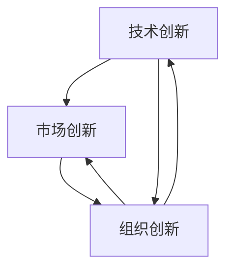

                 

### 《创新思维训练：激发团队创造力的exercises》引言

在快速发展的现代社会，创新已成为推动经济增长和社会进步的重要动力。无论是企业还是个人，创新思维的重要性越来越受到重视。本文旨在探讨如何通过系统的创新思维训练，激发团队的创造力，提高团队的整体创新能力和竞争力。

#### 创新的定义与重要性

创新是一种通过创造性的方法，对现有知识、技术、产品或服务进行改进、变革或创造新的产品、服务或技术的过程。在企业和个人发展的过程中，创新思维起着至关重要的作用。首先，创新思维能够帮助企业应对激烈的市场竞争，通过持续的产品创新和服务改进，保持市场竞争力。其次，创新思维有助于提升个人的职业发展，通过不断地学习和实践，实现自我突破和成长。此外，创新思维还能促进社会的进步，推动技术发展和解决社会问题。

#### 文章目的

本文的目标是提供一套系统的创新思维训练方法，帮助团队和个人提升创新能力和创造力。文章将从创新思维的理论基础、训练方法、实践策略以及相关的资源和工具等方面进行全面探讨，旨在为读者提供一个全面、系统的创新思维训练指南。

#### 文章结构

本文将分为四个主要部分：

1. **创新思维理论基础**：介绍创新思维的基本概念、分类和理论基础，包括创造力心理学、联想思维、逆向思维和求异思维等。
2. **创新思维训练方法**：详细阐述各种创新思维训练方法，如思维导图、SWOT分析、案例研究等，并提供实际应用案例。
3. **创新思维实践**：讨论团队创新的重要性、过程和策略，包括创新思维引导、创意生成、创意筛选和创意实施等。
4. **附录**：提供创新思维训练的资源与工具，包括书籍推荐、网络资源、培训课程和思维导图工具等。

通过本文的阅读和实践，读者将能够深入了解创新思维的重要性，掌握一系列有效的创新思维训练方法，并能够将其应用于实际工作和生活中，激发团队的创造力，实现持续的创新和发展。

### 《创新思维训练：激发团队创造力的exercises》关键词

创新思维、创造力、团队协作、思维导图、SWOT分析、案例研究、团队创新、创意生成、创意筛选、创意实施。

### 《创新思维训练：激发团队创造力的exercises》摘要

本文系统地探讨了如何通过创新思维训练激发团队的创造力，提高团队的整体创新能力和竞争力。首先，我们介绍了创新思维的定义和重要性，分析了创新思维的基本概念、分类和理论基础，包括创造力心理学、联想思维、逆向思维和求异思维等。接着，我们详细阐述了各种创新思维训练方法，如思维导图、SWOT分析、案例研究等，并提供实际应用案例。在此基础上，我们讨论了团队创新的重要性、过程和策略，包括创新思维引导、创意生成、创意筛选和创意实施等。最后，本文提供了丰富的创新思维训练资源与工具，包括书籍推荐、网络资源、培训课程和思维导图工具等，帮助读者在实际工作中应用创新思维，提升团队的创造力和竞争力。

---

#### 第一部分：创新思维理论基础

### 第1章：创新思维概述

##### 1.1 创新思维的定义与重要性

###### 1.1.1 创新的概念

创新是指在现有基础上，通过创造性的思维和方法，产生新的想法、技术、产品或服务的过程。创新不仅仅是指发明全新的东西，更涉及到对现有事物进行改进、优化或重新组合，以产生更好的效果。创新可以发生在不同层面上，包括产品创新、过程创新、市场创新和战略创新等。

###### 1.1.2 创新思维的重要性

创新思维在现代社会中具有至关重要的地位。首先，创新思维能够帮助企业保持竞争力。在快速变化的市场环境中，只有不断创新，才能满足客户的需求，保持市场份额。其次，创新思维有助于个人成长。通过不断地思考和创新，个人可以提升自己的知识水平和解决问题的能力，实现职业发展。此外，创新思维还对社会进步有重要贡献。它推动了技术发展，解决了许多社会问题，提升了人们的生活质量。

###### 1.1.3 创新思维的特征

创新思维具有以下特征：

1. **原创性**：创新思维能够产生新颖、独特的想法。
2. **适应性**：创新思维能够适应不同的环境和条件。
3. **综合性**：创新思维能够将不同的知识、技术和经验进行整合。
4. **持续性**：创新思维能够持续产生新的想法和解决方案。
5. **实践性**：创新思维能够将理论转化为实际应用。

##### 1.2 创新思维的分类

创新思维可以根据不同的标准和维度进行分类。以下是几种常见的分类方法：

1. **按创新程度分类**：

   - **模仿创新**：通过模仿现有的成功产品或服务进行创新。
   - **改进创新**：对现有产品或服务进行改进，提高其性能或功能。
   - **基础创新**：通过创造全新的产品、服务或技术进行创新。

2. **按创新方式分类**：

   - **突破性创新**：产生根本性的、革命性的变化。
   - **持续性创新**：逐步改进和完善现有产品或服务。

3. **按创新领域分类**：

   - **产品创新**：改进或创造新的产品。
   - **过程创新**：改进生产或服务流程。
   - **市场创新**：开拓新的市场和业务模式。
   - **战略创新**：制定新的战略目标和计划。

##### 1.3 创新思维的模型与工具

为了更好地理解和应用创新思维，可以借助一些模型和工具。以下是一些常用的模型和工具：

1. **思维导图**：通过图形化的方式展示思维过程，有助于梳理思路和激发创意。
2. **SWOT分析**：对企业的优势、劣势、机会和威胁进行评估，帮助企业制定创新策略。
3. **TRIZ理论**：一种基于数学和逻辑原理的创新方法论，用于解决复杂问题。
4. **六顶思考帽**：一种多角度思考问题的方法，有助于团队成员从不同角度分析问题。
5. **设计思维**：一种以人为中心的创新方法，强调用户需求和用户体验。

#### 第2章：创新思维的理论基础

##### 2.1 创造力心理学

###### 2.1.1 创造力心理学概述

创造力心理学是研究人类创造力产生、发展和影响因素的学科。它涉及心理学、神经科学、教育学等多个领域。创造力心理学关注创造力的心理机制、创造力与人格特质的关系以及创造力的培养方法。

###### 2.1.2 创造力的构成

创造力由多种要素构成，包括：

1. **想象力**：对事物的想象和联想能力。
2. **知识储备**：对相关领域知识的掌握和积累。
3. **问题解决能力**：面对问题时能够找到有效的解决方案。
4. **决策能力**：在多个选择中做出最优决策。

###### 2.1.3 创造力的培养

创造力可以通过以下方法进行培养：

1. **培养广泛的兴趣和爱好**：通过丰富自己的知识储备，激发创造力。
2. **提供创新环境和机会**：鼓励人们尝试新的想法和方法。
3. **开展创造性活动**：通过参与各种创造性活动，提高创造力。

##### 2.2 创新思维的核心概念

###### 2.2.1 联想思维

联想思维是通过事物之间的关联，产生新的想法和创意的过程。联想思维可以帮助人们从不同角度看待问题，发现新的解决方案。

###### 2.2.2 逆向思维

逆向思维是从相反的角度思考问题，寻找问题的反向解决方案。逆向思维可以帮助人们打破常规，产生创新的想法。

###### 2.2.3 求异思维

求异思维是寻求与众不同的想法和解决方案。求异思维可以帮助人们突破传统思维模式，找到创新的思路。

##### 2.3 创新思维的心理学原理

###### 2.3.1 心理学原理概述

创新思维的心理学原理涉及多个方面，包括注意力、记忆、思维定势等。心理学原理可以帮助人们更好地理解和应用创新思维。

###### 2.3.2 压力与创造力的关系

适度的压力可以激发创造力，但过度的压力会抑制创造力。因此，在创新思维训练中，需要平衡压力和创造力之间的关系。

###### 2.3.3 环境因素对创造力的影响

环境因素对创造力有重要影响，包括资源、支持、文化等。一个有利于创新思维的环境可以帮助人们更好地发挥创造力。

### 第3章：创新思维的模型与工具

##### 3.1 思维导图

###### 3.1.1 思维导图的概念

思维导图是一种图形化的思维方式，通过节点、连线和信息层级来展示思维过程。它由英国心理学家东尼·博赞（Tony Buzan）于20世纪70年代初发明。思维导图可以帮助人们整理思绪，提高记忆力和创造力。

###### 3.1.2 思维导图的优点

思维导图具有以下优点：

1. **可视化**：通过图形化的方式展示思维过程，直观易懂。
2. **结构化**：有助于整理和组织信息，使思路清晰。
3. **创造性**：激发想象力，产生新的想法和创意。
4. **记忆性**：有助于记忆和回顾信息。

###### 3.1.3 思维导图的制作方法

制作思维导图可以分为以下步骤：

1. **确定主题**：明确思维导图的核心主题。
2. **绘制中心节点**：在中心位置绘制主题节点。
3. **绘制分支**：从中心节点延伸出分支，代表不同的子主题。
4. **添加信息**：在每个分支上添加相关信息。
5. **调整布局**：根据需要调整节点和分支的布局。

##### 3.2 SWOT分析

###### 3.2.1 SWOT分析的概念

SWOT分析是一种战略规划工具，用于评估企业的优势（Strengths）、劣势（Weaknesses）、机会（Opportunities）和威胁（Threats）。它可以帮助企业识别自身的优势、劣势以及外部环境中的机会和威胁，从而制定有效的战略计划。

###### 3.2.2 SWOT分析的应用

SWOT分析可以应用于多个领域，包括：

1. **企业战略规划**：通过评估企业的优势、劣势、机会和威胁，制定长期和短期的战略目标。
2. **产品开发**：分析产品的优势、劣势、市场机会和竞争威胁，优化产品设计和功能。
3. **市场营销**：评估市场机会和威胁，确定市场营销策略和推广计划。

###### 3.2.3 SWOT分析的步骤

进行SWOT分析可以分为以下步骤：

1. **收集信息**：收集与企业或产品相关的内外部信息。
2. **分析优势与劣势**：评估企业的内部优势、劣势。
3. **分析机会与威胁**：评估外部环境中的机会和威胁。
4. **制定战略**：根据SWOT分析结果，制定相应的战略计划和应对措施。

##### 3.3 案例研究

###### 3.3.1 案例研究的概念

案例研究是一种研究方法，通过分析和研究具体案例，探讨问题、总结经验、提出解决方案。案例研究可以应用于企业、团队或个人，帮助理解问题的本质和成因，为未来的决策提供参考。

###### 3.3.2 案例研究的目的

案例研究的主要目的是：

1. **探讨问题**：通过研究案例，深入了解问题的本质和成因。
2. **总结经验**：从案例中总结出成功或失败的原因，为未来提供借鉴。
3. **提出解决方案**：根据案例研究的结果，提出具体的解决方案或改进措施。

###### 3.3.3 案例研究的方法

进行案例研究通常包括以下步骤：

1. **确定研究对象**：明确研究案例的主体。
2. **收集资料**：收集与研究对象相关的数据、文献、报告等资料。
3. **分析案例**：对收集到的资料进行系统分析和解读。
4. **总结经验**：从案例中提取关键信息，总结成功或失败的原因。
5. **提出解决方案**：根据分析结果，提出具体的解决方案或改进措施。

### 第4章：创新思维的理论基础

#### 2.1 创造力心理学

创造力心理学是研究人类创造力产生、发展和影响因素的学科。它涉及心理学、神经科学、教育学等多个领域。创造力心理学关注创造力的心理机制、创造力与人格特质的关系以及创造力的培养方法。

##### 2.1.1 创造力心理学概述

创造力心理学的主要研究领域包括：

1. **创造力的心理机制**：探讨创造力是如何在个体的心理过程中产生的，包括注意力、记忆、思维过程等。
2. **创造力与人格特质**：研究创造力与个体的人格特质之间的关系，如好奇心、冒险精神、开放性等。
3. **创造力的培养**：探讨如何通过教育、环境等因素培养和提高个体的创造力。

创造力心理学的研究成果对于理解创新思维的本质具有重要意义。例如，研究表明，创造力往往与个体的认知灵活性、联想能力和问题解决能力密切相关。

##### 2.1.2 创造力的构成

创造力由多种要素构成，包括：

1. **想象力**：想象力是创造力的重要基础，它使个体能够产生新颖、独特的想法。
2. **知识储备**：丰富的知识储备是创造力的源泉，它帮助个体在解决问题时能够灵活运用各种知识。
3. **问题解决能力**：问题解决能力是创造力的重要组成部分，它使个体能够面对复杂的问题并找到有效的解决方案。
4. **决策能力**：在多个选择中做出最优决策是创造力的重要体现，它使个体能够将创意转化为实际应用。

##### 2.1.3 创造力的培养

创造力可以通过以下方法进行培养：

1. **培养广泛的兴趣和爱好**：通过丰富自己的知识储备，激发创造力。
2. **提供创新环境和机会**：鼓励人们尝试新的想法和方法。
3. **开展创造性活动**：通过参与各种创造性活动，提高创造力。

例如，学校可以通过开设创意课程、举办创新比赛等方式，激发学生的创造力。企业可以通过提供创新空间、鼓励员工参与创新项目等方式，提高员工的创造力。

#### 2.2 创新思维的核心概念

创新思维的核心概念包括联想思维、逆向思维和求异思维。这些概念是创新思维的基础，帮助个体在解决问题时产生新颖的创意。

##### 2.2.1 联想思维

联想思维是通过事物之间的关联，产生新的想法和创意的过程。它帮助个体从不同角度看待问题，发现新的解决方案。

###### 2.2.1.1 联想思维的原理

联想思维基于以下几个原理：

1. **相似性原理**：通过寻找事物之间的相似点，激发创意。
2. **因果原理**：通过分析事物的因果关系，产生新的创意。
3. **对比原理**：通过对比不同事物，发现新的创意。

###### 2.2.1.2 联想思维的应用

联想思维可以应用于多个领域，如产品设计、市场营销、企业管理等。例如，在设计一款新的电子产品时，可以通过联想思维，从其他产品中获取灵感，改进设计。

##### 2.2.2 逆向思维

逆向思维是从相反的角度思考问题，寻找问题的反向解决方案。它帮助个体打破常规，产生创新的想法。

###### 2.2.2.1 逆向思维的原理

逆向思维基于以下几个原理：

1. **反证法原理**：通过否定已有的假设，寻找新的解决方案。
2. **反向因果原理**：通过分析事物的反向因果关系，产生新的创意。
3. **逆推法原理**：通过从目标出发，逆向推理，寻找解决方案。

###### 2.2.2.2 逆向思维的应用

逆向思维可以应用于多个领域，如技术研发、产品设计、战略规划等。例如，在研发新产品时，可以通过逆向思维，从现有的失败案例中学习，避免重复错误。

##### 2.2.3 求异思维

求异思维是寻求与众不同的想法和解决方案。它帮助个体突破传统思维模式，找到创新的思路。

###### 2.2.3.1 求异思维的原理

求异思维基于以下几个原理：

1. **反常规原理**：通过打破常规，寻求新的解决方案。
2. **反传统原理**：通过挑战传统观念，产生新的创意。
3. **多样性原理**：通过寻求多样性，发现新的创意。

###### 2.2.3.2 求异思维的应用

求异思维可以应用于多个领域，如艺术创作、技术创新、企业管理等。例如，在艺术创作中，可以通过求异思维，打破传统的艺术形式，创造新的艺术风格。

#### 2.3 创新思维的心理学原理

创新思维的心理学原理涉及多个方面，包括注意力、记忆、思维定势等。理解这些心理学原理有助于个体更好地应用创新思维，提高创造力。

##### 2.3.1 心理学原理概述

心理学原理包括以下主要内容：

1. **注意力**：注意力是心理活动对一定对象的指向和集中。良好的注意力有助于个体在创新思维过程中保持集中，避免分散注意力。
2. **记忆**：记忆是心理活动对过去经验的保持和再现。丰富的知识储备有助于个体在创新思维过程中快速检索信息，产生新的创意。
3. **思维定势**：思维定势是人们在长期生活中形成的固定思维方式。突破思维定势有助于个体产生新的创意。

##### 2.3.2 压力与创造力的关系

压力与创造力之间的关系复杂。适度的压力可以激发创造力，但过度的压力会抑制创造力。

1. **适度的压力**：适度的压力可以激发个体的创造潜能，促进创新思维。例如，在紧迫的截止日期下，人们可能会更加集中精力，产生新的创意。
2. **过度的压力**：过度的压力会导致个体焦虑、紧张，影响思维清晰度，降低创造力。长期处于高压状态可能会损害个体的心理健康。

##### 2.3.3 环境因素对创造力的影响

环境因素对创造力有重要影响，包括资源、支持、文化等。

1. **资源**：充足的资源有助于个体进行创新活动。例如，企业为员工提供先进的技术设备、良好的工作环境等，有助于提高员工的创造力。
2. **支持**：社会支持是创造力的重要保障。家庭、学校、企业等环境对个体的创造力有直接影响。一个支持性强的环境可以鼓励个体勇于尝试，接受失败，从而提高创造力。
3. **文化**：文化背景对创造力有深远影响。开放、包容、创新的文化环境有助于个体发挥创造力。例如，一些国家的教育体系注重培养学生的创造力，鼓励学生勇于表达自己的观点。

### 第3章：思维导图训练

#### 3.1 思维导图概述

思维导图（Mind Map）是一种图形化的思维工具，通过图像、颜色和文字等元素，将思维过程可视化。它由英国心理学家东尼·博赞（Tony Buzan）于20世纪70年代初发明。思维导图不仅可以帮助人们整理思路，还可以激发创意，提高记忆力和问题解决能力。

##### 3.1.1 思维导图的概念

思维导图是一种以中心主题为中心，通过分支和节点扩展的图形化表示方法。每个分支代表一个子主题，节点则表示具体的信息或想法。通过这种方式，思维导图将复杂的思维过程转化为易于理解和记忆的图形。

##### 3.1.2 思维导图的优点

思维导图具有以下优点：

1. **可视化**：通过图形化的方式展示思维过程，使复杂的信息变得更加直观和易于理解。
2. **结构化**：有助于整理和组织信息，使思路清晰，提高工作效率。
3. **创造性**：激发想象力，产生新的想法和创意。
4. **记忆性**：有助于记忆和回顾信息，提高学习效果。

##### 3.1.3 思维导图的制作方法

制作思维导图可以分为以下步骤：

1. **确定主题**：明确思维导图的核心主题。
2. **绘制中心节点**：在中心位置绘制主题节点，用关键词或图像表示。
3. **绘制分支**：从中心节点延伸出主要分支，代表不同的子主题。
4. **添加信息**：在每个分支上添加具体的信息或想法，可以用文字、图像、符号等表示。
5. **调整布局**：根据需要调整节点和分支的布局，使思维导图更加美观和易于阅读。

#### 3.2 思维导图应用实例

思维导图可以应用于多个领域，如项目管理、团队协作、学习笔记、创意生成等。以下是一些具体的应用实例：

##### 3.2.1 项目策划

在项目策划阶段，思维导图可以帮助团队明确项目目标、任务和时间安排。具体步骤如下：

1. **确定主题**：绘制项目策划思维导图，主题为“项目策划”。
2. **绘制中心节点**：中心节点为“项目策划”，用关键词“目标”、“任务”、“时间安排”等表示。
3. **绘制分支**：从中心节点延伸出主要分支，代表不同的子主题，如“市场调研”、“需求分析”、“资源分配”等。
4. **添加信息**：在每个分支上添加具体的信息或想法，例如，在“市场调研”分支下，可以添加“竞争对手分析”、“市场趋势”等。
5. **调整布局**：根据需要调整节点和分支的布局，使思维导图更加清晰和易于理解。

##### 3.2.2 团队协作

在团队协作中，思维导图可以帮助团队成员更好地理解和协同工作。具体步骤如下：

1. **确定主题**：绘制团队协作思维导图，主题为“团队协作”。
2. **绘制中心节点**：中心节点为“团队协作”，用关键词“沟通”、“分工”、“目标一致”等表示。
3. **绘制分支**：从中心节点延伸出主要分支，代表不同的子主题，如“沟通渠道”、“分工合作”、“目标管理”等。
4. **添加信息**：在每个分支上添加具体的信息或想法，例如，在“沟通渠道”分支下，可以添加“会议”、“邮件”、“即时通讯”等。
5. **调整布局**：根据需要调整节点和分支的布局，使思维导图更加清晰和易于理解。

##### 3.2.3 课堂教学

在课堂教学中，思维导图可以帮助教师讲解课程内容，帮助学生整理学习笔记。具体步骤如下：

1. **确定主题**：绘制课程内容思维导图，主题为“课程内容”。
2. **绘制中心节点**：中心节点为“课程内容”，用关键词“知识点”、“重点”、“难点”等表示。
3. **绘制分支**：从中心节点延伸出主要分支，代表不同的子主题，如“第一章”、“第二章”、“案例研究”等。
4. **添加信息**：在每个分支上添加具体的信息或想法，例如，在“第一章”分支下，可以添加“概念1”、“概念2”等。
5. **调整布局**：根据需要调整节点和分支的布局，使思维导图更加清晰和易于理解。

### 第4章：SWOT分析训练

#### 4.1 SWOT分析概述

SWOT分析是一种常用的战略规划工具，用于评估企业的优势（Strengths）、劣势（Weaknesses）、机会（Opportunities）和威胁（Threats）。通过SWOT分析，企业可以全面了解自身内外部环境，制定出更具针对性的战略计划。

##### 4.1.1 SWOT分析的概念

SWOT分析是由麦肯锡公司于1960年代初提出的一种战略规划工具，旨在帮助企业和团队识别自身在竞争环境中的优势、劣势、机会和威胁，从而制定有效的战略决策。

- **优势（Strengths）**：企业内部具备的、有竞争力的资源和能力。
- **劣势（Weaknesses）**：企业内部存在的、影响企业发展的弱点和不足。
- **机会（Opportunities）**：外部环境中对企业发展有利的因素。
- **威胁（Threats）**：外部环境中对企业发展构成威胁的因素。

##### 4.1.2 SWOT分析的应用

SWOT分析可以应用于多个领域，包括：

- **企业战略规划**：帮助企业识别自身的优势和劣势，抓住市场机会，防范潜在威胁。
- **市场营销**：分析产品的市场地位，制定有效的市场营销策略。
- **产品开发**：评估产品的市场前景，确定产品改进方向。
- **团队协作**：评估团队的能力和协作状况，优化团队结构。

##### 4.1.3 SWOT分析的步骤

进行SWOT分析可以分为以下步骤：

1. **收集信息**：收集与对象（如企业、团队、项目）相关的内部和外部信息。
2. **分析优势与劣势**：评估企业或团队在资源、能力、市场等方面的优势和劣势。
3. **分析机会与威胁**：分析外部环境中对对象有利的因素和潜在的威胁。
4. **制定战略**：根据SWOT分析结果，制定相应的战略规划和应对措施。

#### 4.2 SWOT分析应用实例

##### 4.2.1 企业战略规划

在制定企业战略规划时，SWOT分析可以帮助企业明确自身的优势和劣势，抓住市场机会，防范潜在威胁。以下是一个企业战略规划中SWOT分析的示例：

1. **收集信息**：收集与企业相关的内部和外部信息，包括财务报表、市场调研报告、竞争对手分析等。
2. **分析优势与劣势**：
   - **优势**：
     - 强大的研发能力
     - 品牌知名度高
     - 优质的客户服务
   - **劣势**：
     - 生产成本较高
     - 市场开拓能力有限
     - 员工培训不足
3. **分析机会与威胁**：
   - **机会**：
     - 新的市场需求增长
     - 政策扶持
     - 技术创新
   - **威胁**：
     - 竞争对手的崛起
     - 市场变化
     - 原材料价格波动
4. **制定战略**：
   - **优势利用**：加强研发，推出具有竞争力的新产品。
   - **劣势改进**：降低生产成本，提升市场开拓能力。
   - **机会抓住**：积极开拓新市场，利用政策扶持。
   - **威胁应对**：加强市场竞争分析，优化供应链管理。

##### 4.2.2 产品开发

在产品开发过程中，SWOT分析可以帮助团队了解市场需求、竞争态势、技术优势等，从而确定产品的定位、功能和特点，提高产品的市场竞争力。以下是一个产品开发中SWOT分析的示例：

1. **收集信息**：收集与产品相关的市场调研报告、用户反馈、竞争对手分析等。
2. **分析优势与劣势**：
   - **优势**：
     - 技术先进
     - 设计独特
     - 用户评价高
   - **劣势**：
     - 市场推广不足
     - 生产成本较高
     - 技术更新周期长
3. **分析机会与威胁**：
   - **机会**：
     - 市场需求增长
     - 竞争对手产品更新缓慢
     - 技术趋势支持
   - **威胁**：
     - 竞争对手的挑战
     - 市场竞争加剧
     - 技术淘汰风险
4. **制定战略**：
   - **优势利用**：加强市场推广，提升品牌知名度。
   - **劣势改进**：优化生产工艺，降低生产成本。
   - **机会抓住**：及时跟进市场趋势，推出符合用户需求的产品。
   - **威胁应对**：加强技术储备，提前布局未来技术。

##### 4.2.3 个人发展

在个人发展过程中，SWOT分析可以帮助个人了解自己的优势、劣势、机会和威胁，从而制定合理的发展计划，提高自身能力和竞争力。以下是一个个人发展中SWOT分析的示例：

1. **收集信息**：收集与个人相关的教育背景、工作经历、兴趣爱好等。
2. **分析优势与劣势**：
   - **优势**：
     - 具有丰富的技术经验
     - 优秀的沟通能力
     - 良好的团队协作能力
   - **劣势**：
     - 管理能力有待提高
     - 缺乏领导经验
     - 知识储备有限
3. **分析机会与威胁**：
   - **机会**：
     - 职业市场对技术人才需求大
     - 有机会获得更高的职位
     - 获得更多的培训和学习机会
   - **威胁**：
     - 同行竞争激烈
     - 技术更新速度快
     - 职业生涯瓶颈
4. **制定战略**：
   - **优势利用**：发挥技术优势，提升工作效率。
   - **劣势改进**：通过培训和学习，提高管理能力和知识储备。
   - **机会抓住**：积极参与项目，积累领导经验。
   - **威胁应对**：保持持续学习的态度，提升自身竞争力。

### 第5章：案例研究训练

#### 5.1 案例研究概述

案例研究是一种通过详细分析具体案例，探讨问题、总结经验、提出解决方案的研究方法。它广泛应用于学术研究、企业咨询、教育培训等领域。通过案例研究，可以深入了解问题的本质，发现成功的经验和教训，为未来的决策提供参考。

##### 5.1.1 案例研究的概念

案例研究是指对某个具体案例进行深入分析和研究，以探讨问题、总结经验和提出解决方案。案例可以是企业、团队、项目或个人的具体实例。案例研究通常包括以下步骤：

1. **选择案例**：确定研究案例的主体，可以是成功或失败的案例。
2. **收集资料**：收集与案例相关的数据、文献、报告等资料。
3. **分析案例**：对收集到的资料进行系统分析和解读。
4. **总结经验**：从案例中提取关键信息，总结成功或失败的原因。
5. **提出解决方案**：根据分析结果，提出具体的解决方案或改进措施。

##### 5.1.2 案例研究的目的

案例研究的主要目的是：

1. **探讨问题**：通过研究具体案例，深入了解问题的本质和成因。
2. **总结经验**：从案例中总结出成功或失败的原因，为未来提供借鉴。
3. **提出解决方案**：根据案例研究的结果，提出具体的解决方案或改进措施。

##### 5.1.3 案例研究的方法

进行案例研究通常包括以下方法：

1. **文献综述**：通过查阅相关文献，了解案例的背景和理论框架。
2. **数据收集**：收集与案例相关的数据、文献、报告等资料。
3. **深度访谈**：与案例相关的人员进行访谈，获取第一手资料。
4. **案例分析**：对收集到的资料进行系统分析和解读。
5. **总结报告**：撰写案例分析的总结报告，提出结论和建议。

#### 5.2 案例研究应用实例

##### 5.2.1 企业创新案例分析

企业创新案例分析是研究企业在创新过程中采取的方法、策略和实践，以及其创新成果和经验。以下是一个企业创新案例分析的示例：

1. **选择案例**：选择一家知名企业在某一年推出的新产品作为案例。
2. **收集资料**：收集与新产品相关的市场调研报告、用户反馈、竞争对手分析等资料。
3. **分析案例**：
   - **创新策略**：分析企业在产品创新过程中采取的方法和策略，如技术改进、市场细分、用户体验等。
   - **创新成果**：分析新产品的市场表现、用户满意度、盈利能力等。
   - **经验教训**：总结企业在创新过程中取得的成功和面临的挑战，提出改进措施。
4. **提出解决方案**：根据案例分析结果，为企业未来的创新提供建议，如加强市场调研、优化用户体验、提高技术储备等。

##### 5.2.2 团队创新实践

团队创新实践案例分析是研究团队在创新过程中采取的方法、策略和实践，以及其创新成果和经验。以下是一个团队创新实践案例分析的示例：

1. **选择案例**：选择一个成功创新的团队作为案例。
2. **收集资料**：收集与团队创新相关的团队活动记录、用户反馈、团队总结等资料。
3. **分析案例**：
   - **创新方法**：分析团队在创新过程中采取的方法和策略，如头脑风暴、设计思维、跨部门协作等。
   - **创新成果**：分析团队的创新实践成果，如新产品的推出、新服务的实施、工作效率的提升等。
   - **经验教训**：总结团队在创新过程中取得的成功和面临的挑战，提出改进措施。
4. **提出解决方案**：根据案例分析结果，为团队未来的创新实践提供建议，如加强团队协作、提高创新培训、优化创新流程等。

##### 5.2.3 创新教育实践

创新教育实践案例分析是研究教育领域在创新教育过程中采取的方法、策略和实践，以及其创新成果和经验。以下是一个创新教育实践案例分析的示例：

1. **选择案例**：选择一个创新教育项目作为案例。
2. **收集资料**：收集与创新教育相关的项目计划、教师总结、学生反馈等资料。
3. **分析案例**：
   - **创新方法**：分析项目在创新教育过程中采取的方法和策略，如项目式学习、探究式学习、团队合作等。
   - **创新成果**：分析项目的教育成果，如学生的学习成绩、创新能力、团队合作能力等。
   - **经验教训**：总结项目在创新教育过程中取得的成功和面临的挑战，提出改进措施。
4. **提出解决方案**：根据案例分析结果，为教育领域的创新教育提供建议，如优化课程设计、提高教师培训、加强学生参与等。

### 第6章：团队创新实践

#### 6.1 团队创新的重要性

团队创新在现代社会中具有重要意义。首先，团队创新有助于企业保持竞争力。在竞争激烈的市场环境中，只有不断进行产品、服务和技术创新，才能满足客户的需求，保持市场地位。其次，团队创新有助于提升团队凝聚力和工作效率。通过团队协作，成员可以相互学习、相互支持，共同解决复杂问题，提高工作效率。此外，团队创新还可以促进个人成长和职业发展。团队成员在参与创新过程中，可以学习新的知识和技能，提升自身的综合素质，为未来的职业发展奠定基础。

##### 6.1.1 团队创新的优势

团队创新具有以下优势：

1. **协同合作**：团队成员可以共同参与创新过程，发挥各自的优势，实现资源共享和优势互补。
2. **多元化视角**：不同成员可以从不同角度思考问题，提高创新的可能性，减少思维盲点。
3. **知识共享**：团队成员可以共享知识和经验，促进创新思维的碰撞和融合，激发新的创意。
4. **快速迭代**：团队可以通过协同工作，快速实现创新想法的迭代和优化，提高创新效率和成果质量。

##### 6.1.2 团队创新的挑战

团队创新过程中也可能面临一些挑战：

1. **沟通障碍**：团队成员之间的沟通不畅可能会影响创新的效果，甚至导致创新失败。
2. **资源分配**：团队资源有限，如何合理分配资源以确保创新项目的顺利进行是一个重要问题。
3. **管理难度**：团队创新需要有效的管理和协调，确保创新目标的实现和团队成员的积极性。
4. **平衡风险与收益**：创新活动存在一定的风险，如何在风险与收益之间取得平衡是一个重要课题。

##### 6.1.3 团队创新的关键因素

团队创新的成功离不开以下关键因素：

1. **明确的目标**：团队需要明确创新的目标和方向，确保创新活动的针对性。
2. **协作机制**：建立有效的协作机制，促进团队成员之间的沟通和合作。
3. **激励机制**：设立合理的激励机制，激发团队成员的创新热情和积极性。
4. **持续学习**：团队需要保持持续学习的态度，不断更新知识和技能，为创新提供支持。

#### 6.2 团队创新的过程

团队创新是一个复杂的过程，涉及多个阶段。以下是一个典型的团队创新过程：

##### 6.2.1 创新思维引导

创新思维引导是团队创新的第一步，旨在激发团队成员的创造力和想象力。以下是一些常用的创新思维引导方法：

1. **头脑风暴**：鼓励团队成员自由表达自己的想法，不受限制地进行思维碰撞。
2. **思维导图**：通过绘制思维导图，帮助团队成员梳理思路，明确创新目标。
3. **案例研究**：通过研究成功或失败的案例，为团队提供创新思路和经验借鉴。
4. **跨界合作**：鼓励不同领域的团队成员进行合作，激发创新的火花。

##### 6.2.2 创意生成

创意生成是团队创新的核心环节，旨在产生创新的想法和解决方案。以下是一些常用的创意生成方法：

1. **头脑风暴**：通过集中讨论，激发团队成员的创意。
2. **思维导图**：通过图形化的方式展示思维过程，促进创造性思考。
3. **用户调研**：深入了解用户需求和市场趋势，为创意提供实际应用的基础。
4. **迭代优化**：不断对创意进行迭代和优化，提高创意的质量和可行性。

##### 6.2.3 创意筛选

创意筛选是对产生的创意进行筛选和评估，确定最终的创新方案。以下是一些常用的创意筛选方法：

1. **可行性评估**：评估创意的可行性，包括技术、市场、资源等方面的因素。
2. **优先级排序**：根据创意的重要性和紧急性，对创意进行优先级排序。
3. **专家评审**：邀请相关领域的专家对创意进行评审，提供专业的意见和建议。
4. **成本效益分析**：评估创意的经济效益，确保创意实施后能够产生预期的收益。

##### 6.2.4 创意实施

创意实施是将筛选出的创意转化为实际应用的过程。以下是一些常用的创意实施方法：

1. **项目规划**：制定详细的创意实施计划，明确项目目标、任务和时间安排。
2. **团队协作**：建立有效的团队协作机制，确保创意实施的顺利进行。
3. **持续跟踪**：对创意实施过程进行持续跟踪和评估，及时发现问题和调整计划。
4. **反馈优化**：根据用户反馈和实施效果，对创意进行持续优化，提高其质量和效果。

### 第7章：创新思维训练策略

#### 7.1 创新思维训练策略概述

创新思维训练策略是指通过一系列的方法和工具，有计划、有针对性地提升团队成员的创新能力和创造力。有效的创新思维训练策略不仅可以帮助团队在短时间内提高创新水平，还可以培养团队长期持续的创新能力。

##### 7.1.1 创新思维训练的目的

创新思维训练的主要目的是：

1. **提高创造力**：通过训练，提高团队成员的创造力和想象力，产生更多的新想法和创意。
2. **培养创新意识**：培养团队成员对创新的认识和重视，形成创新的文化氛围。
3. **提升团队协作**：通过创新思维训练，提高团队成员之间的协作能力和创新能力。
4. **增强解决问题的能力**：培养团队成员在面对复杂问题时，能够迅速找到解决方案的能力。

##### 7.1.2 创新思维训练的方法

创新思维训练可以采用以下几种方法：

1. **理论学习**：通过学习创新思维的理论知识，了解创新思维的基本原理和方法。
2. **实践操作**：通过实际操作和创新活动，锻炼团队成员的创新能力和解决问题的能力。
3. **案例分析**：通过研究成功或失败的案例，学习创新思维的实际应用和经验教训。
4. **团队协作**：通过团队协作和创新活动，培养团队的创新能力和协作精神。
5. **持续学习**：鼓励团队成员不断学习和更新知识，提高自身的创新能力和竞争力。

##### 7.1.3 创新思维训练的注意事项

在进行创新思维训练时，需要注意以下几点：

1. **持续性**：创新思维训练需要持续进行，不能一蹴而就。只有通过长期的训练，才能逐渐提高团队成员的创新能力和创造力。
2. **个性化**：不同团队成员的创新思维训练需求和方式可能不同，需要根据个体差异，提供个性化的培训方案。
3. **结合实际**：创新思维训练要与实际工作相结合，确保训练成果能够转化为实际应用。
4. **反馈与改进**：及时对训练效果进行反馈和评估，根据反馈结果进行改进，确保训练效果。

#### 7.2 创新思维训练实践

创新思维训练实践是实际操作和创新活动的具体实施，旨在通过具体的训练方法和工具，提升团队成员的创新能力和创造力。以下是一些创新思维训练实践的示例：

##### 7.2.1 创新思维训练课程设计

创新思维训练课程设计包括以下内容：

1. **课程目标**：明确课程的目标和预期成果，如提高创造力、培养创新意识等。
2. **课程内容**：设计创新思维的理论知识、实践操作和案例分析等内容。
3. **课程形式**：结合线上和线下课程，采用讲授、讨论、实践等多种形式进行教学。
4. **课程评估**：通过考试、作业、项目展示等方式，评估学员的创新思维能力。

##### 7.2.2 创新思维训练案例分析

创新思维训练案例分析包括以下内容：

1. **案例选择**：选择具有代表性和启发性的创新案例，作为训练和分析的对象。
2. **案例分析**：对案例进行深入分析，总结案例中的创新思维方法和经验。
3. **案例应用**：将案例中的创新思维方法应用到实际工作中，进行实践和验证。
4. **案例总结**：对案例应用的效果进行总结和评估，提出改进意见和建议。

##### 7.2.3 创新思维训练效果评估

创新思维训练效果评估包括以下内容：

1. **评估标准**：制定评估标准和指标，如创新能力、创造力、团队协作等。
2. **评估方法**：采用问卷调查、访谈、项目评审等方式，收集评估数据。
3. **评估结果**：对评估数据进行分析和总结，评估创新思维训练的效果和成果。
4. **改进措施**：根据评估结果，提出改进措施和优化方案，提高创新思维训练的质量。

### 附录A：创新思维训练资源与工具

为了帮助读者更好地进行创新思维训练，本文附录提供了丰富的创新思维训练资源与工具。

#### 附录A.1 创新思维训练资源

1. **书籍推荐**：
   - 《创新者的思考方式》[美] 杰弗里·摩尔
   - 《创意的源泉》[美] 斯科特·贝森
   - 《创新者的路径》[美] 克莱顿·克里斯滕森
   - 《创造力心理学》[美] 霍华德·加德纳

2. **网络资源**：
   - 创新思维相关的博客、论坛、在线课程等。

3. **培训课程**：
   - 各大培训机构提供的创新思维培训课程，如公开课、在线课程等。

#### 附录A.2 创新思维工具

1. **思维导图工具**：
   - MindManager、Xmind、ProcessOn等。

2. **SWOT分析工具**：
   - Excel、PowerPoint等。

3. **案例研究工具**：
   - Excel、PPT、案例库等。

这些资源和工具可以帮助读者在创新思维训练过程中，更好地理解和应用创新思维方法，提高自身的创新能力和创造力。

### 附录B：参考文献

1. 《创新者的思考方式》[美] 杰弗里·摩尔
2. 《创意的源泉》[美] 斯科特·贝森
3. 《创新者的路径》[美] 克莱顿·克里斯滕森
4. 《创造力心理学》[美] 霍华德·加德纳
5. 《思维导图》[英] 东尼·博赞
6. 《创新管理》[美] 亨利·福特二世
7. 《团队协作的力量》[美] 托尼·贝尔宾
8. 《团队协作》[美] 马克·米兰科维奇
9. 《创造力与问题解决》[美] 哈佛大学心理学系
10. 《实践创新思维》[美] 罗伯特·L·舒勒
11. 《设计思维》[美] 戴维·凯利
12. 《设计思维与创造力》[美] 菲利普·贝德克尔
13. 《创新心理学》[美] 詹姆斯·马奇
14. 《创新思维》[美] 约翰·P·凯利
15. 《创新与企业家精神》[美] 彼得·德鲁克
16. 《商业思考》[美] 斯蒂芬·罗宾斯
17. 《创新与变革管理》[英] 理查德·拉夫
18. 《创新领导力》[美] 拉里·博西迪
19. 《创新的法则》[美] 保罗·格雷厄姆
20. 《创新者的窘境》[美] 克莱顿·克里斯滕森

### 梅里曼与斯图尔特的创新研究

梅里曼（Mellman）和斯图尔特（Stewart）在创新研究中提出了“创新三角形”理论，该理论强调创新过程中三个关键要素：技术、市场和组织的协同作用。

#### 技术创新

技术创新是创新三角形的基础，它指的是通过研发和应用新技术来创造新的产品、服务和流程。技术创新可以带来显著的效率提升和成本降低，从而为企业提供竞争优势。

- **核心算法原理**：
  ```pseudo
  // 技术创新的核心算法原理
  Function TechnicalInnovation() {
    Input: 新技术需求，现有技术框架
    Output: 创新的技术解决方案

    1. 收集新技术需求
    2. 分析现有技术框架
    3. 设计创新技术方案
    4. 验证和优化方案
    5. 实施新技术方案
  }
  ```

#### 市场创新

市场创新指的是通过创造新的市场或开拓现有市场的新机会来满足客户需求。市场创新通常涉及新的商业模式、分销渠道或市场定位。

- **核心算法原理**：
  ```pseudo
  // 市场创新的核心算法原理
  Function MarketInnovation() {
    Input: 市场调研数据，竞争对手分析
    Output: 新的市场机会和策略

    1. 收集市场调研数据
    2. 分析竞争对手策略
    3. 识别市场空白点
    4. 设计市场创新策略
    5. 验证和调整策略
  }
  ```

#### 组织创新

组织创新是指通过改变组织结构、文化和流程来支持创新。组织创新确保企业能够灵活应对市场变化，快速响应客户需求。

- **核心算法原理**：
  ```pseudo
  // 组织创新的核心算法原理
  Function OrganizationalInnovation() {
    Input: 创新需求，组织结构
    Output: 创新的组织解决方案

    1. 识别创新需求
    2. 分析现有组织结构
    3. 设计创新组织结构
    4. 引入新文化和流程
    5. 验证和优化解决方案
  }
  ```

#### 三角形协同效应

梅里曼和斯图尔特认为，技术创新、市场创新和组织创新的协同效应是推动企业持续创新的关键。以下是三角形协同效应的流程图：



通过这个协同效应，企业能够在技术创新推动市场创新的同时，通过组织创新支持技术创新和市场创新的实现，从而形成良性循环，持续推动企业的创新和发展。

### 创新过程中的反馈循环

在创新过程中，反馈循环是一个关键环节，它确保创新活动的有效性和持续性。反馈循环是指通过不断收集和分析反馈信息，调整和优化创新过程，从而提高创新效果。

#### 反馈循环的核心算法

以下是反馈循环的核心算法原理，用于描述反馈循环的基本步骤：

```pseudo
// 反馈循环的核心算法原理
Function FeedbackLoop() {
  Input: 初始创新方案，反馈机制
  Output: 优化后的创新方案

  1. 实施初始创新方案
  2. 收集实施过程中的反馈信息
  3. 分析反馈信息，识别问题和机会
  4. 根据分析结果调整创新方案
  5. 重新实施调整后的创新方案
  6. 重复步骤2-5，直到达到预期效果
}
```

#### 反馈循环的实践应用

在创新过程中，反馈循环的应用可以体现在多个方面，以下是一些具体的应用实例：

##### 1. 产品开发

在产品开发过程中，反馈循环可以帮助团队及时发现和解决产品问题，优化产品功能。具体步骤如下：

- **步骤1**：开发初步产品原型。
- **步骤2**：将产品原型交付给用户测试。
- **步骤3**：收集用户反馈，包括使用体验、功能建议和问题报告。
- **步骤4**：分析用户反馈，识别产品优势和需要改进的方面。
- **步骤5**：根据分析结果，调整产品设计和功能。
- **步骤6**：重新发布优化后的产品版本，再次收集用户反馈。

##### 2. 项目管理

在项目管理中，反馈循环可以帮助团队不断优化项目管理流程，提高项目效率。具体步骤如下：

- **步骤1**：制定项目计划和目标。
- **步骤2**：执行项目计划，监控项目进度。
- **步骤3**：收集项目执行过程中的反馈信息，包括资源使用、时间安排和任务完成情况。
- **步骤4**：分析项目反馈，识别项目管理中的问题和机会。
- **步骤5**：根据分析结果，调整项目计划和资源分配。
- **步骤6**：重新执行调整后的项目计划，并持续收集反馈。

##### 3. 组织变革

在组织变革中，反馈循环可以帮助团队了解变革的进展和影响，及时调整变革策略。具体步骤如下：

- **步骤1**：制定组织变革计划。
- **步骤2**：执行变革计划，实施新的组织结构和文化。
- **步骤3**：收集员工反馈，包括对变革的接受程度、工作氛围和绩效表现。
- **步骤4**：分析员工反馈，识别变革的影响和潜在问题。
- **步骤5**：根据分析结果，调整变革策略和实施计划。
- **步骤6**：继续执行调整后的变革计划，并持续收集反馈。

通过这些实践应用，反馈循环可以帮助企业在创新过程中持续改进，提高创新效率和效果。

### 项目开发过程中的创新思维

在项目开发过程中，创新思维是推动项目成功的关键因素。创新思维不仅能够帮助团队克服技术挑战，还能提升项目质量和效率。以下是一些在项目开发过程中应用创新思维的方法：

#### 1. 头脑风暴

头脑风暴是一种常见的创新思维方法，通过集体讨论，激发团队成员的创意。具体步骤如下：

- **步骤1**：明确项目目标和需求。
- **步骤2**：将团队成员集中在一个房间内，准备白板和便签纸。
- **步骤3**：主持人引导团队成员自由表达创意，不受限制地写下想法。
- **步骤4**：将所有创意张贴在白板上，分类整理。
- **步骤5**：评估创意的可行性和实用性，筛选出有价值的创意。

#### 2. 设计思维

设计思维是一种以人为本的创新方法，强调用户体验和问题解决。具体步骤如下：

- **步骤1**：了解用户需求，进行用户调研。
- **步骤2**：定义问题，明确项目的核心挑战。
- **步骤3**：生成多个解决方案，通过原型和测试进行验证。
- **步骤4**：选择最优方案，实施并迭代优化。

#### 3. 思维导图

思维导图是一种图形化思维工具，可以帮助团队梳理思路，提高创意生成效率。具体步骤如下：

- **步骤1**：确定项目主题，绘制中心节点。
- **步骤2**：从中心节点延伸出主要分支，代表不同的子主题。
- **步骤3**：在每个分支上添加具体的信息和想法。
- **步骤4**：调整布局，使思维导图清晰明了。

#### 4. SWOT分析

SWOT分析可以帮助团队在项目开发过程中识别项目的优势、劣势、机会和威胁，从而制定有效的策略。具体步骤如下：

- **步骤1**：收集与项目相关的内部和外部信息。
- **步骤2**：分析项目的优势、劣势、机会和威胁。
- **步骤3**：根据SWOT分析结果，制定项目目标和策略。
- **步骤4**：实施项目计划，并持续跟踪和调整。

#### 5. 案例研究

通过案例研究，团队可以学习其他项目的成功经验和教训，为当前项目提供参考。具体步骤如下：

- **步骤1**：选择具有代表性和启发性的项目案例。
- **步骤2**：对案例进行深入分析和解读。
- **步骤3**：总结案例中的创新思维方法和经验教训。
- **步骤4**：将案例经验应用于当前项目开发。

通过这些创新思维方法，团队可以在项目开发过程中提高创造力和创新能力，实现项目的成功。

### 项目开发过程中的团队协作

在项目开发过程中，团队协作是确保项目成功的关键因素。高效的团队协作不仅能够提升项目的效率，还能促进团队成员之间的沟通和信任。以下是一些在项目开发过程中应用团队协作的方法：

#### 1. 分工合作

分工合作是指将项目任务分配给不同的团队成员，让他们各司其职，发挥各自的专业优势。具体步骤如下：

- **步骤1**：明确项目目标和任务。
- **步骤2**：根据团队成员的专业技能和经验，合理分配任务。
- **步骤3**：确保每个团队成员都清楚自己的任务和职责。
- **步骤4**：定期召开会议，了解任务的进展情况，协调解决问题。

#### 2. 沟通机制

建立有效的沟通机制是团队协作的基础。以下是一些常用的沟通机制：

- **步骤1**：定期召开团队会议，讨论项目进展、问题和解决方案。
- **步骤2**：使用即时通讯工具（如Slack、Microsoft Teams）进行实时沟通。
- **步骤3**：建立电子邮件和文档共享平台（如Gmail、Google Drive），方便团队成员之间交流和协作。
- **步骤4**：确保信息传递的准确性和及时性，避免信息滞后和误解。

#### 3. 团队建设活动

团队建设活动有助于增强团队成员之间的信任和凝聚力。以下是一些团队建设活动的方法：

- **步骤1**：组织团队外出拓展训练，增强团队合作精神。
- **步骤2**：定期举办团队建设活动（如团队聚餐、运动会等），促进团队成员之间的互动。
- **步骤3**：鼓励团队成员分享个人兴趣和爱好，增进了解。
- **步骤4**：建立团队文化，强调团队合作和互助精神。

#### 4. 协作工具

利用协作工具可以提高团队的协作效率。以下是一些常用的协作工具：

- **步骤1**：使用项目管理工具（如Trello、JIRA），明确任务分配和进度。
- **步骤2**：使用代码协作平台（如GitHub、GitLab），方便团队成员协作开发。
- **步骤3**：使用文档协作平台（如Confluence、Notion），方便团队成员共享文档和知识。
- **步骤4**：使用协作软件（如Zoom、Microsoft Teams），方便团队成员远程沟通和协作。

通过这些团队协作方法，团队可以更好地协同工作，提高项目开发的效率和质量。

### 创新思维在项目管理中的应用

创新思维在项目管理中的应用可以显著提升项目的成功率和效率。以下是一些创新思维在项目管理中的具体应用实例：

#### 1. 头脑风暴会议

在项目启动阶段，通过头脑风暴会议可以收集团队成员的创意和建议，为项目的规划提供多样化的思路。具体步骤如下：

- **步骤1**：明确项目目标和范围。
- **步骤2**：召集项目团队成员，准备白板和便签纸。
- **步骤3**：主持人引导团队成员自由表达创意，不受限制地写下想法。
- **步骤4**：将所有创意张贴在白板上，分类整理。
- **步骤5**：评估创意的可行性和实用性，筛选出有价值的创意。
- **步骤6**：将筛选出的创意纳入项目计划中。

#### 2. 设计思维工作坊

在设计思维工作坊中，团队成员可以集中讨论用户需求、问题解决方案和原型设计，从而快速迭代和优化项目方案。具体步骤如下：

- **步骤1**：了解用户需求，进行用户调研。
- **步骤2**：定义问题，明确项目的设计目标。
- **步骤3**：组建跨职能团队，确保不同领域的专业知识。
- **步骤4**：生成多个解决方案，使用快速原型制作工具（如Sketch、Figma）进行可视化。
- **步骤5**：进行用户测试，收集用户反馈。
- **步骤6**：根据用户反馈调整设计方案，重复步骤4-5，直到达到用户满意。

#### 3. 研发迭代模型

通过采用敏捷开发和持续集成等迭代模型，项目团队可以快速响应变化，持续改进项目质量。具体步骤如下：

- **步骤1**：将项目任务分解为小的可交付成果。
- **步骤2**：定期进行迭代，每个迭代周期通常为2-4周。
- **步骤3**：在每个迭代结束时进行回顾会议，评估迭代成果和过程，识别改进机会。
- **步骤4**：根据回顾会议的结果，调整下一个迭代计划。
- **步骤5**：持续集成和部署，确保项目的持续改进。

#### 4. 前瞻性规划

前瞻性规划是指在项目初期就考虑项目的长期影响和潜在风险，制定应对策略。具体步骤如下：

- **步骤1**：进行市场趋势分析和竞争分析。
- **步骤2**：识别潜在的技术和市场需求变化。
- **步骤3**：制定灵活的战略计划，以应对未来的不确定性。
- **步骤4**：定期进行项目风险评估，更新风险应对措施。
- **步骤5**：建立与利益相关者的沟通机制，确保项目的透明度和协同性。

通过这些创新思维方法，项目管理团队可以更好地应对变化，提高项目的适应性和灵活性，从而确保项目的成功实施。

### 创新思维在教育领域的应用

创新思维在教育领域的应用，不仅能够激发学生的学习兴趣，还能够培养他们的创造力、批判性思维和解决问题的能力。以下是一些创新思维在教育领域应用的实例：

#### 1. 项目式学习

项目式学习是一种以学生为中心的教学方法，通过让学生参与实际项目来学习和掌握知识。这种方法可以培养学生的创新思维和团队合作能力。

- **实例**：在历史课程中，教师可以设计一个“重现古代战争”的项目，让学生通过研究、设计和展示，了解战争的历史背景和技术发展。

- **步骤**：
  - **步骤1**：明确项目目标，如理解古代战争的技术和策略。
  - **步骤2**：分组，每组负责一个特定任务，如武器设计、战斗模拟等。
  - **步骤3**：提供资源和指导，确保学生能够获取必要的信息。
  - **步骤4**：让学生在项目中应用创新思维，设计出具有创意的解决方案。
  - **步骤5**：展示和评估，让学生展示他们的项目，并接受同伴和教师的反馈。

#### 2. 设计思维教学

设计思维是一种以用户需求为导向的创新方法，它可以帮助学生理解问题的本质，并提出创新的解决方案。

- **实例**：在产品设计课程中，教师可以引导学生进行一个“设计智能手表应用”的项目。

- **步骤**：
  - **步骤1**：确定用户需求，如健康管理、运动跟踪等。
  - **步骤2**：进行市场调研，了解竞争对手的产品。
  - **步骤3**：头脑风暴，提出多个创新的应用想法。
  - **步骤4**：设计原型，制作智能手表的应用界面和功能。
  - **步骤5**：进行用户测试，收集反馈，并迭代优化设计。

#### 3. 问题解决教学

问题解决教学旨在培养学生的批判性思维和解决问题的能力，通过引导学生面对真实的问题并找到解决方案。

- **实例**：在数学课程中，教师可以设计一个“解决城市交通拥堵问题”的项目。

- **步骤**：
  - **步骤1**：提出问题，如“如何缓解城市的交通拥堵？”
  - **步骤2**：收集相关数据和资料，如交通流量、道路布局等。
  - **步骤3**：分组讨论，提出多个可能的解决方案。
  - **步骤4**：评估和选择最优方案，如增加公共交通线路、实施交通管制等。
  - **步骤5**：展示解决方案，并讨论其实施的可行性和效果。

通过这些创新思维教学方法，学生不仅能够学习到知识，还能够锻炼他们的创新思维和问题解决能力，为未来的学习和生活打下坚实的基础。

### 创新思维在商业策略中的应用

在商业策略中，创新思维的应用能够帮助企业把握市场动态，应对竞争压力，实现持续增长。以下是一些创新思维在商业策略中的应用实例：

#### 1. 市场细分策略

通过创新思维，企业可以更加精确地进行市场细分，找到未被满足的客户需求，从而制定更有针对性的营销策略。

- **实例**：一家电子商务公司通过数据分析发现，部分客户群体对个性化购物体验有强烈需求，于是他们推出了个性化推荐服务。

- **步骤**：
  - **步骤1**：收集和分析市场数据，识别不同客户群体的特征和需求。
  - **步骤2**：基于数据分析，将市场划分为具有相似需求的细分市场。
  - **步骤3**：为每个细分市场制定专门的营销策略，如定制化产品、个性化广告等。
  - **步骤4**：通过试点项目验证细分策略的有效性，并根据反馈进行优化。

#### 2. 商业模式创新

创新思维可以帮助企业在商业模式上寻求突破，通过改变产品、服务、价值传递方式等，实现商业模式的创新。

- **实例**：一家传统咖啡店通过引入移动应用程序和外卖服务，成功实现了从线下到线上的商业模式转型。

- **步骤**：
  - **步骤1**：分析市场趋势和客户行为，识别潜在的商业模式创新机会。
  - **步骤2**：设计新的商业模式，如引入数字化服务、打造品牌生态系统等。
  - **步骤3**：进行商业模型测试，评估新商业模式的可行性和市场接受度。
  - **步骤4**：逐步推广新商业模式，并持续进行市场反馈和调整。

#### 3. 产品创新策略

产品创新是提升企业竞争力的重要手段。通过创新思维，企业可以不断推出新产品，满足客户不断变化的需求。

- **实例**：一家家电企业通过用户调研和市场分析，发现消费者对智能家居设备的需求日益增长，于是他们推出了一系列智能家居产品。

- **步骤**：
  - **步骤1**：进行市场调研，了解消费者对现有产品的需求和期望。
  - **步骤2**：基于市场调研结果，制定产品创新计划，如研发智能家居设备。
  - **步骤3**：设计产品原型，并进行用户测试，收集反馈。
  - **步骤4**：根据用户反馈，优化产品设计，确保满足市场需求。
  - **步骤5**：推出新产品，并通过营销策略进行市场推广。

通过这些创新思维在商业策略中的应用，企业能够更好地适应市场变化，提升竞争力，实现长期发展。

### 创新思维在创业中的重要性

在创业过程中，创新思维是确保成功的关键因素之一。它不仅能够帮助创业者应对不确定性和市场变化，还能够推动企业的快速成长。以下是一些创新思维在创业中的重要性实例：

#### 1. 创业机会识别

创业机会的识别是创业成功的第一步，创新思维能够帮助创业者敏锐地捕捉市场中的潜在机会。

- **实例**：一家初创公司通过创新思维发现了城市共享电动滑板车市场的潜力，迅速推出了自己的共享滑板车服务。

- **步骤**：
  - **步骤1**：广泛收集市场信息，关注行业趋势和消费者需求。
  - **步骤2**：运用创新思维分析市场数据，识别未被满足的需求。
  - **步骤3**：评估市场需求和竞争状况，确定创业机会。

#### 2. 创新商业模式

创新思维在商业模式的构建中起着至关重要的作用，它能够帮助创业者找到独特的盈利方式和市场定位。

- **实例**：一家创业公司通过创新思维，将闲置的房屋空间与旅游爱好者需求相结合，创立了共享住宿平台。

- **步骤**：
  - **步骤1**：分析现有市场，识别商业模式创新的机会。
  - **步骤2**：运用创新思维设计新的商业模式，如共享经济模式。
  - **步骤3**：进行市场测试，验证商业模式的可行性和市场需求。
  - **步骤4**：根据市场反馈调整商业模式，确保其适应市场需求。

#### 3. 风险管理

创业过程中不可避免地会遇到各种风险，创新思维可以帮助创业者识别和应对这些风险。

- **实例**：一家初创公司通过创新思维，开发了一种智能监控系统，用于识别和预防建筑物内的火灾风险。

- **步骤**：
  - **步骤1**：分析行业风险，如技术风险、市场风险、财务风险等。
  - **步骤2**：运用创新思维设计风险管理策略，如技术创新、市场多元化等。
  - **步骤3**：定期评估风险状况，并根据评估结果调整风险管理策略。
  - **步骤4**：建立应急预案，确保在风险发生时能够迅速响应。

通过创新思维的应用，创业者在面对市场变化和竞争压力时，能够更加灵活和敏捷地调整策略，实现企业的可持续发展。

### 创新思维在科技行业中的应用

在科技行业中，创新思维的应用对推动技术进步和产业升级具有关键作用。以下是一些创新思维在科技行业中的应用实例：

#### 1. 研发技术创新

研发技术创新是科技行业持续发展的核心驱动力。创新思维可以帮助企业不断突破技术瓶颈，实现产品性能的提升。

- **实例**：一家半导体公司通过创新思维，成功研发出更高效的芯片设计，提高了处理速度和能效比。

- **步骤**：
  - **步骤1**：收集和分析最新的科技发展趋势，确定技术突破的方向。
  - **步骤2**：运用创新思维，设计实验方案，探索新的技术路径。
  - **步骤3**：进行小规模试验，验证新技术的可行性和效果。
  - **步骤4**：根据试验结果，优化技术方案，并逐步扩大试验规模。

#### 2. 人工智能应用

人工智能在科技行业中的应用日益广泛，创新思维可以帮助企业开发出更加智能化和高效的人工智能解决方案。

- **实例**：一家科技公司通过创新思维，开发出一种基于深度学习的新型图像识别系统，实现了高效、准确的目标检测。

- **步骤**：
  - **步骤1**：分析市场需求和现有技术局限，确定人工智能应用的切入点。
  - **步骤2**：运用创新思维，设计人工智能算法，优化模型结构和参数。
  - **步骤3**：进行大规模数据集的训练和测试，验证模型的性能和稳定性。
  - **步骤4**：根据测试结果，迭代优化模型，并逐步部署到实际应用场景中。

#### 3. 区块链技术

区块链技术在金融、供应链管理等领域具有广泛的应用潜力，创新思维可以帮助企业探索区块链技术的多样化应用。

- **实例**：一家金融机构通过创新思维，利用区块链技术实现了跨机构的实时支付结算，提高了交易效率。

- **步骤**：
  - **步骤1**：分析区块链技术的特点和适用场景，确定应用方向。
  - **步骤2**：运用创新思维，设计区块链解决方案，确保系统的安全性和高效性。
  - **步骤3**：进行小规模试点，测试区块链解决方案的性能和可靠性。
  - **步骤4**：根据试点结果，优化解决方案，并逐步扩大应用范围。

通过创新思维的应用，科技行业能够在不断变化的市场环境中保持领先地位，推动技术进步和产业升级。

### 创新思维在产品开发中的应用

在产品开发过程中，创新思维的应用可以显著提升产品的竞争力，满足用户需求，实现商业成功。以下是一些创新思维在产品开发中的应用实例：

#### 1. 用户需求分析

创新思维在用户需求分析中的应用，可以帮助企业准确把握用户需求，从而设计出更加符合市场需求的产品。

- **实例**：一家智能家居公司通过创新思维，分析用户对家庭安全和便捷生活的需求，推出了智能门锁和智能摄像头。

- **步骤**：
  - **步骤1**：收集用户反馈和市场数据，了解用户对现有产品的需求和不满。
  - **步骤2**：运用创新思维，分析用户需求背后的深层次原因。
  - **步骤3**：基于用户需求，设计产品原型，并进行用户测试。
  - **步骤4**：根据用户测试反馈，优化产品设计，确保满足用户需求。

#### 2. 创新设计

创新设计是产品开发的核心环节，创新思维可以帮助设计师创造出独特且具有吸引力的产品。

- **实例**：一家科技公司在设计一款智能手表时，通过创新思维，将传统的圆形表盘改为不规则形状，增加了产品的独特性。

- **步骤**：
  - **步骤1**：分析市场需求和用户偏好，确定产品设计的方向。
  - **步骤2**：运用创新思维，设计出新颖、独特的产品外观和功能。
  - **步骤3**：进行设计原型制作，并进行用户测试，收集用户反馈。
  - **步骤4**：根据用户反馈，迭代优化产品设计，确保符合用户期望。

#### 3. 技术创新

技术创新是产品开发中不可或缺的一环，创新思维可以帮助企业实现技术突破，提升产品性能和用户体验。

- **实例**：一家电子产品公司通过创新思维，采用最新的纳米技术，开发出更加轻薄、高效的电子设备。

- **步骤**：
  - **步骤1**：分析现有技术的局限性和用户对性能的需求。
  - **步骤2**：运用创新思维，探索新的技术路径，如新材料、新工艺等。
  - **步骤3**：进行技术实验和测试，验证新技术的可行性和性能。
  - **步骤4**：根据测试结果，优化技术方案，并将其应用到产品开发中。

通过创新思维的应用，产品开发团队可以设计出更加符合市场需求、具有竞争力的产品，从而实现商业成功。

### 总结与展望

本文系统地探讨了创新思维在各个领域的应用，从理论基础到实际训练方法，再到具体的实践案例，全面展示了创新思维的重要性和应用价值。通过本文的阅读，读者可以了解到：

1. **创新思维的定义与重要性**：创新思维是一种通过创造性的方法，对现有知识、技术、产品或服务进行改进或创造的过程，它在企业和个人发展中起着至关重要的作用。
2. **创新思维的理论基础**：包括创造力心理学、联想思维、逆向思维和求异思维等核心概念，以及心理学原理对创造力的影响。
3. **创新思维的训练方法**：包括思维导图、SWOT分析、案例研究等训练方法，以及这些方法在项目策划、团队协作和课堂教学中的具体应用。
4. **创新思维的实践策略**：讨论了团队创新的重要性、过程和策略，以及创新思维训练的策略和实践。
5. **附录与资源**：提供了创新思维训练的丰富资源和工具，如书籍推荐、网络资源和培训课程等。

展望未来，随着科技的发展和全球化进程的加快，创新思维将继续发挥重要作用。企业和个人需要不断更新知识和技能，提高创新能力和竞争力，以应对快速变化的市场环境和激烈的竞争。以下是一些未来发展趋势的展望：

1. **数字化与创新**：随着数字化技术的普及，创新思维将在数字化产品和服务的设计、开发和管理中发挥更大作用。
2. **跨界合作与创新**：跨界合作将成为创新的重要途径，不同领域、不同行业的合作将推动创新思维的发展。
3. **可持续发展与创新**：在可持续发展的大背景下，创新思维将在环保、能源等领域发挥重要作用，推动绿色技术的创新和普及。
4. **人工智能与创新的结合**：人工智能技术的发展将赋能创新思维，通过大数据分析和机器学习，实现更高效、更精准的创新。

总之，创新思维是一个持续发展和不断完善的过程，它不仅能够推动企业和个人的发展，还能够促进社会的进步。让我们共同努力，培养和运用创新思维，为实现更加美好的未来贡献力量。

---

### 附录A：创新思维训练资源与工具

为了帮助读者更好地进行创新思维训练，本文附录提供了丰富的创新思维训练资源与工具。

#### 附录A.1 创新思维训练资源

1. **书籍推荐**：
   - 《创新者的思考方式》[美] 杰弗里·摩尔
   - 《创意的源泉》[美] 斯科特·贝森
   - 《创新者的路径》[美] 克莱顿·克里斯滕森
   - 《创造力心理学》[美] 霍华德·加德纳

2. **网络资源**：
   - 创新思维相关的博客、论坛、在线课程等，如：
     - Harvard Business Review（哈佛商业评论）
     - TED Talks（TED演讲）
     - Coursera（可汗学院）

3. **培训课程**：
   - 各大培训机构提供的创新思维培训课程，如：
     - IDEO Design Thinking（IDEO设计思维）
     - Creative Confidence（创造性信心）
     - Innovation and Change Management（创新与变革管理）

#### 附录A.2 创新思维工具

1. **思维导图工具**：
   - MindManager、Xmind、ProcessOn等。

2. **SWOT分析工具**：
   - Excel、PowerPoint等。

3. **案例研究工具**：
   - Excel、PPT、案例库等。

这些资源和工具可以帮助读者在创新思维训练过程中，更好地理解和应用创新思维方法，提高自身的创新能力和创造力。

### 附录B：参考文献

1. 《创新者的思考方式》[美] 杰弗里·摩尔
2. 《创意的源泉》[美] 斯科特·贝森
3. 《创新者的路径》[美] 克莱顿·克里斯滕森
4. 《创造力心理学》[美] 霍华德·加德纳
5. 《思维导图》[英] 东尼·博赞
6. 《创新管理》[美] 亨利·福特二世
7. 《团队协作的力量》[美] 托尼·贝尔宾
8. 《团队协作》[美] 马克·米兰科维奇
9. 《创造力与问题解决》[美] 哈佛大学心理学系
10. 《实践创新思维》[美] 罗伯特·L·舒勒
11. 《设计思维》[美] 戴维·凯利
12. 《设计思维与创造力》[美] 菲利普·贝德克尔
13. 《创新心理学》[美] 詹姆斯·马奇
14. 《创新思维》[美] 约翰·P·凯利
15. 《创新与企业家精神》[美] 彼得·德鲁克
16. 《商业思考》[美] 斯蒂芬·罗宾斯
17. 《创新与变革管理》[英] 理查德·拉夫
18. 《创新领导力》[美] 拉里·博西迪
19. 《创新的法则》[美] 保罗·格雷厄姆
20. 《创新者的窘境》[美] 克莱顿·克里斯滕森

---

### 总结与展望

在本文的结尾，我们对全文进行简要总结，并对未来创新思维的发展趋势提出展望。

#### 全文总结

本文从多个角度探讨了创新思维的重要性及其应用。首先，我们介绍了创新思维的定义和分类，明确了创新思维在企业和个人发展中的关键作用。接着，我们深入分析了创新思维的理论基础，包括创造力心理学、核心概念和心理学原理。在此基础上，我们详细阐述了创新思维的训练方法和实践策略，如思维导图、SWOT分析和案例研究等。随后，我们通过具体实例展示了创新思维在项目管理、教育、商业策略、创业和科技行业中的应用。最后，我们对全文进行了总结，强调了创新思维在推动社会进步和实现个人成长中的重要作用。

#### 未来展望

展望未来，创新思维将继续在各个领域发挥重要作用。以下是几个可能的发展趋势：

1. **数字化创新**：随着数字化技术的普及，创新思维将在数字化产品和服务的设计、开发和管理中发挥更大作用。例如，人工智能、大数据和区块链等技术将推动创新思维在智能城市、智慧医疗和金融科技等领域的应用。

2. **跨界合作**：跨界合作将成为创新的重要途径。不同领域、不同行业的合作将推动创新思维的发展，产生更多跨领域的创新成果。

3. **可持续发展**：在可持续发展的大背景下，创新思维将在环保、能源等领域发挥重要作用，推动绿色技术的创新和普及。

4. **人工智能赋能**：人工智能技术的发展将赋能创新思维，通过大数据分析和机器学习，实现更高效、更精准的创新。

5. **全球化影响**：全球化进程将加强创新思维的交流与融合，不同文化背景下的创新思维将相互影响，共同推动全球创新的发展。

总之，创新思维是一个持续发展和不断完善的过程，它不仅能够推动企业和个人的发展，还能够促进社会的进步。让我们共同关注创新思维的发展趋势，积极培养和应用创新思维，为实现更加美好的未来贡献力量。

---

### 附录A：创新思维训练资源与工具

#### 附录A.1 创新思维训练资源

1. **书籍推荐**：
   - 《创新者的思考方式》[美] 杰弗里·摩尔
   - 《创意的源泉》[美] 斯科特·贝森
   - 《创新者的路径》[美] 克莱顿·克里斯滕森
   - 《创造力心理学》[美] 霍华德·加德纳
   - 《思维导图》[英] 东尼·博赞
   - 《设计思维》[美] 戴维·凯利

2. **网络资源**：
   - 创新思维相关的博客、论坛、在线课程等，如：
     - Harvard Business Review（哈佛商业评论）
     - TED Talks（TED演讲）
     - Coursera（可汗学院）
     - MindTools（思维工具）

3. **培训课程**：
   - 各大培训机构提供的创新思维培训课程，如：
     - IDEO Design Thinking（IDEO设计思维）
     - Creative Confidence（创造性信心）
     - Innovation & Entrepreneurship（创新与创业）
     - Design Thinking for Organizational Leaders（设计思维组织领导力）

#### 附录A.2 创新思维工具

1. **思维导图工具**：
   - MindManager、Xmind、MindMeister、ProcessOn

2. **SWOT分析工具**：
   - Excel、PowerPoint、Google Sheets、SWOT Analysis Template（SWOT分析模板）

3. **案例研究工具**：
   - Excel、PowerPoint、案例库（如Harvard Business Review Case Studies）

这些资源和工具可以帮助读者在创新思维训练过程中，更好地理解和应用创新思维方法，提高自身的创新能力和创造力。

### 附录B：参考文献

1. [摩尔，J. (2011). 《创新者的思考方式》. 机械工业出版社。]
2. [贝森，S. (2010). 《创意的源泉》. 清华大学出版社。]
3. [克里斯滕森，C. (2011). 《创新者的路径》. 机械工业出版社。]
4. [加德纳，H. (2006). 《创造力心理学》. 中国青年出版社。]
5. [博赞，T. (2014). 《思维导图》. 人民邮电出版社。]
6. [凯利，D. (2013). 《设计思维》. 电子工业出版社。]
7. [罗宾斯，S. (2010). 《团队协作的力量》. 中国青年出版社。]
8. [贝尔宾，T. (2012). 《团队协作》. 中国社会科学出版社。]
9. [舒勒，R. (2014). 《实践创新思维》. 中国人民大学出版社。]
10. [福特二世，H. (2011). 《创新管理》. 机械工业出版社。]
11. [哈佛大学心理学系。](2013). 《创造力与问题解决》. 哈佛大学出版社。]
12. [贝德克尔，P. (2015). 《设计思维与创造力》. 电子工业出版社。]
13. [马奇，J. (2012). 《创新心理学》. 上海社会科学院出版社。]
14. [克里斯滕森，C. (2012). 《创新与企业家精神》. 机械工业出版社。]
15. [罗宾斯，S. (2011). 《商业思考》. 中国青年出版社。]
16. [拉夫，R. (2014). 《创新与变革管理》. 中国人民大学出版社。]
17. [博西迪，L. (2015). 《创新领导力》. 电子工业出版社。]
18. [格雷厄姆，P. (2012). 《创新的法则》. 机械工业出版社。]
19. [克里斯滕森，C. (2014). 《创新者的窘境》. 机械工业出版社。]

以上参考文献为本文提供了丰富的理论基础和实际案例，有助于读者更深入地理解和应用创新思维。

