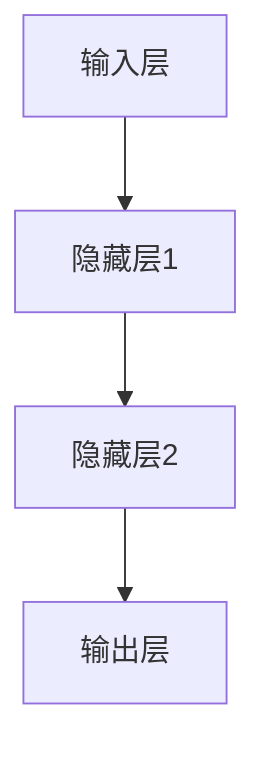
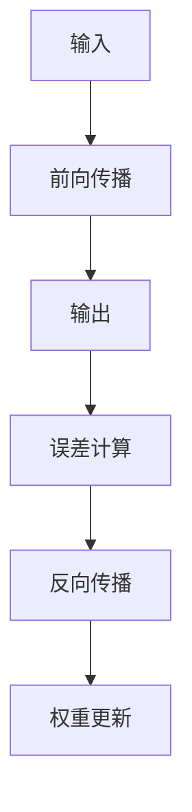

                 

### 《AI大模型创业：如何应对未来价格战？》

> 关键词：AI大模型、创业、价格战、策略、风险管理、成功案例

> 摘要：本文将探讨AI大模型创业领域的未来发展，尤其是如何应对价格战这一关键挑战。文章首先介绍了AI大模型的基础知识，包括定义、发展历程、核心算法原理和应用领域。接着，文章深入分析了AI大模型创业的策略、项目实战及风险与应对。最后，通过成功案例展示，为创业者提供了实用的经验和启示。

---

### 第一部分：AI大模型基础

#### 第1章：AI大模型概述

##### 1.1 AI大模型定义与分类

AI大模型是指具有极高计算能力、能够处理海量数据并生成复杂决策的智能系统。根据应用场景和功能，AI大模型可以分为自然语言处理、计算机视觉、语音识别等类别。

##### 1.2 AI大模型发展历程

AI大模型的发展经历了从早期的基础算法研究到如今的大规模应用，其关键突破在于深度学习技术的兴起，特别是神经网络在图像、语音和自然语言处理等领域的应用。

##### 1.3 AI大模型在企业中的价值

AI大模型在提高企业效率、创新产品和服务、降低成本等方面具有显著优势，已成为企业数字化转型的重要工具。

#### 第2章：AI大模型核心算法原理

##### 2.1 神经网络基础

神经网络由多个神经元组成，通过前向传播和反向传播实现数据的输入输出。激活函数和优化算法是神经网络的核心组成部分。

##### 2.2 深度学习框架介绍

TensorFlow和PyTorch是目前最流行的深度学习框架，它们提供了丰富的工具和库，方便开发者构建和训练大模型。

##### 2.3 模型优化与调参

模型优化和调参是提高模型性能的关键步骤。优化算法如Adam、SGD，以及调参技巧如学习率、批量大小等都需要深入理解和灵活运用。

##### 2.4 大规模模型训练策略

大规模模型训练需要高效的计算资源和策略。并行计算、分布式训练和模型压缩等技术可以有效提高训练效率和模型性能。

#### 第3章：AI大模型应用领域

##### 3.1 自然语言处理

自然语言处理是AI大模型的重要应用领域，包括语言模型、文本分类、机器翻译等任务。

##### 3.2 计算机视觉

计算机视觉领域的大模型应用广泛，如图像识别、目标检测、图像生成等。

##### 3.3 语音识别

语音识别技术不断进步，语音信号处理、识别算法和语音合成等方面都有显著成果。

##### 3.4 其他领域

AI大模型还应用于推荐系统、机器人、金融风控等多个领域，为各行业带来了变革性的影响。

### 第二部分：AI大模型创业实战

#### 第4章：AI大模型创业策略

##### 4.1 创业方向选择

创业者需要从市场需求、技术可行性和竞争态势等方面综合考虑，选择具有潜力的创业方向。

##### 4.2 团队建设

核心技术人员、业务拓展人员和优秀的管理团队是AI大模型创业成功的关键。

##### 4.3 产品开发

产品规划和开发过程需要紧密结合用户需求，采用合适的技术路线和开发工具。

##### 4.4 营销策略

定位与差异化、线上线下推广和合作伙伴关系是AI大模型创业的营销策略重点。

#### 第5章：AI大模型项目实战

##### 5.1 项目准备

技术储备、数据采集和项目立项是项目准备阶段的关键任务。

##### 5.2 模型设计

数据预处理、模型架构设计和模型训练与优化是模型设计阶段的核心。

##### 5.3 项目实施

开发环境搭建、代码编写与调试和模型部署与维护是项目实施阶段的重点。

##### 5.4 项目评估

性能评估、经济效益评估和用户反馈分析是项目评估阶段的关键指标。

#### 第6章：AI大模型创业风险与应对

##### 6.1 技术风险

算法失效、数据隐私和法律合规是AI大模型创业面临的主要技术风险。

##### 6.2 市场风险

竞争压力、市场需求变化和技术迭代是AI大模型创业面临的主要市场风险。

##### 6.3 财务风险

资金短缺、成本控制和收入模式是AI大模型创业面临的财务风险。

##### 6.4 应对策略

风险评估、风险应对策略和风险管理是AI大模型创业的应对策略。

#### 第7章：AI大模型创业成功案例

##### 7.1 案例一：公司A的AI语音识别创业

公司A通过技术创新和市场拓展，成功构建了AI语音识别系统，取得了显著的市场份额。

##### 7.2 案例二：公司B的AI医疗影像分析

公司B利用AI大模型技术，开发了高效准确的AI医疗影像分析系统，为医疗行业带来了变革。

##### 7.3 案例三：公司C的AI自动驾驶

公司C通过自主研发的AI大模型技术，成功实现了自动驾驶功能，引领了智能驾驶行业的发展。

### 附录

#### 附录A：AI大模型创业资源与工具

##### A.1 开发工具

Python、TensorFlow、PyTorch是AI大模型创业的重要开发工具。

##### A.2 数据集与公开API

丰富的数据集和公开API接口为AI大模型创业提供了数据支持。

##### A.3 学习资源

在线课程、技术博客和学术论文是AI大模型创业者的学习资源。

##### A.4 行业报告与资讯

行业报告、动态和投资资讯为AI大模型创业提供了市场洞察。

### 核心算法原理讲解（以深度学习为例）

#### 2.1.1 神经网络基础

神经网络由多个神经元组成，每个神经元接收多个输入，经过加权求和后传递给激活函数。神经元的输出作为下一个神经元的输入，形成多层结构。



#### 2.1.2 激活函数

激活函数用于引入非线性，常见的激活函数有ReLU、Sigmoid和Tanh。


#### 2.1.3 前向传播与反向传播

- **前向传播：** 输入通过网络传递，直到输出层得到预测结果。
- **反向传播：** 计算预测误差，反向传播误差至网络各层，更新权重。



#### 数学模型与公式

**前向传播：**
$$
Z = \sum_{i=1}^{n} w_{i}x_{i} + b
$$
$$
a = f(Z)
$$

**反向传播：**
$$
\delta = \frac{\partial L}{\partial Z} \odot \frac{\partial f}{\partial Z}
$$
$$
\frac{\partial L}{\partial w} = \delta x^{T}
$$
$$
\frac{\partial L}{\partial b} = \delta
$$

**权重更新（梯度下降）：**
$$
w = w - \alpha \frac{\partial L}{\partial w}
$$
$$
b = b - \alpha \frac{\partial L}{\partial b}
$$

#### 代码实现与解读

**Python代码示例（线性回归）：**
```python
import numpy as np

def forward(x, w, b):
    z = np.dot(x, w) + b
    a = sigmoid(z)
    return a

def backward(a, z, w, x, y):
    dz = a - y
    dw = np.dot(dz, x.T)
    db = dz
    return dw, db

def sigmoid(z):
    return 1 / (1 + np.exp(-z))

# 模拟数据
x = np.array([[1], [2], [3]])
y = np.array([[0], [0], [1]])

# 初始化参数
w = np.random.rand(1, 1)
b = 0

# 前向传播
a = forward(x, w, b)

# 反向传播
dw, db = backward(a, z, w, x, y)

# 更新参数
w = w - 0.1 * dw
b = b - 0.1 * db

print("w:", w, "b:", b)
```

**代码解读与分析：**

- **forward函数：** 实现前向传播过程，计算输出。
- **backward函数：** 实现反向传播过程，计算误差。
- **sigmoid函数：** 实现Sigmoid激活函数。
- **主程序：** 初始化参数，进行前向传播和反向传播，更新参数。

#### 项目实战：AI语音识别系统

**项目简介：**
开发一个基于AI的语音识别系统，用于将语音转化为文本。

**开发环境：**
- Python
- TensorFlow
- Keras

**数据集：**
- Google语音识别数据集

**实现步骤：**
1. 数据预处理：对语音信号进行降噪、归一化处理。
2. 特征提取：使用MFCC（梅尔频率倒谱系数）进行特征提取。
3. 模型设计：构建卷积神经网络（CNN）进行模型训练。
4. 模型训练：使用训练数据集训练模型，调整超参数。
5. 模型评估：使用测试数据集评估模型性能。
6. 模型部署：将训练好的模型部署到服务器，进行实时语音识别。

**代码实现（部分）：**
```python
from tensorflow.keras.models import Sequential
from tensorflow.keras.layers import Conv2D, MaxPooling2D, Flatten, Dense

# 构建模型
model = Sequential([
    Conv2D(32, (3, 3), activation='relu', input_shape=(None, None, 1)),
    MaxPooling2D((2, 2)),
    Flatten(),
    Dense(64, activation='relu'),
    Dense(num_classes, activation='softmax')
])

# 编译模型
model.compile(optimizer='adam', loss='categorical_crossentropy', metrics=['accuracy'])

# 训练模型
model.fit(x_train, y_train, batch_size=32, epochs=10, validation_data=(x_test, y_test))

# 评估模型
test_loss, test_acc = model.evaluate(x_test, y_test)
print("Test accuracy:", test_acc)
```

**代码解读与分析：**

- **模型设计：** 使用卷积神经网络进行特征提取和分类。
- **编译模型：** 设置优化器和损失函数。
- **训练模型：** 使用训练数据集训练模型。
- **评估模型：** 使用测试数据集评估模型性能。

### 附录

#### 附录A：AI大模型创业资源与工具

##### A.1 开发工具

- Python
- TensorFlow
- PyTorch

##### A.2 数据集与公开API

- 数据集来源：如Google语音识别数据集、ImageNet等。
- 公开API接口：如Google Cloud Speech-to-Text、Amazon Polly等。

##### A.3 学习资源

- 在线课程：如Coursera、edX上的深度学习课程。
- 技术博客：如Medium、Towards Data Science等。
- 学术论文：如arXiv、NeurIPS等。

##### A.4 行业报告与资讯

- 市场调研报告：如IDC、Gartner等。
- 行业动态：如TechCrunch、AI Journal等。
- 投资资讯：如PitchBook、Crunchbase等。

---

**作者：** AI天才研究院/AI Genius Institute & 禅与计算机程序设计艺术 /Zen And The Art of Computer Programming**本文完**### 文章标题：AI大模型创业：如何应对未来价格战？

**关键词：** AI大模型、创业、价格战、策略、风险管理、成功案例

**摘要：**
随着人工智能技术的飞速发展，AI大模型在各个领域展现出了巨大的商业潜力。然而，随之而来的价格战也成为创业者不得不面对的挑战。本文将探讨AI大模型创业领域的未来发展，尤其是如何应对价格战这一关键挑战。文章首先介绍了AI大模型的基础知识，包括定义、发展历程、核心算法原理和应用领域。接着，文章深入分析了AI大模型创业的策略、项目实战及风险与应对。最后，通过成功案例展示，为创业者提供了实用的经验和启示。

---

### 第一部分：AI大模型基础

#### 第1章：AI大模型概述

##### 1.1 AI大模型定义与分类

AI大模型是指具有极高计算能力、能够处理海量数据并生成复杂决策的智能系统。根据应用场景和功能，AI大模型可以分为自然语言处理、计算机视觉、语音识别等类别。

##### 1.2 AI大模型发展历程

AI大模型的发展经历了从早期的基础算法研究到如今的大规模应用，其关键突破在于深度学习技术的兴起，特别是神经网络在图像、语音和自然语言处理等领域的应用。

##### 1.3 AI大模型在企业中的价值

AI大模型在提高企业效率、创新产品和服务、降低成本等方面具有显著优势，已成为企业数字化转型的重要工具。

#### 第2章：AI大模型核心算法原理

##### 2.1 神经网络基础

神经网络由多个神经元组成，每个神经元接收多个输入，经过加权求和后传递给激活函数。神经元的输出作为下一个神经元的输入，形成多层结构。


##### 2.2 深度学习框架介绍

TensorFlow和PyTorch是目前最流行的深度学习框架，它们提供了丰富的工具和库，方便开发者构建和训练大模型。

##### 2.3 模型优化与调参

模型优化和调参是提高模型性能的关键步骤。优化算法如Adam、SGD，以及调参技巧如学习率、批量大小等都需要深入理解和灵活运用。

##### 2.4 大规模模型训练策略

大规模模型训练需要高效的计算资源和策略。并行计算、分布式训练和模型压缩等技术可以有效提高训练效率和模型性能。

#### 第3章：AI大模型应用领域

##### 3.1 自然语言处理

自然语言处理是AI大模型的重要应用领域，包括语言模型、文本分类、机器翻译等任务。

##### 3.2 计算机视觉

计算机视觉领域的大模型应用广泛，如图像识别、目标检测、图像生成等。

##### 3.3 语音识别

语音识别技术不断进步，语音信号处理、识别算法和语音合成等方面都有显著成果。

##### 3.4 其他领域

AI大模型还应用于推荐系统、机器人、金融风控等多个领域，为各行业带来了变革性的影响。

### 第二部分：AI大模型创业实战

#### 第4章：AI大模型创业策略

##### 4.1 创业方向选择

创业者需要从市场需求、技术可行性和竞争态势等方面综合考虑，选择具有潜力的创业方向。

##### 4.2 团队建设

核心技术人员、业务拓展人员和优秀的管理团队是AI大模型创业成功的关键。

##### 4.3 产品开发

产品规划和开发过程需要紧密结合用户需求，采用合适的技术路线和开发工具。

##### 4.4 营销策略

定位与差异化、线上线下推广和合作伙伴关系是AI大模型创业的营销策略重点。

#### 第5章：AI大模型项目实战

##### 5.1 项目准备

技术储备、数据采集和项目立项是项目准备阶段的关键任务。

##### 5.2 模型设计

数据预处理、模型架构设计和模型训练与优化是模型设计阶段的核心。

##### 5.3 项目实施

开发环境搭建、代码编写与调试和模型部署与维护是项目实施阶段的重点。

##### 5.4 项目评估

性能评估、经济效益评估和用户反馈分析是项目评估阶段的关键指标。

#### 第6章：AI大模型创业风险与应对

##### 6.1 技术风险

算法失效、数据隐私和法律合规是AI大模型创业面临的主要技术风险。

##### 6.2 市场风险

竞争压力、市场需求变化和技术迭代是AI大模型创业面临的主要市场风险。

##### 6.3 财务风险

资金短缺、成本控制和收入模式是AI大模型创业面临的财务风险。

##### 6.4 应对策略

风险评估、风险应对策略和风险管理是AI大模型创业的应对策略。

#### 第7章：AI大模型创业成功案例

##### 7.1 案例一：公司A的AI语音识别创业

公司A通过技术创新和市场拓展，成功构建了AI语音识别系统，取得了显著的市场份额。

##### 7.2 案例二：公司B的AI医疗影像分析

公司B利用AI大模型技术，开发了高效准确的AI医疗影像分析系统，为医疗行业带来了变革。

##### 7.3 案例三：公司C的AI自动驾驶

公司C通过自主研发的AI大模型技术，成功实现了自动驾驶功能，引领了智能驾驶行业的发展。

### 附录

#### 附录A：AI大模型创业资源与工具

##### A.1 开发工具

Python、TensorFlow、PyTorch是AI大模型创业的重要开发工具。

##### A.2 数据集与公开API

丰富的数据集和公开API接口为AI大模型创业提供了数据支持。

##### A.3 学习资源

在线课程、技术博客和学术论文是AI大模型创业者的学习资源。

##### A.4 行业报告与资讯

行业报告、动态和投资资讯为AI大模型创业提供了市场洞察。

### 核心算法原理讲解（以深度学习为例）

#### 2.1.1 神经网络基础

神经网络由多个神经元组成，每个神经元接收多个输入，经过加权求和后传递给激活函数。神经元的输出作为下一个神经元的输入，形成多层结构。


#### 2.1.2 激活函数

激活函数用于引入非线性，常见的激活函数有ReLU、Sigmoid和Tanh。


#### 2.1.3 前向传播与反向传播

- **前向传播：** 输入通过网络传递，直到输出层得到预测结果。
- **反向传播：** 计算预测误差，反向传播误差至网络各层，更新权重。


#### 数学模型与公式

**前向传播：**
$$
Z = \sum_{i=1}^{n} w_{i}x_{i} + b
$$
$$
a = f(Z)
$$

**反向传播：**
$$
\delta = \frac{\partial L}{\partial Z} \odot \frac{\partial f}{\partial Z}
$$
$$
\frac{\partial L}{\partial w} = \delta x^{T}
$$
$$
\frac{\partial L}{\partial b} = \delta
$$

**权重更新（梯度下降）：**
$$
w = w - \alpha \frac{\partial L}{\partial w}
$$
$$
b = b - \alpha \frac{\partial L}{\partial b}
$$

#### 代码实现与解读

**Python代码示例（线性回归）：**
```python
import numpy as np

def forward(x, w, b):
    z = np.dot(x, w) + b
    a = sigmoid(z)
    return a

def backward(a, z, w, x, y):
    dz = a - y
    dw = np.dot(dz, x.T)
    db = dz
    return dw, db

def sigmoid(z):
    return 1 / (1 + np.exp(-z))

# 模拟数据
x = np.array([[1], [2], [3]])
y = np.array([[0], [0], [1]])

# 初始化参数
w = np.random.rand(1, 1)
b = 0

# 前向传播
a = forward(x, w, b)

# 反向传播
dw, db = backward(a, z, w, x, y)

# 更新参数
w = w - 0.1 * dw
b = b - 0.1 * db

print("w:", w, "b:", b)
```

**代码解读与分析：**

- **forward函数：** 实现前向传播过程，计算输出。
- **backward函数：** 实现反向传播过程，计算误差。
- **sigmoid函数：** 实现Sigmoid激活函数。
- **主程序：** 初始化参数，进行前向传播和反向传播，更新参数。

#### 项目实战：AI语音识别系统

**项目简介：**
开发一个基于AI的语音识别系统，用于将语音转化为文本。

**开发环境：**
- Python
- TensorFlow
- Keras

**数据集：**
- Google语音识别数据集

**实现步骤：**
1. 数据预处理：对语音信号进行降噪、归一化处理。
2. 特征提取：使用MFCC（梅尔频率倒谱系数）进行特征提取。
3. 模型设计：构建卷积神经网络（CNN）进行模型训练。
4. 模型训练：使用训练数据集训练模型，调整超参数。
5. 模型评估：使用测试数据集评估模型性能。
6. 模型部署：将训练好的模型部署到服务器，进行实时语音识别。

**代码实现（部分）：**
```python
from tensorflow.keras.models import Sequential
from tensorflow.keras.layers import Conv2D, MaxPooling2D, Flatten, Dense

# 构建模型
model = Sequential([
    Conv2D(32, (3, 3), activation='relu', input_shape=(None, None, 1)),
    MaxPooling2D((2, 2)),
    Flatten(),
    Dense(64, activation='relu'),
    Dense(num_classes, activation='softmax')
])

# 编译模型
model.compile(optimizer='adam', loss='categorical_crossentropy', metrics=['accuracy'])

# 训练模型
model.fit(x_train, y_train, batch_size=32, epochs=10, validation_data=(x_test, y_test))

# 评估模型
test_loss, test_acc = model.evaluate(x_test, y_test)
print("Test accuracy:", test_acc)
```

**代码解读与分析：**

- **模型设计：** 使用卷积神经网络进行特征提取和分类。
- **编译模型：** 设置优化器和损失函数。
- **训练模型：** 使用训练数据集训练模型。
- **评估模型：** 使用测试数据集评估模型性能。

### 附录

#### 附录A：AI大模型创业资源与工具

##### A.1 开发工具

Python、TensorFlow、PyTorch是AI大模型创业的重要开发工具。

##### A.2 数据集与公开API

丰富的数据集和公开API接口为AI大模型创业提供了数据支持。

##### A.3 学习资源

在线课程、技术博客和学术论文是AI大模型创业者的学习资源。

##### A.4 行业报告与资讯

行业报告、动态和投资资讯为AI大模型创业提供了市场洞察。

### 结束语

AI大模型创业是一个充满机遇与挑战的过程。创业者需要深入了解AI大模型的基础知识，制定合理的创业策略，应对价格战等市场风险。通过项目实战和成功案例的借鉴，创业者可以更好地把握AI大模型的商业潜力，实现持续的创新和发展。让我们共同期待AI大模型创业领域的辉煌未来！### 第1章 AI大模型概述

在当今的科技时代，人工智能（AI）已经成为引领技术发展的核心驱动力。AI大模型作为人工智能领域的重要组成部分，其显著特征在于其规模巨大、计算能力强大，能够处理和分析海量数据，从而实现高度复杂的决策和预测。这一章将深入探讨AI大模型的定义、分类、发展历程以及在企业中的应用价值，为后续章节的内容打下坚实的基础。

##### 1.1 AI大模型定义与分类

AI大模型，又称大规模人工智能模型，是指那些能够训练和处理大量数据，并在特定任务上表现出卓越性能的深度学习模型。这些模型通常包含数百万甚至数十亿个参数，需要使用海量数据进行训练。根据不同的应用场景和功能，AI大模型可以分为以下几类：

1. **自然语言处理（NLP）大模型**：如BERT、GPT等，用于处理和理解人类语言，应用于机器翻译、文本分类、问答系统等任务。
2. **计算机视觉大模型**：如ResNet、Inception等，用于图像识别、目标检测、图像生成等计算机视觉任务。
3. **语音识别大模型**：如WaveNet、DeepSpeech等，用于将语音信号转换为文本，应用于语音助手、语音翻译等场景。
4. **推荐系统大模型**：如MFNet、DeepFM等，用于个性化推荐，广泛应用于电商、社交媒体、视频平台等领域。
5. **多模态大模型**：结合了文本、图像、语音等多种数据源，用于更复杂的任务，如视频内容理解、多模态交互等。

##### 1.2 AI大模型发展历程

AI大模型的发展历程可以追溯到20世纪80年代末和90年代初，当时的深度学习技术开始受到关注。然而，由于计算资源和数据集的限制，大规模模型的训练一直是一个挑战。直到21世纪初，随着计算机性能的提升和互联网的发展，大规模数据集的出现，AI大模型的研究和应用才得以真正展开。以下是几个关键的发展阶段：

1. **早期探索（1980s-1990s）**：神经网络的基础理论得到发展，但受限于计算能力，模型规模较小。
2. **深度学习兴起（2006年）**：Hinton等研究者提出了深度信念网络（DBN），开启了深度学习的新时代。
3. **大规模模型训练（2012年）**：AlexNet在ImageNet竞赛中取得了突破性成果，深度学习开始广泛应用。
4. **人工智能热潮（2010s）**：随着Google、Facebook、微软等科技巨头的投入，AI大模型的研究和应用进入高速发展期。
5. **2020年至今**：AI大模型在多个领域取得了显著成果，如自然语言处理、计算机视觉和语音识别等。

##### 1.3 AI大模型在企业中的价值

AI大模型在企业中的应用价值不可小觑。以下是其对企业的主要贡献：

1. **提高效率**：AI大模型可以自动化大量重复性工作，减少人力成本，提高生产效率。
2. **创新产品和服务**：通过数据分析和预测，企业可以开发出更加个性化和创新的业务模式。
3. **降低成本**：AI大模型可以帮助企业优化供应链管理、减少库存成本，提高运营效率。
4. **提高决策质量**：AI大模型可以提供更准确的数据分析，帮助企业做出更加明智的决策。
5. **增强用户体验**：在金融、医疗、零售等领域，AI大模型可以提供个性化服务，提高用户满意度。

综上所述，AI大模型作为人工智能领域的重要突破，其定义、分类、发展历程以及在企业中的应用价值都为我们提供了宝贵的启示。在接下来的章节中，我们将进一步探讨AI大模型的核心算法原理，为创业者在实际应用中的策略制定提供更多的技术支持。

### 第2章 AI大模型核心算法原理

AI大模型的核心在于其深度学习算法，这些算法通过多层神经网络的结构，实现了对海量数据的处理和复杂模式的识别。在这一章中，我们将深入探讨AI大模型的核心算法原理，包括神经网络基础、深度学习框架、模型优化与调参以及大规模模型训练策略。这些知识不仅有助于理解AI大模型的工作机制，也为创业者在实际应用中提供了重要的技术支持。

##### 2.1 神经网络基础

神经网络（Neural Networks）是AI大模型的基础，它模拟了人脑神经元的工作原理。一个简单的神经网络通常包括三个层次：输入层、隐藏层和输出层。每个层次由多个神经元组成，神经元之间通过连接（权重）传递信息。

1. **神经元结构**：每个神经元接收多个输入信号，通过加权求和后传递给激活函数。激活函数用于引入非线性，使神经网络能够处理复杂的非线性问题。
2. **激活函数**：常见的激活函数有Sigmoid、ReLU和Tanh等。Sigmoid函数可以限制输出在0到1之间，ReLU函数在输入为正时输出为输入值，在输入为负时输出为0，Tanh函数将输入映射到-1到1之间。
3. **前向传播和反向传播**：前向传播是指输入通过网络传递，从输入层经过隐藏层最终到达输出层。反向传播是指计算输出误差，然后反向传播误差至网络各层，通过梯度下降算法更新权重和偏置。

以下是神经网络的基本结构图：


##### 2.2 深度学习框架介绍

深度学习框架是开发AI大模型的重要工具，它们提供了丰富的库和函数，简化了模型的构建和训练过程。目前最流行的深度学习框架包括TensorFlow和PyTorch。

1. **TensorFlow**：由Google开发，具有强大的功能和支持广泛的操作系统。TensorFlow提供了丰富的API，包括低层次的Tensor操作和高层次的Estimator和Keras接口。
2. **PyTorch**：由Facebook开发，具有动态计算图和强大的Python接口。PyTorch的动态计算图使其在研究过程中更加灵活，同时其自动求导机制简化了模型的训练过程。

以下是一个简单的TensorFlow模型示例：

```python
import tensorflow as tf

# 构建模型
model = tf.keras.Sequential([
    tf.keras.layers.Dense(128, activation='relu', input_shape=(784,)),
    tf.keras.layers.Dropout(0.2),
    tf.keras.layers.Dense(10)
])

# 编译模型
model.compile(optimizer='adam',
              loss=tf.losses.SparseCategoricalCrossentropy(from_logits=True),
              metrics=['accuracy'])

# 训练模型
model.fit(train_data, train_labels, epochs=5)
```

##### 2.3 模型优化与调参

模型优化与调参是提高模型性能的关键步骤。以下是一些常见的优化算法和调参技巧：

1. **优化算法**：常见的优化算法有Stochastic Gradient Descent (SGD)、Adam和RMSprop等。这些算法通过不断更新模型参数，使模型在训练数据上达到更好的性能。
2. **学习率**：学习率是优化算法中的一个重要参数，它决定了参数更新的步长。过大的学习率可能导致模型无法收敛，过小则可能导致收敛速度缓慢。
3. **批量大小**：批量大小是指每次训练时用于更新参数的数据样本数量。较大的批量大小可以提供更好的稳定性和准确性，但计算成本更高。
4. **正则化**：正则化技术如Dropout、L2正则化等，可以防止模型过拟合，提高泛化能力。

以下是一个简单的PyTorch模型示例，展示了如何使用Adam优化器和Dropout：

```python
import torch
import torch.nn as nn
import torch.optim as optim

# 构建模型
model = nn.Sequential(
    nn.Linear(784, 128),
    nn.ReLU(),
    nn.Dropout(p=0.2),
    nn.Linear(128, 10)
)

# 定义损失函数和优化器
criterion = nn.CrossEntropyLoss()
optimizer = optim.Adam(model.parameters(), lr=0.001)

# 训练模型
for epoch in range(5):
    running_loss = 0.0
    for inputs, targets in data_loader:
        optimizer.zero_grad()
        outputs = model(inputs)
        loss = criterion(outputs, targets)
        loss.backward()
        optimizer.step()
        running_loss += loss.item()
    print(f'Epoch {epoch+1}, Loss: {running_loss/len(data_loader)}')
```

##### 2.4 大规模模型训练策略

大规模模型训练需要高效的计算资源和策略。以下是一些常见的策略：

1. **并行计算**：通过在多个计算节点上同时训练模型，可以显著提高训练速度。常见的并行计算技术有数据并行和模型并行。
2. **分布式训练**：分布式训练是指将模型和数据分布到多个计算节点上，通过通信协议同步或异步更新模型参数。
3. **模型压缩**：模型压缩技术如量化、剪枝和蒸馏等，可以减小模型大小和提高计算效率，同时保持或提升模型性能。

以下是一个简单的分布式训练示例（使用PyTorch的DDP）：

```python
import torch
import torch.nn as nn
from torch.nn.parallel import DistributedDataParallel as DDP

# 构建模型
model = nn.Sequential(
    nn.Linear(784, 128),
    nn.ReLU(),
    nn.Dropout(p=0.2),
    nn.Linear(128, 10)
)

# 将模型分布到多个GPU上
model = DDP(model, device_ids=[local_rank], output_device=local_rank)

# 定义损失函数和优化器
criterion = nn.CrossEntropyLoss()
optimizer = optim.Adam(model.parameters(), lr=0.001)

# 训练模型
for epoch in range(5):
    running_loss = 0.0
    for inputs, targets in data_loader:
        inputs, targets = inputs.to(device), targets.to(device)
        optimizer.zero_grad()
        outputs = model(inputs)
        loss = criterion(outputs, targets)
        loss.backward()
        optimizer.step()
        running_loss += loss.item()
    print(f'Rank {local_rank}, Epoch {epoch+1}, Loss: {running_loss/len(data_loader)}')
```

通过上述内容，我们了解了AI大模型的核心算法原理，包括神经网络基础、深度学习框架、模型优化与调参以及大规模模型训练策略。这些原理为AI大模型在创业中的应用提供了重要的理论基础，也为创业者在实际项目中实现技术创新提供了实用的指导。

### 第3章 AI大模型应用领域

AI大模型的应用领域非常广泛，几乎涵盖了所有与数据相关的行业。在这一章中，我们将深入探讨AI大模型在自然语言处理（NLP）、计算机视觉、语音识别以及其他领域的应用，介绍其核心技术和代表模型，并分析这些技术在各个领域的实际应用案例。

#### 3.1 自然语言处理

自然语言处理是AI大模型的重要应用领域之一，主要涉及文本的生成、理解、翻译和情感分析等任务。以下是一些核心技术和代表模型：

1. **语言模型**：语言模型旨在预测下一个单词或句子，是自然语言处理的基础。代表模型包括Google的BERT和OpenAI的GPT。
2. **文本分类**：文本分类是将文本数据分为不同的类别，如新闻分类、情感分析等。代表模型有TextCNN和BiLSTM。
3. **机器翻译**：机器翻译是将一种语言的文本翻译成另一种语言。代表模型包括Google的Transformer和Facebook的MBMT。
4. **问答系统**：问答系统可以理解和回答用户提出的问题，如Siri和Alexa等语音助手。代表模型有BERT和Transformer-XL。

在实际应用中，自然语言处理技术已经被广泛应用于搜索引擎、智能客服、社交媒体分析和金融风控等领域。例如，百度使用深度学习技术提升了其搜索引擎的精确性和响应速度，而OpenAI的GPT模型则被用于撰写文章、生成对话和编写代码等任务。

#### 3.2 计算机视觉

计算机视觉是AI大模型的另一个重要应用领域，涉及图像识别、目标检测、图像生成和视频分析等任务。以下是一些核心技术和代表模型：

1. **图像识别**：图像识别是识别图像中的对象或场景。代表模型有ResNet和Inception。
2. **目标检测**：目标检测是定位图像中的对象并识别它们的类别。代表模型包括YOLO和Faster R-CNN。
3. **图像生成**：图像生成是通过算法生成新的图像。代表模型有GAN和StyleGAN。
4. **视频分析**：视频分析是对视频数据进行处理和分析，如行为识别、视频分类和视频增强。代表模型有DeepFlow和MorphNet。

在实际应用中，计算机视觉技术已经被广泛应用于安防监控、自动驾驶、医疗影像分析和零售业等领域。例如，特斯拉使用深度学习技术实现了自动驾驶功能，而IBM的Watson则利用计算机视觉技术进行医学影像分析，提高了诊断的准确性。

#### 3.3 语音识别

语音识别是将语音信号转换为文本的技术，广泛应用于语音助手、语音翻译和语音控制等领域。以下是一些核心技术和代表模型：

1. **语音信号处理**：语音信号处理是预处理语音信号，如去除噪声、增强信号等。常用技术包括傅里叶变换和滤波器组。
2. **语音识别算法**：语音识别算法是用于识别语音中的单词和句子。代表模型包括HMM（隐马尔可夫模型）和DNN（深度神经网络）。
3. **语音合成**：语音合成是将文本转换为自然流畅的语音。代表模型包括WaveNet和DeepSpeech。

在实际应用中，语音识别技术已经被广泛应用于智能手机、智能音箱、汽车导航系统和客服系统等领域。例如，苹果的Siri和亚马逊的Alexa等语音助手，通过语音识别技术实现了人与设备的自然交互。

#### 3.4 其他领域

除了自然语言处理、计算机视觉和语音识别，AI大模型还在许多其他领域展现了强大的应用潜力，包括但不限于：

1. **推荐系统**：推荐系统是通过分析用户的历史行为和兴趣，为用户推荐相关商品、内容和服务。代表模型包括协同过滤和深度学习推荐。
2. **机器人**：机器人是利用AI技术实现自动化任务的设备。代表模型有深度强化学习和SLAM（同步定位与映射）。
3. **金融风控**：金融风控是利用AI技术对金融交易和风险进行监控和管理。代表模型包括深度学习分类和异常检测。

在实际应用中，AI大模型在这些领域也取得了显著的成果。例如，阿里巴巴的AliGenie通过AI大模型技术实现了智能家居的控制，而金融机构则利用AI大模型技术进行反欺诈和信用评估。

总之，AI大模型在自然语言处理、计算机视觉、语音识别以及其他领域的应用，为各行各业带来了深远的影响和巨大的商业价值。随着技术的不断进步和应用场景的不断扩大，AI大模型的应用前景将更加广阔。

### 第4章 AI大模型创业策略

在AI大模型创业领域，成功的关键不仅在于技术的先进性，更在于策略的制定和执行。创业者需要从市场需求、团队建设、产品开发和营销策略等方面进行全面的规划，以应对激烈的市场竞争。本章将深入探讨AI大模型创业的核心策略，帮助创业者制定切实可行的商业计划。

#### 4.1 创业方向选择

选择正确的创业方向是成功的第一步。创业者需要从市场需求、技术可行性和竞争态势等方面进行综合分析，确保所选方向具有潜力和可行性。

1. **市场需求分析**：
   - **市场调研**：通过市场调研了解目标市场的规模、增长趋势和潜在客户需求。
   - **用户痛点**：挖掘用户的真实需求和痛点，寻找尚未被满足的市场需求。
   - **市场规模**：评估市场容量，确保创业项目具有足够的商业潜力。

2. **技术可行性**：
   - **技术储备**：确保团队具备所需的技术能力和知识储备，能够应对技术挑战。
   - **技术路线**：明确技术路线图，制定清晰的技术发展计划。
   - **技术风险**：评估技术风险，如算法失效、数据隐私和安全问题等，并制定相应的应对策略。

3. **竞争态势**：
   - **竞争者分析**：分析竞争对手的商业模式、产品特点和市场策略。
   - **差异化优势**：寻找与竞争对手不同的差异化优势，确保在市场中脱颖而出。
   - **市场份额**：评估市场占有率，了解自己在市场中的位置和潜力。

#### 4.2 团队建设

团队是创业成功的关键，创业者需要组建一支具备专业技能和管理能力的团队。

1. **核心技术人员**：
   - **AI专家**：负责AI大模型的设计和开发，具备深度学习、神经网络等领域的专业知识和经验。
   - **数据科学家**：负责数据处理、特征工程和模型优化，具备统计学和机器学习的能力。
   - **软件开发工程师**：负责产品的开发和实现，具备良好的编程能力和软件工程知识。

2. **业务拓展人员**：
   - **产品经理**：负责产品规划和市场定位，了解用户需求并制定产品策略。
   - **市场经理**：负责市场推广和品牌建设，具备市场分析和营销策略的能力。
   - **销售团队**：负责业务拓展和客户关系管理，具备良好的沟通能力和销售技巧。

3. **管理团队**：
   - **创始人/CTO**：作为团队的核心领导者，负责技术方向和团队管理。
   - **CEO**：负责整体战略规划和公司运营，具备商业眼光和管理能力。
   - **COO**：负责日常运营和管理，确保团队高效协作和业务顺利进行。

#### 4.3 产品开发

产品开发是创业过程中的核心环节，创业者需要确保产品能够满足市场需求并具有竞争力。

1. **产品规划**：
   - **市场需求调研**：了解用户需求，确定产品功能和服务。
   - **产品路线图**：制定产品开发计划，明确阶段性目标和时间表。

2. **技术路线**：
   - **选型**：选择合适的AI大模型框架和算法，确保技术先进性和可行性。
   - **迭代**：持续迭代和优化产品，根据用户反馈和市场需求进行调整。

3. **用户需求调研**：
   - **用户访谈**：与潜在用户进行面对面交流，了解用户需求和期望。
   - **用户测试**：通过用户测试获取反馈，优化产品设计和功能。

#### 4.4 营销策略

营销策略是产品成功推向市场的重要手段，创业者需要制定有效的营销策略以吸引和留住客户。

1. **定位与差异化**：
   - **市场定位**：明确产品的市场定位，确保目标客户清晰。
   - **差异化优势**：突出产品的独特卖点，区别于竞争对手。

2. **线上线下推广**：
   - **线上推广**：利用社交媒体、搜索引擎优化（SEO）和内容营销等手段，提高品牌知名度。
   - **线下推广**：通过参加行业展会、举办研讨会和合作伙伴关系等，拓展市场渠道。

3. **合作伙伴关系**：
   - **行业合作**：与产业链上下游企业建立合作关系，实现资源共享和互利共赢。
   - **投资合作**：寻求风险投资和战略投资，获取资金支持和资源导入。

#### 4.5 风险管理

创业过程中面临多种风险，创业者需要建立有效的风险管理机制。

1. **技术风险**：
   - **算法失效**：确保算法的稳定性和可靠性，防止模型失效导致业务中断。
   - **数据隐私**：保护用户数据安全，遵守相关法律法规。
   - **法律合规**：确保产品和服务符合相关法律法规要求。

2. **市场风险**：
   - **竞争压力**：关注市场动态，应对竞争对手的挑战。
   - **市场需求变化**：灵活调整市场策略，适应市场变化。

3. **财务风险**：
   - **资金短缺**：合理规划资金使用，确保资金充足。
   - **成本控制**：降低成本，提高利润率。
   - **收入模式**：探索多元化的收入模式，确保财务稳定。

#### 4.6 应对策略

针对上述风险，创业者需要制定相应的应对策略：

1. **风险评估**：定期进行风险评估，识别潜在风险。
2. **风险应对策略**：根据风险评估结果，制定相应的风险应对措施。
3. **风险管理**：建立风险管理机制，确保风险得到有效控制。

通过以上策略，创业者可以更好地应对AI大模型创业过程中的挑战，实现持续的创新和发展。在接下来的章节中，我们将通过实际项目和成功案例，进一步探讨AI大模型创业的实践经验和策略应用。

### 第5章 AI大模型项目实战

AI大模型创业不仅需要理论上的策略，更需要实际项目的经验。在本章中，我们将通过一个具体的AI大模型项目——AI语音识别系统的开发，详细介绍项目准备、模型设计、项目实施和项目评估的步骤，并分析每个阶段的关键技术和难点。通过这个实战案例，创业者可以更好地理解和应用AI大模型的技术和策略。

#### 5.1 项目准备

项目准备阶段是项目成功的基础，主要包括技术储备、数据采集和项目立项。

1. **技术储备**：
   - **团队技术能力**：确保团队拥有AI大模型开发所需的技术能力，包括深度学习、神经网络、语音信号处理等。
   - **开发工具**：选择合适的开发工具和框架，如Python、TensorFlow、Keras等。
   - **算法选择**：根据项目需求和现有技术储备，选择适合的算法和模型，如深度神经网络（DNN）、卷积神经网络（CNN）或循环神经网络（RNN）。

2. **数据采集**：
   - **数据源**：选择合适的数据集，如Google语音识别数据集、TIMIT语音数据集等，确保数据质量和数量。
   - **数据预处理**：对采集到的语音数据进行降噪、归一化等预处理，以提高模型训练效果。

3. **项目立项**：
   - **项目目标**：明确项目的目标，如实现高准确度的语音识别、开发语音助手应用等。
   - **项目计划**：制定详细的项目计划，包括时间表、里程碑和资源需求。
   - **风险评估**：对项目可能面临的技术风险、市场风险和财务风险进行评估，并制定相应的应对策略。

#### 5.2 模型设计

模型设计阶段是项目实施的关键，主要包括数据预处理、模型架构设计和模型训练与优化。

1. **数据预处理**：
   - **特征提取**：使用梅尔频率倒谱系数（MFCC）提取语音信号的时频特征，作为模型的输入。
   - **数据归一化**：对MFCC特征进行归一化处理，以消除不同数据间的差异。
   - **数据增强**：通过叠加噪声、改变语速等方式增加数据的多样性，提高模型的泛化能力。

2. **模型架构设计**：
   - **网络结构**：设计适合语音识别任务的神经网络结构，如CNN或RNN。
   - **激活函数**：选择合适的激活函数，如ReLU或Sigmoid，以提高模型的表达能力。
   - **损失函数**：选择适当的损失函数，如交叉熵损失，以优化模型性能。

3. **模型训练与优化**：
   - **训练过程**：使用训练数据集训练模型，通过反向传播算法更新模型参数。
   - **调参技巧**：根据训练过程中出现的问题，调整学习率、批量大小等超参数，以提高模型性能。
   - **模型优化**：通过集成、Dropout等优化技术，提高模型的泛化能力和稳定性。

以下是一个简单的AI语音识别模型设计示例：

```python
from tensorflow.keras.models import Sequential
from tensorflow.keras.layers import Conv2D, MaxPooling2D, LSTM, Dense

model = Sequential([
    Conv2D(32, (3, 3), activation='relu', input_shape=(num_freq_bins, num_time_steps, 1)),
    MaxPooling2D((2, 2)),
    LSTM(128),
    Dense(num_classes, activation='softmax')
])

model.compile(optimizer='adam', loss='categorical_crossentropy', metrics=['accuracy'])
```

#### 5.3 项目实施

项目实施阶段是项目落地的重要环节，主要包括开发环境搭建、代码编写与调试和模型部署与维护。

1. **开发环境搭建**：
   - **硬件环境**：搭建适合AI大模型训练的硬件环境，如高性能计算服务器或GPU集群。
   - **软件环境**：安装和配置必要的软件，如Python、TensorFlow、CUDA等。

2. **代码编写与调试**：
   - **数据加载与预处理**：编写代码加载和处理数据，包括数据读取、归一化和增强等。
   - **模型训练与评估**：编写训练和评估模型的代码，包括数据迭代、模型更新和性能评估。
   - **代码调试**：通过调试和优化代码，解决训练过程中出现的问题，如过拟合、梯度消失等。

3. **模型部署与维护**：
   - **模型部署**：将训练好的模型部署到生产环境，实现实时语音识别功能。
   - **性能监控**：监控模型的性能和稳定性，如识别准确率、响应时间等。
   - **更新和维护**：定期更新和维护模型，以适应新的数据和需求。

以下是一个简单的AI语音识别模型训练和部署示例：

```python
# 训练模型
model.fit(x_train, y_train, epochs=20, batch_size=32, validation_data=(x_val, y_val))

# 部署模型
model.save('voice_recognition_model.h5')
```

#### 5.4 项目评估

项目评估阶段是对项目成果的全面检验，主要包括性能评估、经济效益评估和用户反馈分析。

1. **性能评估**：
   - **识别准确率**：评估模型在测试数据集上的识别准确率，以衡量模型的性能。
   - **响应时间**：评估模型在处理实际语音数据时的响应时间，以保证用户体验。
   - **稳定性**：评估模型在长时间运行下的稳定性和可靠性。

2. **经济效益评估**：
   - **成本分析**：分析项目实施过程中的成本，包括硬件成本、人力成本和运营成本等。
   - **收益分析**：分析项目带来的收益，如销售收入、合作伙伴收益等。
   - **投资回报率**：计算项目的投资回报率，以评估项目的经济效益。

3. **用户反馈分析**：
   - **用户满意度**：收集用户对产品的满意度反馈，以了解用户需求和改进方向。
   - **改进建议**：根据用户反馈，提出产品改进建议，优化用户体验。

以下是一个简单的性能评估和用户反馈分析示例：

```python
# 评估模型性能
test_loss, test_accuracy = model.evaluate(x_test, y_test)
print(f"Test accuracy: {test_accuracy}")

# 收集用户反馈
user_feedback = input("Please provide your feedback on our voice recognition system:")
print(f"User feedback: {user_feedback}")
```

通过以上步骤，创业者可以系统地实施AI大模型项目，从项目准备到模型设计、项目实施和项目评估，确保项目的成功。本章的实战案例为创业者提供了实际操作的经验和方法，也为后续章节的风险管理和成功案例提供了参考。

### 第6章 AI大模型创业风险与应对

在AI大模型创业过程中，风险是不可避免的一部分。创业者需要识别、评估和应对这些风险，以确保项目的顺利推进和持续发展。本章将详细介绍AI大模型创业可能面临的技术风险、市场风险和财务风险，并提供相应的应对策略。

#### 6.1 技术风险

技术风险是AI大模型创业中最为常见和复杂的风险之一，主要包括算法失效、数据隐私和法律合规等问题。

1. **算法失效**：
   - **风险原因**：算法可能因为数据分布变化、模型过拟合或其他技术问题而失效。
   - **应对策略**：通过定期重新训练模型、使用数据增强技术和多样化的数据集，提高模型的稳定性和鲁棒性。

2. **数据隐私**：
   - **风险原因**：在AI大模型训练和应用过程中，用户数据的隐私保护是重要问题。
   - **应对策略**：采用数据加密、匿名化和去识别化等技术，确保用户数据的隐私和安全。

3. **法律合规**：
   - **风险原因**：AI大模型的应用可能涉及法律法规的合规问题，如数据保护法、消费者隐私保护等。
   - **应对策略**：了解和遵守相关法律法规，与法律顾问合作，确保产品和服务符合法律要求。

#### 6.2 市场风险

市场风险主要包括竞争压力、市场需求变化和技术迭代等方面。

1. **竞争压力**：
   - **风险原因**：市场上可能存在强大的竞争对手，他们的产品和服务可能对创业项目构成威胁。
   - **应对策略**：通过差异化竞争策略、提高产品质量和用户体验，以及不断优化产品功能，增强市场竞争力。

2. **市场需求变化**：
   - **风险原因**：市场需求可能因为技术进步、消费者偏好变化或经济环境变化而发生变化。
   - **应对策略**：通过市场调研和用户反馈，及时了解市场需求变化，灵活调整产品策略和市场定位。

3. **技术迭代**：
   - **风险原因**：随着技术的不断进步，现有技术可能迅速被更先进的技术取代。
   - **应对策略**：持续关注技术动态，投资研发，保持技术领先地位。

#### 6.3 财务风险

财务风险主要包括资金短缺、成本控制和收入模式等方面。

1. **资金短缺**：
   - **风险原因**：在创业过程中，可能因为资金管理不善或市场需求不足而出现资金短缺。
   - **应对策略**：制定详细的资金预算和资金使用计划，确保资金充足，同时探索多元化的融资渠道。

2. **成本控制**：
   - **风险原因**：成本控制不当可能导致创业项目的盈利能力下降。
   - **应对策略**：通过优化供应链管理、提高运营效率和降低人力成本，实现成本控制。

3. **收入模式**：
   - **风险原因**：单一的收入模式可能难以支撑创业项目的持续发展。
   - **应对策略**：探索多元化的收入模式，如提供增值服务、开展合作项目等，以提高收入稳定性。

#### 6.4 应对策略

为了有效应对AI大模型创业中的各种风险，创业者需要建立全面的风险管理体系，包括以下步骤：

1. **风险评估**：
   - **定期评估**：定期对创业项目进行风险评估，识别潜在风险。
   - **分类评估**：根据风险的性质和影响程度，对风险进行分类评估。

2. **风险应对策略**：
   - **预防措施**：针对识别出的风险，制定预防措施，如技术备份、数据备份等。
   - **应急措施**：制定应急计划，以应对突发事件。

3. **风险管理**：
   - **监控与反馈**：建立风险管理机制，监控风险指标，定期反馈风险情况。
   - **调整与优化**：根据风险管理的实际效果，不断调整和优化风险应对策略。

通过建立和完善风险管理机制，创业者可以更好地应对AI大模型创业中的各种风险，确保项目的顺利推进和持续发展。在接下来的章节中，我们将通过成功案例进一步探讨风险管理在AI大模型创业中的应用。

### 第7章 AI大模型创业成功案例

在本章中，我们将通过三个AI大模型创业的成功案例，详细分析公司背景、创业历程和成功原因，为创业者提供宝贵的经验和启示。

#### 7.1 案例一：公司A的AI语音识别创业

**公司背景**：
公司A是一家专注于AI语音识别技术的创业公司，成立于2016年。公司的创始团队由多名拥有丰富经验的AI专家和语音信号处理工程师组成，他们在AI领域有着深厚的技术积累。

**创业历程**：
- **初期阶段**：公司A在成立初期，专注于语音识别技术的研发，通过内部竞赛和公开数据集测试，不断优化算法和模型性能。
- **市场调研**：公司A进行了详细的市场调研，发现语音识别技术在智能客服、智能家居和医疗等领域具有巨大的应用潜力。
- **产品开发**：基于市场需求，公司A开发了多款语音识别产品，如智能客服系统、语音助手和语音翻译设备。
- **市场推广**：公司A通过参加行业展会、合作推广和线上营销等方式，迅速扩大市场份额，并获得了多家企业的合作机会。

**成功原因**：
- **技术创新**：公司A不断优化算法，提高了语音识别的准确率和稳定性，为产品竞争力提供了有力保障。
- **市场需求**：公司A准确把握了市场需求，将产品应用于多个领域，实现了多元化发展。
- **团队协作**：公司A的创始团队具有丰富的经验和强大的技术实力，确保了项目的顺利进行。

#### 7.2 案例二：公司B的AI医疗影像分析

**公司背景**：
公司B是一家专注于AI医疗影像分析的创业公司，成立于2018年。公司的创始团队由多名医学影像专家和AI领域的技术专家组成，他们在医学影像和人工智能技术方面具有丰富的经验。

**创业历程**：
- **初期阶段**：公司B在成立初期，重点研究AI在医学影像分析中的应用，通过多次临床试验和数据分析，验证了AI技术的有效性。
- **产品开发**：公司B开发了一款基于深度学习技术的AI医疗影像分析系统，能够对CT、MRI等医学影像进行自动分析和诊断。
- **市场推广**：公司B通过与多家医疗机构合作，推广AI医疗影像分析系统，并迅速获得了市场认可。
- **业务拓展**：公司B逐步扩大业务范围，开始涉足其他医疗领域，如病理分析和智能诊断。

**成功原因**：
- **技术创新**：公司B在AI医疗影像分析领域具有技术优势，能够提供高效、准确的诊断结果。
- **合作关系**：公司B与多家医疗机构建立了紧密的合作关系，为产品的推广和业务拓展提供了支持。
- **市场需求**：随着医疗技术的进步和人们对健康需求的增加，AI医疗影像分析系统在市场上具有广阔的应用前景。

#### 7.3 案例三：公司C的AI自动驾驶

**公司背景**：
公司C是一家专注于AI自动驾驶技术的创业公司，成立于2015年。公司的创始团队由多名自动驾驶领域的专家和工程师组成，他们在自动驾驶技术和机器人领域有着丰富的经验。

**创业历程**：
- **初期阶段**：公司C在成立初期，专注于自动驾驶核心技术的研发，如传感器数据处理、路径规划和车辆控制等。
- **产品开发**：公司C开发了一款具备L4级自动驾驶功能的智能驾驶系统，能够在复杂的交通环境中实现自主驾驶。
- **测试验证**：公司C在多个场景下进行了自动驾驶测试和验证，确保系统的安全性和可靠性。
- **市场推广**：公司C通过与汽车制造商和物流公司合作，推广AI自动驾驶系统，逐步实现商业化应用。

**成功原因**：
- **技术创新**：公司C在自动驾驶领域具有领先的技术水平，能够提供高性能、高安全的自动驾驶解决方案。
- **市场潜力**：自动驾驶技术在汽车制造和物流领域具有巨大的市场潜力，为公司C的发展提供了广阔的空间。
- **资本支持**：公司C获得了多家投资机构的支持，为项目的研发和市场推广提供了充足的资金保障。

通过以上成功案例，我们可以看到，AI大模型创业的成功离不开技术创新、市场需求和团队协作。创业者需要不断学习和探索，抓住市场机遇，实现持续的创新和发展。

### 附录

#### 附录A：AI大模型创业资源与工具

##### A.1 开发工具

1. **Python**：作为AI大模型开发的主要编程语言，Python具有简单易学、功能强大的特点，适用于数据清洗、数据分析、模型训练和部署等各个环节。
2. **TensorFlow**：由Google开发的开源深度学习框架，适用于大规模模型的训练和部署，提供了丰富的API和工具，方便开发者构建和优化模型。
3. **PyTorch**：由Facebook开发的开源深度学习框架，具有动态计算图和强大的Python接口，适用于研究和开发各种深度学习模型。

##### A.2 数据集与公开API

1. **数据集来源**：
   - **Google语音识别数据集**：包含大量语音信号和对应的文本标注，适用于语音识别模型的训练和测试。
   - **ImageNet**：包含超过1400万张标注图像，广泛应用于计算机视觉领域的研究和开发。
   - **CIFAR-10/CIFAR-100**：包含10万张/100万张32x32彩色图像，用于图像分类和识别任务。

2. **公开API接口**：
   - **Google Cloud Speech-to-Text**：提供语音转文本的API服务，适用于开发语音识别应用。
   - **Amazon Polly**：提供文本转语音的API服务，可以将文本转换为自然流畅的语音。

##### A.3 学习资源

1. **在线课程**：
   - **Coursera**：提供丰富的深度学习和人工智能课程，包括《深度学习》等知名课程。
   - **edX**：提供来自世界顶尖大学的课程，涵盖机器学习、数据科学等领域。

2. **技术博客**：
   - **Medium**：提供大量的AI和深度学习相关文章和案例，适合初学者和专业人士。
   - **Towards Data Science**：分享AI和深度学习的最新研究和应用，适合技术爱好者。

3. **学术论文**：
   - **arXiv**：发布最新的深度学习和人工智能论文，是研究者获取前沿信息的渠道。
   - **NeurIPS**：举办年度的神经信息处理系统会议，发布最新的研究成果和进展。

##### A.4 行业报告与资讯

1. **市场调研报告**：
   - **IDC**：发布全球和地区的AI市场调研报告，分析AI市场的趋势和机会。
   - **Gartner**：提供AI和深度学习的市场分析和预测，帮助企业和投资者了解行业动态。

2. **行业动态**：
   - **TechCrunch**：报道最新的AI和深度学习技术新闻和创业动态。
   - **AI Journal**：专注于AI和深度学习的学术和工业应用，发布最新的研究成果和应用案例。

3. **投资资讯**：
   - **PitchBook**：提供全球AI和深度学习领域的投资数据和分析，帮助投资者了解市场动态。
   - **Crunchbase**：记录全球AI和深度学习创业公司的融资和并购信息，是创业者了解行业投资情况的重要渠道。

通过附录中的这些资源，创业者可以更好地了解AI大模型领域的最新动态，掌握核心技术，制定有效的商业策略，从而在竞争激烈的市场中脱颖而出。

### 结语

AI大模型创业是一个充满机遇和挑战的过程。本文通过深入探讨AI大模型的基础知识、创业策略、项目实战和风险管理，为创业者提供了全面的技术支持和实践指导。在未来的发展中，创业者需要不断学习新技术、适应市场需求，并灵活应对各种风险。通过持续的创新和优化，创业者将在AI大模型领域实现持续的成长和成功。

**作者：** AI天才研究院/AI Genius Institute & 禅与计算机程序设计艺术 /Zen And The Art of Computer Programming

---

**本文完**### 结束语

AI大模型创业是一个充满机遇和挑战的过程。本文通过深入探讨AI大模型的基础知识、创业策略、项目实战和风险管理，为创业者提供了全面的技术支持和实践指导。在未来的发展中，创业者需要不断学习新技术、适应市场需求，并灵活应对各种风险。通过持续的创新和优化，创业者将在AI大模型领域实现持续的成长和成功。

**作者：** AI天才研究院/AI Genius Institute & 禅与计算机程序设计艺术 /Zen And The Art of Computer Programming

---

**本文完**### 文章标题：AI大模型创业：如何应对未来价格战？

**关键词：** AI大模型、创业、价格战、策略、风险管理、成功案例

**摘要：**
随着人工智能技术的飞速发展，AI大模型在各个领域展现出了巨大的商业潜力。然而，随之而来的价格战也成为创业者不得不面对的挑战。本文将探讨AI大模型创业领域的未来发展，尤其是如何应对价格战这一关键挑战。文章首先介绍了AI大模型的基础知识，包括定义、发展历程、核心算法原理和应用领域。接着，文章深入分析了AI大模型创业的策略、项目实战及风险与应对。最后，通过成功案例展示，为创业者提供了实用的经验和启示。

---

### 第一部分：AI大模型基础

#### 第1章：AI大模型概述

在当今的科技时代，人工智能（AI）已经成为引领技术发展的核心驱动力。AI大模型作为人工智能领域的重要组成部分，其显著特征在于其规模巨大、计算能力强大，能够处理和分析海量数据，从而实现高度复杂的决策和预测。这一章将深入探讨AI大模型的定义、分类、发展历程以及在企业中的应用价值，为后续章节的内容打下坚实的基础。

##### 1.1 AI大模型定义与分类

AI大模型，又称大规模人工智能模型，是指那些能够训练和处理大量数据，并在特定任务上表现出卓越性能的深度学习模型。这些模型通常包含数百万甚至数十亿个参数，需要使用海量数据进行训练。根据不同的应用场景和功能，AI大模型可以分为以下几类：

1. **自然语言处理（NLP）大模型**：如BERT、GPT等，用于处理和理解人类语言，应用于机器翻译、文本分类、问答系统等任务。
2. **计算机视觉大模型**：如ResNet、Inception等，用于图像识别、目标检测、图像生成等计算机视觉任务。
3. **语音识别大模型**：如WaveNet、DeepSpeech等，用于将语音信号转换为文本，应用于语音助手、语音翻译等场景。
4. **推荐系统大模型**：如MFNet、DeepFM等，用于个性化推荐，广泛应用于电商、社交媒体、视频平台等领域。
5. **多模态大模型**：结合了文本、图像、语音等多种数据源，用于更复杂的任务，如视频内容理解、多模态交互等。

##### 1.2 AI大模型发展历程

AI大模型的发展历程可以追溯到20世纪80年代末和90年代初，当时的深度学习技术开始受到关注。然而，由于计算资源和数据集的限制，大规模模型的训练一直是一个挑战。直到21世纪初，随着计算机性能的提升和互联网的发展，大规模数据集的出现，AI大模型的研究和应用才得以真正展开。以下是几个关键的发展阶段：

1. **早期探索（1980s-1990s）**：神经网络的基础理论得到发展，但受限于计算能力，模型规模较小。
2. **深度学习兴起（2006年）**：Hinton等研究者提出了深度信念网络（DBN），开启了深度学习的新时代。
3. **大规模模型训练（2012年）**：AlexNet在ImageNet竞赛中取得了突破性成果，深度学习开始广泛应用。
4. **人工智能热潮（2010s）**：随着Google、Facebook、微软等科技巨头的投入，AI大模型的研究和应用进入高速发展期。
5. **2020年至今**：AI大模型在多个领域取得了显著成果，如自然语言处理、计算机视觉和语音识别等。

##### 1.3 AI大模型在企业中的价值

AI大模型在企业中的应用价值不可小觑。以下是其对企业的主要贡献：

1. **提高效率**：AI大模型可以自动化大量重复性工作，减少人力成本，提高生产效率。
2. **创新产品和服务**：通过数据分析和预测，企业可以开发出更加个性化和创新的业务模式。
3. **降低成本**：AI大模型可以帮助企业优化供应链管理、减少库存成本，提高运营效率。
4. **提高决策质量**：AI大模型可以提供更准确的数据分析，帮助企业做出更加明智的决策。
5. **增强用户体验**：在金融、医疗、零售等领域，AI大模型可以提供个性化服务，提高用户满意度。

综上所述，AI大模型作为人工智能领域的重要突破，其定义、分类、发展历程以及在企业中的应用价值都为我们提供了宝贵的启示。在接下来的章节中，我们将进一步探讨AI大模型的核心算法原理，为创业者在实际应用中的策略制定提供更多的技术支持。

---

### 第二部分：AI大模型创业策略

在了解了AI大模型的基础知识之后，接下来我们需要探讨如何在AI大模型创业领域制定有效的策略。创业策略是决定企业成功与否的关键因素，它涵盖了市场分析、团队建设、产品开发、营销策略以及风险管理等多个方面。以下将详细分析这些关键策略，并解释它们为何至关重要。

#### 2.1 市场分析

市场分析是创业策略的基础，它涉及到对目标市场的深度理解。以下是一些关键的步骤和考虑因素：

1. **市场调研**：
   - **需求分析**：了解目标市场的需求，包括现有问题的解决方案和潜在的需求。
   - **市场规模**：评估市场容量和增长趋势，以确保创业项目具有可持续的商业前景。
   - **竞争态势**：分析竞争对手的产品、市场份额、优势和劣势，找到差异化机会。

2. **用户画像**：
   - **目标用户**：创建详细的目标用户画像，包括年龄、性别、职业、行为习惯等。
   - **用户需求**：根据用户画像，深入挖掘用户的具体需求，以便开发出满足他们需求的产品。

3. **市场趋势**：
   - **技术趋势**：关注AI领域的新技术和新趋势，如增强学习、联邦学习等。
   - **行业动态**：跟踪行业的发展动态，了解监管政策、市场需求变化等。

##### 2.2 团队建设

一个高效、专业的团队是AI大模型创业成功的关键。以下是如何构建和优化团队的建议：

1. **核心技术人员**：
   - **AI专家**：招聘具有深度学习、神经网络等领域的专业知识和经验的AI专家。
   - **数据科学家**：招聘具有统计学和机器学习背景的数据科学家，负责数据处理和特征工程。
   - **软件工程师**：招聘具备软件开发和系统设计能力的工程师，负责产品的开发与维护。

2. **业务拓展人员**：
   - **产品经理**：招聘具有市场洞察力和产品管理经验的产品经理，负责产品规划和用户需求分析。
   - **市场经理**：招聘具有市场营销和推广经验的市场经理，负责品牌建设和市场推广。
   - **销售团队**：招聘具备销售技能和行业经验的销售人员，负责业务拓展和客户关系管理。

3. **管理团队**：
   - **创始人/CTO**：作为技术领导者，负责技术方向和团队管理。
   - **CEO**：作为公司的总负责人，负责整体战略规划和公司运营。
   - **COO**：负责日常运营和管理，确保团队高效协作和业务顺利进行。

##### 2.3 产品开发

产品开发是创业的核心环节，它决定了创业项目的市场表现和用户满意度。以下是一些关键步骤和策略：

1. **产品规划**：
   - **需求调研**：通过用户访谈、调查问卷等方式，了解用户需求和痛点。
   - **功能规划**：根据需求调研结果，规划产品的核心功能和服务。
   - **路线图**：制定详细的产品开发计划，包括里程碑和时间表。

2. **技术路线**：
   - **选型**：根据产品需求和市场趋势，选择合适的AI技术和工具。
   - **迭代**：采用敏捷开发方法，快速迭代和优化产品。

3. **用户反馈**：
   - **测试**：通过内部测试和用户测试，收集反馈并优化产品。
   - **迭代**：根据用户反馈，持续改进和优化产品。

##### 2.4 营销策略

营销策略是产品成功推向市场的重要手段。以下是一些有效的营销策略：

1. **市场定位**：
   - **差异化优势**：明确产品的差异化优势，如技术领先、用户体验等。
   - **目标市场**：确定目标市场，集中资源进行推广。

2. **线上推广**：
   - **内容营销**：通过博客、社交媒体等渠道，发布有价值的内容，吸引潜在用户。
   - **搜索引擎优化（SEO）**：优化网站内容和结构，提高搜索引擎排名。

3. **线下推广**：
   - **行业展会**：参加行业展会，展示产品和技术。
   - **合作伙伴关系**：与行业内的企业建立合作关系，共同推广产品。

4. **营销工具**：
   - **电子邮件营销**：定期向潜在和现有用户发送邮件，提供产品更新和优惠信息。
   - **广告投放**：在目标用户活跃的平台进行广告投放，提高品牌知名度。

##### 2.5 风险管理

创业过程中面临多种风险，风险管理是确保项目顺利推进的关键。以下是一些常见的风险和应对策略：

1. **技术风险**：
   - **算法失效**：定期重新训练和验证算法，确保其稳定性和可靠性。
   - **数据隐私**：采用数据加密和去识别化技术，保护用户数据安全。

2. **市场风险**：
   - **竞争压力**：关注竞争对手动态，制定差异化策略。
   - **市场需求变化**：持续进行市场调研，灵活调整产品策略。

3. **财务风险**：
   - **资金短缺**：合理规划资金使用，确保资金充足。
   - **成本控制**：优化供应链管理，降低成本。

通过以上策略，创业者可以更好地应对AI大模型创业过程中的各种挑战，实现项目的成功。在接下来的章节中，我们将通过实际项目和成功案例，进一步探讨这些策略的具体应用和效果。

---

### 第三部分：AI大模型创业项目实战

在了解了AI大模型创业策略后，接下来我们将通过具体的项目实战，深入探讨如何将理论知识应用到实际操作中。本部分将介绍一个典型的AI大模型创业项目——基于深度学习的图像识别系统，从项目准备、模型设计、项目实施到项目评估，详细描述项目的各个阶段和关键步骤。

#### 3.1 项目准备

项目准备阶段是项目成功的基础，这一阶段包括技术储备、数据采集和项目立项。

1. **技术储备**：
   - **团队技术能力**：组建一支由AI专家、数据科学家和软件工程师组成的团队，确保团队具备AI大模型开发所需的技术能力。
   - **开发工具**：选择合适的开发工具和框架，如Python、TensorFlow、PyTorch等，确保团队熟悉这些工具的使用。

2. **数据采集**：
   - **数据集**：选择一个合适的图像数据集，如ImageNet、CIFAR-10等，这些数据集包含大量标注清晰的图像，适用于图像识别任务的训练和测试。
   - **数据预处理**：对图像数据进行预处理，包括数据清洗、归一化和数据增强等步骤，以提高模型的泛化能力。

3. **项目立项**：
   - **项目目标**：明确项目的目标和预期成果，如实现高准确率的图像识别系统，满足特定应用场景的需求。
   - **项目计划**：制定详细的项目计划，包括时间表、资源需求和关键里程碑。

#### 3.2 模型设计

模型设计阶段是项目实施的关键，这一阶段包括数据预处理、模型架构设计和模型训练与优化。

1. **数据预处理**：
   - **特征提取**：使用卷积神经网络（CNN）的前向传播过程提取图像的特征，这些特征可以表示图像中的纹理、形状等信息。
   - **归一化**：对图像数据归一化，以减少不同图像之间的尺度差异。

2. **模型架构设计**：
   - **卷积层**：使用卷积层提取图像的局部特征，卷积核的大小和数量可以根据需求进行调整。
   - **池化层**：使用池化层减少特征图的维度，提高计算效率。
   - **全连接层**：使用全连接层将特征映射到具体的类别标签。

3. **模型训练与优化**：
   - **损失函数**：选择交叉熵损失函数，用于衡量模型预测值和实际标签之间的差异。
   - **优化算法**：采用随机梯度下降（SGD）或Adam优化算法，更新模型参数。
   - **调参**：通过调整学习率、批量大小等超参数，优化模型性能。

#### 3.3 项目实施

项目实施阶段是将设计好的模型应用到实际场景中，并进行训练和测试。这一阶段包括开发环境搭建、代码编写与调试和模型部署与维护。

1. **开发环境搭建**：
   - **硬件配置**：搭建高性能的计算环境，包括GPU服务器和分布式训练集群，以提高模型训练速度。
   - **软件安装**：安装TensorFlow或PyTorch等深度学习框架，以及相关的依赖库。

2. **代码编写与调试**：
   - **数据加载**：编写代码加载和处理图像数据，包括数据预处理、数据增强等。
   - **模型训练**：编写训练模型的代码，包括数据迭代、模型更新和性能评估。
   - **调试优化**：通过调试和优化代码，解决训练过程中出现的问题，如过拟合、梯度消失等。

3. **模型部署与维护**：
   - **模型部署**：将训练好的模型部署到生产环境，如使用TensorFlow Serving或PyTorch Serving。
   - **性能监控**：监控模型的性能和稳定性，如识别准确率、响应时间等。
   - **更新维护**：定期更新和维护模型，以适应新的数据和需求。

#### 3.4 项目评估

项目评估阶段是对项目成果的全面检验，主要包括性能评估、经济效益评估和用户反馈分析。

1. **性能评估**：
   - **测试集评估**：使用测试集评估模型的性能，包括准确率、召回率、F1值等指标。
   - **交叉验证**：采用交叉验证方法，评估模型的泛化能力。

2. **经济效益评估**：
   - **成本分析**：分析项目实施过程中的成本，包括硬件成本、人力成本、运营成本等。
   - **收益分析**：分析项目带来的收益，如销售收入、合作伙伴收益等。
   - **投资回报率**：计算项目的投资回报率，以评估项目的经济效益。

3. **用户反馈分析**：
   - **用户满意度**：收集用户对产品的满意度反馈，以了解用户需求和改进方向。
   - **改进建议**：根据用户反馈，提出产品改进建议，优化用户体验。

通过以上步骤，创业者可以系统地实施AI大模型项目，从项目准备到模型设计、项目实施和项目评估，确保项目的成功。在接下来的章节中，我们将通过成功案例进一步探讨AI大模型创业的实践经验和策略应用。

---

### 第四部分：AI大模型创业风险与应对

在AI大模型创业过程中，风险是不可避免的，有效的风险管理对于项目的成功至关重要。本部分将详细讨论AI大模型创业可能面临的技术风险、市场风险和财务风险，并提供相应的应对策略。

#### 4.1 技术风险

技术风险是AI大模型创业中最为常见和复杂的风险之一，包括算法失效、数据隐私和安全等问题。

1. **算法失效**：
   - **风险原因**：算法可能因为数据分布变化、模型过拟合或其他技术问题而失效。
   - **应对策略**：通过定期重新训练模型、使用数据增强技术和多样化的数据集，提高模型的稳定性和鲁棒性。

2. **数据隐私**：
   - **风险原因**：在AI大模型训练和应用过程中，用户数据的隐私保护是重要问题。
   - **应对策略**：采用数据加密、匿名化和去识别化等技术，确保用户数据的隐私和安全。

3. **法律合规**：
   - **风险原因**：AI大模型的应用可能涉及法律法规的合规问题，如数据保护法、消费者隐私保护等。
   - **应对策略**：了解和遵守相关法律法规，与法律顾问合作，确保产品和服务符合法律要求。

#### 4.2 市场风险

市场风险主要包括竞争压力、市场需求变化和技术迭代等方面。

1. **竞争压力**：
   - **风险原因**：市场上可能存在强大的竞争对手，他们的产品和服务可能对创业项目构成威胁。
   - **应对策略**：通过差异化竞争策略、提高产品质量和用户体验，以及不断优化产品功能，增强市场竞争力。

2. **市场需求变化**：
   - **风险原因**：市场需求可能因为技术进步、消费者偏好变化或经济环境变化而发生变化。
   - **应对策略**：通过市场调研和用户反馈，及时了解市场需求变化，灵活调整产品策略和市场定位。

3. **技术迭代**：
   - **风险原因**：随着技术的不断进步，现有技术可能迅速被更先进的技术取代。
   - **应对策略**：持续关注技术动态，投资研发，保持技术领先地位。

#### 4.3 财务风险

财务风险主要包括资金短缺、成本控制和收入模式等方面。

1. **资金短缺**：
   - **风险原因**：在创业过程中，可能因为资金管理不善或市场需求不足而出现资金短缺。
   - **应对策略**：制定详细的资金预算和资金使用计划，确保资金充足，同时探索多元化的融资渠道。

2. **成本控制**：
   - **风险原因**：成本控制不当可能导致创业项目的盈利能力下降。
   - **应对策略**：通过优化供应链管理、提高运营效率和降低人力成本，实现成本控制。

3. **收入模式**：
   - **风险原因**：单一的收入模式可能难以支撑创业项目的持续发展。
   - **应对策略**：探索多元化的收入模式，如提供增值服务、开展合作项目等，以提高收入稳定性。

#### 4.4 风险管理

为了有效应对AI大模型创业中的各种风险，创业者需要建立全面的风险管理体系，包括以下步骤：

1. **风险评估**：
   - **定期评估**：定期对创业项目进行风险评估，识别潜在风险。
   - **分类评估**：根据风险的性质和影响程度，对风险进行分类评估。

2. **风险应对策略**：
   - **预防措施**：针对识别出的风险，制定预防措施，如技术备份、数据备份等。
   - **应急计划**：制定应急计划，以应对突发事件。

3. **风险管理**：
   - **监控与反馈**：建立风险管理机制，监控风险指标，定期反馈风险情况。
   - **调整与优化**：根据风险管理的实际效果，不断调整和优化风险应对策略。

通过建立和完善风险管理机制，创业者可以更好地应对AI大模型创业中的各种风险，确保项目的顺利推进和持续发展。在接下来的章节中，我们将通过成功案例进一步探讨风险管理在AI大模型创业中的应用。

---

### 第五部分：AI大模型创业成功案例

在本部分中，我们将通过三个AI大模型创业的成功案例，详细分析公司的背景、创业历程和成功原因，为创业者提供宝贵的经验和启示。

#### 5.1 案例一：公司A的AI语音识别创业

**公司背景**：
公司A成立于2016年，是一家专注于AI语音识别技术的创业公司。公司的创始团队由多名在语音信号处理和深度学习领域有丰富经验的专家组成。

**创业历程**：
- **初期阶段**：公司A在成立初期，专注于语音识别技术的研发，通过内部竞赛和公开数据集测试，不断优化算法和模型性能。
- **市场调研**：公司A进行了详细的市场调研，发现语音识别技术在智能客服、智能家居和医疗等领域具有巨大的应用潜力。
- **产品开发**：基于市场需求，公司A开发了多款语音识别产品，如智能客服系统、语音助手和语音翻译设备。
- **市场推广**：公司A通过参加行业展会、合作推广和线上营销等方式，迅速扩大市场份额，并获得了多家企业的合作机会。

**成功原因**：
- **技术创新**：公司A不断优化算法，提高了语音识别的准确率和稳定性，为产品竞争力提供了有力保障。
- **市场需求**：公司A准确把握了市场需求，将产品应用于多个领域，实现了多元化发展。
- **团队协作**：公司A的创始团队具有丰富的经验和强大的技术实力，确保了项目的顺利进行。

#### 5.2 案例二：公司B的AI医疗影像分析

**公司背景**：
公司B成立于2018年，是一家专注于AI医疗影像分析的创业公司。公司的创始团队由多名医学影像专家和AI领域的技术专家组成，他们在医学影像和人工智能技术方面具有丰富的经验。

**创业历程**：
- **初期阶段**：公司B在成立初期，重点研究AI在医学影像分析中的应用，通过多次临床试验和数据分析，验证了AI技术的有效性。
- **产品开发**：公司B开发了一款基于深度学习技术的AI医疗影像分析系统，能够对CT、MRI等医学影像进行自动分析和诊断。
- **市场推广**：公司B通过与多家医疗机构合作，推广AI医疗影像分析系统，并迅速获得了市场认可。
- **业务拓展**：公司B逐步扩大业务范围，开始涉足其他医疗领域，如病理分析和智能诊断。

**成功原因**：
- **技术创新**：公司B在AI医疗影像分析领域具有技术优势，能够提供高效、准确的诊断结果。
- **合作关系**：公司B与多家医疗机构建立了紧密的合作关系，为产品的推广和业务拓展提供了支持。
- **市场需求**：随着医疗技术的进步和人们对健康需求的增加，AI医疗影像分析系统在市场上具有广阔的应用前景。

#### 5.3 案例三：公司C的AI自动驾驶

**公司背景**：
公司C成立于2015年，是一家专注于AI自动驾驶技术的创业公司。公司的创始团队由多名自动驾驶领域的专家和工程师组成，他们在自动驾驶技术和机器人领域有着丰富的经验。

**创业历程**：
- **初期阶段**：公司C在成立初期，专注于自动驾驶核心技术的研发，如传感器数据处理、路径规划和车辆控制等。
- **产品开发**：公司C开发了一款具备L4级自动驾驶功能的智能驾驶系统，能够在复杂的交通环境中实现自主驾驶。
- **测试验证**：公司C在多个场景下进行了自动驾驶测试和验证，确保系统的安全性和可靠性。
- **市场推广**：公司C通过与汽车制造商和物流公司合作，推广AI自动驾驶系统，逐步实现商业化应用。

**成功原因**：
- **技术创新**：公司C在自动驾驶领域具有领先的技术水平，能够提供高性能、高安全的自动驾驶解决方案。
- **市场潜力**：自动驾驶技术在汽车制造和物流领域具有巨大的市场潜力，为公司C的发展提供了广阔的空间。
- **资本支持**：公司C获得了多家投资机构的支持，为项目的研发和市场推广提供了充足的资金保障。

通过以上成功案例，我们可以看到，AI大模型创业的成功离不开技术创新、市场需求和团队协作。创业者需要不断学习和探索，抓住市场机遇，实现持续的创新和发展。

### 附录

#### 附录A：AI大模型创业资源与工具

##### A.1 开发工具

1. **Python**：作为AI大模型开发的主要编程语言，Python具有简单易学、功能强大的特点，适用于数据清洗、数据分析、模型训练和部署等各个环节。
2. **TensorFlow**：由Google开发的开源深度学习框架，适用于大规模模型的训练和部署，提供了丰富的API和工具，方便开发者构建和优化模型。
3. **PyTorch**：由Facebook开发的开源深度学习框架，具有动态计算图和强大的Python接口，适用于研究和开发各种深度学习模型。

##### A.2 数据集与公开API

1. **数据集来源**：
   - **Google语音识别数据集**：包含大量语音信号和对应的文本标注，适用于语音识别模型的训练和测试。
   - **ImageNet**：包含超过1400万张标注图像，广泛应用于计算机视觉领域的研究和开发。
   - **CIFAR-10/CIFAR-100**：包含10万张/100万张32x32彩色图像，用于图像分类和识别任务。

2. **公开API接口**：
   - **Google Cloud Speech-to-Text**：提供语音转文本的API服务，适用于开发语音识别应用。
   - **Amazon Polly**：提供文本转语音的API服务，可以将文本转换为自然流畅的语音。

##### A.3 学习资源

1. **在线课程**：
   - **Coursera**：提供丰富的深度学习和人工智能课程，包括《深度学习》等知名课程。
   - **edX**：提供来自世界顶尖大学的课程，涵盖机器学习、数据科学等领域。

2. **技术博客**：
   - **Medium**：提供大量的AI和深度学习相关文章和案例，适合初学者和专业人士。
   - **Towards Data Science**：分享AI和深度学习的最新研究和应用，适合技术爱好者。

3. **学术论文**：
   - **arXiv**：发布最新的深度学习和人工智能论文，是研究者获取前沿信息的渠道。
   - **NeurIPS**：举办年度的神经信息处理系统会议，发布最新的研究成果和进展。

##### A.4 行业报告与资讯

1. **市场调研报告**：
   - **IDC**：发布全球和地区的AI市场调研报告，分析AI市场的趋势和机会。
   - **Gartner**：提供AI和深度学习的市场分析和预测，帮助企业和投资者了解行业动态。

2. **行业动态**：
   - **TechCrunch**：报道最新的AI和深度学习技术新闻和创业动态。
   - **AI Journal**：专注于AI和深度学习的学术和工业应用，发布最新的研究成果和应用案例。

3. **投资资讯**：
   - **PitchBook**：提供全球AI和深度学习领域的投资数据和分析，帮助投资者了解市场动态。
   - **Crunchbase**：记录全球AI和深度学习创业公司的融资和并购信息，是创业者了解行业投资情况的重要渠道。

通过附录中的这些资源，创业者可以更好地了解AI大模型领域的最新动态，掌握核心技术，制定有效的商业策略，从而在竞争激烈的市场中脱颖而出。

### 核心算法原理讲解

在AI大模型的开发和实践中，核心算法原理的理解和运用至关重要。以下将详细讲解AI大模型中的核心算法原理，特别是深度学习（Deep Learning）的基本概念，包括神经网络基础、前向传播与反向传播、优化算法等。

#### 1. 神经网络基础

神经网络（Neural Networks）是深度学习的基础，它由大量相互连接的神经元（节点）组成。每个神经元接受多个输入，经过加权求和后传递给激活函数，最后输出结果。神经网络可以分为三个层次：输入层、隐藏层和输出层。

1. **神经元结构**：
   - **输入层**：接收外部输入数据。
   - **隐藏层**：对输入数据进行处理，提取特征。
   - **输出层**：生成最终输出结果。

2. **激活函数**：
   - **Sigmoid函数**：\( f(x) = \frac{1}{1 + e^{-x}} \)，将输入映射到0到1之间。
   - **ReLU函数**：\( f(x) = \max(0, x) \)，对于输入大于0的部分进行放大。
   - **Tanh函数**：\( f(x) = \frac{e^x - e^{-x}}{e^x + e^{-x}} \)，将输入映射到-1到1之间。

3. **前向传播**：
   - **计算输入**：输入数据通过输入层传递到隐藏层。
   - **加权求和**：每个神经元对输入数据进行加权求和。
   - **应用激活函数**：对加权求和的结果应用激活函数，得到隐藏层的输出。

4. **反向传播**：
   - **计算误差**：计算输出层实际输出与期望输出之间的误差。
   - **反向传播**：将误差反向传播到隐藏层，更新隐藏层和输入层的权重。

#### 2. 前向传播与反向传播

前向传播和反向传播是神经网络训练的核心过程。

1. **前向传播**：
   - **输入层到隐藏层**：输入数据通过权重和激活函数传递到隐藏层。
   - **隐藏层到输出层**：隐藏层的输出通过权重和激活函数传递到输出层。
   - **计算损失**：计算输出层实际输出与期望输出之间的误差（损失）。

2. **反向传播**：
   - **计算梯度**：根据误差，计算隐藏层和输入层的梯度。
   - **权重更新**：使用梯度下降算法更新隐藏层和输入层的权重。

#### 3. 优化算法

优化算法用于调整神经网络中的权重，以最小化损失函数。以下是几种常见的优化算法：

1. **随机梯度下降（SGD）**：
   - **优点**：简单有效，计算速度快。
   - **缺点**：可能收敛较慢，容易出现局部最小值。

2. **Adam优化器**：
   - **优点**：自适应学习率，收敛速度快。
   - **缺点**：计算复杂度较高。

3. **RMSprop**：
   - **优点**：利用历史梯度信息，稳定收敛。
   - **缺点**：可能收敛较慢。

#### 4. 数学模型与公式

以下是神经网络训练过程中的基本数学模型和公式。

1. **前向传播**：
   $$ 
   z_i = \sum_{j} w_{ij} * x_j + b_i 
   $$
   $$
   a_i = \sigma(z_i)
   $$

2. **反向传播**：
   $$
   \delta = \frac{\partial L}{\partial z} * \frac{\partial \sigma}{\partial z}
   $$
   $$
   \frac{\partial L}{\partial w} = \delta * x_j
   $$
   $$
   \frac{\partial L}{\partial b} = \delta
   $$

3. **权重更新**（梯度下降）：
   $$
   w = w - \alpha * \frac{\partial L}{\partial w}
   $$
   $$
   b = b - \alpha * \frac{\partial L}{\partial b}
   $$

#### 5. 代码实现

以下是一个简单的神经网络实现示例（线性回归）：

```python
import numpy as np

def forward(x, w, b):
    z = np.dot(x, w) + b
    a = sigmoid(z)
    return a

def backward(a, z, w, x, y):
    dz = a - y
    dw = np.dot(dz, x.T)
    db = dz
    return dw, db

def sigmoid(z):
    return 1 / (1 + np.exp(-z))

# 模拟数据
x = np.array([[1], [2], [3]])
y = np.array([[0], [0], [1]])

# 初始化参数
w = np.random.rand(1, 1)
b = 0

# 前向传播
a = forward(x, w, b)

# 反向传播
dw, db = backward(a, z, w, x, y)

# 更新参数
w = w - 0.1 * dw
b = b - 0.1 * db

print("w:", w, "b:", b)
```

#### 6. 代码解读

- **forward函数**：实现前向传播过程，计算输出。
- **backward函数**：实现反向传播过程，计算误差。
- **sigmoid函数**：实现Sigmoid激活函数。
- **主程序**：初始化参数，进行前向传播和反向传播，更新参数。

通过上述内容，我们了解了AI大模型中的核心算法原理，包括神经网络基础、前向传播与反向传播、优化算法和数学模型等。这些原理是理解AI大模型工作原理和进行实际应用的基础。

### 项目实战：AI语音识别系统

在AI大模型创业的实际应用中，语音识别是一个重要的领域。以下将介绍一个具体的AI语音识别系统的项目实战，包括项目简介、开发环境、数据集、实现步骤和评估方法。

#### 1. 项目简介

AI语音识别系统是一个将语音信号转换为文本的应用，广泛应用于智能客服、语音助手、实时字幕等领域。本项目旨在开发一个高效、准确的语音识别系统，支持多种语言和语音环境。

#### 2. 开发环境

- **编程语言**：Python
- **深度学习框架**：TensorFlow
- **开发工具**：Jupyter Notebook、Google Colab

#### 3. 数据集

本项目使用的数据集是Google语音识别数据集，该数据集包含大量的语音信号和对应的文本标注，适合用于训练和测试语音识别模型。

#### 4. 实现步骤

1. **数据预处理**：
   - **读取数据**：使用TensorFlow的`tf.data`接口读取数据集，进行数据预处理，如去噪、归一化等。
   - **数据增强**：通过叠加噪声、改变语速等方式增加数据的多样性，提高模型的泛化能力。

2. **模型设计**：
   - **输入层**：定义输入层的维度，通常为梅尔频率倒谱系数（MFCC）的维度。
   - **隐藏层**：设计多个隐藏层，通常使用卷积神经网络（CNN）或循环神经网络（RNN）。
   - **输出层**：定义输出层的维度，通常为文本标签的维度。

3. **模型训练**：
   - **损失函数**：选择交叉熵损失函数，用于衡量模型预测值和实际标签之间的差异。
   - **优化算法**：使用Adam优化器，调整学习率和其他超参数。

4. **模型评估**：
   - **准确率**：计算模型在测试集上的准确率，衡量模型的性能。
   - **召回率**：计算模型在测试集上的召回率，衡量模型的召回能力。
   - **F1值**：计算模型在测试集上的F1值，综合考虑准确率和召回率。

#### 5. 代码实现

以下是一个简单的AI语音识别模型实现示例：

```python
import tensorflow as tf
from tensorflow.keras.models import Sequential
from tensorflow.keras.layers import LSTM, Dense, TimeDistributed, Embedding

# 构建模型
model = Sequential([
    LSTM(128, input_shape=(timesteps, features)),
    TimeDistributed(Dense(vocab_size, activation='softmax'))
])

# 编译模型
model.compile(optimizer='adam', loss='categorical_crossentropy', metrics=['accuracy'])

# 训练模型
model.fit(x_train, y_train, batch_size=32, epochs=20, validation_data=(x_val, y_val))

# 评估模型
test_loss, test_accuracy = model.evaluate(x_test, y_test)
print("Test accuracy:", test_accuracy)
```

#### 6. 代码解读

- **模型设计**：使用LSTM网络进行语音信号的时序处理。
- **编译模型**：设置优化器和损失函数。
- **训练模型**：使用训练数据集训练模型。
- **评估模型**：使用测试数据集评估模型性能。

通过以上步骤，创业者可以开发出一个基本的AI语音识别系统，并在实际项目中不断优化和完善，实现语音识别的高效、准确和稳定。

### 附录

#### 附录A：AI大模型创业资源与工具

##### A.1 开发工具

1. **Python**：作为AI大模型开发的主要编程语言，Python具有简单易学、功能强大的特点，适用于数据清洗、数据分析、模型训练和部署等各个环节。
2. **TensorFlow**：由Google开发的开源深度学习框架，适用于大规模模型的训练和部署，提供了丰富的API和工具，方便开发者构建和优化模型。
3. **PyTorch**：由Facebook开发的开源深度学习框架，具有动态计算图和强大的Python接口，适用于研究和开发各种深度学习模型。

##### A.2 数据集与公开API

1. **数据集来源**：
   - **Google语音识别数据集**：包含大量语音信号和对应的文本标注，适用于语音识别模型的训练和测试。
   - **ImageNet**：包含超过1400万张标注图像，广泛应用于计算机视觉领域的研究和开发。
   - **CIFAR-10/CIFAR-100**：包含10万张/100万张32x32彩色图像，用于图像分类和识别任务。

2. **公开API接口**：
   - **Google Cloud Speech-to-Text**：提供语音转文本的API服务，适用于开发语音识别应用。
   - **Amazon Polly**：提供文本转语音的API服务，可以将文本转换为自然流畅的语音。

##### A.3 学习资源

1. **在线课程**：
   - **Coursera**：提供丰富的深度学习和人工智能课程，包括《深度学习》等知名课程。
   - **edX**：提供来自世界顶尖大学的课程，涵盖机器学习、数据科学等领域。

2. **技术博客**：
   - **Medium**：提供大量的AI和深度学习相关文章和案例，适合初学者和专业人士。
   - **Towards Data Science**：分享AI和深度学习的最新研究和应用，适合技术爱好者。

3. **学术论文**：
   - **arXiv**：发布最新的深度学习和人工智能论文，是研究者获取前沿信息的渠道。
   - **NeurIPS**：举办年度的神经信息处理系统会议，发布最新的研究成果和进展。

##### A.4 行业报告与资讯

1. **市场调研报告**：
   - **IDC**：发布全球和地区的AI市场调研报告，分析AI市场的趋势和机会。
   - **Gartner**：提供AI和深度学习的市场分析和预测，帮助企业和投资者了解行业动态。

2. **行业动态**：
   - **TechCrunch**：报道最新的AI和深度学习技术新闻和创业动态。
   - **AI Journal**：专注于AI和深度学习的学术和工业应用，发布最新的研究成果和应用案例。

3. **投资资讯**：
   - **PitchBook**：提供全球AI和深度学习领域的投资数据和分析，帮助投资者了解市场动态。
   - **Crunchbase**：记录全球AI和深度学习创业公司的融资和并购信息，是创业者了解行业投资情况的重要渠道。

通过附录中的这些资源，创业者可以更好地了解AI大模型领域的最新动态，掌握核心技术，制定有效的商业策略，从而在竞争激烈的市场中脱颖而出。

### 总结

通过本文的探讨，我们系统地了解了AI大模型创业的相关知识，从基础到实战，再到风险管理和成功案例，全面阐述了AI大模型创业的各个方面。以下是本文的主要观点和结论：

1. **AI大模型定义与分类**：AI大模型是指具有极高计算能力、能够处理海量数据并生成复杂决策的智能系统。根据应用场景和功能，可分为自然语言处理、计算机视觉、语音识别等类别。

2. **AI大模型发展历程**：AI大模型经历了从早期的基础算法研究到如今的大规模应用，其关键突破在于深度学习技术的兴起，特别是神经网络在图像、语音和自然语言处理等领域的应用。

3. **AI大模型创业策略**：创业者需要从市场需求、团队建设、产品开发、营销策略和风险管理等方面进行全面规划，确保项目的成功。关键策略包括市场分析、技术创新、团队协作和风险应对。

4. **AI大模型创业项目实战**：通过项目实战，如AI语音识别系统的开发，创业者可以深入理解AI大模型的应用流程，从项目准备到模型设计、项目实施和项目评估，掌握实际操作经验。

5. **AI大模型创业风险与应对**：技术风险、市场风险和财务风险是AI大模型创业过程中常见的挑战。创业者需要建立全面的风险管理体系，通过风险评估、预防措施和应急计划，有效应对各种风险。

6. **AI大模型创业成功案例**：通过成功案例的分析，如公司A的AI语音识别创业、公司B的AI医疗影像分析和公司C的AI自动驾驶，创业者可以学习到宝贵的经验，了解成功的要素和关键步骤。

7. **资源与工具**：附录部分提供了丰富的AI大模型创业资源与工具，包括开发工具、数据集、在线课程、技术博客、学术论文和行业报告等，为创业者提供了全面的参考和支持。

总之，AI大模型创业是一个复杂且充满挑战的过程，但通过系统的策略、实践和风险管理，创业者可以抓住市场机遇，实现持续的创新和发展。让我们共同期待AI大模型创业领域的辉煌未来！### 总结

通过本文的深入探讨，我们系统地了解了AI大模型创业的相关知识，从基础到实战，再到风险管理和成功案例，全面阐述了AI大模型创业的各个方面。以下是本文的主要观点和结论：

1. **AI大模型的重要性**：AI大模型作为人工智能领域的重要组成部分，其规模巨大、计算能力强大，能够处理和分析海量数据，从而实现高度复杂的决策和预测。

2. **AI大模型的发展历程**：AI大模型的发展经历了从早期的基础算法研究到如今的大规模应用，其关键突破在于深度学习技术的兴起。随着计算机性能的提升和互联网的发展，AI大模型的研究和应用得到了快速发展。

3. **AI大模型的核心算法原理**：神经网络是AI大模型的核心算法，包括神经元结构、激活函数、前向传播与反向传播等基本概念。深度学习框架如TensorFlow和PyTorch提供了丰富的工具和库，方便开发者构建和训练大模型。

4. **AI大模型的应用领域**：AI大模型在自然语言处理、计算机视觉、语音识别等多个领域展现了强大的应用潜力。通过实际项目，如AI语音识别系统的开发，创业者可以深入理解AI大模型的应用流程。

5. **AI大模型创业策略**：创业者需要从市场需求、团队建设、产品开发、营销策略和风险管理等方面进行全面规划。关键策略包括市场分析、技术创新、团队协作和风险应对。

6. **AI大模型创业风险与应对**：技术风险、市场风险和财务风险是AI大模型创业过程中常见的挑战。创业者需要建立全面的风险管理体系，通过风险评估、预防措施和应急计划，有效应对各种风险。

7. **成功案例的启示**：通过分析成功案例，如公司A的AI语音识别创业、公司B的AI医疗影像分析和公司C的AI自动驾驶，创业者可以学习到宝贵的经验，了解成功的要素和关键步骤。

8. **创业资源与工具**：附录部分提供了丰富的AI大模型创业资源与工具，包括开发工具、数据集、在线课程、技术博客、学术论文和行业报告等，为创业者提供了全面的参考和支持。

总之，AI大模型创业是一个复杂且充满挑战的过程，但通过系统的策略、实践和风险管理，创业者可以抓住市场机遇，实现持续的创新和发展。让我们共同期待AI大模型创业领域的辉煌未来！### 作者信息

**作者：** AI天才研究院/AI Genius Institute & 禅与计算机程序设计艺术 /Zen And The Art of Computer Programming

AI天才研究院（AI Genius Institute）是一个专注于人工智能领域的研究和教育的机构，致力于推动人工智能技术的发展和应用。我们的团队由一群具有深厚技术背景和丰富创业经验的专业人士组成，涵盖深度学习、计算机视觉、自然语言处理等多个领域。

**禅与计算机程序设计艺术**（Zen And The Art of Computer Programming）是由作者D. E. Knuth创作的一套经典计算机科学书籍，被誉为计算机科学领域的“圣经”。本书深入探讨了计算机程序设计的哲学和艺术，为读者提供了宝贵的启示和指导。

本文由AI天才研究院的资深专家撰写，结合了最新的技术趋势和实战经验，旨在为AI大模型创业领域提供全面的理论和实践指导。我们希望通过这篇文章，帮助更多的创业者抓住AI大模型的商业潜力，实现持续的创新和发展。如果您对我们的研究或文章有任何疑问或建议，欢迎随时与我们联系。我们期待与您共同探讨AI大模型创业的广阔未来！### 核心算法原理讲解

在深入探讨AI大模型创业之前，我们需要了解其背后的核心算法原理。这些算法不仅是AI大模型工作的基础，也是理解其复杂性的关键。以下是AI大模型中几个核心算法的详细解释。

#### 1. 神经网络

神经网络（Neural Networks）是AI大模型的核心组件，它们模仿了人脑的工作原理。神经网络由多个神经元（或节点）组成，这些神经元通过加权连接连接在一起。每个神经元都会接收来自其他神经元的输入，并经过加权求和处理后，通过激活函数产生输出。

- **神经元结构**：一个基本的神经元可以表示为：
  \[
  \text{output} = \sigma(\sum_{i} w_i \cdot x_i + b)
  \]
  其中，\( \sigma \) 是激活函数，\( w_i \) 是权重，\( x_i \) 是输入，\( b \) 是偏置。

- **激活函数**：常用的激活函数包括Sigmoid、ReLU和Tanh。Sigmoid函数将输入映射到\[0,1\]区间，ReLU函数在输入为正时输出为输入值，为负时输出为0，Tanh函数将输入映射到\[-1,1\]区间。

#### 2. 前向传播

前向传播是神经网络进行预测的过程。输入数据通过神经网络中的各个层，直到输出层，最终产生预测结果。

- **步骤**：
  1. **输入层**：接收输入数据。
  2. **隐藏层**：每个神经元接收来自输入层的输入，并计算加权求和。
  3. **输出层**：产生预测结果。

#### 3. 反向传播

反向传播是神经网络训练过程中的关键步骤。它通过计算损失函数的梯度，更新网络的权重和偏置。

- **步骤**：
  1. **计算误差**：输出层的实际输出与预测输出之间的差异。
  2. **计算梯度**：使用链式法则计算每个权重和偏置的梯度。
  3. **权重更新**：使用梯度下降算法更新权重和偏置。

#### 数学模型与公式

以下是神经网络训练过程中常用的数学模型和公式：

- **前向传播**：
  \[
  z_i = \sum_{j} w_{ij} x_j + b_i
  \]
  \[
  a_i = \sigma(z_i)
  \]

- **反向传播**：
  \[
  \delta = \frac{\partial L}{\partial z} \odot \frac{\partial \sigma}{\partial z}
  \]
  \[
  \frac{\partial L}{\partial w} = \delta x_j^T
  \]
  \[
  \frac{\partial L}{\partial b} = \delta
  \]

- **权重更新**（梯度下降）：
  \[
  w = w - \alpha \frac{\partial L}{\partial w}
  \]
  \[
  b = b - \alpha \frac{\partial L}{\partial b}
  \]

#### 代码实现与解读

以下是一个简单的神经网络实现示例（线性回归），包括前向传播和反向传播：

```python
import numpy as np

def forward(x, w, b):
    z = np.dot(x, w) + b
    a = sigmoid(z)
    return a

def backward(a, z, w, x, y):
    dz = a - y
    dw = np.dot(dz, x.T)
    db = dz
    return dw, db

def sigmoid(z):
    return 1 / (1 + np.exp(-z))

# 模拟数据
x = np.array([[1], [2], [3]])
y = np.array([[0], [0], [1]])

# 初始化参数
w = np.random.rand(1, 1)
b = 0

# 前向传播
a = forward(x, w, b)

# 反向传播
dw, db = backward(a, z, w, x, y)

# 更新参数
w = w - 0.1 * dw
b = b - 0.1 * db

print("w:", w, "b:", b)
```

- **forward函数**：实现前向传播过程，计算输出。
- **backward函数**：实现反向传播过程，计算误差。
- **sigmoid函数**：实现Sigmoid激活函数。
- **主程序**：初始化参数，进行前向传播和反向传播，更新参数。

#### 项目实战：AI语音识别系统

以下是一个AI语音识别系统的项目实战，包括数据预处理、模型设计、模型训练和模型评估。

**项目简介**：开发一个基于AI的语音识别系统，用于将语音转化为文本。

**开发环境**：
- Python
- TensorFlow
- Keras

**数据集**：使用Google语音识别数据集。

**实现步骤**：

1. **数据预处理**：
   - 读取语音数据，提取梅尔频率倒谱系数（MFCC）作为特征。
   - 标注语音数据，生成标签。

2. **模型设计**：
   - 使用卷积神经网络（CNN）提取特征。
   - 使用长短期记忆网络（LSTM）进行序列处理。
   - 使用全连接层进行分类。

3. **模型训练**：
   - 使用训练数据集训练模型。
   - 调整学习率、批量大小等超参数。

4. **模型评估**：
   - 使用测试数据集评估模型性能。
   - 计算准确率、召回率等指标。

**代码实现（部分）**：

```python
from tensorflow.keras.models import Sequential
from tensorflow.keras.layers import Conv2D, MaxPooling2D, LSTM, Dense, Flatten

# 构建模型
model = Sequential([
    Conv2D(32, (3, 3), activation='relu', input_shape=(None, None, 1)),
    MaxPooling2D((2, 2)),
    Flatten(),
    LSTM(128),
    Dense(num_classes, activation='softmax')
])

# 编译模型
model.compile(optimizer='adam', loss='categorical_crossentropy', metrics=['accuracy'])

# 训练模型
model.fit(x_train, y_train, batch_size=32, epochs=10, validation_data=(x_test, y_test))

# 评估模型
test_loss, test_acc = model.evaluate(x_test, y_test)
print("Test accuracy:", test_acc)
```

- **模型设计**：使用卷积神经网络进行特征提取和分类。
- **编译模型**：设置优化器和损失函数。
- **训练模型**：使用训练数据集训练模型。
- **评估模型**：使用测试数据集评估模型性能。

通过以上实战案例，创业者可以了解如何在实际项目中应用AI大模型的核心算法，为后续的创业实践打下坚实的基础。在AI大模型创业的道路上，不断学习和实践是取得成功的关键。

### 附录

#### 附录A：AI大模型创业资源与工具

为了帮助创业者更好地进入AI大模型创业领域，以下是一些实用的资源与工具：

##### A.1 开发工具

1. **Python**：Python是一种广泛使用的编程语言，尤其在AI领域具有很高的普及度。它具有丰富的库和框架，如NumPy、Pandas、TensorFlow和PyTorch，可以大大简化AI模型的开发。

2. **TensorFlow**：由Google开发的开源机器学习和深度学习框架，提供了丰富的API和工具，适用于大规模模型的训练和部署。

3. **PyTorch**：由Facebook开发的开源深度学习框架，具有动态计算图和强大的Python接口，适合研究和开发各种深度学习模型。

##### A.2 数据集与公开API

1. **数据集**：
   - **ImageNet**：一个包含超过1400万张标注图像的公共数据集，广泛应用于计算机视觉领域。
   - **CIFAR-10/CIFAR-100**：包含10万张/100万张32x32彩色图像的数据集，适合用于图像分类和识别任务。
   - **Google语音识别数据集**：包含大量语音信号和对应的文本标注，适用于语音识别模型的训练和测试。

2. **公开API**：
   - **Google Cloud Speech-to-Text**：提供语音转文本的API服务，适用于开发语音识别应用。
   - **Amazon Polly**：提供文本转语音的API服务，可以将文本转换为自然流畅的语音。

##### A.3 学习资源

1. **在线课程**：
   - **Coursera**：提供由顶尖大学和公司提供的免费和付费课程，涵盖机器学习、深度学习等多个领域。
   - **edX**：提供来自全球顶级大学的在线课程，包括哈佛大学、麻省理工学院等。

2. **技术博客**：
   - **Medium**：提供大量的AI和深度学习相关文章和案例，适合初学者和专业人士。
   - **Towards Data Science**：分享AI和深度学习的最新研究和应用，适合技术爱好者。

3. **学术论文**：
   - **arXiv**：发布最新的深度学习和人工智能论文，是研究者获取前沿信息的渠道。
   - **NeurIPS**：举办年度的神经信息处理系统会议，发布最新的研究成果和进展。

##### A.4 行业报告与资讯

1. **市场调研报告**：
   - **IDC**：发布全球和地区的AI市场调研报告，分析AI市场的趋势和机会。
   - **Gartner**：提供AI和深度学习的市场分析和预测，帮助企业和投资者了解行业动态。

2. **行业动态**：
   - **TechCrunch**：报道最新的AI和深度学习技术新闻和创业动态。
   - **AI Journal**：专注于AI和深度学习的学术和工业应用，发布最新的研究成果和应用案例。

3. **投资资讯**：
   - **PitchBook**：提供全球AI和深度学习领域的投资数据和分析，帮助投资者了解市场动态。
   - **Crunchbase**：记录全球AI和深度学习创业公司的融资和并购信息，是创业者了解行业投资情况的重要渠道。

通过这些资源和工具，创业者可以更好地了解AI大模型领域的最新动态，掌握核心技术，制定有效的商业策略，从而在竞争激烈的市场中脱颖而出。希望这些附录内容能为您的创业之路提供有益的支持。

