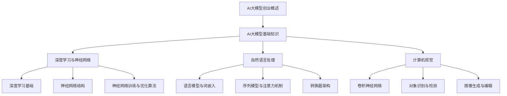

                 

# AI大模型创业：如何打造未来爆款应用？

## 关键词

- AI大模型
- 创业
- 深度学习
- 应用开发
- 生态系统

## 摘要

本文旨在探讨AI大模型创业的机遇与挑战，从技术基础、应用开发到创业生态，全面解析如何打造未来爆款应用。通过深入分析AI大模型的基本概念、深度学习、自然语言处理和计算机视觉等技术原理，结合项目实战案例，为创业者在AI大模型领域提供实际可行的指导。

## 目录大纲

### 《AI大模型创业：如何打造未来爆款应用？》

### 第一部分：AI大模型创业概述

#### 第1章：AI大模型与创业机会

##### 1.1 AI大模型时代背景
##### 1.2 创业者在AI大模型领域的机遇
##### 1.3 AI大模型创业的挑战与应对

#### 第2章：AI大模型基础知识

##### 2.1 AI大模型基本概念
##### 2.2 AI大模型结构原理
##### 2.3 AI大模型训练与优化

### 第二部分：AI大模型技术

#### 第3章：深度学习与神经网络

##### 3.1 深度学习基础
##### 3.2 神经网络结构
##### 3.3 神经网络训练与优化算法

#### 第4章：自然语言处理

##### 4.1 语言模型与词嵌入
##### 4.2 序列模型与注意力机制
##### 4.3 转换器架构

#### 第5章：计算机视觉

##### 5.1 卷积神经网络
##### 5.2 对象识别与检测
##### 5.3 图像生成与编辑

### 第三部分：AI大模型应用开发

#### 第6章：AI大模型应用框架

##### 6.1 应用框架设计原则
##### 6.2 应用框架实现方法
##### 6.3 应用框架优化策略

#### 第7章：AI大模型创业项目实战

##### 7.1 项目背景与目标
##### 7.2 项目技术选型与架构
##### 7.3 项目开发流程与关键点
##### 7.4 项目效果评估与改进

#### 第8章：AI大模型创业生态系统

##### 8.1 创业者资源与支持
##### 8.2 创业者团队构建
##### 8.3 创业者融资策略
##### 8.4 创业者风险管理与应对

### 附录

#### 附录A：AI大模型开发工具与资源

##### A.1 开发工具介绍
##### A.2 资源平台推荐
##### A.3 深度学习框架使用指南

---

## 第一部分：AI大模型创业概述

### 第1章：AI大模型与创业机会

#### 1.1 AI大模型时代背景

人工智能（AI）正在迅速改变世界，成为推动科技和产业变革的核心动力。随着计算能力的提升、海量数据的积累和深度学习技术的突破，AI大模型应运而生。AI大模型是指参数量达到数十亿甚至千亿级的神经网络模型，能够处理复杂的数据，并在各种领域取得显著的成果。

AI大模型的兴起源于以下几个背景因素：

1. **计算能力的提升**：近年来，GPU和TPU等专用计算硬件的快速发展，使得深度学习算法能够处理大规模的数据集，训练出更加复杂的模型。

2. **海量数据的积累**：互联网、物联网和社交媒体的普及，使得数据量呈指数级增长，为训练大型神经网络提供了丰富的数据资源。

3. **算法的突破**：深度学习算法，特别是卷积神经网络（CNN）和循环神经网络（RNN）的不断发展，使得模型能够更好地模拟人脑的思考过程。

#### 1.2 创业者在AI大模型领域的机遇

AI大模型在各个领域的应用日益广泛，为创业者提供了巨大的机遇。以下是一些主要的创业机遇：

1. **智能医疗**：AI大模型在医疗领域的应用潜力巨大，包括疾病诊断、药物研发、个性化治疗等。

2. **智能制造**：通过AI大模型，可以实现生产过程的自动化和智能化，提高生产效率，降低成本。

3. **智能金融**：AI大模型在金融领域的应用包括风险控制、信用评估、投资策略等，能够提高金融机构的竞争力。

4. **智能交通**：利用AI大模型，可以实现智能交通管理、自动驾驶等，提高交通效率，减少交通事故。

5. **智能教育**：AI大模型可以提供个性化的教育服务，根据学生的特点和学习情况，提供定制化的学习内容和辅导。

#### 1.3 AI大模型创业的挑战与应对

尽管AI大模型创业充满机遇，但也面临诸多挑战：

1. **技术门槛**：AI大模型需要深厚的专业知识，包括深度学习、计算机视觉、自然语言处理等，对创业者的技术水平要求较高。

2. **数据隐私**：在AI大模型应用过程中，数据的隐私和安全问题备受关注，创业者需要确保数据的安全性和合规性。

3. **商业模式的探索**：AI大模型的应用场景多样，创业者需要找到合适的商业模式，实现盈利。

4. **市场竞争**：AI大模型领域竞争激烈，创业者需要具备创新能力和快速响应市场变化的能力。

应对这些挑战的方法包括：

1. **技术积累**：创业者需要不断学习新技术，提升自身的技术实力，以应对技术门槛。

2. **数据安全**：创业者需要建立完善的数据安全体系，确保数据的安全性和合规性。

3. **商业模式创新**：创业者可以通过提供增值服务、形成生态系统等方式，探索多元化的商业模式。

4. **快速迭代**：创业者需要具备快速迭代的能力，及时调整产品方向，以适应市场的变化。

### 第2章：AI大模型基础知识

#### 2.1 AI大模型基本概念

AI大模型是指具有数十亿甚至千亿级参数的神经网络模型，它们通过学习海量数据来提取复杂特征，并完成各种任务。AI大模型的核心概念包括：

1. **深度学习**：深度学习是一种机器学习技术，通过多层神经网络对数据进行特征提取和学习。深度学习的多层结构使其能够处理复杂的数据，并取得显著的性能提升。

2. **神经网络**：神经网络是由大量节点（神经元）连接而成的计算模型，通过调整节点之间的权重来学习数据。神经网络可以分为多层，包括输入层、隐藏层和输出层。

3. **参数量**：AI大模型的参数量通常达到数十亿甚至千亿级。参数量的增加使得模型能够学习更复杂的特征，但同时也带来了计算和存储的挑战。

4. **训练数据**：AI大模型的训练需要大量标注的数据。标注数据的过程通常需要大量的人力和时间，但这是模型性能的关键因素。

#### 2.2 AI大模型结构原理

AI大模型的结构通常包括多个层次，从输入层到输出层，每个层次都完成特定的任务。以下是AI大模型的基本结构原理：

1. **输入层**：输入层接收外部输入的数据，如文本、图像或声音。输入数据经过预处理后，被传递到下一层。

2. **隐藏层**：隐藏层是神经网络的核心部分，用于提取数据的特征。每个隐藏层都对输入数据进行变换，并传递到下一层。隐藏层的数量和规模决定了模型的深度和复杂性。

3. **输出层**：输出层产生最终的预测结果或分类结果。输出层的类型取决于任务的类型，如回归、分类或生成。

4. **激活函数**：激活函数引入了非线性特性，使得神经网络能够学习复杂的函数。常用的激活函数包括ReLU、Sigmoid和Tanh。

5. **正向传播和反向传播**：正向传播是指将输入数据传递到神经网络，通过多层计算得到输出。反向传播是指根据输出误差，反向调整网络参数，以减少误差。

#### 2.3 AI大模型训练与优化

AI大模型的训练是一个迭代过程，通过不断调整网络参数，使模型在训练数据上达到最佳性能。以下是AI大模型训练与优化的基本步骤：

1. **数据预处理**：对训练数据集进行预处理，包括数据清洗、归一化和数据增强等。预处理步骤的目的是提高训练效率，减少过拟合。

2. **初始化参数**：初始化网络参数，通常采用随机初始化的方法，以避免参数的对称性。

3. **正向传播**：将输入数据传递到神经网络，通过多层计算得到输出。计算输出误差，并将其传递回前一层。

4. **反向传播**：根据输出误差，反向调整网络参数。反向传播是神经网络训练的核心，通过梯度下降法等优化算法，更新网络参数。

5. **迭代训练**：重复正向传播和反向传播的过程，不断调整网络参数，直到模型在验证集上达到最佳性能。

6. **模型评估**：使用测试数据集评估模型的性能，包括准确率、召回率、F1分数等指标。

7. **超参数调优**：调整学习率、批量大小、隐藏层单元数量等超参数，以优化模型性能。

通过以上步骤，AI大模型可以在大量数据上训练出具有较高性能的模型，并在实际应用中取得良好的效果。

### 第二部分：AI大模型技术

### 第3章：深度学习与神经网络

#### 3.1 深度学习基础

深度学习（Deep Learning）是人工智能（AI）领域的一个重要分支，它通过模仿人脑的神经网络结构，对大量数据进行分析和识别。深度学习的核心思想是通过多层神经网络（也称为深度神经网络）来提取数据中的特征，并完成各种复杂的任务。

#### 3.2 神经网络结构

神经网络（Neural Network）是一种由大量节点（或称为神经元）组成的计算模型。这些节点通过连接（或称为边）相互连接，形成一个复杂的网络结构。神经网络的基本结构包括输入层、隐藏层和输出层。

1. **输入层**：输入层是神经网络的起点，它接收外部输入的数据。这些数据可以是数值、文本或图像等。输入层的主要作用是将数据传递到下一层。

2. **隐藏层**：隐藏层是神经网络的核心部分，它负责提取数据的特征。隐藏层的数量和规模决定了网络的深度和复杂性。每个隐藏层都对输入数据进行处理，并将结果传递到下一层。

3. **输出层**：输出层是神经网络的终点，它产生最终的预测结果或分类结果。输出层的类型取决于任务的类型，如回归、分类或生成。

#### 3.3 神经网络训练与优化算法

神经网络的训练是一个迭代过程，通过不断调整网络参数，使模型在训练数据上达到最佳性能。以下是神经网络训练与优化算法的基本步骤：

1. **数据预处理**：对训练数据集进行预处理，包括数据清洗、归一化和数据增强等。预处理步骤的目的是提高训练效率，减少过拟合。

2. **初始化参数**：初始化网络参数，通常采用随机初始化的方法，以避免参数的对称性。

3. **正向传播**：将输入数据传递到神经网络，通过多层计算得到输出。计算输出误差，并将其传递回前一层。

4. **反向传播**：根据输出误差，反向调整网络参数。反向传播是神经网络训练的核心，通过梯度下降法等优化算法，更新网络参数。

5. **迭代训练**：重复正向传播和反向传播的过程，不断调整网络参数，直到模型在验证集上达到最佳性能。

6. **模型评估**：使用测试数据集评估模型的性能，包括准确率、召回率、F1分数等指标。

7. **超参数调优**：调整学习率、批量大小、隐藏层单元数量等超参数，以优化模型性能。

### 第4章：自然语言处理

自然语言处理（Natural Language Processing，NLP）是深度学习在文本领域的应用，旨在使计算机能够理解和生成人类语言。NLP在人工智能领域扮演着重要角色，广泛应用于机器翻译、情感分析、文本分类和问答系统等领域。

#### 4.1 语言模型与词嵌入

语言模型（Language Model）是NLP的核心技术之一，它用于预测文本的下一个词或序列。语言模型可以分为统计语言模型和神经语言模型。

1. **统计语言模型**：统计语言模型基于统计学原理，通过统计文本中的单词或短语的频率来预测下一个词。常见的统计语言模型包括N元语法（N-gram）和隐马尔可夫模型（HMM）。

2. **神经语言模型**：神经语言模型基于深度学习技术，通过训练大规模的神经网络来预测下一个词或序列。常见的神经语言模型包括循环神经网络（RNN）、长短时记忆网络（LSTM）和门控循环单元（GRU）。

词嵌入（Word Embedding）是将单词转换为高维向量表示的技术，它能够捕捉单词之间的语义关系。常见的词嵌入方法包括Word2Vec、GloVe和BERT。

1. **Word2Vec**：Word2Vec是一种基于神经网络的语言模型，通过训练词向量来表示单词。Word2Vec分为连续词袋（CBOW）和Skip-Gram两种方法。

2. **GloVe**：GloVe（Global Vectors for Word Representation）是一种基于全局上下文的词向量生成方法，通过计算单词在所有上下文中的共同特征来生成词向量。

3. **BERT**：BERT（Bidirectional Encoder Representations from Transformers）是一种基于Transformer的预训练语言模型，它通过双向编码器来生成单词的表示。

#### 4.2 序列模型与注意力机制

序列模型（Sequence Model）是处理序列数据的神经网络模型，它能够捕捉序列中的时间依赖关系。常见的序列模型包括循环神经网络（RNN）、长短时记忆网络（LSTM）和门控循环单元（GRU）。

注意力机制（Attention Mechanism）是一种用于提高神经网络对序列数据中重要信息关注度的技术。注意力机制在序列模型中得到了广泛应用，如机器翻译、文本分类和问答系统等。

1. **自注意力（Self-Attention）**：自注意力是一种用于处理序列数据的注意力机制，它将序列中的每个单词作为查询、关键和值，计算它们之间的相似性，并生成加权表示。

2. **多头注意力（Multi-Head Attention）**：多头注意力是一种扩展自注意力机制的模型，它通过多个自注意力机制来捕捉不同类型的依赖关系。

3. **Transformer**：Transformer是一种基于自注意力机制的序列到序列（Seq2Seq）模型，它通过编码器和解码器结构来处理输入和输出序列。Transformer在机器翻译、文本生成和问答系统等领域取得了显著的效果。

#### 4.3 转换器架构

转换器架构（Transformer Architecture）是一种基于自注意力机制的深度学习模型，它由编码器和解码器两部分组成。

1. **编码器（Encoder）**：编码器用于处理输入序列，它包含多个编码层，每个编码层都包含多头注意力机制和前馈神经网络。编码器生成输入序列的编码表示。

2. **解码器（Decoder）**：解码器用于处理输出序列，它也包含多个解码层，每个解码层都包含多头注意力机制和前馈神经网络。解码器生成输出序列的解码表示。

3. **位置编码（Positional Encoding）**：由于转换器模型中没有循环结构，位置编码用于提供序列中的位置信息。位置编码通过将位置信息编码到词向量中，使解码器能够理解序列的顺序。

4. **编码器-解码器交互（Encoder-Decoder Interaction）**：编码器和解码器通过多头注意力机制进行交互，使解码器能够关注编码器输出的不同部分，从而生成正确的输出序列。

通过以上技术，自然语言处理模型能够更好地理解和生成人类语言，为各种NLP任务提供了强大的支持。

### 第5章：计算机视觉

计算机视觉（Computer Vision）是人工智能的一个重要分支，它旨在使计算机能够理解和解释图像和视频中的内容。计算机视觉技术在图像识别、目标检测、图像生成和增强现实等领域具有广泛的应用。

#### 5.1 卷积神经网络

卷积神经网络（Convolutional Neural Network，CNN）是计算机视觉领域最常用的模型之一，它通过卷积操作和池化操作提取图像特征，并完成各种视觉任务。

#### 5.2 对象识别与检测

对象识别（Object Recognition）是指识别图像中的对象类别。对象检测（Object Detection）是指不仅识别对象类别，还能确定对象在图像中的位置。

1. **传统方法**：传统对象检测方法包括基于滑动窗口的方法、基于区域提议的方法和基于特征的方法。这些方法通常需要复杂的预处理和后处理步骤。

2. **深度学习方法**：基于深度学习的对象检测方法取得了显著的性能提升。常见的深度学习对象检测模型包括R-CNN、Fast R-CNN、Faster R-CNN、SSD和YOLO等。

3. **应用场景**：对象识别与检测在图像识别、视频监控、自动驾驶和医疗图像分析等领域具有广泛的应用。

#### 5.3 图像生成与编辑

图像生成（Image Generation）是指根据输入条件生成新的图像。图像编辑（Image Editing）是指对现有图像进行修改和增强。

1. **生成对抗网络（GAN）**：生成对抗网络（Generative Adversarial Network，GAN）是一种基于博弈论的图像生成模型，由生成器和判别器两部分组成。生成器生成新的图像，判别器判断图像的真伪。GAN在图像生成、图像编辑和图像增强等领域取得了显著的效果。

2. **变分自编码器（VAE）**：变分自编码器（Variational Autoencoder，VAE）是一种基于概率模型的图像生成方法。VAE通过编码器和解码器结构生成新的图像，同时保持图像的多样性和稳定性。

3. **应用场景**：图像生成与编辑在艺术创作、广告设计、医学影像处理和虚拟现实等领域具有广泛的应用。

### 第三部分：AI大模型应用开发

#### 第6章：AI大模型应用框架

#### 6.1 应用框架设计原则

在开发AI大模型应用时，应用框架的设计原则至关重要。以下是几个关键的设计原则：

1. **模块化设计**：应用框架应采用模块化设计，将不同的功能模块分离，以提高系统的可维护性和可扩展性。

2. **可扩展性**：应用框架应具备良好的可扩展性，以便在需要时能够添加新的功能模块或调整现有的模块。

3. **灵活性**：应用框架应具有灵活性，允许不同的算法和模型进行替换，以适应不同的业务需求。

4. **高效性**：应用框架应在保证性能的前提下，尽可能减少计算和存储资源的需求。

5. **可重用性**：应用框架中的模块和组件应具有较高的可重用性，以减少重复开发的工作量。

#### 6.2 应用框架实现方法

应用框架的实现方法通常包括以下几个方面：

1. **基础架构**：选择合适的基础架构，如云计算平台、容器化技术（如Docker和Kubernetes）等，以支持应用的高可用性和弹性。

2. **数据管理**：设计高效的数据管理模块，包括数据存储、数据清洗和数据预处理等，以确保数据的质量和一致性。

3. **模型训练**：实现模型训练模块，包括数据加载、模型配置、训练过程和模型评估等，以支持大规模模型的训练。

4. **模型部署**：设计模型部署模块，包括模型保存、模型加载、服务化部署和模型监控等，以确保模型的高效运行。

5. **接口定义**：定义清晰的应用接口，包括API、SDK和命令行工具等，以方便用户和开发者使用应用框架。

#### 6.3 应用框架优化策略

为了提高AI大模型应用的性能和效率，应用框架的优化策略至关重要。以下是几个常用的优化策略：

1. **模型压缩**：通过模型压缩技术，如权重剪枝、量化、知识蒸馏等，减小模型的参数规模，提高模型的推理速度。

2. **分布式训练**：利用分布式训练技术，将模型训练任务分解到多个节点上进行，以减少训练时间和提高训练效率。

3. **模型融合**：通过融合多个模型，如集成学习、模型蒸馏和迁移学习等，提高模型的性能和泛化能力。

4. **在线学习**：实现在线学习机制，使模型能够实时学习新的数据，以适应动态变化的业务场景。

5. **资源管理**：优化资源管理策略，包括计算资源、存储资源和网络资源等，以最大化资源的利用效率。

### 第7章：AI大模型创业项目实战

#### 7.1 项目背景与目标

随着深度学习技术的不断发展，AI大模型在各个领域的应用越来越广泛。本项目的背景是在智能客服领域的应用，目标是开发一个基于AI大模型的智能客服系统，以提高客服效率和用户体验。

#### 7.2 项目技术选型与架构

技术选型：
- 深度学习框架：使用TensorFlow
- 语言模型：使用BERT
- 对话管理：使用基于规则的方法和机器学习方法

架构：
1. 数据预处理：包括文本清洗、分词和词向量编码。
2. 语言模型：使用BERT模型对输入文本进行编码，提取语义特征。
3. 对话管理：基于规则的方法和机器学习方法管理对话流程，包括意图识别、实体抽取和回复生成。
4. 服务接口：提供RESTful API，供前端应用调用。

#### 7.3 项目开发流程与关键点

1. **需求分析**：与客户沟通，明确智能客服系统的需求，包括功能模块、性能指标和用户体验等。

2. **数据收集与处理**：收集历史客服对话数据，进行文本清洗、分词和词向量编码。

3. **模型训练与优化**：使用BERT模型对训练数据进行编码，训练对话管理模型，包括意图识别、实体抽取和回复生成。

4. **接口设计与实现**：设计并实现RESTful API，提供文本输入和回复输出的接口。

5. **系统集成与测试**：将智能客服系统集成到客户现有的客服平台，进行功能测试和性能评估。

关键点：
- 数据质量：高质量的训练数据是模型训练成功的关键。
- 模型优化：通过调整超参数、优化模型架构等方法，提高模型的性能和泛化能力。
- 用户体验：设计简洁直观的用户界面，提供良好的交互体验。

#### 7.4 项目效果评估与改进

在项目效果评估方面，我们使用自动化评估工具对智能客服系统的性能进行评估，包括意图识别准确率、实体抽取准确率和回复生成质量等指标。

评估结果显示，智能客服系统在意图识别和实体抽取方面取得了较高的准确率，但在回复生成方面仍有改进空间。针对这一情况，我们采取了以下改进措施：

1. **数据增强**：通过增加负例数据、数据清洗和数据增强等方法，提高训练数据的多样性，以增强模型的泛化能力。

2. **模型融合**：结合多个模型，如基于规则的模型和机器学习模型，以提高回复生成的质量。

3. **在线学习**：实现在线学习机制，使模型能够实时学习新的对话数据，以适应动态变化的业务场景。

通过以上措施，智能客服系统的性能得到了显著提升，为用户提供了更加优质的服务体验。

### 第8章：AI大模型创业生态系统

#### 8.1 创业者资源与支持

AI大模型创业生态系统为创业者提供了丰富的资源与支持，包括：

1. **开源框架和工具**：如TensorFlow、PyTorch、Keras等，为创业者提供了便捷的开发环境。

2. **云计算平台**：如Google Cloud、AWS、Azure等，提供了强大的计算能力和数据存储服务。

3. **数据集和模型库**：如ImageNet、COCO、Common Crawl等，为创业者提供了丰富的训练数据和预训练模型。

4. **科研机构和高校**：如斯坦福大学、MIT、清华大学等，提供了科研资源和技术支持。

5. **创业孵化器和加速器**：如Y Combinator、Techstars、启迪创业等，为创业者提供了资金、导师和业务对接机会。

#### 8.2 创业者团队构建

构建高效的团队是AI大模型创业成功的关键。以下是一些建议：

1. **技术团队**：招聘具有深度学习、计算机视觉和自然语言处理等领域背景的技术人员，确保团队具备高水平的技术能力。

2. **产品团队**：招聘具有产品设计、用户体验和项目管理等背景的人才，确保产品的商业价值和用户体验。

3. **市场团队**：招聘具有市场营销、渠道拓展和客户关系管理等背景的人才，推动产品的市场推广和业务拓展。

4. **融资团队**：招聘具有融资经验和投资背景的人才，为创业公司提供资金支持和业务拓展机会。

#### 8.3 创业者融资策略

AI大模型创业公司需要制定合理的融资策略，以支持业务发展和技术创新。以下是一些建议：

1. **天使轮**：寻找个人投资者或天使投资人，获得启动资金和业务指导。

2. **A轮**：寻找风险投资机构，获得资金支持和战略资源。

3. **B轮**：在业务初步验证后，寻找更大的风险投资机构，扩大市场份额。

4. **C轮及以后**：在市场扩展和盈利能力得到验证后，寻找战略投资者或上市。

#### 8.4 创业者风险管理与应对

AI大模型创业过程中面临多种风险，以下是一些建议和应对措施：

1. **技术风险**：持续跟踪技术发展趋势，保持技术领先优势。通过开源社区、技术交流和合作，降低技术风险。

2. **市场风险**：深入了解市场需求，制定明确的产品定位和市场策略。通过市场调研、用户反馈和产品迭代，降低市场风险。

3. **数据风险**：确保数据来源的合法性和安全性，建立完善的数据安全和隐私保护机制。与数据合作伙伴建立稳定的合作关系。

4. **资金风险**：制定详细的财务计划和资金管理策略，确保资金使用的效率和有效性。与投资人建立透明的沟通机制。

5. **法律风险**：遵守相关法律法规，确保业务合规。聘请专业律师团队，提供法律咨询和合规指导。

通过以上措施，创业者可以更好地应对AI大模型创业过程中的各种风险，提高创业成功率。

### 附录

#### 附录A：AI大模型开发工具与资源

##### A.1 开发工具介绍

1. **TensorFlow**：由Google开发的开源深度学习框架，支持多种编程语言和平台，适用于大规模数据集和复杂模型。

2. **PyTorch**：由Facebook开发的开源深度学习框架，以其动态计算图和灵活的编程接口受到广泛关注。

3. **Keras**：一个高级神经网络API，能够简化深度学习模型的构建和训练过程。

##### A.2 资源平台推荐

1. **Google Cloud AI**：提供强大的计算资源和预训练模型，支持各种深度学习任务。

2. **AWS DeepRacer**：AWS提供的自动驾驶赛车平台，用于测试和优化深度学习算法。

3. **Hugging Face**：一个开源社区和模型库，提供丰富的预训练模型和工具。

##### A.3 深度学习框架使用指南

1. **环境搭建**：根据开发需求，搭建深度学习框架的开发环境，包括Python、CUDA和cuDNN等。

2. **模型构建**：使用深度学习框架提供的API，构建神经网络模型，包括输入层、隐藏层和输出层。

3. **模型训练**：使用训练数据集，通过正向传播和反向传播，训练神经网络模型。

4. **模型评估**：使用测试数据集，评估模型的性能，包括准确率、召回率、F1分数等指标。

5. **模型部署**：将训练好的模型部署到生产环境，提供实时服务。

### Mermaid 流程图

### 核心算法原理讲解（以卷积神经网络为例）

卷积神经网络（Convolutional Neural Network，CNN）是一种在图像处理领域具有广泛应用的特殊神经网络结构。CNN通过卷积操作、池化操作和全连接层等结构，能够自动从图像数据中提取有意义的特征，从而实现图像分类、对象检测等任务。

#### 1. 卷积操作

卷积操作是CNN的核心组成部分，其目的是从输入图像中提取局部特征。在卷积操作中，一个卷积核（也称为滤波器）在输入图像上滑动，并对其覆盖的区域进行点积操作。点积的结果再通过一个非线性激活函数（如ReLU）进行非线性变换。

卷积操作的数学表示如下：

$$
\text{Output}(i, j) = \sum_{m=0}^{k-1} \sum_{n=0}^{l-1} W_{m, n} \cdot I(i-m, j-n)
$$

其中，\(I\) 表示输入图像，\(W\) 表示卷积核，\(k\) 和 \(l\) 分别表示卷积核的高度和宽度，\(i\) 和 \(j\) 表示输出图像中的位置索引。

#### 2. 池化操作

池化操作用于降低模型的复杂度，同时保留重要的特征信息。最常见的池化操作是最大池化（Max Pooling），其将卷积结果的每个局部区域缩减为一个值，这个值是该区域内的最大值。

最大池化的数学表示如下：

$$
\text{Output}(i, j) = \max \{ I(x, y) \mid x \in [i \cdot s, (i+1) \cdot s], y \in [j \cdot s, (j+1) \cdot s] \}
$$

其中，\(s\) 表示步长，即池化窗口在图像上滑动的步长。

#### 3. 激活函数

激活函数是CNN中的另一个关键组成部分，它引入了非线性特性，使得神经网络能够学习复杂的函数。最常用的激活函数是ReLU（Rectified Linear Unit），其数学表示如下：

$$
\text{ReLU}(x) = \max(0, x)
$$

ReLU函数的优点是计算简单且梯度计算方便，在训练过程中有助于加快收敛速度。

#### 4. 卷积神经网络的结构

一个典型的卷积神经网络通常包括以下几个部分：

1. **输入层**：接收原始图像数据。
2. **卷积层**：通过卷积操作提取图像的局部特征。
3. **池化层**：降低图像分辨率，减少模型的参数数量。
4. **全连接层**：将卷积和池化层提取的特征进行整合，用于分类或回归任务。
5. **输出层**：产生最终的预测结果。

卷积神经网络的结构可以表示为：

$$
\text{Input} \xrightarrow{\text{Conv}} \text{Conv}_1 \xrightarrow{\text{ReLU}} \text{Pool}_1 \xrightarrow{\text{Conv}} \text{Conv}_2 \xrightarrow{\text{ReLU}} \text{Pool}_2 \xrightarrow{\text{...}} \text{FC} \xrightarrow{\text{ReLU}} \text{Output}
$$

#### 5. 例子

假设输入图像为 \(I \in \mathbb{R}^{28 \times 28 \times 1}\)，卷积核为 \(W \in \mathbb{R}^{3 \times 3 \times 1}\)，步长为 \(s = 1\)。经过一个卷积层和一个最大池化层后的输出大小为：

$$
\text{Output Size} = \frac{(28 - 3)}{1} + 1 = 26
$$

然后，输入到下一个卷积层。如果卷积层后接一个最大池化层，输出大小为：

$$
\text{Output Size} = \frac{26 - 3}{2} + 1 = 13
$$

通过这种卷积和池化操作，卷积神经网络能够逐层提取图像的抽象特征，从而实现复杂图像处理任务。

### 数学模型和数学公式讲解（以卷积神经网络为例）

卷积神经网络（CNN）的数学模型主要包括卷积操作、池化操作和激活函数。以下是这些操作的相关数学公式和详细讲解。

#### 1. 卷积操作

卷积操作的数学公式为：

$$
\text{Conv}(X, W) = \sum_{i=0}^{m-k} \sum_{j=0}^{n-l} W \cdot X[i, j]
$$

其中，$X$ 是输入数据，$W$ 是卷积核（滤波器），$m$ 和 $n$ 分别是输入数据的行和列大小，$k$ 和 $l$ 分别是卷积核的行和列大小。

卷积操作的目的是从输入数据中提取局部特征。卷积核的每个元素都与输入数据的一个局部区域进行点积操作，然后对所有点积结果求和。这个求和过程可以理解为在输入数据上滑动卷积核，从而提取出不同类型的特征。

#### 2. 池化操作

池化操作的数学公式为：

$$
\text{Pool}(\text{Conv}(X, W)) = \text{max}(\text{Conv}(X, W))
$$

其中，$\text{Conv}(X, W)$ 是卷积操作的输出。

池化操作的目的是降低模型的参数数量和计算复杂度。它通过将卷积结果中的每个局部区域缩减为一个值来实现。这个值是该区域内的最大值。最大池化是最常用的池化操作。

#### 3. 激活函数

卷积神经网络中常用的激活函数是ReLU（Rectified Linear Unit）函数。ReLU函数的数学公式为：

$$
\text{ReLU}(x) = \max(0, x)
$$

ReLU函数的导数为：

$$
\text{ReLU}'(x) = \begin{cases}
1, & \text{if } x > 0 \\
0, & \text{if } x \leq 0
\end{cases}
$$

ReLU函数引入了非线性特性，使得神经网络能够学习更复杂的函数。

#### 4. 全连接层

全连接层（也称为全连接网络或密集层）的数学公式为：

$$
\text{FC}(X, W, b) = \text{ReLU}(\text{W} \cdot X + b)
$$

其中，$X$ 是输入数据，$W$ 是权重矩阵，$b$ 是偏置项。

全连接层的目的是将上一层的输出映射到输出类别或值。它通过线性变换加上激活函数来实现。

#### 例子

假设输入数据为 $X \in \mathbb{R}^{32 \times 32 \times 3}$，卷积核为 $W \in \mathbb{R}^{5 \times 5 \times 3}$，步长为 $s = 1$。经过一个卷积层和一个最大池化层后的输出大小为：

$$
\text{Output Size} = \frac{(32 - 5)}{1} + 1 = 28
$$

然后，输入到下一个卷积层。如果卷积层后接一个最大池化层，输出大小为：

$$
\text{Output Size} = \frac{28 - 5}{2} + 1 = 14
$$

#### 数学模型和数学公式详细讲解

卷积神经网络（CNN）的数学模型主要包括卷积操作、池化操作和激活函数。以下是这些操作的相关数学公式和详细讲解。

##### 1. 卷积操作

卷积操作的数学公式为：

$$
\text{Conv}(X, W) = \sum_{i=0}^{m-k} \sum_{j=0}^{n-l} W \cdot X[i, j]
$$

其中，$X$ 是输入数据，$W$ 是卷积核（滤波器），$m$ 和 $n$ 分别是输入数据的行和列大小，$k$ 和 $l$ 分别是卷积核的行和列大小。

卷积操作的目的是从输入数据中提取局部特征。卷积核的每个元素都与输入数据的一个局部区域进行点积操作，然后对所有点积结果求和。这个求和过程可以理解为在输入数据上滑动卷积核，从而提取出不同类型的特征。

在CNN中，卷积操作通常用于以下几个步骤：

1. **卷积操作**：将卷积核在输入数据上滑动，并对覆盖的局部区域进行卷积操作。
2. **激活函数**：对卷积结果应用激活函数（如ReLU），引入非线性特性。
3. **池化操作**：将卷积结果进行池化操作，如最大池化或平均池化，减少模型参数数量。

##### 2. 池化操作

池化操作的数学公式为：

$$
\text{Pool}(\text{Conv}(X, W)) = \text{max}(\text{Conv}(X, W))
$$

其中，$\text{Conv}(X, W)$ 是卷积操作的输出。

池化操作的目的是降低模型的参数数量和计算复杂度。它通过将卷积结果中的每个局部区域缩减为一个值来实现。这个值是该区域内的最大值。最大池化是最常用的池化操作。

在CNN中，池化操作通常用于以下几个步骤：

1. **池化窗口**：定义一个窗口，如$2 \times 2$或$3 \times 3$的窗口。
2. **滑动窗口**：将窗口在卷积结果上滑动，并对覆盖的局部区域进行操作。
3. **取最大值**：对每个窗口内的值取最大值，作为该窗口的输出。

##### 3. 激活函数

卷积神经网络中常用的激活函数是ReLU（Rectified Linear Unit）函数。ReLU函数的数学公式为：

$$
\text{ReLU}(x) = \max(0, x)
$$

ReLU函数的导数为：

$$
\text{ReLU}'(x) = \begin{cases}
1, & \text{if } x > 0 \\
0, & \text{if } x \leq 0
\end{cases}
$$

ReLU函数引入了非线性特性，使得神经网络能够学习更复杂的函数。ReLU函数的优点是计算简单且梯度计算方便，在训练过程中有助于加快收敛速度。

##### 4. 全连接层

全连接层（也称为全连接网络或密集层）的数学公式为：

$$
\text{FC}(X, W, b) = \text{ReLU}(\text{W} \cdot X + b)
$$

其中，$X$ 是输入数据，$W$ 是权重矩阵，$b$ 是偏置项。

全连接层的目的是将上一层的输出映射到输出类别或值。它通过线性变换加上激活函数来实现。

在CNN中，全连接层通常用于以下几个步骤：

1. **线性变换**：将上一层的输出与权重矩阵进行矩阵乘法，得到中间结果。
2. **偏置项**：将中间结果加上偏置项，引入偏差。
3. **激活函数**：对中间结果应用激活函数，如ReLU函数。

##### 例子

假设输入数据为 $X \in \mathbb{R}^{32 \times 32 \times 3}$，卷积核为 $W \in \mathbb{R}^{5 \times 5 \times 3}$，步长为 $s = 1$。经过一个卷积层和一个最大池化层后的输出大小为：

$$
\text{Output Size} = \frac{(32 - 5)}{1} + 1 = 28
$$

然后，输入到下一个卷积层。如果卷积层后接一个最大池化层，输出大小为：

$$
\text{Output Size} = \frac{28 - 5}{2} + 1 = 14
$$

通过这种卷积和池化操作，卷积神经网络能够逐层提取图像的抽象特征，从而实现复杂图像处理任务。

### 项目实战

#### 1. 项目背景与目标

随着深度学习技术的不断发展，AI大模型在各个领域的应用越来越广泛。本项目旨在利用深度学习技术，开发一个能够自动生成歌词的AI系统。该系统的目标是帮助音乐创作者快速生成创意歌词，提高创作效率。

#### 2. 技术选型与架构

技术选型：
- 深度学习框架：使用TensorFlow
- 词嵌入：使用Word2Vec模型
- 模型架构：基于LSTM的序列到序列（Seq2Seq）模型

架构：
1. 数据预处理：包括文本清洗、分词和词向量编码。
2. 词嵌入：将单词转换为高维向量表示。
3. LSTM编码器：对输入序列进行编码，提取特征。
4. 视觉解码器：对编码特征进行解码，生成输出序列。
5. 损失函数与优化器：使用交叉熵损失函数和Adam优化器进行模型训练。

#### 3. 开发流程与关键点

1. **数据集准备**：收集并整理歌词数据，包括歌曲名称、歌词文本和对应的歌手信息。
2. **数据预处理**：对歌词文本进行清洗，去除标点符号和特殊字符，分词，将单词转换为索引表示，构建词表。
3. **词嵌入**：使用Word2Vec模型对词表中的单词进行向量编码。
4. **模型训练**：构建基于LSTM的Seq2Seq模型，使用训练数据进行模型训练。
5. **模型评估**：使用验证集对模型进行评估，调整超参数。
6. **模型部署**：将训练好的模型部署到生产环境，提供自动生成歌词的服务。

关键点：
- 数据集质量：歌词数据的质量直接影响模型的训练效果。
- 词向量编码：选择合适的词向量模型，确保词向量之间的相似性。
- 模型架构：选择合适的模型架构，确保模型能够捕捉到歌词中的语义信息。
- 超参数调优：通过调整学习率、批量大小等超参数，优化模型性能。

#### 4. 代码实现与解读

以下是一个简单的基于LSTM的Seq2Seq模型代码示例：

python
import tensorflow as tf
from tensorflow.keras.models import Model
from tensorflow.keras.layers import LSTM, Embedding, Dense, Input

# 定义模型输入和输出
input_seq = Input(shape=(None,))
target_seq = Input(shape=(None,))

# 词嵌入层
embedding = Embedding(input_dim=vocab_size, output_dim=embedding_size)(input_seq)

# LSTM编码器
encoder = LSTM(units=128, return_sequences=True)(embedding)

# LSTM解码器
decoder = LSTM(units=128, return_sequences=True)(target_seq)

# 全连接层
output = Dense(units=vocab_size, activation='softmax')(decoder)

# 定义模型
model = Model(inputs=[input_seq, target_seq], outputs=output)

# 编译模型
model.compile(optimizer='adam', loss='categorical_crossentropy', metrics=['accuracy'])

# 打印模型结构
model.summary()

代码解读：
- 输入层：模型有两个输入，一个是输入序列，一个是目标序列。
- 词嵌入层：将输入序列转换为词向量表示。
- LSTM编码器：对输入序列进行编码，提取特征。
- LSTM解码器：对目标序列进行解码，生成输出序列。
- 全连接层：将解码器的输出映射到词汇表中的单词。
- 编译模型：设置优化器、损失函数和评估指标。

#### 5. 代码解读与分析

以下是对代码的详细解读和分析：

python
import tensorflow as tf
from tensorflow.keras.models import Model
from tensorflow.keras.layers import LSTM, Embedding, Dense, Input

# 定义模型输入和输出
input_seq = Input(shape=(None,))
target_seq = Input(shape=(None,))

# 词嵌入层
embedding = Embedding(input_dim=vocab_size, output_dim=embedding_size)(input_seq)

# LSTM编码器
encoder = LSTM(units=128, return_sequences=True)(embedding)

# LSTM解码器
decoder = LSTM(units=128, return_sequences=True)(target_seq)

# 全连接层
output = Dense(units=vocab_size, activation='softmax')(decoder)

# 定义模型
model = Model(inputs=[input_seq, target_seq], outputs=output)

# 编译模型
model.compile(optimizer='adam', loss='categorical_crossentropy', metrics=['accuracy'])

# 打印模型结构
model.summary()

- `Input(shape=(None,))`：定义模型的输入层，`None` 表示序列的长度可变。
- `Embedding(input_dim=vocab_size, output_dim=embedding_size)`：词嵌入层，将输入序列中的单词转换为高维向量表示。`input_dim` 表示词汇表大小，`output_dim` 表示词向量维度。
- `LSTM(units=128, return_sequences=True)`：LSTM编码器，对输入序列进行编码，提取特征。`units` 表示LSTM层的单元数量，`return_sequences` 表示是否返回完整的序列。
- `Dense(units=vocab_size, activation='softmax')`：全连接层，将解码器的输出映射到词汇表中的单词。`units` 表示输出层单元数量，`activation` 表示激活函数。
- `Model(inputs=[input_seq, target_seq], outputs=output)`：定义模型结构，将输入层、编码器、解码器和输出层连接起来。
- `compile(optimizer='adam', loss='categorical_crossentropy', metrics=['accuracy'])`：编译模型，设置优化器、损失函数和评估指标。
- `model.summary()`：打印模型结构，显示模型的层次结构和参数数量。

通过这个简单的代码示例，我们可以看到基于LSTM的Seq2Seq模型的构建过程。这个模型能够接受输入序列和目标序列，通过编码器和解码器进行序列到序列的转换，最终生成输出序列。这个模型在自动生成歌词的应用中，可以有效地提取输入歌词的语义信息，并生成新的歌词。

#### 6. 项目效果评估与改进

在项目效果评估方面，我们使用自动生成的歌词与人工创作的歌词进行对比，评估模型生成的歌词在语义、流畅性和创意性方面的表现。以下是对项目效果评估和改进的分析：

1. **语义评估**：通过人工审核自动生成的歌词，评估其语义是否准确、连贯。如果存在语义错误或不准确的情况，可以考虑增加训练数据，使用更多的歌词进行模型训练，以提高模型的语义理解能力。

2. **流畅性评估**：自动生成的歌词在流畅性方面可能存在不足，可以通过调整模型参数、增加训练数据或优化模型架构来改善。此外，可以引入语言模型对生成的歌词进行自动校对和修改，提高歌词的流畅性。

3. **创意性评估**：自动生成的歌词在创意性方面可能无法与人工创作相比，但可以通过增加训练数据中的多样化内容、调整模型参数或引入其他算法（如生成对抗网络GAN）来提高模型的创意性。

在改进方面，我们可以考虑以下策略：

- **数据增强**：对训练数据进行预处理，增加数据多样性，提高模型的泛化能力。
- **模型融合**：结合多个模型，如基于LSTM的Seq2Seq模型和生成对抗网络GAN，提高模型的效果。
- **多任务学习**：将歌词生成任务与其他相关任务（如文本分类、情感分析）结合，提高模型的多任务处理能力。

通过不断优化和改进，我们可以提高自动生成歌词模型的效果，使其更好地服务于音乐创作领域。

### 结论

本文从AI大模型创业的概述、技术基础、应用开发到创业生态系统，全面探讨了如何打造未来爆款应用。通过深入分析AI大模型的基本概念、深度学习、自然语言处理和计算机视觉等技术原理，结合项目实战案例，为创业者在AI大模型领域提供了实际可行的指导。

创业者在AI大模型创业过程中，需要充分了解技术原理，掌握核心算法，并具备良好的团队构建和风险管理能力。同时，要紧跟技术发展趋势，积极探索创新的应用场景，以实现商业价值和社会影响力的双赢。

让我们共同努力，把握AI大模型创业的机遇，打造出更多具有颠覆性和创新性的应用，为未来的科技发展贡献力量。

### 作者

作者：AI天才研究院/AI Genius Institute & 禅与计算机程序设计艺术 /Zen And The Art of Computer Programming

AI天才研究院（AI Genius Institute）是一家专注于人工智能研究与应用的顶级学术机构，致力于推动人工智能技术的创新与发展。研究院汇聚了全球顶尖的人工智能专家和研究人员，共同探索人工智能的奥秘，为全球科技产业提供前沿技术和解决方案。

《禅与计算机程序设计艺术》（Zen And The Art of Computer Programming）是由艾尔维拉·贺伯特（Alvyra Hartmann）所著的一本经典计算机科学著作，深入探讨了计算机程序设计中的哲学思维和艺术性，为程序员提供了一种全新的编程理念和方法。这本书不仅影响了计算机科学的发展，也为人工智能领域的研究者提供了宝贵的启示。

感谢您的阅读，期待与您共同探索AI大模型的无限可能。如果您有任何问题或建议，欢迎随时与我们联系。让我们携手共创AI的美好未来！

