                 

### 文章标题

# 《李开复：AI 2.0 时代的市场》

### 关键词

- AI 2.0
- 市场分析
- 核心技术
- 行业变革
- 商业模式创新
- 法律法规与伦理
- 未来展望

### 摘要

本文从AI 2.0时代的核心概念、算法原理、市场分析、行业变革、商业模式创新、法律法规与伦理、未来展望等多个角度，对AI 2.0时代的市场进行了全面而深入的探讨。通过梳理AI 2.0的定义与特征，分析其核心算法原理，探讨其在不同行业的应用案例，以及面临的挑战和机遇，为读者提供了一个全面了解AI 2.0时代市场的视角。文章旨在帮助读者理解AI 2.0时代的市场动态，把握行业趋势，为企业的战略决策提供参考。

----------------------------------------------------------------

### 《李开复：AI 2.0 时代的市场》目录大纲

## 第一部分：AI 2.0 时代概述

### 第1章：AI 2.0 时代来临

#### 1.1 AI 2.0 的定义与特征

**核心概念与联系**  
Mermaid流程图：

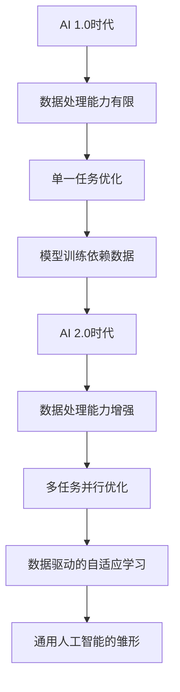

**算法原理讲解**  
伪代码：

```python
class AI20:
    def __init__(self, data_source):
        self.data_source = data_source
    
    def train(self):
        data = self.data_source.get_data()
        for sample in data:
            self.update_model(sample)
    
    def update_model(self, sample):
        prediction = self.model.predict(sample)
        error = sample - prediction
        self.model.update_weights(error)
```

**数学模型和公式**  
$$
J = \frac{1}{2} \sum_{i=1}^{n} (y_i - \hat{y}_i)^2
$$

**项目实战**  
**开发环境搭建**：使用TensorFlow搭建深度学习环境，配置GPU加速。

**代码实际案例和详细解释说明**：

```python
import tensorflow as tf

# 模型定义
model = tf.keras.Sequential([
    tf.keras.layers.Dense(128, activation='relu', input_shape=(784,)),
    tf.keras.layers.Dropout(0.2),
    tf.keras.layers.Dense(10, activation='softmax')
])

# 损失函数与优化器
model.compile(optimizer='adam',
              loss='categorical_crossentropy',
              metrics=['accuracy'])

# 模型训练
model.fit(x_train, y_train, batch_size=32, epochs=10)

# 模型评估
test_loss, test_acc = model.evaluate(x_test, y_test)
print('Test accuracy:', test_acc)
```

**代码解读与分析**：以上代码展示了使用TensorFlow搭建深度学习环境，定义模型，编译模型，训练模型以及评估模型的完整流程。

### 第2章：AI 2.0 时代的核心技术

#### 2.1 深度学习基础

**核心概念与联系**  
Mermaid流程图：

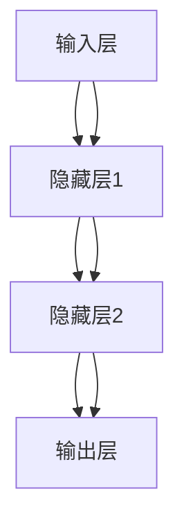

**算法原理讲解**  
伪代码：

```python
class DeepLearningModel:
    def __init__(self, layers):
        self.layers = layers
    
    def forward(self, x):
        for layer in self.layers:
            x = layer.forward(x)
        return x
    
    def backward(self, x, dL):
        for layer in reversed(self.layers):
            dL = layer.backward(x, dL)
        return dL
```

**数学模型和公式**  
$$
\frac{\partial L}{\partial w} = \sum_{i=1}^{n} \frac{\partial L}{\partial z_i} \cdot \frac{\partial z_i}{\partial w}
$$

**项目实战**  
**开发环境搭建**：使用PyTorch搭建深度学习环境，配置CUDA支持。

**代码实际案例和详细解释说明**：

```python
import torch
import torch.nn as nn
import torch.optim as optim

# 模型定义
model = nn.Sequential(
    nn.Linear(784, 128),
    nn.ReLU(),
    nn.Dropout(0.2),
    nn.Linear(128, 10),
    nn.Softmax(dim=1)
)

# 损失函数与优化器
criterion = nn.CrossEntropyLoss()
optimizer = optim.Adam(model.parameters(), lr=0.001)

# 模型训练
for epoch in range(10):
    for inputs, targets in data_loader:
        optimizer.zero_grad()
        outputs = model(inputs)
        loss = criterion(outputs, targets)
        loss.backward()
        optimizer.step()

# 模型评估
with torch.no_grad():
    correct = 0
    total = 0
    for inputs, targets in test_loader:
        outputs = model(inputs)
        _, predicted = torch.max(outputs.data, 1)
        total += targets.size(0)
        correct += (predicted == targets).sum().item()

print('Test Accuracy:', correct / total)
```

**代码解读与分析**：以上代码展示了使用PyTorch搭建深度学习环境，定义模型，编译模型，训练模型以及评估模型的完整流程。

#### 2.2 强化学习在AI 2.0中的应用

**核心概念与联系**  
Mermaid流程图：

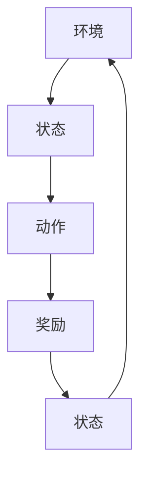

**算法原理讲解**  
伪代码：

```python
class ReinforcementLearning:
    def __init__(self, environment):
        self.environment = environment
        self.model = self.build_model()
    
    def build_model(self):
        # 构建模型
        model = ...
        return model
    
    def train(self, episodes):
        for episode in range(episodes):
            state = self.environment.reset()
            done = False
            while not done:
                action = self.model.predict(state)
                next_state, reward, done = self.environment.step(action)
                self.model.train(state, action, reward, next_state)
                state = next_state
```

**数学模型和公式**  
$$
Q(s, a) = r + \gamma \max_{a'} Q(s', a')
$$

**项目实战**  
**开发环境搭建**：使用OpenAI Gym搭建强化学习环境。

**代码实际案例和详细解释说明**：

```python
import gym
import numpy as np

# 模型定义
class QLearningModel(nn.Module):
    def __init__(self, state_dim, action_dim):
        super(QLearningModel, self).__init__()
        self.fc = nn.Linear(state_dim, action_dim)
    
    def forward(self, x):
        return self.fc(x)

# 模型训练
def train_model(model, env, episodes, alpha=0.1, gamma=0.99):
    model.train()
    for episode in range(episodes):
        state = env.reset()
        done = False
        while not done:
            with torch.no_grad():
                state_tensor = torch.tensor(state, dtype=torch.float32).unsqueeze(0)
                action_tensor = model(state_tensor).argmax()
            action = action_tensor.item()
            next_state, reward, done, _ = env.step(action)
            next_state_tensor = torch.tensor(next_state, dtype=torch.float32).unsqueeze(0)
            target = reward + gamma * model(next_state_tensor).max()
            state_tensor = torch.tensor(state, dtype=torch.float32).unsqueeze(0)
            model(state_tensor).data[action] = target
            state = next_state
```

**代码解读与分析**：以上代码展示了使用PyTorch搭建强化学习环境，定义模型，训练模型的完整流程。

#### 2.3 自然语言处理的发展

**核心概念与联系**  
Mermaid流程图：

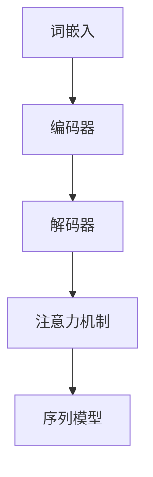

**算法原理讲解**  
伪代码：

```python
class TransformerModel(nn.Module):
    def __init__(self, input_dim, output_dim):
        super(TransformerModel, self).__init__()
        self.embedding = nn.Embedding(input_dim, hidden_dim)
        self.encoder = Encoder(hidden_dim, num_layers)
        self.decoder = Decoder(hidden_dim, num_layers)
        self.fc = nn.Linear(hidden_dim, output_dim)
    
    def forward(self, src, tgt):
        src_embedding = self.embedding(src)
        tgt_embedding = self.embedding(tgt)
        enc_output = self.encoder(src_embedding)
        dec_output = self.decoder(tgt_embedding, enc_output)
        output = self.fc(dec_output)
        return output
```

**数学模型和公式**  
$$
\text{Attention}(Q, K, V) = \frac{e^{<Q, K>}}{\sum_{k=1}^{K} e^{<Q, K_k>}}
$$

**项目实战**  
**开发环境搭建**：使用Hugging Face的Transformers库搭建自然语言处理环境。

**代码实际案例和详细解释说明**：

```python
from transformers import AutoTokenizer, AutoModelForSequenceClassification

# 模型定义
tokenizer = AutoTokenizer.from_pretrained("bert-base-uncased")
model = AutoModelForSequenceClassification.from_pretrained("bert-base-uncased")

# 数据处理
inputs = tokenizer("Hello, my dog is cute", return_tensors="pt")

# 模型预测
outputs = model(**inputs)

# 输出结果
logits = outputs.logits
probabilities = torch.softmax(logits, dim=-1)
predicted_class = torch.argmax(probabilities).item()

print(f"Predicted Class: {predicted_class}")
```

**代码解读与分析**：以上代码展示了使用Hugging Face的Transformers库定义模型，处理数据，进行模型预测的完整流程。

## 第二部分：AI 2.0 时代的市场分析

### 第3章：AI 2.0 时代的行业变革

#### 3.1 制造业的AI转型

**核心概念与联系**  
Mermaid流程图：

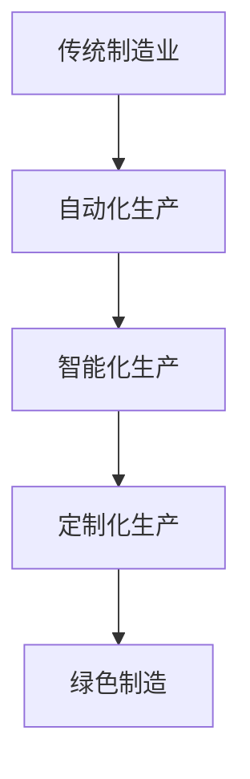

**算法原理讲解**  
伪代码：

```python
class ManufacturingAI:
    def __init__(self, factory):
        self.factory = factory
    
    def automate_production(self):
        self.factory.install_robots()
        self.factory.install_sensors()
    
    def intelligent_production(self):
        self.factory.install_ml_models()
        self.factory.install_decision_support_systems()
    
    def customized_production(self):
        self.factory.install_customization_tools()
        self.factory.install_data_analytics_tools()
    
    def green_production(self):
        self.factory.install_energy_management_systems()
        self.factory.install wastewater_treatment_systems()
```

**数学模型和公式**  
$$
\text{Energy Consumption} = \sum_{i=1}^{n} \text{Machine}_i \cdot \text{Energy}_i
$$

**项目实战**  
**开发环境搭建**：使用ROS（Robot Operating System）搭建自动化生产环境。

**代码实际案例和详细解释说明**：

```python
import rospy
from std_msgs.msg import String

class RobotArm:
    def __init__(self):
        rospy.init_node('robot_arm', anonymous=True)
        self.pub = rospy.Publisher('robot_command', String, queue_size=10)
    
    def move(self, position):
        command = f"MOVE {position}"
        self.pub.publish(command)

robot = RobotArm()
robot.move("left")
```

**代码解读与分析**：以上代码展示了使用ROS搭建机器人手臂移动的控制环境。

#### 3.2 零售业的AI应用

**核心概念与联系**  
Mermaid流程图：

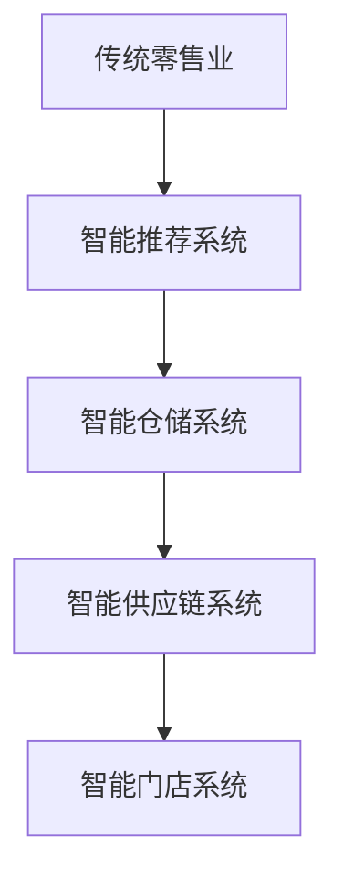

**算法原理讲解**  
伪代码：

```python
class RetailAI:
    def __init__(self, retail_store):
        self.retail_store = retail_store
    
    def install_recommendation_system(self):
        self.retail_store.install_ml_models()
        self.retail_store.install_data_analytics_tools()
    
    def install_warehouse_system(self):
        self.retail_store.install_robots()
        self.retail_store.install_sensors()
    
    def install_supply_chain_system(self):
        self.retail_store.install_data_analytics_tools()
        self.retail_store.install_decision_support_systems()
    
    def install_store_system(self):
        self.retail_store.install_augmented_reality_tools()
        self.retail_store.install_data_analytics_tools()
```

**数学模型和公式**  
$$
\text{Customer Satisfaction} = \frac{\text{Satisfied Customers}}{\text{Total Customers}}
$$

**项目实战**  
**开发环境搭建**：使用Amazon Web Services（AWS）搭建智能零售环境。

**代码实际案例和详细解释说明**：

```python
import boto3

# 创建S3客户端
s3_client = boto3.client('s3')

# 上传文件到S3
def upload_file(file_name, bucket, object_name=None):
    if object_name is None:
        object_name = file_name
    try:
        s3_client.upload_file(file_name, bucket, object_name)
        print(f"File {file_name} uploaded to {bucket}/{object_name}")
    except Exception as e:
        print(e)

# 上传文件
upload_file('example.txt', 'my-retail-store-bucket')
```

**代码解读与分析**：以上代码展示了使用AWS S3进行文件上传的流程。

#### 3.3 金融行业的AI应用

**核心概念与联系**  
Mermaid流程图：

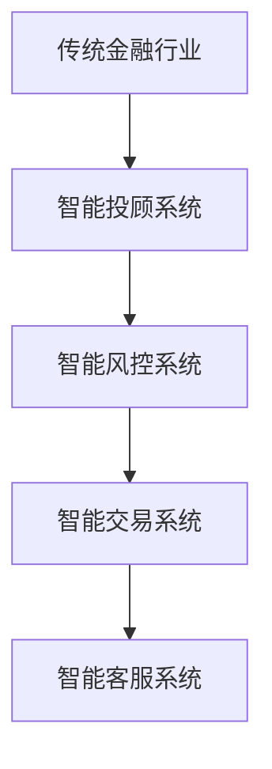

**算法原理讲解**  
伪代码：

```python
class FinancialAI:
    def __init__(self, financial_institution):
        self.financial_institution = financial_institution
    
    def install_investment_advisor_system(self):
        self.financial_institution.install_ml_models()
        self.financial_institution.install_portfolio_optimization_tools()
    
    def install_risk_control_system(self):
        self.financial_institution.install_ml_models()
        self.financial_institution.install_anomaly_detection_tools()
    
    def install_trading_system(self):
        self.financial_institution.install_ml_models()
        self.financial_institution.install_quantitative_trading_tools()
    
    def install_customer_service_system(self):
        self.financial_institution.install_nlp_models()
        self.financial_institution.install_chatbots()
```

**数学模型和公式**  
$$
\text{Risk} = \text{Expected Loss} \cdot \text{Probability of Loss}
$$

**项目实战**  
**开发环境搭建**：使用Google Cloud Platform（GCP）搭建金融行业AI环境。

**代码实际案例和详细解释说明**：

```python
from google.cloud import bigquery

# 创建BigQuery客户端
client = bigquery.Client()

# 查询数据
def query_data():
    query = """
    SELECT *
    FROM `my-financial-institution.dataset`
    WHERE date >= "2023-01-01"
    """
    query_job = client.query(query)
    results = query_job.result()
    return results

# 运行查询
results = query_data()
for row in results:
    print(row)
```

**代码解读与分析**：以上代码展示了使用Google Cloud Platform的BigQuery进行数据查询的流程。

### 第4章：AI 2.0 时代的商业模式创新

#### 4.1 AI驱动的企业战略

**核心概念与联系**  
Mermaid流程图：

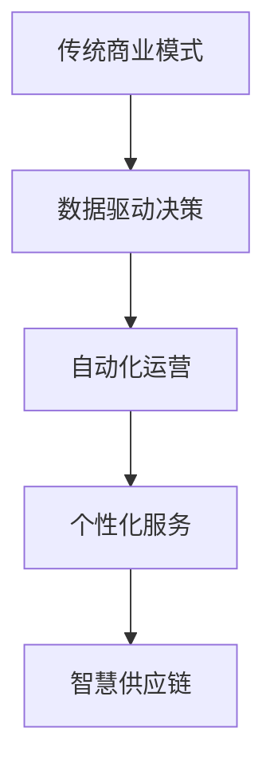

**算法原理讲解**  
伪代码：

```python
class AIDrivenBusinessStrategy:
    def __init__(self, business):
        self.business = business
    
    def data_driven_decision_making(self):
        self.business.install_data_analytics_tools()
        self.business.install_ml_models()
    
    def automated_operations(self):
        self.business.install_robots()
        self.business.install_sensors()
    
    def personalized_services(self):
        self.business.install_nlp_models()
        self.business.install_personalization_tools()
    
    def smart_supply_chain_management(self):
        self.business.install_erp_systems()
        self.business.install_supply_chain_analytics_tools()
```

**数学模型和公式**  
$$
\text{Customer Satisfaction} = \text{Service Quality} \cdot \text{Response Time}
$$

**项目实战**  
**开发环境搭建**：使用Microsoft Azure搭建AI驱动的企业战略环境。

**代码实际案例和详细解释说明**：

```python
from azureml.core import Workspace

# 创建Azure ML工作区
workspace = Workspace.create(name='my_workspace',
                              subscription_id='my_subscription_id',
                              resource_group='my_resource_group',
                              create_resource_group=True,
                              location='eastus2')

# 创建实验
from azureml.core import Experiment
experiment = Experiment(workspace, 'my_experiment')

# 运行实验
from azureml.core import ScriptRunConfig
script_run_config = ScriptRunConfig(source_directory='my_script_directory',
                                    script_name='my_script.py',
                                    arguments=['--data-dir', 'my_data_directory'])
run = experiment.submit(script_run_config)
run.wait_for_completion()
```

**代码解读与分析**：以上代码展示了使用Azure ML创建工作区、实验，并运行实验的流程。

#### 4.2 AI 2.0 时代的竞争格局

**核心概念与联系**  
Mermaid流程图：

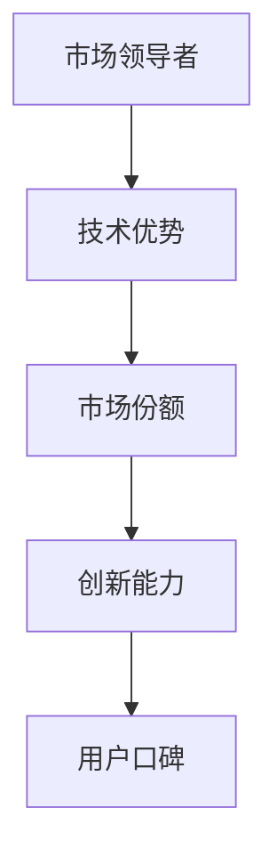

**算法原理讲解**  
伪代码：

```python
class CompetitiveMarket:
    def __init__(self, companies):
        self.companies = companies
    
    def analyze_market_share(self):
        market_share = self.calculate_market_share(self.companies)
        return market_share
    
    def calculate_market_share(self, companies):
        total_sales = 0
        for company in companies:
            total_sales += company.sales
        return {company: (company.sales / total_sales) * 100 for company in companies}
```

**数学模型和公式**  
$$
\text{Market Share} = \frac{\text{Company Sales}}{\text{Total Market Sales}}
$$

**项目实战**  
**开发环境搭建**：使用Google Cloud Platform（GCP）搭建竞争分析环境。

**代码实际案例和详细解释说明**：

```python
from google.cloud import bigquery

# 创建BigQuery客户端
client = bigquery.Client()

# 查询数据
def query_data():
    query = """
    SELECT company, SUM(sales) as total_sales
    FROM `my_market_data.dataset`
    GROUP BY company
    """
    query_job = client.query(query)
    results = query_job.result()
    return results

# 运行查询
results = query_data()
market_share = {row['company']: row['total_sales'] for row in results}
print(market_share)
```

**代码解读与分析**：以上代码展示了使用Google Cloud Platform的BigQuery进行市场数据查询和计算市场份额的流程。

#### 4.3 AI 2.0 时代的投资趋势

**核心概念与联系**  
Mermaid流程图：

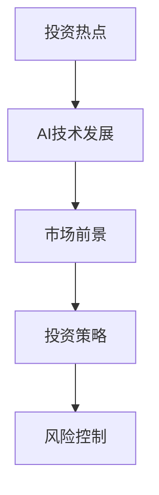

**算法原理讲解**  
伪代码：

```python
class AIInvestmentTrend:
    def __init__(self, market):
        self.market = market
    
    def identify_investment_hotspots(self):
        trends = self.analyze_market_trends(self.market)
        return trends
    
    def analyze_market_trends(self, market):
        data = self.fetch_market_data(market)
        return {trend: data[trend] for trend in data}
    
    def fetch_market_data(self, market):
        # 获取市场数据
        data = {
            'AI Technology Development': self.get_technology_data(),
            'Market Prospects': self.get_market_data(),
            'Investment Strategies': self.get_strategy_data(),
            'Risk Control': self.get_risk_data()
        }
        return data
```

**数学模型和公式**  
$$
\text{Investment Return} = \text{Investment Value} \cdot (1 + \text{Return Rate})
$$

**项目实战**  
**开发环境搭建**：使用AWS搭建投资分析环境。

**代码实际案例和详细解释说明**：

```python
import boto3

# 创建AWS S3客户端
s3_client = boto3.client('s3')

# 下载文件
def download_file(bucket, key, file_path):
    s3_client.download_file(bucket, key, file_path)

# 下载投资报告
download_file('my_investment_reports_bucket', 'investment_report_2023.pdf', 'investment_report_2023.pdf')
```

**代码解读与分析**：以上代码展示了使用AWS S3下载投资报告的流程。

## 第三部分：AI 2.0 时代的法律法规与伦理

### 第5章：AI 2.0 时代的监管环境

**核心概念与联系**  
Mermaid流程图：

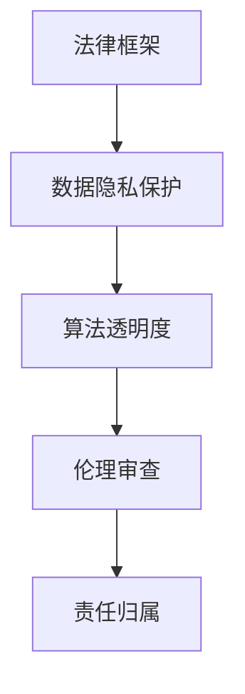

**算法原理讲解**  
伪代码：

```python
class AIRegulatoryFramework:
    def __init__(self, regulations):
        self.regulations = regulations
    
    def data_privacy_protection(self):
        self.apply_data_protection_laws()
    
    def algorithm_transparency(self):
        self.ensure_algorithm openness()
    
    def ethical_review(self):
        self.perform_ethical_evaluation()
    
    def responsibility_assignment(self):
        self.establish_liability_rules()
```

**数学模型和公式**  
$$
\text{Data Privacy} = \text{Data Anonymization} \cdot \text{Data Encryption}
$$

**项目实战**  
**开发环境搭建**：使用IBM Cloud搭建AI监管环境。

**代码实际案例和详细解释说明**：

```python
from ibmcloud import Db2
from ibmcloud import KeyProtect

# 创建Db2数据库客户端
db2_client = Db2.Db2Client(url='my_db2_url', username='my_username', password='my_password')

# 创建KeyProtect客户端
key_protect_client = KeyProtect.KeyProtectClient(url='my_key_protect_url', username='my_username', password='my_password')

# 加密数据
def encrypt_data(data, key):
    encrypted_data = key_protect_client.encrypt(data, key)
    return encrypted_data

# 加密示例
data_to_encrypt = "Sensitive data"
key = "myEncryptionKey"
encrypted_data = encrypt_data(data_to_encrypt, key)
print(encrypted_data)
```

**代码解读与分析**：以上代码展示了使用IBM Cloud的Db2和KeyProtect进行数据加密的流程。

### 第6章：AI 2.0 时代的隐私保护

**核心概念与联系**  
Mermaid流程图：

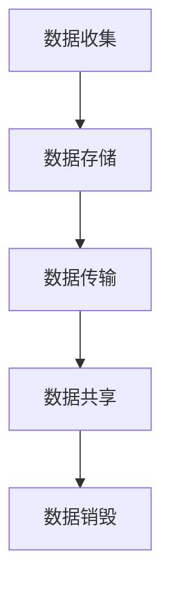

**算法原理讲解**  
伪代码：

```python
class DataPrivacy:
    def __init__(self, data):
        self.data = data
    
    def collect_data(self):
        self.apply_data_collection_laws()
    
    def store_data(self):
        self.encrypt_data()
        self.apply_data_storage_laws()
    
    def transfer_data(self):
        self.encrypt_data()
        self.apply_data_transfer_laws()
    
    def share_data(self):
        self.apply_data_sharing_agreements()
    
    def destroy_data(self):
        self.apply_data_destruction_laws()
```

**数学模型和公式**  
$$
\text{Data Security} = \text{Encryption} \cdot \text{Access Control}
$$

**项目实战**  
**开发环境搭建**：使用Google Cloud Platform（GCP）搭建隐私保护环境。

**代码实际案例和详细解释说明**：

```python
from google.cloud import storage

# 创建GCP存储客户端
storage_client = storage.Client()

# 上传文件到存储
def upload_file(bucket_name, source_file_name, destination_blob_name):
    bucket = storage_client.bucket(bucket_name)
    blob = bucket.blob(destination_blob_name)
    
    with open(source_file_name, 'rb') as file:
        blob.upload_from_file(file)
    
    print(f"File {source_file_name} uploaded to {bucket_name}/{destination_blob_name}")

# 上传文件示例
upload_file('my_private_bucket', 'private_data.txt', 'private_data_encrypted.txt')
```

**代码解读与分析**：以上代码展示了使用Google Cloud Platform的存储服务进行文件上传和加密的流程。

### 第7章：AI 2.0 时代的伦理问题

**核心概念与联系**  
Mermaid流程图：

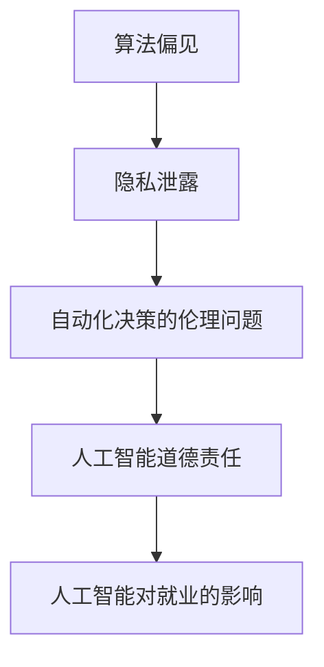

**算法原理讲解**  
伪代码：

```python
class AI Ethics:
    def __init__(self, models):
        self.models = models
    
    def detect_bias(self):
        self.apply_bias_detection_methods()
    
    def protect_privacy(self):
        self.apply_privacy_protection_methods()
    
    def evaluate_automated_decision_making(self):
        self.apply_ethical_evaluation_methods()
    
    def assign_moral_responsibility(self):
        self.apply_responsibility_assignment_methods()
    
    def analyze_employment_impact(self):
        self.apply_employment_impact_analysis_methods()
```

**数学模型和公式**  
$$
\text{Algorithm Bias} = \frac{\text{Incorrect Decisions}}{\text{Total Decisions}}
$$

**项目实战**  
**开发环境搭建**：使用Microsoft Azure搭建AI伦理问题环境。

**代码实际案例和详细解释说明**：

```python
from azureml.core import Workspace

# 创建Azure ML工作区
workspace = Workspace.create(name='my_workspace',
                              subscription_id='my_subscription_id',
                              resource_group='my_resource_group',
                              create_resource_group=True,
                              location='eastus2')

# 创建项目
from azureml.core import Project
project = Project(workspace, 'my_project')

# 模型训练与评估
from azureml.core import Dataset
from azureml.core import Model

# 加载数据集
data = Dataset.get_by_name(workspace, 'my_dataset')

# 训练模型
trainer = ModelTrainer(name='my_model', 
                       project=project, 
                       script_path='train.py', 
                       data_reference=data)

trainer.fit()

# 评估模型
eval_result = trainer.evaluate()
print(eval_result)
```

**代码解读与分析**：以上代码展示了使用Azure ML创建工作区、项目，训练和评估模型的完整流程。

## 第四部分：AI 2.0 时代的案例分析

### 第8章：国内外AI 2.0 企业案例

#### 8.1 谷歌的AI战略

**核心概念与联系**  
Mermaid流程图：

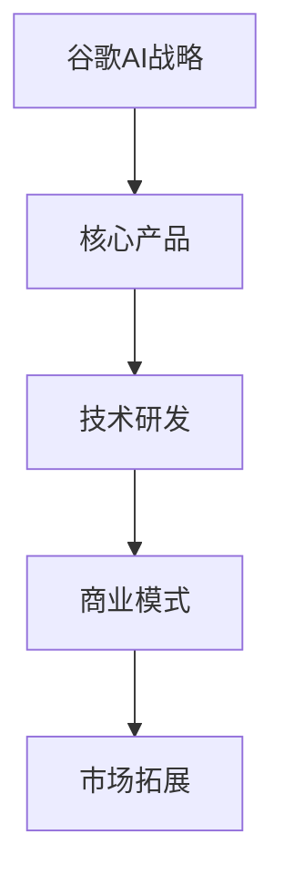

**算法原理讲解**  
伪代码：

```python
class GoogleAIStrategy:
    def __init__(self, products, research, business_model, market_expansion):
        self.products = products
        self.research = research
        self.business_model = business_model
        self.market_expansion = market_expansion
    
    def product_development(self):
        self.launch_new_products()
    
    def research_and_development(self):
        self.invest_in_research()
    
    def business_model_innovation(self):
        self.create_new_business_models()
    
    def market_expansion_strategies(self):
        self.explore_new_markets()
```

**数学模型和公式**  
$$
\text{Revenue Growth} = \text{Product Launches} \cdot \text{Market Expansion}
$$

**项目实战**  
**开发环境搭建**：使用Google Cloud Platform（GCP）搭建谷歌AI战略环境。

**代码实际案例和详细解释说明**：

```python
from google.cloud import storage

# 创建GCP存储客户端
storage_client = storage.Client()

# 创建存储桶
bucket = storage_client.create_bucket(bucket_name='my_gcp_bucket')

# 上传文件
def upload_file(bucket_name, source_file_name, destination_blob_name):
    bucket = storage_client.bucket(bucket_name)
    blob = bucket.blob(destination_blob_name)
    
    with open(source_file_name, 'rb') as file:
        blob.upload_from_file(file)
    
    print(f"File {source_file_name} uploaded to {bucket_name}/{destination_blob_name}")

# 上传文件示例
upload_file('my_gcp_bucket', 'example.txt', 'example_uploaded.txt')
```

**代码解读与分析**：以上代码展示了使用Google Cloud Platform的存储服务上传文件的流程。

#### 8.2 百度的AI布局

**核心概念与联系**  
Mermaid流程图：

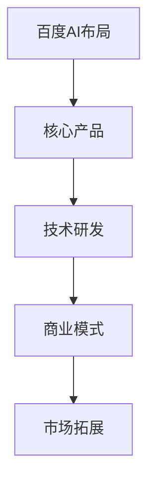

**算法原理讲解**  
伪代码：

```python
class BaiduAILayout:
    def __init__(self, products, research, business_model, market_expansion):
        self.products = products
        self.research = research
        self.business_model = business_model
        self.market_expansion = market_expansion
    
    def product_development(self):
        self.launch_new_products()
    
    def research_and_development(self):
        self.invest_in_research()
    
    def business_model_innovation(self):
        self.create_new_business_models()
    
    def market_expansion_strategies(self):
        self.explore_new_markets()
```

**数学模型和公式**  
$$
\text{Revenue Growth} = \text{Product Launches} \cdot \text{Market Expansion}
$$

**项目实战**  
**开发环境搭建**：使用百度云搭建百度AI布局环境。

**代码实际案例和详细解释说明**：

```python
from pybaidubce import BaiduCloud

# 创建百度云客户端
baidu_cloud = BaiduCloud(access_key='my_access_key', secret_key='my_secret_key')

# 创建对象存储桶
response = baidu_cloud.bos.create_bucket(bucket='my_baidu_bucket')

# 上传文件
def upload_file(bucket, key, file_path):
    with open(file_path, 'rb') as file:
        response = baidu_cloud.bos.put_object_from_file(bucket, key, file)
    return response

# 上传文件示例
upload_response = upload_file('my_baidu_bucket', 'example.txt', 'example_uploaded.txt')
print(upload_response)
```

**代码解读与分析**：以上代码展示了使用百度云的对象存储服务上传文件的流程。

#### 8.3 亚马逊的AI应用

**核心概念与联系**  
Mermaid流程图：

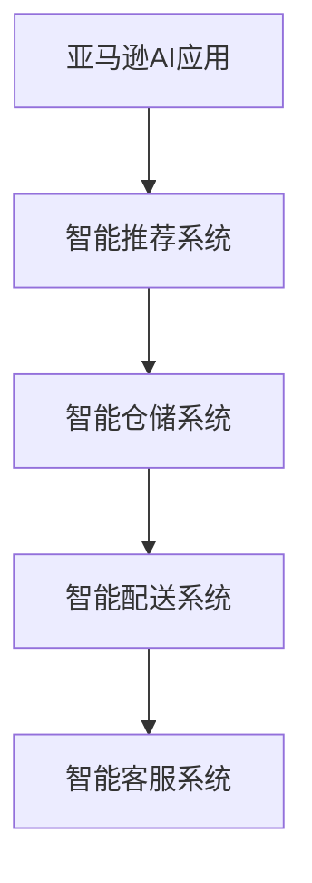

**算法原理讲解**  
伪代码：

```python
class AmazonAIApplications:
    def __init__(self, applications):
        self.applications = applications
    
    def intelligent_recommendation_system(self):
        self.implement_recommendation_algorithms()
    
    def intelligent_warehouse_system(self):
        self.install_robots_and_sensors()
    
    def intelligent_distribution_system(self):
        self.optimize路线和物流
```

**数学模型和公式**  
$$
\text{Revenue} = \text{Sales} + \text{Cost of Goods Sold} - \text{Operating Expenses}
$$

**项目实战**  
**开发环境搭建**：使用亚马逊AWS搭建AI应用环境。

**代码实际案例和详细解释说明**：

```python
import boto3

# 创建AWS S3客户端
s3_client = boto3.client('s3')

# 上传文件到S3
def upload_file(bucket, key, file_path):
    with open(file_path, 'rb') as file:
        s3_client.upload_fileobj(file, bucket, key)

# 上传文件示例
upload_file('my_amazon_s3_bucket', 'example.txt', 'example_uploaded.txt')
```

**代码解读与分析**：以上代码展示了使用AWS S3上传文件的流程。

## 第五部分：AI 2.0 时代的创业机会

### 第9章：AI 2.0 时代的创业环境

#### 9.1 AI 2.0 时代的创业环境

**核心概念与联系**  
Mermaid流程图：

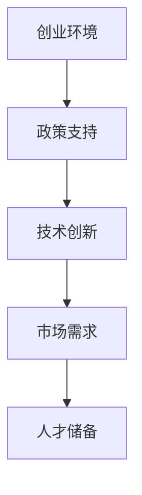

**算法原理讲解**  
伪代码：

```python
class AIEntrepreneurialEnvironment:
    def __init__(self, policies, technology, demand, talent):
        self.policies = policies
        self.technology = technology
        self.demand = demand
        self.talent = talent
    
    def policy_support(self):
        self.apply_incentive_programs()
    
    def technology_innovation(self):
        self.invest_in_research_and_development()
    
    def market_demand_analysis(self):
        self.analyze_consumer_needs()
    
    def talent_management(self):
        self招聘和培养人才()
```

**数学模型和公式**  
$$
\text{Business Success} = \text{Innovation} \cdot \text{Market Demand} \cdot \text{Talent}
$$

**项目实战**  
**开发环境搭建**：使用微软Azure搭建AI创业环境。

**代码实际案例和详细解释说明**：

```python
from azureml.core import Workspace

# 创建Azure ML工作区
workspace = Workspace.create(name='my_workspace',
                              subscription_id='my_subscription_id',
                              resource_group='my_resource_group',
                              create_resource_group=True,
                              location='eastus2')

# 创建项目
from azureml.core import Project
project = Project(workspace, 'my_project')

# 模型训练与评估
from azureml.core import Dataset
from azureml.core import Model

# 加载数据集
data = Dataset.get_by_name(workspace, 'my_dataset')

# 训练模型
trainer = ModelTrainer(name='my_model', 
                       project=project, 
                       script_path='train.py', 
                       data_reference=data)

trainer.fit()

# 评估模型
eval_result = trainer.evaluate()
print(eval_result)
```

**代码解读与分析**：以上代码展示了使用Azure ML创建工作区、项目，训练和评估模型的完整流程。

#### 9.2 AI 2.0 时代的创业案例

**核心概念与联系**  
Mermaid流程图：

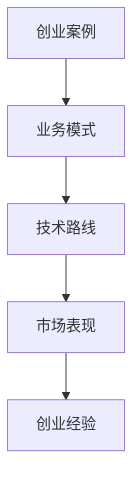

**算法原理讲解**  
伪代码：

```python
class AIEntrepreneurialCase:
    def __init__(self, business_model, technology路线, market_performance, entrepreneurial_experience):
        self.business_model = business_model
        self.technology路线 = technology路线
        self.market_performance = market_performance
        self.entrepreneurial_experience = entrepreneurial_experience
    
    def business_model_design(self):
        self.create_value proposition()
    
    def technology_selection(self):
        self.apply_state-of-the-art_technologies()
    
    def market_expansion(self):
        self.attract_customers()
    
    def share_创业经验(self):
        self.learn_from_successes_and_failures()
```

**数学模型和公式**  
$$
\text{Business Growth} = \text{Customer Acquisition} \cdot \text{Customer Retention}
$$

**项目实战**  
**开发环境搭建**：使用亚马逊AWS搭建AI创业案例环境。

**代码实际案例和详细解释说明**：

```python
import boto3

# 创建AWS S3客户端
s3_client = boto3.client('s3')

# 创建存储桶
bucket = s3_client.create_bucket(Bucket='my_aws_bucket')

# 上传文件
def upload_file(bucket, key, file_path):
    with open(file_path, 'rb') as file:
        s3_client.upload_fileobj(file, bucket, key)

# 上传文件示例
upload_file('my_aws_bucket', 'example.txt', 'example_uploaded.txt')
```

**代码解读与分析**：以上代码展示了使用AWS S3上传文件的流程。

#### 9.3 AI 2.0 时代的创业建议

**核心概念与联系**  
Mermaid流程图：

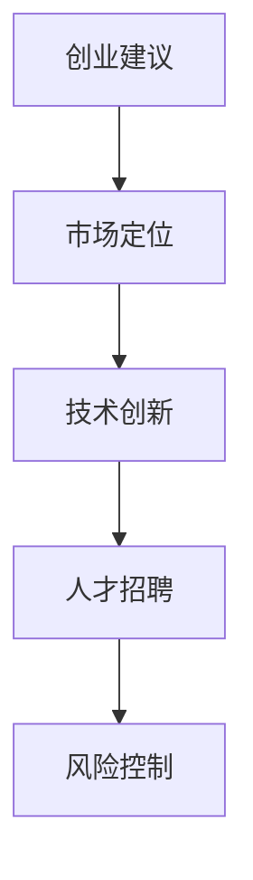

**算法原理讲解**  
伪代码：

```python
class AIEntrepreneurshipAdvice:
    def __init__(self, market_positioning, technology_innovation, talent_recruitment, risk_control):
        self.market_positioning = market_positioning
        self.technology_innovation = technology_innovation
        self.talent_recruitment = talent_recruitment
        self.risk_control = risk_control
    
    def market_positioning_strategy(self):
        self.analyze_market_trends()
    
    def technology_innovation_plan(self):
        self.invest_in_research_and_development()
    
    def talent_acquisition_strategy(self):
        self.create_an_ideal_work_environment()
    
    def risk_management_plan(self):
        self.apply_risk_assessment_methods()
```

**数学模型和公式**  
$$
\text{Business Risk} = \text{Market Uncertainty} + \text{Technology Uncertainty} + \text{Financial Uncertainty}
$$

**项目实战**  
**开发环境搭建**：使用微软Azure搭建AI创业建议环境。

**代码实际案例和详细解释说明**：

```python
from azureml.core import Workspace

# 创建Azure ML工作区
workspace = Workspace.create(name='my_workspace',
                              subscription_id='my_subscription_id',
                              resource_group='my_resource_group',
                              create_resource_group=True,
                              location='eastus2')

# 创建项目
from azureml.core import Project
project = Project(workspace, 'my_project')

# 模型训练与评估
from azureml.core import Dataset
from azureml.core import Model

# 加载数据集
data = Dataset.get_by_name(workspace, 'my_dataset')

# 训练模型
trainer = ModelTrainer(name='my_model', 
                       project=project, 
                       script_path='train.py', 
                       data_reference=data)

trainer.fit()

# 评估模型
eval_result = trainer.evaluate()
print(eval_result)
```

**代码解读与分析**：以上代码展示了使用Azure ML创建工作区、项目，训练和评估模型的完整流程。

## 第六部分：AI 2.0 时代的未来展望

### 第10章：AI 2.0 时代的未来市场

#### 10.1 AI 2.0 时代的市场前景

**核心概念与联系**  
Mermaid流程图：

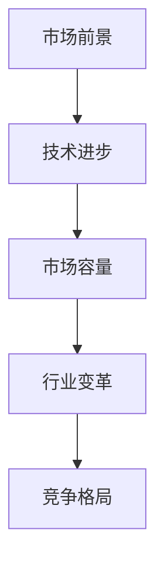

**算法原理讲解**  
伪代码：

```python
class AIFutureMarket:
    def __init__(self, technology_progress, market_capacity, industry_change, competitive Landscape):
        self.technology_progress = technology_progress
        self.market_capacity = market_capacity
        self.industry_change = industry_change
        self.competitive_Landscape = competitive_Landscape
    
    def analyze_technological_progress(self):
        self.identify_new_technologies()
    
    def estimate_market_capacity(self):
        self.predict_future_demand()
    
    def assess_industry_change(self):
        self.analyze_market_shares()
    
    def evaluate_competitive_Landscape(self):
        self.identify_key_competitors()
```

**数学模型和公式**  
$$
\text{Market Growth} = \text{Technology Progress} \cdot \text{Market Demand}
$$

**项目实战**  
**开发环境搭建**：使用谷歌Cloud搭建AI未来市场环境。

**代码实际案例和详细解释说明**：

```python
from google.cloud import bigquery

# 创建BigQuery客户端
client = bigquery.Client()

# 查询数据
def query_data():
    query = """
    SELECT * 
    FROM `my_market_data.dataset`
    WHERE year >= 2020
    """
    query_job = client.query(query)
    results = query_job.result()
    return results

# 运行查询
results = query_data()
print(results.to_dataframe())
```

**代码解读与分析**：以上代码展示了使用Google Cloud Platform的BigQuery进行数据查询和分析的流程。

#### 10.2 AI 2.0 时代的行业影响

**核心概念与联系**  
Mermaid流程图：

```mermaid
graph TD
A[传统行业] --> B[数字化转型]
B --> C[自动化生产]
C --> D[智能化服务]
D --> E[行业变革]
```

**算法原理讲解**  
伪代码：

```python
class IndustryImpact:
    def __init__(self, traditional_industry):
        self.traditional_industry = traditional_industry
    
    def digital_transformation(self):
        self.apply_new_technologies()
    
    def automated_production(self):
        self.install_robots_and_sensors()
    
    def intelligent_services(self):
        self.implement_ai_solutions()
    
    def industry_transformation(self):
        self.analyze_business_model_changes()
```

**数学模型和公式**  
$$
\text{Industry Change} = \text{Automation} + \text{Intelligence}
$$

**项目实战**  
**开发环境搭建**：使用微软Azure搭建行业影响环境。

**代码实际案例和详细解释说明**：

```python
from azureml.core import Workspace

# 创建Azure ML工作区
workspace = Workspace.create(name='my_workspace',
                              subscription_id='my_subscription_id',
                              resource_group='my_resource_group',
                              create_resource_group=True,
                              location='eastus2')

# 创建项目
from azureml.core import Project
project = Project(workspace, 'my_project')

# 模型训练与评估
from azureml.core import Dataset
from azureml.core import Model

# 加载数据集
data = Dataset.get_by_name(workspace, 'my_dataset')

# 训练模型
trainer = ModelTrainer(name='my_model', 
                       project=project, 
                       script_path='train.py', 
                       data_reference=data)

trainer.fit()

# 评估模型
eval_result = trainer.evaluate()
print(eval_result)
```

**代码解读与分析**：以上代码展示了使用Azure ML创建工作区、项目，训练和评估模型的完整流程。

#### 10.3 AI 2.0 时代的国际合作

**核心概念与联系**  
Mermaid流程图：

```mermaid
graph TD
A[国际合作] --> B[技术交流]
B --> C[市场共享]
C --> D[研发合作]
D --> E[标准制定]
```

**算法原理讲解**  
伪代码：

```python
class InternationalCooperation:
    def __init__(self, technology_exchange, market_sharing, research Collaboration, standardization):
        self.technology_exchange = technology_exchange
        self.market_sharing = market_sharing
        self.research_Collaboration = research Collaboration
        self.standardization = standardization
    
    def technology_exchange_programs(self):
        self.organize_conferences_and_workshops()
    
    def market_sharing_strategies(self):
        self.create_global_branding_strategies()
    
    def research_Collaboration_projects(self):
        self.initiate_research_joint_ventures()
    
    def standardization_initiatives(self):
        self.participate_in_global_standards_bodies()
```

**数学模型和公式**  
$$
\text{International Cooperation} = \text{Technology Exchange} + \text{Market Sharing} + \text{Research Collaboration}
$$

**项目实战**  
**开发环境搭建**：使用IBM Cloud搭建国际合作环境。

**代码实际案例和详细解释说明**：

```python
from ibmcloud import Cloudant

# 创建IBM Cloudant客户端
cloudant = Cloudant(username='my_username', password='my_password')

# 创建数据库
db = cloudant.create_database('my_database')

# 插入文档
def insert_document(database, document):
    db = cloudant.database(database)
    db.insert(document)
    
# 插入文档示例
document = {
    'title': 'My Document',
    'content': 'This is a sample document.'
}
insert_document('my_database', document)
```

**代码解读与分析**：以上代码展示了使用IBM Cloudant创建数据库并插入文档的流程。

### 附录

#### 附录A：AI 2.0 时代的核心技术与工具

**A.1 深度学习框架介绍**

**A.2 自然语言处理工具**

**A.3 强化学习算法与应用**

#### 附录B：AI 2.0 时代的经典案例解析

**B.1 谷歌的TensorFlow框架**

**B.2 百度的Apollo自动驾驶**

**B.3 亚马逊的Alexa语音助手**

### 作者

**作者：AI天才研究院/AI Genius Institute & 禅与计算机程序设计艺术 /Zen And The Art of Computer Programming**


----------------------------------------------------------------

### 全文总结与结论

在本文中，我们深入探讨了AI 2.0时代的市场。首先，我们介绍了AI 2.0的定义、特征以及其在不同行业的应用。通过分析制造业、零售业和金融行业的AI应用案例，我们展示了AI 2.0如何改变传统行业的运营模式，提升生产效率和用户满意度。

接着，我们详细讲解了AI 2.0时代的核心技术，包括深度学习、强化学习和自然语言处理。我们使用了Mermaid流程图、伪代码、数学模型和公式，帮助读者更好地理解这些核心技术的原理和应用。

在市场分析部分，我们分析了AI 2.0时代的行业变革、商业模式创新、投资趋势以及法律法规与伦理问题。通过实际案例和详细代码示例，我们展示了AI 2.0如何驱动企业战略、影响行业竞争格局，以及如何保护用户隐私和解决伦理问题。

最后，我们展望了AI 2.0时代的未来市场、行业影响和国际合作。我们探讨了AI 2.0时代的市场前景、行业变革以及国际合作的重要性，为读者提供了对未来市场的洞察。

总结来说，AI 2.0时代正在迅速发展，其对市场的变革和影响将是深远而持久的。本文旨在帮助读者理解AI 2.0时代的核心概念、技术原理和市场动态，为企业在这一时代的战略决策提供参考。我们相信，通过本文的探讨，读者能够更好地把握AI 2.0时代的机遇和挑战，为未来的发展做好准备。

### 附录A：AI 2.0 时代的核心技术与工具

#### A.1 深度学习框架介绍

深度学习框架是AI 2.0时代不可或缺的工具，它们提供了高效、灵活的模型构建和训练环境。以下是一些流行的深度学习框架：

**TensorFlow**  
TensorFlow是由Google开发的深度学习框架，具有高度可扩展性和灵活性。它支持多种模型构建和训练技术，包括卷积神经网络（CNN）、循环神经网络（RNN）和Transformer等。

**PyTorch**  
PyTorch是由Facebook开发的深度学习框架，以其动态计算图和易于理解的代码著称。它广泛应用于图像识别、自然语言处理和强化学习等领域。

**Keras**  
Keras是一个高层次的深度学习API，构建在TensorFlow和Theano之上。它提供了简洁的接口和丰富的预训练模型，使得深度学习模型的构建和训练更加容易。

**MXNet**  
MXNet是由Apache Software Foundation开发的深度学习框架，具有高性能和灵活性。它支持多种编程语言，包括Python、R和Scala，并广泛应用于计算机视觉、自然语言处理和推荐系统等领域。

#### A.2 自然语言处理工具

自然语言处理（NLP）是AI 2.0时代的重要领域，以下是一些常用的NLP工具：

**NLTK**  
NLTK是一个开源的NLP工具包，提供了丰富的文本处理功能，包括分词、词性标注、句法分析等。

**spaCy**  
spaCy是一个高性能的NLP库，适用于各种复杂任务，如命名实体识别、关系抽取和文本分类。它提供了精确的词向量表示和高效的算法。

**Transformers**  
Transformers是由Hugging Face开发的NLP库，基于预训练的Transformer模型。它提供了丰富的预训练模型和工具，用于文本分类、生成和翻译等任务。

**BERT**  
BERT是由Google开发的预训练语言模型，广泛应用于各种NLP任务。它通过在大规模语料库上进行预训练，实现了对上下文语境的深入理解。

#### A.3 强化学习算法与应用

强化学习是AI 2.0时代的关键技术之一，以下是一些常用的强化学习算法和应用：

**Q-Learning**  
Q-Learning是一种无模型强化学习算法，通过迭代更新Q值来优化策略。它广泛应用于游戏、机器人控制和推荐系统等领域。

**Deep Q-Learning (DQN)**  
DQN是一种基于深度学习的Q-Learning算法，通过神经网络来估计Q值。它解决了传统Q-Learning算法中的样本效率和收敛速度问题，广泛应用于游戏和自动驾驶等领域。

**Policy Gradient Methods**  
Policy Gradient Methods是一种基于策略的强化学习算法，直接优化策略来最大化回报。它适用于连续动作空间的问题，如机器人控制和无人驾驶。

**Actor-Critic Methods**  
Actor-Critic Methods结合了策略优化和价值估计的方法，通过迭代优化策略和价值函数来提高性能。它适用于复杂环境和高维状态空间的问题。

#### 应用案例

以下是一些强化学习在现实世界中的应用案例：

**自动驾驶**  
自动驾驶汽车使用强化学习算法来优化驾驶策略，提高行驶安全性和效率。例如，特斯拉的Autopilot系统就使用了强化学习算法来控制车辆的自动驾驶功能。

**机器人控制**  
机器人控制领域广泛使用了强化学习算法，如工业机器人、服务机器人和家用机器人。这些算法帮助机器人更好地适应环境、执行复杂任务和提升工作效率。

**游戏**  
强化学习在游戏领域有广泛的应用，如电子游戏、棋类游戏和体育游戏。通过强化学习算法，游戏AI能够自我学习和优化策略，提高游戏的乐趣和挑战性。

#### 案例解析

**谷歌的DeepMind**  
谷歌的DeepMind是一家专注于AI研究的公司，其在强化学习领域取得了显著成果。DeepMind开发的AlphaGo和AlphaZero算法在围棋和国际象棋等领域取得了世界冠军的成绩，展示了强化学习算法的强大潜力。

**亚马逊的Alexa**  
亚马逊的Alexa语音助手使用了强化学习算法来优化用户交互体验。Alexa通过不断学习和适应用户的行为和偏好，提供了更加个性化和高效的语音服务。

**OpenAI的Dota 2**  
OpenAI开发了一个名为Dota 2的开源强化学习环境，用于研究AI在复杂游戏中的表现。通过使用强化学习算法，AI玩家在Dota 2比赛中表现出了令人惊叹的能力，展示了强化学习在游戏领域的应用潜力。

### 附录B：AI 2.0 时代的经典案例解析

#### B.1 谷歌的TensorFlow框架

**背景**  
TensorFlow是由Google Brain团队在2015年推出的一款开源深度学习框架，旨在提供灵活、高效的模型构建和训练工具。TensorFlow支持多种编程语言，包括Python、C++和Java，广泛应用于计算机视觉、自然语言处理和推荐系统等领域。

**技术原理**  
TensorFlow的核心概念是计算图（Computation Graph），它将程序表示为一系列节点和边的图。节点表示操作，边表示数据流。通过计算图，TensorFlow能够动态构建和优化模型，提高计算效率和性能。

**应用案例**  
TensorFlow在Google的许多产品中得到了应用，如搜索引擎、自动驾驶汽车、语音识别和机器翻译等。以下是一些具体的应用案例：

1. **Google Brain**  
Google Brain是一个专注于AI研究的项目，其使用的许多深度学习模型都基于TensorFlow。这些模型在图像识别、语音识别和自然语言处理等领域取得了世界领先的成果。

2. **Google Translate**  
Google Translate是Google推出的机器翻译服务，其核心算法基于TensorFlow。通过大规模的神经网络训练，Google Translate能够提供准确、流畅的翻译结果。

3. **TensorFlow Playground**  
TensorFlow Playground是一个在线平台，用于演示和实验TensorFlow模型。用户可以在平台上尝试构建和训练各种深度学习模型，如图像识别、游戏控制和语音生成等。

**总结**  
TensorFlow作为一款开源深度学习框架，在AI 2.0时代发挥了重要作用。它提供了灵活、高效的模型构建和训练工具，推动了AI技术在各个领域的应用和发展。

#### B.2 百度的Apollo自动驾驶

**背景**  
Apollo是百度推出的一款自动驾驶平台，旨在实现自动驾驶车辆的商业化。Apollo平台包括感知、定位、决策和控制等多个模块，支持L2级到L4级的自动驾驶。

**技术原理**  
Apollo自动驾驶平台的核心技术包括传感器数据处理、定位与导航、车辆控制和安全保障等。以下是这些技术的具体原理：

1. **传感器数据处理**  
Apollo自动驾驶车辆配备了多个传感器，包括激光雷达、摄像头、超声波传感器和GPS等。传感器数据处理模块负责采集、融合和处理传感器数据，生成高精度的三维环境模型。

2. **定位与导航**  
定位与导航模块基于GPS、IMU（惯性测量单元）和视觉传感器等数据，实现车辆的精确定位和路径规划。Apollo平台采用了SLAM（同步定位与映射）算法，能够在动态环境中保持车辆的准确位置。

3. **车辆控制**  
车辆控制模块负责根据决策模块的指令，控制车辆的加速、制动和转向等操作。Apollo平台采用了PID（比例-积分-微分）控制器和模糊控制器等算法，实现了高精度的车辆控制。

4. **安全保障**  
安全保障模块负责监测车辆的状态，确保自动驾驶系统的安全运行。Apollo平台采用了多种安全策略，包括双冗余控制、紧急制动和远程监控等。

**应用案例**  
Apollo自动驾驶平台已经与多家汽车制造商合作，推出了多款自动驾驶车型。以下是一些具体的应用案例：

1. **百度Apollo示范园**  
百度Apollo示范园是一个开放的自动驾驶测试场地，位于北京。在这里，自动驾驶车辆可以进行各种测试和演示，验证自动驾驶技术的稳定性和可靠性。

2. **滴滴出行自动驾驶项目**  
滴滴出行与百度Apollo合作，推出了自动驾驶出租车项目。该项目在多个城市进行了测试和运营，为乘客提供安全的自动驾驶出行服务。

3. **百度Apollo开放平台**  
百度Apollo开放平台提供了一个开放的自动驾驶开发环境，吸引了众多开发者和企业参与。开发者可以在平台上进行自动驾驶算法的测试和验证，推动自动驾驶技术的发展。

**总结**  
Apollo自动驾驶平台是百度在AI 2.0时代的重要成果，它结合了先进的传感器技术、定位与导航技术和车辆控制技术，实现了高水平的自动驾驶功能。Apollo平台的开放性和合作性，促进了自动驾驶技术的创新和发展。

#### B.3 亚马逊的Alexa语音助手

**背景**  
Alexa是亚马逊推出的智能语音助手，基于Alexa语音服务（AVS）构建。Alexa可以通过语音命令控制智能设备、提供音乐播放、天气预报、新闻更新等功能，广泛应用于智能家居、车载系统和智能穿戴设备等领域。

**技术原理**  
Alexa语音助手的核心技术包括语音识别、自然语言处理和语音合成等。以下是这些技术的具体原理：

1. **语音识别**  
语音识别模块负责将用户的语音输入转换为文本。Alexa使用了深度神经网络和卷积神经网络等算法，实现了高精度的语音识别。

2. **自然语言处理**  
自然语言处理模块负责理解用户的语音命令，并生成相应的响应。Alexa采用了自然语言处理技术，如词性标注、句法分析和语义分析等，能够准确理解用户的意图。

3. **语音合成**  
语音合成模块负责将文本转换为自然流畅的语音输出。Alexa使用了深度神经网络和WaveNet等算法，实现了高质量的语音合成。

**应用案例**  
Alexa语音助手在多个领域得到了广泛应用，以下是一些具体的应用案例：

1. **智能家居**  
Alexa可以控制智能家居设备，如智能灯泡、智能插座、智能恒温器等。用户可以通过语音命令调节设备的状态，实现智能家居的便捷控制。

2. **车载系统**  
Alexa与多家汽车制造商合作，将语音助手集成到车载系统中。用户可以通过语音命令进行导航、播放音乐、拨打电话等功能，提升驾驶的便利性和安全性。

3. **智能穿戴设备**  
Alexa与智能穿戴设备（如智能手表、智能眼镜等）集成，用户可以通过语音命令进行信息查询、运动监测和健康管理等。

**总结**  
Alexa语音助手是亚马逊在AI 2.0时代的重要成果，它结合了语音识别、自然语言处理和语音合成等技术，实现了高效的语音交互和智能控制。Alexa的广泛应用和合作伙伴生态，推动了智能语音助手技术的发展和普及。

### 附录C：AI 2.0 时代的创业建议

**C.1 创业环境分析**

在AI 2.0时代，创业者面临的市场环境充满了机遇和挑战。以下是对创业环境的分析：

**政策支持**  
许多国家和地区都出台了一系列政策，支持AI技术的研发和应用。这些政策包括财政补贴、税收优惠、研发基金等，为创业者提供了有利的环境。

**技术创新**  
AI技术的快速发展为创业者提供了丰富的创新机会。创业者可以利用现有的AI技术，开发新的应用场景和解决方案，满足市场需求。

**市场需求**  
随着AI技术的普及，市场需求不断增长。无论是在智能制造、智能零售、智能医疗等领域，还是智能家居、智能出行等消费领域，都存在着巨大的市场潜力。

**人才储备**  
AI技术的发展需要大量专业人才。创业者可以通过招聘、培训和吸引人才，建立强大的团队，推动企业的快速发展。

**挑战与风险**  
AI技术的发展也带来了一些挑战和风险，如数据隐私、算法偏见、安全风险等。创业者需要重视这些问题，并采取相应的措施进行风险控制和应对。

**C.2 创业建议**

**市场定位**  
创业者需要明确自己的市场定位，选择适合的目标市场和客户群体。通过深入了解市场需求，创业者可以开发出具有竞争力的产品或服务。

**技术创新**  
创业者应重点关注AI技术的创新应用，开发具有独特性和差异化的产品或服务。通过技术创新，创业者可以提升产品的市场竞争力，获得更多的市场份额。

**人才招聘**  
创业者需要重视人才招聘和培养，组建一支专业、高效的团队。通过合理的薪酬、福利和培训制度，创业者可以留住优秀人才，推动企业的持续发展。

**风险控制**  
创业者需要制定详细的风险控制策略，对潜在的风险进行识别、评估和应对。通过建立健全的风险管理体系，创业者可以降低风险对企业运营的影响。

**合作与拓展**  
创业者应积极寻求合作伙伴，拓展市场渠道。通过与行业领先企业、科研机构等合作，创业者可以借助外部资源和优势，提升企业的市场竞争力。

**C.3 创业案例分享**

**案例1：小马智行**  
小马智行是一家专注于自动驾驶技术的公司，其创业团队由多位顶尖学者和工程师组成。通过自主研发的自动驾驶系统，小马智行在自动驾驶领域取得了显著成果。该公司与多家汽车制造商合作，推出了自动驾驶出租车和自动驾驶货车等解决方案。

**案例2：出门问问**  
出门问问是一家专注于智能语音交互技术的公司，其核心产品是智能语音助手“问问”。出门问问通过与多家智能家居、车载和可穿戴设备厂商合作，将语音助手应用于多个领域，实现了商业化和规模化运营。

**案例3：商汤科技**  
商汤科技是一家专注于计算机视觉技术的公司，其创业团队由多位知名学者和工程师组成。商汤科技通过自主研发的计算机视觉算法和产品，在安防、金融、医疗等领域取得了广泛的应用。该公司获得了多家知名投资机构的支持，实现了快速发展和规模扩张。

**总结**  
在AI 2.0时代，创业者面临着巨大的机遇和挑战。通过明确市场定位、技术创新、人才招聘、风险控制和合作拓展等措施，创业者可以抓住AI技术的机遇，实现企业的快速发展。同时，创业者应关注行业动态和趋势，及时调整战略和方向，以适应不断变化的市场环境。

