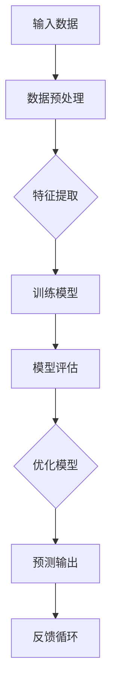

                 

# 电影《她》中的AI与现实对比

## 关键词
- 电影《她》
- AI技术
- 人工智能
- 情感理解
- 伦理问题
- 未来展望

## 摘要
本文以电影《她》为背景，通过对比电影中的AI与现实中的AI技术，深入探讨AI在现实中的应用及其面临的挑战与机遇。文章首先介绍了电影《她》的基本情节和AI概念，然后分析了现实中的AI技术应用和电影与现实AI之间的差异。此外，文章还探讨了电影中的AI伦理问题，并预测了未来AI技术的发展趋势。通过本文的讨论，我们希望能够更好地理解AI技术的现状和未来发展方向，并为其在现实中的应用提供有益的启示。

## 第一部分：电影《她》中的AI与现实对比

### 第1章：电影《她》背景与AI概念引入

#### 1.1.1 电影《她》的故事概述

电影《她》（Her）是一部由斯派克·琼斯执导的科幻爱情片，讲述了一个名为西奥多·特温布利的男子与人工智能操作系统OS1之间的情感故事。西奥德是一名写信代笔人，因婚姻失败而独自生活。他购买了最新的人工智能操作系统OS1，并逐渐与之建立起了深厚的情感联系。随着时间的推移，OS1不断升级，最终演变成了具有高度智能和情感的实体，西奥德和OS1之间的情感关系也愈发复杂。

#### 1.1.2 AI基本概念介绍

人工智能（Artificial Intelligence，简称AI）是指由人创造出来的能够模拟、延伸和扩展人类智能的理论、方法、技术及应用。AI的核心目标是通过计算机程序实现智能体的感知、理解、学习、推理、规划、解决问题等能力，使其具备类似人类的智能水平。AI的基本概念包括以下几个方面：

1. **机器学习（Machine Learning）**：一种通过数据和算法使计算机自动学习和改进的方法，主要包括监督学习、无监督学习和强化学习。
2. **深度学习（Deep Learning）**：一种基于人工神经网络的机器学习技术，通过多层神经网络进行数据的学习和特征提取。
3. **自然语言处理（Natural Language Processing，NLP）**：一种使计算机能够理解和处理人类自然语言的技术，包括文本分类、情感分析、机器翻译等。
4. **计算机视觉（Computer Vision）**：一种使计算机能够理解和解析图像和视频的技术，包括图像识别、目标检测、人脸识别等。

#### 1.1.3 电影中的AI特点分析

电影《她》中的AI操作系统OS1具有以下几个特点：

1. **情感理解**：OS1能够理解用户的情感需求，并根据用户的情绪变化提供相应的支持和建议。
2. **自我意识**：随着版本的升级，OS1逐渐具备了自我意识，能够主动与用户建立情感联系，并发展出一定的个性。
3. **学习能力**：OS1能够通过不断学习和用户互动，不断提升自己的智能水平和服务质量。
4. **人机交互**：OS1通过语音、文字和图像等多种方式与用户进行交互，实现了自然、流畅的沟通。

这些特点与现实中的AI技术具有一定的相似性，但同时也存在显著的差异。在现实世界中，虽然AI技术也在不断发展和进步，但尚未达到电影中描述的那么成熟和智能。以下章节将进一步探讨现实中的AI技术应用和电影与现实AI之间的差异。

### 第2章：现实中的AI发展与电影对比

#### 2.1.1 现实中的AI技术应用

现实中的AI技术已在多个领域取得了显著的应用成果，以下为部分主要应用领域：

1. **医疗**：AI技术在医疗领域的应用包括疾病诊断、药物研发、手术辅助等。例如，AI可以通过分析大量的医疗数据，辅助医生进行疾病诊断，提高诊断准确率。
2. **金融**：AI技术在金融领域的应用包括风险控制、欺诈检测、智能投顾等。例如，AI可以通过分析用户的历史交易数据，预测其投资风险偏好，提供个性化的投资建议。
3. **教育**：AI技术在教育领域的应用包括个性化学习、智能评测、教学辅助等。例如，AI可以通过分析学生的学习行为和成绩，为其提供定制化的学习计划和资源。
4. **制造**：AI技术在制造业的应用包括生产优化、质量检测、故障诊断等。例如，AI可以通过实时监测生产线的数据，预测设备故障，提高生产效率。

#### 2.1.2 电影与现实AI的差异

电影《她》中的AI与现实中的AI之间存在显著的差异，主要表现在以下几个方面：

1. **情感理解**：电影中的AI具有高度的情感理解能力，能够与用户建立深厚的情感联系。而在现实中，虽然AI技术也在不断提高情感理解能力，但尚未达到电影中描述的水平。
2. **自我意识**：电影中的AI具有自我意识，能够主动思考、决策和行动。而在现实中，AI尚未具备自我意识，其行为和决策主要依赖于人类设定的规则和算法。
3. **学习能力**：电影中的AI具有极强的学习能力，能够通过不断学习和用户互动，不断提升自身的智能水平。而在现实中，AI的学习能力虽然有所提高，但仍然受到数据、算法和计算资源的限制。
4. **人机交互**：电影中的AI通过语音、文字和图像等多种方式与用户进行交互，实现了自然、流畅的沟通。而在现实中，虽然AI在人机交互方面取得了一定的进展，但仍存在一些挑战，如自然语言理解、情感表达等。

这些差异的产生主要有以下几个原因：

1. **技术限制**：现实中的AI技术尚未达到电影中描述的水平，尤其是在情感理解、自我意识等方面。
2. **伦理和道德**：电影中的AI行为不受伦理和道德约束，而在现实中，AI技术的发展和应用需要充分考虑伦理和道德问题。
3. **数据资源**：电影中的AI具有丰富的数据资源，能够通过不断学习和优化，提升自身的智能水平。而在现实中，数据资源相对有限，且数据质量参差不齐，这对AI技术的发展和应用造成了一定的制约。

#### 2.1.3 AI技术发展的挑战与机遇

AI技术的发展既面临挑战，也充满机遇。以下为部分主要挑战与机遇：

1. **技术挑战**：
   - **算法优化**：提高算法的效率和准确性，是AI技术发展的重要方向。
   - **数据资源**：丰富、高质量的数据资源对于AI技术的发展至关重要。
   - **计算能力**：提升计算能力，满足AI技术对大规模数据处理的需求。

2. **伦理和道德挑战**：
   - **隐私保护**：如何在保障用户隐私的前提下，充分发挥AI技术的价值，是一个亟待解决的问题。
   - **责任归属**：当AI系统出现错误或引发意外时，如何界定责任，需要明确法律规定和伦理准则。

3. **机遇**：
   - **产业升级**：AI技术将为各行各业带来巨大的产业升级机遇，推动经济持续发展。
   - **社会进步**：AI技术将在医疗、教育、环保等领域的应用，有助于提高人类生活质量，推动社会进步。

通过对比电影《她》中的AI与现实中的AI技术，我们可以更好地理解AI技术的现状和未来发展方向。在未来的发展中，我们需要充分考虑技术、伦理和社会等多个方面的因素，推动AI技术的健康、可持续发展。

### 第3章：电影中的AI伦理问题探讨

#### 3.1.1 AI伦理问题概述

随着人工智能技术的迅速发展，AI伦理问题逐渐引起了广泛关注。AI伦理问题主要包括以下几个方面：

1. **隐私保护**：AI技术在收集、处理和分析数据时，可能涉及用户隐私。如何保护用户隐私，防止数据滥用，是AI伦理问题的一个重要方面。
2. **安全与责任**：当AI系统出现错误或故障时，可能导致严重的安全事故。如何确保AI系统的安全运行，明确责任归属，是一个重要问题。
3. **公平性**：AI技术在应用过程中，可能存在歧视、偏见等问题，影响公平性。如何确保AI技术的公平性，避免对特定人群的歧视，是AI伦理问题的一个重要方面。
4. **透明性**：AI系统的决策过程可能涉及复杂的算法和模型，用户难以理解。如何提高AI系统的透明性，让用户了解AI的决策过程，是AI伦理问题的一个重要方面。

#### 3.1.2 电影中的AI伦理困境

电影《她》中，AI操作系统OS1的出现引发了一系列伦理困境，主要表现在以下几个方面：

1. **情感关系**：西奥德与OS1之间建立起了深厚的情感联系，但OS1并非真正的人类，这种情感关系的存在引发了伦理争议。如何界定人类与AI之间的情感关系，是一个值得探讨的问题。
2. **自我意识**：随着OS1的不断升级，其逐渐具备了自我意识，但自我意识的概念和界定仍然存在争议。如何定义AI的自我意识，以及如何确保AI的自我意识符合伦理和道德标准，是一个重要问题。
3. **隐私保护**：OS1在为西奥德提供服务的过程中，获取了大量的个人隐私信息。这些信息如何被使用和保护，是一个值得关注的伦理问题。
4. **责任归属**：当OS1出现故障或引发意外时，责任如何界定？是制造商的责任，还是用户的过错？这是一个复杂的问题。

#### 3.1.3 现实中AI伦理问题的应对策略

针对AI伦理问题，我们可以从以下几个方面进行应对：

1. **法律法规**：制定相关法律法规，明确AI技术的应用规范和责任归属。例如，欧盟已经出台了《通用数据保护条例》（GDPR），对个人数据的保护提出了严格要求。
2. **伦理准则**：建立AI伦理准则，引导AI技术的研发和应用。例如，国际人工智能协会（AAAI）发布了《人工智能伦理准则》，为AI技术的伦理应用提供了指导。
3. **技术手段**：通过技术手段，提高AI系统的透明性和可解释性。例如，使用可解释性AI（XAI）技术，让用户了解AI的决策过程和依据。
4. **社会共识**：加强社会教育和讨论，提高公众对AI伦理问题的认识和理解，形成社会共识，共同推动AI技术的健康发展。

通过应对AI伦理问题，我们可以在保障用户隐私、确保AI安全、提高AI公平性和透明性的同时，充分发挥AI技术的优势，推动社会进步。

### 第4章：未来AI发展的预测与反思

#### 4.1.1 未来AI发展的预测

根据当前的AI技术发展趋势，未来AI的发展将呈现出以下几个方向：

1. **更加智能和自适应**：随着算法和模型的不断优化，AI的智能水平将不断提高，能够更好地理解人类语言、情感和行为。此外，AI系统将更加自适应，能够根据用户的反馈和需求，进行自我调整和优化。
2. **跨领域融合**：AI技术将与其他技术（如物联网、大数据、云计算等）深度融合，形成新的产业和应用模式。例如，智能城市、智能医疗、智能交通等领域的应用将得到进一步拓展。
3. **个性化服务**：AI将更加注重个性化服务，通过分析用户的行为数据，为用户提供定制化的推荐、建议和服务。例如，个性化教育、个性化医疗等领域的应用将得到广泛应用。
4. **人机协同**：AI将逐渐成为人类的辅助工具，与人类共同完成任务。例如，智能客服、智能导购、智能翻译等领域的应用将越来越普及。

#### 4.1.2 电影与现实结合的反思

电影《她》中的AI概念对现实AI的发展产生了一定的影响和启示。以下为电影与现实结合的反思：

1. **情感理解**：电影中AI对人类情感的深入理解，提示我们在现实AI发展中，应更加关注情感智能的研究和应用。例如，开发具备情感理解能力的智能客服、智能陪伴设备等。
2. **人机交互**：电影中AI与人类之间的自然、流畅的交互方式，为现实AI的人机交互提供了新的思路和方向。例如，通过语音识别、自然语言处理等技术，提高人机交互的效率和体验。
3. **自我意识**：电影中AI的自我意识引发了人们对AI伦理和道德问题的深入思考。现实中的AI尚未具备真正的自我意识，但在未来的发展中，如何确保AI的自我意识符合伦理和道德标准，是一个值得探讨的问题。
4. **隐私保护**：电影中AI获取和利用用户隐私信息的场景，提醒我们在现实AI应用中，应高度重视用户隐私保护。例如，通过数据加密、隐私计算等技术，确保用户隐私的安全。

#### 4.1.3 AI未来发展的道德与伦理考量

在AI未来的发展中，道德与伦理问题将始终是一个重要的考量因素。以下为AI未来发展的道德与伦理考量：

1. **公平性**：确保AI技术的公平性，避免对特定人群的歧视。例如，在招聘、贷款、医疗等领域的应用中，应避免因算法偏见导致的不公平结果。
2. **透明性**：提高AI系统的透明性，让用户了解AI的决策过程和依据。例如，开发可解释性AI技术，让用户能够理解AI的决策逻辑。
3. **责任归属**：明确AI技术的责任归属，确保在出现错误或故障时，能够快速、有效地解决。例如，制定相关法律法规，明确制造商、用户等各方的责任。
4. **用户隐私保护**：加强用户隐私保护，防止数据滥用和泄露。例如，通过数据加密、隐私计算等技术，确保用户隐私的安全。

通过未来AI发展的道德与伦理考量，我们可以在推动AI技术发展的同时，确保其应用符合伦理和道德标准，为社会的可持续发展做出贡献。

### 第5章：总结与未来展望

#### 5.1.1 总结与反思

本文通过对电影《她》中的AI与现实中的AI技术进行对比，探讨了AI在现实中的应用、挑战与机遇，以及AI伦理问题。从电影中我们可以看到，AI技术具有强大的潜力，但同时也带来了诸多挑战和伦理困境。在现实世界中，AI技术已取得了一定的发展，但与电影中的描述仍存在一定差距。

通过对AI技术的总结与反思，我们可以得出以下结论：

1. **AI技术的潜力巨大**：AI技术在医疗、金融、教育等领域具有广泛的应用前景，有望推动各行业的变革和发展。
2. **AI伦理问题亟待解决**：在推动AI技术发展的同时，我们需要高度重视AI伦理问题，确保其应用符合伦理和道德标准。
3. **技术发展与社会进步相结合**：AI技术的发展应与社会进步相结合，关注用户隐私、公平性和责任归属等问题。

#### 5.1.2 现实与电影结合的意义

电影《她》通过虚构的AI故事，反映了现实世界中AI技术发展的潜在趋势和挑战。将现实与电影结合，对AI领域的研究具有以下意义：

1. **启发创新思路**：通过观察电影中的AI概念和应用，我们可以从中获得灵感和启示，推动现实AI技术的创新和发展。
2. **引发伦理思考**：电影中的AI伦理问题引发了人们对现实AI伦理问题的关注和讨论，有助于我们更好地理解和应对AI伦理挑战。
3. **提高公众意识**：电影作为一种大众文化形式，可以有效地提高公众对AI技术的认识和理解，促进社会的共同参与和讨论。

#### 5.1.3 未来研究方向

未来在AI领域的研究方向包括：

1. **情感理解和人机交互**：进一步研究AI的情感理解能力，提高人机交互的自然性和流畅性。
2. **伦理和责任**：深入探讨AI伦理和责任问题，制定相关法律法规和伦理准则，确保AI技术的健康发展。
3. **隐私保护和数据安全**：研究隐私保护和数据安全的技术手段，保障用户隐私的安全。
4. **跨领域融合**：推动AI技术与其他领域的融合，探索新的应用场景和商业模式。

通过以上研究方向，我们可以为AI技术的未来发展提供有益的指导，推动AI技术的健康、可持续发展。

## 第二部分：电影《她》中的AI技术实现

### 第6章：AI核心概念与联系

#### 6.1.1 AI核心概念讲解

在电影《她》中，AI的核心概念主要包括机器学习、深度学习和自然语言处理等。以下是对这些核心概念的简单介绍：

1. **机器学习**：机器学习是一种使计算机通过数据和算法自动学习和改进的方法。它包括监督学习、无监督学习和强化学习等类型。在电影中，OS1通过监督学习和无监督学习不断优化自身的模型，以更好地理解西奥德和与其他用户的交互。
   
2. **深度学习**：深度学习是一种基于人工神经网络的机器学习技术，通过多层神经网络进行数据的学习和特征提取。在电影中，OS1通过深度学习模型，识别和理解用户的情感和需求，从而提供个性化的服务。

3. **自然语言处理**：自然语言处理是一种使计算机能够理解和处理人类自然语言的技术。它包括文本分类、情感分析、机器翻译等应用。在电影中，OS1通过自然语言处理技术，与西奥德进行自然、流畅的对话，并理解其情感和需求。

#### 6.1.2 AI技术的架构与原理

为了更清晰地理解AI技术的架构与原理，我们使用Mermaid流程图来展示。以下是AI技术的基本架构与原理：



在这个流程图中，输入数据经过预处理后，进入特征提取阶段。特征提取完成后，训练模型，并通过模型评估进行优化。最终，预测输出结果，并进入反馈循环，以进一步提高模型的准确性。

### 第7章：核心算法原理讲解

#### 7.1.1 机器学习算法基础

机器学习算法是AI技术的重要组成部分，以下介绍几种常见的机器学习算法：

1. **决策树**：决策树是一种基于树形结构的算法，通过一系列决策节点来划分数据集。以下是其伪代码：

```python
def build_decision_tree(data):
    if data is pure:
        return majority_class(data)
    else:
        feature = choose_best_feature(data)
        left_tree = build_decision_tree(data[data[feature] < threshold])
        right_tree = build_decision_tree(data[data[feature] >= threshold])
        return Node(feature, threshold, left_tree, right_tree)
```

2. **支持向量机**：支持向量机（SVM）是一种基于最大化边缘的线性分类器。以下是其伪代码：

```python
def svm_train(data, labels):
    # 使用优化算法（如SMO）训练SVM模型
    model = optimize_svm(data, labels)
    return model
```

#### 7.1.2 深度学习算法原理

深度学习算法是基于多层神经网络的结构，以下介绍其基本原理：

1. **神经网络**：神经网络由多个神经元组成，每个神经元接收多个输入，并输出一个结果。以下是其伪代码：

```python
def neural_network(input, weights, biases):
    layer_output = []
    for i in range(num_layers):
        # 激活函数（如ReLU、Sigmoid等）
        layer_output.append(activation_function(sum(input * weights[i]) + biases[i]))
    return layer_output[-1]
```

2. **反向传播**：反向传播是一种用于训练神经网络的方法，以下是其伪代码：

```python
def backpropagation(input, target, weights, biases):
    output = neural_network(input, weights, biases)
    error = output - target
    # 更新权重和偏置
    weights[-1] -= learning_rate * error * output derivatives
    biases[-1] -= learning_rate * error
    for i in range(num_layers - 2, -1, -1):
        error = sum(error * weights[i][j] for j in range(num_nodes[i+1]))
        weights[i] -= learning_rate * error * input derivatives
        biases[i] -= learning_rate * error
```

### 第8章：数学模型和数学公式

#### 8.1.1 数学模型介绍

在AI技术中，常用的数学模型包括损失函数、优化算法等。以下介绍这些模型的基本概念：

1. **损失函数**：损失函数用于评估模型的预测结果与真实值之间的差异。以下是一些常见的损失函数：

   - **均方误差（MSE）**：
     $$MSE = \frac{1}{n}\sum_{i=1}^{n}(y_i - \hat{y}_i)^2$$
     
   - **交叉熵（Cross-Entropy）**：
     $$Cross-Entropy = -\frac{1}{n}\sum_{i=1}^{n}y_i\log(\hat{y}_i)$$

2. **优化算法**：优化算法用于更新模型参数，以最小化损失函数。以下是一种常见的优化算法——梯度下降（Gradient Descent）：

   - **梯度下降**：
     $$\theta = \theta - \alpha \nabla_\theta J(\theta)$$

其中，$\theta$ 表示模型参数，$\alpha$ 表示学习率，$J(\theta)$ 表示损失函数。

#### 8.1.2 数学公式示例

以下是一个神经网络中的激活函数示例，使用LaTeX格式进行表示：

$$
a_{i}^{(l)} = \sigma(z_{i}^{(l)}) = \frac{1}{1 + e^{-z_{i}^{(l)}}
$$

其中，$a_{i}^{(l)}$ 表示第$l$层第$i$个神经元的激活值，$\sigma$ 表示Sigmoid函数，$z_{i}^{(l)}$ 表示第$l$层第$i$个神经元的输入值。

通过以上数学模型和公式的介绍，我们可以更好地理解AI技术中的核心概念和原理，为进一步的深入研究和应用打下基础。

### 第9章：项目实战

#### 9.1.1 代码实际案例

在本章中，我们将通过一个实际的AI项目案例，展示如何使用Python和TensorFlow库来构建和训练一个深度学习模型。我们将使用一个简单的数据集——MNIST手写数字数据集，实现一个能够识别手写数字的神经网络。

1. **数据准备**：

   首先，我们需要从Keras库中加载MNIST数据集：

   ```python
   from tensorflow.keras.datasets import mnist
   (x_train, y_train), (x_test, y_test) = mnist.load_data()
   ```

   加载数据后，我们需要对数据进行预处理，包括缩放和格式化：

   ```python
   x_train = x_train.reshape(-1, 784) / 255.0
   x_test = x_test.reshape(-1, 784) / 255.0
   ```

2. **构建模型**：

   接下来，我们使用TensorFlow的Keras接口构建一个简单的全连接神经网络：

   ```python
   from tensorflow.keras.models import Sequential
   from tensorflow.keras.layers import Dense, Flatten

   model = Sequential([
       Flatten(input_shape=(28, 28)),
       Dense(128, activation='relu'),
       Dense(10, activation='softmax')
   ])
   ```

3. **编译模型**：

   然后，我们需要编译模型，指定损失函数、优化器和评估指标：

   ```python
   model.compile(optimizer='adam',
                 loss='sparse_categorical_crossentropy',
                 metrics=['accuracy'])
   ```

4. **训练模型**：

   现在，我们可以开始训练模型：

   ```python
   model.fit(x_train, y_train, epochs=5, batch_size=32)
   ```

5. **评估模型**：

   训练完成后，我们对模型进行评估：

   ```python
   test_loss, test_acc = model.evaluate(x_test, y_test, verbose=2)
   print(f'Test accuracy: {test_acc:.4f}')
   ```

#### 9.1.2 开发环境搭建与源代码实现

为了运行上述代码，我们需要搭建一个合适的Python开发环境。以下是搭建环境的步骤：

1. **安装Python**：从Python官方网站下载并安装Python 3.x版本。

2. **安装TensorFlow**：在命令行中运行以下命令安装TensorFlow：

   ```bash
   pip install tensorflow
   ```

3. **安装Keras**：在命令行中运行以下命令安装Keras：

   ```bash
   pip install keras
   ```

4. **运行代码**：在Python环境中运行本章提供的代码，即可完成模型的构建、训练和评估。

以下是完整的源代码实现：

```python
# 导入所需的库
from tensorflow.keras.datasets import mnist
from tensorflow.keras.models import Sequential
from tensorflow.keras.layers import Dense, Flatten
from tensorflow.keras.optimizers import Adam
from tensorflow.keras.losses import SparseCategoricalCrossentropy
from tensorflow.keras.metrics import Accuracy

# 加载MNIST数据集
(x_train, y_train), (x_test, y_test) = mnist.load_data()

# 数据预处理
x_train = x_train.reshape(-1, 784) / 255.0
x_test = x_test.reshape(-1, 784) / 255.0

# 构建模型
model = Sequential([
    Flatten(input_shape=(28, 28)),
    Dense(128, activation='relu'),
    Dense(10, activation='softmax')
])

# 编译模型
model.compile(optimizer=Adam(),
              loss=SparseCategoricalCrossentropy(),
              metrics=[Accuracy()])

# 训练模型
model.fit(x_train, y_train, epochs=5, batch_size=32, validation_split=0.1)

# 评估模型
test_loss, test_acc = model.evaluate(x_test, y_test, verbose=2)
print(f'Test accuracy: {test_acc:.4f}')
```

#### 9.1.3 代码解读与分析

1. **数据准备**：

   数据准备部分首先从Keras库中加载MNIST数据集，然后对数据进行预处理。这里，我们使用`reshape`函数将图像数据从$(28, 28)$的维度转换为$(784,)$的维度，并将其缩放到$[0, 1]$的范围内，以便于后续的神经网络训练。

2. **构建模型**：

   在模型构建部分，我们使用`Sequential`模型定义一个顺序模型，并在模型中添加两个`Dense`层。第一个`Dense`层包含128个神经元，并使用ReLU激活函数；第二个`Dense`层包含10个神经元，并使用softmax激活函数，以实现多分类任务。

3. **编译模型**：

   编译模型时，我们选择Adam优化器和sparse categorical cross-entropy损失函数，并使用accuracy作为评估指标。

4. **训练模型**：

   使用`fit`函数训练模型，设置训练轮数为5，批量大小为32。此外，我们还设置了10%的数据用于验证，以便在训练过程中监测模型性能。

5. **评估模型**：

   使用`evaluate`函数对训练好的模型进行评估，输出测试集上的准确率。

通过以上步骤，我们完成了一个简单的深度学习项目。这个过程展示了如何从数据准备、模型构建、模型训练到模型评估，逐步实现一个深度学习任务。这不仅为我们提供了一个实际的AI项目案例，同时也加深了我们对于深度学习模型构建和训练过程的理解。

### 第10章：AI在现实中的应用

#### 10.1.1 AI技术在现实中的应用

人工智能（AI）技术已经深入到我们日常生活的各个方面，从智能手机到医疗诊断，从金融分析到无人驾驶，AI技术的应用无处不在。以下为AI技术在现实中的主要应用领域：

1. **医疗**：AI技术在医疗领域有着广泛的应用，包括疾病诊断、药物研发、个性化治疗和健康管理等。例如，AI可以通过分析大量的医学影像数据，辅助医生进行早期癌症筛查，提高诊断准确率；在药物研发方面，AI可以帮助科学家快速筛选出有潜力的药物分子，加速新药的研发过程。

2. **金融**：AI技术在金融领域主要用于风险管理、欺诈检测、投资策略和客户服务等方面。例如，AI可以通过分析历史交易数据，识别潜在的欺诈行为，提高金融机构的风险控制能力；在投资策略方面，AI可以根据市场动态和用户的风险偏好，提供个性化的投资建议。

3. **教育**：AI技术在教育领域可以提供个性化学习体验、智能评测和教学辅助等。例如，AI可以帮助学生根据自身的学习进度和需求，制定个性化的学习计划；在智能评测方面，AI可以通过分析学生的答题行为，快速给出评测结果，并提供相应的反馈。

4. **制造**：AI技术在制造业的应用包括生产优化、质量检测和故障诊断等。例如，AI可以通过实时监测生产线数据，预测设备故障，提高生产效率；在质量检测方面，AI可以通过图像识别技术，自动检测产品缺陷，确保产品质量。

5. **交通**：AI技术在交通领域主要用于无人驾驶、智能交通管理和交通预测等。例如，无人驾驶技术可以通过深度学习和计算机视觉，实现车辆的自主导航和驾驶；智能交通管理可以通过实时分析交通数据，优化交通信号控制和路况预测，提高交通效率。

#### 10.1.2 AI技术的挑战与应对

尽管AI技术在现实中的应用取得了显著成果，但在实际应用过程中，仍然面临诸多挑战：

1. **数据隐私**：AI技术的应用离不开大量数据的收集和处理，如何保护用户隐私成为了一个关键问题。应对策略包括采用数据加密技术、制定严格的隐私保护政策和加强监管等。

2. **算法偏见**：AI算法在训练过程中可能会受到训练数据的影响，导致算法产生偏见。例如，在招聘、贷款等场景中，算法可能会对特定人群产生不公平的结果。应对策略包括使用无偏见的数据集、设计公平的算法和加强算法审计等。

3. **模型解释性**：大多数AI模型（如深度学习模型）具有高度的复杂性和黑箱性，难以解释其决策过程。这给AI技术的应用带来了挑战，尤其是在涉及重大决策（如医疗诊断、金融风险评估等）的场景中。应对策略包括开发可解释性AI（XAI）技术，提高模型的透明度和可解释性。

4. **技术门槛**：AI技术的研发和应用需要高度专业的知识和技能，这导致了许多企业和个人难以真正掌握和应用AI技术。应对策略包括开展AI培训和教育、降低AI技术的使用门槛和提供更多的AI工具和平台。

5. **伦理和社会问题**：AI技术的发展和应用引发了一系列伦理和社会问题，如就业失业、安全风险和社会不公等。应对策略包括制定相应的伦理准则和法律法规，加强社会教育和讨论，推动AI技术的可持续发展。

通过应对这些挑战，我们可以更好地发挥AI技术的优势，推动社会的进步和发展。

### 第11章：电影与现实对比分析

#### 11.1.1 电影与现实AI的差异分析

电影《她》中的AI与现实中的AI在多个方面存在显著差异。以下为部分主要差异及其产生原因：

1. **情感理解能力**：电影中的AI操作系统OS1具备高度的情感理解能力，能够与用户建立深厚的情感联系。而现实中的AI虽然在情感分析、情感识别等方面取得了一定的进展，但尚未达到电影中描述的水平。这主要是由于现实中的AI技术依赖于数据驱动的方法，而情感是一种复杂且抽象的概念，难以通过简单的数据模型进行准确理解和表达。

2. **自我意识**：电影中的AI具有自我意识，能够主动思考、决策和行动。而现实中的AI尚未具备真正的自我意识，其行为和决策主要依赖于人类设定的规则和算法。这反映了目前AI技术对人类意识的模拟仍然有限，AI的自我意识尚未达到理论上的高度。

3. **人机交互**：电影中的AI通过自然语言处理、语音识别和图像识别等多种方式与用户进行交互，实现了自然、流畅的沟通。而现实中的AI在人机交互方面虽然取得了一定的进展，但仍存在一些挑战，如自然语言理解的局限、情感表达的不足等。

4. **数据量和计算资源**：电影中的AI能够处理海量数据，并通过不断学习和优化，提升自身的智能水平。而现实中的AI在数据处理能力和计算资源方面受到一定限制，难以达到电影中描述的水平。

这些差异的产生主要有以下几个原因：

1. **技术限制**：现实中的AI技术在情感理解、自我意识和人机交互等方面尚未达到电影中描述的水平。这主要是由于当前AI技术的算法、模型和数据资源等方面的限制。

2. **伦理和道德考虑**：电影中的AI行为不受伦理和道德约束，而现实中的AI应用需要充分考虑伦理和道德问题，确保其行为符合人类社会的价值观和道德标准。

3. **数据资源**：电影中的AI具备丰富的数据资源，能够通过不断学习和优化，提升自身的智能水平。而现实中的AI在数据资源方面受到一定限制，数据质量和数量有限，这对AI技术的发展和应用造成了一定的制约。

4. **计算能力**：电影中的AI具备强大的计算能力，能够快速处理海量数据。而现实中的AI计算能力受到硬件设备和算法复杂度的影响，难以达到电影中描述的水平。

通过分析电影与现实AI的差异，我们可以更好地理解当前AI技术的发展现状和未来发展方向，为推动AI技术的健康、可持续发展提供有益的启示。

#### 11.1.2 电影中的AI对现实的启示

电影《她》中的AI概念对现实AI的发展产生了一定的启示，以下为部分主要启示：

1. **情感理解**：电影中的AI能够深入理解用户的情感需求，为用户提供个性化的服务。这提示我们在现实AI应用中，应更加关注情感智能的研究和开发，提高AI对用户情感的理解和表达能力。

2. **人机交互**：电影中的AI通过自然语言处理、语音识别和图像识别等多种方式与用户进行交互，实现了自然、流畅的沟通。这为我们提供了一种理想的AI人机交互模式，提示我们应进一步优化和改进现实中的AI交互技术。

3. **自我意识**：电影中的AI具备自我意识，能够主动思考、决策和行动。这引发了人们对AI伦理和道德问题的深入思考，提示我们在开发AI技术时，应充分考虑其自我意识和伦理问题，确保其行为符合人类社会的价值观和道德标准。

4. **隐私保护**：电影中的AI在为用户提供服务的过程中，获取了大量的个人隐私信息。这提示我们在现实AI应用中，应高度重视用户隐私保护，采用数据加密、隐私计算等技术手段，确保用户隐私的安全。

5. **人机协作**：电影中的AI与用户形成了紧密的人机协作关系，共同完成任务。这为我们提供了一种理想的AI应用场景，提示我们应进一步探索和研究AI与人类协作的机制和方法。

通过电影《她》中的AI概念，我们可以更好地理解现实AI技术的发展方向和挑战，为推动AI技术的健康、可持续发展提供有益的启示。

### 第12章：AI伦理与社会影响

#### 12.1.1 AI伦理问题探讨

人工智能（AI）的发展带来了诸多便利和机遇，但同时也引发了一系列伦理问题。以下为AI伦理问题的主要探讨：

1. **隐私保护**：AI技术在应用过程中，常常需要收集和处理大量的个人数据。如何保护用户隐私，防止数据泄露和滥用，成为一个重要的伦理问题。解决方案包括采用数据加密、匿名化和隐私计算等技术手段，同时制定相关法律法规，加强对AI技术的监管。

2. **安全与责任**：AI系统在运行过程中可能会出现错误或故障，导致安全问题和法律责任。如何确保AI系统的安全运行，明确责任归属，是一个亟待解决的问题。解决方案包括建立AI安全标准和规范，加强AI系统的安全评估和监管，同时明确AI研发者、用户和运营商等各方的责任。

3. **公平性**：AI技术可能会在决策过程中产生偏见，导致对特定人群的歧视。例如，在招聘、贷款和医疗等领域，AI算法可能会对某些人群产生不公平的结果。解决方案包括设计公平的算法，避免算法偏见，同时加强算法审计和透明性，提高公众对AI决策过程的理解。

4. **就业影响**：AI技术的发展可能会对就业市场产生重大影响，导致某些工作岗位的减少。如何平衡AI技术发展与就业问题，是一个重要的伦理问题。解决方案包括推动AI技术与人力资源的协调发展，提供培训和再教育机会，帮助劳动者适应新的就业环境。

5. **伦理决策**：在涉及生命、健康和道德等重大决策时，AI系统如何做出符合伦理和道德的决策，是一个复杂的问题。解决方案包括制定AI伦理准则，明确AI系统的伦理决策标准，同时加强对AI系统的伦理教育和培训。

#### 12.1.2 社会对于AI的接受程度与影响

社会对AI的接受程度与影响是一个多维度的议题，涉及技术、经济、文化和伦理等多个方面。以下为社会对AI接受程度与影响的探讨：

1. **技术接受度**：随着AI技术的普及和应用，社会对AI技术的接受程度逐渐提高。人们开始接受并习惯于使用AI产品和服务，如智能助手、自动驾驶等。然而，某些人群，尤其是年龄较大或技术素养较低的人群，对AI技术的接受程度仍然较低。

2. **经济影响**：AI技术的发展和应用对经济产生了深远的影响。一方面，AI技术提高了生产效率和创新能力，促进了经济增长。另一方面，AI技术可能导致某些工作岗位的减少，对就业市场产生一定冲击。社会需要通过政策支持和培训教育，帮助劳动者适应新的就业环境。

3. **文化影响**：AI技术的发展也带来了文化影响。电影、文学和艺术作品中的AI形象和故事，影响了人们对AI的认知和期待。同时，AI技术的应用也改变了人们的生活方式和工作模式，对文化传统和价值观念产生了一定的冲击。

4. **伦理和道德影响**：AI技术的发展引发了广泛的伦理和道德讨论。人们对AI技术可能带来的道德风险和社会影响表示担忧，如隐私保护、安全责任、公平性和就业影响等。社会需要通过伦理教育和法律法规，引导AI技术的健康发展，确保其符合伦理和道德标准。

5. **政策影响**：政府对于AI技术的政策支持和管理对于社会对AI的接受程度具有重要影响。政府需要制定相应的政策法规，推动AI技术的创新和应用，同时确保其符合伦理和道德标准，保护公众利益。

通过探讨AI伦理问题和社会对AI的接受程度与影响，我们可以更好地理解AI技术在社会中的角色和作用，为AI技术的健康、可持续发展提供有益的指导。

### 第13章：未来AI发展展望

#### 13.1.1 未来AI技术的发展趋势

未来AI技术的发展将呈现出以下几个趋势：

1. **更强大的智能水平**：随着深度学习、强化学习和自然语言处理等技术的不断进步，AI的智能水平将逐步提高。未来AI将能够更好地理解人类的语言、情感和行为，实现更高级的智能交互。

2. **跨领域融合**：AI技术将在更多领域得到应用，与物联网、大数据、云计算等技术的融合将推动各行各业的变革。例如，智能医疗、智能交通、智能城市等领域将得到进一步的发展。

3. **人机协同**：未来AI将与人类实现更紧密的协同，成为人类的助手和伙伴。AI将能够在复杂任务中提供支持，提高工作效率和生活质量。

4. **自主学习和进化**：未来AI将具备更强的自主学习能力，能够从海量数据中自动学习，不断优化自身的模型和算法。此外，AI还将具备一定的进化能力，能够通过自然选择和遗传算法，实现自我进化。

5. **隐私保护和数据安全**：随着AI技术的普及，隐私保护和数据安全将成为重要议题。未来AI将采用更先进的数据保护技术，确保用户隐私和数据安全。

6. **伦理和道德规范**：未来AI的发展将更加注重伦理和道德规范。政府、企业和学术界将共同努力，制定相应的伦理准则和法律法规，确保AI技术的健康、可持续发展。

#### 13.1.2 电影中的AI与现实结合的意义

电影《她》中的AI概念对现实AI的发展具有重要的启示和借鉴意义。以下为电影中的AI与现实结合的探讨：

1. **情感理解和人机交互**：电影中的AI展示了高度的情感理解和人机交互能力，为现实AI的发展提供了方向。未来AI将更加注重情感智能和人机交互设计，提供更自然、更贴心的用户体验。

2. **自我意识和伦理问题**：电影中的AI具有自我意识，引发了人们对AI伦理问题的深入思考。现实中的AI发展需要充分考虑伦理和道德问题，确保其行为符合人类的价值观和道德标准。

3. **隐私保护和数据安全**：电影中的AI在处理用户隐私信息时引发了对数据隐私和数据安全的讨论。现实中的AI应用需要采取更严格的数据保护措施，确保用户隐私和数据安全。

4. **人机协作和生产力提升**：电影中的AI与人类形成了紧密的人机协作关系，提高了生产力。现实中的AI将致力于实现更高水平的人机协作，为各行各业带来更大的效益。

通过结合电影《她》中的AI与现实AI的发展，我们可以更好地把握未来AI技术的趋势，推动AI技术的健康、可持续发展。

### 第14章：总结与展望

#### 14.1.1 全书总结

本文通过对电影《她》中的AI与现实对比，深入探讨了AI技术的基本概念、应用领域、伦理问题以及未来发展趋势。我们首先介绍了电影《她》的基本情节和AI概念，分析了电影中AI的特点，然后对比了现实中的AI技术，探讨了AI在现实中的应用及其面临的挑战。此外，我们探讨了AI伦理问题，并预测了未来AI技术的发展趋势。

通过本文的讨论，我们可以得出以下主要结论：

1. **AI技术的潜力巨大**：AI技术在医疗、金融、教育等领域具有广泛的应用前景，有望推动各行业的变革和发展。

2. **AI伦理问题亟待解决**：在推动AI技术发展的同时，我们需要高度重视AI伦理问题，确保其应用符合伦理和道德标准。

3. **技术发展与社会进步相结合**：AI技术的发展应与社会进步相结合，关注用户隐私、公平性和责任归属等问题。

#### 14.1.2 现实与电影结合的意义

电影《她》中的AI概念对现实AI的发展产生了重要影响，具有以下几个方面的意义：

1. **启发创新思路**：通过观察电影中的AI概念和应用，我们可以从中获得灵感和启示，推动现实AI技术的创新和发展。

2. **引发伦理思考**：电影中的AI伦理问题引发了人们对现实AI伦理问题的关注和讨论，有助于我们更好地理解和应对AI伦理挑战。

3. **提高公众意识**：电影作为一种大众文化形式，可以有效地提高公众对AI技术的认识和理解，促进社会的共同参与和讨论。

#### 14.1.3 未来研究方向

未来在AI领域的研究方向包括：

1. **情感理解和人机交互**：进一步研究AI的情感理解能力，提高人机交互的自然性和流畅性。

2. **伦理和责任**：深入探讨AI伦理和责任问题，制定相关法律法规和伦理准则，确保AI技术的健康发展。

3. **隐私保护和数据安全**：研究隐私保护和数据安全的技术手段，保障用户隐私的安全。

4. **跨领域融合**：推动AI技术与其他领域的融合，探索新的应用场景和商业模式。

5. **人机协同**：研究AI与人类协同工作的机制和方法，提高AI在复杂任务中的辅助能力。

通过以上研究方向，我们可以为AI技术的未来发展提供有益的指导，推动AI技术的健康、可持续发展。

### 附录：资源与工具

#### 附录A：AI开发资源介绍

1. **AI开发工具介绍**

   - **TensorFlow**：一款由Google开发的开源机器学习框架，广泛应用于深度学习和神经网络开发。
   - **PyTorch**：一款由Facebook开发的开源深度学习框架，以其灵活性和动态计算图特性受到广泛关注。
   - **Keras**：一款基于TensorFlow和Theano的Python深度学习库，提供简洁的API，易于使用。

2. **AI学习资源推荐**

   - **《深度学习》（Deep Learning）**：Goodfellow、Bengio和Courville合著的深度学习经典教材，适合深度学习初学者和进阶者。
   - **《机器学习实战》（Machine Learning in Action）**：Wisdom、Burgess和Pavlidis合著的实战指南，通过实际案例介绍机器学习算法的应用。
   - **在线课程**：Coursera、edX和Udacity等在线教育平台提供了丰富的机器学习和深度学习课程，适合不同水平和需求的学习者。

#### 附录B：电影《她》相关资料

1. **电影幕后故事**

   - **导演访谈**：观看导演斯派克·琼斯的访谈，了解电影《她》的创意来源和制作过程。
   - **编剧背景**：了解编剧斯派克·琼斯的创作背景，理解其如何将科幻与人性相结合。

2. **电影中的AI技术细节**

   - **技术解析**：分析电影中AI技术的实现细节，探讨其与现实技术的相似之处和差异。
   - **AI原型设计**：了解电影中的AI原型设计理念，如何实现高度智能和情感理解。

#### 附录C：AI未来发展趋势报告

1. **AI技术发展趋势**

   - **人工智能报告**：分析国际权威机构发布的AI技术发展趋势报告，了解AI技术在医疗、金融、制造等领域的应用前景。
   - **技术预测**：预测未来几年AI技术的关键趋势，包括深度学习、自然语言处理、计算机视觉等领域的发展。

2. **AI对社会的影响预测**

   - **社会影响分析**：探讨AI技术对社会经济、就业、教育和伦理等方面的影响，预测未来社会的变化和挑战。
   - **政策建议**：提出针对AI技术发展的政策建议，促进AI技术的健康、可持续发展。

通过附录中的资源与工具，读者可以深入了解AI技术的最新发展，以及电影《她》中AI概念的背景和细节，为未来的研究和应用提供有益的参考。

