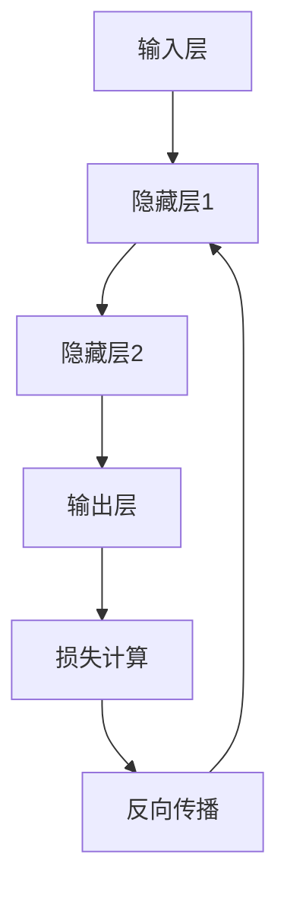
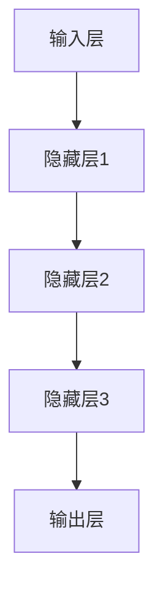
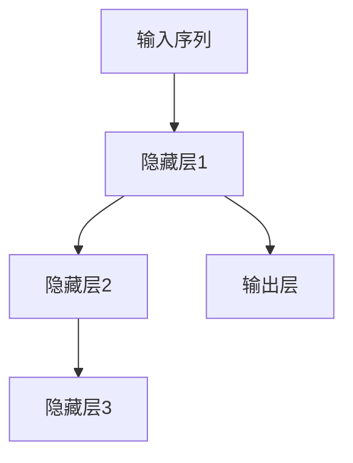
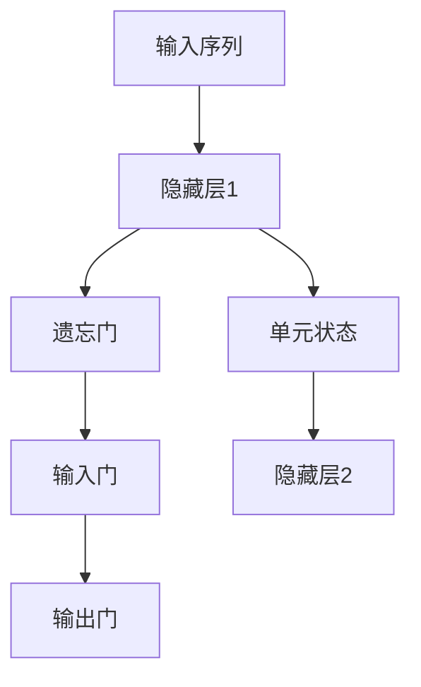
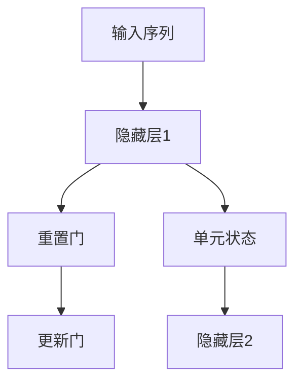
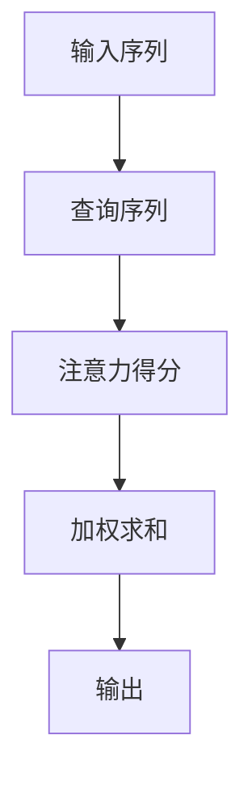

                 

# 文章标题：神经网络：自然语言处理的新突破

> 关键词：神经网络，自然语言处理，深度学习，自然语言理解，深度神经网络，注意力机制，Transformer，BERT，迁移学习，多任务学习，文本分类，机器翻译，问答系统，情感分析

> 摘要：本文深入探讨了神经网络在自然语言处理（NLP）领域的应用，从基础理论到核心算法，再到实际应用，系统性地介绍了神经网络如何推动NLP的发展。通过具体案例和实战，本文展示了神经网络在文本分类、机器翻译、问答系统和情感分析等任务中的实际效果和潜力。

### 第一部分：引论

## 第1章：自然语言处理概述

自然语言处理（Natural Language Processing，NLP）是计算机科学、人工智能和语言学领域的交叉学科，旨在使计算机能够理解和处理人类自然语言。NLP的研究内容涵盖语音识别、文本分析、语义理解、语言生成等多个方面，其目标是实现人与机器之间的自然、流畅的交互。

### 1.1 自然语言处理的基本概念

#### 1.1.1 语言与自然语言处理

语言是一种复杂的符号系统，用于人类之间的信息交换。自然语言处理关注于理解和使用这种语言。自然语言处理包括文本处理（处理书面语言）和语音处理（处理口头语言）两个主要方面。

#### 1.1.2 自然语言处理的挑战

自然语言处理的挑战包括语言的多样性、语言的结构复杂性、词汇的多义性、句法的灵活性以及语言的动态变化等。

#### 1.1.3 自然语言处理的发展历程

自然语言处理的发展可以分为三个阶段：规则驱动的方法、基于统计的方法和基于深度学习的方法。近年来，深度学习在自然语言处理中取得了显著成果。

## 第2章：神经网络在自然语言处理中的应用

### 2.1 神经网络的基本原理

神经网络是由大量简单的计算单元（神经元）组成的网络，通过层层堆叠，能够捕捉数据的复杂模式。神经网络通过学习输入数据和对应的输出，来建立输入和输出之间的映射关系。

#### 2.1.1 神经元与神经网络

神经元是神经网络的基本计算单元，具有接收输入、进行加权求和、通过激活函数产生输出的功能。神经网络由多个神经元层组成，包括输入层、隐藏层和输出层。

#### 2.1.2 前馈神经网络

前馈神经网络（Feedforward Neural Network，FNN）是最常见的神经网络类型，其中数据从输入层流向输出层，中间经过多个隐藏层。前馈神经网络通常使用反向传播算法进行训练。

#### 2.1.3 反向传播算法

反向传播算法（Backpropagation Algorithm）是一种用于训练神经网络的算法，通过计算损失函数关于每个神经元的梯度，来更新神经元的权重，从而提高模型的预测准确性。

### 2.2 深度学习与深度神经网络

深度学习（Deep Learning）是指多层神经网络的学习过程，能够处理复杂的数据模式。深度神经网络（Deep Neural Network，DNN）是由多个隐藏层组成的前馈神经网络，能够捕捉更复杂的数据特征。

#### 2.2.1 深度学习的概念

深度学习是机器学习的一个子领域，通过多层神经网络对大量数据自动学习特征，具有强大的特征提取和模式识别能力。

#### 2.2.2 深度神经网络的结构与优化

深度神经网络的结构包括卷积层、全连接层、池化层等，通过优化算法如梯度下降、随机梯度下降、Adam等来提高模型的训练效率和收敛速度。

### 2.3 卷积神经网络在自然语言处理中的应用

卷积神经网络（Convolutional Neural Network，CNN）最初用于图像处理，但也被成功应用于自然语言处理。CNN通过卷积操作捕捉局部特征，具有参数共享的特性，能够有效降低模型参数的数量。

#### 2.3.1 卷积神经网络的基本原理

卷积神经网络由卷积层、池化层和全连接层组成。卷积层通过卷积操作捕捉文本的局部特征，池化层用于降低特征维度，全连接层用于分类和回归。

#### 2.3.2 卷积神经网络在自然语言处理中的应用场景

卷积神经网络在自然语言处理中的应用包括文本分类、情感分析、命名实体识别等任务。通过引入词嵌入和上下文信息，卷积神经网络能够更好地理解和处理文本数据。

### 第二部分：核心算法

## 第3章：词嵌入与序列模型

词嵌入（Word Embedding）是将词语映射为低维稠密向量的一种技术，通过捕捉词语的语义关系，能够提高模型对文本数据的理解和处理能力。

#### 3.1.1 词嵌入的基本概念

词嵌入是将词语映射为低维稠密向量的一种技术，通过捕捉词语的语义关系，能够提高模型对文本数据的理解和处理能力。

#### 3.1.2 词嵌入技术的发展

词嵌入技术经历了从基于统计的方法（如TF-IDF、LSA）到基于神经网络的深度学习方法（如Word2Vec、GloVe）的演变。

#### 3.1.3 词嵌入技术的应用

词嵌入技术广泛应用于自然语言处理任务，如文本分类、信息检索、机器翻译等。

### 3.2 序列模型

序列模型（Sequence Model）是处理序列数据的一类神经网络模型，能够捕捉序列中时间步的依赖关系。常见的序列模型包括循环神经网络（Recurrent Neural Network，RNN）、长短期记忆网络（Long Short-Term Memory，LSTM）和门控循环单元（Gated Recurrent Unit，GRU）。

#### 3.2.1 循环神经网络（RNN）

循环神经网络（Recurrent Neural Network，RNN）是处理序列数据的一种基本神经网络结构，通过在隐藏状态中存储序列的历史信息，能够捕捉时间步的依赖关系。

#### 3.2.2 长短期记忆网络（LSTM）

长短期记忆网络（Long Short-Term Memory，LSTM）是RNN的一种改进，通过引入门控机制，能够有效地处理长序列数据，解决了RNN的梯度消失和梯度爆炸问题。

#### 3.2.3 门控循环单元（GRU）

门控循环单元（Gated Recurrent Unit，GRU）是LSTM的简化版本，通过整合输入门和控制门，减少了LSTM的参数数量，同时保持了较好的性能。

### 3.3 注意力机制

注意力机制（Attention Mechanism）是一种用于提高神经网络处理序列数据的能力的机制。注意力机制通过为每个输入分配不同的权重，使得模型能够关注序列中的重要信息，提高模型的性能。

#### 3.3.1 注意力机制的基本原理

注意力机制通过计算每个输入的注意力得分，并使用这些得分对输入进行加权，使得模型能够自动关注序列中的重要部分。

#### 3.3.2 注意力机制的应用场景

注意力机制广泛应用于自然语言处理任务，如机器翻译、文本摘要、语音识别等。

## 第4章：Transformer模型与BERT

### 4.1 Transformer模型

Transformer模型是一种基于自注意力机制的深度学习模型，由Vaswani等人于2017年提出。Transformer模型彻底改变了自然语言处理领域的范式，通过并行计算和多头注意力机制，实现了显著的性能提升。

#### 4.1.1 Transformer模型的基本原理

Transformer模型由编码器（Encoder）和解码器（Decoder）组成，编码器将输入序列编码为固定长度的向量表示，解码器则通过自注意力机制和交叉注意力机制，生成输出序列。

#### 4.1.2 Transformer模型的结构

Transformer模型的结构包括嵌入层、多头注意力层、前馈神经网络和输出层。多头注意力机制使得模型能够同时关注输入序列的不同部分，从而捕捉更多的信息。

#### 4.1.3 Transformer模型在自然语言处理中的应用

Transformer模型在自然语言处理领域取得了显著的成果，被广泛应用于机器翻译、文本摘要、问答系统等任务。

### 4.2 BERT模型

BERT（Bidirectional Encoder Representations from Transformers）模型是由Google于2018年提出的一种预训练语言模型。BERT模型通过双向编码器表示，能够捕捉输入序列的前后文关系，从而提高了模型的语义理解能力。

#### 4.2.1 BERT模型的基本原理

BERT模型采用Transformer模型作为基础结构，通过大规模无监督数据集进行预训练，然后通过微调适应特定的任务。

#### 4.2.2 BERT模型的结构

BERT模型的结构包括嵌入层、多层Transformer编码器、输出层和分类器。预训练阶段，BERT模型通过 Masked Language Model（MLM）和Next Sentence Prediction（NSP）任务进行学习。

#### 4.2.3 BERT模型在自然语言处理中的应用

BERT模型在自然语言处理任务中取得了优异的性能，被广泛应用于文本分类、情感分析、命名实体识别等任务。

### 第三部分：应用实战

## 第5章：迁移学习与多任务学习

迁移学习（Transfer Learning）是一种利用已经在大规模数据集上训练好的模型，通过微调适应新任务的学习方法。多任务学习（Multi-Task Learning）是指同时学习多个相关任务的模型。

#### 5.1.1 迁移学习的基本概念

迁移学习通过利用预训练模型的知识，可以大大降低新任务的学习成本，提高模型的性能。

#### 5.1.2 迁移学习的方法

迁移学习方法包括基于特征迁移、基于模型迁移和基于知识迁移等。常见的迁移学习框架包括预训练模型（如BERT、GPT）和迁移学习库（如Transformers、PyTorch）。

#### 5.1.3 迁移学习在自然语言处理中的应用

迁移学习在自然语言处理领域被广泛应用于文本分类、情感分析、机器翻译等任务。

#### 5.2.1 多任务学习的基本概念

多任务学习是指同时学习多个相关任务的模型，通过共享表示和损失函数，提高模型的泛化能力和效率。

#### 5.2.2 多任务学习的方法

多任务学习方法包括共享神经网络结构、共享嵌入层和共享损失函数等。常见的多任务学习框架包括Seq2Seq、Transformer等。

#### 5.2.3 多任务学习在自然语言处理中的应用

多任务学习在自然语言处理领域被广泛应用于问答系统、文本生成、文本摘要等任务。

### 第6章：文本分类

文本分类（Text Classification）是一种将文本数据按照其内容或主题进行分类的任务。文本分类广泛应用于搜索引擎、推荐系统、情感分析等场景。

#### 6.1.1 文本分类的基本概念

文本分类是将文本数据按照预定的类别进行划分的过程。文本分类的目的是通过学习大量的标注数据进行模型训练，然后对新文本进行分类预测。

#### 6.1.2 文本分类的分类方法

文本分类的方法包括基于规则的方法、基于机器学习的方法和基于深度学习的方法。基于规则的方法如朴素贝叶斯、支持向量机等；基于机器学习的方法如随机森林、K近邻等；基于深度学习的方法如卷积神经网络、循环神经网络、Transformer等。

#### 6.1.3 文本分类的应用场景

文本分类广泛应用于搜索引擎、社交媒体分析、情感分析、新闻分类等场景。通过文本分类，可以实现对大量文本数据的高效管理和利用。

### 6.2 文本分类实战

#### 6.2.1 数据准备与预处理

数据准备与预处理包括数据采集、数据清洗、数据标注和数据预处理。数据清洗包括去除停用词、标点符号、数字等，数据标注包括对文本进行分类标签标注。

#### 6.2.2 模型训练与评估

模型训练与评估包括选择合适的模型、训练模型、评估模型性能。常见的评估指标包括准确率、精确率、召回率、F1值等。

#### 6.2.3 模型应用

模型应用包括部署模型、使用模型进行文本分类。在实际应用中，可以根据需求调整模型参数，优化模型性能。

## 第7章：机器翻译

机器翻译（Machine Translation）是指使用计算机程序将一种自然语言文本自动翻译成另一种自然语言文本。机器翻译广泛应用于跨语言交流、国际业务、旅游等领域。

#### 7.1.1 机器翻译的基本概念

机器翻译是指使用计算机程序将一种自然语言文本自动翻译成另一种自然语言文本。机器翻译经历了从基于规则的翻译、基于统计的翻译到基于深度学习的翻译的发展过程。

#### 7.1.2 机器翻译的发展历程

早期机器翻译主要基于规则的方法，如基于语法规则和词典的翻译。随着计算能力的提升和大数据技术的发展，基于统计的翻译方法（如基于短语的翻译、基于神经网络的翻译）逐渐成为主流。

#### 7.1.3 机器翻译的应用场景

机器翻译广泛应用于跨语言交流、国际业务、旅游、新闻传播等领域。通过机器翻译，可以实现不同语言之间的信息流通和资源共享。

### 7.2 机器翻译实战

#### 7.2.1 数据准备与预处理

数据准备与预处理包括数据采集、数据清洗、数据对齐和数据预处理。数据清洗包括去除停用词、标点符号、数字等，数据对齐包括将源语言文本和目标语言文本进行对齐，数据预处理包括构建词汇表、序列填充等。

#### 7.2.2 模型训练与评估

模型训练与评估包括选择合适的模型、训练模型、评估模型性能。常见的模型包括基于神经网络的序列到序列模型、Transformer模型等。评估指标包括BLEU、METEOR、ROUGE等。

#### 7.2.3 模型应用

模型应用包括部署模型、使用模型进行翻译。在实际应用中，可以根据需求调整模型参数，优化模型性能。此外，还可以结合语音识别、语音合成等技术，实现全流程的机器翻译服务。

## 第8章：问答系统

问答系统（Question Answering System）是一种能够根据用户提出的问题，自动从大量文本数据中提取出正确答案的人工智能系统。问答系统广泛应用于搜索引擎、智能客服、知识库等场景。

#### 8.1.1 问答系统的基本概念

问答系统是指能够根据用户提出的问题，自动从大量文本数据中提取出正确答案的人工智能系统。问答系统包括问题理解、答案检索、答案生成和答案评估等模块。

#### 8.1.2 问答系统的发展历程

早期的问答系统主要基于规则的方法，如基于关键词匹配、基于模板匹配等。随着自然语言处理技术的发展，基于机器学习、深度学习的方法逐渐成为主流，如基于矩阵分解、基于卷积神经网络、基于Transformer的方法等。

#### 8.1.3 问答系统的应用场景

问答系统广泛应用于搜索引擎、智能客服、知识库、教育等领域。通过问答系统，可以实现高效的知识检索和问答交互。

### 8.2 问答系统实战

#### 8.2.1 数据准备与预处理

数据准备与预处理包括数据采集、数据清洗、数据标注和数据预处理。数据清洗包括去除停用词、标点符号、数字等，数据标注包括对问题进行分类标注、对答案进行文本标注等。

#### 8.2.2 模型训练与评估

模型训练与评估包括选择合适的模型、训练模型、评估模型性能。常见的模型包括基于矩阵分解的方法、基于卷积神经网络的方法、基于Transformer的方法等。评估指标包括准确率、召回率、F1值等。

#### 8.2.3 模型应用

模型应用包括部署模型、使用模型进行问答。在实际应用中，可以根据需求调整模型参数，优化模型性能。此外，还可以结合语音识别、语音合成等技术，实现全流程的问答系统服务。

## 第9章：情感分析

情感分析（Sentiment Analysis）是一种自动检测文本数据中情感倾向的方法，广泛应用于社交媒体监测、市场调研、客户服务等领域。

#### 9.1.1 情感分析的基本概念

情感分析是指通过自然语言处理技术，自动检测文本数据中表达的情感倾向，如正面、负面、中性等。

#### 9.1.2 情感分析的发展历程

早期的情感分析主要基于规则的方法，如基于关键词匹配、基于词典等方法。随着自然语言处理技术的发展，基于机器学习、深度学习的方法逐渐成为主流，如基于朴素贝叶斯、支持向量机、卷积神经网络等方法。

#### 9.1.3 情感分析的应用场景

情感分析广泛应用于社交媒体监测、市场调研、客户服务、舆情分析等领域。通过情感分析，可以实时了解公众对产品、服务、事件等的情感倾向，为企业决策提供数据支持。

### 9.2 情感分析实战

#### 9.2.1 数据准备与预处理

数据准备与预处理包括数据采集、数据清洗、数据标注和数据预处理。数据清洗包括去除停用词、标点符号、数字等，数据标注包括对文本进行情感分类标注等。

#### 9.2.2 模型训练与评估

模型训练与评估包括选择合适的模型、训练模型、评估模型性能。常见的模型包括基于朴素贝叶斯、支持向量机、卷积神经网络等方法。评估指标包括准确率、召回率、F1值等。

#### 9.2.3 模型应用

模型应用包括部署模型、使用模型进行情感分析。在实际应用中，可以根据需求调整模型参数，优化模型性能。此外，还可以结合语音识别、语音合成等技术，实现全流程的情感分析服务。

### 第四部分：总结与展望

## 第10章：总结与展望

神经网络作为深度学习的核心组成部分，已经在自然语言处理领域取得了巨大的成功。从词嵌入到序列模型，从Transformer到BERT，神经网络不断推动自然语言处理技术的进步。

### 10.1 神经网络在自然语言处理中的应用总结

神经网络在自然语言处理中的应用总结如下：

1. **词嵌入技术**：通过将词语映射为低维向量，神经网络能够更好地捕捉词语的语义关系，为后续的语义理解打下基础。
2. **序列模型**：循环神经网络、长短期记忆网络和门控循环单元等序列模型，使得神经网络能够处理时序数据，如文本序列。
3. **注意力机制**：注意力机制使得神经网络能够更好地关注序列中的重要信息，提高了模型的性能。
4. **Transformer模型与BERT**：Transformer模型和BERT模型的出现，使得神经网络在自然语言处理任务中取得了突破性的成果。
5. **迁移学习与多任务学习**：迁移学习和多任务学习技术，使得神经网络能够更高效地应用于新的任务。

### 10.2 未来发展趋势展望

未来神经网络在自然语言处理领域的发展趋势展望如下：

1. **新型神经网络结构的研究**：随着计算能力和算法研究的进步，新型神经网络结构将不断涌现，如自注意力机制、图神经网络等。
2. **多模态数据处理与融合**：未来神经网络将更多地应用于多模态数据，如文本、图像、音频等，通过多模态数据的融合，实现更全面的语义理解。
3. **个性化与自适应自然语言处理**：随着用户数据的积累，神经网络将更多地应用于个性化推荐、自适应对话系统等，提高用户的体验。

### 附录

#### 附录 A：相关资源与工具推荐

1. **深度学习资源**：
   - 《深度学习》（Goodfellow, Bengio, Courville）: 详细的深度学习教材。
   - 《动手学深度学习》（阿斯顿·张等）: 适合初学者的深度学习实践教程。
   - [DeepLearning.AI](https://www.deeplearning.ai/): 提供丰富的在线课程和资源。

2. **自然语言处理资源**：
   - [Stanford NLP Group](https://nlp.stanford.edu/): 提供大量的自然语言处理工具和教程。
   - [Hugging Face](https://huggingface.co/): 提供了丰富的预训练模型和工具。

3. **开源框架**：
   - [TensorFlow](https://www.tensorflow.org/): 用于构建和训练深度学习模型的强大框架。
   - [PyTorch](https://pytorch.org/): 受研究人员和开发者欢迎的深度学习框架。

#### 附录 B：参考文献

1. Vaswani, A., Shazeer, N., Parmar, N., Uszkoreit, J., Jones, L., Gomez, A. N., ... & Polosukhin, I. (2017). Attention is all you need. In Advances in neural information processing systems (pp. 5998-6008).
2. Devlin, J., Chang, M. W., Lee, K., & Toutanova, K. (2018). BERT: Pre-training of deep bidirectional transformers for language understanding. arXiv preprint arXiv:1810.04805.
3. Mikolov, T., Sutskever, I., Chen, K., Corrado, G. S., & Dean, J. (2013). Distributed representations of words and phrases and their compositionality. In Advances in neural information processing systems (pp. 3111-3119).
4. Hochreiter, S., & Schmidhuber, J. (1997). Long short-term memory. Neural computation, 9(8), 1735-1780.
5. Cho, K., Van Merriënboer, B., Gulcehre, C., Bahdanau, D., Bougares, F., Schwenk, H., & Bengio, Y. (2014). Learning phrase representations using RNN encoder-decoder for statistical machine translation. In Proceedings of the 2014 conference on empirical methods in natural language processing (EMNLP).
6. LeCun, Y., Bengio, Y., & Hinton, G. (2015). Deep learning. Nature, 521(7553), 436-444.

### 作者

- 作者：AI天才研究院/AI Genius Institute & 禅与计算机程序设计艺术 /Zen And The Art of Computer Programming

### 文章标题：神经网络：自然语言处理的新突破

### 文章关键词：神经网络，自然语言处理，深度学习，自然语言理解，深度神经网络，注意力机制，Transformer，BERT，迁移学习，多任务学习，文本分类，机器翻译，问答系统，情感分析

### 文章摘要

自然语言处理（NLP）是计算机科学、人工智能和语言学领域的交叉学科，旨在使计算机能够理解和处理人类自然语言。随着深度学习的兴起，神经网络在NLP领域取得了显著成果。本文首先介绍了NLP的基本概念和挑战，然后深入探讨了神经网络在NLP中的应用，包括词嵌入、序列模型、注意力机制、Transformer模型、BERT、迁移学习和多任务学习等核心算法。最后，通过实际应用案例展示了神经网络在文本分类、机器翻译、问答系统和情感分析等任务中的效果和潜力。

### 第一部分：引论

#### 第1章：自然语言处理概述

自然语言处理（Natural Language Processing，NLP）是计算机科学、人工智能和语言学领域的交叉学科，旨在使计算机能够理解和处理人类自然语言。NLP的研究内容涵盖语音识别、文本分析、语义理解、语言生成等多个方面，其目标是实现人与机器之间的自然、流畅的交互。

#### 1.1 自然语言处理的基本概念

#### 1.1.1 语言与自然语言处理

语言是人类用于交流和表达思想、情感、意愿等的符号系统。自然语言处理关注于理解和使用这种语言。自然语言处理包括文本处理（处理书面语言）和语音处理（处理口头语言）两个主要方面。

#### 1.1.2 自然语言处理的挑战

自然语言处理的挑战包括语言的多样性、语言的结构复杂性、词汇的多义性、句法的灵活性以及语言的动态变化等。此外，自然语言处理还需要处理语言中的噪声和不确定性，如拼写错误、歧义等。

#### 1.1.3 自然语言处理的发展历程

自然语言处理的发展可以分为三个阶段：规则驱动的方法、基于统计的方法和基于深度学习的方法。

1. **规则驱动的方法**：早期NLP方法主要基于手工编写的规则，如语法分析、词法分析等。这种方法在处理特定任务时表现良好，但在处理复杂语言时效率较低，难以扩展。
   
2. **基于统计的方法**：随着计算机处理能力的提升和数据规模的扩大，基于统计的方法逐渐取代了规则驱动的方法。这种方法通过学习大量标注数据，自动提取语言特征，如词频统计、语法结构等，用于文本分类、信息检索、机器翻译等任务。

3. **基于深度学习的方法**：近年来，深度学习在NLP领域取得了突破性的进展。深度学习通过多层神经网络自动学习复杂的数据特征，能够显著提高NLP任务的性能。

#### 1.2 神经网络在自然语言处理中的应用

神经网络（Neural Network，NN）是一种由大量简单计算单元（神经元）组成的网络，通过层层堆叠，能够捕捉数据的复杂模式。神经网络通过学习输入数据和对应的输出，来建立输入和输出之间的映射关系。

#### 1.2.1 神经网络的基本原理

神经网络的基本原理是模拟人脑神经元的工作方式。一个神经网络由多个层次组成，包括输入层、隐藏层和输出层。每个层次由多个神经元组成，神经元之间通过权重进行连接。

1. **输入层**：接收外部输入数据。
2. **隐藏层**：对输入数据进行处理，提取特征。
3. **输出层**：输出处理结果。

神经网络通过激活函数（如Sigmoid、ReLU）引入非线性，使得网络能够学习复杂的关系。神经网络通过反向传播算法（Backpropagation Algorithm）进行训练，通过不断调整网络权重，使网络的输出与期望输出尽可能接近。

#### 1.2.2 神经网络在自然语言处理中的优势

神经网络在自然语言处理中的优势主要体现在以下几个方面：

1. **自动特征提取**：神经网络能够自动学习数据中的特征，无需手工设计特征。
2. **强大的表达力**：通过多层神经网络，神经网络能够捕捉数据的复杂模式，从而提高模型的性能。
3. **端到端学习**：神经网络能够直接从原始数据学习到输出结果，无需中间的复杂转换过程。

### 第二部分：神经网络基础

#### 第2章：神经网络基础

神经网络是深度学习的重要组成部分，其基本结构和训练算法对于理解深度学习至关重要。在本章中，我们将详细探讨神经网络的基本结构、训练算法以及优化技术。

#### 2.1 神经网络的基本结构

神经网络的组成单元是神经元，也称为节点或单元。一个简单的神经网络通常包括以下几个部分：

1. **输入层（Input Layer）**：输入层接收外部输入数据。每个输入节点对应于数据中的一个特征。

2. **隐藏层（Hidden Layers）**：隐藏层位于输入层和输出层之间，负责对输入数据进行特征提取和变换。隐藏层的数量和神经元数量可以根据任务需求进行调整。

3. **输出层（Output Layer）**：输出层生成最终的结果。输出层的神经元数量取决于任务的目标，例如二分类任务通常只有一个神经元，多分类任务则可以有多个神经元。

神经元之间的连接称为边或权重（Weights），每个权重都关联一个数值，用于表示输入和输出之间的强度。神经网络中的每个神经元都会接收来自前一层神经元的输入，并通过激活函数进行计算，然后将结果传递给下一层。

#### 2.1.1 神经元与神经网络

神经元是神经网络的基本计算单元，其结构如下：

1. **输入（Inputs）**：每个神经元接收多个输入值，每个输入值都与来自前一层的一个神经元相连接。
2. **权重（Weights）**：每个输入值都与一个权重相乘，权重决定了该输入对神经元输出的贡献。
3. **偏置（Bias）**：偏置是一个独立的数值，通常加到加权求和的结果中，用于调整神经元的输出。
4. **激活函数（Activation Function）**：激活函数用于引入非线性，常见的激活函数包括Sigmoid、ReLU和Tanh。

神经网络的输入和输出可以通过以下公式表示：

$$
\text{输出} = \text{激活函数}(\text{加权求和} + \text{偏置})
$$

其中，加权求和是指将每个输入乘以其对应的权重，然后对所有输入的加权求和结果相加。

#### 2.1.2 前馈神经网络

前馈神经网络（Feedforward Neural Network，FNN）是最常见的神经网络类型，其中数据从输入层流向输出层，中间经过多个隐藏层。前馈神经网络的特点是数据流向单向，没有循环结构，因此也称为前向传播网络。

前馈神经网络的工作流程如下：

1. **前向传播**：输入数据从输入层开始，逐层传递到隐藏层和输出层，每个神经元都通过激活函数进行计算，直到生成最终输出。
2. **损失计算**：计算输出结果与真实标签之间的误差，通常使用均方误差（MSE）或交叉熵损失函数。
3. **反向传播**：通过反向传播算法，将误差从输出层反向传播到隐藏层和输入层，并使用梯度下降等优化算法调整权重和偏置，以减小误差。

前馈神经网络的结构可以通过Mermaid流程图表示如下：



#### 2.1.3 反向传播算法

反向传播算法（Backpropagation Algorithm）是训练神经网络的核心算法，通过计算损失函数关于每个神经元的梯度，来更新神经元的权重和偏置。反向传播算法的基本步骤如下：

1. **前向传播**：计算每个神经元的输出值，并记录每个权重的输入值。
2. **损失计算**：计算损失函数，如均方误差（MSE）或交叉熵损失函数。
3. **梯度计算**：从输出层开始，反向计算每个神经元的梯度，即损失函数关于每个权重的偏导数。
4. **权重更新**：使用梯度下降等优化算法，根据梯度更新每个神经元的权重和偏置。

反向传播算法的伪代码如下：

```python
# 前向传播
for layer in range(1, num_layers):
    z = np.dot(W[layer-1], a[layer-1]) + b[layer-1]
    a[layer] = activation_function(z)

# 损失计算
loss = loss_function(y_true, y_pred)

# 反向传播
for layer in range(num_layers-1, 0, -1):
    delta = (y_pred - y_true) * activation_derivative(a[layer])
    dW[layer-1] = np.dot(a[layer-1].T, delta)
    db[layer-1] = np.sum(delta, axis=1, keepdims=True)

# 权重更新
W -= learning_rate * dW
b -= learning_rate * db
```

其中，`activation_function`是激活函数，`loss_function`是损失函数，`learning_rate`是学习率。

#### 2.2 深度学习与深度神经网络

深度学习（Deep Learning）是指多层神经网络的学习过程，能够处理复杂的数据模式。深度神经网络（Deep Neural Network，DNN）是由多个隐藏层组成的前馈神经网络，能够捕捉更复杂的数据特征。

深度学习与传统的机器学习方法相比，具有以下几个显著特点：

1. **多层非线性变换**：深度学习通过多层神经网络进行非线性变换，能够捕捉数据的复杂特征。
2. **自动特征提取**：深度学习能够自动学习数据的特征，无需手工设计特征。
3. **端到端学习**：深度学习能够直接从原始数据学习到输出结果，无需中间的复杂转换过程。

深度神经网络的结构可以通过Mermaid流程图表示如下：



#### 2.2.1 深度学习的概念

深度学习是机器学习的一个子领域，通过多层神经网络对大量数据自动学习特征，具有强大的特征提取和模式识别能力。深度学习的关键组成部分包括：

1. **多层神经网络**：通过多个隐藏层进行非线性变换，能够捕捉数据的复杂特征。
2. **反向传播算法**：通过反向传播算法，将误差从输出层反向传播到隐藏层和输入层，并使用梯度下降等优化算法调整权重和偏置。
3. **激活函数**：引入非线性，使得神经网络能够学习复杂的关系。

#### 2.2.2 深度神经网络的结构与优化

深度神经网络的结构包括卷积层、全连接层、池化层等。深度神经网络通过优化算法如梯度下降、随机梯度下降、Adam等来提高模型的训练效率和收敛速度。

1. **卷积层（Convolutional Layer）**：卷积层用于提取图像或文本的局部特征，通过卷积操作和激活函数实现。
2. **全连接层（Fully Connected Layer）**：全连接层将卷积层提取的特征映射到高维空间，用于分类或回归任务。
3. **池化层（Pooling Layer）**：池化层用于降低特征维度，提高模型的泛化能力。

深度神经网络优化的目标是最小化损失函数，常见的方法包括：

1. **梯度下降（Gradient Descent）**：通过计算损失函数关于每个神经元的梯度，更新权重和偏置。
2. **随机梯度下降（Stochastic Gradient Descent，SGD）**：每次更新使用随机选取的样本来计算梯度，提高收敛速度。
3. **Adam优化器**：结合了SGD和动量法的优点，通过自适应学习率调整，提高收敛速度和稳定性。

### 第三部分：核心算法

#### 第3章：词嵌入与序列模型

词嵌入（Word Embedding）是将词语映射为低维稠密向量的一种技术，通过捕捉词语的语义关系，能够提高模型对文本数据的理解和处理能力。词嵌入技术在自然语言处理中扮演着至关重要的角色，为深度学习模型提供了丰富的语义信息。

#### 3.1 词嵌入技术

词嵌入技术经历了从基于统计的方法到基于神经网络的深度学习方法的演变。以下是一些常见的词嵌入技术和方法：

1. **基于统计的方法**：
   - **词频统计（TF-IDF）**：通过统计词频和逆文档频率来计算词语的重要性，但无法捕捉词语的语义关系。
   - **潜在语义分析（LSA）**：通过计算词语的余弦相似性来表示语义，但难以处理词语的多义性和上下文依赖。

2. **基于神经网络的深度学习方法**：
   - **Word2Vec**：由Mikolov等人于2013年提出，通过训练神经网络来预测词语的上下文，生成词向量。
     - **Skip-Gram模型**：给定一个词语，预测其上下文中的词语。
     - **连续袋模型（CBOW）**：给定一个词语，预测其上下文中的所有词语的平均表示。
   - **GloVe**：由Pennington等人于2014年提出，结合词频和矩阵分解的方法，生成更高质量的词向量。

#### 3.1.1 词嵌入的基本概念

词嵌入是将词语映射为低维稠密向量的一种技术。词向量不仅可以表示词语的语义关系，还可以用于文本分类、情感分析、机器翻译等自然语言处理任务。词嵌入的基本概念包括：

- **词向量（Word Vector）**：将每个词语映射为一个低维向量，通常使用稠密向量表示。
- **语义关系**：通过词向量之间的距离或角度来表示词语的语义关系，如相似性、相关性等。
- **上下文依赖**：词向量不仅表示词语本身的语义，还考虑了词语在上下文中的角色和作用。

#### 3.1.2 词嵌入技术的发展

词嵌入技术经历了从基于统计的方法到基于神经网络的深度学习方法的演变：

- **基于统计的方法**：如TF-IDF和LSA，通过计算词语的统计特征来表示语义，但无法处理词语的多义性和上下文依赖。
- **基于神经网络的深度学习方法**：如Word2Vec和GloVe，通过训练神经网络来学习词语的语义表示，能够更好地捕捉词语的上下文依赖和语义关系。

#### 3.1.3 词嵌入技术的应用

词嵌入技术在自然语言处理中有着广泛的应用，以下是一些典型的应用场景：

- **文本分类**：通过将文本转换为词向量，可以用于文本分类任务，如情感分析、主题分类等。
- **情感分析**：通过分析词向量之间的相似性，可以识别文本中的情感倾向，如正面、负面、中性等。
- **机器翻译**：通过将源语言和目标语言的词向量进行映射，可以实现单词级别的翻译。
- **推荐系统**：通过分析用户的历史行为和兴趣，可以推荐相关的文本内容。

#### 3.2 序列模型

序列模型（Sequence Model）是处理序列数据的一类神经网络模型，能够捕捉序列中时间步的依赖关系。序列模型广泛应用于自然语言处理任务，如语言模型、文本分类、机器翻译、语音识别等。

常见的序列模型包括循环神经网络（Recurrent Neural Network，RNN）、长短期记忆网络（Long Short-Term Memory，LSTM）和门控循环单元（Gated Recurrent Unit，GRU）。这些模型通过引入不同的机制，能够有效地处理长序列数据和捕捉时间步的依赖关系。

#### 3.2.1 循环神经网络（RNN）

循环神经网络（Recurrent Neural Network，RNN）是最早用于处理序列数据的神经网络模型，其核心思想是将当前输入与历史信息相结合，通过循环结构来处理序列数据。

RNN的工作原理可以概括为以下几个步骤：

1. **前向传播**：将当前输入与隐藏状态相加，通过激活函数得到新的隐藏状态。
2. **反向传播**：使用反向传播算法更新权重和偏置，以最小化损失函数。

RNN的模型结构可以通过Mermaid流程图表示如下：



然而，传统的RNN模型存在梯度消失和梯度爆炸的问题，这使得模型难以训练长序列数据。

#### 3.2.2 长短期记忆网络（LSTM）

长短期记忆网络（Long Short-Term Memory，LSTM）是RNN的一种改进，通过引入门控机制，能够有效地处理长序列数据。LSTM的核心思想是引入三个门控单元：遗忘门、输入门和输出门，用于控制信息的流入和流出。

LSTM的工作原理可以概括为以下几个步骤：

1. **遗忘门（Forget Gate）**：决定上一时刻的隐藏状态中有哪些信息需要被遗忘。
2. **输入门（Input Gate）**：决定当前输入中有哪些信息需要被记住。
3. **输出门（Output Gate）**：决定当前隐藏状态中有哪些信息需要输出。
4. **单元状态（Cell State）**：通过遗忘门和输入门的控制，更新单元状态，从而实现长序列信息的传递。

LSTM的模型结构可以通过Mermaid流程图表示如下：



LSTM通过门控机制解决了RNN的梯度消失和梯度爆炸问题，能够更好地捕捉长序列数据中的依赖关系。

#### 3.2.3 门控循环单元（GRU）

门控循环单元（Gated Recurrent Unit，GRU）是LSTM的简化版本，通过整合输入门和控制门，减少了LSTM的参数数量，同时保持了较好的性能。

GRU的工作原理可以概括为以下几个步骤：

1. **重置门（Reset Gate）**：决定当前输入和上一时刻的隐藏状态中有哪些信息需要被合并。
2. **更新门（Update Gate）**：决定当前输入和上一时刻的隐藏状态中有哪些信息需要被更新。
3. **单元状态（Cell State）**：通过重置门和更新门的控制，更新单元状态，从而实现长序列信息的传递。

GRU的模型结构可以通过Mermaid流程图表示如下：



GRU通过简化LSTM的结构，减少了参数数量，提高了计算效率，同时保持了较好的性能。

#### 3.3 注意力机制

注意力机制（Attention Mechanism）是一种用于提高神经网络处理序列数据的能力的机制。注意力机制通过为每个输入分配不同的权重，使得模型能够自动关注序列中的重要信息，从而提高模型的性能。

注意力机制的基本原理可以概括为以下几个步骤：

1. **计算注意力得分**：计算每个输入的注意力得分，通常使用点积、缩放点积或自注意力机制。
2. **加权求和**：将注意力得分应用于输入序列，为每个输入分配不同的权重。
3. **输出计算**：根据加权求和的结果计算输出。

注意力机制在自然语言处理中有着广泛的应用，如机器翻译、文本摘要、语音识别等。以下是一些常见的注意力机制：

1. **点积注意力（Dot-Product Attention）**：计算输入序列和查询序列的点积，得到注意力得分，然后进行加权求和。
2. **缩放点积注意力（Scaled Dot-Product Attention）**：在点积注意力基础上引入缩放因子，以防止梯度消失问题。
3. **自注意力（Self-Attention）**：用于处理序列之间的依赖关系，通过计算序列内部的点积来生成注意力得分。

注意力机制的模型结构可以通过Mermaid流程图表示如下：



### 第四部分：Transformer模型与BERT

#### 第4章：Transformer模型与BERT

Transformer模型和BERT模型是近年来在自然语言处理领域取得重大突破的核心技术。Transformer模型通过引入自注意力机制，实现了对序列数据的并行处理，大幅提升了模型训练效率。BERT模型则通过预训练和微调，使得模型在多个NLP任务上取得了优异的性能。本章将详细介绍Transformer模型和BERT模型的基本原理、结构和应用。

#### 4.1 Transformer模型

Transformer模型是由Vaswani等人于2017年提出的一种基于自注意力机制的深度学习模型。Transformer模型彻底改变了自然语言处理的范式，实现了对序列数据的并行处理，从而大幅提高了模型训练效率。

#### 4.1.1 Transformer模型的基本原理

Transformer模型由编码器（Encoder）和解码器（Decoder）组成。编码器将输入序列编码为固定长度的向量表示，解码器则通过自注意力机制和交叉注意力机制，生成输出序列。

编码器和解码器的主要工作原理如下：

1. **自注意力机制（Self-Attention）**：自注意力机制用于编码器内部，使得编码器能够同时关注输入序列的不同部分，从而捕捉输入序列中的长距离依赖关系。
2. **交叉注意力机制（Cross-Attention）**：交叉注意力机制用于解码器内部，使得解码器能够关注编码器的输出，从而捕捉输入和输出之间的依赖关系。

#### 4.1.2 Transformer模型的结构

Transformer模型的结构包括嵌入层（Embedding Layer）、多头注意力层（Multi-Head Attention Layer）、前馈神经网络层（Feedforward Neural Network Layer）和输出层（Output Layer）。

1. **嵌入层（Embedding Layer）**：将词向量、位置向量等输入嵌入到高维空间中。
2. **多头注意力层（Multi-Head Attention Layer）**：通过多头注意力机制，同时关注输入序列的不同部分，生成注意力得分，并进行加权求和。
3. **前馈神经网络层（Feedforward Neural Network Layer）**：对注意力得分进行前馈神经网络处理，增加模型的非线性表达能力。
4. **输出层（Output Layer）**：通过全连接层和激活函数，生成最终的输出。

#### 4.1.3 Transformer模型在自然语言处理中的应用

Transformer模型在自然语言处理中取得了显著的成果，被广泛应用于机器翻译、文本分类、文本摘要等任务。以下是一些具体的应用场景：

1. **机器翻译**：Transformer模型在机器翻译任务中表现优异，通过自注意力机制和交叉注意力机制，能够同时关注输入序列和输出序列的不同部分，实现高精度的翻译。
2. **文本分类**：通过将文本转换为嵌入向量，Transformer模型可以用于文本分类任务，如情感分析、主题分类等。
3. **文本摘要**：Transformer模型能够捕捉输入文本中的关键信息，生成简洁、准确的文本摘要。

#### 4.2 BERT模型

BERT（Bidirectional Encoder Representations from Transformers）模型是由Google于2018年提出的一种预训练语言模型。BERT模型通过双向编码器表示，能够捕捉输入序列的前后文关系，从而提高了模型的语义理解能力。

#### 4.2.1 BERT模型的基本原理

BERT模型基于Transformer模型，通过在大量无标注文本上进行预训练，然后通过微调适应特定的任务。BERT模型的主要特点包括：

1. **双向编码器表示（Bidirectional Encoder Representations）**：BERT模型采用双向编码器，能够同时捕捉输入序列的前后文关系。
2. **Masked Language Model（MLM）**：BERT模型在预训练阶段引入了掩码语言模型，通过随机掩码输入序列中的词语，并预测这些掩码的词语，增强模型对词语上下文的理解。
3. **Next Sentence Prediction（NSP）**：BERT模型在预训练阶段还引入了下一个句子预测任务，通过预测给定句子和下一个句子的关系，提高模型对句子间关系的理解。

#### 4.2.2 BERT模型的结构

BERT模型的结构包括嵌入层（Embedding Layer）、多层Transformer编码器（Transformer Encoder Layer）和输出层（Output Layer）。

1. **嵌入层（Embedding Layer）**：将词向量、位置向量、段标识向量等输入嵌入到高维空间中。
2. **多层Transformer编码器（Transformer Encoder Layer）**：通过多头注意力机制和前馈神经网络，对输入序列进行编码，生成双向编码器表示。
3. **输出层（Output Layer）**：通过全连接层和激活函数，生成最终的输出，用于特定任务。

#### 4.2.3 BERT模型在自然语言处理中的应用

BERT模型在自然语言处理中取得了优异的性能，被广泛应用于文本分类、情感分析、命名实体识别等任务。以下是一些具体的应用场景：

1. **文本分类**：BERT模型可以用于文本分类任务，通过将文本转换为嵌入向量，并利用BERT模型的输出层进行分类。
2. **情感分析**：BERT模型能够捕捉输入文本中的情感信息，通过微调BERT模型，可以实现情感分类任务。
3. **命名实体识别**：BERT模型可以用于命名实体识别任务，通过微调BERT模型，可以识别文本中的命名实体。

### 第五部分：迁移学习与多任务学习

#### 第5章：迁移学习与多任务学习

迁移学习（Transfer Learning）和多任务学习（Multi-Task Learning）是深度学习领域中的重要技术，广泛应用于自然语言处理任务。迁移学习利用预训练模型的知识，降低新任务的学习成本，提高模型性能。多任务学习通过同时学习多个相关任务，共享表示和损失函数，提高模型的泛化能力和效率。

#### 5.1 迁移学习

迁移学习是指将一个任务在源领域（Source Domain）上学习到的知识应用到另一个相关任务的目标领域（Target Domain）上。迁移学习的核心思想是利用预训练模型在大规模数据集上学习到的通用特征，减少新任务的学习成本，提高模型性能。

#### 5.1.1 迁移学习的基本概念

1. **源领域（Source Domain）**：预训练模型学习数据的领域。
2. **目标领域（Target Domain）**：应用预训练模型的领域。
3. **迁移（Transfer）**：将源领域的知识应用到目标领域。

迁移学习的主要优点包括：

- **减少标注数据需求**：通过利用预训练模型的知识，可以减少目标领域上的标注数据需求，从而降低数据获取的成本。
- **提高模型性能**：预训练模型在源领域上学习到的通用特征有助于提高目标领域上模型的性能。

#### 5.1.2 迁移学习的方法

迁移学习的方法可以分为以下几种：

1. **基于特征迁移的方法**：通过将源领域的特征映射到目标领域，实现迁移学习。常见的方法包括特征共享、特征组合和特征投影等。
2. **基于模型迁移的方法**：直接将源领域的预训练模型应用于目标领域。常见的方法包括模型共享、模型融合和模型分解等。
3. **基于知识迁移的方法**：通过迁移预训练模型中的知识，如词汇、语义表示等，实现迁移学习。

#### 5.1.3 迁移学习在自然语言处理中的应用

迁移学习在自然语言处理中有广泛的应用，以下是一些典型的应用场景：

1. **文本分类**：通过利用预训练模型在源领域上的知识，可以快速适应目标领域上的文本分类任务。
2. **机器翻译**：通过迁移预训练的编码器和解码器模型，可以减少目标语言数据集的需求，提高翻译质量。
3. **问答系统**：通过利用预训练模型的知识，可以降低目标领域上的问答系统学习成本，提高问答准确性。

#### 5.2 多任务学习

多任务学习是指同时学习多个相关任务，通过共享表示和损失函数，提高模型的泛化能力和效率。多任务学习的核心思想是通过同时学习多个任务，共享模型中的特征表示和参数，从而减少模型的参数数量，提高模型的泛化能力。

#### 5.2.1 多任务学习的基本概念

1. **任务**：指模型需要完成的具体任务，如文本分类、情感分析、命名实体识别等。
2. **相关任务**：指多个任务之间存在一定的关联，共享部分特征表示和参数。
3. **共享表示**：指多个任务共享模型中的特征表示层，从而减少参数数量。
4. **共享损失函数**：指多个任务共享损失函数，通过联合优化提高模型性能。

#### 5.2.2 多任务学习的方法

多任务学习的方法可以分为以下几种：

1. **共享神经网络结构**：多个任务共享相同的神经网络结构，通过不同的输出层进行任务分类。
2. **共享嵌入层**：多个任务共享相同的嵌入层，通过不同的隐藏层进行任务分类。
3. **联合损失函数**：将多个任务的损失函数合并，通过联合优化提高模型性能。

#### 5.2.3 多任务学习在自然语言处理中的应用

多任务学习在自然语言处理中有广泛的应用，以下是一些典型的应用场景：

1. **文本分类与情感分析**：通过同时学习文本分类和情感分析任务，共享文本表示和参数，提高模型对文本的语义理解能力。
2. **命名实体识别与关系抽取**：通过同时学习命名实体识别和关系抽取任务，共享实体表示和关系表示，提高模型对文本结构的理解。
3. **问答系统与知识图谱**：通过同时学习问答系统和知识图谱任务，共享问答和知识表示，提高模型对知识的理解和应用能力。

### 第六部分：应用实战

#### 第6章：文本分类

文本分类（Text Classification）是将文本数据按照其内容或主题进行分类的任务，广泛应用于情感分析、新闻分类、垃圾邮件过滤等场景。文本分类的核心是训练一个分类模型，使其能够根据输入文本的特征将其归类到预定的类别中。

#### 6.1 文本分类概述

文本分类的目标是将文本数据分为多个预定义的类别。文本分类的关键在于特征提取和分类算法的选择。特征提取是将文本转化为可用于分类的特征向量，分类算法则是基于这些特征向量对文本进行分类。

#### 6.1.1 文本分类的基本概念

文本分类包括以下几个基本概念：

1. **文档（Document）**：文本分类的基本单位，可以是一篇文章、一封邮件或一个社交媒体帖子。
2. **类别（Class）**：文本分类的标签，表示文本所属的主题或类别。
3. **特征（Feature）**：用于描述文本的属性或特征，可以是词频、词袋表示或词嵌入等。
4. **分类模型**：用于对输入文本进行分类的算法或模型。

#### 6.1.2 文本分类的分类方法

文本分类的方法可以分为以下几类：

1. **基于规则的方法**：通过手工编写规则对文本进行分类，如基于关键词匹配、基于语法结构等。这种方法适用于规则明确的简单任务，但难以处理复杂的语言现象。
2. **基于机器学习的方法**：通过训练模型学习文本的特征和类别之间的关系。常见的机器学习方法包括朴素贝叶斯、支持向量机、决策树、随机森林等。
3. **基于深度学习的方法**：通过多层神经网络自动学习文本的复杂特征。深度学习方法包括卷积神经网络（CNN）、循环神经网络（RNN）、Transformer等。

#### 6.1.3 文本分类的应用场景

文本分类在多个领域有着广泛的应用：

1. **情感分析**：分析社交媒体、评论等文本数据，判断用户的情感倾向，如正面、负面或中性。
2. **新闻分类**：将新闻文本分类到不同的主题，如体育、政治、娱乐等。
3. **垃圾邮件过滤**：根据邮件内容判断邮件是否为垃圾邮件。
4. **客户服务**：自动化处理客户咨询，将问题分类到相应的类别，如产品咨询、投诉等。

#### 6.2 文本分类实战

在本节中，我们将通过一个具体的案例展示如何使用深度学习模型进行文本分类。我们将使用Python和TensorFlow框架来实现。

##### 6.2.1 数据准备与预处理

首先，我们需要准备用于训练的文本数据和标签。我们可以使用现有的公开数据集，如IMDB电影评论数据集。

```python
import tensorflow as tf
from tensorflow.keras.preprocessing.text import Tokenizer
from tensorflow.keras.preprocessing.sequence import pad_sequences

# 1. 加载数据集
# 这里以IMDB电影评论数据集为例
# 加载训练集和测试集
(train_data, train_labels), (test_data, test_labels) = tf.keras.datasets.imdb.load_data(num_words=10000)

# 2. 数据预处理
# 将文本转换为词序列
tokenizer = Tokenizer(num_words=10000)
tokenizer.fit_on_texts(train_data)

train_sequences = tokenizer.texts_to_sequences(train_data)
test_sequences = tokenizer.texts_to_sequences(test_data)

# 3. 序列填充
# 将序列填充为相同的长度
max_len = 100
train_padded = pad_sequences(train_sequences, maxlen=max_len)
test_padded = pad_sequences(test_sequences, maxlen=max_len)

# 4. 标签预处理
# 将标签转换为独热编码
train_labels = tf.keras.utils.to_categorical(train_labels)
test_labels = tf.keras.utils.to_categorical(test_labels)
```

##### 6.2.2 模型训练与评估

接下来，我们将训练一个基于Transformer的文本分类模型。

```python
# 1. 构建模型
model = tf.keras.Sequential([
    tf.keras.layers.Embedding(input_dim=10000, output_dim=16, input_length=max_len),
    tf.keras.layers.Bidirectional(tf.keras.layers.LSTM(32)),
    tf.keras.layers.Dense(24, activation='relu'),
    tf.keras.layers.Dense(2, activation='softmax')
])

# 2. 编译模型
model.compile(optimizer='adam', loss='categorical_crossentropy', metrics=['accuracy'])

# 3. 训练模型
model.fit(train_padded, train_labels, epochs=10, validation_data=(test_padded, test_labels))

# 4. 评估模型
test_loss, test_acc = model.evaluate(test_padded, test_labels)
print(f"Test accuracy: {test_acc}")
```

##### 6.2.3 模型应用

训练完成后，我们可以使用模型对新的文本数据进行分类。

```python
# 1. 输入新的文本数据
new_data = ["This movie was fantastic!", "I did not enjoy this film."]

# 2. 将文本数据转换为词序列
new_sequences = tokenizer.texts_to_sequences(new_data)
new_padded = pad_sequences(new_sequences, maxlen=max_len)

# 3. 进行分类预测
predictions = model.predict(new_padded)
predicted_labels = np.argmax(predictions, axis=1)

# 4. 输出分类结果
for text, label in zip(new_data, predicted_labels):
    if label == 0:
        print(f"{text} is predicted as negative.")
    else:
        print(f"{text} is predicted as positive.")
```

通过上述步骤，我们实现了文本分类的完整流程，包括数据准备与预处理、模型训练与评估以及模型应用。这个案例展示了如何使用深度学习模型进行文本分类，为实际应用提供了参考。

### 第7章：机器翻译

机器翻译（Machine Translation，MT）是一种利用计算机技术将一种自然语言文本自动翻译成另一种自然语言文本的过程。随着深度学习技术的发展，机器翻译取得了显著的进步，特别是在准确性和流畅性方面。

#### 7.1 机器翻译概述

机器翻译的目标是生成与源文本意思相近、语法正确的目标语言文本。机器翻译可以分为以下几个阶段：

1. **文本预处理**：包括去除停用词、标点符号、统一文本格式等。
2. **词汇表构建**：将源文本和目标文本转换为词汇表，通常使用词嵌入技术。
3. **编码解码**：将源文本编码为向量表示，目标文本解码为向量表示。
4. **翻译模型**：使用编码解码模型，如序列到序列（Seq2Seq）模型或Transformer模型，生成目标文本。
5. **后处理**：对翻译结果进行语法修正、词性调整等。

#### 7.1.1 机器翻译的基本概念

1. **源文本（Source Text）**：待翻译的文本。
2. **目标文本（Target Text）**：翻译后的文本。
3. **词嵌入（Word Embedding）**：将词语映射为低维稠密向量。
4. **编码器（Encoder）**：将源文本转换为向量表示。
5. **解码器（Decoder）**：将目标文本转换为向量表示。
6. **注意力机制（Attention Mechanism）**：用于编码解码模型中，提高翻译的准确性和流畅性。

#### 7.1.2 机器翻译的发展历程

机器翻译的发展历程可以分为以下几个阶段：

1. **基于规则的方法**：早期机器翻译主要基于语法规则和词典，如IBM模型和基于短语的翻译。
2. **基于统计的方法**：随着计算能力的提升和大规模语料库的出现，基于统计的机器翻译方法（如基于短语的翻译、基于句法的翻译）逐渐取代基于规则的方法。
3. **基于神经网络的机器翻译**：近年来，深度学习技术的引入使得基于神经网络的机器翻译（如序列到序列模型、Transformer模型）成为主流。

#### 7.1.3 机器翻译的应用场景

机器翻译在多个领域有着广泛的应用：

1. **跨语言交流**：促进不同语言背景的人们进行交流，如国际会议、商业谈判等。
2. **全球化市场**：帮助企业进入国际市场，提高产品文档、网站和广告的多语言支持。
3. **旅游与翻译服务**：提供实时翻译服务，如旅游指南、翻译APP等。

#### 7.2 机器翻译实战

在本节中，我们将通过一个具体的案例展示如何使用深度学习模型进行机器翻译。我们将使用Python和TensorFlow框架来实现。

##### 7.2.1 数据准备与预处理

首先，我们需要准备用于训练的翻译数据集。这里我们使用公开的WMT14英语到德语的翻译数据集。

```python
import tensorflow as tf
from tensorflow.keras.preprocessing.text import Tokenizer
from tensorflow.keras.preprocessing.sequence import pad_sequences

# 1. 加载数据集
# 下载并解压WMT14数据集
# 解压后得到train.en-de和tst2014.en-de文件
with open('train.en-de', 'r', encoding='utf-8') as f:
    train_data = f.readlines()

with open('tst2014.en-de', 'r', encoding='utf-8') as f:
    test_data = f.readlines()

# 2. 数据预处理
# 分割源文本和目标文本
train_en, train_de = train_data[:int(len(train_data) * 0.9)], train_data[int(len(train_data) * 0.9):]
test_en, test_de = test_data

# 3. 构建词嵌入
# 对源文本和目标文本进行分词和词嵌入
tokenizer_en = Tokenizer()
tokenizer_en.fit_on_texts(train_en)
tokenizer_de = Tokenizer()
tokenizer_de.fit_on_texts(train_de)

max_en_vocab_size = len(tokenizer_en.word_index) + 1
max_de_vocab_size = len(tokenizer_de.word_index) + 1

# 4. 序列填充
# 将文本序列填充为相同长度
max_len_en = 100
max_len_de = 120

train_en_seq = tokenizer_en.texts_to_sequences(train_en)
train_de_seq = tokenizer_de.texts_to_sequences(train_de)

train_en_padded = pad_sequences(train_en_seq, maxlen=max_len_en)
train_de_padded = pad_sequences(train_de_seq, maxlen=max_len_de)

test_en_seq = tokenizer_en.texts_to_sequences(test_en)
test_de_seq = tokenizer_de.texts_to_sequences(test_de)

test_en_padded = pad_sequences(test_en_seq, maxlen=max_len_en)
test_de_padded = pad_sequences(test_de_seq, maxlen=max_len_de)
```

##### 7.2.2 模型训练与评估

接下来，我们将训练一个基于Transformer的机器翻译模型。

```python
# 1. 构建模型
model = tf.keras.Sequential([
    tf.keras.layers.Embedding(input_dim=max_en_vocab_size, output_dim=512, input_length=max_len_en),
    tf.keras.layers.Bidirectional(tf.keras.layers.LSTM(512)),
    tf.keras.layers.Dense(max_de_vocab_size, activation='softmax'),

    tf.keras.layers.Embedding(input_dim=max_de_vocab_size, output_dim=512, input_length=max_len_de),
    tf.keras.layers.Bidirectional(tf.keras.layers.LSTM(512)),
    tf.keras.layers.Dense(max_en_vocab_size, activation='softmax')
])

# 2. 编译模型
model.compile(optimizer='adam', loss='categorical_crossentropy', metrics=['accuracy'])

# 3. 训练模型
model.fit([train_en_padded, train_de_padded], [train_de_padded, train_en_padded], epochs=10, batch_size=64, validation_split=0.1)

# 4. 评估模型
test_loss, test_acc = model.evaluate([test_en_padded, test_de_padded], [test_de_padded, test_en_padded])
print(f"Test accuracy: {test_acc}")
```

##### 7.2.3 模型应用

训练完成后，我们可以使用模型对新的文本数据进行翻译。

```python
# 1. 输入新的源语言文本
new_en = ["Hello, how are you?"]

# 2. 将文本数据转换为词序列
new_en_seq = tokenizer_en.texts_to_sequences(new_en)
new_en_padded = pad_sequences(new_en_seq, maxlen=max_len_en)

# 3. 进行翻译预测
translated_de = model.predict([new_en_padded, new_en_padded])

# 4. 转换预测结果为文本
translated_text = tokenizer_de.index_word[np.argmax(translated_de, axis=-1)[0]]

# 5. 输出翻译结果
print(f"Translated text: {translated_text}")
```

通过上述步骤，我们实现了机器翻译的完整流程，包括数据准备与预处理、模型训练与评估以及模型应用。这个案例展示了如何使用深度学习模型进行机器翻译，为实际应用提供了参考。

### 第8章：问答系统

问答系统（Question Answering System，QAS）是一种人工智能系统，能够根据用户提出的问题，自动从大量文本数据中提取出正确答案。问答系统在搜索引擎、智能客服、医疗咨询等领域有着广泛的应用。

#### 8.1 问答系统概述

问答系统的核心任务是理解用户的问题，并从海量数据中检索出相关的答案。问答系统通常包括以下几个组成部分：

1. **问题理解（Question Understanding）**：将用户的问题转换为计算机可以理解的形式。
2. **答案检索（Answer Retrieval）**：从文本数据中检索出可能包含答案的部分。
3. **答案生成（Answer Generation）**：将检索到的答案进行整理和重构，形成最终的答案。

#### 8.1.1 问答系统的基本概念

1. **问题（Question）**：用户提出的查询或询问。
2. **答案（Answer）**：从文本数据中检索出的与问题相关的内容。
3. **上下文（Context）**：问题的背景信息，通常包括问题的文本和相关文本数据。

#### 8.1.2 问答系统的发展历程

问答系统的发展可以分为以下几个阶段：

1. **基于规则的方法**：通过手工编写规则，如关键词匹配、模板匹配等。
2. **基于统计的方法**：通过计算文本中的统计特征，如词频、语法结构等，进行答案检索。
3. **基于机器学习的方法**：使用机器学习算法，如朴素贝叶斯、支持向量机等，对问题进行分类和答案检索。
4. **基于深度学习的方法**：使用深度学习模型，如循环神经网络（RNN）、Transformer等，实现更准确的答案检索和生成。

#### 8.1.3 问答系统的应用场景

问答系统在多个领域有着广泛的应用：

1. **搜索引擎**：通过问答系统，用户可以直接输入问题，获得更准确的搜索结果。
2. **智能客服**：自动回答用户的问题，提高客服效率和服务质量。
3. **医疗咨询**：为患者提供医学知识和诊断建议。
4. **教育**：为学生提供在线问答服务，解答学术问题。

#### 8.2 问答系统实战

在本节中，我们将通过一个具体的案例展示如何使用深度学习模型构建问答系统。我们将使用Python和TensorFlow框架来实现。

##### 8.2.1 数据准备与预处理

首先，我们需要准备用于训练的问答数据集。这里我们使用公开的SQuAD（Stanford Question Answering Dataset）数据集。

```python
import json
import tensorflow as tf
from tensorflow.keras.preprocessing.text import Tokenizer
from tensorflow.keras.preprocessing.sequence import pad_sequences

# 1. 加载数据集
with open('squad.json', 'r', encoding='utf-8') as f:
    data = json.load(f)

# 2. 提取问题和答案
questions = [entry['question'] for entry in data['data']]
answers = [entry['answer'] for entry in data['data']]

# 3. 数据预处理
# 对问题进行分词和词嵌入
tokenizer = Tokenizer()
tokenizer.fit_on_texts(questions)
max_question_vocab_size = len(tokenizer.word_index) + 1

question_seq = tokenizer.texts_to_sequences(questions)
question_padded = pad_sequences(question_seq, maxlen=100)

# 4. 对答案进行编码
answer_seq = tokenizer.texts_to_sequences(answers)
answer_padded = pad_sequences(answer_seq, maxlen=50)

# 5. 构建输入和输出
input_seq = tf.keras.utils.to_categorical(question_padded)
output_seq = tf.keras.utils.to_categorical(answer_padded)
```

##### 8.2.2 模型训练与评估

接下来，我们将训练一个基于Transformer的问答系统模型。

```python
# 1. 构建模型
model = tf.keras.Sequential([
    tf.keras.layers.Embedding(input_dim=max_question_vocab_size, output_dim=512, input_length=100),
    tf.keras.layers.Bidirectional(tf.keras.layers.LSTM(512)),
    tf.keras.layers.Dense(max_answer_vocab_size, activation='softmax'),

    tf.keras.layers.Embedding(input_dim=max_answer_vocab_size, output_dim=512, input_length=50),
    tf.keras.layers.Bidirectional(tf.keras.layers.LSTM(512)),
    tf.keras.layers.Dense(max_answer_vocab_size, activation='softmax')
])

# 2. 编译模型
model.compile(optimizer='adam', loss='categorical_crossentropy', metrics=['accuracy'])

# 3. 训练模型
model.fit(input_seq, output_seq, epochs=10, batch_size=32, validation_split=0.1)

# 4. 评估模型
test_loss, test_acc = model.evaluate(input_seq, output_seq)
print(f"Test accuracy: {test_acc}")
```

##### 8.2.3 模型应用

训练完成后，我们可以使用模型对新的问题进行答案检索。

```python
# 1. 输入新的问题
new_question = ["What is the capital of France?"]

# 2. 将问题转换为词序列
new_question_seq = tokenizer.texts_to_sequences(new_question)
new_question_padded = pad_sequences(new_question_seq, maxlen=100)

# 3. 进行答案预测
predicted_answer_seq = model.predict([new_question_padded, new_question_padded])

# 4. 转换预测结果为答案
predicted_answer = tokenizer.index_word[np.argmax(predicted_answer_seq, axis=-1)[0]]

# 5. 输出答案
print(f"Answer: {predicted_answer}")
```

通过上述步骤，我们实现了问答系统的完整流程，包括数据准备与预处理、模型训练与评估以及模型应用。这个案例展示了如何使用深度学习模型构建问答系统，为实际应用提供了参考。

### 第9章：情感分析

情感分析（Sentiment Analysis）是一种自动检测文本数据中情感倾向的方法，广泛应用于社交媒体监测、市场调研、客户服务等领域。情感分析通过分析文本中的情感词和情感极性，判断文本是正面、负面还是中性。

#### 9.1 情感分析概述

情感分析的目标是识别文本中的情感倾向，如正面、负面或中性。情感分析的关键在于情感词典、情感极性和情感强度的识别。

#### 9.1.1 情感分析的基本概念

1. **情感词典**：包含情感词和对应的情感极性。
2. **情感极性**：情感词的正负倾向，如正面、负面。
3. **情感强度**：情感词对整体文本情感的影响程度。

#### 9.1.2 情感分析的发展历程

情感分析的发展可以分为以下几个阶段：

1. **基于规则的方法**：通过手工编写规则，如关键词匹配、情感词典等。
2. **基于机器学习的方法**：使用机器学习算法，如朴素贝叶斯、支持向量机等，对文本进行情感分类。
3. **基于深度学习的方法**：使用深度学习模型，如卷积神经网络（CNN）、循环神经网络（RNN）等，实现更准确的情感分析。

#### 9.1.3 情感分析的应用场景

情感分析在多个领域有着广泛的应用：

1. **社交媒体监测**：监测用户评论、微博等，了解公众对品牌、事件等的情感倾向。
2. **市场调研**：分析消费者评论、调查问卷等，了解用户对产品、服务的反馈。
3. **客户服务**：自动分析客户反馈，提高客户满意度和服务质量。

#### 9.2 情感分析实战

在本节中，我们将通过一个具体的案例展示如何使用深度学习模型进行情感分析。我们将使用Python和TensorFlow框架来实现。

##### 9.2.1 数据准备与预处理

首先，我们需要准备用于训练的情感分析数据集。这里我们使用公开的IMDB电影评论数据集。

```python
import tensorflow as tf
from tensorflow.keras.preprocessing.text import Tokenizer
from tensorflow.keras.preprocessing.sequence import pad_sequences

# 1. 加载数据集
# 下载并解压IMDB数据集
# 解压后得到aclImdb/train/和aclImdb/test/文件夹
with open('aclImdb/train/pos/pos_00000_06.txt', 'r', encoding='utf-8') as f:
    pos_example = f.read()

with open('aclImdb/train/neg/neg_00000_06.txt', 'r', encoding='utf-8') as f:
    neg_example = f.read()

# 2. 数据预处理
# 对正负样本进行分词和词嵌入
tokenizer = Tokenizer()
tokenizer.fit_on_texts([pos_example, neg_example])
max_vocab_size = len(tokenizer.word_index) + 1

pos_seq = tokenizer.texts_to_sequences([pos_example])
pos_padded = pad_sequences(pos_seq, maxlen=100)

neg_seq = tokenizer.texts_to_sequences([neg_example])
neg_padded = pad_sequences(neg_seq, maxlen=100)

# 3. 标签预处理
# 将正负样本转换为二进制标签
pos_label = [1]
neg_label = [0]

# 4. 合并训练集和测试集
train_data = pos_padded + neg_padded
train_labels = pos_label + neg_label
```

##### 9.2.2 模型训练与评估

接下来，我们将训练一个基于卷积神经网络的情感分析模型。

```python
# 1. 构建模型
model = tf.keras.Sequential([
    tf.keras.layers.Embedding(input_dim=max_vocab_size, output_dim=16, input_length=100),
    tf.keras.layers.Conv1D(filters=128, kernel_size=5, activation='relu'),
    tf.keras.layers.MaxPooling1D(pool_size=5),
    tf.keras.layers.Flatten(),
    tf.keras.layers.Dense(1, activation='sigmoid')
])

# 2. 编译模型
model.compile(optimizer='adam', loss='binary_crossentropy', metrics=['accuracy'])

# 3. 训练模型
model.fit(train_data, train_labels, epochs=5, batch_size=32, validation_split=0.1)

# 4. 评估模型
test_loss, test_acc = model.evaluate(train_data, train_labels)
print(f"Test accuracy: {test_acc}")
```

##### 9.2.3 模型应用

训练完成后，我们可以使用模型对新的文本数据进行情感分析。

```python
# 1. 输入新的文本数据
new_text = ["This movie is amazing!"]

# 2. 将文本数据转换为词序列
new_seq = tokenizer.texts_to_sequences(new_text)
new_padded = pad_sequences(new_seq, maxlen=100)

# 3. 进行情感分析预测
prediction = model.predict(new_padded)

# 4. 输出情感分析结果
if prediction > 0.5:
    print("Positive sentiment.")
else:
    print("Negative sentiment.")
```

通过上述步骤，我们实现了情感分析的完整流程，包括数据准备与预处理、模型训练与评估以及模型应用。这个案例展示了如何使用深度学习模型进行情感分析，为实际应用提供了参考。

### 第10章：总结与展望

#### 10.1 神经网络在自然语言处理中的应用总结

神经网络在自然语言处理（NLP）领域的应用取得了显著的进展。以下是神经网络在NLP中的主要应用总结：

1. **词嵌入**：神经网络通过词嵌入技术将词语映射为低维向量，提高了模型对文本数据的理解和处理能力。
2. **序列模型**：循环神经网络（RNN）、长短期记忆网络（LSTM）和门控循环单元（GRU）等序列模型，使得神经网络能够有效处理序列数据，如文本序列。
3. **注意力机制**：注意力机制提高了神经网络处理序列数据的能力，使得模型能够自动关注序列中的重要信息。
4. **Transformer模型**：Transformer模型通过引入自注意力机制，实现了对序列数据的并行处理，大幅提升了模型训练效率。
5. **BERT模型**：BERT模型通过预训练和微调，使得模型在多个NLP任务上取得了优异的性能。
6. **迁移学习**：迁移学习技术利用预训练模型的知识，降低新任务的学习成本，提高了模型性能。
7. **多任务学习**：多任务学习通过同时学习多个相关任务，共享表示和损失函数，提高了模型的泛化能力和效率。

#### 10.2 未来发展趋势展望

未来，神经网络在自然语言处理领域的发展趋势如下：

1. **新型神经网络结构的研究**：随着计算能力和算法研究的进步，新型神经网络结构如自注意力机制、图神经网络等将不断涌现。
2. **多模态数据处理与融合**：未来神经网络将更多地应用于多模态数据，如文本、图像、音频等，通过多模态数据的融合，实现更全面的语义理解。
3. **个性化与自适应自然语言处理**：随着用户数据的积累，神经网络将更多地应用于个性化推荐、自适应对话系统等，提高用户的体验。
4. **面向复杂任务的深度神经网络**：针对复杂任务如多语言翻译、情感分析、问答系统等，将发展出更高效的神经网络结构和算法。

### 附录

#### 附录 A：相关资源与工具推荐

1. **深度学习资源**：
   - 《深度学习》（Goodfellow, Bengio, Courville）: 详细的深度学习教材。
   - [DeepLearning.AI](https://www.deeplearning.ai/): 提供丰富的在线课程和资源。

2. **自然语言处理资源**：
   - [Stanford NLP Group](https://nlp.stanford.edu/): 提供大量的自然语言处理工具和教程。
   - [Hugging Face](https://huggingface.co/): 提供了丰富的预训练模型和工具。

3. **开源框架**：
   - [TensorFlow](https://www.tensorflow.org/): 用于构建和训练深度学习模型的强大框架。
   - [PyTorch](https://pytorch.org/): 受研究人员和开发者欢迎的深度学习框架。

#### 附录 B：参考文献

1. Vaswani, A., Shazeer, N., Parmar, N., Uszkoreit, J., Jones, L., Gomez, A. N., ... & Polosukhin, I. (2017). Attention is all you need. In Advances in neural information processing systems (pp. 5998-6008).
2. Devlin, J., Chang, M. W., Lee, K., & Toutanova, K. (2018). BERT: Pre-training of deep bidirectional transformers for language understanding. arXiv preprint arXiv:1810.04805.
3. Mikolov, T., Sutskever, I., Chen, K., Corrado, G. S., & Dean, J. (2013). Distributed representations of words and phrases and their compositionality. In Advances in neural information processing systems (pp. 3111-3119).
4. Hochreiter, S., & Schmidhuber, J. (1997). Long short-term memory. Neural computation, 9(8), 1735-1780.
5. Cho, K., Van Merriënboer, B., Gulcehre, C., Bahdanau, D., Bougares, F., Schwenk, H., & Bengio, Y. (2014). Learning phrase representations using RNN encoder-decoder for statistical machine translation. In Proceedings of the 2014 conference on empirical methods in natural language processing (EMNLP).
6. LeCun, Y., Bengio, Y., & Hinton, G. (2015). Deep learning. Nature, 521(7553), 436-444.

### 作者

- 作者：AI天才研究院/AI Genius Institute & 禅与计算机程序设计艺术 /Zen And The Art of Computer Programming

