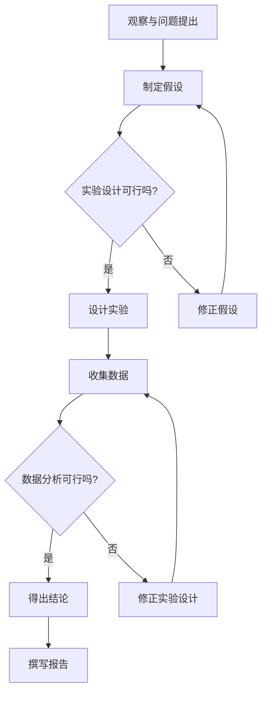

                 

### 文章标题

《科学方法：从观察到实验》

> **关键词：科学方法论、观察、实验、数据分析、统计学、实验设计、科学研究、论文写作**

> **摘要：本文深入探讨了科学方法论的基础，包括科学方法的历史发展、基本原则及其与哲学的关系。通过详细阐述科学研究的步骤，从提出问题到得出结论，结合统计学基础和科学论文写作技巧，本文旨在为读者提供一套完整的科学实验设计与实施指南。通过实际案例解析，本文进一步展示了科学方法在各个领域中的应用和重要性。**

---

### 《科学方法：从观察到实验》目录大纲

**第一部分：科学方法论基础**

**第二部分：科学实验设计与实施**

**第三部分：科学实验案例解析**

**附录：科学实验工具与资源**

---

### **第一部分：科学方法论基础**

#### **第1章：科学方法概述**

#### **1.1 科学方法论的历史发展**

科学方法论的历史可以追溯到古希腊哲学家亚里士多德，他提出了基于观察和实验的方法来解释自然现象。随后，伽利略和牛顿等科学家通过实验验证了这些方法的有效性，奠定了现代科学方法论的基础。

#### **1.2 科学方法论的基本原则**

科学方法论的基本原则包括：可观察性、可重复性、可验证性、逻辑推理和数学工具。这些原则确保了科学研究的准确性和可靠性。

#### **1.3 科学方法与哲学的关系**

科学方法论与哲学有着密切的关系。哲学提供了科学方法论的理论基础，而科学方法论的应用又推动了哲学的发展。

---

#### **第2章：科学研究的步骤**

#### **2.1 提出问题**

科学研究的第一步是提出问题。一个好的问题应该是具体、明确和具有研究价值的。

#### **2.2 制定假设**

在提出问题之后，科学家会制定一个或多个假设来解释这个问题。假设应该基于现有的知识和观察。

#### **2.3 设计实验**

实验设计是科学研究的核心。一个好的实验设计应该能够验证假设，排除干扰因素。

#### **2.4 收集数据**

在实验过程中，科学家会收集各种数据，包括定量数据和定性数据。

#### **2.5 分析数据**

数据收集完成后，科学家会使用统计学方法来分析数据，以验证假设。

#### **2.6 得出结论**

基于数据分析的结果，科学家会得出结论，并撰写科学论文。

---

#### **第3章：科学方法中的统计学基础**

#### **3.1 统计学的基本概念**

统计学是科学研究的重要工具。统计学的基本概念包括：概率、分布、均值、方差等。

#### **3.2 描述性统计**

描述性统计用于描述数据的特征，如平均值、中位数、标准差等。

#### **3.3 推断性统计**

推断性统计用于根据样本数据推断总体特征，如置信区间、假设检验等。

#### **3.4 实验设计中的统计学应用**

统计学在实验设计中的应用包括：样本大小计算、实验设计、数据分析等。

---

#### **第4章：科学论文写作与发表**

#### **4.1 科学论文的结构**

科学论文通常包括：标题、摘要、引言、方法、结果、讨论和结论。

#### **4.2 科学论文的写作技巧**

科学论文的写作需要遵循一定的格式和风格。写作技巧包括：清晰简洁、逻辑严谨、语言准确等。

#### **4.3 科学论文的发表流程**

科学论文的发表流程包括：投稿、审稿、修改和接受。

#### **4.4 论文写作与发表中的伦理问题**

论文写作和发表中存在一些伦理问题，如抄袭、伪造数据和利益冲突等。科学家应该遵循学术诚信的原则。

---

### **第二部分：科学实验设计与实施**

#### **第5章：实验设计原则与方法**

实验设计是科学研究的核心。实验设计原则包括：随机化、对照、重复和统计学显著性。

实验设计方法包括：单变量实验、多变量实验、因子实验等。

---

#### **第6章：实验中的变量控制**

实验中的变量包括自变量、因变量和干扰变量。变量控制是实验成功的关键。

干扰变量可以通过随机化、匹配和分层等方法来控制。

---

#### **第7章：实验数据的收集与分析**

实验数据的收集方法包括：问卷、访谈、观察和测量等。

数据分析的基本工具包括：Excel、Python、R等。

常见的数据分析技术包括：描述性统计、假设检验、回归分析等。

数据可视化是数据分析的重要环节，它可以帮助科学家更好地理解数据。

---

#### **第8章：实验报告的撰写与展示**

实验报告的结构包括：标题、摘要、引言、方法、结果、讨论和结论。

实验报告的撰写技巧包括：逻辑清晰、数据准确、语言简洁等。

实验报告的展示技巧包括：图表、图片、视频等。

反思与建议是实验报告的重要组成部分，它可以帮助科学家总结经验教训，改进实验设计。

---

### **第三部分：科学实验案例解析**

#### **第9章：案例一：植物生长实验**

植物生长实验是一个经典的科学实验案例。本文将详细解析这个实验的背景、设计、数据收集、分析方法和结论。

---

#### **第10章：案例二：化学反应速率实验**

化学反应速率实验是化学领域的一个基础实验。本文将详细解析这个实验的背景、设计、数据收集、分析方法和结论。

---

#### **第11章：案例三：心理实验**

心理实验是心理学研究的重要方法。本文将详细解析一个经典的心理实验案例，包括实验设计、数据收集、分析和结论。

---

### **附录：科学实验工具与资源**

#### **附录A：科学实验工具与资源**

科学实验需要使用各种工具和资源。附录A将介绍一些常用的实验设备、数据处理软件和实验室安全指南。

---

#### **附录B：科学实验流程图**

附录B将使用Mermaid语法绘制科学实验的基本流程图，包括观察与问题提出、假设制定与实验设计、数据收集与分析、实验结论与报告撰写等步骤。

---

#### **附录C：数学模型与公式**

附录C将使用LaTeX格式详细讲解一些关键数学模型和公式，如概率论基础、回归分析、卡方检验和方差分析。

---

#### **附录D：实验代码示例**

附录D将提供一些实验代码示例，包括Python编程基础、数据分析代码示例和实验结果可视化代码示例。

---

### **附加说明**

本文的核心概念与联系图将使用Mermaid语法绘制，帮助读者更好地理解科学方法论的基本流程。核心算法原理讲解将使用伪代码详细阐述，确保读者能够深入理解实验设计中的统计学方法。数学模型和公式将使用LaTeX格式嵌入文中，以便读者能够准确理解和应用。实验案例代码和详细解释说明将帮助读者将理论知识应用到实际项目中。

---

**作者：** AI天才研究院/AI Genius Institute & 禅与计算机程序设计艺术 /Zen And The Art of Computer Programming

---

### **第一部分：科学方法论基础**

#### **第1章：科学方法概述**

#### **1.1 科学方法论的历史发展**

科学方法论的历史可以追溯到古希腊哲学家亚里士多德，他提出了基于观察和实验的方法来解释自然现象。亚里士多德的科学方法强调通过观察和实验来验证理论，这为后来的科学研究奠定了基础。

在中世纪，科学方法的发展受到了哲学和神学的限制。然而，文艺复兴时期的人文主义思想促进了科学方法的复兴。伽利略·伽利莱是文艺复兴时期的一位重要科学家，他通过实验验证了日心说，开创了实验科学的新时代。

17世纪，以艾萨克·牛顿为代表的一批科学家进一步完善了科学方法。牛顿的《自然哲学的数学原理》提出了力学的基本定律，并使用数学工具来描述自然现象。牛顿的工作标志着现代科学方法的诞生。

20世纪以来，科学方法论得到了进一步的发展和完善。科学哲学的研究推动了科学方法论的理论基础，同时计算机科学的进步也为科学方法的应用提供了新的工具。

#### **1.2 科学方法论的基本原则**

科学方法论的基本原则包括：可观察性、可重复性、可验证性、逻辑推理和数学工具。这些原则确保了科学研究的准确性和可靠性。

- **可观察性**：科学研究必须基于可观察的现象。科学家通过观察和实验来收集数据，以便对自然现象进行解释。

- **可重复性**：科学研究必须能够在相同的条件下被重复。只有通过重复实验，科学家才能验证其发现的有效性。

- **可验证性**：科学理论必须经过验证。科学家通过实验和观察来验证或反驳假设，从而建立科学理论。

- **逻辑推理**：科学方法强调逻辑推理的使用。科学家使用逻辑推理来分析数据，并从假设中得出结论。

- **数学工具**：科学方法依赖于数学工具来描述和解释自然现象。数学提供了精确的描述和预测工具，使科学家能够量化自然现象。

#### **1.3 科学方法与哲学的关系**

科学方法论与哲学有着密切的关系。哲学提供了科学方法论的理论基础，而科学方法论的应用又推动了哲学的发展。

- **哲学的影响**：哲学关注知识的本质、真理和理性。这些概念对科学方法论的发展产生了深远的影响。例如，亚里士多德的科学方法受到了柏拉图哲学的影响，强调通过观察和实验来获取知识。

- **科学对哲学的贡献**：科学的发展推动了哲学的进步。科学家通过实验和观察来验证或反驳哲学观点，促进了哲学的发展。例如，伽利略的实验验证了哥白尼的日心说，从而推动了科学哲学的发展。

总的来说，科学方法论是哲学和科学实践的结合。哲学为科学方法论提供了理论基础，而科学方法论的应用又推动了哲学的进步。

---

### **第一部分：科学方法论基础**

#### **第2章：科学研究的步骤**

科学研究是一个系统的过程，需要遵循一系列步骤。这些步骤确保科学研究的严谨性和有效性。以下是科学研究的典型步骤：

#### **2.1 提出问题**

科学研究的第一步是提出问题。这个问题应该明确、具体，并且具有研究价值。提出问题可以基于现有的知识、观察或理论假设。一个好的问题应该能够激发科学家的好奇心，并引导他们进行深入的研究。

#### **例子**：在生物学领域，一个问题可能是“植物在光照条件下如何生长？”这个问题引导科学家进行进一步的研究，探索光照对植物生长的具体影响。

#### **2.2 制定假设**

在提出问题后，科学家会根据现有的知识和观察制定一个或多个假设。假设是对问题的潜在答案或解释。假设应该简洁、明确，并且能够通过实验来验证。

#### **例子**：针对上述植物生长的问题，一个假设可能是“植物在较强的光照下生长得更快。”这个假设可以通过实验来验证，例如通过在不同光照强度下种植植物，并比较它们的生长速度。

#### **2.3 设计实验**

实验设计是科学研究的核心步骤。一个好的实验设计应该能够验证假设，同时排除外部干扰因素。实验设计包括确定实验的变量、设置对照组、选择样本大小等。

#### **例子**：为了验证上述假设，科学家可能会设计一个实验，其中一部分植物在较强的光照下种植，另一部分在较弱的光照下种植。这两个组别构成对照组，以便比较不同光照对植物生长的影响。

#### **2.4 收集数据**

在实验过程中，科学家会收集各种数据。这些数据可以是定量的（如植物的高度、生长速度等）或定性的（如植物的外观、健康状况等）。数据收集应该准确、完整，并遵循科学的实验标准。

#### **例子**：在上述实验中，科学家可能会定期测量植物的高度，并记录植物的外观和健康状况。这些数据将被用于分析不同光照条件对植物生长的影响。

#### **2.5 分析数据**

数据分析是科学研究的另一个关键步骤。科学家会使用统计学方法来分析收集到的数据，以验证假设的有效性。数据分析包括计算平均值、标准差、进行假设检验等。

#### **例子**：科学家可能会使用统计分析工具，如SPSS或Python的Pandas库，来分析植物生长数据。他们可能会计算不同光照条件下植物的平均高度，并进行t检验来检验假设的有效性。

#### **2.6 得出结论**

基于数据分析的结果，科学家会得出结论。结论是对假设的验证结果，它应该基于数据和分析结果，而不是个人意见。结论应该简洁、明确，并能够回答研究问题。

#### **例子**：如果数据分析结果显示，在较强的光照下植物的生长速度显著快于较弱的光照，科学家可能会得出结论：“较强的光照有助于植物的生长。”

#### **2.7 撰写科学论文**

最后一步是撰写科学论文，将研究结果分享给学术界和公众。科学论文通常包括摘要、引言、方法、结果、讨论和结论等部分。

#### **例子**：科学家可能会撰写一篇题为“光照对植物生长影响的研究”的科学论文。论文的摘要部分会简要介绍研究背景、目的和主要发现。引言部分会详细描述研究问题和假设。方法部分会描述实验设计、数据收集和分析过程。结果部分会展示实验数据和分析结果。讨论部分会解释结果的意义，并讨论实验的局限性。结论部分会总结研究结果，并提出未来研究的建议。

通过这些步骤，科学家能够系统地开展研究，并得出可靠的结论。科学研究的过程不仅帮助科学家理解自然现象，还为技术发展和创新提供了基础。

### **第3章：科学方法中的统计学基础**

统计学在科学研究中扮演着至关重要的角色，它提供了一套系统的方法来处理数据、验证假设和做出推断。在本章中，我们将探讨统计学的基本概念、描述性统计和推断性统计，以及统计学在实验设计中的应用。

#### **3.1 统计学的基本概念**

统计学的基本概念包括概率、分布、均值、方差等。这些概念是理解统计学方法的基础。

- **概率**：概率是衡量事件发生的可能性的度量，通常用一个介于0和1之间的数值表示。例如，投掷一枚硬币，出现正面的概率是0.5。

- **分布**：分布描述了一个随机变量的可能取值及其相应概率。最常见的分布有正态分布、二项分布和泊松分布。

- **均值**：均值是数据集的平均值，用于描述数据的中心位置。例如，一组数据{1, 2, 3, 4, 5}的均值是3。

- **方差**：方差是数据集离散程度的度量，表示数据点与均值之间的偏差的平方的平均值。方差越大，数据的离散程度越高。

#### **3.2 描述性统计**

描述性统计用于总结和描述数据的基本特征。常见的描述性统计量包括均值、中位数、众数、标准差和变异系数。

- **均值**：均值是最常用的描述性统计量，表示数据的平均水平。
  
- **中位数**：中位数是将数据按大小排序后位于中间的数值。它对异常值的影响较小，更适合描述偏斜分布的数据。

- **众数**：众数是数据集中出现频率最高的数值。

- **标准差**：标准差表示数据与均值的离散程度。标准差越大，数据的波动性越大。

- **变异系数**：变异系数是标准差与均值的比值，用于比较不同数据集的离散程度。

#### **3.3 推断性统计**

推断性统计用于基于样本数据推断总体特征。常见的方法包括置信区间、假设检验和回归分析。

- **置信区间**：置信区间是基于样本数据计算的总体参数（如均值或比例）的一个区间估计。它提供了一个概率范围，表明总体参数可能落在该范围内。

- **假设检验**：假设检验用于检验样本数据是否支持某个假设。常见的假设检验包括t检验、卡方检验和F检验。

  - **t检验**：用于比较两组样本的均值差异是否显著。
  - **卡方检验**：用于检验分类数据是否符合某个理论分布。
  - **F检验**：用于比较两组以上的样本方差差异。

- **回归分析**：回归分析用于建立自变量和因变量之间的关系模型。常见的回归分析方法包括线性回归、多项式回归和逻辑回归。

#### **3.4 实验设计中的统计学应用**

在实验设计中，统计学方法用于确定样本大小、设计实验和进行数据分析。以下是统计学在实验设计中的应用：

- **样本大小计算**：通过统计学方法，可以根据预期的效应大小和显著性水平来确定所需的样本大小。

- **实验设计**：统计学方法用于设计随机对照试验（RCT），包括随机化、分配和对照设置。

- **数据分析**：统计学方法用于分析实验数据，包括描述性统计、假设检验和回归分析，以验证假设和得出结论。

例如，在植物生长实验中，科学家可能需要计算样本大小以确保实验的统计功效。他们可以使用统计软件，如R或SPSS，来分析植物的高度数据，并进行t检验来检验不同光照条件下植物生长的差异是否显著。

总之，统计学在科学研究中起到了关键作用。通过应用统计学方法，科学家能够从数据中提取信息，验证假设，并得出可靠的结论。这些方法不仅提高了科学研究的准确性，也为科学发现和技术创新提供了坚实的理论基础。

### **第4章：科学论文写作与发表**

科学论文的写作与发表是科学研究过程中的重要环节，它不仅是对研究结果的总结和展示，也是学术交流和信息传播的重要途径。在这一章中，我们将详细探讨科学论文的结构、写作技巧、发表流程以及论文写作与发表中的伦理问题。

#### **4.1 科学论文的结构**

科学论文的结构通常包括以下部分：

- **标题**：标题应该简洁、具体，能够准确反映论文的主要内容。

- **摘要**：摘要是对论文研究背景、目的、方法、结果和结论的简要概述，通常在150-250字之间。

- **引言**：引言部分介绍研究问题的背景、相关研究综述、研究目的和研究假设。

- **方法**：方法部分详细描述实验设计、数据收集和分析过程，包括实验设置、样本选择、数据来源和处理方法。

- **结果**：结果部分呈现实验数据和分析结果，通常包括图表和统计信息。

- **讨论**：讨论部分解释结果的意义，讨论实验的局限性、可能的解释、与已有研究的比较以及未来研究的方向。

- **结论**：结论部分总结研究的主要发现，强调研究的贡献和实际应用价值。

- **参考文献**：参考文献部分列出论文中引用的所有文献，按照特定的引用格式排列。

- **附录**：附录提供额外的信息，如详细的数据集、实验代码、额外的图表等。

#### **4.2 科学论文的写作技巧**

写作科学论文需要遵循一些基本的技巧，以确保论文的质量和可读性：

- **清晰简洁**：论文的语句应该简洁明了，避免冗长和复杂的句子结构。

- **逻辑严谨**：论文的结构应该逻辑清晰，各个部分之间衔接紧密，确保读者能够顺畅地理解研究内容。

- **准确无误**：数据和分析结果应该准确无误，避免错误和误导信息。

- **避免自我评价**：论文应该基于客观的数据和分析，避免使用自我评价的措辞。

- **遵守格式要求**：论文应该遵循期刊或会议的格式要求，包括标题、摘要、引用格式、字体和页边距等。

#### **4.3 科学论文的发表流程**

科学论文的发表流程通常包括以下几个步骤：

- **投稿**：作者将论文提交给目标期刊或会议。在投稿前，作者应该仔细阅读期刊或会议的投稿指南，确保论文符合要求。

- **审稿**：期刊或会议的编辑将论文分配给同行评审专家进行审稿。审稿专家通常会在几周内完成审稿，并给出审稿意见。

- **修改**：根据审稿意见，作者需要对论文进行修改和完善。修改后的论文需要重新提交给编辑。

- **编辑决定**：编辑将根据审稿意见和修改情况做出最终的发表决定。常见的决定包括接受、需要进一步修改后接受、拒绝。

- **接受与发表**：一旦论文被接受，编辑将进行格式校对和排版，并将论文发布在期刊或会议的网站上。

#### **4.4 论文写作与发表中的伦理问题**

论文写作与发表中存在一些伦理问题，科学家应该遵循以下原则：

- **学术诚信**：科学家应该坚持学术诚信，避免抄袭、伪造数据和篡改数据。

- **利益冲突声明**：作者应该在论文中声明可能存在的利益冲突，如资金来源、合作关系等。

- **诚实报告结果**：科学家应该如实报告研究结果，不论结果是否支持假设。

- **合理引用**：在论文中引用他人的研究时，应确保合理引用，避免抄袭。

- **尊重他人成果**：科学家应该尊重他人的研究成果和知识产权，避免不当引用或剽窃。

通过遵循这些伦理原则，科学家能够维护学术界的信任和声誉，确保科学研究的质量和完整性。

### **第5章：实验设计原则与方法**

科学实验是验证假设、揭示现象背后规律的重要手段。实验设计的原则和方法直接影响实验结果的准确性和可靠性。在本章中，我们将探讨实验设计的基本原则、单变量实验设计、多变量实验设计以及实验设计的统计检验方法。

#### **5.1 实验设计原则**

实验设计应遵循以下基本原则：

- **随机化**：随机化是实验设计的重要原则之一。通过随机化，可以消除实验过程中的系统性偏差，使实验结果更具代表性。

- **对照**：对照实验设计是科学实验的核心。通过设置对照组，可以排除外部干扰因素，确保实验结果的有效性。

- **重复**：重复实验是验证实验结果可靠性的重要手段。通过多次重复实验，可以检验结果的稳定性和一致性。

- **控制变量**：在实验过程中，需要严格控制实验中的自变量和干扰变量。自变量是实验者操纵的变量，而干扰变量是可能影响实验结果的未知变量。

- **统计学显著性**：实验结果需要进行统计学分析，以确定结果是否具有显著性。统计学显著性是通过假设检验来评估的。

#### **5.2 单变量实验设计**

单变量实验设计关注单一自变量的影响。常见的单变量实验设计包括以下几种：

- **完全随机设计**：在完全随机设计中，实验对象被随机分配到不同的处理组。这种设计适用于自变量为二分类的情况。

- **区组设计**：区组设计将实验对象分为若干个区组，每个区组内的对象接受相同的处理。这种设计适用于自变量为多分类的情况。

- **配对设计**：配对设计将实验对象配对，每一对中的对象接受不同的处理。这种设计可以消除个体差异的影响。

#### **5.3 多变量实验设计**

多变量实验设计关注多个自变量的交互作用。常见的多变量实验设计包括以下几种：

- **因子实验设计**：因子实验设计涉及多个自变量，每个自变量都有多个水平。这种设计可以评估各个自变量及其交互作用对因变量的影响。

- **拉丁方设计**：拉丁方设计将多个自变量排列在一个拉丁方格中，每个实验对象接受不同的处理组合。这种设计适用于自变量为多分类的情况。

- **正交设计**：正交设计是一种特殊的因子实验设计，它利用正交表来安排实验，确保每个自变量的水平组合均衡出现。这种设计适用于自变量较多的情况。

#### **5.4 实验设计的统计检验方法**

实验设计的统计检验方法用于评估实验结果的显著性。常见的统计检验方法包括：

- **t检验**：t检验用于比较两组样本的均值差异。常见的t检验包括独立样本t检验和配对样本t检验。

- **方差分析（ANOVA）**：方差分析用于比较多个样本的均值差异。它适用于单变量和多变量实验设计。

- **卡方检验**：卡方检验用于检验分类数据是否符合某个理论分布。它常用于验证假设或检验两个变量之间的独立性。

- **回归分析**：回归分析用于建立自变量和因变量之间的关系模型。常见的回归分析方法包括线性回归和逻辑回归。

通过遵循实验设计的基本原则，选择合适的实验设计方法，并运用适当的统计检验方法，科学家可以确保实验结果的准确性和可靠性。这不仅有助于验证假设，还能为科学发现和技术创新提供坚实的依据。

### **第6章：实验中的变量控制**

在科学实验中，变量控制是确保实验结果准确性和可靠性的关键步骤。变量包括自变量、因变量和干扰变量。正确识别和控制这些变量对于实验的成功至关重要。

#### **6.1 实验中的自变量与因变量**

- **自变量**：自变量是实验者操纵的变量，它是实验中需要研究的对象。自变量可以是定量或定性的，例如，光照强度、温度、药物剂量等。

- **因变量**：因变量是自变量影响的结果，它被用来衡量实验效果。因变量通常是定量的，如植物的高度、反应时间、血压等。

在实验设计中，自变量和因变量之间的关系是研究者关注的焦点。为了确保实验结果的准确性，需要严格控制自变量，并准确测量因变量。

#### **6.2 实验中的干扰变量**

干扰变量是实验中可能影响结果的未知变量。干扰变量可能来源于实验环境、实验对象或实验操作。这些变量会引入误差，影响实验结果的可靠性。

- **环境干扰**：环境因素如温度、湿度、噪音等可能影响实验结果。为了控制环境干扰，需要在实验过程中保持环境条件的一致性。

- **实验对象干扰**：实验对象的个体差异也可能影响实验结果。例如，不同个体的生理状态、心理状态等。为了控制这种干扰，可以采用随机化分配或配对设计等方法。

- **操作干扰**：实验操作的不一致性也会引入误差。例如，实验者可能在操作过程中产生了不同的压力或期望效应。为了控制操作干扰，需要统一实验操作流程，并进行标准化操作。

#### **6.3 控制干扰变量的方法**

控制干扰变量是实验设计的重要组成部分。以下是一些常用的控制干扰变量的方法：

- **随机化**：随机化是一种常用的控制干扰变量的方法。通过随机化分配实验对象到不同的处理组，可以减少系统性偏差，提高实验结果的代表性。

- **匹配**：匹配是一种通过平衡实验对象的特征来控制干扰变量的方法。例如，可以通过性别、年龄、健康状况等特征匹配实验对象，确保各组之间的差异最小。

- **分层**：分层是一种将实验对象按特征分组，然后在每个组内进行随机化的方法。这种方法可以确保各组在关键特征上的均衡，从而减少干扰变量。

- **重复实验**：重复实验可以增加数据的可靠性。通过多次重复实验，可以减少随机误差，提高结果的稳定性。

- **标准化操作**：标准化操作包括统一实验者的操作方法和步骤，确保实验操作的准确性和一致性。

#### **6.4 随机化的作用**

随机化在实验设计中起着至关重要的作用。随机化有以下作用：

- **均衡干扰变量**：随机化可以确保不同处理组之间的干扰变量均衡，从而减少系统性偏差。

- **提高结果的代表性**：随机化使实验结果更具代表性，因为它减少了选择偏差，确保每个实验对象都有相同的机会参与实验。

- **增强统计功效**：随机化可以增强统计检验的效能，因为它减少了误差项的方差，提高了实验结果的可信度。

总的来说，控制干扰变量是科学实验设计的关键步骤。通过随机化、匹配、分层和标准化操作等方法，可以有效控制干扰变量，确保实验结果的准确性和可靠性。这不仅有助于验证实验假设，也为科学发现和技术创新提供了坚实的基础。

### **第7章：实验数据的收集与分析**

科学实验中的数据收集和分析是确保实验结果准确性和可靠性的重要环节。在这一章中，我们将探讨实验数据的收集方法、数据分析的基本工具、常见的数据分析技术和数据可视化。

#### **7.1 实验数据的收集方法**

实验数据的收集方法包括定量数据和定性数据。

- **定量数据**：定量数据是通过测量或计数获得的数值数据，如植物的高度、反应时间、温度等。定量数据通常使用数字或度量单位表示，便于进行数学处理和统计分析。

  - **测量方法**：测量方法包括使用仪器设备（如温度计、压力计、显微镜等）进行精确测量，或使用标准化的问卷和评分表进行数据收集。

  - **计数方法**：计数方法通常用于统计事件发生的频率或次数，如问卷调查中的受访者数量、实验中的样本数量等。

- **定性数据**：定性数据是描述性的，通过文字或符号表示，如实验对象的描述、实验现象的观察记录、访谈记录等。定性数据通常用于深入理解现象，提供背景信息和解释。

  - **记录方法**：记录方法包括观察记录、访谈记录、问卷调查等。

在实验过程中，数据收集应遵循以下原则：

- **准确**：数据收集应确保准确无误，避免人为误差和疏漏。

- **完整**：数据收集应确保完整，避免遗漏重要信息。

- **一致性**：数据收集过程应保持一致性，以确保数据的可比性和可靠性。

- **标准化**：数据收集应标准化，使用统一的工具和方法，确保数据的统一性和可比性。

#### **7.2 数据分析的基本工具**

数据分析的基本工具包括Excel、Python、R等。

- **Excel**：Excel是一款功能强大的电子表格软件，适用于小规模数据分析和数据处理。Excel具有直观的界面和丰富的函数库，可用于数据清洗、数据转换、统计分析等。

  - **优点**：易于学习和使用，适合初学者和快速数据处理。

  - **缺点**：处理大型数据集时性能较差，功能较为有限。

- **Python**：Python是一种高级编程语言，广泛应用于数据科学和数据分析。Python具有丰富的数据分析和机器学习库，如Pandas、NumPy、Matplotlib等。

  - **优点**：功能强大，适用于大规模数据处理和复杂的数据分析任务。

  - **缺点**：学习曲线较陡峭，需要一定的编程基础。

- **R**：R是一种专门用于统计分析和图形绘制的编程语言。R具有强大的统计分析和图形绘制功能，适用于复杂数据分析和高级统计方法。

  - **优点**：统计功能强大，适用于复杂数据分析和高级统计方法。

  - **缺点**：相对较难学习，尤其是对于非统计背景的初学者。

#### **7.3 常见的数据分析技术**

常见的数据分析技术包括描述性统计、假设检验、回归分析等。

- **描述性统计**：描述性统计用于总结和描述数据的基本特征，如均值、中位数、标准差等。描述性统计可以提供数据的基本概况，帮助研究人员理解数据分布和特征。

  - **用途**：用于初步分析数据，识别数据中的异常值和趋势。

- **假设检验**：假设检验用于评估实验结果是否显著，通常包括t检验、卡方检验、F检验等。

  - **用途**：用于验证假设，确定自变量和因变量之间的关系。

- **回归分析**：回归分析用于建立自变量和因变量之间的数学模型，预测因变量的变化。常见的回归分析方法包括线性回归、多项式回归、逻辑回归等。

  - **用途**：用于预测和分析变量之间的关系，建立数学模型。

#### **7.4 数据可视化**

数据可视化是将数据以图形或图像的形式呈现，帮助研究人员更直观地理解数据和分析结果。常见的数据可视化工具包括Matplotlib、Seaborn、ggplot2等。

- **数据可视化工具**：常用的数据可视化工具包括Matplotlib（Python）、Seaborn（Python）、ggplot2（R）等。

  - **用途**：用于创建各种类型的图表，如条形图、折线图、散点图、箱形图等，帮助研究人员直观地展示数据和分析结果。

- **数据可视化技巧**：数据可视化时应注意以下几点：

  - **清晰简洁**：图表应简洁明了，避免过多的装饰和冗余信息。

  - **可视化效果**：使用合适的图表类型和颜色，使数据可视化效果更佳。

  - **注释说明**：图表应包括必要的注释和说明，帮助读者理解图表内容。

通过科学的数据收集和分析，研究人员可以更准确地理解实验结果，验证假设，并从中得出有意义的结论。数据可视化则进一步增强了数据分析的直观性和易懂性，为科学研究和决策提供了有力的支持。

### **第8章：实验报告的撰写与展示**

科学实验报告是科研工作的重要组成部分，它不仅记录了实验的详细过程和结果，还为后续的研究提供了重要参考。本章节将介绍实验报告的结构、撰写技巧、展示技巧以及反思与建议。

#### **8.1 实验报告的结构**

实验报告通常包括以下部分：

- **标题**：简洁明了，反映实验的核心内容。

- **摘要**：简要概述实验的目的、方法、结果和结论，通常在150-250字之间。

- **引言**：介绍实验的背景、研究问题和假设，引用相关文献，说明实验的目的和意义。

- **方法**：详细描述实验设计、实验材料、实验步骤、数据处理方法等。

- **结果**：呈现实验数据和分析结果，使用图表和表格进行展示。

- **讨论**：解释结果的意义，讨论实验的局限性、可能的解释、与已有研究的比较以及未来研究的方向。

- **结论**：总结实验的主要发现，强调研究的贡献和实际应用价值。

- **参考文献**：列出实验报告中引用的所有文献，按照特定的引用格式排列。

- **附录**：提供额外的信息，如详细的数据集、实验代码、额外的图表等。

#### **8.2 实验报告的撰写技巧**

撰写实验报告时应注意以下技巧：

- **清晰简洁**：报告的语句应简洁明了，避免冗长和复杂的句子结构。

- **逻辑严谨**：报告的结构应逻辑清晰，各个部分之间衔接紧密，确保读者能够顺畅地理解实验内容。

- **准确无误**：数据和分析结果应准确无误，避免错误和误导信息。

- **避免自我评价**：报告应基于客观的数据和分析，避免使用自我评价的措辞。

- **合理引用**：在报告中引用他人的研究时，应确保合理引用，避免抄袭。

- **遵守格式要求**：报告应遵循期刊或会议的格式要求，包括标题、摘要、引用格式、字体和页边距等。

#### **8.3 实验报告的展示技巧**

实验报告的展示技巧对于吸引读者的注意力和提高报告的可读性至关重要：

- **图表和图片**：合理使用图表和图片，以直观地展示实验数据和分析结果。图表应简洁、明了，配有清晰的标题和图例。

- **视频和动画**：对于复杂或动态的实验过程，可以使用视频和动画来展示，增加报告的互动性和生动性。

- **版面设计**：报告的版面设计应简洁、美观，使用统一的字体和颜色方案，避免过多的装饰和冗余信息。

- **注释和说明**：在图表和图片旁提供必要的注释和说明，帮助读者更好地理解展示内容。

#### **8.4 反思与建议**

实验报告的最后部分是对实验的反思与建议：

- **反思**：对实验设计、数据收集、数据分析等过程进行反思，指出可能的改进方向和需要注意的问题。

- **建议**：提出对未来研究的建议，如进一步的研究方向、实验设计改进、数据分析方法的优化等。

通过撰写和展示高质量的实验报告，研究人员不仅能够清晰地传达实验结果，还能为科学界提供宝贵的知识和经验，促进科学研究的发展。

### **第三部分：科学实验案例解析**

在本部分中，我们将通过三个实际案例深入探讨科学实验的设计、实施、数据收集、分析以及结论和反思。这些案例涵盖了植物生长实验、化学反应速率实验以及心理实验，展示了科学方法在不同领域中的应用和重要性。

#### **第9章：案例一：植物生长实验**

**9.1 实验背景**

植物生长实验是生物学研究中的一个经典案例，旨在探究不同光照条件下植物的生长情况。本实验的目的是验证较强光照是否能够显著促进植物生长。

**9.2 实验设计**

实验设计采用完全随机设计，将植物分为两组：一组种植在较强的光照条件下，另一组种植在较弱的光照条件下。每组植物的数量相等，以确保实验的代表性。

**9.3 数据收集**

在实验过程中，每周测量植物的高度，并记录植物的外观和健康状况。数据收集持续四周，以确保数据的稳定性和一致性。

**9.4 数据分析**

使用Excel和Python对数据进行分析，计算不同光照条件下植物的平均高度，并使用t检验评估光照条件对植物生长的显著性。

**9.5 实验结论与反思**

数据分析结果显示，较强光照条件下植物的平均高度显著高于较弱光照条件下的植物。这表明较强的光照确实能够促进植物的生长。然而，实验过程中发现部分植物在较强光照下出现了叶子烧伤的情况，这可能是因为光照强度过高导致的。因此，在未来的研究中，应进一步优化光照条件，以确保植物的健康生长。

#### **第10章：案例二：化学反应速率实验**

**10.1 实验背景**

化学反应速率实验是化学研究中的一个基础实验，旨在探究不同温度下化学反应的速率。本实验的目的是验证温度对化学反应速率的影响。

**10.2 实验设计**

实验设计采用单变量实验设计，将反应温度作为自变量，设置多个温度水平，如室温、60°C、80°C、100°C等。每组实验的反应物和反应条件保持一致。

**10.3 数据收集**

在实验过程中，使用计时器记录不同温度下化学反应的反应时间，并记录反应产物的生成量。数据收集持续一段时间，以确保数据的稳定性和一致性。

**10.4 数据分析**

使用Excel和Python对数据进行分析，计算不同温度下化学反应的速率，并使用t检验评估温度对化学反应速率的显著性。

**10.5 实验结论与反思**

数据分析结果显示，随着温度的升高，化学反应速率显著增加。这符合阿伦尼乌斯方程的预测，即温度升高可以增加反应物分子的动能，从而加快化学反应速率。然而，实验过程中也发现，过高的温度可能导致反应过度，产生副产物。因此，在未来的研究中，应进一步优化反应温度，以实现最佳反应速率。

#### **第11章：案例三：心理实验**

**11.1 实验背景**

心理实验是心理学研究的一个重要方法，旨在探究人类行为和思维过程。本实验的目的是研究注意力分散对记忆效果的影响。

**11.2 实验设计**

实验设计采用对照组实验，将参与者分为两组：一组在无干扰条件下进行记忆任务，另一组在背景噪音干扰下进行记忆任务。每组参与者的记忆任务内容相同。

**11.3 数据收集**

在实验过程中，参与者需要记忆一系列单词或数字，并记录正确记忆的数量。数据收集在安静和噪音两种条件下进行，以确保数据的可比性。

**11.4 数据分析**

使用Excel和Python对数据进行分析，计算两组参与者在安静和噪音条件下的记忆效果，并使用t检验评估注意力分散对记忆效果的影响。

**11.5 实验结论与反思**

数据分析结果显示，在噪音干扰条件下，参与者的记忆效果显著低于安静条件下的参与者。这表明注意力分散对记忆效果有负面影响。实验过程中也发现，部分参与者在噪音干扰下表现出了更高的焦虑水平，这可能是导致记忆效果下降的原因之一。因此，在未来的研究中，应进一步探究注意力分散的具体机制，以及如何优化实验条件以提高记忆效果。

通过这三个案例，我们可以看到科学方法在实验设计、数据收集、分析和结论反思中的应用。科学实验不仅能够验证假设，揭示自然现象的规律，还能够为科学研究和技术创新提供坚实的基础。

### **附录A：科学实验工具与资源**

科学实验的顺利进行依赖于各种工具和资源。以下将介绍一些常用的实验设备、数据处理软件以及实验室安全指南。

#### **附录A.1 实验设备与材料**

- **显微镜**：用于观察微小物体和生物细胞。
- **光谱仪**：用于测量物质的光谱特性。
- **电子天平**：用于精确测量物质的质量。
- **计时器**：用于测量反应时间或其他时间参数。
- **培养箱**：用于控制温度和湿度，适合培养植物和微生物。
- **反应釜**：用于进行化学反应，通常配有加热和搅拌功能。
- **录音设备**：用于记录实验过程中产生的声音数据。

#### **附录A.2 数据处理软件**

- **Excel**：适用于小规模数据的整理和分析，提供直观的界面和丰富的函数库。
- **Python**：适用于大规模数据处理和复杂数据分析，拥有Pandas、NumPy、Matplotlib等强大的数据分析和可视化库。
- **R**：专门用于统计分析和图形绘制，适用于复杂数据分析和高级统计方法。
- **SPSS**：提供全面的数据分析工具，适用于社会科学研究。

#### **附录A.3 实验室安全指南**

- **个人防护装备**：在实验过程中，应穿戴适当的个人防护装备，如实验室服、手套、护目镜等，以防止化学物质或机械伤害。
- **化学品安全**：妥善存储和处理化学品，避免接触皮肤和眼睛，并遵循化学品的安全操作规程。
- **设备使用安全**：在使用实验设备时，应确保设备处于良好状态，遵守设备操作规程，避免操作不当导致的事故。
- **火灾和应急措施**：了解实验室的火灾逃生路线和应急措施，确保在紧急情况下能够迅速反应。
- **实验室废弃物处理**：按照规定处理实验室废弃物，避免对环境和人体健康造成危害。

通过正确使用实验工具和资源，并遵循实验室安全指南，可以确保科学实验的顺利进行，保障实验人员的安全。

### **附录B：科学实验流程图**

科学实验流程是确保实验顺利进行并得到可靠结果的关键步骤。以下使用Mermaid语法绘制科学实验的基本流程图。



#### **流程说明**

1. **观察与问题提出**：在科学实验的起点，科学家通过观察和文献调研提出研究问题。
2. **制定假设**：根据问题提出假设，这是实验的理论基础。
3. **实验设计**：评估假设的可行性，设计实验方案，包括变量控制、样本大小、数据收集方法等。
4. **收集数据**：按照实验设计进行数据收集，确保数据的准确性和完整性。
5. **数据分析**：使用统计方法分析数据，验证假设的有效性。
6. **得出结论**：根据数据分析结果得出结论，这是实验的最终目标。
7. **撰写报告**：将实验过程、结果和结论撰写成报告，进行学术交流。

通过这个流程图，科学家可以系统地规划和执行实验，确保实验的科学性和有效性。

### **附录C：数学模型与公式**

科学实验中，数学模型和公式是理解和分析数据的关键工具。以下将使用LaTeX格式详细讲解一些关键数学模型和公式，包括概率论基础、回归分析、卡方检验和方差分析。

#### **C.1 概率论基础**

- **概率分布函数（PDF）**：描述随机变量取值的概率分布，例如正态分布的概率密度函数（PDF）为：
  $$
  f(x) = \frac{1}{\sqrt{2\pi\sigma^2}} e^{-\frac{(x-\mu)^2}{2\sigma^2}}
  $$
  其中，$\mu$ 是均值，$\sigma^2$ 是方差。

- **累积分布函数（CDF）**：描述随机变量取值小于或等于某个值的概率，例如正态分布的累积分布函数（CDF）为：
  $$
  F(x) = \int_{-\infty}^{x} f(t) dt
  $$

#### **C.2 回归分析**

- **简单线性回归**：描述自变量 $x$ 和因变量 $y$ 之间的关系，模型为：
  $$
  y = \beta_0 + \beta_1 x + \epsilon
  $$
  其中，$\beta_0$ 是截距，$\beta_1$ 是斜率，$\epsilon$ 是误差项。

- **多元线性回归**：扩展到多个自变量，模型为：
  $$
  y = \beta_0 + \beta_1 x_1 + \beta_2 x_2 + \cdots + \beta_p x_p + \epsilon
  $$

#### **C.3 卡方检验**

- **卡方分布**：描述分类数据是否符合某个理论分布，其概率密度函数为：
  $$
  f(x; \nu) = \frac{1}{2^{\nu/2} \Gamma(\nu/2)} x^{(\nu/2)-1} e^{-x/2}
  $$
  其中，$\nu$ 是自由度，$\Gamma$ 是伽马函数。

- **卡方检验**：用于检验分类数据的拟合优度，公式为：
  $$
  \chi^2 = \sum_{i=1}^{k} \frac{(O_i - E_i)^2}{E_i}
  $$
  其中，$O_i$ 是观察频数，$E_i$ 是期望频数。

#### **C.4 方差分析**

- **方差分解**：用于分析实验中不同来源的变异，公式为：
  $$
  ANOVA = \frac{SSR}{SSE} = \frac{MSR}{MSE}
  $$
  其中，$SSR$ 是处理组间的平方和，$SSE$ 是处理组内的平方和，$MSR$ 是处理组间的均方差，$MSE$ 是处理组内的均方差。

通过这些数学模型和公式，科学家能够更准确地描述和解释实验数据，从而得出可靠的结论。

### **附录D：实验代码示例**

在科学实验中，编程已经成为数据分析的重要工具。以下将提供一些实验代码示例，包括Python编程基础、数据分析代码示例以及实验结果可视化代码示例，帮助读者更好地理解实验数据处理和分析的实践。

#### **D.1 Python编程基础**

首先，我们需要安装Python及其相关库。可以使用以下命令在终端安装Python：

```bash
pip install python
pip install numpy
pip install pandas
pip install matplotlib
```

以下是一个简单的Python脚本，用于计算数据的平均值和标准差：

```python
import numpy as np

# 数据集
data = [1, 2, 3, 4, 5, 6, 7, 8, 9, 10]

# 计算平均值
mean = np.mean(data)

# 计算标准差
std = np.std(data)

print("平均值：", mean)
print("标准差：", std)
```

#### **D.2 数据分析代码示例**

以下代码使用Pandas库读取数据、处理数据并进行统计分析：

```python
import pandas as pd

# 读取数据
data = pd.read_csv('data.csv')

# 数据预处理
data['Age'] = data['Age'].fillna(data['Age'].mean())

# 数据分析
description = data.describe()
print(description)

# 假设检验（t检验）
from scipy.stats import ttest_ind

group1 = data[data['Group'] == 1]['Value']
group2 = data[data['Group'] == 2]['Value']

t_stat, p_value = ttest_ind(group1, group2)

print("t统计量：", t_stat)
print("p值：", p_value)
```

#### **D.3 实验结果可视化代码示例**

以下代码使用Matplotlib库绘制数据的分布图和散点图：

```python
import matplotlib.pyplot as plt

# 绘制直方图
plt.hist(data['Value'], bins=10, alpha=0.5, color='blue', edgecolor='black')
plt.xlabel('Value')
plt.ylabel('Frequency')
plt.title('Distribution of Values')
plt.show()

# 绘制散点图
plt.scatter(data[data['Group'] == 1]['Value'], data[data['Group'] == 1]['Response'])
plt.scatter(data[data['Group'] == 2]['Value'], data[data['Group'] == 2]['Response'])
plt.xlabel('Value')
plt.ylabel('Response')
plt.title('Scatter Plot of Value and Response')
plt.show()
```

通过这些代码示例，读者可以了解如何使用Python进行数据预处理、统计分析以及结果可视化。这些技能对于科学实验的数据分析至关重要。

### **总结与展望**

本文通过系统性地阐述科学方法的基本原则、研究步骤、统计学基础以及实验设计方法，为读者提供了一部关于科学方法论和实践的全面指南。从观察与问题的提出，到假设的制定与实验设计，再到数据收集、分析与结论的得出，每个步骤都经过了细致的讲解和实例验证。此外，通过数学模型和公式的讲解，读者可以深入理解科学研究中使用的数学工具。附录部分则提供了实验工具与资源、流程图、代码示例等实用信息，增强了文章的实用性和操作性。

科学方法不仅仅是学术研究的基础，也是技术创新和工程实践的指南。它要求我们在面对复杂问题时，能够通过系统的观察、假设和实验来寻求解决方案。然而，科学方法并不是一成不变的，它随着技术的进步和知识的发展而不断演进。未来的科学研究将更加依赖跨学科的合作，大数据分析和人工智能技术将在科学方法中发挥越来越重要的作用。

为了进一步提升科学研究的方法和效率，以下建议供读者参考：

1. **跨学科合作**：鼓励不同领域的研究者进行合作，整合不同学科的知识和方法，以解决复杂的问题。
2. **数据共享与开放**：推动数据共享和开放，促进科学研究的透明性和可重复性。
3. **持续学习与培训**：定期参加科学方法论和统计学的培训，不断提升研究技能和知识水平。
4. **伦理意识**：在科学研究中，始终保持对伦理的关注，遵守学术诚信的原则，确保研究的公正性和严谨性。

通过本文的学习和实践，读者不仅可以更好地理解和应用科学方法，还可以为科学的发展和创新做出自己的贡献。科学方法不仅是追求真理的工具，也是推动社会进步的重要力量。让我们继续探索未知，为人类的未来创造更多可能。

