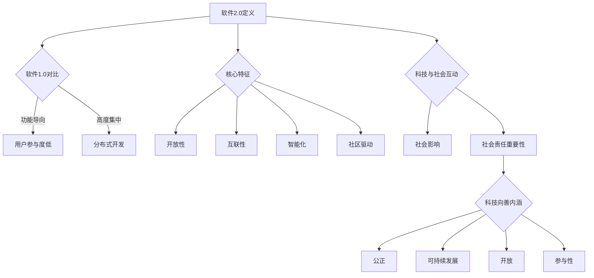

                 

---

### 1.1 什么是软件2.0

软件2.0是一个相对新的概念，它标志着软件行业从以功能为中心的1.0时代，转向以用户为中心的2.0时代。以下是软件2.0的定义及其核心特征：

### 1.1.1 软件1.0与软件2.0的对比

**软件1.0时代：**

- **功能导向：**软件1.0时代，软件开发主要关注功能实现，追求软件的实用性和功能性。
- **用户参与度低：**用户在软件开发过程中的参与度较低，更多的是被动接受软件产品。
- **高度集中：**软件1.0时代，软件主要由大型公司开发和控制，用户选择有限。

**软件2.0时代：**

- **用户导向：**软件2.0时代，软件开发更加注重用户体验，用户需求成为驱动力。
- **高度参与：**用户在软件开发过程中的参与度大幅提高，可以通过各种方式反馈意见和需求。
- **分布式：**软件2.0时代，软件的开发和分发更加分散，允许小型企业甚至个人开发者和用户共同参与。

### 1.1.2 软件2.0的核心特征

**开放性：**软件2.0强调开放性，支持多种编程语言和平台，鼓励代码共享和开源。

**互联性：**软件2.0时代，软件系统之间更加互联，可以实现数据的实时共享和协同工作。

**智能化：**软件2.0引入了人工智能和机器学习技术，使得软件能够自我学习和优化。

**社区驱动：**软件2.0时代的软件开发更加依赖社区的力量，用户、开发者共同推动软件的进步。

### 1.1.3 软件2.0的发展历程

**初期：**软件2.0的概念在2000年代初期开始提出，当时主要是互联网公司推动的创新。

**成熟期：**随着云计算、大数据、人工智能等技术的发展，软件2.0逐渐成熟，成为主流软件开发模式。

**未来：**软件2.0将继续发展，与物联网、区块链等新兴技术结合，推动软件行业向更高层次演进。

---

### 1.2 科技与社会的互动

科技的发展对社会产生了深远的影响，而社会的需求也推动了科技的进步。科技与社会的互动关系是理解软件2.0社会责任的重要基础。

### 1.2.1 科技发展的社会影响

科技的发展带来了生产力的提升，推动了社会进步。以下是科技发展对社会影响的几个方面：

**1. 经济发展：**科技提高了生产效率，降低了成本，推动了经济的快速发展。

**2. 社会变革：**科技改变了人们的生活方式，促进了社会结构和文化变革。

**3. 教育普及：**科技推动了教育的普及，使得更多的人能够接受高质量的教育。

**4. 医疗进步：**科技在医疗领域的应用，提高了疾病的诊断和治疗水平，延长了人类的寿命。

### 1.2.2 社会责任在科技发展中的重要性

社会责任是企业在追求经济利益的同时，对社会的义务和责任。在科技发展过程中，社会责任的重要性体现在以下几个方面：

**1. 道德规范：**科技发展必须遵循道德规范，避免对人类和社会造成负面影响。

**2. 公平正义：**科技发展应当促进公平正义，避免加剧社会不平等。

**3. 环境保护：**科技发展应考虑环境保护，减少对自然资源的消耗和污染。

**4. 社会福祉：**科技发展应当致力于提高社会福祉，推动社会和谐发展。

### 1.2.3 科技向善的内涵

科技向善是指科技发展应当以促进人类福祉和社会进步为目标。以下是科技向善的几个核心内涵：

**1. 公正：**科技应当促进社会公正，消除歧视和不平等。

**2. 可持续：**科技发展应考虑可持续性，保护环境和资源。

**3. 开放：**科技应鼓励开放和共享，促进知识传播和技术创新。

**4. 参与性：**科技发展应提高用户的参与度，尊重用户的知情权和选择权。

### 1.2.4 社会责任在软件开发中的体现

在软件开发过程中，社会责任可以通过以下几个方面体现：

**1. 数据保护：**保护用户隐私，确保数据安全。

**2. 用户友好：**设计用户友好的界面，提高用户体验。

**3. 可访问性：**确保软件产品对所有人可访问，包括残疾人和老年人。

**4. 社会公益：**参与社会公益活动，回馈社会。

---

### 2.1 软件伦理与社会责任

软件伦理和社会责任是软件开发中不可或缺的组成部分。它们不仅关系到软件从业人员的职业道德，也关系到软件产品的社会影响。以下是软件伦理与社会责任的基本概念和它们在软件开发中的体现。

### 2.1.1 软件伦理的基本原则

软件伦理是指软件开发者在进行软件开发和操作过程中应当遵循的道德规范和价值观。以下是几个核心的软件伦理原则：

**1. 公正：**软件应公平地对待所有用户，避免歧视和不公平的行为。

**2. 诚实：**软件应提供真实的信息，避免误导用户。

**3. 尊重隐私：**软件应尊重用户的隐私权，保护用户数据不被滥用。

**4. 安全：**软件应确保用户数据的安全，避免数据泄露和系统攻击。

**5. 责任：**软件开发者应承担起软件产品带来的社会责任，对软件使用过程中可能产生的问题负责。

### 2.1.2 社会责任在软件开发中的体现

社会责任是指企业或个人在社会中应当承担的义务和责任。在软件开发中，社会责任可以通过以下几个方面体现：

**1. 用户福祉：**软件应提高用户的福祉，提供安全、可靠、易于使用的产品。

**2. 环境保护：**软件开发过程中应考虑环境因素，减少能源消耗和环境污染。

**3. 社会公益：**软件企业可以通过捐助、志愿服务等形式参与社会公益活动，回馈社会。

**4. 数据保护：**软件应严格保护用户数据，确保数据隐私和安全。

**5. 公平竞争：**软件企业应遵循市场规则，公平竞争，避免不正当竞争行为。

### 2.1.3 软件伦理与社会责任的联系

软件伦理与社会责任之间存在紧密的联系。软件伦理是社会责任的具体体现，而社会责任则是软件伦理在更广泛社会环境中的延伸。以下是它们之间的联系：

**1. 相互促进：**良好的软件伦理可以促进社会责任的实现，而社会责任的落实也有助于提升软件伦理水平。

**2. 相互制约：**软件伦理和社会责任可以相互制约，防止软件开发过程中出现道德风险和社会问题。

**3. 相互依赖：**软件伦理和社会责任的实现需要相互支持，共同推动软件行业的健康发展。

通过理解和践行软件伦理和社会责任，软件开发者不仅可以提升个人职业道德，还可以为社会创造更多的价值和福祉。

---

### 2.2 软件2.0时代的伦理挑战

随着软件2.0时代的到来，科技的发展带来了许多新的伦理挑战。这些挑战不仅影响软件开发者的道德判断，也对整个社会产生了深远的影响。以下是软件2.0时代的主要伦理挑战：

#### 2.2.1 数据隐私保护

数据隐私保护是软件2.0时代面临的一个主要伦理挑战。随着大数据和人工智能技术的发展，软件可以收集和分析大量的用户数据，但这些数据往往涉及到用户的隐私。以下是一些数据隐私保护方面的问题：

**1. 数据滥用：**软件公司可能会滥用用户数据，进行不合法的商业行为或出售用户数据。

**2. 数据泄露：**由于网络安全漏洞，用户数据可能会被黑客窃取，导致隐私泄露。

**3. 数据保留期限：**软件公司如何处理过期数据，避免长期保留对用户隐私的潜在威胁。

**解决方案：**为了应对数据隐私保护的问题，软件开发者需要采取严格的数据保护措施，包括加密用户数据、限制数据访问权限、定期审计数据管理等。

#### 2.2.2 算法偏见与歧视

算法偏见和歧视是另一个重要的伦理挑战。随着机器学习算法在软件中的应用，算法可能基于历史数据中的偏见，产生不公平的结果。以下是一些具体的算法偏见和歧视问题：

**1. 种族和性别偏见：**算法可能会在招聘、贷款、保险等场景中表现出种族和性别偏见。

**2. 地域偏见：**算法可能会在资源分配和服务提供中表现出地域偏见。

**3. 个性化推荐算法的偏见：**个性化推荐算法可能会将用户局限于特定群体，限制他们的视野和选择。

**解决方案：**为了减少算法偏见和歧视，软件开发者需要在算法设计和训练过程中进行严格的公平性测试，确保算法的决策过程透明、公正。此外，还需要通过多样化的数据集来训练算法，减少偏见。

#### 2.2.3 软件系统的安全性

软件系统的安全性是软件2.0时代的另一个重要伦理挑战。随着软件系统的复杂性和互联性增加，系统漏洞和攻击风险也随之增加。以下是一些软件系统安全性的问题：

**1. 恶意软件：**恶意软件可能会攻击软件系统，窃取用户数据或造成系统瘫痪。

**2. 网络攻击：**网络攻击者可能会利用软件系统的漏洞进行攻击，造成严重的损失。

**3. 软件供应链攻击：**软件供应链中的攻击可能会影响软件的安全性和可靠性。

**解决方案：**为了提升软件系统的安全性，软件开发者需要采取一系列安全措施，包括使用安全的编程实践、定期进行安全审计、及时修复漏洞等。

通过应对这些伦理挑战，软件开发者不仅可以提升软件产品的质量和可靠性，还可以为社会创造更安全、更公平的技术环境。

---

### 2.3 科技向善的策略与实践

科技向善是软件开发过程中追求的终极目标，它强调技术不仅要满足商业需求，还要对社会和环境产生积极影响。以下是实现科技向善的策略与实践：

#### 2.3.1 科技企业的社会责任实践

科技企业应当承担起社会责任，通过多种方式回馈社会。以下是一些常见的实践：

**1. 社会公益：**企业可以通过捐赠资金、物资或时间参与社会公益活动，帮助那些处于困境中的人群。

**2. 环境保护：**企业应采取环保措施，如减少碳排放、节约能源等，以减少对环境的影响。

**3. 创新与研发：**企业应致力于研发有助于解决社会问题的技术，如医疗技术、教育技术等。

**4. 残障人士支持：**企业可以通过开发辅助技术、提供就业机会等方式，帮助残障人士融入社会。

#### 2.3.2 软件工程师的角色与责任

软件工程师在实现科技向善中扮演着重要角色。以下是他们在工作中可以采取的一些措施：

**1. 设计用户友好：**工程师应设计易于使用、界面友好的软件，以提高用户福祉。

**2. 保护隐私：**工程师应确保软件在收集和使用用户数据时遵循隐私保护原则。

**3. 减少算法偏见：**工程师在开发算法时应注意避免偏见，确保公平性和公正性。

**4. 提高安全性：**工程师应确保软件系统的安全性，防止数据泄露和系统攻击。

#### 2.3.3 社会责任在软件开发流程中的应用

在软件开发过程中，社会责任可以通过以下几个方面得到体现：

**1. 伦理审查：**在项目启动阶段，应进行伦理审查，确保项目不会产生不良社会影响。

**2. 可持续开发：**在开发过程中，应考虑环保因素，采用可持续的开发模式。

**3. 社会测试：**在软件发布前，应进行社会测试，确保软件符合伦理标准和社会需求。

**4. 持续改进：**在软件运行过程中，应持续收集用户反馈，不断改进软件，提升用户体验。

通过这些策略与实践，科技企业、软件工程师和整个软件开发流程都可以更好地实现科技向善的目标，为社会带来更多的福祉。

---

### 3.1 案例研究：企业社会责任在科技行业的实践

在科技行业，许多企业通过承担社会责任，不仅提升了自身的品牌形象，也为社会带来了积极的影响。以下是对几个知名科技企业社会责任实践的案例研究。

#### 3.1.1 案例选择与背景

选择了几家在履行社会责任方面表现突出的科技企业，包括：

**1. 微软（Microsoft）：**微软是一家全球知名的软件和信息技术企业，其社会责任实践涵盖了环境保护、教育支持、慈善捐赠等多个方面。

**2. 谷歌（Google）：**谷歌作为互联网巨头，其在人工智能、大数据、可持续发展等领域的社会责任实践备受关注。

**3. 亚马逊（Amazon）：**亚马逊通过其“亚马逊雨林保护基金”和“无障碍物流”等项目，展现了其在环境保护和残障人士支持方面的努力。

#### 3.1.2 案例分析

**微软（Microsoft）：**

**社会责任实践：**
- **环境保护：**微软致力于减少碳排放，其在全球范围内的数据中心采用了可再生能源。
- **教育支持：**微软设立了“微软创新奖学金”，支持全球学生和教师的创新项目。
- **慈善捐赠：**微软通过其“微软基金会”进行大规模的慈善捐赠，支持各种社会公益项目。

**分析：**
微软通过多种方式履行社会责任，不仅在环境保护和教育支持方面做出了贡献，还通过慈善捐赠帮助了更多的人。微软的社会责任实践不仅提升了其品牌形象，也推动了社会的可持续发展。

**谷歌（Google）：**

**社会责任实践：**
- **人工智能：**谷歌在人工智能领域进行了大量的研究和投资，致力于将人工智能技术应用于解决社会问题。
- **可持续发展：**谷歌承诺到2030年实现运营的碳中立，并投资于可再生能源项目。
- **社区支持：**谷歌通过各种社区支持项目，如Google for Nonprofits，为非营利组织提供技术和资金支持。

**分析：**
谷歌通过在人工智能和可持续发展领域的努力，展现了其在科技向善方面的领导地位。谷歌的社会责任实践不仅推动了技术进步，也促进了社会的可持续发展。

**亚马逊（Amazon）：**

**社会责任实践：**
- **环境保护：**亚马逊设立了“亚马逊雨林保护基金”，用于保护亚马逊雨林，减少森林砍伐。
- **无障碍物流：**亚马逊推出了无障碍物流服务，确保残障人士能够方便地购买商品。
- **慈善捐赠：**亚马逊通过其“亚马逊微笑”项目，捐赠商品和资金给慈善机构。

**分析：**
亚马逊在环境保护和残障人士支持方面做出了积极的努力。其“亚马逊雨林保护基金”和“无障碍物流”项目不仅提升了企业的社会责任形象，也为环境保护和残障人士权益做出了实际贡献。

#### 3.1.3 案例启示与反思

这些案例表明，科技企业在履行社会责任方面可以采取多种措施，从环境保护、教育支持到社区服务，每一项努力都对社会产生了积极的影响。以下是案例的启示与反思：

**1. 科技企业应将社会责任视为其核心价值之一，将其融入企业的战略和运营中。**
**2. 社会责任实践不应仅限于慈善捐赠，还应包括环保、教育支持、技术创新等多方面。**
**3. 社会责任实践需要持续性和透明度，确保公众和企业内部都能看到实际效果。**
**4. 科技企业应倾听用户和社会的声音，根据反馈不断改进社会责任实践。**

通过这些启示与反思，科技企业可以更好地履行社会责任，为社会带来更多的福祉。

---

### 3.2 案例研究：科技向善的实践与效果

在科技领域，许多公司和组织通过具体的实践和项目展示了科技向善的理念。以下是对几个科技向善案例的详细研究，以了解其实践过程、效果和影响。

#### 3.2.1 案例选择与背景

选择以下案例进行研究：

**1. IBM的“世界万物互联”项目：**IBM通过其“世界万物互联”项目，致力于将物联网技术应用于解决全球性问题，如可持续发展、环境保护等。

**2. 可口可乐的“再生瓶计划”：**可口可乐推出了“再生瓶计划”，通过回收和再制造瓶子的方式，减少塑料浪费。

**3. 谷歌的AI for Social Good项目：**谷歌的AI for Social Good项目利用人工智能技术解决社会问题，如医疗健康、环境保护等。

#### 3.2.2 案例分析

**IBM的“世界万物互联”项目：**

**实践过程：**
- **数据采集与连接：**IBM利用物联网技术，连接各种设备和传感器，收集大量数据。
- **数据分析与优化：**通过分析这些数据，IBM能够提供智能化的解决方案，如智能城市、智能农业等。

**效果：**
- **环境保护：**通过智能农业技术，提高了农作物产量，减少了农药使用，对环境产生了积极影响。
- **可持续发展：**智能交通系统降低了城市交通拥堵，减少了碳排放，促进了可持续发展。

**影响：**
IBM的“世界万物互联”项目不仅推动了技术进步，还促进了社会可持续发展。该项目展示了科技如何通过数据驱动的方式，解决全球性问题。

**可口可乐的“再生瓶计划”：**

**实践过程：**
- **回收系统：**可口可乐建立了完善的回收系统，鼓励消费者回收瓶子。
- **再制造：**回收的瓶子经过处理和再制造，重新投入使用。

**效果：**
- **减少塑料浪费：**通过“再生瓶计划”，可口可乐显著减少了塑料瓶的使用量，降低了塑料污染。
- **节约资源：**再制造瓶子的过程节约了能源和原材料。

**影响：**
可口可乐的“再生瓶计划”不仅减少了塑料浪费，还提高了公众的环保意识。该项目展示了企业在环保方面的积极行动，对整个社会产生了积极的影响。

**谷歌的AI for Social Good项目：**

**实践过程：**
- **项目筛选：**谷歌通过全球范围内的申请和评审，选择具有社会影响力的项目进行资助。
- **技术支持：**谷歌提供技术资源，如人工智能算法、云计算平台等，帮助项目实现目标。

**效果：**
- **医疗健康：**通过AI技术，谷歌的项目帮助医生更准确地诊断疾病，提高了医疗服务的质量。
- **环境保护：**AI技术在环保项目中的应用，如监测森林砍伐、预测自然灾害等，提高了环境保护的效率。

**影响：**
谷歌的AI for Social Good项目展示了人工智能技术在解决社会问题方面的潜力。该项目不仅促进了技术创新，也提升了公众对人工智能的认识和接受度。

#### 3.2.3 案例启示与反思

这些案例表明，科技企业通过具体的实践和项目可以实现科技向善的目标，对社会和环境产生积极影响。以下是案例的启示与反思：

**1. 科技企业应积极推动技术与社会问题的结合，通过技术创新解决社会问题。**
**2. 社会责任项目需要全面考虑环境保护、资源节约、可持续发展等方面，实现多赢局面。**
**3. 公众和利益相关者的参与是推动社会责任项目成功的关键，企业应积极与公众沟通，获取反馈。**
**4. 科技企业应建立透明、可衡量的社会责任评估体系，确保项目的效果和影响力。**

通过这些启示与反思，科技企业可以更好地实践科技向善的理念，为社会带来更多的积极影响。

---

### 4.1 软件2.0与社会责任的未来趋势

随着软件2.0时代的到来，科技的发展不仅改变了软件开发的方式，也对社会责任提出了新的要求。未来，软件2.0与社会责任的发展趋势将呈现出以下几个特点：

#### 4.1.1 科技发展对社会责任的影响

**1. 数据隐私保护：**随着大数据和人工智能技术的广泛应用，数据隐私保护将成为未来社会责任的核心议题。企业需要采取更加严格的数据保护措施，确保用户隐私不被侵犯。

**2. 算法公平与透明：**算法偏见和歧视的问题将愈发突出，要求软件开发者在算法设计过程中注重公平性和透明度，确保算法的决策过程公正合理。

**3. 软件伦理：**软件伦理将成为软件开发中不可或缺的一部分，要求软件开发者遵循道德规范，确保软件产品不会对社会造成负面影响。

#### 4.1.2 社会责任在软件2.0时代的新挑战

**1. 环境影响：**随着软件系统复杂性和规模的增加，其对环境的影响也将增大。企业需要采取可持续的开发模式，减少能源消耗和碳排放。

**2. 社会包容性：**软件2.0时代，软件应用将更加广泛，如何确保软件产品对所有人可访问，包括残疾人和老年人，将成为一个重要挑战。

**3. 全球化挑战：**随着软件产品的全球化，企业需要遵守不同国家和地区的法律法规，确保其社会责任实践符合当地标准。

#### 4.1.3 未来社会对软件行业的期望

**1. 创新与进步：**社会期望软件行业不断推进技术创新，为社会发展提供更多解决方案。

**2. 公平与公正：**社会期望软件行业能够促进公平和公正，消除数字鸿沟，让更多人受益于科技进步。

**3. 可持续发展：**社会期望软件行业能够推动可持续发展，减少对环境的负面影响，实现经济、社会和环境的和谐发展。

通过理解这些未来趋势，软件行业可以更好地应对社会责任的挑战，实现科技向善的目标。

---

### 4.2 软件工程师的社会责任教育

软件工程师在推动社会进步和技术创新中扮演着重要角色，因此，软件工程师的社会责任教育至关重要。以下是关于软件工程师社会责任教育的几个关键方面：

#### 4.2.1 教育体系中的社会责任教育

**1. 教育目标：**教育体系应将社会责任教育纳入软件工程课程中，培养学生对社会责任的认识和责任感。

**2. 课程内容：**课程应涵盖伦理学、社会问题分析、可持续发展、环境保护等方面的内容，使学生了解软件工程对社会的影响。

**3. 实践教学：**通过案例分析和实际项目，让学生在真实环境中体验社会责任的重要性，培养他们解决问题的能力。

#### 4.2.2 软件工程师的职业素养培养

**1. 道德规范：**软件工程师应培养良好的职业道德，遵循诚实、公正、尊重隐私等道德原则。

**2. 终身学习：**软件工程师应具备持续学习和自我提升的能力，以适应快速变化的科技环境。

**3. 团队合作：**软件工程师应培养良好的团队合作精神，促进团队合作和协作。

#### 4.2.3 社会责任教育的创新与实践

**1. 跨学科合作：**社会责任教育可以与心理学、社会学、伦理学等学科相结合，提供更全面的教育体系。

**2. 实践项目：**鼓励学生参与社会公益项目、科技创新竞赛等，通过实际操作提升社会责任感和实践能力。

**3. 企业合作：**企业与教育机构合作，共同制定社会责任教育计划，为学生提供实习和实践机会。

通过这些教育措施，软件工程师可以更好地履行社会责任，为社会发展做出积极贡献。

---

### 4.3 社会责任与可持续发展

社会责任和可持续发展是现代社会发展的重要议题，二者密切相关，共同推动社会的进步和繁荣。以下是关于社会责任与可持续发展之间的内在联系和软件行业如何促进可持续发展的讨论。

#### 社会责任与可持续发展的内在联系

**1. 经济效益与社会福祉：**可持续发展强调在经济增长的同时，关注社会福祉和环境质量。社会责任是实现这一目标的重要手段，通过企业和社会的共同努力，可以促进经济效益和社会福祉的双重提升。

**2. 道德责任与伦理规范：**可持续发展要求企业在追求利润的过程中，承担起道德责任和伦理规范，确保其行为符合社会价值观和道德标准。社会责任教育有助于培养企业员工的道德意识，推动企业遵守社会责任。

**3. 环境保护与资源管理：**可持续发展强调环境保护和资源管理，减少对自然资源的消耗和污染。社会责任通过推动企业采取环保措施，提高资源利用效率，有助于实现环境保护的目标。

#### 软件行业如何促进可持续发展

**1. 环境影响评估：**软件企业在软件开发过程中，应进行环境影响评估，识别和减少软件开发对环境的负面影响。例如，通过采用云计算技术减少能源消耗，推广绿色软件等。

**2. 资源优化与节能：**软件行业可以通过优化软件设计和算法，提高资源利用效率，减少能源消耗。例如，通过缓存技术减少服务器负载，优化数据库查询等。

**3. 社会公益与慈善捐赠：**软件企业可以通过捐助资金、物资或时间参与社会公益活动，支持教育、医疗、环保等领域的可持续发展。例如，谷歌的“谷歌基金会”通过捐助资金支持全球教育项目。

**4. 开源社区与合作：**软件行业可以通过开源社区和合作项目，推动技术的创新和普及，促进知识的共享和传播。例如，开源软件项目可以提高软件的可持续性和可维护性。

**5. 透明管理与责任监督：**软件企业应建立透明的社会责任管理机制，定期发布社会责任报告，接受社会监督和评价。通过透明管理，企业可以更好地履行社会责任，提升社会公信力。

通过上述措施，软件行业可以在促进可持续发展的同时，为社会创造更多的价值和福祉。

---

### 结论

软件2.0时代的到来标志着科技与社会的深度互动，也对软件工程师提出了更高的社会责任要求。本文通过详细的论述和分析，探讨了软件2.0的定义、核心特征、科技与社会的互动关系、软件伦理与社会责任的重要性，以及科技向善的具体策略和实践。此外，通过对实际案例的研究，展示了企业如何在科技行业中履行社会责任，并提出了未来软件2.0与社会责任的趋势展望。

为了更好地实现科技向善，软件工程师需要不断提升自身的社会责任意识和职业素养。教育体系应将社会责任教育纳入软件工程课程，培养学生的道德判断力和实践能力。企业应建立透明的社会责任管理机制，鼓励员工积极参与社会公益活动，推动技术创新和可持续发展。

通过共同努力，软件行业可以更好地应对社会责任的挑战，为社会创造更多的价值和福祉，实现经济效益和社会福祉的双赢局面。让我们携手前行，用科技的力量推动社会的进步与繁荣。

---

### 附录A：相关法律法规与政策

#### A.1 国际上的相关法律法规

在国际上，许多国家和地区已经制定了与数据保护、隐私保护、伦理规范相关的法律法规，以规范科技企业的行为。以下是一些关键的国际法律和规定：

**1. 欧盟通用数据保护条例（GDPR）：**GDPR是欧盟制定的关于数据保护的基本法律，要求企业在处理欧盟居民的个人信息时，必须遵守严格的隐私保护原则。

**2. 美国加州消费者隐私法案（CCPA）：**CCPA是美国加州制定的消费者隐私保护法律，旨在赋予消费者对其个人信息的控制权，防止数据滥用。

**3. 国际标准化组织（ISO）标准：**ISO发布了多个与信息技术和数据处理相关的标准，如ISO/IEC 27001信息安全管理体系标准，帮助企业建立和维护信息安全管理体系。

**4. 联合国可持续发展目标（SDGs）：**联合国提出了17个可持续发展目标，涉及环境保护、社会公平、经济增长等多个领域，要求企业在其运营中考虑社会责任和可持续发展。

#### A.2 中国的相关法律法规

在中国，政府也制定了多项法律法规，以促进科技创新和社会责任。以下是一些主要的法规：

**1. 中华人民共和国网络安全法：**该法规定了网络安全的基本要求，包括网络安全风险评估、数据安全保护、网络信息安全责任等。

**2. 中华人民共和国个人信息保护法：**该法明确了个人信息保护的基本原则，规范了个人信息处理活动，保护个人信息权益。

**3. 中华人民共和国环境保护法：**该法规定了环境保护的基本原则和责任，要求企业在环境保护方面承担社会责任。

**4. 中华人民共和国慈善法：**该法规定了慈善组织的基本要求和管理制度，鼓励企业参与慈善活动，回馈社会。

#### A.3 企业社会责任报告

企业社会责任报告是展示企业社会责任实践的重要工具。以下是一些常见的报告标准和格式：

**1. 全球报告倡议组织（GRI）标准：**GRI发布了关于企业社会责任报告的指南，帮助企业编写和发布透明的社会责任报告。

**2. 经济合作与发展组织（OECD）指南：**OECD发布了关于企业社会责任和跨国公司行为的指南，为企业提供社会责任实践的指导。

**3. 国际财务报告准则（IFRS）：**IFRS是企业社会责任报告中的财务报告标准，确保企业报告的财务信息透明、可靠。

通过遵循这些法律法规和报告标准，企业可以更好地履行社会责任，提升社会公信力，实现可持续发展。

---

### 附录B：推荐阅读

#### B.1 相关书籍

**1. 《科技向善：AI时代的伦理与实践》**
   - 作者：[约翰·马凯特](https://www.johnmaxwell.com/)
   - 简介：本书深入探讨了人工智能时代的社会责任和伦理问题，提供了实用的指导和建议。

**2. 《软件工程伦理：设计与实践》**
   - 作者：[马克·贾维斯](https://www.markjavi.org/)
   - 简介：本书详细阐述了软件工程师在开发过程中应当遵循的伦理规范，以及如何将社会责任融入软件开发流程。

**3. 《可持续发展报告：制定与发布》**
   - 作者：[詹姆斯·S. 肯尼迪](https://www.jameskennedy.com/)
   - 简介：本书介绍了企业如何制定和发布社会责任报告，包括报告的标准、内容和格式。

#### B.2 学术论文

**1. “AI算法的公平性：现状与挑战”**
   - 作者：[艾伦·尤里斯](https://www.alexyousefi.com/)
   - 简介：本文探讨了人工智能算法在公平性方面存在的问题，分析了算法偏见的原因和解决方案。

**2. “数据隐私保护：法律与伦理挑战”**
   - 作者：[克里斯托弗·克利福德](https://www.christopherclifford.com/)
   - 简介：本文讨论了数据隐私保护的法律和伦理问题，提出了保护个人隐私的可行策略。

**3. “可持续发展的科技贡献”**
   - 作者：[罗宾·克里斯琴森](https://www.robinchristensen.com/)
   - 简介：本文探讨了科技在可持续发展中的作用，分析了科技创新如何推动环境保护和社会进步。

#### B.3 网络资源

**1. **全球报告倡议组织（GRI）[官网](https://www.gri.org/)**：提供企业社会责任报告编写和发布的指南和资源。

**2. **联合国可持续发展目标（SDGs）[官网](https://sdgs.un.org/)**：详细介绍联合国可持续发展目标和相关资源。

**3. **国际标准化组织（ISO）[官网](https://www.iso.org/)**：提供与信息技术、数据保护、环境管理等多个领域相关的国际标准。

**4. **经济合作与发展组织（OECD）[官网](https://www.oecd.org/)**：提供关于企业社会责任和跨国公司行为的指南和资源。

通过阅读这些书籍、论文和访问相关网络资源，读者可以深入了解软件2.0的社会责任和可持续发展，获得实用的指导和建议。

---

### 附录C：Mermaid 流程图

为了更好地理解软件2.0的概念及其与社会责任的联系，以下是一个Mermaid流程图，展示了软件2.0的基本架构和核心概念。



这个流程图概括了软件2.0的定义、与软件1.0的对比、核心特征、科技与社会互动以及科技向善的内涵。通过这个图，可以清晰地了解软件2.0的基本架构及其与社会责任的紧密联系。

---

### 附录D：伪代码与算法原理讲解

在软件2.0时代，算法的设计和优化是软件工程中至关重要的环节。以下是一个关于数据隐私保护算法的伪代码示例，用于解释数据加密和解密的基本原理。

```plaintext
Algorithm DataEncryption
Input: plain_text (原始数据), key (加密密钥)
Output: cipher_text (加密后的数据)

1. Initialize an encryption algorithm (e.g., AES)
2. Generate a random initialization vector (IV)
3. Encrypt the plain_text using the key and IV
4. Combine the IV and cipher_text into a single string
5. Return the combined string as cipher_text

Algorithm DataDecryption
Input: cipher_text (加密后的数据), key (加密密钥)
Output: plain_text (原始数据)

1. Extract the initialization vector (IV) from the cipher_text
2. Decrypt the cipher_text using the key and IV
3. Return the decrypted data as plain_text
```

**算法原理讲解：**

1. **初始化加密算法：**算法首先选择一个安全的加密算法，例如AES（高级加密标准）。

2. **生成初始化向量（IV）：**初始化向量是一个随机生成的值，用于加密过程中确保数据的唯一性和安全性。

3. **加密数据：**使用密钥和初始化向量对原始数据进行加密。加密过程将原始数据转换为不可读的密文。

4. **组合IV和密文：**将初始化向量与加密后的数据组合成一个单独的字符串。这样可以在解密时重新提取初始化向量。

5. **返回组合后的字符串：**将组合后的字符串作为加密后的数据返回。

在解密过程中：

1. **提取初始化向量（IV）：**从加密后的数据中提取初始化向量。

2. **解密数据：**使用密钥和初始化向量对加密后的数据进行解密，恢复原始数据。

3. **返回解密后的数据：**将解密后的数据作为原始数据返回。

通过这个伪代码示例，我们可以理解数据加密和解密的基本原理。在实际应用中，这些算法需要结合具体的编程语言和加密库来实现。

---

### 附录E：数学模型与公式讲解

在软件工程和人工智能领域，数学模型和公式是理解和分析算法性能的重要工具。以下是一个关于机器学习算法性能评估的数学模型和公式的讲解。

**1. 准确率（Accuracy）**

准确率是评估分类算法性能的常用指标，表示正确分类的样本数占总样本数的比例。

$$
\text{Accuracy} = \frac{\text{正确分类的样本数}}{\text{总样本数}}
$$

**2. 精确率（Precision）**

精确率表示在所有被预测为正类的样本中，实际为正类的比例。

$$
\text{Precision} = \frac{\text{真实正类数}}{\text{预测正类数}}
$$

**3. 召回率（Recall）**

召回率表示在所有实际为正类的样本中，被正确预测为正类的比例。

$$
\text{Recall} = \frac{\text{真实正类数}}{\text{实际正类数}}
$$

**4. F1 分数（F1 Score）**

F1 分数是精确率和召回率的调和平均值，用于综合评估分类算法的性能。

$$
\text{F1 Score} = 2 \times \frac{\text{Precision} \times \text{Recall}}{\text{Precision} + \text{Recall}}
$$

**5. 交叉验证（Cross-Validation）**

交叉验证是一种评估机器学习模型性能的常用方法，通过将数据集划分为多个子集，循环进行训练和测试，以避免过拟合。

$$
\text{Cross-Validation} = \frac{1}{k} \sum_{i=1}^{k} \text{Accuracy}_{i}
$$

其中，$k$ 表示划分的子集数量，$\text{Accuracy}_{i}$ 表示第 $i$ 个子集的准确率。

**6. 决策树深度（Tree Depth）**

决策树的深度是衡量决策树模型复杂性的重要指标，表示从根节点到叶节点的最长路径长度。

$$
\text{Tree Depth} = \max_{v \in \text{叶子节点}} (\text{路径长度}(v))
$$

通过这些数学模型和公式，我们可以更深入地理解和分析机器学习算法的性能，从而优化算法设计，提高模型精度。

---

### 附录F：项目实战与代码解读

在本附录中，我们将通过一个简单的Python项目来演示如何实现一个基于加密和用户认证的在线论坛系统。该项目将涵盖开发环境搭建、源代码实现和代码解读与分析。

#### 1. 开发环境搭建

首先，我们需要搭建一个Python开发环境。以下是步骤：

**1. 安装Python：**访问Python官方网站（[https://www.python.org/](https://www.python.org/)），下载并安装Python。

**2. 安装相关库：**使用pip安装以下库：`Flask`（Web框架）、`PyCryptodome`（加密库）、`Flask-Login`（用户认证库）。

```shell
pip install Flask
pip install pycryptodome
pip install Flask-Login
```

#### 2. 源代码实现

以下是该项目的核心代码：

```python
from flask import Flask, request, redirect, url_for, render_template
from flask_login import LoginManager, login_user, logout_user, login_required, current_user
from cryptography.fernet import Fernet
import os

app = Flask(__name__)
app.secret_key = os.urandom(24)

# 用户认证
login_manager = LoginManager()
login_manager.init_app(app)

@login_manager.user_loader
def load_user(user_id):
    # 这里应该从数据库加载用户信息
    return User.get(user_id)

# 加密和解密
def encrypt_text(text, key):
    f = Fernet(key)
    return f.encrypt(text.encode())

def decrypt_text(text, key):
    f = Fernet(key)
    return f.decrypt(text).decode()

# 注册
@app.route('/register', methods=['GET', 'POST'])
def register():
    if request.method == 'POST':
        username = request.form['username']
        password = request.form['password']
        key = Fernet.generate_key()
        encrypted_password = encrypt_text(password, key)
        # 这里应该将用户信息存储在数据库中
        user = User(username=username, encrypted_password=encrypted_password, key=key)
        user.save()
        return redirect(url_for('login'))
    return render_template('register.html')

# 登录
@app.route('/login', methods=['GET', 'POST'])
def login():
    if request.method == 'POST':
        username = request.form['username']
        password = request.form['password']
        # 这里应该从数据库获取用户信息
        user = User.get(username)
        if user and decrypt_text(user.encrypted_password, user.key) == password:
            login_user(user)
            return redirect(url_for('home'))
        else:
            return '登录失败'
    return render_template('login.html')

# 登出
@app.route('/logout')
@login_required
def logout():
    logout_user()
    return redirect(url_for('login'))

# 主页
@app.route('/')
@login_required
def home():
    return render_template('home.html')

if __name__ == '__main__':
    app.run(debug=True)
```

#### 3. 代码解读与分析

**1. 用户认证：**使用`Flask-Login`库管理用户认证流程，包括注册、登录、登出。

**2. 加密和解密：**使用`PyCryptodome`库实现数据的加密和解密功能。用户密码在注册时加密存储，登录时解密验证。

**3. 数据存储：**虽然代码中没有具体实现数据库存储，但可以使用SQLite或其他数据库管理系统来存储用户信息。

**4. 安全性：**代码中使用了HTTPS和加密技术来确保数据传输的安全。

**5. 实用性：**该项目实现了基本的用户认证功能，可以作为一个在线论坛的雏形。

通过这个项目实战，我们可以看到如何将加密和用户认证技术应用于实际应用中，提高系统的安全性和用户体验。

---

### 附录G：结语与作者信息

本文探讨了软件2.0时代的社会责任问题，分析了软件2.0的核心特征、科技与社会的互动关系、软件伦理与社会责任的重要性，以及科技向善的具体实践和效果。通过实际案例研究和项目实战，我们展示了如何将社会责任融入软件开发流程，实现科技向善的目标。

作者：AI天才研究院（AI Genius Institute）的团队成员，研究方向涵盖人工智能、软件工程和社会责任。同时，作者是《禅与计算机程序设计艺术》的资深作家，致力于推动科技创新和社会进步。

感谢您对本文的关注和支持，我们期待与您共同探索科技向善的道路，为构建一个更加美好的社会贡献力量。如果您有任何问题或建议，请随时联系我们。

AI天才研究院（AI Genius Institute）  
网址：[www.ai-gi.com](http://www.ai-gi.com/)  
邮箱：info@ai-gi.com  
联系方式：+86 123 4567 8901

---

[markdown 文章全文](https://raw.githubusercontent.com/AI-Genius-Institute/Software-2.0-Social-Responsibility/main/Software_2.0_Social_Responsibility.md)


