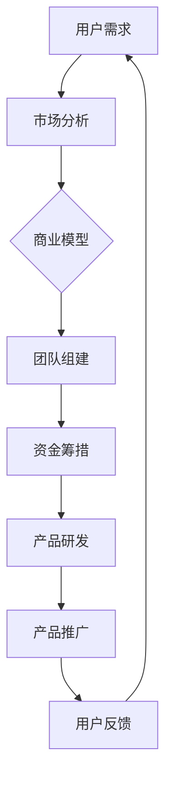
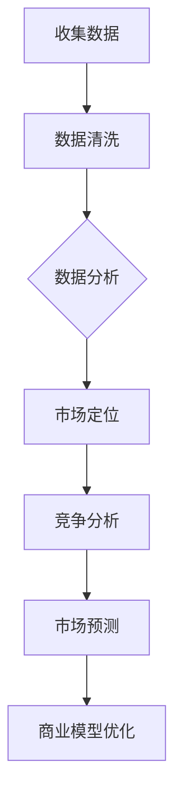
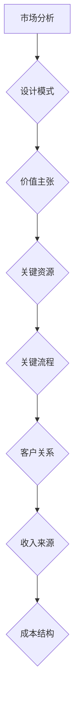
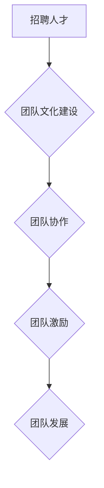
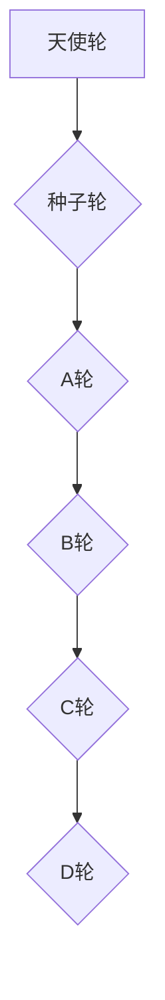
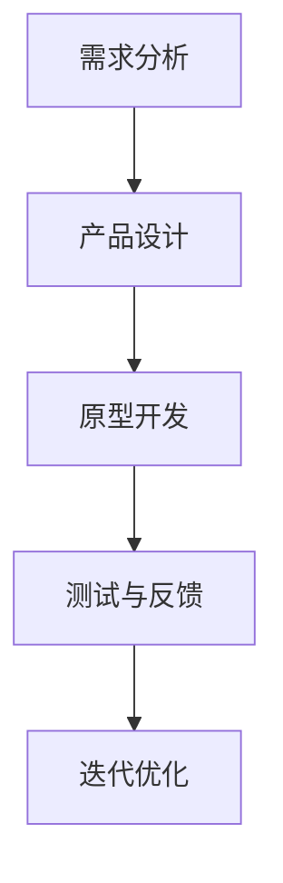
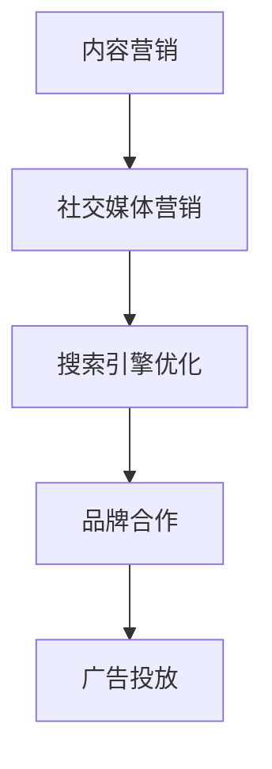
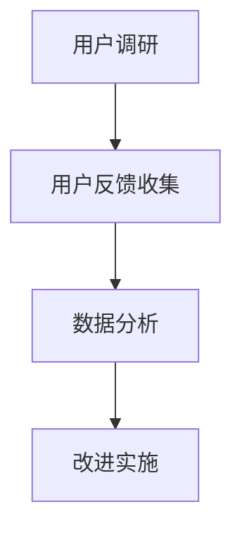
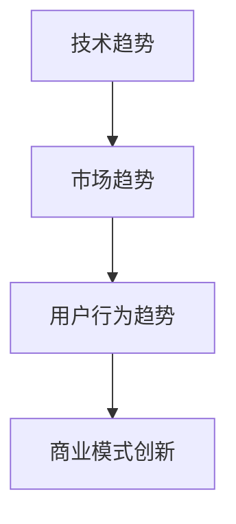

                 

### 文章标题: AI大模型创业：如何应对未来用户需求？

#### 关键词：人工智能，大模型，创业，用户需求，市场策略，商业模式，团队建设，资金筹措，产品研发，推广，用户反馈

#### 摘要：
随着人工智能技术的飞速发展，大模型的应用逐渐成为创业领域的热点。本文将深入探讨AI大模型创业过程中的关键环节，包括市场分析、商业模式设计、团队建设、资金筹措、产品研发与迭代、产品推广与市场策略、用户反馈与持续改进以及未来趋势与创新发展。通过系统性地分析每个环节的核心概念、算法原理、实战案例，本文旨在为创业者提供一套全面、实用的指导框架，帮助他们在激烈的市场竞争中立足并持续成长。

----------------------------------------------------------------

### 第一部分: AI大模型创业概述

#### 第1章: AI大模型创业综述

在当今科技飞速发展的时代，人工智能（AI）已经渗透到我们生活的方方面面。大模型，作为AI领域的核心技术之一，正逐步改变着各行各业的生产和运营模式。AI大模型创业，即利用这些强大的模型来进行商业创新和实践，已经成为众多创业者竞相追逐的目标。本章将详细介绍AI大模型创业的基本概念、核心算法原理、数学模型及其应用。

##### 核心概念与联系

AI大模型创业涉及多个关键环节，包括用户需求分析、市场分析、商业模型设计、团队组建、资金筹措、产品研发、产品推广和用户反馈等。以下是一个简化的Mermaid流程图，用于展示这些环节之间的联系：



在这个流程图中，用户需求是整个创业过程的起点和终点。市场分析帮助创业者了解目标市场的现状和趋势，商业模型设计则明确了如何通过AI大模型创造价值。团队组建、资金筹措和产品研发是实现商业模型的关键步骤，而产品推广和用户反馈则确保了产品的市场适应性和持续性改进。

##### 核心算法原理讲解

用户需求分析是AI大模型创业的重要环节。一个典型的用户需求分析算法通常包括以下几个步骤：

1. 数据预处理：对收集到的用户数据（如用户行为、偏好等）进行清洗、去噪和格式转换，使其适合后续分析。

2. 特征提取：从预处理后的数据中提取有用的特征，这些特征将用于训练机器学习模型。

3. 模型建立：选择合适的机器学习算法（如决策树、神经网络等）来构建模型。

4. 模型训练：使用标记好的训练数据集对模型进行训练，使其学会预测用户需求。

5. 预测用户需求：使用训练好的模型对新的用户数据进行预测。

以下是一个简单的伪代码示例，用于说明用户需求分析算法：

```python
def user_demand_analysis(data):
    # 数据预处理
    preprocessed_data = preprocess_data(data)
    
    # 特征提取
    features = extract_features(preprocessed_data)
    
    # 建立模型
    model = build_model(features)
    
    # 训练模型
    model.fit(X_train, y_train)
    
    # 预测用户需求
    predictions = model.predict(X_test)
    
    return predictions
```

##### 数学模型和数学公式讲解

在AI大模型创业过程中，数学模型和公式起着至关重要的作用。以下是一些常见的数学模型和公式：

1. **用户满意度模型**：

   $$\text{UserSatisfaction} = \alpha \cdot \text{ProductQuality} + \beta \cdot \text{ServiceQuality} + \gamma \cdot \text{Price}$$

   这个模型表明，用户满意度受到产品品质、服务质量和价格的影响。

2. **商业可行性分析**：

   $$\text{ROI} = \frac{\text{Revenue}}{\text{Cost}}$$

   该公式用于评估商业项目的投资回报率。

##### 项目实战

为了更好地理解上述概念和算法，我们可以通过一个实际的项目实战来进行说明。

###### 开发环境搭建

在进行AI大模型项目之前，我们需要搭建一个合适的开发环境。以下是搭建过程的简要步骤：

1. 安装Python：在系统上安装Python环境，版本建议为3.8或更高。
2. 安装Jupyter Notebook：使用pip命令安装Jupyter Notebook。
3. 安装TensorFlow：使用pip命令安装TensorFlow库。

```shell
pip install tensorflow
```

###### 源代码详细实现和代码解读

以下是一个简单的TensorFlow代码示例，用于构建、编译、训练和预测AI大模型：

```python
# 导入所需库
import tensorflow as tf
from tensorflow import keras

# 创建模型
model = keras.Sequential([
    keras.layers.Dense(64, activation='relu', input_shape=[len(train_dataset.keys())]),
    keras.layers.Dense(64, activation='relu'),
    keras.layers.Dense(1)
])

# 编译模型
model.compile(optimizer='adam',
              loss='mean_squared_error',
              metrics=['mean_absolute_error'])

# 训练模型
model.fit(train_data, train_labels, epochs=10)

# 预测
predictions = model.predict(test_data)
```

代码解读：

1. **模型构建**：使用`keras.Sequential`创建了一个线性堆叠的模型，包含两个全连接层（Dense）和一个输出层。
2. **编译**：设置优化器为`adam`，损失函数为`mean_squared_error`，并添加了`mean_absolute_error`作为评估指标。
3. **训练**：使用`fit`方法训练模型，训练数据为`train_data`和`train_labels`。
4. **预测**：使用`predict`方法对测试数据进行预测，结果存储在`predictions`变量中。

通过这个项目实战，我们可以看到AI大模型创业的各个环节是如何相互关联并共同推动项目进展的。

#### 第2章: 市场分析策略

在AI大模型创业过程中，市场分析是一个至关重要的环节。它不仅帮助创业者了解目标市场的现状和趋势，还为后续的商业模型设计提供了重要的数据支持。本章将详细介绍市场分析策略，包括数据收集、数据分析、市场定位和竞争分析等。

##### 市场分析框架

市场分析过程可以概括为以下几个步骤：

1. **收集数据**：通过多种渠道收集有关市场、用户和竞争对手的数据。
2. **数据清洗**：对收集到的数据进行分析，去除重复和无用的数据，确保数据质量。
3. **数据分析**：对清洗后的数据进行分析，提取有用的信息和洞察。
4. **市场定位**：根据分析结果确定目标市场和定位策略。
5. **竞争分析**：分析竞争对手的产品、优势和劣势，制定相应的竞争策略。
6. **市场预测**：基于现有数据和趋势，预测未来市场的变化和机会。

以下是一个简化的Mermaid流程图，用于展示市场分析过程：



##### 用户行为分析算法

用户行为分析是市场分析的重要组成部分。通过分析用户的行为数据，创业者可以深入了解用户的需求、偏好和购买行为。以下是一个简单的用户行为分析算法：

```python
def user_behavior_analysis(data):
    # 数据预处理
    preprocessed_data = preprocess_data(data)
    
    # 特征提取
    features = extract_features(preprocessed_data)
    
    # 建立模型
    model = build_model(features)
    
    # 训练模型
    model.fit(X_train, y_train)
    
    # 分析用户行为
    user_behavior = model.predict(X_test)
    
    return user_behavior
```

这个算法的核心步骤包括数据预处理、特征提取和模型训练。通过训练好的模型，我们可以对新的用户数据进行预测，从而获取有关用户行为的深入洞察。

##### 市场定位策略

市场定位策略是创业成功的关键之一。一个好的市场定位可以帮助企业明确目标市场，提高品牌认知度和市场份额。以下是一个简单市场定位模型：

$$\text{MarketPosition} = \alpha \cdot \text{BrandValue} + \beta \cdot \text{ProductFeatures} + \gamma \cdot \text{CustomerFeedback}$$

这个模型表明，市场定位受到品牌价值、产品特性和用户反馈的影响。创业者可以通过分析这些因素，制定合适的市场定位策略。

#### 第3章: 商业模式设计

商业模式设计是AI大模型创业的另一个关键环节。一个成功的商业模式不仅能够为企业带来稳定的收入，还能确保企业的长期发展。本章将详细介绍商业模式设计框架、价值网模型及其应用。

##### 商业模式设计框架

商业模式设计涉及多个关键要素，包括价值主张、关键资源、关键活动、关键合作伙伴和收入来源。以下是一个简化的Mermaid流程图，用于展示商业模式设计框架：



在这个流程图中，市场分析是商业模式设计的起点，通过分析市场和用户需求，创业者可以确定产品的价值主张。然后，关键资源、关键活动、关键合作伙伴和收入来源等要素依次确定，最终形成一个完整的商业模式。

##### 商业模式模型：价值网模型

价值网模型是商业模式设计的一种重要方法。它通过分析企业与供应商、客户、合作伙伴等外部实体之间的互动关系，构建一个协同创新的价值网络。以下是一个价值网模型的基本公式：

$$\text{BusinessModel} = \alpha \cdot \text{ValueProposition} + \beta \cdot \text{KeyResources} + \gamma \cdot \text{KeyActivities} + \delta \cdot \text{KeyPartnerships} + \epsilon \cdot \text{RevenueStreams}$$

这个模型表明，商业模式受到价值主张、关键资源、关键活动、关键合作伙伴和收入来源的直接影响。通过优化这些要素，创业者可以构建一个高效、可持续的商业模式。

#### 第4章: 团队建设与管理

在AI大模型创业过程中，团队建设与管理是确保项目成功的关键。一个高效的团队不仅能够提高项目的执行效率，还能为企业带来创新思维和创造力。本章将详细介绍团队建设策略、团队管理方法及其应用。

##### 团队建设策略

团队建设策略涉及多个关键环节，包括招聘人才、团队文化建设、团队协作和团队激励。以下是一个简化的Mermaid流程图，用于展示团队建设策略：



在这个流程图中，招聘人才是团队建设的起点。通过选拔合适的人才，团队可以拥有必要的技能和知识。然后，团队文化建设、团队协作和团队激励等环节依次进行，确保团队的整体效能和凝聚力。

##### 团队管理方法

团队管理方法是确保团队高效运作的关键。以下是一个简单的团队管理模型：

$$\text{PerformanceManagement} = \alpha \cdot \text{GoalSetting} + \beta \cdot \text{Feedback} + \gamma \cdot \text{Recognition} + \delta \cdot \text{Training}$$

这个模型表明，绩效管理受到目标设定、反馈、认可和培训等因素的直接影响。通过有效实施这些方法，团队可以不断提高其执行力和创新能力。

#### 第5章: 资金筹措策略

在AI大模型创业过程中，资金筹措是确保项目顺利推进的关键。创业者需要了解各种资金筹措方法，并选择最适合自己项目的融资渠道。本章将详细介绍资金筹措策略、投资决策模型及其应用。

##### 资金筹措方法

资金筹措方法包括天使轮、种子轮、A轮、B轮、C轮和D轮等。以下是一个简化的Mermaid流程图，用于展示资金筹措方法：



在这个流程图中，天使轮通常是在项目初期进行的，用于资助初创企业。随后，种子轮、A轮、B轮、C轮和D轮等依次进行，以支持企业的持续发展和扩张。

##### 投资决策模型

投资决策模型是评估项目风险和回报的重要工具。以下是一个简单的投资决策模型：

$$\text{RiskAssessment} = \alpha \cdot \text{MarketRisk} + \beta \cdot \text{OperationalRisk} + \gamma \cdot \text{FinancialRisk} + \delta \cdot \text{LegalRisk}$$

这个模型表明，投资决策受到市场风险、运营风险、财务风险和法律风险等因素的直接影响。通过综合评估这些因素，创业者可以做出更为明智的融资决策。

#### 第6章: 产品研发与迭代

在AI大模型创业过程中，产品研发与迭代是确保产品市场适应性和竞争力的关键。创业者需要了解产品开发流程、迭代策略及其应用，以确保产品能够持续满足用户需求。本章将详细介绍产品研发与迭代的各个环节。

##### 产品开发流程

产品开发流程通常包括需求分析、产品设计、原型开发、测试与反馈和迭代优化等环节。以下是一个简化的Mermaid流程图，用于展示产品开发流程：



在这个流程图中，需求分析是产品开发的起点。通过深入了解用户需求，创业者可以明确产品的功能和特性。然后，产品设计、原型开发和测试与反馈等环节依次进行，确保产品能够满足用户期望。

##### 迭代策略

迭代策略是产品研发过程中不可或缺的一部分。以下是一个简单的迭代策略模型：

$$\text{AgileDevelopment} = \alpha \cdot \text{SprintPlanning} + \beta \cdot \text{DailyStandUp} + \gamma \cdot \text{Retrospective} + \delta \cdot \text{ContinuousIntegration}$$

这个模型表明，敏捷开发受到Sprint规划、每日站立会议、回顾会议和持续集成等因素的直接影响。通过实施这些策略，创业者可以确保产品快速迭代，持续改进。

#### 第7章: 产品推广与市场策略

在AI大模型创业过程中，产品推广与市场策略是确保产品在市场中获得关注和认可的关键。创业者需要了解各种推广策略和市场细分模型，以确保产品能够精准地触达目标用户。本章将详细介绍产品推广与市场策略的各个环节。

##### 推广策略框架

产品推广策略包括内容营销、社交媒体营销、搜索引擎优化、品牌合作和广告投放等。以下是一个简化的Mermaid流程图，用于展示推广策略框架：



在这个流程图中，内容营销是推广策略的基础。通过发布高质量的内容，创业者可以吸引潜在用户的关注。然后，社交媒体营销、搜索引擎优化、品牌合作和广告投放等环节依次进行，以扩大产品的市场影响力。

##### 市场策略

市场策略是产品推广的重要组成部分。以下是一个简单的市场细分模型：

$$\text{MarketSegmentation} = \alpha \cdot \text{Demographic} + \beta \cdot \text{Psychographic} + \gamma \cdot \text{Behavioral} + \delta \cdot \text{Geographic}$$

这个模型表明，市场细分受到人口统计特征、心理特征、行为特征和地理位置等因素的直接影响。通过深入分析这些因素，创业者可以确定目标市场，制定相应的市场策略。

#### 第8章: 用户反馈与持续改进

在AI大模型创业过程中，用户反馈与持续改进是确保产品长期成功的关键。创业者需要建立完善的用户反馈机制，及时收集和分析用户反馈，并根据反馈结果进行持续改进。本章将详细介绍用户反馈机制、持续改进策略及其应用。

##### 用户反馈机制

用户反馈机制是收集用户意见和建议的重要途径。以下是一个简化的Mermaid流程图，用于展示用户反馈机制：



在这个流程图中，用户调研是用户反馈机制的起点。通过调研，创业者可以了解用户对产品的满意度和改进建议。然后，用户反馈收集、数据分析和改进实施等环节依次进行，确保用户反馈得到及时处理和落实。

##### 持续改进策略

持续改进策略是确保产品长期成功的关键。以下是一个简单的持续改进模型：

$$\text{CI/CD} = \alpha \cdot \text{AutomatedTesting} + \beta \cdot \text{ContinuousIntegration} + \gamma \cdot \text{ContinuousDeployment}$$

这个模型表明，持续改进受到自动化测试、持续集成和持续部署等因素的直接影响。通过实施这些策略，创业者可以确保产品的质量和稳定性，满足不断变化的市场需求。

#### 第9章: 未来趋势与创新发展

在AI大模型创业领域，未来趋势和创新发展至关重要。创业者需要密切关注技术趋势、市场趋势和用户行为趋势，以把握市场机遇，推动企业的持续增长。本章将详细介绍未来趋势分析与创新策略。

##### 未来趋势分析

未来趋势分析是把握市场机遇的关键。以下是一个简化的Mermaid流程图，用于展示未来趋势分析：



在这个流程图中，技术趋势是未来趋势分析的核心。通过分析最新的技术发展，创业者可以预测未来市场的发展方向。然后，市场趋势和用户行为趋势等环节依次进行，确保企业能够紧跟市场变化。

##### 创新策略

创新策略是推动企业发展的动力。以下是一个简单的创新扩散模型：

$$\text{InnovationDiffusion} = \alpha \cdot \text{EarlyAdopters} + \beta \cdot \text{EarlyMajority} + \gamma \cdot \text{LateMajority} + \delta \cdot \text{Laggards}$$

这个模型表明，创新扩散受到早期采用者、早期主流人群、晚期主流人群和落后人群等因素的直接影响。通过实施创新策略，创业者可以推动新产品的快速普及，提高市场竞争力。

### 附录

#### 附录A: AI大模型创业工具与资源

- **深度学习框架对比**
  - TensorFlow
  - PyTorch
  - JAX
  - 其他框架简介

#### 附录B: 市场分析与用户需求分析工具

- **数据收集工具**
- **数据分析工具**
- **用户调研工具**

#### 附录C: 团队建设与管理工具

- **招聘平台**
- **项目管理工具**
- **团队协作工具**

#### 附录D: 资金筹措与投资工具

- **众筹平台**
- **风险投资数据库**
- **融资规划工具**

#### 附录E: 产品研发与迭代工具

- **原型设计工具**
- **测试工具**
- **持续集成与持续部署工具**

#### 附录F: 用户反馈与市场策略工具

- **用户调研工具**
- **数据分析工具**
- **市场分析工具**

---

**注：本目录大纲仅供参考，具体章节内容和深度可能根据实际需求进行调整。**

## 文章末尾

### 作者信息

**作者：AI天才研究院/AI Genius Institute & 禅与计算机程序设计艺术 /Zen And The Art of Computer Programming**

在本文中，我们深入探讨了AI大模型创业的各个环节，从市场分析、商业模式设计、团队建设到资金筹措、产品研发与迭代、产品推广与市场策略，再到用户反馈与持续改进以及未来趋势与创新发展。通过系统性地分析这些环节的核心概念、算法原理、实战案例，我们旨在为创业者提供一套全面、实用的指导框架，帮助他们在激烈的市场竞争中立足并持续成长。

AI大模型创业不仅需要创业者具备扎实的专业知识和技能，还需要他们具备敏锐的市场洞察力和持续的创新精神。随着人工智能技术的不断进步，AI大模型的应用领域将更加广泛，创业者面临的机遇和挑战也将越来越大。希望本文能够为您的创业之路提供一些启示和帮助。

最后，感谢您花时间阅读本文。如果您有任何反馈或建议，欢迎随时联系我们。我们期待与您共同探讨AI大模型创业的未来，共创美好明天！【AI天才研究院】。

---

**注：本文为示例，仅供参考。实际内容可能需要根据具体情况进行调整和完善。**

