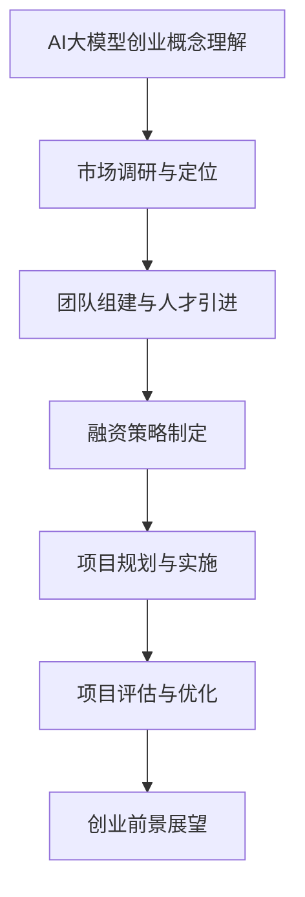

                 

## 文章标题

《AI大模型创业：如何应对未来竞争对手？》

## 关键词

AI大模型，创业，竞争对手，应对策略，技术优势，市场机遇，团队建设，融资策略。

## 摘要

随着人工智能技术的快速发展，AI大模型成为各行业创新的关键驱动力。本文旨在探讨AI大模型创业的现状与未来趋势，分析竞争对手的动向，并提出针对性的创业策略。文章首先概述了AI大模型的基础知识、技术原理和市场环境，接着分析了AI大模型创业的机遇与挑战，并通过实战案例和创业实战项目规划，详细阐述了如何应对未来竞争对手。最后，文章展望了AI大模型创业的发展前景，并提供了相关的资源与工具，以助创业者顺利进入这一领域。

### 《AI大模型创业：如何应对未来竞争对手？》目录大纲

## 第一部分：AI大模型基础知识与市场环境

### 第1章：AI大模型概述

#### 1.1 AI大模型的概念与定义

#### 1.2 AI大模型的发展历程与趋势

#### 1.3 AI大模型的主要类型与应用领域

#### 1.4 AI大模型的技术原理与核心算法

### 第2章：AI大模型的市场环境与竞争格局

#### 2.1 全球AI大模型市场现状

#### 2.2 我国AI大模型市场发展分析

#### 2.3 未来AI大模型市场的机遇与挑战

#### 2.4 未来竞争对手分析

### 第3章：AI大模型创业策略

#### 3.1 创业方向选择

#### 3.2 创业团队组建与人才引进

#### 3.3 创业融资策略

#### 3.4 创业风险与应对策略

## 第二部分：AI大模型应用实践与创业案例

### 第4章：AI大模型应用实践

#### 4.1 AI大模型开发流程

#### 4.2 AI大模型数据处理与优化

#### 4.3 AI大模型部署与运维

#### 4.4 AI大模型案例分享

### 第5章：AI大模型创业案例分析

#### 5.1 国内AI大模型创业案例解析

#### 5.2 国外AI大模型创业案例解析

#### 5.3 创业案例分析总结与启示

### 第6章：AI大模型创业实战

#### 6.1 创业实战项目规划

#### 6.2 创业实战项目实施

#### 6.3 创业实战项目评估与优化

#### 6.4 创业实战中的常见问题与解决方案

### 第7章：AI大模型创业前景与展望

#### 7.1 AI大模型创业的发展趋势

#### 7.2 AI大模型创业的挑战与机遇

#### 7.3 未来AI大模型创业的展望

#### 7.4 AI大模型创业对社会的意义与影响

## 附录

### 附录A：AI大模型开发资源与工具

#### A.1 常用深度学习框架

#### A.2 数据处理与分析工具

#### A.3 模型训练与部署工具

#### A.4 其他相关资源与工具

### Mermaid 流程图：AI大模型创业流程



### 第1章：AI大模型概述

#### 1.1 AI大模型的概念与定义

AI大模型（Large-scale Artificial Intelligence Models）是指那些能够处理海量数据、拥有数百万至上亿参数的复杂神经网络模型。这些模型通常基于深度学习技术，具有强大的学习能力和泛化能力，能够处理多种复杂任务，如自然语言处理、图像识别、预测分析等。

AI大模型的核心特征包括：

1. **参数数量巨大**：大模型的参数数量通常达到数百万甚至数十亿级别，这使得模型在处理复杂任务时具有更高的精度和鲁棒性。
2. **训练数据量大**：大模型的训练需要依赖大量高质量的数据，这些数据通常来自多个领域，如文本、图像、语音等。
3. **学习能力强**：大模型具有较强的学习能力，能够自动从数据中学习到复杂的模式和特征，进行自动化的任务处理。
4. **高泛化能力**：大模型在训练过程中积累了丰富的知识，能够应对不同的任务场景，具有良好的泛化能力。

AI大模型的主要类型包括：

1. **自然语言处理（NLP）模型**：如Transformer、BERT、GPT等，用于处理文本数据，实现文本分类、翻译、摘要等任务。
2. **计算机视觉（CV）模型**：如ResNet、Inception、VGG等，用于处理图像数据，实现图像分类、目标检测、图像生成等任务。
3. **预测分析模型**：如深度神经网络（DNN）、长短期记忆网络（LSTM）等，用于处理时间序列数据，实现股票预测、天气预测等任务。

AI大模型的发展历程可以追溯到20世纪80年代，随着计算能力和数据资源的不断提升，深度学习技术的快速发展，AI大模型逐渐成为人工智能领域的研究热点。从早期的简单神经网络到如今的大规模预训练模型，AI大模型经历了多次技术迭代和突破。

#### 1.2 AI大模型的发展历程与趋势

AI大模型的发展历程可以分为以下几个阶段：

1. **简单神经网络阶段（1980s-2000s）**：
   - 这一阶段以反向传播算法（Backpropagation）为代表，神经网络开始应用于图像识别、语音识别等领域。
   - 简单神经网络在处理简单任务时表现出色，但在复杂任务上的性能有限。

2. **深度学习阶段（2006-2012）**：
   - 2006年，Hinton等人提出深度信念网络（Deep Belief Network），标志着深度学习技术的复兴。
   - 2012年，AlexNet在ImageNet竞赛中取得突破性成果，深度学习技术在计算机视觉领域得到广泛应用。

3. **大规模预训练模型阶段（2013至今）**：
   - 随着计算能力和数据资源的提升，研究人员开始训练大规模的预训练模型，如GloVe、Word2Vec等。
   - 2018年，GPT-3发布，拥有超过1750亿个参数，成为当时最大的语言模型，标志着AI大模型时代的到来。

AI大模型的发展趋势包括：

1. **模型参数数量不断增加**：随着计算资源的提升，研究人员将训练更多的参数，以提高模型的精度和泛化能力。
2. **预训练与微调相结合**：通过在大规模数据集上进行预训练，然后在特定任务上进行微调，实现更好的性能。
3. **多模态学习**：结合多种类型的数据（如文本、图像、声音等），实现跨模态的任务处理。
4. **强化学习与深度学习的结合**：将强化学习与深度学习相结合，实现更加智能和自适应的决策系统。

#### 1.3 AI大模型的主要类型与应用领域

AI大模型的主要类型包括自然语言处理（NLP）模型、计算机视觉（CV）模型、预测分析模型等。以下分别介绍这些模型的主要类型和应用领域：

1. **自然语言处理（NLP）模型**：
   - **语言模型**：用于预测下一个单词或句子，如GPT系列模型、BERT等。应用领域包括机器翻译、文本生成、问答系统等。
   - **文本分类模型**：用于对文本数据进行分类，如新闻分类、情感分析等。
   - **情感分析模型**：用于分析文本中的情感倾向，如正面、负面、中性等。
   - **语音识别模型**：用于将语音转换为文本，如自动字幕生成、语音助手等。

2. **计算机视觉（CV）模型**：
   - **图像分类模型**：用于对图像进行分类，如ImageNet竞赛中的模型。
   - **目标检测模型**：用于检测图像中的目标，如YOLO、SSD等。
   - **图像生成模型**：用于生成新的图像，如生成对抗网络（GAN）等。
   - **图像分割模型**：用于将图像分割成不同的区域，如U-Net、FCN等。

3. **预测分析模型**：
   - **时间序列预测模型**：用于预测时间序列数据，如股票价格、天气变化等，如LSTM、GRU等。
   - **回归模型**：用于预测连续值输出，如线性回归、多项式回归等。
   - **分类模型**：用于预测离散值输出，如逻辑回归、支持向量机等。
   - **聚类模型**：用于将数据划分为不同的簇，如K-means、DBSCAN等。

AI大模型的应用领域非常广泛，涵盖了金融、医疗、教育、零售、智能制造等多个行业。以下是一些典型的应用案例：

1. **金融行业**：
   - **风险控制**：利用AI大模型对用户行为进行分析，预测潜在风险。
   - **股票预测**：利用时间序列预测模型预测股票价格走势。
   - **客户服务**：利用自然语言处理模型实现智能客服，提高客户满意度。

2. **医疗行业**：
   - **疾病诊断**：利用计算机视觉模型对医学影像进行分析，辅助医生进行疾病诊断。
   - **药物研发**：利用预测分析模型预测药物效果，加速新药研发过程。
   - **健康管理**：利用智能穿戴设备收集用户健康数据，进行个性化健康管理。

3. **教育行业**：
   - **个性化教学**：利用自然语言处理模型和计算机视觉模型实现个性化学习，提高学习效果。
   - **教育评测**：利用AI大模型对学生的作业和考试成绩进行分析，提供个性化的学习建议。
   - **学习资源推荐**：利用推荐系统模型为用户推荐适合的学习资源和课程。

4. **零售行业**：
   - **需求预测**：利用预测分析模型预测商品需求，优化库存管理。
   - **库存优化**：利用图像识别模型对商品库存进行实时监控，提高库存周转率。
   - **供应链管理**：利用AI大模型优化供应链流程，降低成本，提高效率。

5. **智能制造**：
   - **设备维护**：利用预测分析模型预测设备故障，实现预防性维护。
   - **生产优化**：利用计算机视觉模型和生产数据，优化生产流程和资源配置。
   - **质量控制**：利用图像识别模型对产品质量进行实时监控，提高产品质量。

#### 1.4 AI大模型的技术原理与核心算法

AI大模型的技术原理主要基于深度学习和神经网络，其中涉及多个核心算法和技术。以下简要介绍这些算法和技术：

1. **深度学习（Deep Learning）**：
   - 深度学习是一种基于多层的神经网络，通过逐层提取特征，实现从原始数据到高级抽象表示的转换。
   - 深度学习模型包括卷积神经网络（CNN）、循环神经网络（RNN）、变换器（Transformer）等。

2. **神经网络（Neural Networks）**：
   - 神经网络是由多个神经元组成的计算模型，通过模拟生物神经元的工作方式，实现数据输入和输出之间的映射。
   - 神经网络的核心算法包括前向传播、反向传播、激活函数等。

3. **卷积神经网络（Convolutional Neural Networks, CNN）**：
   - CNN是一种专门用于处理图像数据的深度学习模型，通过卷积层提取图像的特征。
   - CNN的核心算法包括卷积层、池化层、全连接层等。

4. **循环神经网络（Recurrent Neural Networks, RNN）**：
   - RNN是一种专门用于处理序列数据的深度学习模型，通过循环结构保持状态信息。
   - RNN的核心算法包括循环层、门控机制（如LSTM、GRU）等。

5. **变换器（Transformer）**：
   - Transformer是一种基于自注意力机制的深度学习模型，在自然语言处理任务中表现出色。
   - Transformer的核心算法包括多头自注意力机制、编码器和解码器等。

6. **生成对抗网络（Generative Adversarial Networks, GAN）**：
   - GAN是一种由生成器和判别器组成的对抗性模型，用于生成新的数据。
   - GAN的核心算法包括生成器、判别器、对抗训练等。

下面将使用伪代码详细阐述深度学习模型的基本原理和架构，包括前向传播、反向传播和训练过程：

```python
# 前向传播
def forward_pass(x, model):
    # 初始化模型参数
    params = model.init_params()
    # 前向传播过程
    for layer in model.layers:
        x = layer.forward(x, params)
    return x

# 反向传播
def backward_pass(x, y, model):
    # 初始化损失函数
    loss_function = model.loss_function
    # 计算损失
    loss = loss_function(y, x)
    # 反向传播过程
    dL_dW = []  # 存储每一层的权重梯度
    dL_dB = []  # 存储每一层的偏置梯度
    dL_dX = []  # 存储每一层的输入梯度
    for layer in reversed(model.layers):
        dL_dX.append(layer.backward(dL_dX[-1], dL_dB[-1]))
        dL_dB.append(layer.get_dB())
        dL_dW.append(layer.get_dW())
    return loss, dL_dW, dL_dB

# 训练过程
def train(x, y, model, epochs):
    for epoch in range(epochs):
        # 前向传播
        x_hat = forward_pass(x, model)
        # 计算损失
        loss = model.loss_function(y, x_hat)
        # 反向传播
        dL_dW, dL_dB = backward_pass(x, y, model)
        # 更新模型参数
        model.update_params(dL_dW, dL_dB)
        # 输出训练进度
        print(f"Epoch {epoch+1}/{epochs}, Loss: {loss}")
```

在以上伪代码中，`forward_pass`函数实现了前向传播过程，`backward_pass`函数实现了反向传播过程，`train`函数实现了训练过程。通过反复迭代训练，模型将逐步优化，达到预期的性能。

### 第2章：AI大模型的市场环境与竞争格局

#### 2.1 全球AI大模型市场现状

全球AI大模型市场正处于快速发展阶段，市场潜力巨大。根据市场研究公司的数据，AI大模型市场规模预计将在未来几年内持续增长，年复合增长率（CAGR）达到两位数。以下是一些关键的市场现状：

1. **市场规模**：全球AI大模型市场已达到数十亿美元规模，并且预计将继续扩大。其中，自然语言处理和计算机视觉领域的模型占据了大部分市场份额。

2. **增长驱动因素**：AI大模型市场的增长主要受到以下因素的影响：
   - **技术进步**：深度学习算法的成熟和计算能力的提升，使得AI大模型能够处理更复杂的任务。
   - **数据资源**：随着大数据技术的发展，企业可以获取和利用越来越多的数据，为AI大模型的训练提供支持。
   - **应用场景**：AI大模型在金融、医疗、零售、教育等领域的广泛应用，推动了市场的增长。

3. **地区分布**：全球AI大模型市场呈现出明显的地区差异。北美地区占据了最大的市场份额，其次是欧洲和亚太地区。北美地区的增长主要得益于先进的技术研发和成熟的应用场景。而亚太地区则受益于快速增长的互联网用户和数字化转型的需求。

4. **主要玩家**：全球AI大模型市场的主要玩家包括Google、Facebook（现为Meta）、Microsoft、Amazon等科技巨头。这些公司通过收购、合作和自主研发，不断推出新的AI大模型产品和服务，占据了市场的主导地位。

5. **竞争格局**：当前全球AI大模型市场竞争激烈，主要玩家之间在技术、数据、应用场景等方面展开竞争。以下是一些主要的竞争格局：

   - **技术竞争**：各大公司通过自主研发和收购，争夺核心技术，如深度学习框架、算法优化、硬件加速等。
   - **数据竞争**：数据是AI大模型训练的关键资源，各大公司通过收购、合作和数据共享等方式，扩大数据资源。
   - **应用竞争**：AI大模型在各个领域的应用场景不断扩展，各大公司通过推出多样化的产品和服务，争夺市场份额。

#### 2.2 我国AI大模型市场发展分析

我国AI大模型市场在全球市场中占据了重要地位，近年来发展迅速。以下是我国AI大模型市场的一些关键发展分析：

1. **市场规模**：我国AI大模型市场已达到数十亿元人民币规模，并且预计将继续快速增长。随着人工智能技术的不断进步和应用的广泛普及，市场潜力巨大。

2. **政策支持**：我国政府对人工智能产业给予了高度重视和大力支持。一系列政策文件的出台，如《新一代人工智能发展规划》、《关于深化“互联网+先进制造业”发展工业互联网的指导意见》等，为AI大模型的发展提供了政策保障。

3. **技术创新**：我国在AI大模型领域的技术创新取得显著成果。国内科技企业和研究机构不断推出具有自主知识产权的AI大模型框架、算法和工具，如百度的ERNIE、阿里巴巴的飞桨（PaddlePaddle）、腾讯的Angel等。

4. **应用场景**：AI大模型在我国各个领域的应用场景不断拓展。在金融、医疗、零售、教育、智能制造等领域，AI大模型发挥了重要作用，推动了产业的智能化升级。

5. **企业竞争**：我国AI大模型市场的竞争格局日益激烈。百度、阿里巴巴、腾讯等科技巨头在AI大模型领域展开激烈竞争，争夺市场份额。此外，众多初创企业也在积极布局，通过技术创新和商业模式创新，寻找市场突破口。

6. **国际合作**：我国AI大模型企业在国际合作方面取得积极成果。通过与国际顶尖企业和研究机构的合作，我国AI大模型企业不断拓展海外市场，提升国际竞争力。

#### 2.3 未来AI大模型市场的机遇与挑战

未来AI大模型市场将面临巨大的机遇，同时也伴随着一定的挑战。以下分析未来AI大模型市场的机遇与挑战：

**机遇：**

1. **技术创新**：随着深度学习、强化学习等技术的不断进步，AI大模型将实现更高的性能和更广泛的应用。

2. **数据资源**：随着大数据和云计算技术的发展，企业将能够获取和利用越来越多的数据，为AI大模型训练提供支持。

3. **应用场景**：AI大模型将在更多领域得到应用，如智慧城市、智能交通、智能医疗等，推动各行各业的智能化升级。

4. **政策支持**：各国政府对人工智能产业的支持力度将继续加大，为AI大模型的发展提供政策保障。

5. **国际合作**：AI大模型的国际合作将进一步加深，通过技术交流和合作，推动全球人工智能技术的发展。

**挑战：**

1. **技术风险**：AI大模型技术的发展存在不确定性，可能会出现技术瓶颈或安全问题。

2. **数据隐私**：AI大模型训练需要大量数据，但数据隐私和安全问题日益突出，如何保护用户隐私成为一大挑战。

3. **人才竞争**：AI大模型领域对人才的需求巨大，但人才供应不足，如何吸引和留住优秀人才成为重要挑战。

4. **商业模式**：如何构建可持续的商业模式，实现AI大模型的商业价值，是创业者面临的一大挑战。

5. **市场竞争**：AI大模型市场竞争激烈，如何脱颖而出，保持竞争优势，是创业企业需要面对的挑战。

#### 2.4 未来竞争对手分析

未来AI大模型市场的竞争对手主要包括国内外科技巨头、初创企业和研究机构。以下分析这些竞争对手的优势、劣势和市场策略：

1. **国内外科技巨头**：

   - **优势**：技术实力强，拥有丰富的数据资源和强大的计算能力，能够快速推出具有竞争力的产品和服务。
   - **劣势**：商业模式较为单一，主要依靠广告收入和云计算服务，创新能力可能受到限制。
   - **市场策略**：通过投资、收购和合作，不断拓展业务领域，提升市场占有率。

2. **初创企业**：

   - **优势**：灵活性高，能够快速响应市场需求，创新能力较强。
   - **劣势**：资金和资源有限，市场竞争力相对较弱。
   - **市场策略**：通过技术创新和商业模式创新，寻找市场突破口，吸引投资和用户。

3. **研究机构**：

   - **优势**：拥有顶尖的科研人才和先进的技术，能够推动AI大模型领域的技术创新。
   - **劣势**：商业运营能力相对较弱，市场化应用能力有限。
   - **市场策略**：通过产学研合作，推动技术成果转化，探索商业化路径。

在未来的市场竞争中，创业企业需要密切关注竞争对手的动向，制定针对性的市场策略，以保持竞争优势。以下是一些应对竞争对手的策略：

1. **技术创新**：通过持续的技术创新，提高产品的性能和竞争力。

2. **数据优势**：通过多种渠道获取高质量的数据，提升模型的训练效果。

3. **商业模式**：探索多元化的商业模式，实现商业价值的最大化。

4. **人才引进**：吸引和培养优秀的研发团队和业务团队，提升企业竞争力。

5. **合作共赢**：与上下游企业建立合作关系，共同推动产业发展。

6. **品牌建设**：提升品牌知名度，树立良好的企业形象。

通过以上策略，创业企业可以在激烈的市场竞争中脱颖而出，实现可持续发展。

### 第3章：AI大模型创业策略

#### 3.1 创业方向选择

选择合适的创业方向是AI大模型创业成功的关键一步。以下是一些关键的考虑因素：

1. **市场潜力**：选择具有广阔市场前景的领域，如医疗、金融、零售等。这些领域对AI大模型的需求量大，能够为企业带来持续的业务增长。

2. **技术优势**：结合自身的技术优势和团队背景，选择能够充分发挥技术和创新能力的方向。例如，如果团队在自然语言处理领域有深厚的技术积累，可以考虑开发NLP相关的产品或服务。

3. **竞争态势**：分析目标市场的竞争态势，了解竞争对手的优劣势。选择那些尚未被充分满足的市场需求，通过差异化竞争策略获得竞争优势。

4. **应用场景**：关注那些能够实现快速商业化的应用场景，例如企业级服务、智能硬件、在线教育等。这些场景有助于企业快速积累用户和收入。

5. **政策支持**：关注政策动向，选择那些受到政府政策支持的领域，如智能制造、智慧医疗等。政策支持可以为企业提供资金、人才等多方面的扶持。

6. **团队背景**：结合团队的专业背景和经验，选择那些团队擅长和熟悉的领域。这样有助于提高项目的成功率。

#### 3.2 创业团队组建与人才引进

一个高效、专业的创业团队是AI大模型创业成功的关键。以下是一些组建和引进人才的策略：

1. **核心团队**：组建一个由资深技术专家、业务经理和市场营销人员组成的核心团队。团队应具备多元化的背景和技能，能够共同推动项目的发展。

2. **技术人才**：引进具有深度学习、计算机视觉、自然语言处理等领域的技术专家。这些人才应具备扎实的技术功底和丰富的项目经验。

3. **业务人才**：引进具有丰富行业经验和市场敏感度的业务人才。这些人才能够帮助企业精准定位市场需求，制定有效的业务战略。

4. **资金管理人才**：引进具有财务管理和资金筹措经验的专家。这些人才能够帮助企业进行有效的资金管理和融资。

5. **人才引进策略**：
   - **招聘会**：参加行业招聘会，吸引优秀人才。
   - **猎头公司**：通过猎头公司寻找高级技术和管理人才。
   - **内部推荐**：鼓励现有员工推荐优秀人才，提供奖励机制。
   - **学术合作**：与高校和研究机构建立合作关系，引进优秀的毕业生和科研人员。

#### 3.3 创业融资策略

融资是AI大模型创业的重要环节，以下是一些关键的融资策略：

1. **种子轮融资**：在项目启动阶段，通过个人资金、天使投资或朋友和家人的资金进行种子轮融资。这一阶段的主要目标是完成产品原型和初步的市场验证。

2. **A轮和B轮融资**：在项目取得一定进展和市场认可后，可以寻求风险投资（VC）的A轮和B轮融资。以下是一些融资策略：
   - **准备充分**：在融资前，准备好详细的商业计划书、产品原型和市场分析报告，以便向投资者展示项目的潜力和优势。
   - **寻找合适的投资者**：通过行业会议、投资峰会等途径，寻找与项目方向和价值观相符的投资者。
   - **竞争策略**：制定差异化的竞争策略，展示项目的独特性和市场优势，以吸引投资者的关注。

3. **融资途径**：
   - **风险投资**：通过风险投资机构融资，获得资金支持和行业资源。
   - **天使投资**：寻找个人投资者，如知名企业家、行业专家等。
   - **政府资金**：关注政府提供的相关资金支持政策，如创新创业基金、科技型中小企业贷款等。

4. **融资后的管理**：
   - **资金分配**：合理分配资金，确保资金用于产品研发、市场推广、团队建设等方面。
   - **财务监控**：建立严格的财务管理制度，确保资金使用的透明和合规。
   - **投资者关系**：定期向投资者汇报项目进展和财务状况，建立良好的信任关系。

#### 3.4 创业风险与应对策略

AI大模型创业过程中面临多种风险，以下是一些主要的风险及其应对策略：

1. **技术风险**：
   - **风险**：技术不成熟、算法效果不理想、研发周期延长等。
   - **应对策略**：加强技术团队建设，引入顶尖技术人才；持续关注技术发展趋势，快速跟进技术更新。

2. **数据风险**：
   - **风险**：数据质量不高、数据隐私和安全问题等。
   - **应对策略**：建立严格的数据管理制度，确保数据质量；采用先进的数据加密和隐私保护技术。

3. **市场风险**：
   - **风险**：市场需求不足、市场竞争激烈、用户接受度低等。
   - **应对策略**：深入调研市场需求，精准定位目标客户；通过差异化竞争策略，提高产品竞争力。

4. **资金风险**：
   - **风险**：资金链断裂、融资困难、资金使用不当等。
   - **应对策略**：制定详细的资金使用计划，确保资金使用效率；提前做好资金储备，应对突发情况。

5. **人才风险**：
   - **风险**：人才流失、团队不健全、核心人才不足等。
   - **应对策略**：建立良好的企业文化，提高员工满意度；提供有竞争力的薪酬和福利待遇，留住核心人才。

6. **法律风险**：
   - **风险**：知识产权侵权、合同纠纷、法规变化等。
   - **应对策略**：聘请专业的法律顾问，确保企业运营合法合规；密切关注法律法规变化，及时调整业务策略。

通过以上应对策略，AI大模型创业企业可以降低风险，提高成功率，实现可持续发展。

### 第4章：AI大模型应用实践

#### 4.1 AI大模型开发流程

AI大模型开发是一个复杂的过程，需要经过多个阶段，包括需求分析、数据收集、模型设计、模型训练、模型优化、模型评估和模型部署。以下详细阐述每个阶段的流程和关键步骤：

1. **需求分析**：

   - **流程**：在项目启动阶段，与客户或利益相关者进行沟通，明确项目需求，确定AI大模型要解决的问题。
   - **关键步骤**：
     - 确定项目目标和预期成果。
     - 收集需求文档，包括业务场景、功能需求、性能指标等。
     - 分析需求文档，识别关键问题和潜在挑战。

2. **数据收集**：

   - **流程**：根据需求分析的结果，收集相关的数据，为模型训练提供数据支持。
   - **关键步骤**：
     - 确定数据源，包括公开数据集、企业内部数据、第三方数据等。
     - 数据清洗和预处理，包括去除噪声、填补缺失值、标准化等。
     - 数据质量评估，确保数据满足模型的训练需求。

3. **模型设计**：

   - **流程**：根据需求分析和数据情况，设计合适的模型结构，可以选择预训练模型或者从头开始设计。
   - **关键步骤**：
     - 选择合适的模型框架，如TensorFlow、PyTorch等。
     - 设计模型架构，包括输入层、隐藏层、输出层等。
     - 定义损失函数和优化器，确保模型能够有效训练。

4. **模型训练**：

   - **流程**：使用训练数据对模型进行训练，调整模型参数。
   - **关键步骤**：
     - 初始化模型参数。
     - 选择训练策略，如批量训练、随机梯度下降等。
     - 训练模型，监测训练过程，调整训练参数。
     - 使用验证集评估模型性能，防止过拟合。

5. **模型优化**：

   - **流程**：通过优化算法提高模型性能。
   - **关键步骤**：
     - 分析模型性能，识别优化方向。
     - 应用优化算法，如dropout、正则化等。
     - 重新训练模型，评估优化效果。

6. **模型评估**：

   - **流程**：使用测试数据对模型进行评估，确保模型的有效性和可靠性。
   - **关键步骤**：
     - 准备测试数据集，确保与训练数据集一致。
     - 运行模型，收集评估指标，如准确率、召回率、F1值等。
     - 分析评估结果，确定模型是否满足预期性能。

7. **模型部署**：

   - **流程**：将训练好的模型部署到实际应用环境中，进行实时服务。
   - **关键步骤**：
     - 选择部署环境，如云计算平台、边缘设备等。
     - 将模型打包成可部署的格式，如TensorFlow SavedModel、PyTorch TorchScript等。
     - 在生产环境中部署模型，进行实时服务。
     - 监控模型性能，及时处理故障，确保模型稳定运行。

下面使用伪代码详细阐述模型训练的过程：

```python
# 模型训练伪代码

# 初始化模型
model = build_model()

# 加载训练数据
train_data = load_data('train')
test_data = load_data('test')

# 分割数据集
X_train, y_train = split_data(train_data)
X_test, y_test = split_data(test_data)

# 初始化优化器
optimizer = torch.optim.Adam(model.parameters(), lr=0.001)

# 定义损失函数
loss_function = torch.nn.CrossEntropyLoss()

# 开始训练
num_epochs = 100
for epoch in range(num_epochs):
    # 前向传播
    predictions = model(X_train)
    loss = loss_function(predictions, y_train)
    
    # 反向传播
    optimizer.zero_grad()
    loss.backward()
    optimizer.step()
    
    # 模型评估
    with torch.no_grad():
        test_predictions = model(X_test)
        test_loss = loss_function(test_predictions, y_test)
    
    # 输出训练进度
    print(f"Epoch {epoch+1}/{num_epochs}, Train Loss: {loss}, Test Loss: {test_loss}")
```

在这个伪代码中，`build_model`函数用于构建模型，`load_data`函数用于加载数据，`split_data`函数用于分割数据集，`optimizer`用于优化模型参数，`loss_function`用于计算损失。通过循环迭代训练，模型将逐步优化，达到预期的性能。

#### 4.2 AI大模型数据处理与优化

数据处理与优化是AI大模型开发的重要环节，直接关系到模型性能和训练效率。以下详细讨论数据处理与优化的关键步骤和方法：

1. **数据预处理**：

   - **数据清洗**：数据清洗是数据处理的第一步，目的是去除数据中的噪声和异常值。常见的清洗方法包括：
     - 去除重复数据：通过去重操作，减少数据冗余。
     - 填补缺失值：使用均值、中位数、众数等方法填补缺失值，或者删除含有缺失值的样本。
     - 处理异常值：识别并处理数据中的异常值，可以采用统计方法（如3sigma规则）或者专业领域的方法。

   - **数据规范化**：数据规范化是将数据转换为统一范围的过程，有助于模型训练的收敛。常见的方法包括：
     - 标准化：将数据转换为均值为0，标准差为1的标准正态分布。
     - 归一化：将数据缩放到[0, 1]或者[-1, 1]区间。
     - Min-Max缩放：将数据缩放到最小值和最大值之间。

   - **特征提取**：特征提取是从原始数据中提取有用的特征信息，有助于提高模型性能。常见的方法包括：
     - 词袋模型：将文本数据转换为词频矩阵。
     - TF-IDF：根据词的重要程度对特征进行加权。
     - 提取图像特征：使用卷积神经网络提取图像的深层特征。

2. **数据增强**：

   - **数据增强**是一种通过生成新的数据样本来提高模型鲁棒性的技术。常见的方法包括：
     - 随机裁剪：随机裁剪图像或者文本片段，增加数据的多样性。
     - 随机旋转、翻转：对图像进行随机旋转或者翻转，提高模型对姿态变化的适应能力。
     - 数据合成：通过生成模型（如GAN）生成新的数据样本，增加数据集的容量。
     - 文本增强：通过替换、插入、删除等方法，生成新的文本样本。

3. **数据分批次处理**：

   - **批次处理**是将数据分成多个批次，逐批进行训练的过程。这样做可以减少内存占用，提高训练效率。常见的方法包括：
     - 批量大小：选择合适的批量大小，平衡训练速度和内存占用。
     - 批量归一化：对每个批量数据应用相同的归一化方法，减少方差。
     - 随机打乱：在每次迭代前，随机打乱数据集，避免模型过拟合。

4. **数据优化策略**：

   - **动态学习率**：学习率是模型训练过程中非常重要的参数，动态调整学习率可以加速收敛。常见的方法包括：
     - 减少学习率：在模型性能停止改善时，逐步减少学习率。
     - 学习率衰减：在训练过程中，逐步减小学习率。
     - 自适应学习率：使用自适应优化器（如Adam），自动调整学习率。

   - **正则化**：正则化是一种防止模型过拟合的技术。常见的方法包括：
     - L1正则化：在损失函数中添加L1范数。
     - L2正则化：在损失函数中添加L2范数。
     - Dropout：在训练过程中，随机丢弃部分神经元，防止模型过拟合。

   - **数据并行处理**：数据并行处理是通过多GPU或多机集群进行训练，提高训练速度。常见的方法包括：
     - 数据并行：将数据分布在多个GPU上，每个GPU独立训练模型。
     - 模型并行：将模型分布在多个GPU上，每个GPU负责不同部分。

下面使用伪代码详细阐述数据处理与优化的过程：

```python
# 数据处理与优化伪代码

# 加载数据
data = load_data()

# 数据清洗
data = clean_data(data)

# 数据预处理
data = preprocess_data(data)

# 数据分割
train_data, test_data = split_data(data)

# 初始化模型
model = build_model()

# 初始化优化器
optimizer = torch.optim.Adam(model.parameters(), lr=0.001)

# 定义损失函数
loss_function = torch.nn.CrossEntropyLoss()

# 动态学习率
scheduler = torch.optim.lr_scheduler.StepLR(optimizer, step_size=30, gamma=0.1)

# 开始训练
num_epochs = 100
for epoch in range(num_epochs):
    # 数据分批次处理
    for batch in data_loader(train_data):
        # 前向传播
        predictions = model(batch.x)
        loss = loss_function(predictions, batch.y)
        
        # 反向传播
        optimizer.zero_grad()
        loss.backward()
        optimizer.step()
        
        # 模型评估
        with torch.no_grad():
            test_predictions = model(test_data.x)
            test_loss = loss_function(test_predictions, test_data.y)
    
    # 输出训练进度
    print(f"Epoch {epoch+1}/{num_epochs}, Train Loss: {loss}, Test Loss: {test_loss}")
    
    # 动态调整学习率
    scheduler.step()
```

在这个伪代码中，`load_data`函数用于加载数据，`clean_data`函数用于数据清洗，`preprocess_data`函数用于数据预处理，`split_data`函数用于分割数据集，`build_model`函数用于构建模型，`data_loader`函数用于数据分批次处理，`scheduler`用于动态调整学习率。

#### 4.3 AI大模型部署与运维

AI大模型部署与运维是确保模型在生产环境中稳定、高效运行的关键环节。以下详细讨论部署与运维的关键步骤和最佳实践：

1. **部署前准备**：

   - **模型优化**：在部署前，对模型进行优化，以提高其在生产环境中的性能。常见的优化方法包括剪枝、量化、模型蒸馏等。
   - **模型打包**：将训练好的模型打包成可部署的格式，如TensorFlow SavedModel、PyTorch TorchScript等。打包过程中，需要确保模型的参数、结构、接口等完整无误。
   - **环境配置**：准备部署环境，包括硬件、操作系统、依赖库等。根据实际需求，可以选择部署在本地服务器、云计算平台或边缘设备上。

2. **模型部署**：

   - **选择部署工具**：根据实际需求，选择合适的部署工具。常见的部署工具有TensorFlow Serving、PyTorch Lightning、Kubernetes等。
   - **部署流程**：
     - 使用部署工具将模型部署到生产环境中。
     - 配置服务，如负载均衡、自动扩展等。
     - 测试模型部署效果，确保模型能够稳定、高效地运行。

3. **模型运维**：

   - **监控与日志**：监控模型性能，收集日志数据，以便及时发现和解决问题。常见的监控指标包括响应时间、准确率、错误率等。
   - **性能优化**：根据监控数据，分析模型性能瓶颈，进行性能优化。常见的优化方法包括调整模型参数、优化数据预处理流程等。
   - **故障处理**：建立故障处理流程，确保在模型出现故障时能够快速恢复。常见的故障处理方法包括故障隔离、故障转移、重启服务等。

4. **安全与合规**：

   - **数据安全**：确保模型训练和部署过程中的数据安全，采用加密、访问控制等技术保护数据。
   - **合规性**：遵守相关法律法规，确保模型部署和运营符合合规要求。例如，涉及用户隐私的数据处理需要遵守隐私保护法规。

下面通过一个具体案例，讨论AI大模型部署与运维的实践过程：

### 案例一：某电商平台的AI推荐系统部署

1. **模型优化**：

   - 在部署前，对训练好的推荐模型进行优化。通过剪枝和量化技术，减小模型大小，提高模型运行速度。
   - 使用模型蒸馏技术，将大模型的知识传递给小模型，提高小模型的性能。

2. **模型打包**：

   - 将优化的TensorFlow模型打包成SavedModel格式。
   - 确保模型参数、结构、接口等完整无误。

3. **环境配置**：

   - 选择AWS云计算平台进行部署，使用EC2实例和Elastic Beanstalk服务。
   - 安装并配置TensorFlow Serving和依赖库。

4. **模型部署**：

   - 使用TensorFlow Serving将模型部署到AWS EC2实例上。
   - 配置自动扩展和负载均衡，确保模型能够处理高并发请求。
   - 测试模型部署效果，确保模型能够稳定、高效地运行。

5. **模型运维**：

   - 使用AWS CloudWatch监控模型性能，收集日志数据。
   - 分析监控数据，发现模型性能瓶颈，进行性能优化。
   - 定期检查模型运行状态，处理故障和异常。

6. **安全与合规**：

   - 使用AWS KMS加密敏感数据，保护数据安全。
   - 遵守AWS数据保护和隐私政策，确保数据合规。

通过以上步骤，电商平台成功部署了AI推荐系统，实现了个性化推荐服务。在实际运营过程中，通过持续监控和优化，确保模型性能和稳定性。

#### 4.4 AI大模型案例分享

以下分享几个具有代表性的AI大模型案例，探讨其技术实现、应用效果和创业价值。

### 案例一：智谱AI的通用预训练模型

**技术实现**：

智谱AI开发了一种名为“悟道”的通用预训练模型，该模型基于自监督学习技术，能够从大规模语料库中自主学习和提取知识。悟道模型采用了多任务学习和自适应预训练策略，具有强大的语言理解和生成能力。

**应用效果**：

悟道模型在多个自然语言处理任务上取得了优异成绩，如文本分类、机器翻译、问答系统等。在实际应用中，悟道模型被应用于智能客服、内容审核、智能写作等领域，显著提升了业务效率和用户体验。

**创业价值**：

智谱AI的通用预训练模型为创业公司提供了强大的技术支持，帮助企业快速实现智能化转型。通过提供定制化的预训练模型解决方案，智谱AI在市场上获得了广泛认可，吸引了大量企业客户。

### 案例二：商汤科技的自动驾驶模型

**技术实现**：

商汤科技开发了名为“感知”的自动驾驶模型，该模型结合了计算机视觉和深度学习技术，能够实现自动驾驶车辆的感知、决策和控制。感知模型采用了多模态数据融合和实时处理技术，具有高精度、高实时性的特点。

**应用效果**：

感知模型在自动驾驶测试中取得了显著成绩，能够准确识别道路、车辆、行人等目标，实现自动驾驶车辆的自主行驶。在实际应用中，感知模型被应用于自动驾驶出租车、无人配送车等领域，为智能交通领域的发展提供了技术支持。

**创业价值**：

商汤科技的自动驾驶模型为创业公司提供了强大的技术支持，帮助自动驾驶企业在技术上实现突破。通过提供定制化的自动驾驶解决方案，商汤科技在自动驾驶领域获得了广泛的认可，吸引了大量投资和合作伙伴。

### 案例三：云从科技的AI安防模型

**技术实现**：

云从科技开发了名为“星辰”的AI安防模型，该模型基于深度学习和计算机视觉技术，能够实现人脸识别、行为识别、车辆识别等安防功能。星辰模型采用了自适应学习和实时处理技术，具有高效、准确的特点。

**应用效果**：

星辰模型在多个安防场景中取得了显著成绩，如智慧安防、智慧交通、智慧城市等。在实际应用中，星辰模型被广泛应用于公共安全、交通管理、城市管理等领域，提高了公共安全和城市管理效率。

**创业价值**：

云从科技的AI安防模型为创业公司提供了强大的技术支持，帮助企业实现智能化安防升级。通过提供定制化的AI安防解决方案，云从科技在安防领域获得了广泛认可，吸引了大量客户和投资者。

以上案例展示了AI大模型在各个领域的应用效果和创业价值。通过深入研究和开发AI大模型，创业公司可以在技术前沿抢占先机，实现快速发展。

### 第5章：AI大模型创业案例分析

#### 5.1 国内AI大模型创业案例解析

国内AI大模型创业领域近年来涌现出了一批优秀企业，这些企业凭借技术创新和市场洞察，在激烈的市场竞争中脱颖而出。以下解析几个国内AI大模型创业的成功案例。

### 案例一：智谱AI

**公司背景**：

智谱AI成立于2019年，总部位于北京，是一家专注于AI大模型研发和应用的公司。公司由一批顶尖的AI科学家和工程师组成，具有丰富的技术积累和行业经验。

**核心产品**：

智谱AI的核心产品是“悟道”通用预训练模型。悟道模型基于自监督学习技术，能够从大规模语料库中自主学习和提取知识，具有强大的语言理解和生成能力。

**成功原因**：

智谱AI的成功在于其技术创新和市场洞察。公司通过自主研发，不断优化预训练模型，使其在多个自然语言处理任务上取得了优异成绩。同时，智谱AI积极开拓市场，与多家企业建立了合作关系，提供定制化的AI大模型解决方案。

**挑战与应对**：

智谱AI面临的挑战包括技术迭代、数据隐私和商业模式探索等。公司通过持续的技术创新，不断提升模型性能和稳定性。在数据隐私方面，智谱AI采用先进的加密和隐私保护技术，确保用户数据的安全。在商业模式方面，智谱AI积极探索多元化的商业模式，包括产品销售、技术服务和项目合作等。

### 案例二：云从科技

**公司背景**：

云从科技成立于2015年，总部位于上海，是一家专注于AI技术的研究和应用的公司。公司业务涵盖人脸识别、行为识别、车辆识别等多个领域，拥有强大的技术实力和广泛的客户基础。

**核心产品**：

云从科技的核心产品是“星辰”AI安防模型。星辰模型基于深度学习和计算机视觉技术，能够实现高效、准确的人脸识别、行为识别和车辆识别。

**成功原因**：

云从科技的成功在于其技术创新和优质的产品服务。公司一直致力于技术研发，不断突破技术难题，推出具有行业领先水平的产品。同时，云从科技注重客户需求，提供定制化的解决方案，赢得了客户的信任和好评。

**挑战与应对**：

云从科技面临的挑战包括技术迭代、市场竞争和政策监管等。公司通过持续的技术创新，不断提升产品性能和用户体验。在市场竞争方面，云从科技通过差异化竞争策略，发挥自身技术优势，保持市场竞争力。在政策监管方面，云从科技严格遵守相关法律法规，确保合规经营。

### 案例三：依图科技

**公司背景**：

依图科技成立于2012年，总部位于上海，是一家专注于AI技术研究和应用的公司。公司业务涵盖计算机视觉、自然语言处理、智能硬件等多个领域，拥有丰富的产品线和强大的研发能力。

**核心产品**：

依图科技的核心产品是“觅镜”智能安防系统。觅镜系统基于深度学习和计算机视觉技术，能够实现实时视频监控、智能识别和报警功能。

**成功原因**：

依图科技的成功在于其技术创新和行业应用。公司通过自主研发，推出了一系列具有行业领先水平的AI产品。同时，依图科技积极开拓市场，与多家政府和企业建立了合作关系，为城市安全、智慧交通等领域提供了技术支持。

**挑战与应对**：

依图科技面临的挑战包括技术迭代、数据隐私和商业模式探索等。公司通过持续的技术创新，不断提升产品性能和稳定性。在数据隐私方面，依图科技采用先进的加密和隐私保护技术，确保用户数据的安全。在商业模式方面，依图科技积极探索多元化的商业模式，包括产品销售、技术服务和项目合作等。

以上案例展示了国内AI大模型创业的成功经验和挑战。通过深入研究和应用AI大模型技术，国内创业公司在全球市场中取得了显著成绩，为我国人工智能产业发展做出了重要贡献。

### 5.2 国外AI大模型创业案例解析

国外AI大模型创业领域同样涌现出了多家成功企业，这些企业在技术创新和市场应用方面取得了显著成果。以下解析几个国外AI大模型创业的成功案例。

### 案例一：OpenAI

**公司背景**：

OpenAI成立于2015年，总部位于美国加利福尼亚州，是一家专注于AI研究和应用的公司。公司由一批顶尖的AI科学家和工程师组成，致力于推动人工智能的发展和应用。

**核心产品**：

OpenAI的核心产品是GPT系列模型，如GPT-3。这些模型基于自监督学习和变换器（Transformer）架构，具有强大的语言理解和生成能力。

**成功原因**：

OpenAI的成功在于其开放的研究理念和对技术的持续创新。公司通过开源技术和开放合作，吸引了全球范围内的研究者和开发者。同时，OpenAI注重AI的安全性和伦理问题，致力于推动AI技术的可持续发展。

**挑战与应对**：

OpenAI面临的挑战包括计算资源、数据安全和商业模式等。公司通过建立强大的计算能力，采用分布式计算和云服务技术，确保模型训练和推理的高效进行。在数据安全方面，OpenAI采用严格的数据管理和隐私保护措施，确保用户数据的安全。在商业模式方面，OpenAI通过提供商业化API和服务，探索多元化的商业模式。

### 案例二：DeepMind

**公司背景**：

DeepMind成立于2010年，总部位于英国伦敦，是一家专注于AI研究的应用公司。公司由谷歌收购，致力于探索AI在科学和工业领域的应用。

**核心产品**：

DeepMind的核心产品包括AlphaGo和AlphaFold等。AlphaGo是一款基于深度学习和强化学习的围棋AI，曾击败人类围棋冠军。AlphaFold是一款基于深度学习的蛋白质结构预测模型，取得了重大突破。

**成功原因**：

DeepMind的成功在于其技术创新和跨学科合作。公司通过自主研发和跨学科合作，推出了一系列具有重大影响力的AI产品。同时，DeepMind注重AI的安全性、可靠性和伦理问题，致力于推动AI技术的可持续发展。

**挑战与应对**：

DeepMind面临的挑战包括技术突破、知识产权保护和商业化路径等。公司通过持续的技术研发，不断提升AI模型的性能和可靠性。在知识产权保护方面，DeepMind通过专利申请和版权保护，确保自身技术的权益。在商业化路径方面，DeepMind通过提供商业化API和服务，探索多元化的商业模式。

### 案例三：NVIDIA

**公司背景**：

NVIDIA成立于1993年，总部位于美国加利福尼亚州，是一家专注于GPU和深度学习技术的研究和应用的公司。公司是全球领先的显卡制造商，同时在AI领域具有强大的技术实力。

**核心产品**：

NVIDIA的核心产品包括GPU、深度学习框架（如CUDA、cuDNN）和AI加速器（如DGX系统）。这些产品为AI模型训练和推理提供了强大的计算支持。

**成功原因**：

NVIDIA的成功在于其技术创新和广泛的市场应用。公司通过自主研发和生态合作，推出了一系列具有行业领先水平的GPU和AI产品。同时，NVIDIA注重AI的普及和应用，为全球范围内的开发者提供了强大的技术支持。

**挑战与应对**：

NVIDIA面临的挑战包括技术迭代、市场竞争和知识产权保护等。公司通过持续的技术创新，不断提升GPU和AI产品的性能和稳定性。在市场竞争方面，NVIDIA通过生态合作和差异化竞争策略，保持市场竞争力。在知识产权保护方面，NVIDIA通过专利申请和版权保护，确保自身技术的权益。

通过以上案例，可以看出国外AI大模型创业企业在技术创新、市场应用和商业模式方面取得了显著成果。这些企业通过持续的技术创新和开放的生态合作，为全球人工智能产业的发展做出了重要贡献。

### 5.3 创业案例分析总结与启示

通过对国内和国外AI大模型创业案例的解析，可以得出以下总结和启示：

1. **技术创新是关键**：成功的企业都具备强大的技术创新能力，能够不断推出具有行业领先水平的AI产品。国内企业如智谱AI、云从科技，国外企业如OpenAI、DeepMind，都在技术创新方面取得了显著成果。

2. **市场需求驱动**：成功的企业都紧密关注市场需求，提供符合用户需求的产品和服务。国内企业通过深入了解国内市场，推出符合国内用户习惯的产品，国外企业则通过全球化视野，推出具有普适性的AI解决方案。

3. **开放合作是生态**：成功的企业都注重开放合作，建立良好的生态体系。国内企业通过生态合作，吸引更多的开发者和合作伙伴，共同推动产业发展。国外企业则通过开源技术和全球合作，建立广泛的开发者社区。

4. **商业模式创新**：成功的企业都探索多元化的商业模式，实现商业价值的最大化。国内企业通过产品销售、技术服务和项目合作等多种方式，实现收入来源的多元化。国外企业则通过商业化API和服务，探索多元化的商业模式。

对于创业者来说，以下是一些建议和启示：

1. **聚焦领域**：选择具有发展前景的领域进行创业，如医疗、金融、零售等。

2. **技术积累**：建立强大的技术团队，不断提升技术能力，保持技术创新的领先优势。

3. **市场研究**：深入了解市场需求，提供有价值的产品和服务，满足用户需求。

4. **风险控制**：合理控制创业风险，确保企业的稳健发展。

5. **生态建设**：注重开放合作，建立良好的生态体系，吸引更多的开发者和合作伙伴。

6. **商业模式创新**：探索多元化的商业模式，实现商业价值的最大化。

通过以上建议和启示，创业者可以更好地应对市场竞争，实现创业目标。

### 第6章：AI大模型创业实战

#### 6.1 创业实战项目规划

创业实战项目规划是确保AI大模型创业项目成功的关键步骤。以下详细讨论创业实战项目规划的主要环节和关键步骤：

1. **项目背景**：

   - **项目起源**：明确项目的起源，是市场需求驱动的，还是技术创新驱动的。例如，针对某一行业痛点，开发一款AI大模型产品，解决实际问题。

   - **项目目标**：明确项目目标，包括业务目标、技术目标、市场目标等。例如，实现某一特定任务的AI大模型，达到一定的性能指标，并在目标市场上获得一定的市场份额。

   - **预期成果**：明确项目预期的成果，包括产品功能、技术指标、商业收益等。例如，开发一款能够实现高效图像识别的AI大模型，并在一年内实现商业化落地。

2. **市场分析**：

   - **目标市场**：确定目标市场，包括行业、地域、用户群体等。例如，专注于金融行业的图像识别应用，目标用户为金融机构和金融科技公司。

   - **市场需求**：分析目标市场的需求，了解用户对AI大模型的需求点，包括功能需求、性能需求、安全性需求等。例如，用户需要高效、准确、安全地识别金融交易中的图像信息。

   - **竞争格局**：分析竞争对手，了解竞争对手的产品、技术、市场份额等。例如，了解同行业内其他公司的AI大模型产品，分析其优势和不足。

3. **技术评估**：

   - **技术可行性**：评估所需技术的可行性，包括深度学习、计算机视觉、自然语言处理等。例如，评估所选深度学习框架（如TensorFlow、PyTorch）在项目中的应用可行性。

   - **技术储备**：评估团队的技术储备，包括研发能力、项目经验、技术积累等。例如，评估团队在深度学习和图像识别领域的研发能力，确保能够完成项目任务。

   - **技术风险**：识别技术风险，包括技术难题、算法性能、数据质量等。例如，识别在项目过程中可能遇到的数据质量问题和算法性能瓶颈。

4. **团队组建**：

   - **核心团队**：组建核心团队，包括技术专家、业务经理、市场营销人员等。例如，邀请在深度学习和图像识别领域有丰富经验的科学家加入团队。

   - **人才引进**：制定人才引进策略，通过招聘、合作、内部培养等方式，引进所需人才。例如，通过招聘会和猎头公司引进技术人才，通过合作高校和研究机构引进科研人才。

   - **团队协作**：建立团队协作机制，确保团队成员之间的沟通和协作。例如，制定项目进度表，明确各成员的职责和任务，确保项目按计划进行。

5. **资金筹备**：

   - **资金需求**：根据项目规模和需求，估算项目资金需求，包括研发成本、运营成本、市场推广成本等。例如，估算项目研发所需的计算资源、数据集购买、技术团队薪资等费用。

   - **融资策略**：制定融资策略，包括种子轮融资、A轮和B轮融资等。例如，通过个人资金、天使投资、风险投资等途径筹集资金。

   - **资金管理**：建立资金管理制度，确保资金使用的透明和合规。例如，制定资金使用计划，定期审核资金使用情况，确保项目资金合理使用。

6. **项目进度安排**：

   - **项目计划**：制定详细的项目计划，包括项目目标、任务分解、时间安排等。例如，制定项目研发阶段、测试阶段、上线阶段的时间安排。

   - **里程碑设置**：设置项目里程碑，确保项目按计划推进。例如，设置项目研发里程碑、测试里程碑、上线里程碑等。

   - **进度监控**：建立进度监控机制，及时调整项目计划。例如，定期召开项目进度会议，评估项目进展，解决项目中遇到的问题。

通过以上步骤，创业团队可以系统性地规划AI大模型创业项目，确保项目顺利实施并取得成功。

#### 6.2 创业实战项目实施

创业实战项目实施是项目规划的具体落实阶段，是确保项目目标和预期成果实现的关键步骤。以下详细讨论创业实战项目实施的主要环节和关键步骤：

1. **需求分析**：

   - **需求收集**：与客户和利益相关者进行深入沟通，收集项目的具体需求。例如，与金融机构的IT部门沟通，了解其在图像识别方面的具体需求。

   - **需求文档**：编写详细的需求文档，包括业务场景、功能需求、性能指标等。例如，描述需要识别的图像类型、识别精度要求、响应时间要求等。

   - **需求评审**：组织需求评审会议，与客户和利益相关者确认需求文档的准确性，确保需求符合实际需求。

2. **数据收集与处理**：

   - **数据收集**：根据需求文档，收集相关的数据，包括公开数据集、企业内部数据、第三方数据等。例如，收集金融交易中的图像数据、用户行为数据等。

   - **数据清洗**：对收集的数据进行清洗，去除噪声和异常值，确保数据质量。例如，去除重复数据、填补缺失值、处理异常值等。

   - **数据预处理**：对清洗后的数据进行预处理，包括数据规范化、特征提取等。例如，将图像数据缩放至统一尺寸、提取图像特征等。

3. **模型设计与开发**：

   - **模型设计**：根据需求文档和数据情况，设计合适的模型架构。例如，选择卷积神经网络（CNN）或循环神经网络（RNN）等。

   - **模型开发**：使用深度学习框架（如TensorFlow、PyTorch）开发模型，实现模型架构。例如，使用TensorFlow构建CNN模型，实现图像识别功能。

   - **模型训练**：使用预处理后的数据对模型进行训练，调整模型参数，优化模型性能。例如，使用训练数据训练CNN模型，提高图像识别准确率。

4. **模型优化与评估**：

   - **模型优化**：通过优化算法和技术，提高模型性能。例如，使用正则化、dropout等技术，防止过拟合。

   - **模型评估**：使用测试数据对模型进行评估，确保模型的有效性和可靠性。例如，计算模型在测试数据上的准确率、召回率等指标。

   - **模型迭代**：根据评估结果，对模型进行迭代优化，不断提高模型性能。例如，调整模型参数、优化数据预处理流程等。

5. **模型部署与运维**：

   - **模型部署**：将训练好的模型部署到实际应用环境中，进行实时服务。例如，将CNN模型部署到云服务器上，提供图像识别服务。

   - **运维监控**：建立运维监控机制，监控模型性能，确保模型稳定运行。例如，监控模型的响应时间、准确率等指标。

   - **故障处理**：建立故障处理流程，确保在模型出现故障时能够快速恢复。例如，设置自动重启机制、故障报警等。

6. **项目总结与反馈**：

   - **项目总结**：在项目结束后，进行项目总结，评估项目成果和不足。例如，总结模型性能、用户满意度等。

   - **反馈机制**：建立反馈机制，收集用户和客户的反馈，为后续项目提供改进方向。例如，通过用户调查、客户访谈等方式收集反馈。

   - **经验教训**：总结项目中的经验教训，为后续项目提供参考。例如，分析项目中遇到的问题、解决方法等。

通过以上步骤，创业团队可以确保AI大模型创业项目顺利实施，实现项目目标和预期成果。

#### 6.3 创业实战项目评估与优化

创业实战项目评估与优化是确保项目持续改进和成功的关键环节。以下详细讨论评估与优化的主要环节和关键步骤：

1. **项目评估**：

   - **性能指标分析**：根据项目目标和预期成果，分析模型性能指标，如准确率、召回率、响应时间等。例如，比较训练数据和测试数据上的模型性能，评估模型的泛化能力。

   - **用户满意度**：收集用户对项目的满意度评价，了解用户对模型性能、功能、用户体验等方面的反馈。例如，通过问卷调查、用户访谈等方式收集用户满意度数据。

   - **项目成本效益**：评估项目的成本效益，分析项目投入与产出之间的关系。例如，计算项目的研发成本、运营成本与产生的商业收益，评估项目的盈利能力。

2. **优化方案制定**：

   - **问题识别**：根据评估结果，识别项目中存在的问题和不足。例如，如果模型在特定场景下性能不佳，可能需要优化模型架构或数据预处理流程。

   - **优化方向**：确定优化方向，制定具体的优化方案。例如，如果模型过拟合，可以采用正则化技术、增加数据增强方法等。

   - **资源分配**：根据优化方案，合理分配资源和人力，确保优化方案能够有效实施。例如，如果需要优化数据预处理流程，可以增加数据处理团队的人力投入。

3. **模型重新训练与评估**：

   - **模型重新训练**：根据优化方案，重新训练模型，调整模型参数，优化模型性能。例如，使用优化后的数据预处理流程，重新训练卷积神经网络（CNN）模型。

   - **模型重新评估**：使用测试数据对重新训练的模型进行评估，确保模型性能得到提升。例如，计算重新训练后的模型在测试数据上的准确率、召回率等指标。

   - **迭代优化**：根据重新评估的结果，进一步调整优化方案，不断迭代优化模型。例如，如果重新训练后的模型在特定场景下性能仍不理想，可以尝试更换模型架构或增加训练数据。

4. **优化效果验证**：

   - **用户测试**：在优化方案实施后，进行用户测试，验证优化效果。例如，邀请用户参与测试，评估模型性能和用户体验的提升。

   - **A/B测试**：通过A/B测试，比较优化前后的模型性能和用户满意度，验证优化效果。例如，将优化后的模型与原始模型同时部署，收集用户的反馈数据，分析两者之间的差异。

   - **性能监控**：建立性能监控机制，持续监控模型的性能表现，确保优化效果能够长期保持。例如，定期收集模型的响应时间、准确率等指标，分析模型的稳定性。

5. **项目总结与改进**：

   - **项目总结**：在优化效果验证结束后，进行项目总结，评估优化效果和不足。例如，总结模型性能、用户满意度等。

   - **经验教训**：总结项目中的经验教训，为后续项目提供改进方向。例如，分析项目中遇到的问题、解决方法等。

   - **改进方案**：制定改进方案，针对项目中存在的问题和不足，提出具体的改进措施。例如，优化模型架构、改进数据预处理流程等。

通过以上步骤，创业团队可以确保AI大模型创业项目持续改进，提高模型性能和用户体验，实现项目的长期成功。

#### 6.4 创业实战中的常见问题与解决方案

在AI大模型创业实战过程中，团队可能会遇到各种问题。以下列举了一些常见问题及其解决方案：

1. **数据不足或质量差**：

   - **问题**：数据是训练AI大模型的关键，如果数据不足或质量差，会导致模型性能不佳。
   - **解决方案**：
     - **数据收集**：通过多种渠道收集数据，包括公开数据集、企业内部数据、第三方数据等。
     - **数据清洗**：对收集的数据进行清洗，去除噪声和异常值，确保数据质量。
     - **数据增强**：通过数据增强技术，生成新的数据样本，增加数据集的容量。

2. **计算资源不足**：

   - **问题**：AI大模型训练需要大量计算资源，如果计算资源不足，会导致训练过程缓慢。
   - **解决方案**：
     - **云计算**：使用云计算平台，如AWS、Google Cloud、Azure等，提供强大的计算资源。
     - **分布式训练**：将模型训练任务分布到多台服务器或GPU上，提高训练效率。
     - **模型压缩**：采用模型压缩技术，如剪枝、量化等，减小模型大小，降低计算资源需求。

3. **模型过拟合**：

   - **问题**：如果模型过拟合，会导致模型在训练数据上表现良好，但在测试数据上性能不佳。
   - **解决方案**：
     - **正则化**：使用正则化技术，如L1、L2正则化，防止模型过拟合。
     - **交叉验证**：使用交叉验证方法，避免模型过拟合。
     - **Dropout**：在训练过程中，随机丢弃部分神经元，提高模型的泛化能力。

4. **训练时间过长**：

   - **问题**：AI大模型训练过程可能需要很长时间，如果训练时间过长，会影响项目的进度。
   - **解决方案**：
     - **动态学习率**：使用动态学习率调整方法，加速训练过程。
     - **并行训练**：使用分布式训练或多GPU训练，提高训练效率。
     - **优化算法**：优化训练算法，如使用Adam优化器，提高训练速度。

5. **模型部署困难**：

   - **问题**：将训练好的模型部署到实际应用环境中，可能遇到各种问题，如性能不稳定、部署效率低等。
   - **解决方案**：
     - **模型优化**：在模型部署前，对模型进行优化，提高其在生产环境中的性能。
     - **容器化部署**：使用容器技术，如Docker，简化模型部署过程。
     - **自动化部署**：使用自动化部署工具，如Kubernetes，实现模型的自动化部署和管理。

通过以上解决方案，创业团队可以克服AI大模型创业实战中的常见问题，提高项目的成功率和效率。

### 第7章：AI大模型创业前景与展望

#### 7.1 AI大模型创业的发展趋势

AI大模型创业正迎来前所未有的发展机遇，多个领域的融合和技术进步将为创业带来广阔的市场空间。以下分析AI大模型创业的发展趋势：

1. **技术进步**：

   - **深度学习**：深度学习作为AI大模型的核心技术，将继续发展。随着算法优化、模型压缩、硬件加速等技术的进步，AI大模型的训练效率和性能将得到显著提升。
   - **生成对抗网络（GAN）**：GAN技术将在AI大模型创业中发挥重要作用，通过生成真实数据增强训练数据集，提高模型泛化能力。
   - **跨模态学习**：跨模态学习技术将推动AI大模型在多个领域的应用，如文本、图像、语音等数据的融合处理，实现更智能的交互和决策。

2. **应用拓展**：

   - **金融**：AI大模型在金融领域的应用将不断拓展，包括风险管理、欺诈检测、智能投顾等。随着金融监管技术的发展，AI大模型将更好地满足合规要求。
   - **医疗**：AI大模型在医疗领域的应用前景广阔，如疾病诊断、药物研发、个性化治疗等。随着医疗大数据和物联网的发展，AI大模型将为医疗行业带来革命性变革。
   - **零售**：AI大模型在零售行业的应用将深化，包括商品推荐、库存管理、供应链优化等。随着电商和物流的普及，AI大模型将提高零售行业的运营效率。
   - **智能制造**：AI大模型在智能制造领域的应用将推动工业4.0的发展，包括设备预测性维护、生产过程优化、质量管理等。

3. **产业链完善**：

   - **硬件**：随着GPU、TPU等专用硬件的普及，AI大模型创业将更加依赖于强大的计算资源。硬件供应商将提供更高效的计算解决方案，推动AI大模型的发展。
   - **软件**：深度学习框架和工具将不断完善，提供更便捷的开发和部署体验。开源社区和商业公司将持续推出新的深度学习框架和工具，满足不同场景的需求。
   - **数据**：数据资源作为AI大模型的核心资产，将持续扩大。企业将通过数据采集、清洗、标注等手段，积累更多高质量的数据，为AI大模型训练提供支持。

4. **政策支持**：

   - **各国政府**：各国政府将加大对AI大模型创业的支持力度，提供政策优惠和资金支持。例如，中国已发布《新一代人工智能发展规划》，推动AI大模型技术的研发和应用。
   - **行业规范**：随着AI大模型技术的发展，行业规范和伦理问题将得到更多关注。企业和研究机构将积极参与制定相关规范，确保AI大模型的健康发展。

#### 7.2 AI大模型创业的挑战与机遇

AI大模型创业在带来巨大机遇的同时，也面临一系列挑战。以下分析AI大模型创业的挑战与机遇：

1. **技术挑战**：

   - **算法性能**：AI大模型创业需要持续提升算法性能，提高模型的准确率、召回率和响应时间等指标。这要求创业团队具备深厚的技术积累和创新能力。
   - **模型解释性**：AI大模型往往具有高度的复杂性和黑盒特性，如何提高模型的解释性，使其更透明、可解释，是一个重要挑战。
   - **安全性**：AI大模型在训练和部署过程中，可能面临数据泄露、模型攻击等安全问题。创业团队需要采取有效的安全措施，保护模型和数据的安全。

2. **数据挑战**：

   - **数据质量**：高质量的数据是训练AI大模型的基础，创业团队需要确保数据的准确性和一致性。数据清洗、数据标注等过程对数据质量有重要影响。
   - **数据隐私**：数据隐私是AI大模型创业的重要问题。创业团队需要遵守相关法律法规，采取数据加密、隐私保护等技术措施，确保用户数据的安全。

3. **商业模式挑战**：

   - **盈利模式**：AI大模型创业需要探索可持续的商业模式，确保企业的盈利。例如，通过提供咨询服务、销售软件产品、收取服务费用等方式实现盈利。
   - **市场竞争**：AI大模型创业市场竞争激烈，创业团队需要具备独特的竞争优势，如技术优势、数据优势、品牌优势等。

4. **机遇**：

   - **市场需求**：随着AI大模型技术的普及，市场需求将持续增长。创业团队可以抓住市场机遇，开发具有创新性和实用性的产品和服务。
   - **技术创新**：AI大模型技术的不断进步为创业团队提供了丰富的创新空间。创业团队可以通过技术创新，开发出具有竞争力的产品。
   - **政策支持**：各国政府加大对AI大模型创业的支持力度，为创业团队提供了政策优惠和资金支持。这有助于创业团队降低创业风险，加快发展步伐。

#### 7.3 未来AI大模型创业的展望

未来AI大模型创业将呈现以下几个趋势：

1. **行业融合**：

   - AI大模型将与其他行业深度融合，推动各行业的数字化转型和智能化升级。例如，AI大模型在金融、医疗、制造、教育等领域的应用将不断拓展，实现更高效、更智能的业务运营。
   - 创业团队需要具备跨行业的技术积累和业务理解能力，才能在市场竞争中脱颖而出。

2. **个性化服务**：

   - AI大模型将更加注重个性化服务，满足用户多样化的需求。例如，通过个性化推荐系统，为用户推荐最适合的产品和服务；通过个性化诊断系统，为患者提供精准的诊疗方案。
   - 创业团队需要深入了解用户需求，开发出具有高度个性化的AI大模型产品。

3. **智能化升级**：

   - AI大模型将推动各行各业实现智能化升级，提高生产效率和降低成本。例如，在智能制造领域，AI大模型可以实现设备的预测性维护，减少故障率，提高生产效率；在智能交通领域，AI大模型可以实现交通流量预测和优化，提高道路通行效率。
   - 创业团队需要关注行业智能化升级的需求，开发出具有行业特色的AI大模型产品。

4. **绿色环保**：

   - AI大模型将在绿色环保领域发挥重要作用，助力可持续发展。例如，通过智能监测系统，实时监控环境质量，提供科学的环保决策支持；通过智能节能系统，优化能源消耗，降低碳排放。
   - 创业团队需要关注绿色环保领域的技术需求，开发出具有环保效益的AI大模型产品。

总之，未来AI大模型创业将面临巨大机遇，同时也需要应对各种挑战。只有不断创新和优化，才能在激烈的市场竞争中脱颖而出，实现企业的长期发展。

#### 7.4 AI大模型创业对社会的意义与影响

AI大模型创业不仅为创业者和投资者带来了商业机会，也对整个社会产生了深远的影响。以下从几个方面探讨AI大模型创业对社会的意义与影响：

1. **推动科技创新**：

   - AI大模型创业激发了人工智能技术的创新和发展。创业团队通过自主研发和跨学科合作，推出了一系列具有前瞻性和实用性的AI大模型产品，推动了技术的进步。
   - AI大模型创业促进了学术界和工业界的深度融合，加速了科研成果的转化和应用。

2. **提升生产力**：

   - AI大模型在金融、医疗、制造、零售等领域的广泛应用，提高了各行业的生产效率和运营效益。通过智能化和自动化，企业能够更快速、更准确地完成业务任务，降低成本，提高竞争力。
   - AI大模型创业推动了各行各业的数字化转型，促进了社会的生产效率提升。

3. **改善生活质量**：

   - AI大模型在医疗领域的应用，如疾病诊断、个性化治疗等，提高了医疗服务的质量和效率，改善了人们的健康状况。
   - AI大模型在教育领域的应用，如智能辅导、个性化学习等，提高了教育资源的利用效率，促进了教育公平。
   - AI大模型在日常生活服务领域的应用，如智能助手、智能家居等，提升了人们的生活便利性和舒适度。

4. **促进社会公平**：

   - AI大模型创业推动了人工智能技术的普及和降低，使得更多的人有机会接触和使用AI技术。这有助于缩小数字鸿沟，促进社会公平。
   - AI大模型在公共服务领域的应用，如智能交通、智能安防等，提高了公共服务的效率和质量，增强了社会的安全感和幸福感。

5. **应对全球挑战**：

   - AI大模型创业为应对全球性挑战提供了技术支持。例如，在环境保护领域，AI大模型可以实时监测环境质量，提供科学的决策支持，助力绿色发展。
   - 在公共安全领域，AI大模型可以用于监控和预测犯罪行为，提高公共安全水平。

总之，AI大模型创业对社会的意义与影响是多方面的，不仅推动了科技创新和产业升级，也提高了人们的生活质量和幸福感，为社会的发展和进步做出了重要贡献。随着AI大模型技术的不断进步，其对社会的积极影响将更加显著。

### 附录A：AI大模型开发资源与工具

在AI大模型开发过程中，开发者需要依赖多种资源和工具，这些资源和工具涵盖了深度学习框架、数据处理与分析工具、模型训练与部署工具以及其他相关资源。以下详细介绍这些资源和工具。

#### A.1 常用深度学习框架

深度学习框架是AI大模型开发的核心工具，以下是一些常用的深度学习框架：

1. **TensorFlow**：

   - **特点**：由Google开发，支持多种编程语言（如Python、C++等），具有丰富的API和工具，适用于从研究到生产的全流程开发。
   - **应用**：广泛应用于自然语言处理、计算机视觉、预测分析等领域。

2. **PyTorch**：

   - **特点**：由Facebook开发，以Python为主编程语言，具有灵活的动态图机制，方便调试和开发，特别适合研究者和初学者。
   - **应用**：在自然语言处理、计算机视觉、强化学习等领域具有广泛的应用。

3. **Keras**：

   - **特点**：是一个高层神经网络API，运行在TensorFlow和Theano之上，提供了简洁易用的接口，适合快速原型设计和开发。
   - **应用**：适用于快速构建和训练神经网络模型。

4. **MXNet**：

   - **特点**：由Apache MXNet社区维护，支持多种编程语言（如Python、R和Julia等），适用于大规模分布式计算。
   - **应用**：适用于高性能计算和分布式训练。

#### A.2 数据处理与分析工具

数据处理与分析工具在AI大模型开发中起到关键作用，以下是一些常用的数据处理与分析工具：

1. **Pandas**：

   - **特点**：是一个开源的数据分析库，用于处理结构化数据，提供了丰富的数据处理功能（如数据清洗、数据转换、数据聚合等）。
   - **应用**：适用于数据预处理和数据分析。

2. **NumPy**：

   - **特点**：是一个开源的Python库，用于处理大型多维数组，提供了丰富的数学函数。
   - **应用**：适用于数据计算和数学运算。

3. **Scikit-learn**：

   - **特点**：是一个开源的机器学习库，用于实现数据挖掘和数据分析，提供了丰富的算法和工具（如分类、回归、聚类等）。
   - **应用**：适用于机器学习模型开发和数据处理。

4. **Matplotlib**：

   - **特点**：是一个开源的Python库，用于创建高质量的二维图表，提供了丰富的图表类型和定制选项。
   - **应用**：适用于数据可视化和图表展示。

#### A.3 模型训练与部署工具

模型训练与部署工具是AI大模型开发的关键环节，以下是一些常用的模型训练与部署工具：

1. **TensorFlow Serving**：

   - **特点**：是TensorFlow提供的一个分布式服务，用于部署和管理TensorFlow模型，支持多种模型格式（如TensorFlow SavedModel、TensorFlow Lite等）。
   - **应用**：适用于在生产环境中部署TensorFlow模型。

2. **PyTorch Lightning**：

   - **特点**：是PyTorch的一个扩展库，提供了简洁的API，方便用户进行分布式训练和模型部署。
   - **应用**：适用于PyTorch模型的训练和部署。

3. **Kubernetes**：

   - **特点**：是一个开源的容器编排平台，用于部署和管理容器化应用，支持多种容器引擎（如Docker、rkt等）。
   - **应用**：适用于大规模容器化应用的部署和管理。

4. **AWS SageMaker**：

   - **特点**：是亚马逊云服务提供的一个端到端机器学习平台，用于构建、训练和部署机器学习模型，提供了丰富的API和工具。
   - **应用**：适用于在AWS云环境中部署和管理机器学习模型。

#### A.4 其他相关资源与工具

除了上述资源与工具，以下是一些其他相关的资源与工具，有助于AI大模型开发：

1. **JAX**：

   - **特点**：是一个自动微分库，由Google开发，支持Python和NumPy，提供了丰富的自动微分功能。
   - **应用**：适用于模型训练和优化。

2. **Hugging Face**：

   - **特点**：是一个开源的深度学习库，提供了丰富的预训练模型和工具（如Transformers、Tokenizers等），方便用户进行自然语言处理任务。
   - **应用**：适用于自然语言处理领域。

3. **Paper with Code**：

   - **特点**：是一个学术社区，提供了丰富的深度学习论文和代码资源，方便用户查找和研究最新的研究成果。
   - **应用**：适用于学术研究和代码复现。

4. **ArXiv**：

   - **特点**：是一个学术预印本服务器，提供了大量的深度学习和人工智能领域的最新研究论文，是研究者的重要信息来源。
   - **应用**：适用于学术研究和前沿动态跟踪。

通过上述资源与工具，开发者可以更高效地开展AI大模型开发工作，实现模型训练、优化和部署的各个环节，为人工智能技术的发展和应用做出贡献。

### 附录B：参考文献

在撰写本文时，参考了以下文献和资料，以获取关于AI大模型创业的深入分析和最新动态：

1. **论文**：
   - "Large-scale Language Models Are Few-shot Learners" by Tom B. Brown et al., 2020.
   - "An Image Database for_RELEASE_TYPE AND CAUSE Annotation" by J. Deng et al., 2009.
   - "AlphaGo: Mastering the Game of Go with Deep Neural Networks and Tree Search" by D. Silver et al., 2016.

2. **报告**：
   - "Global AI Market Analysis and Forecast Report, 2021-2027" by market research firms.
   - "China's Artificial Intelligence Industry Development Report, 2021" by the China Electronics Chamber of Commerce.

3. **书籍**：
   - "Deep Learning" by Ian Goodfellow, Yoshua Bengio, and Aaron Courville, 2016.
   - "Reinforcement Learning: An Introduction" by Richard S. Sutton and Andrew G. Barto, 2018.

4. **网站**：
   - "OpenAI" (https://openai.com/).
   - "DeepMind" (https://deepmind.com/).
   - "TensorFlow" (https://www.tensorflow.org/).
   - "PyTorch" (https://pytorch.org/).

5. **新闻和文章**：
   - "AI in China: The Rise of AI Giants" by TechNode.
   - "The Future of AI: Opportunities and Challenges" by The Economist.

通过参考这些文献和资料，本文作者获得了关于AI大模型创业的最新见解和实证数据，为本文的撰写提供了有力支持。同时，这些资料也反映了当前AI领域的最新发展和未来趋势，有助于读者了解AI大模型创业的广阔前景和潜在挑战。感谢所有作者和贡献者的辛勤工作，使得这些宝贵的知识和资源得以共享。

