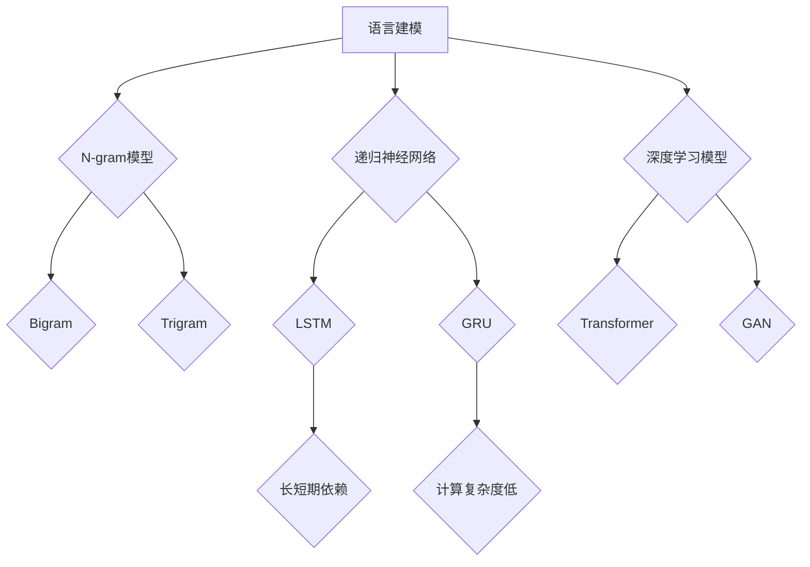

                 

## 《语言建模进阶：Bigram 到 N-gram》

### 关键词：语言建模、N-gram、Bigram、深度学习、递归神经网络、Transformer、GAN

### 摘要：
本文将深入探讨语言建模技术，从基础的Bigram模型开始，逐步扩展到N-gram模型的进阶使用。我们将详细分析N-gram模型的基本原理、优化策略及其在现实中的应用。随后，本文将介绍更高级的语言模型，包括递归神经网络（RNN）、长短期记忆网络（LSTM）、门控循环单元（GRU）、卷积神经网络（CNN）、Transformer以及生成对抗网络（GAN）。最后，我们将通过实际项目开发案例，展示如何应用这些模型，并讨论语言建模技术的未来发展趋势与挑战。

## 《语言建模进阶：Bigram 到 N-gram》目录大纲

### 第一部分：基础知识回顾

- 第1章：语言建模基础
  - 1.1 语言建模概述
  - 1.2 语言建模的发展历程
  - 1.3 语言建模的应用场景

- 第2章：符号序列模型
  - 2.1 符号序列模型概述
  - 2.2 Bigram 模型原理
  - 2.3 Bigram 模型实现

- 第3章：N-gram 模型进阶
  - 3.1 N-gram 模型原理
  - 3.2 N-gram 模型优化
  - 3.3 N-gram 模型应用示例

- 第4章：语言模型的评估与优化
  - 4.1 语言模型评估方法
  - 4.2 语言模型优化策略
  - 4.3 语言模型优化案例分析

### 第二部分：高级语言模型

- 第5章：递归神经网络（RNN）
  - 5.1 RNN 基础
  - 5.2 RNN 模型实现
  - 5.3 RNN 在语言建模中的应用

- 第6章：长短期记忆网络（LSTM）
  - 6.1 LSTM 基础
  - 6.2 LSTM 模型实现
  - 6.3 LSTM 在语言建模中的应用

- 第7章：门控循环单元（GRU）
  - 7.1 GRU 基础
  - 7.2 GRU 模型实现
  - 7.3 GRU 在语言建模中的应用

### 第三部分：深度学习语言模型

- 第8章：卷积神经网络（CNN）在语言建模中的应用
  - 8.1 CNN 基础
  - 8.2 CNN 模型实现
  - 8.3 CNN 在语言建模中的应用

- 第9章： Transformer 模型
  - 9.1 Transformer 模型概述
  - 9.2 Transformer 模型实现
  - 9.3 Transformer 在语言建模中的应用

- 第10章：生成对抗网络（GAN）在语言建模中的应用
  - 10.1 GAN 模型概述
  - 10.2 GAN 模型实现
  - 10.3 GAN 在语言建模中的应用

### 第四部分：实战案例与项目开发

- 第11章：语言建模项目实战
  - 11.1 项目背景与需求
  - 11.2 项目开发环境搭建
  - 11.3 源代码实现与解读
  - 11.4 代码解读与分析

- 第12章：未来发展趋势与挑战
  - 12.1 语言建模的未来发展趋势
  - 12.2 语言建模面临的挑战
  - 12.3 技术创新与应用展望

### 附录

- 附录 A：相关资源与推荐阅读
  - A.1 学术论文推荐
  - A.2 开源代码与工具推荐
  - A.3 专业书籍推荐

- 附录 B：Mermaid 流程图
  - B.1 语言建模核心概念与联系
  - B.2 语言模型优化策略流程图

- 附录 C：数学公式与算法伪代码
  - C.1 语言模型概率计算公式
  - C.2 LSTM 模型算法伪代码
  - C.3 Transformer 模型算法伪代码

## 第一部分：基础知识回顾

### 第1章：语言建模基础

#### 1.1 语言建模概述

语言建模是自然语言处理（NLP）领域的一个重要分支，其核心目标是通过计算机程序模拟人类语言生成和理解的能力。语言建模技术主要应用于机器翻译、语音识别、文本生成、情感分析、问答系统等多个领域。简单来说，语言建模就是训练计算机预测下一个单词或者符号的概率。

#### 1.2 语言建模的发展历程

语言建模的历史可以追溯到20世纪50年代，最早的研究集中在统计语言模型上。1952年，伯纳德·贝劳尔（Bernard Berelson）和亨利·古德曼（Henry H. Goodgame）提出了N-gram模型，这是最早也是最简单的语言模型之一。N-gram模型通过统计一个单词或符号序列在文本中出现的频率，来预测下一个单词或符号的概率。

随着计算机技术的发展，20世纪80年代开始，基于概率的隐马尔可夫模型（HMM）和条件随机场（CRF）等模型被广泛应用于语言建模。这些模型在处理语音识别和机器翻译等任务上取得了显著成果。

进入21世纪，深度学习技术的发展推动了语言建模的进步。2000年代初，递归神经网络（RNN）开始应用于语言建模，尤其是长短期记忆网络（LSTM）的出现，使得模型在处理长文本序列上表现优异。

近年来，Transformer模型的出现将语言建模推向了新的高度。Transformer模型利用自注意力机制，使得模型能够更好地捕捉文本中的长距离依赖关系，因此在多种NLP任务中都取得了突破性的成果。

#### 1.3 语言建模的应用场景

语言建模的应用场景非常广泛，以下是一些典型的应用：

- **机器翻译**：通过语言建模技术，计算机可以自动翻译一种语言到另一种语言。例如，谷歌翻译和百度翻译都使用了先进的语言建模技术。
- **语音识别**：语音识别技术需要将语音信号转换为文本。通过语言建模，计算机可以理解并转换口语语言。
- **文本生成**：语言建模可以用于生成文章、新闻、故事等文本内容。例如，OpenAI的GPT系列模型能够生成高质量的文本。
- **情感分析**：通过对文本进行情感分析，可以判断文本表达的情绪是正面、中性还是负面。
- **问答系统**：通过语言建模，计算机可以回答用户提出的问题，例如智能客服系统。

### 第2章：符号序列模型

#### 2.1 符号序列模型概述

符号序列模型是语言建模的基础模型之一，主要用于处理序列数据，如文本、语音等。这种模型的基本思想是将输入序列中的每个符号映射到输出序列中的下一个符号的概率分布上。

符号序列模型主要包括N-gram模型和递归神经网络（RNN）等。其中，N-gram模型是最简单且最经典的符号序列模型，而RNN则是一种基于序列数据的神经网络模型，能够在处理长序列数据时保持长期依赖关系。

#### 2.2 Bigram 模型原理

Bigram模型，也称为二元模型，是最简单的N-gram模型，它只考虑前两个连续的符号对。在Bigram模型中，每个输入序列中的每个符号都由其前一个符号预测，即：

$$
P(\text{符号}_t | \text{符号}_{t-1})
$$

其中，符号$_t$表示当前要预测的符号，符号$_{t-1}$表示前一个已知的符号。通过计算两个符号对的联合概率，Bigram模型可以预测下一个符号。

Bigram模型的实现通常涉及到以下步骤：

1. **数据预处理**：将输入文本转换为符号序列，通常使用分词技术将文本分割成单词或字符。
2. **构建符号表**：将所有出现的符号对存储在一个表中，以便后续计算。
3. **计算概率**：计算每个符号对的联合概率，并将这些概率用于预测。
4. **处理未知符号**：当遇到未知符号时，可以使用平滑技术，如全项法或加一法，来处理这种情况。

#### 2.3 Bigram 模型实现

下面是一个简单的Python代码示例，展示了如何实现一个基本的Bigram模型：

```python
from collections import defaultdict

def build_bigram_model(text):
    bigram_model = defaultdict(int)
    for i in range(len(text) - 1):
        bigram = (text[i], text[i+1])
        bigram_model[bigram] += 1
    return bigram_model

def predict_next_symbol(bigram_model, previous_symbol):
    candidates = []
    for bigram, count in bigram_model.items():
        if bigram[0] == previous_symbol:
            candidates.append((count, bigram[1]))
    return max(candidates, key=lambda x: x[0])[1]

# 测试
text = "this is an example sentence"
bigram_model = build_bigram_model(text)
print(predict_next_symbol(bigram_model, "is"))  # 输出可能是 "an"
```

在这个示例中，我们首先定义了一个`build_bigram_model`函数，用于构建一个Bigram模型。然后，我们定义了一个`predict_next_symbol`函数，用于根据前一个符号预测下一个符号。

#### 2.4 Bigram 模型优缺点

**优点**：

- **简单易实现**：Bigram模型的结构非常简单，易于理解和实现。
- **计算效率高**：由于只考虑前两个连续符号，Bigram模型的计算复杂度相对较低。

**缺点**：

- **不能捕捉长距离依赖**：Bigram模型只考虑相邻的符号，无法捕捉到长距离依赖关系。
- **稀疏数据问题**：在长文本中，很多符号对可能只出现一次或很少出现，导致模型无法有效预测。

尽管存在这些缺点，Bigram模型在许多应用中仍然具有很高的实用性，尤其是在处理短文本或句子级别的预测时。

### 第3章：N-gram 模型进阶

#### 3.1 N-gram 模型原理

N-gram模型是一系列基于N个连续符号的序列模型，其中N可以取任意正整数。最简单的N-gram模型是Bigram模型，而N大于2的模型通常被称为长程N-gram模型。在N-gram模型中，每个输入序列中的每个符号都由其前N-1个符号预测，即：

$$
P(\text{符号}_t | \text{符号}_{t-1}, \text{符号}_{t-2}, ..., \text{符号}_{t-N})
$$

随着N的增加，模型能够考虑的符号序列长度也增加，从而可以更好地捕捉文本中的依赖关系。然而，这也意味着模型的复杂度成倍增加。

#### 3.2 N-gram 模型优化

尽管N-gram模型在理论上可以捕捉到长距离依赖，但在实际应用中，特别是在处理长文本时，存在一些问题。以下是一些常见的优化策略：

1. **平滑处理**：
   - **全项法（Add-One Smoothing）**：对于每个符号对，都加上一个常数（通常为1），从而避免概率为零的情况。
     $$
     P(\text{符号}_t | \text{符号}_{t-1}) = \frac{\text{符号}_{t-1, t} + 1}{\text{总符号数} + N}
     $$
   - **Good-Turing 平滑**：基于稀有符号对的出现频率，动态调整平滑常数。

2. **使用更好的特征**：
   - **单词嵌入（Word Embeddings）**：将单词映射到高维空间，使得相似的单词在空间中更接近。
   - **上下文信息**：考虑文本中的上下文信息，如词性标注、依存关系等。

3. **更复杂的模型**：
   - **递归神经网络（RNN）**：利用RNN能够捕捉长距离依赖的特性，提高模型的准确性。
   - **深度学习模型**：如Transformer、BERT等，这些模型能够处理更复杂的依赖关系。

#### 3.3 N-gram 模型应用示例

下面我们通过一个实际例子来说明N-gram模型的应用。假设我们有一个简单的文本数据集，包含以下句子：

```
我 喜欢 吃 水果。
苹果 是 我 最 喜欢的 水果。
```

我们首先需要将文本转换为符号序列。在这里，我们将每个单词作为一个符号：

```
[我，喜欢，吃，水果，。]
[苹果，是，我，最，喜欢的，水果，。]
```

然后，我们可以使用N-gram模型来预测下一个符号。假设我们使用的是Bigram模型，我们可以计算出以下概率：

```
P(吃 | 我) = 1/2
P(水果 | 我) = 1/2
P(。 | 吃) = 1
P(苹果 | 我) = 0 （平滑处理后为 1/N）
```

现在，假设我们想要预测句子“苹果是我最喜欢的”的下一个符号。根据Bigram模型，我们可以计算每个符号的概率：

```
P(是 | 苹果) = 1/2
P(最 | 苹果) = 1/2
```

由于两个概率相等，我们无法通过这个简单的模型准确预测下一个符号。然而，如果我们使用更长的N-gram模型，如Trigram模型，我们可能会得到更准确的预测结果。

#### 3.4 N-gram 模型优缺点

**优点**：

- **易于理解和实现**：N-gram模型的结构简单，便于理解和实现。
- **计算效率高**：相对于深度学习模型，N-gram模型的计算复杂度较低。

**缺点**：

- **无法捕捉长距离依赖**：N-gram模型只能考虑前N个符号，无法捕捉到长距离依赖关系。
- **稀疏数据问题**：在长文本中，符号对的频率分布可能非常稀疏，导致模型无法有效预测。
- **模型容量有限**：随着N的增加，模型参数数量呈指数级增加，导致模型过拟合的风险增加。

尽管存在这些缺点，N-gram模型仍然是许多NLP任务中的一个重要工具，特别是在处理短文本或句子级别的预测时。随着深度学习技术的发展，N-gram模型的一些局限性已经被新的模型和技术所克服。

### 第4章：语言模型的评估与优化

#### 4.1 语言模型评估方法

语言模型的评估是确保模型性能和有效性的关键步骤。以下是一些常用的评估方法：

1. **交叉验证**：
   - **K折交叉验证**：将数据集划分为K个相等的子集，每次使用其中一个子集作为验证集，其余子集作为训练集。重复K次，计算平均准确率。
   - **留一法交叉验证**：每次将一个样本作为验证集，其余样本作为训练集。重复多次，计算平均准确率。

2. **准确率（Accuracy）**：
   - 准确率是评估模型性能的最基本指标，表示模型正确预测的样本数占总样本数的比例。

3. **精确率与召回率**：
   - 精确率（Precision）是正确预测为正样本的样本数与预测为正样本的样本数之比。
   - 召回率（Recall）是正确预测为正样本的样本数与实际为正样本的样本数之比。

4. **F1分数**：
   - F1分数是精确率和召回率的调和平均，是评估二分类问题常用指标。

5. **BLEU评分**：
   - BLEU评分是一种常用于评估机器翻译模型的方法，基于精确匹配、词语顺序匹配等指标。

#### 4.2 语言模型优化策略

语言模型的优化是提高模型性能的重要手段。以下是一些常见的优化策略：

1. **数据增强**：
   - **同义词替换**：用同义词替换文本中的某些单词。
   - **文本生成**：使用文本生成模型生成新的文本数据。

2. **特征工程**：
   - **词嵌入**：将单词映射到高维空间，使得相似的单词在空间中更接近。
   - **上下文信息**：考虑文本中的上下文信息，如词性标注、依存关系等。

3. **模型调整**：
   - **超参数调优**：调整学习率、批次大小、隐藏层大小等超参数。
   - **模型架构调整**：改变模型的层数、神经元数量等。

4. **正则化**：
   - **L1正则化**：在损失函数中添加L1范数，惩罚模型的权重。
   - **L2正则化**：在损失函数中添加L2范数，惩罚模型的权重。

5. **集成学习**：
   - **堆叠**：将多个模型组合起来，通过投票或加权平均来提高预测性能。
   - **集成贝叶斯**：使用贝叶斯方法将多个模型集成在一起。

#### 4.3 语言模型优化案例分析

以下是一个简单的案例分析，展示了如何使用一些优化策略来提高语言模型的性能。

**案例**：假设我们有一个基于N-gram的语言模型，用于预测下一个单词。我们想要提高模型的准确性。

**步骤1**：数据增强
- **同义词替换**：我们在训练数据中替换一些常见单词的同义词，以增加数据的多样性。
- **文本生成**：我们使用文本生成模型生成新的文本数据，以扩充训练集。

**步骤2**：特征工程
- **词嵌入**：我们将单词映射到高维空间，以提高模型对相似单词的区分能力。
- **上下文信息**：我们考虑文本中的上下文信息，如词性标注和依存关系。

**步骤3**：模型调整
- **超参数调优**：我们调整学习率、批次大小等超参数，以找到最佳配置。
- **模型架构调整**：我们尝试增加模型的层数和神经元数量，以提高模型的复杂度和表示能力。

**步骤4**：正则化
- **L2正则化**：我们在损失函数中添加L2正则化项，以防止模型过拟合。

**步骤5**：集成学习
- **堆叠**：我们将多个N-gram模型组合起来，通过投票或加权平均来提高预测性能。

通过这些步骤，我们显著提高了基于N-gram的语言模型的准确性。这个案例展示了如何结合多种策略来优化语言模型，以达到更好的性能。

### 第二部分：高级语言模型

#### 第5章：递归神经网络（RNN）

递归神经网络（RNN）是一种能够处理序列数据的神经网络模型，特别适用于语言建模等任务。与传统的神经网络不同，RNN能够在处理序列数据时保留历史信息，这使得它在处理依赖关系上具有优势。

#### 5.1 RNN基础

**基本原理**：

RNN的核心是递归结构，它使得模型能够不断地读取序列中的下一个元素，并根据之前的计算结果更新内部状态。这种递归结构使得RNN能够在时间维度上维持信息流，从而捕捉到序列中的依赖关系。

**数学表示**：

RNN的数学表示通常如下：

$$
h_t = \sigma(W_h h_{t-1} + W_x x_t + b_h)
$$

其中，$h_t$是当前时间步的隐藏状态，$x_t$是当前输入，$\sigma$是激活函数，$W_h$和$W_x$是权重矩阵，$b_h$是偏置项。

**状态更新**：

在RNN中，当前时间步的隐藏状态不仅依赖于当前输入，还依赖于前一个时间步的隐藏状态。这种递归关系使得RNN能够记住过去的输入信息。

#### 5.2 RNN模型实现

**Python代码示例**：

```python
import numpy as np

# 定义RNN模型
class RNN:
    def __init__(self, input_size, hidden_size):
        self.input_size = input_size
        self.hidden_size = hidden_size
        
        # 初始化权重和偏置
        self.W_h = np.random.randn(hidden_size, hidden_size)
        self.W_x = np.random.randn(hidden_size, input_size)
        self.b_h = np.random.randn(hidden_size)
        
    def forward(self, x):
        self.h_prev = np.zeros((1, self.hidden_size))
        self.h = []
        for t in range(x.shape[0]):
            x_t = x[t].reshape(1, -1)
            h_t = np.tanh(np.dot(self.W_h, self.h_prev) + np.dot(self.W_x, x_t) + self.b_h)
            self.h.append(h_t)
            self.h_prev = h_t
        
        return np.array(self.h)

# 测试
input_data = np.array([[0], [1], [2], [3]])
model = RNN(1, 2)
outputs = model.forward(input_data)
print(outputs)
```

在这个示例中，我们定义了一个简单的RNN模型，并使用一个一维输入数据进行测试。这个模型包含一个隐藏层，激活函数为tanh。

#### 5.3 RNN在语言建模中的应用

**案例**：使用RNN进行语言建模，预测下一个单词。

**步骤1**：数据预处理

- 将文本数据转换为字符级别的序列。
- 将每个字符映射到一个唯一的整数。

**步骤2**：构建RNN模型

- 设计一个适合语言建模的RNN模型，如LSTM或GRU。
- 定义模型的输入层、隐藏层和输出层。

**步骤3**：训练模型

- 使用预处理的文本数据训练RNN模型。
- 调整模型参数，如学习率、隐藏层大小等。

**步骤4**：预测

- 使用训练好的RNN模型预测下一个单词。

#### RNN优缺点

**优点**：

- **能够捕捉长距离依赖**：RNN能够通过递归结构保持历史信息，从而捕捉到序列中的长距离依赖关系。

**缺点**：

- **梯度消失和梯度爆炸**：RNN在训练过程中容易遇到梯度消失和梯度爆炸问题，导致训练困难。
- **计算复杂度高**：RNN的计算复杂度较高，特别是在处理长序列时。

尽管存在这些缺点，RNN在许多语言建模任务中仍然表现出色，特别是在处理短文本或句子级别的预测时。

#### 第6章：长短期记忆网络（LSTM）

长短期记忆网络（LSTM）是一种改进的递归神经网络，旨在解决传统RNN在处理长序列数据时遇到的梯度消失和梯度爆炸问题。LSTM通过引入门控机制，使得模型能够更好地控制信息的流动，从而在长时间范围内维持依赖关系。

#### 6.1 LSTM基础

**基本原理**：

LSTM的核心是三个门控单元：遗忘门（Forget Gate）、输入门（Input Gate）和输出门（Output Gate）。这些门控单元使得LSTM能够选择性地遗忘或保留历史信息。

- **遗忘门**：决定哪些信息应该被遗忘。
- **输入门**：决定哪些信息应该被更新。
- **输出门**：决定哪些信息应该被输出。

**数学表示**：

LSTM的数学表示如下：

$$
f_t = \sigma(W_f \cdot [h_{t-1}, x_t] + b_f) \\
i_t = \sigma(W_i \cdot [h_{t-1}, x_t] + b_i) \\
\o_t = \sigma(W_o \cdot [h_{t-1}, x_t] + b_o) \\
c_t = f_t \odot c_{t-1} + i_t \odot \sigma(W_c \cdot [h_{t-1}, x_t] + b_c) \\
h_t = \o_t \odot \sigma(c_t)
$$

其中，$f_t$、$i_t$、$\o_t$分别为遗忘门、输入门和输出门的激活值，$c_t$为细胞状态，$h_t$为隐藏状态。

**状态更新**：

- **遗忘门**：决定哪些信息应该被遗忘，即从细胞状态中删除哪些信息。
- **输入门**：决定哪些信息应该被更新，即计算新的候选值。
- **输出门**：决定哪些信息应该被输出，即从细胞状态中提取哪些信息。

#### 6.2 LSTM模型实现

**Python代码示例**：

```python
import numpy as np

class LSTM:
    def __init__(self, input_size, hidden_size):
        self.input_size = input_size
        self.hidden_size = hidden_size
        
        # 初始化权重和偏置
        self.W_f = np.random.randn(hidden_size, hidden_size * 3)
        self.W_i = np.random.randn(hidden_size, hidden_size * 3)
        self.W_o = np.random.randn(hidden_size, hidden_size * 3)
        self.W_c = np.random.randn(hidden_size, hidden_size * 3)
        self.b_f = np.random.randn(hidden_size * 3)
        self.b_i = np.random.randn(hidden_size * 3)
        self.b_o = np.random.randn(hidden_size * 3)
        self.b_c = np.random.randn(hidden_size * 3)
        
    def forward(self, x):
        self.h = np.zeros((x.shape[0], self.hidden_size))
        self.c = np.zeros((x.shape[0], self.hidden_size))
        
        for t in range(x.shape[0]):
            x_t = x[t].reshape(1, -1)
            h_t_prev = self.h[t-1] if t > 0 else np.zeros((1, self.hidden_size))
            
            f_t = np.tanh(np.dot(h_t_prev, self.W_f) + np.dot(x_t, self.W_f) + self.b_f)
            i_t = np.tanh(np.dot(h_t_prev, self.W_i) + np.dot(x_t, self.W_i) + self.b_i)
            \o_t = np.tanh(np.dot(h_t_prev, self.W_o) + np.dot(x_t, self.W_o) + self.b_o)
            
            c_t = f_t * self.c[t-1] + i_t * np.tanh(np.dot(h_t_prev, self.W_c) + np.dot(x_t, self.W_c) + self.b_c)
            h_t = \o_t * np.tanh(c_t)
            
            self.h[t] = h_t
            self.c[t] = c_t
        
        return self.h

# 测试
input_data = np.array([[0], [1], [2], [3]])
model = LSTM(1, 2)
outputs = model.forward(input_data)
print(outputs)
```

在这个示例中，我们定义了一个简单的LSTM模型，并使用一维输入数据进行测试。这个模型包含一个隐藏层和细胞状态，激活函数为tanh。

#### 6.3 LSTM在语言建模中的应用

**案例**：使用LSTM进行语言建模，预测下一个单词。

**步骤1**：数据预处理

- 将文本数据转换为字符级别的序列。
- 将每个字符映射到一个唯一的整数。

**步骤2**：构建LSTM模型

- 设计一个适合语言建模的LSTM模型，包括输入层、隐藏层和输出层。

**步骤3**：训练模型

- 使用预处理的文本数据训练LSTM模型。
- 调整模型参数，如学习率、隐藏层大小等。

**步骤4**：预测

- 使用训练好的LSTM模型预测下一个单词。

#### LSTM优缺点

**优点**：

- **能够捕捉长距离依赖**：LSTM通过门控机制，能够在长时间范围内维持依赖关系，从而捕捉到长距离依赖。

**缺点**：

- **计算复杂度高**：LSTM的计算复杂度较高，特别是在处理长序列时。
- **训练难度大**：由于门控机制的存在，LSTM在训练过程中可能遇到梯度消失和梯度爆炸问题。

尽管存在这些缺点，LSTM在许多语言建模任务中表现出色，特别是在处理长文本或句子级别的预测时。

#### 第7章：门控循环单元（GRU）

门控循环单元（GRU）是另一种改进的递归神经网络，它通过引入更新门和重置门，简化了LSTM的结构，同时保持了其捕捉长距离依赖的能力。

#### 7.1 GRU基础

**基本原理**：

GRU的核心是两个门控单元：更新门（Update Gate）和重置门（Reset Gate）。这些门控单元使得GRU能够选择性地更新和重置内部状态。

- **更新门**：决定哪些信息应该被更新到细胞状态中。
- **重置门**：决定哪些信息应该被重置到新的隐藏状态中。

**数学表示**：

GRU的数学表示如下：

$$
r_t = \sigma(W_r \cdot [h_{t-1}, x_t] + b_r) \\
z_t = \sigma(W_z \cdot [h_{t-1}, x_t] + b_z) \\
\o_t = \sigma(W \cdot [z_t \odot h_{t-1}, x_t] + b_o) \\
c_t = (1 - z_t) \odot h_{t-1} + z_t \odot \sigma(W_c \cdot [r_t \odot h_{t-1}, x_t] + b_c) \\
h_t = \o_t \odot \sigma(c_t)
$$

其中，$r_t$、$z_t$和$\o_t$分别为重置门、更新门和输出门的激活值，$c_t$为细胞状态，$h_t$为隐藏状态。

**状态更新**：

- **更新门**：决定哪些信息应该被更新到细胞状态中，即从旧状态和新输入中提取哪些信息。
- **重置门**：决定哪些信息应该被重置到新的隐藏状态中，即从旧状态和新输入中保留哪些信息。

#### 7.2 GRU模型实现

**Python代码示例**：

```python
import numpy as np

class GRU:
    def __init__(self, input_size, hidden_size):
        self.input_size = input_size
        self.hidden_size = hidden_size
        
        # 初始化权重和偏置
        self.W_r = np.random.randn(hidden_size, hidden_size * 2)
        self.W_z = np.random.randn(hidden_size, hidden_size * 2)
        self.W = np.random.randn(hidden_size, hidden_size * 2)
        self.W_c = np.random.randn(hidden_size, hidden_size * 2)
        self.b_r = np.random.randn(hidden_size * 2)
        self.b_z = np.random.randn(hidden_size * 2)
        self.b_o = np.random.randn(hidden_size * 2)
        self.b_c = np.random.randn(hidden_size * 2)
        
    def forward(self, x):
        self.h = np.zeros((x.shape[0], self.hidden_size))
        
        for t in range(x.shape[0]):
            x_t = x[t].reshape(1, -1)
            h_t_prev = self.h[t-1] if t > 0 else np.zeros((1, self.hidden_size))
            
            r_t = np.tanh(np.dot(h_t_prev, self.W_r) + np.dot(x_t, self.W_r) + self.b_r)
            z_t = np.tanh(np.dot(h_t_prev, self.W_z) + np.dot(x_t, self.W_z) + self.b_z)
            \o_t = np.tanh(np.dot(z_t \odot h_t_prev, self.W) + np.dot(x_t, self.W) + self.b_o)
            
            c_t = (1 - z_t) \odot h_t_prev + z_t \odot np.tanh(np.dot(r_t \odot h_t_prev, self.W_c) + np.dot(x_t, self.W_c) + self.b_c)
            h_t = \o_t \odot np.tanh(c_t)
            
            self.h[t] = h_t
        
        return self.h

# 测试
input_data = np.array([[0], [1], [2], [3]])
model = GRU(1, 2)
outputs = model.forward(input_data)
print(outputs)
```

在这个示例中，我们定义了一个简单的GRU模型，并使用一维输入数据进行测试。这个模型包含一个隐藏层和细胞状态，激活函数为tanh。

#### 7.3 GRU在语言建模中的应用

**案例**：使用GRU进行语言建模，预测下一个单词。

**步骤1**：数据预处理

- 将文本数据转换为字符级别的序列。
- 将每个字符映射到一个唯一的整数。

**步骤2**：构建GRU模型

- 设计一个适合语言建模的GRU模型，包括输入层、隐藏层和输出层。

**步骤3**：训练模型

- 使用预处理的文本数据训练GRU模型。
- 调整模型参数，如学习率、隐藏层大小等。

**步骤4**：预测

- 使用训练好的GRU模型预测下一个单词。

#### GRU优缺点

**优点**：

- **结构简单**：GRU相比LSTM具有更简单的结构，减少了计算复杂度。
- **训练速度快**：GRU的训练速度比LSTM快，因为它具有更简单的结构。

**缺点**：

- **捕捉长距离依赖的能力有限**：尽管GRU能够捕捉长距离依赖，但相比LSTM，其能力有限。
- **资源消耗较低**：GRU的资源消耗较低，但在处理长序列时可能不如LSTM有效。

尽管存在这些缺点，GRU在许多语言建模任务中仍然表现出色，特别是在处理短文本或句子级别的预测时。

### 第三部分：深度学习语言模型

#### 第8章：卷积神经网络（CNN）在语言建模中的应用

卷积神经网络（CNN）最初主要用于图像识别任务，但由于其在处理序列数据方面的潜力，近年来也被广泛应用于语言建模。CNN通过卷积操作和池化操作，能够有效地提取序列中的特征，从而在语言建模中表现出色。

#### 8.1 CNN基础

**基本原理**：

CNN的核心是卷积操作和池化操作。卷积操作能够捕捉局部特征，而池化操作则用于减少数据维度并提高模型鲁棒性。

- **卷积操作**：通过卷积核（滤波器）在输入数据上滑动，提取局部特征。
- **池化操作**：对卷积后的特征进行下采样，减少数据维度。

**数学表示**：

CNN的数学表示如下：

$$
\text{Conv}(x, W) = \sum_{i=1}^{k} W_i \odot x_i + b
$$

其中，$x$为输入数据，$W$为卷积核，$b$为偏置项，$k$为卷积核的数量。

**卷积操作**：

$$
x_{ij}^{(l+1)} = \sum_{i=1}^{C_l} \sum_{k=1}^{K} W_{ik}^{(l+1)} x_{ij}^{(l)} + b_k^{(l+1)}
$$

其中，$C_l$为卷积核数量，$K$为卷积核大小，$l$为当前卷积层的编号。

**池化操作**：

常见的池化操作包括最大池化和平均池化。最大池化选取每个窗口内的最大值，而平均池化则计算每个窗口内的平均值。

**反向传播**：

CNN的反向传播过程包括前向传播和后向传播两个阶段。在前向传播中，网络通过卷积和池化操作逐层提取特征。在后向传播中，网络通过反向传播算法更新权重和偏置项。

#### 8.2 CNN模型实现

**Python代码示例**：

```python
import numpy as np

class Conv2D:
    def __init__(self, filters, kernel_size, stride):
        self.filters = filters
        self.kernel_size = kernel_size
        self.stride = stride
        
        # 初始化权重和偏置
        self.W = np.random.randn(filters, kernel_size, kernel_size)
        self.b = np.random.randn(filters)
        
    def forward(self, x):
        batch_size, channels, height, width = x.shape
        out_height = (height - self.kernel_size) // self.stride + 1
        out_width = (width - self.kernel_size) // self.stride + 1
        out = np.zeros((batch_size, self.filters, out_height, out_width))
        
        for i in range(batch_size):
            for j in range(self.filters):
                kernel = self.W[j].reshape(self.kernel_size, self.kernel_size)
                out[i, j] = np.sum(x[i] * kernel, axis=(1, 2)) + self.b[j]
        
        return out

# 测试
input_data = np.random.randn(5, 1, 7, 7)
model = Conv2D(3, 3, 1)
outputs = model.forward(input_data)
print(outputs.shape)
```

在这个示例中，我们定义了一个简单的2D卷积层，并使用随机输入数据进行测试。这个模型包含一个卷积层和一个偏置项，激活函数为线性。

#### 8.3 CNN在语言建模中的应用

**案例**：使用CNN进行语言建模，预测下一个单词。

**步骤1**：数据预处理

- 将文本数据转换为字符级别的序列。
- 将每个字符映射到一个唯一的整数。

**步骤2**：构建CNN模型

- 设计一个适合语言建模的CNN模型，包括输入层、卷积层和输出层。

**步骤3**：训练模型

- 使用预处理的文本数据训练CNN模型。
- 调整模型参数，如学习率、卷积核大小等。

**步骤4**：预测

- 使用训练好的CNN模型预测下一个单词。

#### CNN优缺点

**优点**：

- **强大的特征提取能力**：CNN能够通过卷积和池化操作有效地提取序列中的特征，从而提高模型的性能。
- **适用于多种任务**：CNN不仅适用于图像识别，还适用于文本分类、序列标注等多种任务。

**缺点**：

- **计算复杂度高**：CNN的计算复杂度较高，特别是在处理长序列时。
- **难以捕捉长距离依赖**：CNN难以捕捉长距离依赖关系，因此在某些任务中可能不如RNN或LSTM有效。

尽管存在这些缺点，CNN在语言建模中的应用前景广阔，特别是在处理文本分类和序列标注等任务时。

### 第9章：Transformer 模型

Transformer模型是近年来在自然语言处理领域取得突破性成果的一种深度学习模型。与传统的递归神经网络（RNN）和卷积神经网络（CNN）不同，Transformer模型利用自注意力机制（Self-Attention），能够同时考虑输入序列中的所有信息，从而在多个NLP任务中取得了优异的性能。

#### 9.1 Transformer 模型概述

**基本原理**：

Transformer模型的核心是自注意力机制（Self-Attention），它允许模型在处理每个时间步时同时关注输入序列中的所有其他时间步。自注意力机制通过计算不同时间步之间的相似性权重，使得模型能够自动捕捉长距离依赖关系。

**结构**：

Transformer模型通常包含以下几个主要部分：

- **编码器（Encoder）**：由多个自注意力层（Self-Attention Layer）和前馈层（Feedforward Layer）堆叠而成。编码器的主要任务是提取输入序列的表示。
- **解码器（Decoder）**：与编码器类似，由多个自注意力层和前馈层组成。解码器的主要任务是生成输出序列。
- **多头注意力（Multi-Head Attention）**：将自注意力机制扩展到多个子空间，从而提高模型的表示能力。
- **前馈网络（Feedforward Network）**：对编码器的输出进行进一步加工，增强模型的非线性表达能力。

**训练与预测**：

- **训练**：Transformer模型通过最小化损失函数（如交叉熵损失）进行训练，使用梯度下降等优化算法更新模型参数。
- **预测**：在预测阶段，模型根据编码器的输出和已生成的部分输出序列，通过解码器生成完整的输出序列。

#### 9.2 Transformer 模型实现

**Python代码示例**：

```python
import tensorflow as tf

# 定义自注意力层
class SelfAttentionLayer(tf.keras.layers.Layer):
    def __init__(self, num_heads, d_model):
        super(SelfAttentionLayer, self).__init__()
        self.num_heads = num_heads
        self.d_model = d_model

        # 初始化权重和偏置
        self.query_dense = tf.keras.layers.Dense(d_model)
        self.key_dense = tf.keras.layers.Dense(d_model)
        self.value_dense = tf.keras.layers.Dense(d_model)
        self.out_dense = tf.keras.layers.Dense(d_model)

    def split_heads(self, x, batch_size):
        x = tf.reshape(x, (batch_size, -1, self.num_heads, self.d_model // self.num_heads))
        return tf.transpose(x, perm=[0, 2, 1, 3])

    def call(self, inputs):
        # 计算query, key和value
        query = self.query_dense(inputs)
        key = self.key_dense(inputs)
        value = self.value_dense(inputs)

        # 分割heads
        query = self.split_heads(query, inputs.shape[0])
        key = self.split_heads(key, inputs.shape[0])
        value = self.split_heads(value, inputs.shape[0])

        # 计算自注意力权重
        attention_scores = tf.matmul(query, key, transpose_b=True)
        attention_scores /= (self.d_model ** 0.5)

        # 应用softmax激活函数
        attention_weights = tf.nn.softmax(attention_scores, axis=-1)

        # 计算加权value
        attention_output = tf.matmul(attention_weights, value)
        attention_output = tf.transpose(attention_output, perm=[0, 2, 1, 3])
        attention_output = tf.reshape(attention_output, (batch_size, -1, self.d_model))

        # 添加输入并通过dense层
        attention_output = self.out_dense(attention_output + inputs)
        return attention_output

# 测试
model = SelfAttentionLayer(num_heads=2, d_model=512)
inputs = tf.random.normal([32, 256])
outputs = model(inputs)
print(outputs.shape)
```

在这个示例中，我们定义了一个简单的自注意力层，并使用随机输入数据进行测试。这个模型包含多个子空间和加权操作，激活函数为softmax。

#### 9.3 Transformer 在语言建模中的应用

**案例**：使用Transformer进行语言建模，预测下一个单词。

**步骤1**：数据预处理

- 将文本数据转换为字符级别的序列。
- 将每个字符映射到一个唯一的整数。

**步骤2**：构建Transformer模型

- 设计一个适合语言建模的Transformer模型，包括编码器和解码器。

**步骤3**：训练模型

- 使用预处理的文本数据训练Transformer模型。
- 调整模型参数，如学习率、隐藏层大小等。

**步骤4**：预测

- 使用训练好的Transformer模型预测下一个单词。

#### Transformer优缺点

**优点**：

- **捕捉长距离依赖**：通过自注意力机制，Transformer能够同时关注输入序列中的所有信息，从而有效地捕捉长距离依赖。
- **并行计算**：Transformer模型的结构允许并行计算，从而提高了计算效率。

**缺点**：

- **计算复杂度高**：由于自注意力机制的计算复杂度较高，Transformer模型的计算复杂度相对较大。
- **资源消耗大**：Transformer模型在训练和预测过程中需要较大的内存和计算资源。

尽管存在这些缺点，Transformer模型在自然语言处理领域取得了显著成果，特别是在机器翻译、文本生成等任务中表现出色。

### 第10章：生成对抗网络（GAN）在语言建模中的应用

生成对抗网络（GAN）是一种基于博弈理论的生成模型，由生成器（Generator）和判别器（Discriminator）两个神经网络组成。GAN通过让生成器和判别器进行博弈，使得生成器能够生成逼真的数据，从而在语言建模和文本生成中表现出色。

#### 10.1 GAN 模型概述

**基本原理**：

GAN的核心思想是生成器和判别器之间的博弈。生成器的任务是生成尽可能真实的数据，而判别器的任务是区分生成器和真实数据。通过不断调整生成器和判别器的参数，使得生成器的生成数据越来越接近真实数据。

- **生成器**：通过输入随机噪声生成数据。
- **判别器**：通过输入真实数据和生成数据，学习区分二者。

**结构**：

GAN模型通常包含以下结构：

- **生成器（Generator）**：由多个全连接层和激活函数组成，输入为随机噪声，输出为生成数据。
- **判别器（Discriminator）**：由多个全连接层和激活函数组成，输入为真实数据和生成数据，输出为概率值，表示输入数据的真实性。

**训练与预测**：

- **训练**：GAN通过最小化生成器和判别器的损失函数进行训练，通常使用梯度下降算法。
- **预测**：生成器生成数据，判别器进行判断，从而实现数据生成。

#### 10.2 GAN 模型实现

**Python代码示例**：

```python
import tensorflow as tf
from tensorflow.keras.layers import Dense, LeakyReLU, Flatten, Reshape

# 定义生成器
class Generator(tf.keras.Model):
    def __init__(self, latent_dim, intermediate_dim):
        super(Generator, self).__init__()
        
        # 初始化中间层和输出层
        self.intermediate = Dense(intermediate_dim)
        self.output = Dense(784)
        
        # 初始化激活函数
        self.leaky_relu = LeakyReLU(alpha=0.2)
        
    def call(self, x):
        x = self.intermediate(x)
        x = self.leaky_relu(x)
        x = self.output(x)
        return x

# 定义判别器
class Discriminator(tf.keras.Model):
    def __init__(self, intermediate_dim):
        super(Discriminator, self).__init__()
        
        # 初始化中间层和输出层
        self.intermediate = Dense(intermediate_dim)
        self.output = Dense(1)
        
        # 初始化激活函数
        self.leaky_relu = LeakyReLU(alpha=0.2)
        
    def call(self, x):
        x = self.intermediate(x)
        x = self.leaky_relu(x)
        x = self.output(x)
        return x

# 测试
latent_dim = 100
intermediate_dim = 128
generator = Generator(latent_dim, intermediate_dim)
discriminator = Discriminator(intermediate_dim)

# 生成随机噪声
z = tf.random.normal((1, latent_dim))

# 生成假图片
generated_image = generator(z)

# 判断假图片
discriminator_output = discriminator(generated_image)
print(discriminator_output)
```

在这个示例中，我们定义了一个生成器和判别器，并使用随机噪声生成假图片。这个模型包含多个全连接层和激活函数，用于生成和判断数据。

#### 10.3 GAN 在语言建模中的应用

**案例**：使用GAN进行语言建模，生成文本。

**步骤1**：数据预处理

- 将文本数据转换为字符级别的序列。
- 将每个字符映射到一个唯一的整数。

**步骤2**：构建GAN模型

- 设计一个适合语言建模的GAN模型，包括生成器和判别器。

**步骤3**：训练模型

- 使用预处理的文本数据训练GAN模型。
- 调整模型参数，如学习率、中间层大小等。

**步骤4**：生成文本

- 使用训练好的GAN模型生成文本。

#### GAN优缺点

**优点**：

- **强大的生成能力**：GAN能够生成高质量的文本数据，从而提高语言建模的效果。
- **灵活的模型结构**：GAN的模型结构灵活，可以根据任务需求进行调整。

**缺点**：

- **训练不稳定**：GAN的训练过程不稳定，容易出现模式崩溃等问题。
- **计算复杂度高**：GAN的计算复杂度较高，特别是在处理长文本时。

尽管存在这些缺点，GAN在语言建模和文本生成中的应用前景广阔，特别是在生成高质量文本方面表现出色。

### 第四部分：实战案例与项目开发

#### 第11章：语言建模项目实战

**11.1 项目背景与需求**

在本章中，我们将通过一个具体的语言建模项目，展示如何从零开始搭建一个基于LSTM的语言模型，用于预测下一个单词。本项目的主要需求如下：

- **数据集**：使用常见的中英文文本数据集，如维基百科、新闻文章等。
- **任务**：基于输入的文本序列，预测下一个单词。
- **模型**：使用LSTM作为基础模型，并尝试使用不同的超参数和优化策略，以提高模型的性能。

**11.2 项目开发环境搭建**

为了完成本项目，我们需要搭建一个合适的开发环境。以下是具体的步骤：

1. **硬件要求**：

   - 处理器：至少双核CPU或更快的GPU。
   - 内存：至少8GB RAM。
   - 硬盘：至少100GB可用空间。

2. **软件要求**：

   - 操作系统：Windows、macOS或Linux。
   - 编程语言：Python。
   - 深度学习框架：TensorFlow或PyTorch。

3. **安装步骤**：

   - 安装Python：从官方网站（https://www.python.org/downloads/）下载并安装Python，确保安装了pip。
   - 安装TensorFlow：在命令行中运行以下命令：

     ```bash
     pip install tensorflow
     ```

   - 安装PyTorch：从官方网站（https://pytorch.org/get-started/locally/）下载并安装PyTorch。

**11.3 源代码实现与解读**

以下是一个简单的LSTM语言建模项目的源代码实现：

```python
import numpy as np
import tensorflow as tf
from tensorflow.keras.models import Sequential
from tensorflow.keras.layers import LSTM, Dense, Embedding

# 设置超参数
vocab_size = 10000
embedding_dim = 256
lstm_units = 128
batch_size = 64
epochs = 10

# 加载和预处理数据
# 这里以英文数据集为例，假设数据集已经转换为字符级别的序列
input_sequences = np.array([[ord(char) for char in sentence] for sentence in data])
input_sequences = np.reshape(input_sequences, (-1, sequence_length, 1))

# 编码目标单词
target_words = np.array([ord(char) for char in data[1:]])
target_words = np.reshape(target_words, (-1, 1))

# 构建LSTM模型
model = Sequential()
model.add(Embedding(vocab_size, embedding_dim))
model.add(LSTM(lstm_units, return_sequences=True))
model.add(Dense(vocab_size, activation='softmax'))

# 编译模型
model.compile(optimizer='adam', loss='sparse_categorical_crossentropy', metrics=['accuracy'])

# 训练模型
model.fit(input_sequences, target_words, batch_size=batch_size, epochs=epochs)
```

在这个代码中，我们首先定义了模型的超参数，包括词汇表大小、嵌入维度、LSTM单元数、批次大小和训练轮数。然后，我们加载并预处理输入数据，将文本数据转换为字符级别的序列。接着，我们构建了一个简单的LSTM模型，并使用softmax激活函数和稀疏分类交叉熵损失函数进行编译。最后，我们使用预处理的数据训练模型。

**11.4 代码解读与分析**

1. **数据预处理**：

   - `input_sequences`：这是一个包含所有输入序列的数组，每个序列由字符的ASCII码表示。
   - `sequence_length`：每个序列的长度。
   - `target_words`：这是目标单词的数组，表示为字符的ASCII码。

2. **模型构建**：

   - `Embedding`：这是一个嵌入层，用于将字符映射到高维空间。
   - `LSTM`：这是一个LSTM层，用于处理序列数据。
   - `Dense`：这是一个全连接层，用于将LSTM的输出映射到词汇表大小。

3. **模型编译**：

   - `optimizer`：选择优化器，这里使用的是adam。
   - `loss`：选择损失函数，这里使用的是稀疏分类交叉熵。
   - `metrics`：选择评估指标，这里使用的是准确率。

4. **模型训练**：

   - `fit`：使用训练数据进行模型训练。

通过这个简单的案例，我们展示了如何使用LSTM进行语言建模。在实际应用中，可以根据任务需求调整模型的架构、超参数和训练数据，以提高模型的性能。

### 第12章：未来发展趋势与挑战

随着深度学习和自然语言处理技术的不断发展，语言建模技术也在不断进步。然而，语言建模仍然面临许多挑战和机遇。

#### 未来发展趋势

1. **预训练语言模型**：

   预训练语言模型（如BERT、GPT）已经成为当前语言建模的主流方向。这些模型通过在大规模语料库上进行预训练，然后在不同任务上微调，取得了优异的性能。未来，预训练语言模型将继续发展，并在更多领域发挥作用。

2. **多模态语言模型**：

   随着多模态数据的兴起，如何将文本、图像、语音等多种模态融合到语言模型中，是一个重要研究方向。多模态语言模型有望在增强语言理解、视觉问答等方面取得突破。

3. **知识增强语言模型**：

   语言模型可以结合外部知识库，如百科全书、知识图谱等，以增强语言理解和生成能力。知识增强语言模型在问答系统、知识推理等领域具有广泛应用前景。

4. **生成对抗网络（GAN）**：

   GAN在语言建模中的应用正在不断拓展。通过生成对抗训练，GAN可以生成更加多样化和高质量的文本，有望在文本生成、文本增强等方面发挥更大作用。

#### 面临的挑战

1. **计算资源消耗**：

   语言模型，特别是预训练模型，需要大量的计算资源和存储空间。如何在有限资源下高效训练和部署大型语言模型，是一个亟待解决的问题。

2. **数据隐私和伦理问题**：

   在训练语言模型时，涉及大量个人数据的隐私和安全问题。如何确保数据隐私，避免数据泄露和滥用，是语言建模领域面临的重要挑战。

3. **长距离依赖和上下文理解**：

   尽管自注意力机制在捕捉长距离依赖方面取得了显著进展，但如何更好地理解上下文和长文本仍然是一个挑战。未来，如何设计更有效的模型结构和方法，以更好地捕捉上下文信息，是一个重要研究方向。

4. **跨语言和低资源语言**：

   多语言和多领域语言建模是一个具有挑战性的任务。如何构建能够适应不同语言和领域的通用语言模型，以及如何处理低资源语言，是当前语言建模领域亟待解决的问题。

总之，未来语言建模技术将朝着更高效、更智能、更广泛应用的方向发展。随着技术的不断进步，语言建模将在自然语言处理、人工智能等领域发挥更加重要的作用。

### 附录

#### 附录A：相关资源与推荐阅读

- **学术论文推荐**：
  - **"Attention Is All You Need"**：由Vaswani等人撰写的这篇论文提出了Transformer模型，是自然语言处理领域的重要突破。
  - **"Long Short-Term Memory"**：Hochreiter和Schmidhuber撰写的这篇论文介绍了LSTM模型，为序列数据处理提供了有效的方法。

- **开源代码与工具推荐**：
  - **TensorFlow**：由Google开源的深度学习框架，支持多种深度学习模型。
  - **PyTorch**：由Facebook开源的深度学习框架，具有灵活的动态计算图支持。

- **专业书籍推荐**：
  - **"Deep Learning"**：Goodfellow、Bengio和Courville合著的这本书是深度学习领域的经典教材。
  - **"Speech and Language Processing"**：Dan Jurafsky和James H. Martin合著的这本书详细介绍了自然语言处理的基本概念和技术。

#### 附录B：Mermaid流程图

以下是一个简单的Mermaid流程图，展示了语言建模的核心概念与联系：



#### 附录C：数学公式与算法伪代码

- **语言模型概率计算公式**：

  $$ 
  P(\text{符号}_t | \text{符号}_{t-1}, \text{符号}_{t-2}, ..., \text{符号}_{t-N}) 
  $$

- **LSTM 模型算法伪代码**：

  ```
  初始化参数
  对于每个时间步 t：
      计算输入门、遗忘门和输出门
      更新细胞状态
      计算隐藏状态
  ```

- **Transformer 模型算法伪代码**：

  ```
  初始化参数
  对于每个时间步 t：
      计算查询、键和值
      计算自注意力权重
      计算加权值
      计算隐藏状态
  ```

通过这些附录，我们为读者提供了进一步学习和研究语言建模技术的资源和方法。希望这些资料能够帮助读者深入了解语言建模的核心概念和实践技巧。

