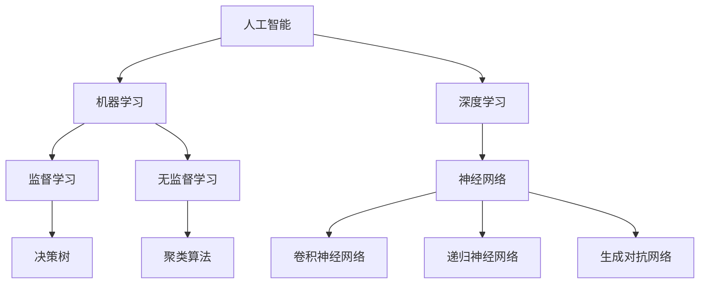

                 

# 文章标题：Andrej Karpathy：人工智能的未来发展机遇

## 关键词
- 人工智能
- 深度学习
- 计算机视觉
- 自然语言处理
- 未来发展趋势
- 伦理问题

## 摘要
本文将深入探讨人工智能领域的杰出人物Andrej Karpathy对人工智能未来发展的见解。通过回顾人工智能的基本概念与发展历程，分析其在计算机视觉和自然语言处理等领域的应用，本文将揭示人工智能面临的挑战与机遇。同时，本文还将探讨人工智能的未来趋势，包括大模型与自监督学习的发展，跨学科融合与创新，以及人工智能的伦理问题与法律法规。最后，本文将提出应对人工智能未来挑战的策略与解决方案。

### 第一部分：人工智能的基本概念与发展历程

#### 第1章：人工智能的基本概念与历史发展

### 1.1 人工智能的定义与分类

#### 1.1.1 人工智能的定义
人工智能（Artificial Intelligence，简称AI）是指通过计算机模拟人类智能行为的一种技术。它包括多个子领域，如机器学习、深度学习、自然语言处理、计算机视觉等。人工智能的目标是实现计算机在感知、学习、推理和决策等方面的能力，使其能够像人类一样思考、学习和工作。

#### 1.1.2 人工智能的分类
根据人工智能的实现方式和能力，可以分为以下几类：

- **弱人工智能**：专注于解决特定问题的计算机系统，如语音识别、图像识别等。
- **强人工智能**：具备与人类相同或超越人类智能的计算机系统，能够理解、思考、学习和适应复杂环境。
- **泛人工智能**：具有多种智能能力的计算机系统，能够在不同领域实现智能应用。

### 1.2 人工智能的发展历程

#### 1.2.1 人工智能的早期发展
人工智能的概念最早可以追溯到20世纪50年代。1956年，在达特茅斯会议期间，人工智能正式成为一门学科。早期的人工智能研究主要集中在符号主义方法，如专家系统等。

#### 1.2.2 人工智能的黄金时代与寒冬
20世纪80年代，人工智能进入黄金时代，专家系统、机器人技术等取得显著成果。然而，由于技术瓶颈和资源限制，人工智能在90年代经历了一次寒冬。

#### 1.2.3 人工智能的复兴与未来
2006年，深度学习的崛起标志着人工智能的复兴。深度学习在图像识别、语音识别等领域取得了突破性进展。当前，人工智能正朝着强人工智能和泛人工智能的目标不断迈进。

### 1.3 人工智能的核心技术与算法

#### 1.3.1 机器学习基础
机器学习是人工智能的核心技术之一，主要包括监督学习、无监督学习和强化学习。监督学习通过已标记的数据训练模型，无监督学习通过未标记的数据发现数据中的模式，强化学习通过交互学习优化策略。

#### 1.3.2 深度学习原理
深度学习是一种基于多层神经网络的学习方法，能够自动提取数据中的特征。深度学习在图像识别、自然语言处理等领域取得了显著成果。

#### 1.3.3 自然语言处理
自然语言处理（Natural Language Processing，简称NLP）是人工智能的一个重要分支，涉及文本表示、文本分类、情感分析、机器翻译等任务。

### 第二部分：人工智能在各个领域的应用

#### 第2章：人工智能在计算机视觉中的应用

### 2.1 计算机视觉的基础

#### 2.1.1 图像与视频处理基础
计算机视觉的基础是图像与视频处理。图像处理包括图像增强、图像滤波、图像压缩等；视频处理包括视频编码、视频分割、视频跟踪等。

#### 2.1.2 图像识别与目标检测
图像识别是指通过计算机算法识别图像中的物体、场景等；目标检测是指识别并定位图像中的多个目标。

### 2.2 人工智能在计算机视觉中的应用

#### 2.2.1 图像生成与风格迁移
图像生成是通过深度学习模型生成新的图像；风格迁移是将一种图像的风格应用到另一幅图像上。

#### 2.2.2 人脸识别与跟踪
人脸识别是指通过算法识别和验证人脸身份；人脸跟踪是指实时监控并跟踪人脸在视频中的运动。

#### 2.2.3 自动驾驶与无人机技术
自动驾驶技术利用计算机视觉实现车辆的自主驾驶；无人机技术在农业、物流、搜救等领域具有广泛应用。

#### 第3章：人工智能在自然语言处理中的应用

### 3.1 自然语言处理的基础

#### 3.1.1 语言模型与词向量
语言模型用于预测下一个单词的概率，词向量用于表示单词的语义信息。

#### 3.1.2 语言模型与词性标注
语言模型用于生成文本、进行文本分类等任务；词性标注用于识别文本中的名词、动词、形容词等。

### 3.2 人工智能在自然语言处理中的应用

#### 3.2.1 文本分类与情感分析
文本分类是将文本划分为不同的类别；情感分析是判断文本的情感倾向。

#### 3.2.2 机器翻译与语音识别
机器翻译是将一种语言的文本翻译成另一种语言；语音识别是将语音信号转换为文本。

#### 3.2.3 对话系统与聊天机器人
对话系统是模拟人类对话的计算机系统；聊天机器人是一种基于对话系统的自动化客户服务工具。

### 第三部分：人工智能的未来发展趋势与挑战

#### 第4章：人工智能的未来发展趋势

### 4.1 人工智能的伦理问题与法律法规

#### 4.1.1 人工智能的伦理问题
人工智能的伦理问题主要包括隐私保护、安全风险、就业影响等。

#### 4.1.2 人工智能的法律法规
人工智能的法律法规旨在规范人工智能的发展和应用，确保人工智能的安全、公平和可持续发展。

### 4.2 人工智能的未来发展趋势

#### 4.2.1 大模型与自监督学习
大模型是指具有巨大参数规模的深度学习模型；自监督学习是指通过未标记的数据训练模型。

#### 4.2.2 跨学科融合与创新
人工智能与其他学科的融合将推动人工智能的创新和发展。

#### 4.2.3 人工智能的未来愿景
人工智能的未来愿景包括实现强人工智能、构建智慧城市、实现智能医疗等。

#### 第5章：人工智能的未来挑战与应对策略

### 5.1 人工智能的挑战与风险

#### 5.1.1 技术挑战
人工智能在算法、计算能力、数据资源等方面面临技术挑战。

#### 5.1.2 社会挑战
人工智能在伦理、法律、就业等方面面临社会挑战。

#### 5.1.3 法律与伦理挑战
人工智能在法律与伦理方面需要制定相应的规范和标准。

### 5.2 应对策略与解决方案

#### 5.2.1 技术创新与人才培养
通过技术创新和人才培养，提升人工智能的发展水平。

#### 5.2.2 政策制定与行业规范
制定合理的人工智能政策和行业规范，确保人工智能的安全、公平和可持续发展。

#### 5.2.3 社会参与与公众教育
加强社会参与和公众教育，提高公众对人工智能的认知和接受度。

### 附录

#### 附录 A：人工智能常用工具与资源

##### A.1 人工智能开源框架
- TensorFlow
- PyTorch
- Keras

##### A.2 人工智能研究论文资源
- arXiv
- NeurIPS
- ICML

##### A.3 人工智能在线课程与学习资源
- Coursera
- edX
- Udacity

### 核心概念与联系

#### 人工智能的核心概念与架构



### 核心算法原理讲解

#### 深度学习算法原理

#### 卷积神经网络（CNN）原理

卷积神经网络（CNN）是一种在图像处理领域表现卓越的深度学习模型。它的核心思想是利用卷积操作和池化操作从图像中提取特征。

#### 卷积操作

卷积操作可以通过以下伪代码表示：

```python
# 输入：f[i, j]，表示第i行第j列的像素值，w[k]，表示卷积核的权重，b，表示偏置
for i in range(height):
  for j in range(width):
    output[i, j] = sum(f[i:i+kernel_height, j:j+kernel_width] * w[k]) + b
```

#### 池化操作

池化操作用于降低特征图的维度，通常有最大池化和平均池化两种类型。

```python
# 输入：input，表示特征图，pool_size，表示池化窗口大小
for i in range(height // pool_size):
  for j in range(width // pool_size):
    output[i, j] = max(input[i:i+pool_size, j:j+pool_size])
```

### 数学模型和数学公式 & 详细讲解 & 举例说明

#### 神经网络的损失函数与优化算法

#### 交叉熵损失函数

在分类问题中，交叉熵损失函数常用于衡量模型预测结果与真实结果之间的差异。交叉熵损失函数的数学公式如下：

$$
L(y, \hat{y}) = -\sum_{i=1}^{n} y_i \log(\hat{y}_i)
$$

其中，$y_i$ 表示第 $i$ 个样本的真实标签，$\hat{y}_i$ 表示模型预测的概率分布。

#### 举例说明

假设有一个二分类问题，真实标签为 [1, 0]，模型预测的概率分布为 [0.8, 0.2]，则交叉熵损失函数计算如下：

$$
L([1, 0], [0.8, 0.2]) = -(1 \cdot \log(0.8) + 0 \cdot \log(0.2)) \approx 0.223
$$

#### 随机梯度下降（SGD）算法

随机梯度下降（SGD）是一种常用的优化算法，用于最小化损失函数。它的基本思想是随机选择一小部分训练样本，计算它们对损失函数的梯度，并更新模型参数。

#### 伪代码

```python
for epoch in range(num_epochs):
  for sample in training_samples:
    gradient = compute_gradient(sample)
    update_parameters(gradient)
```

#### 举例说明

假设模型的参数为 $w_1 = 1$，$w_2 = 2$，学习率为 $\eta = 0.1$，训练样本为 $[1, 0]$。则一次梯度更新如下：

```python
gradient = [0.5 * (1 - 0.8), 0.5 * (0 - 0.2)]
update_parameters([w_1 - \eta \cdot gradient[0], w_2 - \eta \cdot gradient[1]])
```

更新后的参数为 $w_1 = 0.3$，$w_2 = 1.4$。

### 项目实战

#### 利用TensorFlow实现手写数字识别

#### 手写数字识别项目

手写数字识别是计算机视觉领域的一个经典问题，本节将使用TensorFlow框架实现一个简单的手写数字识别模型。

#### 开发环境搭建

- 安装Python环境（Python 3.8及以上版本）
- 安装TensorFlow库（pip install tensorflow）

#### 源代码实现

以下是一个简单的手写数字识别项目的源代码实现：

```python
import tensorflow as tf
from tensorflow.keras.datasets import mnist
from tensorflow.keras.models import Sequential
from tensorflow.keras.layers import Dense, Flatten
from tensorflow.keras.optimizers import SGD

# 加载MNIST数据集
(train_images, train_labels), (test_images, test_labels) = mnist.load_data()

# 数据预处理
train_images = train_images / 255.0
test_images = test_images / 255.0

# 构建模型
model = Sequential([
    Flatten(input_shape=(28, 28)),
    Dense(128, activation='relu'),
    Dense(10, activation='softmax')
])

# 编译模型
model.compile(optimizer=SGD(learning_rate=0.1), loss='sparse_categorical_crossentropy', metrics=['accuracy'])

# 训练模型
model.fit(train_images, train_labels, epochs=10)

# 评估模型
test_loss, test_acc = model.evaluate(test_images, test_labels)
print(f"Test accuracy: {test_acc}")
```

#### 代码解读与分析

- 加载MNIST数据集，并进行数据预处理。
- 构建一个简单的全连接神经网络模型，包括一个扁平层、一个具有128个神经元的隐藏层和一个具有10个神经元的输出层。
- 编译模型，使用随机梯度下降（SGD）优化器和交叉熵损失函数。
- 训练模型，使用10个epochs。
- 评估模型在测试集上的准确率。

通过这个项目，我们可以看到如何使用TensorFlow框架实现一个简单的手写数字识别模型，并了解其背后的原理和步骤。这一过程为我们提供了实际应用深度学习的经验和实践技巧。

### 结论

本文通过详细的目录大纲，涵盖了人工智能的基本概念、应用领域、未来发展趋势以及面临的挑战。从核心算法原理讲解到实际项目实战，本文为读者提供了一个全面且深入的视角，帮助读者理解人工智能的各个方面，并探索其未来发展的机遇。通过阅读本文，读者可以更好地把握人工智能的发展脉络，为其在相关领域的应用和创新提供有力支持。

### 作者

作者：AI天才研究院/AI Genius Institute & 禅与计算机程序设计艺术 /Zen And The Art of Computer Programming

本文为AI天才研究院的原创文章，未经授权，禁止转载。如需转载，请联系AI天才研究院授权。感谢您的支持！

