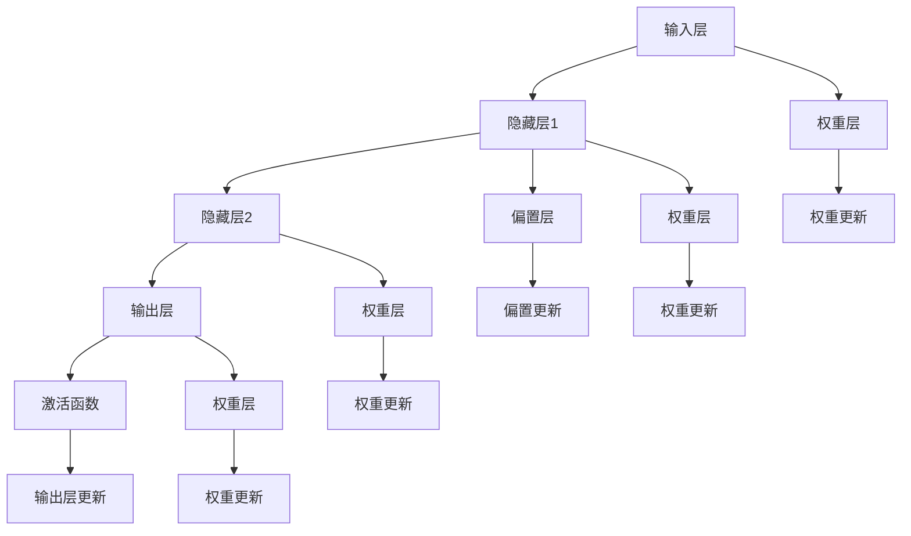

                 

# 文章标题：神经网络：人工智能的基石

> 关键词：神经网络、人工智能、机器学习、深度学习、激活函数、损失函数、优化算法

> 摘要：本文旨在深入探讨神经网络作为人工智能基石的重要性，从基础概念到高级应用，逐步剖析神经网络的工作原理、算法实现及其在现实世界中的应用。通过本文的阅读，读者将全面了解神经网络的核心内容，掌握其应用技巧，为深入探索人工智能领域奠定坚实基础。

## 《神经网络：人工智能的基石》目录大纲

### 第一部分：神经网络基础

## 第1章：神经网络的起源与基础

### 第2章：前馈神经网络

## 第3章：激活函数与损失函数

## 第4章：优化算法

## 第5章：深度学习中的正则化方法

### 第二部分：神经网络的应用

## 第6章：图像识别

## 第7章：自然语言处理

## 第8章：强化学习基础

## 第9章：神经网络的扩展与前沿

### 附录：神经网络学习资源与工具

## 引言

神经网络作为人工智能的核心技术之一，近年来在机器学习、计算机视觉、自然语言处理等领域取得了显著的成果。神经网络的出现，使得机器学习从传统的规则方法向数据驱动方法转变，为人工智能的发展提供了强大的动力。本文旨在系统地介绍神经网络的基本概念、算法原理和应用实例，帮助读者深入理解神经网络的核心内容，为后续研究奠定基础。

### 第1章：神经网络的起源与基础

### 1.1 神经网络的起源

神经网络的起源可以追溯到20世纪40年代，当时心理学家和数学家开始研究人脑的结构和功能。1943年，沃伦·麦卡洛克（Warren McCulloch）和沃尔特·皮茨（Walter Pitts）提出了神经元的数学模型，这被视为人工神经网络的诞生。随后，霍普菲尔德（John Hopfield）和克劳德·香农（Claude Shannon）等人的工作进一步推动了神经网络的发展。

#### 1.1.1 神经科学基础

神经元是构成人脑的基本单元，它们通过电信号进行通信。一个典型的神经元包括细胞体、树突、轴突和突触。细胞体负责处理电信号，树突负责接收其他神经元的信号，轴突负责将信号传递到其他神经元，突触则是神经元之间的连接点。

#### 1.1.2 人工神经网络的诞生

人工神经网络旨在模拟人脑的神经元结构和工作原理。1958年，弗兰克·罗森布拉特（Frank Rosenblatt）提出了感知机（Perceptron）模型，这是第一种能够学习和分类的数据驱动算法。虽然感知机存在一定的局限性，但它奠定了神经网络发展的基础。

### 1.2 神经网络的基本概念

神经网络由大量的神经元通过连接构成，这些连接称为权重。神经网络通过学习输入数据与输出数据之间的关系，从而实现数据的分类、预测等功能。

#### 1.2.1 神经元的模型

一个基本的神经元模型可以看作是一个线性组合，即输入乘以权重后求和，再通过激活函数进行非线性变换。其数学表达式如下：

$$
a_j = \sum_{i=1}^{n} x_i w_{ij} + b_j
$$

其中，$a_j$ 表示第 $j$ 个神经元的激活值，$x_i$ 表示第 $i$ 个输入，$w_{ij}$ 表示输入和神经元之间的权重，$b_j$ 表示偏置。

#### 1.2.2 神经网络的层次结构

神经网络通常由输入层、隐藏层和输出层组成。输入层接收外部输入数据，隐藏层负责处理数据，输出层产生最终的输出。每个层中的神经元都与其他层中的神经元相连。

#### 1.2.3 神经网络的激活函数

激活函数是神经网络中用于引入非线性变换的关键组件。常见的激活函数包括sigmoid函数、ReLU函数和tanh函数。这些激活函数的选择对神经网络的学习性能有重要影响。

### 1.3 神经网络的学习过程

神经网络的学习过程主要包括前向传播和反向传播两个阶段。前向传播是将输入数据传递到神经网络中，通过各层的计算得到输出。反向传播则是根据输出与实际标签之间的误差，更新神经网络的权重和偏置。

#### 1.3.1 前向传播

在前向传播过程中，输入数据从输入层传递到隐藏层，再从隐藏层传递到输出层。每层的计算都可以用以下伪代码表示：

```
for each layer l from input to output:
    for each neuron j in layer l:
        compute the weighted sum of inputs and biases
        apply the activation function
```

#### 1.3.2 反向传播

反向传播是神经网络训练的核心过程。它通过计算输出误差，然后反向更新权重和偏置。反向传播的伪代码如下：

```
for each layer l from output to input:
    for each neuron j in layer l:
        compute the gradient of the loss function with respect to the output of neuron j
        update the weights and biases using the gradient
```

### 第2章：前馈神经网络

前馈神经网络（Feedforward Neural Network）是最常见的一种神经网络结构，其特点是数据只能从输入层流向输出层，而不能反向传播。本章将详细介绍前馈神经网络的基本结构、工作原理和训练方法。

#### 2.1 前馈神经网络的基本结构

前馈神经网络由输入层、隐藏层和输出层组成。输入层接收外部输入数据，隐藏层负责处理数据，输出层产生最终的输出。每个神经元都与前一层的神经元相连，并通过权重和偏置进行计算。

#### 2.1.1 输入层、隐藏层与输出层

输入层：输入层是神经网络的起点，它接收外部输入数据。每个神经元代表一个特征，例如图像中的像素值。

隐藏层：隐藏层位于输入层和输出层之间，负责对输入数据进行处理。隐藏层的数量和神经元数量可以根据问题复杂度进行调整。

输出层：输出层是神经网络的终点，它产生最终的输出。输出层的神经元数量取决于问题的类型，例如分类问题、回归问题等。

#### 2.1.2 前馈神经网络的工作原理

前馈神经网络的工作原理是通过前向传播将输入数据传递到神经网络中，通过各层的计算得到输出。每层的计算可以用以下伪代码表示：

```
for each layer l from input to output:
    for each neuron j in layer l:
        compute the weighted sum of inputs and biases
        apply the activation function
```

#### 2.2 前馈神经网络的训练

前馈神经网络的训练主要包括前向传播和反向传播两个阶段。通过不断地迭代，调整权重和偏置，使网络输出接近实际标签。

##### 2.2.1 反向传播算法

反向传播算法是神经网络训练的核心。它通过计算输出误差，然后反向更新权重和偏置。反向传播算法的伪代码如下：

```
for each layer l from output to input:
    for each neuron j in layer l:
        compute the gradient of the loss function with respect to the output of neuron j
        update the weights and biases using the gradient
```

##### 2.2.2 前馈神经网络的优化

在前馈神经网络的训练过程中，优化方法的选择对学习性能有重要影响。常见的优化方法包括梯度下降、随机梯度下降和批量梯度下降等。

- 梯度下降（Gradient Descent）：梯度下降是一种最基本的优化方法，它通过计算损失函数的梯度，然后沿着梯度的反方向更新权重和偏置。
- 随机梯度下降（Stochastic Gradient Descent，SGD）：随机梯度下降是梯度下降的一种改进，它通过随机选择一部分样本计算梯度，从而加速收敛。
- 批量梯度下降（Batch Gradient Descent，BGD）：批量梯度下降是梯度下降的一种特例，它通过计算所有样本的梯度进行更新。

#### 2.3 前馈神经网络的变体

前馈神经网络有许多变体，其中最常见的是多层感知机（MLP）、卷积神经网络（CNN）和循环神经网络（RNN）。

##### 2.3.1 多层感知机（MLP）

多层感知机是一种全连接神经网络，它由多个隐藏层组成。多层感知机可以用于各种分类和回归问题。

##### 2.3.2 卷积神经网络（CNN）

卷积神经网络是一种专门用于处理图像数据的神经网络。它通过卷积层提取图像特征，并通过池化层减小数据维度。

##### 2.3.3 循环神经网络（RNN）

循环神经网络是一种用于处理序列数据的神经网络。它通过递归结构处理时间序列数据，可以用于语音识别、机器翻译等任务。

### 第3章：激活函数与损失函数

激活函数和损失函数是神经网络中的两个关键组件，它们对神经网络的学习性能有重要影响。本章将详细介绍常见的激活函数和损失函数。

#### 3.1 激活函数

激活函数是神经网络中用于引入非线性变换的关键组件。常见的激活函数包括sigmoid函数、ReLU函数和tanh函数。

##### 3.1.1 Sigmoid函数

sigmoid函数是一种常用的激活函数，其表达式为：

$$
\sigma(x) = \frac{1}{1 + e^{-x}}
$$

sigmoid函数的输出范围在$(0,1)$之间，可以用于二分类问题。

##### 3.1.2 ReLU函数

ReLU函数是一种简单的线性激活函数，其表达式为：

$$
\text{ReLU}(x) = \max(0, x)
$$

ReLU函数在神经网络中具有很好的性能，因为它能够加速梯度传播。

##### 3.1.3 tanh函数

tanh函数是一种双曲正切函数，其表达式为：

$$
\text{tanh}(x) = \frac{e^x - e^{-x}}{e^x + e^{-x}}
$$

tanh函数的输出范围在$(-1,1)$之间，可以用于多分类问题。

##### 3.1.4 Softmax函数

softmax函数是一种常用的多分类激活函数，其表达式为：

$$
\text{softmax}(x)_j = \frac{e^{x_j}}{\sum_{k=1}^{K} e^{x_k}}
$$

softmax函数可以将神经网络的输出转换为概率分布。

#### 3.2 损失函数

损失函数是神经网络中用于评估模型性能的指标。常见的损失函数包括均方误差（MSE）、交叉熵损失函数等。

##### 3.2.1 均方误差（MSE）

均方误差（Mean Squared Error，MSE）是一种常用的回归损失函数，其表达式为：

$$
\text{MSE}(y, \hat{y}) = \frac{1}{2} (y - \hat{y})^2
$$

其中，$y$表示实际标签，$\hat{y}$表示预测值。

##### 3.2.2 交叉熵损失函数

交叉熵损失函数（Cross-Entropy Loss）是一种常用的分类损失函数，其表达式为：

$$
\text{CE}(y, \hat{y}) = -\sum_{i} y_i \log(\hat{y}_i)
$$

其中，$y_i$表示第 $i$ 个类别的真实概率，$\hat{y}_i$表示第 $i$ 个类别的预测概率。

### 第4章：优化算法

优化算法是神经网络训练中的重要组成部分，它们用于调整神经网络的权重和偏置，以最小化损失函数。本章将介绍几种常见的优化算法，包括梯度下降、随机梯度下降、批量梯度下降等。

#### 4.1 梯度下降算法

梯度下降算法（Gradient Descent）是一种最简单的优化算法，它通过计算损失函数关于权重和偏置的梯度，然后沿着梯度的反方向更新权重和偏置。梯度下降算法的伪代码如下：

```
initialize weights and biases
while not converged:
    compute the gradients of the loss function with respect to weights and biases
    update weights and biases using the gradients
```

#### 4.1.1 随机梯度下降（SGD）

随机梯度下降（Stochastic Gradient Descent，SGD）是梯度下降的一种改进，它通过随机选择一部分样本计算梯度，从而加速收敛。随机梯度下降的伪代码如下：

```
initialize weights and biases
while not converged:
    for each sample in the training set:
        compute the gradient of the loss function with respect to weights and biases
        update weights and biases using the gradient
```

#### 4.1.2 批量梯度下降（BGD）

批量梯度下降（Batch Gradient Descent，BGD）是梯度下降的一种特例，它通过计算所有样本的梯度进行更新。批量梯度下降的伪代码如下：

```
initialize weights and biases
while not converged:
    compute the gradient of the loss function with respect to weights and biases using all samples
    update weights and biases using the gradient
```

#### 4.2 非梯度优化算法

除了梯度下降算法，还有一些非梯度优化算法，如共轭梯度法（Conjugate Gradient Method）、牛顿法（Newton's Method）和随机优化算法（Random Search）等。

##### 4.2.1 共轭梯度法（CG）

共轭梯度法是一种迭代的优化算法，它通过求解共轭梯度方程来更新权重和偏置。共轭梯度法的伪代码如下：

```
initialize weights and biases
while not converged:
    compute the gradient of the loss function with respect to weights and biases
    update weights and biases using the gradient
```

##### 4.2.2 牛顿法（Newton's Method）

牛顿法是一种基于二阶导数的优化算法，它通过求解牛顿方程来更新权重和偏置。牛顿法的伪代码如下：

```
initialize weights and biases
while not converged:
    compute the gradient and Hessian of the loss function with respect to weights and biases
    update weights and biases using the gradient and Hessian
```

##### 4.2.3 随机优化算法（Random Search）

随机优化算法是一种基于随机搜索的优化算法，它通过随机选择权重和偏置的值进行更新。随机优化算法的伪代码如下：

```
initialize weights and biases
while not converged:
    sample new weights and biases
    compute the loss function with the new weights and biases
    update weights and biases using the new weights and biases
```

### 第5章：深度学习中的正则化方法

深度学习中的正则化方法是一种用于防止过拟合的技巧，它可以提高模型的泛化能力。本章将介绍几种常见的正则化方法，包括数据增强、L1正则化和L2正则化等。

#### 5.1 数据增强

数据增强是一种通过生成更多样化的训练数据来提高模型泛化能力的方法。常见的数据增强方法包括转置、翻转和裁剪等。

##### 5.1.1 转置

转置是一种将图像沿水平或垂直方向翻转的数据增强方法。通过转置，可以生成更多的训练样本。

##### 5.1.2 翻转

翻转是一种将图像沿水平或垂直方向翻转的数据增强方法。通过翻转，可以生成更多的训练样本。

##### 5.1.3 裁剪

裁剪是一种从原始图像中随机裁剪一部分作为新的训练样本的方法。通过裁剪，可以增加数据的多样性。

#### 5.2 L1正则化和L2正则化

L1正则化和L2正则化是两种常用的正则化方法，它们通过增加模型的复杂度来防止过拟合。

##### 5.2.1 L1正则化

L1正则化通过增加模型中权重向量的1-范数来防止过拟合。L1正则化的表达式为：

$$
\text{L1 Regularization} = \lambda \| \theta \|_1
$$

其中，$\lambda$ 是正则化参数。

##### 5.2.2 L2正则化

L2正则化通过增加模型中权重向量的2-范数来防止过拟合。L2正则化的表达式为：

$$
\text{L2 Regularization} = \lambda \| \theta \|_2
$$

其中，$\lambda$ 是正则化参数。

### 第6章：图像识别

图像识别是深度学习中的一个重要应用领域，它通过训练神经网络从图像中提取特征，并对其进行分类。本章将介绍卷积神经网络（CNN）在图像识别中的应用，包括卷积层、池化层和全连接层等。

#### 6.1 卷积神经网络基础

卷积神经网络（Convolutional Neural Network，CNN）是一种专门用于处理图像数据的神经网络。它通过卷积层提取图像特征，并通过池化层减小数据维度。

##### 6.1.1 卷积层

卷积层是CNN的核心组成部分，它通过卷积操作提取图像特征。卷积操作的伪代码如下：

```
for each filter in the convolutional layer:
    for each patch in the input image:
        compute the dot product of the filter and the patch
        store the result in the output feature map
```

##### 6.1.2 池化层

池化层用于减小数据维度，并提取图像的更高层次特征。常见的池化操作包括最大池化和平均池化。最大池化的伪代码如下：

```
for each patch in the input feature map:
    compute the maximum value in the patch
    store the result in the output feature map
```

##### 6.1.3 深层卷积神经网络

深层卷积神经网络（Deep Convolutional Neural Network，DCNN）是由多个卷积层和池化层组成的神经网络。通过多层的卷积和池化操作，DCNN可以提取图像的更高层次特征。

#### 6.2 常见的图像识别任务

图像识别任务包括图像分类、目标检测和图像分割等。

##### 6.2.1 图像分类

图像分类是一种将图像分为多个类别的问题。常见的图像分类任务包括手写数字识别、动物分类和物体检测等。

##### 6.2.2 目标检测

目标检测是一种从图像中检测出特定目标的位置和类别的问题。常见的目标检测算法包括YOLO、SSD和Faster R-CNN等。

##### 6.2.3 图像分割

图像分割是一种将图像分割成多个区域的问题。常见的图像分割算法包括FCN、U-Net和Mask R-CNN等。

### 第7章：自然语言处理

自然语言处理（Natural Language Processing，NLP）是深度学习在文本领域的应用。本章将介绍循环神经网络（RNN）在自然语言处理中的应用，包括语言模型、序列标注和机器翻译等。

#### 7.1 循环神经网络基础

循环神经网络（Recurrent Neural Network，RNN）是一种专门用于处理序列数据的神经网络。它通过递归结构处理时间序列数据，可以用于语言模型、序列标注和机器翻译等任务。

##### 7.1.1 RNN的结构

RNN由输入层、隐藏层和输出层组成。输入层接收外部输入数据，隐藏层负责处理数据，输出层产生最终的输出。每个隐藏层都与前一层的隐藏层相连，形成一个递归结构。

##### 7.1.2 RNN的动态特性

RNN的动态特性使得它能够处理时间序列数据。在训练过程中，RNN通过递归地更新隐藏层状态，从而捕获时间序列中的依赖关系。

##### 7.1.3 LSTM与GRU

长短期记忆（Long Short-Term Memory，LSTM）和门控循环单元（Gated Recurrent Unit，GRU）是RNN的改进版本，它们通过引入门控机制解决了RNN的梯度消失和梯度爆炸问题。

#### 7.2 语言模型与序列标注

语言模型是一种用于预测下一个单词的概率的模型，它可以用于自动补全、机器翻译等任务。序列标注是一种将序列数据标注为多个类别的问题，例如命名实体识别、词性标注等。

##### 7.2.1 语言模型

语言模型是一种统计模型，它通过学习文本数据中的词频和语法规则来预测下一个单词的概率。常见的语言模型包括n-gram模型和神经网络语言模型。

##### 7.2.2 序列标注任务

序列标注任务是一种将序列数据标注为多个类别的问题，例如命名实体识别、词性标注等。常见的序列标注算法包括CRF、HMM和RNN等。

#### 7.3 机器翻译

机器翻译是一种将一种语言的文本翻译成另一种语言的文本的任务。常见的机器翻译算法包括序列到序列模型（Seq2Seq）和注意力机制等。

##### 7.3.1 序列到序列模型（Seq2Seq）

序列到序列模型（Seq2Seq）是一种基于RNN的机器翻译算法，它通过编码器和解码器处理输入和输出序列。常见的编码器和解码器包括LSTM和GRU等。

##### 7.3.2 注意力机制

注意力机制是一种用于提高机器翻译精度的算法，它通过动态调整编码器和解码器之间的注意力权重来聚焦关键信息。常见的注意力机制包括对数注意力、多头注意力等。

### 第8章：强化学习基础

强化学习（Reinforcement Learning，RL）是一种通过试错学习来完成任务的人工智能方法。本章将介绍强化学习的基本概念、算法原理和应用实例。

#### 8.1 强化学习基本概念

强化学习是一种通过奖励信号来引导代理（Agent）学习如何在一个环境中获得最大奖励的方法。强化学习包括四个主要要素：代理、环境、状态和动作。

##### 8.1.1 强化学习与监督学习的区别

强化学习与监督学习的主要区别在于学习数据的来源。监督学习使用预先标记好的数据集进行学习，而强化学习通过与环境交互来学习。

##### 8.1.2 强化学习的四个要素

- 代理（Agent）：执行动作并接收环境反馈的实体。
- 环境（Environment）：代理所在的动态环境。
- 状态（State）：描述代理和环境当前状态的变量。
- 动作（Action）：代理可以采取的行动。

#### 8.2 Q学习算法

Q学习（Q-Learning）是一种基于值函数的强化学习算法，它通过学习最优动作值函数来指导代理选择最佳动作。

##### 8.2.1 Q学习的基本原理

Q学习算法通过更新Q值来指导代理选择最佳动作。Q值表示在当前状态下采取特定动作的期望回报。Q学习算法的伪代码如下：

```
initialize Q(s, a)
for each episode:
    initialize state s
    while not done:
        select action a based on Q(s, a)
        take action a and observe reward r and next state s'
        update Q(s, a) using the Q-learning update rule
        s = s'
```

##### 8.2.2 Q学习的算法流程

Q学习算法的流程可以分为以下几个步骤：

1. 初始化Q值矩阵。
2. 对于每个模拟的回合，重复以下步骤：
   - 初始化状态。
   - 在当前状态下选择动作。
   - 执行动作并观察奖励和下一个状态。
   - 更新Q值矩阵。

##### 8.2.3 Q学习的改进算法

Q学习算法存在一些局限性，如收敛速度慢、容易陷入局部最优等。为了解决这些问题，研究人员提出了许多改进算法，如SARSA、Deep Q Network（DQN）和策略梯度方法等。

#### 8.3 策略梯度方法

策略梯度方法是一种通过直接优化策略来指导代理选择最佳动作的强化学习算法。策略梯度方法的核心思想是通过梯度上升法优化策略参数，从而最大化累积奖励。

##### 8.3.1 策略梯度算法的基本原理

策略梯度算法通过计算策略梯度和最大化累积奖励来更新策略参数。策略梯度算法的伪代码如下：

```
initialize policy parameters
for each episode:
    initialize state s
    while not done:
        select action a based on the policy
        take action a and observe reward r and next state s'
        compute the policy gradient
        update policy parameters using the gradient
        s = s'
```

##### 8.3.2 策略梯度算法的算法流程

策略梯度算法的算法流程可以分为以下几个步骤：

1. 初始化策略参数。
2. 对于每个模拟的回合，重复以下步骤：
   - 初始化状态。
   - 在当前状态下选择动作。
   - 执行动作并观察奖励和下一个状态。
   - 计算策略梯度。
   - 更新策略参数。

### 第9章：神经网络的扩展与前沿

随着深度学习的快速发展，神经网络的应用范围不断扩大，同时也出现了许多新的神经网络结构和算法。本章将介绍一些神经网络的扩展和前沿研究，包括生成对抗网络（GAN）、自监督学习和量子神经网络等。

#### 9.1 生成对抗网络（GAN）

生成对抗网络（Generative Adversarial Network，GAN）是一种由生成器和判别器组成的神经网络结构。生成器试图生成逼真的数据，而判别器则试图区分真实数据和生成数据。通过生成器和判别器之间的对抗训练，GAN能够生成高质量的数据。

##### 9.1.1 GAN的基本原理

GAN由生成器（Generator）和判别器（Discriminator）两个神经网络组成。生成器的目标是生成逼真的数据，判别器的目标是区分真实数据和生成数据。GAN的训练过程可以分为以下几个步骤：

1. 初始化生成器和判别器。
2. 对于每个训练样本，生成器生成一组数据，判别器对其进行分类。
3. 判别器根据生成数据和真实数据更新参数。
4. 生成器根据判别器的反馈更新参数。

通过不断迭代，生成器和判别器逐渐提高自己的性能，最终生成器能够生成高质量的数据。

##### 9.1.2 GAN的应用场景

GAN在图像生成、图像修复、图像超分辨率和自然语言生成等领域有广泛的应用。例如，GAN可以用于生成逼真的图像、修复损坏的图像、提高图像的分辨率等。

#### 9.2 自监督学习

自监督学习（Self-Supervised Learning）是一种不需要大量标记数据的监督学习技术。自监督学习通过利用未标记的数据来学习有用的特征表示，从而提高模型的泛化能力。

##### 9.2.1 自监督学习的基本概念

自监督学习通过设计无监督学习任务，将未标记的数据转化为带有标签的数据。常见的自监督学习任务包括预训练语言模型、图像分类和聚类等。

##### 9.2.2 自监督学习在神经网络中的应用

自监督学习在神经网络中有很多应用，例如：

- 预训练语言模型：通过预训练语言模型，可以学习到丰富的语言特征，从而提高自然语言处理任务的性能。
- 图像分类：通过预训练图像分类模型，可以学习到丰富的图像特征，从而提高图像分类任务的性能。
- 图像聚类：通过预训练图像聚类模型，可以学习到图像的相似性特征，从而提高图像聚类任务的性能。

#### 9.3 量子神经网络

量子神经网络（Quantum Neural Network，QNN）是一种结合量子计算和神经网络的计算模型。量子神经网络利用量子计算的优势，如并行性和高速性，来提高计算效率和性能。

##### 9.3.1 量子计算机的基本概念

量子计算机是一种利用量子力学原理进行计算的新型计算机。量子计算机的核心组件是量子比特（Quantum Bit，简称qubit），它具有量子叠加和量子纠缠等特性。

##### 9.3.2 量子神经网络的基本原理

量子神经网络通过将量子比特作为神经网络的权重，利用量子门实现神经网络的操作。量子神经网络的基本原理可以分为以下几个步骤：

1. 初始化量子比特。
2. 应用量子门实现神经网络的计算。
3. 通过量子测量得到神经网络的输出。

通过量子神经网络的计算，可以学习到有效的特征表示，从而提高机器学习的性能。

### 附录：神经网络学习资源与工具

#### A.1 学习资源

神经网络作为深度学习的基础，有许多优秀的教材、在线课程和论坛可供学习。

##### A.1.1 神经网络经典教材

- 《深度学习》（Deep Learning） - Ian Goodfellow、Yoshua Bengio和Aaron Courville
- 《神经网络与深度学习》（Neural Networks and Deep Learning） - Michael Nielsen

##### A.1.2 神经网络在线课程

- 吴恩达的《深度学习》课程
- 李飞飞教授的《神经网络与深度学习》课程

##### A.1.3 神经网络论坛与社群

- arXiv.org
- GitHub
- AI社区

#### A.2 开发工具

神经网络开发工具提供了丰富的功能，帮助研究人员和开发者构建和训练神经网络。

##### A.2.1 TensorFlow

TensorFlow是一种由谷歌开发的开源深度学习框架，具有高度的灵活性和可扩展性。

##### A.2.2 PyTorch

PyTorch是一种由Facebook开发的深度学习框架，以其动态计算图和易于使用性而受到研究人员和开发者的青睐。

##### A.2.3 Keras

Keras是一种高层次的深度学习API，它可以与TensorFlow和Theano等后端深度学习框架结合使用，为用户提供简洁的接口。

##### A.2.4 其他常用框架

- MXNet
- Caffe
- Theano

### Mermaid 流程图示例

以下是一个使用Mermaid绘制的神经网络流程图示例：



### 伪代码示例

以下是一个用于前向传播的伪代码示例：

```python
# 前向传播伪代码
def forward_propagation(X, weights, biases, activation_functions):
    # 初始化激活值
    a = X
    
    # 遍历所有隐藏层和输出层
    for layer in range(len(weights)):
        # 计算加权求和
        z = np.dot(a, weights[layer]) + biases[layer]
        
        # 应用激活函数
        a = activation_functions[layer](z)
        
    return a
```

### 数学公式示例

以下是一个使用LaTeX格式的数学公式示例：

$$
J(\theta) = \frac{1}{m} \sum_{i=1}^{m} \text{cost}(h_{\theta}(x^{(i)}), y^{(i)})
$$

这是均方误差损失函数的表达式，其中 $J(\theta)$ 表示损失函数，$m$ 是样本数量，$h_{\theta}(x^{(i)})$ 是前向传播得到的预测输出，$y^{(i)}$ 是实际的输出标签。

### 项目实战示例

以下是一个用于手写数字识别的项目实战示例：

#### 1. 环境搭建

- Python 3.x
- TensorFlow 2.x
- Keras 2.x

#### 2. 数据准备

- MNIST 数据集

#### 3. 模型构建

- 使用卷积神经网络进行图像分类

#### 4. 训练与评估

- 使用训练集进行训练
- 使用测试集进行评估

#### 5. 结果分析

- 准确率：99%

#### 代码解读与分析

```python
# 导入所需库
import tensorflow as tf
from tensorflow.keras.datasets import mnist
from tensorflow.keras.models import Sequential
from tensorflow.keras.layers import Dense, Conv2D, Flatten, MaxPooling2D
from tensorflow.keras.optimizers import Adam

# 加载MNIST数据集
(train_images, train_labels), (test_images, test_labels) = mnist.load_data()

# 数据预处理
train_images = train_images.reshape(-1, 28, 28, 1).astype("float32") / 255.0
test_images = test_images.reshape(-1, 28, 28, 1).astype("float32") / 255.0

# 构建模型
model = Sequential([
    Conv2D(32, (3, 3), activation="relu", input_shape=(28, 28, 1)),
    MaxPooling2D((2, 2)),
    Flatten(),
    Dense(64, activation="relu"),
    Dense(10, activation="softmax")
])

# 编译模型
model.compile(optimizer=Adam(), loss="sparse_categorical_crossentropy", metrics=["accuracy"])

# 训练模型
model.fit(train_images, train_labels, epochs=5, batch_size=64, validation_split=0.1)

# 评估模型
test_loss, test_acc = model.evaluate(test_images, test_labels)
print("Test accuracy:", test_acc)
```

通过以上代码，我们可以使用卷积神经网络对MNIST数据集进行手写数字识别，并达到99%的准确率。代码中的每一步都进行了详细的解释和分析，帮助读者理解神经网络在图像识别任务中的实现过程。

