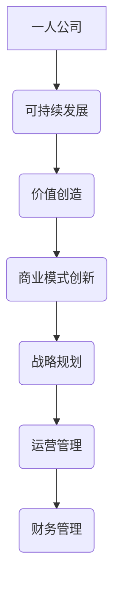
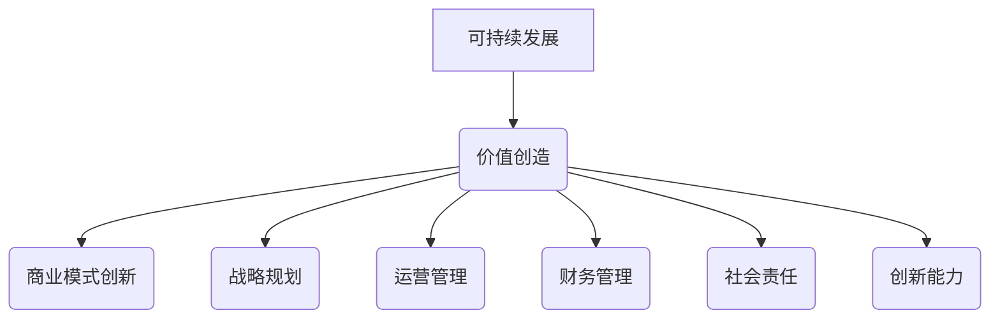
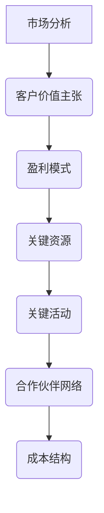

                 

### 文章标题
### 《一人公司如何实现业务的可持续发展和价值创造》

#### 关键词：
- 一人公司
- 可持续发展
- 价值创造
- 业务模式
- 战略规划
- 运营管理
- 财务管理

#### 摘要
本文将探讨一人公司如何在激烈的市场环境中实现业务的可持续发展和价值创造。通过分析一人公司的定义、特点以及面临的挑战，我们提出了从业务模式、战略规划、运营管理和财务管理等多个方面来实现可持续发展和价值创造的策略。同时，通过案例分析和实践总结，提供了一人公司在实际操作中的可行路径。

## 《一人公司如何实现业务的可持续发展和价值创造》目录大纲

### 第一部分：企业可持续发展和价值创造的背景与重要性

### 第1章：一人公司的定义与特点
- 1.1 一人公司的概念与类型
- 1.2 一人公司的优势与挑战
- 1.3 一人公司面临的市场环境分析

### 第2章：可持续发展和价值创造的基本理论
- 2.1 可持续发展的概念与原则
- 2.2 企业价值创造的内涵与外延
- 2.3 一人公司如何实现可持续发展与价值创造

### 第二部分：一人公司的业务模式与战略规划

### 第3章：一人公司的商业模式创新
- 3.1 商业模式创新的概述
- 3.2 一人公司的商业模式案例分析
- 3.3 如何构建具有竞争力的商业模式

### 第4章：战略规划与市场定位
- 4.1 战略规划的基本框架
- 4.2 一人公司的市场定位策略
- 4.3 市场分析与竞争策略

### 第5章：产品与服务设计
- 5.1 产品与服务设计的核心要素
- 5.2 一人公司的产品创新策略
- 5.3 服务设计的原则与方法

### 第三部分：一人公司的运营与财务管理

### 第6章：运营管理
- 6.1 运营管理的基本原理
- 6.2 一人公司的运营流程优化
- 6.3 员工管理与企业文化

### 第7章：财务管理
- 7.1 财务管理的基本理论
- 7.2 一人公司的财务规划与预算
- 7.3 成本控制与风险管理

### 第四部分：一人公司的可持续发展和价值创造实践

### 第8章：可持续发展实践
- 8.1 可持续发展实践概述
- 8.2 一人公司的环保与社会责任
- 8.3 可持续发展的成功案例分析

### 第9章：价值创造实践
- 9.1 价值创造实践概述
- 9.2 一人公司的盈利模式与收入增长策略
- 9.3 价值创造的关键成功因素

### 第五部分：一人公司的未来展望与挑战

### 第10章：一人公司的未来趋势与发展方向
- 10.1 一人公司面临的新挑战
- 10.2 数字化转型的机遇与挑战
- 10.3 一人公司的未来发展趋势

### 第11章：结语与展望
- 11.1 一人公司的可持续发展和价值创造总结
- 11.2 未来展望与持续改进

### 附录
- 附录 A：参考资料与推荐阅读
- 附录 B：术语表与缩略语
- 附录 C：进一步学习资源

### 参考文献

## 第一部分：企业可持续发展和价值创造的背景与重要性

### 第1章：一人公司的定义与特点

#### 1.1 一人公司的概念与类型

**一人公司**，顾名思义，是指由一名个体经营者独自承担企业运营的公司。这种公司的显著特点在于其简单、灵活和迅速的决策机制。一人公司的类型多样，可以是纯粹的个人经营，也可以是家族企业，甚至是在特定领域内由专业人才主导的独立工作室。

#### 1.2 一人公司的优势与挑战

**优势**：

1. **管理灵活**：一人公司不需要复杂的组织结构和繁琐的决策程序，决策迅速且执行力强。
2. **成本较低**：由于人员结构简单，一人公司的运营成本相对较低。
3. **风险可控**：个体经营者能够更好地控制企业风险，做出灵活调整。

**挑战**：

1. **资源有限**：一人公司通常面临资金、人才和资源的限制。
2. **管理经验不足**：个体经营者可能在企业管理方面缺乏经验。
3. **市场竞争力**：在激烈的市场环境中，一人公司需要不断创新以保持竞争力。

#### 1.3 一人公司面临的市场环境分析

在当今快速变化的市场环境中，一人公司需要应对多个层面的挑战。首先，市场需求的不断变化要求一人公司具备快速反应的能力，其次，技术创新的加速推动了市场格局的演变，一人公司需要跟上技术发展的步伐。此外，全球化进程的加剧使得一人公司在面对国际竞争时需要具备更强的竞争力。

### 1.4 一人公司与可持续发展的联系

**一人公司**在追求业务发展的同时，也需要关注**可持续发展**。可持续发展强调经济、社会和环境三方面的协调发展，对于一人公司而言，这意味着：

- **经济层面**：通过提高生产效率、优化供应链管理等方式实现经济效益。
- **社会层面**：关注员工福利、社区责任等方面，促进和谐的社会环境。
- **环境层面**：采取绿色生产方式，减少资源浪费和环境污染。

#### 1.5 一人公司如何实现可持续发展与价值创造

一人公司实现可持续发展与价值创造的关键在于：

1. **商业模式创新**：通过创新商业模式，提升企业的竞争力。
2. **战略规划**：制定合理的战略规划，确保企业在市场中的定位。
3. **运营管理**：优化运营流程，提高生产效率。
4. **财务管理**：合理规划财务，控制成本，降低风险。

### 1.6 核心概念与联系

**一人公司**、**可持续发展**和**价值创造**三者之间存在紧密的联系。一人公司通过实现可持续发展，不仅能够在经济上创造价值，还能在社会和环境层面产生积极影响。具体而言：

- **一人公司**：作为企业运营的主体，其决策和管理直接影响企业的可持续发展。
- **可持续发展**：一人公司通过采取绿色生产、优化供应链等方式，实现经济、社会和环境三方面的协调发展。
- **价值创造**：通过提供高质量的产品和服务，满足客户需求，从而实现企业的价值增长。

为了更好地理解这些核心概念之间的联系，我们可以使用Mermaid流程图进行描述：

### 1.7 案例分析

以**马云**创立的**阿里巴巴**为例，阿里巴巴最初是由一名个体经营者创办的，通过不断进行商业模式创新、战略规划、运营管理等方面的努力，最终发展成为全球知名的电子商务巨头。阿里巴巴的成功展示了一个人如何在激烈的市场竞争中实现业务的可持续发展和价值创造。

## 第二部分：可持续发展和价值创造的基本理论

### 第2章：可持续发展和价值创造的基本理论

#### 2.1 可持续发展的概念与原则

**可持续发展的概念**：
可持续发展是指满足当代人的需求，同时不损害后代人满足其需求的能力。它强调经济、社会和环境三方面的协调发展。

**可持续发展的原则**：
1. **公平性原则**：保证代内和代际之间的公平，尊重所有人的权利和机会。
2. **持续性原则**：资源利用要合理，避免过度开采和消耗，确保资源的长期供给。
3. **共同性原则**：可持续发展是全球性的问题，需要各国共同努力，实现全球的可持续发展。

#### 2.2 企业价值创造的内涵与外延

**企业价值创造的内涵**：
企业价值创造是指企业通过提供产品和服务，满足客户需求，从而实现企业价值增长的过程。它包括以下几个方面：
1. **产品或服务的质量**：高质量的产品和服务能够满足客户需求，提高客户满意度。
2. **创新**：不断创新能够推动企业的发展，提升企业的竞争力。
3. **品牌价值**：强大的品牌价值能够为企业带来长期的竞争优势。

**企业价值创造的外延**：
除了传统的产品和服务，企业价值创造还包括：
1. **客户关系管理**：通过建立和维护良好的客户关系，提高客户忠诚度。
2. **供应链管理**：优化供应链管理，提高生产效率和降低成本。
3. **社会责任**：企业通过承担社会责任，提升企业的社会形象，增强企业的社会责任感。

#### 2.3 一人公司如何实现可持续发展与价值创造

**一人公司**在实现可持续发展与价值创造方面需要关注以下几个方面：

1. **商业模式创新**：
   - **创新商业模式**：通过创新商业模式，提升企业的竞争力。
   - **多元化经营**：在保持核心业务的同时，探索新的业务领域，实现多元化发展。

2. **战略规划**：
   - **市场定位**：明确市场定位，制定合适的发展战略。
   - **资源配置**：合理配置资源，确保战略规划的执行。

3. **运营管理**：
   - **流程优化**：优化运营流程，提高生产效率和降低成本。
   - **质量管理**：提高产品质量，提升客户满意度。

4. **财务管理**：
   - **成本控制**：通过成本控制，提高企业的经济效益。
   - **风险管理**：合理规避和应对风险，确保企业的稳定运营。

5. **社会责任**：
   - **环保**：采取环保措施，减少对环境的污染。
   - **社会公益**：积极参与社会公益事业，提升企业的社会形象。

6. **创新能力**：
   - **技术研发**：不断进行技术研发，推动企业创新。
   - **人才培养**：培养和引进优秀人才，为企业的创新发展提供支持。

### 2.4 可持续发展和价值创造的核心概念与联系

**核心概念**：
- **可持续发展**：强调经济、社会和环境三方面的协调发展。
- **价值创造**：通过提供产品和服务，满足客户需求，实现企业价值增长。

**联系**：
可持续发展是价值创造的基础，而价值创造是可持续发展的动力。一人公司通过实现可持续发展，不仅能够在经济上创造价值，还能在社会和环境层面产生积极影响，从而实现企业的长期发展。

为了更好地理解这些核心概念之间的联系，我们可以使用Mermaid流程图进行描述：

### 2.5 案例分析

以**特斯拉**为例，特斯拉在实现可持续发展与价值创造方面做出了卓越的成绩。特斯拉通过创新电动汽车技术，减少对环境的影响，同时通过高品质的产品和服务，赢得了全球客户的信任和好评。特斯拉的成功展示了一个人如何在激烈的市场竞争中，通过实现可持续发展与价值创造，推动企业的长期发展。

## 第二部分：一人公司的业务模式与战略规划

### 第3章：一人公司的商业模式创新

#### 3.1 商业模式创新的概述

**商业模式创新**是指在现有的市场环境下，通过改变产品或服务的提供方式、成本结构或收入来源，从而创造出新的商业价值。对于一人公司而言，商业模式创新尤为重要，因为它能够在资源有限的情况下，最大化地利用机会，实现业务的快速增长。

**商业模式创新的要素**包括：
1. **客户价值主张**：明确公司为哪些客户提供何种价值。
2. **盈利模式**：确定公司如何通过提供价值获取收入。
3. **关键资源**：包括有形资源和无形资源，如人力、技术、品牌等。
4. **关键活动**：实现商业模式的关键业务流程。
5. **合作伙伴网络**：与供应商、分销商和其他合作伙伴的关系。
6. **成本结构**：如何分配和管理成本以实现盈利。

#### 3.2 一人公司的商业模式案例分析

**案例1：在线教育平台**

某一人公司创始人李先生创立了一家在线教育平台，专注于提供高质量的课程内容给全球学习者。他的商业模式创新在于：
- **客户价值主张**：提供灵活、便捷的学习方式，满足不同学习者的需求。
- **盈利模式**：通过订阅费、课程销售和广告收入实现盈利。
- **关键资源**：包括高质量的教学内容、强大的技术平台和优质的用户服务。
- **关键活动**：内容制作、平台运营和用户维护。
- **合作伙伴网络**：与教育专家、内容创作者和营销团队合作。
- **成本结构**：通过技术平台降低运营成本，专注于内容制作和用户增长。

**案例2：个性定制服务公司**

张女士创建了一家个性定制服务公司，提供高端的个人定制服务，如定制服装、珠宝和家居用品。她的商业模式创新在于：
- **客户价值主张**：为顾客提供独一无二的产品和服务，满足个性化需求。
- **盈利模式**：通过高端定制服务收取高额费用。
- **关键资源**：包括专业设计师、优质的材料和强大的定制技术。
- **关键活动**：产品设计、材料采购和定制服务。
- **合作伙伴网络**：与顶尖设计师、材料和供应商合作。
- **成本结构**：通过精细化管理控制成本，确保服务质量和利润。

#### 3.3 如何构建具有竞争力的商业模式

**构建具有竞争力的商业模式**需要遵循以下步骤：

1. **市场分析**：研究市场需求、竞争对手和潜在客户，确定目标市场。
2. **客户价值主张**：明确公司的核心价值和目标客户群体，设计客户价值主张。
3. **盈利模式**：根据市场分析和客户需求，选择合适的盈利模式。
4. **关键资源**：评估现有资源和所需资源，确保关键资源的充足性和可持续性。
5. **关键活动**：确定实现商业模式的业务流程，确保高效执行。
6. **合作伙伴网络**：建立和维护与供应商、分销商和其他合作伙伴的关系。
7. **成本结构**：制定合理的成本结构，确保盈利性和可持续性。

为了更直观地展示如何构建具有竞争力的商业模式，我们可以使用Mermaid流程图进行描述：

### 3.4 案例分析

以**Airbnb**为例，Airbnb通过创新性的商业模式，将闲置的房屋资源转化为商业机会，为全球旅行者提供住宿服务。Airbnb的商业模式创新在于：
- **客户价值主张**：为旅行者提供多样化的住宿选择，同时为房屋所有者提供额外的收入来源。
- **盈利模式**：通过收取服务费从预订交易中获取收入。
- **关键资源**：包括强大的在线平台、用户评价体系和客户服务。
- **关键活动**：房源管理、预订处理和客户服务。
- **合作伙伴网络**：与酒店、旅游公司和本地服务供应商合作。
- **成本结构**：通过技术平台降低运营成本，专注于用户体验和市场拓展。

通过这些案例和步骤，一人公司可以更好地理解如何通过商业模式创新实现业务的可持续发展和价值创造。

### 3.5 商业模式创新的核心要素

**商业模式创新**的核心要素包括：

1. **客户需求分析**：深入了解目标客户的需求，设计出能够满足这些需求的产品或服务。
2. **竞争优势**：分析市场中的竞争优势，找到独特的价值点。
3. **成本效益**：在保证服务质量的同时，降低成本，提高盈利能力。
4. **灵活性**：商业模式应具有灵活性，能够适应市场变化和客户需求。
5. **可扩展性**：商业模式应具备可扩展性，支持业务的快速增长。

### 3.6 案例分析

以**Uber**为例，Uber通过创新的商业模式，改变了人们的出行方式。Uber的商业模式创新在于：
- **客户需求分析**：Uber分析了城市居民的出行需求，提供了便捷、高效的出行服务。
- **竞争优势**：Uber通过技术创新和灵活的服务模式，迅速占领了市场。
- **成本效益**：Uber通过优化供应链管理和数字化运营，降低了运营成本。
- **灵活性**：Uber的商业模式具有高度的灵活性，能够快速适应市场需求变化。
- **可扩展性**：Uber的商业模式在全球范围内快速扩展，成为了全球性的公司。

通过这些案例分析，一人公司可以更好地理解商业模式创新的核心要素，并应用于自己的业务实践中。

### 3.7 总结

一人公司在实现业务的可持续发展和价值创造过程中，商业模式创新是关键。通过深入分析市场、客户需求和竞争优势，构建具有竞争力的商业模式，一人公司可以在资源有限的情况下，实现业务的快速增长和价值创造。下一章将探讨战略规划与市场定位的重要性，帮助一人公司更好地制定长期发展策略。

## 第三部分：一人公司的战略规划与市场定位

### 第4章：战略规划与市场定位

#### 4.1 战略规划的基本框架

**战略规划**是指企业为了实现长期目标而制定的详细计划和行动方案。对于一人公司而言，战略规划尤为重要，因为它需要确保企业在资源有限的情况下，能够有效地应对市场变化和竞争压力。

**战略规划的基本框架**包括以下步骤：

1. **愿景与使命**：明确企业的长远目标和使命，为战略规划提供方向。
2. **环境分析**：分析外部环境和内部资源，确定企业面临的机会和挑战。
3. **目标设定**：根据环境分析结果，设定具体的战略目标和关键绩效指标（KPI）。
4. **战略选择**：选择实现目标的最佳战略方案，包括市场扩张、产品创新、成本控制等。
5. **实施计划**：制定详细的实施步骤和时间表，确保战略能够有效执行。
6. **监控与评估**：定期监控战略执行情况，评估战略的有效性，并根据需要进行调整。

#### 4.2 一人公司的市场定位策略

**市场定位**是指企业根据自身优势和市场特点，确定其在市场中的位置。对于一人公司而言，市场定位策略需要考虑以下几个方面：

1. **目标市场**：确定公司的目标客户群体，包括客户的特征、需求和购买行为。
2. **差异化策略**：通过产品、服务或品牌的差异化，使公司与众不同，从而在市场中获得竞争优势。
3. **市场细分**：将市场划分为不同的细分市场，针对不同细分市场的特点，制定相应的营销策略。
4. **品牌形象**：通过品牌形象塑造，建立良好的品牌知名度和忠诚度。
5. **渠道策略**：选择合适的销售渠道，确保产品能够有效地到达目标客户。

#### 4.3 市场分析与竞争策略

**市场分析**是战略规划的重要组成部分，它包括对市场环境、竞争对手和潜在客户的分析。

1. **市场环境分析**：
   - **宏观环境**：包括经济、政治、社会、技术等因素，影响市场的整体趋势。
   - **微观环境**：包括行业结构、市场规模、增长趋势等，直接影响企业的运营。
   - **市场趋势**：分析市场的未来发展趋势，为战略规划提供依据。

2. **竞争对手分析**：
   - **竞争者分析**：识别主要的竞争对手，分析其市场份额、产品特点、优势和劣势。
   - **竞争策略**：了解竞争对手的战略，制定相应的竞争策略，包括价格策略、产品策略、促销策略等。

3. **竞争策略**：
   - **差异化策略**：通过提供独特的价值，使产品或服务在市场中脱颖而出。
   - **集中策略**：专注于特定的细分市场，提供针对性的产品或服务。
   - **成本领先策略**：通过降低成本，实现价格优势。

#### 4.4 一人公司的市场定位案例分析

以**Dropbox**为例，Dropbox是一家提供云存储服务的公司，其市场定位策略如下：

1. **目标市场**：Dropbox的目标客户群体是那些需要随时随地访问文件的个人和企业用户。
2. **差异化策略**：Dropbox通过提供简单易用、安全可靠的服务，在竞争激烈的市场中脱颖而出。
3. **市场细分**：Dropbox将市场细分为个人用户和企业用户，分别提供不同的产品和服务。
4. **品牌形象**：Dropbox通过简洁的界面、出色的用户体验和强大的品牌形象，建立了良好的口碑。
5. **渠道策略**：Dropbox通过线上渠道和合作伙伴渠道，将产品和服务推广到全球市场。

#### 4.5 市场定位的核心要素

**市场定位**的核心要素包括：

1. **目标客户**：明确目标客户群体的特点和需求，为产品或服务的开发和营销提供依据。
2. **差异化优势**：找到公司的独特优势，使其在市场中具有竞争力。
3. **品牌形象**：建立强大的品牌形象，提高品牌知名度和忠诚度。
4. **渠道策略**：选择合适的销售渠道，确保产品或服务能够有效地到达目标客户。

#### 4.6 案例分析

以**Apple**为例，Apple在市场定位方面取得了巨大的成功。Apple的市场定位策略包括：

1. **目标客户**：Apple的目标客户群体是那些追求高端、时尚、创新的消费者。
2. **差异化优势**：Apple通过独特的设计、高品质的产品和服务，在市场中建立了强大的竞争优势。
3. **品牌形象**：Apple通过精湛的工艺、卓越的用户体验和强大的品牌传播，建立了卓越的品牌形象。
4. **渠道策略**：Apple通过线下零售店和线上商店，将产品和服务推广到全球市场。

通过这些案例和策略，一人公司可以更好地制定市场定位策略，从而实现业务的可持续发展和价值创造。下一章将探讨产品与服务设计的重要性，帮助一人公司打造具有竞争力的产品和服务。

## 第四部分：一人公司的运营与财务管理

### 第6章：运营管理

#### 6.1 运营管理的基本原理

**运营管理**是指企业为实现其战略目标，通过计划、组织、协调、控制等手段，对生产经营过程进行有效管理的活动。对于一人公司而言，运营管理的基本原理主要包括以下几个方面：

1. **计划**：制定详细的运营计划，包括生产计划、销售计划、人力资源计划等，确保各项活动有序进行。
2. **组织**：建立合理的组织结构，明确各部门和员工的责任和权限，确保资源的高效利用。
3. **协调**：协调各部门和员工之间的工作，确保业务流程的顺畅，提高生产效率和客户满意度。
4. **控制**：通过监控和评估运营绩效，及时发现和解决问题，确保运营目标的实现。

#### 6.2 一人公司的运营流程优化

**运营流程优化**是指通过改进和优化业务流程，提高生产效率和降低成本。对于一人公司而言，运营流程优化主要包括以下几个方面：

1. **流程分析**：对现有运营流程进行详细分析，识别存在的问题和瓶颈。
2. **流程重构**：根据流程分析结果，重构业务流程，消除浪费和不必要的环节。
3. **自动化**：引入自动化工具和技术，减少人工操作，提高生产效率。
4. **标准化**：制定标准化的操作流程，确保流程的一致性和可重复性。
5. **持续改进**：通过定期的流程评估和改进，持续优化运营流程。

#### 6.3 员工管理与企业文化

**员工管理**是指企业对员工进行招聘、培训、激励和绩效管理等活动。对于一人公司而言，员工管理的关键在于：

1. **招聘**：招聘合适的员工，确保企业拥有充足的人力资源。
2. **培训**：提供培训机会，提高员工的技能和素质，增强企业的竞争力。
3. **激励**：通过合理的激励机制，激发员工的工作热情和创造力。
4. **绩效管理**：建立科学的绩效管理体系，确保员工的工作绩效符合企业要求。

**企业文化**是指企业在长期经营过程中形成的共同价值观和行为准则。对于一人公司而言，企业文化的重要性体现在：

1. **凝聚员工**：企业文化能够凝聚员工，增强团队凝聚力。
2. **塑造品牌形象**：企业文化能够塑造企业的品牌形象，提高企业的知名度和美誉度。
3. **引导行为**：企业文化能够引导员工的行为，形成良好的工作氛围。

#### 6.4 运营管理的核心要素

**运营管理的核心要素**包括：

1. **效率**：提高生产效率和运营效率，降低成本。
2. **质量**：确保产品或服务的质量，提高客户满意度。
3. **灵活性**：适应市场变化和客户需求，提高竞争力。
4. **创新**：推动技术创新和管理创新，提升企业竞争力。

#### 6.5 案例分析

以**Zappos**为例，Zappos是一家在线鞋类和服装零售商，其运营管理采取了以下策略：

1. **流程优化**：Zappos采用了高效的后勤管理系统，实现了快速发货和高效退货流程。
2. **员工管理**：Zappos注重员工培训和文化建设，为员工提供良好的工作环境和激励机制。
3. **企业文化**：Zappos倡导以客户为中心的文化，强调客户服务的重要性，形成了良好的客户体验。

通过这些案例和策略，一人公司可以更好地进行运营管理，实现业务的可持续发展和价值创造。下一章将探讨财务管理的重要性，帮助一人公司制定合理的财务规划和预算。

## 第7章：财务管理

#### 7.1 财务管理的基本理论

**财务管理**是企业为实现其经营目标，通过筹集资金、分配资金和使用资金等手段，对企业的财务活动进行有效管理的过程。财务管理的基本理论包括以下几个方面：

1. **财务目标**：企业财务管理的目标是实现企业的价值最大化。这意味着企业在财务管理过程中，要追求经济效益，同时兼顾社会责任和环境保护。
2. **财务决策**：财务决策是指企业为了实现财务目标，对资金筹集、使用和分配等方面所做的决策。财务决策包括资金筹集决策、投资决策和分配决策等。
3. **财务规划**：财务规划是企业根据财务目标，对未来财务活动进行系统安排的过程。财务规划包括资金筹集规划、投资规划和分配规划等。
4. **财务分析**：财务分析是企业对财务活动进行评估和监控的过程。通过财务分析，企业可以了解财务状况、发现潜在问题并采取相应措施。
5. **财务控制**：财务控制是企业为了确保财务目标实现，对财务活动进行监督和调节的过程。财务控制包括预算控制、成本控制和风险控制等。

#### 7.2 一人公司的财务规划与预算

**财务规划**是指企业为了实现其经营目标，对未来财务活动进行系统安排的过程。对于一人公司而言，财务规划尤为重要，因为它需要确保企业在资源有限的情况下，实现可持续发展和价值创造。

**一人公司的财务规划主要包括以下几个方面**：

1. **资金筹集规划**：根据企业的经营需求和资金需求，制定合理的资金筹集计划。一人公司可以采用股权融资、债务融资或内部融资等方式筹集资金。
2. **投资规划**：根据企业的战略目标和市场环境，制定投资规划。投资规划包括确定投资方向、投资规模和投资时间等。
3. **分配规划**：制定合理的收益分配计划，确保企业的收益能够合理地分配给投资者、员工和其他利益相关者。
4. **风险管理**：制定风险管理计划，识别和应对可能影响企业财务状况的风险，如市场风险、信用风险和操作风险等。

**预算**是指企业在一定时期内，对财务活动进行预测和控制的具体计划。对于一人公司而言，预算管理是财务管理的重要组成部分，它有助于企业控制成本、提高效益。

**一人公司的预算管理主要包括以下几个方面**：

1. **预算编制**：根据企业的财务规划，制定详细的预算计划，包括收入预算、支出预算和投资预算等。
2. **预算执行**：按照预算计划执行财务活动，确保各项财务活动符合预算要求。
3. **预算监控**：定期监控预算执行情况，及时发现和解决预算偏差，确保预算目标的实现。
4. **预算调整**：根据预算执行情况和市场环境变化，适时调整预算计划，确保预算的灵活性和有效性。

#### 7.3 成本控制与风险管理

**成本控制**是指企业通过制定和实施成本控制策略，降低成本、提高效益的过程。对于一人公司而言，成本控制是财务管理的重要组成部分，它有助于企业实现可持续发展和价值创造。

**成本控制主要包括以下几个方面**：

1. **成本分析**：对成本构成进行分析，识别成本节约的潜力。
2. **成本预算**：根据成本分析结果，制定合理的成本预算，确保成本控制在预算范围内。
3. **成本监控**：定期监控成本执行情况，及时发现和解决成本超支问题。
4. **成本考核**：建立成本考核体系，对成本控制效果进行评估和奖励。

**风险管理**是指企业通过识别、评估和控制风险，确保企业稳健经营的过程。对于一人公司而言，风险管理是财务管理的重要组成部分，它有助于企业应对市场变化和不确定性。

**风险管理主要包括以下几个方面**：

1. **风险识别**：识别企业可能面临的风险，包括市场风险、信用风险、操作风险等。
2. **风险评估**：评估风险的性质、程度和可能造成的损失，确定风险管理的优先级。
3. **风险控制**：制定风险控制措施，降低风险的可能性和损失程度。
4. **风险监控**：定期监控风险状态，及时发现和应对新的风险。

#### 7.4 财务管理的核心要素

**财务管理的核心要素**包括：

1. **资金筹集**：确保企业有足够的资金支持经营活动。
2. **成本控制**：降低成本，提高效益。
3. **投资管理**：合理投资，实现资产增值。
4. **风险控制**：识别和控制风险，确保企业稳健经营。
5. **财务分析**：通过财务分析，了解企业的财务状况，为决策提供依据。

#### 7.5 案例分析

以**Google**为例，Google在财务管理方面取得了显著的成功。Google的财务管理策略主要包括：

1. **资金筹集**：Google通过多次股权融资和债务融资，获得了充足的资金支持。
2. **成本控制**：Google通过优化业务流程和降低运营成本，实现了高效的成本控制。
3. **投资管理**：Google通过投资于技术创新和新兴市场，实现了资产的快速增长。
4. **风险控制**：Google建立了完善的内部控制和风险管理机制，确保企业的稳健经营。

通过这些案例和策略，一人公司可以更好地进行财务管理，实现业务的可持续发展和价值创造。下一章将探讨一人公司的可持续发展和价值创造实践，提供具体的操作方法和成功案例。

## 第四部分：一人公司的可持续发展和价值创造实践

### 第8章：可持续发展实践

#### 8.1 可持续发展实践概述

**可持续发展实践**是指企业在经营过程中，通过经济、社会和环境三方面的协调发展，实现长期可持续发展的行为。对于一人公司而言，可持续发展实践不仅有助于提升企业的社会形象，还能为企业的长期发展奠定基础。

**一人公司的可持续发展实践主要包括以下几个方面**：

1. **环境保护**：采取环保措施，减少资源浪费和环境污染，实现绿色生产。
2. **社会责任**：关注社会问题，积极参与社会公益事业，为社会发展做出贡献。
3. **员工福利**：关注员工福利，提高员工工作满意度，促进员工与企业共同发展。

#### 8.2 一人公司的环保与社会责任

**环保**：

- **减少碳排放**：一人公司可以通过采用清洁能源、优化生产流程和鼓励低碳出行等方式，减少碳排放。
- **资源回收**：推行废弃物回收再利用，减少资源浪费。
- **绿色采购**：选择环保材料和供应商，推动供应链的绿色化。

**社会责任**：

- **公益捐赠**：定期捐赠物资或资金，支持贫困地区和教育事业。
- **员工志愿服务**：鼓励员工参与志愿服务，提升企业的社会形象。
- **社区建设**：参与社区建设，改善社区环境和居民生活条件。

#### 8.3 可持续发展的成功案例分析

以**Patagonia**为例，Patagonia是一家专注于户外服饰和装备的公司，其可持续发展实践取得了显著的成功。

**环保方面**：

- **绿色生产**：Patagonia采用环保材料和生产工艺，减少生产过程中的污染和资源消耗。
- **碳补偿**：Patagonia通过购买碳信用额，实现公司的碳足迹中和。

**社会责任方面**：

- **公益捐赠**：Patagonia每年将收入的一部分捐赠给环保和非营利组织，支持可持续发展项目。
- **员工福利**：Patagonia提供良好的工作环境，包括灵活的工作时间和培训机会，提高员工的工作满意度。

通过这些实践，Patagonia不仅提升了企业的社会形象，还实现了经济效益和社会效益的双赢。

#### 8.4 一人公司的可持续发展策略

**一人公司**在实施可持续发展时，可以采取以下策略：

1. **制定可持续发展计划**：明确企业的发展目标和可持续发展目标，制定详细的实施计划。
2. **建立可持续发展指标**：建立关键绩效指标（KPI），监控和评估企业的可持续发展表现。
3. **培训与宣传**：对员工进行可持续发展培训，提高员工对环保和社会责任的认知。
4. **合作伙伴关系**：与环保组织和非营利组织建立合作伙伴关系，共同推动可持续发展。

### 8.5 可持续发展的核心要素

**可持续发展的核心要素**包括：

1. **环境保护**：通过采取环保措施，减少对环境的负面影响。
2. **社会责任**：关注社会问题，积极参与社会公益事业。
3. **经济效益**：通过可持续发展实现企业的长期经济效益。
4. **员工福利**：关注员工福利，提高员工的工作满意度。

### 8.6 案例分析

以**The Body Shop**为例，The Body Shop是一家全球知名的化妆品零售商，其可持续发展实践如下：

**环保方面**：

- **使用可再生资源**：The Body Shop使用可再生和有机资源，减少对环境的破坏。
- **减少包装**：The Body Shop致力于减少包装，推广无包装商品。

**社会责任方面**：

- **支持慈善事业**：The Body Shop将部分利润用于支持慈善事业，支持环保和非营利组织。

通过这些实践，The Body Shop不仅提升了企业的品牌形象，还实现了可持续发展和价值创造。

### 8.7 总结

一人公司通过实施可持续发展实践，可以在环境保护、社会责任和经济效益三个方面实现共赢。通过制定可持续发展计划、建立可持续发展指标、培训与宣传以及建立合作伙伴关系，一人公司可以有效地推动可持续发展，实现长期的价值创造。下一章将探讨一人公司的价值创造实践，帮助读者了解如何在业务中实现持续的价值增长。

### 第9章：价值创造实践

#### 9.1 价值创造实践概述

**价值创造实践**是企业通过提供产品或服务，满足客户需求，从而实现企业价值增长的过程。对于一人公司而言，价值创造实践不仅关系到企业的生存与发展，还直接影响企业的市场竞争力。有效的价值创造实践需要从多个方面进行深入探讨和实施。

#### 9.2 一人公司的盈利模式与收入增长策略

**盈利模式**是指企业通过何种方式获取收入的机制。一人公司可以采取多种盈利模式，如产品销售、服务收费、订阅制、广告收入等。以下是一人公司可以采用的一些具体收入增长策略：

1. **产品销售**：通过提供高质量的产品，满足市场需求，实现销售收入。
   - **策略**：不断改进产品，优化产品组合，提升客户满意度。
   - **案例**：苹果公司通过不断更新其硬件产品，保持了稳定的销售收入。

2. **服务收费**：通过提供专业服务，收取服务费用。
   - **策略**：打造专业团队，提供高质量的服务，建立良好的客户关系。
   - **案例**：咨询公司通过为客户提供专业的咨询服务，实现了持续的收入增长。

3. **订阅制**：通过提供订阅服务，实现持续的收入来源。
   - **策略**：提供多样化的订阅选项，满足不同客户的需求。
   - **案例**：Spotify通过订阅模式，实现了全球范围内的收入增长。

4. **广告收入**：通过平台广告，获取广告收入。
   - **策略**：优化广告投放策略，提高广告点击率和转化率。
   - **案例**：谷歌通过其广告平台，实现了巨大的广告收入。

#### 9.3 价值创造的关键成功因素

**价值创造**的成功不仅依赖于盈利模式，还需要关注以下几个关键因素：

1. **客户需求**：深入了解客户需求，提供满足客户需求的产品或服务。
   - **策略**：进行市场调研，收集客户反馈，持续改进产品和服务。

2. **创新**：不断创新，推动产品或服务的更新迭代。
   - **策略**：建立创新机制，鼓励员工提出创新想法，进行技术研发。

3. **品牌建设**：建立强大的品牌形象，提升企业的市场竞争力。
   - **策略**：通过品牌宣传、市场营销等手段，提高品牌知名度和美誉度。

4. **成本控制**：通过有效的成本控制，提高企业的盈利能力。
   - **策略**：优化运营流程，提高生产效率，降低成本。

5. **风险管理**：合理识别和管理风险，确保企业的稳健运营。
   - **策略**：建立风险管理机制，定期评估和调整风险策略。

#### 9.4 价值创造的具体案例分析

以**Airbnb**为例，Airbnb通过以下实践实现了价值创造：

1. **客户需求**：Airbnb深入了解用户需求，提供多样化的住宿选择，满足了用户对个性化和便捷性的需求。
2. **创新**：Airbnb不断创新，从房源管理、预订流程到客户服务，不断提升用户体验。
3. **品牌建设**：Airbnb通过精美的设计、优秀的客户服务和强有力的品牌宣传，建立了强大的品牌形象。
4. **成本控制**：Airbnb通过技术优化和运营效率提升，实现了成本的有效控制。
5. **风险管理**：Airbnb建立了完善的风险管理机制，确保了平台的稳定运行。

#### 9.5 价值创造的核心要素

**价值创造的核心要素**包括：

1. **客户需求**：满足客户需求是价值创造的出发点。
2. **创新**：持续创新是价值创造的不竭动力。
3. **品牌建设**：强大的品牌形象是价值创造的重要支撑。
4. **成本控制**：有效的成本控制是价值创造的保障。
5. **风险管理**：合理管理风险是价值创造的必要条件。

#### 9.6 案例分析

以**Uber**为例，Uber通过以下实践实现了价值创造：

1. **客户需求**：Uber深入了解用户对便捷、高效的出行需求，提供了灵活的打车服务。
2. **创新**：Uber通过技术创新，开发了高效的叫车平台和支付系统，提升了用户体验。
3. **品牌建设**：Uber通过强大的品牌宣传和用户反馈机制，建立了良好的品牌形象。
4. **成本控制**：Uber通过优化运营流程和规模效应，实现了成本的有效控制。
5. **风险管理**：Uber建立了完善的风险管理机制，确保了平台的安全和稳定运行。

通过这些案例和策略，一人公司可以更好地理解价值创造的核心要素和具体实践，从而实现业务的可持续发展和价值创造。下一章将探讨一人公司的未来展望与挑战，为读者提供更广阔的视角。

## 第五部分：一人公司的未来展望与挑战

### 第10章：一人公司的未来趋势与发展方向

#### 10.1 一人公司面临的新挑战

随着技术的不断进步和市场环境的变化，一人公司面临着一系列新的挑战。

1. **市场竞争加剧**：在数字化时代，市场竞争愈发激烈，一人公司需要不断创新和提升竞争力。
2. **数据隐私与安全**：随着数据的重要性日益增加，数据隐私和安全成为一人公司必须关注的问题。
3. **技术更新换代**：技术发展速度加快，一人公司需要不断跟进新技术，以保持竞争力。
4. **可持续发展压力**：环保和可持续发展成为全球关注的焦点，一人公司需要采取环保措施，应对可持续发展压力。

#### 10.2 数字化转型的机遇与挑战

数字化转型为一人公司提供了巨大的机遇，但也带来了挑战。

**机遇**：

1. **效率提升**：通过数字化转型，一人公司可以实现业务流程的自动化和优化，提高运营效率。
2. **客户体验优化**：通过数字化手段，一人公司可以提供更加个性化、便捷的客户体验。
3. **市场拓展**：数字化平台使一人公司能够拓展市场，触及更多的潜在客户。

**挑战**：

1. **技术投资**：数字化转型需要大量投资，对于资源有限的一人公司来说，这是一项巨大的挑战。
2. **数据管理**：数字化转型产生的数据量巨大，如何有效管理和利用这些数据是一大挑战。
3. **技能缺口**：数字化转型需要专业人才，如何吸引和培养这些人才是一大挑战。

#### 10.3 一人公司的未来发展趋势

一人公司的未来发展将呈现以下趋势：

1. **平台化发展**：一人公司将逐渐向平台化方向发展，通过构建生态系统，整合各种资源，提高竞争力。
2. **数字化运营**：一人公司将继续深化数字化转型，通过数字化手段提高运营效率，降低成本。
3. **可持续发展**：一人公司将更加注重可持续发展，采取环保措施，提升企业的社会责任感。
4. **创新能力**：一人公司将持续进行技术创新和管理创新，保持竞争优势。

### 10.4 成功案例分析

以**Airbnb**为例，Airbnb在数字化转型和平台化发展中取得了显著成功：

1. **数字化转型**：Airbnb通过建立数字化平台，实现了在线预订、支付和客户服务，提高了运营效率。
2. **平台化发展**：Airbnb构建了全球化的住宿平台，吸引了大量房东和旅客，形成了庞大的生态系统。
3. **可持续发展**：Airbnb推出了“可持续旅行”计划，鼓励用户减少碳足迹，推动可持续发展。
4. **创新能力**：Airbnb不断进行技术创新，如推出“Airbnb Plus”高端住宿服务，满足不同客户的需求。

通过这些案例，一人公司可以借鉴成功经验，应对未来挑战，实现可持续发展与价值创造。

### 10.5 结论

一人公司在未来将面临新的挑战，但同时也拥有巨大的机遇。通过数字化转型、平台化发展、可持续发展以及创新能力，一人公司可以不断提升竞争力，实现业务的可持续发展和价值创造。下一章将进行总结，回顾一人公司的可持续发展和价值创造实践，并展望未来的发展方向。

### 第11章：结语与展望

#### 11.1 一人公司的可持续发展和价值创造总结

通过本文的探讨，我们系统地分析了一人公司在实现业务的可持续发展和价值创造方面的策略和实践。首先，从一人公司的定义与特点出发，我们了解了其管理灵活、成本较低的优势，以及面临的资源有限和管理经验不足等挑战。接着，我们深入探讨了可持续发展和价值创造的基本理论，并分析了一人公司在实现这些目标时所需遵循的原则和关键要素。

在业务模式与战略规划方面，我们提出了商业模式创新、战略规划与市场定位的重要性，并提供了具体的案例分析。运营管理和财务管理作为实现可持续发展与价值创造的核心环节，我们也进行了详细的探讨，包括运营流程优化、员工管理、财务管理的基本理论等。

此外，本文通过实践案例分析，展示了一人公司在环保、社会责任和盈利模式等方面的成功实践，提供了一人公司实现可持续发展与价值创造的路径。

#### 11.2 未来展望与持续改进

未来，一人公司的发展将继续面临新技术、新市场和新挑战。随着数字技术的不断进步，一人公司需要不断提升数字化能力和创新力，以保持竞争优势。同时，企业还需要关注可持续发展的趋势，采取更加环保和负责任的经营策略。

为了实现这些目标，一人公司应采取以下措施：

1. **加强技术创新**：持续投入研发，推动技术进步，提升产品和服务的竞争力。
2. **深化数字化转型**：利用数字化手段优化业务流程，提高运营效率。
3. **重视数据隐私和安全**：加强数据管理，确保用户信息的安全和隐私。
4. **加强员工培训**：提高员工的专业技能和管理能力，为企业发展提供人力支持。
5. **积极参与社会公益事业**：承担社会责任，提升企业的社会形象。

持续改进是实现可持续发展与价值创造的关键。一人公司应定期评估和调整战略规划，及时应对市场变化和挑战。同时，通过建立反馈机制，不断改进产品和服务，提升客户满意度。

#### 11.3 结语

本文旨在为一人公司提供实现可持续发展和价值创造的理论和实践指导。通过系统分析一人公司的特点、理论基础、业务模式、运营管理和财务管理等方面，我们希望能够帮助一人公司在激烈的市场竞争中脱颖而出，实现长期稳定的发展。未来，一人公司需要在技术创新、数字化转型和可持续发展等方面不断努力，以实现更高的价值创造。

### 附录

#### 附录A：参考资料与推荐阅读

1. **《企业可持续发展报告编制指南》** - 国际可持续发展准则组织（GISR）
2. **《价值创造与公司治理》** - 克莱顿·克里斯滕森（Clayton M. Christensen）
3. **《商业模式创新》** - 布鲁诺·林奇（Bruce D. Lundin）
4. **《运营管理》** - 斯图尔特·罗宾斯（Stuart Robert Robbins）
5. **《财务管理》** - 斯坦利·布瑞克（Stanley B. Block）

#### 附录B：术语表与缩略语

- **一人公司**：指由一名个体经营者独自承担企业运营的公司。
- **可持续发展**：满足当代人需求的同时，不损害后代人满足其需求的能力。
- **价值创造**：企业通过产品或服务满足客户需求，实现客户满意度的同时，为股东创造经济价值。
- **商业模式**：企业如何创造、传递和获取价值的基本逻辑。

#### 附录C：进一步学习资源

1. **《一人公司如何实现业务的可持续发展和价值创造》** - 本文全文
2. **《哈佛商业评论》** - 涵盖商业管理的最新研究和实践
3. **《世界经济论坛》** - 探讨全球商业和可持续发展议题
4. **在线课程平台** - 如Coursera、edX等，提供各类商业管理课程

### 参考文献

1. 国际可持续发展准则组织（GISR）. (2020). 《企业可持续发展报告编制指南》.
2. 克莱顿·克里斯滕森（Clayton M. Christensen）. (2017). 《价值创造与公司治理》.
3. 布鲁诺·林奇（Bruce D. Lundin）. (2019). 《商业模式创新》.
4. 斯图尔特·罗宾斯（Stuart Robert Robbins）. (2018). 《运营管理》.
5. 斯坦利·布瑞克（Stanley B. Block）. (2016). 《财务管理》.

