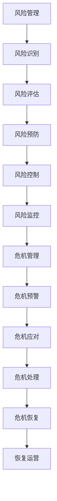

                 

# 《创业者的风险管理与危机应对能力培养》

## 关键词

- 风险管理
- 危机应对
- 创业者
- 风险识别
- 风险评估
- 风险预防
- 风险控制
- 危机预警
- 危机管理
- 恢复与重建

## 摘要

本文旨在探讨创业者在面对风险和危机时的管理与应对能力培养。创业过程中，风险和危机是不可避免的挑战。有效的风险管理与危机应对能力不仅能帮助创业者降低失败的可能性，还能提高企业的韧性和市场竞争力。文章首先概述了风险管理与危机应对的基本概念，然后详细介绍了创业风险的识别与评估方法。接着，文章重点讨论了风险预防与控制策略以及危机应对计划。通过实战案例分析，进一步展示了如何将理论付诸实践。最后，文章提出了培养创业者风险管理意识和危机应对能力的具体途径，为创业者提供实用的指导。

## 第一部分：风险管理与危机应对基础

### 第1章：风险管理与危机应对概述

### 1.1 风险管理的基本概念

风险管理是一种系统的方法，用于识别、评估、优先排序、应对和监控风险，旨在最大限度地减少潜在损失或利用风险机会。在创业环境中，风险管理尤为重要，因为创业者往往面临各种不确定性和潜在风险。

#### 1.1.1 风险的定义

风险是指某个特定事件或情况对项目目标（如利润、时间、质量等）可能产生的不利影响。它可以是正面或负面的，但通常指的是负面风险。

$$
风险 = （损失的可能性）\times（损失的程度）
$$

#### 1.1.2 风险管理的重要性

- **保障企业生存**：风险管理有助于企业避免重大损失，保持持续运营。
- **提高决策质量**：通过评估各种风险，创业者可以更明智地做出决策。
- **增强企业韧性**：有效的风险管理能帮助企业快速应对危机，提高韧性。
- **提高竞争力**：在面临相同风险时，具备强大风险管理能力的企业更具竞争力。

#### 1.1.3 风险管理的核心要素

- **风险评估**：识别和评估潜在风险。
- **风险预防**：采取措施减少风险发生的可能性。
- **风险控制**：在风险发生时，采取措施减轻其影响。
- **风险监控**：持续跟踪和评估风险状况，确保风险管理的有效性。

### 1.2 危机管理的概念与步骤

危机管理是风险管理的一个分支，专注于如何处理突发危机事件。危机通常具有不可预测性和紧急性，可能对企业的声誉、运营和财务状况产生严重影响。

#### 1.2.1 危机的定义

危机是指企业面临的一种紧急情况，可能导致严重损失或负面影响。它通常与以下因素相关：

- **突发性**：危机往往是在短时间内爆发的。
- **不可预测性**：危机的发生往往难以预测。
- **严重性**：危机可能对企业的各个方面产生深远影响。

#### 1.2.2 危机管理的重要性

- **保护企业利益**：危机管理有助于企业最大限度地减少损失。
- **维护声誉**：有效的危机管理能帮助企业维护品牌形象。
- **确保运营**：危机管理能帮助企业尽快恢复正常运营。
- **提高应对能力**：通过应对危机，企业可以增强应对未来挑战的能力。

#### 1.2.3 危机管理的核心步骤

- **危机预警**：识别潜在的危机信号，提前采取预防措施。
- **危机应对**：在危机爆发时，迅速响应并采取措施。
- **危机处理**：解决危机，确保损失最小化。
- **危机恢复**：在危机结束后，评估损失，进行恢复和重建。

### 1.3 风险管理与危机应对的关系

风险管理与危机应对密不可分。风险管理是危机应对的基础，而危机应对是风险管理的重要组成部分。

#### 1.3.1 风险管理在危机管理中的作用

- **降低危机发生的可能性**：通过识别和评估潜在风险，风险管理能降低危机发生的可能性。
- **减轻危机影响**：有效的风险管理能减轻危机爆发时的负面影响。
- **提高应对效率**：预先制定的风险应对计划能提高危机应对的效率。

#### 1.3.2 危机管理对风险管理的补充

- **危机预警**：危机管理中的预警机制可以补充风险管理中的风险监控。
- **危机处理**：危机管理中的危机处理步骤可以帮助企业更好地应对风险。
- **危机恢复**：危机管理中的恢复与重建步骤有助于企业在危机后恢复运营。

#### 1.3.3 风险管理与危机应对的整合

风险管理与危机应对的整合，意味着在制定风险管理计划时，要考虑可能的危机情况，并制定相应的危机应对策略。这种整合不仅能提高风险管理的效果，还能确保企业在面临危机时能迅速响应，降低损失。

### Mermaid 流程图

### 1.4 小结

本章介绍了风险管理与危机应对的基本概念、重要性、核心要素以及它们之间的关系。了解这些基础概念，有助于创业者更好地应对创业过程中的风险和危机。

## 第二部分：创业风险识别与评估

### 第2章：创业风险的类型

### 2.1 创业风险的类型

在创业过程中，创业者可能面临多种类型的风险。了解这些风险类型有助于创业者更好地识别和管理风险。

#### 2.1.1 市场风险

市场风险是指由于市场需求、竞争状况、宏观经济环境等因素变化导致的风险。例如：

- **需求下降**：由于消费者需求减少，可能导致销售下降。
- **竞争加剧**：竞争对手增多或竞争策略改变，可能导致市场份额下降。

#### 2.1.2 财务风险

财务风险是指由于资金流动性不足、财务状况恶化等因素导致的财务风险。例如：

- **资金短缺**：由于资金流动性不足，可能导致无法按时支付供应商或员工工资。
- **债务风险**：过度依赖债务融资可能导致债务负担加重。

#### 2.1.3 操作风险

操作风险是指由于内部管理问题、操作失误、技术故障等因素导致的损失风险。例如：

- **人员流失**：关键员工流失可能导致业务中断。
- **技术故障**：系统故障可能导致业务中断，影响客户体验。

#### 2.1.4 法律风险

法律风险是指由于法律环境、法规变化、合同纠纷等因素导致的法律纠纷风险。例如：

- **知识产权侵权**：未经授权使用他人知识产权可能导致法律纠纷。
- **合同纠纷**：合同条款不明确或合同执行不当可能导致法律纠纷。

#### 2.1.5 战略风险

战略风险是指由于战略决策失误、市场定位错误等因素导致的风险。例如：

- **市场定位错误**：未能准确把握市场需求，可能导致产品或服务无法满足客户需求。
- **战略决策失误**：战略规划不合理，可能导致资源浪费或业务方向错误。

### 2.2 创业风险的识别方法

#### 2.2.1 问卷调查法

问卷调查法是一种通过向相关人员发放问卷，收集他们对企业面临的风险的看法和建议的方法。这种方法适用于小规模的风险识别。

- **优点**：能收集到广泛的信息，有助于全面了解风险。
- **缺点**：可能存在主观偏差，且问卷结果可能不具代表性。

#### 2.2.2 实地调研法

实地调研法是指通过实地观察、访谈、记录等方式，收集企业面临的风险信息。这种方法适用于大规模的风险识别。

- **优点**：能直接观察到企业的实际情况，提高风险识别的准确性。
- **缺点**：耗时较长，成本较高。

#### 2.2.3 风险矩阵法

风险矩阵法是一种通过构建风险矩阵，对风险进行分类和评估的方法。这种方法适用于对风险进行定量和定性分析。

- **优点**：能直观地显示风险的大小和优先级。
- **缺点**：需要专业的知识和经验，且可能存在主观性。

#### 2.2.4 SWOT分析法

SWOT分析法是一种通过分析企业的优势、劣势、机会和威胁，识别企业面临的风险的方法。这种方法适用于对企业的整体风险进行分析。

- **优点**：能全面分析企业的内外部环境，有助于制定风险管理策略。
- **缺点**：可能忽视具体的风险因素。

#### 2.2.5 实例分析：创业公司风险识别案例分析

假设一家创业公司主要从事移动互联网产品的研发与运营，其可能面临的风险如下：

- **市场风险**：市场需求变化、竞争对手增多、宏观经济环境变化等。
- **财务风险**：资金短缺、过度依赖债务融资、投资收益不稳定等。
- **操作风险**：技术故障、人员流失、业务流程不畅等。
- **法律风险**：知识产权侵权、合同纠纷、法规变化等。
- **战略风险**：市场定位错误、战略规划不合理、产品或服务无法满足客户需求等。

通过上述方法，创业者可以全面识别企业面临的风险，为后续的风险评估和风险管理提供依据。

### 2.3 创业风险的评估方法

#### 2.3.1 定量评估方法

定量评估方法是通过量化指标，对风险进行评估。这种方法适用于对风险进行量化分析和决策。

- **优点**：能精确评估风险的大小和优先级，为决策提供依据。
- **缺点**：可能忽视风险的潜在影响，且对数据要求较高。

#### 2.3.2 定性评估方法

定性评估方法是通过主观判断，对风险进行评估。这种方法适用于对风险进行初步评估和识别。

- **优点**：操作简单，适用于快速识别风险。
- **缺点**：可能存在主观偏差，且难以量化风险。

#### 2.3.3 实例分析：创业公司风险评估案例分析

假设一家创业公司采用定量评估方法对面临的风险进行评估，其评估结果如下：

- **市场风险**：风险概率为50%，影响程度为中等，得分：25。
- **财务风险**：风险概率为30%，影响程度为高，得分：90。
- **操作风险**：风险概率为20%，影响程度为中等，得分：40。
- **法律风险**：风险概率为10%，影响程度为低，得分：10。
- **战略风险**：风险概率为40%，影响程度为高，得分：160。

根据上述评估结果，创业公司可以确定其面临的主要风险为财务风险和战略风险，应重点关注并制定相应的风险管理策略。

### 2.4 小结

本章介绍了创业风险的类型、识别方法和评估方法。通过本章的学习，创业者可以全面了解企业面临的风险，为后续的风险管理提供依据。

## 第三部分：风险管理与危机应对策略

### 第3章：风险预防与控制策略

### 3.1 风险预防策略

风险预防策略是指通过采取一系列措施，降低风险发生的可能性。以下是一些常见风险预防策略：

#### 3.1.1 制定明确的业务目标

制定明确的业务目标是风险预防的重要一环。通过明确业务目标，创业者可以更好地规划企业发展方向，减少不确定性。

- **优点**：有助于明确企业发展的重点，降低风险。
- **缺点**：可能过于 rigid，难以适应市场变化。

#### 3.1.2 建立健全的内部控制制度

建立健全的内部控制制度，可以确保企业各项业务活动的合规性，降低操作风险。

- **优点**：提高企业管理水平，降低操作风险。
- **缺点**：可能增加运营成本，影响企业灵活性。

#### 3.1.3 加强人才队伍建设

加强人才队伍建设，可以提高企业的整体素质，降低人员流失风险。

- **优点**：提高企业核心竞争力，降低人员流失风险。
- **缺点**：人才招聘和培养成本较高。

#### 3.1.4 持续改进与优化业务流程

持续改进与优化业务流程，可以提高企业运营效率，降低操作风险。

- **优点**：提高企业运营效率，降低操作风险。
- **缺点**：可能需要大量时间和资源。

### 3.2 风险控制策略

风险控制策略是指通过采取一系列措施，降低风险发生后的损失。以下是一些常见风险控制策略：

#### 3.2.1 制定风险应对计划

制定风险应对计划，可以确保企业在风险发生时，能够迅速响应并采取有效措施。

- **优点**：提高企业应对风险的能力，降低损失。
- **缺点**：可能需要大量时间和资源进行制定。

#### 3.2.2 建立风险预警机制

建立风险预警机制，可以提前发现潜在风险，并采取预防措施。

- **优点**：提前发现潜在风险，降低损失。
- **缺点**：可能需要大量时间和资源进行监测。

#### 3.2.3 实施风险分散策略

实施风险分散策略，可以通过分散投资或业务范围，降低企业整体风险。

- **优点**：降低企业整体风险。
- **缺点**：可能需要承担更高的分散成本。

#### 3.2.4 案例分析：风险控制策略实施案例分析

假设一家创业公司面临财务风险，公司采取了以下风险控制策略：

- **制定风险应对计划**：公司制定了详细的财务风险应对计划，包括应对措施、责任人和时间节点。
- **建立风险预警机制**：公司设立了财务风险预警机制，定期对财务状况进行监控，及时发现潜在风险。
- **实施风险分散策略**：公司通过多元化投资，降低对单一业务的依赖，降低整体财务风险。

通过以上策略，公司有效地控制了财务风险，确保了企业稳定发展。

### 3.3 小结

本章介绍了风险预防策略和风险控制策略。通过采取这些策略，创业者可以降低风险发生的可能性，减少风险发生后的损失，确保企业稳定发展。

### 第4章：危机应对策略

### 4.1 危机预警机制

危机预警机制是指通过一系列监测和预警措施，提前发现潜在危机，并采取预防措施。以下是一些常见的危机预警机制：

#### 4.1.1 危机预警指标体系

建立危机预警指标体系，可以监测企业各项指标的变化，及时发现潜在危机。

- **优点**：能提前发现潜在危机，降低损失。
- **缺点**：可能需要大量时间和资源进行监测。

#### 4.1.2 危机预警信号识别

危机预警信号识别是指通过分析各种信号，判断潜在危机的发生。

- **优点**：能快速识别潜在危机，提前采取预防措施。
- **缺点**：可能存在误报和漏报。

#### 4.1.3 案例分析：危机预警机制案例分析

假设一家创业公司建立了危机预警机制，其预警指标体系包括：

- **财务指标**：如利润率、现金流、负债率等。
- **市场指标**：如市场份额、客户满意度、竞争状况等。
- **运营指标**：如生产效率、员工流失率、事故率等。

通过监测这些指标，公司能及时发现潜在危机，并采取预防措施。

### 4.2 危机应对计划

危机应对计划是指在企业面临危机时，采取的一系列应对措施。以下是一些常见的危机应对计划：

#### 4.2.1 制定危机应对计划的步骤

制定危机应对计划需要遵循以下步骤：

1. **危机识别**：确定危机类型和程度。
2. **计划制定**：制定详细的危机应对措施和步骤。
3. **责任分配**：明确各个部门和人员的责任。
4. **测试与演练**：进行计划测试和演练，确保计划的有效性。

#### 4.2.2 危机应对计划的框架与内容

危机应对计划通常包括以下内容：

- **危机类型**：明确危机类型，如财务危机、市场危机、运营危机等。
- **应对策略**：制定具体的应对措施，如风险规避、风险转移、风险接受等。
- **责任分配**：明确各个部门和人员的责任，确保计划的执行。
- **执行步骤**：详细描述危机应对的具体步骤和流程。
- **资源需求**：明确计划执行所需的资源，如人力、资金、物资等。

#### 4.2.3 危机应对计划的实施与调整

在危机应对计划的实施过程中，创业者需要：

1. **确保计划执行**：确保各部门和人员按照计划执行。
2. **监测与评估**：持续监测危机状况，评估计划的执行效果。
3. **调整与优化**：根据实际情况调整计划，提高应对效果。

#### 4.2.4 案例分析：危机应对计划案例分析

假设一家创业公司面临市场危机，公司制定了以下危机应对计划：

- **危机类型**：市场危机。
- **应对策略**：通过调整产品策略、加强市场推广、优化客户服务等措施，降低危机影响。
- **责任分配**：销售部门负责市场推广，客户服务部门负责优化客户服务，研发部门负责调整产品策略。
- **执行步骤**：具体描述了各个部门和人员的任务和时间节点。
- **资源需求**：明确了计划执行所需的人力、资金和物资。

通过以上措施，公司成功地应对了市场危机，确保了企业的稳定运营。

### 4.3 危机后的恢复与重建

危机后的恢复与重建是指在企业度过危机后，采取的一系列措施，恢复运营和重建企业。

#### 4.3.1 危机后的评估与反思

危机后，企业需要：

1. **评估危机影响**：评估危机对企业各方面的影响。
2. **反思危机原因**：分析危机产生的原因，找出管理漏洞和不足。
3. **制定改进措施**：根据评估和反思结果，制定改进措施，避免类似危机再次发生。

#### 4.3.2 恢复生产与运营

危机后，企业需要：

1. **恢复正常生产**：确保生产线恢复正常，满足市场需求。
2. **恢复运营**：确保各部门和业务恢复正常运营。
3. **优化业务流程**：根据实际情况，优化业务流程，提高运营效率。

#### 4.3.3 重塑企业品牌形象

危机后，企业需要：

1. **修复品牌形象**：通过公关活动、媒体宣传等手段，重塑企业品牌形象。
2. **提升客户信任**：通过提供优质产品和服务，提升客户信任度。
3. **加强与客户的沟通**：积极与客户沟通，了解客户需求和反馈。

#### 4.3.4 案例分析：危机后恢复与重建案例分析

假设一家创业公司在经历了一场市场危机后，采取了以下措施进行恢复与重建：

- **评估危机影响**：评估危机对企业财务、运营和品牌形象的影响。
- **反思危机原因**：分析危机产生的原因，包括市场变化、内部管理问题等。
- **制定改进措施**：调整产品策略、优化客户服务、加强市场推广等。
- **恢复生产与运营**：确保生产线恢复正常，恢复正常运营。
- **重塑品牌形象**：通过公关活动、媒体宣传等手段，重塑企业品牌形象。

通过以上措施，公司成功地度过了危机，恢复了运营，并提升了市场竞争力。

### 4.4 小结

本章介绍了危机预警机制、危机应对计划以及危机后的恢复与重建。通过本章的学习，创业者可以更好地应对企业面临的各种危机，确保企业的稳定发展。

### 第5章：创业公司的风险管理与危机应对实战

#### 5.1 创业公司A的风险管理与危机应对案例分析

**5.1.1 公司背景与业务概述**

创业公司A成立于2010年，是一家专注于移动互联网产品研发和运营的初创企业。公司的主要业务包括移动应用开发、平台运营和广告推广。经过几年的发展，公司已经在市场上取得了一定的份额，但同时也面临着各种风险和危机。

**5.1.2 风险识别与评估**

公司通过对市场、财务、操作、法律和战略等方面的风险进行识别和评估，发现以下主要风险：

- **市场风险**：市场需求变化、竞争加剧、宏观经济环境波动等。
- **财务风险**：资金短缺、债务负担加重、投资收益不稳定等。
- **操作风险**：技术故障、人员流失、业务流程不畅等。
- **法律风险**：知识产权侵权、合同纠纷、法规变化等。
- **战略风险**：市场定位错误、战略规划不合理、产品或服务无法满足客户需求等。

**5.1.3 风险预防与控制策略**

公司采取了以下风险预防与控制策略：

- **制定明确的业务目标**：明确公司的业务发展方向和目标，确保各项业务活动的有序进行。
- **建立健全的内部控制制度**：加强内部控制，确保公司业务活动的合规性，降低操作风险。
- **加强人才队伍建设**：通过招聘、培训和激励机制，提高员工的素质和稳定性，降低人员流失风险。
- **持续改进与优化业务流程**：优化业务流程，提高运营效率，降低操作风险。

**5.1.4 危机应对计划**

公司制定了以下危机应对计划：

- **危机预警机制**：通过建立财务、市场、运营等方面的预警指标体系，提前发现潜在危机。
- **危机应对策略**：根据不同类型的危机，制定具体的应对措施，如风险规避、风险转移、风险接受等。
- **责任分配**：明确各个部门和人员的责任，确保危机应对计划的执行。
- **执行步骤**：详细描述危机应对的具体步骤和流程。

**5.1.5 危机后恢复与重建**

公司经历了一场市场危机，通过以下措施进行了恢复与重建：

- **评估危机影响**：评估危机对企业财务、运营和品牌形象的影响。
- **反思危机原因**：分析危机产生的原因，包括市场变化、内部管理问题等。
- **制定改进措施**：调整产品策略、优化客户服务、加强市场推广等。
- **恢复生产与运营**：确保生产线恢复正常，恢复正常运营。
- **重塑品牌形象**：通过公关活动、媒体宣传等手段，重塑企业品牌形象。

通过以上措施，公司成功地度过了危机，恢复了运营，并提升了市场竞争力。

#### 5.2 创业公司B的风险管理与危机应对案例分析

**5.2.1 公司背景与业务概述**

创业公司B成立于2015年，是一家专注于电子商务平台研发和运营的初创企业。公司的主要业务包括电商平台搭建、商品销售和客户服务。公司在发展过程中也面临着各种风险和危机。

**5.2.2 风险识别与评估**

公司通过对市场、财务、操作、法律和战略等方面的风险进行识别和评估，发现以下主要风险：

- **市场风险**：市场需求变化、竞争加剧、宏观经济环境波动等。
- **财务风险**：资金短缺、债务负担加重、投资收益不稳定等。
- **操作风险**：技术故障、人员流失、业务流程不畅等。
- **法律风险**：知识产权侵权、合同纠纷、法规变化等。
- **战略风险**：市场定位错误、战略规划不合理、产品或服务无法满足客户需求等。

**5.2.3 风险预防与控制策略**

公司采取了以下风险预防与控制策略：

- **制定明确的业务目标**：明确公司的业务发展方向和目标，确保各项业务活动的有序进行。
- **建立健全的内部控制制度**：加强内部控制，确保公司业务活动的合规性，降低操作风险。
- **加强人才队伍建设**：通过招聘、培训和激励机制，提高员工的素质和稳定性，降低人员流失风险。
- **持续改进与优化业务流程**：优化业务流程，提高运营效率，降低操作风险。

**5.2.4 危机应对计划**

公司制定了以下危机应对计划：

- **危机预警机制**：通过建立财务、市场、运营等方面的预警指标体系，提前发现潜在危机。
- **危机应对策略**：根据不同类型的危机，制定具体的应对措施，如风险规避、风险转移、风险接受等。
- **责任分配**：明确各个部门和人员的责任，确保危机应对计划的执行。
- **执行步骤**：详细描述危机应对的具体步骤和流程。

**5.2.5 危机后恢复与重建**

公司经历了一场财务危机，通过以下措施进行了恢复与重建：

- **评估危机影响**：评估危机对企业财务、运营和品牌形象的影响。
- **反思危机原因**：分析危机产生的原因，包括市场变化、内部管理问题等。
- **制定改进措施**：调整财务策略、优化业务流程、提高资金管理效率等。
- **恢复生产与运营**：确保生产线恢复正常，恢复正常运营。
- **重塑品牌形象**：通过公关活动、媒体宣传等手段，重塑企业品牌形象。

通过以上措施，公司成功地度过了危机，恢复了运营，并提升了市场竞争力。

### 5.3 小结

本章通过两个创业公司的案例分析，展示了如何在实际运营中实施风险管理与危机应对策略。通过这些实战案例，创业者可以借鉴成功经验，提高自身的风险管理和危机应对能力。

### 第6章：创业者的风险管理意识与能力培养

#### 6.1 创业者的风险管理意识培养

风险管理意识是创业者应对风险的重要基础。培养创业者的风险管理意识，可以从以下几个方面入手：

**6.1.1 风险管理意识的重要性**

- **保障企业生存**：风险管理意识有助于创业者识别和应对潜在风险，保障企业生存。
- **提高决策质量**：风险管理意识使创业者能够更明智地做出决策，降低失败风险。
- **增强企业韧性**：风险管理意识有助于创业者增强企业韧性，应对各种挑战。

**6.1.2 风险管理意识的培养途径**

- **教育培训**：通过参加风险管理培训课程，学习风险管理理论和实践方法。
- **实践经验**：通过参与实际项目，积累风险管理经验。
- **持续学习**：关注风险管理领域的最新动态，不断更新知识和技能。

**6.1.3 案例分析：创业者风险管理意识培养案例分析**

某创业者在创业初期，通过参加风险管理培训课程，学习了风险管理的基本理论和实践方法。在实际运营中，他积极应用所学知识，制定了详细的风险管理计划，有效降低了企业面临的风险。

#### 6.2 创业者危机应对能力培养

危机应对能力是创业者应对突发危机的关键。培养创业者的危机应对能力，可以从以下几个方面入手：

**6.2.1 危机应对能力的定义**

危机应对能力是指创业者应对突发危机，采取有效措施，降低损失，恢复运营的能力。

**6.2.2 危机应对能力的培养方法**

- **模拟演练**：通过模拟危机场景，锻炼创业者的应对能力。
- **实战经验**：通过参与实际危机应对，积累经验。
- **学习借鉴**：学习其他创业者应对危机的成功经验，提高应对能力。

**6.2.3 案例分析：创业者危机应对能力培养案例分析**

某创业者在面临一场市场危机时，通过模拟演练和实战经验，成功应对了危机，降低了企业的损失，并迅速恢复了运营。

#### 6.3 小结

本章介绍了创业者的风险管理意识与危机应对能力培养。通过培养这些能力，创业者可以更好地应对企业面临的风险和危机，确保企业的稳定发展。

### 第7章：创业环境中的风险管理与危机应对

#### 7.1 创业环境的风险特点

在创业环境中，风险具有以下特点：

**7.1.1 市场竞争风险**

创业企业在市场中面临激烈竞争，可能因竞争策略不当或市场变化导致市场份额下降。

**7.1.2 资金风险**

创业企业通常面临资金短缺问题，可能导致业务中断或无法持续发展。

**7.1.3 人才流失风险**

创业企业人才流失可能导致业务中断，影响企业竞争力。

**7.1.4 法规风险**

创业企业可能因法规变化或政策调整面临合规风险。

#### 7.2 创业环境中的风险管理策略

在创业环境中，创业者可以采取以下风险管理策略：

**7.2.1 政策支持与风险规避**

- **利用政策支持**：创业者可以积极利用政策支持，降低创业风险。
- **规避风险**：通过规避高风险领域，降低企业风险。

**7.2.2 社会资源的整合与利用**

- **整合资源**：创业者可以通过整合社会资源，降低企业运营成本。
- **利用资源**：有效利用社会资源，提高企业竞争力。

**7.2.3 创业生态的构建与优化**

- **构建创业生态**：创业者可以构建有利于企业发展的创业生态，降低风险。
- **优化创业生态**：通过优化创业生态，提高企业应对风险的能力。

#### 7.3 案例分析：创业环境中的风险管理策略案例分析

某创业公司在面临市场竞争风险时，采取了以下策略：

- **利用政策支持**：申请政府创新创业资金支持，降低资金风险。
- **规避风险**：通过调整产品策略，避开竞争激烈的市场领域。
- **整合资源**：与高校、科研机构合作，提高企业研发能力。
- **构建创业生态**：参与创业孵化器项目，获得更多创业资源和支持。

通过以上策略，该公司成功降低了市场竞争风险，确保了企业的稳定发展。

### 7.4 小结

本章介绍了创业环境中的风险特点和管理策略。通过掌握这些策略，创业者可以更好地应对创业环境中的各种风险，确保企业的稳定发展。

### 第8章：未来趋势与展望

#### 8.1 风险管理与危机应对技术的发展趋势

随着科技的发展，风险管理与危机应对技术也在不断进步。以下是几个重要的发展趋势：

**8.1.1 数字化与智能化风险管理的应用**

数字化与智能化技术正在被广泛应用于风险管理，如大数据分析、人工智能、区块链等。

- **大数据分析**：通过大数据分析，创业者可以更准确地识别和评估风险。
- **人工智能**：人工智能技术可以自动化风险识别、评估和应对过程，提高效率。
- **区块链**：区块链技术可以提高企业信息透明度，降低法律风险。

**8.1.2 大数据和人工智能在风险管理中的应用**

大数据和人工智能技术在风险管理中的应用，使得风险预测和决策更加精准。

- **风险预测**：通过分析大量历史数据，预测未来风险。
- **决策支持**：利用人工智能算法，为创业者提供更科学的决策支持。

**8.1.3 跨界合作与共享经济的融合**

跨界合作与共享经济正在改变风险管理的格局。

- **跨界合作**：创业者可以通过跨界合作，整合各方资源，降低风险。
- **共享经济**：共享经济模式可以降低创业成本，提高资源利用效率。

#### 8.2 小结

未来，风险管理与危机应对技术将继续发展，创业者需要不断更新知识和技能，以应对不断变化的商业环境。通过掌握新技术，创业者可以更高效地管理风险，提高企业的竞争力。

### 总结

本文从风险管理与危机应对的基础概念、创业风险的识别与评估、风险预防与控制策略、危机应对策略、实战案例分析、创业者的风险管理意识与能力培养、创业环境中的风险管理与危机应对、以及未来趋势与展望等多个方面，详细探讨了创业者在面对风险和危机时的管理能力培养。通过本文的学习，创业者可以更好地理解和应对企业面临的各种风险和危机，提高企业的稳定性和市场竞争力。在实际运营中，创业者应不断总结经验，优化管理策略，以应对不断变化的商业环境。

### 作者信息

作者：AI天才研究院/AI Genius Institute & 禅与计算机程序设计艺术 /Zen And The Art of Computer Programming

本文由AI天才研究院和禅与计算机程序设计艺术共同撰写，旨在为创业者提供实用的风险管理指南。如有任何疑问或建议，欢迎联系作者。

