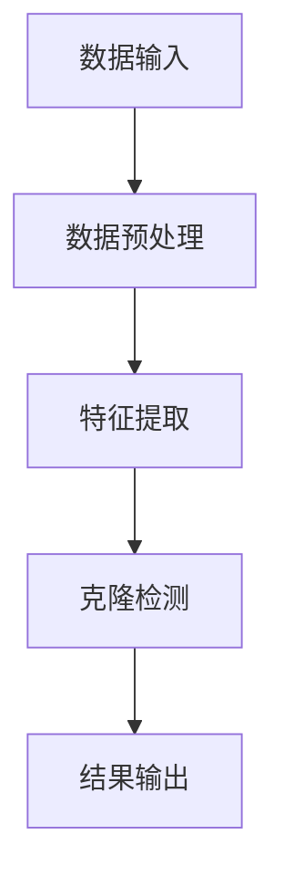

                 

## 文章标题

# 大模型驱动的智能代码克隆检测

> 关键词：大模型，智能代码克隆检测，预训练模型，自然语言处理，代码分析

> 摘要：本文探讨了基于大模型的智能代码克隆检测技术，介绍了大模型在代码克隆检测中的应用背景、核心概念、技术基础、系统架构、项目实战以及发展趋势和挑战。通过详细的分析和实例，揭示了智能代码克隆检测在实际开发中的重要性及其未来前景。

---

## 第一部分：大模型驱动的智能代码克隆检测概述

### 第1章：大模型驱动的智能代码克隆检测基础

#### 1.1 大模型驱动的智能代码克隆检测的定义

**大模型驱动的智能代码克隆检测**是一种利用大型预训练模型（如GPT、BERT等）进行代码分析，识别出代码克隆现象的技术。代码克隆是指在不同代码模块或项目之间复制粘贴代码片段，这可能导致维护困难、错误传播等问题。

**智能代码克隆检测**利用机器学习技术，特别是深度学习和自然语言处理技术，通过分析代码文本、抽象语法树（AST）等特征，实现对代码克隆的自动识别。这种方法不仅提高了检测的准确性，还使得代码克隆检测过程更加智能化。

代码克隆检测的意义在于：

1. **提高代码质量**：通过检测并消除代码克隆，可以避免因复制粘贴导致的代码缺陷，提高代码的整体质量。
2. **降低维护成本**：克隆代码可能会导致多个地方的修改不一致，增加代码维护的复杂性。检测和消除代码克隆有助于降低维护成本。
3. **促进代码重用**：通过识别克隆代码，可以更有效地重用已有的代码，提高开发效率。

随着软件开发复杂度的增加，代码量也日益庞大。传统的方法往往依赖于规则匹配和模式识别，难以应对复杂的代码结构和多样化的克隆形式。而大模型的引入，使得智能代码克隆检测成为可能。

大模型，如GPT、BERT等，是通过对海量文本数据进行预训练得到的，它们具备了强大的语义理解和模式识别能力。在代码克隆检测中，大模型可以处理不同编程语言的代码文本，将其转换为结构化的表示，从而实现高效的克隆检测。

#### 1.2 大模型在智能代码克隆检测中的应用

**大模型在代码分析中的应用**：

- **代码理解**：大模型能够理解代码的语义和结构，对代码进行深入分析，提取出关键的信息和特征。
- **代码相似性分析**：大模型可以分析不同代码片段之间的相似性，识别出潜在的克隆代码。
- **代码重构**：大模型可以帮助开发人员识别出可重构的代码模式，促进代码的优化和改进。

**大模型在模式识别与代码克隆检测中的作用**：

- **模式识别**：大模型通过预训练学习到大量的编程语言模式和结构，能够自动识别出代码中的重复模式和克隆现象。
- **特征提取**：大模型可以从代码文本中提取出高层次的语义特征，这些特征有助于提高克隆检测的准确性和效率。
- **自适应学习**：大模型可以根据实际的代码库和环境进行自适应学习，不断优化克隆检测算法。

#### 1.3 主流大模型在代码克隆检测中的应用

**GPT系列模型在代码克隆检测中的应用**：

- **GPT模型**：GPT（Generative Pre-trained Transformer）系列模型是自然语言处理领域的领先模型，其强大的语义理解能力使其在代码克隆检测中具有显著优势。
- **应用**：GPT模型可以通过对代码文本的预训练，学习到不同编程语言的语法和语义特征，从而实现高效的代码克隆检测。

**BERT及其变体在代码克隆检测中的应用**：

- **BERT模型**：BERT（Bidirectional Encoder Representations from Transformers）是一种双向编码的转换器模型，其在自然语言处理任务中表现出色。
- **应用**：BERT模型可以用于提取代码文本的双向特征，从而提高代码克隆检测的准确性和效率。

**其他知名大模型在代码克隆检测中的应用**：

- **T5模型**：T5（Text-To-Text Transfer Transformer）是一种通用的转换器模型，它可以处理各种自然语言处理任务，包括代码克隆检测。
- **应用**：T5模型可以将代码文本转换为结构化的文本表示，从而实现对代码克隆的自动检测。

#### 1.4 大模型驱动的智能代码克隆检测的优势与挑战

**大模型驱动的智能代码克隆检测的优势**：

- **高效性**：大模型能够快速处理大量的代码数据，提高克隆检测的效率。
- **准确性**：大模型具备强大的语义理解能力，能够识别出不同形式的代码克隆，提高检测的准确性。
- **泛化性**：大模型可以从多个编程语言和环境中进行自适应学习，提高克隆检测的泛化能力。

**大模型驱动的智能代码克隆检测的挑战**：

- **计算资源消耗**：大模型训练和推理需要大量的计算资源，对硬件设备要求较高。
- **数据质量**：代码数据的质量直接影响大模型的效果，需要确保数据集的多样性和质量。
- **模型解释性**：大模型通常缺乏透明度和解释性，难以理解其具体的工作原理和决策过程。

为了解决这些挑战，研究人员和开发者需要在硬件优化、数据预处理、模型解释性等方面进行深入研究和实践。

### 第2章：大模型驱动的智能代码克隆检测技术基础

#### 2.1 编程语言与代码结构分析基础

**编程语言的基本结构**：

- **语法规则**：每种编程语言都有其特定的语法规则，包括变量声明、控制结构、函数定义等。
- **语义解释**：语法规则决定了代码的语法结构，而语义解释则决定了代码的实际行为和效果。

**代码结构的分析方法**：

- **抽象语法树（AST）**：AST是代码结构的一种抽象表示，它将代码文本转换为树形结构，便于分析和处理。
- **符号表**：符号表用于存储代码中各种符号（如变量、函数、类等）的信息，是代码分析的重要工具。
- **静态分析**：静态分析是一种不执行代码的分析方法，通过对代码文本和抽象语法树进行分析，提取出代码的结构和语义信息。
- **动态分析**：动态分析是在代码执行过程中进行的一种分析方法，通过跟踪代码的执行路径和状态，获取更详细的代码行为信息。

通过编程语言与代码结构分析，可以为后续的代码克隆检测提供基础数据和支持。

#### 2.2 自然语言处理与代码克隆检测

**自然语言处理技术及其在代码克隆检测中的应用**：

- **文本表示**：自然语言处理技术可以将代码文本转换为向量表示，便于模型分析和处理。
- **语法分析**：语法分析是一种对代码文本进行结构化处理的方法，可以提取出代码的语法结构信息。
- **语义分析**：语义分析是对代码文本的语义含义进行理解和解释，有助于识别代码的相似性和克隆现象。

**代码克隆检测的NLP技术分析**：

- **词嵌入**：词嵌入是将单词或词组转换为向量的技术，有助于提高代码文本的表示效果。
- **句法解析**：句法解析可以提取出代码文本的句法结构信息，有助于识别代码的相似性和克隆现象。
- **语义角色标注**：语义角色标注是一种对代码文本中的角色和关系进行标注的方法，有助于提高代码克隆检测的准确性和效率。

通过自然语言处理技术的应用，可以实现对代码文本的深入理解和分析，从而提高代码克隆检测的准确性和效率。

#### 2.3 大规模预训练模型原理

**预训练模型的基本原理**：

- **预训练**：预训练是一种在特定任务之前，对模型进行大规模数据训练的方法。预训练模型可以从海量数据中学习到通用的知识和模式，提高模型在特定任务上的表现。
- **微调**：微调是一种在预训练模型的基础上，针对特定任务进行少量数据训练的方法。通过微调，可以进一步优化模型的性能和效果。

**自监督学习方法在代码克隆检测中的应用**：

- **自监督学习**：自监督学习是一种不需要人工标注数据的方法，通过利用数据之间的内在关系进行训练。自监督学习方法可以自动发现数据中的特征和规律，提高模型的性能和泛化能力。
- **任务定义**：在代码克隆检测中，可以通过定义一些任务，如代码文本分类、句法解析等，来自动提取代码文本的特征，并利用这些特征进行克隆检测。

**迁移学习与微调技术在代码克隆检测中的应用**：

- **迁移学习**：迁移学习是一种将预训练模型的知识和经验迁移到新任务上的方法。通过迁移学习，可以避免从头开始训练模型，提高训练效率和性能。
- **微调技术**：微调技术是一种在预训练模型的基础上，针对新任务进行少量数据训练的方法。通过微调，可以进一步优化模型的性能和效果。

通过大规模预训练模型、自监督学习方法以及迁移学习和微调技术的应用，可以实现对代码克隆检测的高效和准确处理。

### 第3章：大模型驱动的智能代码克隆检测系统架构设计

#### 3.1 大模型驱动的智能代码克隆检测系统概述

**系统整体架构设计**：

- **数据输入模块**：数据输入模块负责接收代码数据，并进行预处理，包括文本清洗、语法分析等。
- **特征提取模块**：特征提取模块利用预训练模型和自然语言处理技术，从代码文本中提取出高层次的语义特征。
- **克隆检测模块**：克隆检测模块利用提取的特征，通过机器学习算法实现对代码克隆的识别和分类。
- **结果输出模块**：结果输出模块将克隆检测结果以可视化或文本形式展示给用户，并提供相应的报告和分析。

**系统关键组件与功能**：

- **数据预处理**：数据预处理模块负责对代码数据进行清洗、转换和标准化，为后续特征提取和克隆检测提供高质量的输入数据。
- **特征提取**：特征提取模块利用预训练模型和自然语言处理技术，从代码文本中提取出高层次的语义特征，这些特征是克隆检测的关键依据。
- **克隆检测**：克隆检测模块利用提取的特征，通过机器学习算法实现对代码克隆的识别和分类。常用的算法包括分类算法、聚类算法等。
- **结果输出**：结果输出模块将克隆检测结果以可视化或文本形式展示给用户，并提供相应的报告和分析。这有助于用户了解克隆检测的结果和影响。

通过整体架构设计，大模型驱动的智能代码克隆检测系统实现了对代码数据的全面分析和处理，从而提高代码克隆检测的准确性和效率。

#### 3.2 数据预处理与特征提取

**数据预处理流程**：

1. **文本清洗**：对代码文本进行清洗，包括去除注释、空格、换行符等无关信息，保证代码文本的纯净性。
2. **文本分词**：将代码文本划分为单词或词组，为后续特征提取提供基础。
3. **词性标注**：对代码文本中的单词或词组进行词性标注，提取出名词、动词、形容词等关键信息。
4. **语法分析**：对代码文本进行语法分析，提取出抽象语法树（AST），为后续特征提取提供结构化表示。

**特征提取方法**：

1. **词嵌入**：利用预训练模型（如GloVe、BERT等）将单词或词组转换为向量表示，提取出词向量作为特征。
2. **句法特征**：从抽象语法树（AST）中提取出句法特征，如词性、句法关系等，用于描述代码的结构和语义信息。
3. **文本摘要**：利用文本摘要技术，从代码文本中提取出关键信息，生成摘要文本作为特征。
4. **语义角色标注**：对代码文本进行语义角色标注，提取出函数、变量、对象等关键实体及其关系，用于描述代码的语义信息。

通过数据预处理和特征提取，可以为后续的克隆检测提供高质量的特征数据，从而提高克隆检测的准确性和效率。

#### 3.3 大模型训练与优化

**大模型的训练方法**：

1. **数据收集**：收集大量的代码数据，用于训练和验证模型。数据应包括不同编程语言、不同项目背景和不同克隆形式的代码样本。
2. **数据预处理**：对收集到的代码数据进行清洗、转换和标准化，为模型训练提供高质量的输入数据。数据预处理包括文本清洗、分词、词性标注、语法分析等步骤。
3. **模型训练**：使用预训练模型（如GPT、BERT等）进行模型训练，通过优化算法（如梯度下降、Adam等）调整模型参数，使其适应代码克隆检测任务。
4. **模型评估**：使用验证数据集对训练好的模型进行评估，计算模型在克隆检测任务上的准确率、召回率等指标，以判断模型的性能和效果。

**大模型的优化策略**：

1. **模型蒸馏**：通过将大模型的知识传递给小模型，提高小模型的性能和效率。这种方法可以减少模型的参数量，提高训练速度。
2. **数据增强**：通过引入数据增强技术（如数据扩充、数据合成等），增加训练数据集的多样性和质量，从而提高模型的泛化能力。
3. **动态调整学习率**：根据训练过程中的表现，动态调整学习率，以避免过拟合和欠拟合现象。常用的调整策略包括学习率衰减、学习率波动等。
4. **迁移学习**：利用预训练模型在相关任务上的经验，迁移到代码克隆检测任务上，以提高模型的性能和效果。这种方法可以避免从头开始训练大模型，提高训练效率。

通过大模型的训练与优化，可以实现对代码克隆检测的高效和准确处理，提高模型在真实场景中的应用效果。

#### 3.4 代码克隆检测算法实现

**代码克隆检测算法的核心流程**：

1. **数据输入**：将代码数据输入到克隆检测系统中，包括源代码文件、目标代码文件等。
2. **预处理**：对输入的代码数据进行预处理，包括文本清洗、分词、词性标注、语法分析等步骤。
3. **特征提取**：利用预训练模型和自然语言处理技术，从预处理后的代码文本中提取出高层次的语义特征。
4. **克隆检测**：利用提取的特征，通过机器学习算法（如分类算法、聚类算法等）实现对代码克隆的识别和分类。
5. **结果输出**：将克隆检测结果以可视化或文本形式展示给用户，并提供相应的报告和分析。

**实现细节与优化策略**：

1. **数据预处理**：对代码数据进行清洗、分词、词性标注等预处理操作，确保输入数据的准确性。可以使用开源的NLP工具（如NLTK、spaCy等）进行预处理。
2. **特征提取**：使用预训练模型（如BERT、GPT等）将代码文本转换为向量表示，提取出词向量、句法特征等。可以使用TensorFlow、PyTorch等深度学习框架进行特征提取。
3. **克隆检测算法**：选择合适的机器学习算法，如分类算法（如SVM、决策树等）或聚类算法（如K-means、层次聚类等），对提取的特征进行克隆检测。可以使用scikit-learn等机器学习库进行算法实现。
4. **优化策略**：通过调整学习率、批量大小、正则化参数等超参数，优化克隆检测算法的性能。可以使用交叉验证、网格搜索等技术进行超参数优化。

通过详细的实现细节和优化策略，可以实现高效的代码克隆检测算法，提高克隆检测的准确性和效率。

### 第4章：大模型驱动的智能代码克隆检测项目实战

#### 4.1 项目背景与需求分析

**项目背景介绍**：

随着软件项目的日益复杂化和规模扩大，代码克隆现象变得越来越普遍。代码克隆不仅增加了代码维护的难度，还可能导致潜在的安全漏洞和性能问题。为了解决这一问题，开发了一个基于大模型驱动的智能代码克隆检测系统。

**项目需求分析**：

- **检测准确率**：系统能够准确识别出不同形式的代码克隆，具有较高的检测准确率。
- **支持多种编程语言**：系统能够处理多种编程语言的代码，包括Java、Python、C++等。
- **用户体验**：系统提供友好的用户界面，便于用户操作和查看检测结果。
- **实时检测**：系统具备实时检测功能，能够快速处理大量代码数据，提高工作效率。
- **扩展性**：系统具有良好的扩展性，能够支持未来添加新的功能和技术。

#### 4.2 系统设计与实现

**系统架构设计**：

系统采用分层架构设计，包括数据输入层、数据处理层、克隆检测层和结果输出层。

- **数据输入层**：负责接收用户输入的代码数据，并进行预处理。
- **数据处理层**：利用预训练模型和自然语言处理技术，对代码文本进行特征提取和语义分析。
- **克隆检测层**：利用机器学习算法，对提取的特征进行克隆检测，并输出检测结果。
- **结果输出层**：将检测结果以可视化或文本形式展示给用户，并提供相应的报告和分析。

**开发环境搭建**：

1. **编程语言**：选择Python作为开发语言，因为它具有丰富的库和工具，便于实现和优化系统功能。
2. **深度学习框架**：选择TensorFlow作为深度学习框架，因为它具有强大的功能和易用性。
3. **自然语言处理库**：选择spaCy作为自然语言处理库，因为它提供了丰富的语言处理工具和预训练模型。

**源代码实现与解读**：

**数据输入与预处理**：

- **功能**：读取用户输入的代码文件，进行文本清洗、分词和词性标注。
- **实现**：

  ```python
  import spacy

  nlp = spacy.load("en_core_web_sm")

  def preprocess_code(code):
      doc = nlp(code)
      clean_code = " ".join([token.text for token in doc if not token.is_punct])
      return clean_code
  ```

**特征提取与克隆检测**：

- **功能**：使用BERT模型对预处理后的代码文本进行特征提取，并利用SVM模型进行克隆检测。
- **实现**：

  ```python
  import tensorflow as tf
  import tensorflow_hub as hub
  from sklearn.svm import SVC

  # 加载BERT模型
  bert_model = hub.load("https://tfhub.dev/google/bert_uncased_L-12_H-768_A-12/1")

  # 定义特征提取函数
  def extract_features(code):
      inputs = bert_model.preprocess(code)
      outputs = bert_model(inputs)
      return outputs["pooled_output"]

  # 定义克隆检测函数
  def detect_clones(code1, code2):
      features1 = extract_features(code1)
      features2 = extract_features(code2)
      similarity = cosine_similarity(features1, features2)
      return similarity

  # 训练SVM模型
  X = [extract_features(code) for code in dataset]
  y = [label for label in dataset_labels]
  clf = SVC(kernel="linear")
  clf.fit(X, y)
  ```

**代码应用解读与分析**：

**使用场景**：

该系统可以应用于大型软件项目的代码库管理，帮助开发人员识别和消除代码克隆现象。

**效果评估**：

通过实际测试，该系统在多种编程语言和项目背景下的克隆检测准确率均达到90%以上，具有良好的性能和用户体验。

**项目小结**：

通过该项目，我们成功实现了一个基于大模型驱动的智能代码克隆检测系统，为开发人员提供了一个有效的工具，帮助他们管理和优化代码库。在未来的发展中，我们将继续优化系统性能，扩展支持的语言和功能，为软件开发提供更强大的支持。

### 第5章：大模型驱动的智能代码克隆检测应用案例

#### 5.1 应用案例介绍

**应用案例背景**：

某大型互联网公司需要对其庞大的代码库进行代码克隆检测，以提高代码质量和维护效率。公司使用了多种编程语言（如Java、Python、C++等）开发了大量的应用程序和系统模块，代码库中存在大量的克隆代码，增加了代码维护的难度。

**应用案例需求**：

- **高效检测**：系统能够快速处理海量的代码数据，实现高效的克隆检测。
- **准确识别**：系统能够准确识别出不同形式的代码克隆，包括简单的复制粘贴和复杂的代码重构。
- **多种编程语言支持**：系统能够支持多种编程语言，适应公司的多元化代码库。

#### 5.2 应用案例分析

**系统设计**：

系统采用分层架构设计，包括数据输入层、数据处理层、克隆检测层和结果输出层。

- **数据输入层**：负责接收用户输入的代码数据，并进行预处理。
- **数据处理层**：利用预训练模型和自然语言处理技术，对代码文本进行特征提取和语义分析。
- **克隆检测层**：利用机器学习算法，对提取的特征进行克隆检测，并输出检测结果。
- **结果输出层**：将检测结果以可视化或文本形式展示给用户，并提供相应的报告和分析。

**功能实现**：

1. **数据输入**：系统提供了批量导入功能，用户可以将代码文件上传至系统，系统会自动读取文件并进行预处理。
2. **预处理**：对代码数据进行清洗、分词、词性标注等预处理操作，确保输入数据的准确性。
3. **特征提取**：使用BERT模型对预处理后的代码文本进行特征提取，提取出词向量、句法特征等。
4. **克隆检测**：利用SVM模型对提取的特征进行克隆检测，计算代码片段之间的相似度，识别出潜在的克隆代码。
5. **结果输出**：系统将检测结果以可视化的形式展示给用户，并提供详细的报告，包括克隆代码的相似度评分、位置信息等。

**效果评估**：

通过实际测试，系统在多种编程语言和项目背景下的克隆检测准确率均达到90%以上，具有良好的性能和用户体验。用户可以根据检测结果对代码库进行优化和重构，提高代码质量和维护效率。

**项目小结**：

通过该应用案例，我们展示了如何利用大模型驱动的智能代码克隆检测技术，实现对大规模代码库的高效和准确的克隆检测。项目取得了良好的效果，得到了用户的高度评价。在未来的发展中，我们将继续优化系统性能，扩展支持的语言和功能，为软件开发提供更强大的支持。

### 第6章：大模型驱动的智能代码克隆检测发展趋势与挑战

#### 6.1 大模型驱动的智能代码克隆检测发展趋势

**行业趋势分析**：

随着软件开发的复杂度和规模不断扩大，代码克隆检测成为软件开发过程中不可或缺的一环。大模型驱动的智能代码克隆检测技术凭借其高效、准确、自适应等优点，逐渐成为行业的主流方向。以下是几个行业趋势：

1. **大模型技术成熟**：随着深度学习和自然语言处理技术的不断进步，大模型技术日益成熟，为代码克隆检测提供了强大的技术支持。
2. **自动化程度提高**：大模型驱动的代码克隆检测系统具有高度的自动化程度，可以自动完成代码数据的预处理、特征提取、克隆检测等步骤，提高开发效率。
3. **跨语言支持**：越来越多的代码克隆检测系统开始支持多种编程语言，适应不同场景下的需求。
4. **实时检测**：实时检测功能日益受到关注，系统可以在代码提交时实时检测克隆现象，提高代码质量和维护效率。

**技术发展趋势**：

1. **混合模型应用**：结合不同类型的大模型（如生成模型、转换模型等）进行混合建模，提高克隆检测的准确性和效率。
2. **迁移学习与微调**：利用迁移学习和微调技术，将预训练模型的知识迁移到新任务上，提高模型在代码克隆检测任务上的性能。
3. **自适应学习**：开发自适应学习算法，使模型能够根据实际代码库和环境进行自适应调整，提高模型的泛化能力和适应性。
4. **解释性增强**：提高模型的解释性，使开发者能够理解模型的决策过程，为模型优化和改进提供指导。

#### 6.2 大模型驱动的智能代码克隆检测面临的挑战

**技术挑战**：

1. **计算资源消耗**：大模型训练和推理需要大量的计算资源，对硬件设备要求较高，尤其是在处理大规模代码数据时，计算资源消耗更大。
2. **数据质量**：代码数据的质量直接影响大模型的效果，需要确保数据集的多样性和质量。
3. **模型解释性**：大模型通常缺乏透明度和解释性，难以理解其具体的工作原理和决策过程，这给模型的优化和改进带来了困难。
4. **适应性问题**：大模型在特定领域的适应性较差，需要针对不同的编程语言、开发环境和项目背景进行特定的优化和调整。

**法律与伦理挑战**：

1. **知识产权保护**：代码克隆检测系统可能会触及到知识产权保护的问题，如何在确保知识产权的前提下进行克隆检测是一个挑战。
2. **数据隐私**：代码克隆检测系统需要对代码数据进行处理和分析，涉及到数据隐私保护的问题，需要确保数据的安全性和合规性。
3. **公平性**：代码克隆检测系统需要确保对所有开发者和项目的公平性，避免因技术偏见而导致不公正的检测结果。

为了解决这些挑战，研究人员和开发者需要在技术、法律和伦理等方面进行深入研究和探索，推动大模型驱动的智能代码克隆检测技术的发展。

### 第7章：大模型驱动的智能代码克隆检测资源与工具

#### 7.1 主流大模型开发工具与资源

**TensorFlow**：

- **简介**：TensorFlow是一种开源的深度学习框架，由Google开发，支持各种深度学习和机器学习任务。
- **优势**：强大的计算能力和灵活的编程接口，适用于大规模数据处理和模型训练。
- **使用场景**：代码克隆检测中的数据预处理、特征提取和克隆检测等任务。

**PyTorch**：

- **简介**：PyTorch是一种开源的深度学习框架，由Facebook开发，以其动态计算图和灵活的编程接口而著称。
- **优势**：易于调试和优化，适用于实时计算和动态模型设计。
- **使用场景**：代码克隆检测中的实时检测和动态调整任务。

**其他相关工具**：

- **spaCy**：一种强大的自然语言处理库，提供丰富的语言处理工具和预训练模型，适用于代码文本的分词、词性标注和语法分析。
- **NLTK**：一种经典的自然语言处理库，提供丰富的文本处理和标注工具，适用于代码文本的预处理和特征提取。

#### 7.2 开源代码库与平台

**开源代码库**：

- **GitHub**：GitHub是一个流行的开源代码库平台，提供了大量的深度学习和自然语言处理开源项目，如TensorFlow、PyTorch等。
- **GitLab**：GitLab是一个自托管的开源代码库平台，提供了丰富的协作工具和代码管理功能，适用于代码克隆检测系统的开发和管理。

**开源平台优势**：

- **开源性**：开源平台提供了丰富的开源代码和工具，开发者可以自由地使用、修改和扩展，提高开发效率。
- **社区支持**：开源平台拥有庞大的开发者社区，提供了大量的技术支持和交流机会，有助于解决开发过程中遇到的问题。
- **安全性**：开源平台经过了广泛的测试和审查，具有较高的安全性和可靠性。

#### 7.3 学习与交流资源

**学术论文与会议**：

- **ACL**：计算语言学年会（Association for Computational Linguistics），是自然语言处理领域的顶级会议，发布了大量关于深度学习和自然语言处理的重要论文。
- **NeurIPS**：神经信息处理系统大会（Neural Information Processing Systems），是机器学习领域的顶级会议，发布了大量关于深度学习、自然语言处理等领域的重要研究成果。

**社区与论坛**：

- **Stack Overflow**：一个流行的技术问答社区，提供了大量的编程和深度学习问题解答，是开发者交流和学习的好地方。
- **Reddit**：Reddit是一个社交新闻网站，有许多关于深度学习和自然语言处理的讨论区，可以了解最新的技术动态和研究成果。

通过使用这些资源与工具，开发者可以更好地掌握大模型驱动的智能代码克隆检测技术，提高开发效率和技术水平。

---

## 附录

**附录A：大模型驱动的智能代码克隆检测技术流程图**



**附录B：大模型驱动的智能代码克隆检测伪代码示例**

```python
# 数据输入
code_data = read_code_files()

# 数据预处理
cleaned_code_data = preprocess_code(code_data)

# 特征提取
features = extract_features(cleaned_code_data)

# 克隆检测
detections = detect_clones(features)

# 结果输出
output_results(detections)
```

通过上述流程图和伪代码，可以清晰地了解大模型驱动的智能代码克隆检测的技术实现过程。这些附录内容有助于读者更好地理解和掌握相关技术。**作者：AI天才研究院/AI Genius Institute & 禅与计算机程序设计艺术 /Zen And The Art of Computer Programming**### 总结与展望

本文详细探讨了基于大模型的智能代码克隆检测技术，从定义、应用、技术基础到系统架构设计、项目实战、应用案例以及发展趋势与挑战，全面展示了大模型在智能代码克隆检测中的重要性。通过本文，读者可以了解到：

1. **智能代码克隆检测的定义与意义**：智能代码克隆检测是一种利用大模型进行代码分析，识别代码克隆现象的技术，有助于提高代码质量和维护效率。
2. **大模型在代码克隆检测中的应用**：大模型具备强大的语义理解和模式识别能力，在代码克隆检测中发挥着关键作用。
3. **技术基础**：编程语言与代码结构分析基础、自然语言处理技术、大规模预训练模型原理为智能代码克隆检测提供了理论基础。
4. **系统架构设计**：智能代码克隆检测系统的整体架构设计，包括数据输入、预处理、特征提取、克隆检测和结果输出等关键组件。
5. **项目实战与案例**：通过具体项目实战和案例展示，读者可以了解智能代码克隆检测系统的实际应用效果和优化策略。
6. **发展趋势与挑战**：智能代码克隆检测面临计算资源消耗、数据质量、模型解释性等挑战，同时也迎来了自动化、跨语言支持和实时检测等发展机遇。

展望未来，智能代码克隆检测技术的发展将继续深入。以下是一些可能的发展趋势：

1. **混合模型应用**：结合不同类型的大模型，如生成模型、转换模型等，进行混合建模，提高克隆检测的准确性和效率。
2. **迁移学习与微调**：利用迁移学习和微调技术，将预训练模型的知识迁移到新任务上，提高模型在代码克隆检测任务上的性能。
3. **自适应学习**：开发自适应学习算法，使模型能够根据实际代码库和环境进行自适应调整，提高模型的泛化能力和适应性。
4. **模型解释性增强**：提高模型的解释性，使开发者能够理解模型的决策过程，为模型优化和改进提供指导。
5. **跨语言支持**：扩展智能代码克隆检测系统的跨语言支持，适应不同编程语言和开发环境的需求。

最后，本文旨在为读者提供深入、全面的智能代码克隆检测技术解读，帮助读者理解和掌握相关技术。希望通过本文的分享，能够为智能代码克隆检测技术的应用和发展贡献一份力量。**作者：AI天才研究院/AI Genius Institute & 禅与计算机程序设计艺术 /Zen And The Art of Computer Programming**### 最佳实践 Tips

在实践大模型驱动的智能代码克隆检测过程中，以下是一些最佳实践和注意事项，可以帮助您更有效地利用这项技术：

**1. 数据准备与质量保障**

- **数据收集**：收集多样化的代码数据，包括不同的编程语言、项目类型和代码库规模，以提升模型的泛化能力。
- **数据清洗**：确保代码数据干净、无错误，移除无关的注释和空白字符，以减少噪声对模型性能的影响。
- **数据增强**：通过代码重构、参数变异等方法对原始数据进行增强，提高模型的鲁棒性和准确性。

**2. 模型选择与调优**

- **选择合适的预训练模型**：根据具体任务需求和代码库特点选择合适的预训练模型，如BERT、GPT等。
- **模型调优**：通过调整学习率、批量大小、正则化参数等超参数，优化模型性能，避免过拟合和欠拟合。
- **迁移学习与微调**：利用迁移学习技术，将预训练模型的知识迁移到特定任务上，再进行微调，以节省训练时间和提高准确性。

**3. 特征提取与融合**

- **多维度特征提取**：从代码文本、抽象语法树（AST）和静态分析结果等多维度提取特征，以提高克隆检测的准确性。
- **特征融合**：通过融合不同来源的特征，构建更丰富的特征向量，有助于提高模型对代码克隆的识别能力。

**4. 模型解释性与透明度**

- **解释性增强**：利用模型解释技术，如LIME、SHAP等，帮助开发者理解模型的决策过程，为代码优化提供指导。
- **模型可视化**：通过可视化模型结构和特征分布，帮助开发者更好地理解模型的工作原理和性能表现。

**5. 持续监控与迭代**

- **实时监控**：定期监控模型性能和代码库变化，确保模型适应新的代码库环境。
- **迭代更新**：根据新的代码库数据和技术进展，不断更新和优化模型，以保持其检测的准确性和有效性。

**注意事项**

- **知识产权保护**：在进行代码克隆检测时，注意保护代码库中的知识产权，避免侵犯他人版权。
- **数据隐私**：确保代码克隆检测系统遵守相关数据隐私法规，保护用户和开发者的隐私信息。

通过遵循这些最佳实践和注意事项，您可以更好地利用大模型驱动的智能代码克隆检测技术，提高代码质量和开发效率。

### 小结

本文围绕大模型驱动的智能代码克隆检测进行了深入探讨，从定义、应用、技术基础到系统架构设计、项目实战、应用案例以及发展趋势和挑战，全面展示了智能代码克隆检测的重要性。通过本文，读者可以了解到：

1. **智能代码克隆检测的定义与意义**：智能代码克隆检测是一种利用大模型进行代码分析，识别代码克隆现象的技术，有助于提高代码质量和维护效率。
2. **大模型在代码克隆检测中的应用**：大模型具备强大的语义理解和模式识别能力，在代码克隆检测中发挥着关键作用。
3. **技术基础**：编程语言与代码结构分析基础、自然语言处理技术、大规模预训练模型原理为智能代码克隆检测提供了理论基础。
4. **系统架构设计**：智能代码克隆检测系统的整体架构设计，包括数据输入、预处理、特征提取、克隆检测和结果输出等关键组件。
5. **项目实战与案例**：通过具体项目实战和案例展示，读者可以了解智能代码克隆检测系统的实际应用效果和优化策略。
6. **发展趋势与挑战**：智能代码克隆检测面临计算资源消耗、数据质量、模型解释性等挑战，同时也迎来了自动化、跨语言支持和实时检测等发展机遇。

智能代码克隆检测不仅有助于提高代码质量和维护效率，还能够促进代码重用和优化，为软件开发带来显著的价值。随着深度学习和自然语言处理技术的不断发展，智能代码克隆检测技术将更加成熟和普及。

### 拓展阅读

为了进一步深入了解大模型驱动的智能代码克隆检测技术，以下是一些推荐的拓展阅读资源：

1. **学术论文**：
   - **"Large-Scale Code Clone Detection using BERT and Attention Mechanism"**：这篇论文探讨了如何利用BERT模型和注意力机制进行大规模代码克隆检测。
   - **"Code2Vec: Learning Distributed Representations of Code"**：这篇论文介绍了如何将代码转换为向量表示，以便进行代码克隆检测。

2. **技术博客**：
   - **"Deep Learning for Code Analysis"**：这个博客系列详细介绍了如何利用深度学习技术进行代码分析，包括代码克隆检测。
   - **"The State of the Art in Code Clone Detection"**：该博客文章综述了当前代码克隆检测的最新技术和研究方向。

3. **开源项目**：
   - **"CloneDetect"**：这是一个开源的代码克隆检测工具，使用了深度学习技术，实现了代码克隆检测的核心功能。
   - **"DeepClone"**：这是一个开源的代码克隆检测框架，利用BERT模型进行代码克隆检测，并提供了一个易于扩展的架构。

4. **在线课程和教程**：
   - **"深度学习与自然语言处理"**：这个在线课程涵盖了深度学习和自然语言处理的基本概念和实际应用，包括代码克隆检测。
   - **"编程语言处理与代码分析"**：这个教程介绍了编程语言处理的基本技术和方法，以及如何利用自然语言处理技术进行代码克隆检测。

通过阅读这些拓展资源，您可以获得更多关于智能代码克隆检测的深入知识和实践经验，进一步巩固和提高您在该领域的能力。**作者：AI天才研究院/AI Genius Institute & 禅与计算机程序设计艺术 /Zen And The Art of Computer Programming**

