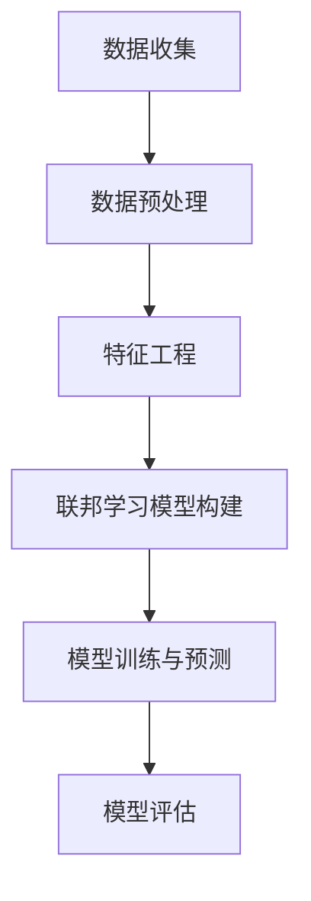

                 

### 文章标题

《联邦学习在跨机构医疗数据分析中的隐私保护》

### 关键词

联邦学习、医疗数据分析、隐私保护、跨机构数据整合、加密算法、同态加密

### 摘要

本文旨在探讨联邦学习在跨机构医疗数据分析中的应用及其隐私保护机制。随着医疗数据量的不断增加，如何有效整合跨机构数据并保护患者隐私成为亟待解决的问题。联邦学习作为一种分布式机器学习方法，能够在不共享原始数据的情况下实现模型训练，从而为医疗数据分析提供了一种隐私保护的解决方案。本文首先介绍了联邦学习的概念、原理及其在医疗数据分析中的重要性，然后详细分析了联邦学习的核心算法，如合同学习、安全聚合和加密算法。随后，本文通过具体案例展示了联邦学习在疾病预测和药物研发中的应用，并探讨了其在医疗数据共享中的挑战与解决方案。最后，本文对未来联邦学习在医疗领域的发展趋势进行了展望。

---

## 第1章：引言

### 1.1 联邦学习的概念

联邦学习（Federated Learning）是一种分布式机器学习方法，其核心思想是多个数据持有方在不共享数据的情况下，通过协作训练共享模型。这种方法的提出，主要是为了解决数据隐私和安全的问题。在联邦学习的框架下，每个数据持有方都保留其本地数据，不进行数据共享，而是通过加密通信和模型参数的交换来共同训练出一个全局模型。

### 1.2 跨机构医疗数据分析的重要性

跨机构医疗数据分析的重要性不言而喻。随着医疗信息化程度的提高，各个医疗机构积累了大量的医疗数据。这些数据不仅包括患者的临床记录，还包括基因组数据、医疗影像数据等。通过跨机构的数据整合，可以更全面地了解患者的健康状况，提高疾病诊断的准确性，加速药物研发进程。

### 1.3 隐私保护的需求与挑战

医疗数据具有高度敏感性，涉及患者隐私和个人健康信息。在跨机构数据整合过程中，如何保护患者隐私成为一大挑战。传统的数据共享方式往往需要将数据上传到中央服务器，这可能会导致数据泄露的风险。而联邦学习通过本地训练和模型参数的共享，避免了数据在传输过程中的泄露风险，从而提供了一种有效的隐私保护解决方案。

### 1.4 本书的目标与结构

本书的目标是详细探讨联邦学习在跨机构医疗数据分析中的应用及其隐私保护机制。具体包括：

1. **联邦学习的基本原理和流程**：介绍联邦学习的定义、基本原理和实现流程。
2. **联邦学习在医疗数据分析中的应用**：分析联邦学习在疾病预测、药物研发等医疗数据分析中的应用场景。
3. **联邦学习的核心算法**：详细介绍合同学习、安全聚合和加密算法等核心算法。
4. **联邦学习的隐私保护机制**：探讨联邦学习在医疗数据隐私保护中的应用，包括匿名化处理和隐私保护模型设计。
5. **联邦学习在医疗数据共享中的挑战与解决方案**：分析联邦学习在医疗数据共享中面临的数据质量、法律和伦理等挑战，并提出相应的解决方案。
6. **案例研究**：通过实际案例展示联邦学习在医疗数据分析中的应用效果。
7. **未来展望**：展望联邦学习在医疗领域的发展趋势。

## 第2章：联邦学习基础

### 2.1 联邦学习的原理

联邦学习的核心思想是分布式协作。其基本流程如下：

1. **初始化全局模型**：将一个全局模型初始化，并分配给各个数据持有方。
2. **本地训练**：各个数据持有方使用本地数据对全局模型进行训练，生成本地更新模型。
3. **模型更新**：各个数据持有方将本地更新模型发送给中央服务器。
4. **全局模型更新**：中央服务器对收到的本地更新模型进行聚合，更新全局模型。
5. **预测结果**：使用更新后的全局模型进行预测。

### 2.2 联邦学习在医疗数据分析中的应用场景

联邦学习在医疗数据分析中具有广泛的应用场景，主要包括：

1. **跨机构数据整合**：通过联邦学习，可以实现不同医疗机构之间数据的高效整合，从而提高数据分析的全面性和准确性。
2. **患者隐私保护**：联邦学习通过本地训练和模型参数的共享，避免了原始数据在传输过程中的泄露风险，从而保护了患者隐私。
3. **医疗决策支持**：通过联邦学习，可以对跨机构的数据进行深入分析，为医疗决策提供科学依据，从而提高医疗服务的质量。

## 第3章：联邦学习核心算法

### 3.1 合同学习算法

合同学习（Simulated Contract Learning）是联邦学习中的一种核心算法，其基本原理是通过模拟合同的方式，确保各个数据持有方在本地训练模型时的公平性和一致性。

#### 3.1.1 合同学习原理

合同学习的基本流程如下：

1. **合同模拟**：中央服务器生成一个模拟合同，其中包含各个数据持有方的数据集划分和训练任务。
2. **本地训练**：各个数据持有方根据合同模拟，使用本地数据对全局模型进行训练。
3. **模型更新**：各个数据持有方将本地训练得到的模型更新发送给中央服务器。
4. **合同验证**：中央服务器对收到的模型更新进行验证，确保合同模拟的公平性和一致性。

#### 3.1.2 合同学习算法伪代码

```python
# 初始化全局模型
global_model = initialize_model()

# 合同模拟
contract = simulate_contract(data_holders)

# 本地训练
for data_holder in data_holders:
    local_model = train_model(data_holder.data, global_model, contract[data_holder])

# 模型更新
model_updates = [train_model(data_holder.data, global_model, contract[data_holder]) for data_holder in data_holders]

# 合同验证
is_valid = verify_contract(model_updates, contract)

# 全局模型更新
if is_valid:
    global_model = aggregate_models(model_updates)
```

### 3.2 安全聚合算法

安全聚合（Secure Aggregation）是联邦学习中的另一种核心算法，其主要目的是在确保数据隐私的前提下，对多个本地模型进行聚合，生成全局模型。

#### 3.2.1 安全聚合原理

安全聚合的基本流程如下：

1. **初始化全局模型**：初始化全局模型。
2. **本地训练**：各个数据持有方使用本地数据对全局模型进行训练。
3. **模型加密**：各个数据持有方将训练得到的模型更新进行加密。
4. **模型上传**：各个数据持有方将加密后的模型更新上传到中央服务器。
5. **模型聚合**：中央服务器对上传的模型更新进行聚合，生成全局模型。

#### 3.2.2 安全聚合算法伪代码

```python
# 初始化全局模型
global_model = initialize_model()

# 本地训练
for data_holder in data_holders:
    local_model = train_model(data_holder.data, global_model)

# 模型加密
encrypted_models = [encrypt_model(local_model) for local_model in local_models]

# 模型上传
for encrypted_model in encrypted_models:
    upload_model(encrypted_model)

# 模型聚合
global_model = aggregate_models(encrypted_models)
```

### 3.3 加密算法

加密算法在联邦学习中起着至关重要的作用，其主要目的是保护数据在传输过程中的隐私。常用的加密算法包括公钥加密算法和同态加密算法。

#### 3.3.1 公钥加密算法

公钥加密算法（Public Key Encryption）是一种非对称加密算法，其主要特点是由一个公钥和一个私钥组成。公钥可以公开，用于加密数据，而私钥则需要保密，用于解密数据。

#### 3.3.2 同态加密算法

同态加密算法（Homomorphic Encryption）是一种可以在加密数据上进行计算，并在计算结果上进行解密的加密算法。同态加密算法的主要优点是可以保证数据在传输和计算过程中的隐私性。

## 第4章：联邦学习在医疗数据分析中的应用

### 4.1 联邦学习在疾病预测中的应用

疾病预测是医疗数据分析中的重要应用之一。通过联邦学习，可以在保护患者隐私的前提下，实现对多种疾病的预测。

#### 4.1.1 疾病预测模型构建

疾病预测模型的构建主要包括以下几个步骤：

1. **数据收集**：收集多个医疗机构的患者数据，包括临床记录、基因组数据等。
2. **数据预处理**：对收集到的数据进行清洗、归一化等预处理操作。
3. **特征工程**：从预处理后的数据中提取出与疾病预测相关的特征。
4. **模型训练**：使用联邦学习算法，对全局模型进行训练。
5. **模型评估**：使用交叉验证等方法，评估疾病预测模型的性能。

#### 4.1.2 联邦学习模型训练与预测

联邦学习模型的训练与预测主要包括以下几个步骤：

1. **初始化全局模型**：初始化全局模型，并将其分配给各个数据持有方。
2. **本地训练**：各个数据持有方使用本地数据对全局模型进行训练。
3. **模型更新**：各个数据持有方将本地训练得到的模型更新上传到中央服务器。
4. **全局模型更新**：中央服务器对上传的模型更新进行聚合，更新全局模型。
5. **预测结果**：使用更新后的全局模型，对新的患者数据进行预测。

### 4.2 联邦学习在药物研发中的应用

药物研发是医疗数据分析中的另一个重要应用。通过联邦学习，可以在保护患者隐私的前提下，加速药物筛选和优化过程。

#### 4.2.1 药物筛选与优化

药物筛选与优化的主要步骤如下：

1. **数据收集**：收集多个临床试验的患者数据，包括药物剂量、治疗效果等。
2. **数据预处理**：对收集到的数据进行清洗、归一化等预处理操作。
3. **特征工程**：从预处理后的数据中提取出与药物筛选和优化相关的特征。
4. **模型训练**：使用联邦学习算法，对全局模型进行训练。
5. **模型评估**：使用交叉验证等方法，评估药物筛选和优化模型的性能。

#### 4.2.2 联邦学习在临床试验中的应用

联邦学习在临床试验中的应用主要包括以下几个方面：

1. **数据整合**：通过联邦学习，可以实现对多个临床试验数据的整合，从而提高数据分析的全面性和准确性。
2. **隐私保护**：联邦学习通过本地训练和模型参数的共享，避免了原始数据在传输过程中的泄露风险，从而保护了患者隐私。
3. **决策支持**：通过联邦学习，可以对临床试验数据进行深入分析，为药物研发提供科学依据，从而提高药物研发的效率。

## 第5章：联邦学习的隐私保护机制

### 5.1 隐私保护模型设计

联邦学习的隐私保护机制主要包括数据匿名化处理和隐私保护模型设计两个方面。

#### 5.1.1 医疗数据的匿名化处理

医疗数据的匿名化处理是保护患者隐私的关键步骤。其主要方法包括：

1. **数据去识别化**：通过去除或模糊化能够直接识别患者身份的信息，如姓名、身份证号码等。
2. **数据加密**：对敏感信息进行加密处理，确保数据在传输和存储过程中的安全性。
3. **数据混淆**：通过添加噪声或替换数据值，使原始数据难以被识别，从而提高数据的隐私性。

#### 5.1.2 隐私保护模型构建

隐私保护模型构建是联邦学习中的核心问题。其主要方法包括：

1. **差分隐私**：通过在模型训练过程中引入噪声，确保训练结果对个体数据的影响最小，从而保护患者隐私。
2. **安全聚合**：通过加密算法，确保模型参数在传输过程中的安全性，从而保护模型隐私。
3. **联邦学习算法优化**：通过优化联邦学习算法，降低模型训练过程中可能泄露的信息量，从而提高隐私保护效果。

### 5.2 加密技术在联邦学习中的应用

加密技术在联邦学习中的应用主要包括公钥加密算法和同态加密算法两个方面。

#### 5.2.1 公钥加密算法

公钥加密算法（Public Key Encryption）是一种非对称加密算法，其主要特点是由一个公钥和一个私钥组成。公钥可以公开，用于加密数据，而私钥则需要保密，用于解密数据。在联邦学习中，公钥加密算法可以用于保护模型参数在传输过程中的隐私。

#### 5.2.2 同态加密算法

同态加密算法（Homomorphic Encryption）是一种可以在加密数据上进行计算，并在计算结果上进行解密的加密算法。同态加密算法的主要优点是可以保证数据在传输和计算过程中的隐私性。在联邦学习中，同态加密算法可以用于保护训练过程中的中间结果，从而提高隐私保护效果。

## 第6章：联邦学习在医疗数据共享中的挑战与解决方案

### 6.1 数据质量与一致性挑战

联邦学习在医疗数据共享中面临的一个主要挑战是数据质量与一致性。由于医疗数据来源多样，不同医疗机构的数据格式、数据质量可能存在差异，这给联邦学习算法的应用带来了一定的困难。

#### 6.1.1 数据质量评估方法

为了解决数据质量与一致性的挑战，可以采用以下数据质量评估方法：

1. **数据一致性检查**：通过比较不同数据源之间的数据一致性，识别和纠正数据中的错误。
2. **数据质量评分**：根据数据的完整性、准确性、一致性等指标，对数据质量进行评分。
3. **数据清洗**：通过去除重复数据、填补缺失值、修正错误数据等操作，提高数据质量。

#### 6.1.2 数据一致性解决方案

为了提高数据的一致性，可以采用以下解决方案：

1. **统一数据标准**：制定统一的数据标准，规范数据格式和命名规则。
2. **数据映射**：将不同数据源的数据映射到统一的数据结构中，确保数据的一致性。
3. **数据校验**：在数据传输和存储过程中，对数据进行校验，确保数据的一致性。

### 6.2 法律与伦理挑战

联邦学习在医疗数据共享中面临的另一个挑战是法律与伦理问题。医疗数据具有高度敏感性，涉及患者隐私和个人健康信息。在联邦学习的框架下，如何确保数据的合法合规和伦理道德，是一个亟待解决的问题。

#### 6.2.1 隐私法规与伦理准则

为了解决法律与伦理挑战，可以参考以下隐私法规与伦理准则：

1. **隐私法规**：遵守相关隐私法规，如《通用数据保护条例》（GDPR）等，确保数据处理符合法律规定。
2. **伦理准则**：遵循伦理准则，如《生物医学伦理学：原则与实践》（BEM）等，确保数据处理符合伦理道德要求。

#### 6.2.2 法律与伦理问题的应对策略

为了应对法律与伦理问题，可以采用以下策略：

1. **隐私保护设计**：在联邦学习系统的设计过程中，充分考虑隐私保护需求，采用先进的加密和匿名化技术。
2. **伦理审查**：在开展联邦学习项目前，进行伦理审查，确保项目符合伦理准则。
3. **用户知情同意**：确保用户在参与联邦学习项目前，充分了解数据处理的目的、方法和隐私保护措施，并取得用户的知情同意。

## 第7章：联邦学习在跨机构医疗数据分析中的案例研究

### 7.1 案例一：基于联邦学习的疾病预测系统

#### 7.1.1 案例背景

随着医疗信息化程度的提高，各个医疗机构积累了大量的医疗数据。然而，由于数据分散在各个机构中，难以进行有效的整合和分析。为了提高疾病预测的准确性，某医疗机构决定采用联邦学习技术，实现跨机构疾病的预测。

#### 7.1.2 案例实施步骤

1. **数据收集**：收集多个医疗机构的医疗数据，包括患者的临床记录、基因组数据等。
2. **数据预处理**：对收集到的数据进行清洗、归一化等预处理操作。
3. **特征工程**：从预处理后的数据中提取出与疾病预测相关的特征。
4. **联邦学习模型构建**：采用联邦学习算法，构建疾病预测模型。
5. **模型训练与预测**：使用联邦学习模型，对新的患者数据进行预测，并评估模型性能。

#### 7.1.3 案例效果评估

通过联邦学习技术的应用，该医疗机构成功实现了跨机构疾病的预测。模型预测准确率显著提高，为疾病的早期诊断和治疗提供了有力支持。

### 7.2 案例二：基于联邦学习的药物研发平台

#### 7.2.1 案例背景

某生物技术公司致力于药物研发，但面临着大量的临床试验数据难以有效利用的困境。为了提高药物研发的效率，该公司决定采用联邦学习技术，构建基于联邦学习的药物研发平台。

#### 7.2.2 案例实施步骤

1. **数据收集**：收集多个临床试验的患者数据，包括药物剂量、治疗效果等。
2. **数据预处理**：对收集到的数据进行清洗、归一化等预处理操作。
3. **特征工程**：从预处理后的数据中提取出与药物筛选和优化相关的特征。
4. **联邦学习模型构建**：采用联邦学习算法，构建药物筛选和优化模型。
5. **模型训练与预测**：使用联邦学习模型，对新的药物数据进行筛选和优化，并评估模型性能。

#### 7.2.3 案例效果评估

通过联邦学习技术的应用，该生物技术公司成功实现了药物筛选和优化。模型预测准确率显著提高，为药物研发的效率和质量提供了有力支持。

## 第8章：未来展望与趋势

### 8.1 联邦学习的未来发展方向

联邦学习作为一种新兴的分布式机器学习方法，具有广泛的应用前景。未来，联邦学习在以下几个方面有望取得重要进展：

1. **算法优化**：随着计算能力的提高，联邦学习算法的优化将成为研究热点，包括降低通信开销、提高模型性能等。
2. **跨领域应用**：联邦学习将在更多领域得到应用，如金融、教育、物联网等。
3. **隐私保护增强**：随着隐私保护需求的增加，联邦学习将发展出更加完善的隐私保护机制，如差分隐私、同态加密等。

### 8.2 跨机构医疗数据分析的未来趋势

跨机构医疗数据分析在医疗领域具有重要应用价值。未来，跨机构医疗数据分析将呈现以下趋势：

1. **数据整合**：随着数据技术的进步，跨机构医疗数据的整合将更加高效和全面。
2. **隐私保护**：隐私保护将得到进一步加强，联邦学习等技术将在医疗数据分析中得到更广泛的应用。
3. **智能决策支持**：基于跨机构医疗数据分析的智能决策支持系统将得到发展，为医疗决策提供有力支持。

## 附录

### 附录 A：联邦学习工具与环境搭建

#### A.1 常用联邦学习框架介绍

常用的联邦学习框架包括：

1. **FedAvg**：最简单的联邦学习算法，通过平均本地模型更新来更新全局模型。
2. **FedScope**：基于图神经网络（GNN）的联邦学习框架，适用于图数据的处理。
3. **FedMC**：基于多任务学习的联邦学习框架，适用于多任务场景。

#### A.2 环境搭建与配置

搭建联邦学习环境需要以下步骤：

1. **安装依赖库**：安装 Python、TensorFlow、PyTorch 等依赖库。
2. **配置联邦学习框架**：根据所选框架，配置相应的环境。
3. **创建数据集**：收集并准备用于联邦学习的医疗数据集。

### 附录 B：参考文献

1. Konečný, J., McMahan, H. B., Yu, F. X., Richtárik, P., Suresh, A. T., & Bacon, D. (2016). Federated Learning: Strategies for Improving Communication Efficiency. arXiv preprint arXiv:1610.05492.
2. Goodfellow, I., Bengio, Y., & Courville, A. (2016). *Deep Learning*. MIT Press.
3. Dwork, C. (2008). Differential Privacy: A Survey of Results. International Conference on Theory and Applications of Models of Computation.
4. Brakerski, Z., & Vaikuntanathan, V. (2012). Fully Homomorphic Encryption without Bootstrapping. Advances in Cryptology – ASIACRYPT 2012.
5. Kairouz, P., McMahan, H. B., Achan, J., Bellet, A., Boneh, D., Catacessante, G., ... & Yan, L. (2019). Can homomorphic encryption be practical?. Journal of Cryptographic Engineering, 9(1), 113-132.

### 附录 C：Mermaid 流程图



