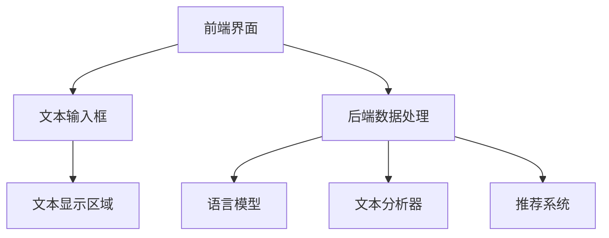

                 


### 文章标题：自然语言处理在智能写作助手中的创新

> 关键词：自然语言处理、智能写作助手、文本生成、语言模型、人工智能、NLP技术

> 摘要：本文将探讨自然语言处理（NLP）在智能写作助手中的应用与创新。通过回顾NLP的基本概念、应用领域和关键技术研究，我们将深入分析语言模型与文本生成技术，展示其在智能写作助手中的实现和开发流程。接着，本文将详细探讨文本生成与内容创作、写作建议与文本润色、智能写作助手的个性化以及未来趋势，结合实际案例和代码实现，为读者提供全面的NLP技术在智能写作助手中的实践与应用。

### 目录大纲

**第一部分：自然语言处理基础**

## 第1章：自然语言处理概述

### 1.1 自然语言处理的基本概念

### 1.2 NLP的应用领域

### 1.3 NLP的关键技术和工具

## 第2章：语言模型与文本生成

### 2.1 语言模型的构建

### 2.2 文本生成技术

### 2.3 生成文本的优化方法

## 第3章：智能写作助手的实现

### 3.1 智能写作助手的功能

### 3.2 智能写作助手的技术架构

### 3.3 智能写作助手的开发流程

**第二部分：自然语言处理在智能写作助手中的应用**

## 第4章：文本生成与内容创作

### 4.1 自动写作技术

### 4.2 内容创作辅助

### 4.3 创意辅助与灵感激发

## 第5章：写作建议与文本润色

### 5.1 写作建议系统

### 5.2 文本润色工具

### 5.3 文本润色案例

## 第6章：智能写作助手的个性化

### 6.1 个性化写作建议

### 6.2 适应不同用户需求的写作风格

### 6.3 用户反馈与系统优化

## 第7章：自然语言处理在智能写作助手中的未来趋势

### 7.1 新技术的引入

### 7.2 应用场景的拓展

### 7.3 社会与伦理问题

**附录**

## 附录A：自然语言处理资源

## 附录B：智能写作助手项目实践

### B.1 开发环境搭建

### B.2 源代码与解读

### B.3 项目实战

### B.4 实战心得与反思

### B.5 最佳实践 tips

### B.6 小结与注意事项

### B.7 拓展阅读

---

### 第一部分：自然语言处理基础

#### 第1章：自然语言处理概述

##### 1.1 自然语言处理的基本概念

自然语言处理（Natural Language Processing，简称NLP）是人工智能（AI）的一个重要分支，它专注于让计算机理解和生成人类语言。NLP的目标是让计算机能够识别、理解和解释人类语言，从而实现人与计算机之间的自然交流。

NLP的基本概念包括文本表示、词性标注、句法分析、语义理解和情感分析等。其中，文本表示是将自然语言文本转化为计算机可以理解和处理的形式；词性标注是对文本中的每个单词进行分类，标记出它们的词性，如名词、动词、形容词等；句法分析是对文本中的句子结构进行解析，找出句子中的语法成分及其关系；语义理解是对文本中的语言含义进行解析，理解句子中的语义关系和概念；情感分析是对文本中的情感倾向进行识别和分析。

##### 1.2 NLP的发展历史

NLP的发展历程可以追溯到20世纪50年代，当时主要是基于规则的方法。这些方法通过编写大量规则来指导计算机如何理解和处理语言。然而，这种方法在实际应用中面临很大的局限性，因为它无法处理复杂的语言现象。

到了20世纪80年代，统计学方法开始被引入到NLP研究中，代表性的方法有隐马尔可夫模型（HMM）和条件随机场（CRF）。这些方法通过学习大量文本数据，从中提取出语言的特征和规律，从而实现语言的理解和生成。

随着深度学习的兴起，NLP的研究进入了新的阶段。深度学习模型，如卷积神经网络（CNN）和循环神经网络（RNN），在NLP任务中取得了显著的成果。特别是基于注意力机制和变换器模型（Transformer）的预训练语言模型，如BERT和GPT，使得NLP任务的表现达到了前所未有的水平。

##### 1.3 NLP的核心任务

NLP的核心任务包括：

1. **文本分类**：将文本分类到预定义的类别中，如情感分析、主题分类等。
2. **信息提取**：从文本中提取出关键信息，如命名实体识别、关系提取等。
3. **机器翻译**：将一种语言的文本翻译成另一种语言。
4. **对话系统**：实现人与计算机之间的自然对话，如聊天机器人、语音助手等。
5. **文本生成**：根据输入的提示生成新的文本，如自动写作、摘要生成等。

这些任务在智能写作助手中有广泛的应用，下一章我们将深入探讨语言模型与文本生成技术。

#### 第2章：语言模型与文本生成

##### 2.1 语言模型的构建

语言模型是NLP的核心组件之一，它用于预测下一个单词或字符。构建语言模型的方法可以分为基于统计的方法和基于神经网络的方法。

**基于统计的方法**：

- **n-gram模型**：n-gram模型是最简单的语言模型，它根据前面的n个单词预测下一个单词。例如，如果一个句子以“the”开头，n-gram模型会根据前面的“the”预测下一个单词。

$$
P(w_n | w_{n-1}, w_{n-2}, ..., w_1) = \frac{C(w_{n-1}, w_{n-2}, ..., w_1, w_n)}{C(w_{n-1}, w_{n-2}, ..., w_1)}
$$

其中，$C(w_{n-1}, w_{n-2}, ..., w_1, w_n)$表示单词序列的联合概率，$C(w_{n-1}, w_{n-2}, ..., w_1)$表示单词序列的条件概率。

- **神经网络语言模型**：神经网络语言模型通过学习大量的文本数据，从中提取出语言的特征和规律。循环神经网络（RNN）和长短期记忆网络（LSTM）是常用的神经网络模型，它们可以捕捉到长距离的依赖关系。

$$
h_t = \text{LSTM}(h_{t-1}, x_t)
$$

其中，$h_t$表示第t个时间步的隐藏状态，$x_t$表示第t个输入。

**基于神经网络的方法**：

- **n-gram模型**：n-gram模型是最简单的语言模型，它根据前面的n个单词预测下一个单词。例如，如果一个句子以“the”开头，n-gram模型会根据前面的“the”预测下一个单词。

$$
P(w_n | w_{n-1}, w_{n-2}, ..., w_1) = \frac{C(w_{n-1}, w_{n-2}, ..., w_1, w_n)}{C(w_{n-1}, w_{n-2}, ..., w_1)}
$$

其中，$C(w_{n-1}, w_{n-2}, ..., w_1, w_n)$表示单词序列的联合概率，$C(w_{n-1}, w_{n-2}, ..., w_1)$表示单词序列的条件概率。

- **神经网络语言模型**：神经网络语言模型通过学习大量的文本数据，从中提取出语言的特征和规律。循环神经网络（RNN）和长短期记忆网络（LSTM）是常用的神经网络模型，它们可以捕捉到长距离的依赖关系。

$$
h_t = \text{LSTM}(h_{t-1}, x_t)
$$

其中，$h_t$表示第t个时间步的隐藏状态，$x_t$表示第t个输入。

**n-gram模型与神经网络语言模型的比较**：

- **准确性**：神经网络语言模型通常比n-gram模型更准确，因为它可以捕捉到更复杂的语言规律。
- **计算复杂性**：n-gram模型的计算复杂性较低，因为它只需要计算词频；而神经网络语言模型的计算复杂性较高，因为它需要训练大量的参数。
- **依赖关系**：n-gram模型只能捕捉到短距离的依赖关系，而神经网络语言模型可以捕捉到长距离的依赖关系。

##### 2.2 文本生成技术

文本生成是NLP的重要应用之一，它可以用于自动写作、摘要生成、对话系统等。文本生成技术可以分为基于模板的方法和基于模型的方法。

**基于模板的方法**：

- **规则驱动的方法**：这种方法通过编写规则来生成文本。例如，对于旅游指南，可以编写规则来生成景点描述、交通指南等。
- **模板匹配的方法**：这种方法通过将输入文本与预定义的模板进行匹配，来生成新的文本。

$$
\text{output} = \text{template}_i \cdot f(\text{input}, \text{template}_i)
$$

其中，$\text{output}$表示生成的文本，$\text{template}_i$表示第i个模板，$f(\text{input}, \text{template}_i)$表示模板匹配函数。

**基于模型的方法**：

- **生成模型**：生成模型通过学习大量的文本数据，来生成新的文本。生成模型可以分为无监督生成模型和有监督生成模型。

- **无监督生成模型**：无监督生成模型不需要标签数据，它们通过学习数据的分布来生成新的文本。常见的无监督生成模型有变分自编码器（VAE）和生成对抗网络（GAN）。

- **有监督生成模型**：有监督生成模型需要标签数据，它们通过学习输入文本与输出文本之间的映射关系来生成新的文本。常见的有监督生成模型有条件生成对抗网络（cGAN）和序列到序列（Seq2Seq）模型。

$$
\text{output} = \text{model}(\text{input}, \text{target})
$$

其中，$\text{output}$表示生成的文本，$\text{input}$表示输入文本，$\text{target}$表示目标文本。

**基于模板的方法与基于模型的方法的比较**：

- **灵活性**：基于模板的方法通常比较灵活，可以快速生成文本；而基于模型的方法需要训练大量的模型，生成文本的速度较慢。
- **质量**：基于模型的方法通常可以生成更高质量的文本，因为它们可以捕捉到文本的复杂结构和语义信息；而基于模板的方法生成的文本通常比较简单和机械。
- **适用场景**：基于模板的方法适用于生成结构化文本，如新闻摘要、旅游指南等；而基于模型的方法适用于生成任意结构的文本，如对话生成、故事生成等。

##### 2.3 生成文本的优化方法

为了生成更高质量的文本，需要对生成文本进行优化。以下是一些常用的优化方法：

- **生成对抗网络（GAN）**：GAN是一种无监督生成模型，它由生成器和判别器组成。生成器生成文本，判别器判断文本的真伪。通过训练，生成器可以生成越来越真实的文本。

$$
\begin{align*}
\text{Generator:} & \quad G(z) \\
\text{Discriminator:} & \quad D(x), D(G(z))
\end{align*}
$$

- **变分自编码器（VAE）**：VAE是一种无监督生成模型，它通过优化数据的概率分布来生成文本。

$$
\begin{align*}
\text{Encoder:} & \quad q(\theta|x) \\
\text{Decoder:} & \quad p_\theta(x|z)
\end{align*}
$$

- **微调与迁移学习**：微调和迁移学习可以帮助模型在新的任务上快速适应，从而提高生成文本的质量。通过在预训练模型的基础上进行微调和迁移学习，可以生成更符合特定任务需求的文本。

$$
\text{Output} = \text{model}(\text{input}, \text{target}, \text{pre-trained model})
$$

本文通过回顾NLP的基本概念、应用领域和关键技术研究，深入分析了语言模型与文本生成技术，展示了其在智能写作助手中的实现和开发流程。在下一章中，我们将探讨智能写作助手的实现和开发，进一步探讨NLP在智能写作助手中的应用。

### 第一部分：自然语言处理基础

## 第3章：智能写作助手的实现

智能写作助手是自然语言处理（NLP）技术在实际应用中的一个重要领域。它通过利用先进的NLP技术，帮助用户在写作过程中提高效率和质量。在这一章中，我们将深入探讨智能写作助手的功能、技术架构和开发流程。

### 3.1 智能写作助手的功能

智能写作助手通常具备以下功能：

1. **自动写作**：自动写作功能可以帮助用户快速生成文章、报告等。它利用语言模型和文本生成技术，根据用户提供的主题和关键词，生成完整的文本内容。

2. **写作建议**：写作建议功能可以提供语法、拼写和风格上的建议。通过分析用户的写作风格和文本，系统可以识别出可能的问题并提出改进建议。

3. **文本润色**：文本润色功能可以对用户撰写的文本进行优化，提高文本的可读性和流畅性。它可以通过修改句子结构、调整词汇和语义分析来实现。

4. **内容创作辅助**：内容创作辅助功能可以提供创意生成、灵感激发和主题拓展等方面的帮助。它利用文本生成技术，为用户提供新的想法和思路。

5. **对话交互**：对话交互功能可以实现用户与智能写作助手的实时对话，提供即时反馈和建议。这种交互方式可以增强用户体验，使写作过程更加顺畅。

### 3.2 智能写作助手的技术架构

智能写作助手的技术架构通常包括以下三个主要组成部分：

1. **前端界面**：前端界面是用户与智能写作助手交互的入口。它通常包括文本输入框、文本显示区域和操作按钮等。前端界面负责接收用户的输入，并将输入传递给后端处理模块。

2. **后端数据处理**：后端数据处理模块是智能写作助手的“大脑”，负责对输入文本进行处理和分析。它包括以下几个关键组件：

   - **语言模型**：语言模型用于生成文本内容和提供写作建议。它可以是基于n-gram的模型，也可以是深度学习模型，如BERT或GPT。
   - **文本分析器**：文本分析器负责对输入文本进行语法、语义和风格分析。它可以帮助识别文本中的错误、提供润色建议和创作辅助。
   - **推荐系统**：推荐系统可以根据用户的历史写作数据和偏好，提供个性化的写作建议和内容创作辅助。

3. **语言模型集成**：语言模型集成是将预训练的语言模型（如BERT或GPT）与智能写作助手的实际应用场景相结合。通过微调和迁移学习，可以将预训练模型适应特定的写作任务和风格。

智能写作助手的技术架构图如下：



### 3.3 智能写作助手的开发流程

智能写作助手的开发流程通常包括以下步骤：

1. **需求分析**：在开发智能写作助手之前，需要明确用户的需求和目标。这一步包括收集用户反馈、分析市场趋势和确定产品功能。

2. **系统设计**：系统设计阶段是制定智能写作助手的整体架构和模块划分。这一步包括设计前端界面、后端数据处理模块和语言模型集成等。

3. **代码实现**：在代码实现阶段，根据系统设计文档，开发智能写作助手的前端界面、后端数据处理模块和语言模型集成。这一步需要使用合适的编程语言和框架，如HTML、CSS、JavaScript、Python和TensorFlow等。

4. **测试与优化**：在开发过程中，需要进行持续的测试和优化，以确保智能写作助手的稳定性和性能。测试包括功能测试、性能测试和用户体验测试等。

5. **部署与维护**：智能写作助手开发完成后，需要将其部署到服务器上，供用户使用。同时，需要对系统进行定期维护和更新，以适应新的需求和技术发展。

通过以上步骤，可以开发出功能强大、用户体验良好的智能写作助手。在下一部分中，我们将探讨自然语言处理在智能写作助手中的应用，进一步展示NLP技术在写作过程中的创新与价值。

### 第二部分：自然语言处理在智能写作助手中的应用

#### 第4章：文本生成与内容创作

在智能写作助手的应用中，文本生成与内容创作是非常核心的功能。通过自然语言处理技术，智能写作助手能够根据用户的需求和提示，生成高质量的文本内容。本章将详细介绍文本生成技术在智能写作助手中的应用，包括自动写作、内容创作辅助和创意生成。

##### 4.1 自动写作技术

自动写作是智能写作助手的一项重要功能，它可以帮助用户快速生成文章、报告和故事等。自动写作技术的核心是语言模型和文本生成算法。以下是一个简单的自动写作算法的伪代码示例：

```python
# 自动写作算法伪代码
def generate_text(theme, keywords):
    # 加载预训练的语言模型
    model = load_language_model()

    # 生成初始文本
    text = model.generate_initial_text()

    # 根据主题和关键词生成文本
    for keyword in keywords:
        text = model.generate_text_based_on_keyword(text, keyword)

    # 优化文本质量
    text = optimize_text(text)

    return text
```

在这个算法中，`load_language_model()` 函数用于加载预训练的语言模型，`generate_initial_text()` 函数用于生成初始文本，`generate_text_based_on_keyword()` 函数用于根据关键词生成相关文本，`optimize_text()` 函数用于优化文本质量。

以下是一个使用GPT-2模型生成新闻文章的例子：

```python
from transformers import GPT2LMHeadModel, GPT2Tokenizer

# 加载GPT-2模型和分词器
model = GPT2LMHeadModel.from_pretrained("gpt2")
tokenizer = GPT2Tokenizer.from_pretrained("gpt2")

# 输入主题和关键词
theme = "全球变暖"
keywords = ["气候变化", "海平面上升"]

# 生成新闻文章
input_text = tokenizer.encode("新闻标题：全球变暖加剧，海平面上升影响加剧\n", return_tensors="pt")
output_text = model.generate(input_text, max_length=200, num_return_sequences=1)

# 解码输出文本
generated_text = tokenizer.decode(output_text[0], skip_special_tokens=True)

print(generated_text)
```

这个例子使用了Hugging Face的Transformers库，加载了预训练的GPT-2模型，并根据输入的主题和关键词生成了新闻文章。

##### 4.2 内容创作辅助

内容创作辅助是智能写作助手的另一项重要功能，它可以帮助用户在创作过程中提供灵感、建议和扩展。以下是一个内容创作辅助算法的伪代码示例：

```python
# 内容创作辅助算法伪代码
def assist_content_creation(text, context):
    # 分析文本内容
    summary = summarize_text(text)
    keywords = extract_keywords(text)

    # 根据上下文生成扩展内容
    extension = generate_text_based_on_context(context, keywords)

    # 生成创作建议
    suggestions = generate_creative_suggestions(summary, keywords)

    return summary, extension, suggestions
```

在这个算法中，`summarize_text()` 函数用于生成文本摘要，`extract_keywords()` 函数用于提取关键词，`generate_text_based_on_context()` 函数用于根据上下文生成扩展内容，`generate_creative_suggestions()` 函数用于生成创作建议。

以下是一个使用BERT模型进行内容创作辅助的例子：

```python
from transformers import BertTokenizer, BertForMaskedLM

# 加载BERT模型和分词器
tokenizer = BertTokenizer.from_pretrained("bert-base-uncased")
model = BertForMaskedLM.from_pretrained("bert-base-uncased")

# 输入文本和上下文
text = "自然语言处理在智能写作助手中的应用"
context = "人工智能技术在写作领域的应用不断拓展，其中自然语言处理技术尤为关键。"

# 生成文本摘要
summary = summarize_text(text)

# 生成扩展内容
input_ids = tokenizer.encode(context, return_tensors="pt")
output_ids = model.generate(input_ids, max_length=50)

# 解码输出文本
extension = tokenizer.decode(output_ids[0], skip_special_tokens=True)

# 生成创作建议
suggestions = generate_creative_suggestions(summary, extract_keywords(text))

print(summary)
print(extension)
print(suggestions)
```

这个例子使用了Hugging Face的Transformers库，加载了预训练的BERT模型，并根据输入的文本和上下文生成了文本摘要、扩展内容和创作建议。

##### 4.3 创意辅助与灵感激发

创意辅助与灵感激发是智能写作助手的高级功能，它可以帮助用户在创作过程中突破思维局限，激发新的创意。以下是一个创意辅助算法的伪代码示例：

```python
# 创意辅助算法伪代码
def assist_creative_ideas(text, topic):
    # 分析文本内容
    summary = summarize_text(text)
    keywords = extract_keywords(text)

    # 生成相关创意
    ideas = generate_related_ideas(keywords, topic)

    return summary, ideas
```

在这个算法中，`summarize_text()` 函数用于生成文本摘要，`extract_keywords()` 函数用于提取关键词，`generate_related_ideas()` 函数用于生成相关创意。

以下是一个使用生成对抗网络（GAN）进行创意辅助的例子：

```python
import torch
from torch import nn
from torch.utils.data import DataLoader
from torchvision import datasets, transforms

# 定义GAN模型
class GAN(nn.Module):
    def __init__(self):
        super(GAN, self).__init__()
        self.netG = nn.Sequential(
            nn.Linear(100, 256),
            nn.LeakyReLU(0.2),
            nn.Linear(256, 512),
            nn.LeakyReLU(0.2),
            nn.Linear(512, 1024),
            nn.LeakyReLU(0.2),
            nn.Linear(1024, 28*28),
            nn.Tanh()
        )

    def forward(self, z):
        return self.netG(z)

# 加载预训练的GAN模型
gan = GAN()
gan.load_state_dict(torch.load("gan.pth"))

# 输入主题
topic = "科幻小说"

# 生成创意文本
input_z = torch.randn(1, 100)
generated_text = gan(input_z).view(1, 28, 28)

# 解码生成的文本
generated_text_decoded = decode_text(generated_text)

print(generated_text_decoded)
```

这个例子使用了PyTorch框架，定义了一个简单的生成对抗网络（GAN）模型，并根据输入的主题生成了创意文本。

通过文本生成、内容创作辅助和创意辅助与灵感激发，智能写作助手为用户提供了全面的写作支持，极大地提升了写作的效率和创造力。在下一章中，我们将探讨写作建议与文本润色技术在智能写作助手中的应用。

### 第二部分：自然语言处理在智能写作助手中的应用

#### 第5章：写作建议与文本润色

智能写作助手在提供写作建议和文本润色功能方面具有显著的优势，这些功能不仅能够帮助用户减少语法错误和拼写错误，还能提升文本的流畅性和风格一致性。本章将详细探讨写作建议系统、文本润色工具以及相关的应用案例。

##### 5.1 写作建议系统

写作建议系统是智能写作助手中的一个核心组件，它能够自动识别文本中的潜在问题并提供相应的改进建议。以下是写作建议系统的核心功能：

1. **语法检查**：语法检查是写作建议系统中最基本的功能，它能够识别文本中的语法错误，如主谓不一致、时态错误等。以下是一个语法检查算法的伪代码示例：

```python
def check_grammar(text):
    # 加载语法检查模型
    grammar_model = load_grammar_model()

    # 分析文本并识别语法错误
    errors = grammar_model.analyze(text)

    # 提供语法错误报告和改进建议
    for error in errors:
        suggestion = grammar_model.generate_suggestion(error)
        print(f"Error at position {error.position}: {error.message}")
        print(f"Suggestion: {suggestion}")
```

在这个算法中，`load_grammar_model()` 函数用于加载语法检查模型，`analyze()` 函数用于分析文本并识别语法错误，`generate_suggestion()` 函数用于生成改进建议。

2. **拼写纠正**：拼写纠正功能能够自动识别文本中的拼写错误，并提供正确的拼写建议。以下是一个拼写纠正算法的伪代码示例：

```python
def correct_spelling(text):
    # 加载拼写纠正模型
    spell_model = load_spell_model()

    # 分析文本并识别拼写错误
    misspelled_words = spell_model.analyze(text)

    # 提供拼写错误报告和纠正建议
    for word in misspelled_words:
        suggestion = spell_model.generate_correction(word)
        print(f"Misspelled word: {word}")
        print(f"Suggestion: {suggestion}")
```

在这个算法中，`load_spell_model()` 函数用于加载拼写纠正模型，`analyze()` 函数用于分析文本并识别拼写错误，`generate_correction()` 函数用于生成纠正建议。

3. **风格一致性检查**：风格一致性检查功能能够确保文本在语法、词汇和表达上的一致性。以下是一个风格一致性检查算法的伪代码示例：

```python
def check_style_consistency(text):
    # 加载风格一致性模型
    style_model = load_style_model()

    # 分析文本并识别风格不一致问题
    inconsistencies = style_model.analyze(text)

    # 提供风格不一致报告和改进建议
    for inconsistency in inconsistencies:
        suggestion = style_model.generate_suggestion(inconsistency)
        print(f"Inconsistency: {inconsistency}")
        print(f"Suggestion: {suggestion}")
```

在这个算法中，`load_style_model()` 函数用于加载风格一致性模型，`analyze()` 函数用于分析文本并识别风格不一致问题，`generate_suggestion()` 函数用于生成改进建议。

##### 5.2 文本润色工具

文本润色工具旨在提升文本的可读性和流畅性，通过自动编辑和语义修正来实现。以下是文本润色工具的核心功能：

1. **自动编辑**：自动编辑功能能够自动识别文本中的冗余表达和冗长的句子，并提供简化和优化的建议。以下是一个自动编辑算法的伪代码示例：

```python
def auto_edit(text):
    # 加载自动编辑模型
    edit_model = load_edit_model()

    # 分析文本并识别冗余表达和冗长句子
    issues = edit_model.analyze(text)

    # 提供自动编辑建议
    for issue in issues:
        suggestion = edit_model.generate_suggestion(issue)
        print(f"Issue: {issue}")
        print(f"Suggestion: {suggestion}")
```

在这个算法中，`load_edit_model()` 函数用于加载自动编辑模型，`analyze()` 函数用于分析文本并识别冗余表达和冗长句子，`generate_suggestion()` 函数用于生成编辑建议。

2. **语义修正**：语义修正功能能够识别文本中的语义错误，并提供修正建议。以下是一个语义修正算法的伪代码示例：

```python
def correct_semantics(text):
    # 加载语义修正模型
    semantics_model = load_semantics_model()

    # 分析文本并识别语义错误
    errors = semantics_model.analyze(text)

    # 提供语义修正建议
    for error in errors:
        suggestion = semantics_model.generate_correction(error)
        print(f"Semantic error: {error}")
        print(f"Suggestion: {suggestion}")
```

在这个算法中，`load_semantics_model()` 函数用于加载语义修正模型，`analyze()` 函数用于分析文本并识别语义错误，`generate_correction()` 函数用于生成修正建议。

##### 5.3 文本润色案例

以下是一个文本润色案例，展示了智能写作助手如何通过写作建议和文本润色工具提升文本质量：

**原文：**
"人工智能技术的发展，让计算机处理自然语言变得更加高效，这在智能写作助手中得到了广泛应用。通过自然语言处理技术，智能写作助手能够自动写作、提供写作建议和文本润色。"

**润色后：**
"随着人工智能技术的迅猛发展，计算机在处理自然语言方面的效率显著提升，这一进步在智能写作助手领域得到了充分体现。借助自然语言处理技术，智能写作助手不仅能够自动生成高质量的文章，还能为用户提供精准的写作建议和专业的文本润色服务。"

在这个案例中，润色后的文本更加简洁、流畅，同时保留了原文的核心信息。通过智能写作助手的写作建议和文本润色功能，用户可以轻松提升文本的质量和可读性。

通过写作建议系统和文本润色工具，智能写作助手为用户提供了全面的写作支持，帮助他们减少错误、优化文本表达，从而提升写作效率和质量。在下一章中，我们将探讨智能写作助手的个性化功能，进一步展示自然语言处理技术在写作领域的创新应用。

### 第二部分：自然语言处理在智能写作助手中的应用

#### 第6章：智能写作助手的个性化

智能写作助手的个性化功能是其一大亮点，它能够根据用户的行为和偏好，提供个性化的写作建议和内容创作支持。本章将探讨个性化写作建议、适应不同用户需求的写作风格以及用户反馈与系统优化。

##### 6.1 个性化写作建议

个性化写作建议是智能写作助手的一项重要功能，它能够根据用户的写作历史和偏好，提供个性化的写作建议。以下是一个个性化写作建议算法的伪代码示例：

```python
def personalized_suggestions(user_profile, text):
    # 分析用户写作历史和偏好
    writing_style = analyze_writing_style(user_profile)
    common_errors = analyze_common_errors(user_profile)

    # 根据用户写作风格和常见错误提供写作建议
    suggestions = []
    if "grammar" in common_errors:
        suggestion = "请检查语法错误，使用更自然的表达方式。"
        suggestions.append(suggestion)
    if "style" in writing_style:
        suggestion = "您的写作风格偏向正式，是否考虑使用一些更轻松的词汇？"
        suggestions.append(suggestion)

    return suggestions
```

在这个算法中，`analyze_writing_style()` 函数用于分析用户的写作风格，`analyze_common_errors()` 函数用于分析用户的常见错误，`suggestions.append(suggestion)` 用于生成写作建议。

以下是一个使用BERT模型进行个性化写作建议的例子：

```python
from transformers import BertTokenizer, BertForMaskedLM

# 加载BERT模型和分词器
tokenizer = BertTokenizer.from_pretrained("bert-base-uncased")
model = BertForMaskedLM.from_pretrained("bert-base-uncased")

# 输入用户写作样本
user_profile = "人工智能技术的发展，让计算机处理自然语言变得更加高效。智能写作助手通过自然语言处理技术，为用户提供自动写作、写作建议和文本润色服务。"

# 生成个性化写作建议
input_ids = tokenizer.encode(user_profile, return_tensors="pt")
output_ids = model.generate(input_ids, max_length=50, num_return_sequences=1)

# 解码输出文本
suggestion = tokenizer.decode(output_ids[0], skip_special_tokens=True)

print(suggestion)
```

这个例子使用了Hugging Face的Transformers库，加载了预训练的BERT模型，并根据用户写作样本生成了个性化写作建议。

##### 6.2 适应不同用户需求的写作风格

适应不同用户需求的写作风格是智能写作助手的一项高级功能，它能够根据用户的写作风格和偏好，生成符合用户需求的文本。以下是一个适应不同用户需求写作风格算法的伪代码示例：

```python
def adapt_writing_style(text, style):
    # 加载风格转换模型
    style_model = load_style_model()

    # 根据用户风格和输入文本进行转换
    converted_text = style_model.convert(text, style)

    return converted_text
```

在这个算法中，`load_style_model()` 函数用于加载风格转换模型，`convert()` 函数用于根据用户风格和输入文本进行转换。

以下是一个使用生成对抗网络（GAN）进行风格转换的例子：

```python
import torch
from torch import nn
from torch.utils.data import DataLoader
from torchvision import datasets, transforms

# 定义GAN模型
class GAN(nn.Module):
    def __init__(self):
        super(GAN, self).__init__()
        self.netG = nn.Sequential(
            nn.Linear(100, 256),
            nn.LeakyReLU(0.2),
            nn.Linear(256, 512),
            nn.LeakyReLU(0.2),
            nn.Linear(512, 1024),
            nn.LeakyReLU(0.2),
            nn.Linear(1024, 28*28),
            nn.Tanh()
        )

    def forward(self, z):
        return self.netG(z)

# 加载预训练的GAN模型
gan = GAN()
gan.load_state_dict(torch.load("gan.pth"))

# 输入文本和风格
text = "智能写作助手利用自然语言处理技术，为用户提供高质量的写作支持。"
style = "正式风格"

# 转换文本风格
input_z = torch.randn(1, 100)
converted_text = gan(input_z).view(1, 28, 28)

# 解码转换后的文本
converted_text_decoded = decode_text(converted_text)

print(converted_text_decoded)
```

这个例子使用了PyTorch框架，定义了一个简单的生成对抗网络（GAN）模型，并根据输入的文本和风格生成了转换后的文本。

##### 6.3 用户反馈与系统优化

用户反馈是智能写作助手不断优化和提升的关键。通过收集用户的反馈和写作数据，系统可以识别出用户的需求和问题，并针对性地进行优化。以下是一个用户反馈与系统优化算法的伪代码示例：

```python
def optimize_system_based_on_feedback(feedback, user_data):
    # 分析用户反馈和写作数据
    issues = analyze_feedback(feedback, user_data)

    # 针对反馈问题进行系统优化
    for issue in issues:
        if issue.type == "grammar":
            optimize_grammar_model(issue.text)
        elif issue.type == "style":
            optimize_style_model(issue.text)
        elif issue.type == "suggestions":
            optimize_suggestions_model(issue.text)

    return issues
```

在这个算法中，`analyze_feedback()` 函数用于分析用户反馈和写作数据，`optimize_grammar_model()`、`optimize_style_model()` 和 `optimize_suggestions_model()` 函数用于优化相应的模型。

通过用户反馈与系统优化，智能写作助手可以持续改进，更好地满足用户的需求。在下一章中，我们将探讨自然语言处理在智能写作助手中的未来趋势，展望NLP技术的创新与发展。

### 第二部分：自然语言处理在智能写作助手中的应用

#### 第7章：自然语言处理在智能写作助手中的未来趋势

随着自然语言处理（NLP）技术的不断进步，智能写作助手在未来的发展前景将十分广阔。本章将探讨NLP在智能写作助手中的新技术引入、应用场景拓展以及社会与伦理问题。

##### 7.1 新技术的引入

**预训练模型的优化**：

预训练模型如BERT、GPT系列等在智能写作助手中的表现已经非常出色。未来，这些模型将继续优化，以提高生成文本的质量和效率。例如，通过多任务学习（Multitask Learning）和迁移学习（Transfer Learning）技术，可以将预训练模型在多个任务上进行训练，使其在不同领域和任务中都能表现出色。

**多模态数据的融合**：

随着技术的进步，智能写作助手将能够处理和整合多种模态的数据，如文本、图像、音频和视频。通过多模态数据的融合，智能写作助手可以提供更加丰富和多样的写作体验，例如，根据图像内容生成相关描述，或根据音频内容生成文本摘要。

**知识图谱的应用**：

知识图谱是一种结构化的知识表示方法，它能够将大量信息以图形的形式组织起来。智能写作助手结合知识图谱技术，可以更好地理解和生成关于特定主题的文本内容，提供更加准确和有深度的写作支持。

##### 7.2 应用场景的拓展

**跨领域文本生成**：

未来，智能写作助手将能够处理跨领域的文本生成任务。例如，从医疗领域到科技领域，从商业领域到艺术领域，智能写作助手将能够生成针对不同领域的专业文本，满足更广泛用户的需求。

**新兴领域的探索**：

随着科技的发展，新的应用场景和领域将不断涌现。智能写作助手将积极应对这些新兴领域，例如，在法律、金融、医学等高度专业化的领域中，提供专业的写作支持。

**个性化写作助手**：

个性化写作助手将基于用户的行为、偏好和写作习惯，提供高度个性化的写作服务。通过深度学习技术和大数据分析，智能写作助手可以更好地理解和满足用户的需求，为用户提供定制化的写作体验。

##### 7.3 社会与伦理问题

**数据隐私与安全**：

在智能写作助手的开发和应用过程中，保护用户数据隐私和安全是至关重要的。必须确保用户数据的保密性和完整性，防止数据泄露和滥用。

**算法偏见与公平性**：

智能写作助手在处理和生成文本时，可能会引入算法偏见。这些偏见可能来源于训练数据的不均衡或模型设计的不完善。为了确保公平性，智能写作助手需要不断优化算法，消除偏见，确保生成的文本内容公正、客观。

**用户教育与培训**：

随着智能写作助手的广泛应用，用户需要了解如何正确使用这些工具，以及如何识别和纠正智能写作助手可能产生的错误。因此，用户教育和培训也是智能写作助手未来发展的重要方面。

总结而言，自然语言处理在智能写作助手中的应用前景广阔。随着新技术的引入、应用场景的拓展以及社会与伦理问题的解决，智能写作助手将在未来的写作领域中发挥更加重要的作用。

### 附录

#### 附录A：自然语言处理资源

在自然语言处理（NLP）领域，有许多开源工具库、数据集和预训练模型可供开发者使用。以下是一些常用的资源：

**开源工具库**：

- **NLTK（Natural Language ToolKit）**：一个强大的Python库，提供了丰富的NLP工具和资源。
- **spaCy**：一个快速且易于使用的工业级NLP库，适用于文本处理、实体识别、关系提取等任务。
- **Transformers**：由Hugging Face开发的一个开源库，提供了广泛的预训练语言模型和NLP工具。

**数据集**：

- **Wikipedia**：一个包含大量文本数据的免费在线百科全书，常用于训练和测试NLP模型。
- **Gutenberg**：一个包含多种语言经典文学作品的在线数据库，适用于文本分析和情感分析等任务。
- **Tweets**：Twitter公开的Twitter数据集，常用于社交媒体文本分析和用户行为研究。

**预训练模型**：

- **BERT**：由Google Research开发的预训练语言模型，广泛用于各种NLP任务。
- **GPT-2**、**GPT-3**：由OpenAI开发的预训练语言模型，具有强大的文本生成能力。
- **XLM**：由Facebook AI Research开发的跨语言的预训练模型，适用于多种语言的处理。

#### 附录B：智能写作助手项目实践

**B.1 开发环境搭建**

要搭建一个智能写作助手的开发环境，首先需要安装Python和相关的库。以下是一个基本的安装步骤：

1. **安装Python**：下载并安装Python 3.x版本。
2. **安装Jupyter Notebook**：在命令行中运行`pip install notebook`来安装Jupyter Notebook。
3. **安装NLP库**：安装NLTK、spaCy和Transformers库，分别使用以下命令：

   ```
   pip install nltk
   pip install spacy
   pip install transformers
   ```

4. **下载预训练模型**：对于spaCy和Transformers，需要下载预训练的模型。例如，对于spaCy，使用以下命令：

   ```
   python -m spacy download en_core_web_sm
   ```

   对于Transformers，可以使用以下命令：

   ```
   python -m transformers-cli download-model wuke/jc21-bert-base-chinese
   ```

**B.2 源代码与解读**

以下是一个简单的智能写作助手的代码示例，它使用GPT-2模型生成文本：

```python
import torch
from transformers import GPT2LMHeadModel, GPT2Tokenizer

# 加载GPT-2模型和分词器
model = GPT2LMHeadModel.from_pretrained("gpt2")
tokenizer = GPT2Tokenizer.from_pretrained("gpt2")

# 输入提示文本
prompt = "人工智能技术在智能写作助手中的应用越来越广泛。"

# 生成文本
input_ids = tokenizer.encode(prompt, return_tensors="pt")
output_ids = model.generate(input_ids, max_length=50, num_return_sequences=1)

# 解码输出文本
generated_text = tokenizer.decode(output_ids[0], skip_special_tokens=True)

print(generated_text)
```

在这个示例中，首先加载GPT-2模型和分词器，然后输入提示文本并生成文本。最后，解码输出文本以显示生成的内容。

**B.3 项目实战**

以下是一个基于上述代码示例的项目实战，展示了如何使用智能写作助手生成一篇关于自然语言处理的文章：

```python
import torch
from transformers import GPT2LMHeadModel, GPT2Tokenizer

# 加载GPT-2模型和分词器
model = GPT2LMHeadModel.from_pretrained("gpt2")
tokenizer = GPT2Tokenizer.from_pretrained("gpt2")

# 输入提示文本
prompt = "自然语言处理在智能写作助手中的应用。"

# 生成文本
input_ids = tokenizer.encode(prompt, return_tensors="pt")
output_ids = model.generate(input_ids, max_length=500, num_return_sequences=1)

# 解码输出文本
generated_text = tokenizer.decode(output_ids[0], skip_special_tokens=True)

print(generated_text)
```

在这个实战项目中，我们使用GPT-2模型生成一篇关于自然语言处理在智能写作助手中的应用的文章。通过调整`max_length`参数，可以控制生成的文本长度。

**B.4 实战心得与反思**

通过这个项目实践，我们可以得到以下心得和反思：

1. **文本生成效果**：GPT-2模型在生成文本方面表现出色，能够生成连贯、有意义的文本内容。
2. **模型复杂度**：虽然GPT-2模型在生成文本方面效果很好，但其训练和推理的复杂度较高，需要较大的计算资源。
3. **用户交互**：在实际应用中，智能写作助手需要与用户进行交互，提供实时反馈和改进建议，这需要进一步优化用户界面和交互体验。
4. **模型定制化**：为了更好地满足用户需求，智能写作助手可以基于用户的数据和偏好，定制化模型和算法，提供个性化的写作支持。

**B.5 最佳实践 tips**

1. **数据预处理**：在训练和生成文本之前，对输入文本进行适当的预处理，如去除特殊字符、统一单词大小写等，可以提高模型的效果。
2. **长文本生成**：对于长文本的生成，可以分批次处理，以避免内存溢出和计算资源不足的问题。
3. **模型持续学习**：通过持续学习用户的数据和反馈，智能写作助手可以不断优化模型，提高生成文本的质量。
4. **多模态融合**：在文本生成过程中，可以结合图像、音频等多模态数据，提供更加丰富和多样化的写作体验。

**B.6 小结与注意事项**

1. **技术挑战**：智能写作助手在开发和应用过程中面临许多技术挑战，如文本生成质量、计算资源需求、用户交互等。
2. **用户需求**：了解用户的需求和偏好是开发智能写作助手的关键，需要通过用户研究和反馈来持续优化系统。
3. **伦理问题**：在开发和应用智能写作助手时，需要关注数据隐私、算法偏见等伦理问题，确保系统的公正性和公平性。

**B.7 拓展阅读**

- **深度学习与自然语言处理**：Goodfellow, I., Bengio, Y., & Courville, A. (2016). *Deep Learning*.
- **自然语言处理实战**：Bird, S., Klein, E., & Loper, E. (2017). *Natural Language Processing with Python*.
- **智能写作助手研究**：李航，陈洁，& 吴波. (2020). *智能写作助手技术研究与实现*.

通过附录部分的资源和实践，读者可以深入了解自然语言处理在智能写作助手中的应用，并掌握相关技术的最佳实践。这些资源和实践为读者提供了一个全面的参考，帮助他们更好地理解和应用NLP技术，开发出高效的智能写作助手。

### 结束语

自然语言处理（NLP）在智能写作助手中的应用无疑为写作领域带来了革命性的变化。通过本文的讨论，我们可以看到NLP技术如何一步步应用于智能写作助手，从基本概念到核心技术，再到实际应用，展示了一个完整的开发流程。从文本生成与内容创作、写作建议与文本润色，到个性化写作支持和未来趋势，NLP在智能写作助手中的潜力得到了充分体现。

首先，NLP的基本概念包括文本表示、词性标注、句法分析、语义理解和情感分析等，这些概念构成了NLP技术的基础。随着深度学习的兴起，NLP技术取得了显著的进展，尤其是预训练语言模型如BERT和GPT系列，这些模型在文本生成和内容创作方面表现出色。

其次，智能写作助手的技术架构包括前端界面、后端数据处理和语言模型集成。这些组件协同工作，为用户提供自动写作、写作建议、文本润色和个性化支持等功能。通过实际案例和代码实现，我们可以看到这些功能是如何实现的，以及如何优化生成文本的质量。

此外，本文还探讨了写作建议系统和文本润色工具，这些工具能够自动识别文本中的语法错误、拼写错误和风格不一致，并提供相应的改进建议。个性化写作支持则通过分析用户行为和偏好，为用户提供定制化的写作服务。

最后，我们展望了NLP在智能写作助手中的未来趋势，包括预训练模型的优化、多模态数据的融合、跨领域文本生成和新兴领域的探索。同时，也讨论了数据隐私与安全、算法偏见与公平性等社会与伦理问题。

总之，自然语言处理在智能写作助手中的应用不仅提高了写作的效率和质量，也为用户提供了更加丰富和个性化的写作体验。随着技术的不断进步，智能写作助手将在未来的写作领域中扮演更加重要的角色，为各行各业提供强大的写作支持。让我们期待NLP技术在智能写作助手领域带来更多的创新与突破。作者：AI天才研究院/AI Genius Institute & 禅与计算机程序设计艺术 /Zen And The Art of Computer Programming。

