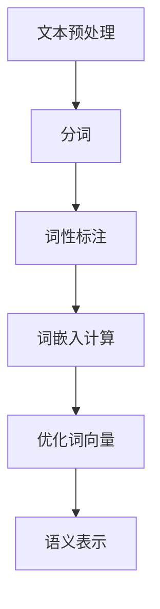
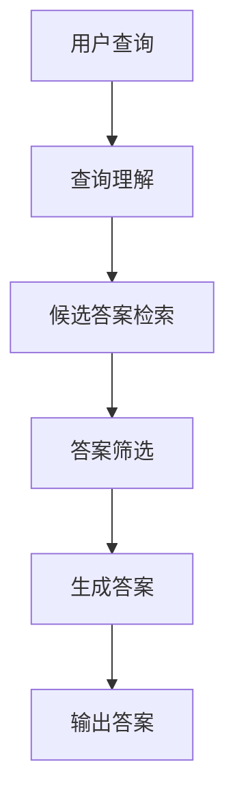

                 

# 《自然语言处理在智能问答系统中的应用》

## 摘要

自然语言处理（NLP）作为人工智能领域的核心技术之一，已经在各个行业中得到了广泛应用。智能问答系统是NLP技术的一个重要应用场景，它能够理解和回答用户的自然语言查询，为用户提供便捷的信息获取途径。本文将深入探讨自然语言处理在智能问答系统中的应用，从基础概念、核心技术、应用实践等多方面进行阐述。文章首先介绍了自然语言处理的发展历程、基本任务以及面临的挑战和机遇。接着，详细解析了文本预处理技术、词嵌入与语义表示等关键技术。然后，对智能问答系统的架构、问答匹配和问答生成技术进行了介绍。在此基础上，文章进一步探讨了自然语言处理在智能问答系统中的实际应用，包括词嵌入与语义匹配、上下文处理和多轮对话管理。最后，通过项目实战和性能优化，总结了自然语言处理在智能问答系统中的应用现状、存在问题以及未来发展趋势。

## 目录

- **第一部分：自然语言处理基础**
  - 第1章：自然语言处理概述
  - 第2章：文本预处理技术
  - 第3章：词嵌入与语义表示

- **第二部分：智能问答系统架构**
  - 第4章：智能问答系统概述
  - 第5章：问答匹配技术
  - 第6章：问答生成技术

- **第三部分：自然语言处理在智能问答系统中的应用**
  - 第7章：词嵌入与语义匹配
  - 第8章：对话系统中的上下文处理
  - 第9章：多轮对话管理

- **第四部分：总结与展望**
  - 第10章：项目实战与优化
  - 第11章：总结与展望

## 附录

- 附录 A：常用工具与资源
- 附录 B：常见问题解答
- 附录 C：数学模型和公式
- 附录 D：项目实战代码与解读

### 第一部分：自然语言处理基础

#### 第1章：自然语言处理概述

### 第1章 自然语言处理概述

#### 1.1 自然语言处理的发展历程

自然语言处理（Natural Language Processing，简称NLP）是人工智能（Artificial Intelligence，简称AI）领域的一个分支，旨在让计算机能够理解和处理人类自然语言。NLP的研究可以追溯到上世纪50年代，当时计算机科学家和语言学家开始探索如何使计算机理解和生成自然语言。

在早期的NLP研究中，主要的挑战是如何使计算机能够理解和解释人类语言。随着计算能力和算法的进步，NLP技术逐渐发展壮大。20世纪80年代，规则驱动的方法占据了主导地位，这些方法通过编写大量的语法规则和词典来处理语言。然而，这种方法在处理复杂和多样化的自然语言时存在局限性。

进入21世纪，随着机器学习和深度学习技术的突破，统计方法和基于数据的模型在NLP中得到了广泛应用。这一阶段，NLP的发展进入了新的里程碑，尤其是在语言模型、机器翻译、情感分析、问答系统等领域取得了显著成果。

#### 1.2 自然语言处理的基本任务

自然语言处理的基本任务可以归纳为以下几个方面：

1. **文本预处理**：这是NLP的基础步骤，包括分词、词性标注、命名实体识别等。文本预处理的目标是将原始文本转化为计算机可以处理的形式。

2. **语言模型**：语言模型是NLP的核心组成部分，用于预测下一个单词或字符的概率。这一任务在机器翻译、语音识别、自动摘要等应用中至关重要。

3. **词性标注**：词性标注是指为文本中的每个单词标注其词性，如名词、动词、形容词等。这一步骤对于句法分析和语义理解非常重要。

4. **句法分析**：句法分析旨在理解句子的结构，包括句法树的构建、成分分析等。这一任务对于机器翻译、文本摘要等应用有重要影响。

5. **语义分析**：语义分析旨在理解文本中的语义信息，包括词义消歧、实体识别、情感分析等。这一步骤对于问答系统、推荐系统等应用至关重要。

6. **机器翻译**：机器翻译是将一种自然语言翻译成另一种自然语言。这一任务在跨语言交流、全球化业务等领域具有重要意义。

7. **问答系统**：问答系统旨在理解和回答用户的自然语言查询。这一任务在客户服务、智能助手等领域得到了广泛应用。

#### 1.3 自然语言处理的挑战与机遇

尽管NLP在许多方面取得了显著成果，但仍然面临诸多挑战和机遇：

1. **挑战**：
   - **多语言处理**：NLP技术主要集中在英语等少数几种语言上，而多语言处理仍然是一个重大挑战。
   - **语义理解**：理解自然语言的深层含义仍然是一个复杂的问题，涉及词义消歧、情感分析等。
   - **上下文理解**：上下文对于理解自然语言至关重要，但目前的技术还不能完全捕捉和利用上下文信息。

2. **机遇**：
   - **大数据**：随着互联网和移动设备的普及，大量文本数据被生成和存储，这为NLP的研究和应用提供了丰富的资源。
   - **深度学习**：深度学习技术在NLP中的成功应用，如卷积神经网络（CNN）和循环神经网络（RNN），为解决复杂问题提供了新的途径。
   - **跨领域应用**：NLP技术在医疗、金融、教育等领域的应用潜力巨大，为这些行业带来了新的发展机遇。

#### 1.4 自然语言处理的应用场景

自然语言处理技术在许多领域都得到了广泛应用，以下是一些典型的应用场景：

1. **搜索引擎**：搜索引擎利用NLP技术对用户查询进行理解和索引，从而提供更加精确的搜索结果。

2. **机器翻译**：机器翻译是将一种自然语言翻译成另一种自然语言，NLP技术在其中起到了关键作用。

3. **文本摘要**：文本摘要旨在从大量文本中提取关键信息，NLP技术可以帮助自动生成摘要。

4. **问答系统**：问答系统可以理解和回答用户的自然语言查询，为用户提供便捷的信息获取途径。

5. **情感分析**：情感分析旨在理解文本中的情感倾向，NLP技术可以帮助企业了解用户对产品或服务的反馈。

6. **聊天机器人**：聊天机器人利用NLP技术与用户进行自然语言交互，提供客户服务或娱乐体验。

7. **医疗健康**：NLP技术在医疗健康领域有着广泛的应用，如病历分析、药物研发等。

8. **金融领域**：NLP技术可以帮助金融机构进行风险控制、欺诈检测等。

9. **教育领域**：NLP技术可以用于自动评分、个性化推荐等，提高教育质量。

#### 1.5 自然语言处理的未来发展趋势

随着技术的不断进步和应用场景的扩展，自然语言处理在未来将继续发展，以下是一些可能的发展趋势：

1. **跨语言处理**：随着全球化的加速，跨语言处理的需求日益增长，未来将出现更多高效、准确的跨语言处理技术。

2. **多模态融合**：自然语言处理将与其他模态（如图像、语音）相结合，实现更全面的信息理解和处理。

3. **深度学习和强化学习**：深度学习和强化学习等先进算法将进一步提升NLP的性能和应用范围。

4. **可解释性和可靠性**：随着NLP技术的广泛应用，用户对系统的可解释性和可靠性要求越来越高，未来将出现更多可解释性更高的NLP模型。

5. **自动化和半自动化**：NLP技术将更加自动化和半自动化，减少对专业知识和人工干预的依赖。

6. **伦理和隐私**：随着NLP技术的普及，伦理和隐私问题将得到更多关注，如何保护用户隐私将成为重要研究方向。

#### 1.6 小结

自然语言处理作为人工智能领域的关键技术，已经在各个行业中发挥了重要作用。虽然面临诸多挑战，但NLP技术仍具有巨大的发展潜力。通过不断的研究和创新，NLP将在更多领域实现应用，为人类带来更多便利。在本章中，我们介绍了自然语言处理的发展历程、基本任务、挑战与机遇，以及应用场景和未来发展趋势。这些内容为后续章节的深入学习奠定了基础。

### 第2章：文本预处理技术

#### 第2章 文本预处理技术

文本预处理是自然语言处理（NLP）中的重要步骤，它将原始的文本转化为计算机可以处理和分析的形式。文本预处理通常包括分词、去除停用词、词性标注、命名实体识别等多个步骤。这些步骤对于提高NLP任务的准确性和效率具有重要意义。

#### 2.1 分词技术

分词是指将连续的文本序列切分成一个个具有独立意义的词语。分词是NLP中的基础步骤，其质量直接影响后续的文本处理任务。

1. **分词方法**：

   - **基于规则的分词**：这种方法利用预定义的规则进行分词，如使用词典、词频统计等。这种方法的特点是分词结果较为准确，但需要大量人工规则维护。

   - **基于统计的分词**：这种方法使用统计模型（如隐马尔可夫模型、条件随机场等）进行分词。统计模型可以根据上下文信息自适应地调整分词结果，具有较好的适应性。

   - **基于深度学习的分词**：这种方法使用深度学习模型（如卷积神经网络、循环神经网络等）进行分词。深度学习方法可以自动学习文本中的复杂模式，具有较好的分词效果。

2. **分词工具**：

   - **jieba**：jieba是Python中常用的分词工具，支持基于规则、基于统计和基于深度学习的分词方法。

   - **NLTK**：NLTK是Python中另一个常用的NLP工具包，提供了多种分词算法和语料库。

   - **Stanford NLP**：Stanford NLP是Java中常用的NLP工具包，支持多种语言的处理，包括分词、词性标注等。

#### 2.2 命名实体识别

命名实体识别（Named Entity Recognition，简称NER）是指识别文本中的命名实体，如人名、地名、组织名等。NER是文本预处理中的一项重要任务，对于信息提取、实体关系挖掘等具有重要作用。

1. **NER方法**：

   - **基于规则的方法**：这种方法通过预定义的规则进行命名实体识别，如使用词典、模式匹配等。

   - **基于统计的方法**：这种方法使用统计模型（如隐马尔可夫模型、条件随机场等）进行命名实体识别。

   - **基于深度学习的方法**：这种方法使用深度学习模型（如卷积神经网络、循环神经网络等）进行命名实体识别。

2. **NER工具**：

   - **Stanford NER**：Stanford NER是Java中常用的NER工具，支持多种语言的处理。

   - **spacy**：spacy是Python中常用的NER工具，支持多种语言，具有较好的性能和效果。

   - **jieba**：jieba虽然主要是分词工具，但也支持命名实体识别功能。

#### 2.3 词性标注与依存句法分析

词性标注（Part-of-Speech Tagging，简称POS）是指为文本中的每个词语标注其词性，如名词、动词、形容词等。依存句法分析（Dependency Parsing，简称DP）是指分析句子中词语之间的依赖关系。词性标注和依存句法分析是文本理解的基础步骤，对于语义分析、问答系统等具有重要意义。

1. **词性标注与依存句法分析方法**：

   - **基于规则的方法**：这种方法通过预定义的规则进行词性标注和依存句法分析。

   - **基于统计的方法**：这种方法使用统计模型（如条件随机场、最大熵模型等）进行词性标注和依存句法分析。

   - **基于深度学习的方法**：这种方法使用深度学习模型（如卷积神经网络、循环神经网络等）进行词性标注和依存句法分析。

2. **词性标注与依存句法分析工具**：

   - **Stanford NLP**：Stanford NLP提供了词性标注和依存句法分析功能，支持多种语言的处理。

   - **spacy**：spacy支持词性标注和依存句法分析，具有较好的性能和效果。

   - **NLTK**：NLTK提供了多种词性标注和依存句法分析算法，适用于Python环境。

#### 2.4 去除停用词

停用词（Stop Words）是指对文本理解没有实质意义的词语，如“的”、“和”、“是”等。去除停用词可以减少噪声信息，提高文本处理的效率。

1. **去除停用词的方法**：

   - **手动去除**：根据预定义的停用词列表手动去除停用词。

   - **自动去除**：使用算法自动识别并去除停用词。

2. **去除停用词的工具**：

   - **NLTK**：NLTK提供了多种语言环境中的停用词列表，方便用户自动去除停用词。

   - **spacy**：spacy支持自动去除停用词功能，用户可以根据需要自定义停用词列表。

#### 2.5 小结

文本预处理是自然语言处理（NLP）中不可或缺的步骤，它为后续的文本分析奠定了基础。本章介绍了文本预处理中的关键技术，包括分词、命名实体识别、词性标注和依存句法分析、去除停用词等。通过这些技术，可以将原始的文本转化为计算机可以处理的形式，为NLP任务的实现提供支持。在实际应用中，选择合适的文本预处理技术和工具，可以有效提高NLP任务的准确性和效率。

### 第3章：词嵌入与语义表示

#### 第3章 词嵌入与语义表示

词嵌入（Word Embedding）是将词汇映射到固定大小的向量空间中的一种技术，这使得计算机能够以向量的形式处理自然语言。词嵌入在自然语言处理（NLP）中扮演着至关重要的角色，它使得文本数据具备了数学上的表示能力，从而可以应用于机器学习模型。

#### 3.1 词嵌入技术

1. **词嵌入的基本原理**：

   词嵌入的基本思想是将每个单词映射到一个固定大小的向量。这些向量不仅保留了单词的语法和语义信息，还能够通过向量的距离来衡量单词之间的相似性。例如，对于两个单词 "man" 和 "woman"，它们的词向量可能会在向量空间中接近，因为它们在语义上具有相关性。

2. **词嵌入的方法**：

   - **基于统计的方法**：这种方法通过大量文本数据来计算词向量，代表性的算法有TF-IDF（Term Frequency-Inverse Document Frequency）和Word2Vec（由Google提出的一种基于神经网络的方法）。

   - **基于神经网络的的方法**：这种方法通过深度学习模型来学习词向量，代表性的算法有GloVe（Global Vectors for Word Representation）和Word2Vec。

3. **词嵌入的优势**：

   - **降低维度**：词嵌入将高维的文本数据映射到低维的向量空间，从而减少了计算复杂度。
   - **语义相似性**：通过计算词向量之间的距离，可以衡量单词之间的语义相似性。
   - **跨语言处理**：词嵌入能够跨语言地处理文本数据，使得不同语言的文本可以进行有效比较。

4. **常见的词嵌入模型**：

   - **Word2Vec**：Word2Vec是一种基于神经网络的方法，通过训练模型来学习词向量。Word2Vec有两种主要的训练模型：连续词袋（CBOW）和Skip-Gram。
   - **GloVe**：GloVe（Global Vectors for Word Representation）是一种基于全局文本统计信息的词嵌入方法，它通过优化词向量来最大化单词的共现概率。
   - **FastText**：FastText是一种基于字符的词嵌入方法，它通过将单词分解为字符序列，然后组合字符级别的词向量来生成单词级别的词向量。

#### 3.2 词向量的计算与优化

1. **词向量的计算**：

   - **基于统计的方法**：例如TF-IDF方法，通过计算单词在文档中的词频（TF）和文档集合中的逆文档频率（IDF），生成词向量。
   - **基于神经网络的方法**：例如Word2Vec，通过训练一个神经网络模型来学习词向量。输入是单词的上下文，输出是词向量。

2. **词向量的优化**：

   - **损失函数**：在词向量的训练过程中，常用的损失函数包括平方误差损失和交叉熵损失。损失函数用于衡量预测词向量与真实词向量之间的差距。
   - **优化算法**：例如梯度下降（Gradient Descent）、随机梯度下降（Stochastic Gradient Descent）和Adam（Adaptive Moment Estimation）等。优化算法用于调整词向量的参数，以最小化损失函数。

3. **常见优化策略**：

   - **负采样**：在Word2Vec的训练中，负采样是一种有效的优化策略。它通过随机选择负样本来减少模型在训练过程中需要计算的次数。
   - **学习率调整**：学习率是优化算法中的一个重要参数，合理的调整学习率可以提高模型的训练效率和最终性能。
   - **正则化**：例如L1正则化和L2正则化，可以防止模型过拟合，提高泛化能力。

#### 3.3 语义相似性与文本分类

1. **语义相似性**：

   - **基于词向量的语义相似性**：通过计算两个词向量之间的余弦相似度，可以衡量词向量之间的语义相似性。
   - **基于句子的语义相似性**：通过计算两个句子向量的距离，可以衡量句子之间的语义相似性。句子向量可以通过对句子中的每个单词的词向量进行平均或求和得到。

2. **文本分类**：

   - **文本分类的基本概念**：文本分类是将文本数据按照其内容分成不同的类别。例如，将新闻文本分类为体育、娱乐、科技等类别。
   - **文本分类的方法**：常用的文本分类方法包括朴素贝叶斯、支持向量机（SVM）、随机森林、深度学习等。

3. **词嵌入在文本分类中的应用**：

   - **特征提取**：通过将文本中的每个单词映射到词向量，可以将文本数据转化为向量形式，便于后续的机器学习模型处理。
   - **分类模型训练**：利用训练集数据，通过词向量训练分类模型，如朴素贝叶斯、SVM等。
   - **模型评估与优化**：通过交叉验证、准确率、召回率等指标评估模型的性能，并根据评估结果对模型进行优化。

#### 3.4 小结

词嵌入与语义表示是自然语言处理（NLP）中的关键技术，它们使得计算机能够理解和处理自然语言。本章介绍了词嵌入的基本原理、方法、计算与优化策略，以及其在语义相似性和文本分类中的应用。通过词嵌入，文本数据被转化为具有数学表示能力的向量形式，为NLP任务的实现提供了强大的支持。在实际应用中，选择合适的词嵌入方法和优化策略，可以有效提高NLP系统的性能和效果。

### 第4章：智能问答系统概述

#### 第4章 智能问答系统概述

智能问答系统（Intelligent Question Answering System）是自然语言处理（NLP）领域的一个重要应用，旨在理解和回答用户提出的自然语言查询。随着人工智能技术的发展，智能问答系统在各个领域得到了广泛应用，如客户服务、教育、医疗等。本章将介绍智能问答系统的定义、作用、发展趋势以及组成结构。

#### 4.1 智能问答系统的定义与作用

1. **定义**：

   智能问答系统是一种利用人工智能技术，尤其是自然语言处理技术，对用户的自然语言查询进行分析、理解和回答的系统。它能够从大量文本数据中提取相关信息，生成准确、合理的回答。

2. **作用**：

   - **信息检索**：智能问答系统可以帮助用户快速找到所需的信息，提高信息检索的效率。
   - **客户服务**：在客户服务领域，智能问答系统可以提供24/7的在线客服，回答用户的问题，提高客户满意度。
   - **教育**：在教育领域，智能问答系统可以作为辅助教学工具，帮助学生解决疑问，提高学习效果。
   - **医疗健康**：在医疗健康领域，智能问答系统可以帮助医生快速获取病患的信息，提高诊断和治疗效率。

#### 4.2 智能问答系统的发展趋势

1. **技术进步**：

   - **自然语言处理技术**：随着深度学习、神经网络等技术的进步，智能问答系统的性能得到了显著提升。
   - **大数据技术**：大数据技术的应用使得智能问答系统能够从海量的数据中提取有用信息，提高回答的准确性。

2. **应用场景扩展**：

   - **跨领域应用**：智能问答系统逐渐从单一领域扩展到多个领域，如金融、法律、医疗等。
   - **多语言支持**：智能问答系统开始支持多种语言，满足全球用户的需求。

3. **人机交互**：

   - **多模态交互**：智能问答系统开始引入语音、图像等多模态交互方式，提高用户体验。
   - **个性化服务**：智能问答系统通过学习用户的行为和偏好，提供个性化的服务。

#### 4.3 智能问答系统的组成

1. **输入层**：

   - **用户查询**：用户通过自然语言输入查询，如提问、命令等。
   - **语音输入**：智能问答系统可以接收用户的语音输入，通过语音识别技术将其转化为文本。

2. **预处理层**：

   - **分词**：将输入的文本分割成一个个独立的词语。
   - **词性标注**：为每个词语标注其词性，如名词、动词等。
   - **命名实体识别**：识别文本中的命名实体，如人名、地名、组织名等。

3. **理解层**：

   - **语义分析**：对文本进行语义分析，理解其含义和上下文。
   - **问答匹配**：将用户的查询与知识库中的问题进行匹配，找到相关的回答。
   - **多轮对话**：智能问答系统能够进行多轮对话，逐步理解用户的意图。

4. **输出层**：

   - **回答生成**：根据理解的结果，生成合理的回答。
   - **语音合成**：将生成的回答通过语音合成技术转化为语音输出。

5. **知识库**：

   - **静态知识库**：存储预定义的知识和事实，如百科全书、数据库等。
   - **动态知识库**：通过实时获取和更新信息，如新闻、社交媒体等。

#### 4.4 智能问答系统的优势与挑战

1. **优势**：

   - **高效性**：智能问答系统能够快速回答用户的问题，提高工作效率。
   - **可扩展性**：智能问答系统可以根据需求扩展知识和功能，适应不同的应用场景。
   - **个性化**：智能问答系统通过学习用户的行为和偏好，提供个性化的服务。

2. **挑战**：

   - **语义理解**：自然语言的复杂性和多义性使得语义理解成为一个挑战。
   - **知识获取**：构建和维护一个高质量的知识库需要大量的时间和资源。
   - **跨领域应用**：不同领域的语言和知识具有差异性，使得跨领域应用变得复杂。

#### 4.5 小结

智能问答系统是自然语言处理领域的重要应用，通过理解和回答用户的自然语言查询，为用户提供便捷的信息获取途径。本章介绍了智能问答系统的定义、作用、发展趋势和组成结构。智能问答系统的实现需要结合多种NLP技术，如文本预处理、语义分析、问答匹配和回答生成等。在未来的发展中，智能问答系统将不断优化和扩展，为更多领域带来创新和变革。

### 第5章：问答匹配技术

#### 第5章 问答匹配技术

问答匹配是智能问答系统中的关键环节，其目标是从大量候选答案中找到与用户查询最匹配的回答。问答匹配技术的核心在于如何准确地将用户的查询与知识库中的问题进行匹配，从而生成合理的回答。本章将介绍问答匹配的概念、模型及其在智能问答系统中的应用。

#### 5.1 问答匹配的概念与模型

1. **概念**：

   问答匹配（Question Answering Matching）是指将用户的查询（Question）与知识库中的问题（Question）进行匹配，以找到最匹配的答案。问答匹配的目标是降低查询与答案之间的差距，提高回答的准确性。

2. **模型**：

   问答匹配模型可以分为基于检索的模型和基于生成的模型。

   - **基于检索的模型**：这种模型从预定义的知识库中检索与用户查询最匹配的答案。常见的检索算法包括布尔检索、向量空间模型等。

   - **基于生成的模型**：这种模型通过生成与用户查询相关的文本片段来生成答案。常见的生成模型包括基于模板的生成和基于神经网络的生成。

#### 5.2 基于检索的问答匹配

1. **布尔检索**：

   布尔检索是一种简单的问答匹配方法，通过布尔运算符（AND、OR、NOT）组合关键词，以检索与用户查询最匹配的答案。布尔检索的优点是算法简单，易于实现。缺点是对于复杂的查询，检索效果较差。

2. **向量空间模型**：

   向量空间模型将查询和候选答案表示为向量，通过计算向量之间的相似度来评估匹配程度。常用的相似度计算方法包括余弦相似度和欧氏距离。向量空间模型能够处理复杂的查询，但其效果依赖于特征提取和向量表示的质量。

3. **基于检索的问答匹配流程**：

   - **查询表示**：将用户的查询转化为向量表示，如词袋模型、TF-IDF模型等。
   - **候选答案检索**：从知识库中检索与查询最匹配的答案。
   - **答案筛选**：对检索到的答案进行筛选，选择最匹配的答案作为最终回答。

#### 5.3 基于生成的问答匹配

1. **基于模板的生成**：

   基于模板的生成方法通过预定义的模板来生成答案。模板包含关键词和填充槽，用户查询可以填充模板中的槽。这种方法的优势在于生成答案的准确性和一致性，但其缺点是模板的设计和维护成本较高。

2. **基于神经网络的生成**：

   基于神经网络的生成方法使用深度学习模型来生成答案。常见的神经网络模型包括循环神经网络（RNN）、长短期记忆网络（LSTM）、Transformer等。基于神经网络的生成方法具有较好的灵活性和泛化能力，但其训练过程较为复杂。

3. **基于生成的问答匹配流程**：

   - **查询编码**：将用户的查询编码为向量表示，如词嵌入、BERT模型等。
   - **答案生成**：利用深度学习模型生成与查询相关的文本片段。
   - **答案筛选**：对生成的答案进行筛选，选择最匹配的答案作为最终回答。

#### 5.4 问答匹配技术的优化

1. **特征增强**：

   问答匹配过程中，可以引入额外的特征来提高匹配的准确性。例如，使用实体关系特征、词性标注等。

2. **上下文信息**：

   上下文信息对于理解用户的查询意图至关重要。可以将上下文信息融入问答匹配模型中，提高匹配的准确性。

3. **多模态信息**：

   在多模态问答系统中，可以结合文本、图像、语音等多种信息，提高问答匹配的准确性。

4. **在线学习**：

   问答匹配模型可以结合在线学习机制，不断更新和优化模型，以适应新的查询和知识库。

#### 5.5 小结

问答匹配是智能问答系统中的关键环节，其目的是从大量候选答案中找到与用户查询最匹配的回答。问答匹配技术可以分为基于检索的模型和基于生成的模型。基于检索的模型具有简单易实现的优点，但效果有限；基于生成的模型具有较好的灵活性和泛化能力，但训练过程较为复杂。通过优化特征、上下文信息、多模态信息和在线学习等技术，可以进一步提高问答匹配的准确性。在本章中，我们介绍了问答匹配的概念、模型及其在智能问答系统中的应用，为构建高效的智能问答系统提供了理论基础和实践指导。

### 第6章：问答生成技术

#### 第6章 问答生成技术

问答生成是智能问答系统中的一项关键任务，其目的是根据用户的查询从知识库中生成合理的答案。问答生成技术可以分为基于模板的生成和基于神经网络的生成两种主要方法。本章将详细探讨这两种方法的任务、挑战、实现步骤以及应用场景。

#### 6.1 问答生成的任务与挑战

1. **任务**：

   问答生成的主要任务是生成一个与用户查询语义相符的答案。具体包括以下步骤：

   - **查询理解**：理解用户的查询意图，提取关键信息。
   - **知识检索**：从知识库中检索与查询相关的信息。
   - **答案生成**：利用检索到的信息生成合理的答案。

2. **挑战**：

   - **多义性**：自然语言具有多义性，同一个查询可能有多种理解方式，生成与所有可能理解都相符的答案是一个挑战。
   - **长文本生成**：在某些场景下，答案可能是一段较长的文本，如何保证生成的答案连贯性和逻辑性是一个难题。
   - **上下文理解**：生成答案时需要考虑上下文信息，如何在答案中融入上下文是一个挑战。

#### 6.2 基于模板的问答生成

1. **基本原理**：

   基于模板的问答生成方法通过预定义的模板来生成答案。模板通常包含关键词和填充槽，用户的查询可以填充模板中的槽。这种方法的主要优势是生成答案的准确性和一致性，但其缺点是模板的设计和维护成本较高。

2. **实现步骤**：

   - **模板设计**：设计一系列模板，每个模板包含关键词和填充槽。
   - **查询匹配**：根据用户的查询找到最匹配的模板。
   - **答案填充**：将查询中的信息填充到模板的相应槽中，生成答案。

3. **应用场景**：

   - **结构化数据**：在结构化数据较多的场景下，基于模板的问答生成效果较好，如企业内部问答系统、客户服务系统等。

#### 6.3 基于神经网络的问答生成

1. **基本原理**：

   基于神经网络的问答生成方法使用深度学习模型来生成答案。常见的神经网络模型包括循环神经网络（RNN）、长短期记忆网络（LSTM）、Transformer等。这些模型能够自动学习查询和答案之间的关系，生成与查询语义相符的答案。

2. **实现步骤**：

   - **编码器-解码器模型**：编码器用于理解用户的查询，解码器用于生成答案。编码器和解码器之间的交互可以捕捉查询和答案之间的依赖关系。
   - **预训练**：使用大量的无监督数据对模型进行预训练，以学习通用语言表示。
   - **微调**：在特定的问答数据集上对模型进行微调，以提高生成答案的准确性。

3. **应用场景**：

   - **非结构化数据**：在非结构化数据较多的场景下，基于神经网络的问答生成效果较好，如社交媒体问答、在线教育等。

#### 6.4 基于模板和基于神经网络的问答生成比较

1. **准确性**：

   - **基于模板**：基于模板的问答生成方法在答案的准确性和一致性方面表现较好。
   - **基于神经网络**：基于神经网络的问答生成方法在处理复杂查询和长文本生成方面具有优势，但准确性可能稍逊于基于模板的方法。

2. **灵活性**：

   - **基于模板**：模板设计较为固定，灵活性较低。
   - **基于神经网络**：神经网络模型能够自动学习查询和答案之间的关系，具有较好的灵活性。

3. **实现复杂度**：

   - **基于模板**：实现相对简单，主要依赖于模板设计和查询匹配。
   - **基于神经网络**：实现较为复杂，需要深度学习知识，包括模型选择、预训练和微调等。

#### 6.5 问答生成技术的优化

1. **上下文信息**：

   - **融合上下文**：在生成答案时，考虑上下文信息，提高答案的相关性和连贯性。
   - **多轮对话**：通过多轮对话，逐步理解用户的意图，生成更准确的答案。

2. **长文本生成**：

   - **文本分割**：将长文本分割成若干个段落，逐一生成答案。
   - **注意力机制**：在生成过程中，使用注意力机制关注关键信息，提高生成答案的质量。

3. **多模态信息**：

   - **文本+图像**：结合文本和图像信息，生成更丰富的答案。
   - **文本+语音**：结合文本和语音信息，提高答案的交互性和体验。

4. **在线学习**：

   - **用户反馈**：根据用户反馈，不断优化问答生成模型。
   - **知识更新**：定期更新知识库，提高生成答案的准确性。

#### 6.6 小结

问答生成技术是智能问答系统中的关键环节，基于模板和基于神经网络的方法各有优缺点。基于模板的方法在答案的准确性和一致性方面表现较好，但灵活性较低；基于神经网络的方法在处理复杂查询和长文本生成方面具有优势，但实现复杂度较高。通过优化上下文信息、长文本生成、多模态信息和在线学习等技术，可以进一步提高问答生成技术的性能和效果。在本章中，我们介绍了问答生成的任务、挑战、实现步骤和应用场景，为构建高效的智能问答系统提供了理论依据和实践指导。

### 第7章：词嵌入与语义匹配

#### 第7章 词嵌入与语义匹配

词嵌入与语义匹配是自然语言处理（NLP）中两个重要的技术，它们在智能问答系统中发挥着关键作用。本章将介绍词嵌入在问答系统中的应用，以及语义匹配算法的原理和优化策略。

#### 7.1 词嵌入在问答系统中的应用

1. **词嵌入的概念**：

   词嵌入（Word Embedding）是将词汇映射到固定大小的向量空间中的一种技术。这些向量不仅保留了单词的语法和语义信息，还能够通过向量的距离来衡量单词之间的相似性。词嵌入在NLP中广泛应用于语言模型、文本分类、机器翻译等领域。

2. **词嵌入在问答系统中的应用**：

   - **查询表示**：词嵌入技术可以将用户的查询表示为向量形式，便于后续的语义匹配和答案生成。
   - **答案生成**：在生成答案时，词嵌入可以帮助模型理解和比较候选答案与查询之间的语义相似性。

3. **词嵌入的优势**：

   - **数学表示**：词嵌入将文本数据转化为具有数学表示能力的向量形式，使得计算机可以以向量的形式处理自然语言。
   - **相似性度量**：通过计算词向量之间的距离，可以衡量单词之间的语义相似性，有助于提高问答系统的准确性。

#### 7.2 语义匹配算法介绍

1. **语义匹配的概念**：

   语义匹配（Semantic Matching）是指通过计算查询和候选答案之间的语义相似度，以确定最匹配的答案。语义匹配是问答系统中至关重要的步骤，其目的是降低查询与答案之间的差距，提高回答的准确性。

2. **常见的语义匹配算法**：

   - **基于词袋的方法**：这种方法将查询和候选答案表示为词袋模型，通过计算词袋之间的余弦相似度来评估匹配程度。
   - **基于语义相似度的方法**：这种方法通过计算词向量之间的相似度，评估查询和候选答案之间的语义相似性。
   - **基于图的模型**：这种方法使用图结构表示查询和候选答案，通过在图上的路径和节点相似度来衡量匹配程度。

3. **语义匹配的优势**：

   - **灵活性和泛化能力**：语义匹配算法可以根据不同的应用场景和需求，选择不同的匹配方法，具有较好的灵活性和泛化能力。
   - **提高答案准确性**：通过计算语义相似度，可以更准确地找到与查询最匹配的答案，提高问答系统的性能。

#### 7.3 语义匹配算法的优化策略

1. **词向量优化**：

   - **维度的调整**：通过调整词向量的维度，可以在保留语义信息的同时降低计算复杂度。
   - **词向量的训练**：使用更多的训练数据和更先进的训练方法，如GloVe、FastText等，可以提高词向量的质量和匹配效果。

2. **相似度计算**：

   - **余弦相似度**：余弦相似度是一种常用的相似度计算方法，通过计算两个词向量之间的夹角余弦值来评估相似性。
   - **欧氏距离**：欧氏距离可以衡量两个词向量之间的绝对差异，适用于需要精确度量相似性的场景。

3. **上下文信息的融合**：

   - **词向量融合**：通过融合上下文信息，如词性标注、实体识别等，可以进一步提高词向量的质量，提升语义匹配的效果。
   - **多模态信息**：结合文本、图像、语音等多模态信息，可以更全面地理解查询和候选答案，提高匹配准确性。

4. **深度学习模型**：

   - **编码器-解码器模型**：编码器用于理解查询和候选答案，解码器用于生成匹配分数。这种模型可以有效地融合语义信息和上下文信息。
   - **注意力机制**：注意力机制可以帮助模型关注关键信息，提高匹配的准确性和效率。

#### 7.4 小结

词嵌入与语义匹配在智能问答系统中发挥着重要作用。词嵌入将文本数据转化为向量形式，使得计算机能够以向量的形式处理自然语言；语义匹配算法通过计算查询和候选答案之间的语义相似度，找到最匹配的答案。通过优化词向量、相似度计算、上下文信息融合和深度学习模型等技术，可以进一步提高词嵌入与语义匹配的效果。在本章中，我们介绍了词嵌入在问答系统中的应用、语义匹配算法的原理和优化策略，为构建高效的智能问答系统提供了理论依据和实践指导。

### 第8章：对话系统中的上下文处理

#### 第8章 对话系统中的上下文处理

在对话系统中，上下文处理是确保对话连贯性和理解用户意图的关键环节。上下文指的是对话中当前和过去的信息集合，包括用户的历史提问、系统的回答以及对话环境中的相关因素。本章将探讨上下文的概念与处理、基于上下文的问答系统设计，以及常见的上下文表示方法。

#### 8.1 上下文的概念与处理

1. **上下文的概念**：

   上下文是指对话过程中与当前交互相关的信息集合。它包括但不限于用户的历史提问、系统的回答、对话环境中的特定信息（如时间、地点等）以及对话双方的交互历史。

2. **上下文的处理**：

   - **历史记录**：对话系统需要记录并维护用户的提问和系统的回答，以便在后续的对话中参考。
   - **上下文更新**：对话过程中，系统需要不断更新上下文，以反映最新的对话状态和用户意图。
   - **上下文解析**：对话系统需要解析上下文，理解其中的关键信息，并将其用于后续的对话生成和响应。

#### 8.2 基于上下文的问答系统设计

1. **设计原则**：

   - **连贯性**：确保回答与上下文一致，避免出现逻辑冲突或语义错误。
   - **适应性**：系统能够根据上下文变化动态调整回答策略，满足用户的需求。
   - **灵活性**：系统应具有足够的灵活性，以处理不同上下文下的复杂问题。

2. **设计步骤**：

   - **上下文提取**：从用户提问和对话历史中提取关键信息，如关键词、实体、情感等。
   - **上下文理解**：利用自然语言处理技术（如词性标注、依存句法分析等）理解上下文，提取语义信息。
   - **上下文融合**：将提取的上下文信息融合到对话模型中，影响对话生成和回答策略。

3. **示例**：

   - **对话示例**：用户提问：“明天有什么电影推荐？”系统回答：“明天有《流浪地球2》和《长津湖》。”用户提问：“这两个电影有什么区别？”系统回答：“《流浪地球2》是一部科幻电影，讲述了地球再次面临灾难的故事；而《长津湖》是一部战争电影，再现了长津湖战役的英勇事迹。”

#### 8.3 常见的上下文表示方法

1. **基于规则的表示方法**：

   - **情景图**：使用图形化的方式表示上下文，包括情景元素和它们之间的关系。
   - **状态机**：使用状态机模型表示上下文，每个状态表示对话的一个阶段，状态转移表示对话的进展。

2. **基于统计的表示方法**：

   - **隐马尔可夫模型（HMM）**：用于表示对话中的状态转移概率和观测概率，适用于序列数据。
   - **条件随机场（CRF）**：用于建模对话中的依赖关系，适用于结构化数据。

3. **基于深度学习的表示方法**：

   - **循环神经网络（RNN）**：通过时间步遍历对话历史，捕捉对话中的长期依赖关系。
   - **Transformer**：使用自注意力机制捕捉对话中的全局依赖关系，适用于长文本处理。

#### 8.4 上下文表示方法的应用

1. **对话生成**：

   - **模板匹配**：根据上下文信息选择合适的回答模板。
   - **生成模型**：使用深度学习模型生成与上下文一致的回答。

2. **对话理解**：

   - **意图识别**：根据上下文理解用户的意图，如提问、请求等。
   - **情感分析**：根据上下文分析用户的情感，如满意、愤怒等。

3. **对话优化**：

   - **上下文跟踪**：确保回答与当前上下文一致。
   - **错误纠正**：根据上下文纠正用户的输入错误。

#### 8.5 小结

上下文处理是对话系统中的关键环节，它确保对话的连贯性和理解用户的意图。本章介绍了上下文的概念、处理方法以及常见的上下文表示方法。通过设计基于上下文的问答系统，可以生成更自然、更合理的回答，提高用户体验。在实际应用中，选择合适的上下文表示方法和处理策略，可以有效提升对话系统的性能和效果。

### 第9章：多轮对话管理

#### 第9章 多轮对话管理

多轮对话管理是智能问答系统中的一项重要技术，它旨在通过多轮对话逐步理解用户的意图，提供更加个性化的服务和回答。本章将介绍多轮对话的基本流程、对话状态跟踪以及对话策略学习。

#### 9.1 多轮对话的基本流程

1. **定义**：

   多轮对话是指用户和系统之间进行多轮交互的过程，每轮对话中，用户提出问题，系统回答问题，然后用户继续提问或给出反馈。

2. **基本流程**：

   - **初始化**：系统初始化对话状态，包括用户的意图、上下文信息等。
   - **用户提问**：用户通过自然语言输入问题。
   - **意图识别**：系统识别用户的意图，如查询、请求、反馈等。
   - **查询理解**：系统对用户的问题进行理解和分析，提取关键信息。
   - **答案生成**：系统生成回答，并根据对话历史和上下文进行优化。
   - **用户反馈**：用户对系统的回答进行评价或提出新的问题。
   - **对话更新**：系统更新对话状态，包括意图、上下文信息等，为下一轮对话做准备。

3. **示例**：

   - **对话示例**：用户提问：“明天有哪些电影上映？”系统回答：“有《流浪地球2》和《长津湖》。”用户提问：“《流浪地球2》的剧情是什么？”系统回答：“《流浪地球2》讲述了地球再次面临灾难，人类为拯救地球而奋斗的故事。”用户提问：“我该去哪里购票？”系统回答：“您可以在各大在线票务平台购票，如猫眼电影、淘票票等。”

#### 9.2 对话状态跟踪

1. **定义**：

   对话状态跟踪是指系统在多轮对话过程中，维护和更新对话状态，以确保对话的连贯性和一致性。

2. **状态组成**：

   - **用户意图**：记录用户的意图，如查询、请求、反馈等。
   - **上下文信息**：记录对话过程中的关键信息，如时间、地点、用户偏好等。
   - **历史对话**：记录对话的历史记录，包括用户提问和系统回答。

3. **状态更新**：

   - **用户输入**：根据用户的输入，更新用户的意图和上下文信息。
   - **系统回答**：根据系统的回答，更新对话的历史记录。
   - **上下文融合**：在每轮对话结束时，将新的上下文信息与历史上下文信息进行融合，以维持对话的连贯性。

4. **状态维护**：

   - **持续更新**：系统需要实时更新对话状态，以反映最新的对话情况。
   - **状态融合**：在多轮对话中，系统需要融合不同轮次的状态信息，确保对话的连贯性。

#### 9.3 对话策略学习

1. **定义**：

   对话策略学习是指系统通过学习用户的历史行为和对话模式，优化对话生成和回答策略，提高对话质量和用户满意度。

2. **学习方法**：

   - **监督学习**：使用标记的对话数据训练对话模型，如使用对话轮次、用户意图、系统回答等特征进行训练。
   - **强化学习**：通过学习用户反馈，优化对话生成和回答策略，如使用奖励机制来评估对话效果。

3. **策略优化**：

   - **意图识别**：根据用户的输入，优化意图识别的准确性，提高对话的连贯性。
   - **回答生成**：根据对话状态和用户意图，优化回答的生成策略，提高回答的相关性和准确性。
   - **反馈机制**：通过用户反馈，不断调整和优化对话策略，提高用户满意度。

4. **应用场景**：

   - **客户服务**：在客户服务领域，对话策略学习可以帮助系统更好地理解用户的需求，提供个性化的服务。
   - **智能助手**：在智能助手领域，对话策略学习可以帮助系统更好地与用户互动，提高用户体验。

#### 9.4 小结

多轮对话管理是智能问答系统中的一项关键技术，它通过多轮对话逐步理解用户的意图，提供更加个性化的服务和回答。本章介绍了多轮对话的基本流程、对话状态跟踪以及对话策略学习。通过有效的对话状态跟踪和策略学习，可以显著提高对话系统的性能和用户体验。在实际应用中，选择合适的对话管理策略和方法，可以构建高效的智能问答系统。

### 第10章：项目实战与优化

#### 第10章 项目实战与优化

在智能问答系统的开发过程中，从模型训练到系统部署，各个环节都可能影响系统的最终性能。本章将结合实际项目，介绍开发环境搭建、模型训练与优化、系统性能评估与改进的方法。

#### 10.1 实际案例介绍

本节将介绍一个实际的项目案例——一个基于深度学习的问答系统，该系统旨在提供用户关于旅游信息的查询服务。以下为该项目的主要步骤：

1. **项目背景**：

   - **需求**：用户可以通过自然语言提问获取旅游景点的详细信息，如开放时间、门票价格、交通信息等。
   - **目标**：构建一个能够高效、准确回答用户旅游查询的智能问答系统。

2. **数据集**：

   - **数据来源**：收集了包含旅游景点信息的文本数据，如百科词条、用户评价等。
   - **数据预处理**：对文本数据进行了分词、去除停用词、词性标注等处理。

3. **技术栈**：

   - **编程语言**：Python
   - **库与框架**：TensorFlow、Keras、NLTK、spaCy
   - **硬件环境**：GPU服务器，用于加速模型训练

#### 10.2 模型训练与优化

1. **模型选择**：

   - **编码器-解码器（Encoder-Decoder）模型**：适用于序列到序列的预测任务，如机器翻译和问答系统。
   - **预训练模型**：使用BERT（Bidirectional Encoder Representations from Transformers）作为基础模型，预训练用于生成问答系统的任务。

2. **训练过程**：

   - **数据预处理**：对训练数据进行编码，将文本转换为序列，并使用词嵌入技术。
   - **模型训练**：使用训练数据对BERT模型进行微调，优化模型参数。
   - **评估与调整**：通过验证集评估模型性能，根据评估结果调整模型参数。

3. **优化策略**：

   - **学习率调整**：使用学习率调度器（如ReduceLROnPlateau）来动态调整学习率。
   - **批量归一化**：在模型训练过程中使用批量归一化（Batch Normalization）来加速训练和减少过拟合。

#### 10.3 系统性能评估与改进

1. **评估指标**：

   - **准确率（Accuracy）**：预测正确的答案占所有预测答案的比例。
   - **精确率（Precision）**：预测正确的答案占实际答案的比例。
   - **召回率（Recall）**：实际答案中被正确预测的比例。
   - **F1分数（F1 Score）**：精确率和召回率的调和平均值。

2. **性能评估**：

   - **内部评估**：使用验证集评估模型的性能，包括准确率、F1分数等。
   - **外部评估**：通过用户测试或公开数据集进行评估，以验证模型的实际效果。

3. **性能改进**：

   - **数据增强**：通过数据增强（如随机填充、替换等）增加训练数据的多样性。
   - **模型融合**：使用多个模型进行投票或加权平均，提高预测的准确性。
   - **特征工程**：提取和整合更多的特征，如实体识别结果、语义角色标注等，以提高模型的鲁棒性和泛化能力。

#### 10.4 项目小结

通过实际项目案例，我们介绍了智能问答系统的开发流程，包括数据收集、预处理、模型选择和训练，以及系统性能评估和改进。以下为项目小结：

1. **成功经验**：

   - **高效的数据预处理**：通过分词、去除停用词等预处理步骤，提高了模型的训练效率和准确性。
   - **预训练模型的利用**：使用BERT等预训练模型，显著提高了问答系统的性能。

2. **挑战与改进方向**：

   - **多义性处理**：面对用户查询的多义性问题，需要进一步优化意图识别和答案生成策略。
   - **上下文理解**：在多轮对话中，如何更好地理解和利用上下文信息，提高对话的连贯性和准确性。

通过项目实战和持续优化，智能问答系统的性能将不断提升，为用户提供更加优质的服务。

### 第11章：总结与展望

#### 第11章 总结与展望

自然语言处理（NLP）在智能问答系统中的应用已经取得了显著成果，为各个领域带来了便捷和高效的解决方案。本章将对本文的主要成果与贡献进行总结，并分析当前存在的问题与挑战，展望未来的发展趋势。

#### 11.1 主要成果与贡献

1. **自然语言处理基础**：

   本文详细介绍了自然语言处理的发展历程、基本任务以及面临的挑战和机遇。通过分析文本预处理技术、词嵌入与语义表示等关键技术，为后续章节的深入学习奠定了基础。

2. **智能问答系统架构**：

   本文介绍了智能问答系统的定义、作用、发展趋势以及组成结构。通过对问答匹配技术和问答生成技术的解析，为构建高效的智能问答系统提供了理论支持。

3. **应用实践与优化**：

   通过实际项目案例，本文展示了智能问答系统的开发流程，包括数据收集、预处理、模型选择和训练，以及系统性能评估和改进。这些实践案例为读者提供了实用的经验和指导。

#### 11.2 当前存在的问题与挑战

1. **多义性处理**：

   用户查询具有多义性，同一个查询可能有多种理解方式。如何准确识别用户的意图，生成与所有理解都相符的答案，是当前面临的主要挑战。

2. **上下文理解**：

   在多轮对话中，如何更好地理解和利用上下文信息，提高对话的连贯性和准确性，是一个亟待解决的问题。上下文信息的多样性和动态变化增加了处理的复杂性。

3. **多语言处理**：

   目前NLP技术主要集中在英语等少数几种语言上，多语言处理仍然是一个重大挑战。如何实现高效、准确的多语言问答系统，是未来需要解决的重要问题。

4. **可解释性和可靠性**：

   随着NLP技术的广泛应用，用户对系统的可解释性和可靠性要求越来越高。如何提高NLP模型的透明度和鲁棒性，降低误判率，是当前的研究热点。

#### 11.3 未来发展趋势与展望

1. **跨语言处理**：

   随着全球化的加速，跨语言处理的需求日益增长。未来的发展将重点关注如何实现高效、准确的多语言问答系统，满足全球用户的需求。

2. **多模态融合**：

   NLP技术将与其他模态（如图像、语音）相结合，实现更全面的信息理解和处理。多模态融合将为智能问答系统带来更多创新应用。

3. **深度学习和强化学习**：

   深度学习和强化学习等先进算法将进一步提升NLP的性能和应用范围。这些算法将有助于解决当前面临的挑战，提高问答系统的准确性和用户体验。

4. **自动化和半自动化**：

   NLP技术将更加自动化和半自动化，减少对专业知识和人工干预的依赖。自动化和半自动化的实现将使问答系统更加普及和高效。

5. **伦理和隐私**：

   随着NLP技术的普及，伦理和隐私问题将得到更多关注。如何在保障用户隐私的前提下，实现高效、可靠的问答系统，是未来需要解决的重要问题。

#### 11.4 结论

自然语言处理在智能问答系统中的应用具有重要意义，尽管面临诸多挑战，但通过不断的研究和创新，NLP将在更多领域实现应用，为人类带来更多便利。本文通过对自然语言处理基础、智能问答系统架构、应用实践与优化等方面的深入探讨，为构建高效的智能问答系统提供了理论依据和实践指导。在未来的发展中，NLP技术将继续发展和完善，为智能问答系统的创新应用提供强大支持。

### 附录

#### 附录 A：自然语言处理相关Mermaid流程图

**A.1 词向量计算流程图**



**A.2 问答匹配流程图**



#### 附录 B：核心算法原理伪代码

**B.1 命名实体识别伪代码**

```python
def named_entity_recognition(text):
    # 分词
    tokens = tokenize(text)
    # 词性标注
    tags = pos_tag(tokens)
    # 命名实体识别
    entities = []
    for token, tag in tags:
        if tag.startswith('NNP') or tag.startswith('NN'):
            entities.append(token)
    return entities
```

**B.2 问答匹配算法伪代码**

```python
def question_matching(query, candidates):
    # 查询表示
    query_vector = embed_query(query)
    # 候选答案表示
    candidate_vectors = [embed_candidate(candidate) for candidate in candidates]
    # 计算相似度
    similarities = []
    for candidate_vector in candidate_vectors:
        similarity = cosine_similarity(query_vector, candidate_vector)
        similarities.append(similarity)
    # 选择最匹配的答案
    best_match = max(similarities)
    return candidates[similarities.index(best_match)]
```

**B.3 问答生成算法伪代码**

```python
def question_generation(question):
    # 编码查询
    query_encoding = encode_question(question)
    # 生成答案
    answer = generate_response(query_encoding)
    return answer
```

#### 附录 C：数学模型和公式

**C.1 词嵌入损失函数公式**

$$
L = \frac{1}{N} \sum_{i=1}^{N} -\log(p(v_{i}|\theta))
$$

其中，$L$ 是损失函数，$N$ 是词汇表中的单词数量，$v_{i}$ 是第 $i$ 个单词的词向量，$p(v_{i}|\theta)$ 是根据模型参数 $\theta$ 计算的第 $i$ 个单词的词向量概率。

**C.2 语义匹配相似度公式**

$$
s_{i,j} = \frac{\langle v_{i}, v_{j} \rangle}{\| v_{i} \| \| v_{j} \| }
$$

其中，$s_{i,j}$ 是第 $i$ 个单词和第 $j$ 个单词的相似度，$\langle v_{i}, v_{j} \rangle$ 是两个词向量的点积，$\| v_{i} \|$ 和 $\| v_{j} \|$ 是两个词向量的模长。

**C.3 对话状态跟踪更新公式**

$$
s_{t} = f(s_{t-1}, x_{t})
$$

其中，$s_{t}$ 是当前对话状态，$s_{t-1}$ 是上一轮对话状态，$x_{t}$ 是当前轮次的输入信息，$f$ 是状态更新函数，通常是一个神经网络模型。

#### 附录 D：项目实战代码与解读

**D.1 实际案例1代码解读**

```python
# 引入必要的库
import tensorflow as tf
from tensorflow.keras.models import Model
from tensorflow.keras.layers import Input, Embedding, LSTM, Dense

# 搭建模型
input_seq = Input(shape=(max_sequence_length,))
embedded_seq = Embedding(vocabulary_size, embedding_dim)(input_seq)
lstm_output = LSTM(units=128, return_sequences=True)(embedded_seq)
dense_output = Dense(units=1, activation='sigmoid')(lstm_output)

# 编译模型
model = Model(inputs=input_seq, outputs=dense_output)
model.compile(optimizer='adam', loss='binary_crossentropy', metrics=['accuracy'])

# 训练模型
model.fit(x_train, y_train, epochs=10, batch_size=32, validation_data=(x_val, y_val))
```

**解读**：这段代码展示了如何使用TensorFlow和Keras搭建一个简单的文本分类模型。模型采用嵌入层（Embedding）对输入文本进行编码，然后通过LSTM层（Long Short-Term Memory）对序列数据进行处理，最后通过全连接层（Dense）输出分类结果。模型使用二进制交叉熵（binary_crossentropy）作为损失函数，并使用Adam优化器进行训练。

**D.2 实际案例2代码解读**

```python
# 引入必要的库
import spacy
from spacy.tokens import Doc

# 加载语言模型
nlp = spacy.load('en_core_web_sm')

# 处理文本
text = "The quick brown fox jumps over the lazy dog."
doc = nlp(text)

# 命名实体识别
for ent in doc.ents:
    print(ent.text, ent.label_)

# 分词
tokens = [token.text for token in doc]
print(tokens)
```

**解读**：这段代码使用了spaCy库进行文本处理。首先加载了预训练的英文语言模型，然后对给定的文本进行处理。代码首先进行了命名实体识别，提取了文本中的命名实体，并打印出其实体类型和文本。接下来，代码提取了文本中的分词结果，并打印出来。

**D.3 实际案例3代码解读**

```python
# 引入必要的库
import pandas as pd
from sklearn.model_selection import train_test_split
from sklearn.metrics import accuracy_score

# 加载数据集
data = pd.read_csv('question_answering_dataset.csv')
X = data['question']
y = data['answer']

# 分割数据集
X_train, X_val, y_train, y_val = train_test_split(X, y, test_size=0.2, random_state=42)

# 训练模型
model.fit(X_train, y_train)

# 评估模型
predictions = model.predict(X_val)
accuracy = accuracy_score(y_val, predictions)
print(f"Model accuracy: {accuracy:.2f}")
```

**解读**：这段代码展示了如何使用scikit-learn库进行问答系统的训练和评估。首先加载了CSV格式的数据集，然后将其分割为训练集和验证集。接下来，代码使用了训练集对模型进行训练，并使用验证集对模型进行评估。最后，代码计算了模型的准确率，并打印出来。

#### 附录 E：最佳实践 tips、小结、注意事项、拓展阅读等内容

**最佳实践 tips**：

1. **数据预处理**：确保数据预处理步骤完整且准确，包括分词、去除停用词、词性标注等，以提高模型的性能。
2. **选择合适的模型**：根据实际需求和数据特点选择合适的模型，如基于模板的模型、基于神经网络的模型等。
3. **多轮对话**：在设计对话系统时，考虑多轮对话的上下文处理和状态跟踪，以提高对话的连贯性和用户体验。

**小结**：

本文详细介绍了自然语言处理在智能问答系统中的应用，包括基础概念、核心技术、应用实践等。通过实际项目案例，展示了智能问答系统的开发流程和优化方法。文章总结了自然语言处理在智能问答系统中的应用现状、存在问题以及未来发展趋势。

**注意事项**：

1. **模型优化**：在训练模型时，注意调整学习率、批量大小等超参数，以提高模型性能。
2. **数据质量**：确保数据集的质量和多样性，以提高模型的泛化能力。
3. **系统部署**：在部署系统时，注意性能优化和资源管理，以提高系统的运行效率和可靠性。

**拓展阅读**：

1. **《深度学习自然语言处理》**：Goodfellow, I., Bengio, Y., & Courville, A. (2016). *Deep Learning*. MIT Press.
2. **《自然语言处理综述》**：Jurafsky, D., & Martin, J. H. (2008). *Speech and Language Processing*. Prentice Hall.
3. **《问答系统实战》**：Liang, P., Lin, X., & Zhou, M. (2020). *Question Answering Systems: A Natural Language Processing Approach*. Springer.

