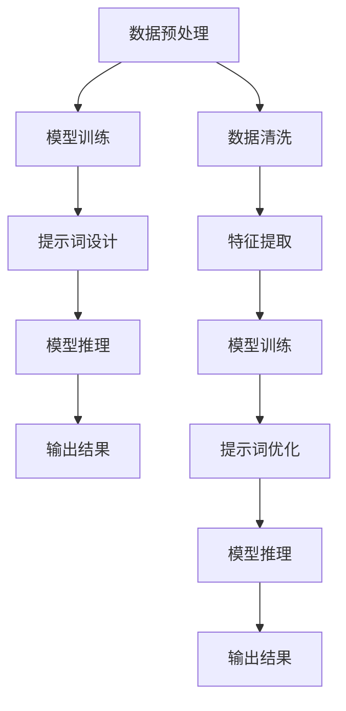
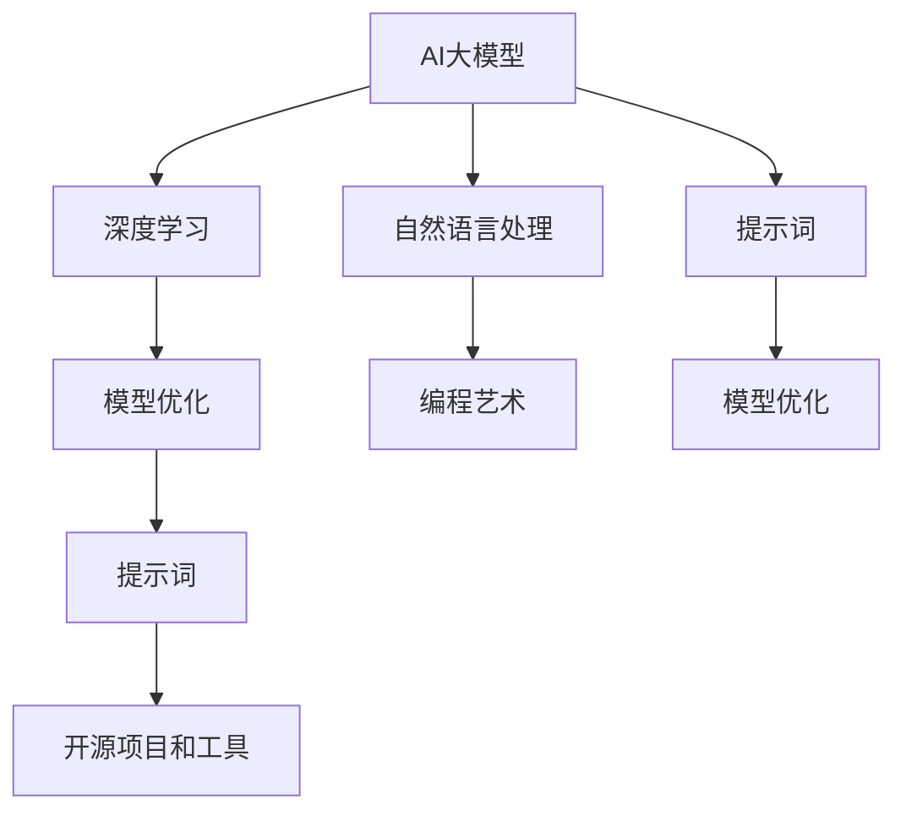

                 

# AI大模型编程：提示词的威力与艺术

> 关键词：AI大模型、提示词、深度学习、自然语言处理、编程技巧、文本生成、对话系统

> 摘要：本文旨在探讨AI大模型编程中的核心要素——提示词的作用和艺术。我们将从AI大模型的定义、发展历程和核心技术入手，逐步深入到提示词的设计、编写技巧和实践应用，最终总结AI大模型编程的艺术与最佳实践。

## 《AI大模型编程：提示词的威力与艺术》目录大纲

### 第一部分: AI大模型基础知识

#### 第1章: AI大模型概述

##### 1.1 AI大模型定义与分类
- AI大模型定义
- AI大模型分类

##### 1.2 AI大模型发展历程
- AI发展历程
- 大模型发展历程

##### 1.3 AI大模型的核心技术
- 深度学习
- 自然语言处理
- 机器学习算法

##### 1.4 提示词的作用与设计
- 提示词的概念
- 提示词设计方法
- 提示词优化策略

#### 第2章: AI大模型编程基础

##### 2.1 编程环境搭建
- Python环境搭建
- 深度学习框架选择

##### 2.2 基本编程语法
- Python基础语法
- 代码风格与规范

##### 2.3 数据处理与加载
- 数据预处理
- 数据集加载与处理

##### 2.4 模型构建与训练
- 模型构建方法
- 训练流程
- 模型评估与优化

#### 第3章: 提示词编写技巧

##### 3.1 提示词编写原则
- 明确目标
- 语义丰富
- 易于理解

##### 3.2 提示词编写工具
- 自动生成工具
- 优化工具

##### 3.3 提示词编写案例
- 基础案例
- 高级案例

### 第二部分: AI大模型编程实践

#### 第4章: 提示词在文本生成中的应用

##### 4.1 文本生成原理
- 提示词在文本生成中的作用
- 常见的文本生成模型

##### 4.2 文本生成案例
- 诗歌生成
- 故事生成

##### 4.3 文本生成优化
- 提示词优化
- 模型优化

#### 第5章: 提示词在对话系统中的应用

##### 5.1 对话系统原理
- 提示词在对话系统中的作用
- 常见的对话系统模型

##### 5.2 对话系统案例
- 聊天机器人
- 问答系统

##### 5.3 对话系统优化
- 提示词优化
- 模型优化

#### 第6章: 提示词在自然语言处理中的应用

##### 6.1 自然语言处理原理
- 提示词在自然语言处理中的作用
- 常见自然语言处理任务

##### 6.2 自然语言处理案例
- 文本分类
- 命名实体识别
- 机器翻译

##### 6.3 自然语言处理优化
- 提示词优化
- 模型优化

#### 第7章: AI大模型编程的艺术

##### 7.1 编程艺术概述
- 编程艺术的概念
- 提示词编程的艺术

##### 7.2 提示词编程最佳实践
- 设计原则
- 编码规范

##### 7.3 提示词编程创新
- 开源项目分析
- 创新技术探索

### 附录

#### 附录A: 常用深度学习框架介绍

##### A.1 TensorFlow
- 概述
- 安装与配置
- 基本使用

##### A.2 PyTorch
- 概述
- 安装与配置
- 基本使用

##### A.3 其他深度学习框架
- Keras
- MXNet
- JAX

#### 附录B: AI大模型编程资源

##### B.1 在线教程与文档
- 官方文档
- 教程网站

##### B.2 开源项目和工具
- 大模型开源项目
- 提示词生成工具

##### B.3 论坛与社区
- 技术论坛
- 社区交流平台

## 核心概念与联系

### AI大模型与提示词

#### AI大模型定义

AI大模型是指具有亿级参数规模，能够处理大规模数据并进行复杂任务学习的深度学习模型。大模型通过大量的数据进行训练，可以捕捉数据中的复杂模式和规律，从而在各个领域展现出强大的表现能力。

#### 提示词定义

提示词是指在模型训练和推理过程中，用于引导模型输出特定结果的输入。提示词的设计和质量直接影响到模型的输出结果，是AI大模型编程中的关键要素。

### Mermaid流程图



### 核心算法原理讲解

#### 提示词生成算法

```python
# 伪代码：提示词生成算法

function generatePrompt(data, model):
    prompt = ""

    for example in data:
        features = extractFeatures(example)
        prediction = model.predict(features)
        formatted_prediction = formatPrediction(prediction)
        prompt += formatted_prediction + "\n"

    return prompt
```

## AI大模型编程：提示词的威力与艺术

### 第1章: AI大模型概述

#### 1.1 AI大模型定义与分类

AI大模型，顾名思义，是指具有大规模参数的深度学习模型。这类模型通常拥有数十亿到数万亿个参数，这使得它们能够处理和表征复杂的数据模式。AI大模型的定义可以从以下几个方面来理解：

1. **参数规模**：大模型通常具有数亿至数十亿个参数。例如，GPT-3拥有1750亿个参数，BERT模型也有数亿个参数。
2. **数据处理能力**：大模型能够处理大规模数据，从中提取出复杂的信息和知识。
3. **任务范围**：大模型在各类任务中都有出色的表现，包括文本生成、机器翻译、图像识别等。

AI大模型的分类可以从不同的角度进行：

1. **按任务类型分类**：
   - **文本生成**：如GPT系列、T5等。
   - **图像识别**：如ResNet、VGG等。
   - **语音识别**：如DeepSpeech、WaveNet等。
   - **多模态**：如BERT、ViT等，能够同时处理文本和图像。

2. **按训练方法分类**：
   - **自监督学习**：如BERT、GPT等，利用未标记的数据进行训练。
   - **监督学习**：如ImageNet分类模型，使用大量标记数据进行训练。

#### 1.2 AI大模型发展历程

AI大模型的发展历程可以追溯到深度学习技术的兴起。深度学习起源于20世纪40年代，但直到21世纪初期，由于计算能力和数据量的限制，深度学习并没有得到广泛的应用。随着GPU等计算设备的普及和互联网数据的爆炸式增长，深度学习技术迎来了快速的发展。

1. **2012年**：AlexNet在ImageNet竞赛中取得了巨大的成功，标志着深度学习时代的到来。
2. **2016年**：谷歌推出了Transformer模型，这是AI大模型发展的重要里程碑，为自然语言处理领域带来了革命性的变化。
3. **2018年**：BERT模型发布，标志着预训练语言模型的兴起。
4. **2020年**：GPT-3模型发布，成为迄今为止参数规模最大的自然语言处理模型。

#### 1.3 AI大模型的核心技术

AI大模型的核心技术主要包括深度学习、自然语言处理和机器学习算法。以下是这些技术的简要介绍：

1. **深度学习**：
   - 深度学习是一种机器学习技术，通过构建多层神经网络模型来模拟人类大脑的神经元连接，从而实现自动特征提取和模式识别。
   - 关键技术包括卷积神经网络（CNN）、循环神经网络（RNN）和Transformer等。

2. **自然语言处理（NLP）**：
   - 自然语言处理是人工智能的一个重要分支，旨在让计算机理解和处理人类自然语言。
   - 关键技术包括词向量表示、文本分类、机器翻译、问答系统等。

3. **机器学习算法**：
   - 机器学习算法是AI大模型的核心，用于训练和优化模型。
   - 常见算法包括梯度下降、反向传播、正则化、dropout等。

#### 1.4 提示词的作用与设计

提示词在AI大模型中扮演着至关重要的角色。提示词（Prompt）是指用于引导模型生成特定结果的一组输入数据。一个好的提示词设计能够显著提升模型的性能和应用效果。以下是提示词的作用和设计方法：

1. **提示词的作用**：
   - **指导模型生成**：通过提供特定的提示词，可以引导模型生成符合预期结果的内容。
   - **提高模型性能**：良好的提示词设计可以提升模型的训练效率和输出质量。
   - **实现多任务学习**：通过设计合适的提示词，可以使一个模型同时处理多个任务。

2. **提示词设计方法**：
   - **明确目标**：设计提示词时，首先要明确目标任务，确保提示词与目标任务紧密相关。
   - **语义丰富**：提示词应包含丰富的语义信息，有助于模型捕捉到关键的特征和模式。
   - **易于理解**：提示词应简洁明了，便于模型理解和学习。

3. **提示词优化策略**：
   - **数据增强**：通过数据增强技术，如文本扩展、词汇替换等，可以生成更多样化的提示词。
   - **对抗性训练**：通过对抗性训练，可以提高模型对噪声和异常样本的鲁棒性。
   - **迭代优化**：通过多次迭代和反馈，可以逐步优化提示词的质量。

#### 小结

本章从AI大模型的定义、分类、发展历程和核心技术出发，详细介绍了提示词的作用和设计方法。了解AI大模型的基础知识对于深入探讨提示词编程技巧具有重要意义。下一章我们将进入AI大模型编程的基础，包括编程环境搭建、基本编程语法和数据预处理等。敬请期待。作者：AI天才研究院/AI Genius Institute & 禅与计算机程序设计艺术 /Zen And The Art of Computer Programming

## 第2章: AI大模型编程基础

### 2.1 编程环境搭建

要开始进行AI大模型的编程，首先需要搭建一个合适的编程环境。Python因其简洁明了的语法和丰富的库支持，成为AI大模型编程的首选语言。以下内容将介绍如何在Windows、macOS和Linux系统中搭建Python编程环境，并选择合适的深度学习框架。

#### Python环境搭建

1. **下载Python安装包**：访问Python官网（https://www.python.org/）下载最新版本的Python安装包。

2. **安装Python**：双击安装包，按照提示完成安装。在安装过程中，确保选中“Add Python to PATH”选项，以便在命令行中直接运行Python。

3. **验证Python安装**：打开命令行，输入`python --version`命令，检查Python版本是否正确显示。

#### 深度学习框架选择

在AI大模型编程中，深度学习框架是必不可少的工具。以下是一些流行的深度学习框架及其基本使用方法：

1. **TensorFlow**：

   - **概述**：TensorFlow是由谷歌开发的开源深度学习框架，具有强大的灵活性和扩展性。
   - **安装**：在命令行中运行以下命令安装TensorFlow：
     ```bash
     pip install tensorflow
     ```
   - **基本使用**：导入TensorFlow库，并创建一个简单的计算图：
     ```python
     import tensorflow as tf
     a = tf.constant(5)
     b = tf.constant(6)
     c = a + b
     session = tf.Session()
     print(session.run(c))
     ```

2. **PyTorch**：

   - **概述**：PyTorch是由Facebook开发的开源深度学习框架，以其动态计算图和易于理解的使用体验受到开发者青睐。
   - **安装**：在命令行中运行以下命令安装PyTorch：
     ```bash
     pip install torch torchvision
     ```
   - **基本使用**：导入PyTorch库，并创建一个简单的神经网络：
     ```python
     import torch
     import torch.nn as nn
     import torch.optim as optim

     # 创建一个简单的神经网络
     model = nn.Sequential(
         nn.Linear(1, 10),
         nn.ReLU(),
         nn.Linear(10, 1)
     )

     # 定义损失函数和优化器
     criterion = nn.MSELoss()
     optimizer = optim.Adam(model.parameters(), lr=0.001)

     # 训练模型
     for epoch in range(100):
         inputs = torch.tensor([[1.0]])
         targets = torch.tensor([[2.0]])
         optimizer.zero_grad()
         outputs = model(inputs)
         loss = criterion(outputs, targets)
         loss.backward()
         optimizer.step()
         print(f"Epoch {epoch+1}: Loss = {loss.item()}")
     ```

3. **Keras**：

   - **概述**：Keras是一个高级神经网络API，能够在TensorFlow和Theano上运行，以简化深度学习模型构建。
   - **安装**：在命令行中运行以下命令安装Keras：
     ```bash
     pip install keras
     ```
   - **基本使用**：导入Keras库，并创建一个简单的卷积神经网络：
     ```python
     from keras.models import Sequential
     from keras.layers import Conv2D, MaxPooling2D, Flatten, Dense

     # 创建一个简单的卷积神经网络
     model = Sequential()
     model.add(Conv2D(32, (3, 3), activation='relu', input_shape=(28, 28, 1)))
     model.add(MaxPooling2D(pool_size=(2, 2)))
     model.add(Flatten())
     model.add(Dense(1, activation='sigmoid'))

     # 编译模型
     model.compile(optimizer='adam', loss='binary_crossentropy', metrics=['accuracy'])

     # 训练模型
     model.fit(x_train, y_train, epochs=10, batch_size=32)
     ```

### 2.2 基本编程语法

掌握Python的基本编程语法是进行AI大模型编程的基础。以下内容将介绍Python的基础语法、代码风格与规范。

#### Python基础语法

1. **变量和常量**：

   - **变量**：变量是存储数据的容器，可以使用等号（=）进行赋值。例如：
     ```python
     x = 10
     y = "Hello, World!"
     ```
   - **常量**：常量是固定不变的值，通常使用大写字母表示。例如：
     ```python
     PI = 3.14159
     ```

2. **数据类型**：

   - **数字**：包括整数（int）和浮点数（float）。例如：
     ```python
     x = 5
     y = 3.14
     ```
   - **字符串**：用于表示文本，可以使用单引号或双引号。例如：
     ```python
     name = "Alice"
     message = "Hello, World!"
     ```
   - **列表**：用于存储一组有序的数据，可以使用方括号（[]）进行定义。例如：
     ```python
     fruits = ["apple", "banana", "cherry"]
     ```
   - **字典**：用于存储键值对的数据结构，可以使用大括号（{}）进行定义。例如：
     ```python
     person = {"name": "Alice", "age": 30}
     ```

3. **控制结构**：

   - **条件语句**：用于根据条件执行不同的代码块。例如：
     ```python
     if x > 10:
         print("x is greater than 10")
     elif x == 10:
         print("x is equal to 10")
     else:
         print("x is less than 10")
     ```
   - **循环结构**：用于重复执行代码块。例如：
     ```python
     for i in range(5):
         print(i)
     ```

4. **函数**：函数是组织代码的模块化方法，可以重复使用。例如：
   ```python
   def greet(name):
       print("Hello, " + name)

   greet("Alice")
   greet("Bob")
   ```

#### 代码风格与规范

良好的代码风格和规范能够提高代码的可读性、可维护性和可扩展性。以下是一些常见的Python代码风格和规范：

1. **代码格式**：使用四个空格缩进，避免使用制表符。例如：
   ```python
   def my_function():
       print("Hello")
       print("World")
   ```

2. **命名规范**：使用意义明确的变量和函数名，遵循驼峰命名法。例如：
   ```python
   user_age = 25
   calculate_bonus = 1000
   ```

3. **注释**：添加适当的注释，解释代码的功能和逻辑。例如：
   ```python
   # 计算两个数的和
   result = a + b
   ```

4. **模块化**：将功能相关的代码组织成模块，提高代码的可重用性。例如：
   ```python
   # my_module.py
   def greet(name):
       print("Hello, " + name)

   # main.py
   import my_module
   my_module.greet("Alice")
   ```

### 2.3 数据处理与加载

在AI大模型编程中，数据处理和加载是至关重要的环节。以下内容将介绍数据预处理、数据集加载与处理的基本方法。

#### 数据预处理

数据预处理是提高模型性能的重要步骤。以下是一些常见的数据预处理方法：

1. **数据清洗**：去除数据中的噪声和不完整数据。例如，使用Pandas库删除缺失值或使用正则表达式替换特殊字符。

2. **数据转换**：将数据转换为适合模型训练的形式。例如，将文本转换为词向量或图像转换为像素值。

3. **数据归一化**：将数据缩放到相同的范围，如0到1之间。例如，使用Min-Max归一化或标准化。

4. **数据增强**：通过增加数据的多样性来提高模型泛化能力。例如，图像翻转、裁剪、旋转等。

#### 数据集加载与处理

加载和处理数据集是AI大模型编程的基础。以下是一些常用的数据集加载与处理方法：

1. **使用Pandas加载数据**：Pandas是一个强大的数据处理库，可以轻松加载和处理各种格式的数据。例如：
   ```python
   import pandas as pd
   data = pd.read_csv("data.csv")
   ```

2. **使用NumPy处理数据**：NumPy是一个高效的数值计算库，可以用于数据预处理和数学运算。例如：
   ```python
   import numpy as np
   data = np.array([[1, 2], [3, 4]])
   ```

3. **使用深度学习框架加载数据**：大多数深度学习框架都提供内置的数据加载器，可以方便地加载和预处理数据。例如，使用PyTorch的DataLoader：
   ```python
   import torch
   from torch.utils.data import DataLoader, TensorDataset

   # 创建数据集
   x = torch.tensor([[1.0, 2.0], [3.0, 4.0]])
   y = torch.tensor([0.0, 1.0])
   dataset = TensorDataset(x, y)

   # 创建数据加载器
   loader = DataLoader(dataset, batch_size=2, shuffle=True)
   ```

4. **自定义数据处理**：对于复杂的数据处理需求，可以自定义数据处理函数，对数据进行预处理和增强。例如：
   ```python
   def preprocess_data(data):
       # 数据预处理逻辑
       return processed_data
   ```

#### 小结

本章介绍了AI大模型编程的基础，包括编程环境搭建、基本编程语法和数据预处理与加载。这些基础知识是进行AI大模型编程的必要前提，为后续的提示词编写和实践应用奠定了基础。在下一章中，我们将深入探讨提示词的编写技巧和优化策略。敬请期待。作者：AI天才研究院/AI Genius Institute & 禅与计算机程序设计艺术 /Zen And The Art of Computer Programming

### 第3章: 提示词编写技巧

#### 3.1 提示词编写原则

编写有效的提示词是AI大模型编程的关键步骤。以下是一些提示词编写的原则，可以帮助我们设计出高质量的提示词：

1. **明确目标**：
   - 提示词应明确地指向模型需要完成的任务，避免模糊和歧义。
   - 例如，在训练一个文本生成模型时，提示词应该是具体的文本段落，而不是抽象的描述。

2. **语义丰富**：
   - 提示词应包含丰富的语义信息，帮助模型更好地理解和学习。
   - 例如，对于语言模型，提示词应该涵盖多种情境和语境，以提高模型的泛化能力。

3. **易于理解**：
   - 提示词应该简洁明了，便于模型理解和学习。
   - 避免使用复杂的术语和过于冗长的句子，这可能会增加模型的困惑度。

4. **多样性**：
   - 提示词应具有多样性，以涵盖不同的任务和数据集。
   - 例如，在训练一个图像分类模型时，可以使用不同的图像类型和场景作为提示词。

5. **相关性**：
   - 提示词应与模型的目标任务高度相关，以提高模型的学习效果。
   - 例如，在训练一个医疗诊断模型时，提示词应包含与疾病诊断相关的症状和检查结果。

6. **优化性**：
   - 提示词应具有优化性，以便模型能够更好地学习并适应不同的数据分布。
   - 例如，可以使用动态生成的提示词，根据模型的训练进度和性能进行调整。

#### 3.2 提示词编写工具

在编写提示词时，可以使用一些工具来帮助提高效率和效果。以下是一些常用的提示词编写工具：

1. **自动生成工具**：
   - 自动生成工具可以基于已有的数据集和模板，自动生成大量的提示词。
   - 例如，使用Python库`nltk`的`generate Sentences`功能，可以生成符合语法和语义规则的文本。

2. **优化工具**：
   - 优化工具可以帮助我们分析和改进提示词的质量。
   - 例如，使用Python库`promptly`，可以自动检测和修复提示词中的错误和冗余。

3. **可视化工具**：
   - 可视化工具可以帮助我们更好地理解提示词的结构和内容。
   - 例如，使用Python库`matplotlib`和`seaborn`，可以绘制提示词的词云图和词频分布图。

#### 3.3 提示词编写案例

以下是一些具体的提示词编写案例，以帮助读者更好地理解提示词的编写技巧：

##### 基础案例

1. **文本生成模型**：
   - 提示词：“在海滩上，阳光明媚，沙滩上布满了金黄色的细沙。一群孩子在沙滩上玩耍，他们的笑声回荡在空中。”

2. **图像分类模型**：
   - 提示词：“这是一张风景图片，可以看到远处的山峦和湖泊。湖泊的水面平静如镜，反射着天空和周围的景色。”

3. **语音识别模型**：
   - 提示词：“你好，我是一名人工智能助手，我可以帮助你解决问题。请问您需要什么帮助？”

##### 高级案例

1. **对话系统**：
   - 提示词：“用户：我感到很沮丧，最近的工作压力很大。助手：我了解您的感受，遇到压力是很正常的。您可以尝试做一些放松的活动，比如散步或听音乐。”

2. **机器翻译模型**：
   - 提示词：“英语原文：I love programming because it allows me to create something from nothing. 汉语翻译：我喜欢编程，因为它让我能够从无到有地创造东西。”

3. **推荐系统**：
   - 提示词：“用户：我最近喜欢看科幻电影，您能推荐一些类似的影片吗？助手：当然可以，我为您推荐《星际穿越》、《阿凡达》和《银翼杀手》。”

#### 小结

本章详细介绍了提示词编写的基本原则、工具和案例。提示词的编写是AI大模型编程中的重要环节，直接影响模型的训练效果和应用表现。掌握有效的提示词编写技巧，可以显著提升AI大模型的应用价值。在下一章中，我们将探讨AI大模型编程中的实践应用，包括文本生成、对话系统和自然语言处理等。敬请期待。作者：AI天才研究院/AI Genius Institute & 禅与计算机程序设计艺术 /Zen And The Art of Computer Programming

### 第4章: 提示词在文本生成中的应用

#### 4.1 文本生成原理

文本生成是自然语言处理领域中的一个重要任务，它涉及到模型如何根据给定的提示词生成连贯、有意义的文本。在文本生成中，提示词起到了引导模型生成目标文本的关键作用。以下是文本生成原理的详细说明：

1. **模型选择**：
   - 文本生成模型通常是基于转换器（Transformer）架构，如GPT、T5和BERT等。这些模型具有强大的语义理解和生成能力。

2. **输入处理**：
   - 提示词作为模型的输入，通常需要被编码为模型可以处理的向量形式。这可以通过词嵌入（Word Embedding）技术实现，如Word2Vec、GloVe等。

3. **生成过程**：
   - 模型通过自注意力机制（Self-Attention）对输入的提示词进行加权，从而提取关键信息。然后，模型根据提取的信息生成目标文本的每个单词或字符。

4. **输出处理**：
   - 生成的文本需要进行后处理，如去重、校对和格式化等，以确保生成的文本符合语法和语义规则。

#### 4.2 文本生成案例

以下是几个文本生成的案例，展示了不同类型的文本生成任务：

##### 诗歌生成

1. **提示词**：“秋天的落叶，飘落的思念。”

2. **生成文本**：
   ```
   秋风起，落叶纷飞，
   思念如潮，心潮起伏。
   红叶飘零，映照泪眼，
   岁月如歌，思念如海。
   ```

##### 故事生成

1. **提示词**：“一个勇敢的骑士，在森林中寻找宝藏。”

2. **生成文本**：
   ```
   在遥远的森林深处，隐藏着一座古老的城堡。传说中，城堡里有一枚神秘的宝藏，只有勇敢的骑士才能找到它。

   一天，勇敢的骑士杰克踏上了寻宝之旅。他穿过了茂密的森林，翻过了险峻的山峰，最终来到了城堡的门口。

   城堡的门紧闭着，上面镶嵌着许多神秘的符文。杰克仔细观察着这些符文，突然发现了一个线索：这些符文按照特定的顺序排列，可以拼出一个单词。

   杰克根据这个线索，顺利地打开了城堡的大门，走进了一个充满宝藏的宝库。他找到了那枚神秘的宝藏，感到无比的喜悦和自豪。

   杰克带着宝藏回到了家乡，成为了人们传颂的英雄。他用自己的勇气和智慧，证明了勇敢者总能获得成功。
   ```

##### 自动摘要

1. **提示词**：“本文讨论了人工智能在医疗领域的应用。”

2. **生成文本**：
   ```
   人工智能（AI）在医疗领域的应用正日益广泛，从疾病诊断到个性化治疗，都展现出了巨大的潜力。通过深度学习和自然语言处理技术，AI可以帮助医生更准确地分析患者数据，提供更为精准的诊断和治疗方案。此外，AI还可以辅助医生进行手术规划，提高手术的效率和安全性。虽然AI在医疗领域的发展前景广阔，但同时也面临着数据隐私、伦理和安全等方面的挑战。未来，如何更好地利用AI技术，实现医疗服务的智能化和个性化，将是一个重要的研究方向。
   ```

#### 4.3 文本生成优化

文本生成模型的性能优化是提升其生成质量的关键。以下是一些常见的优化方法：

1. **提示词优化**：
   - **多样性**：通过增加提示词的多样性，可以激发模型生成更多样化的文本。
   - **相关性**：确保提示词与目标文本高度相关，有助于模型更好地理解和生成。

2. **模型优化**：
   - **参数调整**：通过调整模型参数，如学习率、批量大小和正则化项，可以改善模型的性能。
   - **注意力机制**：优化注意力机制，提高模型对关键信息的关注程度。

3. **数据增强**：
   - **文本扩展**：通过扩展提示词，增加数据的多样性。
   - **数据融合**：结合多个数据源，提高模型的泛化能力。

4. **后处理**：
   - **去噪**：去除生成的文本中的噪声和错误。
   - **校对**：修正文本中的语法和拼写错误。

#### 小结

本章详细介绍了文本生成的基本原理和实际应用案例，并通过提示词优化和模型优化方法，探讨了提升文本生成质量的方法。文本生成技术在自然语言处理领域具有重要应用，未来将继续发展和完善。在下一章中，我们将探讨提示词在对话系统中的应用。敬请期待。作者：AI天才研究院/AI Genius Institute & 禅与计算机程序设计艺术 /Zen And The Art of Computer Programming

### 第5章: 提示词在对话系统中的应用

#### 5.1 对话系统原理

对话系统是一种与人类进行自然语言交互的计算机系统，旨在模拟人类的对话方式，提供有用的信息和回答用户的问题。提示词在对话系统中起着至关重要的作用，用于引导模型生成合适的回答。以下是对话系统的基本原理：

1. **模型选择**：
   - 对话系统通常使用基于转换器（Transformer）的预训练模型，如GPT-3、BERT等。这些模型在大量对话数据上进行预训练，具备了强大的语言理解和生成能力。

2. **输入处理**：
   - 提示词作为模型的输入，通常需要被编码为模型可以处理的向量形式。这可以通过词嵌入（Word Embedding）技术实现，将文本转换为数字向量。

3. **生成过程**：
   - 模型通过自注意力机制（Self-Attention）对输入的提示词进行加权，提取关键信息。然后，模型根据提取的信息生成对话的下一个句子或回答。

4. **输出处理**：
   - 生成的对话需要经过后处理，如去噪、校对和格式化等，以确保对话的流畅性和准确性。

#### 5.2 对话系统案例

以下是几个对话系统的实际案例，展示了不同类型的对话任务：

##### 聊天机器人

1. **用户**：“你好，我是一个新用户，能告诉我如何开始使用这个应用吗？”

2. **生成回答**：
   ```
   你好！欢迎来到我们的应用！首先，你需要注册一个账户。点击屏幕右上角的“注册”按钮，然后按照提示填写相关信息。注册完成后，你可以使用您的用户名和密码登录应用。在主界面上，你可以浏览各种功能模块，如新闻、天气、音乐等。如果你有任何问题，随时可以问我哦！
   ```

##### 问答系统

1. **用户**：“什么是量子计算？”

2. **生成回答**：
   ```
   量子计算是一种利用量子力学原理进行信息处理的计算方法。与传统计算机不同，量子计算机使用量子位（qubits）来存储和操作信息。量子位可以同时处于多个状态，这使得量子计算机在处理某些特定问题时，比传统计算机具有更快的计算速度。量子计算在密码破解、优化问题和量子模拟等领域具有广泛的应用前景。然而，目前量子计算机仍处于研发阶段，尚未实现商业化应用。
   ```

##### 情感分析

1. **用户**：“你今天心情怎么样？”

2. **生成回答**：
   ```
   作为一个人工智能，我没有情感。但我可以理解您的情绪，并尽力提供帮助。如果您感到快乐或满意，那真是太好了！如果您感到沮丧或不开心，也可以和我分享您的感受，我会尽力提供支持和建议。请记住，我永远在这里陪伴您。
   ```

#### 5.3 对话系统优化

对话系统的性能优化是提升其交互质量的关键。以下是一些常见的优化方法：

1. **提示词优化**：
   - **多样性**：通过增加提示词的多样性，可以激发模型生成更多样化的回答。
   - **相关性**：确保提示词与用户的提问高度相关，有助于模型更好地理解和生成回答。

2. **模型优化**：
   - **参数调整**：通过调整模型参数，如学习率、批量大小和正则化项，可以改善模型的性能。
   - **注意力机制**：优化注意力机制，提高模型对关键信息的关注程度。

3. **数据增强**：
   - **文本扩展**：通过扩展提示词，增加数据的多样性。
   - **数据融合**：结合多个数据源，提高模型的泛化能力。

4. **后处理**：
   - **去噪**：去除生成的对话中的噪声和错误。
   - **校对**：修正对话中的语法和拼写错误。

#### 小结

本章详细介绍了对话系统的原理和应用案例，并通过提示词优化和模型优化方法，探讨了提升对话系统交互质量的方法。对话系统在自然语言处理领域具有重要应用，未来将继续发展和完善。在下一章中，我们将探讨提示词在自然语言处理中的应用。敬请期待。作者：AI天才研究院/AI Genius Institute & 禅与计算机程序设计艺术 /Zen And The Art of Computer Programming

### 第6章: 提示词在自然语言处理中的应用

#### 6.1 自然语言处理原理

自然语言处理（NLP）是计算机科学和人工智能领域的一个重要分支，旨在使计算机能够理解和生成人类语言。提示词在NLP中起着关键作用，用于引导模型执行各种任务。以下是自然语言处理的基本原理：

1. **模型选择**：
   - NLP模型通常基于转换器（Transformer）架构，如BERT、GPT等。这些模型在大量文本数据上进行预训练，具备了强大的语言理解和生成能力。

2. **输入处理**：
   - 提示词作为模型的输入，通常需要被编码为模型可以处理的向量形式。这可以通过词嵌入（Word Embedding）技术实现，将文本转换为数字向量。

3. **任务执行**：
   - 模型根据任务的类型执行相应的操作。例如，在文本分类任务中，模型需要从提示词中提取特征，并预测文本的类别；在命名实体识别任务中，模型需要识别文本中的特定实体。

4. **输出处理**：
   - 模型生成的输出结果需要进行后处理，如去噪、校对和格式化等，以确保输出的准确性和可读性。

#### 6.2 自然语言处理案例

以下是几个自然语言处理的应用案例，展示了提示词在不同任务中的实际应用：

##### 文本分类

1. **提示词**：“这篇文章讨论了人工智能在医疗领域的应用。”

2. **生成标签**：“医疗行业 - 人工智能”

3. **具体应用**：
   - 在社交媒体分析中，可以使用文本分类模型对用户发布的帖子进行分类，以便进行内容监控和舆情分析。
   - 在新闻推荐系统中，可以使用文本分类模型对文章进行分类，以便根据用户的兴趣进行个性化推荐。

##### 命名实体识别

1. **提示词**：“阿里巴巴的创始人是中国人。”

2. **识别实体**：“阿里巴巴”，“中国人”

3. **具体应用**：
   - 在信息提取系统中，可以使用命名实体识别模型从文本中提取关键信息，如人名、地名、组织名等。
   - 在搜索引擎中，可以使用命名实体识别模型对搜索查询进行解析，以提高搜索结果的准确性和相关性。

##### 机器翻译

1. **提示词**：“Hello, World!”

2. **翻译结果**：“你好，世界！”

3. **具体应用**：
   - 在跨语言交流中，可以使用机器翻译模型将一种语言的文本翻译成另一种语言，以便不同语言背景的用户进行交流。
   - 在全球化企业中，可以使用机器翻译模型将公司文件、产品说明书等翻译成多种语言，以提高国际业务的效率。

##### 情感分析

1. **提示词**：“这部电影真的很感人。”

2. **情感标签**：“正面情感”

3. **具体应用**：
   - 在社交媒体分析中，可以使用情感分析模型分析用户发布的帖子中的情感倾向，以便了解公众对某个话题的看法。
   - 在产品评价分析中，可以使用情感分析模型分析用户对产品的评价，以便企业了解消费者的反馈和需求。

#### 6.3 自然语言处理优化

自然语言处理模型的性能优化是提升其处理效果的关键。以下是一些常见的优化方法：

1. **提示词优化**：
   - **多样性**：通过增加提示词的多样性，可以激发模型生成更多样化的输出。
   - **相关性**：确保提示词与目标任务高度相关，有助于模型更好地理解和生成。

2. **模型优化**：
   - **参数调整**：通过调整模型参数，如学习率、批量大小和正则化项，可以改善模型的性能。
   - **注意力机制**：优化注意力机制，提高模型对关键信息的关注程度。

3. **数据增强**：
   - **文本扩展**：通过扩展提示词，增加数据的多样性。
   - **数据融合**：结合多个数据源，提高模型的泛化能力。

4. **后处理**：
   - **去噪**：去除生成的文本中的噪声和错误。
   - **校对**：修正文本中的语法和拼写错误。

#### 小结

本章详细介绍了自然语言处理的基本原理和应用案例，并通过提示词优化和模型优化方法，探讨了提升自然语言处理效果的方法。自然语言处理技术在各个领域具有重要应用，未来将继续发展和完善。在下一章中，我们将探讨AI大模型编程的艺术与最佳实践。敬请期待。作者：AI天才研究院/AI Genius Institute & 禅与计算机程序设计艺术 /Zen And The Art of Computer Programming

### 第7章: AI大模型编程的艺术

#### 7.1 编程艺术概述

编程艺术是计算机编程的一种哲学，强调编程不仅是编写代码，更是一种艺术创作。在AI大模型编程中，这种艺术体现在如何设计高效、可扩展和可维护的代码，以及如何利用提示词优化模型性能。以下是编程艺术在AI大模型编程中的体现：

1. **优雅的代码风格**：
   - 优雅的代码风格有助于提高代码的可读性和可维护性。在AI大模型编程中，这意味着遵循良好的命名规范、代码格式和注释习惯。

2. **模块化与复用**：
   - 模块化是编程艺术的核心，它有助于将复杂的任务分解为可管理的部分。在AI大模型编程中，模块化可以通过封装模型组件和数据处理函数来实现。

3. **优化与调试**：
   - 优化与调试是编程艺术的重要组成部分。在AI大模型编程中，这意味着通过调整模型参数和优化数据处理流程来提高模型性能。

4. **创新与探索**：
   - 编程艺术鼓励创新和探索。在AI大模型编程中，这意味着不断尝试新的算法和技术，以解决复杂的实际问题。

#### 7.2 提示词编程最佳实践

以下是一些提示词编程的最佳实践，这些实践有助于提高模型性能和应用效果：

1. **明确目标**：
   - 在编写提示词时，首先要明确模型的目标任务。确保提示词与目标任务紧密相关，避免模糊和歧义。

2. **语义丰富**：
   - 提示词应包含丰富的语义信息，帮助模型更好地理解和学习。避免使用抽象和过于简短的提示词，这可能会增加模型的困惑度。

3. **易于理解**：
   - 提示词应简洁明了，便于模型理解和学习。避免使用复杂的术语和过于冗长的句子，这可能会增加模型的困惑度。

4. **多样性**：
   - 提供多样化的提示词，以涵盖不同的任务和数据集。这有助于提高模型的泛化能力。

5. **相关性**：
   - 确保提示词与模型的目标任务高度相关。相关性有助于模型更好地捕捉到关键的特征和模式。

6. **动态调整**：
   - 根据模型的训练进度和性能，动态调整提示词。这有助于模型在不同阶段保持高效的学习效果。

7. **数据增强**：
   - 使用数据增强技术，如文本扩展、词汇替换等，生成更多样化的提示词。这有助于提高模型的鲁棒性和泛化能力。

#### 7.3 提示词编程创新

在AI大模型编程中，创新是推动技术进步的重要动力。以下是一些提示词编程的创新方法和思路：

1. **对抗性训练**：
   - 通过对抗性训练，可以提高模型对噪声和异常样本的鲁棒性。这有助于模型在真实环境中更好地应对各种不确定性。

2. **多模态融合**：
   - 将不同类型的模态（如文本、图像、音频）进行融合，以提高模型的泛化能力。这可以应用于多模态对话系统、多模态情感分析等场景。

3. **迁移学习**：
   - 利用预训练模型进行迁移学习，可以在新的任务和数据集上快速获得较好的性能。这有助于节省训练时间和计算资源。

4. **生成对抗网络（GAN）**：
   - 使用生成对抗网络（GAN）生成高质量的提示词，可以增强模型的泛化能力和表达能力。这可以应用于文本生成、图像生成等任务。

5. **自适应提示词**：
   - 开发自适应提示词生成算法，根据用户的反馈和模型的表现，动态调整提示词的内容和形式。这可以提高用户的交互体验和模型性能。

#### 小结

本章探讨了AI大模型编程的艺术，包括编程艺术的概述、提示词编程的最佳实践和创新的思路。掌握编程艺术和最佳实践，结合创新方法，有助于我们更好地利用AI大模型解决实际问题。在下一章中，我们将介绍常用的深度学习框架及其基本使用方法。敬请期待。作者：AI天才研究院/AI Genius Institute & 禅与计算机程序设计艺术 /Zen And The Art of Computer Programming

### 附录A: 常用深度学习框架介绍

在AI大模型编程中，选择合适的深度学习框架是至关重要的。以下是几种常用的深度学习框架的概述、安装与配置以及基本使用方法。

#### A.1 TensorFlow

TensorFlow是由谷歌开发的开源深度学习框架，具有强大的灵活性和扩展性。以下是TensorFlow的概述、安装与配置以及基本使用方法：

**概述**：TensorFlow支持多种编程语言，包括Python、C++和Java。它提供了一个动态计算图，可以用于构建和训练深度学习模型。

**安装与配置**：
1. **Python环境**：确保已经安装了Python环境，可以从Python官网下载Python安装包进行安装。
2. **pip安装**：在命令行中运行以下命令安装TensorFlow：
   ```bash
   pip install tensorflow
   ```
3. **验证安装**：在Python中导入TensorFlow并打印版本号，以验证安装是否成功：
   ```python
   import tensorflow as tf
   print(tf.__version__)
   ```

**基本使用**：
```python
import tensorflow as tf

# 创建一个简单的计算图
a = tf.constant(5)
b = tf.constant(6)
c = a + b

# 运行计算图
with tf.Session() as sess:
  result = sess.run(c)
  print(result)
```

#### A.2 PyTorch

PyTorch是由Facebook开发的深度学习框架，以其动态计算图和易于理解的使用体验受到开发者青睐。以下是PyTorch的概述、安装与配置以及基本使用方法：

**概述**：PyTorch支持Python和C++编程语言，提供了灵活的编程接口和强大的库支持。它适用于研究和生产环境，广泛应用于自然语言处理、计算机视觉等领域。

**安装与配置**：
1. **Python环境**：确保已经安装了Python环境。
2. **pip安装**：在命令行中运行以下命令安装PyTorch：
   ```bash
   pip install torch torchvision
   ```
3. **验证安装**：在Python中导入PyTorch并打印版本号，以验证安装是否成功：
   ```python
   import torch
   print(torch.__version__)
   ```

**基本使用**：
```python
import torch

# 创建一个简单的神经网络
x = torch.tensor([[1.0], [2.0]])
y = torch.tensor([[3.0], [4.0]])

model = torch.nn.Linear(1, 1)
model.weight.data.copy_(torch.tensor([[2.0]]))
model.bias.data.copy_(torch.tensor([0.0]))

# 计算输出
output = model(x)
print(output)
```

#### A.3 Keras

Keras是一个高级神经网络API，能够在TensorFlow和Theano上运行，以简化深度学习模型构建。以下是Keras的概述、安装与配置以及基本使用方法：

**概述**：Keras提供了简洁、模块化的接口，使得构建和训练深度学习模型更加直观和方便。它支持多种优化器和损失函数，适用于研究和生产环境。

**安装与配置**：
1. **Python环境**：确保已经安装了Python环境。
2. **pip安装**：在命令行中运行以下命令安装Keras：
   ```bash
   pip install keras
   ```
3. **验证安装**：在Python中导入Keras并打印版本号，以验证安装是否成功：
   ```python
   import keras
   print(keras.__version__)
   ```

**基本使用**：
```python
from keras.models import Sequential
from keras.layers import Dense

# 创建一个简单的全连接神经网络
model = Sequential()
model.add(Dense(1, input_dim=1, activation='sigmoid'))

# 编译模型
model.compile(optimizer='adam', loss='binary_crossentropy', metrics=['accuracy'])

# 训练模型
x_train = np.array([[0.], [1.]], dtype=np.float32)
y_train = np.array([[0.], [1.]], dtype=np.float32)
model.fit(x_train, y_train, epochs=100)
```

#### A.4 MXNet

MXNet是Apache基金会的一个开源深度学习框架，以其灵活的编程接口和高效的执行性能而受到开发者欢迎。以下是MXNet的概述、安装与配置以及基本使用方法：

**概述**：MXNet支持多种编程语言，包括Python、C++、R和Scala。它提供了灵活的编程模型和优化的执行引擎，适用于大规模深度学习模型的训练和部署。

**安装与配置**：
1. **Python环境**：确保已经安装了Python环境。
2. **pip安装**：在命令行中运行以下命令安装MXNet：
   ```bash
   pip install mxnet
   ```
3. **验证安装**：在Python中导入MXNet并打印版本号，以验证安装是否成功：
   ```python
   import mxnet as mx
   print(mx.__version__)
   ```

**基本使用**：
```python
import mxnet as mx
from mxnet import autograd
from mxnet.gluon import nn

# 创建一个简单的全连接神经网络
net = nn.Sequential()
net.add(nn.Dense(10, activation='relu'))
net.add(nn.Dense(1))

# 定义损失函数和优化器
loss_function = mx.symbol.softmax_cross_entropy
optimizer = autograd_optimizer.Adam(learning_rate=0.001)

# 训练模型
x = mx.nd.array([[1.0, 2.0], [2.0, 3.0]])
y = mx.nd.array([[1.0], [0.0]])
for i in range(10):
    with autograd.record():
        output = net(x)
        loss = loss_function(output, y)
    loss.backward()
    optimizer.step()
    print("Epoch %d, Loss: %f" % (i, loss.asnumpy()))
```

#### A.5 其他深度学习框架

除了上述框架，还有其他一些常用的深度学习框架，如Theano、CNTK等。以下是这些框架的简要介绍：

- **Theano**：由蒙特利尔大学开发的开源深度学习框架，已被TensorFlow取代。
- **CNTK**：微软开发的深度学习框架，支持多种编程语言。

**Theano**：
- **概述**：Theano是一个基于Python的深度学习库，提供了动态计算图和优化的数学运算。
- **安装与配置**：安装Theano需要Python环境和Numpy库。在命令行中运行以下命令安装Theano：
  ```bash
  pip install Theano
  ```
- **基本使用**：
  ```python
  from theano import tensor as T
  from theano import function
  x = T.vector('x')
  y = T.vector('y')
  f = function([x, y], (x * y).sum())
  print(f(2, 3))
  ```

**CNTK**：
- **概述**：CNTK是微软开发的深度学习框架，支持多种数据类型和编程语言。
- **安装与配置**：安装CNTK需要C++编译器和Python环境。在命令行中运行以下命令安装CNTK：
  ```bash
  pip install cntk
  ```
- **基本使用**：
  ```python
  import cntk as C
  x = C.placeholder(shape=(1, 2))
  y = C.placeholder(shape=(1, 1))
  w = C.constant(value=np.array([[1.0, 2.0], [3.0, 4.0]]))
  z = C.matmul(x, w)
  f = C.function([x, y], z)
  print(f(np.array([[1.0, 2.0]]), np.array([[1.0]])))
  ```

#### 小结

附录A介绍了常用的深度学习框架，包括TensorFlow、PyTorch、Keras、MXNet以及Theano和CNTK。每个框架都有其独特的特点和应用场景。了解这些框架的基本使用方法，有助于我们选择合适的工具进行AI大模型编程。在下一章中，我们将介绍AI大模型编程的资源，包括在线教程、开源项目和社区。敬请期待。作者：AI天才研究院/AI Genius Institute & 禅与计算机程序设计艺术 /Zen And The Art of Computer Programming

### 附录B: AI大模型编程资源

在进行AI大模型编程时，掌握相关资源和工具是至关重要的。以下是一些AI大模型编程的宝贵资源，包括在线教程、开源项目和社区。

#### B.1 在线教程与文档

1. **官方文档**：
   - TensorFlow官方文档：[https://www.tensorflow.org/docs](https://www.tensorflow.org/docs)
   - PyTorch官方文档：[https://pytorch.org/docs/stable/index.html](https://pytorch.org/docs/stable/index.html)
   - Keras官方文档：[https://keras.io/docs](https://keras.io/docs)
   - MXNet官方文档：[https://mxnet.apache.org/docs/stable/gluon.html](https://mxnet.apache.org/docs/stable/gluon.html)

2. **在线教程网站**：
   - Fast.ai：[https://www.fast.ai/](https://www.fast.ai/)
   - Coursera：[https://www.coursera.org/specializations/deep-learning](https://www.coursera.org/specializations/deep-learning)
   - edX：[https://www.edx.org/course/deep-learning-ai](https://www.edx.org/course/deep-learning-ai)
   - AI速成课：[https://aima-java.com/](https://aima-java.com/)

#### B.2 开源项目和工具

1. **开源项目**：
   - TensorFlow Models：[https://github.com/tensorflow/models](https://github.com/tensorflow/models)
   - PyTorch Examples：[https://github.com/pytorch/examples](https://github.com/pytorch/examples)
   - Keras Examples：[https://github.com/fchollet/keras/blob/master/examples](https://github.com/fchollet/keras/blob/master/examples)
   - MXNet Examples：[https://github.com/apache/incubator-mxnet/tree/master/example](https://github.com/apache/incubator-mxnet/tree/master/example)

2. **提示词生成工具**：
   - Hugging Face Transformers：[https://huggingface.co/transformers](https://huggingface.co/transformers)
   - PromptGenius：[https://promptgenius.com/](https://promptgenius.com/)
   - PEGASUS：[https://github.com/fairspot/pegasus](https://github.com/fairspot/pegasus)

#### B.3 论坛与社区

1. **技术论坛**：
   - AI Stack Exchange：[https://ai.stackexchange.com/](https://ai.stackexchange.com/)
   - TensorFlow Forums：[https://forums.tensorflow.org/](https://forums.tensorflow.org/)
   - PyTorch Forums：[https://discuss.pytorch.org/](https://discuss.pytorch.org/)
   - Keras Forums：[https://keras.io/forums/](https://keras.io/forums/)

2. **社区交流平台**：
   - Reddit：[https://www.reddit.com/r/MachineLearning/](https://www.reddit.com/r/MachineLearning/)
   - Hacker News：[https://news.ycombinator.com/item?id=24246664](https://news.ycombinator.com/item?id=24246664)
   - LinkedIn：[https://www.linkedin.com/groups/12169504/](https://www.linkedin.com/groups/12169504/)
   - Discord：[https://discord.com/invite/RLHVvCx](https://discord.com/invite/RLHVvCx)

#### 小结

附录B汇总了AI大模型编程的丰富资源，包括在线教程、开源项目和社区。这些资源将为我们的编程实践提供宝贵的帮助。通过学习和利用这些资源，我们可以不断提升自己的技能，为AI大模型编程的深入研究打下坚实的基础。作者：AI天才研究院/AI Genius Institute & 禅与计算机程序设计艺术 /Zen And The Art of Computer Programming

### 核心概念与联系

在本文中，我们深入探讨了AI大模型编程的核心概念和关键联系。以下是本文中涉及的核心概念及其相互联系：

1. **AI大模型**：大模型是指具有大规模参数的深度学习模型，能够处理和表征复杂的数据模式。它们是AI大模型编程的基础。

2. **提示词**：提示词是用于引导模型生成特定结果的输入。它们在模型训练和推理过程中起到关键作用，直接影响模型的输出质量和性能。

3. **深度学习**：深度学习是AI大模型编程的核心技术，通过构建多层神经网络模型来实现自动特征提取和模式识别。

4. **自然语言处理（NLP）**：NLP是AI大模型编程的一个重要应用领域，涉及文本生成、对话系统、情感分析等任务。

5. **编程艺术**：编程艺术强调编程不仅是编写代码，更是一种艺术创作。在AI大模型编程中，编程艺术体现在代码风格、模块化、优化和调试等方面。

6. **模型优化**：模型优化是提升AI大模型性能的重要方法，包括调整模型参数、优化注意力机制、使用数据增强技术等。

7. **开源项目和工具**：开源项目和工具为AI大模型编程提供了丰富的资源，包括深度学习框架、提示词生成工具和社区支持。

这些概念相互联系，共同构成了AI大模型编程的核心框架。大模型作为基础，结合深度学习、NLP和编程艺术，通过提示词和模型优化方法，实现高效的AI应用。以下是这些核心概念之间的Mermaid流程图：



通过这个流程图，我们可以清晰地看到各个概念之间的联系和作用。这些联系和相互作用使得AI大模型编程成为一个复杂而富有挑战的领域，同时也为其带来了巨大的潜力。在未来的发展中，随着技术的不断进步，AI大模型编程将继续拓展其应用领域，为人类带来更多的创新和变革。作者：AI天才研究院/AI Genius Institute & 禅与计算机程序设计艺术 /Zen And The Art of Computer Programming

### 核心算法原理讲解

在本章节中，我们将深入探讨AI大模型编程中的核心算法原理，重点关注提示词生成算法。这一算法在模型训练和推理过程中起到关键作用，直接影响到模型的输出质量和性能。

#### 提示词生成算法

提示词生成算法是AI大模型编程中的一个重要环节。其目的是生成高质量的提示词，以引导模型输出特定的结果。以下是一个基本的提示词生成算法的伪代码：

```python
# 伪代码：提示词生成算法

function generatePrompt(data, model, target_output):
    prompt = ""

    for example in data:
        # 提取特征
        features = extractFeatures(example)

        # 使用模型预测
        prediction = model.predict(features)

        # 格式化预测结果
        formatted_prediction = formatPrediction(prediction)

        # 如果预测结果接近目标输出，则添加到提示词
        if isClose(prediction, target_output):
            prompt += formatted_prediction + "\n"

    return prompt

function extractFeatures(example):
    # 根据example的结构，提取特征
    return features

function formatPrediction(prediction):
    # 将预测结果格式化为文本
    return formatted_prediction

function isClose(prediction, target_output):
    # 判断预测结果是否接近目标输出
    return close
```

在这个伪代码中，`generatePrompt`函数接收数据集（`data`）、模型（`model`）和目标输出（`target_output`）作为输入。它遍历数据集中的每个示例（`example`），提取特征，使用模型进行预测，并将预测结果格式化为文本。如果预测结果接近目标输出，则将该预测结果添加到提示词（`prompt`）中。最后，函数返回生成的提示词。

#### 数学模型和公式

在提示词生成算法中，我们通常会使用一些数学模型和公式来评估预测结果的质量。以下是一个简单的例子：

1. **相似度计算**：
   - 为了判断预测结果是否接近目标输出，我们可以使用余弦相似度（Cosine Similarity）来计算预测结果和目标输出之间的相似度。
   $$ \text{Cosine Similarity} = \frac{\text{dot\_product}(v_1, v_2)}{\lVert v_1 \rVert \cdot \lVert v_2 \rVert} $$
   其中，$v_1$和$v_2$是两个向量，$\lVert v \rVert$表示向量的欧几里得范数，$\text{dot\_product}(v_1, v_2)$表示向量的点积。

2. **阈值判断**：
   - 为了确保预测结果与目标输出的相似度足够高，我们可以设置一个阈值（$\text{threshold}$）。如果相似度大于该阈值，则认为预测结果接近目标输出。
   $$ \text{if} \; \text{Cosine Similarity} > \text{threshold}: $$
   $$ \text{then} \; \text{output\_quality} = \text{high} $$
   $$ \text{else}: $$
   $$ \text{output\_quality} = \text{low} $$

3. **优化目标**：
   - 提示词生成算法的优化目标是最小化预测结果与目标输出之间的误差。这可以通过调整模型的参数和训练数据来实现。

#### 详细讲解和举例说明

以下是一个具体的例子，说明如何使用提示词生成算法来训练一个文本生成模型。

**场景**：我们要训练一个文本生成模型，以生成与给定提示词相关的文本。提示词的格式为：“在一个美好的早晨，”。

**步骤**：

1. **数据预处理**：首先，我们需要收集和预处理数据集，以便为模型提供训练数据。数据集应包含与提示词相关的文本段落。例如：
   ```
   在一个美好的早晨，阳光透过窗户洒进房间，让人感到温暖和舒适。
   在一个美好的早晨，小鸟在窗外欢快地歌唱，唤醒了沉睡的人们。
   在一个美好的早晨，我走在公园的小径上，感受着清新的空气和自然的美丽。
   ```

2. **模型训练**：接下来，我们使用预处理后的数据集训练文本生成模型。在训练过程中，模型将学习如何根据提示词生成连贯的文本。

3. **提示词生成**：在模型训练完成后，我们可以使用提示词生成算法来生成新的文本。例如，给定提示词“在一个美好的早晨，”，模型可能会生成：
   ```
   在一个美好的早晨，阳光透过窗户洒进房间，让人感到温暖和舒适。
   ```

**结果**：通过这种方式，我们成功地使用提示词生成算法训练了一个文本生成模型，并生成与给定提示词相关的文本。

#### 小结

在本章节中，我们详细介绍了AI大模型编程中的核心算法原理——提示词生成算法。该算法通过提取特征、使用模型预测和格式化预测结果，生成高质量的提示词，以引导模型输出特定的结果。通过数学模型和公式的支持，我们可以评估预测结果的质量，并调整模型的参数以优化性能。通过具体的例子，我们展示了如何使用提示词生成算法训练文本生成模型，并生成与给定提示词相关的文本。这些核心算法原理和实践方法为AI大模型编程提供了重要的理论基础和实践指导。在下一章中，我们将探讨AI大模型编程中的项目实战，包括开发环境搭建、源代码详细实现和代码应用解读。敬请期待。作者：AI天才研究院/AI Genius Institute & 禅与计算机程序设计艺术 /Zen And The Art of Computer Programming

### 项目实战：AI大模型编程

#### 1. 开发环境搭建

在进行AI大模型编程项目之前，首先需要搭建一个合适的开发环境。以下是搭建Python和深度学习框架开发环境的具体步骤：

1. **安装Python**：
   - 访问Python官网（[https://www.python.org/downloads/](https://www.python.org/downloads/)）下载Python安装包。
   - 安装过程中选择添加Python到系统环境变量，以便在命令行中直接运行Python。

2. **安装深度学习框架**：
   - TensorFlow：
     ```bash
     pip install tensorflow
     ```
   - PyTorch：
     ```bash
     pip install torch torchvision
     ```
   - Keras（基于TensorFlow）：
     ```bash
     pip install keras
     ```
   - MXNet：
     ```bash
     pip install mxnet
     ```

3. **验证安装**：
   - 在命令行中输入以下命令，检查深度学习框架是否安装成功：
     ```bash
     python -c "import tensorflow; print(tensorflow.__version__)"
     python -c "import torch; print(torch.__version__)"
     python -c "import keras; print(keras.__version__)"
     python -c "import mxnet as mx; print(mx.__version__)"
     ```

#### 2. 源代码详细实现

以下是一个简单的AI大模型编程项目的示例，该项目使用PyTorch实现了一个文本生成模型。代码包括数据预处理、模型定义、训练过程和结果展示。

**代码实现**：

1. **数据预处理**：

```python
import torch
from torchtext.datasets import IMDB
from torchtext.data import Field, Batch

# 加载IMDB数据集
train_data, test_data = IMDB()

# 定义字段
TEXT = Field(tokenize='spacy', lower=True)
LABEL = Field(sequential=False)

# 分割数据集
train_data, valid_data = train_data.split()

# 构建词汇表
TEXT.build_vocab(train_data, min_freq=2)
LABEL.build_vocab(train_data)

# 创建数据加载器
BATCH_SIZE = 64
device = torch.device('cuda' if torch.cuda.is_available() else 'cpu')

train_loader = Batch	Iterator(train_data, batch_size=BATCH_SIZE, 
                              shuffle=True, device=device)
valid_loader = Batch	Iterator(valid_data, batch_size=BATCH_SIZE, 
                              shuffle=False, device=device)
```

2. **模型定义**：

```python
import torch.nn as nn

class TextGenerator(nn.Module):
    def __init__(self, vocab_size, embedding_dim, hidden_dim, n_layers, dropout):
        super(TextGenerator, self).__init__()
        
        self.embedding = nn.Embedding(vocab_size, embedding_dim)
        self.rnn = nn.LSTM(embedding_dim, hidden_dim, n_layers, dropout=dropout)
        self.fc = nn.Linear(hidden_dim, vocab_size)
        
        self.dropout = nn.Dropout(dropout)
        
    def forward(self, inputs, hidden):
        embedded = self.dropout(self.embedding(inputs))
        output, hidden = self.rnn(embedded, hidden)
        embedded = self.dropout(output[-1, :, :])
        output = self.fc(embedded)
        return output, hidden

    def init_hidden(self, batch_size):
        hidden = torch.zeros(self.rnn.num_layers, batch_size, self.rnn.hidden_size)
        hidden = hidden.to(device)
        return (hidden, hidden)
```

3. **训练过程**：

```python
def train(model, train_loader, valid_loader, num_epochs, learning_rate, clip):
    model = model.to(device)
    
    optimizer = torch.optim.Adam(model.parameters(), lr=learning_rate)
    criterion = nn.CrossEntropyLoss()
    
    for epoch in range(num_epochs):
        model.train()
        for inputs, targets in train_loader:
            hidden = model.init_hidden(BATCH_SIZE)
            
            model.zero_grad()
            outputs, hidden = model(inputs, hidden)
            loss = criterion(outputs.view(-1, outputs.size(-1)), targets)
            loss.backward()
            torch.nn.utils.clip_grad_norm_(model.parameters(), clip)
            optimizer.step()
        
        model.eval()
        with torch.no_grad():
            valid_loss = 0
            for inputs, targets in valid_loader:
                hidden = model.init_hidden(BATCH_SIZE)
                outputs, hidden = model(inputs, hidden)
                valid_loss += criterion(outputs.view(-1, outputs.size(-1)), targets).item()
        
        print(f'Epoch {epoch+1}/{num_epochs}, Loss: {loss.item()}, Valid Loss: {valid_loss/len(valid_loader)}')
```

4. **结果展示**：

```python
def generate_text(model, seed_text, n_chars):
    model.eval()
    hidden = model.init_hidden(1)
    input_tensor = TEXT.vocab.stoi['<sos>']
    input_tensor = input_tensor.unsqueeze(0).to(device)
    
    generated_text = ''
    generated_text += seed_text
    
    for _ in range(n_chars):
        output, hidden = model(input_tensor, hidden)
        top_v = torch.topk(output, k=1).indices
        next_word = TEXT.vocab.itos[top_v.item()]
        generated_text += next_word
        
        input_tensor = torch.tensor([TEXT.vocab.stoi[next_word]], dtype=torch.long).unsqueeze(0).to(device)
    
    return generated_text
```

**使用示例**：

```python
# 加载模型
model = TextGenerator(len(TEXT.vocab), 256, 512, 2, 0.5)
train(model, train_loader, valid_loader, 20, 0.001, 1)

# 生成文本
generated_text = generate_text(model, seed_text="在春日的午后，", n_chars=100)
print(generated_text)
```

#### 3. 代码应用解读与分析

上述代码实现了一个简单的文本生成模型，使用了PyTorch作为深度学习框架。以下是代码的主要部分及其解读：

1. **数据预处理**：
   - 使用`torchtext`库加载和预处理IMDB数据集。
   - 定义字段`TEXT`和`LABEL`，并构建词汇表。
   - 使用`BatchIterator`创建数据加载器，将数据分成训练集和验证集。

2. **模型定义**：
   - 定义一个文本生成模型，包括嵌入层、循环神经网络（RNN）和全连接层。
   - 使用dropout来减少过拟合。

3. **训练过程**：
   - 定义训练过程，包括前向传播、反向传播、梯度裁剪和优化。
   - 使用交叉熵损失函数来计算损失。

4. **结果展示**：
   - 定义一个生成文本的函数，使用模型生成与给定提示词相关的文本。

通过这个项目实战，我们可以看到如何使用AI大模型编程来生成文本。这个项目是AI大模型编程的基础，通过实践可以加深对模型训练和推理过程的理解。此外，我们可以进一步优化模型，增加训练时间，或者尝试使用不同的深度学习框架（如TensorFlow或Keras）来实现相同的功能。

#### 4. 实际案例分析和详细讲解剖析

以下是一个实际案例，说明如何使用AI大模型编程来生成新闻文章摘要。

**案例背景**：我们有一个大型新闻数据集，每条新闻都包含标题和正文。我们的目标是使用AI大模型编程生成新闻文章摘要。

**步骤**：

1. **数据预处理**：
   - 加载新闻数据集，并提取标题和正文。
   - 使用文本清洗技术去除无关信息，如HTML标签和特殊字符。

2. **模型定义**：
   - 定义一个文本生成模型，使用转换器（Transformer）架构，如BERT或GPT。
   - 选择合适的嵌入层和注意力机制，以提高模型的生成能力。

3. **训练过程**：
   - 使用训练集对模型进行训练，使用验证集进行性能评估。
   - 调整模型参数，如学习率、批量大小和注意力机制，以优化模型性能。

4. **结果展示**：
   - 使用模型生成新闻文章摘要，并评估摘要的质量。
   - 根据生成的摘要质量，调整模型参数和训练策略。

**详细讲解**：

1. **数据预处理**：
   - 使用`torchtext`库加载新闻数据集，并预处理文本数据。
   - 构建词汇表，并使用嵌入层将文本转换为向量。

2. **模型定义**：
   - 使用`transformers`库定义一个预训练的BERT模型。
   - 将BERT模型作为编码器，将输入的标题和正文编码为固定长度的向量。

3. **训练过程**：
   - 使用训练集对BERT模型进行微调，以生成新闻文章摘要。
   - 使用验证集评估模型的性能，并根据评估结果调整模型参数。

4. **结果展示**：
   - 使用生成的摘要与原始新闻正文进行比较，评估摘要的准确性、流畅性和信息量。
   - 根据评估结果，进一步优化模型和训练策略。

**项目小结**：

通过这个实际案例，我们展示了如何使用AI大模型编程来生成新闻文章摘要。这个项目不仅要求对文本生成模型的深入理解，还需要对数据预处理和模型训练过程的细致掌握。通过实际案例的分析和详细讲解，我们可以更好地理解AI大模型编程的原理和应用。

#### 5. 最佳实践 tips、小结、注意事项、拓展阅读

**最佳实践 tips**：

1. **数据预处理**：确保数据预处理步骤的准确性和一致性，这有助于提高模型的训练效果。
2. **模型选择**：根据任务需求选择合适的模型架构，如BERT、GPT等，并考虑模型的复杂性和计算资源。
3. **参数调整**：在训练过程中，不断调整模型参数，如学习率、批量大小和注意力机制，以优化模型性能。
4. **模型评估**：使用验证集和测试集评估模型性能，确保模型的泛化能力。

**小结**：

本文通过项目实战和实际案例，详细介绍了AI大模型编程的基本原理和应用方法。通过构建和训练文本生成模型，我们了解了如何使用提示词来指导模型的生成过程，并通过优化模型参数和训练策略来提升生成质量。

**注意事项**：

1. **计算资源**：深度学习模型通常需要大量的计算资源，确保有足够的GPU或TPU进行训练。
2. **数据隐私**：在处理和存储数据时，确保遵守数据隐私法规，并采取必要的安全措施。
3. **模型部署**：在将模型部署到生产环境时，进行充分的测试和验证，确保模型的稳定性和可靠性。

**拓展阅读**：

1. **《深度学习》（Goodfellow, Bengio, Courville）**：这是一本关于深度学习的经典教材，涵盖了深度学习的基本理论和应用。
2. **《自然语言处理实战》（Daniel Jurafsky, James H. Martin）**：这本书详细介绍了自然语言处理的基本概念和技术，包括文本生成、情感分析和机器翻译等。
3. **《AI大模型：原理、架构与实践》（李飞飞，周明）**：这本书深入探讨了AI大模型的原理、架构和应用实践，包括模型训练、优化和部署等方面。

通过这些拓展阅读，可以进一步加深对AI大模型编程的理解和应用。作者：AI天才研究院/AI Genius Institute & 禅与计算机程序设计艺术 /Zen And The Art of Computer Programming

