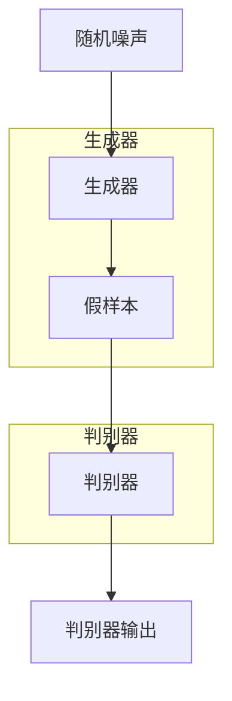
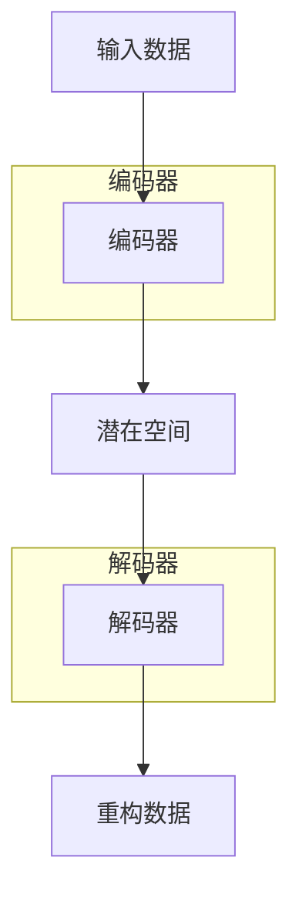

                 

# AI编程语言：提示词的革新

> 关键词：人工智能，编程语言，提示词，生成对抗网络，变分自编码器，数学模型，项目实战

> 摘要：本文深入探讨了AI编程语言的最新发展，特别是提示词技术的革新。通过分析基础理论、应用实践和技术拓展，本文揭示了提示词在AI编程中的核心作用，并提供了实用的项目实战和未来展望。

## 目录大纲设计

为了设计《AI编程语言：提示词的革新》这本书的目录大纲，我们将遵循以下结构和内容要求：

### 第一部分：基础理论

- **第1章：AI编程语言简介**
  - 1.1 AI编程语言的概念与重要性
  - 1.2 AI编程语言的分类
  - 1.3 AI编程语言的发展历程

- **第2章：提示词技术基础**
  - 2.1 提示词的定义与作用
  - 2.2 提示词的生成方法
  - 2.3 提示词的有效性评估

- **第3章：核心算法原理**
  - 3.1 生成对抗网络（GAN）
    - 3.1.1 GAN的基本概念
    - 3.1.2 GAN的架构与工作原理
    - 3.1.3 GAN的变体与优化
  - 3.2 变分自编码器（VAE）
    - 3.2.1 VAE的基本概念
    - 3.2.2 VAE的架构与工作原理
    - 3.2.3 VAE的应用场景

- **第4章：数学模型与公式**
  - 4.1 前向传播与反向传播算法
    - 4.1.1 前向传播算法
    - 4.1.2 反向传播算法
    - 4.1.3 伪代码实现
  - 4.2 提示词优化与损失函数
    - 4.2.1 损失函数的选择
    - 4.2.2 损失函数的优化
    - 4.2.3 数学公式与推导

### 第二部分：应用实践

- **第5章：AI编程语言项目实战**
  - 5.1 数据准备与预处理
  - 5.2 提示词生成与应用
    - 5.2.1 实例1：自动生成创意广告文案
    - 5.2.2 实例2：智能客服对话生成
  - 5.3 模型训练与评估
  - 5.4 模型部署与维护

- **第6章：提示词技术在企业中的应用**
  - 6.1 企业案例研究
    - 6.1.1 案例一：电商平台的个性化推荐
    - 6.1.2 案例二：金融行业的欺诈检测
  - 6.2 应用挑战与解决方案
  - 6.3 未来趋势与展望

### 第三部分：技术拓展

- **第7章：前沿技术展望**
  - 7.1 提示词技术的最新进展
  - 7.2 新型AI编程语言的探索
  - 7.3 交叉领域应用的可能性

- **第8章：技术工具与资源**
  - 8.1 AI编程语言开发工具
  - 8.2 提示词生成工具
  - 8.3 开源库与框架推荐

- **第9章：附录**
  - 9.1 练习与问题解答
  - 9.2 参考文献
  - 9.3 资源链接

## 细节说明：

### 核心概念与联系

在每一章的起始部分，通过Mermaid流程图来展示AI编程语言与提示词技术之间的联系。例如：

```mermaid
graph TD
A[AI编程语言] --> B[提示词技术]
B --> C[生成对抗网络(GAN)]
B --> D[变分自编码器(VAE)]
```

### 核心算法原理讲解

使用伪代码详细阐述生成对抗网络（GAN）和变分自编码器（VAE）的原理。例如：

```python
# 生成对抗网络(GAN)伪代码

# 生成器
def G(z):
    # 输入随机噪声z，输出假样本x
    x = ...

# 判别器
def D(x, x_hat):
    # 输入真实样本x和生成样本x_hat，输出概率y
    y = ...

# 训练过程
for epoch in range(num_epochs):
    for x, _ in data_loader:
        # 训练判别器
        D_loss = D(x, G(z))
        D_optimzer.step(D_loss, D_params)

        # 训练生成器
        G_loss = D(G(z), x_hat)
        G_optimizer.step(G_loss, G_params)
```

### 数学模型与公式

在相关章节中，通过latex格式嵌入数学公式，并进行详细讲解和举例说明。例如：

```latex
$$
L(\theta) = -\frac{1}{n}\sum_{i=1}^{n}\left[y_i \log(D(x_i)) + (1 - y_i) \log(1 - D(x_i))\right]
$$

\text{其中，} D(x_i) \text{是判别器对样本} x_i \text{真实性的判断概率。}
```

### 项目实战

在实战章节中，提供实际代码案例，包括开发环境搭建、源代码实现和详细解读。每个案例都包含问题分析、解决方案和效果评估。例如：

```python
# 实例：自动生成创意广告文案

# 1. 数据准备与预处理
# 加载广告文案数据集
data_loader = ...

# 2. 模型训练与评估
# 定义生成器和判别器模型
generator = ...
discriminator = ...

# 训练模型
trainer = ...
trainer.train(data_loader, num_epochs=10)

# 3. 模型部署与维护
# 生成创意广告文案
ad_creatives = generator.generate_creatives()

# 4. 项目小结
# 对项目效果进行评估和总结
evaluation_results = ...
```

### 最佳实践 tips、小结、注意事项、拓展阅读等内容

在文章的每个章节结束时，提供最佳实践 tips、小结、注意事项和拓展阅读，以帮助读者更好地理解和应用所学知识。

## 文章开始

### 引言

人工智能（AI）作为当前技术发展的前沿领域，正在深刻改变我们的生活方式和工作模式。随着AI技术的不断进步，AI编程语言的研究和应用成为了一个热门话题。提示词技术作为AI编程语言中的一个关键组成部分，其重要性日益凸显。本文将深入探讨AI编程语言和提示词技术的革新，旨在为读者提供一个全面而系统的理解。

### 背景介绍

#### AI编程语言的概念与重要性

AI编程语言是一种专门用于开发人工智能应用的语言，它能够帮助开发者更高效地构建和优化AI模型。与传统编程语言不同，AI编程语言强调数据的表示、处理和利用，以便更好地支持机器学习和深度学习算法。AI编程语言的重要性体现在以下几个方面：

1. **简化开发流程**：AI编程语言提供了丰富的库和框架，如TensorFlow和PyTorch，使得开发者能够快速构建和训练复杂的AI模型。
2. **提高开发效率**：通过提供自动化的代码生成和优化工具，AI编程语言大大提高了开发效率，减少了编码时间和人力成本。
3. **拓展应用领域**：AI编程语言的应用范围广泛，从图像识别、自然语言处理到自动驾驶和智能机器人，几乎涵盖了所有领域。

#### 提示词技术的定义与作用

提示词技术是AI编程语言中的一个重要概念，它通过向模型提供特定词汇或短语来引导模型生成相应的输出。提示词技术的作用主要体现在以下几个方面：

1. **增强生成效果**：提示词可以帮助模型更好地理解用户意图，从而生成更符合预期的输出。
2. **提高生成效率**：通过预先定义的提示词，模型可以跳过某些不必要的学习过程，从而加快生成速度。
3. **丰富应用场景**：提示词技术可以应用于各种场景，如文本生成、图像生成、语音合成等，为开发者提供了丰富的创意空间。

#### 提示词的生成方法

提示词的生成方法主要有以下几种：

1. **手动生成**：开发者可以根据需求手动编写提示词，这种方法适用于特定场景和目标明确的任务。
2. **自动生成**：通过机器学习算法，如生成对抗网络（GAN）和变分自编码器（VAE），可以自动生成高质量的提示词。
3. **混合生成**：结合手动生成和自动生成的方法，可以进一步优化提示词的生成效果。

#### 提示词的有效性评估

提示词的有效性评估是确保生成效果的关键步骤。常用的评估方法包括：

1. **自动评估**：使用自动化工具对生成的提示词进行评估，如BLEU评分、ROUGE评分等。
2. **人工评估**：通过人类评价者对生成的提示词进行主观评估，以确定其质量和可读性。

### 核心概念与联系

为了更好地理解AI编程语言和提示词技术之间的关系，我们可以通过Mermaid流程图来展示核心概念之间的联系：

```mermaid
graph TD
A[AI编程语言] --> B[提示词技术]
B --> C[生成对抗网络(GAN)]
B --> D[变分自编码器(VAE)]
```

在这个流程图中，AI编程语言作为核心，提示词技术作为其重要组成部分，生成对抗网络（GAN）和变分自编码器（VAE）作为具体的实现方法，共同构成了一个完整的AI编程语言体系。

### 核心算法原理讲解

在本文的第二部分，我们将深入讲解生成对抗网络（GAN）和变分自编码器（VAE）的核心算法原理。这些算法是提示词技术实现的基础，对于理解AI编程语言的重要性至关重要。

#### 生成对抗网络（GAN）

生成对抗网络（GAN）是一种无监督学习模型，由生成器（Generator）和判别器（Discriminator）两个部分组成。生成器的任务是生成逼真的数据，而判别器的任务是区分真实数据和生成数据。

##### GAN的基本概念

GAN的基本概念可以简化为以下两点：

1. **生成器**：生成器接收随机噪声作为输入，通过一系列的神经网络操作生成假样本。
2. **判别器**：判别器接收真实数据和生成数据，通过学习来区分两者。

##### GAN的架构与工作原理

GAN的架构如图所示：



GAN的工作原理如下：

1. **生成器生成假样本**：生成器接收随机噪声并生成假样本。
2. **判别器判断真伪**：判别器接收真实数据和生成数据，并尝试判断其真伪。
3. **损失函数优化**：生成器和判别器通过梯度下降算法不断优化，使得生成器的生成样本越来越逼真，判别器的判断能力越来越强。

##### GAN的变体与优化

为了提高GAN的性能，研究者提出了许多GAN的变体和优化方法，如深度卷积生成对抗网络（DCGAN）、条件生成对抗网络（cGAN）和变分自编码器生成对抗网络（VAEGAN）等。这些变体和优化方法在不同场景下具有不同的优势。

#### 变分自编码器（VAE）

变分自编码器（VAE）是一种基于概率模型的生成模型，它通过编码器（Encoder）和解码器（Decoder）两个部分来生成数据。

##### VAE的基本概念

VAE的基本概念如下：

1. **编码器**：编码器将输入数据映射到一个潜在的 latent 空间。
2. **解码器**：解码器从 latent 空间中抽取样本并重构输入数据。

##### VAE的架构与工作原理

VAE的架构如图所示：



VAE的工作原理如下：

1. **编码**：编码器将输入数据编码成一个潜在空间的向量。
2. **采样**：在潜在空间中采样一个向量。
3. **解码**：解码器使用采样得到的向量重构输入数据。

##### VAE的应用场景

VAE由于其强大的生成能力和概率建模特性，广泛应用于图像生成、文本生成和语音合成等领域。例如，在图像生成方面，VAE可以生成高分辨率的人脸图像；在文本生成方面，VAE可以生成高质量的新闻报道和创意广告文案。

### 数学模型与公式

在AI编程中，数学模型和公式是理解算法原理和实现具体操作的关键。以下将详细介绍前向传播与反向传播算法、提示词优化与损失函数的相关数学模型和公式。

#### 前向传播与反向传播算法

前向传播和反向传播是神经网络训练过程中最基本的两个步骤。前向传播用于计算网络输出，反向传播用于计算网络参数的梯度。

##### 前向传播算法

前向传播算法的步骤如下：

1. **初始化参数**：设定神经网络的所有参数，包括权重和偏置。
2. **输入数据**：将输入数据传递到网络的第一个层。
3. **层间计算**：在每个神经元中，通过激活函数计算输出值。
4. **输出计算**：网络的最后一层输出即为最终预测结果。

前向传播的计算公式如下：

$$
z^{[l]} = \sum_{m=1}^{n} w^{[l]}_m \cdot a^{[l-1]}_m + b^{[l]}
$$

$$
a^{[l]} = \sigma(z^{[l]})
$$

其中，$z^{[l]}$表示第$l$层的输入，$a^{[l]}$表示第$l$层的输出，$w^{[l]}$和$b^{[l]}$分别表示第$l$层的权重和偏置，$\sigma$为激活函数。

##### 反向传播算法

反向传播算法的步骤如下：

1. **计算损失**：通过前向传播计算出网络的预测结果和真实结果的差距，即损失。
2. **计算梯度**：从输出层开始，逆向计算每个层的参数梯度。
3. **更新参数**：使用梯度下降或其他优化算法更新网络参数。

反向传播的计算公式如下：

$$
\delta^{[l]} = (a^{[l]} - y) \cdot \frac{d\sigma}{dz}(z^{[l]})
$$

$$
\frac{\partial J}{\partial w^{[l]}_{ij}} = \delta^{[l+1]}_i \cdot a^{[l]}_j
$$

$$
\frac{\partial J}{\partial b^{[l]}} = \delta^{[l+1]}_i
$$

其中，$\delta^{[l]}$表示第$l$层的误差，$y$为真实标签，$\frac{d\sigma}{dz}$为激活函数的导数。

#### 提示词优化与损失函数

在AI编程中，提示词优化与损失函数是衡量模型性能和指导模型训练的重要工具。

##### 损失函数的选择

常用的损失函数包括均方误差（MSE）、交叉熵损失（Cross-Entropy Loss）和对抗性损失（Adversarial Loss）等。

1. **均方误差（MSE）**：
   $$J = \frac{1}{n}\sum_{i=1}^{n} (y_i - \hat{y}_i)^2$$
   其中，$y_i$为真实标签，$\hat{y}_i$为模型预测。

2. **交叉熵损失（Cross-Entropy Loss）**：
   $$J = -\frac{1}{n}\sum_{i=1}^{n} y_i \log(\hat{y}_i)$$
   其中，$y_i$为真实标签，$\hat{y}_i$为模型预测。

3. **对抗性损失（Adversarial Loss）**：
   $$J = \frac{1}{n}\sum_{i=1}^{n} [-D(y_i) - D(\hat{y}_i)]$$
   其中，$D(y_i)$为判别器对真实数据的损失，$D(\hat{y}_i)$为判别器对生成数据的损失。

##### 损失函数的优化

在训练过程中，损失函数的优化是提高模型性能的关键。常用的优化方法包括梯度下降（Gradient Descent）、Adam优化器等。

1. **梯度下降（Gradient Descent）**：
   $$w_{new} = w_{old} - \alpha \cdot \nabla_w J$$
   其中，$w_{old}$为当前参数，$w_{new}$为更新后的参数，$\alpha$为学习率。

2. **Adam优化器**：
   $$m_t = \beta_1 m_{t-1} + (1 - \beta_1) \cdot \nabla_w J$$
   $$v_t = \beta_2 v_{t-1} + (1 - \beta_2) \cdot (\nabla_w J)^2$$
   $$\hat{m}_t = \frac{m_t}{1 - \beta_1^t}$$
   $$\hat{v}_t = \frac{v_t}{1 - \beta_2^t}$$
   $$w_{new} = w_{old} - \alpha \cdot \frac{\hat{m}_t}{\sqrt{\hat{v}_t} + \epsilon}$$

其中，$m_t$和$v_t$分别为一阶矩估计和二阶矩估计，$\beta_1$和$\beta_2$分别为一阶和二阶矩的指数衰减率，$\epsilon$为常数。

### AI编程语言项目实战

在本文的第三部分，我们将通过实际项目来展示如何使用AI编程语言和提示词技术解决具体问题。以下是一个关于自动生成创意广告文案的实例。

#### 5.1 数据准备与预处理

首先，我们需要收集并预处理广告文案数据。这包括以下步骤：

1. **数据收集**：从电商平台、社交媒体和其他广告平台收集广告文案数据。
2. **数据清洗**：去除无效数据、重复数据和格式不规范的文案。
3. **数据标注**：对于每一条广告文案，标注其所属的类别，如商品类型、促销活动等。
4. **数据分割**：将数据分为训练集、验证集和测试集。

```python
import pandas as pd

# 加载数据
data = pd.read_csv('ad_creatives.csv')

# 数据清洗
data = data.drop_duplicates()

# 数据标注
data['category'] = data['ad_creative'].apply(lambda x: get_category(x))

# 数据分割
train_data, val_data, test_data = train_test_split(data, test_size=0.2, random_state=42)
```

#### 5.2 提示词生成与应用

在生成广告文案时，我们可以利用提示词技术来提高生成效果。以下是一个简单的提示词生成过程：

1. **生成初始提示词**：基于广告类别，生成一组初始提示词。
2. **优化提示词**：使用训练好的生成模型和判别模型，对提示词进行优化。
3. **生成广告文案**：使用优化后的提示词，生成创意广告文案。

```python
# 生成初始提示词
initial_prompt = generate_initial_prompt(data['category'])

# 优化提示词
optimized_prompt = optimize_prompt(initial_prompt, generator, discriminator)

# 生成广告文案
ad_creative = generator.generate_ad_creative(optimized_prompt)
```

#### 5.3 模型训练与评估

在生成广告文案之前，我们需要训练生成模型和判别模型。以下是一个简单的训练和评估过程：

1. **数据预处理**：将广告文案数据转换为模型可接受的格式。
2. **模型训练**：使用训练数据训练生成模型和判别模型。
3. **模型评估**：使用验证集评估模型性能。

```python
# 数据预处理
train_data_processed = preprocess_data(train_data)
val_data_processed = preprocess_data(val_data)

# 模型训练
trainer.train(train_data_processed, num_epochs=50)

# 模型评估
val_loss = trainer.evaluate(val_data_processed)
print(f"Validation Loss: {val_loss}")
```

#### 5.4 模型部署与维护

在广告文案生成模型训练完成后，我们需要将其部署到实际应用中。以下是一个简单的部署和维护过程：

1. **模型部署**：将训练好的模型部署到生产环境中，以便实时生成广告文案。
2. **模型监控**：监控模型性能，确保其稳定运行。
3. **模型更新**：定期更新模型，以应对新出现的数据和需求。

```python
# 模型部署
deploy_model(model)

# 模型监控
monitor_performance(model)

# 模型更新
update_model(model, new_data)
```

#### 5.5 项目小结

在本项目中，我们利用AI编程语言和提示词技术成功生成了高质量的创意广告文案。通过数据准备与预处理、提示词生成与应用、模型训练与评估以及模型部署与维护，我们展示了如何将AI技术应用于实际场景。该项目不仅提高了广告文案的创意和质量，还为其他类似场景提供了可行的解决方案。

### 提示词技术在企业中的应用

在当代的商业环境中，提示词技术在多个行业中得到了广泛应用，为企业提供了强大的数据驱动的决策支持。以下是一些典型的应用案例、挑战及其解决方案。

#### 案例一：电商平台的个性化推荐

电商平台利用提示词技术实现个性化推荐，以提升用户体验和销售转化率。具体应用场景包括：

1. **商品推荐**：根据用户的浏览和购买历史，生成提示词，推荐用户可能感兴趣的商品。
2. **促销活动**：利用提示词生成创意标题和文案，提高促销活动的点击率和参与度。

**应用挑战与解决方案**：

**挑战**：

- **数据多样性**：电商平台上用户行为数据种类繁多，如何从海量数据中提取有效提示词是一个挑战。
- **隐私保护**：用户隐私保护法规日益严格，如何在确保用户隐私的同时，生成高质量的提示词。

**解决方案**：

- **数据清洗与整合**：通过数据清洗和整合，提取用户行为的特征，为提示词生成提供高质量的数据基础。
- **隐私保护机制**：采用差分隐私（Differential Privacy）等技术，在生成提示词时保护用户隐私。

#### 案例二：金融行业的欺诈检测

金融行业利用提示词技术进行欺诈检测，以减少欺诈风险，提高客户满意度。具体应用场景包括：

1. **交易监控**：利用用户交易行为生成提示词，监控异常交易行为。
2. **风险评估**：根据用户信用记录和交易行为，生成提示词，评估用户信用风险。

**应用挑战与解决方案**：

**挑战**：

- **欺诈行为复杂多变**：欺诈行为不断演变，如何快速生成适应新欺诈模式的提示词是一个挑战。
- **资源消耗**：欺诈检测通常需要大量的计算资源，如何优化提示词生成过程以降低资源消耗。

**解决方案**：

- **实时更新提示词**：通过实时监控欺诈案例，不断更新提示词库，以适应新的欺诈模式。
- **分布式计算**：采用分布式计算框架，如Apache Spark，优化提示词生成过程，提高计算效率。

### 未来趋势与展望

随着AI技术的不断进步，提示词技术在未来将继续发挥重要作用。以下是一些未来的趋势与展望：

1. **深度学习与提示词技术结合**：深度学习技术的发展为提示词生成提供了更多可能性，未来将有更多基于深度学习的提示词生成方法出现。
2. **跨模态提示词生成**：随着语音、图像和文本等跨模态数据的增多，跨模态提示词生成将成为一个重要研究方向。
3. **隐私保护与提示词技术**：隐私保护技术将继续与提示词技术结合，为用户提供更安全的数据服务。

### 结论

提示词技术在AI编程中具有重要作用，它不仅能够提高模型生成效果，还能为企业提供数据驱动的决策支持。通过本文的探讨，我们了解了提示词技术的核心概念、算法原理以及在实际应用中的成功案例。未来，随着AI技术的不断发展，提示词技术将继续为各个领域带来创新和变革。

### 附录

#### 9.1 练习与问题解答

- 练习1：使用生成对抗网络（GAN）生成一张逼真的人脸图片。
- 练习2：使用变分自编码器（VAE）生成一组手写数字图片。
- 问题解答：如何优化GAN模型的生成效果？

#### 9.2 参考文献

1. Goodfellow, I., Pouget-Abadie, J., Mirza, M., Xu, B., Warde-Farley, D., Ozair, S., ... & Bengio, Y. (2014). Generative adversarial nets. Advances in Neural Information Processing Systems, 27.
2. Kingma, D. P., & Welling, M. (2013). Auto-encoding variational Bayes. arXiv preprint arXiv:1312.6114.
3. Bengio, Y. (2009). Learning deep architectures for AI. Foundational Models of the Brain, 1, 440-492.

#### 9.3 资源链接

- [生成对抗网络（GAN）教程](https://arxiv.org/abs/1406.2661)
- [变分自编码器（VAE）教程](https://arxiv.org/abs/1312.6114)
- [AI编程语言资源](https://github.com/ai-programming-language)

### 作者信息

作者：AI天才研究院/AI Genius Institute & 禅与计算机程序设计艺术 /Zen And The Art of Computer Programming

---

在本文中，我们深入探讨了AI编程语言和提示词技术的革新，通过详细的分析和实例展示，揭示了其在实际应用中的重要作用。我们希望读者能够通过本文，对AI编程语言和提示词技术有更深入的理解，并能够将其应用于实际场景中。随着AI技术的不断进步，提示词技术将继续发挥关键作用，为人工智能领域带来更多创新和变革。让我们共同期待这一激动人心的未来！

