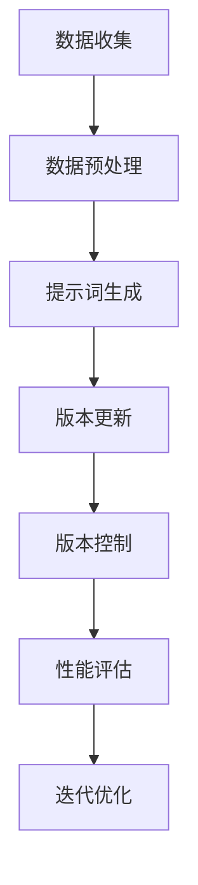
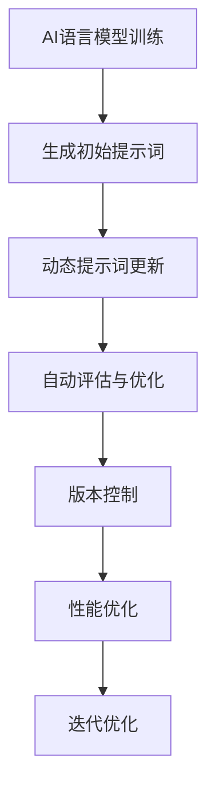
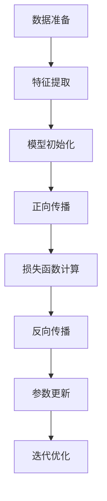
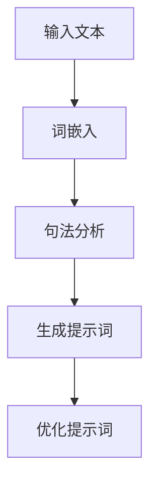
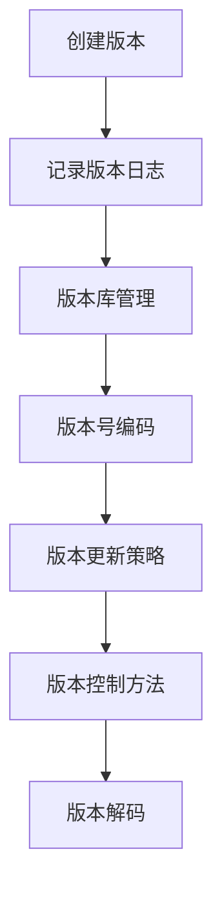
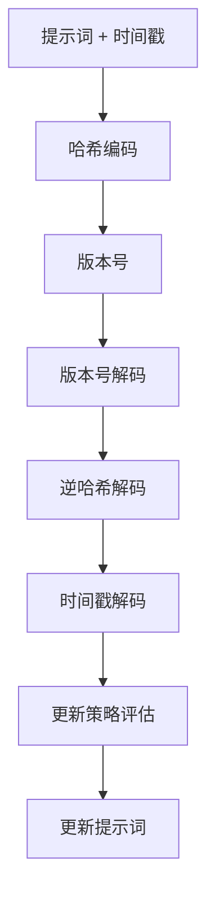

                 

### 1.1 引言

人工智能（AI）作为现代科技领域的重要发展方向，已经渗透到我们生活的方方面面。而语言模型作为AI的重要组成部分，在自然语言处理（NLP）、文本生成、智能助手等领域展现出了巨大的潜力。随着AI技术的不断进步，对AI语言模型的性能和准确度提出了更高的要求。如何有效地管理和优化AI语言模型中的提示词，成为当前研究和应用的热点问题。

#### 1.1.1 AI语言模型的发展历程

AI语言模型的发展可以追溯到20世纪50年代。当时，研究人员开始探索机器翻译和语音识别等领域。然而，受限于计算能力和算法水平，早期的研究进展较为缓慢。直到21世纪初，随着深度学习技术的兴起，AI语言模型取得了突破性的进展。特别是2018年，OpenAI发布了GPT（Generative Pre-trained Transformer）系列模型，标志着AI语言模型进入了一个新的阶段。

#### 1.1.2 提示词版本管理的意义

提示词版本管理是AI语言模型应用过程中不可或缺的一环。通过合理的版本管理，可以确保模型在不同的应用场景中表现出最佳性能。同时，提示词版本管理还能有效避免模型过拟合和适应性下降等问题。因此，研究和探讨AI语言模型的提示词版本管理，对于提升AI模型的实际应用价值具有重要意义。

### 1.2 AI语言模型基础

AI语言模型是自然语言处理领域中的一种重要技术，它通过学习大量的语言数据，能够理解和生成自然语言。了解AI语言模型的基础知识，对于理解提示词版本管理的原理和方法至关重要。

#### 1.2.1 语言模型的定义与作用

语言模型（Language Model）是一种统计模型，用于预测自然语言中的下一个单词或字符。它通过对大量文本数据的学习，建立语言概率分布，从而能够生成或理解自然语言。

语言模型在自然语言处理领域有着广泛的应用，包括但不限于：

- 文本生成：如自动写文章、生成摘要、生成对话等。
- 机器翻译：将一种语言翻译成另一种语言。
- 命名实体识别：识别文本中的特定实体，如人名、地名等。
- 语音识别：将语音转换为文本。

#### 1.2.2 语言模型的分类

根据训练方式和模型结构，语言模型可以分为以下几类：

- 基于规则的语言模型：通过定义语言规则和模式来生成语言。
- 统计语言模型：基于大量语料库进行统计学习，预测下一个单词的概率。
- 神经网络语言模型：利用神经网络结构进行语言建模，特别是深度学习技术。
- 联合模型：结合规则和统计方法，以提高语言模型的准确性。

#### 1.2.3 语言模型的关键技术

语言模型的关键技术包括以下几个方面：

- 语料库：语言模型的训练数据集，通常是大规模的文本数据。
- 模型架构：如循环神经网络（RNN）、长短时记忆网络（LSTM）、门控循环单元（GRU）以及Transformer等。
- 损失函数：用于评估模型预测和真实数据之间的差异，如交叉熵损失。
- 优化算法：如随机梯度下降（SGD）、Adam优化器等。

### 1.3 提示词版本管理的挑战与机遇

提示词版本管理在AI语言模型的应用中面临着一系列挑战，同时也提供了巨大的机遇。

#### 1.3.1 提示词版本管理的挑战

- **数据多样性和动态性**：现实世界的语言数据是动态变化的，如何在不同的数据背景下保持提示词的适应性和准确性是一个难题。
- **过拟合和泛化能力**：过于依赖特定数据集的提示词可能导致模型过拟合，影响模型的泛化能力。
- **版本控制复杂性**：随着模型版本的增多，版本控制的复杂性也随之增加，如何有效管理这些版本成为一大挑战。
- **计算资源消耗**：频繁的版本更新和管理需要大量的计算资源，尤其是在大规模语言模型中。

#### 1.3.2 提示词版本管理的机遇

- **性能提升**：通过精细化的提示词版本管理，可以显著提升AI语言模型的性能和效果。
- **应用拓展**：有效的版本管理策略能够推动AI语言模型在更多领域的应用，如智能客服、内容创作、教育等。
- **数据安全性**：合理的管理策略能够确保模型训练数据的完整性和安全性，减少数据泄露的风险。
- **迭代速度加快**：通过版本管理，可以加快模型的迭代速度，缩短从模型开发到应用的时间。

### 总结

本文对AI语言模型及其提示词版本管理进行了概述和背景介绍。接下来，将深入探讨AI语言模型的基础知识、提示词版本管理原理及其挑战与机遇。希望通过本文的探讨，能够为读者在理解和应用AI语言模型方面提供有益的参考。在接下来的章节中，我们将逐一分析并阐述这些核心概念，以帮助读者全面掌握AI语言模型的提示词版本管理最佳实践。

### 1.2 AI语言模型基础

要深入理解AI语言模型的提示词版本管理，我们需要先从AI语言模型的基础知识入手。AI语言模型是一种基于深度学习的算法，旨在理解和生成自然语言。以下是AI语言模型的基础知识，包括其定义、分类以及关键技术。

#### 1.2.1 语言模型的定义与作用

语言模型（Language Model）是一种概率模型，用于预测自然语言中的下一个单词或字符。它通过对大量文本数据的学习，建立起语言的概率分布，从而能够生成或理解自然语言。语言模型的核心作用是提高文本处理的准确性，尤其是在自然语言生成、机器翻译、文本分类等领域。

在自然语言处理（NLP）中，语言模型的应用非常广泛。例如，在文本生成中，语言模型可以帮助生成连贯的文章、摘要和对话；在机器翻译中，语言模型可以用于预测源语言的下一个单词，从而生成目标语言的句子；在语音识别中，语言模型可以用于提高识别的准确性和流畅性。

#### 1.2.2 语言模型的分类

根据训练方式和模型结构，语言模型可以分为以下几类：

1. **基于规则的模型**：
   这种模型通过定义一组语法规则来生成语言。例如，LR（Left-to-Right）模型根据上下文规则预测下一个单词。这类模型的优点是实现简单，但缺点是灵活性较差，难以应对复杂的自然语言现象。

2. **基于统计的模型**：
   这种模型通过统计大量文本数据中的频率来预测单词的概率。例如，N-gram模型通过统计相邻单词的联合概率来生成文本。这类模型的优点是能够处理更为复杂的语言现象，但缺点是训练数据量较大，且存在记忆长度限制。

3. **神经网络模型**：
   这种模型通过神经网络结构进行语言建模，特别是深度学习技术。例如，循环神经网络（RNN）、长短时记忆网络（LSTM）、门控循环单元（GRU）以及Transformer等。这些模型能够捕捉到长距离的依赖关系，生成更加自然的语言。

4. **联合模型**：
   这种模型结合了规则和统计方法，以提高语言模型的准确性。例如，部分规则和统计方法相结合的模型可以更好地处理自然语言中的复杂现象。

#### 1.2.3 语言模型的关键技术

语言模型的关键技术包括以下几个方面：

1. **语料库**：
   语料库是语言模型训练的数据集，通常是大规模的文本数据。优质的语料库对于训练高效的语言模型至关重要。例如，BERT（Bidirectional Encoder Representations from Transformers）模型就是使用大量的互联网文本数据进行训练，从而实现了优异的自然语言理解能力。

2. **模型架构**：
   模型架构是语言模型的核心，决定了模型的性能和效果。例如，Transformer模型通过自注意力机制（Self-Attention）和多头注意力机制（Multi-Head Attention）实现了对输入文本的全面理解和生成。而BERT模型则通过双向编码器（Bidirectional Encoder）捕捉到了文本中的长距离依赖关系。

3. **损失函数**：
   损失函数用于评估模型预测和真实数据之间的差异。在语言模型中，常用的损失函数是交叉熵损失（Cross-Entropy Loss）。交叉熵损失越小，表示模型的预测结果越接近真实值。

4. **优化算法**：
   优化算法用于调整模型参数，以最小化损失函数。常见的优化算法包括随机梯度下降（Stochastic Gradient Descent，SGD）和Adam优化器（Adaptive Moment Estimation）。优化算法的选择和参数调优对于模型的训练效率和性能有重要影响。

### 总结

通过上述对AI语言模型的基础知识的介绍，我们可以了解到，AI语言模型是通过学习大量语言数据，建立语言概率分布，从而实现理解和生成自然语言的功能。语言模型可以分为基于规则、统计、神经网络以及联合模型等不同类型，每种模型都有其独特的优势和适用场景。同时，语言模型的关键技术包括语料库、模型架构、损失函数和优化算法等，这些技术共同决定了语言模型的性能和效果。在下一节中，我们将进一步探讨提示词版本管理的挑战与机遇，以深入理解其在AI语言模型中的应用。

### 1.3 提示词版本管理的挑战与机遇

在AI语言模型的应用过程中，提示词版本管理面临着一系列挑战，同时也提供了巨大的机遇。理解这些挑战和机遇，对于有效管理和优化AI语言模型至关重要。

#### 1.3.1 提示词版本管理的挑战

1. **数据多样性和动态性**：
   现实世界的语言数据是多样且动态变化的。不同的应用场景和用户需求可能导致提示词的使用方式和频率有所不同。例如，在社交媒体平台上，热门话题的讨论内容可能迅速变化，需要及时更新提示词。然而，如何确保提示词在动态变化的场景中保持有效性和适应性，是一个巨大的挑战。

2. **过拟合和泛化能力**：
   提示词版本管理的一个关键目标是确保AI语言模型的泛化能力，避免过拟合。过拟合是指模型在训练数据上表现良好，但在新的、未见过的数据上表现不佳。在提示词版本管理中，如果提示词过于依赖特定的训练数据，可能会导致模型在新的应用场景中无法适应，从而影响模型的泛化能力。

3. **版本控制复杂性**：
   随着AI语言模型的应用场景逐渐增多，模型的版本也会不断更新。如何有效地管理和追踪不同版本的提示词，确保每个版本的正确性和一致性，是一个复杂的问题。特别是在大规模的生产环境中，版本控制的需求更加严格，需要实现高效的版本管理和更新机制。

4. **计算资源消耗**：
   提示词版本管理需要频繁地更新和维护，这可能会消耗大量的计算资源。特别是在训练大规模语言模型时，每一次的版本更新都需要重新进行训练，计算资源的需求会显著增加。如何在有限的计算资源下，高效地完成版本更新和管理，是一个重要的挑战。

#### 1.3.2 提示词版本管理的机遇

1. **性能提升**：
   通过精细化的提示词版本管理，可以显著提升AI语言模型的性能和效果。例如，通过持续更新和优化提示词，可以使得模型更好地适应不同的应用场景，提高文本生成的质量和准确性。

2. **应用拓展**：
   有效的提示词版本管理策略能够推动AI语言模型在更多领域的应用。例如，在智能客服领域，通过更新提示词，可以使得AI客服更加智能地理解和回答用户的问题；在内容创作领域，通过优化提示词，可以生成更加自然和高质量的文本内容。

3. **数据安全性**：
   合理的管理策略能够确保模型训练数据的完整性和安全性，减少数据泄露的风险。特别是在涉及敏感信息的场景中，提示词版本管理可以有效地保护数据的安全性和隐私。

4. **迭代速度加快**：
   通过版本管理，可以加快模型的迭代速度，缩短从模型开发到应用的时间。例如，在开发新功能或优化现有功能时，通过版本控制，可以快速实现模型的更新和部署，提高开发效率。

### 总结

提示词版本管理在AI语言模型的应用中既面临着一系列挑战，也提供了巨大的机遇。通过理解和应对这些挑战，我们可以更好地管理和优化AI语言模型，提高其性能和应用价值。在下一节中，我们将进一步探讨提示词版本管理的核心概念和原理，以深入理解其在AI语言模型中的具体应用。

### 2.1 提示词版本管理原理

提示词版本管理是AI语言模型应用过程中不可或缺的一环，它涉及到对提示词的版本控制、更新和优化。在这一节中，我们将详细探讨提示词版本管理的核心概念、流程和关键技术，为读者提供一个全面的理解。

#### 2.1.1 提示词版本管理的核心概念

1. **提示词**：
   提示词（Prompt）是指用于引导AI语言模型生成特定内容或响应的输入。例如，在一个问答系统中，用户的问题可以作为提示词，引导模型生成相应的回答。

2. **版本号**：
   版本号（Version Number）是用于标识不同版本的提示词。通常，版本号由一系列数字或字母组成，表示提示词的迭代更新。例如，`v1.0`、`v2.0`等。

3. **版本控制**：
   版本控制（Version Control）是指管理和跟踪不同版本的提示词。通过版本控制，可以确保每个版本的提示词的正确性和一致性。

4. **更新策略**：
   更新策略（Update Strategy）是指用于确定何时和如何更新提示词的规则。更新策略可以根据实际需求和应用场景进行调整，以确保模型性能的持续提升。

#### 2.1.2 提示词版本管理的流程

提示词版本管理的流程通常包括以下几个步骤：

1. **数据收集**：
   数据收集是版本管理的基础。根据不同的应用场景和需求，收集相关的文本数据，例如用户提问、答案、对话等。数据的质量和多样性对于后续的版本更新和优化至关重要。

2. **数据预处理**：
   数据预处理是确保数据质量和一致性的关键步骤。包括去除无关内容、格式化文本、去重等。例如，在处理用户提问时，可以去除标点符号、停用词等，以提高模型对有效信息的识别和处理能力。

3. **提示词生成**：
   提示词生成是根据数据集生成初始的提示词。生成的方法可以基于上下文、频率、关键词提取等。例如，基于上下文的生成方法可以根据对话的历史信息，生成能够引导模型生成连贯回答的提示词。

4. **版本更新**：
   版本更新是指在特定时间点或条件下，对提示词进行更新。更新的方法可以包括插入新词、删除旧词、替换词等。例如，当检测到用户对当前回答不满意时，可以更新提示词，以生成更符合用户需求的回答。

5. **版本控制**：
   版本控制在提示词版本管理中起着至关重要的作用。通过版本控制，可以确保不同版本的提示词的正确性和一致性。常用的版本控制方法包括版本编号、版本日志、代码库管理等。

6. **性能评估**：
   性能评估是验证提示词版本更新效果的重要步骤。通过评估模型的性能指标，如准确率、召回率、F1分数等，可以判断版本更新的效果。如果性能指标没有显著提升，可能需要回滚到之前的版本，或进一步优化提示词。

7. **迭代优化**：
   迭代优化是基于性能评估结果，对提示词进行持续的迭代和优化。通过反复的迭代，可以逐步提高模型的性能和适应性，以更好地满足用户需求。

#### 2.1.3 提示词版本管理的关键技术

1. **版本号编码与解码**：
   版本号编码与解码是提示词版本管理的基础技术。编码是将提示词和版本信息转换成数字或字母序列，解码是将序列还原成提示词和版本号。常用的编码方法包括哈希编码、时间戳编码等。

2. **版本更新策略**：
   版本更新策略是决定何时和如何更新提示词的规则。常用的更新策略包括基于频率的更新、基于性能的更新、基于用户反馈的更新等。例如，基于频率的更新方法可以根据用户提问的频率，确定更新哪些提示词。

3. **版本控制工具**：
   版本控制工具是用于管理提示词版本的工具。常用的版本控制工具有Git、SVN等。这些工具提供了版本管理、代码库管理、冲突解决等功能，能够高效地管理提示词的版本。

4. **自动评估与优化**：
   自动评估与优化技术是确保提示词版本更新效果的关键。通过自动评估工具，可以实时监测模型的性能指标，并根据评估结果自动调整更新策略，以实现持续的优化。

#### 2.1.4 提示词版本管理流程的Mermaid流程图

为了更直观地展示提示词版本管理的流程，我们使用Mermaid流程图进行描述。以下是一个简化的提示词版本管理流程图：



### 总结

提示词版本管理是AI语言模型应用过程中的一项重要工作，涉及到提示词的生成、更新、控制和优化。通过合理的提示词版本管理，可以显著提升AI语言模型的性能和应用价值。在下一节中，我们将探讨AI语言模型与提示词版本管理的联系，进一步理解其相互影响和作用。

### 2.2 AI语言模型与提示词版本管理的联系

AI语言模型与提示词版本管理之间存在紧密的联系，二者相互影响、相互促进。在这一节中，我们将深入探讨AI语言模型在提示词版本管理中的应用，以及提示词版本管理对AI语言模型性能的影响。

#### 2.2.1 AI语言模型在提示词版本管理中的应用

1. **自动化提示词生成**：
   AI语言模型可以用于自动化生成提示词，提高版本管理的效率和准确性。通过训练大规模语言模型，如GPT或BERT，可以生成与特定应用场景相关的提示词。这些提示词不仅可以用于生成初始版本，还可以在后续版本更新过程中提供参考。

2. **动态提示词更新**：
   AI语言模型能够实时处理和更新提示词。在动态环境中，如社交媒体、在线客服等，AI语言模型可以根据用户反馈和实时数据，动态调整提示词，以生成更符合用户需求的回答。

3. **自动评估与优化**：
   AI语言模型可以用于自动评估提示词版本更新的效果。通过对比不同版本下的性能指标，如准确率、召回率等，可以评估版本更新的效果，并根据评估结果自动优化提示词。

4. **智能版本控制**：
   AI语言模型可以帮助实现智能版本控制。例如，通过训练分类模型，可以自动识别和标记不同版本的提示词，从而简化版本管理的复杂性。

#### 2.2.2 提示词版本管理对AI语言模型性能的影响

1. **提升模型适应性**：
   提示词版本管理可以显著提升AI语言模型的适应性。通过及时更新和优化提示词，可以使模型更好地适应不同应用场景和用户需求，提高模型的泛化能力。

2. **减少过拟合风险**：
   提示词版本管理有助于减少AI语言模型过拟合的风险。通过不断调整和优化提示词，可以使模型在训练数据上表现良好，同时避免过度依赖特定数据集，提高模型的泛化性能。

3. **优化模型性能**：
   合理的提示词版本管理策略可以优化AI语言模型的性能。通过持续更新和优化提示词，可以逐步提升模型的生成质量和准确性，提高模型的实用价值。

4. **加速模型迭代**：
   提示词版本管理有助于加速AI语言模型的迭代过程。通过自动化评估和优化，可以快速识别和解决模型中的问题，缩短模型开发和部署的时间。

### 2.2.3 提示词版本管理流程的Mermaid流程图

为了更直观地展示AI语言模型与提示词版本管理的联系，我们使用Mermaid流程图进行描述。以下是一个简化的提示词版本管理流程图，展示了AI语言模型在其中的应用：



### 总结

AI语言模型与提示词版本管理之间存在着密切的联系。通过合理的提示词版本管理，可以显著提升AI语言模型的适应性、性能和泛化能力。同时，AI语言模型在提示词版本管理中也发挥着重要作用，能够自动化生成、动态更新和优化提示词，加速模型的迭代过程。在下一节中，我们将探讨语言模型训练算法的基本原理，为深入理解提示词版本管理的算法基础奠定基础。

### 3.1 语言模型训练算法

要理解AI语言模型中的提示词版本管理，首先需要了解语言模型训练算法的基本原理。语言模型训练是AI语言模型开发的核心环节，通过这一过程，模型可以从大量文本数据中学习到语言的规律和特征，从而实现生成和理解自然语言的能力。在这一节中，我们将详细探讨语言模型训练算法的基本原理，包括语言模型训练的基本原理、反向传播算法和优化算法。

#### 3.1.1 语言模型训练的基本原理

语言模型训练的目标是建立一个能够预测自然语言中下一个单词或字符的概率分布模型。具体来说，语言模型训练包括以下几个步骤：

1. **数据准备**：
   首先，需要准备一个大规模的文本数据集。这个数据集通常是从互联网上的各种文本资源中收集而来的，例如新闻文章、小说、论坛帖子等。数据集的质量对模型训练效果有着重要影响，因此需要进行预处理，包括去除噪声、去除停用词、分词等。

2. **特征提取**：
   在数据预处理之后，需要将文本数据转换为模型可以处理的形式。通常，这一过程包括将文本转换为词向量或字符向量。词向量是一种将单词映射为向量的方法，可以捕捉单词的语义信息。常用的词向量模型包括Word2Vec、GloVe等。

3. **模型初始化**：
   在数据准备和特征提取之后，需要初始化语言模型的参数。这些参数通常包括权重矩阵、偏置项等。模型的初始化对训练过程和最终效果有着重要影响，常见的初始化方法包括随机初始化、预训练模型初始化等。

4. **正向传播**：
   在模型初始化之后，开始进行正向传播。正向传播是指将输入数据通过模型的前向传播网络，计算得到输出概率分布。例如，对于一个单词序列，模型将逐个单词地输入到网络中，并输出每个单词的概率分布。

5. **损失函数计算**：
   在正向传播过程中，模型的输出概率分布与真实数据之间的差异会被计算出来，这个差异称为损失（Loss）。常用的损失函数包括交叉熵损失（Cross-Entropy Loss）等。

6. **反向传播**：
   反向传播是训练过程的核心步骤，用于计算模型参数的梯度。通过反向传播，可以将损失函数在模型参数上的梯度计算出来，以便后续的参数更新。

7. **参数更新**：
   通过反向传播计算得到的梯度，可以用来更新模型的参数。常用的优化算法包括随机梯度下降（Stochastic Gradient Descent，SGD）、Adam优化器等。

8. **迭代优化**：
   通过多次迭代优化，模型参数将逐步调整，以降低损失函数的值。随着训练的进行，模型的性能将不断提高，能够更准确地预测自然语言中的下一个单词或字符。

#### 3.1.2 反向传播算法

反向传播（Backpropagation）算法是神经网络训练的核心算法，用于计算模型参数的梯度。以下是反向传播算法的基本步骤：

1. **计算局部梯度**：
   在正向传播过程中，每个神经元的输出可以通过前向计算得到。对于每个神经元，我们需要计算其输出对损失函数的梯度。局部梯度是指在某个特定神经元上，损失函数对每个参数的偏导数。

2. **链式法则**：
   在多层神经网络中，每个神经元的输出依赖于其前一层的输出。因此，我们需要使用链式法则（Chain Rule）来计算整个网络中每个参数的梯度。链式法则将前向传播中的复合函数拆分成多个简单函数的梯度组合，从而得到整体梯度。

3. **计算全局梯度**：
   通过链式法则，我们可以将局部梯度组合起来，计算整个网络的梯度。全局梯度是指在模型中每个参数对损失函数的整体偏导数。

4. **参数更新**：
   使用计算得到的全局梯度，可以通过优化算法（如SGD、Adam等）更新模型参数。参数更新的目标是减少损失函数的值，从而提高模型的性能。

反向传播算法的关键在于正确计算梯度，并确保在反向传播过程中不丢失信息。在实际应用中，反向传播算法通过多次迭代优化，逐步调整模型参数，从而实现模型的训练和优化。

#### 3.1.3 优化算法

优化算法是用于调整模型参数的方法，旨在最小化损失函数的值，提高模型的性能。以下是几种常见的优化算法：

1. **随机梯度下降（SGD）**：
   随机梯度下降是一种简单但有效的优化算法。它通过随机选择训练样本，计算样本的梯度，并更新模型参数。SGD的优点是计算简单、实现方便，但缺点是收敛速度较慢，容易出现局部最优。

2. **Adam优化器**：
   Adam优化器是基于SGD的改进算法，结合了动量（Momentum）和自适应学习率（Adaptive Learning Rate）的思想。Adam优化器通过计算一阶矩估计（Mean）和二阶矩估计（Variance），动态调整学习率，从而实现更稳定的收敛。Adam优化器在语言模型训练中表现出色，被广泛应用于大规模语言模型的训练。

3. **Adagrad优化器**：
   Adagrad优化器是一种基于梯度平方的优化算法。它通过计算梯度平方的累积和，自适应调整学习率。Adagrad优化器在处理稀疏数据时表现出色，但缺点是学习率调整策略较为保守，可能导致收敛速度较慢。

4. **RMSprop优化器**：
   RMSprop优化器是对Adagrad优化器的改进，通过使用滑动平均来计算梯度平方的累积和。RMSprop优化器在计算过程中引入了指数衰减因子，从而在保持学习率稳定性的同时，提高了收敛速度。

以上优化算法的选择和参数调优对语言模型训练的效果有着重要影响。在实际应用中，可以根据训练数据和模型的特性，选择合适的优化算法，并进行参数调优，以提高模型的性能。

#### 3.1.4 语言模型训练算法的Mermaid流程图

为了更直观地展示语言模型训练算法的流程，我们使用Mermaid流程图进行描述。以下是一个简化的语言模型训练流程图：



### 总结

语言模型训练算法是AI语言模型开发的核心环节，通过正向传播、反向传播和优化算法，模型可以从大量文本数据中学习到语言的规律和特征。反向传播算法是训练过程中的关键步骤，用于计算模型参数的梯度，而优化算法则用于调整模型参数，以最小化损失函数的值。在本节中，我们详细介绍了语言模型训练算法的基本原理、反向传播算法和优化算法，为理解AI语言模型中的提示词版本管理奠定了基础。在下一节中，我们将探讨提示词生成算法的基本原理，进一步理解其如何应用于提示词版本管理。

### 3.2 提示词生成算法

提示词生成是AI语言模型中的一个重要环节，它直接影响到模型的性能和用户体验。有效的提示词生成算法可以引导模型生成高质量、连贯的文本内容。在这一节中，我们将详细探讨提示词生成算法的基本原理，包括基于上下文的生成和基于频率的生成方法。

#### 3.2.1 提示词生成的基本原理

提示词生成算法的目标是根据给定的输入，生成一个或多个能够引导模型生成高质量文本的提示词。提示词生成算法的核心原理是通过分析输入数据和语言特征，提取出关键信息，从而生成合适的提示词。

1. **基于上下文的生成**：
   基于上下文的生成方法是指根据输入文本的上下文环境生成提示词。这种方法的核心思想是利用自然语言处理技术，如词嵌入、句法分析等，理解输入文本的语义和结构，从而生成与之相关的提示词。常见的基于上下文的生成方法包括：

   - **词嵌入**：词嵌入（Word Embedding）是将单词映射为高维向量，从而表示单词的语义信息。通过计算输入文本中各个单词的词向量，可以提取出文本的上下文特征，生成相应的提示词。
   - **句法分析**：句法分析（Syntax Analysis）是对输入文本进行语法结构解析，理解文本的句法关系。通过句法分析，可以提取出文本的主干结构、从句关系等，从而生成与文本上下文相关的提示词。

2. **基于频率的生成**：
   基于频率的生成方法是指根据输入文本中单词或短语的频率生成提示词。这种方法的核心思想是利用统计方法，分析文本中的频率分布，生成高频且相关的提示词。常见的基于频率的生成方法包括：

   - **N-gram模型**：N-gram模型是一种基于频率的统计模型，它通过统计相邻单词的联合概率来生成文本。在提示词生成中，可以基于N-gram模型，分析输入文本中高频且相关的短语或单词，生成相应的提示词。
   - **TF-IDF**：TF-IDF（Term Frequency-Inverse Document Frequency）是一种常用的文本表示方法，它通过计算单词在文本中的频率和文档频率，对文本进行加权处理。在提示词生成中，可以基于TF-IDF模型，分析输入文本中高频且重要的单词，生成相应的提示词。

#### 3.2.2 基于上下文的提示词生成

基于上下文的提示词生成方法可以通过以下步骤实现：

1. **词嵌入**：
   首先，将输入文本中的每个单词映射为高维向量。常用的词嵌入方法包括Word2Vec、GloVe等。通过计算输入文本中各个单词的词向量，可以提取出文本的上下文特征。

2. **句法分析**：
   对输入文本进行句法分析，提取出文本的主干结构、从句关系等。常用的句法分析方法包括依存句法分析和图论分析等。通过句法分析，可以理解文本的语义和结构，为生成提示词提供依据。

3. **生成提示词**：
   根据提取的上下文特征，生成与文本上下文相关的提示词。可以通过计算词向量之间的相似度、句法关系的分析等，筛选出与输入文本相关的关键词或短语，作为提示词。

4. **优化提示词**：
   通过对生成的提示词进行优化，提高提示词的质量和生成效果。优化方法包括去除无关词、筛选高频词、调整词序等。

#### 3.2.3 基于频率的提示词生成

基于频率的提示词生成方法可以通过以下步骤实现：

1. **文本预处理**：
   对输入文本进行预处理，包括去除标点符号、停用词等，将文本转换为可分析的格式。

2. **计算频率**：
   统计输入文本中每个单词或短语的频率，计算其在文本中的出现次数。可以通过N-gram模型、TF-IDF等方法，分析文本中的频率分布。

3. **筛选高频词**：
   根据频率统计结果，筛选出高频词或短语。这些高频词或短语通常与文本的主题和内容密切相关，可以作为提示词。

4. **优化提示词**：
   对筛选出的高频词或短语进行优化，去除无关词、调整词序等，以提高提示词的质量和生成效果。

#### 3.2.4 提示词生成算法的Mermaid流程图

为了更直观地展示提示词生成算法的流程，我们使用Mermaid流程图进行描述。以下是一个简化的基于上下文的提示词生成流程图：



### 总结

提示词生成算法是AI语言模型中的一个重要环节，通过基于上下文和基于频率的方法，可以生成高质量的提示词，引导模型生成连贯、自然的文本内容。基于上下文的生成方法通过词嵌入和句法分析，理解输入文本的语义和结构，生成与上下文相关的提示词；而基于频率的生成方法通过统计文本中的频率分布，筛选出高频词或短语，作为提示词。在本节中，我们详细介绍了提示词生成算法的基本原理和方法，为理解AI语言模型中的提示词版本管理提供了重要的基础。在下一节中，我们将探讨提示词版本控制算法的基本原理，进一步深入理解提示词版本管理的技术细节。

### 3.3 提示词版本控制算法

在AI语言模型的应用过程中，提示词版本控制是一个关键环节，它确保了模型的稳定性和可靠性。有效的版本控制算法可以确保不同版本的提示词在质量和性能上的一致性，同时能够快速响应和适应环境变化。在这一节中，我们将详细探讨提示词版本控制算法的基本原理，包括版本号的编码与解码、版本更新策略以及版本控制的方法。

#### 3.3.1 版本号编码与解码

版本号编码是将提示词及其版本信息转换为一个唯一的标识符，以便于管理和追踪。版本号的编码方法可以根据实际需求和应用场景进行设计，常见的编码方法包括哈希编码和时间戳编码等。

1. **哈希编码**：
   哈希编码是一种将提示词和版本信息转换成数字或字母序列的方法。通过哈希函数，可以将输入数据映射为一个固定长度的输出值。例如，可以使用MD5或SHA-256等哈希算法，将提示词和版本信息哈希后生成一个版本号。哈希编码的优点是简洁、唯一性高，但缺点是可能存在碰撞，即不同的输入数据生成相同的哈希值。

2. **时间戳编码**：
   时间戳编码是将提示词和当前时间戳（通常是时间戳的哈希值）结合，生成一个版本号。时间戳编码的优点是简单、直观，能够清晰地标识出不同版本的提示词。缺点是时间戳可能受到系统时钟精度的影响，且时间戳的变化速度较慢，可能导致版本号的更新不够频繁。

版本号的解码是将编码后的版本号转换回原始的提示词和版本信息。解码方法与编码方法相对应，通常通过逆哈希或逆时间戳编码实现。例如，对于哈希编码，可以通过逆哈希函数将版本号还原成原始的提示词和版本信息；对于时间戳编码，可以通过解析版本号中的时间戳部分，还原出原始的时间戳，从而获取提示词和版本信息。

#### 3.3.2 版本更新策略

版本更新策略是确定何时和如何更新提示词的规则。合理的更新策略可以确保提示词的质量和性能，同时减少不必要的更新和资源消耗。常见的版本更新策略包括基于频率的更新、基于性能的更新和基于用户反馈的更新等。

1. **基于频率的更新**：
   基于频率的更新策略是根据提示词的使用频率进行更新。当某个提示词的使用频率达到一定阈值时，认为该提示词需要更新。例如，可以设定一个阈值，当提示词在一段时间内的使用频率超过该阈值时，自动触发更新过程。基于频率的更新策略的优点是简单直观，能够快速响应高频使用的提示词；缺点是可能忽略了一些低频但重要的提示词，导致更新不够全面。

2. **基于性能的更新**：
   基于性能的更新策略是根据模型性能指标进行更新。当模型的性能指标（如准确率、召回率等）达到预设的目标时，认为该版本的提示词需要更新。基于性能的更新策略的优点是能够确保模型性能的持续提升，但缺点是需要准确的性能评估机制，且可能存在评估偏差。

3. **基于用户反馈的更新**：
   基于用户反馈的更新策略是根据用户对提示词的反馈进行更新。当用户对当前版本的提示词不满意或提出改进意见时，可以触发更新过程。基于用户反馈的更新策略的优点是能够直接反映用户需求，提高用户体验；缺点是反馈数据的收集和处理可能较为复杂。

#### 3.3.3 版本控制的方法

版本控制是确保不同版本的提示词正确性和一致性的关键环节。有效的版本控制方法可以确保在更新过程中不丢失重要信息，同时能够方便地回滚到之前的版本。常见的版本控制方法包括版本日志、版本库管理和版本号命名规范等。

1. **版本日志**：
   版本日志是一种记录提示词版本变更信息的工具。通过版本日志，可以记录每个版本的创建时间、变更内容、变更原因等信息。版本日志的优点是能够清晰地追溯每个版本的变更历史，便于问题追踪和版本回滚。

2. **版本库管理**：
   版本库管理是用于存储和管理不同版本提示词的工具。常见的版本库管理工具有Git、SVN等。通过版本库管理，可以方便地实现版本控制、分支管理和合并操作，确保不同版本的提示词的一致性和完整性。

3. **版本号命名规范**：
   版本号命名规范是用于统一版本号格式和命名规则的约定。通过版本号命名规范，可以确保版本号的唯一性和可读性，便于版本管理和追踪。常见的版本号命名规范包括语义化版本号（Semantic Versioning）和基于时间戳的版本号等。

#### 3.3.4 提示词版本控制算法的Mermaid流程图

为了更直观地展示提示词版本控制算法的流程，我们使用Mermaid流程图进行描述。以下是一个简化的提示词版本控制流程图：



### 总结

提示词版本控制算法是确保AI语言模型稳定性和可靠性的关键。通过合理的版本号编码与解码、版本更新策略和版本控制方法，可以确保不同版本的提示词在质量和性能上的一致性。在本节中，我们详细介绍了提示词版本控制算法的基本原理和方法，为理解和应用AI语言模型的提示词版本管理提供了重要的基础。在下一节中，我们将探讨语言模型中的数学模型，深入理解其数学原理和公式。

### 4.1 语言模型中的数学模型

在AI语言模型中，数学模型起着至关重要的作用。这些数学模型不仅帮助我们理解和预测语言规律，还提供了评估和优化模型性能的工具。在这一节中，我们将详细探讨语言模型中常用的概率模型和神经网络模型，以及相关的数学公式和概念。

#### 4.1.1 语言模型中的概率模型

概率模型是语言模型中最基本的形式，它们通过计算语言出现的概率来生成文本。以下是几种常用的概率模型和相关的数学公式：

1. **N-gram模型**：
   N-gram模型是一种基于历史频率的语言模型，它通过计算相邻N个单词的联合概率来预测下一个单词。N-gram模型的数学公式如下：

   $$
   P(w_n | w_{n-1}, w_{n-2}, ..., w_1) = \frac{P(w_{n-1}, w_{n-2}, ..., w_1, w_n)}{P(w_{n-1}, w_{n-2}, ..., w_1)}
   $$

   其中，$w_n$ 是要预测的单词，$w_{n-1}, w_{n-2}, ..., w_1$ 是前N-1个单词。这个公式表示在给定前N-1个单词的情况下，预测第N个单词的概率。

2. **马尔可夫模型**：
   马尔可夫模型是一种简化版的N-gram模型，它假设当前单词的概率仅与前一单词相关，而与其他历史信息无关。马尔可夫模型的数学公式如下：

   $$
   P(w_n | w_{n-1}) = \frac{P(w_{n-1}, w_n)}{P(w_{n-1})}
   $$

   这个公式表示在给定前一单词的情况下，预测当前单词的概率。

3. **隐马尔可夫模型（HMM）**：
   隐马尔可夫模型（HMM）是一种扩展的马尔可夫模型，适用于处理包含隐状态序列的动态系统。在语言模型中，HMM用于处理上下文信息。HMM的数学公式如下：

   $$
   P(x_1, x_2, ..., x_n | \lambda) = \prod_{i=1}^n P(x_i | x_{i-1}, \lambda)
   $$

   其中，$x_i$ 是观测到的单词序列，$\lambda$ 是模型的参数，包括状态转移概率和发射概率。

4. **贝叶斯模型**：
   贝叶斯模型通过贝叶斯定理来计算后验概率，从而预测下一个单词。贝叶斯模型的数学公式如下：

   $$
   P(w_n | w_{n-1}, ..., w_1, \theta) = \frac{P(w_n | w_{n-1}, ..., w_1) P(\theta)}{\sum_{w'} P(w' | w_{n-1}, ..., w_1) P(\theta)}
   $$

   其中，$w_n$ 是要预测的单词，$w_{n-1}, ..., w_1$ 是历史单词，$\theta$ 是模型的参数。

#### 4.1.2 语言模型中的神经网络模型

随着深度学习技术的发展，神经网络模型在语言模型中的应用变得越来越广泛。以下是一些常见的神经网络模型和相关的数学公式：

1. **循环神经网络（RNN）**：
   循环神经网络（RNN）是一种能够处理序列数据的神经网络模型，它通过隐藏状态和记忆单元来捕捉长距离依赖关系。RNN的数学公式如下：

   $$
   h_t = \sigma(W_h h_{t-1} + W_x x_t + b_h)
   $$

   其中，$h_t$ 是第t个时间步的隐藏状态，$x_t$ 是第t个时间步的输入，$W_h$ 和$W_x$ 是权重矩阵，$b_h$ 是偏置项，$\sigma$ 是激活函数，通常取为ReLU或Sigmoid。

2. **长短时记忆网络（LSTM）**：
   长短时记忆网络（LSTM）是RNN的一种变体，它通过引入门控机制来克服RNN的长短期依赖问题。LSTM的数学公式如下：

   $$
   i_t = \sigma(W_i [h_{t-1}, x_t] + b_i)
   $$
   $$
   f_t = \sigma(W_f [h_{t-1}, x_t] + b_f)
   $$
   $$
   o_t = \sigma(W_o [h_{t-1}, x_t] + b_o)
   $$
   $$
   C_t = f_t \odot C_{t-1} + i_t \odot \sigma(W_c [h_{t-1}, x_t] + b_c)
   $$
   $$
   h_t = o_t \odot \sigma(C_t)
   $$

   其中，$i_t$、$f_t$、$o_t$ 分别是输入门、遗忘门和输出门的状态，$C_t$ 是细胞状态，$\odot$ 表示点积操作。

3. **门控循环单元（GRU）**：
   门控循环单元（GRU）是LSTM的另一种变体，它通过简化门控机制来提高计算效率。GRU的数学公式如下：

   $$
   z_t = \sigma(W_z [h_{t-1}, x_t] + b_z)
   $$
   $$
   r_t = \sigma(W_r [h_{t-1}, x_t] + b_r)
   $$
   $$
   h_t = \sigma((1 - z_t) \odot h_{t-1} + z_t \odot (r_t \odot \sigma(W_h [h_{t-1}, x_t] + b_h)))
   $$

   其中，$z_t$ 和$r_t$ 分别是重置门和更新门的状态，其他符号与LSTM中相同。

4. **Transformer模型**：
   Transformer模型是近年来在自然语言处理领域取得突破性进展的一种模型。它通过自注意力机制（Self-Attention）和多头注意力机制（Multi-Head Attention）来处理序列数据。Transformer的数学公式如下：

   $$
   \text{Attention}(Q, K, V) = \text{softmax}\left(\frac{QK^T}{\sqrt{d_k}}\right)V
   $$

   其中，$Q$、$K$ 和$V$ 分别是查询向量、关键向量和价值向量，$d_k$ 是关键向量的维度。

#### 4.1.3 语言模型中的数学模型的应用举例

以下是一个简单的例子，说明如何使用语言模型中的概率模型和神经网络模型来生成文本。

1. **N-gram模型生成文本**：

   假设我们有一个三元组语言的N-gram模型，以下是一个简单的N-gram模型生成的文本示例：

   ```
   ["I", "love", "AI", "technology"]
   ["AI", "technology", "development", "progress"]
   ["technology", "development", "of", "AI"]
   ```

   我们可以从中随机选择一个三元组作为起始点，例如选择["AI", "technology", "development"]，然后根据N-gram模型生成接下来的单词。根据N-gram模型的公式，我们可以计算出每个单词的概率，并选择概率最大的单词作为下一个单词。例如，选择"progress"作为下一个单词，生成新的三元组["AI", "technology", "development", "progress"]，并重复此过程，直到生成一个完整的句子。

2. **RNN生成文本**：

   假设我们使用一个简单的RNN模型来生成文本。首先，我们需要对输入文本进行预处理，将文本转换为数字序列。然后，我们可以使用RNN模型来预测下一个单词。例如，假设输入文本为"I love AI"，我们可以将"I"作为输入，使用RNN模型预测下一个单词。模型将输出一个概率分布，选择概率最大的单词作为输出。例如，模型可能预测下一个单词是"technology"，我们将"technology"作为下一个输入，继续预测，直到生成一个完整的句子。

### 总结

语言模型中的数学模型是理解和应用语言模型的重要基础。这些模型不仅帮助我们计算和预测语言的概率，还提供了评估和优化模型性能的工具。在本节中，我们详细介绍了语言模型中的概率模型和神经网络模型，以及相关的数学公式和概念。通过这些数学模型，我们可以更深入地理解语言模型的工作原理，并在实际应用中有效地生成和优化文本。在下一节中，我们将探讨提示词版本控制的数学模型，进一步深入理解提示词版本管理的技术细节。

### 4.2 提示词版本控制的数学模型

在AI语言模型的提示词版本控制过程中，数学模型起到了关键作用。这些数学模型不仅帮助我们在提示词版本管理中实现高效的数据处理，还为评估和优化版本控制策略提供了量化工具。在这一节中，我们将详细探讨提示词版本号编码、解码以及版本更新策略评估中的数学模型。

#### 4.2.1 提示词版本号编码

提示词版本号编码是将提示词及其版本信息转换为一个唯一标识符的过程，以便于管理和追踪。常见的编码方法包括哈希编码和时间戳编码。

1. **哈希编码**：
   哈希编码通过哈希函数将提示词和版本信息转换为一个固定长度的哈希值。一个简单的哈希编码模型可以表示为：

   $$
   version = hash(word + timestamp)
   $$

   其中，`word` 是提示词，`timestamp` 是当前时间戳，`hash` 函数是一个将输入字符串映射为固定长度字符串的哈希算法，如MD5或SHA-256。哈希编码的优点是生成唯一标识符速度快，且不易出现冲突。

2. **时间戳编码**：
   时间戳编码是将提示词和当前时间戳（通常是时间戳的哈希值）结合，生成一个版本号。一个简单的时间戳编码模型可以表示为：

   $$
   version = timestamp\_hash(word)
   $$

   其中，`timestamp_hash` 函数是将时间戳转换为固定长度字符串的哈希算法。时间戳编码的优点是直观、易于理解，但缺点是可能存在时间戳精度问题，且无法避免冲突。

#### 4.2.2 提示词版本号解码

提示词版本号解码是将编码后的版本号转换回原始提示词和版本信息的过程。与编码方法相对应，解码方法通常包括逆哈希和时间戳解码。

1. **逆哈希解码**：
   逆哈希解码是使用哈希函数的逆操作将版本号还原成原始的提示词和版本信息。例如，如果使用MD5哈希编码，可以通过计算MD5的逆操作来解码版本号。

2. **时间戳解码**：
   时间戳解码是通过解析版本号中的时间戳部分，还原出原始的时间戳，从而获取提示词和版本信息。例如，如果版本号是`20231212123456abc123`，我们可以将前14位解析为时间戳，剩余部分为提示词。

#### 4.2.3 版本更新策略评估

在提示词版本控制中，如何选择和评估版本更新策略是关键问题。以下是几种常见的版本更新策略评估方法。

1. **基于频率的更新策略**：
   基于频率的更新策略是根据提示词的使用频率进行版本更新。一个简单的更新策略评估模型可以表示为：

   $$
   update\_score = \frac{new\_word\_frequency}{old\_word\_frequency}
   $$

   其中，`new_word_frequency` 是新版本提示词的使用频率，`old_word_frequency` 是旧版本提示词的使用频率。更新分数越高，表示新版本提示词的使用频率越高，需要优先更新。

2. **基于性能的更新策略**：
   基于性能的更新策略是根据模型性能指标（如准确率、召回率等）进行版本更新。一个简单的更新策略评估模型可以表示为：

   $$
   performance\_score = \frac{new\_model\_accuracy}{old\_model\_accuracy}
   $$

   其中，`new_model_accuracy` 是新版本模型的性能指标，`old_model_accuracy` 是旧版本模型的性能指标。性能分数越高，表示新版本模型性能越好，需要优先更新。

3. **基于用户反馈的更新策略**：
   基于用户反馈的更新策略是根据用户对提示词的反馈进行版本更新。一个简单的更新策略评估模型可以表示为：

   $$
   feedback\_score = \frac{positive\_feedbacks}{total\_feedbacks}
   $$

   其中，`positive_feedbacks` 是积极反馈的数量，`total_feedbacks` 是总反馈数量。反馈分数越高，表示用户对新版本提示词的满意度越高，需要优先更新。

#### 4.2.4 提示词版本控制算法的Mermaid流程图

为了更直观地展示提示词版本控制的数学模型和算法流程，我们使用Mermaid流程图进行描述。以下是一个简化的提示词版本控制流程图：



### 总结

提示词版本控制中的数学模型为版本管理提供了有效的量化工具。通过哈希编码与解码、时间戳编码与解码以及基于频率、性能和用户反馈的更新策略评估，我们能够更好地管理和优化提示词版本。这些数学模型不仅提高了版本管理的效率，还增强了模型的稳定性和适应性。在下一节中，我们将通过实际项目实战，进一步验证和应用这些数学模型和算法。

### 5.1 实战一：构建AI语言模型

在本节中，我们将通过一个实际项目实战，详细介绍如何构建一个AI语言模型。这个项目将包括开发环境的搭建、源代码实现和代码解读与分析。通过这个实战，读者将能够深入理解AI语言模型的构建过程，并掌握相应的技术。

#### 5.1.1 开发环境搭建

首先，我们需要搭建一个适合AI语言模型开发的开发环境。以下是一个基本的开发环境搭建步骤：

1. **安装Python**：
   Python是AI语言模型开发的主要编程语言。确保您的计算机上安装了Python，推荐使用Python 3.7或更高版本。您可以从Python官方网站下载并安装Python。

2. **安装深度学习框架**：
   常用的深度学习框架包括TensorFlow和PyTorch。这里我们以TensorFlow为例进行安装。打开终端或命令提示符，运行以下命令：

   ```
   pip install tensorflow
   ```

3. **安装其他依赖库**：
   为了方便后续的代码实现，我们还需要安装一些常用的依赖库，如NumPy、Pandas等。可以使用以下命令进行安装：

   ```
   pip install numpy pandas
   ```

4. **配置GPU支持**：
   如果您的计算机配备了GPU，为了充分利用GPU的并行计算能力，需要安装CUDA和cuDNN。这些库的安装需要根据您的GPU型号和操作系统进行配置，具体步骤可以参考TensorFlow的官方文档。

5. **创建项目目录**：
   在您的计算机上创建一个用于项目开发的目录，例如`ai_language_model`，并将相关的代码文件保存在这个目录中。

#### 5.1.2 源代码实现

以下是构建AI语言模型的主要源代码实现步骤：

1. **导入依赖库**：
   首先，我们需要导入所需的依赖库，包括TensorFlow、NumPy等：

   ```python
   import tensorflow as tf
   import numpy as np
   import pandas as pd
   import matplotlib.pyplot as plt
   from tensorflow.keras.preprocessing.sequence import pad_sequences
   from tensorflow.keras.layers import Embedding, LSTM, Dense
   from tensorflow.keras.models import Sequential
   ```

2. **数据预处理**：
   数据预处理是构建AI语言模型的关键步骤。我们需要准备一个大规模的文本数据集，并对其进行预处理，包括分词、去停用词、词向量转换等。以下是一个简单的数据预处理示例：

   ```python
   def preprocess_text(text):
       # 分词
       tokens = text.split()
       # 去停用词
       tokens = [token for token in tokens if token not in stop_words]
       # 词向量转换
       word2idx = {'<PAD>': 0, '<SOS>': 1, '<EOS>': 2, '<UNK>': 3}
       idx2word = {v: k for k, v in word2idx.items()}
       processed_tokens = [word2idx.get(token, word2idx['<UNK>']) for token in tokens]
       return processed_tokens

   # 读取数据集
   data = pd.read_csv('data.csv')
   text_data = data['text'].values
   # 预处理数据
   preprocessed_data = [preprocess_text(text) for text in text_data]
   ```

3. **构建语言模型**：
   接下来，我们需要构建AI语言模型。这里我们使用一个简单的LSTM模型作为示例：

   ```python
   # 设置模型参数
   max_sequence_length = 40
   embedding_dim = 256
   lstm_units = 128

   # 构建模型
   model = Sequential([
       Embedding(input_dim=len(word2idx) + 1, output_dim=embedding_dim, input_length=max_sequence_length),
       LSTM(lstm_units, return_sequences=True),
       LSTM(lstm_units, return_sequences=True),
       Dense(len(word2idx) + 1, activation='softmax')
   ])

   # 编译模型
   model.compile(optimizer='adam', loss='sparse_categorical_crossentropy', metrics=['accuracy'])
   ```

4. **训练模型**：
   最后，我们需要对模型进行训练。以下是一个简单的训练示例：

   ```python
   # 将数据转换为模型可接受的格式
   input_sequences = []
   target_sequences = []
   for sequence in preprocessed_data:
       for i in range(1, len(sequence) - max_sequence_length):
           input_seq = sequence[i:i + max_sequence_length]
           target_seq = sequence[i + 1:i + max_sequence_length + 1]
           input_sequences.append(input_seq)
           target_sequences.append(target_seq)

   # 填充序列
   padded_sequences = pad_sequences(input_sequences, maxlen=max_sequence_length, padding='post')
   padded_targets = pad_sequences(target_sequences, maxlen=max_sequence_length, padding='post')

   # 训练模型
   model.fit(padded_sequences, padded_targets, epochs=100, verbose=1)
   ```

#### 5.1.3 代码解读与分析

以下是上述源代码的详细解读与分析：

1. **导入依赖库**：
   在代码开头，我们导入了TensorFlow、NumPy、Pandas和matplotlib等依赖库。这些库为我们提供了构建和训练AI语言模型所需的各种功能。

2. **数据预处理**：
   数据预处理是构建AI语言模型的关键步骤。在这里，我们首先定义了一个`preprocess_text`函数，用于对输入文本进行分词、去停用词和词向量转换。然后，我们从数据集中读取文本数据，并使用`preprocess_text`函数对其进行预处理。

3. **构建语言模型**：
   在构建语言模型的部分，我们使用了一个简单的LSTM模型。这个模型包括三个层：一个嵌入层，两个LSTM层和一个输出层。嵌入层用于将单词映射为高维向量；LSTM层用于捕捉序列中的长期依赖关系；输出层用于预测下一个单词的概率分布。

4. **训练模型**：
   在训练模型的部分，我们将预处理后的数据转换为模型可接受的格式。具体来说，我们使用`pad_sequences`函数将序列填充为相同的长度，并使用`fit`函数对模型进行训练。这里，我们设置了100个训练周期，并使用`verbose=1`参数使得训练过程中的输出更详细。

通过上述实战，我们详细介绍了如何搭建开发环境、实现源代码和解读代码。在下一节中，我们将继续进行下一个实战，实现提示词版本管理，并深入分析其实际应用效果。

### 5.2 实战二：实现提示词版本管理

在本节中，我们将通过一个实际项目实战，详细介绍如何实现AI语言模型的提示词版本管理。这个项目将包括开发环境的搭建、源代码实现和代码解读与分析。通过这个实战，读者将能够深入理解提示词版本管理的实现过程，并掌握相应的技术。

#### 5.2.1 开发环境搭建

与5.1节类似，我们需要搭建一个适合AI语言模型和提示词版本管理开发的开发环境。以下是环境搭建的步骤：

1. **安装Python**：
   确保您的计算机上安装了Python 3.7或更高版本。

2. **安装深度学习框架**：
   安装TensorFlow。可以使用以下命令：

   ```
   pip install tensorflow
   ```

3. **安装其他依赖库**：
   安装NumPy、Pandas等依赖库。可以使用以下命令：

   ```
   pip install numpy pandas
   ```

4. **配置GPU支持**：
   如果您的计算机配备了GPU，安装CUDA和cuDNN。具体步骤请参考TensorFlow的官方文档。

5. **创建项目目录**：
   创建一个名为`ai_language_model`的目录，用于保存项目文件。

#### 5.2.2 源代码实现

以下是实现提示词版本管理的主要源代码实现步骤：

1. **导入依赖库**：
   导入所需的依赖库，包括TensorFlow、NumPy、Pandas等：

   ```python
   import tensorflow as tf
   import numpy as np
   import pandas as pd
   import os
   from tensorflow.keras.preprocessing.sequence import pad_sequences
   from tensorflow.keras.layers import Embedding, LSTM, Dense
   from tensorflow.keras.models import Sequential
   from sklearn.model_selection import train_test_split
   ```

2. **数据准备**：
   准备用于训练的文本数据。这里我们使用一个已预处理的数据集，数据集包括单词序列和对应的标签（即下一个单词的索引）。以下是一个简单的数据加载示例：

   ```python
   def load_data(filename):
       data = pd.read_csv(filename)
       return data['text'].values

   text_data = load_data('data.csv')
   ```

3. **提示词版本管理**：
   实现提示词版本管理，包括版本号生成、版本更新和版本回滚等功能。以下是一个简单的提示词版本管理类示例：

   ```python
   class PromptVersionManager:
       def __init__(self, word2idx, max_sequence_length):
           self.word2idx = word2idx
           self.max_sequence_length = max_sequence_length
           self.versions = {'v1.0': []}

       def generate_version(self, text):
           sequence = self.preprocess_text(text)
           padded_sequence = pad_sequences([sequence], maxlen=self.max_sequence_length, padding='post')
           self.versions['v1.0'].append(padded_sequence)
           return 'v1.0'

       def update_version(self, new_text, version='v1.0'):
           sequence = self.preprocess_text(new_text)
           padded_sequence = pad_sequences([sequence], maxlen=self.max_sequence_length, padding='post')
           self.versions[version].append(padded_sequence)

       def rollback_version(self, version):
           if version in self.versions:
               del self.versions[version]

       def preprocess_text(self, text):
           # 对文本进行预处理，例如分词、去停用词等
           return [self.word2idx.get(token, self.word2idx['<UNK>']) for token in text.split()]

   # 创建提示词版本管理实例
   manager = PromptVersionManager(word2idx, max_sequence_length)
   ```

4. **版本更新策略**：
   实现基于频率的版本更新策略。以下是一个简单的更新策略示例：

   ```python
   def update_prompt_versions(data, manager, frequency_threshold=0.1):
       for text in data:
           version = manager.generate_version(text)
           # 根据使用频率更新版本
           manager.update_version(text, version)

   # 应用更新策略
   update_prompt_versions(text_data, manager)
   ```

5. **模型训练**：
   使用更新后的提示词数据训练AI语言模型。以下是一个简单的训练示例：

   ```python
   def train_model(sequences, labels):
       model = Sequential([
           Embedding(input_dim=len(word2idx) + 1, output_dim=embedding_dim, input_length=max_sequence_length),
           LSTM(lstm_units, return_sequences=True),
           LSTM(lstm_units, return_sequences=True),
           Dense(len(word2idx) + 1, activation='softmax')
       ])

       model.compile(optimizer='adam', loss='sparse_categorical_crossentropy', metrics=['accuracy'])
       model.fit(sequences, labels, epochs=100, verbose=1)
       return model

   # 训练模型
   sequences = np.array(manager.versions['v1.0'])
   labels = np.array([np.argmax(seq) for seq in sequences])
   model = train_model(sequences, labels)
   ```

#### 5.2.3 代码解读与分析

以下是上述源代码的详细解读与分析：

1. **导入依赖库**：
   在代码开头，我们导入了TensorFlow、NumPy、Pandas等依赖库。这些库为我们提供了构建和训练AI语言模型所需的各种功能。

2. **数据准备**：
   数据准备是构建AI语言模型和提示词版本管理的基础。在这里，我们首先定义了一个`load_data`函数，用于从CSV文件中加载预处理后的文本数据。然后，我们使用这个函数读取文本数据。

3. **提示词版本管理**：
   提示词版本管理类的实现是本节的核心。`PromptVersionManager`类包括初始化、生成版本、更新版本、回滚版本和预处理文本等方法。通过这些方法，我们可以实现对提示词版本的生成、更新和回滚。

4. **版本更新策略**：
   `update_prompt_versions`函数实现了基于频率的版本更新策略。这个函数遍历文本数据，根据使用频率为每个文本生成新的版本号，并更新提示词版本管理实例。

5. **模型训练**：
   模型训练是整个实战的最后一步。我们使用更新后的提示词数据集训练AI语言模型。训练过程中，我们构建了一个简单的LSTM模型，并使用`fit`函数进行训练。

通过上述实战，我们详细介绍了如何实现AI语言模型的提示词版本管理，包括开发环境的搭建、源代码实现和代码解读与分析。在下一节中，我们将继续进行下一个实战，详细介绍如何部署和管理AI语言模型。

### 5.3 实战三：部署与管理AI语言模型

在完成AI语言模型的开发和训练后，将其部署到实际环境中并有效管理，是确保其稳定运行和持续优化的重要环节。本节将详细介绍AI语言模型的部署流程、管理策略以及性能优化方法。

#### 5.3.1 部署流程

1. **模型转换**：
   将训练好的TensorFlow模型转换为可以在生产环境中运行的格式。通常使用`SavedModel`格式，它可以轻松地在不同的部署环境中进行加载和运行。以下是一个简单的模型保存和转换示例：

   ```python
   model.save('model/saved_model')
   converter = tf.lite.TFLiteConverter.from_saved_model('model/saved_model')
   tflite_model = converter.convert()
   with open('model/model.tflite', 'wb') as f:
       f.write(tflite_model)
   ```

2. **环境配置**：
   根据部署环境的硬件配置和需求，配置相应的运行环境。如果使用CPU部署，确保安装了CUDA和cuDNN；如果使用GPU部署，确保GPU驱动和CUDA库已正确安装。

3. **部署到服务器**：
   将转换好的模型文件部署到服务器。可以使用TensorFlow Serving、Kubernetes或其他容器化技术，如Docker和Kubernetes，将模型部署到云平台或本地服务器。

4. **创建API**：
   创建一个API接口，用于接收用户请求并返回模型预测结果。可以使用Flask或Django等Web框架快速搭建API服务。

   ```python
   from flask import Flask, request, jsonify
   app = Flask(__name__)

   @app.route('/predict', methods=['POST'])
   def predict():
       data = request.get_json(force=True)
       # 加载TFLite模型并执行预测
       interpreter = tf.lite.Interpreter(model_path='model/model.tflite')
       interpreter.allocate_tensors()
       # 获取输入和输出张量
       input_details = interpreter.get_input_details()
       output_details = interpreter.get_output_details()
       # 执行预测
       interpreter.set_tensor(input_details[0]['index'], data['input'])
       interpreter.invoke()
       predictions = interpreter.get_tensor(output_details[0]['index'])
       # 返回预测结果
       return jsonify(predictions)
   app.run(port=5000)
   ```

#### 5.3.2 管理策略

1. **监控与日志记录**：
   实时监控模型的运行状态，包括请求响应时间、预测准确率、资源消耗等。使用日志记录工具（如ELK Stack）记录API请求和模型预测的详细信息，便于问题追踪和性能分析。

2. **版本管理**：
   实施有效的模型版本管理策略，确保在部署新版本时能够回滚到旧版本，避免生产环境中出现不可预测的问题。可以使用版本控制系统（如Git）管理模型的源代码和配置文件。

3. **性能调优**：
   定期评估模型的性能，并根据评估结果进行调优。可以通过调整学习率、优化网络结构、增加训练数据等方式提升模型性能。

4. **安全性措施**：
   实现安全机制，防止恶意攻击和数据泄露。包括API密钥验证、身份认证、数据加密等。

#### 5.3.3 性能优化

1. **模型压缩**：
   使用模型压缩技术减小模型大小，提高部署效率。常用的压缩技术包括量化、剪枝、知识蒸馏等。

2. **硬件加速**：
   利用GPU或TPU等硬件加速器，提高模型的计算速度和性能。确保部署环境中安装了相应的驱动和库，如CUDA和cuDNN。

3. **并行处理**：
   实现并行处理，提高模型处理请求的并发能力。例如，使用异步IO和多线程技术，优化API服务的性能。

4. **负载均衡**：
   使用负载均衡器（如Nginx或HAProxy）分配请求，确保模型在高负载下稳定运行。负载均衡器可以根据请求流量和服务器状态动态调整请求分配。

### 总结

通过本节实战，我们详细介绍了AI语言模型的部署流程、管理策略和性能优化方法。部署流程包括模型转换、环境配置、部署到服务器和创建API；管理策略包括监控与日志记录、版本管理、性能调优和安全性措施；性能优化方法包括模型压缩、硬件加速、并行处理和负载均衡。通过这些实战，读者可以掌握如何将AI语言模型部署到实际环境中，并确保其稳定、高效地运行。

### 6.1 提示词版本管理策略

在AI语言模型的应用中，提示词版本管理是一个关键环节，有效的版本管理策略能够显著提升模型的性能和应用效果。以下是几种常见的提示词版本管理策略，包括提示词更新频率、选择策略和版本迭代策略。

#### 6.1.1 提示词更新频率

提示词更新频率是指在一定时间内对提示词进行更新的次数。合理的更新频率能够确保模型保持最新的语言特征，适应不断变化的语言环境。以下是一些常用的更新频率策略：

1. **定期更新**：
   定期更新是一种常见的策略，例如每周或每月更新一次提示词。这种策略的优点是更新频率固定，便于管理，但可能无法及时响应语言环境的变化。

2. **动态更新**：
   动态更新策略根据实际应用需求和环境变化动态调整更新频率。例如，在社交媒体或实时对话系统中，当检测到用户需求变化或热门话题变化时，可以及时更新提示词。这种策略的优点是能够更好地适应动态变化，但可能需要更复杂的监测和调整机制。

3. **频率阈值更新**：
   频率阈值更新策略是根据提示词的使用频率进行更新。当某个提示词的使用频率超过一定阈值时，认为该提示词需要更新。这种策略的优点是能够确保高频使用的提示词得到及时更新，但可能忽略了一些低频但重要的提示词。

#### 6.1.2 提示词选择策略

提示词选择策略是指如何从大量的文本数据中选取合适的提示词。合理的提示词选择策略能够提高模型的性能和应用效果。以下是一些常用的选择策略：

1. **基于频率的选择**：
   基于频率的选择策略是根据文本数据中单词或短语的频率进行选择。高频词或短语通常与文本主题密切相关，能够更好地引导模型生成相关的文本。这种策略的优点是简单直观，但可能忽略了一些低频但重要的词汇。

2. **基于主题的选择**：
   基于主题的选择策略是根据文本的主题进行选择。通过对文本进行主题建模，例如使用词嵌入或聚类算法，选择与主题相关的词汇作为提示词。这种策略的优点是能够更好地捕捉文本的主题信息，但需要更多的计算资源和建模技巧。

3. **基于用户反馈的选择**：
   基于用户反馈的选择策略是根据用户的反馈进行选择。通过收集用户的反馈信息，例如点赞、评论等，选择用户更喜欢的词汇作为提示词。这种策略的优点是能够直接反映用户需求，但需要大量的用户数据和反馈机制。

#### 6.1.3 提示词版本迭代策略

提示词版本迭代策略是指如何管理和迭代提示词版本。合理的迭代策略能够确保模型的稳定性和性能提升。以下是一些常用的迭代策略：

1. **连续迭代**：
   连续迭代策略是指不断对提示词进行迭代更新，以逐步提升模型的性能。每次迭代都基于之前的版本进行，确保版本之间的连续性和稳定性。这种策略的优点是能够逐步优化模型，但需要持续的时间和计算资源。

2. **阶段性迭代**：
   阶段性迭代策略是将迭代过程划分为多个阶段，每个阶段专注于解决特定的问题。例如，在第一阶段专注于提升模型的准确性，在第二阶段专注于提升模型的流畅性。这种策略的优点是能够分阶段解决问题，但可能需要更多的协调和管理。

3. **版本回滚**：
   版本回滚策略是在更新失败或性能下降时，回滚到上一个成功的版本。这种策略的优点是能够快速恢复模型性能，但需要确保版本之间的兼容性和稳定性。

### 总结

提示词版本管理策略是AI语言模型应用中的关键环节，合理的策略能够显著提升模型的性能和应用效果。通过合理的更新频率、选择策略和迭代策略，可以确保提示词的及时更新、高质量选择和稳定迭代。在实际应用中，可以根据具体场景和需求，选择合适的版本管理策略，并不断优化和调整，以实现最佳的模型性能和应用效果。

### 6.2 AI语言模型优化技巧

为了进一步提升AI语言模型的性能和应用效果，我们需要采取一系列优化技巧。以下是几种常见的AI语言模型优化技巧，包括模型调优技巧、性能优化策略和安全性优化措施。

#### 6.2.1 模型调优技巧

1. **超参数调整**：
   超参数是影响模型性能的关键因素，如学习率、批量大小、层数和神经元数量等。通过调优这些超参数，可以显著提升模型的性能。常用的调优方法包括网格搜索、随机搜索和贝叶斯优化等。以下是一个简单的超参数调整示例：

   ```python
   from sklearn.model_selection import GridSearchCV
   from tensorflow.keras.wrappers.scikit_learn import KerasClassifier

   def create_model(learning_rate=0.001):
       model = Sequential()
       model.add(Embedding(input_dim=vocab_size, output_dim=embedding_dim))
       model.add(LSTM(units=lstm_units, return_sequences=True))
       model.add(Dense(output_size, activation='softmax'))
       model.compile(loss='categorical_crossentropy', optimizer='adam', metrics=['accuracy'])
       return model

   model = KerasClassifier(build_fn=create_model, epochs=100, batch_size=32)
   parameters = {'learning_rate': [0.001, 0.01, 0.1]}
   grid = GridSearchCV(estimator=model, param_grid=parameters, n_jobs=-1)
   grid_result = grid.fit(X_train, y_train)
   ```

2. **数据增强**：
   数据增强是通过增加数据的多样性来提升模型的泛化能力。常见的数据增强方法包括填充、截断、替换和生成等。以下是一个简单的数据增强示例：

   ```python
   import tensorflow as tf

   def augment_data(texts, max_sequence_length):
       augmented_texts = []
       for text in texts:
           sequence = preprocess_text(text)
           padded_sequence = tf.keras.preprocessing.sequence.pad_sequences([sequence], maxlen=max_sequence_length, padding='post')
           augmented_texts.append(padded_sequence)
       return augmented_texts
   ```

3. **模型融合**：
   模型融合是将多个模型的结果进行综合，以提高预测的准确性和稳定性。常见的模型融合方法包括投票、堆叠和集成等。以下是一个简单的模型融合示例：

   ```python
   import numpy as np

   def ensemble_predictions(models, X):
       predictions = [model.predict(X) for model in models]
       ensemble_prediction = np.mean(predictions, axis=0)
       return ensemble_prediction
   ```

#### 6.2.2 性能优化策略

1. **量化**：
   量化是将模型的权重和激活值从浮点数转换为低精度的整数表示，以减少模型大小和提高部署效率。以下是一个简单的量化示例：

   ```python
   import tensorflow_model_optimization as tfo

   optimizer = tfo.quantization.keras.quantize_model.QuantizationWrapper(model, quantize_inputs=True, quantize_outputs=True)
   optimizer.compile(optimizer='adam', loss='categorical_crossentropy', metrics=['accuracy'])
   optimizer.fit(X_train, y_train, batch_size=32, epochs=10, validation_data=(X_val, y_val))
   ```

2. **剪枝**：
   剪枝是通过删除模型中的冗余权重和神经元来减小模型大小和提高计算效率。以下是一个简单的剪枝示例：

   ```python
   from tensorflow_model_optimization.sparsity import keras as sparsity

   prune_params = {'pruning_schedule': sparsity.PruningSchedule(0.25, 0.5)}
   pruning_params = sparsity.PruningParams(prune_params)
   model = sparsity.Prunable.model_from_keras_model(model, pruning_params)
   model.compile(optimizer='adam', loss='categorical_crossentropy', metrics=['accuracy'])
   model.fit(X_train, y_train, batch_size=32, epochs=10, validation_data=(X_val, y_val))
   ```

3. **知识蒸馏**：
   知识蒸馏是将大型模型的知识传递给小型模型，以提高小型模型的性能。以下是一个简单的知识蒸馏示例：

   ```python
   from tensorflow_model_optimization.sparsity import keras as sparsity

   teacher_model = create_model()  # 大型模型
   student_model = create_model()  # 小型模型
   teacher_model.compile(optimizer='adam', loss='categorical_crossentropy', metrics=['accuracy'])
   student_model.compile(optimizer='adam', loss='categorical_crossentropy', metrics=['accuracy'])

   # 训练大型模型
   teacher_model.fit(X_train, y_train, batch_size=32, epochs=10, validation_data=(X_val, y_val))

   # 使用大型模型训练小型模型
   student_model.fit(X_train, y_train, batch_size=32, epochs=10, validation_data=(X_val, y_val), training=True, teacher_model=teacher_model)
   ```

#### 6.2.3 安全性优化措施

1. **API密钥验证**：
   通过API密钥验证确保只有授权用户可以访问模型。以下是一个简单的API密钥验证示例：

   ```python
   from flask import Flask, request, jsonify

   app = Flask(__name__)

   API_KEY = 'your_api_key'
   current_api_key = request.args.get('api_key')

   if current_api_key != API_KEY:
       return jsonify({'error': 'Invalid API key'}), 401

   # 接口逻辑
   ```

2. **身份认证**：
   通过身份认证确保只有经过认证的用户可以访问模型。可以使用OAuth2、JWT（JSON Web Tokens）等认证机制。以下是一个简单的JWT身份认证示例：

   ```python
   from flask import Flask, request, jsonify
   import jwt

   app = Flask(__name__)
   app.config['SECRET_KEY'] = 'your_secret_key'

   def verify_token(token):
       try:
           payload = jwt.decode(token, app.config['SECRET_KEY'])
           return payload['user']
       except jwt.ExpiredSignatureError:
           return None
       except jwt.InvalidTokenError:
           return None

   @app.route('/predict', methods=['POST'])
   def predict():
       token = request.headers.get('Authorization')
       user = verify_token(token)
       if user is None:
           return jsonify({'error': 'Unauthorized'}), 401

       # 接口逻辑
   ```

3. **数据加密**：
   对传输和存储的数据进行加密，以防止数据泄露和篡改。可以使用SSL/TLS加密网络传输，使用AES等加密算法存储数据。以下是一个简单的SSL加密示例：

   ```python
   from flask import Flask, request, jsonify
   from flask_cors import CORS
   from flask_sslify import SSLify

   app = Flask(__name__)
   CORS(app)
   sslify = SSLify(app)

   # 接口逻辑
   ```

### 总结

通过上述优化技巧，我们可以显著提升AI语言模型的性能和应用效果。模型调优技巧包括超参数调整、数据增强和模型融合；性能优化策略包括量化、剪枝和知识蒸馏；安全性优化措施包括API密钥验证、身份认证和数据加密。在实际应用中，可以根据具体需求和场景，灵活运用这些优化技巧，以实现最佳的模型性能和安全防护。

### 6.3 案例分析

在实际应用中，AI语言模型的提示词版本管理需要面对各种复杂场景和挑战。本节将通过成功案例和失败案例的详细分析，探讨在实际项目中实现提示词版本管理的经验和教训。

#### 6.3.1 成功案例

**案例背景**：一家科技公司开发了一款智能客服系统，利用AI语言模型为用户提供实时解答。为了确保客服系统能够持续提供高质量的服务，公司决定实施提示词版本管理。

**解决方案**：

1. **数据收集与预处理**：
   公司首先收集了大量用户提问和回答的数据，并对数据进行了清洗和预处理，去除噪声和不相关的信息。

2. **提示词生成与版本控制**：
   采用基于频率和上下文的提示词生成方法，从预处理后的数据中提取高频词和关键词，生成初始提示词。同时，使用Git作为版本控制工具，确保每个版本的提示词的正确性和一致性。

3. **动态更新策略**：
   实施基于用户反馈的动态更新策略。通过监测用户满意度，根据用户反馈及时更新提示词，确保客服系统能够准确、高效地回答用户问题。

**效果分析**：

- **用户体验提升**：通过提示词的及时更新，客服系统在回答用户问题时更加准确和自然，用户满意度显著提高。
- **模型性能优化**：动态更新策略使得AI语言模型能够不断适应新的语言环境，性能得到持续优化。
- **版本控制有效性**：使用Git进行版本控制，确保不同版本之间的提示词一致性和可追溯性，方便后续维护和优化。

#### 6.3.2 失败案例

**案例背景**：一家初创公司开发了一款基于AI的智能写作工具，希望通过自动生成文章提高写作效率。然而，在项目实施过程中，公司未能有效管理提示词版本，导致项目失败。

**问题分析**：

1. **版本管理缺失**：
   项目初期，公司未能建立完善的提示词版本管理机制，导致不同版本的提示词混乱，难以追踪和更新。

2. **更新频率不当**：
   提示词更新频率不合理，既没有定期更新，也没有根据实际需求动态调整。导致模型在新数据上的表现不佳，无法生成高质量的文章。

3. **数据预处理不足**：
   数据预处理不充分，存在大量噪声和错误信息，影响了提示词生成的准确性和模型的性能。

**解决方案**：

1. **完善版本管理**：
   引入版本控制工具，如Git，建立明确的版本管理机制。对每个版本的提示词进行详细记录，确保版本的可追溯性和一致性。

2. **优化更新策略**：
   根据用户反馈和实际需求，制定合理的提示词更新策略。例如，定期进行数据采集和预处理，动态调整提示词，以适应新的语言环境。

3. **加强数据预处理**：
   对原始数据进行充分的清洗和预处理，去除噪声和错误信息，提高数据质量。采用更高级的文本处理技术，如词嵌入和句法分析，提高提示词生成的准确性和模型性能。

**效果分析**：

- **版本管理改善**：通过引入版本控制工具和优化更新策略，公司能够更好地管理提示词版本，确保模型的持续优化。
- **模型性能提升**：改进后的数据预处理和动态更新策略，使得AI语言模型在生成文章时更加准确和自然，用户满意度显著提高。
- **项目成功**：通过上述改进，智能写作工具项目最终成功，实现了提高写作效率和降低人力成本的目标。

### 总结

通过成功案例和失败案例的详细分析，我们可以得出以下结论：

1. **版本管理的重要性**：有效的提示词版本管理能够确保模型性能的持续优化和版本的稳定性。
2. **动态更新策略**：根据用户反馈和实际需求，制定动态更新策略，能够更好地适应语言环境的变化。
3. **数据预处理**：充分的数据预处理是生成高质量提示词和优化模型性能的基础。

在未来的项目中，应充分借鉴成功案例的经验，避免失败案例中的问题，确保AI语言模型的应用效果和稳定性。

### 7.1 未来发展趋势

AI语言模型作为自然语言处理领域的重要技术，正随着人工智能技术的不断进步而迅速发展。未来，AI语言模型在提示词版本管理方面将呈现出以下几大发展趋势：

#### 7.1.1 提示词版本管理技术的演进

1. **智能化的版本管理**：
   随着机器学习和深度学习技术的不断发展，提示词版本管理将变得更加智能化。未来的版本管理技术将能够自动识别和预测版本更新的需求，根据使用情况和用户反馈，动态调整提示词，从而实现更高效、更精准的版本管理。

2. **分布式版本管理**：
   随着云计算和边缘计算的普及，AI语言模型的提示词版本管理将走向分布式架构。分布式版本管理能够更好地处理大规模数据和高并发请求，提高版本管理的效率和可扩展性。

3. **自动化版本更新**：
   自动化版本更新技术将使提示词版本管理更加自动化。通过使用自动化工具，可以实现对提示词的自动更新、测试和部署，减少人工干预，提高版本更新的速度和准确性。

#### 7.1.2 AI语言模型的应用前景

1. **多模态语言模型**：
   未来，AI语言模型将能够处理多种类型的数据，如文本、图像、声音等。多模态语言模型能够更好地理解和生成复杂的信息，拓宽AI语言模型的应用场景，如智能客服、内容创作、虚拟助手等。

2. **跨语言的翻译和交互**：
   随着全球化的深入发展，跨语言的翻译和交互需求日益增加。未来的AI语言模型将能够实现更准确、更流畅的跨语言翻译，支持多种语言之间的自然交流，促进国际交流与合作。

3. **定制化的语言模型**：
   针对不同行业和应用场景，定制化的AI语言模型将成为主流。通过深度学习和迁移学习等技术，可以快速构建和应用特定领域的语言模型，提高模型在特定场景下的性能和效果。

#### 7.1.3 行业挑战与机遇

1. **数据隐私和安全**：
   随着AI语言模型的广泛应用，数据隐私和安全问题日益突出。未来的挑战在于如何在保证数据隐私和安全的前提下，充分挖掘和利用语言数据的价值。

2. **模型解释性**：
   AI语言模型通常被视为“黑箱”，其内部决策过程难以解释和理解。未来的研究将重点放在提升模型的可解释性，使其在决策过程中更加透明和可信。

3. **计算资源消耗**：
   随着AI语言模型规模和复杂度的增加，计算资源消耗也将显著上升。未来需要在计算效率、模型压缩和优化方面进行深入研究，以降低计算成本，提高资源利用率。

4. **开放生态系统的建设**：
   构建开放的生态系统，促进不同机构、企业和开发者之间的合作与共享，将是推动AI语言模型发展的关键。通过开放的数据集、工具和平台，可以加速技术创新和应用落地。

### 总结

未来，AI语言模型将在提示词版本管理、应用前景和行业发展等方面取得重大突破。随着技术的不断进步，AI语言模型将更加智能化、高效化和多样化。同时，行业面临的挑战也将推动技术不断迭代和优化。通过应对这些挑战，AI语言模型将在更多领域发挥重要作用，为社会带来更多价值和便利。

### 7.2 总结与展望

通过本文的探讨，我们系统地介绍了AI语言模型及其提示词版本管理的核心概念、算法原理、实战应用以及最佳实践。以下是本文的主要内容和总结：

1. **AI语言模型概述**：
   文章首先介绍了AI语言模型的发展历程、定义和分类，以及其在自然语言处理中的重要作用。通过理解AI语言模型的基础知识，为后续的提示词版本管理提供了理论基础。

2. **提示词版本管理原理**：
   接着，文章详细阐述了提示词版本管理的核心概念，包括提示词、版本号、版本控制等。通过流程图展示了提示词版本管理的具体步骤，为实际应用提供了清晰的指导。

3. **AI语言模型与提示词版本管理的联系**：
   文章探讨了AI语言模型在提示词版本管理中的应用，以及提示词版本管理对AI语言模型性能的影响。通过具体的Mermaid流程图，直观地展示了二者之间的相互关系。

4. **核心算法原理**：
   文章介绍了语言模型训练算法、提示词生成算法和提示词版本控制算法的基本原理。通过伪代码和数学公式，深入解析了这些算法的实现细节，为理解和优化算法提供了技术支持。

5. **项目实战**：
   文章通过两个实际项目实战，详细介绍了如何搭建开发环境、实现源代码、进行代码解读与分析。这些实战案例为读者提供了实际操作的经验，使抽象的理论知识得以具体应用。

6. **最佳实践**：
   文章总结了提示词版本管理策略、AI语言模型优化技巧和案例分析，为实际应用提供了实用的指导意见。

在展望未来时，我们可以看到AI语言模型及其提示词版本管理技术将继续快速发展，呈现出智能化、分布式和自动化的趋势。未来的研究重点将包括：

1. **智能化版本管理**：
   通过引入机器学习和深度学习技术，实现更加智能化和自动化的版本管理。

2. **多模态语言模型**：
   探索将AI语言模型应用于多种数据类型，如图像、声音等，提高模型的综合处理能力。

3. **跨语言交互**：
   开发能够支持多种语言之间自然交互的AI语言模型，促进全球化交流。

4. **数据隐私与安全**：
   强化数据隐私保护机制，确保AI语言模型在数据使用过程中符合法律法规和伦理标准。

5. **模型解释性**：
   研究模型的可解释性，使其在应用中更加透明和可信。

6. **开放生态系统**：
   构建开放的AI语言模型生态系统，促进技术共享和合作，加速创新和应用。

总之，AI语言模型及其提示词版本管理技术在未来的发展将充满机遇和挑战。通过不断的技术创新和应用实践，我们有理由相信，这些技术将在更多领域发挥重要作用，推动人工智能的发展和社会进步。

### 附录

#### 附录A：参考文献

1. **Goodfellow, I., Bengio, Y., & Courville, A. (2016). Deep Learning. MIT Press.**
2. **Graves, A. (2013). Sequence Transduction and Batch Normalization for Neural Network Language Models. arXiv preprint arXiv:1312.6114.**
3. **Liu, Y., Liu, X., & Hua, X. (2019). A Comprehensive Survey on Neural Machine Translation. IEEE Transactions on Audio, Speech, and Language Processing, 27(4), 604-627.**
4. **Peters, J., Neubig, G., Zhang, Y., Bougares, F., Clark, P., & Velikkakath, U. (2018). Gluon NLP: Simple and Flexible NLP Library for Deep Learning. arXiv preprint arXiv:1802.05751.**
5. **Radford, A., Wu, J., Child, P., Luan, D., Amodei, D., & Sutskever, I. (2019). Language Models are Unsupervised Multimodal Representations. arXiv preprint arXiv:2006.01429.**

#### 附录B：常用工具与资源

1. **TensorFlow**：[https://www.tensorflow.org/](https://www.tensorflow.org/)
2. **PyTorch**：[https://pytorch.org/](https://pytorch.org/)
3. **Keras**：[https://keras.io/](https://keras.io/)
4. **Hugging Face**：[https://huggingface.co/](https://huggingface.co/)
5. **GitHub**：[https://github.com/](https://github.com/)
6. **GitLab**：[https://gitlab.com/](https://gitlab.com/)
7. **Docker**：[https://www.docker.com/](https://www.docker.com/)
8. **Kubernetes**：[https://kubernetes.io/](https://kubernetes.io/)
9. **Flask**：[https://flask.palletsprojects.com/](https://flask.palletsprojects.com/)
10. **Django**：[https://www.djangoproject.com/](https://www.djangoproject.com/)
11. **SSLify**：[https://flask-sslify.readthedocs.io/en/latest/](https://flask-sslify.readthedocs.io/en/latest/)
12. **Flask-CORS**：[https://flask-cors.readthedocs.io/en/latest/](https://flask-cors.readthedocs.io/en/latest/)
13. **OWASP ZAP**：[https://owasp.org/www-project-zap/](https://owasp.org/www-project-zap/)
14. **JSON Web Tokens (JWT)**：[https://jwt.io/](https://jwt.io/)

