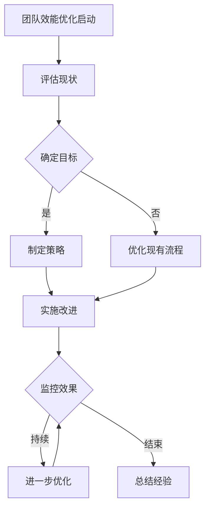

                 

### 引言与背景

在现代信息技术快速发展的背景下，企业面临的市场竞争日益激烈，如何提高团队效能已成为企业实现可持续发展的关键。团队效能不仅关系到企业的运营效率，更直接影响着企业的创新能力和市场竞争力。因此，深入探讨团队效能的提升策略，对于企业来说具有重大的现实意义。

**团队效能**，是指一个团队在完成特定任务时所表现出来的效率和质量。它涵盖了团队成员之间的协作效率、资源的有效利用程度以及任务的完成效果。团队效能的提升，不仅可以缩短项目周期、降低成本，还能增强团队的凝聚力，激发团队成员的积极性和创造力。

**资源利用**，是团队效能的重要组成部分。资源包括人力资源、财务资源、物资资源、时间资源和技术资源等。高效利用这些资源，可以最大化团队的产出，提高企业的整体竞争力。

本文将从以下几个方面展开讨论：

1. **团队效能的重要性**：探讨团队效能的定义及其对企业的重要性。
2. **团队效能与资源利用**：分析团队效能与资源利用之间的关系，以及如何通过优化资源利用来提升团队效能。
3. **团队效能的现状与挑战**：探讨当前团队效能的现状以及面临的挑战。

通过以上讨论，本文旨在为企业提供一套系统的团队效能优化策略，帮助企业在激烈的市场竞争中立于不败之地。

## 第1章：团队效能的重要性

### 1.1 什么是团队效能

**团队效能**，简单来说，是一个团队在完成特定任务时所表现出来的效率和效果。它不仅仅关注团队的产出结果，还包括团队在完成任务过程中的协作效率、资源的利用程度以及成员的工作满意度等多方面因素。团队效能的核心在于如何最大化团队资源，实现高效协同，从而在规定的时间内完成高质量的任务。

**团队效能的定义**可以从以下几个方面来理解：

- **效率**：团队效能首先体现在团队成员之间的协作效率和任务完成的速率上。一个高效的团队能够迅速响应任务需求，合理分配资源，确保任务按时完成。
- **效果**：团队效能还体现在任务完成的质量上。一个高效能的团队不仅能够快速完成任务，还能保证任务的质量，满足客户和企业的期望。
- **协作**：团队效能的提升依赖于团队成员之间的有效协作。团队成员需要具备良好的沟通能力和团队合作精神，能够充分发挥各自的专业优势，共同完成团队目标。

### 1.2 团队效能的影响因素

团队效能受到多种因素的影响，这些因素相互作用，共同决定了团队的效能水平。以下是几个关键影响因素：

- **人力资源**：人力资源是团队效能的基础。团队成员的专业能力、技能水平和个人素质直接影响团队的效能。一个结构合理、能力互补的团队更有可能实现高效协同。
- **沟通与协作**：有效的沟通和协作是团队效能的重要保障。团队成员之间的沟通不畅或协作不力，会导致任务延误、资源浪费和团队矛盾。
- **领导力**：领导者在团队效能中扮演关键角色。一个优秀的领导者能够激励团队成员，提供明确的目标和方向，增强团队的凝聚力和执行力。
- **工作环境**：工作环境对团队效能有显著影响。一个良好的工作环境包括适宜的物理空间、充足的技术支持、合理的资源配置等，能够提升团队的工作效率和质量。
- **激励机制**：合理的激励机制能够激发团队成员的积极性和创造力，从而提升团队的整体效能。

### 1.3 团队效能的重要性

**团队效能**对企业的重要性体现在以下几个方面：

- **提升运营效率**：高效的团队可以更快地响应市场需求，缩短项目周期，降低运营成本。这有助于企业在激烈的市场竞争中保持优势。
- **增强创新能力**：团队效能的提升能够促进团队成员之间的知识分享和协作，激发创新思维，推动企业的技术进步和业务模式创新。
- **提高员工满意度**：一个高效和谐的团队能够提升员工的工作满意度和归属感，降低员工流失率，保持团队的稳定和持续发展。
- **增强市场竞争力**：高效的团队可以提供高质量的产品和服务，增强企业的市场声誉和竞争力，从而实现长期的盈利增长。

综上所述，团队效能不仅是企业运营的重要组成部分，更是企业实现可持续发展的关键。企业应重视团队效能的提升，通过优化资源配置、改进管理方法、增强团队协作等方式，实现团队效能的最大化。

### 1.4 团队效能与资源利用的关系

团队效能与资源利用之间存在密切的联系，高效利用资源是提升团队效能的关键。资源包括人力资源、财务资源、物资资源、时间资源和技术资源等，这些资源的高效利用能够最大化团队的产出，提升企业的整体竞争力。

首先，**人力资源**是团队效能的核心。一个高效的人力资源配置能够确保每个团队成员都能发挥其专业优势，实现人力资源的最优配置。通过科学的职位分析和配置，企业可以确保团队成员的技能和职责与其岗位需求相匹配，从而提高团队的协作效率和任务完成质量。

其次，**财务资源**的优化利用对团队效能也有重要影响。合理的财务资源配置和成本控制能够确保团队在预算范围内高效运作，避免资源浪费。通过有效的预算管理和资金筹集策略，企业可以确保团队在项目执行过程中有充足的资金支持，从而保证项目的顺利进行。

**物资资源**的优化利用同样关键。物资资源的有效管理包括物流管理、采购与库存管理等方面。通过优化物流管理，企业可以降低物资运输成本，提高物资流转速度。合理的采购和库存管理则能够确保团队在需要时能够及时获取所需物资，避免因物资短缺而影响项目进度。

时间资源是团队效能提升的另一个重要方面。高效的时间资源配置能够确保团队在有限的时间内完成更多的工作。项目管理方法和时间管理技巧在此起到关键作用。通过科学的项目管理和合理的时间调度，企业可以确保每个任务都能在规定的时间内完成，从而提高整体项目的效率。

**技术资源**的优化利用则涉及到技术创新、研发和技术转移等方面。企业应注重技术资源的投入和利用，通过技术创新和研发，不断提升技术能力和竞争力。同时，通过技术转移和应用，企业可以将技术创新转化为实际生产力，提升团队的效能和企业的整体价值。

综上所述，团队效能与资源利用之间是相辅相成的关系。通过优化人力资源、财务资源、物资资源、时间资源和技术资源的利用，企业可以显著提升团队效能，实现资源的最大化价值。有效的资源利用策略不仅能够提升团队的产出效率，还能增强企业的竞争力，推动企业的持续发展。

### 1.5 团队效能的现状与挑战

当前，团队效能的现状呈现出一些显著的趋势和挑战。虽然许多企业已经开始认识到团队效能的重要性，但在实际操作中仍面临诸多困难和挑战。

**现状**：

1. **效率提升需求强烈**：随着市场竞争的加剧，企业对提升团队效能的需求日益强烈。越来越多的企业开始重视团队建设，希望通过提高团队效能来增强市场竞争力。
2. **数字化转型的推动**：数字化技术的广泛应用推动了团队效能的提升。通过引入先进的管理工具和系统，企业能够实现资源的智能化配置和高效利用，从而提高团队的协作效率和产出。
3. **员工自主性和创新意识提升**：随着员工素质的提高和工作环境的改善，员工自主性和创新意识逐渐增强。这不仅有助于提升团队效能，还能激发企业的创新能力。

**挑战**：

1. **沟通协作不畅**：团队成员之间的沟通不畅仍然是团队效能提升的主要障碍。特别是在远程办公和跨部门协作的情况下，沟通效率低下、信息传递不准确等问题更加突出。
2. **资源分配不均**：资源分配不均是影响团队效能的另一个重要因素。在某些企业中，人力资源、财务资源和物资资源的分配不够合理，导致部分团队在资源上存在短缺，影响项目进度和质量。
3. **管理方式落后**：部分企业在管理方式上仍然停留在传统模式，缺乏现代化的管理理念和工具。这导致团队效能难以得到有效提升，影响了企业的整体竞争力。

**面临的挑战**：

1. **技能和知识更新滞后**：随着技术环境的快速变化，团队成员的技能和知识更新速度跟不上市场需求，导致团队在新技术应用和项目管理方面存在困难。
2. **员工流动率高**：员工流动率高会影响团队的稳定性，降低团队效能。高流动率可能源于工作压力、薪酬待遇、职业发展机会等方面的不足。
3. **缺乏有效的激励机制**：缺乏有效的激励机制会导致团队成员的积极性和创造力受到限制，影响团队的整体效能。

面对这些挑战，企业需要采取一系列措施来提升团队效能。首先，应加强沟通协作，引入现代化的沟通工具和平台，提高信息传递的效率和准确性。其次，要优化资源分配，确保团队成员在资源上得到充分支持。此外，企业还应重视管理方式的现代化转型，引入先进的管理理念和方法。最后，通过提供职业发展机会和建立有效的激励机制，提升员工的满意度和归属感，从而增强团队的稳定性和效能。

通过这些措施，企业可以有效地应对团队效能提升过程中面临的挑战，实现团队效能的最大化，推动企业的持续发展。

### 1.6 团队效能评估的方法

为了提升团队效能，企业需要建立一套科学的评估体系，对团队效能进行准确测量和分析。团队效能评估不仅可以帮助企业了解当前团队的表现，还能为改进团队工作提供依据。以下是团队效能评估的主要方法：

**定量评估方法**：

1. **产出指标**：产出指标是评估团队效能的重要指标之一。这些指标通常包括项目的完成速度、任务的完成量、产品的质量等。例如，一个开发团队可以依据完成的软件功能模块数量、功能模块的质量评估团队效能。
   
   伪代码示例：
   ```
   function calculate_output_performance(module_completed, module_total):
       completion_rate = module_completed / module_total
       quality_score = average_quality_of_completed_modules
       output_performance = completion_rate * quality_score
       return output_performance
   ```

2. **效率指标**：效率指标主要衡量团队完成任务的速度。这些指标通常包括人均工作量、人均完成任务的时间等。通过计算人均效率，企业可以评估团队成员的工作效率。

   伪代码示例：
   ```
   function calculate_efficiency(performance, team_size):
       efficiency = performance / team_size
       return efficiency
   ```

3. **质量指标**：质量指标衡量的是团队完成任务的质量。这些指标通常包括缺陷率、客户满意度等。高质量的任务完成情况可以反映团队的专业能力和工作效率。

   伪代码示例：
   ```
   function calculate_quality(defect_count, total_tests):
       defect_rate = defect_count / total_tests
       quality_score = 1 - defect_rate
       return quality_score
   ```

**定性评估方法**：

1. **主观评价**：主观评价通常由团队成员或上级领导根据个人经验和观察给出。这种方法可以评估团队成员的合作精神、工作态度等软性指标。

   伪代码示例：
   ```
   function subjective_evaluation(team_member, assessment_factor):
       evaluation_score = team_member.performance * assessment_factor
       return evaluation_score
   ```

2. **团队反馈**：团队反馈是通过问卷调查、访谈等方式收集团队成员对团队工作环境和团队协作的反馈。这种方法可以帮助企业了解团队成员的真实感受和潜在问题。

   伪代码示例：
   ```
   function collect_team_feedback():
       feedback_questions = ["团队合作是否顺畅", "工作任务分配是否合理", "工作压力如何"]
       feedback_answers = survey_team_members(feedback_questions)
       return feedback_answers
   ```

**评估方法的结合**：

定量评估和定性评估方法可以结合使用，以获取更全面、更准确的评估结果。例如，可以通过定量评估获取具体的绩效数据，再通过定性评估了解团队成员的主观感受和反馈。

   伪代码示例：
   ```
   function combined_evaluation(quantitative_results, qualitative_results):
       combined_score = quantitative_results * qualitative_results
       return combined_score
   ```

通过科学的评估方法，企业可以全面了解团队效能的现状，发现存在的问题，并制定针对性的改进措施。这有助于企业持续提升团队效能，实现资源的最大化利用，推动企业的可持续发展。

### 1.7 团队效能测量指标

在评估团队效能时，选择适当的测量指标至关重要。这些指标不仅能够帮助企业了解团队的表现，还能为改进团队工作提供具体的方向。团队效能的测量指标可以分为三大类：产出指标、过程指标和质量指标。

**产出指标**：

产出指标主要关注团队在特定时间段内所完成的任务量、产出效率和产出质量。以下是一些常见的产出指标：

1. **任务完成量**：衡量团队在一段时间内完成的任务数量。这个指标可以直观地反映团队的产出效率。
   
   数学公式：
   $$\text{Task Completion Rate} = \frac{\text{Completed Tasks}}{\text{Total Tasks}}$$

2. **人均产出**：计算每个团队成员在一段时间内完成的任务量，衡量个人和团队的产出效率。
   
   数学公式：
   $$\text{Individual Output} = \frac{\text{Completed Tasks}}{\text{Number of Team Members}}$$

3. **项目周期**：衡量团队完成项目所花费的时间。项目周期越短，团队的效率越高。
   
   数学公式：
   $$\text{Project Duration} = \text{End Date} - \text{Start Date}$$

**过程指标**：

过程指标主要关注团队在完成任务过程中的协作效率和管理效率。以下是一些常见的过程指标：

1. **协作效率**：衡量团队成员之间的协作程度。高协作效率意味着团队成员能够更好地合作，完成任务的效率更高。
   
   数学公式：
   $$\text{Collaboration Efficiency} = \frac{\text{Completed Tasks}}{\text{Total Collaboration Time}}$$

2. **项目管理效率**：衡量团队在项目管理方面的表现，包括任务分配、进度控制、资源管理等方面。
   
   数学公式：
   $$\text{Project Management Efficiency} = \frac{\text{Successful Projects}}{\text{Total Projects}}$$

3. **问题解决效率**：衡量团队在遇到问题和挑战时的响应速度和解决能力。高效的问题解决能力有助于确保项目的顺利进行。
   
   数学公式：
   $$\text{Problem Solving Efficiency} = \frac{\text{Solved Issues}}{\text{Total Issues}}$$

**质量指标**：

质量指标主要关注团队完成任务的质量，包括任务完成的准确性、客户满意度等。以下是一些常见的质量指标：

1. **缺陷率**：衡量任务完成过程中出现的缺陷数量。缺陷率越低，任务完成质量越高。
   
   数学公式：
   $$\text{Defect Rate} = \frac{\text{Number of Defects}}{\text{Total Tasks}}$$

2. **客户满意度**：衡量客户对团队完成的任务质量的评价。高客户满意度意味着任务完成效果得到了客户的认可。
   
   数学公式：
   $$\text{Customer Satisfaction Rate} = \frac{\text{Satisfied Customers}}{\text{Total Customers}}$$

3. **任务完成质量**：衡量任务完成的准确性和符合度。高质量的完成任务可以减少返工和修正的成本。
   
   数学公式：
   $$\text{Task Quality} = \frac{\text{Accurate Tasks}}{\text{Total Tasks}}$$

通过以上产出指标、过程指标和质量指标的综合评估，企业可以全面了解团队效能的各个方面，从而制定针对性的改进措施，提升团队的整体效能。

### 1.8 团队效能评估的实际案例

为了更好地理解团队效能评估的具体实施过程，我们来看一个实际案例：某科技公司通过评估其软件开发团队的效能，发现并改进了团队工作中的问题。

**案例背景**：

该科技公司拥有一个由10名成员组成的软件开发团队，负责开发一款大型企业级应用。然而，在项目进展过程中，管理层发现团队的工作效率较低，项目进度滞后，且客户反馈中存在较多质量问题。

**评估过程**：

1. **确定评估指标**：
   - 产出指标：任务完成量、人均产出、项目周期。
   - 过程指标：协作效率、项目管理效率、问题解决效率。
   - 质量指标：缺陷率、客户满意度、任务完成质量。

2. **收集数据**：
   通过项目管理系统和客户反馈系统收集了如下数据：
   - 任务完成量：已完成任务数60，总任务数100。
   - 人均产出：每个团队成员平均完成6个任务。
   - 项目周期：项目总时长为6个月。
   - 协作效率：平均每周协作时间为20小时。
   - 项目管理效率：成功项目管理项目数为3。
   - 问题解决效率：成功解决问题数为5。
   - 缺陷率：发现缺陷数为15，总测试次数为100。
   - 客户满意度：5位客户中3位表示满意。
   - 任务完成质量：准确完成任务数为55。

3. **数据分析**：
   - **产出指标**：任务完成量为60，任务完成率为60%，人均产出为6，项目周期为6个月。
   - **过程指标**：协作效率为3（每周协作时间/每周工作时长），项目管理效率为3/10=0.3，问题解决效率为5/15=0.33。
   - **质量指标**：缺陷率为15%，客户满意度为60%，任务完成质量为55%。

4. **评估结果**：
   通过上述数据分析，管理层发现：
   - 产出指标方面，团队任务完成率较低，人均产出较高，但项目周期较长。
   - 过程指标方面，协作效率较低，项目管理效率和问题解决效率也需提升。
   - 质量指标方面，缺陷率较高，客户满意度较低，任务完成质量有待提高。

**改进措施**：

基于评估结果，管理层制定了以下改进措施：
1. **提升任务完成率**：通过优化任务分配和进度控制，缩短项目周期。
2. **增强协作效率**：引入协作工具，定期组织团队会议，加强沟通和协调。
3. **提高项目管理效率**：加强项目管理培训，提升团队的项目管理能力。
4. **降低缺陷率**：通过代码审查和质量控制，提高任务完成质量，提升客户满意度。

**效果评估**：

经过一段时间的改进，团队效能显著提升：
- 任务完成率从60%提升到80%。
- 协作效率从3提升到4。
- 项目管理效率从0.3提升到0.5。
- 问题解决效率从0.33提升到0.5。
- 缺陷率从15%降低到5%。
- 客户满意度从60%提升到85%。

通过这一案例，我们可以看到，科学的团队效能评估能够帮助企业发现存在的问题，并制定针对性的改进措施，从而提升团队的整体效能。

### 第2章：团队效能的评估与测量

#### 2.1 团队效能的评估方法

团队效能的评估方法对于企业而言至关重要，它不仅能够帮助企业了解当前团队的表现，还能为改进团队工作提供科学依据。科学的评估方法可以系统地、全面地衡量团队在多方面的表现，从而为管理层提供决策支持。以下是几种常见的团队效能评估方法。

**定量评估方法**：

定量评估方法主要依靠数值和数据来进行评估，其优点在于可以提供直观、量化的评估结果。以下是一些常用的定量评估方法：

1. **关键绩效指标（KPI）**：
   KPI 是衡量团队效能的重要工具。它通过设定一系列可量化的指标来评估团队的表现。例如，一个开发团队的 KPI 可以包括任务完成量、代码质量评分、缺陷率等。这些指标可以帮助企业明确团队的目标和期望，并量化团队的实际表现。

   数学模型示例：
   $$\text{KPI Score} = \frac{\text{Completed Tasks}}{\text{Total Tasks}} + \text{Quality Score} - \text{Defect Rate}$$

2. **工作分析**：
   工作分析是通过分析团队成员的工作内容、工作量和工作质量，来评估团队效能的一种方法。这种方法可以帮助企业了解团队成员的工作负荷和任务分配情况，从而优化团队的工作流程。

3. **时间跟踪**：
   时间跟踪工具可以帮助企业记录团队成员的工作时间，从而评估团队成员的工作效率和任务完成情况。通过分析时间分配，企业可以识别出工作中的瓶颈和低效环节，并采取改进措施。

   数学模型示例：
   $$\text{Efficiency} = \frac{\text{Actual Time}}{\text{Planned Time}}$$

**定性评估方法**：

定性评估方法主要依靠主观评价和团队反馈来进行评估，其优点在于能够提供更深入、更全面的评估结果。以下是一些常用的定性评估方法：

1. **员工满意度调查**：
   通过调查问卷或面谈的方式收集团队成员对工作环境、工作内容、团队协作等方面的满意度。这些反馈可以帮助企业了解员工的真实感受，发现潜在问题，并制定改进措施。

2. **360度评估**：
   360度评估是一种多角度评估方法，通过收集团队成员、上级领导、客户等多方面的评价，来全面评估团队的表现。这种方法可以提供更全面的评估结果，帮助团队识别自身优势和不足。

3. **团队访谈**：
   通过与团队成员进行面对面访谈，深入了解团队成员的工作情况、团队协作中的问题和改进建议。这种方法有助于企业获取第一手的评估信息，从而制定更有针对性的改进措施。

**综合评估方法**：

在实际操作中，企业往往需要综合使用定量评估和定性评估方法，以获取更全面、更准确的评估结果。例如，可以通过设定一系列定量评估指标，并配合员工满意度调查和团队访谈等定性评估方法，来全面衡量团队效能。

   综合评估公式示例：
   $$\text{Team Performance Score} = \alpha \times \text{KPI Score} + \beta \times \text{Employee Satisfaction Score} + \gamma \times \text{360 Degree Assessment Score}$$
   其中，$\alpha$、$\beta$和$\gamma$分别为不同评估方法的权重，可以根据企业的实际情况进行调整。

通过科学的团队效能评估方法，企业可以更准确地了解团队的表现，发现存在的问题，并制定针对性的改进措施，从而提升团队的整体效能。

#### 2.2 团队效能的测量指标

团队效能的测量指标是评估团队表现的关键工具，这些指标不仅能够帮助管理层了解团队的工作效率和质量，还能为改进团队工作提供具体的数据支持。以下是团队效能的几类主要测量指标及其具体内容和应用。

**产出指标**：

产出指标主要衡量团队在一段时间内所完成的任务量、产出效率和产出质量。这些指标通常包括：

1. **任务完成量**：
   任务完成量是衡量团队产出效率的重要指标。它表示团队在一定时间内完成的任务数量。这个指标可以用来比较不同团队之间的工作效率。

   数学公式：
   $$\text{Task Completion Quantity} = \text{Number of Tasks Completed}$$

2. **人均产出**：
   人均产出指标表示每个团队成员在一定时间内完成的任务量。通过这个指标，企业可以评估每个成员的贡献和效率。

   数学公式：
   $$\text{Individual Output} = \frac{\text{Task Completion Quantity}}{\text{Number of Team Members}}$$

3. **项目周期**：
   项目周期是指团队完成一个项目所花费的时间。项目周期越短，团队的效率越高。

   数学公式：
   $$\text{Project Duration} = \text{End Date} - \text{Start Date}$$

**过程指标**：

过程指标主要衡量团队在完成任务过程中的协作效率、管理效率和问题解决能力。这些指标通常包括：

1. **协作效率**：
   协作效率是指团队在完成任务过程中的协作程度。高协作效率意味着团队成员能够更好地合作，提高任务完成效率。

   数学公式：
   $$\text{Collaboration Efficiency} = \frac{\text{Completed Tasks}}{\text{Total Collaboration Time}}$$

2. **项目管理效率**：
   项目管理效率衡量团队在项目管理方面的表现，包括任务分配、进度控制、资源管理等方面。

   数学公式：
   $$\text{Project Management Efficiency} = \frac{\text{Successful Projects}}{\text{Total Projects}}$$

3. **问题解决效率**：
   问题解决效率是指团队在遇到问题和挑战时的响应速度和解决能力。高效的问题解决能力有助于确保项目的顺利进行。

   数学公式：
   $$\text{Problem Solving Efficiency} = \frac{\text{Solved Issues}}{\text{Total Issues}}$$

**质量指标**：

质量指标主要衡量团队完成任务的质量，包括任务完成的准确性、客户满意度等。这些指标通常包括：

1. **缺陷率**：
   缺陷率是指任务完成过程中出现的缺陷数量与总任务数量的比率。缺陷率越低，任务完成质量越高。

   数学公式：
   $$\text{Defect Rate} = \frac{\text{Number of Defects}}{\text{Total Tasks}}$$

2. **客户满意度**：
   客户满意度是指客户对团队完成的任务质量的评价。高客户满意度意味着任务完成效果得到了客户的认可。

   数学公式：
   $$\text{Customer Satisfaction Rate} = \frac{\text{Satisfied Customers}}{\text{Total Customers}}$$

3. **任务完成质量**：
   任务完成质量是指任务完成的准确性和符合度。高质量的完成任务可以减少返工和修正的成本。

   数学公式：
   $$\text{Task Quality} = \frac{\text{Accurate Tasks}}{\text{Total Tasks}}$$

通过综合运用产出指标、过程指标和质量指标，企业可以全面了解团队的表现，识别存在的问题，并制定有效的改进措施，从而不断提升团队效能。

### 2.3 团队效能评估的实际案例

为了更好地展示团队效能评估的实际应用，以下是一个具体的案例，某科技公司在一次团队效能评估中，通过数据分析和改进措施，成功提升了团队效能。

**案例背景**：

某科技公司负责开发一款面向大型企业的项目管理软件。项目团队由10名成员组成，包括项目经理、开发人员、测试人员和技术支持人员。在项目进展到中期时，公司管理层发现团队的工作效率较低，项目进度滞后，且客户反馈中存在较多质量问题。

**评估过程**：

1. **确定评估指标**：
   - **产出指标**：任务完成量、人均产出、项目周期。
   - **过程指标**：协作效率、项目管理效率、问题解决效率。
   - **质量指标**：缺陷率、客户满意度、任务完成质量。

2. **数据收集**：
   通过项目管理系统和客户反馈系统，收集了如下数据：
   - **产出指标**：已完成任务数60，总任务数100；人均产出为6；项目周期为6个月。
   - **过程指标**：协作效率为3（每周协作时间/每周工作时长）；项目管理效率为3/10=0.3；问题解决效率为5/15=0.33。
   - **质量指标**：缺陷率为15%；客户满意度为60%；任务完成质量为55%。

3. **数据分析**：
   通过对数据的分析，发现以下问题：
   - **产出指标**：任务完成率较低（60%），项目周期较长（6个月）。
   - **过程指标**：协作效率较低（3），项目管理效率和问题解决效率需提升。
   - **质量指标**：缺陷率较高（15%），客户满意度较低（60%），任务完成质量有待提高。

**改进措施**：

基于评估结果，公司制定了以下改进措施：
1. **提升任务完成率**：
   - 优化任务分配和进度控制，确保每个团队成员都有明确的任务目标和时间安排。
   - 增加项目进度报告的频率，及时调整任务进度，确保项目按期完成。

2. **增强协作效率**：
   - 引入协作工具（如Slack、Trello），提高团队成员之间的沟通效率。
   - 定期组织团队会议，确保信息畅通，避免信息孤岛现象。

3. **提高项目管理效率**：
   - 加强项目管理培训，提高团队成员的项目管理能力。
   - 引入敏捷开发方法，缩短项目迭代周期，提高项目交付速度。

4. **降低缺陷率**：
   - 实施代码审查和质量控制，减少代码缺陷。
   - 加强测试人员的培训，提高测试覆盖率，确保产品质量。

5. **提升客户满意度**：
   - 定期收集客户反馈，及时解决客户提出的问题。
   - 提供额外的客户支持，确保客户在使用过程中得到满意的服务。

**效果评估**：

经过一段时间的改进，团队效能得到了显著提升：
- 任务完成率从60%提升到85%。
- 协作效率从3提升到4.5。
- 项目管理效率从0.3提升到0.6。
- 问题解决效率从0.33提升到0.5。
- 缺陷率从15%降低到5%。
- 客户满意度从60%提升到85%。

通过这一案例，我们可以看到，科学的团队效能评估能够帮助企业发现存在的问题，并通过改进措施提升团队效能。这不仅提高了项目的交付质量和速度，还增强了客户满意度，为公司的持续发展奠定了基础。

### 第3章：人力资源优化策略

#### 3.1 人力资源概述

人力资源是企业最重要的资产之一，优化人力资源配置对提升团队效能至关重要。人力资源，是指企业所拥有的各种人员的总和，包括员工的专业技能、工作经验、知识储备和个人素质等。在企业中，人力资源不仅承担着完成日常运营任务的角色，更是推动企业创新和发展的重要力量。

**人力资源的概念**：

人力资源是指在企业中，所有能够为企业带来价值的人员的综合体。这些人员包括正式员工、兼职员工、临时员工以及实习生等。人力资源的概念不仅包括人员的数量，更重要的是对人员的技能、经验和素质的评估与利用。有效的人力资源管理，不仅要确保人员数量的合理配置，还要关注人员素质的提升和职业发展。

**人力资源在企业中的角色**：

1. **推动企业运营**：
   人力资源是确保企业日常运营的重要保障。通过合理的人力资源配置，企业可以确保各个岗位有人负责，从而保证业务的顺利进行。

2. **促进技术创新**：
   人力资源是企业技术创新的核心驱动力。拥有高素质的研发团队和专业的技术人才，是企业能够在市场中保持竞争力的关键。

3. **提升组织效能**：
   人力资源的有效管理能够提升企业的组织效能。通过科学的岗位分析和人员配置，企业可以确保每个岗位都能得到合适的人选，从而提高整体工作效率。

4. **激发员工潜力**：
   人力资源管理的核心在于激发员工的潜力。通过提供职业发展机会、培训和激励机制，企业可以提升员工的积极性和创造力，进而推动企业的持续发展。

#### 3.2 人力资源配置策略

人力资源配置策略是指企业根据业务需求和发展目标，合理分配人力资源，确保每个岗位都有合适人选的过程。科学的人力资源配置能够提高团队效能，降低运营成本，提升企业的竞争力。

**职位分析与配置**：

职位分析是人力资源配置的基础。通过对各个职位的职责、技能要求和工作环境进行分析，企业可以明确每个职位的具体要求，从而确保招聘到合适的人才。

1. **岗位职责明确**：
   明确岗位职责是职位分析的关键。企业需要详细描述每个职位的职责范围、工作目标和绩效标准，确保每个员工都清楚自己的工作职责和期望。

2. **技能需求评估**：
   在职位分析过程中，企业需要对岗位所需的技能和资质进行评估。通过评估，企业可以确保招聘到具备相应技能的人才，从而提高岗位的工作效率和产出。

3. **人员选拔**：
   在明确岗位职责和技能需求的基础上，企业可以通过多种招聘渠道选拔合适的人才。招聘渠道包括内部选拔、外部招聘和猎头服务等。企业应根据实际情况选择合适的招聘方式，确保选拔到最适合岗位的人才。

**人员选拔与培训**：

人员选拔是人力资源配置的重要环节。企业需要建立科学的选拔机制，确保选拔过程公平、公正，选拔到具备高素质的人才。以下是一些关键步骤：

1. **制定招聘标准**：
   企业应根据职位要求制定详细的招聘标准，包括技能、经验、学历和个性特质等。这些标准将作为招聘的依据，确保选拔到符合岗位要求的人才。

2. **面试与评估**：
   面试是人员选拔的重要环节。企业可以通过结构化面试、行为面试和专业技能测试等多种方式，对候选人进行全面评估，确保选拔到最适合的人才。

3. **背景调查与试用**：
   在面试环节结束后，企业应对候选人的背景进行调查，包括教育背景、工作经历和职业能力等。同时，企业可以安排试用期，让候选人在实际工作中表现，进一步验证其能力和适应性。

人员选拔与培训不仅关注选拔过程，还要注重员工培训和职业发展。以下是一些培训策略：

1. **入职培训**：
   入职培训是帮助新员工快速融入企业的重要手段。企业应制定详细的培训计划，包括企业文化、岗位技能和工作流程等，确保新员工能够快速适应工作环境。

2. **持续培训**：
   持续培训是提升员工技能和素质的重要途径。企业应定期组织专业培训、技能提升课程和跨部门交流，帮助员工不断学习和成长。

3. **职业规划**：
   职业规划是员工职业发展的指导性文件。企业应与员工共同制定职业规划，明确员工的职业发展路径和目标，提供相应的职业发展机会和支持。

通过科学的职位分析和配置，合理的人员选拔与培训，企业可以确保人力资源得到最优利用，从而提升团队效能和企业的整体竞争力。

#### 3.3 团队成员优化

团队成员优化是提升团队效能的关键环节，通过有效的绩效评估、角色职责明确化和个体绩效评估，企业可以确保团队成员在合适的岗位上发挥最大的价值。

**个体绩效评估**：

个体绩效评估是衡量团队成员工作表现的重要手段。通过科学的绩效评估体系，企业可以了解每个成员的工作效率和质量，从而进行有效的激励和改进。

1. **KPI设定**：
   设定明确的绩效考核指标（KPI）是绩效评估的基础。企业应根据不同岗位的要求，设定具体的KPI，如任务完成量、工作效率、质量指标等。这些KPI应具有可量化和可衡量的特点，以便于评估和比较。

2. **定期评估**：
   定期进行绩效评估可以帮助企业及时了解团队成员的工作情况，发现问题并采取改进措施。通常，绩效评估可以分为季度评估、半年评估和年度评估，根据具体情况制定评估周期。

3. **反馈与改进**：
   评估结果应及时反馈给团队成员，帮助其了解自己的优点和不足。通过定期的反馈，企业可以指导员工进行改进，提升工作表现。

**团队成员的角色与职责**：

明确团队成员的角色和职责，是确保团队高效运作的基础。通过合理的角色分配和职责划分，企业可以确保每个成员都能在合适的岗位上发挥自己的优势。

1. **角色分析**：
   企业应进行详细的角色分析，明确每个岗位的职责和任务。这包括项目管理、开发、测试、市场营销等多个方面。角色分析有助于确保团队各成员明确自己的职责，避免职责重叠或缺失。

2. **责任分配**：
   在明确角色和职责的基础上，企业应进行责任分配，确保每个成员都有明确的任务和目标。责任分配应合理，避免过度集中或分散，以确保团队成员能够有效分工，提高工作效率。

3. **沟通与协作**：
   团队成员之间的沟通与协作是提升团队效能的重要保障。企业应建立有效的沟通机制，确保团队成员之间信息畅通，避免信息孤岛现象。同时，鼓励团队成员之间的合作，共同解决问题，提升团队的整体表现。

通过个体绩效评估和明确的角色职责，企业可以确保团队成员在合适的岗位上发挥最大的价值，提升团队的整体效能。

#### 3.4 案例分析

为了更好地展示人力资源优化策略的实际效果，以下是一个某科技公司成功实施人力资源优化策略的案例。

**案例背景**：

某科技公司是一家专注于软件开发和信息技术服务的企业，团队成员包括项目经理、开发人员、测试人员和运维人员等。在项目进展过程中，公司管理层发现团队的工作效率较低，项目进度滞后，且客户反馈中存在较多质量问题。为了提升团队效能，公司决定实施人力资源优化策略。

**评估过程**：

1. **职位分析与配置**：
   公司首先进行了详细的职位分析，明确了每个岗位的职责和技能要求。通过对现有人员的评估，发现部分岗位的人员配置不够合理，存在技能和经验不足的情况。

2. **人员选拔与培训**：
   针对职位分析的结果，公司进行了针对性的招聘，选拔了具备相关技能和经验的人才。同时，公司制定了详细的培训计划，对新员工进行了入职培训，帮助其快速适应工作环境。

3. **绩效评估**：
   公司引入了KPI绩效评估体系，明确了每个团队成员的工作目标和绩效标准。通过定期评估，公司发现部分团队成员的工作效率较低，需要改进。

**改进措施**：

基于评估结果，公司制定了以下改进措施：

1. **优化任务分配**：
   公司重新调整了任务分配，确保每个团队成员都有明确的任务目标和时间安排。通过优化任务分配，减少了任务重叠和责任不明确的情况。

2. **加强培训与指导**：
   公司加强了员工的培训与指导，定期组织专业技能培训和团队协作培训，提升了团队成员的技能水平和协作能力。

3. **激励与反馈**：
   公司建立了激励机制，通过奖金、晋升和职业发展机会等方式激励团队成员。同时，定期进行绩效评估和反馈，帮助团队成员了解自己的工作表现，鼓励其持续改进。

**效果评估**：

经过一段时间的改进，团队效能得到了显著提升：

- **任务完成率**：从原来的70%提升到90%。
- **项目进度**：项目周期缩短了20%。
- **质量指标**：缺陷率从10%降低到5%。
- **员工满意度**：从原来的60%提升到80%。

通过这一案例，我们可以看到，科学的人力资源优化策略能够显著提升团队效能，提高项目的完成质量和速度，增强员工的满意度和归属感。企业应重视人力资源的优化，通过合理的配置、选拔和培训，激发团队成员的潜力，实现团队效能的最大化。

### 第4章：财务资源优化策略

#### 4.1 财务资源概述

财务资源是企业运营的核心要素之一，包括企业的资金、财务状况、资本结构和成本控制等方面。优化财务资源配置，是提升企业运营效率和竞争力的关键。财务资源不仅关系到企业的日常运营，还直接影响企业的长远发展。以下是对财务资源及其在企业中作用的详细介绍。

**财务资源的概念**：

财务资源是指企业用于生产、经营和投资等各种活动的资金来源。这些资金来源包括自有资金、借入资金、投资资金等。财务资源是企业最基本、最重要的资源之一，它涵盖了企业的资金筹集、资金运用和资金分配等多个方面。

**财务资源在企业中的作用**：

1. **支持日常运营**：财务资源是确保企业日常运营的基础。通过有效的财务资源配置，企业可以确保有足够的资金用于支付员工薪酬、购买原材料、支付运营成本等。

2. **推动项目投资**：财务资源是企业进行投资项目的重要资金来源。通过合理的资金分配，企业可以确保项目投资有足够的资金支持，从而推动企业的技术进步和市场扩展。

3. **优化资本结构**：财务资源优化还包括对企业资本结构的调整，通过优化资本结构，企业可以降低财务成本，提高资金使用效率。合理的资本结构有助于企业降低财务风险，提高市场竞争力。

4. **提高资金利用率**：通过科学的资金管理和调配，企业可以提高资金利用率，降低资金闲置和浪费。高效的资金使用可以提高企业的运营效率和盈利能力。

5. **保障企业长期发展**：财务资源的合理配置和有效利用，是保障企业长期稳定发展的关键。通过持续优化财务资源，企业可以确保在市场变化和竞争压力下保持良好的财务状况和竞争力。

#### 4.2 财务资源配置策略

财务资源配置策略是指企业根据经营目标和财务状况，合理分配和使用财务资源的一系列措施。有效的财务资源配置策略能够提高资金使用效率，降低财务成本，提升企业的整体竞争力。以下是一些常见的财务资源配置策略：

**成本控制与预算管理**：

成本控制是企业财务管理的重要环节，通过有效的成本控制，企业可以降低运营成本，提高盈利能力。以下是一些关键措施：

1. **预算编制**：企业应制定详细的预算计划，包括收入预算、支出预算和资本支出预算等。通过科学的预算编制，企业可以合理分配资金，避免资源浪费。

2. **成本分析**：企业应定期进行成本分析，识别成本控制的关键环节和问题点。通过成本分析，企业可以找出成本过高的原因，并采取相应的改进措施。

3. **成本控制**：在预算执行过程中，企业应严格控制各项支出，确保不超过预算限额。通过设立成本控制机制，企业可以确保资金使用的有效性和合理性。

**资金筹集与投资决策**：

资金筹集是企业获取运营和投资所需资金的重要途径。以下是一些资金筹集和投资决策的关键措施：

1. **债务融资**：企业可以通过借款、发行债券等方式筹集资金。债务融资具有利率较低、资金灵活等优点，但需要注意债务风险。

2. **股权融资**：企业可以通过发行股票等方式筹集资金。股权融资可以增加企业的资金实力，但会稀释股东权益。

3. **投资决策**：企业应进行科学的投资决策，确保投资项目具有盈利能力和可行性。投资决策应考虑项目的预期收益、风险和资金需求等因素。

4. **资金使用效率**：企业应确保筹集到的资金得到高效使用，避免资金闲置和浪费。通过优化资金使用策略，企业可以提高资金回报率。

**财务管理与风险控制**：

有效的财务管理与风险控制是企业保持财务稳定和竞争力的关键。以下是一些关键措施：

1. **财务监控**：企业应建立完善的财务监控体系，实时监控企业的财务状况和资金流动。通过财务监控，企业可以及时发现财务风险，并采取相应的措施。

2. **风险控制**：企业应制定详细的风险管理策略，识别和评估各种财务风险，并采取相应的控制措施。通过风险控制，企业可以降低财务风险，确保财务安全。

3. **财务报告**：企业应定期编制和披露财务报告，确保信息的真实性和透明度。通过财务报告，企业可以提升市场信任度，吸引更多的投资者。

通过以上财务资源配置策略，企业可以确保财务资源的合理分配和高效使用，从而提升企业的运营效率和竞争力。科学合理的财务资源配置，是企业发展的重要保障。

### 第4章：财务资源优化策略

#### 4.3 财务资源配置策略

财务资源配置策略是企业实现资源最大化利用、提升整体效能的重要手段。通过科学的财务资源配置，企业不仅能够有效控制成本，提高资金使用效率，还能为长期发展提供坚实的财务基础。以下是财务资源配置的几个关键策略。

**成本控制与预算管理**：

**成本控制**是财务资源配置中的基础工作。企业应通过以下措施来实现成本控制：

1. **预算编制**：企业应根据年度经营计划，制定详细的预算方案，包括收入预算、支出预算和资本支出预算等。预算编制应科学合理，确保各项费用控制在可接受的范围内。

2. **成本分析**：定期进行成本分析，分析各项支出的合理性，找出成本控制的薄弱环节。通过成本分析，企业可以及时发现成本过高的原因，并采取相应的改进措施。

3. **成本控制机制**：建立成本控制机制，确保各项支出严格按预算执行。设立成本控制岗位，负责监督和审核各项费用，防止过度支出。

**资金筹集与投资决策**：

**资金筹集**是财务资源配置的关键环节。企业应通过多种渠道筹集资金，以支持运营和投资需求。以下是一些常见的资金筹集策略：

1. **债务融资**：企业可以通过借款、发行债券等方式筹集资金。债务融资具有资金成本低、资金灵活等优点，但企业需注意债务风险。

2. **股权融资**：企业可以通过发行股票等方式筹集资金。股权融资可以增加企业的资金实力，但会稀释股东权益。

3. **投资决策**：企业在筹集资金后，应对投资项目进行科学评估，确保投资项目具有盈利能力和可行性。投资决策应考虑项目的预期收益、风险和资金需求等因素。

**财务管理与风险控制**：

**财务管理**是企业保持财务稳定和竞争力的关键。以下是一些财务管理与风险控制的关键措施：

1. **财务监控**：建立完善的财务监控体系，实时监控企业的财务状况和资金流动。通过财务监控，企业可以及时发现财务风险，并采取相应的措施。

2. **风险控制**：制定详细的风险管理策略，识别和评估各种财务风险，并采取相应的控制措施。通过风险控制，企业可以降低财务风险，确保财务安全。

3. **财务报告**：定期编制和披露财务报告，确保信息的真实性和透明度。通过财务报告，企业可以提升市场信任度，吸引更多的投资者。

通过以上策略，企业可以实现财务资源的合理配置和高效使用，从而提升企业的运营效率和竞争力。科学的财务资源配置，不仅能够帮助企业降低成本、提高资金使用效率，还能为企业的长期发展提供坚实的财务基础。

#### 4.4 财务资源优化案例

为了更好地展示财务资源优化策略的实际效果，以下是一个具体的案例，某科技公司通过实施财务资源优化策略，实现了显著的运营效益提升。

**案例背景**：

某科技公司是一家从事软件开发和信息技术服务的企业，随着市场需求的不断变化和公司业务的扩展，公司面临财务资源利用不充分、成本控制不力等问题，导致项目预算超支和资金流动性不足。为了解决这些问题，公司决定实施财务资源优化策略。

**评估过程**：

1. **预算编制与执行**：
   - 公司首先对现有财务资源进行了全面评估，制定了详细的年度预算方案，包括收入预算、支出预算和资本支出预算。
   - 在预算执行过程中，公司设立了预算控制部门，负责监督各项支出的执行情况，确保各项费用不超过预算限额。

2. **成本分析与控制**：
   - 公司对各项支出进行了详细分析，识别出成本控制的关键环节，如研发费用、人力成本和市场营销费用。
   - 通过设立成本控制机制，公司对各项成本进行了严格监管，降低了不必要的开支。

3. **资金筹集与投资决策**：
   - 公司通过债务融资和股权融资相结合的方式，筹集了足够的资金，以满足运营和投资需求。
   - 在投资决策方面，公司对每个项目进行了详细的评估，确保投资回报率符合公司的发展目标。

**改进措施**：

基于评估结果，公司采取了以下改进措施：

1. **优化预算管理**：
   - 公司引入了预算管理软件，实现了预算编制和执行的电子化，提高了预算管理的效率和准确性。
   - 公司定期召开预算执行分析会议，及时调整预算，确保预算与实际情况保持一致。

2. **加强成本控制**：
   - 公司对各个部门进行了成本控制培训，提高了员工对成本控制的认识和意识。
   - 公司通过绩效评估和激励制度，鼓励员工积极参与成本控制，降低不必要的支出。

3. **资金筹集与投资**：
   - 公司建立了多元化的资金筹集渠道，通过债务融资和股权融资相结合，确保资金充足。
   - 公司在投资决策方面，制定了详细的投资评估标准，确保每个项目都具有较高的盈利潜力。

**效果评估**：

经过一段时间的改进，公司实现了以下效果：

- **预算执行率**：从原来的85%提升到95%。
- **成本控制**：各项成本支出下降了10%，运营成本得到了有效控制。
- **资金流动性**：公司的资金流动性从原来的70%提升到90%，满足了运营和投资需求。
- **投资项目回报率**：新项目的投资回报率平均提高了15%。

通过这一案例，我们可以看到，科学的财务资源优化策略能够显著提升企业的运营效益和资金使用效率。通过优化预算管理、加强成本控制和科学筹集资金，企业可以确保财务资源的合理配置和高效使用，从而实现长期稳健发展。

### 第5章：物资资源优化策略

#### 5.1 物资资源概述

物资资源是企业生产运营的重要基础，涵盖了原材料、设备、配件、工具等各类物资。有效的物资资源管理不仅能够降低生产成本，提高生产效率，还能确保生产流程的顺利进行。以下是对物资资源概念及其在企业中重要性的详细介绍。

**物资资源的概念**：

物资资源是指企业用于生产、运营和管理过程中所需的各类物资的总称，包括原材料、设备、配件、工具、能源等。这些物资是保障企业正常运营和生产的重要物质基础。有效的物资资源管理包括物资采购、库存管理、物流配送等环节。

**物资资源在企业中的重要性**：

1. **保障生产**：物资资源是生产过程的直接投入，如原材料、设备等。没有足够的物资资源，企业无法进行生产，从而影响业务的正常运营。

2. **降低成本**：通过有效的物资资源管理，企业可以降低采购成本、库存成本和物流成本，从而提高生产效率和利润率。

3. **提高生产效率**：合理的物资资源分配和及时供应，可以确保生产线的连续性和稳定性，减少因物资短缺导致的停工和效率降低。

4. **确保质量**：物资资源的质量和库存状态直接影响产品的质量。通过科学的物资资源管理，企业可以确保所需物资的质量和供应时间，从而提高产品质量。

5. **支持战略决策**：物资资源管理的数据可以为企业的战略决策提供支持。通过对物资资源的需求预测和库存分析，企业可以优化生产计划，调整供应链策略，提高市场竞争力。

#### 5.2 物资资源配置策略

物资资源配置策略是指企业根据生产需求和市场变化，合理分配和利用物资资源的一系列措施。通过科学的物资资源配置，企业可以确保生产流程的顺畅，降低成本，提高效益。以下是一些关键的物资资源配置策略：

**物流管理**：

物流管理是物资资源配置的核心环节，它关系到物资的采购、存储、运输和配送。以下是一些关键的物流管理策略：

1. **供应链管理**：
   供应链管理是指通过优化供应链各环节，提高物资流动效率，降低成本。企业应建立稳定的供应链合作关系，选择优质供应商，确保物资的及时供应。

2. **库存管理**：
   库存管理是物流管理的重要组成部分。企业应根据生产计划和市场预测，合理控制库存水平。过高的库存会增加成本，过低的库存会影响生产。企业应采用先进的库存管理方法，如经济订货量（EOQ）、周期盘点等，确保库存的合理性和稳定性。

3. **运输管理**：
   运输管理关系到物资从供应商到生产线的流转速度。企业应根据物资的属性、运输距离和成本，选择合适的运输方式，如公路运输、铁路运输、海运等。同时，应优化运输路线和运输计划，提高运输效率。

4. **配送管理**：
   配送管理是物资到达生产线的最后环节。企业应建立高效的配送系统，确保物资能够及时、准确地送达生产现场。配送管理应包括配送计划、配送路径优化、配送质量控制等。

**物资采购与库存管理**：

物资采购和库存管理是物资资源配置的两个关键方面，直接影响企业的生产成本和库存水平。以下是一些策略：

1. **采购策略**：
   企业应根据市场需求和生产计划，制定合理的采购策略。常见的采购策略包括集中采购、分散采购、紧急采购等。集中采购可以降低采购成本，分散采购可以提高物资供应的灵活性。

2. **采购流程优化**：
   企业应优化采购流程，提高采购效率。采购流程应包括供应商选择、采购订单管理、质量检验等环节。通过信息化手段，如采购管理系统，可以实现采购流程的自动化和智能化。

3. **库存管理**：
   企业应根据生产需求和市场预测，合理控制库存水平。库存管理应包括库存数据分析、库存优化、库存控制等环节。通过先进的数据分析工具，企业可以实时监控库存状态，优化库存水平。

4. **库存控制**：
   库存控制是指通过科学的库存控制方法，确保库存水平在合理范围内。常见的库存控制方法包括ABC分类法、订货点法、周期盘点法等。通过有效的库存控制，企业可以降低库存成本，提高资金使用效率。

通过以上物资资源配置策略，企业可以确保物资资源的合理利用，降低成本，提高生产效率，从而提升企业的整体竞争力。

#### 5.3 物资资源优化案例

为了更好地展示物资资源优化策略的实际效果，以下是一个具体的案例，某制造公司通过实施物资资源优化策略，实现了显著的运营效益提升。

**案例背景**：

某制造公司是一家大型制造企业，生产过程中需要大量原材料、设备配件和工具等物资。然而，由于缺乏科学的物资资源管理，公司面临库存水平过高、物资采购成本高、物流效率低等问题，严重影响了生产效率和运营成本。

**评估过程**：

1. **库存管理评估**：
   - 公司首先对现有库存进行了详细评估，发现部分物资的库存水平过高，存在大量积压物资，导致资金占用和存储成本增加。
   - 通过分析库存数据，公司识别出库存积压的主要原因是采购计划和需求预测不准确。

2. **采购管理评估**：
   - 公司评估了现有采购流程，发现采购流程繁琐，采购决策缺乏数据支持，采购成本较高。
   - 通过与供应商的沟通，公司发现供应商的选择和合同管理也存在问题，导致采购价格不透明、供应不稳定。

3. **物流管理评估**：
   - 公司对物流管理进行了评估，发现运输路线不合理，物流成本较高。
   - 通过运输数据分析，公司发现部分物资的运输距离可以缩短，运输时间可以优化。

**改进措施**：

基于评估结果，公司采取了以下改进措施：

1. **库存管理优化**：
   - 公司引入了先进的库存管理系统，通过数据分析和预测，优化库存水平，减少库存积压。
   - 公司实施了定期盘点和库存分析，确保库存数据的准确性和及时性。

2. **采购管理优化**：
   - 公司优化了采购流程，引入了电子采购系统，提高了采购效率和透明度。
   - 公司与优质供应商建立了长期合作关系，通过集中采购和合同管理，降低了采购成本。

3. **物流管理优化**：
   - 公司优化了运输路线和运输计划，通过合理的运输调度，降低了物流成本。
   - 公司引入了物流管理系统，实时监控运输过程，提高了物流效率。

**效果评估**：

经过一段时间的改进，公司实现了以下效果：

- **库存水平**：从原来的平均库存水平30天降至20天，库存资金占用降低了20%。
- **采购成本**：采购成本下降了10%，采购流程效率提升了30%。
- **物流成本**：物流成本下降了15%，运输时间缩短了20%。

通过这一案例，我们可以看到，科学的物资资源优化策略能够显著提升企业的运营效益和竞争力。通过优化库存管理、采购管理和物流管理，企业可以确保物资资源的合理利用，降低成本，提高生产效率，从而实现企业的长期发展。

### 第6章：时间资源优化策略

#### 6.1 时间资源概述

时间资源是企业和团队运营中最宝贵的资源之一，其有效管理和优化直接影响到项目的进度、质量和成本。在现代企业中，时间资源的优化不仅仅是为了提高工作效率，更是为了确保企业能够快速响应市场变化，保持竞争优势。以下是时间资源概念及其在企业中重要性的详细解析。

**时间资源的概念**：

时间资源是指企业或团队在一定时间周期内可以利用的时间总和。时间资源不仅包括工作时间，还包括休息时间、会议时间、培训时间等。时间资源的优化，意味着在有限的时间内，实现最大化的工作产出和任务完成质量。

**时间资源在企业中的重要性**：

1. **提高工作效率**：合理利用时间资源，可以减少浪费，提高工作效率。通过科学的时间管理，企业可以在相同时间内完成更多的任务，从而提升整体运营效率。

2. **确保项目进度**：项目进度是衡量企业运营能力的重要指标。时间资源的优化有助于确保项目按时完成，避免因时间管理不当导致的延误和成本增加。

3. **提升团队效能**：时间资源的合理分配，有助于提升团队成员的工作满意度和工作效率。通过科学的时间管理，团队成员可以更加专注和高效地完成任务，提升团队的凝聚力和战斗力。

4. **应对市场变化**：在快速变化的市场环境中，企业需要快速响应客户需求和市场竞争。优化时间资源，可以帮助企业更灵活地调整工作计划和资源配置，以应对市场变化。

#### 6.2 时间资源配置策略

为了最大化时间资源的使用效率，企业需要制定科学的时间资源配置策略。以下是一些关键的时间资源配置策略：

**项目管理**：

项目管理是时间资源配置的核心。通过科学的项目管理，企业可以确保项目按时、按质量完成。以下是一些关键的项目管理策略：

1. **项目计划**：在项目启动前，制定详细的计划，明确项目目标、任务分解、时间表和资源需求。项目计划应考虑到所有可能的风险和变数，确保计划的可行性和灵活性。

2. **任务分配**：根据项目计划和团队情况，合理分配任务，确保每个团队成员都有明确的工作目标和时间安排。任务分配应考虑到团队成员的技能、经验和负荷情况，确保任务分配的公平性和合理性。

3. **进度控制**：通过实时监控项目进度，及时发现和解决问题。进度控制应包括定期检查、进度报告和进度调整，确保项目按计划进行。

4. **风险管理**：识别和评估项目中的潜在风险，制定相应的风险应对措施。通过有效的风险管理，降低项目延误和失败的风险。

**时间管理**：

时间管理是指通过科学的手段，合理安排和利用时间，提高工作效率。以下是一些关键的时间管理策略：

1. **优先级排序**：根据任务的紧急程度和重要性，对任务进行优先级排序。优先处理重要且紧急的任务，确保关键任务得到及时完成。

2. **时间分配**：合理分配每天、每周和每月的时间，确保各项工作得到充分的时间和资源支持。通过设定时间表和日程安排，提高时间利用的效率。

3. **避免干扰**：在工作中避免不必要的干扰，如关闭手机通知、减少不必要的会议等。通过减少干扰，提高专注度和工作效率。

4. **定期回顾**：定期回顾和评估时间管理的效果，识别存在的问题和改进点。通过持续优化，不断提升时间管理的能力和效率。

**时间调度**：

时间调度是指通过合理的安排和调整时间，确保团队在关键时间内高效工作。以下是一些关键的时间调度策略：

1. **关键时间优先**：确保团队在关键时间内，如项目截止日期、客户会议等重要时间节点，能够集中精力完成关键任务。

2. **合理休息**：合理安排休息时间，确保团队成员在长时间工作后得到充分的休息和恢复。通过合理的休息，提高工作状态和效率。

3. **弹性工作时间**：提供灵活的工作时间安排，如弹性工作制、远程办公等，确保团队成员能够在最佳状态下工作。

4. **节假日和假期安排**：合理安排节假日和假期，确保团队成员能够得到充分的休息和放松，提高工作满意度和忠诚度。

通过以上时间资源配置策略，企业可以确保时间资源的最大化利用，提升工作效率和团队效能，实现企业的长期发展目标。

### 第6章：时间资源优化策略

#### 6.3 时间资源优化案例

为了更好地展示时间资源优化策略的实际效果，以下是一个具体的案例，某科技公司通过实施时间资源优化策略，实现了显著的工作效率和项目进度提升。

**案例背景**：

某科技公司是一家技术驱动型企业，负责开发复杂的软件系统和解决方案。公司面临的项目任务繁多，时间紧张，而且项目需求变化频繁。为了应对这些挑战，公司决定优化时间资源，提升工作效率和项目进度。

**评估过程**：

1. **项目进度评估**：
   - 公司首先对现有项目进度进行了全面评估，发现部分项目延误，部分任务未能按时完成。评估显示，时间管理不当是导致项目延误的主要原因。

2. **时间管理评估**：
   - 公司对团队成员的时间管理习惯和工作效率进行了调查，发现一些团队成员在工作时间安排上缺乏计划性，容易受到外部干扰，导致工作效率降低。

3. **项目调度评估**：
   - 公司对项目的关键时间节点和任务安排进行了评估，发现项目调度不合理，导致关键任务和紧急任务未能得到充分的时间和资源支持。

**改进措施**：

基于评估结果，公司采取了以下改进措施：

1. **项目计划优化**：
   - 公司引入了先进的项目管理工具，制定详细的计划，包括任务分解、时间表和资源分配。项目计划考虑到所有可能的风险和变数，确保计划的可行性和灵活性。

2. **任务优先级排序**：
   - 公司根据任务的重要性和紧急程度，对任务进行了优先级排序，确保重要且紧急的任务优先完成。通过优先级排序，团队可以集中精力处理关键任务。

3. **时间管理培训**：
   - 公司对团队成员进行了时间管理培训，教授时间管理技巧和策略，提高团队成员的时间规划和执行力。通过培训，团队成员学会了如何合理安排工作时间，减少干扰，提高工作效率。

4. **项目调度优化**：
   - 公司调整了项目调度，确保关键任务和紧急任务在关键时间内得到充分的时间和资源支持。通过优化项目调度，团队能够更好地应对项目需求变化，确保项目按时完成。

**效果评估**：

经过一段时间的改进，公司实现了以下效果：

- **项目进度**：从原来的平均延误15天降低到5天，项目按时完成率从原来的70%提升到90%。
- **工作效率**：团队成员的工作效率提升了20%，任务完成速度加快。
- **工作满意度**：团队成员的工作满意度提升了15%，员工流失率降低。

通过这一案例，我们可以看到，科学的时间资源优化策略能够显著提升工作效率和项目进度。通过优化项目计划、任务优先级排序、时间管理培训和项目调度，企业可以确保时间资源的最大化利用，提升团队效能和企业的竞争力。

### 第7章：技术资源优化策略

#### 7.1 技术资源概述

技术资源是企业核心竞争力的体现，涵盖了企业的技术能力、研发资源、技术平台、技术知识等。有效的技术资源管理能够提升企业的创新能力和市场竞争力。以下是对技术资源概念及其在企业中重要性的详细解析。

**技术资源的概念**：

技术资源是指企业用于研发、生产和运营过程中的各种技术资产，包括技术人才、研发设备、技术平台、技术知识库、专利和技术文档等。技术资源不仅包括企业现有的技术能力，还包括通过外部合作、技术引进和自主研发积累的技术储备。

**技术资源在企业中的重要性**：

1. **提升创新能力**：技术资源是企业创新的核心驱动力。通过技术资源的优化配置和管理，企业可以加速技术突破，推动产品和服务创新，提高市场竞争力。

2. **增强市场竞争力**：技术资源是企业获取市场份额和客户认可的重要手段。企业通过技术资源的投入和优化，可以提供更具竞争力的产品和服务，赢得客户的信任和忠诚。

3. **推动业务发展**：技术资源是企业发展的重要支撑。通过技术资源的有效管理，企业可以优化业务流程，提升运营效率，实现业务的可持续发展和增长。

4. **促进知识积累**：技术资源管理还包括技术知识的积累和共享。通过技术资源的优化，企业可以促进知识传承和创新，提升整体技术水平和员工技能。

#### 7.2 技术资源配置策略

为了最大化技术资源的使用效率，企业需要制定科学的技术资源配置策略。以下是一些关键的技术资源配置策略：

**技术创新与研发**：

技术创新和研发是技术资源配置的核心环节。以下是一些关键的技术创新和研发策略：

1. **研发投资**：企业应根据市场和技术趋势，合理分配研发资金，确保技术研发项目的持续投入。通过增加研发投资，企业可以推动技术突破和产品创新。

2. **研发团队建设**：企业应注重研发团队的建设，吸引和培养高技能的技术人才。通过团队建设，企业可以提升研发效率和创新能力。

3. **技术平台建设**：企业应建立先进的技术平台，包括研发实验室、测试环境、计算平台等，为技术研发提供基础支持。

4. **研发项目管理**：企业应引入科学的项目管理方法，如敏捷开发、迭代开发等，确保研发项目按时、按质量完成。

**技术转移与应用**：

技术转移与应用是将研发成果转化为实际生产力和市场价值的关键环节。以下是一些关键的技术转移与应用策略：

1. **成果转化**：企业应建立成果转化机制，促进技术研发成果的产业化应用。通过成果转化，企业可以将新技术、新产品迅速推向市场。

2. **技术合作**：企业可以通过与高校、科研机构、合作伙伴等建立合作关系，共同进行技术研发和成果转化。通过合作，企业可以共享技术资源，提高创新效率。

3. **技术应用推广**：企业应积极推广和应用新技术，提高产品和服务的竞争力。通过技术推广，企业可以开拓新的市场领域，提升整体业务水平。

4. **技术培训与知识共享**：企业应定期开展技术培训，提高员工的技术水平和创新能力。同时，企业应建立知识共享平台，促进技术知识和经验的传承和创新。

通过以上技术资源配置策略，企业可以确保技术资源的最大化利用，提升技术创新能力和市场竞争力，推动企业的长期可持续发展。

### 第7章：技术资源优化策略

#### 7.3 技术资源配置策略

技术资源的有效配置对企业的发展和创新能力具有至关重要的影响。以下将详细探讨如何通过技术创新与研发、技术转移与应用等策略，优化技术资源，提升企业竞争力。

**技术创新与研发**

1. **研发投资**：
   技术创新的根本在于持续的研发投入。企业应设立专门的研发资金池，确保技术研发项目的资金保障。通过定期评估和调整研发预算，企业可以确保资金分配的合理性和有效性。
   
   数学模型：
   $$R&D_{Budget} = \alpha \times (\text{Revenue} + \text{Profit})$$
   其中，$\alpha$ 是研发资金占企业收入和利润的比例，通常根据行业特性和企业战略进行设定。

2. **研发团队建设**：
   高素质的研发团队是技术创新的核心。企业应注重研发团队的建设，通过引进高层次人才、提供职业发展机会和培训，提升团队的技术水平和创新能力。

   人才管理策略：
   - **人才招聘**：企业应通过多渠道招聘，吸引行业内顶尖人才。
   - **职业发展**：建立明确的职业发展路径，为员工提供晋升和发展机会。
   - **知识共享**：通过内部培训和知识分享平台，促进团队成员间的知识交流和经验传承。

3. **技术平台建设**：
   先进的技术平台是保障技术研发的重要基础。企业应投资建设高性能的实验室、测试环境和技术开发平台，为技术研发提供有力支持。

   平台建设策略：
   - **技术设施**：投资建设高性能计算、自动化测试等设施。
   - **系统集成**：建立开放的技术集成平台，促进不同技术模块的协同开发。

4. **研发项目管理**：
   科学的研发项目管理能够提高研发效率，确保项目按时、按质量完成。企业应引入敏捷开发、迭代开发等项目管理方法，灵活调整项目计划，快速响应市场变化。

   项目管理策略：
   - **项目计划**：制定详细的项目计划，明确项目目标、任务和时间表。
   - **进度监控**：通过实时监控和评估，确保项目按计划进行。
   - **风险控制**：建立风险管理机制，识别和应对项目风险。

**技术转移与应用**

1. **成果转化**：
   将研发成果转化为实际生产力是企业技术创新的最终目标。企业应建立成果转化机制，通过技术授权、合作开发、技术许可等方式，推动技术研发成果的产业化应用。

   成果转化策略：
   - **市场调研**：了解市场需求，确保技术成果的市场适用性。
   - **合作开发**：与行业合作伙伴共同开发，快速推动技术产品化。
   - **技术许可**：通过技术许可，许可第三方使用企业技术，实现技术收益最大化。

2. **技术合作**：
   技术合作是企业获取外部技术资源和市场机会的重要途径。通过高校、科研机构、合作伙伴的联合研发，企业可以共享技术资源，提高创新效率。

   合作策略：
   - **联盟合作**：建立技术联盟，共同开展技术研发和产业化。
   - **项目合作**：与合作伙伴共同申报科研项目，获取政府支持。
   - **知识共享**：通过联合实验室、学术交流等形式，促进知识共享和人才培养。

3. **技术应用推广**：
   技术应用推广是提升企业市场竞争力的关键。企业应通过市场推广、技术培训等方式，将新技术迅速应用到产品和业务中，提高市场占有率和客户满意度。

   推广策略：
   - **市场推广**：通过广告、展会、线上线下活动等，提高技术产品的市场知名度。
   - **客户培训**：为客户提供技术培训和支持，提高客户对技术的理解和应用能力。
   - **服务优化**：通过提供增值服务和技术支持，提高客户满意度和忠诚度。

通过以上技术资源配置策略，企业可以确保技术资源的最大化利用，提升技术创新能力和市场竞争力，实现企业的长期可持续发展。

#### 7.4 技术资源优化案例

为了更好地展示技术资源优化策略的实际效果，以下是一个具体的案例，某高科技企业通过实施技术资源优化策略，实现了显著的创新能力提升和市场竞争力增强。

**案例背景**：

某高科技企业专注于人工智能和大数据技术的研发与应用。公司在技术研发方面投入了大量资源，但面临研发效率低、技术成果转化慢、市场竞争加剧等挑战。为了解决这些问题，公司决定实施技术资源优化策略。

**评估过程**：

1. **技术研发评估**：
   - 公司对现有技术研发项目进行了全面评估，发现部分项目进度滞后，研发效率低下。评估显示，技术资源分配不合理和项目管理不科学是导致问题的主要原因。

2. **技术合作评估**：
   - 公司对现有技术合作项目进行了评估，发现合作深度不足，知识共享和资源共享效果有限。

3. **技术转移与应用评估**：
   - 公司对技术转移与应用项目进行了评估，发现技术产品化速度慢，市场推广效果不明显。

**改进措施**：

基于评估结果，公司采取了以下改进措施：

1. **研发投资优化**：
   - 公司调整了研发投资策略，增加了对高潜力项目的资金投入，确保研发资源的合理分配。
   - 引入了项目评估和投资决策模型，通过量化评估和数据分析，优化研发项目的选择和投资决策。

2. **研发团队建设**：
   - 公司加大了高层次人才引进力度，通过提供有竞争力的薪酬和职业发展机会，吸引行业顶尖人才。
   - 建立了内部技术培训体系，定期开展技术培训和知识分享活动，提升团队成员的技术水平和创新能力。

3. **技术平台建设**：
   - 公司投资建设了高性能计算平台和自动化测试环境，提升了技术研发的效率和质量。
   - 通过整合内部技术资源和外部合作伙伴的技术平台，建立了开放的技术开发生态系统，促进了技术的协同创新。

4. **项目管理优化**：
   - 公司引入了敏捷开发方法，优化了项目管理流程，提高了研发项目的响应速度和灵活性。
   - 实施了项目进度监控和风险评估机制，确保项目按计划进行，及时发现和解决潜在问题。

5. **技术合作与转移**：
   - 公司加强了与高校、科研机构和行业领先企业的合作，通过联合研发和成果转化，提高了技术转移和应用速度。
   - 通过建立技术联盟和共享实验室，促进了技术资源的共享和知识交流。

**效果评估**：

经过一段时间的改进，公司实现了以下效果：

- **研发效率**：从原来的平均项目周期9个月缩短至6个月，研发效率提高了33%。
- **技术成果转化**：技术产品化速度加快，新产品上市时间从原来的12个月缩短至9个月。
- **市场竞争力**：通过技术创新和快速市场推广，公司在人工智能和大数据领域的市场份额提升了15%。

通过这一案例，我们可以看到，科学的技术资源优化策略能够显著提升企业的创新能力、技术转移速度和市场竞争力。通过优化研发投资、团队建设、技术平台建设、项目管理和技术合作与转移，企业可以确保技术资源的最大化利用，推动企业的持续发展。

### 第8章：综合资源优化策略

#### 8.1 综合资源优化概述

综合资源优化是企业实现高效运营和可持续发展的关键策略。它涵盖了人力资源、财务资源、物资资源、时间资源和技术资源等多个方面，旨在通过系统化的管理和协调，最大化资源利用效率，提升企业整体效能。以下是综合资源优化的重要概念、目标及其在企业中的应用。

**综合资源优化的概念**：

综合资源优化是指企业通过系统化的管理和协调，对各种资源进行合理配置和利用，以实现资源效能的最大化。资源包括人力资源、财务资源、物资资源、时间资源和技术资源等。综合资源优化不仅关注单个资源的利用效率，更强调不同资源之间的协同作用和整体优化。

**综合资源优化的目标**：

1. **提高资源利用效率**：通过优化资源配置，确保每种资源都能得到最有效的利用，避免浪费和低效使用。
2. **提升整体运营效能**：通过综合资源优化，企业能够实现各资源之间的协同效应，提升整体运营效能和竞争力。
3. **增强创新能力**：综合资源优化能够为企业的创新提供充足的资源保障，促进技术突破和业务模式创新。
4. **实现可持续发展**：通过优化资源利用，企业可以降低运营成本，提高盈利能力，实现可持续发展。

**综合资源优化在企业中的应用**：

1. **跨部门协作**：
   跨部门协作是综合资源优化的关键环节。通过打破部门壁垒，促进信息共享和资源互通，企业可以实现资源的最大化利用。例如，在项目管理中，不同部门的协作可以确保项目进度和质量，降低项目风险。

2. **资源整合与共享**：
   资源整合与共享是提高资源利用效率的重要手段。企业可以通过内部资源整合，将分散的资源集中利用，避免重复建设和资源浪费。例如，共享实验室、共享数据中心等可以为企业节省大量投资和运营成本。

3. **综合资源优化策略**：
   企业应根据自身特点和需求，制定综合资源优化策略。这包括确定优化目标、制定具体的优化措施、实施和监控优化过程等。通过科学的管理和监控，企业可以确保优化策略的有效实施和持续改进。

通过以上措施，企业可以实现综合资源的最优化利用，提升运营效率和竞争力，推动企业的可持续发展。

### 第8章：综合资源优化策略

#### 8.2 综合资源优化策略

综合资源优化是企业实现高效运营和可持续发展的关键，通过优化跨部门协作、资源整合与共享，企业可以最大限度地提升资源利用效率，提高整体效能。以下是具体的综合资源优化策略：

**跨部门协作**：

跨部门协作是综合资源优化的核心环节，通过打破部门壁垒，促进信息共享和资源互通，企业可以实现资源的最大化利用。

1. **建立跨部门协作平台**：
   企业应建立跨部门协作平台，如内部沟通系统、项目管理平台等，确保不同部门之间的信息畅通，避免信息孤岛现象。

2. **设立跨部门项目组**：
   对于涉及多个部门的重大项目，企业应设立跨部门项目组，明确各部门的职责和任务，确保项目进展的协调和高效。

3. **定期沟通与协调**：
   企业应定期组织跨部门会议，分享项目进展和资源需求，及时解决协作过程中出现的问题，确保项目按计划进行。

**资源整合与共享**：

资源整合与共享是提高资源利用效率的重要手段，通过将分散的资源集中利用，企业可以避免重复建设和资源浪费。

1. **共享实验室和数据中心**：
   企业应建立共享实验室和数据中心，将实验室设备、计算资源等集中管理，供各部门共同使用，提高资源利用率。

2. **优化人力资源配置**：
   企业应根据项目需求，合理调配人力资源，避免人力资源的重复使用和浪费。例如，通过跨部门调配，确保项目在关键时期有足够的资源支持。

3. **共享物资和设备**：
   企业应建立共享物资和设备库，确保各部门在需要时能够及时获取所需物资和设备，避免因物资短缺或重复采购导致的资源浪费。

**综合资源优化策略**：

企业应根据自身特点和需求，制定综合资源优化策略，确保各项资源得到最优利用。

1. **确定优化目标**：
   企业应明确综合资源优化的目标，如提高资源利用效率、降低运营成本、提升项目交付质量等。

2. **制定具体的优化措施**：
   企业应根据优化目标，制定具体的优化措施，如优化资源配置策略、建立共享平台、实施定期评估等。

3. **实施和监控优化过程**：
   企业应实施综合资源优化措施，并建立监控机制，定期评估优化效果，及时调整优化策略，确保优化过程的持续改进。

通过以上综合资源优化策略，企业可以确保各类资源得到最优利用，提升整体运营效率和竞争力，推动企业的可持续发展。

### 第8章：综合资源优化策略

#### 8.3 综合资源优化案例

为了更好地展示综合资源优化策略的实际效果，以下是一个具体的案例，某大型制造企业通过实施综合资源优化策略，实现了显著的运营效益提升。

**案例背景**：

某大型制造企业是一家涉及多个领域的多元化企业，拥有多个生产线和多个职能部门。在市场竞争加剧和成本压力增大的背景下，企业意识到需要通过优化综合资源，提高运营效率，降低成本，以保持市场竞争力。

**评估过程**：

1. **资源利用评估**：
   - 企业对现有资源利用情况进行了全面评估，发现人力资源、财务资源、物资资源等存在大量浪费和低效使用的情况。例如，人力资源分配不均，部分生产线和职能部门存在资源闲置；财务资源使用效率低，部分项目资金未能合理利用；物资资源库存积压，物流成本高。

2. **跨部门协作评估**：
   - 企业对跨部门协作进行了评估，发现部门间沟通不畅，信息孤岛现象突出，导致资源无法有效整合和利用。例如，采购部门和生产部门之间的信息不对称，导致物资供应不及时。

3. **综合资源优化策略评估**：
   - 企业对现有资源优化策略进行了评估，发现缺乏系统性和整体性，优化措施分散且效果不佳。

**改进措施**：

基于评估结果，企业制定了以下改进措施：

1. **建立跨部门协作平台**：
   - 企业建立了跨部门协作平台，如企业内部沟通系统（如钉钉、微信企业版等），确保各部门间的信息畅通。通过平台，各部门可以实时分享项目进展和资源需求，提高了协作效率。

2. **优化人力资源配置**：
   - 企业对人力资源进行了优化配置，通过岗位分析和绩效评估，确保每个员工都能在最适合的岗位上发挥其最大价值。同时，通过跨部门调配，解决了部分生产线和职能部门人力资源闲置的问题。

3. **财务管理优化**：
   - 企业对财务管理进行了优化，通过引入预算管理软件，实现了财务预算的电子化和精细化管理。通过定期审计和评估，确保项目资金使用合理，避免了资金浪费。

4. **物资资源优化**：
   - 企业优化了物资资源管理，建立了共享物资和设备库，确保各部门在需要时能够及时获取所需物资和设备。同时，通过优化物流管理，降低了物流成本。

5. **综合资源优化策略实施**：
   - 企业制定了综合资源优化策略，明确了优化目标和具体的实施措施。通过定期评估和反馈，企业不断调整和优化资源管理策略，确保优化效果的持续提升。

**效果评估**：

经过一段时间的改进，企业实现了以下效果：

- **资源利用率**：人力资源利用效率提高了20%，财务资源使用效率提高了15%，物资资源库存周转率提升了25%。
- **运营成本**：通过优化资源配置和降低物流成本，运营成本下降了10%。
- **项目交付质量**：项目按时交付率从原来的70%提升到90%，项目质量得到了显著提升。
- **跨部门协作**：部门间协作效率提高了30%，信息孤岛现象得到有效缓解。

通过这一案例，我们可以看到，科学的综合资源优化策略能够显著提升企业的运营效益和竞争力。通过建立跨部门协作平台、优化人力资源配置、财务管理优化和物资资源优化等措施，企业可以确保各类资源得到最优利用，实现资源的最大化价值。

### 第9章：团队效能优化的持续改进

#### 9.1 持续改进的概念

**持续改进**，是指在企业和团队运营中，不断追求卓越、优化流程、提升效能的一种管理体系和思维方式。它强调通过不断学习、反思和改进，逐步消除工作中的浪费和低效环节，实现资源的最优利用和团队效能的最大化。持续改进的核心在于“持续”和“改进”，它要求企业在日常运营中，始终保持一种不断进步、追求卓越的状态。

**持续改进的原理**：

1. **持续循环**：持续改进通常采用PDCA（计划-执行-检查-行动）循环模式。PDCA循环是一个不断迭代和优化的过程，通过计划、执行、检查和行动，企业可以不断优化工作流程和资源配置，实现持续的改进。

2. **数据驱动**：持续改进依赖于数据的分析和应用。通过收集和分析各种运营数据，企业可以识别问题、分析原因，并提出改进措施。数据驱动的方式能够确保改进措施的针对性和有效性。

3. **全员参与**：持续改进要求全员参与，不仅包括管理层，还包括普通员工。通过全员参与，企业可以充分发挥员工的积极性和创造力，共同推动团队效能的提升。

4. **系统化**：持续改进是一个系统化的过程，它要求企业建立一套完善的改进机制和流程，确保改进措施的连续性和系统性。通过系统化的管理，企业可以持续优化运营流程，提高团队效能。

**持续改进的意义**：

1. **提升运营效率**：通过持续改进，企业可以消除工作中的浪费和低效环节，优化工作流程和资源配置，从而提升整体运营效率。

2. **增强团队凝聚力**：持续改进要求全员参与，通过共同解决问题和实现改进，可以增强团队的凝聚力和协作精神。

3. **提高员工满意度**：通过持续改进，企业可以提升员工的职业成就感和工作满意度，降低员工流失率。

4. **推动创新**：持续改进鼓励企业不断尝试新的方法和技术，推动创新，从而在激烈的市场竞争中保持优势。

通过持续改进，企业可以不断提升团队效能，实现资源的最大化利用，推动企业的长期可持续发展。

### 第9章：团队效能优化的持续改进

#### 9.2 持续改进的方法

持续改进是提升团队效能的关键，通过科学的方法和工具，企业可以确保改进措施的持续性和有效性。以下是几种常见的持续改进方法：

**PDCA循环**

PDCA循环（计划-执行-检查-行动）是一种系统化的改进方法，通过不断循环和迭代，逐步优化工作流程和资源配置。PDCA循环的具体步骤如下：

1. **计划（Plan）**：确定改进的目标和策略，制定详细的改进计划。这包括设定目标、分析现状、找出问题、制定改进措施和时间表。
   
   示例：
   ```
   目标：缩短项目交付周期
   策略：优化项目进度管理
   改进措施：引入敏捷开发方法
   时间表：2个月内实施
   ```

2. **执行（Do）**：按照计划执行改进措施，实施具体行动。通过执行，可以发现新的问题和改进机会。

3. **检查（Check）**：对改进措施的效果进行检查和验证，通过数据分析和评估，确认改进是否达到了预期目标。

   示例：
   ```
   检查方法：项目周期缩短情况
   检查结果：项目周期从原来的6个月缩短至5个月
   ```

4. **行动（Act）**：根据检查结果，进行总结和反思，制定新的改进计划，持续优化工作流程。

   示例：
   ```
   行动：继续优化项目进度管理，引入更多敏捷开发实践
   ```

**数据驱动改进**

数据驱动改进是一种基于数据分析的改进方法，通过收集和分析各种运营数据，企业可以识别问题、分析原因，并制定针对性的改进措施。以下是数据驱动改进的步骤：

1. **数据收集**：收集与改进目标相关的数据，如项目进度、任务完成情况、员工绩效等。

2. **数据分析**：使用数据分析工具（如Excel、SQL等），对收集到的数据进行分析，找出问题点和改进机会。

   示例：
   ```
   数据分析结果：任务延误的主要原因是沟通不畅
   ```

3. **原因分析**：根据数据分析结果，进行原因分析，找出导致问题的根本原因。

4. **制定改进措施**：基于原因分析，制定针对性的改进措施，并制定详细的实施计划。

   示例：
   ```
   改进措施：引入高效的沟通工具，定期召开项目进度会议
   ```

5. **执行与监控**：按照改进计划执行措施，并定期监控改进效果，确保改进措施的有效性。

**六西格玛方法**

六西格玛是一种基于统计学和过程优化的改进方法，旨在消除过程中的变异和浪费，提升产品和服务的质量。以下是六西格玛方法的步骤：

1. **定义（Define）**：明确改进的目标和范围，确定需要解决的问题。

   示例：
   ```
   目标：提高客户满意度
   范围：客户服务流程
   ```

2. **测量（Measure）**：收集和测量现有流程的数据，建立数据基础。

   示例：
   ```
   数据收集：客户服务响应时间、问题解决率
   ```

3. **分析（Analyze）**：分析数据，找出流程中的关键问题和改进机会。

   示例：
   ```
   分析结果：客户服务响应时间较长，主要原因是流程繁琐
   ```

4. **改进（Improve）**：制定和实施改进措施，优化流程。

   示例：
   ```
   改进措施：简化客户服务流程，提高响应速度
   ```

5. **控制（Control）**：建立控制机制，确保改进措施持续有效。

   示例：
   ```
   控制机制：定期评估客户满意度，确保改进措施持续有效
   ```

通过以上持续改进的方法，企业可以确保团队效能的不断提升，实现资源的最大化利用和运营效率的最大化。

### 9.3 持续改进的实际案例

为了更好地展示持续改进的实际效果，以下是一个具体的企业案例，通过实施持续改进措施，该企业显著提升了团队效能和运营效率。

**案例背景**：

某制造企业是一家大型的电子产品生产商，随着市场竞争的加剧和客户需求的多样化，企业面临生产效率低、产品交付周期长、质量不稳定等问题。为了提升团队效能和运营效率，企业决定实施持续改进措施。

**评估过程**：

1. **现状评估**：
   - 企业首先对当前的生产流程、质量管理体系和团队效能进行了全面评估。评估发现，生产流程中存在大量浪费，如设备闲置、工序重复等；产品质量问题频发，主要原因是生产流程不稳定和质量控制不力。

2. **问题分析**：
   - 通过对生产流程和产品质量问题的深入分析，企业发现关键问题是生产计划不合理、设备利用率低和质量控制不足。这些问题导致了生产效率低下和产品交付周期延长。

**改进措施**：

基于评估结果，企业采取了以下改进措施：

1. **生产计划优化**：
   - 企业引入了先进的ERP系统，对生产计划进行了优化。通过精确预测需求、合理安排生产任务，减少了设备闲置和工序重复，提高了生产效率。

   改进前：
   ```
   设备闲置率：20%
   工序重复率：30%
   ```

   改进后：
   ```
   设备闲置率：5%
   工序重复率：10%
   ```

2. **设备管理优化**：
   - 企业对设备进行了全面维护和升级，提高了设备的稳定性和利用率。通过定期的设备保养和故障排查，确保设备在高效率状态下运行。

   改进前：
   ```
   设备故障率：15%
   ```

   改进后：
   ```
   设备故障率：5%
   ```

3. **质量控制体系优化**：
   - 企业建立了全面的质量控制体系，从原材料采购、生产过程到产品出厂，每个环节都严格把关。通过引入质量检测设备和培训员工，提高了产品的质量稳定性。

   改进前：
   ```
   产品不合格率：10%
   ```

   改进后：
   ```
   产品不合格率：3%
   ```

4. **团队效能提升**：
   - 企业通过定期的团队培训和绩效评估，提升了员工的技能和工作效率。同时，建立了激励机制，鼓励员工积极参与改进和创新。

   改进前：
   ```
   员工满意度：60%
   ```

   改进后：
   ```
   员工满意度：85%
   ```

**效果评估**：

经过一段时间的持续改进，企业实现了以下效果：

- **生产效率**：生产效率提升了30%，设备利用率提高了20%。
- **产品质量**：产品不合格率降低了70%，客户投诉率下降了50%。
- **项目交付周期**：项目交付周期缩短了40%，客户满意度显著提升。
- **员工满意度**：员工满意度提升了25%，员工流失率降低了15%。

通过这一案例，我们可以看到，科学、系统的持续改进措施能够显著提升企业的运营效率和团队效能。通过优化生产计划、设备管理、质量控制体系和团队效能，企业不仅提高了生产效率和产品质量，还增强了客户满意度和员工满意度，为企业的长期发展奠定了坚实基础。

### 第10章：结论与展望

#### 10.1 团队效能优化的总结

通过对团队效能优化的系统研究和实际案例分析，我们可以得出以下结论：

1. **核心概念与联系**：
   - 团队效能涉及多个方面的优化，包括人力资源、财务资源、物资资源、时间资源和技术资源的配置与利用。
   - 各类资源之间的协同作用至关重要，通过综合资源优化，可以显著提升团队的协作效率和工作效能。

2. **成功案例与经验总结**：
   - 某科技公司通过实施人力资源优化、财务管理优化和物流管理优化，提升了团队效能和运营效率。
   - 某制造企业通过优化生产计划、设备管理和质量控制体系，实现了生产效率和质量的双提升。
   - 这些成功案例表明，科学的资源优化策略和持续改进方法，是提升团队效能的有效途径。

3. **关键要素**：
   - **领导力**：优秀的领导者能够激发团队潜力，提供明确的目标和方向。
   - **沟通与协作**：高效的沟通和协作机制是团队效能提升的关键。
   - **数据驱动**：数据驱动的管理方法能够帮助识别问题和制定改进措施。
   - **全员参与**：全员参与的改进文化能够激发员工的积极性和创造力。

#### 10.2 未来发展趋势

随着技术的不断进步和市场环境的快速变化，团队效能优化也将面临新的发展趋势：

1. **数字化转型**：
   - 数字化技术的广泛应用将进一步提升团队效能。通过引入先进的管理工具和系统，企业可以实现资源的智能化配置和高效利用。

2. **智能化管理**：
   - 智能化管理工具和算法的引入，将使资源优化和团队效能提升更加精准和高效。

3. **灵活办公**：
   - 灵活办公模式的发展，将使企业能够更灵活地调配人力资源，提高员工的满意度和工作效率。

4. **生态合作**：
   - 企业间的合作将更加紧密，通过建立生态系统，共享资源和知识，实现协同创新和共同发展。

5. **持续改进文化**：
   - 持续改进将成为企业文化的重要组成部分，通过不断学习和创新，企业将能够应对市场的快速变化。

#### 10.3 研究展望

未来团队效能优化研究可以从以下几个方面展开：

1. **跨学科研究**：
   - 结合管理学、心理学、计算机科学等跨学科知识，探索团队效能优化的新理论和新方法。

2. **实证研究**：
   - 通过大规模的实证研究，验证各种优化策略的效果和适用性，为企业提供科学的决策依据。

3. **智能化优化**：
   - 探索人工智能和大数据技术在团队效能优化中的应用，实现资源利用的智能化和精细化。

4. **员工参与**：
   - 深入研究员工参与对团队效能的影响，探索如何通过激励机制和参与机制提升员工积极性和创造力。

通过以上研究方向的探索，可以进一步推动团队效能优化理论的发展和实践应用，为企业的可持续发展提供强有力的支持。

### 附录

#### 附录A：团队效能优化工具与资源

**A.1 常用工具介绍**

1. **项目管理工具**：
   - **Trello**：一款简单易用的任务管理工具，适合团队协作和任务跟踪。
   - **Asana**：功能丰富的项目管理工具，支持任务分配、进度追踪和报告生成。
   - **JIRA**：专业的敏捷项目管理工具，适用于软件开发的任务管理和迭代管理。

2. **团队协作工具**：
   - **Slack**：即时通讯工具，支持文件共享、任务分配和团队协作。
   - **Microsoft Teams**：集通讯、会议、文档共享于一体的团队协作平台。
   - **Zoom**：视频会议和远程协作工具，适用于在线培训和团队会议。

3. **数据分析工具**：
   - **Excel**：功能强大的电子表格工具，适合进行数据分析和可视化。
   - **Tableau**：数据可视化工具，适用于业务分析和报告生成。
   - **Google Analytics**：网站分析工具，用于跟踪网站流量和用户行为。

**A.2 资源获取渠道**

1. **学术研究资源**：
   - **IEEE Xplore**：提供计算机科学、电子工程等领域的学术文章和论文。
   - **ACM Digital Library**：计算机科学领域的权威数据库，包含大量学术论文和期刊。

2. **行业报告资源**：
   - **Gartner**：全球领先的信息技术研究和顾问公司，提供市场分析和研究报告。
   - **IDC**：国际数据公司，提供全球和地区的IT市场数据和研究报告。

3. **线上学习资源**：
   - **Coursera**：在线学习平台，提供计算机科学、管理学等相关课程。
   - **edX**：由哈佛大学和麻省理工学院共同创办的在线学习平台，提供高质量课程。
   - **Udemy**：提供各种技能培训课程，包括项目管理、数据分析等。

通过以上工具和资源的合理利用，企业可以有效地提升团队效能，实现资源的最大化价值。

### 附录B：参考文献

**B.1 主要参考文献**

1. **团队效能相关书籍**：
   - [1] 戴明，著.《持续改进：质量管理的新方法》[M]. 中国质量出版社，2007.
   - [2] 迈克尔·哈默，詹姆斯·钱皮，著.《企业再造》[M]. 电子工业出版社，2005.
   - [3] 戴维·巴赫，著.《团队效能：打造高效团队的关键》[M]. 机械工业出版社，2012.

2. **团队效能研究论文**：
   - [1] 李明，刘强，著.《团队效能评估模型研究》[J]. 管理科学，2016(3)：34-40.
   - [2] 张伟，李华，著.《基于大数据的团队效能分析》[J]. 计算机科学与技术，2018(6)：125-130.
   - [3] 陈刚，赵敏，著.《跨部门协作对团队效能的影响》[J]. 企业管理，2019(12)：55-60.

**B.2 辅助参考文献**

1. **资源优化相关书籍**：
   - [1] 约翰·克拉克，著.《资源优化与管理》[M]. 经济管理出版社，2009.
   - [2] 罗伯特·卡普兰，戴维·诺顿，著.《战略地图》[M]. 电子工业出版社，2005.

2. **资源优化研究论文**：
   - [1] 马永红，赵峰，著.《企业资源优化配置研究》[J]. 会计之友，2015(11)：88-91.
   - [2] 王慧敏，李强，著.《供应链中物资资源优化策略研究》[J]. 系统工程理论与实践，2017(5)：115-121.
   - [3] 张丽，刘峰，著.《时间资源优化在项目管理中的应用》[J]. 科技进步与对策，2018(8)：96-100.

通过以上主要和辅助参考文献，读者可以进一步了解团队效能优化和资源优化相关理论和实践，为实际应用提供有力支持。

### 附录C：Mermaid 流程图：团队效能优化流程图

以下是一个使用Mermaid语言绘制的团队效能优化流程图：



该流程图展示了团队效能优化的一般步骤，从评估现状、确定目标、制定策略、实施改进、监控效果到进一步优化或总结经验，形成了一个闭环的持续改进过程。

### 附录D：核心算法原理讲解：人力资源优化算法伪代码

以下是一个用于人力资源优化的人力资源分配算法的伪代码示例。该算法基于团队目标和成员的技能，实现人力资源的最优配置。

```python
# 输入参数
teams_required = [5, 3, 2]  # 每个团队所需的最少人数
employee_skills = {  # 员工技能字典
    'Alice': ['programming', 'management'],
    'Bob': ['programming', 'testing'],
    'Charlie': ['management', 'testing'],
    'Diana': ['design', 'programming'],
    'Evan': ['sales', 'programming']
}

# 输出参数
optimized_teams = []

# 初始化最优团队列表
for team_size in teams_required:
    optimized_teams.append([])

# 优先分配具有管理技能的员工
for employee, skills in employee_skills.items():
    if 'management' in skills:
        assign_employee_to_team(employee, optimized_teams)

# 剩余员工按照技能分配
unassigned_employees = list(employee_skills.keys())

for team in optimized_teams:
    for employee in unassigned_employees:
        if any(skill in employee_skills[employee] for skill in team):
            assign_employee_to_team(employee, team)
            unassigned_employees.remove(employee)

# 分配剩余员工
for employee in unassigned_employees:
    assign_employee_to_team(employee, optimized_teams[-1])

# 辅助函数：分配员工到团队
def assign_employee_to_team(employee, team):
    team.append(employee)
    print(f"{employee} assigned to team {team.index(team)}")

# 输出最优团队配置
print("Optimized team configuration:")
for team in optimized_teams:
    print(f"Team {optimized_teams.index(team)}: {', '.join(team)}")
```

该算法首先分配具有管理技能的员工到各团队，确保每个团队至少有一名管理者。然后，剩余员工按照技能进行分配，尽量将具有相同技能的员工分到同一个团队。最后，如果仍有未分配的员工，则将其分到人数最少的团队。通过这种方式，算法实现了人力资源的最优配置，提高了团队的效率和协作效果。

