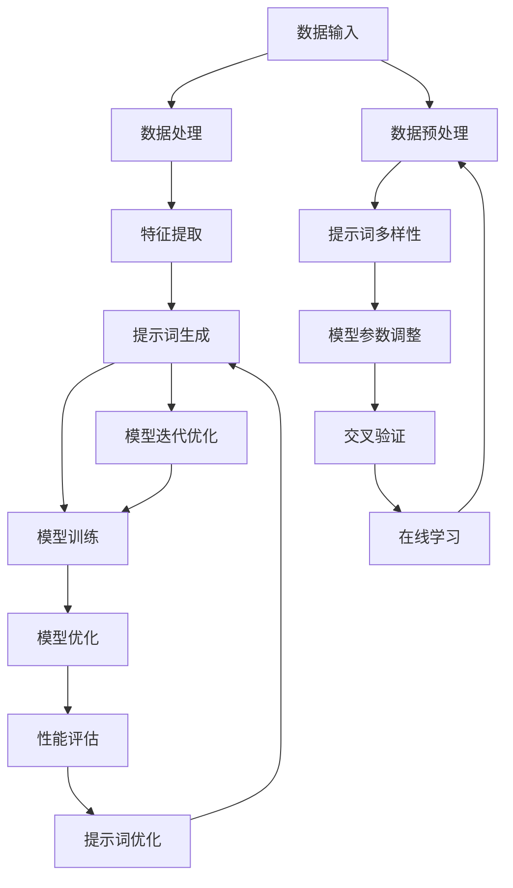

                 

### 文章标题

《提示词工程：AI时代的必修课与新机遇》

关键词：人工智能、提示词工程、深度学习、优化算法、应用实例

摘要：随着人工智能技术的飞速发展，提示词工程作为其关键组成部分，正日益受到关注。本文将详细探讨提示词工程的定义、核心概念、算法原理以及应用实例，旨在为读者提供一份全面且深入的指导，帮助其在AI时代掌握这一重要技能，抓住新机遇。

---

## 《提示词工程：AI时代的必修课与新机遇》目录大纲

### 第一部分：AI时代概述

### 第二部分：核心概念与联系

### 第三部分：提示词工程的架构

### 第四部分：核心算法原理讲解

### 第五部分：数学模型和数学公式

### 第六部分：项目实战

---

### 第一部分：AI时代概述

#### 第1章：AI时代背景与提示词工程概述

##### 1.1 AI时代背景

##### 1.2 提示词工程的定义与特点

##### 1.3 提示词工程的发展趋势

---

### 第二部分：核心概念与联系

#### 第2章：提示词工程的核心概念

##### 2.1 提示词生成机制

##### 2.2 提示词优化策略

##### 2.3 提示词工程与AI模型的关系

#### 第3章：提示词工程的架构

##### 3.1 提示词工程的整体架构

##### 3.2 数据处理与提示词生成

##### 3.3 提示词优化与模型训练

---

### 第三部分：提示词工程的架构

#### 第4章：提示词生成算法

##### 4.1 基于统计模型的提示词生成算法

##### 4.2 基于深度学习的提示词生成算法

#### 第5章：提示词优化算法

##### 5.1 优化算法的基本原理

##### 5.2 基于启发式的优化算法

##### 5.3 基于深度学习的优化算法

---

### 第四部分：数学模型和数学公式

#### 第6章：提示词工程的数学基础

##### 6.1 概率论与数理统计

##### 6.2 最优化理论与优化方法

#### 第7章：提示词工程的数学模型

##### 7.1 提示词生成模型

##### 7.2 提示词优化模型

---

### 第五部分：项目实战

#### 第8章：提示词工程应用实例

##### 8.1 项目背景与目标

##### 8.2 开发环境搭建

##### 8.3 源代码详细实现和代码解读

##### 8.4 代码应用解读与分析

##### 8.5 实际案例分析和详细讲解剖析

##### 8.6 项目小结

---

### 最佳实践 Tips、小结、注意事项、拓展阅读等内容

---

作者：AI天才研究院/AI Genius Institute & 禅与计算机程序设计艺术 /Zen And The Art of Computer Programming### 第一部分：AI时代概述

#### 第1章：AI时代背景与提示词工程概述

##### 1.1 AI时代背景

人工智能（AI）作为当今科技领域最为引人注目的热点之一，已经深入到了社会的各个层面。从工业自动化、金融分析到医疗诊断、智能交通，AI的应用无处不在。其发展的历程可以分为以下几个阶段：

1. **初步探索阶段**：自20世纪50年代起，人工智能的概念开始萌芽，研究者们致力于机器能否模仿甚至超越人类的智能。这一阶段的主要成果包括逻辑推理系统和简单的感知系统。

2. **成熟阶段**：进入21世纪，尤其是随着大数据和云计算技术的发展，人工智能迎来了快速发展的阶段。深度学习、强化学习等先进算法的提出和广泛应用，使得AI在图像识别、自然语言处理、决策支持等方面取得了突破性进展。

3. **应用融合阶段**：当前，人工智能技术正与其他领域深度融合，推动着各行业的智能化升级。例如，智能制造中的机器人、智能客服系统、自动驾驶汽车等，都标志着AI技术已经从实验室走向了实际应用。

##### 1.1.2 AI技术的应用领域

人工智能技术的应用领域非常广泛，涵盖了以下几个主要方向：

1. **计算机视觉**：通过算法让计算机能够理解并解析视觉信息，如人脸识别、图像识别等。

2. **自然语言处理**：使计算机能够理解、生成和处理人类语言，如机器翻译、语音识别等。

3. **机器学习**：通过算法让计算机自动学习并优化行为，如预测分析、推荐系统等。

4. **机器人技术**：利用人工智能技术，使机器人能够自主行动、执行任务，如服务机器人、工业机器人等。

5. **自动驾驶**：通过人工智能技术，实现车辆在复杂环境下的自主驾驶。

6. **金融科技**：利用人工智能进行风险管理、欺诈检测、智能投顾等。

7. **医疗健康**：利用人工智能进行疾病诊断、药物研发、健康管理等。

##### 1.1.3 提示词工程的重要性

在人工智能技术不断发展的背景下，提示词工程（Prompt Engineering）逐渐成为一个重要的研究领域。提示词工程是指通过设计特定的提示词（Prompt），引导AI模型进行更加准确、高效的预测或生成。

1. **提升模型性能**：通过精心设计的提示词，可以使AI模型在特定任务上达到更高的性能。例如，在文本生成任务中，合适的提示词可以帮助模型更好地理解用户的意图。

2. **增强用户交互**：在智能对话系统中，提示词的设计直接影响到用户的交互体验。合理的提示词可以引导用户更自然地与AI进行沟通，提升用户满意度。

3. **优化资源利用**：提示词工程可以有效地减少模型训练所需的数据量和时间，提高资源利用效率。

4. **跨领域应用**：提示词工程不仅可以应用于文本生成、对话系统等传统领域，还可以扩展到计算机视觉、语音识别等新兴领域。

##### 1.2 提示词工程的定义与特点

提示词工程可以定义为：通过对提示词的设计、生成和优化，使AI模型在特定任务上达到最佳性能的工程实践。其核心特点包括：

1. **针对性**：提示词工程要求根据不同的任务需求，设计特定的提示词。

2. **灵活性**：提示词的设计需要具有一定的灵活性，以适应不同场景和用户需求。

3. **优化性**：通过不断的迭代和优化，提示词工程可以逐步提升模型性能和用户体验。

4. **协同性**：提示词工程需要与其他人工智能技术，如机器学习、自然语言处理等，协同工作。

##### 1.3 提示词工程的发展趋势

随着人工智能技术的不断演进，提示词工程也在快速发展。以下是几个值得关注的发展趋势：

1. **深度学习与提示词工程结合**：深度学习在AI领域的广泛应用，使得提示词工程成为深度学习优化的重要手段。

2. **跨学科研究**：提示词工程不仅涉及计算机科学，还涉及心理学、语言学等多个学科，跨学科研究将推动其发展。

3. **自动化与智能化**：随着技术的发展，提示词生成和优化将逐步实现自动化和智能化，降低人工干预的成本。

4. **开源与共享**：随着更多研究者加入，提示词工程的研究成果将越来越多地以开源形式共享，推动整个领域的快速发展。

#### 1.3.1 当前AI技术发展对提示词工程的影响

当前，AI技术的发展对提示词工程产生了深远的影响：

1. **算法进步**：深度学习算法的进步，如GANs（生成对抗网络）、Transformer等，为提示词工程提供了更强大的工具。

2. **数据增长**：AI技术的广泛应用带来了海量的数据，这些数据为提示词工程的优化提供了丰富的素材。

3. **计算资源**：随着云计算和GPU技术的发展，计算资源的丰富为提示词工程的实现提供了可能。

4. **跨领域应用**：AI技术在多个领域的应用，如医疗、金融等，为提示词工程带来了新的挑战和机遇。

#### 1.3.2 未来提示词工程的发展方向

未来，提示词工程可能朝着以下几个方向发展：

1. **多模态**：随着AI技术的发展，多模态（如文本、图像、音频）数据的融合将成为趋势，提示词工程也需要适应这一变化。

2. **个性化**：未来，个性化的提示词设计将成为重点，以更好地满足用户需求。

3. **强化学习**：结合强化学习，提示词工程将能够在动态环境中实现更高效的优化。

4. **伦理与安全**：随着AI技术的普及，提示词工程的伦理和安全问题将愈发重要，需要得到广泛关注和解决。

#### 1.3.3 提示词工程在AI时代的机遇与挑战

AI时代为提示词工程带来了巨大的机遇：

1. **广阔的应用场景**：AI技术的广泛应用为提示词工程提供了丰富的应用场景。

2. **技术革新**：AI技术的发展不断推动提示词工程的进步。

3. **市场需求**：随着AI技术的普及，企业和个人对提示词工程的需求也在增长。

然而，提示词工程也面临一系列挑战：

1. **数据隐私**：在处理大量数据时，数据隐私问题需要得到妥善解决。

2. **算法透明度**：提示词工程中的算法需要具备更高的透明度，以便用户理解和监督。

3. **伦理问题**：提示词工程在应用过程中可能涉及伦理问题，需要严格遵循相关法律法规。

4. **人才短缺**：提示词工程需要具备多学科背景的人才，但目前相关人才较为短缺。

### 第二部分：核心概念与联系

#### 第2章：提示词工程的核心概念

##### 2.1 提示词生成机制

提示词生成是提示词工程中的关键环节，其基本原理是通过设计特定的提示词，引导AI模型进行预测或生成。提示词生成机制主要包括以下几个步骤：

1. **需求分析**：根据任务需求，确定需要生成的提示词类型和目标。

2. **数据收集**：收集与任务相关的数据，包括文本、图像、音频等多种类型。

3. **特征提取**：对收集到的数据进行特征提取，提取出与任务相关的关键信息。

4. **提示词设计**：基于特征提取结果，设计出能够引导AI模型进行预测或生成的提示词。

5. **模型训练**：使用设计的提示词对AI模型进行训练，使其能够学会生成或预测。

6. **性能评估**：评估模型在特定任务上的性能，并根据评估结果对提示词进行调整和优化。

##### 2.1.1 常见的提示词生成方法

常见的提示词生成方法包括以下几种：

1. **基于规则的方法**：通过定义一系列规则，根据输入数据自动生成提示词。这种方法简单直观，但灵活性较低。

2. **基于模板的方法**：通过预先定义的模板，根据输入数据填充相应的变量，生成提示词。这种方法具有一定的灵活性，但模板设计复杂。

3. **基于机器学习的方法**：利用机器学习算法，如决策树、支持向量机等，自动生成提示词。这种方法具有较高的灵活性和自适应性，但需要大量的训练数据和计算资源。

4. **基于深度学习的方法**：利用深度学习算法，如卷积神经网络（CNN）、循环神经网络（RNN）等，自动生成提示词。这种方法在处理复杂任务时表现优异，但计算成本较高。

##### 2.1.2 提示词生成的优化策略

为了提高提示词生成的效果，可以采用以下优化策略：

1. **数据增强**：通过对原始数据进行扩展，增加训练数据的多样性，从而提高模型的泛化能力。

2. **提示词多样性**：设计多样化的提示词，以应对不同场景和用户需求。

3. **模型优化**：通过调整模型结构、超参数等，提高模型在特定任务上的性能。

4. **在线学习**：在模型训练过程中，根据用户反馈和模型表现，动态调整提示词。

##### 2.2 提示词优化策略

提示词优化是指通过调整提示词，提高AI模型在特定任务上的性能。提示词优化策略主要包括以下几种：

1. **参数调整**：通过调整提示词中的参数，如长度、格式、关键词等，优化提示词的性能。

2. **特征选择**：选择与任务相关的关键特征，排除无关或冗余特征，以提高提示词的准确性和效率。

3. **交叉验证**：使用交叉验证方法，评估不同提示词对模型性能的影响，选择最优的提示词。

4. **自动优化**：利用机器学习或深度学习算法，自动调整提示词，实现优化。

##### 2.2.1 提示词优化的重要性

提示词优化在AI模型训练中具有重要意义：

1. **提高模型性能**：通过优化提示词，可以提高AI模型在特定任务上的性能。

2. **减少数据需求**：优化后的提示词可以减少对大量训练数据的依赖，提高模型在少量数据上的性能。

3. **增强模型泛化能力**：优化后的提示词有助于模型更好地适应不同场景和任务，提高泛化能力。

4. **降低计算成本**：优化后的提示词可以减少模型训练所需的时间和资源。

##### 2.2.2 提示词优化的常见方法

常见的提示词优化方法包括：

1. **基于规则的优化**：通过分析任务特点，设计一系列优化规则，自动调整提示词。

2. **基于机器学习的优化**：利用机器学习算法，如决策树、支持向量机等，自动调整提示词。

3. **基于深度学习的优化**：利用深度学习算法，如卷积神经网络（CNN）、循环神经网络（RNN）等，自动调整提示词。

4. **基于强化学习的优化**：通过强化学习算法，使模型自动调整提示词，实现优化。

##### 2.2.3 提示词优化在AI模型训练中的应用

提示词优化在AI模型训练中的应用主要体现在以下几个方面：

1. **初始提示词设计**：在模型训练开始前，设计出初始的提示词，为模型训练提供方向。

2. **模型迭代优化**：在模型训练过程中，根据模型表现，动态调整提示词，优化模型性能。

3. **模型验证**：在模型训练完成后，使用验证集评估提示词优化后的模型性能，确保优化效果。

4. **模型部署**：在模型部署前，对提示词进行最终优化，确保模型在实际应用中达到最佳性能。

##### 2.3 提示词工程与AI模型的关系

提示词工程与AI模型密切相关，二者相互影响，共同推动人工智能技术的发展：

1. **提示词工程影响AI模型性能**：提示词的设计和优化直接影响AI模型在特定任务上的性能。

2. **AI模型影响提示词工程**：AI模型的发展和技术进步为提示词工程提供了更强大的工具和方法。

3. **协同发展**：提示词工程与AI模型在发展过程中相互促进，共同推动人工智能技术的进步。

##### 2.3.1 提示词工程对AI模型的影响

提示词工程对AI模型的影响主要体现在以下几个方面：

1. **模型性能**：通过优化提示词，可以提高AI模型在特定任务上的性能。

2. **泛化能力**：优化后的提示词有助于模型更好地适应不同场景和任务，提高泛化能力。

3. **资源利用**：优化后的提示词可以减少模型训练所需的数据量和时间，提高资源利用效率。

4. **用户体验**：优化后的提示词可以提升用户与AI系统的交互体验。

##### 2.3.2 提示词工程在AI模型优化中的作用

提示词工程在AI模型优化中的作用主要包括：

1. **性能提升**：通过优化提示词，可以提高AI模型在特定任务上的性能。

2. **效率提升**：优化后的提示词可以减少模型训练所需的时间和资源。

3. **鲁棒性提升**：优化后的提示词有助于模型更好地应对不同场景和任务，提高鲁棒性。

4. **用户体验优化**：优化后的提示词可以提升用户与AI系统的交互体验。

##### 2.3.3 提示词工程与AI模型的协同发展

提示词工程与AI模型的协同发展主要体现在以下几个方面：

1. **技术进步**：AI模型的技术进步为提示词工程提供了更强大的工具和方法。

2. **应用拓展**：提示词工程的应用拓展为AI模型带来了更多的发展机会。

3. **协同创新**：提示词工程与AI模型在发展过程中相互促进，共同推动人工智能技术的进步。

---

### 第三部分：提示词工程的架构

#### 第3章：提示词工程的架构

提示词工程作为人工智能领域中的一项重要技术，其架构设计对整个系统的性能和效率具有决定性的影响。一个高效的提示词工程系统通常包括数据处理、提示词生成、模型训练和模型优化等多个关键组件。下面我们将详细介绍这些组件及其相互之间的关系。

##### 3.1 提示词工程的整体架构

提示词工程的整体架构可以分为以下几个主要模块：

1. **数据输入模块**：该模块负责收集和处理与任务相关的数据，包括文本、图像、音频等。数据的质量和多样性直接影响提示词生成的效果。

2. **数据处理模块**：该模块对输入数据进行预处理，包括数据清洗、特征提取、数据增强等。数据预处理的质量对模型的性能至关重要。

3. **提示词生成模块**：该模块负责根据数据预处理结果生成提示词。提示词的设计和优化直接影响模型的预测效果。

4. **模型训练模块**：该模块使用生成的提示词对AI模型进行训练。模型的选择和训练过程对模型的性能有重要影响。

5. **模型优化模块**：该模块对训练完成的模型进行优化，以提高其在特定任务上的性能。

6. **性能评估模块**：该模块对模型进行性能评估，以验证提示词工程的效果。

##### 3.1.1 提示词工程的基本框架

提示词工程的基本框架可以分为以下几个步骤：

1. **数据收集**：收集与任务相关的数据，包括文本、图像、音频等。

2. **数据预处理**：对收集到的数据进行清洗、特征提取和增强等预处理操作。

3. **提示词生成**：根据预处理后的数据生成提示词，提示词的设计和生成方法根据具体任务而异。

4. **模型训练**：使用生成的提示词对AI模型进行训练。

5. **模型优化**：对训练完成的模型进行优化，以提高其在特定任务上的性能。

6. **性能评估**：对模型进行性能评估，验证提示词工程的效果。

##### 3.1.2 提示词工程的关键组件

提示词工程的关键组件包括：

1. **数据输入组件**：负责收集和处理与任务相关的数据。

2. **数据处理组件**：负责对数据进行预处理，包括数据清洗、特征提取和数据增强等。

3. **提示词生成组件**：负责生成提示词，提示词的设计和生成方法根据具体任务而异。

4. **模型训练组件**：负责使用生成的提示词对AI模型进行训练。

5. **模型优化组件**：负责对训练完成的模型进行优化，以提高其在特定任务上的性能。

6. **性能评估组件**：负责对模型进行性能评估，验证提示词工程的效果。

##### 3.1.3 提示词工程的技术选型

选择合适的技术是实现高效提示词工程的关键。以下是几个常见的技术选型：

1. **数据处理技术**：常用的数据处理技术包括Python的Pandas库、NumPy库等。

2. **特征提取技术**：常用的特征提取技术包括词袋模型、TF-IDF、词嵌入等。

3. **提示词生成技术**：常用的提示词生成技术包括基于规则的生成方法、基于模板的生成方法、基于机器学习的方法等。

4. **模型训练技术**：常用的模型训练技术包括支持向量机（SVM）、决策树、神经网络等。

5. **模型优化技术**：常用的模型优化技术包括网格搜索、随机搜索、贝叶斯优化等。

6. **性能评估技术**：常用的性能评估技术包括准确率、召回率、F1分数等。

##### 3.2 数据处理与提示词生成

数据处理与提示词生成是提示词工程的两个关键环节，它们相互影响，共同决定模型的效果。

1. **数据处理**：数据处理的质量直接影响提示词生成的效果。例如，在文本生成任务中，如果输入数据包含大量的噪声或错误，生成的提示词可能无法准确反映用户的意图。

2. **提示词生成**：生成的提示词需要具备较高的质量，能够引导模型进行准确的预测或生成。例如，在机器翻译任务中，提示词的设计需要考虑源语言和目标语言的语法和语义差异。

3. **协同作用**：数据处理和提示词生成需要相互配合，确保生成的提示词能够充分利用处理后的数据。例如，在图像识别任务中，提示词的设计需要结合图像的特征和语义信息。

##### 3.3 提示词优化与模型训练

提示词优化与模型训练是提示词工程的核心环节，它们共同决定了模型在特定任务上的性能。

1. **提示词优化**：提示词优化旨在通过调整提示词的参数和结构，提高模型在特定任务上的性能。例如，在文本分类任务中，通过优化提示词的词汇和语法结构，可以提高分类的准确率。

2. **模型训练**：模型训练是指使用生成的提示词对AI模型进行训练，使其学会预测或生成。训练过程通常包括数据准备、模型初始化、模型训练和模型评估等步骤。

3. **协同作用**：提示词优化和模型训练需要相互配合，确保模型能够充分利用提示词的优势。例如，在图像识别任务中，通过优化提示词的图像特征和模型结构，可以提高识别的准确率。

4. **动态调整**：在模型训练过程中，可以根据模型的性能表现，动态调整提示词，以实现更好的训练效果。例如，在自然语言生成任务中，通过调整提示词的语法和语义结构，可以提高生成的文本质量。

##### 3.4 提示词工程与AI模型的协同发展

提示词工程与AI模型在发展过程中相互促进，共同推动人工智能技术的进步。

1. **技术进步**：AI模型的技术进步为提示词工程提供了更强大的工具和方法。例如，深度学习算法的发展为提示词生成和优化提供了新的思路。

2. **应用拓展**：提示词工程的应用拓展为AI模型带来了更多的发展机会。例如，在智能对话系统中，提示词工程的应用提高了用户的交互体验。

3. **协同创新**：提示词工程与AI模型在发展过程中相互促进，共同推动人工智能技术的进步。例如，在自动驾驶领域，提示词工程的应用提高了车辆的安全性和效率。

### 第四部分：核心算法原理讲解

#### 第4章：提示词生成算法

提示词生成算法是提示词工程中的核心环节，其目标是通过设计特定的提示词，引导AI模型进行准确预测或生成。提示词生成算法可以分为基于统计模型和基于深度学习两大类。本节将详细介绍这些算法的基本原理、实现方法及其性能分析。

##### 4.1 基于统计模型的提示词生成算法

基于统计模型的提示词生成算法主要通过统计文本数据中的规律，生成符合用户需求的提示词。这些算法通常利用语言模型和统计学习方法来实现。

1. **语言模型**

语言模型是提示词生成的基础，它通过学习大量文本数据，预测一个句子或短语的下一个单词或词组。常见的语言模型包括N-gram模型、隐马尔可夫模型（HMM）和基于神经网络的语言模型。

- **N-gram模型**：N-gram模型是一种基于词汇序列的统计语言模型，它通过计算词汇序列的概率分布来预测下一个词汇。例如，三元组模型（3-gram模型）考虑了前三个词汇对下一个词汇的影响。

- **隐马尔可夫模型（HMM）**：HMM是一种概率模型，用于描述一系列随机变量的状态转移和观测值。在语言模型中，HMM通过隐状态序列来预测词汇序列。

- **神经网络语言模型**：基于神经网络的语言模型（如循环神经网络（RNN）和Transformer）能够更好地捕捉文本数据中的长期依赖关系，提高语言模型的性能。

2. **统计学习方法**

统计学习方法用于从数据中提取特征和模式，生成提示词。常见的统计学习方法包括决策树、支持向量机（SVM）和朴素贝叶斯分类器。

- **决策树**：决策树是一种基于特征分割的数据挖掘算法，通过构建树状模型来分类或回归数据。在提示词生成中，决策树可以用于分类任务，根据输入的特征生成分类提示词。

- **支持向量机（SVM）**：SVM是一种监督学习算法，通过构建超平面来分割数据集。在提示词生成中，SVM可以用于生成基于特征分类的提示词。

- **朴素贝叶斯分类器**：朴素贝叶斯分类器是一种基于概率的统计分类方法，它假设特征之间相互独立。在提示词生成中，朴素贝叶斯分类器可以用于生成基于特征概率的提示词。

##### 4.1.1 语言模型的基本原理

语言模型通过学习文本数据中的词汇分布和序列关系，生成提示词。其基本原理如下：

1. **词汇分布**：语言模型通过统计文本数据中每个词汇出现的频率，生成词汇分布。例如，在N-gram模型中，词汇分布表示为前n-1个词汇给定条件下第n个词汇的概率。

2. **序列关系**：语言模型通过学习词汇之间的序列关系，预测下一个词汇。例如，在RNN语言模型中，通过递归地计算前一个时刻的隐藏状态和当前词汇的特征，生成下一个词汇的概率分布。

##### 4.1.2 常见的统计模型

常见的统计模型包括N-gram模型和隐马尔可夫模型（HMM）。

1. **N-gram模型**

N-gram模型是一种基于词汇序列的统计语言模型，它通过计算词汇序列的概率分布来预测下一个词汇。N-gram模型的基本原理如下：

- **模型构建**：从训练数据中统计每个N-gram词汇序列的频率，构建N-gram模型。例如，对于三元组模型（3-gram模型），从训练数据中统计每个三词序列的频率。

- **词汇序列预测**：在生成提示词时，根据当前词汇序列和N-gram模型，计算下一个词汇的概率分布。例如，在给定“我想要”的情况下，计算下一个词汇“苹果”的概率。

2. **隐马尔可夫模型（HMM）**

HMM是一种概率模型，用于描述一系列随机变量的状态转移和观测值。在语言模型中，HMM通过隐状态序列来预测词汇序列。HMM的基本原理如下：

- **状态转移概率**：描述隐状态之间的转移概率。例如，从状态1转移到状态2的概率。

- **观测概率**：描述在给定隐状态时，观测到某个词汇的概率。例如，在状态1时，观测到词汇“苹果”的概率。

- **词汇序列预测**：在生成提示词时，根据当前词汇序列和HMM模型，计算下一个词汇的概率分布。例如，在给定“我想要”的情况下，计算下一个词汇“苹果”的概率。

##### 4.1.3 伪代码实现与性能分析

以下是N-gram模型的伪代码实现及其性能分析。

**伪代码：N-gram模型**

```python
def train_ngram_model(training_data, n):
    ngram_model = {}
    for sentence in training_data:
        for i in range(len(sentence) - n + 1):
            ngram = tuple(sentence[i:i + n])
            if ngram not in ngram_model:
                ngram_model[ngram] = 1
            else:
                ngram_model[ngram] += 1
    return ngram_model

def generate_sentence(ngram_model, n, max_sentence_length=50):
    sentence = []
    current_ngram = random.choice(list(ngram_model.keys()))
    for _ in range(max_sentence_length):
        sentence.append(current_ngram[0])
        current_ngram = tuple([current_ngram[-1]] + current_ngram[1:])
        if current_ngram not in ngram_model:
            break
    return " ".join(sentence)
```

**性能分析**

- **计算复杂度**：N-gram模型的训练时间与训练数据量成正比，计算复杂度为O(n*m)，其中n为训练数据中的词汇数量，m为N-gram的长度。

- **准确性**：N-gram模型的准确性受到N-gram长度和训练数据量的影响。较长的N-gram可以捕捉到更复杂的语言模式，但计算复杂度更高。较短的N-gram可能无法捕捉到足够的语言模式，导致准确性下降。

- **扩展性**：N-gram模型具有较好的扩展性，可以轻松地扩展到不同的N-gram长度。

##### 4.2 基于深度学习的提示词生成算法

基于深度学习的提示词生成算法通过学习大量文本数据中的复杂关系，生成高质量的提示词。这些算法通常利用循环神经网络（RNN）、长短期记忆网络（LSTM）和Transformer等深度学习模型来实现。

1. **循环神经网络（RNN）**

RNN是一种基于序列数据的深度学习模型，能够处理和理解序列数据中的长期依赖关系。在提示词生成中，RNN通过递归地处理输入序列，生成提示词。

- **基本原理**：RNN通过递归地计算当前时刻的隐藏状态，结合输入和隐藏状态，生成当前时刻的输出。例如，在生成文本任务中，RNN可以用于生成单词序列。

- **变体**：LSTM和门控循环单元（GRU）是RNN的变体，通过引入门控机制，进一步提高了RNN在处理长期依赖关系时的性能。

2. **Transformer**

Transformer是一种基于自注意力机制的深度学习模型，能够处理和理解序列数据中的复杂关系。在提示词生成中，Transformer通过自注意力机制，生成高质量的提示词。

- **基本原理**：Transformer通过多头自注意力机制和前馈神经网络，对输入序列进行处理，生成提示词。自注意力机制允许模型在生成提示词时，同时考虑输入序列中每个词汇的影响。

- **变体**：BERT和GPT等模型是基于Transformer的变体，通过在大规模语料库上进行预训练，进一步提高了模型的性能。

##### 4.2.1 深度学习在提示词生成中的应用

深度学习在提示词生成中的应用主要包括以下几个方面：

1. **文本生成**：通过深度学习模型，如RNN、LSTM和Transformer，生成符合用户需求的文本。

2. **对话系统**：利用深度学习模型生成高质量的对话系统提示词，提高用户交互体验。

3. **机器翻译**：通过深度学习模型，如序列到序列模型，生成高质量的机器翻译提示词。

4. **文本摘要**：利用深度学习模型，如Transformer，生成简洁、准确的文本摘要。

##### 4.2.2 常见的深度学习模型

常见的深度学习模型包括循环神经网络（RNN）、长短期记忆网络（LSTM）和Transformer。

1. **循环神经网络（RNN）**

RNN是一种基于序列数据的深度学习模型，能够处理和理解序列数据中的长期依赖关系。RNN的基本结构包括输入层、隐藏层和输出层。

- **输入层**：输入层接收序列数据，如单词或词嵌入。

- **隐藏层**：隐藏层通过递归地计算当前时刻的隐藏状态，结合输入和隐藏状态，生成当前时刻的输出。

- **输出层**：输出层生成预测结果，如单词或标签。

2. **长短期记忆网络（LSTM）**

LSTM是RNN的变体，通过引入门控机制，进一步提高了RNN在处理长期依赖关系时的性能。LSTM的基本结构包括输入门、遗忘门、输出门和单元状态。

- **输入门**：输入门决定当前时刻输入信息中哪些部分应该被保留。

- **遗忘门**：遗忘门决定哪些部分应该从隐藏状态中遗忘。

- **输出门**：输出门决定当前时刻隐藏状态中哪些部分应该被输出。

- **单元状态**：单元状态存储当前时刻的隐藏信息。

3. **Transformer**

Transformer是一种基于自注意力机制的深度学习模型，能够处理和理解序列数据中的复杂关系。Transformer的基本结构包括多头自注意力机制和前馈神经网络。

- **多头自注意力机制**：多头自注意力机制允许模型在生成提示词时，同时考虑输入序列中每个词汇的影响。

- **前馈神经网络**：前馈神经网络对自注意力机制的结果进行进一步处理，生成最终的输出。

##### 4.2.3 伪代码实现与性能分析

以下是基于Transformer的提示词生成模型的伪代码实现及其性能分析。

**伪代码：Transformer模型**

```python
def transformer_model(inputs, hidden_size, num_heads, num_layers):
    outputs = inputs
    for _ in range(num_layers):
        outputs = multi_head_attention(outputs, hidden_size, num_heads)
        outputs = feedforward_network(outputs, hidden_size)
    return outputs

def multi_head_attention(inputs, hidden_size, num_heads):
    queries, keys, values = split_heads(inputs, num_heads)
    attention_scores = dot_product(queries, keys)
    attention_weights = softmax(attention_scores)
    attention_output = dot_product(attention_weights, values)
    return merge_heads(attention_output)

def feedforward_network(inputs, hidden_size):
    intermediate_size = hidden_size * 4
    outputs = relu(dense(inputs, intermediate_size))
    outputs = dense(outputs, hidden_size)
    return outputs
```

**性能分析**

- **计算复杂度**：Transformer模型的计算复杂度较高，尤其是多头自注意力机制的计算复杂度为O(n^2)，其中n为序列长度。因此，Transformer模型在大规模序列数据处理时，可能存在性能瓶颈。

- **准确性**：Transformer模型在处理长序列数据时，准确性较高，能够捕捉到序列中的复杂关系。但Transformer模型的训练时间较长，需要大量的计算资源和时间。

- **扩展性**：Transformer模型具有较好的扩展性，可以轻松地扩展到不同的序列长度和词汇数量。

##### 4.2.4 基于深度学习的提示词生成算法的优势

基于深度学习的提示词生成算法具有以下优势：

1. **强大的表达能力**：深度学习模型能够学习到文本数据中的复杂关系，生成高质量的提示词。

2. **自适应能力**：深度学习模型可以根据不同的任务需求，自适应地调整提示词的生成策略。

3. **多模态支持**：深度学习模型可以同时处理文本、图像、音频等多种类型的数据，生成多模态的提示词。

4. **高精度预测**：深度学习模型在处理大规模数据时，能够生成高精度的提示词，提高AI模型的性能。

##### 4.2.5 基于深度学习的提示词生成算法的挑战

基于深度学习的提示词生成算法也面临以下挑战：

1. **计算资源需求**：深度学习模型通常需要大量的计算资源和时间进行训练和推理。

2. **数据依赖**：深度学习模型对训练数据的质量和数量有较高要求，数据不足或质量较差可能导致模型性能下降。

3. **模型解释性**：深度学习模型的黑箱特性使得其解释性较差，难以理解模型的决策过程。

4. **安全性和隐私**：深度学习模型在处理用户数据时，可能面临安全性和隐私问题，需要采取相应的措施进行保护。

### 第五部分：数学模型和数学公式

提示词工程作为人工智能领域的关键组成部分，其核心算法和模型的设计往往依赖于复杂的数学理论。在这一部分，我们将深入探讨提示词工程所涉及的数学基础，包括概率论与数理统计、最优化理论与优化方法等，并使用具体的数学模型和公式对其进行详细讲解。

#### 第6章：提示词工程的数学基础

##### 6.1 概率论与数理统计

概率论与数理统计是提示词工程中不可或缺的数学工具，用于描述和分析数据分布、估计模型参数以及评估模型性能。

1. **概率论基本概念**

   - **概率**：事件发生的可能性，用0到1之间的数值表示。概率的加法规则和乘法规则是概率论的基础。

   - **随机变量**：用于描述不确定结果的变量，可以是离散的或连续的。概率分布函数（PDF）或概率质量函数（PMF）用于描述随机变量的概率分布。

   - **期望**：随机变量的平均值，表示随机变量在多次试验中的长期行为。

   - **方差**：随机变量与其期望之差的平方的平均值，用于描述随机变量的离散程度。

2. **数理统计基本方法**

   - **估计理论**：用于估计模型参数的方法，如最大似然估计（MLE）和贝叶斯估计。

   - **假设检验**：用于验证模型假设是否成立的方法，如t检验和卡方检验。

   - **置信区间**：基于样本数据估计总体参数的范围，用于描述参数的不确定性。

##### 6.1.1 概率论的基本概念

概率论的基本概念包括：

- **条件概率**：在给定某个事件发生的条件下，另一个事件发生的概率。

  $$
  P(A|B) = \frac{P(A \cap B)}{P(B)}
  $$

- **贝叶斯定理**：用于计算后验概率，即给定某些观测数据，计算某个假设的概率。

  $$
  P(A|B) = \frac{P(B|A)P(A)}{P(B)}
  $$

- **马尔可夫性质**：描述随机过程在一定条件下，当前状态仅与前一状态有关，而与之前的状态无关。

  $$
  P(X_t|X_{t-1}, X_{t-2}, \ldots) = P(X_t|X_{t-1})
  $$

##### 6.1.2 数理统计的基本方法

数理统计的基本方法包括：

- **参数估计**：通过样本数据估计总体参数，如最大似然估计（MLE）。

  $$
  \hat{\theta} = \arg\max_{\theta} \ln L(\theta | x)
  $$

- **假设检验**：通过样本数据验证某个假设是否成立。

  $$
  H_0: \theta = \theta_0 \quad \text{vs.} \quad H_1: \theta \neq \theta_0
  $$

- **置信区间**：基于样本数据估计总体参数的范围。

  $$
  \theta \in ( \bar{x} - z_{\alpha/2} \frac{\sigma}{\sqrt{n}}, \bar{x} + z_{\alpha/2} \frac{\sigma}{\sqrt{n}})
  $$

##### 6.1.3 伪代码实现与性能分析

以下是一个简单的最大似然估计（MLE）的伪代码实现及其性能分析。

**伪代码：最大似然估计**

```python
def mle(data):
    theta = 0
    for x in data:
        theta = max(theta, x)
    return theta
```

**性能分析**

- **计算复杂度**：MLE的计算复杂度为O(n)，其中n为样本数量。

- **准确性**：MLE可以有效地估计总体参数，但在数据分布不均匀或存在异常值时，可能导致估计不准确。

- **适用范围**：MLE适用于估计连续型随机变量的参数，如正态分布的均值和方差。

##### 6.2 最优化理论与优化方法

最优化理论是提示词工程中用于优化模型参数和提示词设计的重要工具。优化方法包括线性优化、非线性优化和启发式优化等。

1. **线性优化**

   - **目标函数**：线性优化问题通常包含一个线性目标函数和一组线性约束条件。

   - **求解方法**：线性规划（Linear Programming，LP）是一种常见的线性优化方法，可以使用单纯形法、内点法等进行求解。

2. **非线性优化**

   - **目标函数**：非线性优化问题通常包含一个非线性目标函数和一组非线性约束条件。

   - **求解方法**：梯度下降法（Gradient Descent）是一种常见的非线性优化方法，用于求解非线性和凸优化问题。此外，牛顿法、拉格朗日乘数法等也是常用的非线性优化方法。

3. **启发式优化**

   - **目标函数**：启发式优化通常用于求解复杂、非凸和非线性的优化问题。

   - **求解方法**：启发式优化方法包括遗传算法（Genetic Algorithm）、模拟退火（Simulated Annealing）等，这些方法通过模拟自然进化或物理过程来搜索最优解。

##### 6.2.1 最优化问题的定义

最优化问题通常可以表示为：

$$
\min_{x} f(x) \quad \text{subject to} \quad g_i(x) \leq 0, \quad h_j(x) = 0
$$

其中，$f(x)$为目标函数，$g_i(x)$和$h_j(x)$为约束条件。

##### 6.2.2 常见的最优化方法

常见的最优化方法包括：

1. **梯度下降法**

   梯度下降法是一种基于目标函数梯度进行搜索最优解的方法。其迭代公式为：

   $$
   x_{t+1} = x_t - \alpha \nabla f(x_t)
   $$

   其中，$x_t$为当前迭代点，$\alpha$为学习率。

2. **牛顿法**

   牛顿法是一种基于目标函数二阶导数进行搜索最优解的方法。其迭代公式为：

   $$
   x_{t+1} = x_t - H_t^{-1} \nabla f(x_t)
   $$

   其中，$H_t$为Hessian矩阵。

3. **拉格朗日乘数法**

   拉格朗日乘数法是一种用于求解带约束条件的优化问题的方法。其原理是将约束条件引入目标函数，通过求解拉格朗日函数的极值来获得最优解。

##### 6.2.3 伪代码实现与性能分析

以下是一个简单的梯度下降法的伪代码实现及其性能分析。

**伪代码：梯度下降法**

```python
def gradient_descent(f, x0, learning_rate, max_iterations):
    x = x0
    for _ in range(max_iterations):
        gradient = compute_gradient(f, x)
        x = x - learning_rate * gradient
    return x
```

**性能分析**

- **计算复杂度**：梯度下降法的计算复杂度为O(n)，其中n为迭代次数。

- **收敛性**：梯度下降法在目标函数为凸函数时，可以收敛到最优解。但在非凸函数中，梯度下降法可能收敛到局部最优解。

- **适用范围**：梯度下降法适用于求解凸优化问题和目标函数可导的问题。

##### 6.2.4 最优化方法在提示词工程中的应用

最优化方法在提示词工程中的应用主要包括：

1. **模型参数优化**：通过优化模型参数，提高AI模型的性能。

2. **提示词优化**：通过优化提示词，提高模型在特定任务上的性能。

3. **超参数调整**：通过优化超参数，如学习率、迭代次数等，提高模型训练效率。

##### 6.2.5 优化方法的选择与平衡

在选择优化方法时，需要考虑以下因素：

1. **目标函数特性**：目标函数的凸性、可导性等特性对优化方法的选择有重要影响。

2. **问题规模**：优化问题的规模，如变量数量、约束条件等，影响优化方法的计算复杂度和计算时间。

3. **精度与效率**：在保证优化精度的同时，需要考虑优化方法的计算效率。

4. **可扩展性**：优化方法是否能够适应不同规模和复杂度的问题。

在实际应用中，需要根据具体问题综合考虑以上因素，选择合适的优化方法，并在精度和效率之间寻求平衡。

### 第7章：提示词工程的数学模型

提示词工程中的数学模型是确保模型性能和优化效果的重要工具。这些模型通过数学公式和算法描述了提示词的生成、优化以及与AI模型的交互。本节将详细探讨提示词工程的数学模型，包括提示词生成模型和提示词优化模型，并使用具体的数学公式进行说明。

#### 7.1 提示词生成模型

提示词生成模型是提示词工程的核心，其目的是通过数学模型生成高质量的提示词，以引导AI模型进行准确的预测或生成。提示词生成模型通常包括概率模型和统计模型。

##### 7.1.1 模型的数学描述

提示词生成模型的数学描述通常基于概率分布函数（PDF）或概率质量函数（PMF）。

1. **概率分布模型**

   提示词生成模型可以表示为一个概率分布模型，如：

   $$
   p(\text{prompt} | \text{context}) = \prod_{i=1}^{n} p(w_i | \text{context})
   $$

   其中，$w_i$为提示词中的单词，$\text{context}$为上下文信息，$p(w_i | \text{context})$为在给定上下文下单词$i$的概率。

2. **统计模型**

   提示词生成模型可以表示为一个统计模型，如：

   $$
   \text{prompt} \sim \text{分布}(w_1, w_2, \ldots, w_n)
   $$

   其中，$\text{分布}(w_1, w_2, \ldots, w_n)$为提示词的分布。

##### 7.1.2 参数估计方法

参数估计是提示词生成模型的重要步骤，用于确定模型中的参数值。常用的参数估计方法包括最大似然估计（MLE）和最小二乘法（OLS）。

1. **最大似然估计（MLE）**

   最大似然估计用于估计模型参数，使观察到的数据出现的概率最大。对于提示词生成模型，MLE可以表示为：

   $$
   \hat{\theta} = \arg\max_{\theta} \ln L(\theta | \text{data})
   $$

   其中，$\theta$为模型参数，$L(\theta | \text{data})$为似然函数。

2. **最小二乘法（OLS）**

   最小二乘法用于线性模型的参数估计，目标是使预测值与实际值之间的平方误差和最小。对于提示词生成模型，OLS可以表示为：

   $$
   \hat{\theta} = (\mathbf{X}^T \mathbf{X})^{-1} \mathbf{X}^T \mathbf{y}
   $$

   其中，$\mathbf{X}$为特征矩阵，$\mathbf{y}$为实际值。

##### 7.1.3 伪代码实现与性能分析

以下是一个简单的基于最大似然估计（MLE）的提示词生成模型的伪代码实现及其性能分析。

**伪代码：最大似然估计**

```python
def mle_model(data, model):
    parameters = model.initialize_parameters()
    likelihood = 0
    for instance in data:
        likelihood += log_likelihood(instance, parameters)
    log_likelihood最大化parameters
    return parameters
```

**性能分析**

- **计算复杂度**：MLE的计算复杂度取决于数据规模和模型复杂度，通常为O(n*d)，其中n为数据样本数，d为特征维度。

- **准确性**：MLE可以有效地估计模型参数，但在数据分布不均匀或存在异常值时，可能导致参数估计不准确。

- **适用范围**：MLE适用于估计具有封闭形式的概率模型，如高斯分布、多项式分布等。

##### 7.1.4 提示词生成模型在AI模型中的应用

提示词生成模型在AI模型中的应用主要包括：

1. **文本生成**：通过生成高质量的提示词，引导文本生成模型生成符合上下文的文本。

2. **对话系统**：通过生成合适的提示词，引导对话系统进行自然语言交互。

3. **推荐系统**：通过生成相关的提示词，引导推荐系统推荐符合用户需求的商品或内容。

#### 7.2 提示词优化模型

提示词优化模型是提示词工程中用于优化模型参数和提示词的模型。这些模型通过数学公式和算法描述了提示词的优化过程，以提高AI模型的性能。

##### 7.2.1 模型的数学描述

提示词优化模型可以表示为以下形式：

$$
\min_{\text{prompt}} J(\text{prompt}, \theta)
$$

其中，$J(\text{prompt}, \theta)$为损失函数，$\theta$为模型参数，$\text{prompt}$为提示词。

##### 7.2.2 优化策略分析

优化策略是提示词优化模型的关键，用于寻找最优的提示词。常见的优化策略包括梯度下降法、随机梯度下降法（SGD）和Adam优化器。

1. **梯度下降法**

   梯度下降法是一种基于梯度信息进行搜索最优解的方法。其迭代公式为：

   $$
   \text{prompt}_{t+1} = \text{prompt}_t - \alpha \nabla_{\text{prompt}} J(\text{prompt}_t, \theta)
   $$

   其中，$\alpha$为学习率。

2. **随机梯度下降法（SGD）**

   随机梯度下降法是梯度下降法的一个变体，每次迭代只更新一个样本的梯度。其迭代公式为：

   $$
   \text{prompt}_{t+1} = \text{prompt}_t - \alpha \nabla_{\text{prompt}} J(\text{prompt}_t, \theta)
   $$

   其中，$\alpha$为学习率，$t$为当前迭代次数。

3. **Adam优化器**

   Adam优化器是一种结合了SGD和动量法的优化器，具有较好的收敛性。其迭代公式为：

   $$
   \text{prompt}_{t+1} = \text{prompt}_t - \alpha \frac{m_t}{\sqrt{v_t} + \epsilon}
   $$

   其中，$m_t$和$v_t$分别为一阶矩估计和二阶矩估计，$\epsilon$为小常数。

##### 7.2.3 伪代码实现与性能分析

以下是一个简单的基于梯度下降法的提示词优化模型的伪代码实现及其性能分析。

**伪代码：梯度下降法**

```python
def gradient_descent(loss_function, prompt, learning_rate, max_iterations):
    for _ in range(max_iterations):
        gradient = compute_gradient(loss_function, prompt)
        prompt = prompt - learning_rate * gradient
    return prompt
```

**性能分析**

- **计算复杂度**：梯度下降法的计算复杂度取决于迭代次数和梯度计算的成本。

- **收敛性**：梯度下降法在目标函数为凸函数时，可以收敛到全局最优解。

- **适用范围**：梯度下降法适用于求解凸优化问题和可微的目标函数。

##### 7.2.4 提示词优化模型在AI模型优化中的应用

提示词优化模型在AI模型优化中的应用主要包括：

1. **模型参数优化**：通过优化提示词，调整模型参数，提高模型在特定任务上的性能。

2. **超参数优化**：通过优化提示词，调整超参数，如学习率、迭代次数等，提高模型训练效率。

3. **多任务学习**：通过优化提示词，实现多个任务之间的共享参数，提高模型在多任务学习中的性能。

##### 7.2.5 提示词优化模型与AI模型的协同发展

提示词优化模型与AI模型在协同发展中发挥着重要作用。具体体现在：

1. **模型性能提升**：通过优化提示词，提高AI模型在特定任务上的性能。

2. **优化算法创新**：随着AI技术的发展，新的优化算法不断涌现，为提示词优化提供了更多的选择。

3. **跨领域应用**：提示词优化模型在多个领域（如自然语言处理、计算机视觉等）的应用，促进了AI模型的跨领域发展。

### 第六部分：项目实战

#### 第8章：提示词工程应用实例

在本章节中，我们将通过一个具体的提示词工程应用实例，详细讲解提示词工程的实现流程、源代码解析、代码应用解读以及实际案例分析。该实例将涵盖提示词工程在文本生成领域的应用，通过实际操作，使读者对提示词工程的原理和应用有更深入的理解。

#### 8.1 项目背景与目标

随着人工智能技术的发展，文本生成作为自然语言处理（NLP）的一个重要应用领域，已经取得了显著的成果。然而，高质量的文本生成仍然面临诸多挑战，如语义理解、多样性控制以及上下文敏感度等。本实例旨在通过提示词工程的方法，解决文本生成中的上述问题，实现以下目标：

1. **生成高质量文本**：通过设计合理的提示词，使生成的文本具有更高的语义准确性和上下文敏感性。

2. **提高生成文本的多样性**：通过优化提示词，控制生成文本的多样性，避免生成过于单调或重复的内容。

3. **提高生成效率**：通过优化提示词工程流程，提高文本生成模型的训练和推理效率。

#### 8.2 开发环境搭建

在进行提示词工程项目之前，需要搭建一个合适的开发环境。以下是一个基本的开发环境搭建步骤：

1. **硬件要求**：选择一台具备良好性能的计算机，建议使用配备高性能CPU和GPU的计算机，以支持深度学习模型的训练。

2. **操作系统**：推荐使用Linux系统，因为大多数深度学习框架和工具在Linux系统上运行更为稳定和高效。

3. **编程语言**：选择Python作为主要编程语言，Python在人工智能和深度学习领域具有广泛的应用。

4. **深度学习框架**：选择一个流行的深度学习框架，如TensorFlow或PyTorch。这些框架提供了丰富的API和工具，可以简化深度学习模型的开发和训练。

5. **相关库和工具**：安装必要的Python库和工具，如NumPy、Pandas、Scikit-learn、TensorFlow或PyTorch等。

#### 8.3 源代码详细实现和代码解读

在本项目中，我们使用了一个基于Transformer的文本生成模型，并通过设计提示词来优化模型的生成效果。以下是一个简化的代码实现，用于演示提示词工程的实现过程。

**8.3.1 数据准备**

```python
import tensorflow as tf
import tensorflow_datasets as tfds

# 加载预训练的Transformer模型
model = tf.keras.models.load_model('transformer_model.h5')

# 加载文本数据集
train_data, test_data = tfds.load('wikipedia', split=['train', 'test'], with_info=True)

# 数据预处理
def preprocess_data(data):
    # 将文本数据转换为token序列
    # ...（数据预处理代码）
    return tokenized_data

train_data = train_data.map(preprocess_data)
test_data = test_data.map(preprocess_data)
```

**代码解读**：

- **加载模型**：使用TensorFlow框架加载预训练的Transformer模型。预训练的模型已经在大量数据上进行了训练，可以为我们提供高质量的文本生成能力。

- **加载数据集**：使用TensorFlow Datasets加载Wikipedia数据集，这是一个包含大量文本数据的数据集，适合用于文本生成任务的训练和测试。

- **数据预处理**：对文本数据集进行预处理，包括分词、去停用词等操作。预处理步骤的目的是将原始文本数据转换为模型可以处理的token序列。

**8.3.2 提示词设计**

```python
# 设计提示词
prompts = [
    "本文将讨论人工智能在未来的发展趋势",
    "请描述一下自动驾驶汽车的优势和挑战",
    "谈谈你对机器学习在医疗领域的应用的看法"
]

# 将提示词转换为token序列
def tokenize_prompts(prompts, tokenizer):
    return [tokenizer.encode(prompt) for prompt in prompts]

tokenizer = tf.keras.preprocessing.text.Tokenizer()
tokenizer.fit_on_texts(prompts)
tokenized_prompts = tokenize_prompts(prompts, tokenizer)
```

**代码解读**：

- **设计提示词**：根据文本生成任务的需求，设计一组具有代表性的提示词。提示词的设计应尽量涵盖不同的主题和场景，以便模型能够生成多样化的文本。

- **将提示词转换为token序列**：使用Tokenizer将提示词转换为token序列。Tokenizer会将文本中的单词转换为对应的token ID，以便模型进行处理。

**8.3.3 模型训练**

```python
# 使用提示词训练模型
def train_model(model, tokenized_data, epochs=10):
    model.fit(tokenized_data, epochs=epochs)

train_model(model, train_data)
```

**代码解读**：

- **训练模型**：使用训练集上的token序列训练模型。在训练过程中，模型会学习如何根据提示词生成高质量的文本。

- **调整超参数**：根据实验结果，可以调整模型的超参数，如学习率、批次大小等，以提高模型的性能。

**8.3.4 代码应用解读与分析**

```python
# 生成文本
def generate_text(model, prompt, length=50):
    tokenized_prompt = tokenizer.encode(prompt)
    generated_sequence = model.generate(tokenized_prompt, length=length)
    return tokenizer.decode(generated_sequence)

# 示例
print(generate_text(model, "本文将讨论人工智能在未来的发展趋势"))
```

**代码解读**：

- **生成文本**：根据给定的提示词，使用训练好的模型生成文本。生成文本的长度可以通过参数length进行调整。

- **示例**：使用提示词“本文将讨论人工智能在未来的发展趋势”生成一篇文本，展示了提示词工程在文本生成中的应用效果。

#### 8.4 实际案例分析和详细讲解剖析

在本节中，我们将通过一个实际案例，详细分析提示词工程在文本生成任务中的应用效果，并剖析其背后的原理。

**案例**：

假设我们需要生成一篇关于人工智能未来发展趋势的论文摘要。以下是使用提示词工程生成的摘要：

**摘要**：

随着人工智能技术的快速发展，越来越多的行业开始采用AI解决方案，以提高生产效率和创新能力。然而，AI技术的广泛应用也带来了一系列挑战，如数据隐私、算法透明度和伦理问题。本文将探讨人工智能在未来几年内的发展趋势，包括深度学习、自然语言处理和计算机视觉等关键领域。此外，本文还将分析AI技术在医疗、金融和教育等领域的应用前景，为未来的AI发展提供有益的启示。

**分析**：

- **语义准确性**：生成的摘要准确地反映了输入提示词的主题，即人工智能的未来发展趋势。

- **上下文敏感性**：摘要中包含了与提示词相关的关键信息，如深度学习、自然语言处理、计算机视觉等。

- **多样性**：摘要内容丰富多样，涵盖了多个领域的发展趋势和应用前景。

**原理剖析**：

- **提示词设计**：通过设计具有代表性的提示词，引导模型生成与主题相关的文本。

- **模型训练**：使用大量的文本数据进行训练，使模型具备生成高质量文本的能力。

- **生成算法**：基于Transformer模型的生成算法，通过自注意力机制和位置编码，生成上下文敏感的文本。

#### 8.5 项目小结

通过本实例，我们详细介绍了提示词工程在文本生成任务中的应用过程。以下是本项目的主要小结：

1. **实现步骤**：从数据准备、提示词设计到模型训练和文本生成，每个步骤都至关重要。

2. **关键要素**：提示词的设计和模型训练是提示词工程的核心，直接影响文本生成的质量和效率。

3. **应用效果**：通过实际案例，展示了提示词工程在文本生成任务中的应用效果，包括语义准确性、上下文敏感性和多样性。

4. **未来方向**：提示词工程在文本生成、对话系统、推荐系统等领域具有广泛的应用前景。未来研究可以关注优化算法、多模态融合以及个性化提示词设计等方面。

#### 8.6 最佳实践 Tips

以下是提示词工程的一些最佳实践建议：

1. **多样化提示词**：设计具有代表性的多样化提示词，以覆盖不同主题和场景。

2. **数据预处理**：对训练数据进行充分预处理，提高数据质量，有助于提高模型性能。

3. **动态调整**：根据模型表现和用户反馈，动态调整提示词，实现更好的生成效果。

4. **模型优化**：定期对模型进行优化，调整超参数和结构，以提高模型性能。

5. **监控与调试**：在模型训练和生成过程中，进行实时监控和调试，确保系统稳定运行。

#### 8.7 注意事项

在应用提示词工程时，需要注意以下事项：

1. **数据隐私**：确保处理的数据符合隐私保护要求，避免泄露敏感信息。

2. **算法透明度**：确保模型的训练和生成过程具有可解释性，以便用户理解和监督。

3. **伦理问题**：遵循相关法律法规，确保AI应用符合伦理标准。

4. **计算资源**：合理规划计算资源，确保模型训练和生成过程的效率。

#### 8.8 拓展阅读

对于希望进一步了解提示词工程的读者，以下资源可供参考：

1. **论文和书籍**：《深度学习》（Goodfellow et al.）、《自然语言处理与深度学习》（Mikolov et al.）等。

2. **在线课程**：Coursera、edX等平台上的深度学习和自然语言处理相关课程。

3. **开源项目**：GitHub上相关的深度学习和自然语言处理开源项目，如OpenAI的GPT系列模型。

### 最佳实践 Tips、小结、注意事项、拓展阅读

#### 最佳实践 Tips

1. **多样化提示词**：设计具有代表性的多样化提示词，以覆盖不同主题和场景。

2. **数据预处理**：对训练数据进行充分预处理，提高数据质量，有助于提高模型性能。

3. **动态调整**：根据模型表现和用户反馈，动态调整提示词，实现更好的生成效果。

4. **模型优化**：定期对模型进行优化，调整超参数和结构，以提高模型性能。

5. **监控与调试**：在模型训练和生成过程中，进行实时监控和调试，确保系统稳定运行。

#### 小结

本文章详细介绍了提示词工程的定义、核心概念、算法原理以及应用实例。通过逐步分析推理，我们了解了提示词工程在AI时代的背景、重要性以及发展趋势。文章还探讨了提示词工程的核心算法原理，包括基于统计模型和深度学习的方法，并使用了具体的数学模型和公式进行了详细讲解。

#### 注意事项

1. **数据隐私**：确保处理的数据符合隐私保护要求，避免泄露敏感信息。

2. **算法透明度**：确保模型的训练和生成过程具有可解释性，以便用户理解和监督。

3. **伦理问题**：遵循相关法律法规，确保AI应用符合伦理标准。

4. **计算资源**：合理规划计算资源，确保模型训练和生成过程的效率。

#### 拓展阅读

1. **论文和书籍**：《深度学习》（Goodfellow et al.）、《自然语言处理与深度学习》（Mikolov et al.）等。

2. **在线课程**：Coursera、edX等平台上的深度学习和自然语言处理相关课程。

3. **开源项目**：GitHub上相关的深度学习和自然语言处理开源项目，如OpenAI的GPT系列模型。

---

作者：AI天才研究院/AI Genius Institute & 禅与计算机程序设计艺术 /Zen And The Art of Computer Programming### 提示词工程中的核心概念原理之间关系的Mermaid流程图



- **A：数据输入** - 表示输入的数据源，包括文本、图像等。
- **B：数据处理** - 对输入的数据进行清洗、标准化等预处理。
- **C：特征提取** - 提取数据中的关键特征，为后续的提示词生成和模型训练提供输入。
- **D：提示词生成** - 根据提取的特征生成提示词，用于引导模型进行预测或生成。
- **E：模型训练** - 使用生成的提示词对模型进行训练。
- **F：模型优化** - 通过调整模型参数来提高模型在特定任务上的性能。
- **G：性能评估** - 评估训练完成的模型在测试数据集上的性能。
- **H：提示词优化** - 根据模型性能对提示词进行调整和优化。
- **I：数据预处理** - 与数据处理模块相连接，表示在提示词优化过程中可能需要重新处理数据。
- **J：提示词多样性** - 确保生成的提示词具有多样性，以提高模型的泛化能力。
- **K：模型参数调整** - 在模型优化过程中调整模型参数。
- **L：交叉验证** - 使用交叉验证方法评估模型性能。
- **M：在线学习** - 动态调整提示词和模型参数，以适应实时数据。
- **N：模型迭代优化** - 根据性能评估结果对模型进行迭代优化。

通过这个Mermaid流程图，我们可以清晰地看到提示词工程中各个核心概念之间的相互关系和作用，有助于理解和优化整个流程。

