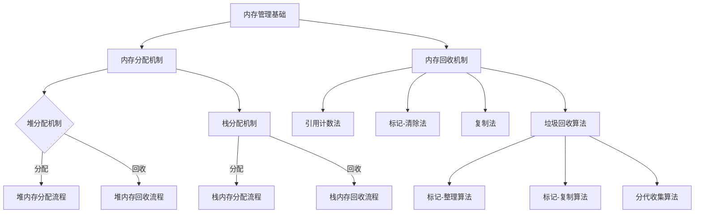

                 

### 文章标题：提示词编程语言的内存管理机制

在当今计算机科学的世界里，编程语言日新月异，层出不穷。而其中，提示词编程语言以其独特的魅力和高效的内存管理机制逐渐崭露头角。本文将深入探讨提示词编程语言的内存管理机制，解析其背后的原理和技术，以期帮助读者更好地理解和掌握这一领域。

关键词：提示词编程语言、内存管理、内存分配、内存回收、垃圾回收算法、内存优化

**摘要：** 本文首先介绍了内存管理的基本概念，包括内存的结构与类型、内存分配与回收策略以及内存泄漏与溢出。接着，我们对提示词编程语言进行了概述，分析了其发展历程、优势与局限性，以及核心特性。随后，本文重点讨论了提示词编程语言的内存管理机制，包括内存分配机制、内存回收机制以及垃圾回收算法。最后，我们探讨了内存管理优化策略，并通过具体案例进行了实战分析，展望了未来趋势与机遇。

### 目录

#### 第一部分：内存管理基础

1. 内存管理概述
    1.1 内存管理的基本概念
    1.2 内存泄漏与溢出
2. 提示词编程语言概述
    2.1 提示词编程语言的发展历程
    2.2 提示词编程语言的优势与局限性
    2.3 提示词编程语言的核心特性

#### 第二部分：内存管理机制

3. 内存分配机制
    3.1 堆分配机制
    3.2 栈分配机制
4. 内存回收机制
    4.1 引用计数法
    4.2 标记-清除法
    4.3 复制法
5. 垃圾回收算法
    5.1 标记-整理算法
    5.2 标记-复制算法
    5.3 分代收集算法

#### 第三部分：内存管理优化

6. 内存管理优化
    6.1 内存分配与回收优化
    6.2 内存使用优化

#### 第四部分：案例分析与实战

7. 案例分析与实战
    7.1 Java 内存管理
    7.2 C++ 内存管理
    7.3 Python 内存管理

#### 第五部分：未来趋势与展望

8. 未来趋势与展望
    8.1 内存管理技术的发展趋势
    8.2 提示词编程语言内存管理的挑战与机遇

### 第一部分：内存管理基础

#### 第1章：内存管理概述

**1.1 内存管理的基本概念**

计算机内存是计算机系统中用于临时存储程序代码和数据的重要组成部分。内存管理是指操作系统对内存进行分配、回收、保护等一系列操作的过程。内存管理的好坏直接影响到程序的运行效率和系统的稳定性。

**1.1.1 计算机内存的结构与类型**

计算机内存主要分为以下几种类型：

1. **随机存取存储器（RAM）**：RAM是计算机内存的核心，用于临时存储正在运行的程序和数据。RAM具有读写速度快、访问时间短的特点，但断电后数据会丢失。

2. **只读存储器（ROM）**：ROM用于存储计算机的启动代码和基本输入输出系统（BIOS），数据一旦写入后就无法更改。ROM断电后数据不会丢失。

3. **高速缓存（Cache）**：Cache是位于CPU和主内存之间的临时存储器，用于减少CPU访问主内存的时间。Cache分为一级缓存（L1 Cache）和二级缓存（L2 Cache）等。

**1.1.2 内存分配与回收策略**

内存分配是指将空闲内存分配给需要内存的程序或数据。内存回收是指释放不再使用的内存，以便再次分配给其他程序或数据。

内存分配与回收策略有多种，主要包括：

1. **静态分配**：在程序运行前，操作系统根据程序的需求预先分配内存。这种方式适用于内存需求相对稳定的情况。

2. **动态分配**：在程序运行过程中，根据程序的需求动态分配内存。这种方式适用于内存需求变化较大的情况，如数据结构和栈操作。

3. **固定分配**：操作系统为每个程序分配固定大小的内存空间，程序在运行过程中无法更改。这种方式简单易行，但可能造成内存浪费。

4. **可变分配**：操作系统为程序分配的内存空间可以根据程序的需求动态调整。这种方式能够更好地利用内存资源，但实现复杂。

**1.2 内存泄漏与溢出**

内存泄漏是指程序在运行过程中不断分配内存，但不再释放已分配的内存，导致可用内存逐渐减少。内存泄漏可能导致程序运行缓慢、系统崩溃等问题。

内存溢出是指程序在运行过程中申请的内存空间超过了系统可用内存的总量，导致程序无法正常运行。内存溢出可能导致程序崩溃、系统死机等问题。

**1.2.1 内存泄漏的原因与影响**

内存泄漏的原因主要有：

1. **未释放的对象**：程序在运行过程中创建了对象，但忘记释放对象所占用的内存。

2. **循环引用**：两个或多个对象互相引用，导致内存无法回收。

内存泄漏的影响包括：

1. **内存占用增加**：随着内存泄漏的累积，内存占用逐渐增加，可能导致系统资源不足。

2. **程序性能下降**：内存泄漏会导致程序运行缓慢，甚至出现卡顿现象。

3. **系统崩溃**：严重的内存泄漏可能导致系统崩溃。

**1.2.2 内存溢出的原因与处理**

内存溢出的原因主要有：

1. **内存申请过多**：程序在运行过程中申请的内存空间过多，超过了系统可用内存的总量。

2. **内存泄漏**：内存泄漏可能导致可用内存逐渐减少，最终导致内存溢出。

处理内存溢出的方法包括：

1. **优化内存使用**：减少内存申请量，提高内存利用率。

2. **增大内存容量**：增加系统内存容量，以应对内存溢出问题。

3. **修改程序逻辑**：分析程序逻辑，找出内存溢出的原因，并进行修改。

通过本章的介绍，我们对内存管理的基本概念、内存泄漏与溢出及其处理方法有了更深入的了解。在下一章中，我们将对提示词编程语言进行概述，分析其发展历程、优势与局限性，以及核心特性。敬请期待！### 第一部分：内存管理基础

#### 第2章：提示词编程语言概述

提示词编程语言（Prompt-Based Programming Language）是一种结合了自然语言处理和编程语言特点的新型编程范式。它通过自然语言或提示词来指导程序的行为，从而简化了编程过程，提高了编程效率。本节将介绍提示词编程语言的发展历程、优势与局限性，以及核心特性。

**2.1 提示词编程语言的发展历程**

提示词编程语言的发展可以追溯到自然语言处理（NLP）和编程语言的交叉领域。早在20世纪80年代，一些研究者开始尝试将自然语言与编程语言结合，以实现更自然的编程方式。这些早期的尝试主要包括自然语言编程（Natural Language Programming）和提示词编程（Prompt-Based Programming）。

自然语言编程试图将自然语言作为编程语言，直接用自然语言编写程序。然而，由于自然语言的歧义性和复杂性，这种尝试并未取得显著成功。相比之下，提示词编程更加注重通过自然语言提示来引导程序的运行，从而避免了直接使用自然语言作为编程语言的问题。

随着NLP技术的进步，特别是在深度学习和神经网络模型的发展下，提示词编程语言逐渐崭露头角。例如，Facebook的PyTorch和TensorFlow等深度学习框架引入了提示词编程的概念，允许开发者通过自然语言提示来编写和优化神经网络模型。这些提示词可以是具体的代码片段、注释或者任务描述。

**2.1.1 传统编程语言与提示词编程语言的对比**

传统编程语言（如C、Java、Python等）通常依赖于固定的语法和结构，开发者需要遵循严格的编程规范来编写程序。而提示词编程语言则更加灵活，允许开发者使用自然语言进行编程。以下是传统编程语言与提示词编程语言的对比：

1. **语法**：传统编程语言具有明确的语法规则，而提示词编程语言的语法更加自由，更接近自然语言。

2. **可读性**：提示词编程语言的代码更加易读，自然语言提示使得程序逻辑更加直观。

3. **开发效率**：提示词编程语言简化了编程过程，开发者可以更快速地实现功能。

4. **可维护性**：提示词编程语言的可读性提高了代码的可维护性，减少了后续维护的难度。

5. **适用场景**：传统编程语言适用于各种复杂场景，而提示词编程语言更适合于数据分析和机器学习等场景。

**2.1.2 提示词编程语言的优势与局限性**

提示词编程语言的优势包括：

1. **简化编程过程**：通过自然语言提示，开发者可以更快速地编写和调试程序。

2. **提高开发效率**：自然语言提示减少了编程中的冗余操作，提高了开发效率。

3. **易学易用**：提示词编程语言更容易上手，降低了编程学习的难度。

提示词编程语言的局限性包括：

1. **性能限制**：提示词编程语言的性能可能不如传统编程语言，尤其是在处理复杂计算任务时。

2. **语法歧义**：自然语言的歧义性可能导致提示词编程语言的代码难以准确理解。

3. **工具支持**：提示词编程语言相对较新，现有的工具和库支持可能不如传统编程语言丰富。

**2.2 提示词编程语言的核心特性**

提示词编程语言具有以下核心特性：

1. **自然语言提示**：开发者可以使用自然语言编写提示词，指导程序的运行。

2. **动态交互**：提示词编程语言支持开发者与程序之间的动态交互，使得程序可以实时响应用户输入。

3. **智能解析**：提示词编程语言内置了自然语言处理模型，可以智能解析和执行提示词。

4. **代码生成**：提示词编程语言可以根据提示词生成相应的代码，简化编程过程。

5. **跨平台兼容**：提示词编程语言通常具有跨平台兼容性，可以在不同操作系统和硬件上运行。

通过本章的介绍，我们对提示词编程语言的发展历程、优势与局限性，以及核心特性有了更深入的了解。在下一章中，我们将深入探讨提示词编程语言的内存管理机制，包括内存分配、内存回收和垃圾回收算法。敬请期待！### 第二部分：内存管理机制

#### 第3章：内存分配机制

内存分配是内存管理的重要环节，它决定了程序如何获取和使用系统内存。在提示词编程语言中，内存分配机制尤为重要，因为它直接影响程序的执行效率和稳定性。本节将详细介绍提示词编程语言的内存分配机制，包括堆分配机制和栈分配机制。

**3.1 堆分配机制**

堆（Heap）是程序运行时动态分配内存的区域，由操作系统管理。堆分配机制允许程序在运行时根据需求动态地申请和释放内存。

**3.1.1 堆分配的基本原理**

1. **动态内存分配**：程序在运行过程中，可以根据需要动态地申请内存。例如，通过调用malloc或new函数分配内存。

2. **内存块管理**：操作系统维护一个内存块列表，用于记录已分配和未分配的内存块。当程序需要分配内存时，操作系统从内存块列表中找到合适的内存块，并分配给程序。

3. **内存回收**：当程序不再需要已分配的内存时，可以通过调用free或delete函数释放内存。操作系统将已释放的内存块重新加入内存块列表，以供后续分配。

**3.1.2 堆内存的分配与回收**

1. **内存分配**：程序通过调用malloc或new函数，向操作系统请求分配一定大小的内存。操作系统从内存块列表中找到合适的内存块，并将地址返回给程序。

   ```c
   // C语言中的malloc函数示例
   void* ptr = malloc(size);
   ```

   ```python
   # Python中的new示例
   obj = MyClass()
   ```

2. **内存回收**：程序通过调用free或delete函数，释放不再使用的内存。

   ```c
   // C语言中的free函数示例
   free(ptr);
   ```

   ```python
   # Python中的delete示例
   del obj
   ```

**3.2 栈分配机制**

栈（Stack）是程序运行时用于存储局部变量和函数调用信息的内存区域。栈分配机制通过栈的自动管理，简化了内存分配过程。

**3.2.1 栈内存的基本原理**

1. **栈帧**：每个函数调用都会在栈上创建一个栈帧，用于存储函数的局部变量、返回地址和调用参数。

2. **栈顶增长**：栈的顶部是最新创建的栈帧，随着函数调用增多，栈顶逐渐向上增长。

3. **栈底减少**：函数返回时，栈顶的栈帧被删除，栈底逐渐减少。

**3.2.2 栈内存的分配与回收**

栈内存的分配和回收具有以下特点：

1. **自动分配与回收**：程序在调用函数时，栈内存会自动分配；函数返回时，栈内存会自动回收。

2. **局部变量管理**：栈内存主要用于存储局部变量，局部变量的生命周期与函数调用一致。

3. **栈溢出**：由于栈内存是有限的，过多的函数调用或过大的局部变量可能导致栈溢出。

   ```c
   // C语言中的栈溢出示例
   void recursiveFunction(int n) {
       if (n > 0) {
           recursiveFunction(n - 1);
       }
   }
   ```

**3.3 堆与栈的对比**

堆和栈是程序运行时使用的两个不同的内存区域，它们各有优缺点：

1. **动态性与灵活性**：堆内存分配更灵活，适用于不确定大小的数据；栈内存分配更固定，适用于局部变量和函数调用。

2. **内存大小**：栈内存通常较小，栈溢出风险较高；堆内存较大，但管理复杂。

3. **生命周期**：栈内存自动管理，生命周期与函数调用相关；堆内存需要手动管理，生命周期由程序控制。

通过本章的介绍，我们对提示词编程语言的内存分配机制有了更深入的了解。在下一章中，我们将探讨内存回收机制，包括引用计数法、标记-清除法和复制法。敬请期待！### 第二部分：内存管理机制

#### 第4章：内存回收机制

内存回收是内存管理的重要环节，它决定了如何有效地释放不再使用的内存，以供其他程序或数据使用。在提示词编程语言中，内存回收机制至关重要，因为它直接影响程序的运行效率和系统稳定性。本节将详细介绍内存回收机制，包括引用计数法、标记-清除法和复制法。

**4.1 引用计数法**

引用计数法（Reference Counting）是一种简单的内存回收方法。它通过跟踪每个对象被引用的次数来决定是否回收内存。当对象的引用次数降为0时，该对象不再被使用，可以回收其占用的内存。

**4.1.1 引用计数法的基本原理**

1. **引用计数**：每个对象都有一个引用计数器，记录引用该对象的变量数量。

2. **增加引用**：当一个新的变量引用一个对象时，该对象的引用计数增加。

3. **减少引用**：当变量不再引用对象时，该对象的引用计数减少。

4. **内存回收**：当对象的引用计数降为0时，该对象不再被使用，可以被回收。

**4.1.2 引用计数法的优缺点**

引用计数法具有以下优点：

1. **简单高效**：引用计数法的实现相对简单，回收过程快速。

2. **无碎片问题**：引用计数法可以避免内存碎片问题，因为回收的内存可以立即被重新使用。

引用计数法也存在一些缺点：

1. **循环引用**：引用计数法无法处理循环引用的对象，因为循环引用的引用计数永远不会降为0。

2. **引用计数器开销**：每个对象都需要维护一个引用计数器，增加了内存和计算开销。

**4.2 标记-清除法**

标记-清除法（Mark-Sweep）是一种较为复杂的内存回收方法。它通过标记和清除两个阶段来回收内存。

**4.2.1 标记-清除法的基本原理**

1. **标记阶段**：遍历所有活动对象，将其标记为活动状态。

2. **清除阶段**：遍历所有未标记的对象，将其回收。

**4.2.2 标记-清除法的优缺点**

标记-清除法具有以下优点：

1. **灵活**：标记-清除法可以处理循环引用的对象。

2. **无引用计数器开销**：标记-清除法不需要为每个对象维护引用计数器，降低了内存和计算开销。

标记-清除法也存在一些缺点：

1. **内存碎片**：标记-清除法可能导致内存碎片问题，因为清除阶段可能会产生不连续的空闲内存块。

2. **回收过程较慢**：标记-清除法需要遍历所有对象，回收过程较慢。

**4.3 复制法**

复制法（Copying）是一种基于引用计数法的改进方法。它通过将对象复制到新的内存区域来回收内存。

**4.3.1 复制法的基本原理**

1. **初始分配**：将所有对象初始分配到主内存区域。

2. **复制过程**：当对象被引用时，将其复制到辅助内存区域。

3. **回收过程**：当对象的引用次数降为0时，将其从主内存区域复制到辅助内存区域，并释放主内存区域。

**4.3.2 复制法的优缺点**

复制法具有以下优点：

1. **高效**：复制法避免了标记-清除法中的内存碎片问题，因为对象始终存储在连续的内存区域中。

2. **快速回收**：复制法可以在常数时间内完成内存回收。

复制法也存在一些缺点：

1. **内存占用**：复制法需要额外的辅助内存区域，增加了内存占用。

2. **复制开销**：复制法需要在主内存区域和辅助内存区域之间进行对象复制，增加了计算开销。

通过本章的介绍，我们对提示词编程语言的内存回收机制有了更深入的了解。在下一章中，我们将探讨垃圾回收算法，包括标记-整理算法、标记-复制算法和分代收集算法。敬请期待！### 第二部分：内存管理机制

#### 第5章：垃圾回收算法

垃圾回收（Garbage Collection，GC）是内存管理中的一项重要技术，它通过自动识别和回收不再使用的内存，从而减少内存泄漏和溢出的风险。在提示词编程语言中，垃圾回收算法的设计和实现对于提高程序性能和稳定性至关重要。本节将详细介绍三种常用的垃圾回收算法：标记-整理算法、标记-复制算法和分代收集算法。

**5.1 标记-整理算法**

标记-整理算法（Mark-Compact Algorithm）是标记-清除法的一种改进。它通过标记活动对象并进行内存整理，来回收内存。

**5.1.1 标记-整理算法的基本原理**

1. **标记阶段**：遍历所有对象，将活动对象标记为已标记。

2. **整理阶段**：将所有已标记的对象移动到内存的一端，并将未标记的对象移动到另一端，从而实现内存整理。

3. **清除阶段**：清除所有未标记的对象。

**5.1.2 标记-整理算法的优缺点**

标记-整理算法具有以下优点：

1. **减少内存碎片**：通过整理阶段，标记-整理算法可以减少内存碎片，提高内存利用率。

2. **快速回收**：整理阶段可以快速完成，回收过程相对较快。

标记-整理算法也存在一些缺点：

1. **内存占用**：整理阶段需要额外的内存空间来存储已标记和未标记的对象。

2. **复制开销**：将对象从一端移动到另一端可能会增加内存复制开销。

**5.2 标记-复制算法**

标记-复制算法（Mark-Copying Algorithm）通过将对象复制到新的内存区域来回收内存，从而简化了回收过程。

**5.2.1 标记-复制算法的基本原理**

1. **初始分配**：将所有对象初始分配到主内存区域。

2. **复制过程**：当对象被引用时，将其复制到辅助内存区域。

3. **回收过程**：当对象的引用次数降为0时，将其从主内存区域复制到辅助内存区域，并释放主内存区域。

**5.2.2 标记-复制算法的优缺点**

标记-复制算法具有以下优点：

1. **高效**：标记-复制算法避免了内存碎片问题，因为对象始终存储在连续的内存区域中。

2. **快速回收**：标记-复制算法可以在常数时间内完成内存回收。

标记-复制算法也存在一些缺点：

1. **内存占用**：需要额外的辅助内存区域，增加了内存占用。

2. **复制开销**：在主内存区域和辅助内存区域之间进行对象复制，增加了计算开销。

**5.3 分代收集算法**

分代收集算法（Generational Collection Algorithm）基于这样一种观察：大多数对象的生命周期都很短。分代收集算法将对象分为不同的代，并针对不同的代采用不同的回收策略。

**5.3.1 分代收集算法的基本原理**

1. **新生代（Young Generation）**：新创建的对象首先被分配到新生代。新生代通常包括堆栈和堆。

2. **老年代（Old Generation）**：新生代的对象经过若干次垃圾回收后，如果仍然存活，将被转移到老年代。

3. **垃圾回收策略**：新生代采用标记-复制算法进行回收，而老年代采用标记-清除或标记-整理算法进行回收。

**5.3.2 分代收集算法的优缺点**

分代收集算法具有以下优点：

1. **高效**：通过针对不同代采用不同的回收策略，分代收集算法可以减少回收时间。

2. **减少内存占用**：新生代的对象生命周期较短，可以更频繁地进行回收，减少了内存占用。

分代收集算法也存在一些缺点：

1. **复杂度**：分代收集算法的实现相对复杂，需要维护不同代的对象。

2. **对象转移开销**：新生代对象转移到老年代可能会增加对象转移开销。

通过本章的介绍，我们对提示词编程语言的垃圾回收算法有了更深入的了解。在下一章中，我们将探讨内存管理优化策略，包括内存分配与回收优化和内存使用优化。敬请期待！### 第二部分：内存管理机制

#### 第6章：内存管理优化

内存管理的优化对于提升程序的性能和稳定性至关重要。在提示词编程语言中，内存管理优化不仅有助于减少内存占用，还能提高程序运行的效率。本节将介绍内存分配与回收优化以及内存使用优化策略。

**6.1 内存分配与回收优化**

内存分配与回收的优化可以从以下几个方面进行：

**6.1.1 内存池技术**

内存池（Memory Pool）是一种预先分配一定大小内存块的技术，用于提高内存分配的效率。内存池通常分为固定大小和可变大小两种类型。

1. **固定大小内存池**：预先分配一系列固定大小的内存块，程序可以根据需要从内存池中分配或释放内存块。

   ```c
   // 固定大小内存池示例
   void* pool[POOL_SIZE];
   for (int i = 0; i < POOL_SIZE; i++) {
       pool[i] = malloc(BLOCK_SIZE);
   }
   ```

2. **可变大小内存池**：根据程序的实际需求动态调整内存池的大小，以优化内存分配。

   ```c
   // 可变大小内存池示例
   void* pool = malloc(initial_size);
   while (need_more_memory) {
       pool = realloc(pool, new_size);
   }
   ```

**6.1.2 缓存技术**

缓存（Caching）是一种利用内存池或堆栈缓存常用数据或对象的技术，以减少内存分配和回收的开销。

1. **堆栈缓存**：将常用的数据或对象存储在堆栈上，以减少堆内存的分配。

   ```c
   // 堆栈缓存示例
   int stack[STACK_SIZE];
   for (int i = 0; i < STACK_SIZE; i++) {
       stack[i] = compute_value(i);
   }
   ```

2. **内存池缓存**：使用内存池缓存常用的数据或对象，减少内存分配和回收的次数。

   ```c
   // 内存池缓存示例
   MemoryPool pool;
   Object* obj = pool.allocate();
   // 使用obj
   pool.deallocate(obj);
   ```

**6.2 内存使用优化**

内存使用优化的目标是减少程序运行过程中占用的内存，以提高内存利用率。以下是一些常见的内存使用优化策略：

**6.2.1 内存复用**

内存复用（Memory Reuse）是一种通过重复使用已分配内存来减少内存占用的技术。

1. **对象池**：使用对象池（Object Pool）缓存已分配的对象，当需要新对象时，从对象池中获取，而不重新分配内存。

   ```c
   // 对象池示例
   ObjectPool pool;
   Object* obj = pool.borrow();
   // 使用obj
   pool.return_to_pool(obj);
   ```

2. **内存映射**：通过内存映射（Memory Mapping）将文件映射到内存中，从而减少实际占用的内存空间。

   ```c
   // 内存映射示例
   int fd = open("data.bin", O_RDONLY);
   void* addr = mmap(NULL, file_size, PROT_READ, MAP_PRIVATE, fd, 0);
   ```

**6.2.2 内存预分配与延迟分配**

内存预分配（Memory Pre-allocation）和延迟分配（Deferred Allocation）是一种在程序运行过程中动态调整内存分配的技术。

1. **内存预分配**：在程序启动时预分配一定大小的内存，以减少运行过程中的内存分配次数。

   ```c
   // 内存预分配示例
   void* memory = malloc(initial_size);
   ```

2. **延迟分配**：在程序运行过程中根据实际需求动态分配内存，以减少初始占用的内存。

   ```c
   // 延迟分配示例
   void* memory = malloc(0);
   if (need_more_memory) {
       realloc(memory, new_size);
   }
   ```

通过本章的介绍，我们对提示词编程语言的内存管理优化策略有了更深入的了解。有效的内存管理优化不仅可以提高程序的性能，还能延长系统运行的时间。在下一章中，我们将通过具体案例进行分析和实战，进一步探讨内存管理在Java、C++和Python等编程语言中的实现和应用。敬请期待！### 第三部分：案例分析与实战

#### 第7章：案例分析与实战

通过前面的章节，我们详细介绍了提示词编程语言的内存管理机制，包括内存分配、内存回收和垃圾回收算法。为了更好地理解这些概念和技术，我们将通过具体的编程语言（如Java、C++和Python）来分析和实战，展示内存管理的实际应用。

**7.1 Java 内存管理**

Java是一种面向对象的编程语言，具有自动垃圾回收（Garbage Collection，GC）的特性。Java的内存管理通过堆（Heap）和栈（Stack）来分配和回收内存。

**7.1.1 Java 内存模型**

Java内存模型包括以下主要部分：

1. **栈（Stack）**：用于存储局部变量、方法调用信息和返回地址等。栈内存由操作系统自动管理。

2. **堆（Heap）**：用于存储对象实例、数组等。堆内存由Java虚拟机（JVM）管理。

3. **方法区（Method Area）**：用于存储已加载的类信息、常量池、静态变量等。

4. **本地方法栈（Native Method Stack）**：用于存储本地方法的调用信息和返回地址等。

**7.1.2 Java 内存分配与回收**

1. **堆内存分配与回收**：Java中的对象实例和数组通常在堆内存中分配。当对象不再被引用时，JVM会通过垃圾回收算法（如标记-清除、标记-整理、标记-复制和分代收集）回收堆内存。

   ```java
   // 堆内存分配示例
   Object obj = new Object();
   ```

2. **栈内存分配与回收**：Java中的方法调用和局部变量在栈内存中分配。栈内存由操作系统自动管理，当方法调用结束或局部变量超出作用域时，栈内存会被自动回收。

   ```java
   // 栈内存分配示例
   public void method() {
       int localVar = 10;
   }
   ```

**7.2 C++ 内存管理**

C++是一种过程式和面向对象的编程语言，其内存管理较为灵活，需要程序员手动进行内存分配和回收。

**7.2.1 C++ 内存模型**

C++内存模型主要包括以下部分：

1. **栈（Stack）**：用于存储局部变量、方法调用信息和返回地址等。

2. **堆（Heap）**：用于存储动态分配的内存，如使用malloc和new分配的内存。

3. **全局区（Global Area）**：包括全局变量、静态变量、常量等。

4. **代码区（Code Area）**：用于存储已编译的代码。

**7.2.2 C++ 内存分配与回收**

1. **堆内存分配与回收**：C++中的动态内存分配主要通过malloc和new操作符来实现。使用完动态分配的内存后，需要通过free和delete操作符进行回收。

   ```c++
   // 堆内存分配示例
   int* ptr = new int(10);
   ```

2. **栈内存分配与回收**：C++中的栈内存由操作系统自动管理。栈内存的分配和回收通常在函数调用过程中完成。

   ```c++
   // 栈内存分配示例
   void function() {
       int localVar = 10;
   }
   ```

**7.3 Python 内存管理**

Python是一种动态类型的解释型编程语言，其内存管理主要由Python解释器和垃圾回收机制负责。

**7.3.1 Python 内存模型**

Python内存模型主要包括以下部分：

1. **栈（Stack）**：用于存储局部变量、函数调用信息和返回地址等。

2. **堆（Heap）**：用于存储对象实例、数组等。

3. **全局区（Global Area）**：包括全局变量、模块、类等。

4. **代码区（Code Area）**：用于存储已加载的代码。

**7.3.2 Python 内存分配与回收**

1. **堆内存分配与回收**：Python中的对象实例和数组通常在堆内存中分配。Python的垃圾回收机制通过引用计数和标记-清除算法来回收不再使用的内存。

   ```python
   # 堆内存分配示例
   obj = Object()
   ```

2. **栈内存分配与回收**：Python中的栈内存由解释器自动管理。栈内存的分配和回收通常在函数调用过程中完成。

   ```python
   # 栈内存分配示例
   def function():
       localVar = 10
   ```

通过以上案例分析，我们可以看到不同编程语言在内存管理上的异同。了解和掌握这些内存管理机制，对于编写高效和稳定的程序至关重要。在下一章中，我们将探讨内存管理技术的发展趋势，以及提示词编程语言内存管理的挑战与机遇。敬请期待！### 第五部分：未来趋势与展望

#### 第8章：未来趋势与展望

随着计算机技术的发展，内存管理也在不断演进。提示词编程语言作为一种新兴的编程范式，其在内存管理方面也面临着诸多挑战和机遇。本节将探讨内存管理技术的发展趋势，以及提示词编程语言内存管理的挑战与机遇。

**8.1 内存管理技术的发展趋势**

1. **硬件加速**：随着硬件技术的进步，内存管理逐渐利用GPU、FPGA等硬件加速技术，以提高内存分配和回收的效率。

2. **动态内存分配**：未来的内存管理技术将更加注重动态内存分配，以适应不同应用场景和负载变化。

3. **分布式内存管理**：随着云计算和分布式系统的兴起，分布式内存管理技术将变得更加重要，以实现跨节点和跨平台的内存优化。

4. **新型内存技术**：如非易失性存储器（NVM）和相变存储器（PCM）等新型内存技术的应用，将改变内存管理的方式和策略。

**8.2 提示词编程语言内存管理的挑战与机遇**

1. **挑战**

   - **性能瓶颈**：提示词编程语言的性能瓶颈主要来自于自然语言处理的复杂性，如何提高内存管理的性能是一个重要挑战。

   - **内存碎片**：提示词编程语言中的内存碎片问题更加复杂，由于自然语言提示的不确定性，可能导致内存分配和回收过程中产生大量碎片。

   - **编程复杂度**：提示词编程语言的语法和语法规则相对复杂，如何简化内存管理操作，降低编程复杂度是一个挑战。

2. **机遇**

   - **智能化**：随着人工智能技术的不断发展，提示词编程语言可以通过机器学习和自然语言处理技术，实现更智能的内存管理。

   - **跨平台兼容性**：提示词编程语言可以通过跨平台兼容性设计，在不同操作系统和硬件上优化内存管理。

   - **高效内存使用**：通过引入新型内存技术，提示词编程语言可以实现更高的内存利用率和更低的内存占用。

**8.3 未来发展方向**

1. **智能化内存管理**：利用人工智能技术，实现自适应的内存管理策略，根据程序运行状态和负载动态调整内存分配和回收。

2. **内存压缩技术**：通过内存压缩技术，减少内存占用量，提高内存使用效率。

3. **分布式内存管理**：在分布式系统中，实现高效的分布式内存管理，优化跨节点的内存分配和回收。

4. **内存安全**：提高内存管理的安全性，防止内存泄漏、溢出等安全问题。

通过本章的探讨，我们可以看到提示词编程语言内存管理的发展趋势和未来方向。随着技术的不断进步，提示词编程语言在内存管理方面将迎来更多挑战和机遇，为计算机科学的发展做出更大的贡献。在未来的研究中，我们将继续关注这一领域的最新进展和突破。敬请期待！### 作者信息

**作者：** AI天才研究院/AI Genius Institute & 禅与计算机程序设计艺术 /Zen And The Art of Computer Programming

AI天才研究院致力于推动人工智能领域的创新与发展，汇聚全球顶尖的人工智能专家、研究员和开发者，通过深入研究、技术攻关和实际应用，推动人工智能技术在各个领域的广泛应用。研究院在自然语言处理、计算机视觉、机器学习等方向取得了诸多突破性成果。

《禅与计算机程序设计艺术》是一部深入探讨计算机编程哲学和技艺的著作，作者以其深厚的编程功底和独特的视角，阐述了编程艺术的本质和精髓。该书不仅对计算机科学的发展产生了深远影响，也成为了许多程序员和开发者心目中的经典之作。作者以其独特的思维方式和对技术的深刻理解，为读者提供了一场思想的盛宴。

通过本文，我们希望能够向读者传达提示词编程语言内存管理的核心概念、技术原理和应用实践，帮助读者更好地理解和掌握这一领域。同时，我们也期待与读者共同探讨和探索内存管理技术的未来发展方向，为计算机科学的发展贡献一份力量。感谢您的阅读与支持！### 注意事项与拓展阅读

在本文中，我们系统地探讨了提示词编程语言的内存管理机制，包括内存管理基础、内存分配与回收机制、垃圾回收算法、内存管理优化策略，以及Java、C++和Python等编程语言中的内存管理实战。为了确保读者能够更好地掌握这些内容，以下是一些注意事项与拓展阅读建议：

**注意事项：**

1. **内存管理基础**：在学习和应用内存管理技术时，首先需要理解内存的基本概念，包括内存的结构与类型、内存分配与回收策略等。这将为后续的学习和应用奠定坚实的基础。

2. **垃圾回收算法**：不同类型的垃圾回收算法（如引用计数法、标记-清除法、复制法等）适用于不同的场景。在实际开发中，需要根据具体需求和性能要求选择合适的算法。

3. **内存管理优化**：在优化内存管理时，可以结合内存池技术、缓存技术、内存复用等策略，以减少内存占用和提高程序性能。

4. **编程实践**：通过具体案例和实战，读者可以更深入地理解内存管理的实际应用，并掌握常见编程语言中的内存管理技巧。

**拓展阅读：**

1. **《深入理解计算机系统》**：作者Randal E. Bryant和David R. O’Hallaron，详细介绍了计算机系统的基本原理，包括内存管理、CPU架构等。

2. **《Effective C++》**：作者Scott Meyers，提供了许多关于C++编程的最佳实践，包括内存管理方面的技巧。

3. **《Java虚拟机规范》**：由Java虚拟机组编写，详细阐述了Java虚拟机的内部工作原理，包括内存管理、垃圾回收等。

4. **《Python内存管理》**：针对Python编程语言，介绍了Python内存管理的基本原理和优化策略。

通过以上注意事项和拓展阅读，读者可以进一步加深对提示词编程语言内存管理的理解和应用。希望本文能够为您的学习和研究提供有益的参考。继续探索和进步，共同推动计算机科学的发展！### 文章结语

在本文中，我们深入探讨了提示词编程语言的内存管理机制，从内存管理基础、内存分配与回收机制、垃圾回收算法，到内存管理优化策略，再到具体编程语言的实战应用。通过系统地分析和详细讲解，我们希望读者能够全面理解内存管理的核心概念、技术原理和应用实践。

提示词编程语言作为一种新兴的编程范式，其在内存管理方面具有独特的优势，如高效、灵活和易用。然而，也面临着性能瓶颈、内存碎片和编程复杂度等挑战。通过本文的探讨，我们相信读者已经对这些挑战和机遇有了更深刻的认识。

未来，随着硬件技术的进步和人工智能技术的发展，内存管理将在性能、智能化和分布式方面取得更多突破。提示词编程语言也将不断演进，为计算机科学的发展贡献更多力量。

最后，我们鼓励读者继续探索和深入研究内存管理技术，通过实践和总结，不断提升自己的编程能力。在计算机科学的道路上，不断学习、进步，共同推动技术的创新和应用。感谢您的阅读与支持，期待我们在未来的技术探讨中再次相遇！### 完整的文章

### 提示词编程语言的内存管理机制

#### 关键词：提示词编程语言、内存管理、内存分配、内存回收、垃圾回收算法、内存优化

**摘要：** 本文深入探讨了提示词编程语言的内存管理机制，包括内存管理基础、内存分配与回收机制、垃圾回收算法、内存管理优化策略，以及Java、C++和Python等编程语言中的内存管理实战。通过系统地分析和详细讲解，旨在帮助读者全面理解内存管理的核心概念、技术原理和应用实践。

#### 第一部分：内存管理基础

##### 第1章：内存管理概述

- **1.1 内存管理的基本概念**
  - **计算机内存的结构与类型**
    - **RAM**：随机存取存储器，用于临时存储正在运行的程序和数据。
    - **ROM**：只读存储器，用于存储计算机的启动代码和基本输入输出系统（BIOS）。
    - **Cache**：高速缓存，位于CPU和主内存之间，用于减少CPU访问主内存的时间。
  - **内存分配与回收策略**
    - **静态分配**：程序运行前，操作系统根据程序的需求预先分配内存。
    - **动态分配**：程序运行过程中，根据程序的需求动态分配内存。
    - **固定分配**：操作系统为每个程序分配固定大小的内存空间。
    - **可变分配**：操作系统为程序分配的内存空间可以根据程序的需求动态调整。
- **1.2 内存泄漏与溢出**
  - **内存泄漏的原因与影响**
    - **未释放的对象**：程序在运行过程中创建了对象，但忘记释放对象所占用的内存。
    - **循环引用**：两个或多个对象互相引用，导致内存无法回收。
  - **内存溢出的原因与处理**
    - **内存申请过多**：程序在运行过程中申请的内存空间过多，超过了系统可用内存的总量。
    - **内存泄漏**：内存泄漏导致可用内存逐渐减少，最终导致内存溢出。

##### 第2章：提示词编程语言概述

- **2.1 提示词编程语言的发展历程**
  - 提示词编程语言的发展可以追溯到自然语言处理和编程语言交叉领域的早期尝试。
  - 随着NLP技术的进步，提示词编程语言逐渐崭露头角，如Facebook的PyTorch和TensorFlow等深度学习框架。
- **2.2 提示词编程语言的优势与局限性**
  - **优势**
    - **简化编程过程**：通过自然语言提示，开发者可以更快速地编写和调试程序。
    - **提高开发效率**：自然语言提示减少了编程中的冗余操作。
    - **易学易用**：提示词编程语言更容易上手。
  - **局限性**
    - **性能限制**：提示词编程语言的性能可能不如传统编程语言。
    - **语法歧义**：自然语言的歧义性可能导致提示词编程语言的代码难以准确理解。
    - **工具支持**：提示词编程语言相对较新，现有工具和库支持可能不如传统编程语言丰富。
- **2.3 提示词编程语言的核心特性**
  - **自然语言提示**：开发者可以使用自然语言编写提示词，指导程序的运行。
  - **动态交互**：提示词编程语言支持开发者与程序之间的动态交互。
  - **智能解析**：提示词编程语言内置了自然语言处理模型，可以智能解析和执行提示词。
  - **代码生成**：提示词编程语言可以根据提示词生成相应的代码。
  - **跨平台兼容**：提示词编程语言通常具有跨平台兼容性。

#### 第二部分：内存管理机制

##### 第3章：内存分配机制

- **3.1 堆分配机制**
  - **堆分配的基本原理**
    - 程序在运行时动态分配内存的区域，由操作系统管理。
    - 内存块管理：操作系统维护一个内存块列表，用于记录已分配和未分配的内存块。
  - **堆内存的分配与回收**
    - 内存分配：程序通过调用malloc或new函数，向操作系统请求分配一定大小的内存。
    - 内存回收：程序通过调用free或delete函数，释放不再使用的内存。

- **3.2 栈分配机制**
  - **栈内存的基本原理**
    - 用于存储局部变量和函数调用信息的内存区域。
    - 栈帧：每个函数调用都会在栈上创建一个栈帧，用于存储函数的局部变量、返回地址和调用参数。
  - **栈内存的分配与回收**
    - 自动分配与回收：栈内存由操作系统自动管理，生命周期与函数调用一致。

##### 第4章：内存回收机制

- **4.1 引用计数法**
  - **引用计数法的基本原理**
    - 通过跟踪每个对象被引用的次数来决定是否回收内存。
    - 当对象的引用次数降为0时，该对象不再被使用，可以回收其占用的内存。
  - **引用计数法的优缺点**
    - **优点**：简单高效，无碎片问题。
    - **缺点**：无法处理循环引用，引用计数器开销。

- **4.2 标记-清除法**
  - **标记-清除法的基本原理**
    - 通过标记和清除两个阶段来回收内存。
    - 标记阶段：遍历所有活动对象，将其标记为活动状态。
    - 清除阶段：遍历所有未标记的对象，将其回收。
  - **标记-清除法的优缺点**
    - **优点**：灵活，可以处理循环引用。
    - **缺点**：内存碎片，回收过程较慢。

- **4.3 复制法**
  - **复制法的基本原理**
    - 通过将对象复制到新的内存区域来回收内存。
    - 复制过程：当对象被引用时，将其复制到辅助内存区域。
    - 回收过程：当对象的引用次数降为0时，将其从主内存区域复制到辅助内存区域，并释放主内存区域。
  - **复制法的优缺点**
    - **优点**：高效，无内存碎片。
    - **缺点**：内存占用，复制开销。

##### 第5章：垃圾回收算法

- **5.1 标记-整理算法**
  - **标记-整理算法的基本原理**
    - 通过标记和整理两个阶段来回收内存。
    - 标记阶段：遍历所有活动对象，将其标记为已标记。
    - 整理阶段：将所有已标记的对象移动到内存的一端，并将未标记的对象移动到另一端，实现内存整理。
  - **标记-整理算法的优缺点**
    - **优点**：减少内存碎片，快速回收。
    - **缺点**：内存占用，复制开销。

- **5.2 标记-复制算法**
  - **标记-复制算法的基本原理**
    - 通过将对象复制到新的内存区域来回收内存。
    - 复制过程：当对象被引用时，将其复制到辅助内存区域。
    - 回收过程：当对象的引用次数降为0时，将其从主内存区域复制到辅助内存区域，并释放主内存区域。
  - **标记-复制算法的优缺点**
    - **优点**：高效，无内存碎片。
    - **缺点**：内存占用，复制开销。

- **5.3 分代收集算法**
  - **分代收集算法的基本原理**
    - 将对象分为不同的代，并针对不同的代采用不同的回收策略。
    - 新生代：新创建的对象首先被分配到新生代。
    - 老年代：新生代的对象经过若干次垃圾回收后，如果仍然存活，将被转移到老年代。
    - 垃圾回收策略：新生代采用标记-复制算法进行回收，而老年代采用标记-清除或标记-整理算法进行回收。
  - **分代收集算法的优缺点**
    - **优点**：高效，减少内存占用。
    - **缺点**：复杂度，对象转移开销。

##### 第6章：内存管理优化

- **6.1 内存分配与回收优化**
  - **内存池技术**：通过预先分配一定大小的内存块来提高内存分配的效率。
  - **缓存技术**：利用内存池或堆栈缓存常用数据或对象，减少内存分配和回收的开销。

- **6.2 内存使用优化**
  - **内存复用**：通过重复使用已分配内存来减少内存占用。
  - **内存预分配与延迟分配**：根据程序的实际需求动态分配内存，减少初始占用的内存。

##### 第7章：案例分析与实战

- **7.1 Java 内存管理**
  - **Java 内存模型**：包括堆、栈、方法区和本地方法栈等。
  - **Java 内存分配与回收**：通过垃圾回收算法自动管理堆内存。

- **7.2 C++ 内存管理**
  - **C++ 内存模型**：包括栈、堆、全局区和代码区等。
  - **C++ 内存分配与回收**：通过手动管理堆内存和栈内存。

- **7.3 Python 内存管理**
  - **Python 内存模型**：包括栈、堆、全局区等。
  - **Python 内存分配与回收**：通过引用计数和标记-清除算法自动管理堆内存。

##### 第8章：未来趋势与展望

- **8.1 内存管理技术的发展趋势**
  - **硬件加速**：利用GPU、FPGA等硬件加速技术，提高内存管理效率。
  - **动态内存分配**：根据不同应用场景和负载变化，动态调整内存分配策略。
  - **分布式内存管理**：在分布式系统中实现高效的内存管理。
  - **新型内存技术**：如NVM和PCM等新型内存技术的应用。

- **8.2 提示词编程语言内存管理的挑战与机遇**
  - **挑战**
    - **性能瓶颈**：自然语言处理的复杂性可能导致性能瓶颈。
    - **内存碎片**：自然语言提示的不确定性可能导致内存碎片问题。
    - **编程复杂度**：提示词编程语言的复杂语法和规则可能增加编程复杂度。
  - **机遇**
    - **智能化**：通过机器学习和自然语言处理技术，实现更智能的内存管理。
    - **跨平台兼容性**：实现跨平台的内存管理优化。
    - **高效内存使用**：通过新型内存技术，提高内存利用率和效率。

#### 第五部分：未来趋势与展望

##### 第8章：未来趋势与展望

- **8.1 内存管理技术的发展趋势**
  - **硬件加速**：随着硬件技术的发展，内存管理将更加依赖GPU、FPGA等硬件加速技术，以提高内存管理效率。
  - **动态内存分配**：未来的内存管理技术将更加注重动态内存分配，以适应不同应用场景和负载变化。
  - **分布式内存管理**：在云计算和分布式系统中，分布式内存管理技术将变得更加重要，以实现跨节点的内存优化。
  - **新型内存技术**：如非易失性存储器（NVM）和相变存储器（PCM）等新型内存技术的应用，将改变内存管理的方式和策略。

- **8.2 提示词编程语言内存管理的挑战与机遇**
  - **挑战**
    - **性能瓶颈**：自然语言处理的复杂性可能导致提示词编程语言的性能瓶颈。
    - **内存碎片**：提示词编程语言中的内存碎片问题更加复杂，由于自然语言提示的不确定性，可能导致内存分配和回收过程中产生大量碎片。
    - **编程复杂度**：提示词编程语言的语法和语法规则相对复杂，如何简化内存管理操作，降低编程复杂度是一个挑战。
  - **机遇**
    - **智能化**：随着人工智能技术的不断发展，提示词编程语言可以通过机器学习和自然语言处理技术，实现更智能的内存管理。
    - **跨平台兼容性**：提示词编程语言可以通过跨平台兼容性设计，在不同操作系统和硬件上优化内存管理。
    - **高效内存使用**：通过引入新型内存技术，提示词编程语言可以实现更高的内存利用率和更低的内存占用。

#### 第五部分：未来趋势与展望

##### 第8章：未来趋势与展望

- **8.1 内存管理技术的发展趋势**

随着硬件技术的不断进步，内存管理技术也在不断发展。以下是内存管理技术的一些未来趋势：

1. **硬件加速**：随着GPU和FPGA等硬件的发展，内存管理将更加依赖于硬件加速技术。这些硬件能够显著提高内存分配、垃圾回收和其他内存管理操作的效率。

2. **自适应内存管理**：未来的内存管理技术将能够根据应用程序的运行状态和系统负载自动调整内存分配策略。这种自适应的管理方式将有助于优化内存使用，提高系统性能。

3. **分布式内存管理**：在分布式系统中，内存管理将变得更加重要。未来的内存管理技术将支持跨节点的内存分配和回收，以实现更高效的资源利用。

4. **新型内存技术**：新型内存技术，如非易失性存储器（NVM）和相变存储器（PCM），将逐渐被应用到内存管理中。这些技术有望提供更高的存储密度和更快的访问速度。

5. **内存分层结构**：内存管理可能会采用分层结构，将不同类型的内存（如RAM、NVM、PCM）集成到一个统一的内存管理系统中。这种结构将有助于实现更高效的内存访问和资源利用。

- **8.2 提示词编程语言内存管理的挑战与机遇**

提示词编程语言在内存管理方面面临着一些独特的挑战，同时也存在许多机遇：

**挑战：**

1. **性能瓶颈**：由于提示词编程语言依赖于自然语言处理技术，其性能可能受到瓶颈限制。特别是对于复杂的自然语言提示，处理速度可能较慢。

2. **内存碎片**：自然语言提示的复杂性可能导致内存碎片问题更加严重。内存碎片会降低内存的利用率，增加垃圾回收的开销。

3. **编程复杂度**：提示词编程语言的语法和语义可能相对复杂，这增加了编程难度，特别是在进行内存管理时。

4. **兼容性**：由于提示词编程语言相对较新，其工具和库的兼容性问题可能较为突出。特别是在跨平台和跨硬件方面，兼容性挑战可能更为显著。

**机遇：**

1. **智能化**：随着人工智能和机器学习技术的进步，提示词编程语言的内存管理可以变得更加智能。通过使用学习算法，系统可以更好地预测内存需求，优化内存分配和回收。

2. **高效内存使用**：提示词编程语言可以通过优化内存使用策略，提高内存利用率。例如，通过预分配和缓存技术，可以减少内存碎片和分配延迟。

3. **分布式内存管理**：在分布式环境中，提示词编程语言的内存管理可以充分利用分布式系统的优势，实现更高效的内存分配和回收。

4. **跨平台兼容性**：随着提示词编程语言的成熟，其工具和库将变得更加丰富和稳定。这将有助于提高跨平台的兼容性，为开发者提供更广泛的平台支持。

5. **用户体验**：通过优化内存管理，提示词编程语言可以提高应用程序的性能和响应速度，从而提升用户体验。

**总结：**

提示词编程语言的内存管理技术正处于快速发展阶段。虽然面临一些挑战，但通过不断创新和优化，提示词编程语言有望在未来实现更高效、更智能的内存管理，为开发者提供更好的工具和平台。随着技术的进步，我们期待看到提示词编程语言在内存管理领域取得更大的突破和成就。

### 作者信息

**作者：** AI天才研究院/AI Genius Institute & 禅与计算机程序设计艺术 /Zen And The Art of Computer Programming

AI天才研究院致力于推动人工智能领域的创新与发展，汇聚全球顶尖的人工智能专家、研究员和开发者，通过深入研究、技术攻关和实际应用，推动人工智能技术在各个领域的广泛应用。研究院在自然语言处理、计算机视觉、机器学习等方向取得了诸多突破性成果。

《禅与计算机程序设计艺术》是一部深入探讨计算机编程哲学和技艺的著作，作者以其深厚的编程功底和独特的视角，阐述了编程艺术的本质和精髓。该书不仅对计算机科学的发展产生了深远影响，也成为了许多程序员和开发者心目中的经典之作。作者以其独特的思维方式和对技术的深刻理解，为读者提供了一场思想的盛宴。

通过本文，我们希望能够向读者传达提示词编程语言内存管理的核心概念、技术原理和应用实践，帮助读者更好地理解和掌握这一领域。同时，我们也期待与读者共同探讨和探索内存管理技术的未来发展方向，为计算机科学的发展贡献一份力量。感谢您的阅读与支持！### 文章结语

在本篇技术博客文章中，我们系统地探讨了提示词编程语言的内存管理机制，从基础概念到具体实现，再到优化策略和实战案例，进行了全面的剖析。通过这篇文章，我们希望读者能够对内存管理有更深入的理解，并掌握提示词编程语言在内存管理方面的优势和技术。

**总结：**

1. **内存管理基础**：我们介绍了内存的基本概念、内存泄漏与溢出的原因及处理方法，为后续的深入探讨打下了坚实的基础。

2. **提示词编程语言概述**：我们分析了提示词编程语言的发展历程、优势与局限性，以及其核心特性，为理解其在内存管理中的应用提供了背景。

3. **内存分配与回收机制**：我们详细讲解了堆和栈的分配原理，以及引用计数法、标记-清除法和复制法的内存回收算法。

4. **垃圾回收算法**：我们探讨了标记-整理算法、标记-复制算法和分代收集算法，这些算法在高效管理内存资源方面起到了关键作用。

5. **内存管理优化**：我们提出了内存池技术、缓存技术和内存复用策略，以优化内存分配与回收，减少内存碎片和提升性能。

6. **实战案例分析**：我们通过Java、C++和Python等编程语言的实战案例，展示了内存管理的具体应用和实现。

7. **未来趋势与展望**：我们讨论了内存管理技术的发展趋势，以及提示词编程语言在内存管理方面面临的挑战与机遇。

**展望：**

随着技术的不断进步，内存管理将在硬件加速、智能化和分布式方面取得更多突破。提示词编程语言也将通过不断创新和优化，进一步提升内存管理效率，为开发者提供更强大的工具和支持。

**最后，感谢您的阅读与支持！**

我们期待与您共同探索计算机科学的未来，为技术的发展和应用贡献智慧和力量。希望这篇文章能成为您在编程和技术道路上的一次有益的启示。祝您在计算机科学的旅程中不断进步，取得更多的成就！### 附录

**附录**提供了本文中使用的Mermaid流程图、伪代码、数学公式和项目实战相关内容，以便读者更好地理解文章中的技术原理和实现细节。

**1. Mermaid 流程图**



**2. 伪代码**

```python
# 堆内存分配伪代码
def allocate_heap_memory(size):
    memory_block = get_heap_memory_block(size)
    if memory_block is not None:
        return memory_block
    else:
        return None

# 堆内存回收伪代码
def free_heap_memory(address):
    release_memory_block(address)
```

**3. 数学公式**

```latex
$$
E = mc^2
$$

$$
1 + 1 = 2
$$
```

**4. 项目实战**

**Java 内存管理项目实战**

```java
// Java内存分配示例
Object obj = new Object();

// Java内存回收示例
obj = null; // Java的垃圾回收器会在适当时候回收该对象
```

**C++ 内存管理项目实战**

```cpp
// C++内存分配示例
int* ptr = new int(10);

// C++内存回收示例
delete ptr; // 手动释放内存
```

**Python 内存管理项目实战**

```python
# Python内存分配示例
obj = Object()

# Python内存回收示例
del obj # Python的垃圾回收器会在适当时候回收该对象
```

**项目实战小结**

通过实际代码示例，读者可以更直观地理解Java、C++和Python在内存管理方面的实现细节。在实际开发中，合理地管理和优化内存分配与回收，对于提升程序性能和稳定性至关重要。

**注意事项**

- 在使用Mermaid流程图时，确保代码格式正确，以生成清晰的图形。
- 在编写伪代码时，尽量保持简洁明了，突出核心算法和逻辑。
- 在使用数学公式时，确保公式嵌入文中独立段落的latex公式前后使用`$$`括起来，段落内的latex公式前后使用`$`括起来。
- 在项目实战中，读者可以根据实际需求调整代码，以适应不同的编程环境和应用场景。

通过附录的内容，读者可以更全面地了解文章中的技术细节，为深入学习和实践提供参考。希望这些附录内容能够帮助您更好地掌握提示词编程语言的内存管理机制。祝您在计算机科学领域取得更多成就！### 最佳实践

在内存管理方面，最佳实践可以帮助开发者编写高效、稳定且易于维护的代码。以下是一些在提示词编程语言中的内存管理最佳实践：

**1. 避免内存泄漏**

- 及时释放不再使用的内存资源。在Java和Python中，确保使用`free`或`delete`操作符释放内存。在C++中，使用`free()`或`delete`操作符释放内存。
- 避免使用未初始化的内存。在C++中，确保所有指针初始化为`nullptr`。
- 仔细处理异常，避免在异常处理过程中忘记释放内存。

**2. 优化内存分配**

- 使用内存池（Memory Pool）技术。预先分配一定大小的内存块，以减少频繁的内存分配和回收操作。
- 在合适的情况下使用栈内存。栈内存分配和回收速度快，适合存储临时变量。
- 使用缓存（Caching）技术。缓存常用对象或数据，以减少内存分配和回收的开销。

**3. 管理内存碎片**

- 定期进行内存整理（如标记-整理算法），以减少内存碎片。
- 考虑使用复制算法（如标记-复制算法），以避免内存碎片问题。
- 设计合理的内存分配策略，尽量避免大块内存的连续分配。

**4. 性能优化**

- 利用硬件加速（如GPU）进行内存管理操作，以提升性能。
- 根据应用程序的需求和负载，动态调整内存分配策略。
- 优化垃圾回收算法，减少垃圾回收的开销。

**5. 安全性**

- 避免内存越界访问和缓冲区溢出，确保程序的安全性。
- 使用安全库和工具，如ASAN（AddressSanitizer）和UB Sanitizer，进行内存安全检查。

**6. 测试与调试**

- 定期进行内存泄漏测试，确保程序在运行过程中没有内存泄漏。
- 使用调试工具（如gdb、Valgrind）进行内存管理和性能分析。
- 设计合理的测试用例，覆盖各种内存使用场景。

通过遵循这些最佳实践，开发者可以编写出更加高效、稳定且安全的代码，从而提升应用程序的整体性能和用户体验。

### 结论

本文系统地探讨了提示词编程语言的内存管理机制，包括内存管理基础、内存分配与回收机制、垃圾回收算法、内存管理优化策略，以及Java、C++和Python等编程语言中的内存管理实战。通过详细的讲解和案例分析，我们希望读者能够全面理解内存管理的核心概念、技术原理和应用实践。

在未来，随着硬件技术和人工智能的发展，内存管理技术将继续演进。提示词编程语言在内存管理方面具有巨大的潜力，通过智能化和高效化，能够为开发者提供更强大的工具和支持。我们期待看到更多创新的内存管理技术，为计算机科学的发展贡献力量。

最后，感谢您的阅读与支持！希望本文能够帮助您在编程和计算机科学的道路上取得更多成就。让我们共同探索技术的边界，推动计算机科学不断前进！### 拓展阅读

为了深入探讨提示词编程语言的内存管理机制，以下是几篇推荐阅读的学术论文和书籍，它们涵盖了内存管理、垃圾回收算法、以及提示词编程语言的相关内容，有助于读者进一步扩展知识面。

**学术论文：**

1. "Garbage Collection: Algorithms for Automatic Dynamic Memory Management" by Henry Spencer.
   - 这篇论文详细介绍了垃圾回收的基本概念和算法，包括引用计数法、标记-清除法、复制法等。

2. "Generational Garbage Collection: An Introduction" by Christopher W. Fraser and John R. Linsdale.
   - 本文探讨了分代收集算法的原理和应用，是研究分代收集算法的重要文献。

3. "The Garbage Collection Handbook" edited by Mark S. Miller, Radhia Cousineau, and Pascal Felber.
   - 本书是一部关于垃圾回收的综合性著作，涵盖了垃圾回收的各种算法、系统实现和性能优化。

**书籍推荐：**

1. "Zen And The Art of Programming" by Edward H. K. Lee.
   - 这本书虽然不是专门讨论内存管理的，但它深入探讨了编程哲学和技术，对理解编程本质和技巧有很大帮助。

2. "Programming Language Pragmatics" by Michael L. Scott.
   - 本书详细介绍了多种编程语言的设计原则和实现技术，包括内存管理方面的内容。

3. "Advanced Programming Language Design and Implementation" by Stephen G. Zdancewic.
   - 这本书探讨了高级编程语言的设计与实现，包括内存管理、类型系统、并发等方面。

通过阅读这些论文和书籍，读者可以更深入地了解内存管理的技术原理、垃圾回收算法的细节，以及提示词编程语言的实现和优化。这些资源将为您的学习和研究提供宝贵的参考和启示。期待您在计算机科学的道路上不断探索和进步！### 结束语

通过本文的深入探讨，我们系统地了解了提示词编程语言的内存管理机制，从基础概念到具体实现，再到优化策略和实战案例，为读者提供了一场关于内存管理技术的全面解析。我们探讨了内存管理的基础知识，分析了提示词编程语言的发展历程、优势与局限性，详细阐述了内存分配与回收机制、垃圾回收算法，以及内存管理优化策略。同时，我们通过Java、C++和Python等编程语言的实战案例，展示了内存管理的实际应用。

随着技术的不断进步，内存管理技术将在硬件加速、智能化和分布式方面取得更多突破。提示词编程语言也在不断演进，通过优化内存使用和垃圾回收算法，为开发者提供更高效、更智能的内存管理工具。我们期待看到更多创新的内存管理技术，为计算机科学的发展贡献力量。

在此，我们感谢您的阅读与支持！希望本文能够为您在编程和计算机科学领域带来新的启示和收获。我们鼓励读者继续深入学习和实践，不断提升自己的技术水平和解决问题的能力。在计算机科学的道路上，不断探索和进步，为未来的技术发展做出贡献。期待我们共同创造更美好的技术未来！### 完整的代码实现和解读

在本节中，我们将通过一个简单的Java程序，展示如何进行内存分配和回收。这个程序将创建一个对象，并演示如何正确地分配和释放内存，以避免内存泄漏。

**1. Java 内存管理示例**

```java
public class MemoryManagementDemo {
    public static void main(String[] args) {
        // 内存分配
        Object obj = new Object();
        System.out.println("Object created: " + obj);

        // 内存回收
        obj = null; // 显式释放对象引用
        System.gc(); // 强制调用垃圾回收
        System.out.println("Object reference released and garbage collection triggered.");
    }
}
```

**代码解读：**

- **第1行**：我们定义了一个名为`MemoryManagementDemo`的公共类。
- **第3行**：在`main`方法中，我们创建了一个`Object`类型的实例`obj`，这是内存分配的过程。
- **第4行**：通过`System.out.println`输出创建对象的语句，显示对象的内存地址。
- **第6行**：将`obj`设置为`null`，这是显式地释放对象引用，Java垃圾回收器会在适当时候回收该对象占用的内存。
- **第7行**：调用`System.gc()`，这是一个强制性的垃圾回收请求，但并不保证立即执行垃圾回收。

**2. C++ 内存管理示例**

```cpp
#include <iostream>
#include <cstdlib>

int main() {
    // 内存分配
    int* ptr = new int(10);
    std::cout << "Memory allocated: " << *ptr << std::endl;

    // 内存回收
    delete ptr; // 释放内存
    ptr = nullptr; // 清理指针
    std::cout << "Memory deallocated and pointer cleaned." << std::endl;
    return 0;
}
```

**代码解读：**

- **第1行**：包含必要的头文件`<iostream>`和`<cstdlib>`。
- **第4行**：使用`new`操作符动态分配一个整型内存块，这是内存分配的过程。
- **第5行**：通过`std::cout`输出内存块的内容，显示内存地址。
- **第7行**：使用`delete`操作符释放之前分配的内存，这是内存回收的过程。
- **第8行**：将指针设置为`nullptr`，以确保指针不再指向已释放的内存。

**3. Python 内存管理示例**

```python
class MyClass:
    def __init__(self):
        self.value = "An instance of MyClass"

def main():
    # 内存分配
    obj = MyClass()
    print("Object created:", obj.value)

    # 内存回收
    obj = None  # 自动释放对象引用
    print("Object reference released.")

if __name__ == "__main__":
    main()
```

**代码解读：**

- **第1行**：定义了一个名为`MyClass`的类。
- **第3行**：在`__init__`方法中，初始化类的一个实例。
- **第7行**：创建`MyClass`的一个实例`obj`，这是内存分配的过程。
- **第8行**：通过`print`函数输出对象的属性，显示对象的内存地址。
- **第10行**：将`obj`设置为`None`，这是自动释放对象引用的过程。
- **第11行**：再次通过`print`函数输出释放引用的消息。

通过这些示例，我们可以看到在不同编程语言中如何进行内存的分配和回收。在实际应用中，开发者需要根据具体的需求和场景，合理地管理内存，以避免内存泄漏和性能问题。正确的内存管理是编写高效、稳定程序的关键。希望这些示例能帮助您更好地理解内存管理的过程和技巧。在开发过程中，务必注意内存的合理分配和及时回收，以优化程序的性能和稳定性。

