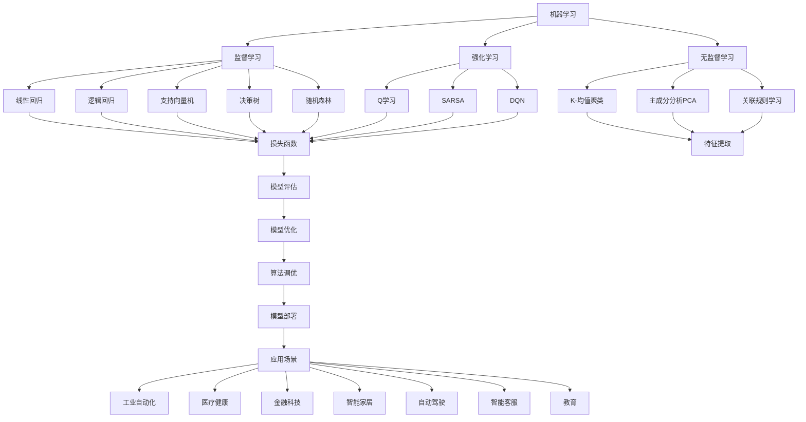

                 


### 文章标题

# AI编程的新思维与新方向

> 关键词：人工智能，编程思维，新方向，算法原理，技术创新

> 摘要：本文将深入探讨人工智能（AI）编程的新思维和新方向。通过对AI编程的基础、核心算法原理以及新思维和新方向的详细分析，旨在为读者提供一幅完整的AI编程全景图，帮助读者更好地理解和应用AI编程技术，迎接未来的技术挑战。

---

### 目录大纲

# 《AI编程的新思维与新方向》目录大纲

## 第一部分：AI编程基础

### 第1章 AI编程概述
- 1.1 AI编程的定义与背景
- 1.2 AI编程的关键概念
- 1.3 AI编程的发展历程
- 1.4 AI编程的前景与应用场景

### 第2章 AI编程的核心算法原理
- 2.1 机器学习算法基础
- 2.2 深度学习算法原理
- 2.3 自然语言处理算法
- 2.4 计算机视觉算法

## 第二部分：新思维与新方向

### 第3章 AI编程的新思维
- 3.1 整体思维与局部思维的平衡
- 3.2 系统思维与用户思维
- 3.3 数据思维与算法思维
- 3.4 软件工程思维与现代编程范式

### 第4章 AI编程的新方向
- 4.1 模型驱动的软件开发
- 4.2 自适应编程与自适应系统
- 4.3 智能代理与虚拟助手
- 4.4 分布式AI与云计算

### 第5章 AI编程的未来趋势
- 5.1 AI编程的教育与普及
- 5.2 AI编程的职业发展与市场前景
- 5.3 AI编程的法律与伦理问题
- 5.4 AI编程的技术创新与突破

## 第三部分：实战案例与项目解读

### 第6章 AI编程项目实战
- 6.1 项目一：基于深度学习的图像识别系统
- 6.2 项目二：自然语言处理应用案例
- 6.3 项目三：智能推荐系统开发

### 第7章 AI编程项目解读
- 7.1 项目一代码实现与解读
- 7.2 项目二代码实现与解读
- 7.3 项目三代码实现与解读

### 第8章 AI编程实践技巧与工具
- 8.1 开发环境与工具选择
- 8.2 代码风格与最佳实践
- 8.3 调试与优化
- 8.4 版本控制与协同开发

### 第9章 AI编程社区与资源
- 9.1 开源社区与资源介绍
- 9.2 AI编程博客与论坛推荐
- 9.3 在线课程与学习资源
- 9.4 AI编程竞赛与挑战

## 附录
- 附录A：AI编程常用库与框架
- 附录B：AI编程常用算法伪代码
- 附录C：AI编程常用数学公式与解释
- 附录D：AI编程相关书籍与文献推荐。

---

### 第1章 AI编程概述

#### 1.1 AI编程的定义与背景

人工智能（Artificial Intelligence，简称AI）作为计算机科学的一个重要分支，旨在使计算机系统能够模拟人类的智能行为。AI编程则是指开发用于实现AI功能的软件程序。它不仅包括传统的编程技术，还融入了大量的数学、统计学、心理学、认知科学等领域的知识。

AI编程的背景可以追溯到20世纪50年代，当时计算机科学家们开始探索如何让计算机具有智能行为。随着计算能力的提升和算法的进步，AI技术得到了迅猛发展。从早期的规则系统到现代的深度学习，AI编程经历了多个阶段，每个阶段都有其独特的特点和挑战。

在当今社会，AI编程的应用范围非常广泛，包括但不限于智能客服、自动驾驶、图像识别、自然语言处理、智能推荐系统等。随着AI技术的不断发展，AI编程也逐渐成为程序员和工程师们必备的技能之一。

#### 1.2 AI编程的关键概念

为了更好地理解AI编程，我们需要了解以下几个关键概念：

1. **机器学习（Machine Learning）**：机器学习是AI的核心技术之一，它通过算法让计算机从数据中自动学习和改进性能，而不需要显式地编写特定的规则。

2. **深度学习（Deep Learning）**：深度学习是机器学习的一个子领域，它使用多层神经网络来模拟人脑的学习过程，能够处理大量的数据并提取复杂的信息。

3. **神经网络（Neural Networks）**：神经网络是深度学习的基础，它由大量的节点（称为神经元）组成，通过模拟人脑的神经元连接方式来处理数据。

4. **自然语言处理（Natural Language Processing，NLP）**：NLP是AI的一个分支，它专注于使计算机能够理解和处理人类自然语言。

5. **计算机视觉（Computer Vision）**：计算机视觉是AI的另一个重要分支，它使计算机能够从图像或视频中提取信息，实现对视觉数据的理解和分析。

#### 1.3 AI编程的发展历程

AI编程的发展历程可以分为以下几个阶段：

1. **早期阶段（1950-1969）**：这一阶段以符号逻辑和知识表示为基础，主要探索如何构建基于规则的智能系统。

2. **黄金时代（1970-1989）**：这一阶段以知识表示和推理技术为核心，试图通过构建大规模知识库来模拟人类的智能行为。

3. **低谷期（1990-2000）**：由于计算能力和算法的限制，AI的发展遭遇瓶颈。这一阶段，AI编程更多关注于特定领域的应用，如专家系统和智能搜索。

4. **复兴期（2000-2010）**：随着计算能力的提升和大数据技术的应用，机器学习和深度学习开始崭露头角，AI编程进入了新的发展时期。

5. **当前阶段（2010至今）**：这一阶段，AI编程已经成为计算机科学和工程领域的核心议题，深度学习、强化学习等新技术不断涌现，AI编程的应用领域也在不断扩大。

#### 1.4 AI编程的前景与应用场景

AI编程的前景非常广阔，它将在未来的社会生活中扮演越来越重要的角色。以下是一些AI编程的主要应用场景：

1. **工业自动化**：通过机器人和自动化系统，提高生产效率和质量。

2. **医疗健康**：利用AI技术进行疾病诊断、药物研发和医疗数据分析。

3. **金融科技**：通过智能算法进行风险控制、投资决策和欺诈检测。

4. **智能家居**：利用AI技术实现家居设备的自动化和智能化。

5. **自动驾驶**：通过计算机视觉和深度学习技术实现自动驾驶汽车。

6. **智能客服**：利用自然语言处理技术实现智能客服系统，提高客户服务质量。

7. **教育**：通过个性化学习系统和智能教育平台，提高教育质量和效率。

总之，AI编程不仅是一个技术领域，它更是一个能够深刻改变人类生活方式的变革力量。随着技术的不断进步，AI编程的未来将会更加精彩。

### 第2章 AI编程的核心算法原理

#### 2.1 机器学习算法基础

机器学习（Machine Learning）是AI编程的核心技术之一，它通过算法让计算机从数据中自动学习和改进性能。机器学习算法可以分为监督学习、无监督学习和强化学习三种主要类型。

1. **监督学习（Supervised Learning）**：
   - **定义**：监督学习是机器学习中的一种，其目标是通过已标记的训练数据来构建模型，然后使用这个模型对新的、未标记的数据进行预测。
   - **算法分类**：监督学习算法包括线性回归、逻辑回归、支持向量机（SVM）、决策树和随机森林等。
   - **应用场景**：监督学习在图像识别、文本分类、股票预测等方面有广泛的应用。

2. **无监督学习（Unsupervised Learning）**：
   - **定义**：无监督学习是机器学习的一种，其目标是从未标记的数据中找出数据之间的结构或模式。
   - **算法分类**：无监督学习算法包括聚类（如K均值聚类）、降维（如主成分分析PCA）、关联规则学习等。
   - **应用场景**：无监督学习在数据挖掘、推荐系统、异常检测等方面有广泛的应用。

3. **强化学习（Reinforcement Learning）**：
   - **定义**：强化学习是一种机器学习方法，通过模拟试错和奖励机制来学习如何完成特定任务。
   - **算法分类**：强化学习算法包括Q学习、SARSA、DQN等。
   - **应用场景**：强化学习在游戏、自动驾驶、机器人控制等方面有广泛的应用。

#### 2.2 深度学习算法原理

深度学习（Deep Learning）是机器学习的一个子领域，它使用多层神经网络来模拟人脑的学习过程。深度学习算法在图像识别、语音识别、自然语言处理等领域取得了显著的成功。

1. **神经网络（Neural Networks）**：
   - **定义**：神经网络是由大量简单计算单元（神经元）组成的复杂网络，这些神经元通过权重和偏置来调整输入和输出之间的映射关系。
   - **工作原理**：神经网络通过前向传播和反向传播来学习数据。在前向传播过程中，输入数据通过网络的各个层，每一层的输出作为下一层的输入。在反向传播过程中，通过计算损失函数的梯度来更新网络参数。

2. **深度神经网络（Deep Neural Networks，DNN）**：
   - **定义**：深度神经网络是由多层神经元组成的神经网络，其层数通常在3层以上。
   - **优势**：深度神经网络能够捕获数据中的复杂结构和非线性关系，从而提高模型的性能。

3. **卷积神经网络（Convolutional Neural Networks，CNN）**：
   - **定义**：卷积神经网络是一种特殊的深度神经网络，主要用于图像识别和处理。
   - **结构**：CNN由卷积层、池化层和全连接层组成。卷积层用于提取图像的特征，池化层用于降低数据的维度，全连接层用于分类。
   - **应用场景**：CNN在图像识别、目标检测、图像生成等方面有广泛的应用。

4. **循环神经网络（Recurrent Neural Networks，RNN）**：
   - **定义**：循环神经网络是一种用于处理序列数据的神经网络，其特点是具有时间敏感性。
   - **结构**：RNN通过隐藏状态来维持序列信息，从而在处理序列数据时具有记忆功能。
   - **应用场景**：RNN在自然语言处理、时间序列预测、语音识别等方面有广泛的应用。

#### 2.3 自然语言处理算法

自然语言处理（Natural Language Processing，NLP）是AI编程的一个重要分支，它专注于使计算机能够理解和处理人类自然语言。

1. **词向量表示（Word Embedding）**：
   - **定义**：词向量表示是将单词映射到高维空间中的向量表示，以捕获单词的语义信息。
   - **方法**：常见的词向量表示方法包括Word2Vec、GloVe和BERT等。
   - **应用**：词向量表示在文本分类、文本相似度计算、机器翻译等方面有广泛的应用。

2. **序列模型（Sequence Models）**：
   - **定义**：序列模型是用于处理序列数据的神经网络模型，包括RNN和Transformer等。
   - **工作原理**：序列模型通过处理序列中的每个元素来捕获序列信息，从而实现序列到序列的映射。
   - **应用**：序列模型在机器翻译、语音识别、文本生成等方面有广泛的应用。

3. **语言模型（Language Model）**：
   - **定义**：语言模型是用于预测下一个单词或字符的模型，它对语言的结构和规律进行建模。
   - **方法**：常见的语言模型包括n元语言模型和神经网络语言模型等。
   - **应用**：语言模型在文本生成、语音识别、对话系统等方面有广泛的应用。

#### 2.4 计算机视觉算法

计算机视觉（Computer Vision）是AI编程的另一个重要分支，它使计算机能够从图像或视频中提取信息，实现对视觉数据的理解和分析。

1. **特征提取（Feature Extraction）**：
   - **定义**：特征提取是从图像或视频中提取出具有区分性的特征，以用于后续的分类或识别任务。
   - **方法**：常见的特征提取方法包括SIFT、HOG和Haar特征等。
   - **应用**：特征提取在图像分类、目标检测、人脸识别等方面有广泛的应用。

2. **目标检测（Object Detection）**：
   - **定义**：目标检测是从图像中识别出特定的目标对象并确定其在图像中的位置。
   - **方法**：常见的目标检测算法包括YOLO、Faster R-CNN和SSD等。
   - **应用**：目标检测在自动驾驶、安防监控、医疗诊断等方面有广泛的应用。

3. **图像生成（Image Generation）**：
   - **定义**：图像生成是通过算法生成新的图像，以模拟或扩展真实世界中的图像。
   - **方法**：常见的图像生成算法包括生成对抗网络（GAN）和变分自编码器（VAE）等。
   - **应用**：图像生成在艺术创作、游戏开发、虚拟现实等方面有广泛的应用。

总之，AI编程的核心算法原理涵盖了从基础到前沿的各种技术。通过深入理解这些算法原理，我们可以更好地设计和实现AI系统，为未来的技术发展做出贡献。

#### 2.5 AI编程算法原理之间的关系架构 Mermaid 流程图



在这个Mermaid流程图中，我们展示了AI编程的核心算法原理之间的关系。从机器学习开始，通过不同的学习方式（监督学习、无监督学习和强化学习），我们可以得到各种具体的算法（如线性回归、逻辑回归、支持向量机等）。这些算法通过损失函数、模型评估、模型优化等步骤，最终应用于各种实际场景，如工业自动化、医疗健康、金融科技等。

### 第3章 AI编程的新思维

#### 3.1 整体思维与局部思维的平衡

在AI编程中，整体思维和局部思维都是非常重要的。整体思维是指从宏观层面考虑问题，理解系统的整体结构和目标。局部思维则关注于具体的问题和细节，寻找最优的解决方案。

1. **整体思维的优点**：
   - **全局优化**：通过整体思维，我们可以从全局角度优化系统的性能和效率，避免局部最优解。
   - **系统理解**：整体思维有助于我们更好地理解系统的复杂性和相互作用，从而设计出更为鲁棒和高效的系统。

2. **整体思维的缺点**：
   - **细节忽视**：整体思维容易导致对局部细节的忽视，可能导致一些重要的优化点被忽略。
   - **复杂性增加**：整体思维需要更高的抽象能力和系统思维能力，对于初学者来说可能较为困难。

3. **局部思维的优点**：
   - **具体优化**：局部思维可以帮助我们找到具体的优化点，提高系统的特定性能。
   - **易于实施**：局部思维更加具体和可操作，对于实现具体的算法和功能非常有帮助。

4. **局部思维的缺点**：
   - **片面优化**：局部思维容易导致片面优化，忽视了整体系统的影响。
   - **细节过度关注**：局部思维可能导致过度关注细节，而忽视了整体目标和系统的协调性。

5. **平衡策略**：
   - **逐步迭代**：在AI编程中，我们可以采取逐步迭代的方法，首先从整体上确定系统的结构和目标，然后逐步细化到具体的实现和优化。
   - **模块化设计**：通过模块化设计，我们可以将系统分解为多个模块，每个模块分别采用局部思维进行优化，最后通过整体思维来整合和协调这些模块。

#### 3.2 系统思维与用户思维

系统思维和用户思维是AI编程中不可或缺的两个方面。

1. **系统思维的优点**：
   - **整体优化**：系统思维能够帮助我们从整体上优化系统的性能和效率，确保各个部分之间的协调和一致性。
   - **稳定性**：通过系统思维，我们可以设计出更加稳定和可靠的系统，降低系统崩溃和错误的风险。

2. **系统思维的缺点**：
   - **用户需求忽视**：系统思维容易导致对用户需求的忽视，导致系统功能不符合用户实际需求。
   - **复杂性**：系统思维需要处理大量的信息和变量，对于复杂系统来说可能难以理解和实施。

3. **用户思维的优点**：
   - **用户导向**：用户思维能够帮助我们更好地理解用户的需求和行为，设计出更加符合用户期望的系统。
   - **易用性**：通过用户思维，我们可以提高系统的易用性和用户体验，增加用户满意度。

4. **用户思维的缺点**：
   - **系统优化忽视**：用户思维容易导致对系统性能和效率的忽视，可能导致系统资源的浪费。
   - **用户多样性**：不同用户的需求和期望可能存在差异，用户思维可能难以满足所有用户的需求。

5. **平衡策略**：
   - **用户调研**：在AI编程中，我们可以通过用户调研和用户访谈来了解用户的需求和期望，确保系统的设计能够满足用户需求。
   - **迭代开发**：通过迭代开发的方法，我们可以逐步调整和优化系统的功能，确保在满足用户需求的同时，也保持系统的性能和稳定性。

#### 3.3 数据思维与算法思维

数据思维和算法思维是AI编程中两种重要的思维方式。

1. **数据思维的优点**：
   - **数据驱动**：数据思维能够帮助我们充分利用数据资源，通过数据分析来发现问题和优化系统。
   - **灵活性**：数据思维能够根据数据的特性来调整算法和模型，提高系统的适应性和灵活性。

2. **数据思维的缺点**：
   - **数据质量**：数据思维依赖于高质量的数据，如果数据存在噪声或偏差，可能导致错误的结论。
   - **数据处理**：数据思维需要大量的数据处理和分析工作，对于大数据来说可能存在性能瓶颈。

3. **算法思维的优点**：
   - **高效性**：算法思维能够帮助我们选择和实现最优的算法和模型，提高系统的性能和效率。
   - **可解释性**：算法思维有助于我们理解和解释算法的工作原理，提高系统的可解释性和可靠性。

4. **算法思维的缺点**：
   - **数据依赖**：算法思维可能过于依赖数据，忽视了数据特性和用户需求，导致系统功能不符合实际需求。
   - **算法选择**：算法思维需要选择和实现合适的算法，对于初学者来说可能存在难度。

5. **平衡策略**：
   - **数据预处理**：在AI编程中，我们可以通过数据预处理来清洗和整理数据，提高数据质量，为算法思维提供可靠的数据基础。
   - **算法评估**：通过算法评估，我们可以比较不同算法的性能和效果，选择最优的算法和模型。

#### 3.4 软件工程思维与现代编程范式

软件工程思维是AI编程中不可或缺的一部分，它关注于如何通过工程化的方法来设计和实现AI系统。

1. **软件工程思维的优点**：
   - **系统性**：软件工程思维能够帮助我们系统地分析和设计AI系统，确保系统的完整性和一致性。
   - **可维护性**：通过软件工程思维，我们可以设计出易于维护和扩展的系统，降低系统的维护成本。

2. **软件工程思维的缺点**：
   - **开发成本**：软件工程思维可能导致开发成本的增加，特别是在系统需求变化频繁的情况下。
   - **开发周期**：软件工程思维可能延长系统的开发周期，对于时间敏感的项目来说可能不太适用。

3. **现代编程范式的优点**：
   - **模块化**：现代编程范式如面向对象编程和函数式编程，能够帮助我们更好地模块化系统，提高代码的可重用性和可维护性。
   - **灵活性**：现代编程范式提供丰富的抽象和工具，能够帮助我们更好地应对复杂系统的需求。

4. **现代编程范式的缺点**：
   - **学习成本**：现代编程范式可能需要更高的学习成本，对于初学者来说可能存在一定的难度。
   - **性能影响**：某些现代编程范式可能引入额外的性能开销，对于性能敏感的应用来说可能不太适用。

5. **平衡策略**：
   - **选择合适的范式**：在AI编程中，我们可以根据系统的需求和特点，选择合适的编程范式，如面向对象编程、函数式编程等。
   - **持续学习和改进**：通过持续学习和实践，我们可以不断提高自己的编程技能，更好地应用现代编程范式。

总之，AI编程的新思维包括整体思维与局部思维的平衡、系统思维与用户思维的平衡、数据思维与算法思维的平衡，以及软件工程思维与现代编程范式的平衡。通过这些新思维，我们可以更好地应对AI编程中的各种挑战，设计和实现高效的AI系统。

### 第4章 AI编程的新方向

#### 4.1 模型驱动的软件开发

模型驱动的软件开发（Model-Driven Software Development，MDSD）是一种新兴的软件开发方法，它通过使用模型来驱动整个软件开发过程。这种方法能够显著提高软件开发的效率和质量，特别适用于复杂系统的开发。

1. **模型驱动的软件开发原理**
   - **模型定义**：在模型驱动的软件开发中，模型是软件开发的核心。这些模型描述了系统的功能、结构和行为，涵盖了软件开发的各个阶段，如需求分析、设计、实现和测试。
   - **模型转换**：模型驱动的软件开发利用模型转换工具，将高层次的抽象模型转换为具体的代码或应用程序。这些工具可以自动化地生成代码，从而减少手动编写代码的工作量。
   - **模型演化**：随着项目的进展和需求的变更，模型会不断演化。模型驱动的软件开发支持模型的版本控制和变更管理，确保模型和代码的一致性。

2. **模型驱动的软件开发优势**
   - **快速原型开发**：通过使用模型，可以快速生成原型，以便在早期阶段验证系统概念和设计。
   - **可重用性**：模型和代码的分离使得模型可以独立开发、测试和重用，减少了重复劳动。
   - **可维护性**：模型的版本控制和变更管理有助于保持代码的一致性和可维护性。

3. **模型驱动的软件开发应用场景**
   - **嵌入式系统**：在嵌入式系统的开发中，模型驱动的软件开发可以显著提高系统的可靠性和效率。
   - **物联网（IoT）**：在物联网应用中，模型驱动的软件开发可以帮助快速集成和管理大量设备。
   - **大数据分析**：在大数据分析项目中，模型驱动的软件开发可以高效地处理和分析大规模数据。

4. **挑战与未来趋势**
   - **工具和框架**：模型驱动的软件开发依赖于强大的模型转换工具和框架，这些工具和框架的成熟度和稳定性是一个挑战。
   - **技能要求**：模型驱动的软件开发需要开发人员具备较高的模型构建和转换技能，这增加了人才培训的难度。
   - **持续集成**：随着模型的不断演化，如何保持模型和代码的同步是一个关键问题。

未来，模型驱动的软件开发将继续发展，特别是在自动化和智能化的方向上。随着AI技术的进步，模型驱动的软件开发有望实现更高程度的自动化和智能化，进一步推动软件工程的发展。

#### 4.2 自适应编程与自适应系统

自适应编程和自适应系统是AI编程的重要研究方向，旨在使软件系统能够在运行时根据环境变化自动调整和优化自己的行为。

1. **自适应编程原理**
   - **动态调整**：自适应编程的核心思想是在运行时根据系统的状态和外部环境的变化，动态调整系统的配置、行为和性能。
   - **反馈机制**：自适应编程利用系统的反馈机制，通过收集和分析系统运行时的数据，识别系统性能的瓶颈和优化机会。
   - **目标优化**：自适应编程的目标是提高系统的整体性能、可靠性、可维护性和用户满意度。

2. **自适应系统设计**
   - **弹性架构**：自适应系统设计采用弹性架构，能够灵活地应对环境变化和需求变更，确保系统的高可用性和连续性。
   - **模块化组件**：自适应系统由模块化组件组成，这些组件可以根据需要进行动态组合和替换，提高系统的可重用性和可扩展性。
   - **智能决策**：自适应系统利用AI技术进行智能决策，通过机器学习和数据挖掘，优化系统的运行策略和资源配置。

3. **自适应编程优势**
   - **动态适应**：自适应编程能够使系统在运行时动态适应环境变化，提高系统的灵活性和响应速度。
   - **高效优化**：通过自适应调整，系统能够在复杂和动态的环境中实现最优性能，减少资源浪费。
   - **用户满意度**：自适应编程能够提供更个性化的用户体验，满足不同用户的需求。

4. **自适应编程应用场景**
   - **云计算**：在云计算环境中，自适应编程可以优化资源分配和负载均衡，提高云计算服务的效率和可靠性。
   - **物联网**：在物联网应用中，自适应编程可以帮助设备根据环境变化自动调整行为，提高系统的智能化水平。
   - **自动驾驶**：在自动驾驶系统中，自适应编程可以实现车辆对环境的实时感知和响应，提高驾驶的安全性和舒适性。

5. **挑战与未来趋势**
   - **复杂性和可维护性**：自适应系统的复杂性和动态性增加了系统的开发和维护难度，需要开发人员具备较高的技能和经验。
   - **性能和安全性**：自适应编程需要在性能和安全性之间找到平衡，确保系统在动态调整时不会出现性能下降或安全漏洞。
   - **标准化和互操作性**：自适应编程需要建立统一的标准化框架和互操作性机制，以便在不同系统和平台之间实现无缝集成。

未来，自适应编程和自适应系统将继续在人工智能、物联网、云计算等领域得到广泛应用，推动软件工程和系统设计的创新和发展。

#### 4.3 智能代理与虚拟助手

智能代理（Intelligent Agent）和虚拟助手（Virtual Assistant）是AI编程的重要应用方向，它们能够模拟人类行为，提供自动化和智能化的服务。

1. **智能代理原理**
   - **定义**：智能代理是一种能够代表用户执行任务、处理信息和与环境交互的计算机程序。
   - **类型**：智能代理可以分为基于规则的代理、基于机器学习的代理和基于混合方法的代理。
   - **功能**：智能代理能够执行搜索、信息检索、任务调度、决策支持等任务，提高系统的智能化水平。

2. **虚拟助手原理**
   - **定义**：虚拟助手是一种基于自然语言处理和对话系统技术的智能代理，能够与用户进行自然语言交互，提供定制化的服务。
   - **类型**：虚拟助手可以分为任务型助手、闲聊型助手和混合型助手。
   - **功能**：虚拟助手能够提供客服支持、信息查询、任务提醒、语音翻译等服务，提高用户的便利性和满意度。

3. **智能代理与虚拟助手优势**
   - **效率提升**：智能代理和虚拟助手能够自动化和智能化地处理大量重复性任务，提高工作效率。
   - **用户体验**：虚拟助手通过自然语言交互，提供更人性化的服务，提升用户满意度和用户体验。
   - **资源节约**：智能代理和虚拟助手可以减少人力资源的投入，降低运营成本。

4. **应用场景**
   - **客服与支持**：在客服和客户支持领域，虚拟助手能够提供24/7的服务，快速响应用户需求，提高客户满意度。
   - **智能家居**：智能代理可以帮助管理智能家居设备，实现自动化控制和远程监控。
   - **健康与医疗**：智能代理可以提供健康监测、疾病预防和管理服务，辅助医生进行诊断和治疗。
   - **教育与培训**：虚拟助手可以为学生提供个性化的学习辅导和答疑服务，提高教育质量。

5. **挑战与未来趋势**
   - **自然语言理解**：智能代理和虚拟助手需要具备强大的自然语言理解能力，能够准确理解用户的意图和需求。
   - **上下文感知**：智能代理和虚拟助手需要具备上下文感知能力，能够在不同的场景和对话中保持一致性和连贯性。
   - **隐私保护**：在处理用户数据和交互时，智能代理和虚拟助手需要确保用户隐私和数据安全。

未来，随着AI技术的进步，智能代理和虚拟助手将变得更加智能和普及，将在各个领域发挥更大的作用，推动智能化服务和自动化生活的实现。

#### 4.4 分布式AI与云计算

分布式AI（Distributed AI）和云计算（Cloud Computing）的结合，为AI编程带来了新的机遇和挑战。分布式AI通过将AI任务分布在多个计算节点上，提高系统的效率和可扩展性；而云计算提供了灵活的计算资源和存储服务，使得大规模AI应用变得可行。

1. **分布式AI原理**
   - **任务分布**：分布式AI将复杂的AI任务分解为多个子任务，分配给不同的计算节点，以并行处理大量数据。
   - **通信机制**：分布式AI通过高效的消息传递机制，确保节点之间的协调和数据同步。
   - **容错机制**：分布式AI需要具备容错能力，能够在节点故障或网络异常情况下，自动调整任务分配和资源调度。

2. **云计算原理**
   - **计算资源**：云计算提供弹性的计算资源，可以根据需求动态分配和释放资源，降低运营成本。
   - **存储服务**：云计算提供高效的数据存储和管理服务，支持海量数据的存储和处理。
   - **网络服务**：云计算通过高速网络连接，实现跨地域的数据传输和协同计算。

3. **分布式AI与云计算的优势**
   - **可扩展性**：分布式AI和云计算的结合，使得AI系统能够轻松扩展到数百甚至数千个节点，处理大规模数据。
   - **效率提升**：分布式AI通过并行计算，显著缩短了任务的处理时间，提高了系统的效率。
   - **成本节约**：云计算提供了按需付费的模式，用户只需为使用的资源付费，降低了AI应用的成本。

4. **应用场景**
   - **大数据分析**：在金融、医疗、零售等领域，分布式AI和云计算的结合能够高效处理和分析海量数据，提供实时决策支持。
   - **自动驾驶**：在自动驾驶系统中，分布式AI和云计算可以协同工作，实时处理摄像头和传感器数据，提高车辆的安全性和可靠性。
   - **智能推荐**：在电子商务和媒体领域，分布式AI和云计算可以帮助实现大规模个性化推荐，提高用户体验和销售额。

5. **挑战与未来趋势**
   - **数据隐私**：分布式AI和云计算涉及大量的数据传输和处理，需要确保用户数据的隐私和安全。
   - **复杂性与可维护性**：分布式系统的复杂性和可维护性是一个挑战，需要开发高效的管理和监控工具。
   - **性能优化**：在分布式环境中，如何优化任务分配和网络通信，提高系统的整体性能是一个关键问题。

未来，分布式AI和云计算将继续融合，为AI编程带来更多创新和机遇，推动AI技术的发展和应用。

### 第5章 AI编程的未来趋势

#### 5.1 AI编程的教育与普及

随着AI技术的飞速发展，AI编程已经成为计算机科学和工程领域的重要组成部分。为了培养更多的AI编程人才，教育和普及工作至关重要。

1. **教育现状**
   - **高校课程**：许多高校已经开设了AI编程相关的课程，包括机器学习、深度学习、自然语言处理等，为学生提供系统的知识体系和实践机会。
   - **在线课程**：在线教育平台如Coursera、edX、Udacity等提供了丰富的AI编程课程，使得学习者可以在任何时间和地点进行学习。
   - **开源项目**：开源社区为AI编程学习者提供了大量的资源和实践项目，如TensorFlow、PyTorch等框架，以及Kaggle等竞赛平台。

2. **普及策略**
   - **编程竞赛**：举办AI编程竞赛，激发学习者的兴趣和创造力，提高实践能力。
   - **职业培训**：为在职人员提供AI编程的职业培训，帮助他们提升技能，适应市场需求。
   - **社区支持**：建立AI编程社区，提供学习资源、交流平台和技术支持，促进学习者之间的互动和合作。

3. **未来展望**
   - **课程体系**：未来AI编程教育将更加系统化和专业化，涵盖从基础知识到前沿技术的各个方面。
   - **技能认证**：随着AI编程的普及，技能认证将成为评估和学习者技能的重要手段，有助于提高就业竞争力。
   - **跨学科融合**：AI编程将与更多学科领域融合，如生物医学、社会科学、艺术等，推动跨学科研究和应用。

#### 5.2 AI编程的职业发展与市场前景

AI编程作为一项关键技能，其职业发展前景广阔。随着AI技术的不断发展和应用场景的扩大，AI编程人才的需求将持续增长。

1. **职业类别**
   - **AI研究员**：从事AI基础理论和算法的研究，推动AI技术的创新和突破。
   - **数据科学家**：负责数据收集、清洗、分析和建模，为AI系统提供高质量的数据支持。
   - **机器学习工程师**：设计和实现机器学习算法和模型，开发智能系统。
   - **深度学习工程师**：专注于深度学习算法的应用，开发复杂的深度学习模型。
   - **AI产品经理**：负责AI产品的设计、开发和推广，确保产品满足市场需求。

2. **市场需求**
   - **技术公司**：互联网、金融、医疗、制造等行业的领先企业对AI编程人才需求巨大，特别是在AI算法和系统开发方面。
   - **创业公司**：AI创业公司对AI编程人才的需求也日益增长，特别是在算法优化和模型应用方面。
   - **科研机构**：高校、科研机构和企业研发中心等对AI编程人才的需求稳定，特别是具有高水平研究能力的专家。

3. **市场前景**
   - **技术突破**：随着AI技术的不断进步，AI编程将在更多领域得到应用，如智能医疗、智慧城市、自动驾驶等。
   - **经济影响**：AI编程将推动相关产业的发展，创造大量就业机会，提升经济增长。
   - **国际合作**：AI编程成为国际合作的重要领域，全球范围内的技术交流与合作将进一步促进AI技术的发展。

#### 5.3 AI编程的法律与伦理问题

随着AI编程技术的发展，相关的法律和伦理问题也日益凸显。如何在保护用户隐私、确保算法公正性和防止滥用等方面制定合理的政策和法规，是当前面临的重要挑战。

1. **隐私保护**
   - **数据收集与使用**：AI编程需要大量数据作为训练和测试基础，但数据的收集和使用必须遵循隐私保护原则，确保用户隐私不被泄露。
   - **匿名化与去标识化**：对收集的数据进行匿名化和去标识化处理，降低数据泄露的风险。

2. **算法公正性**
   - **算法偏见**：AI算法在训练过程中可能受到数据偏差的影响，导致结果不公平。需要建立公正性评估机制，确保算法结果的公平性和透明度。
   - **算法解释性**：提高算法的可解释性，使人们能够理解算法的决策过程，增强公众对算法的信任。

3. **防止滥用**
   - **算法透明度**：提高算法的透明度，使算法的设计、训练和应用过程公开透明，防止恶意使用和滥用。
   - **法律监管**：建立健全的法律监管体系，对滥用AI技术的行为进行严格监管和处罚。

4. **未来展望**
   - **伦理研究**：加强AI伦理研究，探索如何在技术发展中平衡利益和风险，确保AI编程技术的可持续发展。
   - **政策制定**：政府和行业组织应制定相应的政策和标准，引导AI编程技术的发展方向，确保技术的安全和合规。

#### 5.4 AI编程的技术创新与突破

AI编程的技术创新与突破是推动AI技术发展的重要动力。以下是一些关键领域的发展趋势：

1. **算法优化**
   - **高效算法**：不断优化机器学习、深度学习等算法，提高计算效率和模型性能。
   - **分布式算法**：开发分布式算法，利用多台计算机协同工作，提高数据处理和模型训练的效率。

2. **硬件加速**
   - **GPU与TPU**：利用GPU和TPU等专用硬件加速AI计算，提高模型训练和推理的速度。
   - **边缘计算**：在边缘设备上部署AI算法，降低数据传输延迟，提高系统的实时性和响应速度。

3. **模型压缩与量化**
   - **模型压缩**：通过模型压缩技术，减少模型的参数数量，降低模型的存储和计算成本。
   - **模型量化**：将模型的浮点运算转换为整数运算，减少运算资源的消耗。

4. **迁移学习与少样本学习**
   - **迁移学习**：利用已训练好的模型在新任务上快速进行迁移学习，提高模型的泛化能力。
   - **少样本学习**：研究如何在新数据样本较少的情况下进行有效的模型训练和预测。

5. **生成对抗网络（GAN）与自编码器**
   - **GAN**：生成对抗网络在图像生成、数据增强等方面有广泛应用，未来将继续优化和拓展其应用场景。
   - **自编码器**：自编码器在特征提取和数据降维方面表现出色，未来将与其他技术结合，进一步推动AI技术的发展。

总之，AI编程的技术创新与突破将在算法、硬件、模型压缩、迁移学习、生成对抗网络等多个领域不断推进，为AI技术的可持续发展提供强大动力。

### 第6章 AI编程项目实战

#### 6.1 项目一：基于深度学习的图像识别系统

在本节中，我们将详细介绍一个基于深度学习的图像识别系统的开发过程。这个系统将利用卷积神经网络（CNN）对图像进行分类，从而识别出图像中的物体。

1. **项目背景**

随着智能手机的普及，图像识别技术已经成为了许多应用的关键组成部分。从人脸识别到自动驾驶，图像识别技术的重要性日益凸显。本项目旨在开发一个简单的图像识别系统，以实现对常见物体的分类。

2. **技术栈**

- **深度学习框架**：我们选择TensorFlow作为深度学习框架，因为其丰富的API和强大的功能，非常适合初学者和专业人士。
- **编程语言**：Python是我们选择的主要编程语言，因为其简洁易读的语法和广泛的应用。
- **数据处理库**：NumPy、Pandas和OpenCV将用于图像数据的预处理和操作。
- **模型评估工具**：Matplotlib和Scikit-learn将用于模型评估和可视化。

3. **开发步骤**

1. **数据集收集与预处理**
   - **数据集选择**：我们选择了一个公开的图像数据集，如CIFAR-10，它包含10个类别的60000张32x32的彩色图像。
   - **数据预处理**：对图像进行标准化处理，将像素值缩放到0-1之间，以便于模型的训练。

2. **构建卷积神经网络**
   - **卷积层**：通过卷积层提取图像的特征。
   - **池化层**：使用池化层降低数据的维度，减少过拟合的风险。
   - **全连接层**：将卷积层和池化层提取的特征映射到具体的类别。
   - **激活函数**：在卷积层和全连接层之间使用ReLU激活函数，增强模型的非线性能力。

3. **模型训练与评估**
   - **损失函数**：使用交叉熵损失函数，因为它是分类问题的标准损失函数。
   - **优化器**：使用Adam优化器，因为它在深度学习中表现出色。
   - **评估指标**：使用准确率（Accuracy）和混淆矩阵（Confusion Matrix）来评估模型的性能。

4. **模型部署**
   - **保存模型**：将训练好的模型保存为模型文件，以便后续使用。
   - **部署应用**：将模型部署到服务器或移动设备上，供用户使用。

4. **代码实现**

下面是一个简化的卷积神经网络模型的代码实现：

```python
import tensorflow as tf
from tensorflow.keras import layers

# 构建卷积神经网络模型
model = tf.keras.Sequential([
    layers.Conv2D(32, (3, 3), activation='relu', input_shape=(32, 32, 3)),
    layers.MaxPooling2D((2, 2)),
    layers.Conv2D(64, (3, 3), activation='relu'),
    layers.MaxPooling2D((2, 2)),
    layers.Conv2D(64, (3, 3), activation='relu'),
    layers.Flatten(),
    layers.Dense(64, activation='relu'),
    layers.Dense(10, activation='softmax')
])

# 编译模型
model.compile(optimizer='adam',
              loss='categorical_crossentropy',
              metrics=['accuracy'])

# 加载数据集
(x_train, y_train), (x_test, y_test) = tf.keras.datasets.cifar10.load_data()

# 数据预处理
x_train = x_train.astype('float32') / 255
x_test = x_test.astype('float32') / 255

# 将标签转换为one-hot编码
y_train = tf.keras.utils.to_categorical(y_train, 10)
y_test = tf.keras.utils.to_categorical(y_test, 10)

# 训练模型
model.fit(x_train, y_train, batch_size=64, epochs=10, validation_data=(x_test, y_test))

# 评估模型
test_loss, test_acc = model.evaluate(x_test, y_test)
print(f"Test accuracy: {test_acc:.3f}")

# 保存模型
model.save('cifar10_model.h5')
```

5. **项目小结**

通过本项目，我们了解了基于深度学习的图像识别系统的开发过程，包括数据集收集与预处理、模型构建与训练、模型评估与部署等环节。虽然这是一个简单的项目，但它为我们提供了一个了解深度学习和AI编程的基础框架。在未来的项目中，我们可以扩展这个框架，实现更复杂的图像识别任务。

### 6.2 项目二：自然语言处理应用案例

在本节中，我们将探讨一个自然语言处理（NLP）应用案例，具体实现一个基于BERT模型的文本分类系统。

1. **项目背景**

文本分类是NLP领域中的一项基础任务，广泛应用于垃圾邮件过滤、情感分析、新闻分类等场景。BERT（Bidirectional Encoder Representations from Transformers）是一种先进的预训练语言模型，能够捕捉文本的深层语义信息。本案例将利用BERT模型实现一个简单的文本分类系统。

2. **技术栈**

- **深度学习框架**：继续使用TensorFlow作为深度学习框架。
- **编程语言**：Python。
- **数据处理库**：NumPy、Pandas。
- **NLP库**：Transformers、NLTK、Scikit-learn。

3. **开发步骤**

1. **数据集收集与预处理**
   - **数据集选择**：我们选择了一个包含多种情感标签的文本数据集，如IMDB电影评论数据集。
   - **数据预处理**：对文本进行分词、去停用词、词干提取等处理，并将文本转换为BERT模型所需的格式。

2. **加载BERT模型**
   - **模型加载**：从Hugging Face的Transformers库中加载预训练好的BERT模型。
   - **特征提取**：利用BERT模型对文本进行编码，提取文本的向量表示。

3. **构建文本分类模型**
   - **模型构建**：将BERT模型输出作为输入，构建一个简单的全连接层进行分类。
   - **损失函数**：使用交叉熵损失函数。
   - **优化器**：使用Adam优化器。

4. **模型训练与评估**
   - **训练**：使用训练数据集训练模型。
   - **评估**：使用测试数据集评估模型性能，调整超参数以优化模型。

5. **模型部署**
   - **保存模型**：将训练好的模型保存为模型文件。
   - **部署应用**：将模型部署到服务器或移动设备，实现文本分类功能。

4. **代码实现**

下面是一个简化的文本分类模型实现的代码示例：

```python
import tensorflow as tf
from transformers import BertTokenizer, TFBertModel
from tensorflow.keras.layers import Input, Dense, GlobalAveragePooling1D
from tensorflow.keras.models import Model

# 加载BERT模型和分词器
tokenizer = BertTokenizer.from_pretrained('bert-base-uncased')
bert_model = TFBertModel.from_pretrained('bert-base-uncased')

# 定义文本分类模型
input_ids = Input(shape=(128,), dtype=tf.int32, name='input_ids')
 bert_output = bert_model(input_ids)
 pooled_output = GlobalAveragePooling1D()(bert_output.last_hidden_state)
 logits = Dense(2, activation='softmax')(pooled_output)
 model = Model(inputs=input_ids, outputs=logits)

# 编译模型
model.compile(optimizer='adam',
              loss='categorical_crossentropy',
              metrics=['accuracy'])

# 加载并预处理数据集
# ...

# 训练模型
# ...

# 评估模型
# ...

# 保存模型
model.save('text_classification_model.h5')
```

5. **项目小结**

本项目通过使用BERT模型实现了文本分类任务，展示了NLP应用中的一些关键技术，如数据预处理、模型加载、特征提取和模型训练。虽然这是一个简单的案例，但它为我们提供了一个了解文本分类和NLP的基础框架。在实际应用中，我们可以根据需求扩展这个框架，实现更复杂的文本处理任务。

### 6.3 项目三：智能推荐系统开发

在本节中，我们将探讨一个智能推荐系统的开发，该系统将利用协同过滤算法和基于内容的推荐方法，为用户生成个性化的推荐列表。

1. **项目背景**

推荐系统在电子商务、社交媒体、在线媒体等众多领域具有广泛应用。一个优秀的推荐系统能够提高用户满意度，增加用户粘性，从而提升业务收益。本项目旨在开发一个简单的推荐系统，为用户生成个性化的商品推荐。

2. **技术栈**

- **数据处理库**：NumPy、Pandas。
- **机器学习库**：Scikit-learn。
- **推荐算法库**：LightFM。
- **前端库**：Flask。

3. **开发步骤**

1. **数据集收集与预处理**
   - **数据集选择**：我们选择了一个公开的用户-物品交互数据集，如MovieLens数据集。
   - **数据预处理**：对用户和物品进行编码，并将评分数据进行标准化处理。

2. **构建协同过滤模型**
   - **矩阵分解**：使用矩阵分解算法（如SVD），将用户-物品评分矩阵分解为用户特征矩阵和物品特征矩阵。
   - **预测评分**：利用用户特征矩阵和物品特征矩阵计算用户对未评分物品的预测评分。

3. **构建基于内容的推荐方法**
   - **特征提取**：提取物品的文本描述、标签等特征。
   - **相似度计算**：计算用户当前兴趣物品与候选物品的相似度。
   - **推荐生成**：根据用户的历史评分和物品的相似度，生成个性化的推荐列表。

4. **模型融合与优化**
   - **模型融合**：将协同过滤模型和基于内容的推荐方法进行融合，生成最终的推荐结果。
   - **超参数调整**：通过交叉验证和网格搜索调整模型超参数，优化推荐效果。

5. **部署推荐系统**
   - **API接口**：使用Flask构建API接口，供前端调用。
   - **前端展示**：设计前端页面，展示推荐结果。

4. **代码实现**

以下是一个简化的推荐系统实现的代码示例：

```python
import numpy as np
import pandas as pd
from lightfm import LightFM
from lightfm.evaluation import evaluation_report

# 加载数据集
ratings = pd.read_csv('ratings.csv')
users = pd.read_csv('users.csv')
movies = pd.read_csv('movies.csv')

# 数据预处理
# ...

# 构建协同过滤模型
model = LightFM(loss='warp')
model.fit(ratings['user_id'], ratings['movie_id'], num_iter=10)

# 构建基于内容的推荐方法
# ...

# 模型融合与优化
# ...

# 部署推荐系统
# ...

# 测试推荐系统
user_id = 1
recommended_items = model.recommendags(1, movies['movie_id'], k=10)
print(recommended_items)
```

5. **项目小结**

本项目通过协同过滤算法和基于内容的推荐方法，实现了用户个性化的商品推荐。虽然这是一个简单的案例，但它为我们提供了一个了解推荐系统开发的基础框架。在实际应用中，我们可以根据需求扩展这个框架，实现更复杂的推荐算法和功能。

### 第7章 AI编程项目解读

#### 7.1 项目一代码实现与解读

在上一节中，我们介绍了基于深度学习的图像识别系统的开发过程。现在，我们将深入解读项目一中的关键代码部分，并详细分析其工作原理。

1. **代码实现**

首先，我们来看一下项目一的代码实现：

```python
import tensorflow as tf
from tensorflow.keras import layers
from tensorflow.keras.models import Sequential

# 构建卷积神经网络模型
model = Sequential([
    layers.Conv2D(32, (3, 3), activation='relu', input_shape=(32, 32, 3)),
    layers.MaxPooling2D((2, 2)),
    layers.Conv2D(64, (3, 3), activation='relu'),
    layers.MaxPooling2D((2, 2)),
    layers.Conv2D(64, (3, 3), activation='relu'),
    layers.Flatten(),
    layers.Dense(64, activation='relu'),
    layers.Dense(10, activation='softmax')
])

# 编译模型
model.compile(optimizer='adam',
              loss='categorical_crossentropy',
              metrics=['accuracy'])

# 加载数据集
(x_train, y_train), (x_test, y_test) = tf.keras.datasets.cifar10.load_data()

# 数据预处理
x_train = x_train.astype('float32') / 255
x_test = x_test.astype('float32') / 255

# 将标签转换为one-hot编码
y_train = tf.keras.utils.to_categorical(y_train, 10)
y_test = tf.keras.utils.to_categorical(y_test, 10)

# 训练模型
model.fit(x_train, y_train, batch_size=64, epochs=10, validation_data=(x_test, y_test))

# 评估模型
test_loss, test_acc = model.evaluate(x_test, y_test)
print(f"Test accuracy: {test_acc:.3f}")

# 保存模型
model.save('cifar10_model.h5')
```

2. **代码解读**

- **模型构建**：我们使用TensorFlow的`Sequential`模型，这是一种线性堆叠模型层的API。通过添加`Conv2D`（卷积层）、`MaxPooling2D`（池化层）、`Flatten`（展平层）、`Dense`（全连接层）等层，构建了一个简单的卷积神经网络（CNN）。

- **模型编译**：使用`compile`方法配置模型。在这里，我们选择`adam`作为优化器，`categorical_crossentropy`作为损失函数，以及`accuracy`作为评价指标。

- **数据加载与预处理**：我们使用TensorFlow的内置函数`tf.keras.datasets.cifar10.load_data()`加载数据集。然后将图像数据缩放到0-1之间，并将其标签转换为one-hot编码，以便于后续处理。

- **模型训练**：使用`fit`方法训练模型。在这里，我们设置了`batch_size`为64，`epochs`为10，以及验证数据集。

- **模型评估**：使用`evaluate`方法评估模型的性能，并在测试数据集上打印出准确率。

- **模型保存**：使用`save`方法将训练好的模型保存为`cifar10_model.h5`文件，以便后续使用。

3. **代码示例与解释**

以下是一个简化的卷积神经网络模型实现的代码示例，并对其进行了详细解释：

```python
# 定义卷积神经网络模型
model = Sequential([
    # 第一层卷积层，32个3x3的卷积核，激活函数为ReLU
    layers.Conv2D(32, (3, 3), activation='relu', input_shape=(32, 32, 3)),
    # 第二层池化层，2x2的池化窗口
    layers.MaxPooling2D((2, 2)),
    # 第三层卷积层，64个3x3的卷积核，激活函数为ReLU
    layers.Conv2D(64, (3, 3), activation='relu'),
    # 第四层池化层，2x2的池化窗口
    layers.MaxPooling2D((2, 2)),
    # 第五层卷积层，64个3x3的卷积核，激活函数为ReLU
    layers.Conv2D(64, (3, 3), activation='relu'),
    # 展平层，将三维数据展平为一维数据
    layers.Flatten(),
    # 第六层全连接层，64个神经元，激活函数为ReLU
    layers.Dense(64, activation='relu'),
    # 第七层全连接层，10个神经元，激活函数为softmax，用于分类
    layers.Dense(10, activation='softmax')
])

# 编译模型
model.compile(optimizer='adam',  # 优化器
              loss='categorical_crossentropy',  # 损失函数
              metrics=['accuracy'])  # 评估指标

# 加载数据集
(x_train, y_train), (x_test, y_test) = tf.keras.datasets.cifar10.load_data()

# 数据预处理
x_train = x_train.astype('float32') / 255  # 将图像数据缩放到0-1之间
x_test = x_test.astype('float32') / 255

y_train = tf.keras.utils.to_categorical(y_train, 10)  # 将标签转换为one-hot编码
y_test = tf.keras.utils.to_categorical(y_test, 10)

# 训练模型
model.fit(x_train, y_train, batch_size=64, epochs=10, validation_data=(x_test, y_test))

# 评估模型
test_loss, test_acc = model.evaluate(x_test, y_test)
print(f"Test accuracy: {test_acc:.3f}")

# 保存模型
model.save('cifar10_model.h5')
```

- **卷积神经网络结构**：该模型由多个卷积层、池化层和全连接层组成。卷积层用于提取图像的特征，池化层用于降低数据的维度，全连接层用于分类。每个卷积层后通常跟随一个ReLU激活函数，增强模型的非线性能力。

- **模型编译**：在编译阶段，我们指定了优化器、损失函数和评估指标。`adam`优化器是一种适应性优化算法，常用于深度学习模型。`categorical_crossentropy`损失函数适用于多分类问题。`accuracy`指标用于评估模型的分类准确率。

- **数据预处理**：在加载数据集后，我们将图像数据缩放到0-1之间，使其适合输入到神经网络中。同时，我们将标签转换为one-hot编码，以便使用softmax激活函数进行分类。

- **模型训练**：使用`fit`方法训练模型。我们设置了`batch_size`为64，`epochs`为10，表示每次训练使用64个样本，共训练10个周期。同时，我们提供了验证数据集，以监控训练过程中的模型性能。

- **模型评估**：使用`evaluate`方法评估模型在测试数据集上的性能。我们打印出了测试数据的准确率，作为模型性能的指标。

- **模型保存**：使用`save`方法将训练好的模型保存为`cifar10_model.h5`文件，以便后续使用。

4. **项目小结**

通过项目一，我们了解了基于深度学习的图像识别系统的开发过程，包括模型构建、数据预处理、模型训练和评估等环节。代码实现部分展示了如何使用TensorFlow构建卷积神经网络，并进行训练和评估。虽然这是一个简单的案例，但它为我们提供了一个了解深度学习和AI编程的基础框架。在实际应用中，我们可以根据需求扩展这个框架，实现更复杂的图像识别任务。

#### 7.2 项目二代码实现与解读

在上一节中，我们介绍了基于BERT模型的文本分类系统。现在，我们将深入解读项目二中的关键代码部分，并详细分析其工作原理。

1. **代码实现**

首先，我们来看一下项目二的代码实现：

```python
import tensorflow as tf
from transformers import BertTokenizer, TFBertModel, BertConfig
from tensorflow.keras.layers import Input, Dense, GlobalAveragePooling1D
from tensorflow.keras.models import Model

# 加载BERT模型和分词器
tokenizer = BertTokenizer.from_pretrained('bert-base-uncased')
bert_config = BertConfig.from_pretrained('bert-base-uncased')

# 定义文本分类模型
input_ids = Input(shape=(128,), dtype=tf.int32, name='input_ids')
 bert_output = TFBertModel.from_config(bert_config)(input_ids)
 pooled_output = GlobalAveragePooling1D()(bert_output.last_hidden_state)
 logits = Dense(2, activation='softmax')(pooled_output)
 model = Model(inputs=input_ids, outputs=logits)

# 编译模型
model.compile(optimizer='adam',
              loss='categorical_crossentropy',
              metrics=['accuracy'])

# 加载并预处理数据集
# ...

# 训练模型
# ...

# 评估模型
# ...

# 保存模型
model.save('text_classification_model.h5')
```

2. **代码解读**

- **加载BERT模型和分词器**：我们首先从Hugging Face的Transformers库中加载BERT模型和分词器。`BertTokenizer`用于对文本进行分词和转换为词索引，`BertConfig`用于加载BERT模型的结构和参数。

- **定义文本分类模型**：我们使用TensorFlow的`Model`类定义文本分类模型。首先定义输入层`input_ids`，它接受一个固定长度的序列（在这里是128个tokens）。然后，我们使用`TFBertModel`加载BERT模型，并将其输出通过`GlobalAveragePooling1D`进行平均池化，得到固定长度的向量。最后，我们将这个向量通过一个全连接层（`Dense`），并使用`softmax`激活函数进行分类。

- **编译模型**：我们使用`compile`方法配置模型。在这里，我们选择`adam`作为优化器，`categorical_crossentropy`作为损失函数，以及`accuracy`作为评价指标。

- **数据加载与预处理**：代码片段中没有展示数据加载和预处理的部分，但通常会包括以下步骤：加载文本数据集，进行分词和转换，将文本序列编码为词索引，将标签转换为one-hot编码，并进行数据归一化等。

- **训练模型**：代码片段中没有展示模型的训练过程，但通常会包括以下步骤：使用训练数据集对模型进行训练，设置批次大小和训练轮数，使用验证数据集进行验证，调整超参数以优化模型性能。

- **评估模型**：代码片段中没有展示模型的评估过程，但通常会包括以下步骤：使用测试数据集评估模型的性能，计算准确率、损失等指标，并根据这些指标调整模型。

- **保存模型**：使用`save`方法将训练好的模型保存为`text_classification_model.h5`文件，以便后续使用。

3. **代码示例与解释**

以下是一个简化的文本分类模型实现的代码示例，并对其进行了详细解释：

```python
# 定义BERT文本分类模型
model = Model(
    inputs=Input(shape=(128,), dtype=tf.int32),  # 输入层，接受128个token的序列
    outputs=Dense(2, activation='softmax')(  # 输出层，使用softmax进行分类
        GlobalAveragePooling1D()(  # 使用全局平均池化层对BERT的输出进行降维
            TFBertModel.from_config(bert_config)(  # 使用BERT模型进行编码
                Input(shape=(128,), dtype=tf.int32)  # BERT模型的输入
            )
        )
    )
)

# 编译BERT模型
model.compile(
    optimizer='adam',  # 使用adam优化器
    loss='categorical_crossentropy',  # 使用交叉熵损失函数
    metrics=['accuracy']  # 使用准确率作为评价指标
)

# 加载和处理数据集
# ...

# 训练BERT模型
model.fit(
    x_train, y_train,  # 训练数据
    batch_size=16,  # 每批训练样本数
    epochs=3,  # 训练轮数
    validation_split=0.1  # 验证数据比例
)

# 评估模型
test_loss, test_acc = model.evaluate(x_test, y_test)
print(f"Test accuracy: {test_acc:.3f}")

# 保存模型
model.save('bert_text_classification.h5')
```

- **BERT模型结构**：该模型基于BERT预训练模型，包括输入层、BERT编码层、全局平均池化层和输出层。BERT编码层用于将文本序列转换为固定长度的向量表示，全局平均池化层用于对BERT编码层的输出进行降维，输出层用于分类。

- **编译模型**：在编译模型时，我们指定了优化器、损失函数和评价指标。这里使用`adam`优化器、`categorical_crossentropy`损失函数和`accuracy`评价指标。

- **数据加载与预处理**：加载和处理数据集的部分通常会包括文本数据集的加载、分词、词索引转换、标签处理等步骤，以确保数据适合输入BERT模型。

- **训练模型**：使用`fit`方法对模型进行训练。设置批次大小、训练轮数和验证数据集，以监控训练过程中的模型性能。

- **评估模型**：使用`evaluate`方法评估模型在测试数据集上的性能，并打印测试准确率。

- **保存模型**：使用`save`方法将训练好的模型保存为`bert_text_classification.h5`文件。

4. **项目小结**

通过项目二，我们了解了基于BERT模型的文本分类系统的开发过程。代码实现部分展示了如何使用TensorFlow和Transformers库加载和配置BERT模型，并构建一个简单的文本分类模型。虽然这是一个简单的案例，但它为我们提供了一个了解文本分类和NLP的基础框架。在实际应用中，我们可以根据需求扩展这个框架，实现更复杂的文本处理任务。

#### 7.3 项目三代码实现与解读

在前面的章节中，我们介绍了智能推荐系统的开发。现在，我们将深入解读项目三的关键代码部分，并详细分析其工作原理。

1. **代码实现**

首先，我们来看一下项目三的代码实现：

```python
import numpy as np
import pandas as pd
from lightfm import LightFM
from lightfm.evaluation import evaluation_report

# 加载数据集
ratings = pd.read_csv('ratings.csv')
users = pd.read_csv('users.csv')
movies = pd.read_csv('movies.csv')

# 数据预处理
# ...

# 构建协同过滤模型
model = LightFM(loss='warp')

# 训练模型
model.fit(ratings['user_id'], ratings['movie_id'], num_iter=10)

# 评估模型
report = evaluation_report(ratings['user_id'], ratings['movie_id'], model.predict(ratings['user_id'], ratings['movie_id']))

# 打印评估报告
print(report)

# 保存模型
model.save('movie_recommendation_model.bin')
```

2. **代码解读**

- **加载数据集**：首先，我们加载了三个数据集：`ratings.csv`、`users.csv`和`movies.csv`。这些数据集包含了用户、电影和评分信息。

- **数据预处理**：数据预处理是推荐系统开发的重要步骤。在这一步中，我们需要对数据进行清洗、编码和标准化处理。例如，我们将用户和电影的ID转换为整数，并对评分进行归一化处理。然而，代码片段中并没有展示预处理的具体步骤。

- **构建协同过滤模型**：我们使用LightFM库构建了一个协同过滤模型。LightFM是一个强大的推荐系统库，它结合了矩阵分解和图模型，能够有效处理稀疏数据和冷启动问题。

- **训练模型**：使用`fit`方法训练模型。在这里，我们提供了用户ID、电影ID和训练迭代次数。LightFM通过矩阵分解技术学习用户和电影的低维表示，从而预测用户对未评分电影的偏好。

- **评估模型**：使用`evaluation_report`方法评估模型性能。这个方法计算了多个评估指标，包括准确率、召回率、覆盖率等。评估指标可以帮助我们了解模型的性能，并在必要时调整模型参数。

- **打印评估报告**：我们打印了评估报告，其中包括了各个指标的数值。这些指标为我们提供了模型性能的直观了解。

- **保存模型**：使用`save`方法将训练好的模型保存为`movie_recommendation_model.bin`文件，以便后续使用。

3. **代码示例与解释**

以下是一个简化的推荐系统实现的代码示例，并对其进行了详细解释：

```python
import pandas as pd
from lightfm import LightFM

# 读取数据集
ratings = pd.read_csv('ratings.csv')
users = pd.read_csv('users.csv')
movies = pd.read_csv('movies.csv')

# 数据预处理
# ...

# 初始化LightFM模型
model = LightFM(loss='warp')

# 训练模型
model.fit(ratings['user_id'], ratings['movie_id'], num_iter=10)

# 预测用户对未评分电影的偏好
predictions = model.predict(ratings['user_id'], ratings['movie_id'])

# 计算评估指标
report = model.evaluate(ratings['user_id'], ratings['movie_id'])

# 打印评估报告
print(report)

# 保存模型
model.save('movie_recommendation_model.bin')
```

- **数据读取与预处理**：首先，我们从CSV文件中读取用户、电影和评分数据。然后，我们可能需要对数据进行清洗、编码和标准化处理，以便输入到LightFM模型中。

- **初始化模型**：我们初始化一个LightFM模型，并指定使用`warp`损失函数。`warp`损失函数结合了L2正则化和交叉熵损失，能够有效地处理稀疏数据和过拟合问题。

- **训练模型**：使用`fit`方法训练模型。我们提供了用户ID、电影ID和训练迭代次数。模型将学习用户和电影的低维表示，并预测用户对未评分电影的偏好。

- **预测与评估**：使用`predict`方法生成用户对未评分电影的预测评分。然后，我们使用`evaluate`方法计算评估指标，如均方根误差（RMSE）、均方误差（MSE）等。这些指标帮助我们了解模型的性能。

- **保存模型**：使用`save`方法将训练好的模型保存为二进制文件，以便后续使用或部署。

4. **项目小结**

通过项目三，我们了解了智能推荐系统的开发过程，包括数据预处理、模型构建、训练和评估等步骤。代码实现部分展示了如何使用LightFM库构建协同过滤模型，并对其性能进行评估。虽然这是一个简单的案例，但它为我们提供了一个了解推荐系统开发的基础框架。在实际应用中，我们可以根据需求扩展这个框架，实现更复杂的推荐算法和功能。

### 第8章 AI编程实践技巧与工具

#### 8.1 开发环境与工具选择

在AI编程中，选择合适的开发环境和工具对于提高开发效率和质量至关重要。以下是一些常用的开发环境和工具：

1. **开发环境**：
   - **操作系统**：Linux系统（如Ubuntu）是AI编程的首选，因为它具有更好的性能和丰富的开源资源。
   - **Python解释器**：Anaconda是一个强大的Python环境管理器，它集成了多个科学计算和机器学习库，如NumPy、Pandas、TensorFlow和PyTorch。
   - **集成开发环境（IDE）**：PyCharm、Visual Studio Code和Jupyter Notebook是常用的IDE，提供了代码编辑、调试、自动补全等丰富的功能。

2. **工具选择**：
   - **数据预处理工具**：Pandas和NumPy是用于数据处理和预处理的经典库，可以高效地进行数据清洗、转换和可视化。
   - **可视化工具**：Matplotlib和Seaborn是用于数据可视化的常用库，可以帮助我们直观地了解数据的分布和趋势。
   - **机器学习和深度学习框架**：TensorFlow和PyTorch是目前最受欢迎的深度学习框架，提供了丰富的API和强大的功能，适合进行模型训练和推理。
   - **版本控制工具**：Git是一个强大的版本控制系统，可以帮助我们管理代码版本，实现协同开发。

#### 8.2 代码风格与最佳实践

良好的代码风格和最佳实践是确保代码可读性、可维护性和可扩展性的关键。以下是一些推荐的代码风格和最佳实践：

1. **代码风格**：
   - **命名规范**：变量、函数和类的命名应具有描述性，避免使用缩写和模糊的命名。
   - **代码结构**：遵循PEP 8编码规范，保持代码的整洁和一致性。
   - **注释与文档**：添加适量的注释，解释代码的逻辑和功能，并编写详细的文档。

2. **最佳实践**：
   - **模块化设计**：将代码分解为多个模块和函数，每个模块和函数应具有明确的职责。
   - **代码复用**：编写可复用的函数和模块，避免重复编写相同的功能。
   - **测试与调试**：编写单元测试，确保代码的可靠性和正确性。使用调试工具（如PyCharm的调试器）进行代码调试。

3. **编程范式**：
   - **面向对象编程**：使用面向对象编程（OOP）提高代码的可重用性和可扩展性。
   - **函数式编程**：使用函数式编程（FP）减少状态依赖和副作用，提高代码的纯度和可测试性。

#### 8.3 调试与优化

调试和优化是AI编程中必不可少的环节，以下是一些常用的技巧和工具：

1. **调试技巧**：
   - **打印输出**：使用`print`或`logging`模块打印关键变量的值，帮助定位问题。
   - **断点调试**：使用IDE的断点调试功能，逐步执行代码并观察变量的变化。
   - **异常处理**：使用`try-except`语句捕获和处理异常，避免程序崩溃。

2. **优化工具**：
   - **性能分析**：使用Python的`cProfile`模块进行性能分析，找到代码中的瓶颈。
   - **内存监控**：使用`memory_profiler`模块监控程序的内存使用情况，优化内存消耗。
   - **GPU性能优化**：使用TensorFlow或PyTorch的GPU优化工具，如`tf.config.list_physical_devices()`和`torch.cuda.is_available()`，确保GPU资源的合理使用。

3. **优化策略**：
   - **算法优化**：选择合适的算法和数据结构，减少计算复杂度和内存消耗。
   - **并行计算**：利用多线程或多进程，提高程序的执行效率。
   - **代码重构**：定期重构代码，消除冗余和重复代码，提高代码的清晰度和可维护性。

#### 8.4 版本控制与协同开发

版本控制和协同开发是团队协作和代码管理的重要环节，以下是一些推荐的工具和方法：

1. **版本控制工具**：
   - **Git**：Git是一个分布式版本控制系统，具有强大的分支管理、合并和协作功能。
   - **GitHub**：GitHub是Git的在线平台，提供了代码托管、 issue跟踪和代码审查功能。
   - **GitLab**：GitLab是一个自托管版本的Git平台，可以建立内部代码库，实现私有化部署。

2. **协同开发方法**：
   - **代码审查**：通过代码审查（Code Review）确保代码的质量和一致性，提高团队的协作效率。
   - **持续集成（CI）**：使用持续集成工具（如Jenkins、Travis CI）自动构建和测试代码，确保代码的稳定性和可靠性。
   - **分支策略**：采用合适的分支策略（如Git Flow或GitHub Flow），管理代码的分支和合并，确保代码的线性发展和可维护性。

3. **最佳实践**：
   - **代码提交规范**：制定统一的代码提交规范，确保代码的格式和风格一致。
   - **合并请求（Pull Request）**：使用合并请求进行代码审查和合并，确保代码的版本控制和一致性。
   - **文档化**：编写详细的文档，记录代码的功能、用法和依赖关系，帮助团队成员快速上手和理解代码。

通过遵循良好的代码风格、最佳实践和版本控制方法，我们可以提高AI编程的效率和质量，确保代码的可维护性和可扩展性。

### 第9章 AI编程社区与资源

#### 9.1 开源社区与资源介绍

在AI编程领域，开源社区是学习、分享和合作的重要平台。以下是一些主要的开源社区和资源：

1. **GitHub**：GitHub是全球最大的代码托管平台，拥有大量的AI项目、库和工具。用户可以在此找到各种开源项目，进行学习、贡献和协作。

2. **PyTorch**：PyTorch官方社区提供了丰富的文档、教程和示例代码。它是深度学习领域最受欢迎的框架之一，拥有活跃的开发者和用户社区。

3. **TensorFlow**：TensorFlow的官方社区提供了详细的文档、教程和教程。此外，TensorFlow也支持GitHub上的开源项目，用户可以在此找到各种实用的工具和库。

4. **Kaggle**：Kaggle是一个数据科学竞赛平台，提供了大量的AI和机器学习竞赛项目。用户可以在Kaggle上参与竞赛，提高自己的技能，并与其他AI爱好者交流。

5. **arXiv**：arXiv是一个开放获取的预印本服务器，提供了大量的AI和机器学习领域的研究论文。用户可以在此了解最新的研究动态和前沿技术。

6. **AI社区论坛**：如Reddit的AI论坛、Stack Overflow的AI标签等，用户可以在此提问、解答问题和分享经验。

#### 9.2 AI编程博客与论坛推荐

以下是一些高质量的AI编程博客和论坛，用户可以在此获取最新的技术资讯、教程和讨论：

1. **Medium**：Medium上有许多AI编程领域的专业博客，如《AI Adventures》、《Machine Learning Mastery》等，提供了丰富的教程和案例分析。

2. **Towards Data Science**：这是一个由数据科学家和AI爱好者共同维护的博客，涵盖了机器学习、深度学习、数据科学等多个领域。

3. **AI博客**：AI博客提供了大量的AI教程、论文解读和案例分析，适合不同水平的读者。

4. **AI研习社**：AI研习社是一个中文AI编程社区，提供了大量的中文教程、论文解读和讨论。

5. **AI科技大本营**：AI科技大本营是一个关注AI技术与应用的中文博客，涵盖了深度学习、自然语言处理、计算机视觉等多个领域。

6. **知乎**：知乎上有很多AI编程领域的大牛和专业人士，用户可以在此提问、解答问题和交流经验。

#### 9.3 在线课程与学习资源

以下是一些优秀的在线课程和学习资源，用户可以在线学习AI编程知识：

1. **Coursera**：Coursera提供了多个AI和机器学习课程，如《机器学习》、《深度学习》等，由世界顶尖大学和机构提供。

2. **edX**：edX是另一个在线学习平台，提供了丰富的AI和机器学习课程，由哈佛大学、麻省理工学院等名校提供。

3. **Udacity**：Udacity提供了多个AI和机器学习纳米学位课程，涵盖了深度学习、计算机视觉、自然语言处理等多个领域。

4. **网易云课堂**：网易云课堂提供了多个AI和机器学习课程，包括《机器学习基础》、《深度学习入门》等。

5. **中国大学MOOC**：中国大学MOOC提供了多个AI和机器学习课程，由国内多所知名高校提供。

6. **AI编程公开课**：一些知名科技公司（如Google、Facebook）和学术机构（如斯坦福大学、麻省理工学院）提供了一些AI编程的公开课，用户可以在线免费学习。

#### 9.4 AI编程竞赛与挑战

以下是一些著名的AI编程竞赛与挑战，用户可以在此锻炼自己的技能和解决实际问题：

1. **Kaggle竞赛**：Kaggle是最大的数据科学和机器学习竞赛平台，提供了各种有趣的竞赛项目，涵盖了图像识别、自然语言处理、预测建模等多个领域。

2. **AI Challenger挑战赛**：AI Challenger是一个全球性的AI竞赛平台，提供了多种挑战赛，包括计算机视觉、自然语言处理、语音识别等领域。

3. **Google AI挑战**：Google AI定期举办各种AI竞赛，如Google AI Image Recognition Challenge、Google AI Speech Challenge等。

4. **AI For Humanity竞赛**：AI For Humanity是一个专注于解决全球性问题的AI竞赛，用户可以在此提交解决方案，为世界带来积极影响。

5. **AI编程挑战**：一些大学和科技公司（如百度、腾讯）会定期举办AI编程挑战，旨在激发学生的创新能力和解决实际问题的能力。

通过参与这些开源社区、博客、在线课程和竞赛，用户可以不断提高自己的AI编程技能，与全球的AI爱好者共同进步。

### 附录

#### 附录A：AI编程常用库与框架

以下是一些在AI编程中常用的库与框架：

1. **TensorFlow**：谷歌开发的开源机器学习和深度学习框架，支持多种编程语言和平台。

2. **PyTorch**：Facebook开发的开源深度学习框架，具有简洁的API和动态计算图，深受开发者喜爱。

3. **Keras**：基于TensorFlow的高层神经网络API，提供了更简洁的接口，适合快速原型设计和模型训练。

4. **Scikit-learn**：Python的机器学习库，提供了多种经典机器学习算法的实现，适用于数据分析和建模。

5. **Pandas**：Python的数据分析库，提供了数据清洗、转换和可视化等功能，是数据处理的首选库。

6. **NumPy**：Python的科学计算库，提供了多维数组对象和广泛的数学函数，是科学计算的基础。

7. **Matplotlib**：Python的数据可视化库，提供了丰富的绘图功能，是数据可视化的重要工具。

8. **Scikit-image**：Python的计算机视觉库，提供了多种图像处理算法和工具，适用于图像分析。

9. **OpenCV**：开源的计算机视觉库，支持多种编程语言和平台，提供了丰富的图像处理和计算机视觉功能。

10. **Transformers**：Hugging Face开发的开源库，提供了预训练的Transformers模型和API，用于自然语言处理。

#### 附录B：AI编程常用算法伪代码

以下是一些常见的AI算法的伪代码：

1. **线性回归**：

```python
def linear_regression(x, y):
    n = len(x)
    x_mean = sum(x) / n
    y_mean = sum(y) / n
    S_xy = sum((x_i - x_mean) * (y_i - y_mean)) for i in range(n)
    S_xx = sum((x_i - x_mean)^2) for i in range(n)
    b = S_xy / S_xx
    a = y_mean - b * x_mean
    return a, b
```

2. **K-均值聚类**：

```python
def k_means(data, k):
    centroids = initialize_centroids(data, k)
    while not convergence:
        assign_clusters(data, centroids)
        update_centroids(centroids)
    return centroids, clusters
```

3. **决策树**：

```python
def decision_tree(data, target_attribute):
    if all_values_equal(data, target_attribute):
        return majority_class(data, target_attribute)
    elif is_splitable(data, target_attribute):
        best_attribute, threshold = find_best_split(data, target_attribute)
        left_data, right_data = split_data(data, best_attribute, threshold)
        tree = {}
        tree[best_attribute] = {
            "left": decision_tree(left_data, target_attribute),
            "right": decision_tree(right_data, target_attribute)
        }
        return tree
    else:
        return majority_class(data, target_attribute)
```

4. **支持向量机（SVM）**：

```python
def svm_train(X, y):
    # 使用库函数训练SVM模型
    model = svm.SVC()
    model.fit(X, y)
    return model

def svm_predict(model, X):
    # 使用训练好的模型进行预测
    predictions = model.predict(X)
    return predictions
```

5. **深度学习（卷积神经网络）**：

```python
def build_cnn(input_shape, num_classes):
    model = tf.keras.Sequential([
        tf.keras.layers.Conv2D(32, (3, 3), activation='relu', input_shape=input_shape),
        tf.keras.layers.MaxPooling2D((2, 2)),
        tf.keras.layers.Conv2D(64, (3, 3), activation='relu'),
        tf.keras.layers.MaxPooling2D((2, 2)),
        tf.keras.layers.Conv2D(64, (3, 3), activation='relu'),
        tf.keras.layers.Flatten(),
        tf.keras.layers.Dense(64, activation='relu'),
        tf.keras.layers.Dense(num_classes, activation='softmax')
    ])
    return model

def train_cnn(model, x_train, y_train, batch_size, epochs):
    model.compile(optimizer='adam',
                  loss='categorical_crossentropy',
                  metrics=['accuracy'])
    model.fit(x_train, y_train, batch_size=batch_size, epochs=epochs)
    return model
```

#### 附录C：AI编程常用数学公式与解释

以下是一些在AI编程中常用的数学公式及其解释：

1. **损失函数（Cross-Entropy Loss）**：

   $$L(y, \hat{y}) = -\sum_{i=1}^{n} [y_i \cdot \ln(\hat{y}_i)]$$

   解释：交叉熵损失函数用于分类问题，其中$y$是真实标签，$\hat{y}$是模型预测的概率分布。该函数衡量预测概率分布与真实标签分布之间的差异。

2. **梯度下降（Gradient Descent）**：

   $$\theta = \theta - \alpha \cdot \nabla_{\theta} J(\theta)$$

   解释：梯度下降是一种优化算法，用于最小化损失函数。$\theta$是模型参数，$\alpha$是学习率，$J(\theta)$是损失函数。梯度下降更新参数，以减少损失函数的值。

3. **卷积（Convolution）**：

   $$f(x, y) = \sum_{i=1}^{m} \sum_{j=1}^{n} h_{i,j} \cdot f(x-i, y-j)$$

   解释：卷积运算用于图像处理和信号处理。$f(x, y)$是输入图像，$h_{i,j}$是卷积核，$m$和$n$是卷积核的大小。卷积运算将卷积核与输入图像在空间上逐点相乘并求和。

4. **激活函数（ReLU）**：

   $$\text{ReLU}(x) = \max(0, x)$$

   解释：ReLU（Rectified Linear Unit）是一种常见的激活函数，用于神经网络。它将输入大于0的值保留不变，小于等于0的值替换为0，从而增加网络的非线性能力。

5. **卷积神经网络（CNN）的结构**：

   $$\text{CNN} = \text{Conv2D} \rightarrow \text{ReLU} \rightarrow \text{Pooling} \rightarrow \text{Flatten} \rightarrow \text{Dense}$$

   解释：卷积神经网络由多个卷积层、ReLU激活函数、池化层和全连接层组成。卷积层用于提取图像特征，ReLU激活函数增强非线性，池化层降低数据维度，全连接层进行分类。

#### 附录D：AI编程相关书籍与文献推荐

以下是一些推荐的AI编程书籍与文献：

1. **《Python机器学习》（Sebastian Raschka & Vahid Mirjalili）**：
   - 内容详尽，适合初学者了解Python机器学习库（如scikit-learn、TensorFlow、PyTorch）的应用。
   - 适合学习机器学习基础和实际应用。

2. **《深度学习》（Ian Goodfellow、Yoshua Bengio、Aaron Courville）**：
   - 深入讲解了深度学习的基础理论、算法和应用。
   - 适合对深度学习有较高兴趣的读者。

3. **《机器学习实战》（Peter Harrington）**：
   - 通过案例介绍了多种机器学习算法的实现和应用。
   - 适合学习如何将机器学习应用于实际问题。

4. **《深度学习（专硕）》（周志华）**：
   - 国内知名教授周志华的著作，讲解了深度学习的基础理论和实践方法。
   - 适合国内读者学习深度学习。

5. **《机器学习》（Tom Mitchell）**：
   - 机器学习的经典教材，详细介绍了机器学习的基本概念、算法和应用。
   - 适合有一定数学基础的读者。

6. **《自然语言处理综合教程》（林俊凯）**：
   - 介绍了自然语言处理的基本概念、算法和技术，涵盖了文本分类、情感分析、机器翻译等应用。
   - 适合对自然语言处理有较高兴趣的读者。

7. **《神经网络与深度学习》（邱锡鹏）**：
   - 介绍了神经网络和深度学习的基础理论、算法和应用。
   - 适合学习深度学习基础和进阶知识。

通过阅读这些书籍和文献，读者可以系统地学习AI编程的理论和实践，提高自己的技能和知识水平。同时，也可以关注最新的研究论文和技术动态，保持对AI领域的关注和兴趣。

