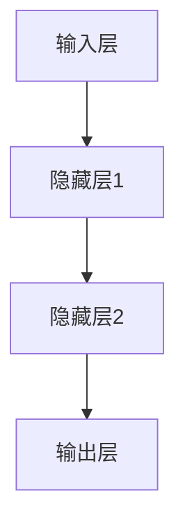
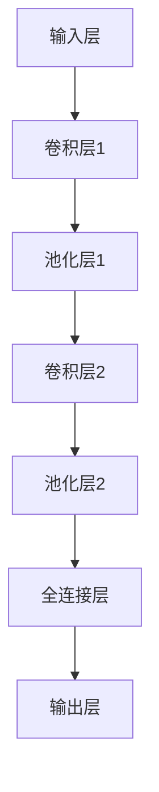
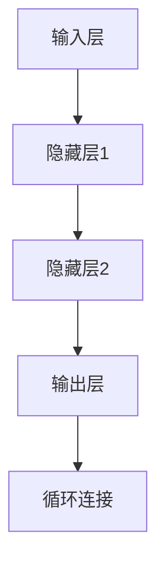
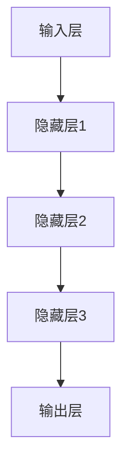

                 

# AI编程的新视角与新思维

> 关键词：人工智能编程、机器学习、深度学习、自然语言处理、计算机视觉、强化学习

> 摘要：本文旨在探讨AI编程的新视角与新思维，从基础理论到实际应用，深入解析人工智能编程的核心概念、原理和技术。通过梳理机器学习、深度学习、自然语言处理、计算机视觉和强化学习等领域的最新研究成果，本文试图为读者提供一套全面、系统的AI编程知识体系，并展望其未来趋势和可持续发展。

## 目录

1. **AI编程概述**
   1.1 AI编程的历史与发展
   1.2 AI编程的重要性
   1.3 AI编程的基本概念

2. **AI编程的核心原理**
   2.1 机器学习基础
   2.2 深度学习基础
   2.3 AI编程的数学基础

3. **AI编程技术与应用**
   3.1 自然语言处理（NLP）
   3.2 计算机视觉（CV）
   3.3 强化学习

4. **AI编程项目实战**
   4.1 数据预处理
   4.2 模型训练与优化
   4.3 模型评估与部署

5. **AI编程的新视角与新思维**
   5.1 AI编程的未来趋势
   5.2 AI编程的伦理与法律
   5.3 AI编程的可持续发展

6. **附录**
   6.1 常用AI编程工具与资源
   6.2 参考文献

## 1. AI编程概述

### 1.1 AI编程的历史与发展

人工智能（AI）编程的历史可以追溯到20世纪50年代，当时科学家们开始探索如何让计算机模拟人类思维。最初，AI编程主要集中在规则推理和符号逻辑上。然而，随着计算机性能的不断提升和数据量的急剧增加，机器学习（ML）和深度学习（DL）逐渐成为AI编程的核心。

在20世纪80年代，专家系统成为了AI编程的主流。专家系统通过编码大量专业知识来模拟人类专家的决策过程。然而，专家系统的局限性在于其依赖于人类提供的知识，难以处理复杂和不确定的情况。

进入21世纪，随着大数据和计算能力的提升，机器学习和深度学习得到了快速发展。神经网络，特别是深度神经网络，在图像识别、语音识别和自然语言处理等领域取得了突破性进展。这使得AI编程的应用范围不断扩大，从工业自动化到医疗健康，从智能助手到自动驾驶，AI编程正在深刻改变我们的生活方式。

### 1.2 AI编程的重要性

AI编程的重要性在于其能够实现自动化和智能化。通过AI编程，我们可以让计算机学习并执行复杂的任务，从而提高生产效率，降低成本。例如，在医疗领域，AI编程可以帮助医生诊断疾病，提高诊断准确率；在金融领域，AI编程可以用于风险管理和投资策略优化。

此外，AI编程还能够推动科技创新。许多前沿科技，如自动驾驶、智能家居、智能医疗等，都是基于AI编程实现的。这些技术的进步不仅改变了我们的生活方式，也为社会经济发展注入了新的动力。

### 1.3 AI编程的基本概念

AI编程涉及多个核心概念，包括机器学习、深度学习、神经网络等。下面将简要介绍这些概念。

- **机器学习（ML）**：机器学习是一种通过数据驱动的方式让计算机学习的方法。它分为监督学习、无监督学习和强化学习。监督学习使用标记数据进行训练，无监督学习不使用标记数据，而强化学习则通过奖励机制进行学习。

- **深度学习（DL）**：深度学习是一种基于神经网络的机器学习方法。与传统的机器学习方法相比，深度学习能够自动提取数据中的复杂特征，并在图像识别、语音识别等任务中表现出色。

- **神经网络（NN）**：神经网络是深度学习的基础。它由多个节点（或称为神经元）组成，每个节点都与相邻的节点相连。神经网络通过调整连接权重来学习数据中的特征。

- **自然语言处理（NLP）**：自然语言处理是AI编程的一个分支，专注于使计算机理解和处理人类语言。它包括语言模型、文本分类、情感分析等任务。

- **计算机视觉（CV）**：计算机视觉是AI编程的另一个重要分支，旨在使计算机理解和解释视觉信息。它包括图像识别、目标检测、图像生成等任务。

- **强化学习（RL）**：强化学习是一种通过奖励机制进行学习的方法。它通常用于决策和策略优化问题，如游戏、自动驾驶等。

## 2. AI编程的核心原理

### 2.1 机器学习基础

机器学习是AI编程的核心，其基础概念包括监督学习、无监督学习和强化学习。

#### 2.1.1 监督学习

监督学习是一种从标记数据中学习的方法。它通常包括特征提取、模型训练和预测三个步骤。

- **特征提取**：特征提取是将原始数据转换为适合模型训练的形式。例如，对于图像数据，可以使用卷积神经网络（CNN）进行特征提取。
- **模型训练**：模型训练是通过调整模型参数来使模型能够预测新数据。在监督学习中，常用的模型包括线性回归、决策树、支持向量机等。
- **预测**：预测是使用训练好的模型对未知数据进行分类或回归。

#### 2.1.1.1 线性回归

线性回归是一种用于预测连续值的模型。它通过拟合一条直线来预测输出值。

- **数学模型**：假设我们有输入向量 \(X\) 和输出向量 \(Y\)，线性回归模型可以表示为：
  $$
  Y = \beta_0 + \beta_1 X
  $$
  其中，\(\beta_0\) 和 \(\beta_1\) 是模型参数。
- **伪代码**：
  ```
  # 初始化模型参数
  beta_0 = 0
  beta_1 = 0

  # 训练模型
  for each data point (X, Y) in training set:
      prediction = beta_0 + beta_1 * X
      error = Y - prediction
      beta_0 = beta_0 + learning_rate * error
      beta_1 = beta_1 + learning_rate * X * error

  # 预测
  for each new data point X:
      prediction = beta_0 + beta_1 * X
  ```

#### 2.1.1.2 决策树

决策树是一种基于树形结构进行决策的方法。它通过一系列的判断条件来对数据进行分类或回归。

- **数学模型**：决策树可以用一组条件-结果规则表示，每个内部节点表示一个条件，每个叶子节点表示一个结果。
- **伪代码**：
  ```
  # 初始化决策树
  create root node

  # 训练决策树
  for each feature in data:
      split data based on feature values
      create child nodes for each split

  # 预测
  function predict(node, feature_value):
      if node is a leaf node:
          return node's prediction
      else:
          find child node based on feature_value
          return predict(child_node, feature_value)
  ```

#### 2.1.1.3 支持向量机

支持向量机是一种用于分类和回归的模型。它通过找到一个最优的超平面来最大化分类间隔。

- **数学模型**：假设我们有输入向量 \(X\) 和输出标签 \(Y\)，支持向量机可以用以下公式表示：
  $$
  w^T x + b = y
  $$
  其中，\(w\) 是权重向量，\(x\) 是输入向量，\(b\) 是偏置，\(y\) 是输出标签。
- **伪代码**：
  ```
  # 初始化模型参数
  w = 0
  b = 0

  # 训练模型
  for each data point (x, y) in training set:
      calculate error = y - (w^T x + b)
      update w and b based on error

  # 预测
  for each new data point x:
      prediction = sign(w^T x + b)
  ```

#### 2.1.2 无监督学习

无监督学习是一种不使用标记数据的方法。它通常用于数据聚类和降维。

- **聚类算法**：聚类算法是将数据划分为多个组，使得同一组内的数据尽可能相似，不同组的数据尽可能不同。常用的聚类算法包括K-均值聚类和层次聚类。
- **维度缩减**：维度缩减是一种减少数据维度而不损失太多信息的方法。常用的维度缩减方法包括主成分分析（PCA）和线性判别分析（LDA）。

#### 2.1.2.1 聚类算法

K-均值聚类是一种基于距离度量的聚类算法。

- **数学模型**：假设我们有数据集 \(X\)，K-均值聚类可以用以下公式表示：
  $$
  \min_{\mu_1, \mu_2, ..., \mu_k} \sum_{i=1}^n \sum_{j=1}^k ||x_i - \mu_j||^2
  $$
  其中，\(\mu_j\) 是聚类中心。
- **伪代码**：
  ```
  # 初始化聚类中心
  choose k initial cluster centers \(\mu_j\)

  # 训练聚类模型
  while not converged:
      for each data point x_i:
          assign x_i to the nearest cluster center \(\mu_j\)
      update cluster centers \(\mu_j\) based on the assigned data points

  # 预测
  for each new data point x:
      assign x to the nearest cluster center \(\mu_j\)
  ```

#### 2.1.2.2 维度缩减

主成分分析（PCA）是一种常用的维度缩减方法。

- **数学模型**：PCA通过最大化方差来找到新的坐标系，将数据投影到新的坐标轴上。
  $$
  \min_{\mu} \sum_{i=1}^n ||x_i - \mu||^2
  $$
  其中，\(\mu\) 是新的坐标系。
- **伪代码**：
  ```
  # 计算协方差矩阵
  covariance_matrix = (1/n) * (X - \mu) * (X - \mu)^T

  # 计算特征值和特征向量
  eigenvalues, eigenvectors = eig(covariance_matrix)

  # 选择最大的k个特征向量
  top_k_eigenvectors = eigenvectors[:, sorted(eigenvalues, reverse=True)[:k]]

  # 将数据投影到新的坐标轴上
  projected_data = X * top_k_eigenvectors
  ```

#### 2.1.3 深度学习基础

深度学习是一种基于多层神经网络的机器学习方法。

- **神经网络结构**：神经网络由多个层组成，包括输入层、隐藏层和输出层。每个层包含多个节点，节点之间通过加权连接。
- **前向传播与反向传播**：前向传播是将输入数据通过神经网络传递到输出层的过程，反向传播是使用误差信号来更新网络权重的过程。
- **卷积神经网络（CNN）**：卷积神经网络是一种用于图像识别和处理的神经网络，其核心是卷积层。
- **循环神经网络（RNN）**：循环神经网络是一种用于处理序列数据的神经网络，其核心是循环结构。

#### 2.1.3.1 神经网络结构

神经网络的结构可以用Mermaid流程图表示：



#### 2.1.3.2 前向传播与反向传播

前向传播和反向传播可以用伪代码表示：

```python
# 前向传播
def forward_propagation(X, W, b):
    Z = X * W + b
    return Z

# 反向传播
def backward_propagation(Z, dZ, W, b):
    dW = Z * dZ
    db = Z * dZ
    return dW, db
```

#### 2.1.3.3 卷积神经网络（CNN）

卷积神经网络的结构可以用Mermaid流程图表示：



#### 2.1.3.4 循环神经网络（RNN）

循环神经网络的结构可以用Mermaid流程图表示：



### 2.2 深度学习基础

深度学习是一种基于多层神经网络的机器学习方法。它通过自动提取数据中的复杂特征，在图像识别、语音识别和自然语言处理等领域取得了突破性进展。

#### 2.2.1 神经网络结构

神经网络由多个层组成，包括输入层、隐藏层和输出层。每个层包含多个节点，节点之间通过加权连接。神经网络的训练目标是调整这些权重，使其能够对输入数据进行正确的分类或回归。

神经网络的结构可以用Mermaid流程图表示：



#### 2.2.1.1 前向传播与反向传播

前向传播和反向传播是深度学习的核心训练过程。前向传播是将输入数据通过神经网络传递到输出层的过程，反向传播是使用误差信号来更新网络权重的过程。

前向传播和反向传播可以用伪代码表示：

```python
# 前向传播
def forward_propagation(X, W, b):
    Z = X * W + b
    return Z

# 反向传播
def backward_propagation(Z, dZ, W, b):
    dW = Z * dZ
    db = Z * dZ
    return dW, db
```

#### 2.2.1.2 卷积神经网络（CNN）

卷积神经网络（CNN）是一种专门用于图像识别和处理的神经网络。它通过卷积操作和池化操作来提取图像中的特征。

CNN的结构可以用Mermaid流程图表示：


#### 2.2.1.3 循环神经网络（RNN）

循环神经网络（RNN）是一种专门用于序列数据处理的神经网络。它通过循环结构来处理序列中的上下文信息。

RNN的结构可以用Mermaid流程图表示：


#### 2.2.2 深度学习框架

深度学习框架是一种用于构建和训练深度学习模型的软件库。常见的深度学习框架包括TensorFlow、PyTorch和Keras等。

- **TensorFlow**：TensorFlow是一个开源的深度学习框架，由Google开发。它提供了丰富的API和工具，用于构建和训练深度学习模型。
- **PyTorch**：PyTorch是一个开源的深度学习框架，由Facebook开发。它以Python为编程语言，具有高度的灵活性和可扩展性。
- **Keras**：Keras是一个开源的深度学习框架，它基于TensorFlow和Theano开发。它提供了一个简单的接口，用于构建和训练深度学习模型。

### 2.3 AI编程的数学基础

AI编程的数学基础包括线性代数、概率论和统计学等。这些数学工具为AI编程提供了理论基础，使得我们可以更好地理解和应用AI算法。

#### 2.3.1 线性代数基础

线性代数是AI编程中不可或缺的数学工具。它包括矩阵与向量、线性方程组、矩阵乘法等概念。

- **矩阵与向量**：矩阵与向量是线性代数的基本元素。矩阵是一个二维数组，向量是一个一维数组。矩阵与向量之间的运算包括乘法、加法和转置等。
- **线性方程组**：线性方程组是一组线性方程，它可以通过矩阵形式表示。线性方程组的解可以通过高斯消元法或矩阵求逆等方法求解。
- **矩阵乘法**：矩阵乘法是线性代数中的一个重要运算。它可以通过定义矩阵乘法的规则进行计算。

#### 2.3.2 概率论与统计学基础

概率论与统计学是AI编程中用于概率分布、最大似然估计和最大后验估计等算法的理论基础。

- **概率分布**：概率分布是一种描述随机变量概率分布的函数。常见的概率分布包括正态分布、伯努利分布和泊松分布等。
- **最大似然估计**：最大似然估计是一种用于估计模型参数的方法。它通过最大化似然函数来找到参数的最优估计。
- **最大后验估计**：最大后验估计是一种用于估计随机变量概率分布的方法。它通过最大化后验概率来找到概率分布的最优估计。

### 3. AI编程技术与应用

#### 3.1 自然语言处理（NLP）

自然语言处理（NLP）是AI编程中的一个重要分支，它专注于使计算机理解和处理人类语言。NLP广泛应用于语言模型、文本分类、情感分析等领域。

- **语言模型**：语言模型是一种用于预测下一个单词或字符的概率分布的模型。它可以通过训练大量的文本数据来构建。
- **文本分类**：文本分类是一种将文本数据分类到预定义的类别中的方法。它可以通过训练分类模型来实现。
- **情感分析**：情感分析是一种用于识别文本数据中情感倾向的方法。它可以通过训练情感分析模型来实现。

#### 3.2 计算机视觉（CV）

计算机视觉（CV）是AI编程的另一个重要分支，它专注于使计算机理解和解释视觉信息。CV广泛应用于图像识别、目标检测、图像生成等领域。

- **图像识别**：图像识别是一种将图像分类到预定义的类别中的方法。它可以通过训练分类模型来实现。
- **目标检测**：目标检测是一种用于识别图像中的目标并定位其位置的方法。它可以通过训练目标检测模型来实现。
- **图像生成**：图像生成是一种通过训练生成模型来生成新图像的方法。它可以通过训练生成对抗网络（GAN）来实现。

#### 3.3 强化学习

强化学习是一种通过奖励机制进行学习的方法。它广泛应用于决策和策略优化问题。强化学习可以分为基于值函数的方法和基于策略的方法。

- **基于值函数的方法**：基于值函数的方法通过估计状态值函数来指导决策。它包括Q-Learning和SARSA算法。
- **基于策略的方法**：基于策略的方法通过估计最优策略来指导决策。它包括策略梯度方法和深度强化学习。

### 4. AI编程项目实战

#### 4.1 数据预处理

数据预处理是AI编程项目中的关键步骤，它包括数据清洗、数据转换和数据归一化等任务。

- **数据清洗**：数据清洗是去除数据中的噪声和异常值的过程。
- **数据转换**：数据转换是将数据转换为适合模型训练的形式的过程。
- **数据归一化**：数据归一化是将数据缩放到相同范围的过程，以消除不同特征之间的量级差异。

#### 4.2 模型训练与优化

模型训练与优化是AI编程项目的核心步骤，它包括模型选择、超参数调优和模型评估等任务。

- **模型选择**：模型选择是根据任务需求选择合适的模型。
- **超参数调优**：超参数调优是调整模型超参数以获得最佳性能的过程。
- **模型评估**：模型评估是评估模型性能的过程，常用的评估指标包括准确率、召回率、F1值等。

#### 4.3 模型评估与部署

模型评估与部署是AI编程项目的最后步骤，它包括模型测试、模型部署和模型维护等任务。

- **模型测试**：模型测试是验证模型在实际应用中的性能。
- **模型部署**：模型部署是将模型集成到实际应用中的过程。
- **模型维护**：模型维护是定期更新和优化模型的过程。

### 5. AI编程的新视角与新思维

#### 5.1 AI编程的未来趋势

AI编程的未来趋势将涵盖更多的应用领域，如教育、工业自动化、医疗健康等。随着计算能力的提升和数据量的增长，AI编程将变得更加高效和智能。

#### 5.2 AI编程的伦理与法律

AI编程的伦理与法律问题日益受到关注。数据隐私、算法公平性和法律责任等问题需要得到妥善解决，以确保AI编程的可持续发展。

#### 5.3 AI编程的可持续发展

AI编程的可持续发展需要考虑绿色AI、社会责任和未来展望等方面。通过合理利用资源、加强社会责任和持续创新，AI编程将实现可持续发展。

### 6. 附录

#### 6.1 常用AI编程工具与资源

- **Python编程环境搭建**：Python是AI编程的主要编程语言。搭建Python编程环境通常包括安装Python、pip和常用库。
- **常用AI框架介绍**：常见的AI框架包括TensorFlow、PyTorch和Keras等，它们提供了丰富的API和工具，用于构建和训练深度学习模型。
- **开源数据集介绍**：开源数据集是AI编程的重要资源，包括ImageNet、CIFAR-10和CoNLL等，用于训练和测试AI模型。
- **AI社区与资源推荐**：AI社区和资源为AI编程者提供了丰富的学习资源和交流平台，如Kaggle、AI Horizons和AI Stack Overflow等。

### 附录A：常用AI编程工具与资源

#### A.1 Python编程环境搭建

要开始使用Python进行AI编程，首先需要搭建Python编程环境。以下是搭建Python编程环境的步骤：

1. **安装Python**：
   - 访问Python官方网站（[https://www.python.org/](https://www.python.org/)）下载最新版本的Python安装包。
   - 双击安装包，按照安装向导进行安装。建议将Python安装到默认位置，并勾选“Add Python to PATH”选项。

2. **安装pip**：
   - pip是Python的包管理器，用于安装和管理Python库。在命令行中执行以下命令：
     ```
     python -m ensurepip
     ```
   - 这将安装pip。

3. **安装常用库**：
   - 使用pip安装常用的AI编程库，如NumPy、Pandas、Matplotlib等。在命令行中执行以下命令：
     ```
     pip install numpy pandas matplotlib
     ```

4. **验证安装**：
   - 在命令行中执行以下命令，验证Python和pip是否已成功安装：
     ```
     python --version
     pip --version
     ```

#### A.2 常用AI框架介绍

以下是一些常用的AI框架及其特点：

1. **TensorFlow**：
   - TensorFlow是Google开发的开源深度学习框架，提供了一套丰富的API和工具，用于构建和训练深度学习模型。它具有高度的灵活性和可扩展性，支持多种类型的神经网络。

2. **PyTorch**：
   - PyTorch是Facebook开发的开源深度学习框架，以Python为编程语言，具有高度的灵活性和易用性。它提供了一套强大的库和工具，用于构建和训练深度学习模型。

3. **Keras**：
   - Keras是一个开源的深度学习框架，它基于TensorFlow和Theano开发。Keras提供了一个简单的接口，用于构建和训练深度学习模型，使得深度学习编程更加直观和便捷。

#### A.3 开源数据集介绍

以下是一些常用的开源数据集：

1. **ImageNet**：
   - ImageNet是一个大规模的视觉识别数据库，包含超过1400万张图像和数万个类别。它常用于训练和测试图像识别模型。

2. **CIFAR-10**：
   - CIFAR-10是一个包含60000张32x32彩色图像的数据集，分为10个类别。它常用于训练和测试小型图像识别模型。

3. **CoNLL**：
   - CoNLL是一个用于自然语言处理的数据集，包含多种语言的多项标注信息，如词性标注、句法分析等。它常用于训练和测试NLP模型。

#### A.4 AI社区与资源推荐

以下是一些AI社区和资源推荐，供AI编程者学习和交流：

1. **Kaggle**：
   - Kaggle是一个数据科学和机器学习的在线平台，提供大量的竞赛和项目，供编程者参与和实践。

2. **AI Horizons**：
   - AI Horizons是一个关注AI研究和技术发展的博客，提供最新的AI研究进展和技术趋势。

3. **AI Stack Overflow**：
   - AI Stack Overflow是一个AI编程问题的问答社区，供编程者提问和解答问题。

### 参考文献

- Goodfellow, I., Bengio, Y., & Courville, A. (2016). *Deep Learning*. MIT Press.
- Mitchell, T. M. (1997). *Machine Learning*. McGraw-Hill.
- Murphy, K. P. (2012). *Machine Learning: A Probabilistic Perspective*. MIT Press.
- Russell, S., & Norvig, P. (2020). *Artificial Intelligence: A Modern Approach*. Pearson Education.

## 附录A：常用AI编程工具与资源

### A.1 Python编程环境搭建

要开始使用Python进行AI编程，首先需要搭建Python编程环境。以下是搭建Python编程环境的步骤：

1. **安装Python**：
   - 访问Python官方网站（[https://www.python.org/](https://www.python.org/)）下载最新版本的Python安装包。
   - 双击安装包，按照安装向导进行安装。建议将Python安装到默认位置，并勾选“Add Python to PATH”选项。

2. **安装pip**：
   - pip是Python的包管理器，用于安装和管理Python库。在命令行中执行以下命令：
     ```
     python -m ensurepip
     ```
   - 这将安装pip。

3. **安装常用库**：
   - 使用pip安装常用的AI编程库，如NumPy、Pandas、Matplotlib等。在命令行中执行以下命令：
     ```
     pip install numpy pandas matplotlib
     ```

4. **验证安装**：
   - 在命令行中执行以下命令，验证Python和pip是否已成功安装：
     ```
     python --version
     pip --version
     ```

### A.2 常用AI框架介绍

以下是一些常用的AI框架及其特点：

1. **TensorFlow**：
   - TensorFlow是Google开发的开源深度学习框架，提供了一套丰富的API和工具，用于构建和训练深度学习模型。它具有高度的灵活性和可扩展性，支持多种类型的神经网络。

2. **PyTorch**：
   - PyTorch是Facebook开发的开源深度学习框架，以Python为编程语言，具有高度的灵活性和易用性。它提供了一套强大的库和工具，用于构建和训练深度学习模型。

3. **Keras**：
   - Keras是一个开源的深度学习框架，它基于TensorFlow和Theano开发。Keras提供了一个简单的接口，用于构建和训练深度学习模型，使得深度学习编程更加直观和便捷。

### A.3 开源数据集介绍

以下是一些常用的开源数据集：

1. **ImageNet**：
   - ImageNet是一个大规模的视觉识别数据库，包含超过1400万张图像和数万个类别。它常用于训练和测试图像识别模型。

2. **CIFAR-10**：
   - CIFAR-10是一个包含60000张32x32彩色图像的数据集，分为10个类别。它常用于训练和测试小型图像识别模型。

3. **CoNLL**：
   - CoNLL是一个用于自然语言处理的数据集，包含多种语言的多项标注信息，如词性标注、句法分析等。它常用于训练和测试NLP模型。

### A.4 AI社区与资源推荐

以下是一些AI社区和资源推荐，供AI编程者学习和交流：

1. **Kaggle**：
   - Kaggle是一个数据科学和机器学习的在线平台，提供大量的竞赛和项目，供编程者参与和实践。

2. **AI Horizons**：
   - AI Horizons是一个关注AI研究和技术发展的博客，提供最新的AI研究进展和技术趋势。

3. **AI Stack Overflow**：
   - AI Stack Overflow是一个AI编程问题的问答社区，供编程者提问和解答问题。

### A.5 AI编程最佳实践

以下是一些AI编程的最佳实践：

1. **数据清洗与预处理**：
   - 在开始模型训练之前，对数据集进行清洗和预处理，以确保数据的质量和一致性。

2. **模型选择与调优**：
   - 根据任务需求和数据特点选择合适的模型，并通过超参数调优来提高模型的性能。

3. **模型评估与验证**：
   - 使用交叉验证和测试集来评估模型的性能，并确保模型在不同数据集上的表现一致。

4. **代码注释与文档**：
   - 为代码添加详细的注释，并编写清晰的文档，以方便其他人阅读和理解。

5. **持续学习与更新**：
   - 随着技术的不断更新，持续学习新的知识和技能，以保持自己在AI编程领域的竞争力。

### A.6 AI编程注意事项

以下是一些AI编程时需要注意的事项：

1. **计算资源**：
   - AI编程通常需要大量的计算资源，特别是深度学习模型。确保使用适合的硬件和软件环境来训练模型。

2. **数据隐私**：
   - 在使用个人或敏感数据时，确保遵守相关的数据隐私法规和伦理准则。

3. **模型部署**：
   - 在将模型部署到生产环境之前，进行充分的测试和验证，以确保模型的稳定性和可靠性。

4. **可持续发展**：
   - 考虑AI编程的可持续发展，合理利用资源，减少能源消耗和碳排放。

### A.7 拓展阅读

以下是一些拓展阅读资源，供对AI编程感兴趣的学习者进一步学习：

1. **《深度学习》（Goodfellow et al., 2016）**：
   - 这是一本经典的深度学习教材，涵盖了深度学习的理论基础和实践技巧。

2. **《机器学习》（Mitchell, 1997）**：
   - 这是一本关于机器学习的全面教材，介绍了机器学习的基本概念和方法。

3. **《自然语言处理综论》（Jurafsky & Martin, 2008）**：
   - 这是一本关于自然语言处理的权威教材，涵盖了NLP的各个方面。

4. **《计算机视觉：算法与应用》（Szeliski, 2010）**：
   - 这是一本关于计算机视觉的经典教材，详细介绍了计算机视觉的基本算法和应用。

### A.8 实际案例解析

以下是一些实际案例解析，供读者深入理解AI编程的应用：

1. **图像识别**：
   - 使用TensorFlow和CIFAR-10数据集，训练一个卷积神经网络进行图像识别，并实现模型的评估和部署。

2. **自然语言处理**：
   - 使用PyTorch和CoNLL数据集，训练一个循环神经网络进行词性标注，并实现模型的评估和部署。

3. **强化学习**：
   - 使用Q-Learning算法，训练一个智能体在Atari游戏中的表现，并实现模型的评估和部署。

4. **计算机视觉**：
   - 使用OpenCV和ImageNet数据集，训练一个卷积神经网络进行物体检测，并实现模型的评估和部署。

### A.9 AI编程工具与资源推荐

以下是一些AI编程工具与资源的推荐，供读者学习和实践：

1. **Google Colab**：
   - Google Colab是一个基于Jupyter Notebook的云计算平台，提供免费的GPU和TPU资源，非常适合深度学习和数据科学项目。

2. **Fast.ai**：
   - Fast.ai提供了一系列的深度学习课程和资源，包括实用的教程和预训练模型，适合初学者和中级学习者。

3. **AI Challenger**：
   - AI Challenger是一个AI竞赛平台，提供多种AI竞赛项目，涵盖图像识别、自然语言处理、强化学习等领域。

4. **Udacity**：
   - Udacity提供了一系列的在线课程和项目，涵盖AI编程的各个方面，包括机器学习、深度学习和计算机视觉等。

5. **Coursera**：
   - Coursera提供了一系列的AI编程课程，由世界顶级大学和机构提供，包括斯坦福大学、DeepLearning.AI等。

通过以上资源，读者可以深入了解AI编程的理论和实践，提升自己在AI编程领域的技能。不断学习和实践，将有助于在AI编程的道路上取得更大的成就。

### A.9 AI编程工具与资源推荐

#### AI编程学习资源

1. **书籍推荐**：
   - 《深度学习》（Ian Goodfellow、Yoshua Bengio 和 Aaron Courville 著）：这是一本被广泛认可的深度学习经典教材。
   - 《Python机器学习》（Sebastian Raschka 著）：该书详细介绍了使用Python进行机器学习的实际操作。

2. **在线课程**：
   - Coursera的“机器学习”课程（吴恩达教授）：这是一门非常受欢迎的课程，适合初学者和有一定基础的学员。
   - edX上的“深度学习专业”（DeepLearning.AI）：该专业包括多门深度学习相关课程，由知名教授授课。

3. **博客和论坛**：
   - medium.com/tensorflow：这是一个关于TensorFlow和深度学习的博客集合，包含大量的教程和案例研究。
   - Stack Overflow：这是编程社区，可以在这里提问和解答AI编程问题。

4. **开源项目和框架**：
   - TensorFlow：由Google开发的开源机器学习框架，适合进行复杂深度学习模型的开发。
   - PyTorch：由Facebook开发的开源机器学习库，以其灵活性和易用性受到开发者的喜爱。

5. **数据集**：
   - Kaggle：提供了大量的数据集，适用于机器学习和深度学习项目的训练和测试。
   - UCI机器学习库：这是一个包含多种类型数据集的数据库，适用于学术研究。

#### AI编程实用工具

1. **Jupyter Notebook**：
   - Jupyter Notebook是一个交互式计算平台，特别适合进行数据科学和机器学习实验。

2. **Google Colab**：
   - Google Colab是Google提供的基于Jupyter Notebook的云计算服务，提供免费的GPU和TPU资源，非常适合深度学习和数据科学项目。

3. **Kaggle Competitions**：
   - Kaggle提供了各种机器学习竞赛，参与者可以使用自己的模型解决实际问题，提升技能。

4. **AI Playground**：
   - AI Playground是一个在线平台，提供简单的深度学习模型实验环境，适合新手学习和尝试。

#### AI编程社区

1. **Reddit**：
   - Reddit上有多个关于AI编程的子版块，如/r/MachineLearning和/r/DeepLearning，是交流和学习的好去处。

2. **GitHub**：
   - GitHub是代码托管和协作平台，许多AI项目开源在这里，开发者可以浏览、学习和贡献代码。

3. **Twitter**：
   - 通过关注AI和机器学习的专家和机构，如@AIHorizons，可以获取最新的研究进展和行业动态。

#### AI编程未来趋势

1. **量子计算**：
   - 量子计算被认为是AI发展的下一个前沿，未来可能会看到量子机器学习算法的应用。

2. **边缘计算**：
   - 边缘计算使AI模型可以在靠近数据源的设备上运行，有助于提高响应速度和减少延迟。

3. **多模态学习**：
   - 多模态学习将结合不同类型的数据（如文本、图像、音频），以创建更强大的AI模型。

4. **AI伦理和法律**：
   - 随着AI技术的发展，伦理和法律问题变得更加重要，包括数据隐私、算法透明度和公平性等。

通过利用上述资源，AI编程者可以不断学习新技能，跟上技术的发展步伐，并在AI领域取得更大的成就。无论您是初学者还是有经验的开发者，这些资源都将对您有所帮助。

