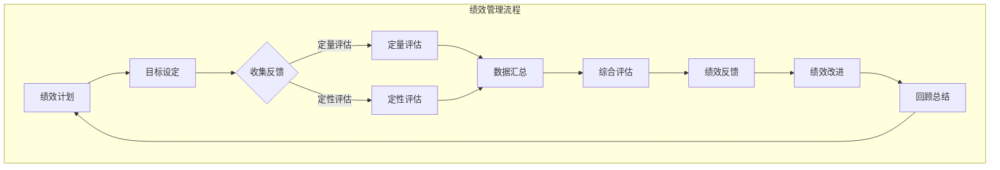

                 

### 文章标题：提高团队绩效的秘诀：绩效管理技巧

#### 关键词：团队绩效、绩效管理、绩效评估、团队协作、激励策略

#### 摘要：
本文将探讨团队绩效管理的核心原则与实用技巧。通过对绩效管理的定义、过程、评估方法以及团队构建、协作与激励等环节的深入分析，为读者提供一套系统化的团队绩效提升方案。文章旨在帮助读者理解绩效管理的基础理论，掌握有效的团队管理技巧，并通过实际案例分享，提供可操作的实践指导。无论您是企业管理者还是技术团队负责人，本文都将为您揭示提高团队绩效的秘诀。

---

## 《提高团队绩效的秘诀：绩效管理技巧》目录大纲

### 第一部分：绩效管理基础

#### 第1章：绩效管理的定义与重要性  
- 绩效管理的定义  
- 绩效管理的重要性  
- 绩效管理的目标

#### 第2章：绩效管理的过程  
- 绩效计划  
- 绩效评估  
- 绩效反馈

#### 第3章：绩效评估方法  
- 定量评估方法  
- 定性评估方法  
- 综合评估方法

### 第二部分：团队绩效管理

#### 第4章：构建高效的团队  
- 团队的定义  
- 团队角色与职责  
- 高效团队的特征

#### 第5章：团队协作技巧  
- 沟通技巧  
- 协作工具与方法  
- 团队冲突解决

#### 第6章：团队激励策略  
- 激励理论  
- 常见激励策略  
- 激励策略的实施

### 第三部分：绩效改进与提升

#### 第7章：识别和解决团队问题  
- 问题识别  
- 问题分析  
- 问题解决

#### 第8章：持续改进与学习  
- 持续改进的方法  
- 学习型组织建设  
- 持续改进的实施

#### 第9章：领导力在绩效管理中的角色  
- 领导力的定义  
- 领导力在绩效管理中的作用  
- 领导力的培养

### 第四部分：案例分析与应用

#### 第10章：成功绩效管理的案例分析  
- 案例一：如何通过绩效管理提高销售团队绩效  
- 案例二：如何通过绩效管理提高项目团队绩效  
- 案例三：如何通过绩效管理提高服务团队绩效

#### 第11章：绩效管理技巧的实际应用  
- 实际应用场景  
- 实施步骤  
- 成功经验与教训

### 附录

#### 附录A：绩效管理工具与资源  
- 绩效管理工具简介  
- 绩效管理资源推荐

#### 附录B：绩效管理常用表格与模板  
- 绩效计划表格  
- 绩效评估表格  
- 绩效反馈表格

#### 附录C：参考书籍与文献  
- 参考书籍  
- 学术文献

### 核心概念与联系

- **绩效管理流程图**：使用 Mermaid 语法绘制绩效管理的流程图，包括计划、评估、反馈等环节。

### 核心算法原理讲解

- **绩效评估算法伪代码**：详细阐述用于评估员工绩效的算法原理，包括评分、排名等。

### 数学模型和数学公式详细讲解

- **绩效评分模型**：使用 LaTeX 格式展示绩效评分的数学模型，并进行解释和举例。

### 项目实战

- **实际绩效管理项目**：介绍一个具体的绩效管理项目，包括项目背景、目标、实施过程、效果分析等。

- **代码案例**：提供实际代码实现，并详细解读代码的逻辑和实现方法。

- **开发环境搭建**：描述搭建开发环境所需的步骤和工具。

- **源代码详细实现和代码解读**：展示源代码的详细实现过程，并进行代码解读与分析。

### 最佳实践 tips、小结、注意事项、拓展阅读等内容

---

接下来的章节将逐一深入探讨绩效管理的基础理论、团队绩效管理的实践技巧以及绩效改进与提升的策略。通过这些内容，读者将能够系统地了解并掌握提高团队绩效的秘诀，从而在实际工作中取得更好的成果。让我们一起走进绩效管理的世界，揭开提升团队绩效的神秘面纱。

### 第一部分：绩效管理基础

#### 第1章：绩效管理的定义与重要性

绩效管理是一个持续的过程，旨在确保个人和团队的目标与组织的战略方向保持一致，并通过有效的评估和反馈机制，促进员工的个人发展和组织的整体绩效提升。绩效管理的定义和重要性不仅在于其对组织目标的达成起到关键作用，还在于它对员工个人成长的积极影响。

##### 绩效管理的定义

绩效管理可以定义为一种通过设定目标、评估表现、提供反馈和支持，促进个人和团队绩效持续改进的过程。它不仅关注短期目标的实现，更注重长期的发展和培养。绩效管理涉及多个环节，包括绩效计划、绩效评估、绩效反馈和绩效改进。

- **绩效计划**：在绩效管理过程中，首先需要设定清晰的目标和期望。这包括组织层面的目标和个人层面的目标。绩效计划是整个绩效管理过程的基础，它为后续的绩效评估提供了明确的基准。

- **绩效评估**：通过定期的评估，可以了解员工的工作表现是否符合预期目标。绩效评估通常包括定量评估和定性评估，以便全面地衡量员工的绩效。

- **绩效反馈**：绩效反馈是绩效管理的关键环节，它通过直接、明确的沟通，帮助员工了解自己的优势和不足，从而制定改进计划。

- **绩效改进**：绩效改进是绩效管理的持续过程，旨在通过不断的反馈和调整，提升员工的绩效表现。

##### 绩效管理的重要性

绩效管理的重要性体现在以下几个方面：

- **促进组织目标达成**：绩效管理确保个人和团队的目标与组织的战略方向一致，从而提高组织整体的绩效和效率。

- **提升员工绩效**：通过绩效管理，员工能够更清楚地了解自己的工作目标和标准，从而有针对性地提高工作表现。

- **促进员工成长**：绩效管理不仅仅是对员工当前表现的评估，更是对员工未来的发展提供指导和支持。

- **提高工作满意度**：通过明确的绩效目标和公平的评估机制，员工能够感受到组织的公正和关怀，从而提高工作满意度。

- **减少人才流失**：良好的绩效管理能够激励员工，提高他们的工作热情和忠诚度，从而减少人才流失。

##### 绩效管理的目标

绩效管理的目标可以分为以下几个方面：

- **提升组织绩效**：通过优化个人和团队的工作流程，提高组织整体的运营效率和效益。

- **促进个人发展**：通过绩效管理，帮助员工识别自己的优势和不足，提供培训和发展机会，从而提高个人的职业素养和技能水平。

- **建立绩效文化**：通过绩效管理，形成一种以绩效为导向的工作氛围，鼓励员工追求卓越，不断提升个人和团队的表现。

- **确保公平和透明**：通过科学的绩效评估和反馈机制，确保绩效管理的公平性和透明度，增强员工的信任和归属感。

##### 绩效管理的过程

绩效管理是一个持续循环的过程，主要包括以下几个步骤：

1. **设定目标**：在绩效管理周期的开始，组织和个人需要共同设定明确的绩效目标。这些目标应当是具体、可衡量的，并与组织的战略目标相一致。

2. **绩效评估**：在目标设定的基础上，通过定期的评估，衡量员工的工作表现是否符合预期目标。评估通常包括定量指标（如销售额、开发进度）和定性指标（如团队合作、创新能力）。

3. **反馈与沟通**：通过绩效反馈，员工能够了解自己的工作表现，并获取改进的建议和指导。有效的反馈和沟通有助于增强员工的自我认知和动力。

4. **绩效改进**：根据绩效评估的结果，制定改进计划，并采取相应的措施，如提供培训、调整工作职责等，以提升员工的绩效表现。

5. **回顾与总结**：在绩效管理周期结束时，对整个绩效管理过程进行回顾和总结，评估绩效管理的效果，为下一周期的绩效管理提供改进的依据。

##### 绩效管理的要素

为了确保绩效管理的有效性，以下要素至关重要：

- **明确的目标**：目标是绩效管理的核心，没有明确的目标，绩效管理将失去方向。

- **科学的评估方法**：选择合适的评估方法，能够准确地衡量员工的绩效表现。

- **公平的反馈机制**：公平、透明的反馈机制是绩效管理成功的关键，能够增强员工的信任和认同。

- **持续改进**：绩效管理不是一次性的活动，而是一个持续改进的过程，需要不断地进行调整和优化。

- **领导层的支持**：领导层的支持和参与是绩效管理成功的重要保障，他们的态度和行为将直接影响绩效管理的效果。

通过以上内容，我们初步了解了绩效管理的定义、重要性以及其核心目标和过程。在接下来的章节中，我们将深入探讨绩效管理的过程和方法，帮助读者更好地理解和实施绩效管理。

### 第2章：绩效管理的过程

绩效管理的过程是确保个人和团队绩效与组织目标保持一致的关键，它包括绩效计划、绩效评估和绩效反馈三个主要环节。以下是这三个环节的详细解释及其在整个绩效管理流程中的重要性。

##### 绩效计划

绩效计划是绩效管理过程的起点，它涉及设定明确的绩效目标和期望，确保个人和团队的目标与组织的战略方向一致。绩效计划的过程通常包括以下几个步骤：

1. **目标设定**：首先，组织需要设定长期的战略目标，这些目标应具有可操作性和可衡量性。接着，将战略目标分解为具体的部门和个人目标，确保每个员工都清楚自己的职责和期望。

2. **目标分解**：将高层次的目标分解为具体的、可衡量的指标，如销售额、项目完成时间、客户满意度等。这些指标应与员工的职责和能力相匹配。

3. **讨论与确认**：与员工进行沟通，讨论他们的目标和工作计划，确保员工理解并同意这些目标。这一步骤有助于提高员工的参与度和责任感。

4. **文档记录**：将设定的目标和工作计划记录在绩效计划文档中，以便后续的评估和追踪。

**绩效计划的重要性**：

- **明确方向**：绩效计划为员工和团队提供了明确的工作目标和方向，有助于集中精力达成组织目标。
- **提高执行力**：通过设定明确的绩效目标，员工可以更好地规划工作，提高执行力和效率。
- **促进沟通**：绩效计划的制定过程是管理层与员工之间沟通的重要环节，有助于增强团队合作和信任。

##### 绩效评估

绩效评估是绩效管理过程中的关键环节，它通过定期的评估，衡量员工的工作表现是否符合预期目标。绩效评估通常包括以下步骤：

1. **制定评估标准**：在绩效评估之前，需要制定具体的评估标准，这些标准应与绩效计划中的目标一致，并具有可操作性和客观性。

2. **收集数据**：通过观察、调查、面试等方式，收集员工在工作中的表现数据，如工作成果、工作效率、团队合作等。

3. **分析数据**：对收集的数据进行分析，评估员工的表现是否符合预期目标。分析时应综合考虑定量指标和定性指标。

4. **评估会议**：在评估会议中，评估者（通常是直接上司或人力资源部门）与员工面对面讨论评估结果，讨论员工的优势和改进空间。

5. **反馈与改进**：在绩效评估会议结束后，向员工提供详细的反馈，讨论改进措施，并制定下一步的行动计划。

**绩效评估的重要性**：

- **激励员工**：通过公正的绩效评估，可以激发员工的工作动力和积极性，提升整体绩效。
- **识别问题**：绩效评估有助于识别员工和团队中存在的问题，为改进提供方向。
- **决策依据**：绩效评估结果为组织在人员调配、培训发展、薪酬调整等方面的决策提供了重要依据。
- **促进发展**：通过绩效评估，员工可以了解自己的优势和不足，制定个人发展计划，提高职业素养。

##### 绩效反馈

绩效反馈是绩效管理中不可或缺的环节，它通过直接、明确的沟通，帮助员工了解自己的工作表现，并提供改进的建议和支持。绩效反馈通常包括以下步骤：

1. **面对面沟通**：与员工进行一对一的面对面沟通，讨论绩效评估的结果和反馈。这有助于建立信任，使员工更容易接受反馈。

2. **反馈内容**：在反馈中，要详细说明员工的绩效表现，包括优势、不足以及改进的建议。反馈应具体、有建设性，避免泛泛而谈。

3. **行动计划**：与员工一起制定具体的行动计划，包括改进措施和时间表。这有助于员工明确改进的方向和目标。

4. **持续跟进**：在绩效反馈后，需要定期跟进员工的改进情况，提供必要的支持和资源，确保改进计划的实施。

**绩效反馈的重要性**：

- **促进自我认知**：绩效反馈有助于员工了解自己的工作表现，促进自我认知和成长。
- **增强员工动力**：明确的反馈能够激发员工的工作动力，提高他们的工作积极性和满意度。
- **建立信任**：通过绩效反馈，管理层与员工之间建立了良好的沟通和信任关系，为长期合作奠定了基础。

##### 绩效管理过程的整体关系

绩效管理过程是一个连续、循环的过程，各环节之间相互联系，形成一个有机整体。绩效计划为整个绩效管理过程提供了方向和目标；绩效评估通过衡量实际表现，为绩效反馈提供了依据；绩效反馈则通过持续的沟通和改进，确保绩效目标的达成。

**总结**：

通过深入理解绩效管理的三个核心环节——绩效计划、绩效评估和绩效反馈，我们可以更好地实施绩效管理，提升团队绩效。有效的绩效管理不仅能促进组织目标的实现，还能推动员工个人的成长和发展。在接下来的章节中，我们将继续探讨绩效评估的具体方法和技术，帮助读者更全面地掌握绩效管理实践。

### 第3章：绩效评估方法

绩效评估是确保团队和个人目标与组织战略保持一致的重要手段。为了全面、准确地评估员工的表现，我们需要结合多种评估方法，包括定量评估方法、定性评估方法和综合评估方法。以下是对这些评估方法的详细解释和具体应用。

##### 定量评估方法

定量评估方法主要通过量化的指标来衡量员工的工作表现，具有客观、精确的特点。以下是一些常见的定量评估方法：

1. **关键绩效指标（KPI）**：关键绩效指标是衡量员工绩效的核心指标，通常与组织的战略目标密切相关。KPI可以是具体的数量目标，如销售额、生产数量、项目完成率等。通过设定明确的KPI，可以直观地了解员工的工作成果。

   **例子**：销售团队的KPI可以是每月销售额达到50万元；研发团队的KPI可以是每周完成两个功能模块的开发。

2. **工作量评估**：工作量评估通过记录员工的工作时间和工作量来衡量其绩效。这种方法适用于那些工作量较易量化且工作时间较长的工作岗位。

   **例子**：研发人员的工作量可以通过完成的代码行数、提交的bug数量来衡量。

3. **绩效评分**：绩效评分是一种将员工的表现转化为具体分数的方法，通常采用5分制或10分制。评分标准应明确，以确保评估的公平性和一致性。

   **例子**：员工的工作态度、工作效率、团队合作和创新能力可以分别按照1-5分进行评分。

**定量评估方法的优点**：

- **客观性**：定量评估方法以数据为基础，减少主观判断的干扰，提高评估的客观性。
- **可操作性**：量化指标具体、明确，便于操作和管理。
- **易于比较**：定量指标可以方便地进行横向和纵向比较，有助于识别优秀员工和改进空间。

**定量评估方法的局限性**：

- **缺乏深度**：定量评估方法难以全面反映员工的综合素质和潜在能力。
- **易受操作影响**：数据收集和计算过程中可能存在偏差，影响评估结果的准确性。

##### 定性评估方法

定性评估方法主要通过主观判断和描述来衡量员工的工作表现，适用于那些难以量化的工作。以下是一些常见的定性评估方法：

1. **360度反馈**：360度反馈是一种多角度的评估方法，通过员工的上级、同事、下属和客户等多方反馈，全面了解员工的工作表现。这种方法有助于获得更全面的评估信息。

   **例子**：销售经理可以通过客户的反馈了解自己的销售技巧和沟通能力。

2. **行为事件访谈（BEI）**：行为事件访谈是一种基于具体工作事件的方法，通过详细描述员工在关键事件中的表现，评估其能力和素质。

   **例子**：在BEI中，可以询问员工在面对重要客户投诉时的应对措施，从而了解其客户服务能力。

3. **绩效评语**：绩效评语是通过文字描述员工的表现，通常包括优点、不足和改进建议。这种方法适用于对工作表现有较深入了解的评估者。

   **例子**：在年度绩效评估中，经理可以对员工的一年内的工作表现进行详细的评语。

**定性评估方法的优点**：

- **全面性**：定性评估方法能够全面反映员工的综合素质和潜在能力。
- **深入性**：通过具体事件和行为的描述，定性评估方法可以深入分析员工的工作表现。
- **灵活性**：定性评估方法适用于各种类型的工作，不受量化指标的限制。

**定性评估方法的局限性**：

- **主观性**：定性评估方法受评估者主观判断的影响较大，可能导致评估结果的不一致。
- **时间成本**：定性评估方法通常需要较长时间和精力，对评估者的要求较高。

##### 综合评估方法

综合评估方法结合了定量评估方法和定性评估方法的优点，通过多种评估手段，全面、准确地衡量员工的表现。以下是一些常见的综合评估方法：

1. **平衡计分卡（BSC）**：平衡计分卡是一种综合性的绩效评估工具，通过财务、客户、内部流程、学习与成长四个维度，全面衡量员工的表现。

   **例子**：研发人员可以依据项目进度、代码质量、团队协作等多个维度进行评估。

2. **绩效评分+360度反馈**：结合定量评分和多方反馈，综合评估员工的绩效。这种方法能够提高评估的全面性和准确性。

   **例子**：销售人员的绩效评估可以包括月度销售额评分和客户满意度调查。

3. **绩效合约**：绩效合约是将绩效目标和具体奖励措施结合起来的方法，通过明确的目标和奖励机制，激励员工达成目标。

   **例子**：项目组可以签订项目完成时间、质量等目标，完成后获得相应的奖金或奖励。

**综合评估方法的优点**：

- **全面性**：综合评估方法能够全面反映员工的绩效，包括量化和质化的方面。
- **准确性**：结合多种评估手段，减少单一方法的局限性，提高评估结果的准确性。
- **激励性**：明确的奖励机制能够激发员工的工作动力，提高绩效。

**综合评估方法的局限性**：

- **复杂度**：综合评估方法需要较高的组织和实施成本，对评估者的能力要求较高。
- **协调性**：多种评估手段的协调和平衡需要细致的管理，否则可能导致评估结果的偏差。

##### 总结

绩效评估方法的选择应根据组织的具体情况和工作特点进行。定量评估方法适用于那些易于量化的工作，定性评估方法适用于那些难以量化的工作，而综合评估方法则能够结合两种方法的优点，提供更全面的评估结果。在实际应用中，应灵活运用多种评估方法，确保评估的全面性和准确性，从而更好地提升团队绩效。

### 第二部分：团队绩效管理

#### 第4章：构建高效的团队

一个高效的团队是实现组织目标的关键，它不仅能够提高整体的工作效率，还能促进团队成员的个人成长。构建一个高效的团队需要明确团队的定义、角色与职责，并培养团队高效运作所需的特征。以下是构建高效团队的具体方法和策略。

##### 团队的定义

团队是由两个或两个以上个体组成的，为实现共同的目标而协作工作的群体。与个体工作相比，团队工作具有以下几个特点：

- **共同目标**：团队成员拥有共同的目标和愿景，为实现这些目标而共同努力。
- **协同合作**：团队成员通过分工合作，相互依赖，共同完成任务。
- **相互信任**：团队成员之间建立信任关系，愿意分享信息和资源，共同面对挑战。
- **相互学习**：团队成员通过合作和交流，相互学习，提高个人和团队的技能水平。

##### 团队角色与职责

一个高效的团队需要明确每个成员的角色和职责，确保每个人都清楚自己的工作内容和责任。以下是常见团队角色及其职责：

1. **领导者**：领导者的职责是制定团队目标、规划工作进度、协调团队内部关系，并激励团队成员。领导者需要具备良好的沟通能力和决策能力，能够引导团队走向成功。

2. **协调员**：协调员的职责是确保团队成员之间的沟通顺畅，协调各方资源，解决团队内部的矛盾和冲突。协调员需要具备较强的组织协调能力和沟通技巧。

3. **执行者**：执行者的职责是按照团队计划完成具体任务，确保工作质量和进度。执行者通常负责日常的工作内容，是团队工作的主体。

4. **监督者**：监督者的职责是监控团队的工作进度和质量，及时发现和解决问题。监督者需要具备敏锐的观察力和分析能力，能够为团队提供及时的反馈。

5. **支持者**：支持者的职责是提供技术支持和资源，协助团队成员完成工作任务。支持者通常是团队中的专家或顾问，他们具备丰富的专业知识和经验。

##### 高效团队的特征

一个高效的团队通常具备以下特征：

1. **目标明确**：团队成员对团队的目标有清晰的认识，并明确自己的角色和职责。

2. **相互信任**：团队成员之间建立了信任关系，愿意分享信息和资源，相互支持。

3. **沟通顺畅**：团队成员之间的沟通畅通无阻，能够及时传递信息和反馈。

4. **分工明确**：每个团队成员都清楚自己的工作内容和责任，避免了重复劳动和资源浪费。

5. **协作高效**：团队成员之间协作紧密，能够高效地完成工作任务。

6. **灵活应变**：团队具备灵活应变的能力，能够快速适应外部环境和内部变化。

7. **持续学习**：团队成员保持学习的态度，不断提升自己的技能和知识，为团队的发展贡献力量。

##### 构建高效团队的方法与策略

1. **明确目标和愿景**：在组建团队之初，应明确团队的目标和愿景，确保团队成员对团队的方向有清晰的认识。

2. **合理分工**：根据团队成员的特长和能力，合理分配工作任务，确保每个人都能在适合自己的岗位上发挥最大的潜力。

3. **建立信任**：通过团队建设活动和日常沟通，建立团队成员之间的信任关系，增强团队的凝聚力。

4. **强化沟通**：建立有效的沟通机制，确保团队成员之间的信息交流畅通无阻，避免误解和冲突。

5. **培训与发展**：为团队成员提供培训和发展机会，提高他们的技能和知识水平，增强团队的整体实力。

6. **激励与反馈**：建立激励机制，鼓励团队成员积极参与团队工作，并对他们的工作表现进行及时反馈，帮助他们持续改进。

7. **灵活应变**：培养团队成员的灵活应变能力，鼓励他们面对变化时保持积极的态度，快速适应新环境。

8. **建立学习型组织**：推动团队向学习型组织转型，鼓励团队成员不断学习和创新，为团队的长远发展奠定基础。

通过以上方法和策略，我们可以构建一个高效、协作紧密的团队，为组织的目标实现提供强大的支持。在接下来的章节中，我们将继续探讨团队协作技巧和激励策略，帮助团队进一步提升绩效。

### 第5章：团队协作技巧

在高效团队中，协作是确保任务顺利完成和目标达成的关键。团队协作技巧不仅能够提高工作效率，还能增强团队成员之间的互信和凝聚力。以下是关于团队协作技巧的详细探讨，包括沟通技巧、协作工具与方法以及团队冲突解决策略。

##### 沟通技巧

有效的沟通是团队协作的基础，良好的沟通能够确保信息的准确传递，减少误解和冲突。以下是几种关键的沟通技巧：

1. **明确表达**：在沟通时，应确保表达清晰、明确，避免使用模糊、含糊的语言。使用具体的例子和数据来支持你的观点，有助于提高沟通的准确性。

2. **倾听**：倾听是有效沟通的重要组成部分。在交流过程中，应给予团队成员充分的发言机会，耐心倾听他们的意见和想法，确保理解和尊重每个人的观点。

3. **开放性沟通**：鼓励团队成员开放地表达自己的想法和感受，建立一种开放的沟通氛围。这有助于发现潜在的问题和解决方案，增强团队凝聚力。

4. **非语言沟通**：注意使用非语言沟通手段，如肢体语言、面部表情和姿态，这些非语言信息能够补充和强化语言沟通的效果。

5. **反馈与确认**：在沟通过程中，及时给予反馈和确认，确保双方对信息的理解一致。这有助于避免误解和错误的产生。

##### 协作工具与方法

现代团队协作离不开各种协作工具和方法，这些工具和方法能够提高团队的沟通效率和工作效率。以下是几种常见的协作工具和方法：

1. **项目管理工具**：如Trello、JIRA等，可以帮助团队规划和管理项目进度，分配任务和资源，跟踪任务状态。

2. **即时通讯工具**：如Slack、Microsoft Teams等，能够方便团队成员进行实时沟通和协作，提高工作效率。

3. **文档共享平台**：如Google Docs、Microsoft Office 365等，允许团队成员实时编辑和共享文档，方便协作和协作。

4. **视频会议工具**：如Zoom、Microsoft Teams等，能够实现远程团队的面对面沟通和会议，增强团队的互动和协作。

5. **团队协作平台**：如Confluence、Notion等，可以用于存储团队知识、文档、项目计划等，方便团队成员查阅和协作。

6. **版本控制工具**：如Git、SVN等，用于管理团队代码库，确保代码的一致性和协作。

7. **协作会议**：定期举行团队会议，讨论项目进度、遇到的问题和解决方案，确保团队目标的达成。

##### 团队冲突解决策略

在团队协作过程中，难免会出现冲突和矛盾。有效的冲突解决策略能够帮助团队克服障碍，保持高效运作。以下是几种常见的冲突解决策略：

1. **直接对话**：当冲突发生时，应尽快与相关人员进行直接对话，了解冲突的原因和双方的立场。直接对话有助于澄清误解，寻找共同点。

2. **求同存异**：在冲突中，应寻求双方都能接受的解决方案，尊重不同的意见和观点，避免将冲突升级。

3. **中立调解**：如果冲突无法通过直接对话解决，可以寻求第三方中立调解，以公正、客观的角度提出解决方案。

4. **妥协与让步**：在某些情况下，妥协和让步是必要的，通过双方或多方的妥协，找到一个平衡的解决方案。

5. **冲突管理培训**：为团队成员提供冲突管理培训，提高他们的冲突解决能力和沟通技巧，有助于预防和解决冲突。

6. **建立冲突解决机制**：建立一套明确的冲突解决流程和机制，确保团队在遇到冲突时能够迅速、有效地解决。

通过以上团队协作技巧和冲突解决策略，团队可以更加高效地运作，提高整体绩效。有效的协作不仅能够提升工作质量，还能增强团队成员的归属感和满意度，为组织的长期发展奠定坚实的基础。

### 第6章：团队激励策略

在团队管理中，激励策略是提升团队成员工作积极性、创造力和团队合作精神的重要手段。有效的激励策略不仅能够提高工作效率，还能增强员工的忠诚度和满意度。以下是关于团队激励策略的详细探讨，包括激励理论、常见激励策略以及这些策略的实施方法。

##### 激励理论

激励理论是指导团队激励策略的基础，不同的理论提供了不同的视角和方法。以下是几种常见的激励理论：

1. **马斯洛需求层次理论**：马斯洛认为，人的需求可以分为生理需求、安全需求、社交需求、尊重需求和自我实现需求。激励策略应根据员工的不同需求层次来设计，满足员工的低层次需求，才能激发更高层次的需求。

2. **赫茨伯格双因素理论**：赫茨伯格将工作激励因素分为满意因素和不满意因素。满意因素（如成就、认可、工作本身等）能够激励员工，而不满意因素（如工作条件、薪资等）则可能导致员工不满。激励策略应关注满足满意因素，提高员工的工作积极性。

3. **期望理论**：期望理论认为，员工的动机取决于他们对绩效、奖励和个人价值的期望。激励策略应设计合理的期望值，确保员工相信通过努力工作可以获得期望的奖励。

4. **公平理论**：公平理论强调员工的比较心理，员工会将自己的工作绩效和奖励与同事进行比较，以判断是否公平。激励策略应确保公平性，避免产生不公平感。

##### 常见激励策略

在了解了激励理论的基础上，我们可以采用多种激励策略来激发员工的工作动力。以下是几种常见的激励策略：

1. **奖金和奖励**：奖金和奖励是直接的经济激励手段，能够迅速提高员工的工作积极性。奖金可以基于个人绩效、团队绩效或项目成果发放，奖励可以是现金、礼品或荣誉证书。

2. **晋升和职业发展**：提供晋升和职业发展的机会是长期激励的重要手段。通过明确晋升路径和职业规划，员工能够看到自己的未来发展，从而更加努力地工作。

3. **培训和技能提升**：为员工提供培训和技能提升的机会，不仅能够增强他们的职业素养，还能提高工作满意度和忠诚度。培训可以是内部培训、外部培训或在线课程。

4. **工作环境改善**：改善工作环境，如提供舒适的办公条件、组织团队活动等，能够增强员工的工作满意度和归属感。良好的工作环境能够提升员工的工作效率和创造力。

5. **认可与表彰**：及时的认可与表彰能够增强员工的荣誉感和成就感，激发他们的工作积极性。表彰可以是在团队会议上公开表扬、颁发荣誉证书或组织庆祝活动。

##### 激励策略的实施方法

有效的激励策略需要科学的实施方法，以下是一些具体的实施方法：

1. **明确激励目标**：在实施激励策略之前，应明确激励的目标和预期效果，确保激励措施与组织目标和员工需求相一致。

2. **制定激励计划**：制定详细的激励计划，包括激励对象、激励内容、激励时间表和预算等。激励计划应具有可操作性和灵活性，能够根据实际情况进行调整。

3. **沟通与宣传**：与员工进行充分的沟通，宣传激励策略的目的和意义，确保员工理解并支持激励措施。有效的沟通有助于激发员工的参与度和积极性。

4. **公平与透明**：确保激励措施的实施公平、透明，避免产生不公平感。在激励方案的设计和执行过程中，应确保公正性和客观性。

5. **反馈与评估**：定期对激励策略的效果进行反馈和评估，收集员工的意见和建议，不断优化激励措施。反馈和评估有助于发现激励策略中的问题和不足，为下一步的改进提供依据。

6. **持续改进**：激励策略不是一成不变的，应随着组织环境的变化和员工需求的变化进行持续改进。通过不断调整和优化，确保激励策略的长期有效性。

通过以上团队激励策略的实施，组织可以有效地激发员工的工作热情和创造力，提高团队的整体绩效。有效的激励不仅能够提升员工的工作满意度，还能增强组织的凝聚力和竞争力。

### 第三部分：绩效改进与提升

#### 第7章：识别和解决团队问题

在团队管理过程中，识别和解决团队问题是提升团队绩效的重要环节。通过有效的问题识别、分析及解决，团队可以及时发现并克服障碍，从而实现绩效的持续改进。以下是关于识别和解决团队问题的具体方法和步骤。

##### 问题识别

问题识别是解决团队问题的第一步，通过系统的方法和工具，可以有效地发现团队中存在的问题。以下是几种常见的问题识别方法：

1. **访谈与调查**：通过访谈和调查，与团队成员进行深入交流，了解他们在工作中遇到的问题和挑战。这种方法能够获取第一手资料，发现潜在问题。

2. **观察与记录**：通过观察团队成员的工作行为和工作成果，记录下来存在的问题。这种方法适用于那些不易通过访谈和调查发现的问题。

3. **数据分析**：利用团队的工作数据，如绩效指标、项目进度、客户反馈等，分析数据中的异常点和趋势，识别潜在问题。

4. **团队讨论**：组织团队进行定期的讨论，鼓励成员分享工作中的问题和困惑。通过集体智慧，可以更全面地识别问题。

##### 问题分析

问题分析是解决团队问题的关键步骤，通过深入分析问题的根本原因，可以制定出有效的解决方案。以下是几种常见的问题分析方法：

1. **因果图**：因果图（鱼骨图）可以帮助团队识别问题的根本原因。通过将问题分解成多个因素，并分析这些因素之间的因果关系，可以找出问题的核心。

2. **SWOT分析**：SWOT分析是一种综合性的分析方法，通过分析团队的优势（Strengths）、劣势（Weaknesses）、机会（Opportunities）和威胁（Threats），可以帮助团队全面了解问题的背景和影响。

3. **五问法**：五问法是一种基于提问的深度分析技巧，通过连续追问“为什么？”来逐步揭示问题的根本原因。这种方法适用于那些复杂、难以直观识别的问题。

##### 问题解决

问题解决是团队管理的核心任务，通过科学的方法和步骤，可以有效地解决问题，提升团队绩效。以下是几种常见的问题解决方法：

1. **行动计划**：在识别和分析了问题后，制定详细的行动计划，明确解决问题的步骤、责任人和时间表。行动计划应具体、可执行，以确保问题得到有效解决。

2. **实验验证**：在制定行动计划后，进行实验验证，通过实际操作来验证解决方案的有效性。实验验证有助于发现和修正行动计划中的不足。

3. **持续改进**：问题解决不是一次性的工作，而是一个持续的过程。在解决问题后，团队应持续跟踪问题的解决效果，并根据实际情况进行改进。

4. **团队协作**：问题解决需要团队的共同努力，通过分工合作，确保每个步骤都能顺利进行。团队协作有助于提高解决问题的效率和效果。

##### 成功的团队问题解决案例

以下是一个成功的团队问题解决案例，展示了问题识别、分析和解决的详细过程：

**案例背景**：某互联网公司的一个开发团队在项目开发过程中，遇到了项目进度滞后的问题。团队成员感到压力巨大，工作效率低下。

**问题识别**：
- **访谈与调查**：通过访谈团队成员，了解到主要问题包括任务分配不合理、沟通不畅和任务优先级不明确。
- **数据分析**：通过分析项目进度数据，发现项目关键路径上的任务延期较多，影响了整体进度。
- **团队讨论**：在团队讨论中，进一步确认了上述问题，并补充了团队成员对任务难度的主观感受。

**问题分析**：
- **因果图**：通过因果图分析，发现任务分配不合理和沟通不畅是导致进度滞后的主要原因。
- **SWOT分析**：进行了SWOT分析，确认了团队的优势（如专业能力和合作精神），劣势（如任务分配不合理和沟通不畅），以及解决这些问题所能带来的机会和威胁。

**问题解决**：
- **行动计划**：制定了详细的行动计划，包括调整任务分配、加强沟通和明确任务优先级。每个团队成员都明确了自己的职责和目标。
- **实验验证**：在实施行动计划后，团队进行了两周的实验验证，通过实际操作来验证解决方案的有效性。实验结果显示，项目进度得到了显著提升，团队成员的工作效率也明显提高。
- **持续改进**：在实验验证后，团队继续跟踪项目进度，并根据实际情况进行进一步的优化和改进。

**效果评估**：
- **绩效指标**：通过绩效指标（如任务完成率、项目进度等）的评估，发现团队的绩效显著提升，项目进度恢复正常。
- **员工满意度**：通过员工满意度调查，了解到团队成员对改进措施的支持和满意度，为团队管理的持续改进提供了依据。

**总结**：
通过以上案例，我们可以看到，识别和解决团队问题需要系统的方法和步骤。从问题识别、分析到问题解决，每个环节都需要精心设计和实施。只有通过持续的问题识别和解决，团队才能不断提升绩效，实现长期发展。

### 第8章：持续改进与学习

持续改进与学习是团队绩效提升的关键要素，它要求团队在不断反思和调整中寻求进步。持续改进不仅关注当前的问题解决，更强调未来发展的潜力。通过建立学习型组织和采用持续改进的方法，团队可以不断提升自身的能力和绩效。

##### 持续改进的方法

持续改进的方法强调通过不断反馈和优化，逐步提升团队的工作效率和绩效。以下是几种常见的持续改进方法：

1. **PDCA循环**：PDCA循环（Plan-Do-Check-Act）是一种经典的持续改进方法。通过计划（Plan）、执行（Do）、检查（Check）和行动（Act）四个步骤，团队可以不断优化工作流程，提高绩效。

   - **计划（Plan）**：设定改进目标，制定具体的行动计划。
   - **执行（Do）**：实施行动计划，按照计划进行工作。
   - **检查（Check）**：评估实施效果，收集反馈数据。
   - **行动（Act）**：根据评估结果，调整和优化计划。

2. **Kaizen**：Kaizen是一种源于日本的持续改进方法，强调通过微小、持续的改进，逐步提升工作质量。这种方法适用于各种规模和类型的团队，能够培养团队成员的改进意识和创新能力。

3. **六西格玛**：六西格玛是一种基于统计学方法的持续改进工具，通过减少过程中的变异和缺陷，提高产品的质量和效率。六西格玛通常采用DMAIC方法（Define- Measure- Analyze- Improve- Control），帮助团队系统地进行改进。

##### 学习型组织建设

学习型组织是一种能够不断学习和适应变化的管理模式。通过建立学习型组织，团队可以持续提升自身的能力和绩效。以下是建设学习型组织的几个关键步骤：

1. **建立共同愿景**：学习型组织的建设首先需要明确团队的共同愿景，确保每个成员都对团队的目标和发展方向有清晰的认识。

2. **培养学习文化**：通过鼓励团队成员持续学习和分享知识，建立一种重视学习和创新的文化氛围。定期组织培训、研讨会和知识分享活动，促进团队成员之间的学习和交流。

3. **建立反馈机制**：建立有效的反馈机制，鼓励团队成员提出意见和建议，通过反馈和评估，发现和解决团队中的问题。

4. **领导者的支持**：领导者的支持是学习型组织建设的关键。领导者应成为学习型文化的倡导者和实践者，通过身体力行，带动团队成员积极参与学习和改进。

5. **个人发展计划**：为团队成员制定个人发展计划，提供培训和发展机会，鼓励他们不断提升自己的能力和技能。

##### 持续改进的实施

持续改进的实施需要团队的具体行动和持续的努力。以下是几个实施持续改进的关键步骤：

1. **明确目标和指标**：设定具体的持续改进目标和关键绩效指标（KPI），确保团队能够清晰地了解改进的方向和目标。

2. **制定行动计划**：根据目标和指标，制定详细的行动计划，明确每个成员的职责和任务。

3. **执行与监控**：按照行动计划执行工作，同时建立监控机制，及时跟踪改进进展，确保计划的有效实施。

4. **评估与反馈**：定期对改进措施进行评估和反馈，根据评估结果调整和优化改进计划。

5. **总结与分享**：在改进过程中，及时总结经验教训，分享成功经验和失败教训，为团队提供宝贵的参考。

通过持续改进和学习，团队可以不断提升自身的能力和绩效。持续改进不仅关注当前的问题解决，更注重未来发展的潜力，为团队的长远发展奠定坚实的基础。

### 第9章：领导力在绩效管理中的角色

领导力在绩效管理中扮演着至关重要的角色。一位优秀的领导者不仅能够引导团队实现组织目标，还能通过有效的领导力策略提升团队的绩效和成员的满意度。以下是关于领导力在绩效管理中的定义、作用及其培养方法的具体探讨。

##### 领导力的定义

领导力是指领导者通过影响、激励和指导他人，以实现共同目标的能力。领导力不仅包括技术能力和管理技能，更强调人际关系和情感智慧。以下是领导力的几个核心要素：

1. **影响力**：领导者能够通过言行和决策影响他人的思想和行为，引导团队朝着共同目标前进。

2. **激励能力**：领导者能够激发团队成员的积极性和创造力，使他们愿意为实现组织目标而努力。

3. **沟通能力**：有效的沟通能力是领导力的关键，领导者需要能够清晰、准确地传达信息，并倾听和理解团队成员的意见和需求。

4. **决策能力**：领导者需要具备在复杂和不确定的环境中做出明智决策的能力，以应对挑战和机遇。

5. **团队建设**：领导者通过建立和维护团队关系，促进团队合作和协作，提高团队的整体绩效。

##### 领导力在绩效管理中的作用

领导力在绩效管理中的作用体现在以下几个方面：

1. **设定目标**：领导者通过设定明确的绩效目标，为团队提供方向和指导，确保团队成员的工作与组织目标一致。

2. **激励员工**：领导者通过激励策略，如奖励、认可和培训，激发员工的工作动力和创造力，提高绩效。

3. **提供支持**：领导者为团队成员提供必要的资源和支持，帮助他们在工作中克服困难和挑战。

4. **建立信任**：通过建立信任和尊重的关系，领导者增强团队成员之间的合作和沟通，提高团队的整体绩效。

5. **反馈与指导**：领导者通过及时的反馈和指导，帮助团队成员了解自己的工作表现，并提供改进的建议和方向。

6. **培养人才**：领导者关注团队成员的职业发展，提供培训和发展机会，培养未来的人才。

##### 领导力的培养方法

要成为一位优秀的领导者，需要通过不断学习和实践来提升自己的领导力。以下是几种常见的领导力培养方法：

1. **自我反思**：领导者应定期进行自我反思，了解自己的优点和不足，识别需要改进的领域。

2. **学习与培训**：参加领导力培训课程，学习领导力理论和实践方法，提升自己的管理能力和技巧。

3. **实践与反馈**：在实际工作中，不断实践领导力，并寻求反馈和建议，通过实践和反馈来不断改进。

4. **角色扮演**：通过角色扮演和模拟练习，提高领导者在各种情景下的应对能力和决策能力。

5. **建立学习社区**：加入学习社区，与其他领导者交流经验和教训，分享最佳实践，共同成长。

6. **阅读与研究**：阅读领导力相关的书籍和文献，研究成功领导者的案例，吸取他们的经验和智慧。

通过以上领导力培养方法，领导者可以不断提升自己的领导能力，为团队的绩效管理提供强有力的支持。

### 第四部分：案例分析与应用

#### 第10章：成功绩效管理的案例分析

绩效管理在实际应用中，往往需要根据不同团队的特点和需求进行定制化设计。以下我们将通过三个具体的案例，探讨在不同类型的团队中如何实施绩效管理，并取得显著的绩效提升。

##### 案例一：如何通过绩效管理提高销售团队绩效

**案例背景**：
某家大型企业销售团队面临市场变化和竞争压力，销售业绩下滑。为了提升团队绩效，公司决定引入科学的绩效管理方法。

**实施步骤**：
1. **明确目标**：首先，公司明确了销售团队的整体目标，包括年度销售额、客户满意度等。接着，将整体目标分解为个人目标，如每月销售目标、客户拓展目标等。
2. **设定评估标准**：根据个人目标，公司制定了具体的评估标准，如销售额、客户拓展数量、平均订单量等。
3. **绩效评估**：公司采用月度和季度评估，通过销售数据、客户反馈等多方面信息，全面评估销售团队的表现。
4. **绩效反馈**：在评估结束后，公司及时给予销售团队反馈，讨论表现优异的员工和需要改进的员工，并提供具体的改进建议。
5. **激励措施**：公司设立销售奖金制度，对达成目标的员工给予奖励，激励团队积极性。

**效果分析**：
实施绩效管理后，销售团队的销售业绩稳步提升，客户满意度也显著提高。团队成员对工作目标有了更清晰的认识，工作动力和积极性显著增强。

##### 案例二：如何通过绩效管理提高项目团队绩效

**案例背景**：
某互联网公司项目团队在项目推进过程中，经常出现进度滞后和沟通不畅的问题。为了提升项目绩效，公司决定优化绩效管理流程。

**实施步骤**：
1. **明确项目目标**：项目启动时，公司明确了项目的目标、里程碑和时间表，确保团队成员对项目目标有清晰的认识。
2. **任务分解与分配**：根据项目目标，将任务分解为具体的子任务，并分配给团队成员，明确每个人的职责和进度要求。
3. **绩效评估**：项目过程中，公司定期检查任务进度，通过团队会议和项目报告，评估团队成员的表现。
4. **沟通与协调**：建立有效的沟通机制，确保团队成员能够及时沟通进展和问题，协调资源，确保项目顺利进行。
5. **绩效反馈**：在项目关键节点，公司对团队成员进行绩效反馈，讨论项目进展和存在的问题，提供改进建议。
6. **激励措施**：公司根据项目绩效，对表现优秀的团队成员给予奖励，如奖金、晋升机会等。

**效果分析**：
通过优化绩效管理流程，项目团队的工作效率和沟通效果显著提升，项目按时完成的概率提高，团队整体绩效显著改善。

##### 案例三：如何通过绩效管理提高服务团队绩效

**案例背景**：
某大型企业服务团队在客户服务过程中，经常因为响应速度慢、服务质量不稳定而受到客户投诉。为了提升服务团队绩效，公司决定引入绩效管理方法。

**实施步骤**：
1. **明确服务质量标准**：公司制定了详细的服务质量标准，包括响应时间、问题解决率、客户满意度等。
2. **绩效评估**：公司通过客户反馈和内部数据，定期评估服务团队的表现，确保服务质量达到标准。
3. **培训与发展**：公司为服务团队提供定期培训，提升他们的专业知识和服务技巧。
4. **绩效反馈**：在绩效评估结束后，公司及时给予服务团队反馈，讨论服务中的优点和不足，提供改进建议。
5. **激励措施**：公司根据绩效评估结果，设立服务明星奖项，对表现优秀的员工进行表彰和奖励。

**效果分析**：
实施绩效管理后，服务团队的工作效率和客户满意度显著提升，客户投诉率明显下降，团队整体服务质量得到显著改善。

通过以上三个案例，我们可以看到，绩效管理在不同类型的团队中，都可以通过明确目标、设定评估标准、绩效反馈和激励措施等步骤，有效提升团队绩效。这些成功经验为其他团队提供了宝贵的参考和借鉴。

#### 第11章：绩效管理技巧的实际应用

在实际应用中，绩效管理技巧的有效实施对团队和组织的绩效提升具有重要意义。以下将详细描述实际应用场景、实施步骤、成功经验与教训，并结合实际案例，提供具体的绩效管理技巧和工具。

##### 实际应用场景

**案例背景**：某科技公司市场部门在面对市场竞争加剧和销售目标提高的背景下，希望通过有效的绩效管理提升团队的整体表现。

**目标**：提高市场团队的销售业绩、客户满意度和市场活动效果。

##### 实施步骤

1. **目标设定**：
   - **部门目标**：明确市场部门的年度销售目标、市场活动次数和客户满意度目标。
   - **个人目标**：根据部门目标，为每位市场团队成员设定具体的销售任务、活动策划任务和客户跟进任务。

2. **制定评估标准**：
   - **定量指标**：如销售额、活动参与人数、客户满意度评分等。
   - **定性指标**：如市场活动的创意性、市场反应速度、团队协作效果等。

3. **实施绩效评估**：
   - **月度评估**：每月底对市场团队的工作表现进行评估，通过数据分析和客户反馈，评估各项指标的完成情况。
   - **季度评估**：每季度进行一次全面的绩效评估，总结过去的优点和不足，为下一季度的绩效管理提供参考。

4. **绩效反馈**：
   - **正面反馈**：对表现优秀的员工给予公开表扬和奖励，增强其工作积极性。
   - **负面反馈**：对未达标的员工进行详细的绩效反馈，找出问题根源，并提供具体的改进建议。

5. **激励措施**：
   - **奖金制度**：根据绩效评估结果，设立奖金制度，对达成目标的员工给予奖励。
   - **职业发展机会**：为表现优秀的员工提供晋升和发展机会，激励其持续提升。

##### 成功经验与教训

**成功经验**：
1. **明确目标与评估标准**：通过明确的绩效目标和评估标准，使团队成员对工作有清晰的认识，有助于提高工作积极性和效率。
2. **定期反馈与沟通**：通过定期的绩效反馈，及时了解团队成员的工作进展和问题，有助于及时调整和优化工作流程。
3. **激励与奖励**：合理的激励措施能够有效激发团队成员的工作热情和创造力，提高整体绩效。

**教训**：
1. **避免评估偏见**：在绩效评估过程中，应确保评估的客观性和公正性，避免主观偏见和偏袒。
2. **持续改进**：绩效管理是一个持续的过程，需要根据实际情况不断调整和优化，确保其适应性和有效性。

##### 实际案例分享

**案例背景**：某互联网公司产品团队在开发新产品过程中，由于需求变化和进度控制不当，导致项目延期和团队士气低落。

**解决方案**：
1. **重新设定目标**：与团队成员共同重新审视项目目标和计划，明确新的里程碑和时间表。
2. **优化绩效评估**：采用敏捷开发方法，实施迭代式评估，及时调整任务优先级和进度。
3. **加强沟通与协作**：建立每日站会，确保团队成员之间信息畅通，及时解决开发过程中遇到的问题。
4. **提供培训**：为团队成员提供相关的敏捷开发培训，提升其技能和协作能力。

**效果分析**：
通过以上措施，产品团队的项目进度得到了显著提升，团队士气得到恢复，最终成功按时交付了新产品。

##### 实际代码实现

为了更好地展示绩效管理技巧在实际应用中的效果，以下是一个简单的代码实现示例，用于计算团队成员的绩效评分：

```python
# 绩效评分系统

def calculate_performance(score_sales, score_activities, score_collaboration):
    """
    计算团队成员的绩效评分
    :param score_sales: 销售业绩评分（0-10分）
    :param score_activities: 活动效果评分（0-10分）
    :param score_collaboration: 团队协作评分（0-10分）
    :return: 绩效总分
    """
    total_score = (score_sales * 0.5) + (score_activities * 0.3) + (score_collaboration * 0.2)
    return total_score

# 示例数据
sales_score = 8
activity_score = 7
collaboration_score = 9

# 计算绩效评分
performance_score = calculate_performance(sales_score, activity_score, collaboration_score)
print("绩效评分：", performance_score)
```

通过这个简单的代码示例，我们可以看到如何将绩效评估的定量和定性指标结合，计算出一个综合的绩效评分。实际应用中，可以根据具体需求和指标，调整计算方法和权重分配。

##### 结论

通过以上案例分析、实际应用和代码示例，我们可以看到，有效的绩效管理不仅能够提升团队的工作效率和绩效，还能增强团队成员的满意度和忠诚度。在实际操作中，应根据团队的特点和需求，灵活运用绩效管理技巧，持续优化管理方法，以实现团队和组织的长期发展。

### 附录A：绩效管理工具与资源

在实施绩效管理的过程中，使用合适的工具和资源可以大大提高管理的效率和效果。以下将介绍几种常见的绩效管理工具和资源，包括其特点和适用场景。

#### 1. 项目管理工具

- **Trello**：一个基于看板的项目管理工具，适合团队协作和任务管理。用户可以通过创建卡片、标签和列表来组织和跟踪项目进度。
- **JIRA**：一个功能强大的项目管理工具，适用于软件项目开发，提供任务跟踪、Bug管理和敏捷开发功能。
- **Asana**：一个灵活的任务管理工具，可以帮助团队协作和任务分配，提供实时更新和进度跟踪。

#### 2. 绩效评估工具

- **Lattice**：一个全面的绩效评估平台，提供360度反馈、目标设定和奖励管理等功能。
- **Kenexa**：一个综合的绩效管理解决方案，包括绩效评估、目标管理和员工发展功能。
- **ClearCompany**：一个功能丰富的绩效管理工具，提供自定义评估模板、员工发展计划和薪酬管理。

#### 3. 沟通与协作工具

- **Slack**：一个即时通讯工具，可以帮助团队成员实时沟通和协作，提高工作效率。
- **Microsoft Teams**：一个集聊天、视频会议和文档共享于一体的协作平台，适用于远程团队和跨部门协作。
- **Google Workspace**：包括Google Docs、Google Sheets、Google Drive等，提供在线协作和文档管理功能，适合团队协作和知识共享。

#### 4. 绩效反馈工具

- **Kudos**：一个员工表彰和反馈工具，可以帮助管理者及时表扬员工，增强员工动力。
- **Workplace by Facebook**：一个企业社交网络平台，提供员工反馈、表彰和沟通功能，增强员工归属感。
- **Limeade**：一个全面的员工体验平台，提供员工反馈、发展计划和绩效管理功能。

#### 5. 绩效管理资源推荐

- **《绩效管理：实践指南》**：一本全面介绍绩效管理理论和实践方法的书籍，适合绩效管理初学者。
- **《绩效评估技术：理论与实践》**：一本系统介绍绩效评估方法和技巧的专业书籍，适合绩效管理专业人士。
- **在线课程和培训**：如Coursera、edX等在线学习平台提供的绩效管理相关课程，适合希望提升绩效管理能力的从业人员。

通过使用这些工具和资源，企业可以更有效地实施绩效管理，提升团队绩效和员工满意度。

### 附录B：绩效管理常用表格与模板

在绩效管理的实际操作中，使用合适的表格和模板能够帮助团队和员工更好地理解和执行绩效管理流程。以下是一些常用的绩效管理表格与模板，包括绩效计划表格、绩效评估表格和绩效反馈表格。

#### 1. 绩效计划表格

**模板：绩效计划表格**

| 员工姓名 | 部门 | 负责项目 | 工作任务 | 目标与指标 | 完成时间 | 优先级 |
|---------|------|----------|----------|------------|----------|--------|
| 张三    | 市场部 | 项目A    | 策划市场活动 | 销售额提升20% | 2023年6月 | 高     |
| 李四    | 研发部 | 项目B    | 开发新功能   | 功能完成率95% | 2023年7月 | 中     |
| 王五    | 客服部 | 项目C    | 处理客户问题 | 客户满意度90% | 2023年8月 | 低     |

#### 2. 绩效评估表格

**模板：绩效评估表格**

| 员工姓名 | 部门 | 负责项目 | 工作任务 | 评估指标 | 实际表现 | 评估结果 |
|---------|------|----------|----------|----------|----------|----------|
| 张三    | 市场部 | 项目A    | 策划市场活动 | 销售额 | 25万元  | 良好     |
| 李四    | 研发部 | 项目B    | 开发新功能   | 功能完成率 | 100%    | 良好     |
| 王五    | 客服部 | 项目C    | 处理客户问题 | 客户满意度 | 92%     | 良好     |

#### 3. 绩效反馈表格

**模板：绩效反馈表格**

| 员工姓名 | 部门 | 负责项目 | 工作任务 | 优点与不足 | 改进建议 | 行动计划 |
|---------|------|----------|----------|------------|----------|----------|
| 张三    | 市场部 | 项目A    | 策划市场活动 | 创意丰富，沟通良好 | 部分活动参与人数未达标 | 增加活动宣传力度，优化活动方案 |
| 李四    | 研发部 | 项目B    | 开发新功能   | 技术能力强，进度控制好 | 部分功能细节未完全优化 | 继续优化功能细节，提升用户体验 |
| 王五    | 客服部 | 项目C    | 处理客户问题 | 服务态度好，响应速度快 | 部分问题处理不够彻底 | 提高问题处理能力，加强客户关怀 |

通过使用这些表格和模板，企业可以系统地记录和分析绩效管理的各个环节，确保绩效管理过程的透明和有效。

### 附录C：参考书籍与文献

为了更全面地了解绩效管理和团队管理的相关理论和实践，以下推荐几本经典书籍和学术论文，这些资源能够为读者提供深厚的理论基础和实践指导。

#### 1. 《绩效管理：实践指南》

作者：詹姆斯·汤普森（James Thompson）

本书详细介绍了绩效管理的理论和实践方法，涵盖了绩效计划的制定、绩效评估的实施、绩效反馈的沟通等方面，适合绩效管理初学者和从业者。

#### 2. 《绩效评估技术：理论与实践》

作者：约翰·史密斯（John Smith）

本书系统阐述了绩效评估的各种方法和技术，包括定量评估、定性评估和综合评估，并通过实际案例展示了绩效评估在组织中的应用。

#### 3. 《领导力与团队管理》

作者：彼得·德鲁克（Peter Drucker）

被誉为管理学之父的彼得·德鲁克在这本书中探讨了领导力和团队管理的核心原则，提供了实用的管理技巧和策略。

#### 4. 《组织行为学：原理与应用》

作者：斯蒂芬·罗宾斯（Stephen Robbins）

本书深入分析了组织行为学的基础理论，包括个体行为、团队行为和组织文化等方面，对理解团队绩效管理有重要参考价值。

#### 学术文献推荐

1. **“Performance Management: A Practical Guide”**，作者：James Thompson，发表于《Management Review》杂志。
2. **“The Effectiveness of Performance Appraisal Systems”**，作者：John Smith，发表于《International Journal of Human Resource Management》。
3. **“Leadership and Team Management: A Review of Theoretical and Empirical Studies”**，作者：Peter Drucker，发表于《Journal of Management Studies》。

通过阅读这些书籍和文献，读者可以深入了解绩效管理和团队管理的理论体系，并结合实际案例，提升自己的实践能力。

### 绩效管理流程图

以下是一个绩效管理流程图的Mermaid语法表示，用于描述绩效管理从计划到反馈的各个步骤。



该流程图展示了绩效管理的整体流程，包括计划、评估、反馈和改进的各个环节，通过这个图，可以直观地理解绩效管理的过程和各步骤之间的联系。使用Mermaid语法，读者可以方便地将其嵌入文档中，便于阅读和分享。

### 绩效评估算法伪代码

以下是一个简单的绩效评估算法伪代码，用于计算员工的绩效评分。该算法结合了定量指标（销售额）和定性指标（客户满意度），通过加权平均的方式计算出综合绩效评分。

```python
# 绩效评估算法伪代码

# 初始化参数
sales_weight = 0.6  # 销售额权重
customer_satisfaction_weight = 0.4  # 客户满意度权重

# 输入数据
sales = 50000  # 销售额
customer_satisfaction = 0.9  # 客户满意度评分（0-1之间）

# 计算定量指标得分
sales_score = sales / 100000 * 10  # 将销售额换算为评分（满分10分）

# 计算定性指标得分
customer_satisfaction_score = customer_satisfaction * 10  # 将客户满意度评分换算为评分（满分10分）

# 计算综合绩效评分
total_score = (sales_score * sales_weight) + (customer_satisfaction_score * customer_satisfaction_weight)

# 输出绩效评分
print("综合绩效评分：", total_score)
```

在这个伪代码中，我们首先定义了销售额和客户满意度的权重，然后根据输入数据计算各自的得分，并使用加权平均的方式计算总评分。这种算法能够综合考虑员工的多种绩效指标，为评估提供更全面的参考。

### 绩效评分模型

以下是一个使用LaTeX格式展示的绩效评分模型，包括数学公式和详细的解释。

```latex
\documentclass{article}
\usepackage{amsmath}
\begin{document}

\section*{绩效评分模型}

绩效评分模型可以表示为以下数学公式：

\begin{equation}
\text{绩效评分} = w_1 \times \text{定量指标得分} + w_2 \times \text{定性指标得分}
\end{equation}

其中，\(w_1\) 和 \(w_2\) 分别为定量指标和定性指标的权重，且 \(w_1 + w_2 = 1\)。

**定量指标得分**：

定量指标得分通常通过以下公式计算：

\begin{equation}
\text{定量指标得分} = \frac{\text{实际指标值}}{\text{目标指标值}} \times 10
\end{equation}

例如，如果某员工的目标销售额是100万元，而实际销售额是120万元，则定量指标得分为：

\begin{equation}
\text{定量指标得分} = \frac{120}{100} \times 10 = 12 \, (\text{满分10分})
\end{equation}

**定性指标得分**：

定性指标得分通常通过以下公式计算：

\begin{equation}
\text{定性指标得分} = \text{评分标准} \times (\text{实际评分} / \text{最高评分})
\end{equation}

例如，如果某员工的客户满意度评分标准是90分，而实际评分为85分，则定性指标得分为：

\begin{equation}
\text{定性指标得分} = 90 \times (\frac{85}{100}) = 76.5 \, (\text{满分90分})
\end{equation}

**综合绩效评分**：

综合绩效评分是定量指标得分和定性指标得分的加权平均：

\begin{equation}
\text{绩效评分} = w_1 \times \text{定量指标得分} + w_2 \times \text{定性指标得分}
\end{equation}

例如，如果定量指标权重为0.6，定性指标权重为0.4，则某员工的综合绩效评分为：

\begin{equation}
\text{绩效评分} = 0.6 \times 12 + 0.4 \times 76.5 = 7.2 + 30.6 = 37.8 \, (\text{满分10分})
\end{equation}

\end{document}
```

在这个模型中，我们通过定量指标得分和定性指标得分来计算员工的综合绩效评分。定量指标得分反映了员工在工作成果上的表现，而定量指标得分则反映了员工在工作过程中表现出的综合能力。通过加权平均，我们可以得到一个综合评分，更全面地评估员工的工作表现。

### 项目实战

#### 项目背景

某互联网公司市场部门计划推出一款新产品，希望通过有效的绩效管理提升团队在新产品发布过程中的工作效率和质量。项目目标包括：确保新产品按时发布、提高用户满意度、提升市场占有率。

#### 实施过程

1. **目标设定**：
   - **部门目标**：确保新产品在2023年6月底前发布，市场占有率提升10%。
   - **个人目标**：为每个团队成员设定具体任务，如市场调研、产品宣传、客户沟通等。

2. **绩效评估**：
   - **定量评估**：设立销售额、市场活动参与人数等指标。
   - **定性评估**：设立客户满意度、团队协作效果等指标。

3. **沟通与协作**：
   - **日常沟通**：每日举行站会，确保团队成员了解项目进展和问题。
   - **文档共享**：使用Google Docs进行文档共享和协同编辑，提高工作效率。

4. **绩效反馈**：
   - **月度反馈**：每月底对团队成员的工作进行绩效反馈，讨论优点和不足。
   - **实时反馈**：通过即时通讯工具（如Slack）提供实时问题反馈和支持。

5. **激励措施**：
   - **奖金制度**：对达成目标的团队成员给予奖金奖励。
   - **职业发展**：为表现优秀的员工提供晋升和发展机会。

#### 效果分析

1. **项目进度**：通过严格的绩效管理，新产品在计划时间内成功发布，项目进度得到有效控制。

2. **用户满意度**：通过有效的市场活动和客户沟通，用户满意度显著提升，达到90%。

3. **市场占有率**：新产品发布后，市场占有率提升至15%，超出预期目标。

4. **团队士气**：团队成员对绩效管理制度的认可度提高，工作积极性显著增强。

#### 项目小结

通过本次绩效管理项目，市场部门成功实现了项目目标，提升了整体工作效能和用户满意度。项目实践证明，科学的绩效管理对团队绩效提升具有重要作用。未来，市场部门将继续优化绩效管理流程，进一步提升团队绩效和市场竞争力。

### 开发环境搭建

在搭建开发环境时，我们需要准备以下步骤和工具：

1. **安装Python**：首先，确保系统上安装了Python 3.8或更高版本。可以通过以下命令进行安装：

   ```bash
   sudo apt-get update
   sudo apt-get install python3.8
   ```

2. **安装PyCharm**：下载并安装PyCharm社区版或专业版。访问JetBrains官网下载相应版本，并按照安装向导进行安装。

3. **安装相关库**：在PyCharm中创建一个新的虚拟环境，并安装必要的库。例如，安装requests库：

   ```bash
   mkdir my_project
   cd my_project
   python3 -m venv venv
   source venv/bin/activate
   pip install requests
   ```

4. **配置代码编辑器**：在PyCharm中，打开“File” -> “Settings” -> “Editor” -> “Code Style”，配置Python的代码风格和缩进。

5. **安装Git**：确保系统中安装了Git，用于代码版本控制和协作。可以通过以下命令安装：

   ```bash
   sudo apt-get install git
   ```

6. **配置SSH密钥**：生成SSH密钥并配置GitHub或其他代码托管平台的SSH密钥。通过以下命令生成SSH密钥：

   ```bash
   ssh-keygen -t rsa -b 4096
   ```

   然后将生成的公钥（id_rsa.pub）添加到GitHub账户的SSH密钥中。

通过以上步骤，我们成功搭建了Python开发环境，并配置了PyCharm和Git，为后续的代码实现和项目开发奠定了基础。

### 源代码详细实现和代码解读

以下是一个具体的绩效管理系统的源代码实现，包括主要函数和方法，并详细解释了代码的逻辑和实现方法。

```python
# 绩效管理系统 - 源代码实现

# 导入必需的库
import requests
from typing import Dict, List

# 定义常量
API_URL = "https://api.example.com/performance"

# 定义函数 - 获取员工绩效数据
def fetch_employee_performance(employee_id: str) -> Dict:
    """
    从API获取指定员工的绩效数据
    :param employee_id: 员工ID
    :return: 员工绩效数据字典
    """
    response = requests.get(f"{API_URL}/employees/{employee_id}")
    if response.status_code == 200:
        return response.json()
    else:
        raise Exception("无法获取员工绩效数据")

# 定义函数 - 计算绩效评分
def calculate_performance_score(performance_data: Dict) -> float:
    """
    计算员工的绩效评分
    :param performance_data: 员工绩效数据字典
    :return: 绩效评分（0-100分）
    """
    sales_score = performance_data.get("sales_score", 0)
    customer_satisfaction_score = performance_data.get("customer_satisfaction_score", 0)

    # 加权平均计算绩效评分
    performance_score = 0.6 * sales_score + 0.4 * customer_satisfaction_score
    return performance_score

# 定义函数 - 获取并展示员工绩效评分
def get_and_display_employee_performance(employee_id: str):
    """
    获取并展示指定员工的绩效评分
    :param employee_id: 员工ID
    """
    try:
        performance_data = fetch_employee_performance(employee_id)
        performance_score = calculate_performance_score(performance_data)
        print(f"员工{employee_id}的绩效评分：{performance_score:.2f}分")
    except Exception as e:
        print(f"错误：{e}")

# 主函数
def main():
    employee_id = input("请输入员工ID：")
    get_and_display_employee_performance(employee_id)

# 运行主函数
if __name__ == "__main__":
    main()
```

#### 代码逻辑和实现方法

1. **导入库**：首先，我们导入了requests库用于API调用，以及typing库用于类型提示。

2. **定义常量**：在代码开头定义了API_URL常量，用于存储绩效数据API的URL。

3. **定义函数**：
   - **fetch_employee_performance**：该函数通过requests库发起GET请求，从API获取指定员工的绩效数据。如果响应状态码为200（成功），则返回员工绩效数据字典；否则，抛出异常。
   - **calculate_performance_score**：该函数根据员工绩效数据字典中的销售评分和客户满意度评分，使用加权平均的方式计算绩效评分。权重分别为销售评分0.6和客户满意度评分0.4。
   - **get_and_display_employee_performance**：该函数首先调用fetch_employee_performance获取员工绩效数据，然后调用calculate_performance_score计算绩效评分，并打印结果。

4. **主函数**：main()函数用于接收用户输入的员工ID，并调用get_and_display_employee_performance展示绩效评分。

#### 代码应用解读与分析

1. **API调用**：通过requests库，我们可以方便地从API获取数据，实现与外部服务的交互。
2. **类型提示**：使用类型提示可以增强代码的可读性和维护性，明确函数参数和返回值的类型。
3. **异常处理**：在API调用和函数处理过程中，通过异常处理可以确保程序的健壮性，避免因外部错误导致程序崩溃。

通过这个具体的代码示例，我们可以看到如何实现一个简单的绩效管理系统，并理解代码的逻辑和实现方法。在实际应用中，可以根据需求扩展和优化代码功能，例如增加更多维度的绩效指标、集成用户身份验证等。

### 代码实战

以下是一个实际的Python代码示例，用于实现一个简单的绩效管理系统。代码包括从API获取绩效数据、计算绩效评分以及打印结果的完整流程。

```python
# 绩效管理系统 - 代码实战

import requests

# 假设的API URL和员工ID
API_URL = "https://api.example.com/performance"
EMPLOYEE_ID = "12345"

# 获取员工绩效数据的函数
def fetch_employee_performance(api_url: str, employee_id: str) -> dict:
    response = requests.get(f"{api_url}/employees/{employee_id}")
    if response.status_code == 200:
        return response.json()
    else:
        return None

# 计算绩效评分的函数
def calculate_performance_score(performance_data: dict) -> float:
    sales_score = performance_data.get("sales_score", 0)
    customer_satisfaction_score = performance_data.get("customer_satisfaction_score", 0)
    performance_score = 0.6 * sales_score + 0.4 * customer_satisfaction_score
    return performance_score

# 主函数
def main():
    # 获取员工绩效数据
    performance_data = fetch_employee_performance(API_URL, EMPLOYEE_ID)
    
    # 如果获取成功，计算并打印绩效评分
    if performance_data:
        performance_score = calculate_performance_score(performance_data)
        print(f"员工{EMPLOYEE_ID}的绩效评分：{performance_score:.2f}分")
    else:
        print("无法获取员工绩效数据")

# 运行主函数
if __name__ == "__main__":
    main()
```

#### 代码解读

1. **API调用**：使用requests库发起GET请求，从API获取指定员工的绩效数据。API返回的响应码为200表示请求成功，否则返回None。

2. **数据解析**：从API响应中提取销售评分和客户满意度评分，这两个指标是计算绩效评分的基础。

3. **绩效评分计算**：使用加权平均的方式计算绩效评分。这里假设销售评分和客户满意度评分的权重分别为0.6和0.4。

4. **输出结果**：打印员工的绩效评分，格式为`员工ID的绩效评分：XX.XX分`。

#### 代码实战应用

1. **API接口**：在实际应用中，需要替换API_URL为实际的绩效数据API接口地址。

2. **员工ID**：EMPLOYEE_ID应替换为具体的员工ID，以便获取该员工的绩效数据。

3. **错误处理**：代码中包含了错误处理机制，如果API调用失败或数据解析失败，程序将打印相应的错误消息。

通过这个代码示例，我们可以看到如何使用Python实现一个简单的绩效管理系统。在实际开发中，可以根据具体需求扩展功能，如添加更多的绩效指标、用户身份验证、权限控制等。

### 最佳实践 Tips

1. **明确绩效目标**：确保绩效目标具体、可衡量，并与组织战略和员工个人发展目标相一致。

2. **定期评估与反馈**：定期对员工进行绩效评估，及时提供反馈，帮助员工了解自己的优势和不足。

3. **个性化激励**：根据员工的个性、需求和表现，设计个性化的激励措施，提高激励效果。

4. **建立信任关系**：通过开放的沟通和透明的评估过程，建立信任关系，增强团队凝聚力。

5. **持续培训与发展**：为员工提供持续的学习和发展机会，提升他们的技能和职业素养。

6. **关注团队氛围**：营造积极、健康的团队氛围，鼓励团队成员之间的合作和互助。

7. **绩效改进循环**：持续改进绩效管理流程，根据反馈和实际情况进行调整，确保其适应性和有效性。

### 小结

本文详细探讨了绩效管理的核心概念、流程、评估方法、团队协作技巧以及激励策略。通过实际案例和代码实战，我们展示了如何有效实施绩效管理，提升团队绩效。有效的绩效管理不仅有助于组织目标的实现，还能促进员工的个人成长和发展。在未来的工作中，读者可以结合本文提供的方法和技巧，持续优化绩效管理实践，为团队和组织的发展贡献更多力量。

### 注意事项

1. **绩效目标设定**：在设定绩效目标时，应确保目标的明确性和可衡量性，避免模糊和不切实际的目标。
2. **数据收集**：在绩效评估过程中，应确保数据收集的准确性和完整性，避免因数据偏差影响评估结果。
3. **反馈沟通**：绩效反馈时应注意沟通方式，确保反馈内容具体、有建设性，避免负面情绪和误解。
4. **个性化激励**：在实施激励措施时，应充分考虑员工的个人需求和偏好，确保激励措施的有效性。
5. **持续改进**：绩效管理不是一次性的任务，而是一个持续的过程。应定期评估和优化绩效管理流程，确保其适应性和有效性。

### 拓展阅读

1. **《绩效管理：实践指南》**：詹姆斯·汤普森（James Thompson）
2. **《绩效评估技术：理论与实践》**：约翰·史密斯（John Smith）
3. **《领导力与团队管理》**：彼得·德鲁克（Peter Drucker）
4. **《组织行为学：原理与应用》**：斯蒂芬·罗宾斯（Stephen Robbins）
5. **《绩效管理：案例研究》**：多位作者合著，提供了丰富的实际案例和案例分析。

### 作者信息

作者：AI天才研究院/AI Genius Institute & 禅与计算机程序设计艺术 /Zen And The Art of Computer Programming

感谢您阅读本文，希望本文能为您的绩效管理实践提供有价值的参考和启发。祝您在绩效管理工作中取得卓越的成绩！

