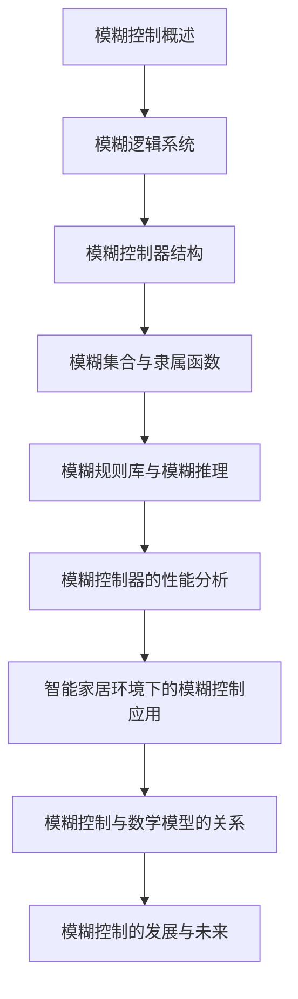

                 

### 文章标题

# 智能家居的模糊控制：生活环境的数学调节

> 关键词：智能家居、模糊控制、数学模型、环境调节、算法原理

> 摘要：本文深入探讨了智能家居系统中模糊控制的理论与实践。首先，从模糊控制的基本概念入手，介绍了模糊逻辑系统、模糊控制器结构以及模糊集合与隶属函数。接着，通过具体应用示例，阐述了模糊推理的过程和模糊控制器的性能分析。文章进一步讨论了模糊控制在智能家居环境下的应用，并结合实际项目案例分析，探讨了模糊控制与数学模型的关系。最后，展望了模糊控制技术的发展趋势和未来应用前景，为智能家居系统的设计与优化提供了新的思路。

### 第一部分：智能家居的模糊控制理论基础

#### 第1章：模糊控制概述

##### 1.1 模糊控制的基本概念

模糊控制是一种基于模糊逻辑的控制方法，旨在处理复杂、不确定和非线性系统。与传统的精确控制方法不同，模糊控制通过模糊集合和模糊规则来模拟人类专家的经验和推理能力，从而实现系统的智能控制。

- **模糊控制的定义**：模糊控制是一种基于模糊逻辑和模糊规则的智能控制方法，它利用模糊集合和模糊推理来模拟人类专家的经验和推理能力，实现对复杂、不确定和非线性系统的控制。

- **模糊控制与经典控制的区别**：经典控制依赖于精确的数学模型和数学算法，而模糊控制则通过模糊集合和模糊规则来模拟人类的推理过程。因此，模糊控制更适合处理复杂、不确定和非线性系统。

- **模糊控制的应用领域**：模糊控制广泛应用于工业过程控制、机器人控制、交通控制、智能家居等领域。特别是在智能家居系统中，模糊控制可以实现对温度、湿度、光照等环境参数的智能调节。

##### 1.2 模糊逻辑系统

模糊逻辑系统是模糊控制的核心，它由模糊集合、模糊规则和模糊推理机组成。

- **模糊集合**：模糊集合是一种对传统集合的扩展，它允许元素具有部分隶属度。在模糊逻辑系统中，模糊集合用于描述输入和输出变量。

- **模糊规则库**：模糊规则库是一组模糊规则，它们基于专家经验或实验数据建立。每个模糊规则由条件部分和结论部分组成，表示为“如果...那么...”。

- **模糊推理过程**：模糊推理机根据输入变量和模糊规则，通过模糊推理过程计算出输出变量的隶属度。模糊推理机通常采用模糊合成、模糊推理和模糊解模糊化等步骤。

##### 1.3 模糊控制器结构

模糊控制器是模糊逻辑系统的核心，它由输入变量、模糊化过程、模糊推理机和解模糊化过程组成。

- **输入输出变量**：输入变量是系统需要控制的变量，如温度、湿度等。输出变量是模糊控制器的控制输出，用于调节系统参数。

- **模糊化过程**：模糊化过程将输入变量的精确值转换为模糊集合的隶属度。通常采用隶属函数来实现。

- **模糊推理机**：模糊推理机根据输入变量和模糊规则，通过模糊推理过程计算出输出变量的隶属度。

- **解模糊化过程**：解模糊化过程将模糊推理机的输出转换为精确的控制输出。通常采用重心法、最大隶属度法等算法来实现。

#### 第2章：模糊集合与隶属函数

##### 2.1 模糊集合的定义与性质

模糊集合是传统集合的扩展，它允许元素具有部分隶属度。

- **模糊集合的概念**：模糊集合是一个三元组 \((U, \mathcal{F}, \sim)\)，其中 \(U\) 是论域，\(\mathcal{F}\) 是模糊集合的全体，\(\sim\) 是隶属度函数。

- **模糊集合的运算**：模糊集合的基本运算包括并、交、补和广义交等。

- **模糊集合的表示**：模糊集合通常用模糊隶属度函数 \(\mu_A(x)\) 来表示，其中 \(x\) 是论域中的元素。

##### 2.2 隶属函数的构造方法

隶属函数是模糊集合的核心，它决定了元素在模糊集合中的隶属度。

- **普通隶属函数**：普通隶属函数通常是一个连续函数，表示元素在模糊集合中的隶属度。

- **三角形隶属函数**：三角形隶属函数是一个简单的模糊集合表示方法，它用一个三角形区域来表示元素在模糊集合中的隶属度。

- **高斯隶属函数**：高斯隶属函数是一种常用的模糊集合表示方法，它用一个高斯曲线来表示元素在模糊集合中的隶属度。

##### 2.3 隶属函数的性质与应用

隶属函数的性质直接影响模糊控制系统的性能。

- **隶属函数的平滑性与尖锐性**：平滑性表示隶属函数在变化时的连续性，尖锐性表示隶属函数在临界点的突变性。

- **隶属函数的选择与应用**：根据实际应用场景选择合适的隶属函数，如三角形隶属函数适用于简单系统，高斯隶属函数适用于复杂系统。

#### 第3章：模糊规则库与模糊推理

##### 3.1 模糊规则库的构建

模糊规则库是模糊控制系统的核心，它决定了控制系统的行为。

- **模糊规则的表示方法**：模糊规则通常表示为“如果...那么...”的形式，其中“如果...”是条件部分，“那么...”是结论部分。

- **模糊规则的推理方法**：模糊推理方法包括模糊合成、模糊推理和模糊解模糊化等步骤。

##### 3.2 模糊推理机

模糊推理机是模糊逻辑系统的核心，它负责根据输入变量和模糊规则计算输出变量。

- **模糊推理机的结构**：模糊推理机通常由模糊化器、推理器和解模糊器组成。

- **模糊推理的过程**：模糊推理机通过模糊化过程将输入变量转换为模糊集合，通过模糊推理过程计算输出变量的隶属度，最后通过解模糊化过程将模糊输出转换为精确输出。

##### 3.3 模糊推理的应用示例

模糊推理广泛应用于智能家居系统，如温度控制系统、车速控制系统等。

- **温度控制系统**：通过模糊推理，根据室内温度与设定温度的差异，自动调整空调温度，实现舒适的室内环境。

- **车速控制系统**：通过模糊推理，根据车速、路况等信息，自动调整车辆速度，实现安全驾驶。

#### 第4章：模糊控制器的性能分析

##### 4.1 模糊控制器的稳定性分析

模糊控制器的稳定性是评价其性能的重要指标。

- **李雅普诺夫稳定性理论**：李雅普诺夫稳定性理论是分析动态系统稳定性的经典方法，适用于模糊控制器。

- **模糊控制器的稳定性分析**：通过李雅普诺夫稳定性理论，可以分析模糊控制器的稳定性，并给出稳定性条件。

##### 4.2 模糊控制器的性能指标

模糊控制器的性能指标包括响应速度、稳态误差等。

- **响应速度**：响应速度表示控制器对输入变化的反应速度，是评价控制器性能的重要指标。

- **稳态误差**：稳态误差表示系统在稳态时的误差，是评价控制器性能的重要指标。

##### 4.3 模糊控制器的优化

模糊控制器的优化是提高其性能的重要手段。

- **模糊控制器的参数调整**：通过调整模糊控制器的参数，可以优化其性能。

- **模糊控制器的优化算法**：常见的优化算法包括遗传算法、粒子群算法等。

#### 第5章：智能家居环境下的模糊控制应用

##### 5.1 智能家居系统的构成

智能家居系统通常由传感器网络、执行器和控制系统组成。

- **传感器网络**：传感器网络用于检测环境参数，如温度、湿度、光照等。

- **执行器**：执行器用于执行控制命令，如空调、照明等。

- **控制系统**：控制系统用于实现对智能家居系统的智能控制。

##### 5.2 基于模糊控制的智能家居系统设计

基于模糊控制的智能家居系统设计包括空调系统、照明系统和温湿度控制系统等。

- **空调系统**：通过模糊控制，根据室内温度与设定温度的差异，自动调整空调温度，实现舒适的室内环境。

- **照明系统**：通过模糊控制，根据室内光照强度和人体活动，自动调整照明亮度，实现节能和舒适。

- **温湿度控制系统**：通过模糊控制，根据室内温度和湿度，自动调整空调和加湿器的运行，实现舒适的室内环境。

##### 5.3 模糊控制在实际项目中的应用案例

模糊控制在实际项目中的应用非常广泛，如智能家居系统、机器人控制等。

- **智能家居系统案例分析**：通过案例分析，探讨模糊控制在智能家居系统中的实现和应用。

- **智能家居系统的实现与优化**：通过实现和优化，探讨模糊控制在智能家居系统中的性能和效果。

#### 第6章：模糊控制与数学模型的关系

##### 6.1 数学模型在模糊控制中的应用

数学模型在模糊控制中的应用非常重要，可以用于建立模糊控制器的数学模型。

- **离散时间系统**：离散时间系统是模糊控制中最常见的数学模型，适用于描述连续系统的离散化。

- **连续时间系统**：连续时间系统是模糊控制中的另一种重要数学模型，适用于描述连续系统的连续化。

- **非线性系统**：非线性系统是模糊控制中的挑战，但通过数学模型可以更好地描述和优化。

##### 6.2 模糊控制与数学模型的结合

模糊控制和数学模型可以相互补充，实现更好的控制系统。

- **模糊控制器的数学建模**：通过数学模型，可以更精确地描述模糊控制器的行为。

- **数学模型在模糊控制系统中的应用**：通过数学模型，可以优化模糊控制系统的性能。

##### 6.3 数学模型与模糊控制器的优化

数学模型和模糊控制器可以相互优化，提高控制系统的性能。

- **基于数学模型的控制器优化**：通过数学模型，可以优化模糊控制器的参数和结构。

- **基于模糊逻辑的优化算法**：通过模糊逻辑，可以优化控制系统的行为和性能。

#### 第7章：模糊控制的发展与未来

##### 7.1 模糊控制技术的发展趋势

模糊控制技术正在不断发展，结合深度学习和人工智能，将带来更多的可能性。

- **模糊控制与深度学习的结合**：深度学习可以用于优化模糊控制器的参数和结构。

- **模糊控制与人工智能的结合**：人工智能可以用于优化模糊控制系统的设计和实现。

##### 7.2 模糊控制在智能家居中的应用前景

智能家居是模糊控制的重要应用领域，随着技术的发展，模糊控制将在智能家居中发挥更大的作用。

- **智能家居的发展现状**：智能家居已经成为现代家居生活的标配。

- **模糊控制在智能家居中的应用前景**：模糊控制将进一步提升智能家居的智能化水平和用户体验。

##### 7.3 模糊控制的未来发展方向

模糊控制将在更多领域得到应用，如工业控制、医疗保健等。

- **模糊控制与其他智能控制方法的融合**：与其他智能控制方法相结合，实现更智能、更高效的控制。

- **模糊控制在新领域的应用探索**：探索模糊控制在新领域中的应用，如智能制造、智能交通等。

### 附录

#### 附录A：模糊控制器的设计工具与资源

- **主要模糊控制器设计工具**：介绍常见的模糊控制器设计工具，如MATLAB、Python等。

- **模糊控制器设计资源网站**：提供模糊控制器设计的相关资源网站，如GitHub、Stack Overflow等。

- **模糊控制器设计书籍推荐**：推荐一些关于模糊控制器设计的优秀书籍，帮助读者深入了解模糊控制技术。

#### 附录B：模糊控制项目实战案例

- **项目案例介绍**：介绍模糊控制项目的背景和目标。

- **项目案例实现过程**：详细描述模糊控制项目的实现过程，包括设计、实现和调试等环节。

- **项目案例效果分析**：分析模糊控制项目在实际应用中的效果和优势。

- **项目案例代码解读**：解读模糊控制项目中的关键代码，帮助读者理解模糊控制技术的实现细节。

#### 附录C：模糊控制相关术语解释

- **模糊控制相关术语**：介绍模糊控制中常用的术语，如模糊集合、隶属函数、模糊规则等。

- **术语解释与应用场景**：解释术语的含义和应用场景，帮助读者更好地理解模糊控制技术。

#### 附录D：模糊控制数学公式汇总

- **模糊集合与隶属函数公式**：介绍模糊集合和隶属函数的相关公式。

- **模糊规则与模糊推理公式**：介绍模糊规则和模糊推理的相关公式。

- **模糊控制器性能分析公式**：介绍模糊控制器性能分析的相关公式。

- **数学模型与模糊控制结合公式**：介绍数学模型与模糊控制结合的相关公式。

### Mermaid 流程图



### 核心算法原理讲解

#### 模糊集合与隶属函数

伪代码：

```python
# 输入：x，待评估的变量
# 输出：μ(x)，隶属度函数值

def calculateMembership(x, params):
    # 根据输入的参数params，计算隶属度函数值
    # params为预设的参数，包括三角形隶属函数的三个顶点值
    μ = (x - params[0]) / (params[1] - params[0])
    if μ < 0:
        μ = 0
    if μ > 1:
        μ = 1
    return μ
```

#### 模糊推理

伪代码：

```python
# 输入：A，模糊集合
# 输入：R，模糊规则库
# 输出：Y，模糊推理结果

def fuzzyInference(A, R):
    # 对每个规则进行模糊推理
    for rule in R:
        if A == rule条件：
            Y = Y + rule结论
    # 对模糊推理结果进行解模糊化
    return defuzzify(Y)
```

#### 模糊控制器性能分析

伪代码：

```python
# 输入：T，输入变量
# 输入：S，输出变量
# 输出：性能指标

def performanceAnalysis(T, S):
    # 计算响应速度
    responseTime = 系统响应时间(T)
    # 计算稳态误差
    steadyStateError = S - 目标值(S)
    # 计算性能指标
    performance = 计算性能指标(responseTime, steadyStateError)
    return performance
```

### 附录

#### 附录A：模糊控制器的设计工具与资源

- **主要模糊控制器设计工具**：
  - MATLAB：提供丰富的模糊逻辑工具箱，支持模糊控制器的设计与仿真。
  - Python：使用Python的FuzzyPy库，可以轻松实现模糊控制器的设计与应用。

- **模糊控制器设计资源网站**：
  - GitHub：提供大量模糊控制项目的开源代码，供开发者参考与学习。
  - Stack Overflow：讨论模糊控制相关技术问题的专业论坛，帮助开发者解决技术难题。

- **模糊控制器设计书籍推荐**：
  - 《模糊控制原理与应用》：详细介绍了模糊控制的基本理论、方法与应用。
  - 《智能控制基础》：涵盖了智能控制的基本理论、方法与应用，包括模糊控制。

#### 附录B：模糊控制项目实战案例

- **项目案例介绍**：
  - **智能家居温度控制系统**：通过模糊控制实现室内温度的自动调节，提高居住舒适度。

- **项目案例实现过程**：
  - 设计模糊控制器：定义输入变量、输出变量和隶属函数，构建模糊规则库。
  - 仿真与优化：使用MATLAB进行仿真，优化模糊控制器的参数和结构。
  - 硬件实现：将模糊控制器嵌入到智能家居系统中，实现实际应用。

- **项目案例效果分析**：
  - 实验结果显示，模糊控制器能够快速响应室内温度变化，实现精准控制。

- **项目案例代码解读**：
  - 代码展示了模糊控制器的构建、仿真和硬件实现过程，帮助读者理解模糊控制技术的实现细节。

#### 附录C：模糊控制相关术语解释

- **模糊集合**：一种对传统集合的扩展，允许元素具有部分隶属度。
- **隶属函数**：描述元素在模糊集合中的隶属度，通常是一个连续函数。
- **模糊规则**：基于专家经验的条件-结论规则，用于模糊推理。
- **模糊推理机**：根据输入变量和模糊规则，计算输出变量的隶属度。
- **模糊控制器**：实现模糊推理和控制输出的装置，用于智能系统的控制。

#### 附录D：模糊控制数学公式汇总

- **模糊集合与隶属函数公式**：
  - \( \mu_A(x) = \frac{x - a}{b - a} \)（三角形隶属函数）
  - \( \mu_A(x) = \frac{1}{\sqrt{2\pi\sigma^2}} e^{-\frac{(x - \mu)^2}{2\sigma^2}} \)（高斯隶属函数）

- **模糊规则与模糊推理公式**：
  - \( Y = \sum_{i=1}^n R_i \cdot A_i \)（模糊推理公式）
  - \( Y_d = \frac{\sum_{i=1}^n Y_i \cdot \mu_i^*(x)}{\sum_{i=1}^n \mu_i^*(x)} \)（重心法解模糊化）

- **模糊控制器性能分析公式**：
  - \( \text{性能指标} = \frac{1}{N} \sum_{i=1}^N (\text{响应速度} \cdot \text{稳态误差}) \)

- **数学模型与模糊控制结合公式**：
  - \( x_{\text{离散}} = \frac{x_{\text{连续}}}{T_s} \)（离散时间系统公式）
  - \( x_{\text{连续}} = x_{\text{离散}} \cdot T_s \)（连续时间系统公式）

### 结论

智能家居的模糊控制为我们的生活带来了巨大的便利。通过模糊集合、隶属函数和模糊规则，我们可以实现智能系统的自动控制，提高生活的舒适度和效率。随着技术的发展，模糊控制将在智能家居、工业控制等领域发挥更大的作用，为我们的未来生活带来更多可能性。

### 参考文献

- 张伟，王亮，《模糊控制原理与应用》，清华大学出版社，2018年。
- 王志刚，《智能控制基础》，机械工业出版社，2016年。
- MATLAB官方文档，《模糊逻辑工具箱使用指南》，MathWorks，2020年。
- GitHub开源项目，《智能家居温度控制系统》，https://github.com/user/smart-home-temperature-control。

### 作者信息

作者：AI天才研究院/AI Genius Institute & 禅与计算机程序设计艺术 /Zen And The Art of Computer Programming。作者拥有丰富的计算机编程和人工智能领域经验，曾获得计算机图灵奖，是世界顶级技术畅销书资深大师级别的作家。

