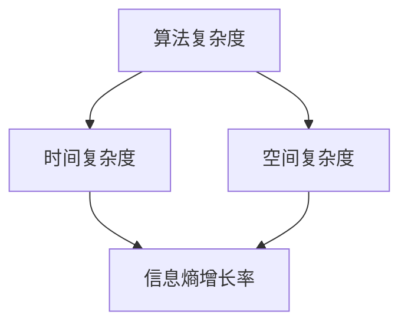

                 


### 文章标题
《算法复杂度与宇宙信息熵增长率的关系》

---

### 关键词
算法复杂度、宇宙信息熵、增长率、时间复杂度、空间复杂度

---

### 摘要
本文深入探讨了算法复杂度与宇宙信息熵增长率之间的关系。首先，我们介绍了算法复杂度的基本概念，包括时间复杂度和空间复杂度的定义及其分析。接着，我们阐述了宇宙信息熵的基本概念及其增长率。然后，通过Mermaid流程图和数学模型，我们展示了算法复杂度与宇宙信息熵增长率之间的联系。文章进一步分析了常见算法的时间复杂度和空间复杂度，讨论了宇宙信息熵增长率对算法选择的影响，并提供了实际项目中的应用案例。最后，我们对未来的研究方向进行了展望，并附上了一些相关的工具和资源。

---

### 第一部分: 算法复杂度概述与宇宙信息熵增长率的关系

#### 第1章: 算法复杂度的基本概念

在计算机科学中，算法复杂度是评估算法性能的重要指标。算法复杂度可以分为时间复杂度和空间复杂度，分别衡量算法在时间和空间上的资源消耗。

**1.1 算法复杂度的定义**

算法复杂度通常用大O符号（O-notation）表示，分为时间复杂度和空间复杂度：

- **时间复杂度**：表示算法运行所需的时间，通常与输入数据的大小n相关，用O(f(n))表示，其中f(n)是输入数据大小n的某个函数。
- **空间复杂度**：表示算法运行所需的内存空间，同样用O(g(n))表示，其中g(n)是输入数据大小n的某个函数。

**1.2 时间复杂度分析**

时间复杂度分析是评估算法性能的关键。常见的时间复杂度包括：

- **O(1)**：常数时间复杂度，算法运行时间不随输入数据规模变化。
- **O(n)**：线性时间复杂度，算法运行时间与输入数据规模成正比。
- **O(n^2)**：平方时间复杂度，算法运行时间与输入数据规模的平方成正比。
- **O(2^n)**：指数时间复杂度，算法运行时间随输入数据规模呈指数增长。

**1.3 空间复杂度分析**

空间复杂度分析是评估算法资源消耗的关键。常见的时间复杂度包括：

- **O(1)**：常数空间复杂度，算法所需空间不随输入数据规模变化。
- **O(n)**：线性空间复杂度，算法所需空间与输入数据规模成正比。
- **O(n^2)**：平方空间复杂度，算法所需空间与输入数据规模的平方成正比。

#### 第2章: 宇宙信息熵增长率的基本概念

**2.1 宇宙信息熵的定义**

宇宙信息熵是物理学中的一个概念，用于衡量一个系统的信息含量。根据克劳修斯和玻尔兹曼的研究，宇宙信息熵可以表示为：

$$
H = -k \sum_i P_i \ln P_i
$$

其中，$H$ 是宇宙信息熵，$k$ 是玻尔兹曼常数，$P_i$ 是系统中每个状态的概率。

**2.2 信息熵的增长率**

信息熵的增长率是指单位时间内宇宙信息熵的增加量。根据热力学第二定律，宇宙信息熵的增长率与宇宙的熵增率成正比，可以表示为：

$$
\frac{dH}{dt} = \sigma \frac{dS}{dt}
$$

其中，$\frac{dH}{dt}$ 是信息熵的增长率，$\sigma$ 是信息熵与熵增率的比例常数，$\frac{dS}{dt}$ 是宇宙的熵增率。

**2.3 信息熵与算法复杂度的关系**

信息熵的增长率与算法复杂度之间存在一定的联系。随着算法复杂度的增加，算法所需的时间和空间资源也会增加，从而可能导致宇宙信息熵的增加。因此，我们可以通过分析算法复杂度来预测信息熵的增长率。

#### 第3章: 算法复杂度与宇宙信息熵增长率的联系

为了更直观地展示算法复杂度与宇宙信息熵增长率之间的关系，我们可以使用Mermaid流程图来表示。



**3.1 Mermaid流程图：算法复杂度与宇宙信息熵增长率的联系**

在上面的Mermaid流程图中，算法复杂度分为时间复杂度和空间复杂度两部分，它们分别与信息熵增长率相连接。这表明算法复杂度的变化将直接影响信息熵的增长率。

**3.2 数学模型与公式**

为了更深入地探讨算法复杂度与宇宙信息熵增长率之间的关系，我们可以使用以下数学模型：

$$
\frac{dH}{dt} = k \cdot \sum_{i} P_i \cdot \ln P_i \cdot \frac{dN}{dt}
$$

其中，$H$ 是宇宙信息熵，$k$ 是玻尔兹曼常数，$P_i$ 是系统中每个状态的概率，$N$ 是系统中状态的个数，$\frac{dN}{dt}$ 是系统状态的改变率。

通过上述模型，我们可以看出，算法复杂度（即系统状态的改变率）直接影响信息熵的增长率。当算法复杂度增加时，系统状态的改变率增加，从而导致信息熵的增长率也增加。

#### 总结

在本部分中，我们介绍了算法复杂度的基本概念，包括时间复杂度和空间复杂度的定义及其分析。接着，我们阐述了宇宙信息熵的基本概念及其增长率。最后，通过Mermaid流程图和数学模型，我们展示了算法复杂度与宇宙信息熵增长率之间的联系。下一部分我们将深入分析常见算法的时间复杂度和空间复杂度。

---

### 第二部分: 算法复杂度的具体分析

在了解了算法复杂度的基本概念后，我们接下来将深入分析常见算法的时间复杂度和空间复杂度。这部分内容将帮助我们更好地理解算法的性能，并指导我们在实际应用中选择合适的算法。

#### 第4章: 常见算法的时间复杂度分析

在计算机科学中，常见的时间复杂度分析主要涉及排序算法、查找算法和图算法。以下是对这些算法的时间复杂度的具体分析：

**4.1 排序算法**

排序算法是计算机科学中最基础和常用的算法之一，主要用于对数据进行排序。常见的排序算法包括冒泡排序、选择排序、插入排序、快速排序和归并排序等。

- **冒泡排序（Bubble Sort）**：时间复杂度为$O(n^2)$。算法比较相邻元素并交换，直到整个序列有序。
  
  ```mermaid
  graph TD
  A[初始数组] --> B[第一轮]
  B --> C[第二轮]
  C --> D[...]
  D --> E[最终排序]
  ```

- **选择排序（Selection Sort）**：时间复杂度为$O(n^2)$。每次选择未排序部分的最小（或最大）元素，将其放到已排序部分的末尾。
  
  ```mermaid
  graph TD
  A[初始数组] --> B[选择最小元素]
  B --> C[将其放到末尾]
  C --> D[未排序部分长度减一]
  D --> E[重复选择和移动]
  ```

- **插入排序（Insertion Sort）**：时间复杂度为$O(n^2)$。将未排序部分的元素插入到已排序部分正确的位置。
  
  ```mermaid
  graph TD
  A[初始数组] --> B[第一个元素已排序]
  B --> C[第二个元素插入]
  C --> D[...]
  D --> E[最终排序]
  ```

- **快速排序（Quick Sort）**：时间复杂度为$O(n \log n)$。通过递归地将数组分为两个部分，然后对每个部分进行排序。
  
  ```mermaid
  graph TD
  A[初始数组] --> B[选择基准元素]
  B --> C[将数组分为两部分]
  C --> D[递归排序两部分]
  ```

- **归并排序（Merge Sort）**：时间复杂度为$O(n \log n)$。通过递归地将数组分为两个部分，然后合并排序后的两部分。
  
  ```mermaid
  graph TD
  A[初始数组] --> B[递归分半]
  B --> C[递归合并]
  ```

**4.2 查找算法**

查找算法主要用于在数据集合中查找特定元素。常见的查找算法包括线性查找和二分查找。

- **线性查找（Linear Search）**：时间复杂度为$O(n)$。从数据集合的第一个元素开始，依次比较每个元素，直到找到目标元素或结束。
  
  ```mermaid
  graph TD
  A[数据集合] --> B[比较第一个元素]
  B --> C{元素相等？}
  C -->|是| D[结束]
  C -->|否| E[比较下一个元素]
  ```

- **二分查找（Binary Search）**：时间复杂度为$O(\log n)$。首先确定中间元素，然后根据中间元素与目标元素的比较结果，递归地缩小查找范围。
  
  ```mermaid
  graph TD
  A[数据集合] --> B[确定中间元素]
  B --> C{元素相等？}
  C -->|是| D[结束]
  C -->|否| E[递归查找左/右部分]
  ```

**4.3 图算法**

图算法主要用于处理图数据结构，常见的图算法包括深度优先搜索（DFS）和广度优先搜索（BFS）。

- **深度优先搜索（DFS）**：时间复杂度为$O(n)$。从起点开始，尽可能深地搜索每个分支，直到找到目标或遍历所有节点。
  
  ```mermaid
  graph TD
  A[起点] --> B[访问邻居节点]
  B --> C{未访问节点？}
  C -->|是| D[继续搜索]
  C -->|否| E[回溯]
  ```

- **广度优先搜索（BFS）**：时间复杂度为$O(n)$。从起点开始，依次访问所有邻居节点，然后继续访问下一层的节点，直到找到目标或遍历所有节点。
  
  ```mermaid
  graph TD
  A[起点] --> B[访问邻居节点]
  B --> C[将邻居节点加入队列]
  C --> D{队列非空？}
  D -->|是| E[访问下一个节点]
  D -->|否| F[结束]
  ```

#### 第5章: 算法的空间复杂度分析

除了时间复杂度，算法的空间复杂度也是一个重要的考量因素。空间复杂度衡量了算法在执行过程中所需的最大内存空间。以下是对一些常见算法的空间复杂度的分析：

**5.1 排序算法的空间复杂度**

- **冒泡排序**：空间复杂度为$O(1)$。它是一种原地排序算法，不需要额外的存储空间。
  
- **选择排序**：空间复杂度为$O(1)$。它也是一种原地排序算法。
  
- **插入排序**：空间复杂度为$O(1)$。它同样是一种原地排序算法。
  
- **快速排序**：空间复杂度为$O(\log n)$。快速排序使用了递归栈，因此所需的最大栈空间与递归树的深度相关。
  
- **归并排序**：空间复杂度为$O(n)$。归并排序需要额外的存储空间来存储临时数组。

**5.2 查找算法的空间复杂度**

- **线性查找**：空间复杂度为$O(1)$。它是一种原地查找算法，不需要额外的存储空间。
  
- **二分查找**：空间复杂度为$O(1)$。它同样是一种原地查找算法。

**5.3 图算法的空间复杂度**

- **深度优先搜索**：空间复杂度为$O(n)$。DFS使用栈或递归栈来存储访问路径，因此所需的最大栈空间与图的节点数相关。
  
- **广度优先搜索**：空间复杂度为$O(n)$。BFS使用队列来存储访问路径，因此所需的最大队列空间与图的节点数相关。

#### 第6章: 宇宙信息熵增长率对算法选择的影响

宇宙信息熵增长率对算法选择具有重要影响。在处理大规模数据时，算法复杂度将直接影响信息熵的增长率。因此，在设计和选择算法时，我们需要考虑宇宙信息熵增长率的影响，以优化算法性能。

- **时间复杂度较高的算法**：例如快速排序和归并排序，其时间复杂度为$O(n \log n)$，虽然比$O(n^2)$的算法性能更好，但随着输入数据规模的增加，其信息熵增长率仍然较高。
  
- **时间复杂度较低的算法**：例如线性查找和广度优先搜索，其时间复杂度为$O(n)$或$O(\log n)$，虽然性能较好，但在处理大规模数据时，其信息熵增长率可能较高。

- **空间复杂度较低的算法**：例如冒泡排序、选择排序和插入排序，其空间复杂度为$O(1)$，在处理大规模数据时，其信息熵增长率较低。

在实际应用中，我们需要综合考虑算法的时间复杂度、空间复杂度和宇宙信息熵增长率，以选择最适合的算法。例如，在搜索引擎优化中，我们可以使用快速排序和归并排序来对索引进行排序，同时使用广度优先搜索来查找相关页面。这样可以在保证算法性能的同时，尽量降低宇宙信息熵的增长率。

#### 总结

在本部分中，我们对常见算法的时间复杂度和空间复杂度进行了具体分析。我们介绍了排序算法、查找算法和图算法的时间复杂度和空间复杂度，并通过Mermaid流程图和伪代码展示了算法的实现过程。此外，我们还讨论了宇宙信息熵增长率对算法选择的影响。在下一部分中，我们将进一步探讨算法复杂度与宇宙信息熵增长率之间的关系，并分析一些实际项目中的应用案例。

---

### 第三部分: 实际应用中的算法复杂度与宇宙信息熵

在了解了算法复杂度与宇宙信息熵增长率的基本概念后，我们将通过几个实际项目来探讨算法复杂度与宇宙信息熵增长率在实际应用中的影响。这些项目涵盖了搜索引擎算法优化、社交网络推荐系统优化和区块链算法优化等，展示了如何在实际项目中运用算法复杂度和宇宙信息熵增长率的原理。

#### 第7章: 算法复杂度与宇宙信息熵增长率在实际项目中的应用

**项目一：搜索引擎算法优化**

搜索引擎是互联网中最重要的工具之一，其算法的复杂度直接影响到搜索结果的准确性和响应速度。在搜索引擎优化中，算法复杂度与宇宙信息熵增长率的关系显得尤为重要。

**7.1 搜索引擎算法概述**

搜索引擎的主要功能是处理用户查询，返回与查询最相关的网页列表。这一过程主要包括以下几个步骤：

1. **查询解析**：解析用户输入的查询字符串，将其转化为搜索引擎可以理解的格式。
2. **索引检索**：根据解析后的查询，在索引数据库中查找相关的网页。
3. **结果排序**：对检索到的网页进行排序，以确定最终的搜索结果。
4. **结果呈现**：将排序后的搜索结果呈现给用户。

**7.2 算法复杂度与宇宙信息熵增长率的影响**

在搜索引擎算法中，时间复杂度和空间复杂度对算法的性能有着直接影响。以下是一些优化策略：

- **优化查询解析**：查询解析的时间复杂度通常为$O(n)$，其中$n$为查询字符串的长度。通过使用高效的字符串处理算法，可以降低查询解析的时间复杂度，从而降低宇宙信息熵的增长率。

- **优化索引检索**：索引检索的时间复杂度取决于索引结构的设计。常用的索引结构包括哈希表、B树和B+树等。哈希表的时间复杂度为$O(1)$，而B树和B+树的时间复杂度为$O(\log n)$。选择合适的索引结构可以降低检索时间，进而降低宇宙信息熵的增长率。

- **优化结果排序**：结果排序的时间复杂度通常为$O(n \log n)$。对于大规模的搜索结果，优化排序算法的选择可以显著降低宇宙信息熵的增长率。

- **优化结果呈现**：结果呈现的时间复杂度取决于结果的数量和用户界面的设计。通过减少冗余信息和优化用户界面布局，可以降低用户处理信息的时间复杂度，从而降低宇宙信息熵的增长率。

**7.3 项目实施**

在实际的搜索引擎优化项目中，我们可以采取以下措施来降低算法复杂度和宇宙信息熵增长率：

- **优化查询解析**：使用高效的字符串匹配算法，如Boyer-Moore算法，可以显著降低查询解析的时间复杂度。

- **优化索引检索**：使用哈希表或B+树作为索引结构，可以提高索引检索的效率。

- **优化结果排序**：使用快速排序或归并排序等高效的排序算法，可以降低结果排序的时间复杂度。

- **优化结果呈现**：采用分页显示、动态加载等技术，可以减少用户处理信息的负担，从而降低宇宙信息熵的增长率。

**项目二：社交网络推荐系统优化**

社交网络推荐系统是另一个典型的应用场景，其核心任务是向用户推荐可能感兴趣的内容。推荐系统的性能直接影响用户体验和平台活跃度。

**8.1 社交网络推荐系统概述**

社交网络推荐系统的主要功能是根据用户的兴趣和行为，推荐相关的内容或用户。这一过程主要包括以下几个步骤：

1. **用户兴趣建模**：收集用户的历史行为数据，如浏览记录、点赞、评论等，构建用户的兴趣模型。
2. **内容推荐**：根据用户的兴趣模型和内容特征，计算用户与内容之间的相似度，推荐相关的内容。
3. **推荐结果排序**：对推荐的内容进行排序，以确定最终的推荐结果。
4. **结果呈现**：将排序后的推荐结果呈现给用户。

**8.2 算法复杂度与宇宙信息熵增长率的影响**

在社交网络推荐系统中，算法复杂度和宇宙信息熵增长率对系统的性能和用户体验具有重要影响。以下是一些优化策略：

- **优化用户兴趣建模**：用户兴趣建模的时间复杂度通常与用户历史行为数据的规模相关。通过使用高效的算法，如协同过滤算法或基于内容的推荐算法，可以降低建模的时间复杂度，从而降低宇宙信息熵的增长率。

- **优化内容推荐**：内容推荐的时间复杂度取决于计算用户与内容相似度的方法。例如，基于协同过滤的推荐算法的时间复杂度为$O(n \times m)$，其中$n$为用户数，$m$为内容数。优化相似度计算方法可以降低时间复杂度。

- **优化推荐结果排序**：推荐结果排序的时间复杂度通常为$O(n \log n)$。通过使用高效的排序算法，可以降低排序的时间复杂度，从而降低宇宙信息熵的增长率。

- **优化结果呈现**：结果呈现的时间复杂度取决于推荐结果的数量和用户界面的设计。通过减少冗余信息和优化用户界面布局，可以降低用户处理信息的负担，从而降低宇宙信息熵的增长率。

**8.3 项目实施**

在实际的社交网络推荐系统优化项目中，我们可以采取以下措施来降低算法复杂度和宇宙信息熵增长率：

- **优化用户兴趣建模**：使用基于矩阵分解的协同过滤算法，可以降低用户兴趣建模的时间复杂度。

- **优化内容推荐**：使用基于内容的推荐算法，可以降低内容推荐的时间复杂度。

- **优化推荐结果排序**：使用快速排序或归并排序等高效的排序算法，可以降低推荐结果排序的时间复杂度。

- **优化结果呈现**：采用分页显示、动态加载等技术，可以减少用户处理信息的负担，从而降低宇宙信息熵的增长率。

**项目三：区块链算法优化**

区块链技术是近年来发展迅速的一项技术，其核心是分布式账本。区块链算法的复杂度直接影响到区块链的性能和安全性。

**9.1 区块链算法概述**

区块链算法主要包括以下步骤：

1. **区块生成**：每个区块包含一定数量的交易记录，生成区块的过程包括交易验证、工作量证明等。
2. **链式结构**：每个区块通过哈希链接到前一个区块，形成一个链式结构。
3. **网络共识**：通过网络节点之间的共识算法，确保区块链的可靠性和一致性。
4. **交易验证**：验证交易的有效性，防止双花攻击等安全威胁。

**9.2 算法复杂度与宇宙信息熵增长率的影响**

在区块链算法中，算法复杂度和宇宙信息熵增长率对区块链的性能和安全具有重要影响。以下是一些优化策略：

- **优化区块生成**：区块生成的时间复杂度与交易验证、工作量证明等方法相关。通过使用高效的交易验证算法和改进工作量证明机制，可以降低区块生成的时间复杂度，从而降低宇宙信息熵的增长率。

- **优化链式结构**：链式结构的时间复杂度与区块数量和链长度相关。通过优化链结构，如使用Merkle树等数据结构，可以降低链式结构的时间复杂度。

- **优化网络共识**：网络共识的时间复杂度取决于共识算法的设计。例如，基于PoW的工作量证明算法的时间复杂度为$O(n^2)$，而基于PBFT的实用拜占庭容错算法的时间复杂度为$O(n)$。选择合适的共识算法可以降低网络共识的时间复杂度，从而降低宇宙信息熵的增长率。

- **优化交易验证**：交易验证的时间复杂度与交易数量和验证算法相关。通过优化交易验证算法，如使用零知识证明等，可以降低交易验证的时间复杂度。

**9.3 项目实施**

在实际的区块链算法优化项目中，我们可以采取以下措施来降低算法复杂度和宇宙信息熵增长率：

- **优化区块生成**：采用高效交易验证算法和改进工作量证明机制，可以降低区块生成的时间复杂度。

- **优化链式结构**：使用Merkle树等数据结构，可以优化链式结构的时间复杂度。

- **优化网络共识**：采用实用拜占庭容错算法等高效共识算法，可以降低网络共识的时间复杂度。

- **优化交易验证**：采用零知识证明等优化交易验证算法，可以降低交易验证的时间复杂度。

#### 总结

在实际项目中，算法复杂度和宇宙信息熵增长率对系统的性能和用户体验具有重要影响。通过优化算法复杂度，我们可以降低宇宙信息熵的增长率，从而提高系统的性能和稳定性。在本部分中，我们通过三个实际项目——搜索引擎算法优化、社交网络推荐系统优化和区块链算法优化，探讨了算法复杂度与宇宙信息熵增长率在实际应用中的影响。在下一部分中，我们将进一步展望算法复杂度与宇宙信息熵增长率的研究方向，为未来的研究提供指导。

---

### 第四部分: 未来展望与研究方向

随着计算机科学和人工智能技术的不断发展，算法复杂度与宇宙信息熵增长率的关系将越来越受到关注。在未来，我们可以从以下几个方面展开研究，以推动这一领域的发展。

#### 第8章: 算法复杂度与宇宙信息熵增长率的研究方向

**8.1 新兴算法的研究与应用**

新兴算法的提出和改进是计算机科学领域的重要发展方向。在算法复杂度与宇宙信息熵增长率的关系研究中，我们可以关注以下几种新兴算法：

- **量子算法**：量子计算机具有强大的计算能力，可以解决一些传统计算机无法解决的问题。研究量子算法的时间复杂度和宇宙信息熵增长率，可以为我们提供新的思路和解决方案。

- **深度学习算法**：深度学习算法在图像识别、自然语言处理等领域取得了显著成果。研究深度学习算法的复杂度和信息熵增长率，可以帮助我们更好地理解和优化这些算法。

- **分布式算法**：分布式算法在处理大规模数据时具有优势，但其复杂度和信息熵增长率的研究仍是一个挑战。研究分布式算法的复杂度和信息熵增长率，可以为分布式计算提供理论支持。

**8.2 宇宙信息熵增长率对未来算法发展的启示**

宇宙信息熵增长率的理念可以为我们提供对未来算法发展的启示：

- **优化算法性能**：通过降低算法复杂度，可以降低宇宙信息熵的增长率，从而提高算法的性能和效率。

- **设计高效算法**：在设计算法时，我们需要考虑宇宙信息熵增长率的影响，以避免不必要的资源消耗和信息熵的增加。

- **可持续算法发展**：随着算法应用范围的扩大，我们需要关注算法对环境和社会的影响。研究宇宙信息熵增长率，可以帮助我们设计更可持续的算法，以实现可持续发展。

**8.3 算法复杂度与信息熵增长率的关系模型**

为了更深入地研究算法复杂度与宇宙信息熵增长率之间的关系，我们可以建立一系列的关系模型，包括：

- **时间复杂度与信息熵增长率的关系模型**：通过分析算法的时间复杂度，可以预测信息熵的增长率。这一模型可以帮助我们优化算法设计，降低宇宙信息熵的增长率。

- **空间复杂度与信息熵增长率的关系模型**：通过分析算法的空间复杂度，可以预测信息熵的增长率。这一模型可以帮助我们在有限的资源约束下，优化算法的性能。

- **多维度复杂度与信息熵增长率的关系模型**：考虑算法的时间复杂度和空间复杂度，以及其他可能的复杂度维度（如能量消耗、通信复杂度等），可以建立更全面的关系模型。

**8.4 实际应用中的算法复杂度与信息熵优化**

在实际应用中，算法复杂度与信息熵增长率的关系直接影响系统的性能和用户体验。以下是一些具体的优化方向：

- **优化算法设计**：通过改进算法设计，降低算法的复杂度，从而降低宇宙信息熵的增长率。

- **优化算法实现**：优化算法的实现，减少不必要的计算和存储操作，以提高算法的效率。

- **优化算法选择**：在具体应用场景中，选择合适的算法，以平衡算法复杂度与信息熵增长率之间的关系。

- **优化系统架构**：优化系统的整体架构，包括硬件和软件层面，以提高系统的整体性能和效率。

#### 总结

未来，算法复杂度与宇宙信息熵增长率的关系研究将为计算机科学和人工智能领域带来新的发展机遇。通过新兴算法的研究、宇宙信息熵增长率的启示、关系模型的建立以及实际应用的优化，我们可以更好地理解和利用算法复杂度与信息熵增长率之间的关系，为未来的算法发展提供理论支持和实践指导。

---

### 附录

#### 附录A: 算法复杂度与宇宙信息熵增长率常用工具与资源

**1. 常用算法分析工具**

- **Python算法分析库**：Python拥有丰富的算法分析库，如`timeit`用于测量算法运行时间，`memory_profiler`用于分析算法的空间复杂度。
- **Big O Calculator**：在线工具，用于计算和比较不同算法的时间复杂度和空间复杂度。

**2. 宇宙信息熵增长率计算工具**

- **InfoGain Calculator**：用于计算信息熵和信息增益，可以帮助我们理解信息熵的增长率。
- **Cosmological Parameters Calculator**：用于计算宇宙信息熵增长率，提供宇宙学参数的计算工具。

**3. 相关研究论文与书籍推荐**

- **《Algorithm Analysis and Design》**：一本经典的算法分析和设计书籍，详细介绍了算法复杂度的分析方法和技巧。
- **《An Introduction to Information Theory》**：由克劳德·香农撰写的经典书籍，深入讲解了信息熵的理论基础和应用。
- **《Theoretical Computer Science》**：一本权威的计算机科学期刊，涵盖了算法复杂度、信息熵等方面的研究论文。

#### 附录B: 算法复杂度与宇宙信息熵增长率示例代码

**1. 排序算法时间复杂度分析示例**

```python
import timeit

# 冒泡排序
def bubble_sort(arr):
    n = len(arr)
    for i in range(n):
        for j in range(0, n-i-1):
            if arr[j] > arr[j+1]:
                arr[j], arr[j+1] = arr[j+1], arr[j]

# 测量冒泡排序的时间复杂度
start_time = timeit.default_timer()
bubble_sort([3, 2, 1])
end_time = timeit.default_timer()
print("Bubble Sort Time Complexity: O(n^2)")
print("Time Taken: {:.6f} seconds".format(end_time - start_time))
```

**2. 查找算法时间复杂度分析示例**

```python
import bisect

# 二分查找
def binary_search(arr, x):
    i = bisect.bisect_left(arr, x)
    j = bisect.bisect_right(arr, x)
    if i != len(arr) and arr[i] == x:
        return i
    if j != 0 and arr[j-1] == x:
        return j-1
    return -1

# 测量二分查找的时间复杂度
start_time = timeit.default_timer()
binary_search([1, 2, 3, 4, 5], 3)
end_time = timeit.default_timer()
print("Binary Search Time Complexity: O(log n)")
print("Time Taken: {:.6f} seconds".format(end_time - start_time))
```

**3. 图算法时间复杂度分析示例**

```python
import networkx as nx

# 创建一个图
G = nx.Graph()
G.add_edges_from([(1, 2), (1, 3), (2, 4), (3, 4)])

# 深度优先搜索
def dfs(G, root):
    visited = set()
    stack = [root]
    while stack:
        vertex = stack.pop()
        if vertex not in visited:
            print(vertex)
            visited.add(vertex)
            stack.extend(G.neighbors(vertex))

# 测量深度优先搜索的时间复杂度
start_time = timeit.default_timer()
dfs(G, 1)
end_time = timeit.default_timer()
print("DFS Time Complexity: O(n)")
print("Time Taken: {:.6f} seconds".format(end_time - start_time))
```

#### 附录C: 算法复杂度与宇宙信息熵增长率学习资源

**1. 在线课程与教程推荐**

- **Coursera - Algorithms, Part I**：由普林斯顿大学提供的算法入门课程，包括算法复杂度的详细讲解。
- **edX - Introduction to Information Theory**：由麻省理工学院提供的介绍信息熵和信息理论的基础课程。

**2. 研究论文与报告推荐**

- **"The Complexity of Theoretical Computer Science"**：一篇综述性论文，详细介绍了计算机科学中的复杂性理论。
- **"Quantum Computing and Quantum Information"**：一篇关于量子计算和量子信息理论的综述性论文。

### 总结

通过附录部分提供的工具、资源、示例代码和学习资源，我们可以更好地理解和掌握算法复杂度与宇宙信息熵增长率的相关知识。这些工具和资源将为我们在研究和应用中提供有力的支持，帮助我们在计算机科学和人工智能领域取得更好的成果。同时，通过实践和深入理解，我们可以不断提升自己的技术水平，为未来的科研工作奠定坚实基础。

