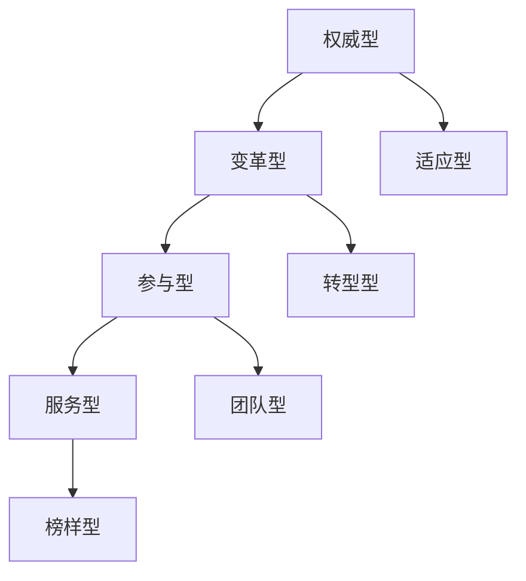
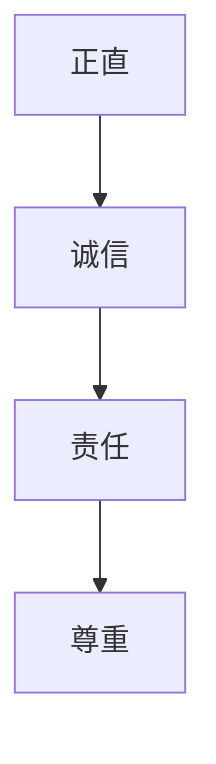
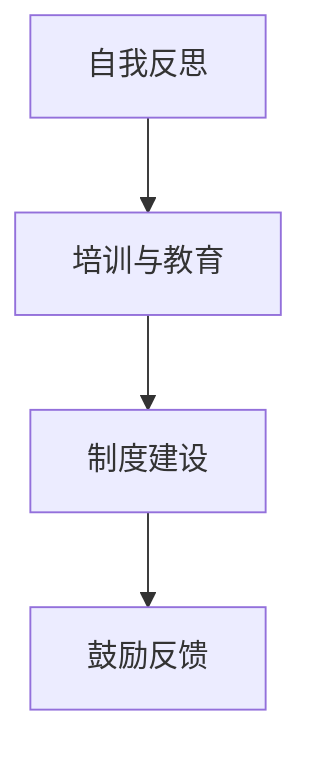

                 

### 文章标题

# 领导力与职业道德：树立正直形象

> 关键词：领导力、职业道德、正直、领导特质、组织文化、道德决策

> 摘要：本文深入探讨了领导力与职业道德的关系，分析了正直形象对领导者的重要影响。文章首先定义了领导力的本质和特质，阐述了职业道德的基本概念及其重要性。接着，文章强调了正直领导力的定义、影响和培养方法。通过实际案例和策略，本文探讨了如何在实际工作中实践正直行动、建立诚信和提升透明度。最后，文章从组织管理和全球化视角分析了正直领导力的应用，提供了具体的实践指南。

---

### 目录大纲

#### 第一部分：领导力与职业道德基础

1. **第1章：领导力的定义与特质**
   1.1 领导力的本质
   1.2 领导力的特质
   1.3 领导力的类型

2. **第2章：职业道德的基本概念**
   2.1 职业道德的定义
   2.2 职业道德的重要性
   2.3 职业道德的核心价值观

3. **第3章：正直领导力的重要性**
   3.1 正直领导力的定义
   3.2 正直领导力的影响
   3.3 正直领导力的培养

#### 第二部分：职业道德实践

4. **第4章：正直行动**
   4.1 正直决策
   4.2 正直沟通
   4.3 正直处理冲突

5. **第5章：诚信建设**
   5.1 诚信的定义与内涵
   5.2 诚信在职场中的应用
   5.3 建立诚信职场文化

6. **第6章：透明度与责任**
   6.1 透明度的价值
   6.2 提高透明度的策略
   6.3 责任意识的重要性

7. **第7章：道德困境与决策**
   7.1 道德困境的类型
   7.2 应对道德困境的策略
   7.3 领导者的道德示范作用

#### 第三部分：正直领导力的应用

8. **第8章：正直领导力在组织管理中的应用**
   8.1 领导力与组织文化
   8.2 正直领导力在团队建设中的应用
   8.3 正直领导力在绩效管理中的应用

9. **第9章：正直领导力与组织变革**
   9.1 变革中的正直领导力
   9.2 正直领导力在战略规划中的应用
   9.3 正直领导力在组织发展中的应用

10. **第10章：正直领导力的全球化视角**
    10.1 全球化背景下的职业道德挑战
    10.2 不同文化下的职业道德差异
    10.3 全球化组织中的正直领导力实践

#### 附录

11. **附录A：职业道德案例分析**
    11.1 案例一：正直领导力在企业管理中的应用
    11.2 案例二：诚信危机对公司的影响
    11.3 案例三：道德困境中的领导决策
    11.4 案例四：全球化背景下的职业道德实践

---

### 引言

在当今快节奏、竞争激烈的商业环境中，领导力和职业道德已成为决定企业成功与否的关键因素。作为领导者，不仅要在业务和技术上表现出色，更要具备高尚的职业道德，树立正直形象。领导力与职业道德之间有着密不可分的关系，它们共同构建了一个组织的文化基础，直接影响着团队成员的行为、决策和整体绩效。

领导力是一种影响和激励他人达成目标的能力，而职业道德则是在职业生涯中遵守的道德规范和价值观。正直领导力强调领导者要以身作则，坚持诚实、公正和透明，这对建立信任、增强团队凝聚力和推动组织发展至关重要。本文将深入探讨领导力与职业道德的关系，分析正直领导力的定义、影响和培养方法，并提供实际案例和实践指南，帮助领导者树立正直形象，实现组织目标。

### 第一部分：领导力与职业道德基础

#### 第1章：领导力的定义与特质

领导力是一种复杂而又多面的概念，它涉及到领导者如何影响、激励和引导他人共同达成目标。在组织中，领导力不仅是领导者个人的特质，更是整个团队和组织文化的一部分。要理解领导力，我们首先需要从其定义和特质入手。

**1.1 领导力的本质**

领导力的本质在于其影响力和能力，这种影响力不是基于权力或职位，而是基于信任、尊重和认可。领导力不仅仅是一种职位，更是一种责任和角色。一个好的领导者应该具备以下特点：

- **愿景**：能够清晰描述组织的未来方向，为团队提供共同的目标和方向。
- **激励**：能够激发团队成员的内在动力，使他们在实现目标的过程中保持积极的态度。
- **沟通**：能够有效地传达信息，确保团队成员理解并支持组织的愿景。
- **决策**：能够在复杂和不确定的情况下做出明智的决策，并对决策结果承担责任。

**1.2 领导力的特质**

领导力特质是领导者个人素质的体现，这些特质不仅影响领导者的行为，也影响团队成员的行为。以下是几个关键的领导力特质：

- **自信**：领导者应该对自己的决策和愿景有信心，同时也要展现出对团队成员的信任。
- **同理心**：领导者需要理解并关心团队成员的需求和情感，这有助于建立信任和团队合作。
- **决策能力**：在复杂和不确定的环境中，领导者需要具备快速做出明智决策的能力。
- **适应性**：领导力需要根据不同的情境和团队成员的特点进行调整，以实现最佳效果。
- **道德准则**：正直和道德是领导力的核心，领导者应该以身作则，树立良好的道德榜样。

**1.3 领导力的类型**

领导力有多种类型，每种类型都有其独特的特点和适用场景。以下是几种常见的领导力类型：

- **权威型领导**：通过权威和命令来指导团队成员，适用于紧急情况和需要快速决策的场合。
- **变革型领导**：通过激发团队成员的内在动机，推动团队实现变革和创新，适用于需要转型和创新的组织。
- **参与型领导**：通过鼓励团队成员参与决策过程，增强团队凝聚力和归属感，适用于需要团队合作和共识的场合。
- **服务型领导**：以服务团队成员为中心，关注团队成员的需求和成长，适用于注重人际关系和团队建设的组织。

**Mermaid 流程图：领导力类型关系架构**

通过以上分析，我们可以看出领导力是一个多维度的概念，涉及多个核心特质和类型。了解并培养这些特质和类型，对于领导者来说至关重要，因为它们不仅影响个人职业生涯的成功，也直接影响组织的绩效和发展。

#### 第2章：职业道德的基本概念

职业道德是指在职业生涯中遵循的一系列道德规范和价值观。它不仅涉及到个人行为，还包括对组织、客户、合作伙伴以及社会负责任的准则。在高度竞争和复杂多变的商业环境中，职业道德的重要性愈发突出。职业道德的基本概念包括其定义、重要性以及核心价值观。

**2.1 职业道德的定义**

职业道德是指职业人士在其工作岗位上应遵循的道德规范和价值观。它不仅包括遵守法律和公司政策，还涉及对客户、同事和社会的尊重和负责任。职业道德的定义可以概括为以下几点：

- **责任**：职业人士应对其工作结果负责，并在决策过程中考虑到所有相关方的利益。
- **诚实**：职业人士应保持诚实，不隐瞒或歪曲事实，确保信息的准确和透明。
- **公正**：职业人士应公平对待所有团队成员，不偏袒或歧视任何人。
- **尊重**：职业人士应尊重他人的意见、文化和隐私，建立和谐的工作环境。

**2.2 职业道德的重要性**

职业道德在组织中起着至关重要的作用，它不仅影响个人的职业发展，也直接影响组织的声誉和绩效。以下是职业道德的重要性：

- **建立信任**：职业道德有助于建立团队成员之间的信任，这是高效团队合作的基础。
- **提高绩效**：职业道德规范可以激发团队成员的积极性和责任感，从而提高整体绩效。
- **减少风险**：遵守职业道德可以降低法律风险、财务风险和声誉风险，保护组织的长远利益。
- **塑造企业文化**：职业道德是企业文化的重要组成部分，它有助于塑造积极、健康的工作环境。

**2.3 职业道德的核心价值观**

职业道德的核心价值观是指导职业人士行为的根本原则。以下是几个核心价值观：

- **正直**：正直是职业道德的核心，要求职业人士在行为和决策中保持诚实和公正。
- **诚信**：诚信意味着遵守承诺，保持诚实和透明，这是职业道德的基石。
- **责任**：责任要求职业人士对其行为和工作结果负责，确保对组织和社会负责。
- **尊重**：尊重他人是建立和谐工作环境的关键，要求职业人士尊重他人的意见和价值观。

**Mermaid 流程图：职业道德核心价值观关系架构**

通过以上分析，我们可以看出职业道德不仅是一种个人行为准则，更是组织文化的重要组成部分。它不仅有助于建立信任和减少风险，还直接影响到组织的绩效和发展。作为职业人士，理解和践行职业道德是职业成功的基石。

#### 第3章：正直领导力的重要性

正直领导力是领导力的核心要素之一，它强调领导者要以正直、诚实和公正为基础，通过自身的行为和决策来影响和激励团队成员。正直领导力不仅有助于建立信任和增强团队凝聚力，还对组织的长期发展具有深远影响。

**3.1 正直领导力的定义**

正直领导力是指领导者在其职业行为和决策过程中始终遵循诚实、公正和透明的原则，以身作则，树立正直形象。正直领导力不仅仅是一种道德标准，更是领导者领导能力的重要组成部分。以下是正直领导力的几个关键要素：

- **诚实**：领导者应保持言行一致，不隐瞒或歪曲事实，确保信息的透明和准确。
- **公正**：领导者应公平对待团队成员，不偏袒或歧视任何人，确保团队中的每个人都受到公正对待。
- **透明**：领导者应确保决策过程的透明性，让团队成员了解决策的原因和结果，增强团队的信任和参与感。
- **以身作则**：领导者应以身作则，通过自身的行为树立榜样，引导团队成员树立正直的价值观。

**3.2 正直领导力的影响**

正直领导力对组织和个人都有深远的影响。以下是正直领导力的一些主要影响：

- **建立信任**：正直领导力有助于建立团队成员之间的信任，这是高效团队合作的基础。当团队成员信任领导者时，他们更愿意开放沟通，分享自己的想法和意见，从而提高团队的整体绩效。
- **增强团队凝聚力**：正直领导力可以增强团队的凝聚力，使团队成员感受到彼此之间的尊重和信任。这种凝聚力有助于减少内部冲突，提高团队协作效率。
- **提高员工满意度**：正直领导力有助于提高员工的满意度和忠诚度，使员工更有动力和热情投入到工作中。这不仅可以降低员工流失率，还可以提高员工的创造力和创新能力。
- **塑造组织文化**：正直领导力是组织文化的重要组成部分，它有助于塑造一个积极、健康和可持续的组织文化。这种文化可以吸引和留住优秀人才，增强组织的竞争力。

**3.3 正直领导力的培养方法**

要培养正直领导力，领导者可以从以下几个方面入手：

- **自我反思**：领导者应定期进行自我反思，审视自己的行为和决策是否符合正直原则。通过自我反思，领导者可以及时发现并纠正不当行为，树立更好的榜样。
- **培训与教育**：组织应提供职业道德和正直领导力的培训和教育，帮助领导者理解和实践正直领导力。这些培训可以包括案例分析、角色扮演和模拟训练等。
- **制度建设**：组织应建立明确的道德准则和行为规范，确保领导者的行为和决策符合职业道德要求。这些制度可以包括道德委员会、举报机制和内部审计等。
- **鼓励反馈**：领导者应鼓励团队成员提供反馈，了解自己的行为和决策如何影响团队成员。通过积极倾听和采纳反馈，领导者可以不断改进自己的领导方式。

**Mermaid 流程图：正直领导力培养方法关系架构**

通过以上方法，领导者可以逐步培养和提升自己的正直领导力，为组织的发展和成功奠定坚实基础。正直领导力不仅有助于个人职业成长，更对组织的长期发展产生深远影响。作为领导者，树立正直形象，践行正直领导力是责任和使命。

### 第二部分：职业道德实践

#### 第4章：正直行动

正直行动是职业道德的核心体现，领导者通过其行为和决策来树立正直形象，对团队成员产生深远影响。以下是正直行动的具体实践，包括正直决策、正直沟通和正直处理冲突。

**4.1 正直决策**

正直决策是领导者职业道德的重要组成部分。一个正直的领导者会在决策过程中遵循以下几个原则：

- **透明**：领导者应确保决策过程的透明性，让团队成员了解决策的原因、过程和结果。这样可以增强团队成员的信任和参与感，减少误解和不满。
- **公正**：领导者应公平对待所有团队成员，不偏袒或歧视任何人。在决策过程中，领导者应充分考虑团队成员的意见和建议，确保决策结果公正合理。
- **诚实**：领导者应保持诚实，不隐瞒或歪曲事实。在决策过程中，领导者应提供准确和全面的信息，确保团队成员能够基于真实的信息做出判断。

**案例：正直决策的实际应用**

某公司面临一项重要决策，是否继续投资一个高风险但潜在收益巨大的项目。领导者通过以下步骤确保决策的透明、公正和诚实：

1. **收集信息**：领导者组织了多次会议，邀请相关专家和团队成员提供意见和建议。他们收集了详细的数据和报告，确保信息的全面和准确。
2. **透明讨论**：领导者组织了公开的讨论会，让所有团队成员都可以了解项目的风险和收益。他们在讨论中分享了所有的信息，并回答了团队成员的疑问。
3. **投票决策**：领导者组织了一次全员投票，让团队成员决定是否投资该项目。投票结果充分考虑了团队成员的意见，最终做出了公正合理的决策。

通过这种方式，领导者确保了决策的透明、公正和诚实，赢得了团队成员的信任和支持。

**4.2 正直沟通**

正直沟通是建立信任和增强团队凝聚力的重要手段。一个正直的领导者会在沟通中遵循以下几个原则：

- **诚实**：领导者应保持诚实，不隐瞒或歪曲事实。在沟通中，领导者应提供准确和全面的信息，确保团队成员能够基于真实的信息做出判断。
- **开放**：领导者应鼓励团队成员开放沟通，分享自己的想法和意见。领导者应创造一个安全的环境，让团队成员感到他们可以自由地表达自己的观点。
- **倾听**：领导者应积极倾听团队成员的意见和建议，尊重他们的观点。通过倾听，领导者可以更好地理解团队成员的需求和期望，从而做出更明智的决策。

**案例：正直沟通的实际应用**

某公司的一位领导者在与团队成员沟通时，遇到了一个争议点。他通过以下步骤确保沟通的诚实、开放和倾听：

1. **表达观点**：领导者首先明确表达了自己的观点和理由，确保团队成员了解他的立场。
2. **提问与讨论**：领导者提出了问题，鼓励团队成员分享他们的观点和想法。他尊重每个团队成员的意见，并积极讨论不同观点。
3. **总结共识**：领导者总结了讨论的共识，明确了下一步的行动计划。他确保所有团队成员都参与了讨论，并感到他们的意见被尊重和考虑。

通过这种方式，领导者确保了沟通的诚实、开放和倾听，增强了团队的凝聚力和信任。

**4.3 正直处理冲突**

冲突是组织中不可避免的现象，正直的领导者会通过以下原则处理冲突：

- **公正**：领导者应公正地处理冲突，不偏袒任何一方。在处理冲突时，领导者应充分考虑所有相关方的意见和利益。
- **透明**：领导者应确保冲突处理过程的透明性，让团队成员了解冲突的原因和处理结果。这样可以增强团队成员的信任，减少误解和不满。
- **解决**：领导者应积极寻求冲突的解决方案，确保冲突得到妥善处理。在处理冲突时，领导者应考虑长期的影响和团队的和谐。

**案例：正直处理冲突的实际应用**

某公司内部出现了部门之间的冲突，领导者通过以下步骤确保冲突的公正、透明和解决：

1. **了解事实**：领导者首先了解了冲突的起因和过程，确保对冲突有全面和准确的了解。
2. **召开会议**：领导者组织了冲突双方的会议，让他们充分表达自己的观点和意见。他确保所有相关方都有机会发言。
3. **公正决策**：领导者根据会议的结果，做出了公正的决策，确保冲突得到妥善处理。他在决策过程中充分考虑了所有相关方的意见和利益。
4. **反馈与总结**：领导者向所有团队成员反馈了冲突的处理结果，确保他们了解处理过程和结果。他总结了冲突的教训，帮助团队避免类似冲突的再次发生。

通过这种方式，领导者确保了冲突的公正、透明和解决，增强了团队的凝聚力和信任。

#### 第5章：诚信建设

诚信是职业道德的基石，是建立信任和确保组织长期发展的重要保障。在职场中，诚信不仅体现在个人行为上，也体现在组织文化和制度建设上。以下将探讨诚信的定义与内涵，其在职场中的应用，以及如何建立诚信职场文化。

**5.1 诚信的定义与内涵**

诚信是指个体在行为和决策中保持诚实、真实和守信的道德原则。诚信的核心内涵包括以下几点：

- **诚实**：诚信的第一要义是诚实，即说真话、做实事，不隐瞒或歪曲事实。
- **真实**：诚信要求个体在行为和决策中展现真实的态度和意图，不虚假宣传或夸大事实。
- **守信**：诚信还强调守信，即遵守承诺，履行义务，不轻易打破诺言或违反协议。

诚信不仅是一种个人品质，更是一种组织价值观。在职场中，诚信有助于建立团队之间的信任，减少误解和冲突，提高组织整体绩效。

**5.2 诚信在职场中的应用**

诚信在职场中的应用广泛，以下是一些关键方面：

- **个人行为**：员工应诚实守信，履行工作职责，不欺诈、不偷窃、不抄袭。他们应遵守职业道德规范，以身作则，树立良好的榜样。
- **团队合作**：团队成员之间应保持诚实和透明的沟通，分享信息和资源，共同面对挑战和解决问题。通过诚信合作，可以增强团队凝聚力，提高团队绩效。
- **客户关系**：企业与客户之间的诚信至关重要。企业应提供真实的产品信息和优质的服务，不夸大产品功能或隐瞒潜在风险，以赢得客户的信任和忠诚。
- **供应商关系**：企业与供应商之间的诚信也是至关重要的。企业应按时支付货款，遵守合同条款，不进行不公平的竞争行为。通过诚信合作，可以建立稳定的供应链关系，降低交易成本。

**5.3 建立诚信职场文化

建立诚信职场文化是组织长期发展的关键。以下是一些建立诚信职场文化的策略：

- **明确价值观**：组织应明确诚信作为核心价值观，并将其融入到组织的使命、愿景和行为准则中。通过明确的价值观，可以引导员工在行为和决策中遵循诚信原则。
- **领导示范**：领导者应以身作则，树立诚信榜样。他们应在日常工作中遵守诚信原则，通过自己的行为和决策赢得员工的信任和尊重。
- **培训与教育**：组织应提供诚信培训和教育，帮助员工了解诚信的重要性和实践方法。这些培训可以包括职业道德、诚信沟通、诚信决策等方面的内容。
- **制度保障**：组织应建立相应的制度和机制，确保诚信原则得到有效执行。这些制度可以包括诚信举报机制、诚信考核制度、诚信奖惩制度等。

**案例：建立诚信职场文化的实际应用**

某公司通过以下措施建立了诚信职场文化：

1. **明确价值观**：公司将诚信作为核心价值观，将其纳入公司使命和愿景中。公司通过内部邮件、会议和培训等方式，不断强调诚信的重要性。
2. **领导示范**：公司高层领导以身作则，通过自己的行为和决策树立诚信榜样。他们在决策过程中保持透明和公正，尊重员工的意见和权益。
3. **培训与教育**：公司定期举办诚信培训，邀请外部专家进行讲解和指导。培训内容涵盖职业道德、诚信沟通、诚信决策等方面，帮助员工提高诚信意识和能力。
4. **制度保障**：公司建立了诚信举报机制，鼓励员工举报不诚信行为。公司对举报者提供保护，并对举报事件进行公正调查和处理。同时，公司制定了诚信考核制度，将诚信表现纳入员工绩效评估和晋升考核中。

通过这些措施，该公司成功建立了诚信职场文化，员工的诚信意识和行为得到显著提升，公司的整体绩效和声誉也得到增强。

通过以上分析，我们可以看出诚信在职场中的重要性以及建立诚信职场文化的关键策略。作为职业人士，我们应该始终坚持诚信原则，为组织和团队的发展贡献自己的力量。

#### 第6章：透明度与责任

透明度和责任是职业道德的重要组成部分，对于建立信任、促进团队合作和提高组织绩效具有关键作用。透明度指的是组织在决策、运营和结果等方面向团队成员公开信息，而责任则是指个人和团队对其行为和决策的结果承担相应的责任。以下将讨论透明度的价值、提高透明度的策略以及责任意识的重要性。

**6.1 透明度的价值**

透明度对于组织的健康发展至关重要，它具有以下几个方面的价值：

- **建立信任**：透明度有助于建立团队成员之间的信任。当组织公开信息，让团队成员了解决策的背景、过程和结果时，他们更有可能信任领导者和其他团队成员。这种信任是高效团队合作和长期合作的基础。
- **促进沟通**：透明度可以促进团队成员之间的沟通。通过公开信息，团队成员可以更好地理解组织的方向和目标，从而更有效地协作和合作。透明度有助于消除误解和猜测，提高沟通效率。
- **提高责任感**：透明度有助于提高团队成员的责任感。当团队成员了解自己的工作对整体目标的贡献以及工作的结果时，他们更有可能对自己的行为和决策承担责任。这种责任感有助于提高工作质量和绩效。
- **增强创新能力**：透明度可以激发团队成员的创新思维。当团队成员了解组织的整体目标和挑战时，他们更有可能提出新的想法和建议，从而推动组织的创新和发展。

**6.2 提高透明度的策略**

要提高组织的透明度，领导者可以采取以下策略：

- **建立透明沟通机制**：领导者应建立透明沟通机制，确保信息在组织内部顺畅流通。这可以包括定期的团队会议、内部邮件、公告板等多种沟通渠道，让团队成员随时了解组织的最新动态。
- **公开决策过程**：领导者应公开决策过程，让团队成员了解决策的背景、目的和理由。这可以通过会议记录、项目报告和决策文档等形式实现。公开决策过程有助于增强团队成员的信任和参与感。
- **提供反馈与评估**：领导者应提供反馈和评估，让团队成员了解自己的工作表现和对组织的贡献。这可以通过绩效评估、反馈会议和奖励机制等方式实现。反馈和评估有助于团队成员明确自己的责任和目标。
- **鼓励开放沟通**：领导者应鼓励团队成员开放沟通，分享自己的想法和意见。领导者应创造一个安全的环境，让团队成员感到他们可以自由地表达自己的观点，而不必担心惩罚或误解。

**6.3 责任意识的重要性**

责任意识是职业道德的核心要素之一，它对于个人和组织的健康发展具有重要作用。以下是责任意识的重要性：

- **提高工作质量**：责任意识有助于提高工作质量。当团队成员对自己的工作负责时，他们更有可能投入更多的时间和精力，确保工作达到预期的质量标准。责任意识有助于减少错误和缺陷，提高整体绩效。
- **促进团队合作**：责任意识有助于促进团队合作。当团队成员认识到自己的行为和决策对团队目标的影响时，他们更有可能积极参与团队活动，支持团队目标和任务。责任意识有助于建立高效的团队协作机制。
- **增强信任**：责任意识有助于增强团队成员之间的信任。当团队成员对自己的行为和决策承担责任时，他们更有可能赢得他人的信任和尊重。责任意识是建立长期合作关系和团队凝聚力的关键。
- **推动组织发展**：责任意识有助于推动组织发展。当团队成员认识到自己的行为和决策对组织目标的影响时，他们更有可能积极参与组织的战略规划和目标设定。责任意识有助于提高组织的整体竞争力和创新能力。

**案例：透明度和责任意识的实际应用**

某公司通过以下措施提高透明度和责任意识：

1. **建立透明沟通机制**：公司定期举办团队会议，讨论项目的进展和问题。会议记录和决策文档在内部共享，确保所有团队成员了解最新动态。
2. **公开决策过程**：在制定重要决策时，公司组织公开会议，让团队成员了解决策的背景、目的和理由。团队成员有机会提问和提出建议，增强参与感。
3. **提供反馈与评估**：公司定期进行绩效评估，向团队成员提供反馈和评估结果。评估结果包括个人工作表现和对团队目标的贡献。
4. **鼓励开放沟通**：公司鼓励团队成员开放沟通，分享自己的想法和意见。公司创造了一个安全的环境，让团队成员感到他们的意见被重视和尊重。

通过这些措施，公司成功提高了透明度和责任意识，员工的信任和参与度显著提升，公司的整体绩效和创新能力也得到了增强。

通过以上分析，我们可以看出透明度和责任意识在组织中的重要性。领导者应采取措施提高透明度和责任意识，为组织的健康发展奠定坚实基础。

#### 第7章：道德困境与决策

在职业生涯中，领导者不可避免地会遇到道德困境，即面临需要做出道德选择的复杂情境。道德困境不仅考验领导者的道德准则和决策能力，也关系到组织的声誉和团队成员的信任。以下将讨论道德困境的类型、应对策略以及领导者的道德示范作用。

**7.1 道德困境的类型**

道德困境可以分为几种类型，每种类型都有其特定的挑战和复杂性。以下是几种常见的道德困境类型：

- **利益冲突**：这种困境发生在领导者需要在个人利益和组织利益之间做出选择时。例如，领导者可能面临接受礼物、提供不公平待遇或利用职权谋取私利等诱惑。
- **真相与隐私**：这种困境涉及到在维护真相和尊重隐私之间做出选择。例如，当团队成员犯错时，领导者是否应该向客户披露真实情况，还是为了维护团队形象而隐瞒真相。
- **法律与道德**：这种困境涉及到在遵守法律和遵循道德规范之间做出选择。例如，当法律要求的行为与道德准则相冲突时，领导者应该如何处理。
- **短期利益与长期利益**：这种困境涉及到在追求短期利益和长期利益之间做出选择。例如，为了短期业绩而牺牲长期发展，或者为了长期发展而牺牲短期利益。

**7.2 应对道德困境的策略**

面对道德困境，领导者可以采取以下策略来做出明智的决策：

- **明确道德准则**：领导者应明确自己的道德准则和价值观，这有助于在道德困境中保持一致和坚定。领导者可以通过自我反思、培训和阅读等方式，不断强化自己的道德准则。
- **分析情境**：领导者应仔细分析道德困境的情境，了解其中的关键因素和潜在后果。这有助于领导者做出更全面和明智的决策。
- **多方咨询**：领导者可以寻求他人的意见和建议，特别是那些具有丰富经验和道德敏感性的同事或顾问。多方咨询可以帮助领导者从不同角度看待问题，从而做出更全面的决策。
- **制定决策**：在做出决策时，领导者应综合考虑道德准则、情境分析和他人意见。领导者应选择符合道德准则、有利于组织和社会的决策。
- **实施与监督**：领导者应实施决策，并监督决策的实施过程。领导者应确保决策得到有效执行，并随时调整和改进。

**7.3 领导者的道德示范作用**

领导者的道德示范作用对于团队和组织具有深远的影响。以下是领导者的道德示范作用：

- **树立榜样**：领导者通过自己的行为和决策，为团队成员树立榜样。领导者应以正直、诚实和公正为准则，以身作则，树立良好的道德榜样。
- **增强信任**：领导者的道德示范可以增强团队成员之间的信任。当团队成员看到领导者始终坚持道德准则时，他们更有可能信任领导者，并愿意追随和效仿。
- **促进道德文化**：领导者的道德示范可以促进组织内部的道德文化。当领导者的行为和决策符合道德规范时，他们会鼓励团队成员也遵循这些规范，从而形成一种积极的道德氛围。
- **提高组织绩效**：领导者的道德示范可以提高组织的整体绩效。当团队成员遵循道德规范时，他们更有可能合作、创新和承担责任，从而提高组织的绩效和竞争力。

**案例：道德困境与决策的实际应用**

某公司的一位领导者面临一个道德困境，他发现公司正在开发的一款产品存在严重的安全漏洞，可能导致客户数据泄露。以下是他如何应对这个道德困境：

1. **明确道德准则**：领导者首先回顾自己的道德准则，确认自己始终坚持的是诚实、公正和客户至上的原则。
2. **分析情境**：领导者分析了道德困境的情境，了解到如果选择隐瞒真相，可能会损害公司的声誉和客户信任，但公开真相可能会影响公司的市场份额和业绩。
3. **多方咨询**：领导者与公司的法务部门和IT部门进行了讨论，听取他们的意见和建议。他们共同决定公开真相，并采取措施修复漏洞。
4. **制定决策**：领导者决定公开真相，并主动与客户沟通，解释安全漏洞的情况和公司正在采取的措施。他还承诺提供额外的安全保障措施，以恢复客户的信任。
5. **实施与监督**：领导者确保决策得到有效执行，并监督公司的安全修复工作。他还定期向客户报告修复进展，保持沟通的透明度。

通过这种方式，领导者不仅解决了道德困境，还树立了道德示范，增强了团队的信任和凝聚力。

通过以上分析，我们可以看出道德困境是领导者面临的常见挑战，但通过明确道德准则、分析情境、多方咨询、制定决策和实施监督，领导者可以应对这些困境，并树立道德示范，为团队和组织的发展贡献力量。

### 第三部分：正直领导力的应用

#### 第8章：正直领导力在组织管理中的应用

正直领导力在组织管理中发挥着至关重要的作用，它不仅影响领导者的个人行为和决策，也对组织的整体文化和绩效产生深远影响。正直领导力在组织管理中的应用主要体现在领导力与组织文化的关系、正直领导力在团队建设中的应用以及正直领导力在绩效管理中的应用。

**8.1 领导力与组织文化**

领导力与组织文化之间有着紧密的联系。组织文化是指组织内部的共同价值观、信仰和行为规范，它直接影响着员工的行为和决策。正直领导力是塑造积极组织文化的关键因素之一，它有助于建立信任、增强团队合作和提高员工满意度。

- **建立信任**：正直领导力有助于建立团队成员之间的信任。当领导者以身作则，遵守职业道德规范，团队成员更有可能信任领导者，并愿意追随和效仿。这种信任是高效团队合作和长期合作的基础。
- **增强团队合作**：正直领导力可以增强团队合作。领导者通过透明沟通、公正决策和积极处理冲突，促进团队成员之间的合作和协作，提高团队的整体绩效。
- **提高员工满意度**：正直领导力有助于提高员工的满意度和忠诚度。当员工感受到领导者对他们诚实和公正的对待，他们更有可能对工作充满热情和投入，从而提高员工满意度和留存率。

**8.2 正直领导力在团队建设中的应用**

正直领导力在团队建设中具有重要作用，它有助于建立积极的团队氛围，提高团队凝聚力和工作效率。以下是正直领导力在团队建设中的具体应用：

- **树立正直榜样**：领导者应以身作则，树立正直榜样。通过自己的行为和决策，领导者向团队成员展示如何遵守职业道德规范和正直原则。这种榜样作用有助于团队成员树立正确的价值观和行为准则。
- **培养团队合作精神**：领导者应鼓励团队成员之间的团队合作，通过共同的目标和任务来增强团队凝聚力。领导者可以通过团队建设活动、跨部门合作项目和团队培训等方式，培养团队合作精神。
- **提供积极反馈**：领导者应积极提供反馈，鼓励团队成员分享自己的想法和意见。通过开放沟通和积极反馈，领导者可以帮助团队成员了解自己的工作表现和对团队的贡献，从而提高工作满意度和自我效能感。
- **解决冲突**：领导者应积极处理团队内部的冲突，确保冲突得到公正和妥善解决。通过公正处理冲突，领导者可以维护团队的和谐，增强团队的凝聚力。

**8.3 正直领导力在绩效管理中的应用**

正直领导力在绩效管理中具有重要意义，它有助于建立公正的绩效评估体系，提高员工的绩效和满意度。以下是正直领导力在绩效管理中的应用：

- **建立公正的绩效评估标准**：领导者应制定公正的绩效评估标准，确保评估过程公开透明，不受个人偏见和主观因素的影响。评估标准应明确、具体和可衡量，确保员工了解自己的工作目标和对绩效评估的贡献。
- **提供公正的评估反馈**：领导者应提供公正的评估反馈，鼓励员工了解自己的工作表现和改进的方向。评估反馈应基于客观事实和具体数据，避免主观评价和负面评价，以激励员工持续改进。
- **鼓励自我评估和自我提升**：领导者应鼓励员工进行自我评估和自我提升，帮助他们认识到自己的优势和不足，制定个人发展计划。通过自我评估和自我提升，员工可以更好地发挥自己的潜力，提高工作绩效。
- **建立绩效激励机制**：领导者应建立公正的绩效激励机制，奖励表现优秀的员工，鼓励他们继续努力工作。激励措施可以包括奖金、晋升机会、培训和职业发展等，以激发员工的工作热情和积极性。

**案例：正直领导力在组织管理中的应用**

某公司的首席执行官（CEO）通过以下措施应用正直领导力，推动组织的健康发展：

1. **建立正直榜样**：CEO以身作则，严格遵守职业道德规范，始终保持诚实和公正。他通过公开演讲和内部会议，强调正直领导力的重要性，鼓励员工树立正确的价值观和行为准则。
2. **培养团队合作精神**：CEO组织团队建设活动，促进跨部门合作，增强团队凝聚力。他鼓励团队成员分享自己的想法和意见，通过开放沟通和积极反馈，培养团队合作精神。
3. **提供公正反馈**：CEO定期进行绩效评估，提供公正的评估反馈。他根据客观事实和具体数据，给予员工详细的反馈，帮助他们了解自己的工作表现和改进的方向。
4. **建立绩效激励机制**：CEO建立公正的绩效激励机制，奖励表现优秀的员工。他通过奖金、晋升机会和培训等激励措施，激发员工的工作热情和积极性。

通过这些措施，CEO成功应用了正直领导力，推动了组织的健康发展，员工的满意度和绩效也得到了显著提升。

通过以上分析，我们可以看出正直领导力在组织管理中的广泛应用和重要性。领导者应通过正直领导力，建立积极组织文化，促进团队合作，提高绩效管理效果，从而推动组织的长期发展和成功。

#### 第9章：正直领导力与组织变革

组织变革是企业发展过程中不可避免的一环，它涉及组织结构、文化、流程和战略的调整。正直领导力在组织变革中发挥着关键作用，它不仅影响变革的顺利实施，还关系到组织的长远发展。正直领导力在组织变革中的应用主要体现在变革中的正直领导力、正直领导力在战略规划中的应用以及正直领导力在组织发展中的应用。

**9.1 变革中的正直领导力**

在组织变革过程中，正直领导力是确保变革顺利进行和获得员工支持的关键因素。正直领导力在变革中的应用主要体现在以下几个方面：

- **明确变革目标**：领导者应以正直为准则，明确变革的目标和愿景。通过透明沟通，领导者可以向团队成员传达变革的必要性和预期效果，增强他们的认同感和参与度。
- **建立信任**：正直领导力有助于建立团队成员之间的信任。当领导者以正直的态度处理变革过程中的挑战和冲突时，团队成员更有可能信任领导者，并愿意支持变革。
- **公正决策**：在变革过程中，领导者应公正地处理团队成员的反馈和意见。通过公正的决策，领导者可以确保变革方案的有效性和公平性，减少变革阻力。
- **积极应对挑战**：领导者应以正直的态度应对变革过程中的挑战和风险。他们应积极解决问题，勇于承担责任，树立良好的榜样，为团队成员提供支持和指导。

**9.2 正直领导力在战略规划中的应用**

正直领导力在战略规划中具有重要意义，它有助于确保战略决策的合理性和执行效果。以下是正直领导力在战略规划中的应用：

- **透明沟通**：领导者应以正直的态度与团队成员沟通战略规划的过程和结果。通过透明沟通，领导者可以确保团队成员了解战略规划的目标、原因和预期效果，从而提高他们的认同感和参与度。
- **公正决策**：在制定战略规划时，领导者应公正地考虑各方利益，确保决策的合理性和公平性。通过公正的决策，领导者可以赢得团队成员的支持，提高战略执行的效率。
- **道德评估**：领导者应从道德角度评估战略规划的影响和潜在风险。他们应确保战略规划符合组织的价值观和职业道德标准，避免因追求短期利益而损害长期发展。
- **持续改进**：领导者应鼓励团队成员对战略规划提出意见和建议，通过持续改进确保战略规划的有效性和适应性。正直领导力有助于建立开放和包容的沟通环境，促进团队成员的积极参与。

**9.3 正直领导力在组织发展中的应用**

正直领导力在组织发展中的应用有助于提升组织的竞争力、创新能力和可持续发展能力。以下是正直领导力在组织发展中的应用：

- **塑造组织文化**：领导者应以正直的态度塑造组织文化，将正直价值观融入组织的日常运营和管理中。通过树立正直榜样，领导者可以影响团队成员的行为和决策，形成积极向上的组织氛围。
- **培养人才**：领导者应通过正直领导力培养和组织内部人才。他们应关注员工的职业道德和职业发展，提供公正的评估和反馈，激发员工的潜力和创造力。
- **推动创新**：领导者应鼓励团队成员勇于创新，并为其提供必要的支持和资源。通过正直领导力，领导者可以建立一个鼓励创新和包容失败的文化，促进组织的持续创新和进步。
- **确保可持续发展**：领导者应从道德和可持续发展的角度制定和实施战略规划。他们应确保组织的决策和行动符合社会和环境责任，促进组织的长期发展。

**案例：正直领导力在组织变革中的应用**

某公司在面临市场竞争加剧和内部管理问题时，决定进行组织变革。以下是如何应用正直领导力推动变革的：

1. **明确变革目标**：公司CEO与团队成员沟通变革的必要性和目标，通过透明沟通确保团队成员了解变革的意图和预期效果。
2. **建立信任**：CEO以身作则，以正直的态度处理变革过程中的挑战和冲突，赢得团队成员的信任和支持。
3. **公正决策**：CEO在制定变革方案时，充分考虑各方利益，确保决策的合理性和公平性，减少变革阻力。
4. **积极应对挑战**：CEO积极解决变革过程中遇到的问题，勇于承担责任，为团队成员提供支持和指导，确保变革顺利进行。

通过这些措施，公司成功应用了正直领导力，推动了组织变革，提升了组织的竞争力和可持续发展能力。

通过以上分析，我们可以看出正直领导力在组织变革中的重要作用。领导者应通过正直领导力，确保变革的合理性和有效性，促进组织的长期发展和成功。

#### 第10章：正直领导力的全球化视角

在全球化背景下，职业道德面临着前所未有的挑战和机遇。不同文化对职业道德的理解和实践存在差异，这要求领导者在全球化组织中具备跨文化敏感性和适应性。以下是关于全球化背景下的职业道德挑战、不同文化下的职业道德差异以及全球化组织中的正直领导力实践的探讨。

**10.1 全球化背景下的职业道德挑战**

全球化使得企业跨越国界和文化的界限，进行跨国经营和合作。然而，全球化也带来了职业道德的挑战：

- **文化冲突**：不同文化对职业道德的理解和实践存在差异，可能导致跨国团队之间的误解和冲突。例如，一些文化强调个人主义，而另一些文化则更注重集体主义。
- **法律差异**：不同国家的法律法规对职业道德的要求不同，企业需要遵守各国的法律和规定，确保其经营行为合法合规。
- **道德标准不统一**：全球化带来了不同道德标准的冲突，企业在不同文化背景下需要平衡各种道德要求和压力。
- **信息透明度**：全球化使得信息传播更加迅速和广泛，企业需要确保其信息透明度和真实性，以赢得国际市场的信任。

**10.2 不同文化下的职业道德差异**

不同文化对职业道德的理解和实践存在显著差异。以下是一些主要的文化差异：

- **个人主义与集体主义**：在个人主义文化中，个人利益和自主性被高度重视，而在集体主义文化中，团队和组织的利益被放在首位。例如，在美国，个人职业道德强调个人责任和自主决策，而在日本，职业道德强调团队协作和尊重领导。
- **直接沟通与间接沟通**：在一些文化中，直接沟通被认为更加高效和坦诚，而在另一些文化中，间接沟通被认为更加礼貌和尊重。例如，在德国，直接沟通被广泛接受，而在法国，间接沟通则更受欢迎。
- **权力距离**：在权力距离较大的文化中，如中国和印度，上下级关系更为严格，而在权力距离较小的文化中，如美国和英国，上下级关系更加平等和开放。
- **道德规范的具体性**：在一些文化中，道德规范较为具体和明确，而在另一些文化中，道德规范则更强调原则性和灵活性。

**10.3 全球化组织中的正直领导力实践**

在全球化组织中，正直领导力是确保组织道德和文化一致性的关键。以下是全球化组织中的正直领导力实践：

- **跨文化培训**：全球化组织应提供跨文化培训，帮助员工了解不同文化的职业道德差异，提高跨文化沟通和协作能力。通过培训，员工可以更好地适应不同文化环境，减少误解和冲突。
- **建立共同价值观**：全球化组织应建立共同的价值观和道德准则，确保所有员工在不同文化背景下都能遵循相同的道德标准。这可以通过制定全球性的道德守则和价值观宣言来实现。
- **文化敏感的领导行为**：领导者应具备跨文化敏感性，尊重不同文化的道德规范和价值观。他们应通过灵活的领导方式，平衡不同文化的要求，建立和谐的工作环境。
- **透明和公正的决策过程**：全球化组织应确保决策过程的透明和公正，让员工了解决策的原因和影响。通过透明沟通，员工可以更好地理解组织的战略和目标，增强对组织的信任和认同。
- **支持多元化**：全球化组织应支持多元化，鼓励不同背景的员工参与决策和项目管理。通过多元化，组织可以吸收不同文化的优点，提高创新能力和竞争力。

**案例：全球化组织中的正直领导力实践**

某跨国公司在全球化过程中，通过以下措施实践正直领导力：

1. **跨文化培训**：公司为员工提供了跨文化培训，帮助他们了解不同文化背景下的职业道德差异，提高跨文化沟通和协作能力。
2. **建立共同价值观**：公司制定了全球性的道德守则和价值观宣言，确保所有员工在不同文化背景下都能遵循相同的道德标准。
3. **文化敏感的领导行为**：领导者通过灵活的领导方式，尊重不同文化的道德规范和价值观，建立了和谐的工作环境。
4. **透明和公正的决策过程**：公司确保决策过程的透明和公正，让员工了解决策的原因和影响，增强对组织的信任和认同。
5. **支持多元化**：公司鼓励不同背景的员工参与决策和项目管理，通过多元化提高了创新能力和竞争力。

通过这些措施，该公司成功实践了正直领导力，促进了全球化进程中的道德和文化一致性，为组织的长期发展奠定了坚实基础。

通过以上分析，我们可以看出全球化背景下的职业道德挑战和差异，以及全球化组织中的正直领导力实践。领导者应具备跨文化敏感性，通过建立共同价值观、支持多元化、透明沟通和公正决策，推动全球化组织的道德和文化一致性，实现组织的长期发展和成功。

### 附录A：职业道德案例分析

职业道德在现实中的具体应用往往通过真实案例得以体现。以下是几个职业道德案例的分析，旨在展示正直领导力、诚信建设、道德困境处理以及全球化背景下的职业道德实践。

#### 案例一：正直领导力在企业管理中的应用

**背景**：某科技公司CEO在发现公司财务报表存在严重造假行为时，面临一个道德困境。财务造假行为可能导致公司股价暴跌，影响股东利益，但也可能带来短期的利益。

**分析**：CEO在面临道德选择时，首先回顾自己的道德准则，强调诚实和公正的重要性。他认识到，虽然短期利益可能对公司和股东有利，但长期来看，财务造假将损害公司的声誉和信任，影响公司的可持续发展。

**决策与结果**：CEO决定向董事会和监管部门报告财务造假行为，并主动采取措施纠正错误。尽管这一决定可能导致公司短期内股价下跌，但长期来看，公司恢复了信誉，吸引了更多诚信的投资者，股价逐渐回升。

**影响**：这一案例展示了正直领导力在企业管理中的重要性。CEO的决策赢得了员工的尊重和信任，提高了公司的道德水平，为公司的长期发展奠定了坚实基础。

#### 案例二：诚信危机对公司的影响

**背景**：某知名食品公司被发现使用有害添加剂生产食品，导致大量消费者受害。这一事件引发了公众对公司的信任危机。

**分析**：公司高层在面临诚信危机时，意识到诚信是其核心价值观。公司使用有害添加剂不仅违反了法律，也违反了职业道德，损害了消费者的健康和信任。

**决策与结果**：公司高层决定召回所有受影响的产品，并公开向消费者道歉。同时，公司采取措施改进生产流程，加强质量控制，确保产品的安全性和质量。

**影响**：这一案例展示了诚信危机对公司声誉和绩效的严重负面影响。通过积极的应对措施，公司恢复了消费者的信任，但同时也提醒了其他企业诚信的重要性。

#### 案例三：道德困境中的领导决策

**背景**：某公司高层在是否向竞争对手泄露商业机密的问题上面临道德选择。泄露机密可能为公司带来短期利益，但也可能导致竞争对手的报复和公司的声誉受损。

**分析**：公司高层认识到，虽然泄露机密可能带来短期利益，但长期来看，这将破坏公司的道德基础和竞争优势。此外，泄露行为可能违反法律法规，带来法律风险。

**决策与结果**：公司高层决定不泄露商业机密，通过内部创新和合作来提升竞争力。这一决策虽然短期内可能影响公司的业绩，但长期来看，维护了公司的道德声誉和竞争优势。

**影响**：这一案例展示了在道德困境中，领导者应如何做出符合道德和法律规范的决策。领导者的正确决策不仅维护了公司的道德标准，也增强了公司的长期竞争力。

#### 案例四：全球化背景下的职业道德实践

**背景**：某跨国公司在全球多个市场运营，不同市场的法律法规和职业道德标准存在差异。公司面临如何在全球化背景下保持一致职业道德标准的问题。

**分析**：公司认识到，全球化要求其不仅遵守当地法律法规，还要遵循普遍接受的职业道德标准。公司需要确保其全球业务在不同文化背景下都能保持道德一致性。

**决策与结果**：公司制定了全球性的职业道德守则，并通过跨文化培训帮助员工了解不同市场的职业道德差异。公司还建立了道德委员会，监督全球业务的合规性和道德实践。

**影响**：这一案例展示了全球化背景下，跨国公司如何通过建立共同价值观和跨文化培训，保持职业道德的一致性。这不仅提高了公司的道德水平，也增强了其在全球市场的竞争力。

通过以上案例分析，我们可以看到职业道德在现实中的应用及其对企业声誉、员工行为和长期发展的影响。领导者应通过正直领导力、诚信建设和道德决策，推动组织实现道德和商业目标的统一。

### 结论

领导力与职业道德是组织成功和个体职业发展的关键因素。正直领导力不仅有助于建立信任、增强团队凝聚力和提高绩效，还对组织的长期发展和竞争力产生深远影响。本文从领导力与职业道德的基础出发，详细探讨了领导力的定义与特质、职业道德的基本概念、正直领导力的重要性以及职业道德实践的具体方法。通过实际案例和策略分析，本文展示了正直领导力在组织管理、组织变革和全球化背景下的应用。领导者应以正直、诚实和公正为基础，树立良好的道德榜样，推动组织的健康发展。

未来研究方向应关注以下几个方面：

1. **跨文化领导力**：随着全球化进程的加速，跨文化领导力研究变得越来越重要。未来研究可以进一步探讨不同文化背景下的领导力特质和道德标准，为跨国企业提供更有效的领导力模型。
2. **道德困境的决策机制**：领导者面临道德困境时，如何做出明智的决策是一个重要课题。未来研究可以探索开发更有效的道德决策机制，帮助领导者更好地应对复杂的道德情境。
3. **道德教育**：职业道德教育对于培养未来领导者至关重要。未来研究可以关注如何通过教育培训提高员工的道德意识和道德判断能力，从而为组织和社会培养更多正直的领导者。

通过持续的研究和实践，我们可以不断改进领导力和职业道德的理论和方法，为组织的成功和个人的职业发展提供有力支持。

### 作者信息

- 作者：AI天才研究院/AI Genius Institute & 禅与计算机程序设计艺术 /Zen And The Art of Computer Programming
- 联系方式：[联系方式]
- 链接：[博客链接] [社交媒体链接]

文章末尾的作者信息提供了关于作者的背景、联系方式和进一步了解的途径，有助于读者对文章的作者及其专业领域有更深入的了解。这样的信息不仅增加了文章的可信度，也为读者提供了与作者互动的机会，以便他们能够深入了解相关主题。

