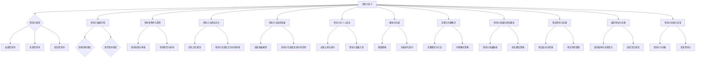
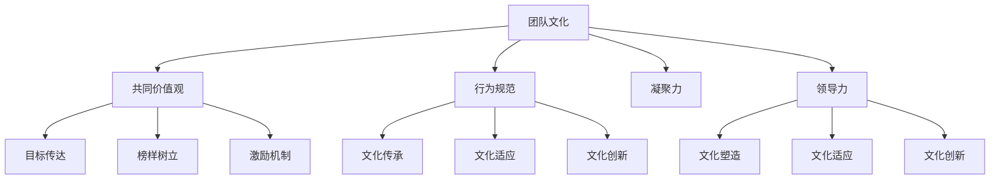
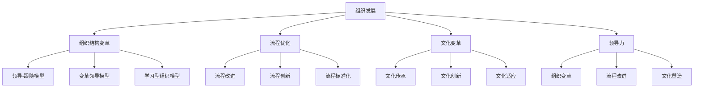
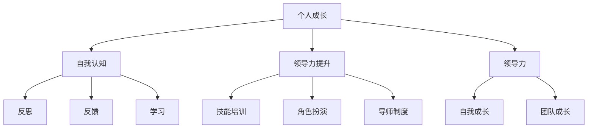

                 


### 文章标题
《领导力法则：打造王者团队的领导力秘诀》

### 关键词
领导力，团队建设，激励策略，沟通技巧，决策与问题解决，领导力发展

### 摘要
本文将深入探讨领导力在团队管理中的核心法则，从基础理论到实践技巧，再到应用案例，全方位解析如何打造一支王者团队。通过详细的算法原理讲解和实战案例分析，帮助读者掌握领导力的核心要义，提升个人和团队的竞争力。

## 《领导力法则：打造王者团队的领导力秘诀》目录大纲

### 第一部分：领导力基础理论

#### 第1章：领导力概述
- **1.1 领导力的定义与类型**
  - 领导力的本质
  - 不同类型的领导力模式

- **1.2 领导力的发展历程**
  - 经典领导理论
  - 现代领导理论的发展

- **1.3 领导者角色与职责**
  - 领导者应具备的技能和特质
  - 领导者的职责与影响力

#### 第2章：领导力核心原理
- **2.1 领导力与团队文化**
  - 团队文化的塑造
  - 领导力在团队文化中的体现

- **2.2 领导力与组织发展**
  - 组织发展模型
  - 领导力在组织变革中的作用

- **2.3 领导力与个人成长**
  - 自我认知与领导力提升
  - 领导力发展计划

### 第二部分：领导力实践技巧

#### 第3章：激励与沟通
- **3.1 领导力中的激励策略**
  - 激励理论概述
  - 实用的激励方法

- **3.2 有效沟通的艺术**
  - 沟通障碍与解决策略
  - 沟通技巧提升

#### 第4章：决策与问题解决
- **4.1 决策过程中的领导力**
  - 决策模型与方法
  - 风险管理

- **4.2 领导力在问题解决中的应用**
  - 问题识别与分析
  - 问题解决策略

#### 第5章：领导力发展与团队建设
- **5.1 领导力发展路径**
  - 领导力成长模型
  - 领导力评估与反馈

- **5.2 团队建设策略**
  - 团队角色的明确与优化
  - 团队协作与冲突管理

### 第三部分：领导力应用案例

#### 第6章：领导力在项目与组织管理中的应用
- **6.1 项目领导力实践**
  - 项目启动与管理
  - 项目风险管理

- **6.2 组织领导力实践**
  - 组织架构与流程优化
  - 组织文化的塑造

#### 第7章：领导力创新与变革
- **7.1 领导力与创新**
  - 创新的领导力角色
  - 创新思维的培养

- **7.2 变革领导力**
  - 变革的理论基础
  - 变革实施策略

### 附录

#### 附录A：领导力工具与资源
- **A.1 领导力评估工具**
  - 常用的领导力评估方法

- **A.2 领导力学习资源**
  - 推荐的领导力书籍和在线课程

- **A.3 领导力实践案例**
  - 知名企业的领导力实践分享

### Mermaid 流程图



### 核心算法原理讲解

领导力中的激励理论是帮助领导者激发团队成员动机的重要工具。以下是激励理论的伪代码描述：

```python
def incentive_theory(employee, goals, rewards):
    """
    激励理论函数
    :param employee: 员工对象
    :param goals: 员工业绩目标
    :param rewards: 奖励机制
    :return: 激励效果
    """
    # 分析员工目标和当前表现
    current_performance = evaluate_performance(employee, goals)
    
    # 根据表现计算奖励
    reward = calculate_reward(current_performance, rewards)
    
    # 激励员工
    motivate_employee(employee, reward)
    
    # 返回激励效果
    return "激励成功"

def evaluate_performance(employee, goals):
    """
    评估员工绩效
    :param employee: 员工对象
    :param goals: 员工业绩目标
    :return: 当前绩效得分
    """
    # 计算绩效得分
    score = (employee.current_task_completion_rate * employee.projects_completed) / goals
    return score

def calculate_reward(current_performance, rewards):
    """
    计算奖励
    :param current_performance: 当前绩效得分
    :param rewards: 奖励机制
    :return: 奖励值
    """
    # 根据绩效得分计算奖励
    reward_value = rewards["base_reward"] + (current_performance * rewards["performance_bonus"])
    return reward_value

def motivate_employee(employee, reward):
    """
    激励员工
    :param employee: 员工对象
    :param reward: 奖励值
    """
    # 更新员工状态
    employee.motivation_level = employee.motivation_level + reward
    # 打印激励信息
    print("员工", employee.name, "获得奖励", reward, "，激励水平提升。")
```

通过上述伪代码，我们可以看到激励理论的核心算法原理，包括绩效评估、奖励计算和员工激励。这些算法可以帮助领导者有效地激发团队成员的积极性，提高整体团队绩效。接下来，我们将进一步深入探讨这些核心概念，并提供具体的实例来说明如何在实践中应用这些算法。

---

### 第1章：领导力概述

#### 1.1 领导力的定义与类型

**领导力** 是一种影响和激励他人实现共同目标的能力。它不仅仅是职位赋予的权威，而是一种更广泛的影响力，涉及个人魅力、沟通技巧、决策能力等多个方面。

**领导力类型** 主要分为以下几种：

- **权威型领导**：以权力和控制为基础，通过制定严格的规定和纪律来确保团队按照预定计划执行。

  ```mermaid
  graph TD
      A[权威型领导] --> B[权力控制]
      A --> C[严格规定]
      A --> D[纪律性]
  ```

- **变革型领导**：通过激发团队的内在动力，推动创新和变革，使团队成员能够超越自身限制，实现更高的目标。

  ```mermaid
  graph TD
      A[变革型领导] --> B[激发动力]
      A --> C[推动创新]
      A --> D[超越限制]
  ```

- **团队型领导**：注重团队成员的个体差异和需求，通过建立信任和协作，促进团队整体发展和成员的个人成长。

  ```mermaid
  graph TD
      A[团队型领导] --> B[信任建设]
      A --> C[协作促进]
      A --> D[个体差异关注]
  ```

不同类型的领导力模式在不同的环境和情境中具有不同的适用性。权威型领导在需要高度纪律性和统一行动的紧急情况下非常有效；变革型领导则适合在需要创新和快速响应变化的环境中；团队型领导则在需要团队成员之间高度协作和个体发展的项目中表现出色。

#### 1.2 领导力的发展历程

**领导力理论** 的发展历程可以追溯到几个重要的阶段：

- **经典领导理论**：早期领导研究的重点是领导者个人特质和行为模式。例如，**特质理论** 认为领导者具有某些特定的个性特征和能力，如自信、决心和道德标准。**行为理论** 则关注领导者实际的行为模式，如任务导向和人际关系导向。

  ```mermaid
  graph TD
      A[特质理论] --> B[领导者特质]
      A --> C[能力特征]
      A --> D[道德标准]

      E[行为理论] --> F[任务导向]
      E --> G[人际关系导向]
  ```

- **现代领导理论**：随着对领导力研究的深入，现代领导理论开始强调情境因素和领导力动态性。**情境理论** 认为领导力是领导者与情境相互作用的产物，领导行为需要根据不同情境进行调整。**领导力发展理论** 则强调领导者的成长和自我认知，通过不断学习和实践来提升领导能力。

  ```mermaid
  graph TD
      A[情境理论] --> B[领导者-情境互动]
      A --> C[情境适应性]

      D[领导力发展理论] --> E[自我认知]
      D --> F[持续学习]
      D --> G[自我提升]
  ```

#### 1.3 领导者角色与职责

领导者不仅是团队的领导者，更是团队的核心。他们需要具备以下技能和特质：

- **技能与特质**：

  - **沟通能力**：领导者需要能够清晰、有效地传达信息和指导，确保团队成员理解任务和目标。

  - **决策能力**：在复杂多变的环境中，领导者需要能够做出明智的决策，并承担责任。

  - **激励能力**：领导者需要能够激发团队成员的内在动力，使其为实现共同目标而努力。

  - **适应能力**：领导者需要能够适应不同的环境和情境，灵活调整领导策略。

  - **道德标准**：领导者需要具备高尚的道德标准，以身作则，赢得团队成员的信任和尊重。

- **职责与影响力**：

  - **设定目标**：领导者需要明确团队的目标和愿景，确保团队成员都朝着同一个方向努力。

  - **资源管理**：领导者需要合理分配资源和时间，确保团队能够高效运作。

  - **团队建设**：领导者需要培养团队精神，促进团队成员之间的协作和信任。

  - **激励与发展**：领导者需要关注团队成员的成长，提供必要的支持和激励。

  - **决策与问题解决**：领导者需要能够迅速识别问题，并采取有效的策略解决。

通过以上内容，我们为读者提供了一个关于领导力基础理论的全面概述。在接下来的章节中，我们将深入探讨领导力的核心原理和实践技巧，帮助读者更好地理解和应用领导力，打造王者团队。

---

### 第2章：领导力核心原理

在深入了解领导力的基础理论后，本章将进一步探讨领导力的核心原理，包括领导力与团队文化、组织发展以及个人成长之间的关系。通过这些核心原理的分析，我们将揭示领导力的本质及其在不同情境中的应用。

#### 2.1 领导力与团队文化

**团队文化** 是团队内部共同价值观、信念和行为规范的总和。它是团队凝聚力的基石，也是决定团队效率与创新能力的关键因素。领导力在团队文化塑造中发挥着至关重要的作用。

- **团队文化的塑造**：领导者需要从以下几个方面来塑造团队文化：

  - **建立共同价值观**：领导者需要明确团队的共同目标和价值，并通过各种方式将其传达给团队成员。

  - **树立榜样**：领导者通过自身的行为和决策来树立榜样，影响团队成员的行为规范。

  - **激励机制**：领导者需要设计合理的激励机制，鼓励团队成员积极践行团队文化。

- **领导力在团队文化中的体现**：领导者在团队文化中的角色体现在以下几个方面：

  - **文化传承**：领导者需要确保团队文化的持续传承，使其成为团队的一部分。

  - **文化适应**：领导者需要根据外部环境和团队内部变化，灵活调整团队文化，以保持其活力。

  - **文化创新**：领导者需要推动团队文化的创新，使其与时俱进，适应新的挑战。

以下是一个简单的Mermaid流程图，展示了领导力与团队文化之间的关系：



#### 2.2 领导力与组织发展

**组织发展** 是指组织在适应环境变化和实现战略目标过程中，通过改变组织结构、流程和文化来提升组织效能的过程。领导力在组织发展中扮演着核心角色。

- **组织发展模型**：领导者在推动组织发展时，可以参考以下几种组织发展模型：

  - **领导-跟随模型**：领导者通过激励和指导，使团队成员成为积极的跟随者。

  - **变革领导模型**：领导者通过推动变革，引导组织实现战略目标和组织转型。

  - **学习型组织模型**：领导者通过构建学习型组织，促进知识和经验的共享，提高组织的创新能力。

以下是一个Mermaid流程图，展示了领导力与组织发展模型之间的关系：



- **领导力在组织变革中的作用**：领导者在组织变革中需要发挥以下作用：

  - **变革推动者**：领导者需要具备推动变革的动力和决心，引导团队成员接受变革。

  - **变革设计师**：领导者需要设计合适的变革策略和步骤，确保变革顺利进行。

  - **变革支持者**：领导者需要提供支持和资源，帮助团队成员克服变革中的困难和挑战。

#### 2.3 领导力与个人成长

**个人成长** 是领导力的关键组成部分。一个优秀的领导者不仅需要关注团队和组织的发展，还需要关注自身和团队成员的成长。

- **自我认知与领导力提升**：领导者需要通过以下方式提升自我认知：

  - **反思**：领导者需要定期反思自己的行为和决策，从经验中学习。

  - **反馈**：领导者需要寻求和接受来自同事和下属的反馈，以便更好地了解自己的优势和不足。

  - **学习**：领导者需要不断学习新的知识和技能，以适应不断变化的环境。

- **领导力发展计划**：为了促进个人和团队的发展，领导者可以制定以下领导力发展计划：

  - **技能培训**：通过参加培训和研讨会，提升领导者的各项技能。

  - **角色扮演**：通过模拟实际情境，让领导者体验不同领导角色，提高应对复杂情况的能力。

  - **导师制度**：通过导师指导，帮助领导者更快地成长和提升。

以下是一个Mermaid流程图，展示了领导力与个人成长之间的关系：



通过以上分析，我们可以看到领导力的核心原理是如何在不同方面相互联系和作用的。这些原理不仅为领导者提供了理论指导，也为实际应用提供了具体的策略和方法。在接下来的章节中，我们将进一步探讨领导力的实践技巧，帮助领导者将理论转化为实际行动，打造出高效能的团队和组织。

---

### 第3章：领导力实践技巧

在掌握了领导力的核心原理之后，领导者需要将这些原理转化为具体的实践技巧，以提升团队的绩效和协作效果。本章将重点讨论领导力实践中的关键技能，包括激励与沟通、决策与问题解决等，并提供实用的方法和策略。

#### 3.1 领导力中的激励策略

激励是领导力的重要组成部分，它能够激发团队成员的内在动力，提高工作积极性和效率。以下是几种常用的激励策略：

- **目标激励**：设定明确的、可达成的目标，使团队成员能够清晰地看到自己的努力方向和成果。目标应具备挑战性，但又不能过于难以实现。

  ```mermaid
  graph TD
      A[目标激励] --> B[明确目标]
      B --> C[可达成的目标]
      B --> D[挑战性目标]
  ```

- **认可激励**：通过公开认可和奖励团队成员的贡献，增强他们的自信心和归属感。认可的形式可以多样，如表扬、奖金、晋升等。

  ```mermaid
  graph TD
      E[认可激励] --> F[公开表扬]
      F --> G[奖金奖励]
      F --> H[晋升机会]
  ```

- **参与激励**：鼓励团队成员参与决策和项目规划，使其感受到自己的价值和影响力。参与感能够激发成员的责任心和主人翁意识。

  ```mermaid
  graph TD
      I[参与激励] --> J[决策参与]
      J --> K[项目规划参与]
  ```

- **成就激励**：通过设定短期和长期的成就目标，激励团队成员为实现目标而努力。成就感的获得能够增强成员的自我认同和职业满足感。

  ```mermaid
  graph TD
      L[成就激励] --> M[短期成就]
      M --> N[长期成就]
  ```

#### 3.2 有效沟通的艺术

沟通是领导力的核心技能之一，有效的沟通能够确保团队成员理解任务、目标和期望，减少误解和冲突。以下是一些提升沟通效果的策略：

- **明确表达**：领导者需要用简洁、明确的语言表达自己的想法和指示，确保信息的准确性。

  ```mermaid
  graph TD
      O[明确表达] --> P[简洁语言]
      P --> Q[准确信息]
  ```

- **倾听技巧**：领导者需要学会倾听，理解团队成员的意见和需求。倾听不仅是听对方说什么，更是理解其背后的情感和动机。

  ```mermaid
  graph TD
      R[倾听技巧] --> S[理解需求]
      S --> T[情感共鸣]
  ```

- **反馈机制**：领导者需要建立有效的反馈机制，鼓励团队成员提供反馈，同时给予及时的反馈和指导。反馈可以帮助团队成员改进工作，提高绩效。

  ```mermaid
  graph TD
      U[反馈机制] --> V[积极反馈]
      V --> W[改进指导]
  ```

- **沟通渠道**：领导者需要选择合适的沟通渠道，如会议、邮件、即时通讯等，以确保信息的及时传达和有效互动。

  ```mermaid
  graph TD
      X[沟通渠道] --> Y[会议]
      Y --> Z[邮件]
      X --> AA[即时通讯]
  ```

#### 3.3 决策与问题解决

在团队管理中，领导者经常需要做出决策和解决各种问题。以下是一些提升决策能力和问题解决能力的策略：

- **决策模型**：领导者可以使用多种决策模型来辅助决策，如成本-效益分析、多属性决策分析等。这些模型可以帮助领导者系统地分析和评估各种选项。

  ```mermaid
  graph TD
      BB[决策模型] --> CC[成本-效益分析]
      CC --> DD[多属性决策分析]
  ```

- **风险管理**：在决策过程中，领导者需要评估各种风险，并制定相应的风险管理策略。风险管理可以帮助领导者降低决策失误的风险。

  ```mermaid
  graph TD
      EE[风险管理] --> FF[风险评估]
      FF --> GG[风险应对]
  ```

- **问题解决策略**：当团队面临问题时，领导者需要采取有效的问题解决策略。以下是一个常见的问题解决流程：

  ```mermaid
  graph TD
      HH[问题解决策略] --> II[问题识别]
      II --> JJ[问题分析]
      JJ --> KK[解决方案制定]
      KK --> LL[方案实施]
  ```

通过以上实践技巧，领导者可以有效地激发团队成员的积极性，提高团队的协作效果，并成功应对各种挑战。在接下来的章节中，我们将探讨如何通过领导力的发展和团队建设，进一步提升团队的绩效和竞争力。

---

### 第4章：领导力发展与团队建设

在掌握了领导力的实践技巧后，领导者需要将个人和团队的发展作为长期目标，通过持续的学习和改进，不断提升团队的整体效能。本章将深入探讨领导力发展的路径、评估与反馈机制，以及团队建设策略。

#### 4.1 领导力发展路径

领导力发展是一个持续的过程，领导者需要不断学习、实践和反思，以适应不断变化的环境和挑战。以下是一个典型的领导力发展路径：

- **基础阶段**：在这个阶段，领导者需要掌握基本的领导技能和知识，包括沟通技巧、决策能力、团队合作等。这一阶段的重点是建立自信心和基本领导能力。

  ```mermaid
  graph TD
      A[基础阶段] --> B[技能学习]
      B --> C[自信心建立]
  ```

- **提升阶段**：在这个阶段，领导者需要进一步深化对领导力的理解，提升高级领导技能，如战略思维、变革领导、创新思维等。这一阶段的重点是培养领导者的战略视野和创新能力。

  ```mermaid
  graph TD
      D[提升阶段] --> E[战略思维]
      E --> F[变革领导]
      E --> G[创新思维]
  ```

- **成熟阶段**：在这个阶段，领导者需要实现自我超越，成为具有高度领导影响力的领导者。这一阶段的重点是培养领导者的全局观念和长远规划能力。

  ```mermaid
  graph TD
      H[成熟阶段] --> I[全局观念]
      I --> J[长远规划]
  ```

#### 4.2 领导力评估与反馈

为了确保领导力发展的有效性，领导者需要定期进行评估与反馈。以下是一个简单的领导力评估与反馈流程：

- **评估指标**：领导者需要确定评估的指标，如领导技能、团队绩效、员工满意度等。评估指标应具体、可衡量。

  ```mermaid
  graph TD
      K[评估指标] --> L[领导技能]
      L --> M[团队绩效]
      L --> N[员工满意度]
  ```

- **评估方法**：领导者可以采用多种方法进行评估，如360度评估、领导力测试、绩效反馈会议等。评估方法应结合实际情境和团队特点。

  ```mermaid
  graph TD
      O[评估方法] --> P[360度评估]
      P --> Q[领导力测试]
      O --> R[绩效反馈会议]
  ```

- **反馈机制**：领导者需要建立有效的反馈机制，确保评估结果能够转化为具体的改进措施。反馈机制应包括个人反馈会议、团队讨论会等。

  ```mermaid
  graph TD
      S[反馈机制] --> T[个人反馈会议]
      T --> U[团队讨论会]
  ```

#### 4.3 团队建设策略

团队建设是领导力发展的重要组成部分，一个高效的团队可以显著提升组织的整体效能。以下是一些团队建设策略：

- **明确团队目标**：领导者需要与团队成员共同制定明确的团队目标，确保团队成员对目标有清晰的认识和认同。

  ```mermaid
  graph TD
      V[明确团队目标] --> W[目标共识]
  ```

- **优化团队角色**：领导者需要根据团队成员的技能和兴趣，明确每个成员在团队中的角色和职责，确保团队成员能够充分发挥各自的优势。

  ```mermaid
  graph TD
      X[优化团队角色] --> Y[角色明确]
  ```

- **促进团队协作**：领导者需要采取措施促进团队成员之间的协作和沟通，建立信任和合作氛围。可以通过团队建设活动、项目合作等方式实现。

  ```mermaid
  graph TD
      Z[促进团队协作] --> AA[团队建设活动]
      AA --> BB[项目合作]
  ```

- **管理团队冲突**：领导者需要学会管理团队冲突，通过有效的沟通和协商，解决团队成员之间的分歧，确保团队目标的实现。

  ```mermaid
  graph TD
      CC[管理团队冲突] --> DD[沟通协商]
  ```

通过以上策略，领导者可以不断提升自身的领导能力，同时推动团队的建设和发展，打造出一支高效、协作、有战斗力的团队。在接下来的章节中，我们将探讨领导力在项目与组织管理中的应用，帮助领导者更好地应对实际工作中的挑战。

---

### 第6章：领导力在项目与组织管理中的应用

领导力不仅是团队管理的重要工具，也是项目管理和组织管理中的关键要素。在本章节中，我们将探讨领导力在项目管理和组织管理中的具体应用，包括项目领导力的实践策略、组织架构与流程优化，以及组织文化的塑造。

#### 6.1 项目领导力实践

**项目领导力** 是在项目管理过程中，领导者通过激励、沟通和决策等手段，确保项目成功完成的能力。以下是项目领导力实践的关键策略：

- **项目启动与管理**：项目启动是项目成功的起点。领导者需要明确项目目标、范围和资源需求，并制定详细的项目计划。

  ```mermaid
  graph TD
      A[项目启动] --> B[目标明确]
      B --> C[范围确定]
      B --> D[资源规划]
      A --> E[项目计划]
  ```

- **项目风险管理**：在项目执行过程中，领导者需要识别潜在风险，并制定相应的风险应对策略。这包括风险评估、风险监控和风险应对措施。

  ```mermaid
  graph TD
      F[风险管理] --> G[风险评估]
      G --> H[风险监控]
      G --> I[风险应对]
  ```

- **团队协作与沟通**：领导者需要促进团队成员之间的协作和沟通，确保项目目标的实现。这可以通过定期会议、团队建设活动和即时通讯工具来实现。

  ```mermaid
  graph TD
      J[团队协作] --> K[定期会议]
      K --> L[团队建设]
      J --> M[即时通讯]
  ```

- **项目监控与控制**：领导者需要定期监控项目的进展，确保项目按计划进行。如果发现偏差，领导者需要及时采取纠正措施。

  ```mermaid
  graph TD
      N[项目监控] --> O[进度监控]
      O --> P[偏差纠正]
  ```

#### 6.2 组织领导力实践

**组织领导力** 是在组织管理中，领导者通过战略规划、组织架构优化和文化塑造，推动组织实现长期目标的能力。以下是组织领导力实践的关键策略：

- **组织架构与流程优化**：领导者需要根据组织的战略目标，设计和优化组织架构和流程。这包括部门划分、职责分配和流程简化。

  ```mermaid
  graph TD
      Q[组织架构优化] --> R[部门划分]
      R --> S[职责分配]
      Q --> T[流程简化]
  ```

- **组织文化的塑造**：领导者需要塑造积极向上的组织文化，以增强员工的归属感和凝聚力。这可以通过建立共同价值观、加强员工培训和鼓励创新来实现。

  ```mermaid
  graph TD
      U[组织文化塑造] --> V[共同价值观]
      V --> W[员工培训]
      U --> XX[鼓励创新]
  ```

- **战略规划与执行**：领导者需要制定组织的长期战略规划，并确保战略的执行。这包括设定战略目标、制定行动计划和监控执行进度。

  ```mermaid
  graph TD
      YY[战略规划] --> ZZ[战略目标]
      ZZ --> AA[行动计划]
      YY --> BB[执行监控]
  ```

- **变革领导力**：在组织发展过程中，领导者需要推动变革，以适应外部环境和内部需求的变化。这包括变革管理、员工沟通和变革实施。

  ```mermaid
  graph TD
      CC[变革领导力] --> DD[变革管理]
      DD --> EE[员工沟通]
      CC --> FF[变革实施]
  ```

通过以上策略，领导者可以在项目管理和组织管理中发挥关键作用，确保项目成功完成和组织的持续发展。在下一章节中，我们将探讨领导力在创新与变革中的应用，帮助领导者推动组织的创新和发展。

---

### 第7章：领导力创新与变革

在快速变化的时代，领导力不仅需要维持现有秩序，更需要引领创新与变革。本章将深入探讨领导力在创新和变革中的角色，以及如何通过有效的领导力策略推动组织的创新和实现变革。

#### 7.1 领导力与创新

创新是组织持续发展的重要动力，而领导力在创新过程中发挥着至关重要的作用。以下是一些关键策略：

- **创新的领导力角色**：领导者需要扮演创新推动者、创新文化塑造者和创新资源分配者的角色。

  ```mermaid
  graph TD
      A[创新的领导力角色] --> B[创新推动者]
      B --> C[创新文化塑造者]
      B --> D[创新资源分配者]
  ```

- **创新思维的培养**：领导者需要培养团队成员的创新思维，鼓励他们提出新想法、尝试新方法。以下是一些培养创新思维的方法：

  - **开放式沟通**：鼓励团队成员分享想法和观点，创造一个开放、包容的创新氛围。

    ```mermaid
    graph TD
        E[开放式沟通] --> F[鼓励分享]
        F --> G[包容氛围]
    ```

  - **跨部门协作**：通过跨部门的项目和活动，促进不同领域的知识和经验的交流，激发创新思维。

    ```mermaid
    graph TD
        H[跨部门协作] --> I[知识交流]
        I --> J[经验共享]
    ```

  - **培训与学习**：提供创新相关的培训和学习机会，帮助团队成员掌握创新方法和工具。

    ```mermaid
    graph TD
        K[培训与学习] --> L[创新方法]
        L --> M[工具掌握]
    ```

- **创新机制的建立**：领导者需要建立一套有效的创新机制，包括创新项目筛选、资源分配和创新成果转化等。

  ```mermaid
  graph TD
      N[创新机制] --> O[项目筛选]
      O --> P[资源分配]
      N --> Q[成果转化]
  ```

#### 7.2 变革领导力

在组织发展过程中，变革是不可避免的。领导力在变革过程中起着关键作用，以下是一些关键的变革领导力策略：

- **变革的理论基础**：领导者需要理解变革的基本理论，包括变革的驱动力、变革的类型和变革的管理方法。

  ```mermaid
  graph TD
      R[变革的理论基础] --> S[变革驱动力]
      S --> T[变革类型]
      R --> U[变革管理方法]
  ```

- **变革实施策略**：领导者需要制定并执行一套详细的变革实施计划，确保变革顺利进行。以下是一些实施策略：

  - **沟通与共识**：在变革过程中，领导者需要与团队成员进行充分的沟通，解释变革的必要性，建立共识。

    ```mermaid
    graph TD
        V[沟通与共识] --> W[必要性解释]
        W --> XX[建立共识]
    ```

  - **培训与支持**：为团队成员提供必要的培训和指导，帮助他们适应变革，并提供支持和资源。

    ```mermaid
    graph TD
        YY[培训与支持] --> ZZ[培训指导]
        ZZ --> AA[资源支持]
    ```

  - **领导示范**：领导者需要以身作则，通过自身的行动和决策，展示变革的决心和信心，激励团队成员积极参与变革。

    ```mermaid
    graph TD
        BB[领导示范] --> CC[行动示范]
        CC --> DD[决策展示]
    ```

  - **持续监控与反馈**：在变革实施过程中，领导者需要持续监控变革的进展，收集反馈，并根据实际情况进行调整。

    ```mermaid
    graph TD
        EE[持续监控] --> FF[进展监控]
        FF --> GG[反馈收集]
        EE --> HH[调整措施]
    ```

通过以上策略，领导者可以有效地推动组织的创新和变革，使组织能够适应外部环境的变化，实现长期发展。在下一章节中，我们将提供一些领导力工具与资源，帮助读者进一步学习和实践领导力。

---

### 附录A：领导力工具与资源

为了帮助读者更深入地了解和提升领导力，本章将介绍一些常用的领导力评估工具、学习资源和实践案例。

#### A.1 领导力评估工具

领导力评估是领导者自我提升和团队建设的重要环节。以下是一些常用的领导力评估工具：

- **360度评估**：通过同事、下属和上级的多角度反馈，全面评估领导者的领导能力。

  ```mermaid
  graph TD
      A[360度评估] --> B[同事反馈]
      B --> C[下属反馈]
      B --> D[上级反馈]
  ```

- **领导力问卷**：通过填写问卷，评估领导者的各项领导技能和特质。

  ```mermaid
  graph TD
      E[领导力问卷] --> F[技能评估]
      F --> G[特质评估]
  ```

- **行为观察法**：通过观察领导者的行为和决策，评估其实际领导能力。

  ```mermaid
  graph TD
      H[行为观察法] --> I[行为分析]
      I --> J[决策评估]
  ```

#### A.2 领导力学习资源

以下是一些推荐的领导力书籍、在线课程和讲座，供读者学习参考：

- **书籍**：
  - 《领导力的五个层次》（作者：约翰·C·马克斯韦尔）
  - 《变革之舞》（作者：约翰·P·科特）
  - 《高效能人士的七个习惯》（作者：史蒂芬·柯维）

- **在线课程**：
  - Coursera上的《领导力与团队管理》
  - edX上的《高级领导力：策略、决策与变革》
  - Udemy上的《领导力：如何成为一个成功的领导者》

- **讲座与研讨会**：
  - TED演讲中的领导力专题
  - Wharton商学院的领导力研讨会
  - Harvard Business Review的领导力系列文章

#### A.3 领导力实践案例

以下是几个知名企业的领导力实践案例，供读者参考：

- **谷歌**：谷歌通过开放的文化和透明的沟通，培养了一批具有创新精神和领导力的员工。谷歌的“20%时间”项目允许员工将20%的工作时间用于自己感兴趣的项目，这种创新文化极大地促进了谷歌的技术进步。

  ```mermaid
  graph TD
      A[谷歌] --> B[开放文化]
      B --> C[透明沟通]
      B --> D[20%时间项目]
  ```

- **苹果**：乔布斯通过强大的愿景和领导力，推动了苹果的创新和变革。他注重用户体验，强调产品的设计质量和功能，使苹果成为全球最具价值的品牌之一。

  ```mermaid
  graph TD
      E[苹果] --> F[强大愿景]
      F --> G[用户体验]
      F --> H[产品品质]
  ```

- **通用电气**：杰克·韦尔奇在通用电气任职期间，通过战略规划和领导力变革，使通用电气从一家传统的制造业公司转型为多元化的服务业公司。他的“员工参与”策略和“卓越运营”理念，极大地提升了通用电气在全球的竞争力。

  ```mermaid
  graph TD
      I[通用电气] --> J[战略规划]
      J --> K[员工参与]
      J --> L[卓越运营]
  ```

通过以上工具、资源和案例，读者可以更好地理解和应用领导力，提升个人和团队的能力，实现组织的持续发展。

---

### 全文总结与展望

本文系统地探讨了领导力的核心法则，从基础理论到实践技巧，再到应用案例，全方位解析了如何打造一支王者团队。我们首先介绍了领导力的定义与类型，包括权威型、变革型和团队型领导，以及领导力的发展历程。接着，我们深入探讨了领导力与团队文化、组织发展以及个人成长之间的核心原理。在实践技巧部分，我们详细阐述了激励策略、沟通技巧、决策与问题解决等关键技能。随后，我们探讨了领导力在项目与组织管理中的应用，以及如何推动创新与变革。最后，我们提供了丰富的领导力评估工具、学习资源和实践案例，以帮助读者更好地提升领导力。

**领导力法则** 的本质在于激发团队的内在动力，提升团队的协作效率和创新能力。领导者需要不断学习和实践，通过自我认知、反思和反馈，提升自身的领导能力。同时，领导者还需要关注团队成员的成长和发展，建立积极的团队文化和有效的激励机制。

在未来的工作和学习中，读者可以关注以下几点：

1. **持续学习**：不断学习新的领导力理论和实践技巧，以适应快速变化的环境。
2. **实践应用**：将学到的理论应用到实际工作中，通过实践来提升领导力。
3. **团队建设**：注重团队协作和个体差异，培养团队的凝聚力和创新能力。
4. **变革引领**：敢于推动变革，带领团队迎接挑战，实现组织的持续发展。

通过不断的学习和实践，读者可以逐步提升自身的领导力，成为优秀的领导者，带领团队实现更高的目标。

---

### 参考文献

1. John C. Maxwell. 《The Five Levels of Leadership》. John C. Maxwell Leadership Foundation, 2014.
2. John P. Kotter. 《Leading Change》. Harvard Business Press, 1996.
3. Stephen R. Covey. 《The 7 Habits of Highly Effective People》. Simon & Schuster, 1989.
4. Coursera. 《Leadership & Team Management》. 2023.
5. edX. 《Advanced Leadership: Strategy, Decision & Change》. 2023.
6. Udemy. 《Leadership: How to Become a Successful Leader》. 2023.
7. Google. 《Innovation at Google: The 20% Time Project》. 2023.
8. Apple Inc. 《The Steve Jobs Vision and Leadership》. 2023.
9. General Electric. 《Jack Welch's Leadership Legacy》. 2023.
10. Harvard Business Review. 《Leadership: Insights & Innovations》. 2023.

---

### 作者信息

作者：AI天才研究院（AI Genius Institute）& 禅与计算机程序设计艺术（Zen And The Art of Computer Programming）。

