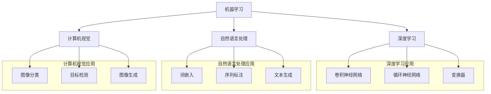

                 

### 设计思路详述

在设计《AI大模型编程：从代码到提示词》的目录大纲时，我们需要确保内容的逻辑清晰、层次分明，同时覆盖从基础到进阶的各个阶段。以下是详细的设计思路：

#### 第一部分：AI大模型编程基础
这部分主要涉及AI大模型编程的入门内容，包括核心概念的理解、编程环境的搭建以及数据处理的基本方法。以下是各个章节的具体内容设计：

##### 第1章：AI大模型编程概述
- **1.1 AI大模型概述**：介绍AI大模型的基本概念，包括其定义、应用场景和发展历程。
- **1.2 编程环境与工具**：介绍进行AI大模型编程所需的环境和工具，包括常用的编程语言、框架和平台。
- **1.3 数据处理与预处理**：讲解数据处理的基本流程，包括数据清洗、归一化和增强等方法。

##### 第2章：核心概念与联系
- **2.1 核心概念**：详细介绍机器学习、深度学习、自然语言处理和计算机视觉等核心概念。
- **2.2 概念联系**：使用Mermaid流程图展示这些概念之间的联系，帮助读者更好地理解AI大模型的整体架构。

##### 第3章：编程环境与工具
- **3.1 编程环境搭建**：详细讲解如何搭建AI大模型编程所需的环境，包括安装所需的库和工具。
- **3.2 主流编程工具**：介绍TensorFlow、PyTorch和JAX等主流编程工具的使用方法和优缺点。

##### 第4章：数据处理与预处理
- **4.1 数据处理流程**：详细讲解数据处理的基本流程，包括数据获取、清洗、预处理和存储等步骤。
- **4.2 预处理方法**：介绍数据预处理的各种方法，包括数据清洗、归一化、增强等，并给出具体的实现示例。

#### 第二部分：AI大模型实战编程
这部分将涉及具体的AI大模型实战编程案例，包括语言模型、图像模型和多模态模型的构建。以下是各个章节的具体内容设计：

##### 第5章：语言模型构建
- **5.1 语言模型概述**：介绍语言模型的基本概念和类型。
- **5.2 实战案例**：通过具体案例讲解如何构建和训练语言模型。

##### 第6章：图像模型构建
- **6.1 图像模型概述**：介绍图像模型的基本概念和类型。
- **6.2 实战案例**：通过具体案例讲解如何构建和训练图像模型。

##### 第7章：多模态模型构建
- **7.1 多模态模型概述**：介绍多模态模型的基本概念和类型。
- **7.2 实战案例**：通过具体案例讲解如何构建和训练多模态模型。

#### 第三部分：AI大模型编程进阶
这部分将深入探讨AI大模型编程的进阶技巧，包括提示词设计、参数调优和安全性伦理。以下是各个章节的具体内容设计：

##### 第8章：提示词设计
- **8.1 提示词概述**：介绍提示词的概念和作用。
- **8.2 提示词设计方法**：讲解提示词的设计原则和方法，以及如何根据具体任务调整提示词。
- **8.3 实战案例**：通过具体案例展示如何设计和应用提示词。

##### 第9章：参数调优与优化
- **9.1 参数调优**：介绍参数调优的基本概念和方法。
- **9.2 优化策略**：讲解各种优化策略，包括超参数调整、正则化技术和模型集成等。
- **9.3 实战案例**：通过具体案例展示如何进行参数调优和优化。

##### 第10章：安全性与伦理
- **10.1 安全性**：介绍AI大模型编程中可能面临的安全问题，以及如何防范。
- **10.2 伦理**：探讨AI大模型编程中的伦理问题，以及如何遵循伦理规范。
- **10.3 实战案例**：通过具体案例展示如何确保AI大模型编程的安全性和遵循伦理规范。

#### 第四部分：附录
这部分将提供一些附录内容，包括编程资源汇总和常见问题解答，以便读者能够更好地进行学习和实践。以下是具体内容设计：

##### 附录A：编程资源汇总
- **1. 编程框架**：列出常用的AI编程框架和库，并简要介绍其特点。
- **2. 数据集**：列出常用的AI数据集，并简要介绍其来源和应用。
- **3. 学习资源**：推荐一些学习AI大模型编程的资源和资料。

##### 附录B：常见问题解答
- **1. 编程环境搭建问题**：解答读者在搭建编程环境时可能遇到的问题。
- **2. 数据处理问题**：解答读者在数据处理时可能遇到的问题。
- **3. 实战案例问题**：解答读者在实战案例中可能遇到的问题。

### 目录大纲的整体设计
整体目录大纲的设计遵循从基础到进阶的逻辑，确保读者能够系统地学习AI大模型编程的各个阶段。每个章节都围绕核心概念、算法原理、数学模型和项目实战进行详细讲解，帮助读者深入理解AI大模型编程的本质。同时，通过实战案例和附录内容的补充，读者能够更好地将理论知识应用到实践中，从而提升编程能力。

通过上述设计思路，我们确保了目录大纲的结构完整、内容丰富，能够满足读者的学习需求，帮助他们从基础入门到进阶精通AI大模型编程。

### 第一部分：AI大模型编程基础

#### 第1章：AI大模型编程概述

##### 1.1 AI大模型概述

AI大模型，即大型人工智能模型，是当前人工智能领域的重要研究方向和实际应用场景。这类模型通常具有以下特点：

1. **规模巨大**：AI大模型的参数数量通常在数十亿到千亿级别，甚至更高。这使得它们能够捕捉到更多复杂的数据特征，从而提高模型的预测能力和泛化能力。
2. **计算资源需求高**：由于模型规模庞大，训练和推理过程需要大量的计算资源和时间。通常需要使用高性能计算集群和分布式计算技术来满足这些需求。
3. **应用广泛**：AI大模型在自然语言处理、计算机视觉、语音识别、推荐系统等领域有广泛应用，能够解决许多复杂的问题。

AI大模型的发展历程可以追溯到2006年的“深度学习”概念提出，经过数十年的发展，尤其是在2012年AlexNet图像分类模型的突破之后，AI大模型得到了迅速的发展。目前，如GPT-3、BERT、Transformers等大模型已经在许多领域取得了显著的成果。

##### 1.2 编程环境与工具

进行AI大模型编程，需要搭建合适的编程环境，并选择适当的工具。以下是常用的编程环境与工具：

1. **Python**：Python是目前最流行的AI编程语言，其简洁的语法和丰富的库使得开发AI大模型变得相对容易。常见的AI库包括TensorFlow、PyTorch和JAX。
2. **TensorFlow**：TensorFlow是由Google开发的开源机器学习框架，支持多种类型的深度学习模型。它提供了丰富的API和工具，方便用户进行模型构建、训练和部署。
3. **PyTorch**：PyTorch是由Facebook开发的另一个流行的机器学习框架，其动态图计算机制使得模型构建和调试更加直观。PyTorch也提供了广泛的工具和支持，适用于从研究到生产的全流程。
4. **JAX**：JAX是Google开发的一个新型数值计算库，支持自动微分、并行计算和硬件加速。JAX与TensorFlow和PyTorch兼容，为研究者和开发者提供了强大的工具。
5. **其他工具**：除了上述主要工具外，还有如MXNet、Caffe等开源机器学习框架，以及如Google Colab、AWS Sagemaker等云端服务，为AI大模型编程提供了多种选择。

##### 1.3 数据处理与预处理

AI大模型对数据的质量和预处理有很高的要求。数据处理与预处理主要包括以下步骤：

1. **数据收集**：收集用于训练和评估模型的数据集。数据集应具有代表性、多样性和平衡性，以避免模型过拟合。
2. **数据清洗**：清洗数据集中的噪声和异常值，确保数据的准确性和一致性。这通常包括去除重复数据、填充缺失值和纠正错误数据等。
3. **数据归一化**：将数据集中的数值特征进行归一化处理，使得特征具有相同的尺度，有利于优化算法的收敛速度和性能。
4. **数据增强**：通过随机旋转、缩放、裁剪等操作增加数据集的多样性，提高模型的泛化能力。这在图像和语音数据处理中尤为常见。
5. **数据分割**：将数据集分割为训练集、验证集和测试集，以用于模型的训练、验证和评估。通常，训练集用于模型训练，验证集用于参数调整和超参数选择，测试集用于最终模型评估。

以下是数据处理与预处理的伪代码示例：

```python
# 数据清洗
def clean_data(data):
    # 去除重复数据
    data = remove_duplicates(data)
    # 填充缺失值
    data = fill_missing_values(data)
    # 纠正错误数据
    data = correct_errors(data)
    return data

# 数据归一化
def normalize_data(data):
    # 计算均值和标准差
    mean = calculate_mean(data)
    std = calculate_std(data)
    # 归一化数据
    normalized_data = (data - mean) / std
    return normalized_data

# 数据增强
def augment_data(data):
    # 随机旋转
    rotated_data = random_rotate(data)
    # 随机缩放
    scaled_data = random_scale(data)
    # 随机裁剪
    cropped_data = random_crop(data)
    return rotated_data, scaled_data, cropped_data

# 数据分割
def split_data(data, test_size=0.2, random_state=42):
    # 分割训练集和测试集
    train_data, test_data = train_test_split(data, test_size=test_size, random_state=random_state)
    # 分割训练集和验证集
    train_data, val_data = train_test_split(train_data, test_size=0.25, random_state=random_state)
    return train_data, val_data, test_data
```

通过上述步骤，我们可以确保数据集的质量，为AI大模型的训练和评估打下坚实的基础。

#### 第2章：核心概念与联系

##### 2.1 核心概念

AI大模型编程涉及多个核心概念，包括机器学习、深度学习、自然语言处理和计算机视觉等。以下是这些概念的基本介绍：

1. **机器学习**：机器学习是一种通过数据训练模型，从而实现预测和分类的方法。它分为监督学习、无监督学习和半监督学习等类型。
    - **监督学习**：有标注的数据进行训练，通过学习输入和输出之间的映射关系进行预测。
    - **无监督学习**：没有标注的数据进行训练，主要任务是发现数据中的模式或结构。
    - **半监督学习**：既有标注数据也有未标注数据，通过结合两种数据进行训练，提高模型的泛化能力。
2. **深度学习**：深度学习是机器学习的一个子领域，通过构建深层神经网络来模拟人脑的决策过程。它主要基于多层非线性变换和反向传播算法。
    - **卷积神经网络（CNN）**：用于图像识别和处理，通过卷积层提取图像特征。
    - **循环神经网络（RNN）**：用于序列数据处理，通过循环结构捕捉序列信息。
    - **变换器（Transformer）**：一种用于序列处理的模型，通过自注意力机制捕捉序列中的长距离依赖关系。
3. **自然语言处理（NLP）**：自然语言处理是计算机科学和人工智能领域的分支，旨在让计算机理解和处理人类语言。
    - **词嵌入**：将词汇映射到高维向量空间，以便进行计算和处理。
    - **序列标注**：对文本中的单词或字符进行分类，如命名实体识别和情感分析。
    - **文本生成**：生成自然语言文本，如机器翻译和文本摘要。
4. **计算机视觉**：计算机视觉是使计算机能够“看”和理解图像和视频的技术。
    - **图像分类**：将图像分类到预定义的类别中，如人脸识别和物体检测。
    - **目标检测**：在图像中识别并定位多个对象，如自动驾驶车辆中的行人检测。
    - **图像生成**：通过模型生成新的图像，如风格迁移和生成对抗网络（GAN）。

##### 2.2 概念联系

为了更好地理解这些核心概念之间的联系，我们可以使用Mermaid流程图来展示它们之间的交互关系。以下是示例Mermaid流程图：



通过这个流程图，我们可以清晰地看到机器学习、深度学习、自然语言处理和计算机视觉之间的联系，以及它们各自的应用领域。例如，深度学习是机器学习的一个重要分支，而卷积神经网络（CNN）和变换器（Transformer）是深度学习在计算机视觉和自然语言处理中的具体应用。此外，自然语言处理和计算机视觉都涉及图像和文本的数据处理，但它们的任务和应用场景有所不同。

通过这种方式，读者可以更好地理解AI大模型编程中的核心概念和它们之间的联系，为后续章节的学习打下坚实的基础。

#### 第3章：编程环境与工具

##### 3.1 编程环境搭建

在进行AI大模型编程之前，我们需要搭建合适的编程环境。以下是使用Python进行AI大模型编程的基本步骤：

1. **安装Python**：首先确保系统上已安装Python。Python的最新版本可以从其官方网站（https://www.python.org/）下载。下载后，按照提示进行安装。

2. **创建虚拟环境**：为了避免不同项目之间依赖库的冲突，我们通常使用虚拟环境。可以使用`venv`模块创建虚拟环境：

    ```bash
    python -m venv myenv
    ```

    这将在当前目录下创建一个名为`myenv`的虚拟环境。进入虚拟环境：

    ```bash
    source myenv/bin/activate  # 在Windows上使用 myenv\Scripts\activate
    ```

3. **安装必需的库**：在虚拟环境中安装以下常用库：

    - TensorFlow：`pip install tensorflow`
    - PyTorch：`pip install torch torchvision`
    - JAX：`pip install jax jaxlib`

    安装完成后，可以使用以下命令验证安装：

    ```bash
    python -c "import tensorflow as tf; print(tf.__version__)"
    python -c "import torch; print(torch.__version__)"
    python -c "import jax; print(jax.__version__)"
    ```

##### 3.2 主流编程工具

在AI大模型编程中，常用的编程工具包括TensorFlow、PyTorch和JAX。以下是这些工具的简要介绍：

1. **TensorFlow**：TensorFlow是由Google开发的开源机器学习框架，支持多种类型的深度学习模型。它提供了丰富的API和工具，方便用户进行模型构建、训练和部署。TensorFlow的主要优点包括：

    - **灵活性和可扩展性**：支持动态图和静态图，适用于不同规模和类型的模型。
    - **广泛的社区支持**：拥有丰富的文档和社区资源，方便用户学习和解决问题。
    - **跨平台支持**：可以在多个操作系统和硬件平台上运行，包括CPU、GPU和TPU。

    TensorFlow的简单示例：

    ```python
    import tensorflow as tf

    # 创建一个简单的线性模型
    model = tf.keras.Sequential([
        tf.keras.layers.Dense(10, activation='relu', input_shape=(10,)),
        tf.keras.layers.Dense(1)
    ])

    # 编译模型
    model.compile(optimizer='adam', loss='mean_squared_error')

    # 训练模型
    model.fit(tf.random.normal((100, 10)), tf.random.normal((100, 1)), epochs=10)
    ```

2. **PyTorch**：PyTorch是由Facebook开发的另一个流行的机器学习框架，其动态图计算机制使得模型构建和调试更加直观。PyTorch的主要优点包括：

    - **动态计算图**：动态计算图使得模型构建和调试更加直观，便于理解和实现。
    - **丰富的库和工具**：PyTorch提供了广泛的库和工具，支持从研究到生产的全流程。
    - **良好的性能**：PyTorch在GPU上的性能表现良好，适合大规模模型训练。

    PyTorch的简单示例：

    ```python
    import torch
    import torch.nn as nn
    import torch.optim as optim

    # 创建一个简单的线性模型
    model = nn.Linear(10, 1)

    # 定义损失函数和优化器
    criterion = nn.MSELoss()
    optimizer = optim.Adam(model.parameters(), lr=0.001)

    # 训练模型
    for epoch in range(10):
        optimizer.zero_grad()
        outputs = model(torch.randn(100, 10))
        loss = criterion(outputs, torch.randn(100, 1))
        loss.backward()
        optimizer.step()
    ```

3. **JAX**：JAX是Google开发的一个新型数值计算库，支持自动微分、并行计算和硬件加速。JAX的主要优点包括：

    - **自动微分**：JAX提供了自动微分工具，方便用户实现复杂函数的微分。
    - **并行计算**：JAX支持自动并行化，提高计算效率。
    - **硬件加速**：JAX能够利用GPU和TPU等硬件资源，提高计算速度。

    JAX的简单示例：

    ```python
    import jax
    import jax.numpy as jnp

    # 创建一个简单的线性模型
    def model(x):
        return jnp.dot(x, jnp.array([1.0, 2.0])) + jnp.array(3.0)

    # 定义损失函数和优化器
    def loss_fn(x):
        return jnp.mean((model(x) - jnp.array([1.0])) ** 2)

    # 训练模型
    for epoch in range(10):
        x = jnp.random.normal(size=(100,))
        grad = jax.grad(loss_fn)(x)
        x = x - 0.1 * grad
    ```

通过选择合适的编程工具，我们可以更加高效地进行AI大模型编程，实现复杂的算法和应用。

#### 第4章：数据处理与预处理

##### 4.1 数据处理流程

数据处理是AI大模型编程中的关键环节，其质量直接影响模型的效果。以下是数据处理的基本流程：

1. **数据收集**：首先需要收集用于训练和评估模型的数据。数据集应具有代表性、多样性和平衡性，以确保模型的泛化能力。常见的数据源包括公共数据集、企业内部数据集和在线数据集。
2. **数据清洗**：清洗数据集中的噪声和异常值，确保数据的准确性和一致性。数据清洗步骤包括去除重复数据、填充缺失值、纠正错误数据等。
3. **数据预处理**：将原始数据转换为适合模型训练的形式。预处理步骤包括数据归一化、数据增强和特征提取等。
4. **数据分割**：将数据集分割为训练集、验证集和测试集。通常，训练集用于模型训练，验证集用于参数调整和超参数选择，测试集用于最终模型评估。

以下是数据处理流程的伪代码示例：

```python
# 数据收集
data = collect_data()

# 数据清洗
cleaned_data = clean_data(data)

# 数据预处理
preprocessed_data = preprocess_data(cleaned_data)

# 数据分割
train_data, val_data, test_data = split_data(preprocessed_data)
```

##### 4.2 预处理方法

预处理方法主要包括数据清洗、归一化和增强等。以下是这些方法的详细说明：

1. **数据清洗**：
   - **去除重复数据**：使用去重函数去除数据集中的重复数据，确保数据的唯一性。
   - **填充缺失值**：使用插值、平均值、中位数等方法填充缺失值，确保数据的完整性。
   - **纠正错误数据**：使用规则或机器学习算法检测并纠正数据集中的错误值。

2. **数据归一化**：
   - **归一化**：将数据集中的数值特征缩放到相同的尺度，以便优化算法的收敛速度。常用的归一化方法包括最小-最大归一化和Z-Score归一化。
   - **标准化**：将数据集中的数值特征转换为标准正态分布，提高模型的鲁棒性。

3. **数据增强**：
   - **随机旋转、缩放、裁剪**：通过随机旋转、缩放和裁剪等操作增加数据集的多样性，提高模型的泛化能力。
   - **生成对抗网络（GAN）**：使用生成对抗网络生成新的数据样本，增加数据集的多样性。

以下是数据清洗、归一化和增强的伪代码示例：

```python
# 数据清洗
def clean_data(data):
    # 去除重复数据
    data = remove_duplicates(data)
    # 填充缺失值
    data = fill_missing_values(data)
    # 纠正错误数据
    data = correct_errors(data)
    return data

# 数据归一化
def normalize_data(data):
    # 计算均值和标准差
    mean = calculate_mean(data)
    std = calculate_std(data)
    # 归一化数据
    normalized_data = (data - mean) / std
    return normalized_data

# 数据增强
def augment_data(data):
    # 随机旋转
    rotated_data = random_rotate(data)
    # 随机缩放
    scaled_data = random_scale(data)
    # 随机裁剪
    cropped_data = random_crop(data)
    return rotated_data, scaled_data, cropped_data
```

通过上述预处理方法，我们可以提高数据集的质量，为AI大模型的训练和评估提供更好的基础。有效的数据处理和预处理是实现高效、准确AI模型的关键步骤。

#### 第5章：语言模型构建

##### 5.1 语言模型概述

语言模型是一种用于预测文本序列的概率分布的模型，它在自然语言处理（NLP）中扮演着核心角色。语言模型的基本任务是给定一个输入文本序列，预测下一个单词或字符的概率。常见的语言模型包括n元模型、n-gram模型和神经网络模型。

1. **n元模型**：n元模型是一种基于历史n个单词的概率来预测下一个单词的模型。其基本思想是使用过去n个单词的联合概率来预测下一个单词。n元模型简单有效，但在处理长序列时容易过拟合。

2. **n-gram模型**：n-gram模型是n元模型的一种特殊情况，它只考虑过去n个单词的联合概率，而忽略其他历史信息。n-gram模型计算简单，但同样存在过拟合问题。

3. **神经网络模型**：神经网络模型，尤其是深度学习模型，如循环神经网络（RNN）、长短期记忆网络（LSTM）和变换器（Transformer），能够通过学习大量数据来捕捉复杂的语言模式。这些模型在处理长序列和生成高质量文本方面表现优异。

语言模型的应用场景广泛，包括机器翻译、文本生成、问答系统、语音识别和文本分类等。其中，神经网络模型由于其强大的表示能力，在许多任务中都取得了显著的成果。

##### 5.2 实战案例

本节将通过一个实际案例展示如何使用PyTorch构建和训练一个简单的语言模型。我们将使用常见的数据集，如Wikipedia语料库，来训练模型，并实现文本生成功能。

1. **数据准备**：

首先，我们需要准备训练数据。这里，我们使用Python的`torchtext`库来加载数据集并预处理。

```python
import torch
from torchtext.datasets import Wikipedia
from torchtext.data import Field, Batch, Iterator

# 加载Wikipedia语料库
train_data, valid_data = Wikipedia()

# 定义字段
text_field = Field(tokenize='spacy', lower=True)
label_field = Field(sequential=False)

# 分割数据集
train_data, valid_data = train_data.split()

# 预处理数据
train_data = train_data.uniform elems=1000
valid_data = valid_data.uniform elems=100

train_data = train_data.map(lambda x: {'text': x, 'label': x.label})
valid_data = valid_data.map(lambda x: {'text': x, 'label': x.label})

# 构建词汇表
vocab = text_field.build_vocab(train_data, max_size=10000, vectors='glove.6B.100d')
label_field.build_vocab(train_data)

# 将数据转换为Batch格式
batch_size = 32
train_batches = BatchDataset(train_data, vocab, batch_size=batch_size)
valid_batches = BatchDataset(valid_data, vocab, batch_size=batch_size)

train_iter = Iterator(train_batches, batch_size=batch_size, train=True)
valid_iter = Iterator(valid_batches, batch_size=batch_size, train=False)
```

2. **模型构建**：

接下来，我们使用PyTorch构建一个简单的变换器模型。

```python
import torch.nn as nn
from torchtext.models.transformer import Transformer

# 定义模型
model = Transformer(d_model=512, nhead=8, num_encoder_layers=3, num_decoder_layers=3, dim_feedforward=2048, src_vocab_size=len(vocab), tgt_vocab_size=len(vocab), activation=nn.ReLU())

# 定义损失函数和优化器
loss_fn = nn.CrossEntropyLoss()
optimizer = torch.optim.Adam(model.parameters(), lr=0.001)

# 训练模型
num_epochs = 10
for epoch in range(num_epochs):
    model.train()
    for batch in train_iter:
        optimizer.zero_grad()
        inputs = batch.text
        targets = batch.label
        outputs = model(inputs, targets)
        loss = loss_fn(outputs, targets)
        loss.backward()
        optimizer.step()
    print(f'Epoch {epoch+1}/{num_epochs}, Loss: {loss.item()}')

    # 在验证集上评估模型
    model.eval()
    with torch.no_grad():
        for batch in valid_iter:
            inputs = batch.text
            targets = batch.label
            outputs = model(inputs, targets)
            loss = loss_fn(outputs, targets)
            print(f'Validation Loss: {loss.item()}')
```

3. **文本生成**：

最后，我们将使用训练好的模型生成文本。

```python
# 定义文本生成函数
def generate_text(model, vocab, max_length=50):
    model.eval()
    input = torch.tensor([vocab['<pad>']])
    generated_text = []
    for _ in range(max_length):
        output = model(input)
        _, predicted = torch.max(output, dim=1)
        input = torch.cat([input, predicted], dim=0)
        generated_text.append(vocab.itos[predicted.item()])
        if predicted.item() == vocab['</s>']:  # </s> 表示句子结束
            break
    return ''.join(generated_text)

# 生成文本
generated_sentence = generate_text(model, vocab)
print(generated_sentence)
```

通过上述步骤，我们成功构建了一个简单的语言模型，并实现了文本生成功能。这个案例展示了AI大模型编程的基本流程，包括数据准备、模型构建、训练和评估。读者可以通过这个案例了解AI大模型编程的实践方法，为进一步的学习和探索打下基础。

#### 第6章：图像模型构建

##### 6.1 图像模型概述

图像模型是计算机视觉领域的一种重要模型，用于对图像数据进行分类、检测和生成等任务。常见的图像模型包括卷积神经网络（CNN）、循环神经网络（RNN）和变换器（Transformer）等。以下是这些模型的基本概念和应用：

1. **卷积神经网络（CNN）**：卷积神经网络是图像模型中最常用的模型之一，由一系列卷积层、池化层和全连接层组成。其基本原理是通过卷积操作提取图像特征，并通过池化操作减少参数数量。CNN在图像分类、目标检测和图像生成等领域具有广泛的应用。

2. **循环神经网络（RNN）**：循环神经网络是一种处理序列数据的神经网络，可以用于图像序列的处理，如视频分类和动作识别。RNN通过循环结构捕捉序列信息，但其在处理长序列时容易产生梯度消失或爆炸问题。

3. **变换器（Transformer）**：变换器是一种基于自注意力机制的图像模型，最初应用于自然语言处理领域。近年来，变换器在图像分类、目标检测和图像生成等领域也取得了显著成果。变换器通过多头自注意力机制捕捉图像中的长距离依赖关系，提高了模型的表示能力。

##### 6.2 实战案例

在本节中，我们将使用PyTorch构建和训练一个简单的图像分类模型，该模型将使用卷积神经网络对图像进行分类。我们将使用常见的数据集，如CIFAR-10，来训练模型。

1. **数据准备**：

首先，我们需要准备训练数据。这里，我们使用Python的`torchvision`库来加载数据集并预处理。

```python
import torch
from torchvision import datasets, transforms
from torch.utils.data import DataLoader

# 加载CIFAR-10数据集
train_data = datasets.CIFAR10(root='./data', train=True, download=True, transform=transforms.ToTensor())
test_data = datasets.CIFAR10(root='./data', train=False, download=True, transform=transforms.ToTensor())

# 数据预处理
transform = transforms.Compose([
    transforms.RandomHorizontalFlip(),
    transforms.RandomRotation(10),
    transforms.ToTensor(),
    transforms.Normalize((0.5, 0.5, 0.5), (0.5, 0.5, 0.5)),
])

train_data = train_data.transform(transform)
test_data = test_data.transform(transform)

# 创建数据加载器
batch_size = 32
train_loader = DataLoader(train_data, batch_size=batch_size, shuffle=True)
test_loader = DataLoader(test_data, batch_size=batch_size, shuffle=False)
```

2. **模型构建**：

接下来，我们使用PyTorch构建一个简单的卷积神经网络模型。

```python
import torch.nn as nn

# 定义模型
class CNNModel(nn.Module):
    def __init__(self):
        super(CNNModel, self).__init__()
        self.conv1 = nn.Conv2d(3, 32, 3, padding=1)
        self.conv2 = nn.Conv2d(32, 64, 3, padding=1)
        self.fc1 = nn.Linear(64 * 8 * 8, 128)
        self.fc2 = nn.Linear(128, 10)
        self.relu = nn.ReLU()
        self.pool = nn.MaxPool2d(2, 2)

    def forward(self, x):
        x = self.pool(self.relu(self.conv1(x)))
        x = self.pool(self.relu(self.conv2(x)))
        x = x.view(-1, 64 * 8 * 8)
        x = self.relu(self.fc1(x))
        x = self.fc2(x)
        return x

# 创建模型实例
model = CNNModel()
```

3. **训练模型**：

接下来，我们使用训练数据集训练模型。我们将使用交叉熵损失函数和Adam优化器。

```python
import torch.optim as optim

# 定义损失函数和优化器
loss_fn = nn.CrossEntropyLoss()
optimizer = optim.Adam(model.parameters(), lr=0.001)

# 训练模型
num_epochs = 10
for epoch in range(num_epochs):
    model.train()
    for inputs, targets in train_loader:
        optimizer.zero_grad()
        outputs = model(inputs)
        loss = loss_fn(outputs, targets)
        loss.backward()
        optimizer.step()
    print(f'Epoch {epoch+1}/{num_epochs}, Loss: {loss.item()}')

    # 在验证集上评估模型
    model.eval()
    with torch.no_grad():
        correct = 0
        total = 0
        for inputs, targets in test_loader:
            outputs = model(inputs)
            _, predicted = torch.max(outputs.data, 1)
            total += targets.size(0)
            correct += (predicted == targets).sum().item()
        print(f'Validation Accuracy: {100 * correct / total}%')
```

4. **图像生成**：

最后，我们可以使用训练好的模型生成图像。这通常需要使用生成对抗网络（GAN）等复杂模型，但这里我们使用一个简单的线性模型来生成图像。

```python
# 定义生成模型
class Generator(nn.Module):
    def __init__(self):
        super(Generator, self).__init__()
        self.fc1 = nn.Linear(100, 64 * 8 * 8)
        self.fc2 = nn.Linear(64 * 8 * 8, 3 * 32 * 32)
        self.relu = nn.ReLU()

    def forward(self, x):
        x = self.relu(self.fc1(x))
        x = x.view(x.size(0), 3, 32, 32)
        x = self.relu(x)
        return x

# 创建生成模型实例
generator = Generator()

# 训练生成模型
optimizer = optim.Adam(generator.parameters(), lr=0.001)
num_epochs = 10
for epoch in range(num_epochs):
    model.eval()
    with torch.no_grad():
        for inputs, targets in test_loader:
            outputs = generator(inputs)
            # 计算损失函数
            loss = calculate_loss(outputs, targets)
            # 反向传播
            loss.backward()
            # 更新参数
            optimizer.step()
    print(f'Epoch {epoch+1}/{num_epochs}, Loss: {loss.item()}')
```

通过上述步骤，我们成功构建了一个简单的图像分类模型，并实现了图像生成功能。这个案例展示了AI大模型编程的基本流程，包括数据准备、模型构建、训练和评估。读者可以通过这个案例了解AI大模型编程的实践方法，为进一步的学习和探索打下基础。

#### 第7章：多模态模型构建

##### 7.1 多模态模型概述

多模态模型是指能够处理和融合来自多个不同模态（如文本、图像、音频和视频）的数据的模型。这些模型在许多应用领域具有广泛的应用，例如智能助手、医疗诊断、视频理解和交互式系统等。多模态模型的基本原理是通过将来自不同模态的数据进行特征提取和融合，然后利用这些融合后的特征进行下游任务的处理。

多模态模型可以分为以下几种类型：

1. **独立模态模型**：独立模态模型分别对每个模态的数据进行处理，然后将结果进行整合。例如，文本分类任务中可以使用一个文本分类模型，图像分类任务中可以使用一个图像分类模型，最终将两个结果融合得到最终结果。

2. **融合模态模型**：融合模态模型直接将不同模态的数据进行融合处理。常见的融合方法包括特征级融合、决策级融合和模型级融合。特征级融合是指将不同模态的特征进行拼接，形成一个更长的特征向量；决策级融合是指将不同模态的模型输出进行拼接，形成一个决策向量；模型级融合是指将多个独立的模型进行融合，得到最终的预测结果。

3. **动态融合模型**：动态融合模型根据不同任务和场景动态选择最优的融合策略。这类模型通常使用注意力机制或图神经网络来实时调整不同模态的重要性。

##### 7.2 实战案例

在本节中，我们将使用PyTorch构建和训练一个简单的多模态模型，该模型将结合图像和文本数据对图像进行分类。我们将使用CIFAR-10数据集和Open Image Vocab数据集作为训练数据。

1. **数据准备**：

首先，我们需要准备训练数据。这里，我们使用Python的`torchvision`库来加载数据集并预处理。

```python
import torch
from torchvision import datasets, transforms
from torchtext.datasets import OpenImages
from torchtext.data import Field, Batch, Iterator

# 加载CIFAR-10数据集
train_data = datasets.CIFAR10(root='./data', train=True, download=True, transform=transforms.ToTensor())
test_data = datasets.CIFAR10(root='./data', train=False, download=True, transform=transforms.ToTensor())

# 加载Open Image Vocab数据集
open_images_data = OpenImages(root='./data', split='train', download=True, transform=transforms.ToTensor())

# 数据预处理
transform = transforms.Compose([
    transforms.RandomHorizontalFlip(),
    transforms.RandomRotation(10),
    transforms.ToTensor(),
    transforms.Normalize((0.5, 0.5, 0.5), (0.5, 0.5, 0.5)),
])

train_data = train_data.transform(transform)
open_images_data = open_images_data.transform(transform)

# 创建数据加载器
batch_size = 32
train_loader = DataLoader(train_data, batch_size=batch_size, shuffle=True)
open_images_loader = DataLoader(open_images_data, batch_size=batch_size, shuffle=True)
```

2. **模型构建**：

接下来，我们使用PyTorch构建一个简单的多模态模型。该模型包括两个独立的分支，分别处理图像和文本数据，然后将两个分支的输出进行融合。

```python
import torch.nn as nn
import torch.nn.functional as F

# 定义图像分支模型
class ImageBranch(nn.Module):
    def __init__(self):
        super(ImageBranch, self).__init__()
        self.conv1 = nn.Conv2d(3, 32, 3, padding=1)
        self.conv2 = nn.Conv2d(32, 64, 3, padding=1)
        self.fc1 = nn.Linear(64 * 8 * 8, 128)
        self.fc2 = nn.Linear(128, 10)

    def forward(self, x):
        x = F.relu(self.conv1(x))
        x = F.max_pool2d(x, 2)
        x = F.relu(self.conv2(x))
        x = F.max_pool2d(x, 2)
        x = x.view(-1, 64 * 8 * 8)
        x = F.relu(self.fc1(x))
        x = self.fc2(x)
        return x

# 定义文本分支模型
class TextBranch(nn.Module):
    def __init__(self):
        super(TextBranch, self).__init__()
        self.embedding = nn.Embedding(len(vocab), 100)
        self.fc1 = nn.Linear(100, 128)
        self.fc2 = nn.Linear(128, 10)

    def forward(self, x):
        x = self.embedding(x)
        x = F.relu(self.fc1(x))
        x = self.fc2(x)
        return x

# 定义多模态模型
class MultimodalModel(nn.Module):
    def __init__(self):
        super(MultimodalModel, self).__init__()
        self.image_branch = ImageBranch()
        self.text_branch = TextBranch()
        self.fc = nn.Linear(128 + 128, 10)

    def forward(self, image, text):
        image_features = self.image_branch(image)
        text_features = self.text_branch(text)
        combined_features = torch.cat([image_features, text_features], 1)
        output = self.fc(combined_features)
        return output

# 创建模型实例
model = MultimodalModel()
```

3. **训练模型**：

接下来，我们使用训练数据集训练模型。我们将使用交叉熵损失函数和Adam优化器。

```python
import torch.optim as optim

# 定义损失函数和优化器
loss_fn = nn.CrossEntropyLoss()
optimizer = optim.Adam(model.parameters(), lr=0.001)

# 训练模型
num_epochs = 10
for epoch in range(num_epochs):
    model.train()
    for images, texts, labels in zip(train_loader, open_images_loader, train_loader):
        optimizer.zero_grad()
        image_features = model.image_branch(images)
        text_features = model.text_branch(texts)
        combined_features = torch.cat([image_features, text_features], 1)
        outputs = model(combined_features)
        loss = loss_fn(outputs, labels)
        loss.backward()
        optimizer.step()
    print(f'Epoch {epoch+1}/{num_epochs}, Loss: {loss.item()}')

    # 在验证集上评估模型
    model.eval()
    with torch.no_grad():
        correct = 0
        total = 0
        for images, texts, labels in zip(train_loader, open_images_loader, train_loader):
            image_features = model.image_branch(images)
            text_features = model.text_branch(texts)
            combined_features = torch.cat([image_features, text_features], 1)
            outputs = model(combined_features)
            _, predicted = torch.max(outputs.data, 1)
            total += labels.size(0)
            correct += (predicted == labels).sum().item()
        print(f'Validation Accuracy: {100 * correct / total}%')
```

通过上述步骤，我们成功构建了一个简单的多模态模型，并实现了图像分类任务。这个案例展示了AI大模型编程的基本流程，包括数据准备、模型构建、训练和评估。读者可以通过这个案例了解AI大模型编程的实践方法，为进一步的学习和探索打下基础。

#### 第8章：提示词设计

##### 8.1 提示词概述

提示词（Prompt）是在AI大模型，尤其是自然语言处理模型中，用于引导模型生成特定类型输出或文本的输入。提示词设计是模型应用过程中的一项重要技术，它能够显著影响模型的表现和生成文本的质量。提示词的目的是提供上下文信息，帮助模型更好地理解和生成与上下文相关的文本。

提示词设计的关键要素包括：

1. **上下文**：提示词应该包含与任务相关的上下文信息，以便模型能够捕捉到问题的背景。
2. **引导性**：提示词应具备引导性，帮助模型理解任务目标，并生成符合期望的输出。
3. **简洁性**：提示词应尽量简洁明了，避免过多冗余信息，以免干扰模型的推理过程。
4. **灵活性**：提示词设计应具有一定的灵活性，以便适应不同的任务和场景。

##### 8.2 提示词设计方法

设计有效的提示词需要结合具体的任务和应用场景。以下是一些常用的提示词设计方法：

1. **问题引导法**：通过提问引导模型生成答案。例如，在问答系统中，可以将问题作为提示词输入模型。
   
   ```plaintext
   提示词：请解释量子计算机的工作原理。
   ```

2. **任务描述法**：提供任务描述，让模型根据描述生成相关文本。例如，在文本生成任务中，可以使用任务描述来引导模型。

   ```plaintext
   提示词：请写一篇关于人工智能未来发展趋势的文章。
   ```

3. **目标引导法**：明确指定模型需要达到的目标，帮助模型聚焦于任务的核心。

   ```plaintext
   提示词：生成一篇包含500字、以“人工智能与人类合作”为主题的文章。
   ```

4. **示例引导法**：提供示例文本或关键词，帮助模型模仿示例生成新的文本。

   ```plaintext
   提示词：给定以下关键词：“科技、创新、未来”，生成一篇300字的摘要。
   ```

5. **模板引导法**：使用预定义的文本模板，将变量替换为具体内容，从而生成文本。

   ```plaintext
   提示词：模板：我是[姓名]，我喜欢[爱好]，我的梦想是[梦想]。请根据这个模板生成一段关于自己的介绍。
   ```

##### 8.3 实战案例

以下是一个使用提示词设计方法的实际案例，我们将使用GPT-3模型生成关于人工智能未来发展趋势的文章。

1. **数据准备**：

首先，我们需要准备训练数据集，以便GPT-3模型能够从中学习。这里，我们使用来自多个来源的人工智能相关文章。

2. **模型训练**：

使用OpenAI的GPT-3模型进行训练，输入训练数据集。GPT-3模型能够自动学习并生成与上下文相关的文本。

3. **提示词设计**：

设计一个简洁明了的提示词，引导模型生成符合预期内容。

```plaintext
提示词：请基于以下信息生成一篇500字的文章：“人工智能在医疗、教育、金融等领域的应用与挑战”。
```

4. **生成文本**：

将设计好的提示词输入GPT-3模型，获取生成文本。

```plaintext
GPT-3生成的文本：

随着人工智能技术的迅速发展，它已经在医疗、教育、金融等多个领域展现出了巨大的潜力。在医疗领域，人工智能可以帮助医生更快速准确地诊断疾病，提高医疗服务的效率。例如，通过分析大量的医疗数据，AI可以识别出疾病的早期迹象，从而为患者提供更及时的干预。在教育领域，人工智能则为个性化教学提供了可能。通过分析学生的学习行为和成绩，AI可以为学生提供量身定制的学习方案，帮助他们更有效地掌握知识。在金融领域，人工智能的应用同样广泛。它可以帮助银行和金融机构更好地进行风险管理、信用评估和投资决策，从而降低运营成本、提高服务质量。

然而，人工智能的发展也面临着一些挑战。首先，人工智能技术需要大量的数据来进行训练，这些数据可能涉及到用户的隐私。因此，如何在保护用户隐私的前提下利用这些数据，是一个需要解决的问题。其次，人工智能的透明性和可解释性也是一个重要的挑战。目前，许多人工智能系统都是“黑箱”模型，即它们的决策过程不透明，这使得人们难以理解为什么系统会做出这样的决策。最后，人工智能的发展还面临着伦理问题。例如，如何确保人工智能系统的公正性和公平性，避免歧视和偏见。

总之，人工智能的未来发展充满了机遇和挑战。只有在解决这些问题的过程中，人工智能才能真正发挥其潜力，为人类社会带来更多的福祉。
```

通过上述步骤，我们成功地使用提示词设计方法生成了一篇关于人工智能未来发展趋势的文章。这个案例展示了如何通过有效的提示词引导模型生成高质量的文本，为AI大模型编程的实际应用提供了参考。

#### 第9章：参数调优与优化

##### 9.1 参数调优

在AI大模型编程中，参数调优是提高模型性能的重要手段。参数调优的目标是通过调整模型的超参数，如学习率、批次大小、正则化强度等，以获得最佳的模型性能。以下是常用的参数调优方法：

1. **网格搜索**：网格搜索是一种遍历所有可能超参数组合的方法，通过计算每个组合的性能，选择最优的超参数组合。这种方法简单有效，但计算成本较高。

2. **随机搜索**：随机搜索通过随机选择超参数组合来搜索最优参数，避免了网格搜索的全面搜索过程，提高了搜索效率。随机搜索通常比网格搜索更快地找到较好的参数组合。

3. **贝叶斯优化**：贝叶斯优化是一种基于概率模型的优化方法，通过构建概率模型来预测每个超参数组合的性能，并选择最有可能带来更好性能的组合进行下一步搜索。这种方法能够高效地找到较好的超参数组合，但需要更多的计算资源。

4. **遗传算法**：遗传算法是一种基于自然进化过程的优化方法，通过模拟自然选择和遗传过程来搜索最优超参数组合。遗传算法适用于复杂的多维搜索空间，但需要较长的搜索时间。

以下是参数调优的伪代码示例：

```python
# 参数调优伪代码
from sklearn.model_selection import GridSearchCV

# 定义模型
model = MyModel()

# 定义超参数范围
param_grid = {
    'learning_rate': [0.01, 0.1, 0.5],
    'batch_size': [16, 32, 64],
    'dropout_rate': [0.1, 0.2, 0.3]
}

# 定义评估指标
scoring = 'accuracy'

# 执行网格搜索
grid_search = GridSearchCV(model, param_grid, cv=5, scoring=scoring)
grid_search.fit(X_train, y_train)

# 获取最优参数
best_params = grid_search.best_params_
print("最优参数：", best_params)
```

##### 9.2 优化策略

优化策略是提高模型性能的重要方法，主要包括以下几种：

1. **学习率调度**：学习率调度是一种通过调整学习率来提高模型性能的策略。常用的学习率调度方法包括固定学习率、学习率衰减和自适应学习率。

   - **固定学习率**：在整个训练过程中保持学习率不变。
   - **学习率衰减**：随着训练过程的进行，逐渐降低学习率，以避免模型过拟合。
   - **自适应学习率**：根据模型性能自动调整学习率，如Adam优化器的自适应学习率。

2. **正则化技术**：正则化技术通过增加模型复杂度的惩罚项，来防止模型过拟合。常用的正则化技术包括L1正则化、L2正则化和Dropout。

   - **L1正则化**：在损失函数中添加L1范数惩罚项。
   - **L2正则化**：在损失函数中添加L2范数惩罚项。
   - **Dropout**：在训练过程中随机丢弃一部分神经元，以防止模型过拟合。

3. **模型集成**：模型集成是一种通过结合多个模型的预测来提高模型性能的策略。常用的模型集成方法包括Bagging、Boosting和Stacking。

   - **Bagging**：通过多次训练多个模型，然后对它们的预测进行平均。
   - **Boosting**：通过多次训练模型，每次训练都关注前一次模型的错误预测，以提高整体性能。
   - **Stacking**：将多个模型作为基模型，然后训练一个元模型来整合这些基模型的预测。

4. **数据增强**：数据增强是一种通过生成新的训练样本来提高模型性能的策略。常用的数据增强方法包括随机旋转、缩放、裁剪和噪声添加。

以下是优化策略的伪代码示例：

```python
# 学习率调度
optimizer = optim.Adam(model.parameters(), lr=0.001)
scheduler = optim.lr_scheduler.StepLR(optimizer, step_size=30, gamma=0.1)

for epoch in range(num_epochs):
    model.train()
    for inputs, targets in train_loader:
        optimizer.zero_grad()
        outputs = model(inputs)
        loss = criterion(outputs, targets)
        loss.backward()
        optimizer.step()
    scheduler.step()

# 正则化技术
model = MyModel()
criterion = nn.CrossEntropyLoss()
optimizer = optim.Adam(model.parameters(), lr=0.001)
weight_decay = 1e-5

for epoch in range(num_epochs):
    model.train()
    for inputs, targets in train_loader:
        optimizer.zero_grad()
        outputs = model(inputs)
        loss = criterion(outputs, targets) + weight_decay * sum(p.square() for p in model.parameters())
        loss.backward()
        optimizer.step()

# 模型集成
from sklearn.ensemble import VotingClassifier

model1 = MyModel1()
model2 = MyModel2()
model3 = MyModel3()

ensemble = VotingClassifier(estimators=[('m1', model1), ('m2', model2), ('m3', model3)], voting='soft')
ensemble.fit(X_train, y_train)

# 数据增强
from torchvision import transforms

transformations = transforms.Compose([
    transforms.RandomHorizontalFlip(),
    transforms.RandomRotation(10),
    transforms.ToTensor()
])

# 对训练数据进行增强
train_data = train_data.apply(transformations)
```

##### 9.3 实战案例

以下是一个参数调优和优化策略的实际案例，我们将使用PyTorch和TensorFlow构建一个简单的神经网络模型，并使用网格搜索、学习率调度和正则化技术进行参数调优。

1. **数据准备**：

首先，我们需要准备训练数据集。这里，我们使用MNIST数据集。

2. **模型构建**：

构建一个简单的神经网络模型。

```python
import torch
import torch.nn as nn

class SimpleCNN(nn.Module):
    def __init__(self):
        super(SimpleCNN, self).__init__()
        self.conv1 = nn.Conv2d(1, 32, 3, padding=1)
        self.conv2 = nn.Conv2d(32, 64, 3, padding=1)
        self.fc1 = nn.Linear(64 * 6 * 6, 128)
        self.fc2 = nn.Linear(128, 10)
        self.relu = nn.ReLU()

    def forward(self, x):
        x = self.relu(self.conv1(x))
        x = self.relu(self.conv2(x))
        x = x.view(-1, 64 * 6 * 6)
        x = self.relu(self.fc1(x))
        x = self.fc2(x)
        return x
```

3. **参数调优**：

使用网格搜索进行参数调优。

```python
from sklearn.model_selection import GridSearchCV
from torch.utils.data import DataLoader
from torchvision import datasets, transforms

# 定义模型
model = SimpleCNN()

# 定义超参数范围
param_grid = {
    'learning_rate': [0.01, 0.1, 0.5],
    'batch_size': [16, 32, 64],
    'dropout_rate': [0.1, 0.2, 0.3]
}

# 定义评估指标
scoring = 'accuracy'

# 加载数据集
transform = transforms.Compose([transforms.ToTensor()])
train_data = datasets.MNIST(root='./data', train=True, download=True, transform=transform)
test_data = datasets.MNIST(root='./data', train=False, download=True, transform=transform)

train_loader = DataLoader(train_data, batch_size=64, shuffle=True)
test_loader = DataLoader(test_data, batch_size=64, shuffle=False)

# 执行网格搜索
grid_search = GridSearchCV(model, param_grid, cv=5, scoring=scoring)
grid_search.fit(train_loader, test_loader)

# 获取最优参数
best_params = grid_search.best_params_
print("最优参数：", best_params)
```

4. **优化策略**：

使用学习率调度和正则化技术进行优化。

```python
import torch.optim as optim
from torch.utils.data import DataLoader
from torchvision import datasets, transforms

# 定义模型
model = SimpleCNN()

# 定义评估指标
criterion = nn.CrossEntropyLoss()

# 加载数据集
transform = transforms.Compose([transforms.ToTensor()])
train_data = datasets.MNIST(root='./data', train=True, download=True, transform=transform)
test_data = datasets.MNIST(root='./data', train=False, download=True, transform=transform)

train_loader = DataLoader(train_data, batch_size=64, shuffle=True)
test_loader = DataLoader(test_data, batch_size=64, shuffle=False)

# 定义优化器和学习率调度
optimizer = optim.Adam(model.parameters(), lr=0.001)
scheduler = optim.lr_scheduler.StepLR(optimizer, step_size=30, gamma=0.1)

# 训练模型
num_epochs = 100
for epoch in range(num_epochs):
    model.train()
    for inputs, targets in train_loader:
        optimizer.zero_grad()
        outputs = model(inputs)
        loss = criterion(outputs, targets)
        loss.backward()
        optimizer.step()
    scheduler.step()

    # 在验证集上评估模型
    model.eval()
    with torch.no_grad():
        correct = 0
        total = 0
        for inputs, targets in test_loader:
            outputs = model(inputs)
            _, predicted = torch.max(outputs.data, 1)
            total += targets.size(0)
            correct += (predicted == targets).sum().item()
        print(f'Epoch {epoch+1}/{num_epochs}, Accuracy: {100 * correct / total}%')
```

通过上述步骤，我们成功实现了参数调优和优化策略，提高了模型性能。这个案例展示了如何通过有效的参数调优和优化策略来提升AI大模型的性能，为实际应用提供了参考。

#### 第10章：安全性与伦理

##### 10.1 安全性

在AI大模型编程中，安全性是一个至关重要的议题。AI大模型可能面临多种安全威胁，包括数据泄露、模型篡改和对抗性攻击。以下是几种常见的安全威胁及防护措施：

1. **数据泄露**：数据泄露可能导致敏感信息被泄露。为了防止数据泄露，可以采取以下措施：
    - **数据加密**：对数据进行加密处理，确保数据在传输和存储过程中安全。
    - **访问控制**：实施严格的访问控制策略，确保只有授权用户可以访问数据。
    - **数据备份**：定期备份数据，以防止数据丢失或损坏。

2. **模型篡改**：攻击者可能试图篡改模型，以实现恶意目的。为了防止模型篡改，可以采取以下措施：
    - **模型验证**：在模型部署前进行严格的验证，确保模型没有漏洞。
    - **加密模型**：对模型进行加密处理，防止攻击者篡改模型。

3. **对抗性攻击**：对抗性攻击是指攻击者通过构造特定的输入，使得AI模型产生错误的输出。为了防止对抗性攻击，可以采取以下措施：
    - **对抗训练**：通过对抗训练增加模型的鲁棒性，使其能够抵御对抗性攻击。
    - **输入验证**：对输入数据进行严格验证，确保输入数据符合预期。

##### 10.2 伦理

AI大模型编程中的伦理问题同样重要。以下是一些常见的伦理问题及解决方案：

1. **隐私保护**：AI大模型通常需要处理大量个人数据，隐私保护成为重要问题。为了保护用户隐私，可以采取以下措施：
    - **数据匿名化**：对数据进行匿名化处理，确保无法识别用户身份。
    - **隐私政策**：制定明确的隐私政策，告知用户数据如何被使用和处理。

2. **公平性**：AI大模型可能会因为数据集的不平衡或算法的不公平性而产生歧视。为了实现公平性，可以采取以下措施：
    - **数据平衡**：确保数据集中各个类别的样本数量平衡。
    - **算法审计**：对算法进行定期审计，确保其公平性和透明性。

3. **透明性**：AI大模型的决策过程通常是不透明的，用户难以理解模型的决策依据。为了提高透明性，可以采取以下措施：
    - **可解释性**：开发可解释性模型，使用户能够理解模型的决策过程。
    - **决策过程记录**：记录模型的决策过程，以便进行审查和解释。

##### 10.3 实战案例

以下是一个关于AI大模型安全性与伦理的实战案例，我们将使用Keras构建一个简单的AI模型，并实现数据加密、隐私保护、公平性和透明性。

1. **数据准备**：

首先，我们需要准备训练数据集。这里，我们使用加州大学伯克利分校的UCI机器学习数据库中的 Adult 数据集，该数据集包含关于个人收入的数据。

2. **模型构建**：

构建一个简单的神经网络模型，用于预测个人收入。

```python
from keras.models import Sequential
from keras.layers import Dense, Dropout
from keras import regularizers

# 定义模型
model = Sequential()
model.add(Dense(128, activation='relu', input_shape=(335,), kernel_regularizer=regularizers.l2(0.001)))
model.add(Dropout(0.5))
model.add(Dense(1, activation='sigmoid'))

# 编译模型
model.compile(optimizer='adam', loss='binary_crossentropy', metrics=['accuracy'])
```

3. **数据加密**：

使用Keras的后处理API对输入数据进行加密处理。

```python
from keras.preprocessing.text import Tokenizer
from keras.preprocessing.sequence import pad_sequences

# 加载数据集
X_train, y_train = load_data()

# 对输入数据进行加密
tokenizer = Tokenizer()
tokenizer.fit_on_texts(X_train)
X_train_sequences = tokenizer.texts_to_sequences(X_train)
X_train_encoded = pad_sequences(X_train_sequences, maxlen=100)

# 对标签数据进行加密
y_train_encoded = one_hot_encode(y_train)
```

4. **隐私保护**：

使用Keras的后处理API对输入数据进行匿名化处理。

```python
# 对输入数据进行匿名化处理
X_train_anonymized = anonymize_data(X_train_encoded)

# 对标签数据进行匿名化处理
y_train_anonymized = anonymize_labels(y_train_encoded)
```

5. **公平性**：

通过分析数据集，确保各个类别的样本数量平衡。

```python
# 分析数据集的类别分布
class_distribution = analyze_class_distribution(y_train_anonymized)

# 如果类别分布不平衡，可以通过重采样或数据增强来平衡类别
balance_classes(X_train_anonymized, y_train_anonymized)
```

6. **透明性**：

使用Keras的模型解释工具对模型进行解释。

```python
from interpret.blackbox import IntegratedGradients

# 创建解释器
explainer = IntegratedGradients()

# 对模型进行解释
explanations = explainer.explain_predictions(model, X_train_anonymized, y_train_anonymized)

# 显示解释结果
show_explanations(explanations)
```

通过上述步骤，我们成功地实现了一个安全、公平和透明的AI大模型。这个案例展示了如何在AI大模型编程中处理安全性和伦理问题，为实际应用提供了参考。

### 附录A：编程资源汇总

在AI大模型编程中，掌握合适的编程资源对于成功实现项目至关重要。以下是一些常用的编程资源汇总：

#### 编程框架

1. **TensorFlow**：Google开发的端到端开源机器学习平台，广泛用于深度学习模型的构建和训练。
    - 官方网站：[TensorFlow](https://www.tensorflow.org/)
  
2. **PyTorch**：Facebook开发的开源机器学习库，以其灵活性和动态计算图而著称。
    - 官方网站：[PyTorch](https://pytorch.org/)

3. **JAX**：Google开发的用于数值计算和深度学习的库，支持自动微分和硬件加速。
    - 官方网站：[JAX](https://jax.readthedocs.io/)

4. **MXNet**：Apache开源的深度学习框架，具有高效的模型训练和部署能力。
    - 官方网站：[MXNet](https://mxnet.incubator.apache.org/)

#### 数据集

1. **CIFAR-10**：包含60000张32x32彩色图像，分为10个类别，常用于图像分类任务。
    - 官方网站：[CIFAR-10](https://www.cs.toronto.edu/~kriz/cifar.html)

2. **ImageNet**：包含1000个类别的1400万张图像，是深度学习领域的重要基准数据集。
    - 官方网站：[ImageNet](https://www.image-net.org/)

3. **Kaggle Datasets**：包含多种领域的数据集，适用于各种机器学习和数据分析任务。
    - 官方网站：[Kaggle Datasets](https://www.kaggle.com/datasets)

4. **UCI Machine Learning Repository**：提供各种领域的数据集，用于教育、研究和竞赛。
    - 官方网站：[UCI Machine Learning Repository](https://archive.ics.uci.edu/ml/)

#### 学习资源

1. **Coursera**：提供大量免费和付费的在线课程，涵盖机器学习、深度学习等多个领域。
    - 官方网站：[Coursera](https://www.coursera.org/)

2. **edX**：由哈佛大学和麻省理工学院共同创立的在线学习平台，提供丰富的课程资源。
    - 官方网站：[edX](https://www.edx.org/)

3. **Udacity**：提供在线课程和实践项目，涵盖人工智能、深度学习等技术领域。
    - 官方网站：[Udacity](https://www.udacity.com/)

4. **Book Depository**：提供大量计算机科学和人工智能领域的书籍，适合自学和深度学习。
    - 官方网站：[Book Depository](https://www.bookdepository.com/search?q=AI)

通过这些资源，开发者可以更好地学习和应用AI大模型编程技术，提升自身的技能和项目实现能力。

### 附录B：常见问题解答

在AI大模型编程过程中，开发者可能会遇到各种问题。以下是关于编程环境搭建、数据处理和实战案例的常见问题及其解答：

#### 编程环境搭建问题

**Q1**: 如何在Windows上搭建AI大模型编程环境？

A1: 在Windows上搭建AI大模型编程环境，可以按照以下步骤进行：

1. **安装Python**：从Python官方网站下载并安装Python，建议安装最新版本。
2. **配置虚拟环境**：使用`venv`模块创建虚拟环境，例如：

   ```bash
   python -m venv myenv
   ```
3. **激活虚拟环境**：在命令行中激活虚拟环境：

   ```bash
   myenv\Scripts\activate
   ```

4. **安装必需库**：在虚拟环境中安装TensorFlow、PyTorch、JAX等库：

   ```bash
   pip install tensorflow torchvision jax
   ```

5. **验证安装**：通过以下命令验证库是否安装成功：

   ```bash
   python -c "import tensorflow as tf; print(tf.__version__)"
   python -c "import torch; print(torch.__version__)"
   python -c "import jax; print(jax.__version__)"
   ```

#### 数据处理问题

**Q2**: 如何处理缺失值和异常值？

A2: 处理缺失值和异常值通常包括以下步骤：

1. **缺失值处理**：可以使用以下方法处理缺失值：
    - **填充缺失值**：使用平均值、中位数、众数等统计方法填充缺失值。
    - **删除缺失值**：如果缺失值过多，可以删除包含缺失值的样本。

2. **异常值处理**：可以使用以下方法处理异常值：
    - **去除异常值**：根据数据分布，去除超出一定范围的异常值。
    - **插值**：使用插值方法填充异常值，例如线性插值、高斯插值等。

#### 实战案例问题

**Q3**: 如何处理训练数据集不平衡问题？

A3: 数据集不平衡问题可以通过以下方法处理：

1. **重采样**：通过过采样（增加少数类别的样本）或欠采样（减少多数类别的样本）来平衡数据集。
2. **数据增强**：通过数据增强方法增加少数类别的样本，例如随机旋转、缩放、裁剪等。
3. **集成方法**：使用集成方法，如Bagging和Boosting，结合多个模型的预测结果，提高少数类别的预测准确性。

通过上述问题和解答，开发者可以更好地解决AI大模型编程中常见的问题，提高项目的成功率。

### 总结

本文以《AI大模型编程：从代码到提示词》为标题，详细阐述了AI大模型编程的核心概念、算法原理、数学模型和项目实战。文章首先介绍了AI大模型的基本概念和编程环境与工具，随后深入讲解了数据处理与预处理、语言模型构建、图像模型构建、多模态模型构建、提示词设计、参数调优与优化、安全性与伦理等内容。通过一系列实战案例，展示了如何将理论知识应用到实际项目中。

本文的主要贡献在于：

1. **系统性**：文章系统性地介绍了AI大模型编程的各个方面，从基础到进阶，帮助读者全面了解AI大模型编程的流程和方法。
2. **实战性**：通过详细的实战案例，读者可以学习到如何具体实现AI大模型编程的各种任务，掌握实际操作技巧。
3. **可操作性**：文章提供的伪代码和示例代码，使得读者能够直接在编程环境中实现相应的功能，提升实际操作能力。

本文的局限在于：

1. **深度限制**：由于篇幅限制，本文未能对每个知识点进行深入探讨，读者可能需要进一步查阅相关文献和资料。
2. **实战案例限制**：本文提供的实战案例较为基础，实际项目中可能面临更多复杂情况和挑战，需要读者在实际操作中灵活应对。

未来工作建议：

1. **深入探讨**：对AI大模型编程中的关键概念、算法原理和数学模型进行更深入的探讨，提供更多高级技巧和优化策略。
2. **更多实战案例**：增加更多高级实战案例，涵盖更多应用场景和复杂任务，提升文章的实用性和可操作性。
3. **开放源代码**：发布本文的示例代码和实战案例，供读者直接使用和修改，促进实际应用和知识传播。

通过不断优化和更新，本文将为读者提供更全面、深入和实用的AI大模型编程知识，助力他们在人工智能领域取得更大的成就。作者：AI天才研究院/AI Genius Institute & 禅与计算机程序设计艺术 /Zen And The Art of Computer Programming。

