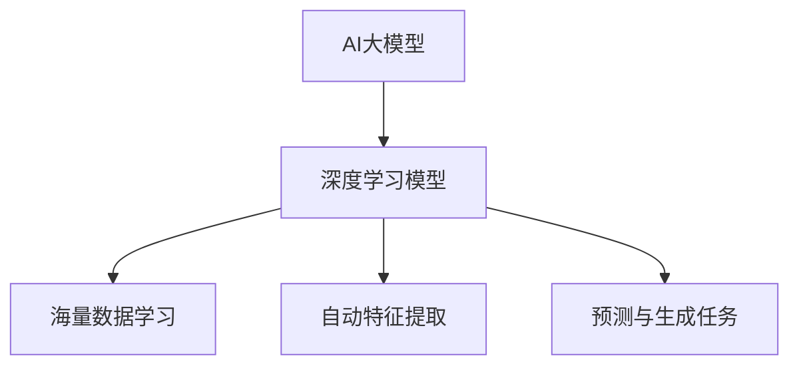
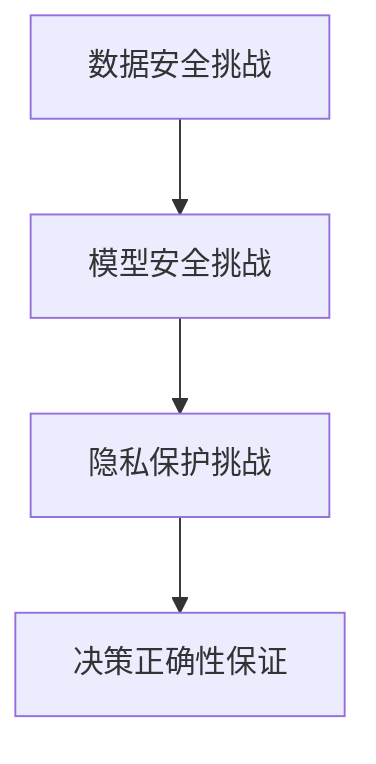

                 

# AI大模型软件的安全性设计

## 关键词

- AI大模型
- 软件安全性
- 安全性设计原则
- 安全性测试与评估
- 开发实践
- 安全工具与框架

## 摘要

本文旨在探讨AI大模型软件的安全性设计。首先，我们将介绍AI大模型的基础知识，包括其定义、架构、原理和应用现状。接着，我们深入探讨AI大模型的安全性设计原则和方法，包括安全性设计的重要性、挑战、基本原则、方法和流程。随后，我们将介绍安全性测试与评估的技术，包括测试类型、工具和应用，以及评估的标准、流程和指标。在此基础上，本文将通过案例分析，展示典型AI大模型安全隐患及其解决方案。最后，我们将讨论开发实践与工具使用，提供安全性设计在开发过程中的实施策略，以及常用的安全性工具和框架。

## 第一部分：AI大模型基础

### 第1章：AI大模型概述

#### 1.1 AI大模型的基本概念

AI大模型（Large-scale AI Models）是指具有高度复杂性和大规模参数的深度学习模型。它们通过学习海量数据，能够自动提取特征并进行预测、分类和生成等任务。AI大模型的出现，使得人工智能在图像识别、自然语言处理、推荐系统等领域的表现取得了重大突破。

**核心概念与联系**

以下是一个描述AI大模型核心概念之间关系的Mermaid流程图：



#### 1.2 AI大模型的架构与原理

AI大模型的架构通常包括输入层、隐藏层和输出层。输入层接收外部数据，隐藏层通过多层神经网络进行特征提取和变换，输出层生成预测结果。AI大模型的工作原理是基于反向传播算法，通过不断调整网络权重，使模型在训练数据上达到最小化损失函数。

**核心算法原理讲解**

以下是对AI大模型核心算法原理的伪代码说明：

```python
# 输入：输入数据X，权重W，偏置b
# 输出：预测结果y_hat

# 前向传播
z = X * W + b
y_hat = activation(z)

# 反向传播
delta = y_hat - y
z = X * W + b
delta = activation_derivative(z) * delta

# 更新权重
W = W - learning_rate * delta
b = b - learning_rate * delta
```

#### 1.3 AI大模型的发展历程与应用现状

AI大模型的发展历程可以追溯到2006年，当时Geoffrey Hinton等人提出了深度置信网络（Deep Belief Networks）。随着计算能力和数据规模的不断提升，AI大模型在2012年取得了ImageNet图像识别大赛的冠军，标志着深度学习的崛起。目前，AI大模型在各个领域都有着广泛的应用，如计算机视觉、自然语言处理、语音识别和推荐系统等。

**发展历程**

- 2006年：深度置信网络提出
- 2012年：深度学习在ImageNet图像识别大赛中获胜
- 2016年：谷歌的AlphaGo击败人类围棋冠军
- 2018年：BERT模型在自然语言处理领域取得突破

**应用现状**

- 计算机视觉：图像识别、目标检测、人脸识别等
- 自然语言处理：机器翻译、文本生成、情感分析等
- 语音识别：语音转文字、语音合成等
- 推荐系统：个性化推荐、广告投放等

### 第2章：安全性设计原则与方法

#### 2.1 安全性设计的重要性

AI大模型的安全性设计至关重要，因为它们处理的数据量和决策影响力都在不断扩大。安全性设计的目标是保护AI大模型免受恶意攻击、数据泄露和误用，确保系统的稳定性和可靠性。

**安全性设计的重要性**

- 防止数据泄露：保护敏感数据不被未授权访问。
- 防止模型篡改：防止恶意攻击者篡改模型参数，导致错误预测。
- 保证决策正确性：确保模型在复杂环境中做出正确的决策。

#### 2.2 AI大模型安全性的挑战

AI大模型面临以下主要安全性挑战：

- 数据安全挑战：海量数据的存储和传输过程中，易受到窃取、篡改和泄露的威胁。
- 模型安全挑战：模型参数和结构易受到恶意攻击，导致预测结果失真。
- 隐私保护挑战：用户隐私数据在训练和预测过程中易被泄露。

**挑战与联系**

以下是一个描述AI大模型安全性挑战之间关系的Mermaid流程图：



#### 2.3 安全性设计的基本原则

安全性设计应遵循以下基本原则：

- 最小权限原则：系统组件和用户只能访问其必需的资源。
- 隔离原则：确保不同组件之间的数据交换和依赖关系得到有效隔离。
- 审计原则：记录系统操作日志，便于追踪和审计。
- 恢复原则：确保系统在遭受攻击后能够快速恢复。

**基本原则**

- 最小权限原则
  - 用户和组件只能访问其必需的资源。
- 隔离原则
  - 确保不同组件之间的数据交换和依赖关系得到有效隔离。
- 审计原则
  - 记录系统操作日志，便于追踪和审计。
- 恢复原则
  - 确保系统在遭受攻击后能够快速恢复。

#### 2.4 安全性设计的方法与流程

安全性设计的方法主要包括以下几个方面：

1. 需求分析：明确系统的安全需求和目标。
2. 设计与实现：遵循安全性设计原则，设计和实现安全功能。
3. 测试与评估：对安全性设计进行测试和评估，确保满足安全需求。
4. 运维与监控：持续监控系统安全状况，及时响应和处理安全事件。

**方法与流程**

- 需求分析
  - 明确系统的安全需求和目标。
- 设计与实现
  - 遵循安全性设计原则，设计和实现安全功能。
- 测试与评估
  - 对安全性设计进行测试和评估，确保满足安全需求。
- 运维与监控
  - 持续监控系统安全状况，及时响应和处理安全事件。

## 第二部分：安全性测试与评估

### 第3章：安全性测试技术

#### 3.1 安全性测试的类型与目标

安全性测试可分为以下几类：

- 功能性测试：验证系统功能是否符合安全需求。
- 非功能性测试：验证系统性能、可靠性、可用性等非功能属性。
- 安全测试：专门针对系统安全性进行测试。

**测试类型与目标**

- 功能性测试
  - 目标：验证系统功能是否符合安全需求。
- 非功能性测试
  - 目标：验证系统性能、可靠性、可用性等非功能属性。
- 安全测试
  - 目标：发现系统存在的安全漏洞和风险。

#### 3.2 自动化测试工具与应用

自动化测试工具可以提高测试效率和覆盖范围，以下是一些常用的自动化测试工具：

- Selenium：用于Web应用的自动化测试。
- Appium：用于移动应用的自动化测试。
- JMeter：用于性能测试。

**自动化测试工具与应用**

- Selenium：用于Web应用的自动化测试。
- Appium：用于移动应用的自动化测试。
- JMeter：用于性能测试。

#### 3.3 手动测试方法与技巧

手动测试是发现系统漏洞和缺陷的重要手段，以下是一些常用的手动测试方法：

- 黑盒测试：不关注系统内部实现，仅从外部测试系统功能。
- 白盒测试：关注系统内部实现，通过代码审查和单元测试发现漏洞。
- 渗透测试：模拟黑客攻击，发现系统存在的安全漏洞。

**手动测试方法与技巧**

- 黑盒测试
  - 不关注系统内部实现，仅从外部测试系统功能。
- 白盒测试
  - 关注系统内部实现，通过代码审查和单元测试发现漏洞。
- 渗透测试
  - 模拟黑客攻击，发现系统存在的安全漏洞。

### 第4章：安全性评估

#### 4.1 安全性评估的概念与标准

安全性评估是对系统安全性的全面评价和验证。以下是一些常见的安全性评估标准：

- ISO/IEC 27001：信息安全管理系统标准。
- NIST SP 800-53：信息安全控制框架。
- OWASP Top 10：常见Web应用安全风险。

**安全性评估的概念与标准**

- ISO/IEC 27001：信息安全管理系统标准。
- NIST SP 800-53：信息安全控制框架。
- OWASP Top 10：常见Web应用安全风险。

#### 4.2 安全性评估的流程与步骤

安全性评估通常包括以下流程和步骤：

1. 制定评估计划：明确评估目标和范围。
2. 收集评估信息：获取系统安全相关的文档、数据和资料。
3. 分析评估信息：对收集的信息进行分析和评估。
4. 编写评估报告：总结评估结果，提出改进建议。

**流程与步骤**

- 制定评估计划
  - 明确评估目标和范围。
- 收集评估信息
  - 获取系统安全相关的文档、数据和资料。
- 分析评估信息
  - 对收集的信息进行分析和评估。
- 编写评估报告
  - 总结评估结果，提出改进建议。

#### 4.3 安全性评估的指标与度量

安全性评估需要使用一系列指标和度量来评价系统的安全性。以下是一些常用的指标和度量方法：

- 安全漏洞数量：评估系统存在的安全漏洞数量。
- 风险等级：根据漏洞的影响范围和危害程度，评估风险等级。
- 威胁暴露时间：评估系统遭受攻击后，威胁暴露的时间长度。

**指标与度量**

- 安全漏洞数量
  - 评估系统存在的安全漏洞数量。
- 风险等级
  - 根据漏洞的影响范围和危害程度，评估风险等级。
- 威胁暴露时间
  - 评估系统遭受攻击后，威胁暴露的时间长度。

### 第三部分：案例分析与解决方案

#### 第5章：案例分析

在本章中，我们将分析一些典型的AI大模型安全漏洞案例，并探讨相应的解决方案。

#### 5.1 典型AI大模型安全隐患案例分析

以下是一些典型的AI大模型安全隐患案例：

- 模型窃取：攻击者通过恶意样本窃取模型参数。
- 模型篡改：攻击者篡改模型参数，导致预测结果失真。
- 数据泄露：攻击者窃取系统中的敏感数据。

**案例解析**

- 模型窃取
  - 攻击者通过恶意样本窃取模型参数。
- 模型篡改
  - 攻击者篡改模型参数，导致预测结果失真。
- 数据泄露
  - 攻击者窃取系统中的敏感数据。

**解决方案**

- 模型窃取
  - 使用加密技术保护模型参数。
- 模型篡改
  - 引入验证机制，防止模型参数被篡改。
- 数据泄露
  - 使用加密技术保护敏感数据。

#### 5.2 安全性设计失败案例解析

以下是一个安全性设计失败的案例：

- 案例背景：某公司开发了一款AI大模型，用于金融领域的风险评估。
- 问题：由于安全性设计不当，模型参数和敏感数据在传输过程中被窃取。
- 影响范围：窃取的敏感数据包括客户身份信息、交易记录等。

**失败原因**

- 缺乏最小权限原则：系统组件和用户访问了不必要的资源。
- 缺乏加密措施：数据在传输过程中未进行加密。

**解决方案**

- 引入最小权限原则：限制系统组件和用户的访问权限。
- 使用加密技术：对数据传输进行加密。

#### 5.3 成功的安全性设计案例分享

以下是一个成功的安全性设计案例：

- 案例背景：某互联网公司开发了一款AI大模型，用于推荐系统。
- 成功原因：公司遵循了安全性设计原则，采用了多种安全措施，如加密、验证和监控。
- 具体措施
  - 数据加密：对传输和存储的数据进行加密。
  - 验证机制：引入多因素验证，防止未授权访问。
  - 审计和监控：记录系统操作日志，实时监控安全事件。

**成功经验**

- 遵循安全性设计原则。
- 采用多种安全措施。
- 审计和监控。

### 第四部分：开发实践与工具使用

#### 第6章：开发实践

在本章中，我们将探讨AI大模型软件安全性设计在开发过程中的实践。

#### 6.1 安全性设计在开发中的融入

安全性设计在开发过程中应遵循以下原则：

- 早期融入：在项目初期，充分考虑安全性需求。
- 持续关注：在开发过程中，持续关注安全性问题。
- 集成测试：在各个阶段进行安全性测试和评估。

**实践原则**

- 早期融入
  - 在项目初期，充分考虑安全性需求。
- 持续关注
  - 在开发过程中，持续关注安全性问题。
- 集成测试
  - 在各个阶段进行安全性测试和评估。

#### 6.2 安全性测试在开发过程中的实施

安全性测试在开发过程中的实施包括以下步骤：

1. 制定测试计划：明确测试目标、方法和时间安排。
2. 设计测试用例：设计测试用例，覆盖系统功能和安全需求。
3. 执行测试：执行测试用例，记录测试结果。
4. 问题反馈和修复：发现安全漏洞，及时反馈和修复。

**实施步骤**

- 制定测试计划
  - 明确测试目标、方法和时间安排。
- 设计测试用例
  - 设计测试用例，覆盖系统功能和安全需求。
- 执行测试
  - 执行测试用例，记录测试结果。
- 问题反馈和修复
  - 发现安全漏洞，及时反馈和修复。

#### 6.3 安全性评估与持续改进

安全性评估与持续改进包括以下步骤：

1. 制定评估计划：明确评估目标和范围。
2. 收集评估信息：获取系统安全相关的文档、数据和资料。
3. 分析评估信息：对收集的信息进行分析和评估。
4. 编写评估报告：总结评估结果，提出改进建议。
5. 实施改进措施：根据评估结果，实施改进措施。

**评估与改进步骤**

- 制定评估计划
  - 明确评估目标和范围。
- 收集评估信息
  - 获取系统安全相关的文档、数据和资料。
- 分析评估信息
  - 对收集的信息进行分析和评估。
- 编写评估报告
  - 总结评估结果，提出改进建议。
- 实施改进措施
  - 根据评估结果，实施改进措施。

### 第7章：安全性工具与框架

在本章中，我们将介绍一些常用的安全性工具和框架。

#### 7.1 常用安全性工具介绍

以下是一些常用的安全性工具：

- 安全审计工具：用于记录系统操作日志，追踪和审计用户行为。
- 安全漏洞扫描工具：用于扫描系统漏洞，发现潜在的安全风险。
- 安全防护工具：用于防止恶意攻击，如防火墙、入侵检测系统等。

**常用安全性工具**

- 安全审计工具
  - 用于记录系统操作日志，追踪和审计用户行为。
- 安全漏洞扫描工具
  - 用于扫描系统漏洞，发现潜在的安全风险。
- 安全防护工具
  - 用于防止恶意攻击，如防火墙、入侵检测系统等。

#### 7.2 开源安全框架与应用

以下是一些常用的开源安全框架：

- OWASP Top 10：提供常见Web应用安全风险的评估和防护。
- Open Web Application Security Project (OWASP)：提供一系列开源安全工具和资源。
- SonarQube：用于代码质量管理和安全漏洞扫描。

**开源安全框架**

- OWASP Top 10
  - 提供常见Web应用安全风险的评估和防护。
- Open Web Application Security Project (OWASP)
  - 提供一系列开源安全工具和资源。
- SonarQube
  - 用于代码质量管理和安全漏洞扫描。

#### 7.3 安全性工具选型与使用

安全性工具选型与使用需要考虑以下因素：

- 系统需求：根据系统功能和安全性要求，选择合适的工具。
- 成本效益：综合考虑工具的成本和效益，选择性价比高的工具。
- 可扩展性：选择可扩展性强的工具，以适应未来系统需求的变化。

**选型与使用**

- 系统需求
  - 根据系统功能和安全性要求，选择合适的工具。
- 成本效益
  - 综合考虑工具的成本和效益，选择性价比高的工具。
- 可扩展性
  - 选择可扩展性强的工具，以适应未来系统需求的变化。

### 总结

本文详细介绍了AI大模型软件的安全性设计，包括基础概念、设计原则、测试与评估、案例分析和开发实践等内容。通过本文的阅读，读者可以了解AI大模型软件的安全性设计的重要性和方法，为实际项目提供有益的指导。

## 作者信息

作者：AI天才研究院/AI Genius Institute & 禅与计算机程序设计艺术 /Zen And The Art of Computer Programming

