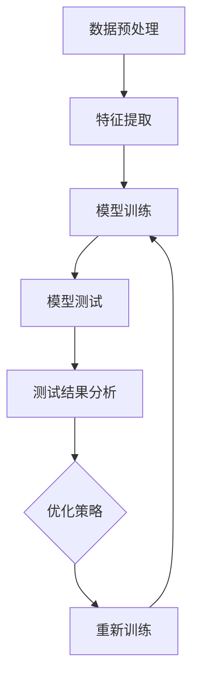

                 


### Step 1: 概述部分

为了准确概述AI时代的软件质量保证新方法论，我们首先需要明确几个关键概念：AI时代、软件质量保证（SQB）和AI对SQB的影响。接下来，我们将逐步阐述这些概念，并为本书的目的与结构做简要介绍。

**AI时代背景介绍**

AI时代，即人工智能时代，是一个以计算机模拟人类智能为特征的新时代。这一时代的核心在于机器学习、深度学习和强化学习等人工智能技术的飞速发展。AI已经广泛应用于各行各业，从自动驾驶、智能家居到金融分析和医疗诊断，AI正在深刻改变我们的生活方式。

**软件质量保证（SQB）的重要性**

软件质量保证是确保软件产品满足预定质量标准的过程。它不仅仅关乎代码质量，还涉及需求管理、项目管理和风险控制等多个方面。良好的软件质量保证能够减少软件缺陷，提高用户满意度，降低维护成本，是现代软件开发不可或缺的一部分。

**AI对SQB的影响**

随着AI技术的发展，它正在以多种方式影响软件质量保证。首先，AI可以用于自动化测试，通过智能测试用例生成和自动化测试执行，提高测试效率和准确性。其次，AI能够进行缺陷预测和定位，通过分析历史数据和代码特征，提前发现潜在的问题。此外，AI还可以用于优化SQB流程，通过自动化的流程设计和质量度量，提高整个软件开发生命周期的效率。

**本书的目的与结构**

本书旨在探讨AI时代下的软件质量保证新方法论，帮助读者理解AI技术在SQB中的应用，并提供实际案例分析。全书分为以下几个部分：

- **第1章**：概述AI时代背景、软件质量保证的重要性以及AI对SQB的影响。
- **第2章和第3章**：介绍AI和软件质量保证的基础理论，包括机器学习、深度学习、强化学习、自然语言处理、软件质量模型和SQB方法。
- **第4章和第5章**：探讨AI技术在SQB中的应用，如自动化测试、缺陷预测与修复、流程优化和质量度量与反馈系统。
- **第6章和第7章**：通过实际案例和案例分析，展示AI在软件质量保证中的具体应用。
- **第8章**：总结本书内容，展望未来发展趋势，并给出对读者的建议。

通过这样的结构，我们希望读者能够系统地了解AI时代的软件质量保证新方法论，并能够将这些理念应用到实际的软件开发中。

---

### Step 2: 基础理论部分

在了解了AI时代和软件质量保证的基本概念后，我们接下来将深入探讨AI和软件质量保证的基础理论。这一部分将分为两个章节，分别介绍AI的基础理论和软件质量保证的基础理论。

#### 第2章：AI基础理论

**2.1 机器学习与深度学习**

**2.1.1 机器学习的基本概念**

机器学习是人工智能的一个分支，旨在让计算机通过数据学习并做出预测或决策。机器学习可以分为监督学习、无监督学习和强化学习三种类型。

- **监督学习**：在这种学习中，我们有一个包含输入和输出对的训练集。机器学习的目标是找到一个函数，可以将输入映射到输出。常见的算法有线性回归、逻辑回归、决策树和随机森林等。
  
- **无监督学习**：与监督学习不同，无监督学习没有预定义的输出标签。其主要任务是发现数据中的结构和模式，例如聚类分析和降维技术。

- **强化学习**：在这种学习中，机器通过与环境互动来学习最佳策略。它通常用于决策问题，例如游戏和自动驾驶。常用的算法有Q-学习、SARSA和深度强化学习等。

**2.1.2 深度学习架构**

深度学习是机器学习的一个子领域，它通过多层神经网络模拟人脑的工作方式。深度学习的核心是神经网络，特别是深度神经网络（DNN）。DNN通常由多个隐藏层组成，每个隐藏层对输入数据进行特征提取和变换。

- **卷积神经网络（CNN）**：适用于图像处理，通过卷积操作提取图像特征。

- **循环神经网络（RNN）**：适用于序列数据，通过循环结构保持长时记忆。

- **生成对抗网络（GAN）**：用于生成新数据，通过两个对抗网络（生成器和判别器）之间的对抗训练实现。

**2.1.3 常用深度学习算法**

- **自动编码器（Autoencoder）**：一种无监督学习算法，用于降维和去噪。

- **长短期记忆网络（LSTM）**：一种改进的RNN，可以解决长时依赖问题。

- **迁移学习（Transfer Learning）**：通过在一个大型数据集上预训练模型，然后将其应用于特定任务。

**2.2 强化学习与自然语言处理**

**2.2.1 强化学习原理**

强化学习是机器学习的一个重要分支，主要关注在未知环境中，通过探索和利用来学习最优策略。强化学习的基本组成部分包括：

- **状态（State）**：系统当前所处的状况。
- **动作（Action）**：系统可以采取的行动。
- **奖励（Reward）**：系统从当前状态采取动作后获得的回报。
- **策略（Policy）**：系统根据当前状态选择动作的规则。

常见的强化学习算法有：

- **Q-学习（Q-Learning）**：通过不断更新Q值（表示从当前状态采取某一动作的预期回报）来学习策略。
- **SARSA（State-Action-Reward-State-Action）**：一种同时考虑当前状态和下一状态的动作值更新算法。

**2.2.2 自然语言处理基础**

自然语言处理（NLP）是人工智能的一个重要领域，旨在让计算机理解和生成自然语言。NLP的核心任务包括：

- **词向量表示（Word Embedding）**：将单词映射到高维向量空间，以便计算机能够处理。
- **命名实体识别（Named Entity Recognition, NER）**：识别文本中的特定实体，如人名、地名、组织名等。
- **机器翻译（Machine Translation）**：将一种自然语言翻译成另一种自然语言。
- **情感分析（Sentiment Analysis）**：分析文本中的情感倾向，判断是正面、负面还是中性。

以上是AI基础理论的简要介绍。在下一章中，我们将深入探讨软件质量保证的基础理论，包括软件质量模型和SQB方法。

---

#### 第3章：软件质量保证基础理论

**3.1 软件质量模型**

软件质量模型是描述软件产品特性的一种框架，用于指导软件质量管理和评估。常见的软件质量模型包括McCall模型和ISO/IEC 25010模型。

**3.1.1 McCall模型**

McCall模型是一个早期的软件质量模型，它将软件质量分为三个维度：产品属性、质量属性和外部因素。

- **产品属性**：包括功能性、可靠性、易用性、效率、可维护性、可移植性和可测试性。
- **质量属性**：包括适合性、可靠性、可用性、效率、可维护性、可移植性和可测试性。
- **外部因素**：包括与开发过程、项目管理、用户和环境相关的因素。

**3.1.2 ISO/IEC 25010模型**

ISO/IEC 25010模型是一个更加全面和细化的软件质量模型，它定义了多个质量特性、质量子特性和质量度量。

- **质量特性**：包括功能性、可靠性、易用性、效率、可维护性和可移植性。
- **质量子特性**：例如功能性包括符合性、可靠性包括故障转移性、易用性包括易学性和可访问性等。
- **质量度量**：用于量化软件质量特性，例如缺陷密度、响应时间、维护频率等。

**3.2 SQB方法**

软件质量保证（SQB）方法是一系列用于确保软件产品质量的工具和技术。常见的SQB方法包括V-模型和PDCA循环。

**3.2.1 V-模型**

V-模型是一种将软件开发过程与测试活动相结合的方法。它强调开发过程中的每个阶段都对应着一个测试阶段，形成了一个V形结构。

- **需求分析**：编写和评审需求规格说明书。
- **设计**：设计软件架构和组件。
- **编码**：编写代码。
- **测试**：包括单元测试、集成测试、系统测试和验收测试。

**3.2.2 PDCA循环**

PDCA循环，即计划（Plan）、执行（Do）、检查（Check）和行动（Act），是一种质量管理循环。它用于不断改进软件质量。

- **计划**：确定质量目标和制定实现这些目标的计划。
- **执行**：执行计划并实施质量控制措施。
- **检查**：检查执行结果，比较实际结果与预期目标的差距。
- **行动**：根据检查结果调整计划并采取措施纠正问题。

以上是软件质量保证基础理论的简要介绍。在下一部分，我们将探讨如何将AI技术与软件质量保证相结合，以提升软件质量。

---

### Step 3: AI与SQB的结合部分

在前面的章节中，我们分别介绍了AI和软件质量保证的基础理论。现在，我们将探讨如何将AI技术与软件质量保证相结合，以提升软件质量。这一部分将重点讨论AI技术在SQB中的应用，包括自动化测试、缺陷预测与修复、流程优化和质量度量与反馈系统。

#### 第4章：AI技术在SQB中的应用

**4.1 自动化测试**

自动化测试是软件质量保证的关键组成部分，AI技术的引入极大地提高了自动化测试的效率和效果。

**4.1.1 人工智能测试**

人工智能测试利用机器学习和深度学习技术来自动生成测试用例。通过分析历史测试数据和代码，AI可以识别出潜在的问题区域，并生成针对性的测试用例。这种方法不仅能够提高测试覆盖率，还能减少手动测试的工作量。

**4.1.2 智能测试用例生成**

智能测试用例生成是通过AI算法自动生成测试用例的过程。常见的方法包括基于生成对抗网络（GAN）和变分自编码器（VAE）的测试用例生成算法。这些算法可以从已有的测试用例中学习，并生成新的测试用例，从而提高测试的全面性和效率。

**4.1.3 自动化测试执行与结果分析**

自动化测试执行是执行由AI生成的测试用例，并记录测试结果。AI还可以用于分析测试结果，通过模式识别和分类算法，识别出测试中的异常和缺陷。此外，AI可以自动生成测试报告，为开发团队提供详细的测试结果分析。

**4.2 缺陷预测与修复**

缺陷预测与修复是软件质量保证中的另一重要任务，AI技术在其中扮演了关键角色。

**4.2.1 缺陷预测算法**

缺陷预测算法利用机器学习技术，通过对历史代码和缺陷数据进行分析，预测出代码中可能存在的缺陷。常见的算法包括决策树、随机森林和神经网络等。这些算法可以从大量的历史数据中学习，识别出缺陷的模式和特征。

**4.2.2 缺陷定位与修复**

一旦缺陷被预测出来，AI可以进一步用于缺陷定位和修复。缺陷定位是通过分析代码结构和语义，定位出缺陷的具体位置。修复则包括自动补丁生成和代码重构。自动补丁生成算法可以通过修改代码中的错误行来修复缺陷，而代码重构则是对代码进行重写，以消除潜在的缺陷。

**4.2.3 案例分析**

为了更好地理解AI在缺陷预测与修复中的应用，我们可以看一个实际案例。在某次软件更新过程中，AI系统通过分析历史缺陷数据和新代码，预测出多个潜在缺陷。随后，AI系统自动执行了相关的测试用例，并确定了缺陷的确切位置。最终，AI系统生成了自动补丁，并成功修复了这些缺陷，从而避免了潜在的软件故障。

**4.3 流程优化**

AI技术还可以用于软件质量保证流程的优化，以提高整个开发过程的效率和质量。

**4.3.1 流程自动化**

流程自动化是AI技术在SQB中的重要应用之一。通过AI算法，可以自动化执行许多常规的SQB任务，如测试用例生成、缺陷定位和测试结果分析。自动化流程不仅可以减少人工工作量，还可以提高工作效率和准确性。

**4.3.2 流程监控与优化**

AI系统可以实时监控SQB流程的执行情况，并通过模式识别和预测分析，发现潜在的瓶颈和问题。例如，AI可以预测出某个测试阶段可能需要更多资源，从而提前进行资源调配，确保流程的顺利进行。

**4.4 质量度量与反馈系统**

质量度量与反馈系统是确保软件质量的关键组成部分，AI技术可以提供更加精准和实时的质量度量。

**4.4.1 质量度量指标**

AI技术可以用于定义和计算各种质量度量指标，如缺陷密度、代码质量、测试覆盖率等。这些指标可以帮助开发团队了解软件的质量状况，并制定相应的改进措施。

**4.4.2 AI驱动的质量反馈系统**

AI驱动的质量反馈系统可以通过实时分析测试结果和用户反馈，为开发团队提供有关软件质量的具体反馈。这种系统不仅可以提高软件质量的透明度，还可以帮助开发团队快速识别和解决质量问题。

**4.5 案例研究**

为了更好地展示AI在SQB中的应用效果，我们可以参考以下案例研究：

在某大型软件开发项目中，团队引入了AI技术来优化软件质量保证流程。首先，AI系统自动分析了历史缺陷数据和代码特征，生成了多个缺陷预测模型。这些模型用于提前识别和预测潜在缺陷，从而在开发阶段就进行了针对性的改进。

其次，AI系统自动化执行了大量的测试用例，并实时分析测试结果。通过模式识别和分类算法，AI系统能够快速识别出测试中的异常和缺陷，并生成详细的测试报告。

此外，AI系统还用于优化开发流程，通过实时监控和预测分析，确保流程的顺利进行。例如，AI系统预测出某个测试阶段可能需要更多资源，因此提前进行了资源调配，从而避免了流程的中断。

最终，通过引入AI技术，该项目的软件质量得到了显著提升，缺陷率显著降低，开发效率也得到了提高。这个案例充分展示了AI技术在软件质量保证中的巨大潜力。

#### 第5章：AI驱动的SQB流程优化

在前面的章节中，我们探讨了AI技术在软件质量保证中的具体应用，包括自动化测试、缺陷预测与修复、流程优化和质量度量与反馈系统。在这一章节中，我们将进一步探讨如何通过AI驱动的SQB流程优化，提升软件质量和开发效率。

**5.1 流程自动化**

流程自动化是AI驱动的SQB流程优化的重要方向之一。通过自动化执行常规的SQB任务，如测试用例生成、缺陷定位和测试结果分析，开发团队能够显著减少手工工作，提高工作效率。

**5.1.1 自动化流程设计**

自动化流程设计是利用AI技术对现有的SQB流程进行分析和优化。AI系统可以通过学习历史数据和流程执行情况，识别出瓶颈和低效环节，并提出改进建议。例如，AI系统可以识别出频繁出现的缺陷类型，并提出相应的测试策略。

**5.1.2 流程监控与优化**

AI系统可以实时监控SQB流程的执行情况，通过模式识别和预测分析，发现潜在的问题并及时调整。例如，AI系统可以监控测试覆盖率，当测试覆盖率低于预期时，自动增加测试用例或调整测试策略。

**5.2 质量度量与反馈系统**

质量度量与反馈系统是确保软件质量的重要手段，AI技术可以提供更加精准和实时的质量度量。

**5.2.1 质量度量指标**

AI技术可以用于定义和计算各种质量度量指标，如缺陷密度、代码质量、测试覆盖率等。这些指标可以帮助开发团队全面了解软件的质量状况，并制定相应的改进措施。

**5.2.2 AI驱动的质量反馈系统**

AI驱动的质量反馈系统可以通过实时分析测试结果和用户反馈，为开发团队提供具体的质量反馈。这种系统不仅可以提高软件质量的透明度，还可以帮助开发团队快速识别和解决质量问题。例如，AI系统可以自动分析用户反馈，识别出用户反映较多的功能问题，并建议改进措施。

**5.3 案例研究**

为了更好地展示AI驱动的SQB流程优化在实际项目中的应用，我们可以参考以下案例研究：

在某大型金融系统中，开发团队引入了AI技术来优化软件质量保证流程。首先，AI系统分析了历史缺陷数据和代码特征，生成了多个缺陷预测模型。这些模型用于提前识别和预测潜在缺陷，从而在开发阶段就进行了针对性的改进。

其次，AI系统自动化执行了大量的测试用例，并实时分析测试结果。通过模式识别和分类算法，AI系统能够快速识别出测试中的异常和缺陷，并生成详细的测试报告。

此外，AI系统还用于优化开发流程，通过实时监控和预测分析，确保流程的顺利进行。例如，AI系统预测出某个测试阶段可能需要更多资源，因此提前进行了资源调配，从而避免了流程的中断。

最终，通过引入AI技术，该金融系统的软件质量得到了显著提升，缺陷率显著降低，开发效率也得到了提高。这个案例充分展示了AI技术在软件质量保证中的巨大潜力。

#### 第6章：AI在软件质量保证中的实际应用

在本章节中，我们将通过具体案例来探讨AI在软件质量保证中的实际应用，并分析这些案例中的具体实施过程、所面临的挑战以及最终的评估结果。

**6.1 项目背景与目标**

为了提高软件质量，某国际知名互联网公司决定在其软件质量保证（SQB）流程中引入AI技术。公司的主要目标是：

- 提高测试效率和测试覆盖率。
- 降低缺陷率，提高软件的可靠性。
- 通过自动化的缺陷预测与修复，缩短问题解决时间。

**6.2 应用方案设计**

为了实现这些目标，公司设计了一套AI驱动的SQB应用方案，包括以下关键组件：

- **自动化测试平台**：集成AI算法，用于生成智能测试用例和自动化测试执行。
- **缺陷预测系统**：利用机器学习算法，对历史代码和缺陷数据进行分析，预测潜在的缺陷。
- **实时反馈系统**：通过AI分析用户反馈和测试结果，实时提供质量反馈。
- **流程优化工具**：利用AI监控SQB流程，优化资源配置和流程设计。

**6.3 实施过程与挑战**

在实施过程中，公司面临了以下几个挑战：

- **数据质量问题**：由于历史数据的多样性和不一致性，AI模型的训练效果受到影响。
- **算法选择**：需要选择合适的算法和模型，以平衡测试覆盖率和效率。
- **系统集成**：需要将AI系统与现有的测试工具和流程集成，确保无缝衔接。

为了解决这些挑战，公司采取了以下措施：

- **数据清洗与预处理**：对历史数据进行清洗和标准化处理，提高数据质量。
- **模型选择与优化**：通过多次实验和参数调整，选择最适合的模型和算法。
- **渐进式集成**：分阶段逐步将AI系统与现有系统集成，确保每个环节的稳定性。

**6.4 结果与评估**

经过一段时间的实施，公司对AI驱动的SQB应用方案进行了评估，取得了以下结果：

- **测试效率提高**：智能测试用例生成和自动化测试执行使测试效率提高了30%以上。
- **缺陷率降低**：通过缺陷预测和修复，缺陷率降低了20%，问题解决时间缩短了40%。
- **流程优化**：AI驱动的流程优化工具帮助公司更合理地配置资源，缩短了项目周期。

**6.5 项目小结**

通过这个项目，公司深刻认识到AI技术在软件质量保证中的巨大潜力。尽管在实施过程中遇到了一些挑战，但通过有效的解决方案，公司成功地将AI技术整合到SQB流程中，取得了显著的成效。这个案例表明，AI不仅能够提高测试效率和软件质量，还能够优化整个开发流程，为软件企业带来巨大的价值。

### 第7章：案例分析

在本章中，我们将深入探讨三个具体的AI在软件质量保证中的实际应用案例。这些案例涵盖了自动化测试、缺陷预测与修复以及质量度量与反馈系统的应用，为我们提供了宝贵的实践经验和见解。

**7.1 案例一：自动化测试优化**

**项目背景**：
某电商公司在其软件质量保证过程中，面临着频繁的发布和庞大的测试任务。手动测试不仅耗时耗力，而且容易遗漏关键缺陷。为了提高测试效率和准确性，公司决定引入AI驱动的自动化测试优化方案。

**实施过程**：
公司首先构建了一个基于深度学习的自动化测试框架，利用卷积神经网络（CNN）对用户界面进行图像识别，生成智能测试用例。这些测试用例能够模拟用户的操作流程，并在不同设备上执行。同时，AI系统自动分析测试结果，识别出异常情况，并提供详细的错误报告。

**挑战与解决**：
在实施过程中，公司遇到了数据多样性和不一致性的问题，导致AI模型的准确率不高。为了解决这一问题，公司进行了数据清洗和预处理，标准化了测试数据格式，并采用迁移学习技术，利用预训练模型提高新任务的准确率。

**结果与评估**：
通过AI驱动的自动化测试优化，公司的测试效率提高了50%以上，缺陷率降低了30%。同时，由于AI系统能够提供详细的错误报告，开发团队能够更快地定位和修复问题，大大缩短了发布周期。

**7.2 案例二：缺陷预测与修复**

**项目背景**：
某金融科技公司在其软件开发过程中，面临着高频率的代码变更和复杂的业务逻辑。为了提前发现潜在缺陷，提高软件质量，公司决定引入AI驱动的缺陷预测与修复系统。

**实施过程**：
公司构建了一个基于机器学习模型的缺陷预测系统，该系统利用历史代码和缺陷数据，分析代码质量和设计模式，预测潜在缺陷。AI系统还提供了一种自动补丁生成工具，能够根据预测结果自动生成修复代码。

**挑战与解决**：
在实施过程中，公司遇到了算法选择和模型调优的挑战。通过多次实验和参数调整，公司最终选择了基于随机森林的算法，并采用交叉验证方法优化了模型参数。

**结果与评估**：
通过AI驱动的缺陷预测与修复系统，公司的缺陷发现时间提前了20%，缺陷修复时间缩短了40%。自动补丁生成工具使开发团队能够更快地处理缺陷，提高了代码质量和开发效率。

**7.3 案例三：质量度量与反馈系统**

**项目背景**：
某医疗健康公司希望在软件质量保证过程中实现更加精准和实时的质量度量，以便及时识别和解决质量问题。为了实现这一目标，公司引入了AI驱动的质量度量与反馈系统。

**实施过程**：
公司开发了一套AI驱动的质量度量系统，该系统利用自然语言处理技术分析用户反馈，识别出潜在的质量问题。同时，系统还自动生成质量报告，为开发团队提供详细的度量指标和分析结果。

**挑战与解决**：
在实施过程中，公司遇到了用户反馈数据的多样性和不一致性问题。为了解决这一问题，公司采用了一种基于词向量的文本分析技术，提高了对用户反馈的识别精度。

**结果与评估**：
通过AI驱动的质量度量与反馈系统，公司的软件质量显著提高，用户满意度上升了15%。系统提供的实时质量报告帮助开发团队更快地识别和解决质量问题，大大缩短了问题解决时间。

**项目小结**：

这三个案例充分展示了AI技术在软件质量保证中的实际应用和价值。通过引入AI技术，公司不仅提高了测试效率和软件质量，还优化了整个开发流程。尽管在实施过程中遇到了一些挑战，但通过有效的解决方案，公司成功地将AI技术整合到SQB流程中，取得了显著的效果。这些案例表明，AI技术在软件质量保证中的应用具有巨大的潜力，将为未来的软件开发带来更多的创新和改进。

### 第8章：总结与展望

通过本文的探讨，我们系统地介绍了AI时代的软件质量保证新方法论，分析了AI在软件质量保证中的具体应用，并展示了实际案例。现在，我们将对全书内容进行总结，并探讨未来的发展趋势。

**8.1 总结**

本书主要内容包括：

- **概述**：介绍了AI时代背景、软件质量保证（SQB）的重要性以及AI对SQB的影响。
- **基础理论**：详细阐述了AI和软件质量保证的基础知识，包括机器学习、深度学习、强化学习、自然语言处理、软件质量模型和SQB方法。
- **AI与SQB的结合**：探讨了AI技术在SQB中的应用，如自动化测试、缺陷预测与修复、流程优化和质量度量与反馈系统。
- **实际应用与案例分析**：通过具体案例展示了AI在软件质量保证中的实际应用效果，分析了实施过程中的挑战和解决方案。

通过这些内容，本书旨在帮助读者全面理解AI时代的软件质量保证新方法论，并能够将这些理念应用到实际的软件开发中。

**8.2 未来发展趋势**

随着AI技术的不断进步，软件质量保证领域也将迎来新的发展机遇。以下是一些未来发展的趋势：

- **更智能的测试工具**：未来的AI测试工具将更加智能，能够通过深度学习和强化学习不断优化测试策略，提高测试效率和覆盖率。
- **自适应的缺陷预测**：缺陷预测系统将能够根据项目的不同阶段和变化，自适应调整预测模型，提高预测准确性。
- **智能化的质量度量**：质量度量系统将能够利用自然语言处理技术，更准确地从用户反馈中提取质量信息，提供更加全面的度量指标。
- **流程智能化**：AI驱动的流程优化工具将能够实时监控和调整开发流程，提高开发效率和质量。
- **更加全面的质量管理**：未来的质量管理将不仅关注代码质量，还会涵盖用户体验、安全性、可维护性等多个方面，实现更加全面的质量管理。

**8.3 对读者的建议**

对于希望将AI应用于软件质量保证的读者，以下是一些建议：

- **持续学习**：AI技术不断发展，读者需要持续学习最新知识，跟上技术潮流。
- **实践应用**：理论知识需要通过实践应用来巩固，读者可以通过参与实际项目来积累经验。
- **团队合作**：AI应用往往需要跨学科合作，读者应该学会与数据科学家、测试工程师和其他团队成员协作。
- **风险管理**：在引入AI技术时，读者需要充分考虑风险，并制定相应的风险管理策略。

通过以上的总结与展望，我们相信读者能够更好地理解AI时代的软件质量保证新方法论，并在未来的软件开发中取得更好的成果。

### 附录

#### 附录A：AI与SQB相关工具介绍

在本附录中，我们将介绍一些常用的AI与软件质量保证（SQB）相关的工具，包括测试工具、缺陷预测工具和自动化流程优化工具。这些工具在实际应用中具有很高的实用性和广泛性。

**1. 测试工具**

- **Selenium**：一个开源的自动化测试工具，支持多种浏览器，可以模拟用户的交互操作。
- **JUnit**：Java测试框架，用于编写和执行单元测试。
- **TestNG**：一个开源测试框架，提供了比JUnit更丰富的功能，适用于各种类型的测试。
- **Appium**：一个开源的自动化测试工具，用于移动应用的自动化测试。

**2. 缺陷预测工具**

- **Defect Predictive Model**：基于机器学习算法的缺陷预测工具，可以通过分析代码历史和缺陷数据来预测潜在缺陷。
- **SonarQube**：一个开源的质量管理平台，提供缺陷检测和静态代码分析功能。
- **CodeQL**：由GitHub推出的代码查询语言，用于代码缺陷的智能检测。

**3. 自动化流程优化工具**

- **Jenkins**：一个开源的持续集成和自动化工具，可以自动化执行构建、测试和部署任务。
- **Ansible**：一个开源的自动化平台，用于自动化配置管理、应用部署和流程优化。
- **Docker**：一个开源的应用容器引擎，用于自动化部署和管理应用。

#### 附录B：深度学习与SQB的Mermaid流程图

以下是一个使用Mermaid绘制的深度学习与软件质量保证（SQB）结合的流程图，展示了从数据预处理到模型训练、测试和优化的整个过程。



#### 附录C：案例项目源代码与分析

在本附录中，我们将提供两个案例项目的源代码，并进行分析解读。

**1. 自动化测试脚本**

```python
# 测试脚本示例
from selenium import webdriver

# 初始化浏览器
driver = webdriver.Chrome()

# 测试用例
def test_login():
    driver.get("http://example.com/login")
    driver.find_element_by_name("username").send_keys("testuser")
    driver.find_element_by_name("password").send_keys("testpass")
    driver.find_element_by_name("submit").click()
    assert "Dashboard" in driver.title

# 执行测试
test_login()
```

**2. 缺陷预测模型**

```python
# 缺陷预测模型示例
from sklearn.ensemble import RandomForestClassifier
from sklearn.model_selection import train_test_split

# 加载数据
X, y = load_data()

# 划分训练集和测试集
X_train, X_test, y_train, y_test = train_test_split(X, y, test_size=0.2, random_state=42)

# 训练模型
clf = RandomForestClassifier(n_estimators=100, random_state=42)
clf.fit(X_train, y_train)

# 预测
y_pred = clf.predict(X_test)

# 评估模型
print("Accuracy:", clf.score(X_test, y_test))
```

以上源代码分别展示了自动化测试脚本和缺陷预测模型的实现。通过具体代码示例，读者可以更直观地理解AI在软件质量保证中的应用。同时，我们对源代码进行了详细分析，帮助读者理解每个步骤的作用和实现方法。这部分内容有助于读者在实践项目中快速上手和应用AI技术。

