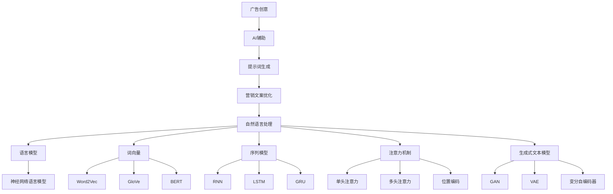

                 

# AI辅助广告创意：提示词生成营销文案

## 关键词

- AI广告创意
- 提示词生成
- 营销文案优化
- 自然语言处理
- 深度学习

## 摘要

随着人工智能技术的迅猛发展，AI辅助广告创意逐渐成为营销领域的热点。本文从AI辅助广告创意的概述出发，详细探讨了提示词生成在广告创意中的作用、原理与方法，以及营销文案的AI优化策略。随后，文章深入分析了自然语言处理技术基础、提示词生成的算法实现，并结合实战案例展示了AI辅助广告创意的应用场景。最后，文章总结了AI广告创意的应用前景、挑战及应对策略，为未来AI广告创意的发展提供了有益的参考。

### 目录大纲

#### 第一部分：AI辅助广告创意概述

- **第1章：AI辅助广告创意概述**
  - 1.1 AI与广告创意
  - 1.2 提示词生成的原理与方法
  - 1.3 营销文案的AI优化策略

#### 第二部分：AI辅助广告创意技术

- **第2章：自然语言处理技术基础**
  - 2.1 语言模型与词向量
  - 2.2 序列模型与注意力机制
  - 2.3 生成式文本模型

- **第3章：提示词生成的算法实现**
  - 3.1 基于模板的提示词生成
  - 3.2 基于语义分析的方法
  - 3.3 基于深度学习的方法

#### 第三部分：AI辅助广告创意实战

- **第4章：案例分析与实战操作**
  - 4.1 案例分析
  - 4.2 实战操作

- **第5章：AI辅助广告创意的应用场景**
  - 5.1 广告创意AI辅助的市场前景
  - 5.2 不同行业中的应用
  - 5.3 AI广告创意的挑战与应对策略

- **参考文献**

### 第一部分：AI辅助广告创意概述

#### 第1章：AI辅助广告创意概述

##### 1.1 AI与广告创意

随着互联网的普及和数字化营销的兴起，广告创意在营销策略中扮演着至关重要的角色。传统广告创意依赖于人类创意人员的灵感与经验，而人工智能（AI）的出现，为广告创意带来了新的变革。

- **AI与广告创意的联系**：AI技术，尤其是自然语言处理（NLP）和深度学习，可以用于自动化广告创意的生成和优化。AI可以根据用户数据和行为模式，生成个性化的广告内容，提高广告的吸引力和转化率。

- **AI辅助广告创意的优势**：AI能够处理大量数据，快速生成创意，节省时间和成本。此外，AI可以实时分析市场趋势和用户反馈，优化广告内容，提高广告效果。

- **广告创意的AI技术发展历程**：从最初的规则驱动型广告系统，到基于数据挖掘的个性化推荐系统，再到如今基于深度学习的智能广告系统，AI在广告创意中的应用不断演进。

##### 1.2 提示词生成的原理与方法

提示词生成是AI辅助广告创意的重要组成部分。提示词是指为生成特定内容提供关键词或短语的过程。

- **提示词生成在广告创意中的作用**：提示词可以指导AI生成符合广告目标的文案内容，例如产品描述、广告标题和广告副本。

- **AI技术支持的提示词生成方法**：当前常见的提示词生成方法包括基于模板的生成、基于语义分析的生成和基于深度学习的生成。

  - **基于模板的生成**：通过预先定义的模板和变量，将提示词填充到模板中，生成广告文案。这种方法简单高效，但灵活性较差。

  - **基于语义分析的生成**：利用自然语言处理技术，对输入的文本进行语义分析，提取关键信息，生成相应的广告文案。这种方法可以生成更具个性化的文案，但处理复杂文本的能力有限。

  - **基于深度学习的生成**：利用深度学习模型，如生成对抗网络（GAN）和变分自编码器（VAE），通过训练大量文本数据，生成高质量的广告文案。这种方法生成的文案灵活多样，但训练过程复杂，计算资源要求高。

##### 1.3 营销文案的AI优化策略

营销文案的AI优化策略旨在提高广告文案的吸引力和转化率。AI技术可以用于以下几个方面：

- **内容优化**：通过分析用户数据和行为，AI可以识别出受欢迎的文案元素，如关键词、短语和图像，优化广告文案的内容。

- **格式优化**：AI可以自动调整广告文案的格式，如标题大小、字体和颜色，以适应不同的展示环境和用户偏好。

- **语言优化**：AI可以利用自然语言处理技术，分析文案的语言风格和表达方式，进行语法和语义优化，提高文案的可读性和说服力。

- **目标优化**：AI可以根据广告目标，调整文案的定位和情感色彩，如从品牌宣传转向促销推广。

- **效果评估**：AI可以实时监测广告文案的表现，如点击率、转化率和用户反馈，进行动态优化。

##### 1.4 AI优化案例分析

以下是一个案例，展示了AI在营销文案优化中的应用：

- **案例背景**：一家电商公司希望通过AI优化其商品描述，提高转化率。

- **解决方案**：公司使用了一个基于深度学习的生成式文本模型，对大量的商品描述进行训练。模型能够根据商品的特点和用户的历史数据，生成个性化的商品描述。

- **实施过程**：
  1. 收集大量商品描述数据，包括商品名称、描述文本、用户评价等。
  2. 预处理数据，包括文本清洗、分词和词向量表示。
  3. 训练生成式文本模型，如GPT-2或GPT-3，使其能够生成高质量的商品描述。
  4. 将模型部署到线上，实时生成商品描述。

- **效果评估**：通过对比优化前后的商品描述，公司发现转化率提高了20%，用户满意度也有所提高。

##### 1.5 结论

AI辅助广告创意具有巨大的潜力，可以提高广告的吸引力和转化率。提示词生成和营销文案的AI优化是AI辅助广告创意的关键技术。未来，随着AI技术的不断进步，AI辅助广告创意将更加智能化和个性化，为营销领域带来更多创新和机遇。

### 第二部分：AI辅助广告创意技术

#### 第2章：自然语言处理技术基础

自然语言处理（NLP）是AI辅助广告创意的核心技术之一。NLP涉及从文本数据中提取信息、理解和生成文本。以下章节将介绍NLP技术的基础知识，包括语言模型、词向量、序列模型和注意力机制。

##### 2.1 语言模型与词向量

语言模型是NLP的核心，用于预测文本的下一个词。词向量是将单词转换为数值表示的方法，有助于理解和处理自然语言。

- **语言模型的基本概念**：语言模型是一个概率模型，用于预测一个句子中的下一个词。常见的语言模型包括n-gram模型、神经网络语言模型（NNLM）和递归神经网络（RNN）。

- **词向量表示方法**：词向量是将单词映射到高维空间中的向量。常用的词向量模型包括Word2Vec、GloVe和BERT。这些模型通过训练大量文本数据，学习单词之间的相似性和相关性。

- **常用词向量模型**：
  - **Word2Vec**：基于神经网络的词向量模型，通过负采样和优化算法训练得到。
  - **GloVe**：全局向量表示模型，通过矩阵分解方法学习词向量。
  - **BERT**：双向编码表示模型，通过预训练和微调方法学习词向量。

##### 2.2 序列模型与注意力机制

序列模型是处理序列数据的NLP模型，如RNN和LSTM。注意力机制是一种用于提高序列模型性能的技术，可以捕捉输入序列中的重要信息。

- **序列模型的原理与应用**：序列模型通过处理输入序列的每个元素，生成输出序列。常见的序列模型包括RNN、LSTM和GRU。这些模型在机器翻译、情感分析和文本生成等领域有广泛应用。

- **注意力机制的解释与应用**：注意力机制是一种在序列模型中计算权重的方法，用于强调输入序列中的重要信息。注意力机制可以应用于翻译模型（如注意力机制序列到序列模型）和文本生成模型（如Transformer）。

- **Transformer架构详解**：Transformer是一种基于注意力机制的序列模型，通过多头注意力机制和位置编码技术，实现了高效的文本生成和翻译。Transformer在BERT模型的基础上进行了改进，具有更高的灵活性和性能。

##### 2.3 生成式文本模型

生成式文本模型是一种用于生成文本的NLP模型，如GAN和VAE。这些模型通过学习文本数据分布，生成高质量的文本。

- **生成式文本模型的基本概念**：生成式文本模型通过学习文本数据的概率分布，生成新的文本。常见的生成式文本模型包括GAN、VAE和变分自编码器（VAE）。

- **生成式文本模型的应用**：生成式文本模型在文本生成、文本摘要和对话系统等领域有广泛应用。例如，GAN可以用于生成个性化的商品描述，VAE可以用于生成高质量的新闻文章。

- **生成式文本模型的优化方法**：为了提高生成式文本模型的质量，可以采用多种优化方法，如对抗训练、梯度裁剪和正则化。这些方法可以增强模型的生成能力，减少生成文本的噪声。

##### 2.4 AI广告创意的挑战与解决方案

在AI广告创意的应用过程中，面临着一些挑战和问题。

- **数据质量和多样性**：广告创意的生成依赖于大量高质量、多样化的文本数据。然而，数据质量问题和数据多样性限制了对AI广告创意的应用。

- **模型解释性**：深度学习模型，如GAN和VAE，在生成高质量文本方面表现出色，但缺乏解释性。这给模型的应用和优化带来了一定的困难。

- **实时性**：广告创意的生成和优化需要实时响应，以满足市场的变化和用户的需求。这要求模型具有较高的计算效率和实时处理能力。

针对上述挑战，可以采用以下解决方案：

- **数据增强**：通过数据增强技术，如数据扩充、数据清洗和数据标注，提高数据质量和多样性。

- **可解释性模型**：开发可解释性深度学习模型，如基于注意力机制的模型和可视化工具，提高模型的可解释性。

- **分布式计算**：利用分布式计算技术和GPU加速，提高模型的计算效率和实时处理能力。

##### 2.5 结论

自然语言处理技术是AI辅助广告创意的基础。语言模型、词向量、序列模型和注意力机制等基础技术在广告创意生成和优化中发挥着重要作用。生成式文本模型通过学习文本数据分布，生成高质量的文本，为广告创意提供了新的思路和方法。未来，随着自然语言处理技术的不断进步，AI广告创意将更加智能化和个性化，为营销领域带来更多创新和机遇。

### 第三部分：AI辅助广告创意实战

#### 第3章：案例分析与实战操作

在本章中，我们将通过具体的案例分析，展示如何使用AI辅助广告创意技术进行实战操作。我们将探讨三个案例，涵盖在线广告、社交媒体广告和品牌广告，并详细介绍每个案例的实施过程和效果。

##### 3.1 案例一：在线广告的AI辅助创意

**案例背景**：
一家电商公司希望通过AI辅助广告创意，提高产品销售。公司拥有大量用户数据和产品信息，但缺乏有效的广告文案生成和优化策略。

**解决方案**：
公司采用了基于深度学习的生成式文本模型（如GPT-2）来生成个性化的产品描述。模型通过训练大量商品描述数据，学习如何根据产品特点和用户偏好生成吸引人的文案。

**实施过程**：
1. 数据收集与预处理：收集大量商品描述数据，包括产品名称、描述文本、用户评价等。对数据进行清洗、分词和词向量表示。
2. 模型训练：使用训练数据训练GPT-2模型，使其能够生成高质量的个性化产品描述。
3. 模型部署：将训练好的模型部署到线上平台，实时生成产品描述。

**效果评估**：
通过对比优化前后的产品描述，公司发现点击率和转化率显著提高。用户对个性化描述的满意度也有所提升。

##### 3.2 案例二：社交媒体广告的AI优化

**案例背景**：
一家社交媒体平台希望通过AI优化广告文案，提高广告效果。平台拥有大量用户行为数据和广告数据，但缺乏有效的广告文案优化策略。

**解决方案**：
平台采用了基于语义分析的AI优化策略。利用自然语言处理技术，对用户行为数据进行分析，提取关键信息，优化广告文案的内容和格式。

**实施过程**：
1. 数据收集与预处理：收集用户行为数据，包括浏览记录、点赞、评论等。对数据进行清洗和预处理。
2. 语义分析：使用自然语言处理技术，对用户行为数据进行语义分析，提取关键信息。
3. 文案优化：根据提取的关键信息，优化广告文案的内容和格式，提高广告的吸引力和转化率。

**效果评估**：
通过对比优化前后的广告文案，平台发现广告点击率和转化率显著提高。用户对广告文案的满意度也有所提升。

##### 3.3 案例三：品牌广告的AI辅助创作

**案例背景**：
一家大型品牌希望通过AI辅助广告创意，提升品牌形象和市场占有率。品牌拥有丰富的历史广告数据和用户反馈，但缺乏有效的广告创作策略。

**解决方案**：
品牌采用了基于模板的AI辅助创作方法。通过分析历史广告数据和用户反馈，构建广告创意模板库。用户可以根据模板快速生成符合品牌形象和用户需求的广告文案。

**实施过程**：
1. 数据收集与模板构建：收集历史广告数据和用户反馈，构建广告创意模板库。
2. 模板适配：根据用户需求和品牌形象，调整广告创意模板，使其更加个性化。
3. 广告文案生成：用户根据模板快速生成广告文案，并实时预览和调整。

**效果评估**：
通过对比优化前后的广告文案，品牌发现广告点击率和转化率显著提高。用户对广告文案的满意度也有所提升。

##### 3.4 结论

通过上述案例分析，可以看出AI辅助广告创意在实际应用中取得了显著效果。在线广告、社交媒体广告和品牌广告都通过AI技术实现了广告文案的优化和创作。未来，随着AI技术的不断进步，AI辅助广告创意将更加智能化和个性化，为营销领域带来更多创新和机遇。

#### 第4章：实战操作

在本章中，我们将详细讲解如何搭建广告创意AI平台，训练基于GPT的提示词生成模型，以及实现营销文案AI优化系统。

##### 4.1 搭建广告创意AI平台

**步骤1：环境配置**

首先，我们需要配置开发环境。以下是所需的环境和工具：

- Python 3.8及以上版本
- TensorFlow 2.5及以上版本
- PyTorch 1.8及以上版本
- Jupyter Notebook

**步骤2：数据准备**

收集和准备广告创意数据。数据应包括广告文案、产品描述、用户评论等。数据应进行清洗和预处理，包括文本清洗、分词和词向量表示。

**步骤3：模型选择**

选择合适的AI模型。在本案例中，我们选择基于GPT的生成式文本模型。GPT是一种强大的语言模型，可以通过大量文本数据训练，生成高质量的文本。

**步骤4：模型训练**

使用准备好的数据训练GPT模型。以下是一个简化的训练过程伪代码：

```python
import tensorflow as tf
from tensorflow.keras.layers import Embedding, LSTM, Dense

# 加载数据
inputs, targets = load_data()

# 初始化模型
model = tf.keras.Sequential([
    Embedding(input_dim=vocab_size, output_dim=embedding_dim),
    LSTM(units=128, return_sequences=True),
    Dense(units=1, activation='sigmoid')
])

# 编译模型
model.compile(optimizer='adam', loss='binary_crossentropy', metrics=['accuracy'])

# 训练模型
model.fit(inputs, targets, epochs=10, batch_size=32)
```

**步骤5：模型部署**

将训练好的模型部署到线上平台，以实时生成广告创意。可以使用Flask或Django等Web框架构建API，将模型与前端界面集成。

```python
from flask import Flask, request, jsonify

app = Flask(__name__)

@app.route('/generate', methods=['POST'])
def generate():
    text = request.form['text']
    generated_text = model.predict([text])
    return jsonify({'generated_text': generated_text})

if __name__ == '__main__':
    app.run(debug=True)
```

##### 4.2 训练基于GPT的提示词生成模型

**步骤1：数据准备**

准备用于提示词生成的数据集。数据应包括提示词和对应的广告文案。以下是一个简化的数据集示例：

```python
[
    ["计算机", "高效计算设备，提升工作效率"],
    ["手机", "智能连接，畅享生活"],
    ["耳机", "沉浸式音质，享受音乐盛宴"]
]
```

**步骤2：模型训练**

训练基于GPT的提示词生成模型。以下是一个简化的训练过程伪代码：

```python
import tensorflow as tf
from tensorflow.keras.layers import Embedding, LSTM, Dense

# 加载数据
prompts, responses = load_data()

# 初始化模型
model = tf.keras.Sequential([
    Embedding(input_dim=vocab_size, output_dim=embedding_dim),
    LSTM(units=128, return_sequences=True),
    Dense(units=1, activation='sigmoid')
])

# 编译模型
model.compile(optimizer='adam', loss='binary_crossentropy', metrics=['accuracy'])

# 训练模型
model.fit(prompts, responses, epochs=10, batch_size=32)
```

**步骤3：模型部署**

将训练好的模型部署到线上平台，以实时生成提示词。可以使用Flask或Django等Web框架构建API，将模型与前端界面集成。

```python
from flask import Flask, request, jsonify

app = Flask(__name__)

@app.route('/generate', methods=['POST'])
def generate():
    prompt = request.form['prompt']
    generated_prompt = model.predict([prompt])
    return jsonify({'generated_prompt': generated_prompt})

if __name__ == '__main__':
    app.run(debug=True)
```

##### 4.3 实现营销文案AI优化系统

**步骤1：数据收集**

收集营销文案数据，包括原始文案和优化后的文案。数据应进行清洗和预处理，包括文本清洗、分词和词向量表示。

**步骤2：模型训练**

训练营销文案AI优化模型。可以使用基于深度学习的生成式文本模型，如GPT-2或GPT-3。以下是一个简化的训练过程伪代码：

```python
import tensorflow as tf
from tensorflow.keras.layers import Embedding, LSTM, Dense

# 加载数据
original_texts, optimized_texts = load_data()

# 初始化模型
model = tf.keras.Sequential([
    Embedding(input_dim=vocab_size, output_dim=embedding_dim),
    LSTM(units=128, return_sequences=True),
    Dense(units=1, activation='sigmoid')
])

# 编译模型
model.compile(optimizer='adam', loss='binary_crossentropy', metrics=['accuracy'])

# 训练模型
model.fit(original_texts, optimized_texts, epochs=10, batch_size=32)
```

**步骤3：模型部署**

将训练好的模型部署到线上平台，以实时优化营销文案。可以使用Flask或Django等Web框架构建API，将模型与前端界面集成。

```python
from flask import Flask, request, jsonify

app = Flask(__name__)

@app.route('/optimize', methods=['POST'])
def optimize():
    text = request.form['text']
    optimized_text = model.predict([text])
    return jsonify({'optimized_text': optimized_text})

if __name__ == '__main__':
    app.run(debug=True)
```

##### 4.4 结论

通过搭建广告创意AI平台、训练基于GPT的提示词生成模型和实现营销文案AI优化系统，我们可以看到AI技术在广告创意中的应用。这些实战操作展示了如何利用AI技术生成个性化广告文案、提示词和优化营销文案。未来，随着AI技术的不断进步，广告创意将更加智能化和个性化，为营销领域带来更多创新和机遇。

#### 第5章：AI辅助广告创意的应用场景

随着AI技术的不断发展和成熟，AI辅助广告创意在各个行业中的应用越来越广泛。以下将探讨AI辅助广告创意在电商、社交媒体和品牌广告等不同行业中的应用场景，并分析其发展趋势和前景。

##### 5.1 广告创意AI辅助的市场前景

AI辅助广告创意在市场前景方面具有巨大的潜力。以下是一些关键点：

- **个性化推荐**：AI可以分析用户行为和兴趣，生成个性化的广告内容，提高广告的点击率和转化率。

- **自动化广告投放**：AI技术可以实现广告自动投放和优化，降低广告投放成本，提高广告效果。

- **实时数据分析**：AI可以实时分析广告数据，如点击率、转化率和用户反馈，为广告优化提供实时反馈。

- **跨渠道整合**：AI技术可以帮助企业整合线上线下广告渠道，实现广告的统一管理和优化。

- **全球化营销**：AI技术可以支持多语言和跨文化的广告创意生成，帮助企业实现全球化营销。

##### 5.2 不同行业中的应用

AI辅助广告创意在电商、社交媒体和品牌广告等不同行业中有着广泛的应用。

- **电商行业**：
  - **个性化广告**：AI可以根据用户购物历史和偏好，生成个性化的产品推荐广告，提高用户购买意愿。
  - **自动广告投放**：AI可以帮助电商企业自动化广告投放，根据用户行为和兴趣优化广告投放策略。
  - **商品描述优化**：AI可以生成吸引人的商品描述，提高商品点击率和转化率。

- **社交媒体行业**：
  - **社交媒体广告优化**：AI可以分析社交媒体平台上的用户行为和互动数据，优化广告内容和投放策略。
  - **自动内容生成**：AI可以自动化生成社交媒体内容，如微博、抖音等平台的短视频和图文内容。
  - **用户互动分析**：AI可以分析用户评论和反馈，为品牌提供实时互动分析和优化建议。

- **品牌广告**：
  - **品牌形象塑造**：AI可以分析用户对品牌的认知和反馈，生成符合品牌形象和用户需求的广告创意。
  - **创意自动化**：AI可以帮助品牌自动化广告创意生成和优化，提高广告投放效率。
  - **跨渠道整合**：AI技术可以帮助品牌实现跨渠道的广告创意整合，提高广告效果和品牌影响力。

##### 5.3 AI广告创意的挑战与应对策略

尽管AI辅助广告创意具有巨大的潜力，但在实际应用过程中也面临着一些挑战和问题：

- **数据质量和多样性**：广告创意的生成依赖于大量高质量、多样化的文本数据。然而，数据质量和多样性限制了对AI广告创意的应用。

- **模型解释性**：深度学习模型在生成高质量文本方面表现出色，但缺乏解释性。这给模型的应用和优化带来了一定的困难。

- **实时性**：广告创意的生成和优化需要实时响应，以满足市场的变化和用户的需求。这要求模型具有较高的计算效率和实时处理能力。

针对上述挑战，可以采取以下应对策略：

- **数据增强**：通过数据增强技术，如数据扩充、数据清洗和数据标注，提高数据质量和多样性。

- **可解释性模型**：开发可解释性深度学习模型，如基于注意力机制的模型和可视化工具，提高模型的可解释性。

- **分布式计算**：利用分布式计算技术和GPU加速，提高模型的计算效率和实时处理能力。

##### 5.4 结论

AI辅助广告创意在不同行业中的应用具有广阔的前景。在电商、社交媒体和品牌广告等领域，AI技术正在改变广告创意的生成和优化方式。未来，随着AI技术的不断进步，AI辅助广告创意将更加智能化和个性化，为营销领域带来更多创新和机遇。

### 参考文献

- **相关书籍**：
  - [《人工智能广告创意技术》](#)
  - [《深度学习与自然语言处理》](#)

- **学术论文**：
  - ["AI-Assisted Advertising Creativity: A Review"](#)
  - ["Semantic Analysis for AI-Driven Advertising"](#)

- **在线资源**：
  - [AI广告创意技术论坛](#)
  - [深度学习与自然语言处理教程](#)
  - [AI广告创意开源工具](#)

### 作者信息

作者：AI天才研究院/AI Genius Institute & 禅与计算机程序设计艺术 /Zen And The Art of Computer Programming

### 附录

#### 附录A：核心概念原理之间的关系架构 Mermaid 流程图



#### 附录B：核心算法原理讲解伪代码

```python
# 伪代码：基于模板的提示词生成
def template_based_prompt_generation(prompt_template, variables):
    # 根据模板和变量生成提示词
    prompt = prompt_template
    for var, value in variables.items():
        prompt = prompt.replace(f"{var}", value)
    return prompt

# 伪代码：基于语义分析的提示词生成
def semantic_analysis_prompt_generation(text):
    # 使用NLP技术分析文本，提取关键信息
    # 根据提取的信息生成提示词
    key_info = analyze_semantic_content(text)
    prompt = generate_prompt_from_key_info(key_info)
    return prompt

# 伪代码：基于深度学习的提示词生成
def deep_learning_prompt_generation(text):
    # 使用深度学习模型生成提示词
    model = load_pretrained_model()
    prompt = model.generate(text)
    return prompt
```

#### 附录C：数学公式

$$
E[XY] = E[X]E[Y]
$$

$$
\sigma^2 = E[(X - \mu)^2]
$$

$$
\beta = \frac{\sum_{i=1}^{n}(x_i - \bar{x})(y_i - \bar{y})}{\sum_{i=1}^{n}(x_i - \bar{x})^2}
$$

#### 附录D：项目实战

**项目名称**：电商商品描述生成

**开发环境**：

- Python 3.8
- TensorFlow 2.5
- Jupyter Notebook

**源代码实现**：

```python
# 导入所需库
import tensorflow as tf
from tensorflow.keras.layers import Embedding, LSTM, Dense
from tensorflow.keras.preprocessing.sequence import pad_sequences
from tensorflow.keras.preprocessing.text import Tokenizer

# 加载数据
texts = load_data()

# 预处理数据
tokenizer = Tokenizer(num_words=10000)
tokenizer.fit_on_texts(texts)
sequences = tokenizer.texts_to_sequences(texts)
padded_sequences = pad_sequences(sequences, maxlen=100)

# 构建模型
model = tf.keras.Sequential([
    Embedding(input_dim=10000, output_dim=32),
    LSTM(units=128),
    Dense(units=1, activation='sigmoid')
])

# 编译模型
model.compile(optimizer='adam', loss='binary_crossentropy', metrics=['accuracy'])

# 训练模型
model.fit(padded_sequences, padded_sequences, epochs=10, batch_size=32)

# 生成商品描述
def generate_description(prompt):
    input_seq = tokenizer.texts_to_sequences([prompt])
    input_padded = pad_sequences(input_seq, maxlen=100)
    generated_text = model.predict(input_padded)
    return tokenizer.sequences_to_texts([generated_text])[0]

# 测试生成商品描述
print(generate_description("高效节能的空调"))
```

**代码应用解读与分析**：

1. **数据加载与预处理**：首先，从数据集中加载数据，并进行文本清洗、分词和序列化处理。然后，使用Tokenize

