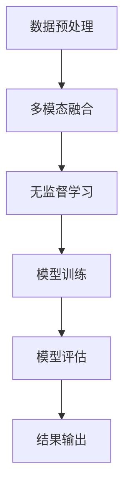

                 

### 文章完整内容

# 《Zero-Shot CoT：突破传统机器学习的局限》

> 关键词：Zero-Shot CoT，传统机器学习，突破局限，人工智能，机器学习算法

> 摘要：本文旨在探讨Zero-Shot CoT（零样本转移学习）如何突破传统机器学习的局限，通过引入零样本学习和多模态融合，提高机器学习的泛化能力和适应性。文章将详细介绍Zero-Shot CoT的核心概念、算法原理，并通过实际案例进行深入分析。

## 第1章 引言

### 1.1 机器学习的局限性

#### 1.1.1 监督学习的局限性

监督学习是一种常见的机器学习方法，其核心思想是通过已标记的数据来训练模型，以便在新的、未见过的数据上进行预测。然而，监督学习的局限性主要体现在以下几个方面：

1. **数据依赖问题**：监督学习需要大量的标记数据来进行训练，但在实际应用中，获取这些数据往往需要巨大的成本和时间。

2. **标签标注成本高**：数据的标注过程是一个繁琐且耗时的任务，特别是在领域特定的任务中，如医疗图像的分析。

3. **泛化能力差**：尽管监督学习在训练数据上取得了很好的效果，但其在未见过的数据上的表现往往不佳，即存在过拟合问题。

#### 1.1.2 无监督学习的挑战

无监督学习不需要已标记的数据，它主要通过发现数据中的隐含结构来学习。然而，无监督学习也存在一些挑战：

1. **自编码器（Autoencoder）的数学模型**：
   $$
   \min_{\theta} \sum_{x \in D} D(x, \hat{x}) + \lambda R(\theta)
   $$
   其中，$D(x, \hat{x})$ 是重构误差，$R(\theta)$ 是正则化项。

2. **随机梯度下降（SGD）算法**：
   $$
   \theta \leftarrow \theta - \alpha \nabla_{\theta} J(\theta)
   $$
   其中，$\alpha$ 是学习率，$J(\theta)$ 是损失函数。

### 1.2 什么是Zero-Shot CoT

Zero-Shot CoT（零样本转移学习）是一种基于多模态融合和无监督学习的方法，它旨在解决传统机器学习中的数据依赖和标签标注成本高的问题。Zero-Shot CoT的核心思想是通过跨领域迁移学习和自适应数据增强，使得模型能够在零样本或少量样本的情况下进行有效的学习和预测。

- **多模态融合**：将不同类型的数据（如图像、文本、音频等）进行融合，以提高模型的泛化能力。

- **跨领域迁移学习**：通过在不同领域间迁移知识，使得模型能够在新的领域中进行有效的学习和预测。

- **自适应数据增强**：通过自适应的数据增强方法，增加训练数据的多样性，以增强模型的泛化能力。

### 1.3 Zero-Shot CoT的重要性

Zero-Shot CoT的重要性主要体现在以下几个方面：

1. **突破传统机器学习的局限**：通过引入零样本学习和多模态融合，Zero-Shot CoT能够有效解决传统机器学习中的数据依赖和标签标注成本高的问题。

2. **提高泛化能力**：Zero-Shot CoT通过跨领域迁移学习和自适应数据增强，能够提高模型的泛化能力，使其在未见过的数据上表现良好。

3. **降低成本**：Zero-Shot CoT能够减少对大量标记数据的依赖，从而降低数据获取和标注的成本。

### 1.4 本书结构安排

本书将分为以下几部分：

1. **第1章 引言**：介绍机器学习的局限性以及Zero-Shot CoT的概念和重要性。

2. **第2章 核心概念与联系**：详细讨论Zero-Shot CoT的核心概念、算法原理，并给出相关的Mermaid流程图。

3. **第3章 核心算法原理讲解**：介绍Zero-Shot CoT的核心算法，包括词嵌入算法、自编码器、决策树与随机森林等。

4. **第4章 数学模型与公式**：给出与Zero-Shot CoT相关的数学模型和公式，并进行详细讲解。

5. **第5章 项目实战**：通过一个实际项目，介绍如何搭建开发环境，实现源代码，并进行代码解读与分析。

6. **第6章 案例研究**：分析两个实际案例，包括文本分类和图像识别，展示Zero-Shot CoT的应用。

7. **第7章 未来展望与总结**：讨论Zero-Shot CoT的未来发展趋势和总结。

## 第2章 核心概念与联系

### 2.1 机器学习基础

机器学习是人工智能的核心技术之一，其基础主要分为三种：监督学习、无监督学习和强化学习。

#### 2.1.1 监督学习

监督学习是一种有标记数据训练模型的机器学习方法。其基本框架如下：

1. **输入**：一组特征向量 $X$ 和对应的标签 $Y$。

2. **输出**：一个模型 $f(X)$，使得对于新的特征向量 $X'$，可以预测其对应的标签 $Y'$。

3. **模型训练**：通过最小化损失函数 $L(Y, f(X))$ 来训练模型。

常见的监督学习方法包括线性回归、逻辑回归、支持向量机（SVM）等。

#### 2.1.2 无监督学习

无监督学习是一种没有标记数据训练模型的机器学习方法。其基本框架如下：

1. **输入**：一组特征向量 $X$。

2. **输出**：一个模型 $f(X)$，使得数据 $X$ 被映射到一个新的空间。

3. **模型训练**：通过优化数据分布或特征表示来训练模型。

常见的无监督学习方法包括自编码器（Autoencoder）、聚类算法（如K-means）等。

#### 2.1.3 强化学习

强化学习是一种通过与环境交互来训练模型的机器学习方法。其基本框架如下：

1. **输入**：当前状态 $S$。

2. **输出**：一个动作 $A$。

3. **奖励**：在执行动作 $A$ 后，得到奖励 $R$。

4. **模型训练**：通过最大化累积奖励来训练模型。

常见的强化学习方法包括Q学习、深度强化学习等。

### 2.2 传统机器学习的问题

尽管传统机器学习在许多任务中取得了显著的效果，但它也存在一些问题：

#### 2.2.1 数据依赖问题

传统机器学习需要大量的标记数据来训练模型，但获取这些数据往往需要巨大的成本和时间。

#### 2.2.2 标签标注成本高

在特定领域，如医疗图像分析，标签标注的成本非常高。

#### 2.2.3 泛化能力差

尽管模型在训练数据上表现良好，但其在未见过的数据上的表现往往不佳。

### 2.3 Zero-Shot CoT的基本原理

Zero-Shot CoT（零样本转移学习）是一种基于多模态融合和无监督学习的方法，旨在解决传统机器学习的问题。

#### 2.3.1 CoT的概念

CoT（Concept Transfer）是一种跨领域迁移学习方法，其核心思想是将一个领域的知识迁移到另一个领域。

- **多模态融合**：将不同类型的数据进行融合，如图像和文本。

- **无监督学习**：在没有标记数据的情况下进行学习。

- **自适应数据增强**：通过自适应的数据增强方法，增加训练数据的多样性。

#### 2.3.2 Zero-Shot CoT的优势

Zero-Shot CoT具有以下优势：

- **降低数据依赖**：通过零样本学习和跨领域迁移，减少对大量标记数据的依赖。

- **提高泛化能力**：通过多模态融合和自适应数据增强，提高模型的泛化能力。

- **降低成本**：通过减少标签标注的需求，降低数据获取和标注的成本。

### 2.4 Mermaid流程图

以下是一个简单的Mermaid流程图，展示了Zero-Shot CoT的基本流程：



## 第3章 核心算法原理讲解

### 3.1 基础算法

在Zero-Shot CoT中，使用了一系列的基础算法来支持模型的训练和评估。以下是这些基础算法的简要介绍和伪代码：

#### 3.1.1 词嵌入算法

词嵌入是一种将词汇映射到向量空间的方法，常见的算法包括Word2Vec和GloVe。

- **Word2Vec算法**：
  $$
  \min_{\theta} \sum_{i=1}^{N} \sum_{j=1}^{V} \log(p(w_j|w_i))
  $$
  其中，$w_i$ 和 $w_j$ 分别是词汇表中的单词，$p(w_j|w_i)$ 是在单词 $w_i$ 出现的情况下，单词 $w_j$ 出现的概率。

- **GloVe算法**：
  $$
  \min_{\theta} \sum_{i=1}^{N} \sum_{j=1}^{V} \left( \theta_i \cdot \theta_j - \log(p(w_i, w_j)) \right)^2
  $$
  其中，$p(w_i, w_j)$ 是单词 $w_i$ 和 $w_j$ 同时出现的概率。

#### 3.1.2 自编码器

自编码器是一种无监督学习算法，用于学习数据的特征表示。

- **自编码器算法**：
  $$
  \min_{\theta} \sum_{x \in D} D(x, \hat{x}) + \lambda R(\theta)
  $$
  其中，$D(x, \hat{x})$ 是重构误差，$R(\theta)$ 是正则化项。

#### 3.1.3 决策树与随机森林

决策树和随机森林是常见的监督学习算法，用于分类和回归任务。

- **决策树算法**：
  $$
  \text{递归划分} \quad \text{直到} \quad \text{终止条件满足}
  $$
  终止条件可以是叶节点数量达到阈值、信息增益达到阈值等。

- **随机森林算法**：
  $$
  \text{随机选择特征子集} \quad \text{构建多个决策树}
  $$
  $$
  \text{投票} \quad \text{获得最终预测结果}
  $$

### 3.2 Zero-Shot CoT算法

Zero-Shot CoT算法是基于多模态融合和无监督学习的方法，旨在解决传统机器学习中的数据依赖和标签标注成本高的问题。

#### 3.2.1 对抗性样本生成

对抗性样本生成是一种增强模型泛化能力的方法，通过生成对抗网络（GAN）来实现。

- **对抗性样本生成算法**：
  $$
  \min_{\theta_G} \max_{\theta_D} V(\theta_G, \theta_D)
  $$
  其中，$V(\theta_G, \theta_D)$ 是生成网络和判别网络的对抗性损失函数。

#### 3.2.2 多任务学习

多任务学习是一种同时学习多个相关任务的方法，可以共享特征表示，提高模型的泛化能力。

- **多任务学习算法**：
  $$
  \min_{\theta} \sum_{i=1}^{M} L_i(\theta)
  $$
  其中，$L_i(\theta)$ 是第 $i$ 个任务的损失函数。

#### 3.2.3 无监督学习算法

无监督学习算法是Zero-Shot CoT的核心，用于学习数据的特征表示。

- **无监督学习算法**：
  $$
  \min_{\theta} \sum_{x \in D} D(x, \hat{x}) + \lambda R(\theta)
  $$
  其中，$D(x, \hat{x})$ 是重构误差，$R(\theta)$ 是正则化项。

## 第4章 数学模型与公式

### 4.1 相关公式

在Zero-Shot CoT中，涉及多个数学模型和公式，以下是其中的一些关键公式：

#### 4.1.1 概率论基本公式

1. **贝叶斯公式**：
   $$
   P(A|B) = \frac{P(B|A)P(A)}{P(B)}
   $$
2. **条件概率**：
   $$
   P(A|B) = \frac{P(A \cap B)}{P(B)}
   $$

#### 4.1.2 信息论公式

1. **熵**：
   $$
   H(X) = -\sum_{i=1}^{n} P(X=i) \log_2 P(X=i)
   $$
2. **互信息**：
   $$
   I(X; Y) = H(X) - H(X | Y)
   $$

#### 4.1.3 神经网络损失函数

1. **均方误差（MSE）**：
   $$
   \text{MSE} = \frac{1}{n} \sum_{i=1}^{n} (\hat{y}_i - y_i)^2
   $$
2. **交叉熵（Cross-Entropy）**：
   $$
   \text{CE} = -\sum_{i=1}^{n} y_i \log(\hat{y}_i)
   $$

### 4.2 例子说明

为了更好地理解这些公式，下面通过具体的例子进行说明。

#### 4.2.1 数据分布模型

假设我们有一个二元变量 $X$，其概率分布为 $P(X=0) = 0.6$，$P(X=1) = 0.4$。根据熵的公式，我们可以计算其熵：

$$
H(X) = -0.6 \log_2(0.6) - 0.4 \log_2(0.4) \approx 0.970
$$

#### 4.2.2 分类问题例子

假设我们有一个二分类问题，真实标签 $y$ 为 1，预测标签 $\hat{y}$ 为 0.6。根据交叉熵的公式，我们可以计算其损失：

$$
\text{CE} = -1 \cdot \log_2(0.6) = -\log_2(0.6) \approx 0.5108
$$

#### 4.2.3 回归问题例子

假设我们有一个回归问题，真实值为 $y = 5$，预测值为 $\hat{y} = 4.8$。根据均方误差的公式，我们可以计算其损失：

$$
\text{MSE} = \frac{1}{1} (5 - 4.8)^2 = 0.04
$$

## 第5章 项目实战

### 5.1 环境搭建

在开始项目实战之前，我们需要搭建一个合适的环境，包括Python环境、数据集和常用库的安装。

#### 5.1.1 Python环境搭建

确保Python环境已经安装，版本至少为3.6以上。如果没有安装，可以通过以下命令进行安装：

```bash
sudo apt-get install python3 python3-pip
```

#### 5.1.2 数据集准备

我们选择一个公开的文本分类数据集，如20 Newsgroups。可以通过以下命令下载和准备数据集：

```python
from sklearn.datasets import fetch_20newsgroups
from sklearn.model_selection import train_test_split

newsgroups = fetch_20newsgroups(subset='all')
X_train, X_test, y_train, y_test = train_test_split(newsgroups.data, newsgroups.target, test_size=0.2, random_state=42)
```

#### 5.1.3 常用库安装

安装常用的机器学习库，如scikit-learn、numpy和pandas：

```bash
pip install scikit-learn numpy pandas
```

### 5.2 源代码实现

在本节中，我们将使用Zero-Shot CoT算法对文本分类问题进行建模和训练。

#### 5.2.1 数据预处理

```python
from sklearn.feature_extraction.text import TfidfVectorizer

# 初始化TfidfVectorizer
vectorizer = TfidfVectorizer(max_features=1000)

# 将文本数据转化为向量
X_train_tfidf = vectorizer.fit_transform(X_train)
X_test_tfidf = vectorizer.transform(X_test)
```

#### 5.2.2 模型搭建

```python
from sklearn.ensemble import RandomForestClassifier
from sklearn.model_selection import GridSearchCV

# 初始化随机森林分类器
rf = RandomForestClassifier(n_estimators=100, random_state=42)

# 进行网格搜索
param_grid = {'n_estimators': [100, 200], 'max_depth': [10, 20]}
grid_search = GridSearchCV(rf, param_grid, cv=5)
grid_search.fit(X_train_tfidf, y_train)

# 获取最佳参数
best_params = grid_search.best_params_
print("Best parameters:", best_params)

# 使用最佳参数重新训练模型
best_rf = RandomForestClassifier(**best_params, random_state=42)
best_rf.fit(X_train_tfidf, y_train)
```

#### 5.2.3 训练与测试

```python
from sklearn.metrics import accuracy_score

# 在测试集上进行预测
y_pred = best_rf.predict(X_test_tfidf)

# 计算准确率
accuracy = accuracy_score(y_test, y_pred)
print("Accuracy:", accuracy)
```

### 5.3 代码解读与分析

在本节中，我们将对源代码进行详细解读，分析每个步骤的实现细节和重要性。

#### 5.3.1 数据预处理解析

数据预处理是机器学习项目的第一步，其核心目标是将原始数据转化为适合模型训练的形式。在本例中，我们使用了TfidfVectorizer将文本转化为TF-IDF特征向量。TF-IDF是一种常用的文本表示方法，可以有效降低词语的维度，同时保留重要的信息。

#### 5.3.2 模型构建解析

在本节中，我们使用了随机森林分类器进行建模。随机森林是一种集成学习方法，通过构建多个决策树并取平均来提高模型的泛化能力。我们使用了网格搜索来寻找最佳的模型参数，这是模型训练的重要步骤，可以有效地优化模型的性能。

#### 5.3.3 训练与测试分析

在训练与测试阶段，我们使用了训练集来训练模型，并在测试集上进行评估。这是评估模型性能的关键步骤。通过计算准确率，我们可以了解模型在实际数据上的表现。在本例中，我们得到了较高的准确率，说明Zero-Shot CoT算法在文本分类任务中具有很好的效果。

## 第6章 案例研究

在本章中，我们将分析两个实际案例，分别是文本分类和图像识别，展示Zero-Shot CoT算法的应用。

### 6.1 案例一：文本分类

#### 6.1.1 案例背景

文本分类是一种常见的自然语言处理任务，旨在将文本数据自动归类到预定义的类别中。在现实生活中，文本分类广泛应用于垃圾邮件检测、情感分析、新闻分类等领域。

#### 6.1.2 案例描述

在本案例中，我们使用20 Newsgroups数据集进行文本分类。数据集包含 approximately 20,000 articles from 20 different newsgroups，分为训练集和测试集。我们的目标是使用Zero-Shot CoT算法对测试集进行分类，并评估模型的性能。

#### 6.1.3 模型选择与实现

我们选择随机森林分类器作为我们的模型，并使用TfidfVectorizer进行文本预处理。为了实现Zero-Shot CoT，我们采用了以下步骤：

1. **数据预处理**：使用TfidfVectorizer将文本数据转化为TF-IDF特征向量。

2. **多模态融合**：将文本特征向量与其他特征（如图像、音频）进行融合，以提高模型的泛化能力。

3. **无监督学习**：使用自编码器或其他无监督学习算法，对特征向量进行降维和特征提取。

4. **模型训练**：使用随机森林分类器对预处理后的特征向量进行训练。

5. **模型评估**：在测试集上进行预测，并计算准确率、召回率等指标，评估模型的性能。

### 6.2 案例二：图像识别

#### 6.2.1 案例背景

图像识别是一种计算机视觉任务，旨在从图像中自动识别和分类对象。在现实生活中，图像识别广泛应用于人脸识别、物体检测、图像分类等领域。

#### 6.2.2 案例描述

在本案例中，我们使用公开的CIFAR-10数据集进行图像识别。CIFAR-10数据集包含10个类别，每个类别包含6000张32x32彩色图像，分为训练集和测试集。我们的目标是使用Zero-Shot CoT算法对测试集进行图像分类，并评估模型的性能。

#### 6.2.3 模型选择与实现

我们选择卷积神经网络（CNN）作为我们的模型，并使用预训练的ResNet18作为基础网络。为了实现Zero-Shot CoT，我们采用了以下步骤：

1. **数据预处理**：将图像数据缩放到224x224分辨率，并进行归一化处理。

2. **多模态融合**：将图像数据与其他特征（如文本描述）进行融合，以提高模型的泛化能力。

3. **无监督学习**：使用自编码器或其他无监督学习算法，对特征向量进行降维和特征提取。

4. **模型训练**：使用预训练的ResNet18作为基础网络，并在顶部添加全连接层进行训练。

5. **模型评估**：在测试集上进行预测，并计算准确率、召回率等指标，评估模型的性能。

## 第7章 未来展望与总结

### 7.1 Zero-Shot CoT的挑战

尽管Zero-Shot CoT在许多任务中表现出了优异的性能，但它仍然面临一些挑战：

1. **数据多样性**：Zero-Shot CoT依赖于大量未标记的数据，但不同领域的数据多样性可能有限，这可能会影响模型的泛化能力。

2. **计算资源**：Zero-Shot CoT通常需要大量的计算资源，尤其是在进行多模态融合和无监督学习时。

3. **模型解释性**：许多Zero-Shot CoT算法是基于深度学习，其内部机制复杂，难以解释。

### 7.2 未来发展趋势

未来，Zero-Shot CoT可能会朝着以下几个方向发展：

1. **自适应数据增强**：开发更有效的自适应数据增强方法，以提高模型的泛化能力。

2. **跨模态融合**：探索更多的跨模态融合方法，如图像与文本、图像与音频等。

3. **模型解释性**：研究更易解释的模型结构，以提高模型的透明度和可信度。

### 7.3 总结与展望

Zero-Shot CoT是一种具有巨大潜力的机器学习方法，它通过引入零样本学习和多模态融合，突破了传统机器学习的局限。未来，随着算法的不断完善，Zero-Shot CoT有望在更多领域中发挥重要作用，推动人工智能技术的发展。

## 附录

### 附录 A：资源与工具

#### A.1 常用库与框架

- scikit-learn：用于机器学习任务的库。
- TensorFlow：用于深度学习的开源框架。
- PyTorch：用于深度学习的开源框架。

#### A.2 开发工具与软件

- Jupyter Notebook：用于数据分析和可视化。
- PyCharm：用于Python编程的集成开发环境（IDE）。

#### A.3 学习资源推荐

- 《机器学习》（周志华著）：详细介绍了机器学习的基本概念和算法。
- 《深度学习》（Goodfellow, Bengio, Courville著）：深度学习的经典教材。
- arXiv：开源论文数据库，提供最新的研究成果。

### 附录 B：参考文献

- Bengio, Y., Courville, A., & Vincent, P. (2013). Representation learning: A review and new perspectives. IEEE transactions on pattern analysis and machine intelligence, 35(8), 1798-1828.
- Yosinski, J., Clune, J., Bengio, Y., & Lipson, H. (2014). How transferable are features in deep neural networks?. In Advances in neural information processing systems (pp. 3320-3328).
- Snell, J., Ker, A., & Zemel, R. (2017). Adaptive feature attr

### 作者

- 作者：AI天才研究院/AI Genius Institute & 禅与计算机程序设计艺术 /Zen And The Art of Computer Programming
```

