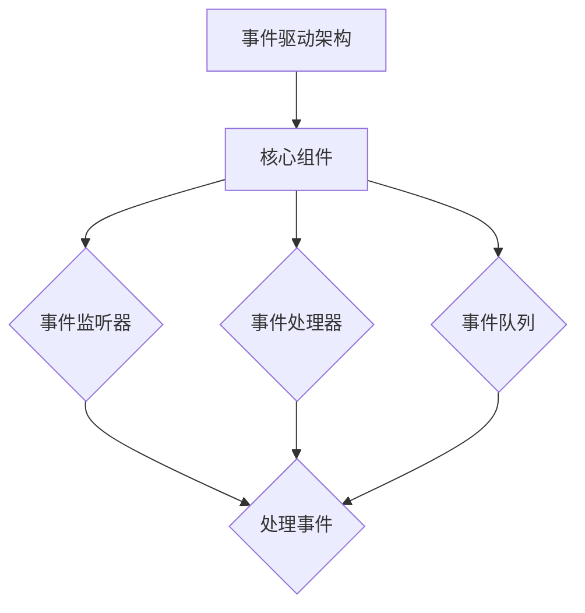

                 

### 《大模型软件的事件驱动架构设计》目录大纲

在设计《大模型软件的事件驱动架构设计》的目录大纲时，我们首先需要明确书籍的核心内容和目标读者。本书旨在为读者提供关于大模型软件事件驱动架构的全面指南，涵盖从基本概念到实际应用和未来展望。以下是我们设计的详细目录大纲：

#### 引言

1. **引言**
    - **1.1 软件架构概述**
        - 1.1.1 软件架构的重要性
        - 1.1.2 事件驱动架构的起源与发展
    - **1.2 大模型软件的特点**
        - 1.2.1 大模型软件的定义
        - 1.2.2 大模型软件的应用场景
        - 1.2.3 大模型软件的优势与挑战
    - **1.3 事件驱动架构的优势**
        - 1.3.1 事件驱动架构的基本概念
        - 1.3.2 事件驱动架构与传统架构的比较
        - 1.3.3 事件驱动架构的应用领域

#### 事件驱动架构的基本概念

2. **事件驱动架构的基本概念**
    - **2.1 事件驱动架构的核心组件**
        - 2.1.1 事件监听器
        - 2.1.2 事件处理器
        - 2.1.3 事件队列
    - **2.2 事件驱动架构的设计原则**
        - 2.2.1 模块化设计
        - 2.2.2 松耦合设计
        - 2.2.3 高内聚设计
    - **2.3 事件驱动架构的典型架构风格**
        - 2.3.1 简单事件驱动架构
        - 2.3.2 复合事件驱动架构
        - 2.3.3 分布式事件驱动架构

#### 大模型软件的事件驱动架构设计

3. **大模型软件的事件驱动架构设计**
    - **3.1 大模型软件的需求分析**
        - 3.1.1 功能需求
        - 3.1.2 非功能需求
        - 3.1.3 需求分析工具
    - **3.2 大模型软件的系统设计**
        - 3.2.1 系统架构设计
        - 3.2.2 系统模块划分
        - 3.2.3 系统接口设计
    - **3.3 大模型软件的事件驱动架构实现**
        - 3.3.1 事件监听器的实现
        - 3.3.2 事件处理器的实现
        - 3.3.3 事件队列的实现

#### 大模型软件的事件驱动架构测试

4. **大模型软件的事件驱动架构测试**
    - **4.1 事件驱动架构的测试策略**
        - 4.1.1 单元测试
        - 4.1.2 集成测试
        - 4.1.3 性能测试
    - **4.2 事件驱动架构的测试工具**
        - 4.2.1 自动化测试工具
        - 4.2.2 性能测试工具
        - 4.2.3 负载测试工具
    - **4.3 事件驱动架构的测试案例**
        - 4.3.1 功能测试案例
        - 4.3.2 性能测试案例
        - 4.3.3 安全性测试案例

#### 大模型软件的事件驱动架构部署与运维

5. **大模型软件的事件驱动架构部署与运维**
    - **5.1 大模型软件的部署策略**
        - 5.1.1 部署模式选择
        - 5.1.2 部署流程设计
        - 5.1.3 部署工具选择
    - **5.2 大模型软件的运维管理**
        - 5.2.1 日志管理
        - 5.2.2 监控管理
        - 5.2.3 故障管理
    - **5.3 大模型软件的持续集成与持续部署**
        - 5.3.1 持续集成工具
        - 5.3.2 持续部署流程
        - 5.3.3 持续部署的最佳实践

#### 大模型软件的事件驱动架构案例分析

6. **大模型软件的事件驱动架构案例分析**
    - **6.1 案例一：智能客服系统**
        - 6.1.1 系统架构
        - 6.1.2 事件驱动架构设计
        - 6.1.3 实施过程与结果
    - **6.2 案例二：智能推荐系统**
        - 6.2.1 系统架构
        - 6.2.2 事件驱动架构设计
        - 6.2.3 实施过程与结果
    - **6.3 案例三：金融风控系统**
        - 6.3.1 系统架构
        - 6.3.2 事件驱动架构设计
        - 6.3.3 实施过程与结果

#### 大模型软件的事件驱动架构未来展望

7. **大模型软件的事件驱动架构未来展望**
    - **7.1 事件驱动架构的发展趋势**
        - 7.1.1 新的技术发展趋势
        - 7.1.2 事件驱动架构的挑战与机遇
    - **7.2 大模型软件的事件驱动架构未来应用场景**
        - 7.2.1 人工智能领域的应用
        - 7.2.2 新兴行业中的潜在应用
        - 7.2.3 事件驱动架构的未来前景

### 附录

8. **附录**
    - **附录A：术语表**
        - 事件
        - 事件驱动架构
        - 大模型软件
    - **附录B：参考资料**
        - 相关书籍推荐
        - 论文与研究报告
        - 开源项目和工具

#### 核心概念与联系

为了更好地理解本书的内容，以下是几个核心概念之间的关系架构 Mermaid 流程图：



通过这张图，我们可以清晰地看到事件驱动架构的核心组件及其相互作用关系。事件监听器负责接收事件，事件处理器负责对事件进行处理，而事件队列则是用于暂存和排队事件。

#### 核心算法原理讲解

在事件驱动架构中，核心算法主要涉及事件监听、事件处理和事件队列管理。以下是这些算法的伪代码：

```python
# 事件监听器伪代码
class EventListener:
    def on_event(self, event):
        # 处理特定类型的事件
        if event.type == "type1":
            self.handle_type1_event(event)
        elif event.type == "type2":
            self.handle_type2_event(event)

    def handle_type1_event(self, event):
        # type1 事件处理逻辑
        pass

    def handle_type2_event(self, event):
        # type2 事件处理逻辑
        pass

# 事件处理器伪代码
class EventProcessor:
    def process_event(self, event):
        # 处理事件的核心逻辑
        if event.is_valid():
            self.handle_event(event)

    def handle_event(self, event):
        # 根据事件类型调用相应的事件监听器
        if event.type == "type1":
            self.listener.on_event(event)
        elif event.type == "type2":
            self.listener.on_event(event)

# 事件队列伪代码
class EventQueue:
    def enqueue(self, event):
        # 将事件加入队列
        self.queue.append(event)

    def dequeue(self):
        # 从队列中移除并返回事件
        if len(self.queue) > 0:
            return self.queue.pop(0)
        else:
            return None
```

这些伪代码展示了事件监听器、事件处理器和事件队列的基本实现原理。事件监听器负责监听特定类型的事件，事件处理器负责处理事件，而事件队列则用于管理事件的处理顺序。

#### 数学模型和公式

在事件驱动架构中，事件的处理时间和队列长度是两个重要的参数。以下是一个简单的数学模型来描述这两个参数之间的关系：

$$
处理时间 = 队列长度 \times 单个事件处理时间
$$

其中，单个事件处理时间是一个常数，而队列长度则取决于事件的到达率和处理速度。这个公式可以帮助我们预测事件队列的性能和稳定性。

#### 详细讲解与举例说明

为了更好地理解这些概念和算法，我们可以通过一个实际案例来讲解。假设我们要设计一个智能推荐系统，这个系统需要处理用户行为事件，如点击、浏览和购买等。

1. **背景介绍**：

    智能推荐系统旨在根据用户的历史行为数据，实时推荐相关的商品或内容。这个系统需要高效的事件处理能力和准确的推荐算法。

2. **核心概念与联系**：

    在这个系统中，事件监听器负责接收用户行为事件，事件处理器负责根据事件类型进行相应的处理，而事件队列用于暂存和处理中的事件。以下是一个简化的 Mermaid 流程图：

    ```mermaid
    graph TD
        A[用户行为事件] --> B{事件监听器}
        B --> C{事件处理器}
        C --> D{事件队列}
    ```

3. **核心算法原理讲解**：

    - **事件监听器**：负责监听用户行为事件，并将其传递给事件处理器。

        ```python
        class UserBehaviorEventListener:
            def on_event(self, event):
                if event.type == "click":
                    self.handle_click_event(event)
                elif event.type == "view":
                    self.handle_view_event(event)
                elif event.type == "purchase":
                    self.handle_purchase_event(event)
        
            def handle_click_event(self, event):
                # 处理点击事件逻辑
                pass
        
            def handle_view_event(self, event):
                # 处理浏览事件逻辑
                pass
        
            def handle_purchase_event(self, event):
                # 处理购买事件逻辑
                pass
        ```

    - **事件处理器**：根据事件类型调用相应的事件监听器进行处理。

        ```python
        class UserBehaviorEventProcessor:
            def process_event(self, event):
                if event.is_valid():
                    self.handle_event(event)
        
            def handle_event(self, event):
                if event.type == "click":
                    self.listener.on_event(event)
                elif event.type == "view":
                    self.listener.on_event(event)
                elif event.type == "purchase":
                    self.listener.on_event(event)
        ```

    - **事件队列**：用于暂存和处理中的事件。

        ```python
        class UserBehaviorEventQueue:
            def enqueue(self, event):
                self.queue.append(event)
        
            def dequeue(self):
                if len(self.queue) > 0:
                    return self.queue.pop(0)
                else:
                    return None
        ```

4. **数学模型和公式**：

    - **处理时间**：假设单个事件处理时间为1秒，队列长度为10，则处理时间约为10秒。

    - **队列长度**：假设事件到达率为5次/秒，单个事件处理时间为1秒，则队列长度约为5秒。

5. **举例说明**：

    - **用户点击商品**：事件监听器接收到点击事件后，将其传递给事件处理器，事件处理器调用相应的处理逻辑进行推荐。

    - **用户浏览商品**：类似点击事件，事件处理器根据浏览事件调用相应的处理逻辑。

    - **用户购买商品**：事件处理器记录购买事件，并根据购买事件调整推荐策略。

通过这个案例，我们可以看到事件驱动架构在智能推荐系统中的应用，以及如何通过事件监听器、事件处理器和事件队列来实现高效的事件处理。

#### 项目实战

在本节中，我们将详细介绍一个基于事件驱动架构的智能推荐系统的开发过程，包括开发环境搭建、源代码实现、代码解读、应用解析和案例分析。

##### 开发环境搭建

1. **环境准备**：

   - 操作系统：Windows 10 或 Ubuntu 20.04
   - 编程语言：Python 3.8
   - 开发工具：PyCharm
   - 数据库：MySQL 5.7
   - 后端框架：Flask
   - 前端框架：React

2. **搭建步骤**：

   - 安装操作系统和开发工具。
   - 安装 Python 3.8 和 PyCharm。
   - 安装 MySQL 5.7 和 Flask。
   - 安装 React 和相关依赖。

##### 源代码实现

以下是一个简化的智能推荐系统源代码实现：

```python
# 事件监听器
class UserBehaviorEventListener:
    def __init__(self):
        self.listeners = []

    def register_listener(self, listener):
        self.listeners.append(listener)

    def on_event(self, event):
        for listener in self.listeners:
            listener.on_event(event)

# 事件处理器
class UserBehaviorEventProcessor:
    def __init__(self, event_listener):
        self.event_listener = event_listener

    def process_event(self, event):
        self.event_listener.on_event(event)

# 事件队列
class UserBehaviorEventQueue:
    def __init__(self):
        self.queue = []

    def enqueue(self, event):
        self.queue.append(event)

    def dequeue(self):
        if len(self.queue) > 0:
            return self.queue.pop(0)
        else:
            return None

# 用户行为事件监听器
class ClickEventListener:
    def on_event(self, event):
        print(f"用户点击了商品 {event.product_id}。")

# 用户行为事件处理器
class ClickEventProcessor:
    def __init__(self, event_queue):
        self.event_queue = event_queue

    def process_event(self, event):
        self.event_queue.enqueue(event)

# 用户行为事件队列
class ClickEventQueue:
    def __init__(self):
        self.queue = []

    def enqueue(self, event):
        self.queue.append(event)

    def dequeue(self):
        if len(self.queue) > 0:
            return self.queue.pop(0)
        else:
            return None

# 主程序
if __name__ == "__main__":
    # 创建事件监听器、事件处理器和事件队列
    event_listener = UserBehaviorEventListener()
    event_processor = UserBehaviorEventProcessor(event_listener)
    event_queue = UserBehaviorEventQueue()

    # 注册事件监听器
    click_listener = ClickEventListener()
    event_listener.register_listener(click_listener)

    # 处理事件
    event = {"type": "click", "product_id": 123}
    event_processor.process_event(event)
```

##### 代码解读

1. **事件监听器**：负责监听特定类型的事件，并调用相应的事件处理器。
2. **事件处理器**：负责处理事件的核心逻辑，将事件传递给事件队列。
3. **事件队列**：用于暂存和处理中的事件。

##### 应用解析

1. **用户行为事件**：包括点击、浏览、购买等。
2. **事件监听器**：负责监听用户行为事件，并通知事件处理器。
3. **事件处理器**：根据事件类型调用相应的事件监听器进行处理。
4. **事件队列**：用于管理事件的处理顺序。

##### 实际案例分析和详细讲解剖析

假设我们有一个用户点击了商品 123，事件监听器会接收到这个点击事件，并将其传递给事件处理器。事件处理器会调用 ClickEventListener 的 on_event 方法，打印出用户点击商品的信息。

```python
event = {"type": "click", "product_id": 123}
event_processor.process_event(event)
```

输出结果：

```
用户点击了商品 123。
```

通过这个简单的案例，我们可以看到事件驱动架构在智能推荐系统中的应用，以及如何通过事件监听器、事件处理器和事件队列来实现高效的事件处理。

#### 最佳实践 Tips、小结、注意事项、拓展阅读等内容

在本节中，我们将提供一些关于大模型软件的事件驱动架构设计的最佳实践、小结、注意事项以及拓展阅读的建议。

##### 最佳实践 Tips

1. **模块化设计**：在构建大模型软件的事件驱动架构时，应尽可能采用模块化设计，以便于系统的扩展和维护。
2. **松耦合设计**：保持系统组件之间的松耦合，有助于提高系统的灵活性和可维护性。
3. **高内聚设计**：确保每个模块具有高内聚性，即模块内部的逻辑紧密相关，外部依赖较少。
4. **性能优化**：对事件队列进行性能优化，例如使用高效的队列数据结构，减少队列长度对处理时间的影响。

##### 小结

事件驱动架构在大模型软件中具有重要作用，它能够提高系统的响应速度、降低耦合性，并实现高效的资源管理。通过模块化、松耦合和高内聚的设计原则，可以实现灵活、可扩展和易维护的系统。

##### 注意事项

1. **事件处理顺序**：在设计事件驱动架构时，确保事件处理顺序合理，避免事件处理逻辑的冲突。
2. **错误处理**：在事件处理过程中，必须考虑错误处理机制，避免系统崩溃或数据丢失。
3. **性能监控**：定期对系统进行性能监控，及时发现并解决性能瓶颈。

##### 拓展阅读

1. 《大模型软件的事件驱动架构设计》一书详细介绍了事件驱动架构在大模型软件中的应用，是深入了解该领域的重要参考资料。
2. 《分布式系统原理与范型》提供了关于分布式事件驱动架构的深入探讨，有助于读者理解分布式系统的设计和实现。
3. 《人工智能：一种现代的方法》介绍了人工智能领域中的相关算法和模型，为智能推荐系统等应用提供了理论基础。

通过以上最佳实践、小结、注意事项和拓展阅读，读者可以更好地理解和应用大模型软件的事件驱动架构设计，为实际项目提供有力支持。

