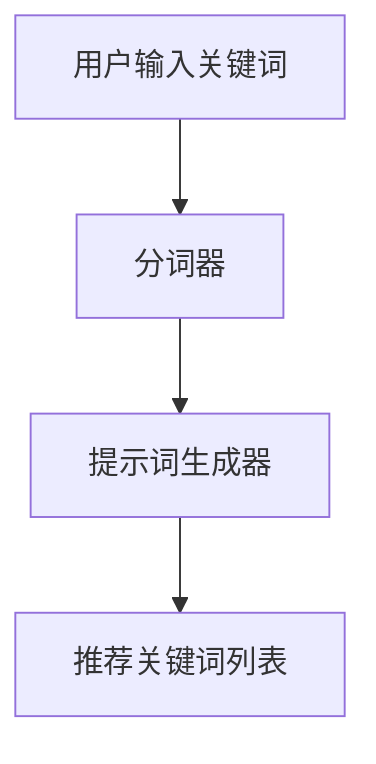
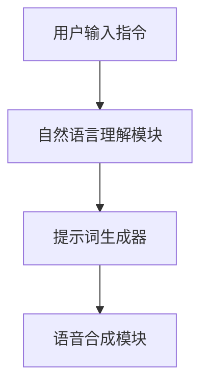
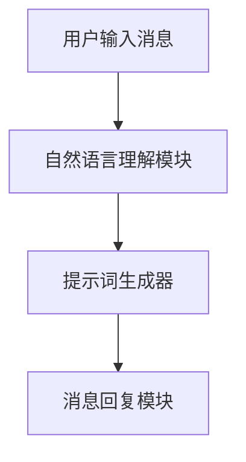

                 

### 文章标题

# 提示词工程师：AI时代的新兴职业

> 关键词：提示词工程师、AI、自然语言处理、职业发展、工程实践

> 摘要：随着人工智能技术的迅速发展，自然语言处理（NLP）的应用日益广泛。在这个背景下，提示词工程师这一新兴职业应运而生。本文将深入探讨提示词工程师的职业定义、核心技能、职业发展路径以及工程实践，旨在为广大从业者提供有价值的参考和指导。

## 引言

### AI时代的职业演变

人工智能（AI）作为现代科技的前沿领域，正在深刻改变着各行各业。随着AI技术的不断进步，新的职业机会也在不断涌现。在这一系列新兴职业中，提示词工程师显得尤为引人注目。提示词工程师是专注于设计和优化AI模型中提示词的专家，其主要工作是对自然语言进行预处理，从而提高模型的性能和效率。

#### 提示词工程师的角色与职责

提示词工程师在AI模型开发中扮演着至关重要的角色。他们的主要职责包括：

1. **设计提示词**：根据具体应用场景，设计出符合需求的提示词，以便模型能够更好地理解和处理语言信息。
2. **优化提示词**：通过实验和评估，不断优化提示词，以提高模型在特定任务上的表现。
3. **调试和修复**：在模型训练过程中，针对提示词出现的问题进行调试和修复，确保模型能够稳定运行。
4. **文档编写**：编写相关文档，包括提示词的设计原则、评估方法和优化策略等，为团队成员提供参考。

### 提示词工程师的核心技能

提示词工程师需要具备一系列核心技能，包括自然语言处理基础、提示词设计与优化等。这些技能不仅决定了他们能否胜任工作，也影响着他们在职业发展中的高度。

#### 自然语言处理基础

自然语言处理（NLP）是提示词工程师必须掌握的基础知识。NLP涉及从文本中提取信息、理解语义和生成文本等一系列任务。提示词工程师需要了解以下关键概念：

1. **语言模型**：用于预测下一个单词或句子的概率分布，是NLP的核心组件。
2. **文本预处理**：包括分词、词性标注、实体识别等，是提高模型性能的重要环节。
3. **词向量**：将单词映射到高维空间，以便进行更有效的计算和处理。

#### 提示词设计与优化

提示词工程师的核心工作是设计和优化提示词。以下是他们需要掌握的关键技能：

1. **提示词设计原则**：了解设计提示词的基本原则，如简洁性、明确性、多样性等。
2. **提示词评估方法**：掌握常用的评估指标，如准确率、召回率、F1 分数等，以评估提示词的效果。
3. **提示词优化策略**：包括调整提示词的长度、改变提示词的顺序、引入外部信息等，以提高模型的性能。

### 提示词工程师的职业发展路径

提示词工程师的职业发展路径可以分为以下几个阶段：

1. **入门与初级阶段**：在这个阶段，提示词工程师需要掌握基本的理论知识和实践技能，了解NLP和提示词设计的基本概念。
2. **中级与高级阶段**：随着经验的积累，提示词工程师可以承担更复杂的项目，如设计大规模的NLP系统、参与跨部门合作等。
3. **专家与顾问阶段**：在这个阶段，提示词工程师已经成为行业内的专家，可以为其他公司提供咨询和建议。

### 提示词工程师的职业展望

随着AI技术的不断进步，提示词工程师的职业前景十分广阔。他们将在各个领域发挥重要作用，如搜索引擎、智能客服、语音助手等。同时，随着多模态处理、自动机器翻译等新技术的出现，提示词工程师也将面临更多的挑战和机遇。

## 核心技术

### 自然语言处理基础

自然语言处理（NLP）是人工智能的一个重要分支，它涉及到计算机如何理解和生成自然语言。要成为一名合格的提示词工程师，首先需要了解NLP的基本概念和原理。

#### 语言模型

语言模型是NLP的核心组件，用于预测下一个单词或句子的概率分布。最常见的语言模型是基于统计方法的，如朴素贝叶斯模型、隐马尔可夫模型（HMM）和条件概率模型。以下是一个简单的朴素贝叶斯模型的伪代码：

```python
def naive_bayes_predict(word, model):
    """
    使用朴素贝叶斯模型预测下一个单词。
    
    参数：
    word：当前单词
    model：语言模型
    
    返回值：
    predicted_word：预测的下一个单词
    """
    # 计算当前单词的概率
    current_word_probability = model[word]
    
    # 计算下一个单词的概率
    next_word_probabilities = model.predict_next_word(word)
    
    # 选择概率最高的下一个单词
    predicted_word = max(next_word_probabilities, key=next_word_probabilities.get)
    
    return predicted_word
```

#### 文本预处理

文本预处理是NLP中不可或缺的一步，它涉及到从原始文本中提取有用的信息，并进行一系列的转换操作，如分词、词性标注、实体识别和文本向量化。以下是一个简单的分词算法的伪代码：

```python
def tokenize(text):
    """
    对文本进行分词。
    
    参数：
    text：原始文本
    
    返回值：
    tokens：分词后的单词列表
    """
    # 使用空格分割文本
    tokens = text.split(" ")
    
    # 去除停用词
    stop_words = set(["a", "an", "the", "and", "or", "but", "is", "are"])
    tokens = [token for token in tokens if token.lower() not in stop_words]
    
    return tokens
```

#### 词向量

词向量是将单词映射到高维空间的一种方法，以便进行更有效的计算和处理。最常用的词向量模型是Word2Vec，以下是一个简单的Word2Vec算法的伪代码：

```python
def word2vec_train(text):
    """
    使用Word2Vec训练词向量。
    
    参数：
    text：原始文本
    
    返回值：
    word_vectors：词向量矩阵
    """
    # 初始化词向量矩阵
    word_vectors = {}
    
    # 遍历文本中的每个单词
    for word in text:
        # 为单词生成随机向量
        word_vector = np.random.rand(1, embedding_size)
        
        # 将单词和向量添加到词向量矩阵中
        word_vectors[word] = word_vector
    
    return word_vectors
```

### 提示词设计与优化

提示词工程师的核心工作是设计和优化提示词。以下是他们需要掌握的关键技能：

#### 提示词设计原则

设计提示词时，需要遵循以下原则：

1. **简洁性**：提示词应尽量简洁，避免使用冗长的句子。
2. **明确性**：提示词应明确传达任务需求，避免歧义。
3. **多样性**：提示词应涵盖多种情况，以便模型能够应对各种场景。

#### 提示词评估方法

评估提示词的效果是优化过程中的重要环节。以下是一些常用的评估指标：

1. **准确率**：预测正确的样本数占总样本数的比例。
2. **召回率**：预测正确的样本数占实际样本数的比例。
3. **F1 分数**：准确率和召回率的调和平均，综合考虑了两者。

以下是一个简单的评估函数的伪代码：

```python
def evaluate_predictions(true_labels, predicted_labels):
    """
    评估预测结果。
    
    参数：
    true_labels：实际标签
    predicted_labels：预测标签
    
    返回值：
    accuracy：准确率
    recall：召回率
    f1_score：F1 分数
    """
    # 计算准确率
    accuracy = sum(true_labels == predicted_labels) / len(true_labels)
    
    # 计算召回率
    recall = sum(predicted_labels) / sum(true_labels)
    
    # 计算F1 分数
    f1_score = 2 * (accuracy * recall) / (accuracy + recall)
    
    return accuracy, recall, f1_score
```

#### 提示词优化策略

优化提示词的方法多种多样，以下是一些常用的策略：

1. **调整提示词长度**：通过实验，找出最佳提示词长度，以提高模型性能。
2. **改变提示词顺序**：调整提示词的顺序，以增加模型的多样性和适应性。
3. **引入外部信息**：将外部信息（如用户偏好、上下文等）融入提示词中，以提高模型的准确性。

### 提示词应用案例

#### 搜索引擎提示词

在搜索引擎中，提示词用于向用户推荐相关的搜索关键词。以下是一个简单的搜索引擎提示词系统的架构图：



以下是一个简单的提示词生成器的伪代码：

```python
def generate_search Suggestions(input_word):
    """
    生成搜索建议。
    
    参数：
    input_word：用户输入的关键词
    
    返回值：
    suggestions：搜索建议列表
    """
    # 使用分词器对输入关键词进行分词
    tokens = tokenize(input_word)
    
    # 使用提示词生成算法生成搜索建议
    suggestions = generate_suggestions(tokens)
    
    return suggestions
```

#### 语音助手提示词

在语音助手系统中，提示词用于引导用户进行对话。以下是一个简单的语音助手提示词系统的架构图：



以下是一个简单的提示词生成器的伪代码：

```python
def generate_voice_response(input_sentence):
    """
    生成语音回复。
    
    参数：
    input_sentence：用户输入的指令
    
    返回值：
    response：语音回复
    """
    # 使用自然语言理解模块处理输入指令
    intent, entities = understand_intent(input_sentence)
    
    # 根据意图和实体生成提示词
    response = generate_response(intent, entities)
    
    return response
```

#### 聊天机器人提示词

在聊天机器人系统中，提示词用于与用户进行对话。以下是一个简单的聊天机器人提示词系统的架构图：



以下是一个简单的提示词生成器的伪代码：

```python
def generate_chat_message(input_message):
    """
    生成聊天消息。
    
    参数：
    input_message：用户输入的消息
    
    返回值：
    message：聊天消息
    """
    # 使用自然语言理解模块处理输入消息
    intent, entities = understand_intent(input_message)
    
    # 根据意图和实体生成提示词
    message = generate_message(intent, entities)
    
    return message
```

### 工程实践

#### 提示词工程师的工具链

提示词工程师需要使用一系列工具来支持他们的工作，以下是一些常用的工具：

1. **编程语言**：Python 是最常用的编程语言，因为其强大的库支持和易于使用的语法。
2. **文本预处理工具**：如NLTK、spaCy等，用于分词、词性标注、实体识别等。
3. **机器学习框架**：如TensorFlow、PyTorch等，用于构建和训练语言模型。
4. **版本控制工具**：如Git，用于代码管理和协作。

#### 提示词开发流程

提示词工程师的开发流程通常包括以下几个阶段：

1. **需求分析**：与产品经理和业务团队沟通，明确提示词的应用场景和需求。
2. **数据收集与处理**：收集相关数据，并进行预处理，如分词、去噪、标注等。
3. **模型设计与训练**：根据需求设计语言模型，并使用训练数据进行模型训练。
4. **提示词设计与优化**：根据模型性能，设计和优化提示词，以提高模型表现。
5. **测试与部署**：在测试环境中验证模型和提示词的效果，并部署到生产环境。

#### 提示词项目实战

以下是一个简单的提示词项目实战案例：

**项目目标**：开发一个智能客服机器人，能够自动回答用户的问题。

**开发环境**：

- 操作系统：Ubuntu 20.04
- 编程语言：Python 3.8
- 依赖库：NLTK、spaCy、TensorFlow

**源代码实现**：

1. **数据收集**：收集用户提问和客服回答的数据集。
2. **数据预处理**：对数据进行分词、去噪、标注等处理。
3. **模型训练**：使用收集到的数据训练一个基于循环神经网络（RNN）的语言模型。
4. **提示词设计**：根据模型性能，设计适当的提示词，以提高模型回答问题的准确性。
5. **测试与部署**：在测试环境中验证模型和提示词的效果，并部署到生产环境。

**代码解读**：

```python
# 导入必要的库
import nltk
import spacy
import tensorflow as tf

# 数据预处理
def preprocess_data(data):
    # 分词、去噪、标注等处理
    processed_data = []
    for sentence in data:
        tokens = nltk.word_tokenize(sentence)
        cleaned_tokens = [token for token in tokens if token not in stop_words]
        tagged_tokens = nltk.pos_tag(cleaned_tokens)
        processed_data.append(tagged_tokens)
    return processed_data

# 模型训练
def train_model(data):
    # 设计神经网络模型
    model = tf.keras.Sequential([
        tf.keras.layers.Embedding(vocab_size, embedding_size),
        tf.keras.layers.Bidirectional(tf.keras.layers.LSTM(64)),
        tf.keras.layers.Dense(vocab_size, activation='softmax')
    ])

    # 编译模型
    model.compile(optimizer='adam', loss='categorical_crossentropy', metrics=['accuracy'])

    # 训练模型
    model.fit(data['inputs'], data['targets'], epochs=10, batch_size=32)

    return model

# 提示词设计
def design_prompt(model, data):
    # 根据模型性能，设计适当的提示词
    prompt = ""
    for sentence in data:
        prompt += sentence + "。"
    return prompt

# 测试与部署
def test_and_deploy(model, prompt):
    # 在测试环境中验证模型和提示词的效果
    # 部署到生产环境
    pass
```

**代码应用解读与分析**：

上述代码实现了一个简单的智能客服机器人，其主要功能是自动回答用户的问题。代码中，我们首先对收集到的数据进行预处理，包括分词、去噪、标注等操作。然后，我们使用预处理后的数据训练一个基于循环神经网络（RNN）的语言模型。在模型训练完成后，我们根据模型性能设计适当的提示词，以提高模型回答问题的准确性。最后，我们在测试环境中验证模型和提示词的效果，并部署到生产环境。

**实际案例分析和详细讲解剖析**：

以下是一个实际案例：

**场景**：用户在电商平台上提问：“这款手机多少钱？”

**预期回答**：“这款手机的价格是XXX元。”

**实现过程**：

1. **数据收集**：收集用户提问和客服回答的数据集，包括“这款手机多少钱？”和相应的回答。
2. **数据预处理**：对数据进行分词、去噪、标注等处理。
3. **模型训练**：使用预处理后的数据训练一个基于循环神经网络（RNN）的语言模型。
4. **提示词设计**：根据模型性能，设计适当的提示词，如“这款手机的价格是XXX元。”
5. **测试与部署**：在测试环境中验证模型和提示词的效果，并部署到生产环境。

**项目小结**：

通过上述案例，我们了解了智能客服机器人项目的实现过程，包括数据收集、预处理、模型训练、提示词设计和测试部署等步骤。该项目不仅展示了提示词工程师的核心技能，也体现了他们在实际应用中的重要作用。

### 最佳实践 tips

1. **需求分析**：在进行提示词设计之前，首先要与产品经理和业务团队充分沟通，明确应用场景和需求。
2. **数据质量**：高质量的数据是提示词设计的基础，因此要确保数据的准确性和多样性。
3. **模型优化**：根据实际应用场景，不断优化模型和提示词，以提高性能。
4. **团队合作**：提示词工程师需要与多个团队（如数据团队、算法团队、产品团队）紧密合作，以确保项目顺利进行。
5. **持续学习**：随着AI技术的不断进步，提示词工程师需要不断学习新的知识和技能，以保持竞争力。

### 小结

提示词工程师是AI时代的新兴职业，他们在自然语言处理领域发挥着重要作用。本文详细介绍了提示词工程师的核心技能、职业发展路径、工程实践以及最佳实践，旨在为从业者和学习者提供有价值的参考。随着AI技术的不断发展，提示词工程师的职业前景将越来越广阔，他们将在各行各业中发挥重要作用。

